# P22：第20天：命令执行漏洞-远程代码执行及远程系统命令 - 网络安全就业推荐 - BV1Zu411s79i

做做过多的一个介绍，我们直接开始我们今天的一个课程内容吧，我们今天的话呃，讲的一个课程内容的话是这个命令执行，然后这个命令执行的话，其实呃跟我们之前讲讲web需要的时候，其实会有一些相同的一些东西。

就是呃大家如果理解了web shell的，他的一些工作原理的话，针对于这个命令执行，它的所涉及到的一些函数的话，大家应该会呃应该会比较容易理解，那我们本节课的话主要有这四块内容。

这一块的话是对我们命令执行这个漏洞，做一个基本的一个简介，第二个的话是对他的一个漏洞的一些利用，而第三个的话是针对这样的一个命令执行漏洞，的一些基本的一个防护的一些方法。

第四个的话是命令执行漏洞的一些实验，需要大家自己去进行一个操作，如果有必要的话，可以呃给大家做一个讲解，好的话，首先我们先来看一下命令执行漏洞的一个简介，我们先一起来了解一下它的这个漏洞。

它所产生的一个原因啊，概括的话就是这样子的一句话，就是说，应用它没有对用户输入做严格的检查过滤，导致用户输入的参数被当成命令来执行，好其实啊提到这个用户输入的话，大家可能也会想到蛇口注入这种对吧。

它同样的也是对我们的用户所提交的一个输入，它没有做严格的一个检测过滤，所以的话它会导致数据的一个泄露，以及呃，在这里的话就是会导致我们用户或者说攻击者，它所输入的一个参数。

或者是说字符串能够被当成命令来执行，然后的话就是呃关于这个漏洞的一个危害，主要的话呃有这三点，第一点的话，我们能够继承web服务器的一个呃权限，去执行系统的一个命令。

其实这个的话呃跟我们的一个web shell是啊一样的，这个的话是反弹，需要获得目标服务器的一个权限，第三个的话是呃进一步的一个内网渗透，因为我们想要进行一个内网渗透的话。

我们需要获得这样子的一个uh web share，通过web的一个漏洞来得到它的一个shell，然后的话再才能够去进一步的进行一个，内网渗透的一个工作，第三个的话就是呃呃主要的话介绍一下。

就是呃命令执行的两种，第一种的话就是一个远程的一个代码执行，第二种的话就是一个远程的一个命令执行，他们的话，他们的一个区别就在于，就是呃它的一个函数的一些调用是不一样的，因为业务的一些需求的话。

在这里的话，具体的话是在菲律宾当中，我们以菲律宾为例，在菲律宾当中的话，有时会需要调用这样的一些，执行命令的一个函数，比如说我们常见的ever asset，还有这pi以及replace正则的一个呃替换。

还有create function等等这样的一些函数，大家对后面对前面这两个应该是比较熟悉了吧，就是说在讲web share的时候没错，就是说啊web shell就是我们的一个一句话码的话。

其实也是用的p h p，他们这里的一些执行命令的一个函数，来去进行一个构造的，所以说啊其实呃从一个web shell的一个危害的话，我们也能够了解到命令执行漏洞，它的一个危害。

就是说我们能够得到服务器的一个权限，然后的话对它进行啊用啊，用户攻击者想要的一些操作，然后后面的两个函数的话呃，再等会会给大家做一个比较详细的一个介绍，嗯如果说存在这样子的一个使用这些函数。

然后的话没有对能够被用户控制的一个参数，进行检查过滤，那么这样子的一个页面，或者说这样子的一个功能点的话，就存在这样子的一个远程代码执行漏洞，那我们再来啊分别来呃介绍一下远程代码执行。

他所啊涉及到或者说经常见到的一些函数，首先第一个的话就是这个函数，前面其实我们就有了解到，就说i网函数的话，它是会把我们的一个呃传递的一个字符串，他会作为一个菲律宾代码去进行一个执行对吧。

他那个好形式的话就是像这样子的一个ever，就其实我们那一个一句话对吧，也是这样子的一个构造，l函数括号后面的话是接我们的一个呃字符串，当然的话在一句话码里面的话。

是这里的一个啊字符串的话是使用post，或者是说get的这种这种方法来去进行一个接收，就是说接收啊，有攻击者它的一个传递的一个字符串，也就是传递的一个命令，就是比如像这样子的对吧。

我们只需要像这样子的一个呃马执行啊，不传递一个呃像这一个cmd的一个参数传递啊，恶意的一个字符串就能够执行命令，然后的话呃这里的话只是一个以一个一句话，马的一个形式来去进行一个表示。

就是说如果在一个页面或者说它的一个功能，它有涉及到使用这样子的一个i o函数，而去执行命令的话，它就有可能会存在这样子的一个啊，命令执行的一个漏洞，然后这里要注意的一点，就是二维函数它传入的一个参数。

也就是它传入的这种字符串的话，它必须是一个菲律宾的一个代码，它采才会去进行一个执行解析，我们的一个呃一句话马其实也是这样子的对吧，就我们要传的话是要是一个菲律宾代码。

比如说我们常见的一个pp for对吧，它其实是一个呃以分号结尾的一个pp代码，然后的话这一个函数的话，它的一个这种语音结构的话是非常危险的，因为它是允许任意的执行，任意的一个菲律宾代码的。

如果说没有对他做这样子的一个过滤的话，对我们传递的这样子的一个参数，做一个过滤的话，它是能够执行任意的一个菲律宾代码的，所以的话就呃，如果说必须要去使用到这样子的一个函数的话。

就不要允许它传入任何没有经过验证，或者说没有经过过滤判断他的一个合法性的，这样的一些数据的话，是不要允许它去进行一个传入，这个的话就是呃一个set函数，这个函数的话其实也比较常见，据说这个函数的话啊。

他跟函数其实是比较类似的，sa函数的话，它是呃主要的是这个他会把这里的就是和啊，这里的一个字符串，如果这里是一个字符串的话，就是它是一个字符串类型的话，它就会把它当做当做一个菲律宾代码。

来去进行一个执行，然后这里跟error它不不一样的一个地方的话，就是说这里传入的一个字符串的话，它是啊直接去进行一个传入的，就，然后的话他就会把它当成一个，菲律宾代码来执行。

所以的话他是不需要去以分号结尾，也就是说他不需要是一个p h p的一个代码，然后我们的一个构造的话呃，以这样子的一个asset的一个一句话码，来进行一个表示，就是这样子的，呃然后的话呃。

前面这两个应该不要给大家做一个演示吧，这两个一句话码的话，大家应该都很熟悉了对吧，对于它的一个使用的话，这个art的art的一个意思的话，就是呃我们的一个ph代码里面的话，它有这样的。

就比如说我们这里有一个变量对吧，我们要传一个变量，但是你没有对这个变量做一个定义的话，它就会呃菲律宾它里面会有一个报错，就会有一个提示，当然的话它是不影响的，如果你加这样这样的一个ever的话。

它就会忽略这样子的一些错误，这里明明白吗，呃我们在后面的话再给大家做一个测试吧，后面的话会有涉及到，啊关于这两个函数它的一些一个呃操作演示，它的一个使用，应该不用我再去进行一个演示了吧，大家应该都熟吧。

这其实就是一个一句话嘛，然后的话它的一个原理，这种构造，这样子的一个一句换码的一个原理的话，就是使用的这样子的能够去进行一个执行呃，远程代码执行的这样的一个函数，好的，那么我们继续。

第三个的话就是这个p i g的一个replace函数，这个函数的话它是呃，用于执行一个正则表达式的一个搜索和替换，好我们看这样子它的这样子的一个价，它它是这样子的一个结构。

它是呃搜索这样子的一个subject，在你的一个字符串当中，它所匹配的这一个pattern的一个部分，然后的话以这里的一个replacement进行一个替换，可能这里的话不是很好理解。

我们看一下这样子的一个例子，这里的话就是使用的这样的一个p i e g的，这个正则表达式的一个搜索替换，所构造的这样子的一个一句话吧，看这里吧，看这里的一个中文的一个意思。

就是说这里的话就是一个正则的一个规则，然后的话这里是替换的一个字符，这里的话就是目标字符，目标字符的话，就是说我们要去搜索的这样的一个呃字符串，然后从这一个字符串里面搜索好。

符合这里写的一个正则规则的这样的一些字符，如果符合这个字符的话，就是符合这里正则规则，它所表示的一个字符的话，就会把它替换成，我们在这里所传的这样的一个字符，我们以这里的一个例子为例。

这里的话我们可以看到，这里的话是一个匹配test的一个嗯，正则就匹配啊，这里的一个字符串里面它是否包含有这个test，然后如果包含在一个test的话，它就会把这里的一个字符做一个替换，把它替换到这里。

好的话，这里它的一个呃，能够去执行命令的一个原理的话，就是这个杠一的一个参数，就是这个p c r e的一个修饰符，他是在p period这个p e r l的这个脚本语。

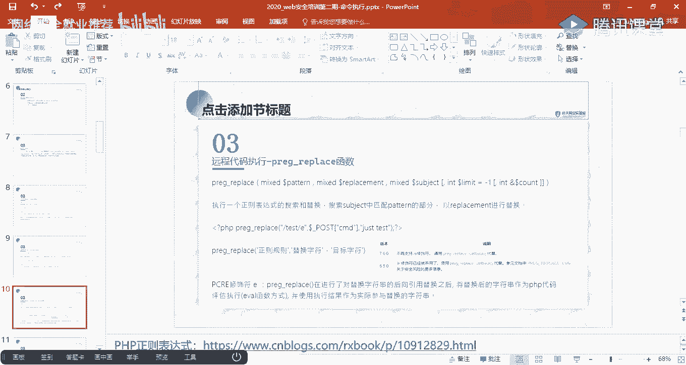

它当中的一个特性。

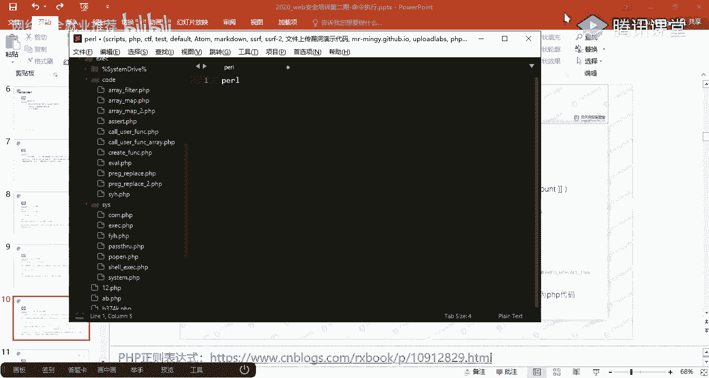

p r l这是一个脚本语，它的一个修饰符，这一个一这个一的一个修饰符的话，就是就是说啊，当这个函数它在对替换了一个字符进行一个反，应，已反向引用替换之后，然后这里的一个替换的一个字符。

它会它会把它当成一个菲律宾的一个代码，去进行一个执行，然后的话它的一个执行的一个方式的话，就是以这样的一个error函数，去进行一个ever的执行的一个方式，所以说我们这里传递的啊。

不是我们这里的一个替换后的一个字符串的话，是需要是啊一个菲律宾代码的一个形式，去进行一个呃传递，就比如说在在这里，我们需要传递一个p h p代码，传给这个sam d参数对吧，我们传给他之后的话。

它就会它就会呃在这里搜索这一个字符，搜索之后搜索到了这个test的字符对吧，就是匹配到了匹配到了这样的一个test字符，匹配到了之后，它会以这里的一个我们传递的这一个字符串，做一个呃替换替换。

替换的时候的话，他就会把这里这里他呃，这里你传递的这个字符串，作为一个菲律宾代码来进行一个执行，然后的话执行之后他的就说这里的一个函数，它执行之后的一个结果，它是啊。

它实际是以我们这里传递的这一个字符串，它执行的一个ph b代码之后返回的一个结果，作为一个呃它的一个结果，啊这里要注意的一点的话，就是它是呃有一个版本的一些限制的，就是说在5。五点版本之前的话。

是能够适用的，然后在5。五点这个版本之后的话，它是呃被弃用了。

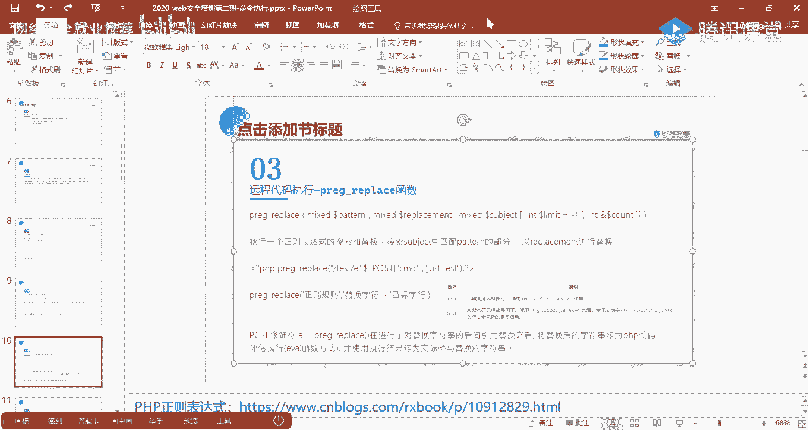

那这里的话我们呃以这样的一个例子。

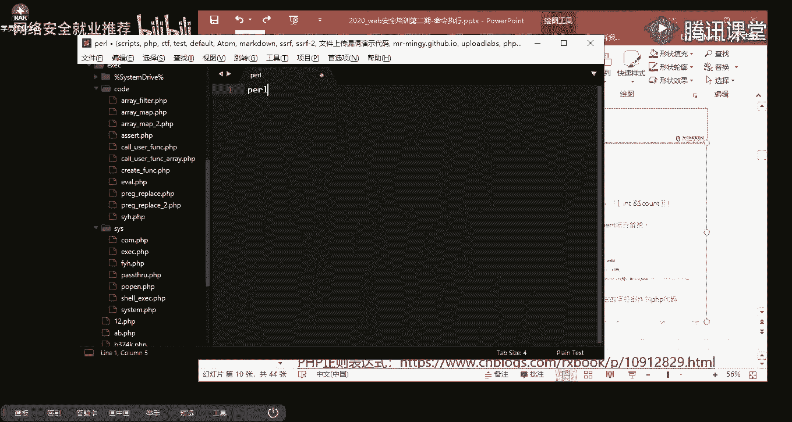

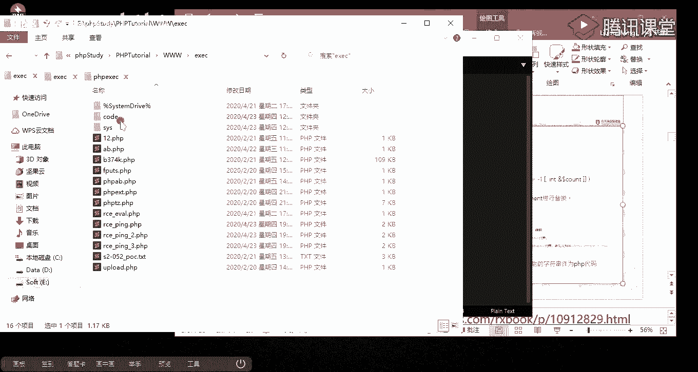

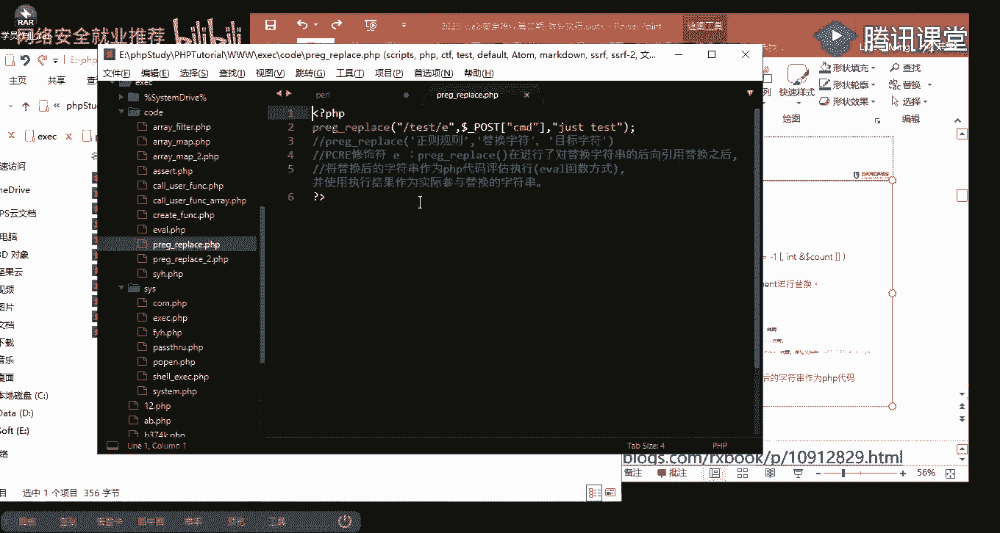

这句话我以这样子的一个例子为例，其实啊就是刚刚的那个马来进行一个演示。

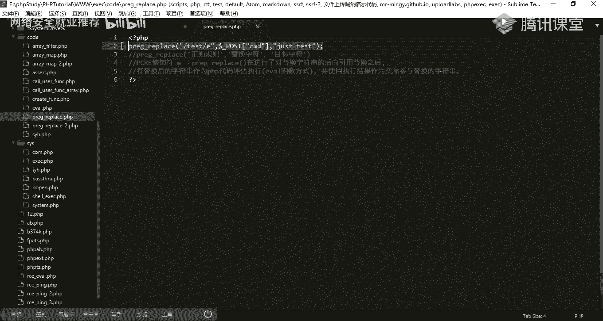

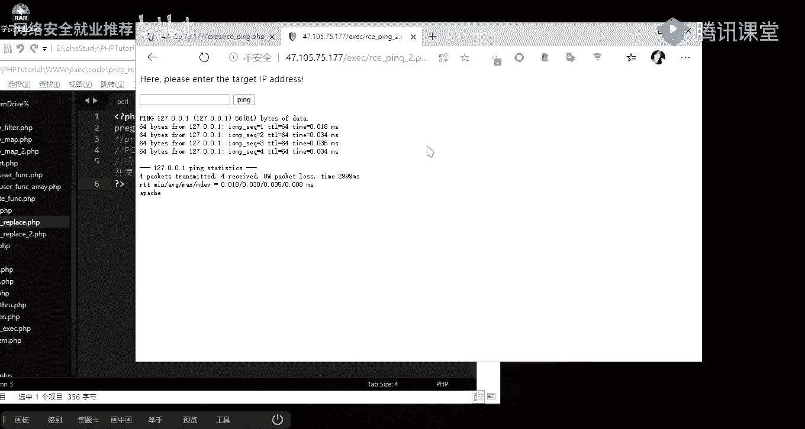

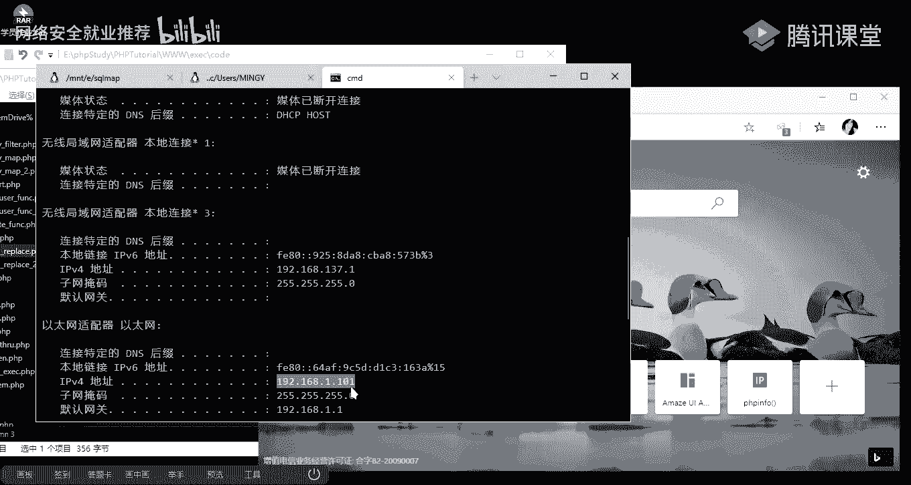

我们这里直接访问它，其实是我这句话是以一个一句话码的一个形式，来进行进行一个介绍，那我这里想要去让他执行。

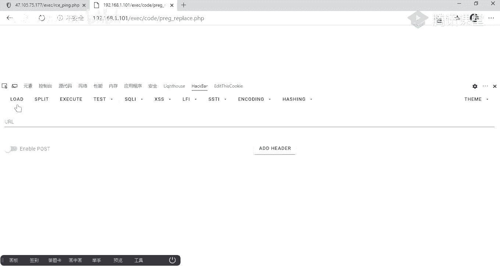

我这里传递的一个命令的话，我们其实跟我们去这里。

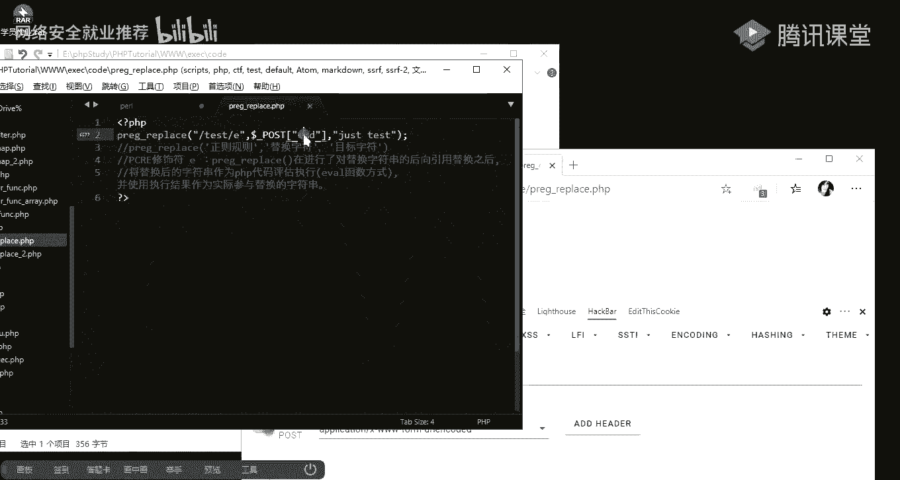

主要的话就传递这样子的一个cmd参数，然后的话我们需要传递我们的一个，菲律宾代码对吧，因为它是以一个ever的一个形式去执行，我们传递的这样的一个字符，对我们这里一个菲律宾for为例啊。

进行一个执行对吧，嗯没有问题的，好的话，我们执行这个system，执行系统命令的这样的一个函数啊，来执行一个外卖，可以看到它是跟我们的一个一句话吧。

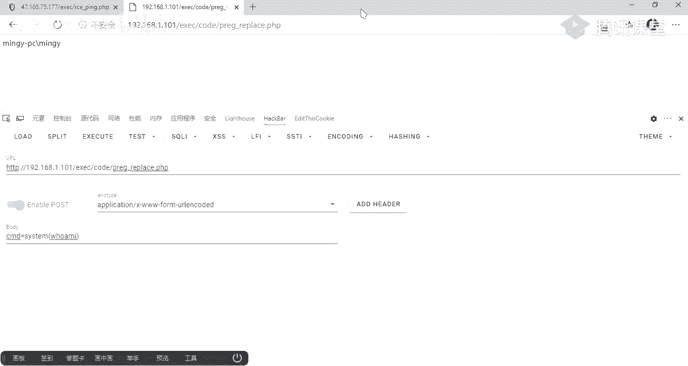

是。

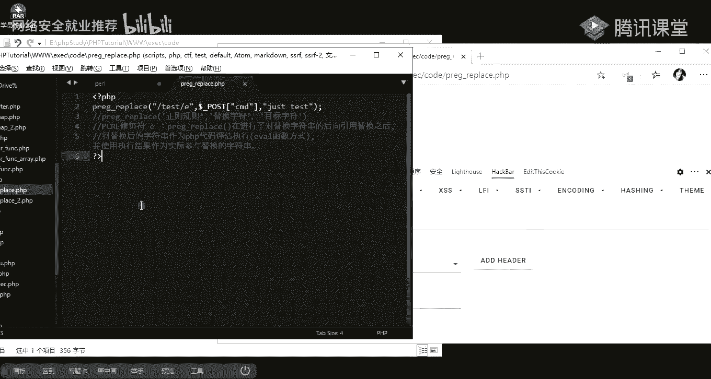

样子的，然后第四个的话就是这个ara，ara map这样的这样的一个函数，而这个函数的话它是，它的一个意思的话，我们以这一个例子来进行一个介绍，我们看一下这样的一个例子啊，这里这里的一个文字的话。

其实可能不是很好理解，主要的就是这一个这一句话，就是说为数组的每一个元素来应用，我们的这样的一个回调函数，我们以这这一个例子为例，我们这里首先呢定义了这样子的一个变量，对吧啊。

f u n c这样的一个变量，然后的话它是通过get的一个方式来获取啊，这样来来获取这个f u n c所传递的一个字符，然后同样的在一个sam比它cm d的一个变量的话。

它是以这个pose的方式来进行一个接收字符的，然后这里的话主要是这一个every map，这里这里他通过这样的一个嗯这一个函数，而我们前面这里的话，我们通过这一个get方式获取的一个。

参数的话它会把它传到这里来对吧，然后的话通过在这里，这里把我们的这里的一个cmd所嗯，这个变量传递给了这个error这个数组，然后传给他之后的话，它会传到这里来，传到这里来之后的话。

他这个函数它会调用呃，就是说如果我们在这里，它，是传递的一个函数，就说它会呃只使用这样的一个函数来去调用，好吧，是调用这样的一个函数来去执行，来去处理这里所传递的一个值，然后这里他传递的一个字符的话。

就是我们这里通过post的方法来去进行一个，传递的，然后的话再输出我们这里他说呃，所调用这里我们传递的一个函数，所执行的一个结果，就这里的话也是通过这一个ai map的这样的。

一个函数来构造的一个啊小马来构造的，一个命令执行的一个码，我们以这一个例子来做一个演示，remap，首先的话我们在这里的话需要传一个啊，以get方式来传一个。

这个像这个f u n c这个参数传递一个字符，那我们想要让它能够达到一个，一句话码的一个效果的话，我们在这里传递的这个字符的话，我们可以是呃，前面我们也说到了这样的一个命令，执行的一个函数。

首先呢我们先传一个get呃，像这个f u n c参数传递一个，比如说传递一个asset这样子的一个值，对这个词的话，它会把它传到这里来，然后的话我们再以post方式来传递一个值，我这里传递的一个值的话。

就是一个菲律宾的一个呃代码好，我们来去进行一个执行，可以看到这里的话是执行了这里的一个啊，pp info的一个呃命令，我们以这里我传递的一个值为例，来去对它这里的一个代码做一个理解。

就是我们这里通过get方式传递的，这样的一个asset，这个函数它会把它传到这里来，传到这里来之后的话，这个av map这个函数它就会对啊，数组的每一个元素进行一个回调。

然的话我们这里呃像这个ai这个数组的话，传递了这样子的一个值对吧，然后的话他的第一个值的话，就是这个我们这里用post的方式传递的，这样的一个值，也就是我们在这里的一个ph pf，这一个字符串对吧。

然后的话这gary map的话它就会呃，调用这里的我们这里传递的这一个asset，这个函数来对我们这里没这里的一个error，这个数组里面的每一个元素来进行一个调用，就是说来进行一个执行，执行里面的啊。

应该是说处理处理里面的这个，数组里面的每一个元素，然后的话就构造成了这样子的一个asset，执行我们的一个pp four的一个命令，呃比如说我在你的，可以看到是能够正常执行的好，这里的话大家有哦。

有没有什么问题呢，你能理解吗，拿去在这，大家能理解，我刚呃这里的这一这一个函数的一个例子吗，好我把这个，我忘了，咳咳，我把呃我忘了，把这个代码把它放到这个服务器上面去了，那可能呃。

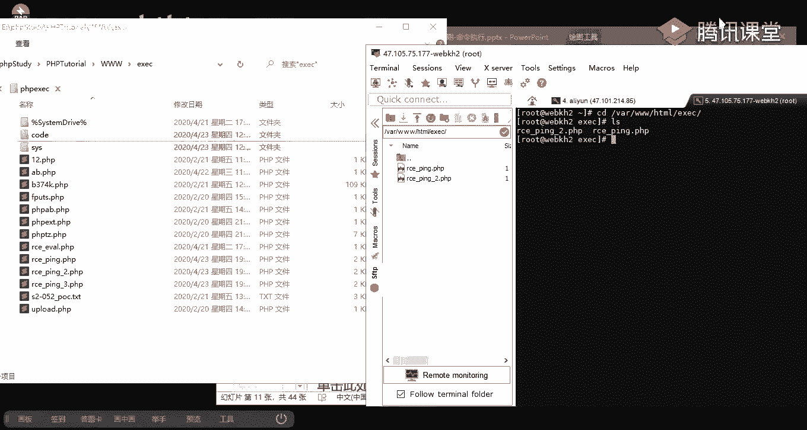

大家可以访问一下这一个，这个网址我是在x1 c下面的cod。

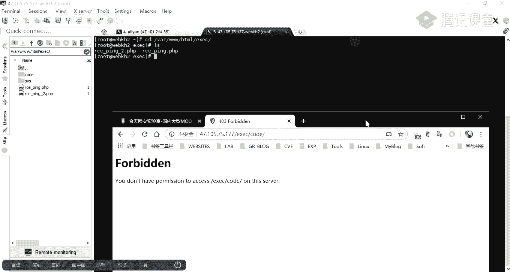

然后的话是呃，然后的话就是在后面的话，接我们这里所讲的这几个函数，比如说我以这一个map这个函数给你，你想要去进行一个操作啊，再然后的话在后面接一个p h p就能够访问到。

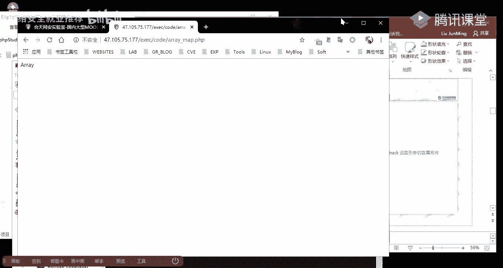

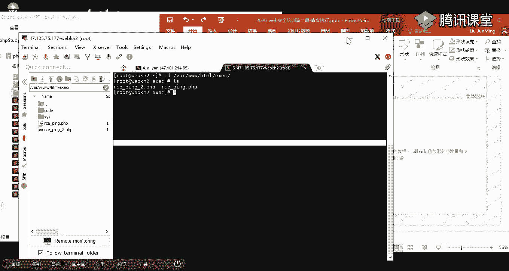

啊这一个例子大家能能懂吗，没有人回回答吗，能懂是吗，呃可能大家没有实际去操作的话，可能不是很理解，啊我这里的话，我这里的话是以这样子的一个形式来给大家做，就是介绍这样子的一个map。

这个函数能够导致命令执行，当然的话实际的情况不是说啊，有这样子的一个页面，有这样子已经构造好了，这样子一个页面，能够让你去呃进行一个这样子的一个，命令的一个执行。

但是的话我是以这样子的一个简短的一个代码，来给大家介绍这样子的一个函数，然后的话如果说呃我们再去做一个，就比如说做一个代码审计的时候对吧，我们在做一个代码审计的好的时候，我们想要去查找这个代码里面。

它是否包含有这种命令执行的一个漏洞对吧，我们就可以去查找相关的这种，能够导致命令执行的这样的一个函数，好的话，我们可以定位到这样子的一个函数的话，来去对它的一个代码逻辑做一个分析。

然后的话分析它是否能够啊去构造啊，通过构造这样子的，我们传递的这样的一个啊字符，来去达到一个命令执行的一个目的，实际上的话，实际上的这样子的一个命令执行漏洞的话，它其实不会说会体现在一个页面上的。

就是说他其实而且你实际去寻找这样子的，一些漏洞的话，呃，大部分应该也是通过代码审计，查找他的一个代码逻辑，还有的话就是说这种啊微型的呃，能够进行一个代码执行的这样子的一些函数，我这样说哦，能理解吗。

呃不理解的话呃其实也没关系啊，就大家呃先知道这样子的一个函数能够去呃，通过这样子的一个方式，来去进行一个命令的一个执行，好吧，大家先啊理解这一点，然后这一点的话应该比较好理解吧，啊没有什么问题的话。

那我们继续下一个，下面的话是一个creative function这样的一个函数，这个函数的话，它的一个意思就是从我们传递的一个参数，创建一个匿名的一个函数，好的话，返回其唯一的一个名称。

这里的话其实跟前面的话其实也类似，就是说我们以这一个例子为例，这样的话就是这个主要的话是这个create function，这样的这样的一个函数，然后的话我们在这里向他传这样子的一个啊，字符的话。

它就会呃把我们的一个代码，当作为一个菲律宾代码去进行一个执行，这跟前面的话也是类似的，然后这里的话就是呃要注意的一点，就是这里的一个参数的话，作为单引号分隔的一个字符串传递。

然后的话就使用这一个单引号的一个原因的话，是为了保护变量名不被解析，然后这里的话呃大家先了解一下，然后在后面的话会有一个例子做一个解释，就说在p h p里面的话是啊，就是双引号。

如果说我们传递的这样子的一个参数，它是以一个双引号做一个包裹的话，然后的话这个呃我们传阅的一个参数里面的话，它是，一个变量一个变量名的好的话，这一个变量的话，这个变量的矿。

它里面是一个能够执行的一个代码，比如说一个菲律宾four的一个代码，好的话，我们传递的这样子的一个变量的话，它是包括包裹在双引号里面的话，它就会首先会把里面啊，里面的这一个变量做一个解析。

然后因为这里的一个变量里面，它所呃携带的一个内容的话，它是一个菲律宾的一个代码，所以说他就会把里面的一个kgb代码，首先的话会做一个解析，然后的话能够导致命令执行，这样的话我在后面的话会有一个这样子的。

而另外一种形式的这样的一个pg的这个函数，呃这个的话这个的话我应该不用多说了吧，就是它的一个使用的话，我们只需要在这里而传递这样子的一个，cmd的一个值为我们的一个ph代码，就能够去进行一个解析。

然后的话呃，其实这里的话主要的话就是这些函数，而这里这些函数它的一个意思的话呃，大家去查查那个菲律宾的一个手册，就是说可能你去查那个手册的话，你啊了解得更清楚，然后这里的话呃啊因为上周是有位同学。

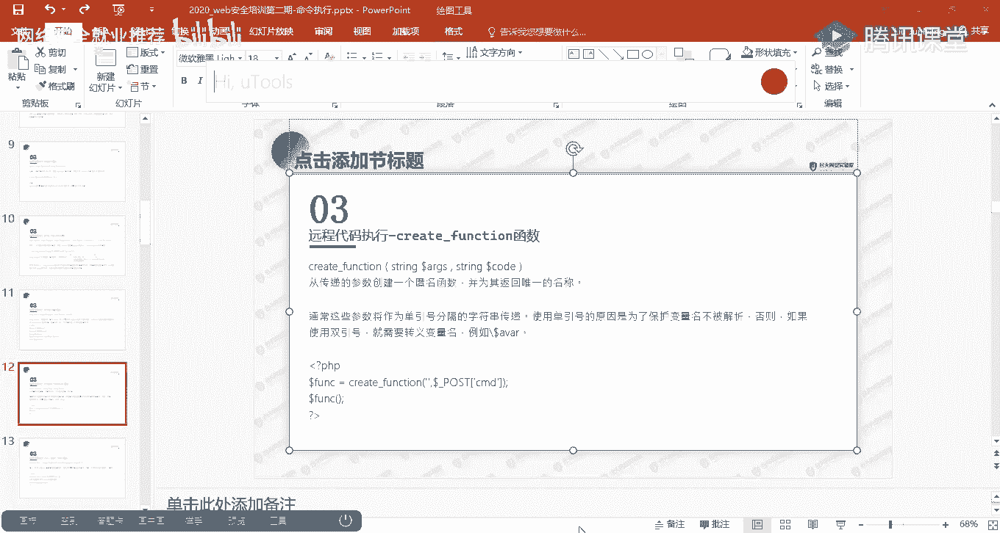

有位同学问我要要了这样的一个工具啊，就我现在这里使用的这个工具，然后我这样的话推荐一下吧，就是就方便大家的一个使用，这里的话这个工具的话就一个you tools，youtus的一个工具。

然后呃这里的话里面有一些插件，有很有很多的一些插件，然后你想要去查询pp相关的，比如说菲律宾函数对吧，他这里的话就有一个手册，比如说我要查询这样子的一个create function的一个行。

这个函数它的一个意思，我们就能够查看到它相关的一些信息，其实这里的话就是hp手册的一个，相关的一个信息，然后从这里的话，我们就能够嗯了解这样子的一个函数，大家可以去呃下载使用一下吧。

呃其实里面的话也有很多一些功能，就是大家可能在windows上面的话，或者说啊他这个工具的话嗯windows linux，还有呃mac 20都是能够去使用的，然后大家可能在windows上面的话。

它会使就使用这种三，去查找文件等等什么的对吧，然后这里的话它其实它也是，我也是经常使用到这样子的一个工具来查找啊，电脑里面的一个文件，然后它其实还有其他的一些手册什么的，我这样的话就不多说了。

还有像python啊等等的，就说你想要查询这一个库。

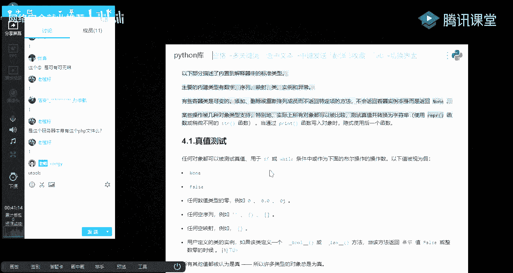

只有一个库，它的一个呃意思对吧，他怎么去使用的都是很方便的，就不用去网页去查，这句话，这个推荐嘛，因为上周的话是有位同学问了我这一个工具啊，我推荐给了他好，其实这样的一些函数的话，呃。

大家如果还不是很理解的话，可以去查一下那个手册，然后的话就是这个call you the function这个函数，这个函数的话，就是呃我们看一下它的一个圆形，这个圆形的话就是这里第一个参数。

这个call back这个参数的话，就是我们去调用的这样的一个回调函数，好，后面其余的一个参数的话，就是作为我们前面的这个call back，回调函数的一个参数，然后的话把第一个参数做呃。

就是把我们这里的第一个参数，作为一个回调函数的使用来去进行一个使用，这个的话其实跟我们前面的一个意思是类似的，对吧，我们前面的这里的一个map对吧，那同样的就是说呃类似的。

就是把我们这里传递的这样的一个啊，这里的一个呃，直把这一个词的话作为一个回调函数，然后的话能够去调用这样子的一个函数来去啊，处理我们这里数组里面的每一个元素，好的话，我们可以通过构造来去利用这一个函数。

来执行命令，啊这里的话我们以这个为例子对吧，就我们在这里的话，第一个首先我们第一个这一个参数的话，是能够去去被调用的，好的话，我们在这里后面的一个参数的话，是我们传递的一个参数。

然后这个参数的话就能够去调用这个函数，去进行一个处理，等于就是我们用这一个asset，这一个这个函数来去处理我们传递的一个参数，然后我们这里传递一个参数的话，如果没有做一个过滤的话。

是能够传递一个菲律宾代码的对吧，然后的话给这一个s的数据做一个解析，然后的话就能够造成一个命令执行，然后这里的话也是一个常见的，用这样子的一个函数来去构造一个一句话码的，我们要使用的话，其实就是呃。

用post的方式传递这样子的一个菲律宾代码，或者传递传递一个菲律宾代码就可以了，然后这个ai feat这样的一个函数，这个函数的话嗯，我们同样的以这一个例子来做一个解释吧，我们首先看一下。

同样的就是定义了这样子的两个变量对吧，然后第一个的话是通过post的方式接收cmd参数，传递来的一个呃字符是吧，然后第二个的话是一个error，一然的话它是一个呃把我们传递一个字符。

把它放到了一个数组里面，啊这里一个f u n c这个变量的话，它是通过get方式来进行一个呃获取字符，然后的话在交给这一个era fat，这样的一个函数，然后他就会把我们在这里传递的。

用post的方式传递的这一个数组，呃，哦说错了是啊，跟我们其实跟我们前面也是类似的，就是同样的是那个回调函数，那个av那个map对吧，当然的话他这里的话是啊，位置它是不一样的，就我们在这里。

我们通过get方式传递了这样的一个function，然后的话它是在这一个位置对吧，然后在这个位置的话呃，它是可以将在这里的一个字符，作为一个回调函数，好的话，在我们传递到我们数组里面的。

这样的一些元素的话，能够啊调用这样子的一个呃函数，来对这个数组里面的每一个值来进行一个处理，其实就是上面的这一句一句话，就用回调函数来过滤数组中的单元，然后依次将我们这里的数组里面的一个值。

来传递到我们的这样的一个函数里面，来进行一个处理，然后其实我们能够去构造的话，就是像这样子，我们通过啊get方式，像这个f u n c传递这样子的一个啊system对吧，呃system的一个函数。

这个函数是执行系统命令的，然后的话我们在再向我们的一个cmd参数，传递一个这样子的一个参数，然后传递的一个参数的话，它就会存到这个数组里面对吧，存到这个数组里面的话，这个error fat函数的话。

它就会呃，将这个数组里面的值都传到这样的一个啊，也就是我们这里的一个system函数，让它去进行一个处理，进行一个处理的话，就造成了一个命令执行，就说用system来执行我们的一个啊。

或mi的一个meaning，啊这样的话咳咳，我这个做一个演示啊，首先的话嗯，所以说我们需要传递一个呃f u n c，这里传递了一个f u n c的这样的一个参数的，值的话，就是用来作为一个回调函数。

然后的话我们传递一个system，来执行我们的一个系统命令，然后需要再传一个cmd，用post的方式，这里传递的一个用cmd啊，用post方式传递的这样的一个值的话，它是会存存储到一个数组里面。

我们这里的话是和传一个外卖对吧，然后传过去的话，传到数组里面的话，那个error这个error file函数的话，就会呃把它传到这个system函数，让他做一个处理，who am i，好，诶没写错啊。

有问题吗，呃呃然后这里的话可以看到我这里去访问的话。

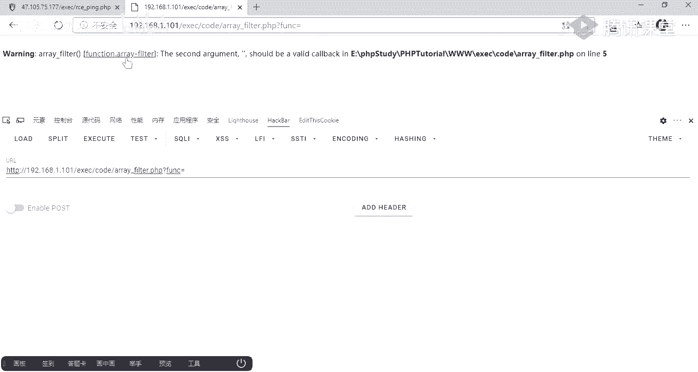

可以看到这里有一个报错对吧。

然后这句话哦，我回到刚刚那个那位同学，就以这个例子来给你解释一下。

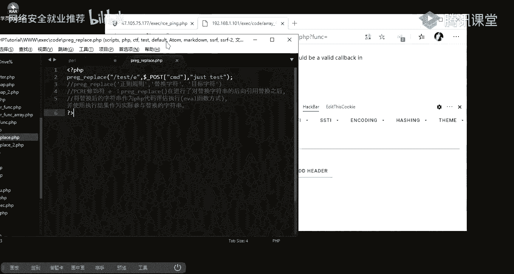

那个art那个就是忽略报错的一个意思。

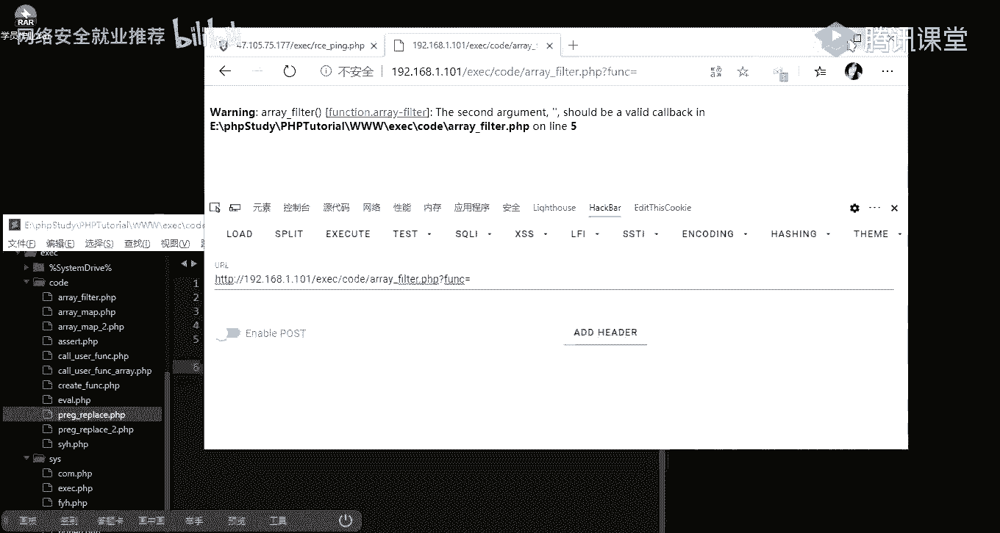

可以可以看到在这里的话，它是有这样子的一个报错对吧。

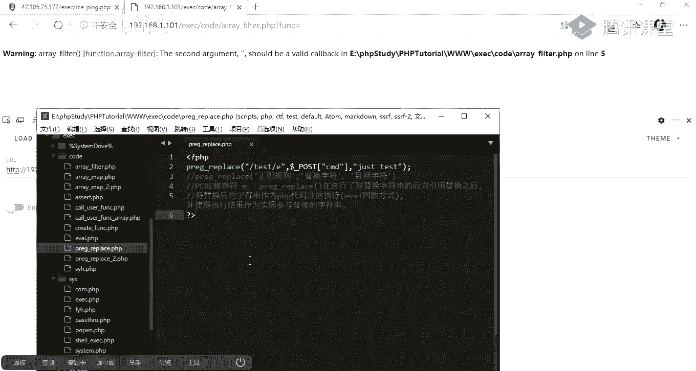

啊这个不是啊，这个是没有传值。

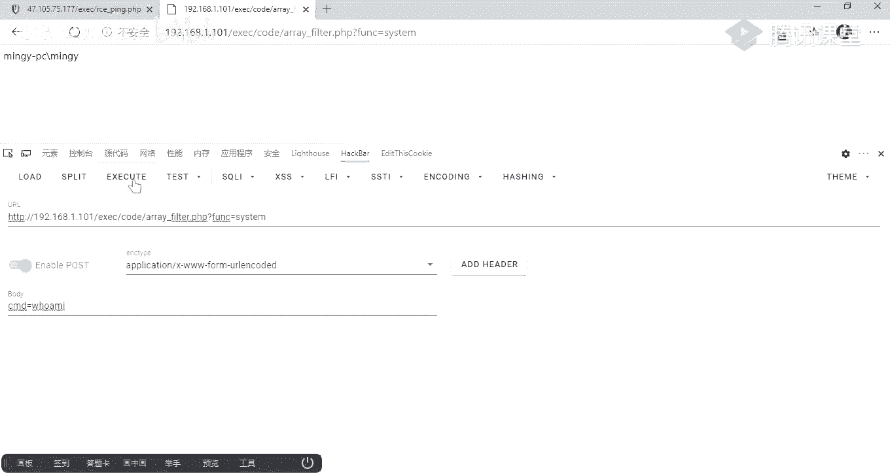

那可以啊，没看到这些话是没有问题的，我这里服务器怎么不行呢。

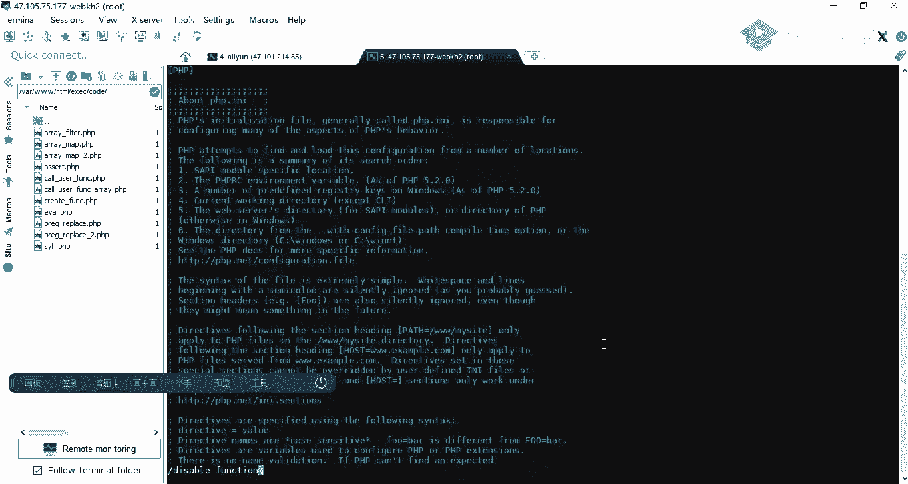

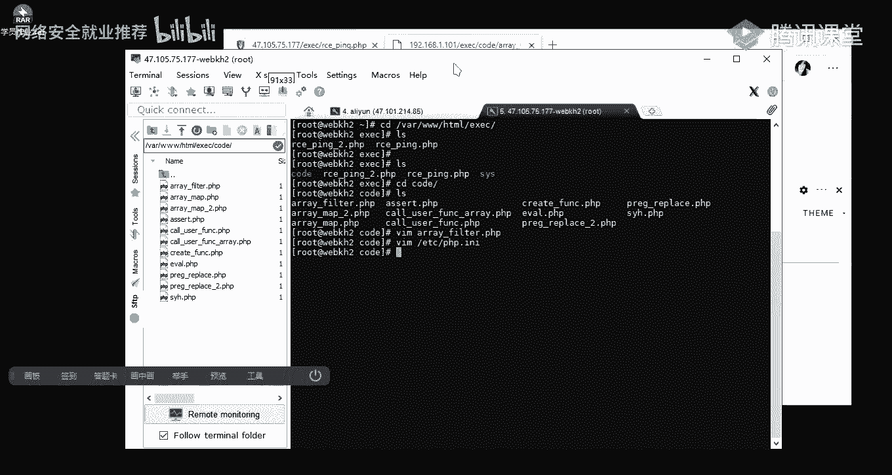

可以啊，然后这里的话先。

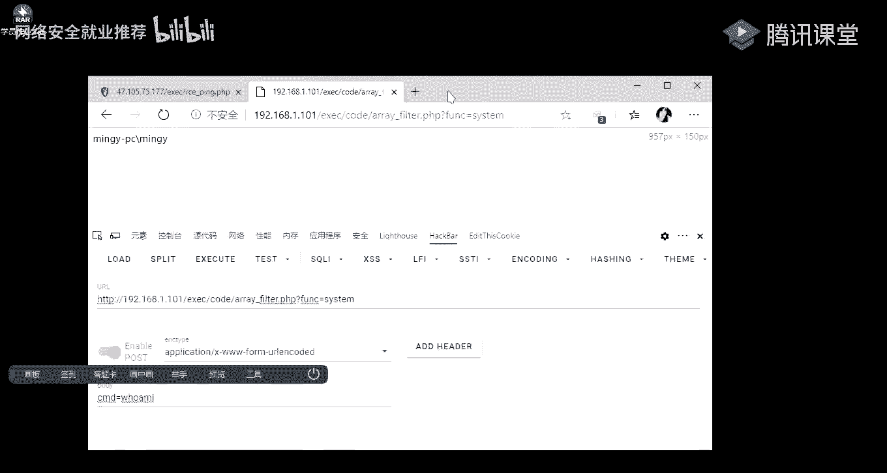

先不管吧，然后课后的话我会把这个代码发给大家吧。

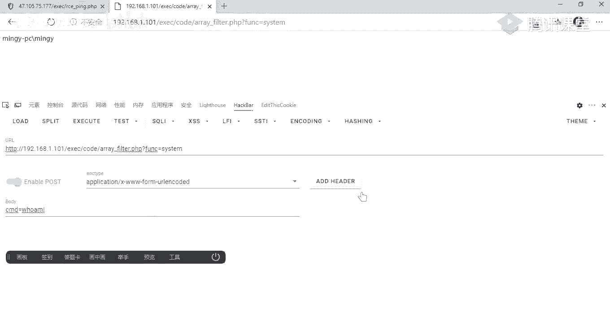

那这样的话我们先继续我们的一个课程内容。

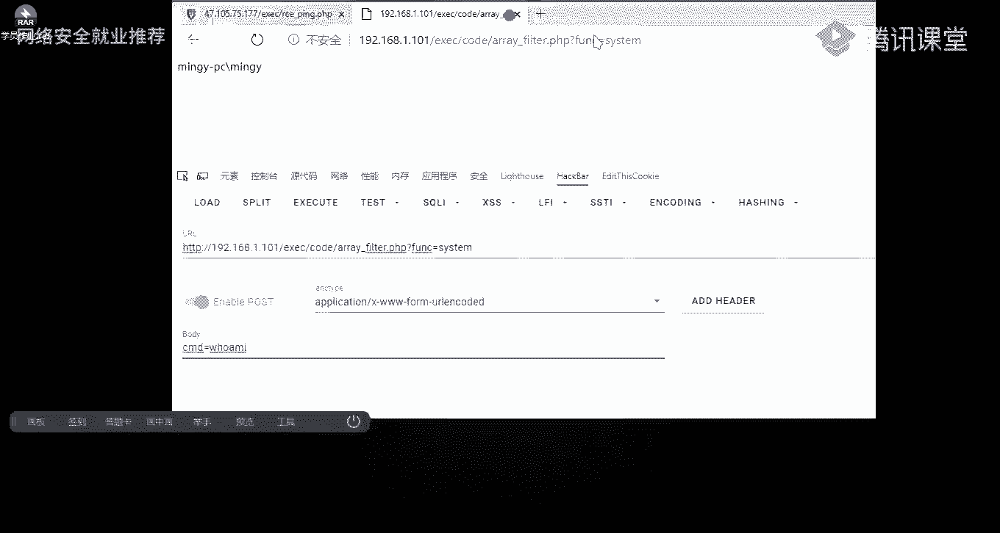

我在这里本地的话是没有问题的，就说呃，通过这样子的一个方式来去利，用这样的一个函数来构造我们的一个命令执行，讲到这里的话，大家对前面的话有没有什么疑问，嗯其实这样的，其实这一些行本节课的话。

其实主要的话就是介绍这些函数，然后的话，我们如何利用这样的一些函数来去构造呃，构造我们的一个参数，通过利用它的一个函数的一个特性，来构造这样子的一个命令执行，就这样子的一个命令执行的话。

就相当于我们在目标服务器上面对吧，传啊上传了这样子的一个一句话嘛，那我们可以通过这样子的一个啊，存在这个论这一个函数，然后的话没有对我们传递的一个参数，做一个过滤的这样子的一个代码。

我们可以通过这样的一个呃，代码来进行一个命令的执行，就相当于是一个呃，我们上传的一个web share的一个木马，它能够达到同样的一个效果，好的话就是这个双引号啊，这个双眼的话就是我们前面有提到的。

就是说在这个双引号里面如果包含有变量的话，菲律宾的一个解释器，它会啊将将其替换为变量，解析解释后的一个结果，就是说比如说我们在这里，我们以这个为例子，我们这里的话是一个变量对吧，一个多了符多了符号。

然后这个变量的话，它里面包含有，放那个代码设置一个撇平four对吧，好的，我看pp解释器在碰到这样子的一个情况的时候，他会把这个变量里面的，这个p h p four的一个呃代码，把它给做一个解释。

执行执行之后的话，它的一个结果，就是会把它就是呃将这个变量会替换为，我们在这里执行之后的一个结果，然后这里的话会进行一个输出。

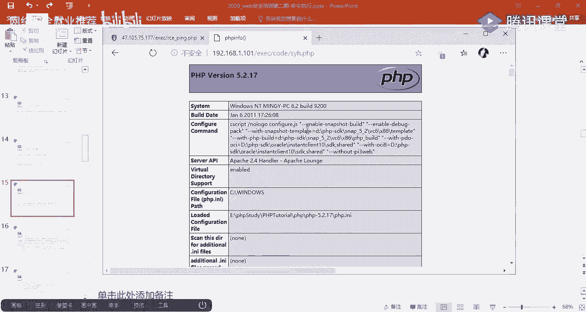

好可以了啊，我这样的话是给大家看一下代码，就像这样子的一个代表，然后我们以一个就是正常的这样子的，一个双引号的话，他是不会去呃执行里面的一个代码的，我们可以看一下对吧，他是直接进行一个输出。

但是我们的这样的一个代码，如果是放在这样子的一个变量里面，然后传进行一个传递的话，然后它是，而且是在被一个双引号进行一个包裹的话，它就会把我们这里传递的一个代码做。

当做一个菲律宾代码解析解析执行之后的话，这里的一个值，也就是他这里的一个pp代码解析之后的一个值。

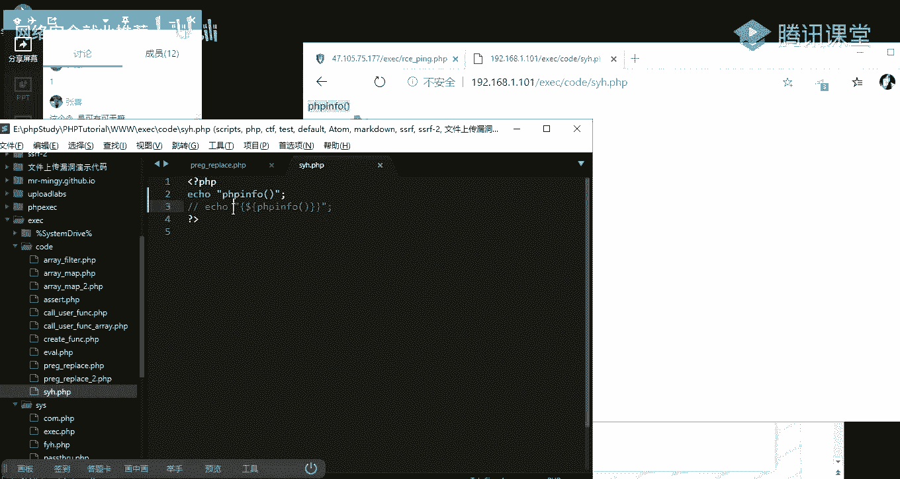

然后的话l口进行一个输出。

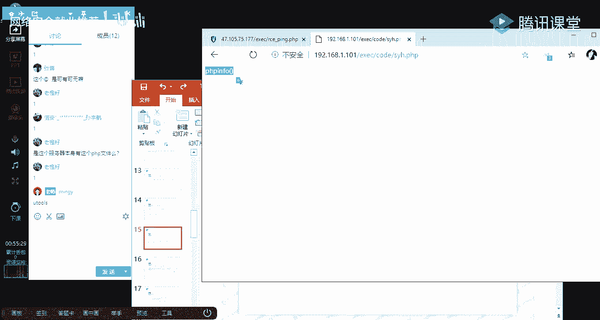

那个效果的话就是，它那个效果的话就是这样子的。

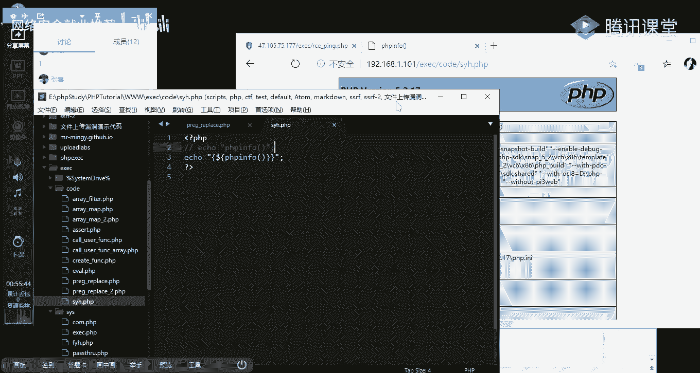

这句话就是把我的一个pp four的一个呃值，进行了一个输出，然后同样的这这样子的一个双引号的话，也是能够导致这样子的一个命令执行的。

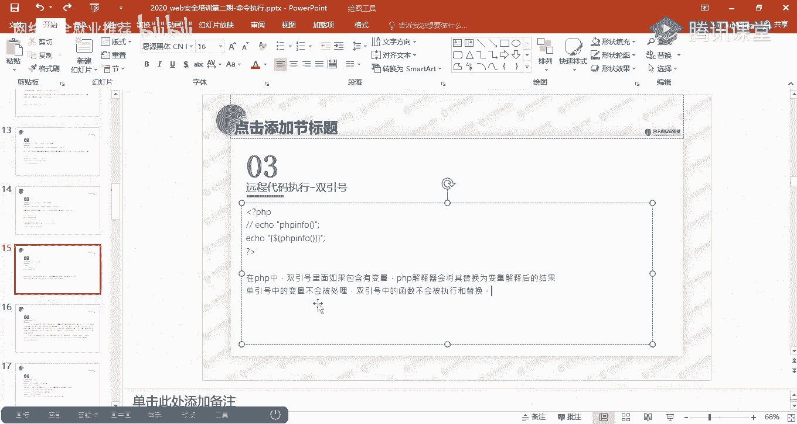

然后要注意的话，就是单引号它里面的一个变量的话，它是不会被处理的。

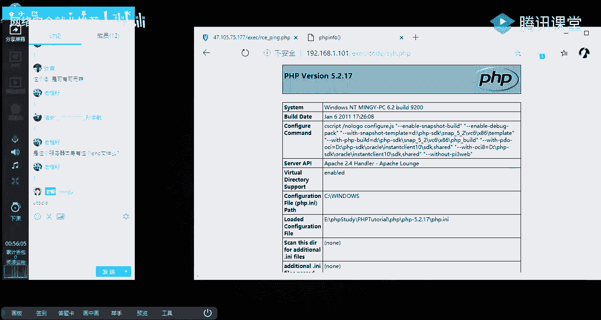

可以看同样的。

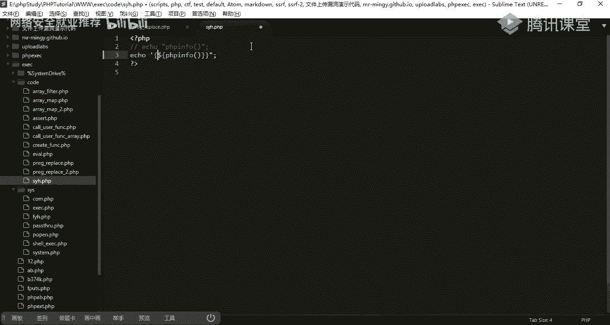

以这个为例，我们以一个单引号进行一个包裹好，我们执行执行之后的话，可以看到它是没有对我们这里的一个变量，里面的这个p h p for代码做一个解释的，它是直接原样的进行了一个输出，好这里的话，我。

啊我们本节课的一个内容的话就到这里吧，我们来捋一下我们本节课的一个内容，本节课的话，我们主要的话就是介绍了命令执行的一个漏洞，就是对它的一个简介，好的话，我们介绍了一个远程代码执行。

能够造成远程代码执行的一个一些函数，我们通过介绍这样的一些函数啊，就是让大家理解这样的一个函数啊，如何去进行一个构造，能够造成命令执行，然后这这呃，大家可能就是说你知道这样的一个函数对吧。

知道这样子的一个函数，能够造成命令执行有什么用呢，就是说呃就一般的一个命令执行，就说这种命令执行的一个漏洞的话，他不会说你直接能够通过页面，就能够去进行一个查找到的对吧，然后的话。

其实我们就说我们再去进行一个黑盒的时候，配合的一个测试的时候，其实我们很难去发现这样子的一个命令执行，除非的话是有很明显的那种呃，就是啊能够让你直接执行命令，执行执行系统命令的那种功能点。

然后的话你就可以直接去进行一个测试，它的是否包含有这样子的一个命令执行漏洞，对吧，好，我们实际的话其实是无法直接的去啊，查找到他的一个命令执行漏洞的，所以的话我们寻找命令执行漏洞的话。

一般都会一般都是通过白河的一个测试，就是说通过查看它的一个源代码对吧，那你查看源代码的话，你如何去查找命令执行的这种漏洞呢对吧，就是说我们可以通过查找命令执行啊，能够去造成命令执行的啊。

或者说代码执行的这样的一些函数，然后的话它函数的话通过观察它函数，他的这样的一些参数的一个传递的一个情况，对吧，来去呃寻找它的一个漏洞点，然后的话通过它的一个这样的一个函数的。

它的一个特性来构造我们传递的一个参数，来达到一个命令执行的一个目的，这就是我为什么要去解释这样的一个呃，这样的一些导致命令，导致代码之前的一些函数它的一个原因，然后我们本节课的主要的话就介绍了这样。

这样这一这一些函数，然后下节课的话，我们会呃给大家介绍一个远程的一个系统，命令执行，要不我我把这里在好，再花一点时间介绍完吧，就这一个，远程的一个系统命令执行，然而这种远程的一个系统命令执行。

它跟我们前面介绍的一个代码执行，它其实是有点不一样的，我们来了解一下，就是说它的一个不同之处，就我们这种系统命令执行的话，一般的出现这种漏洞的话，是啊我们的一个应用系统，它从设计上它就给提供给了用户。

这样子的一个能够去进行远程命令操作的，一个接口，就比如说我们常见的那种路由器对吧，还有防火墙，还有这种入侵检测这种设备的话，它你需要去啊它的一个管理界面上面的话，会有去呃调用系统命令去。

比如说去进行一个ping对吧，去查啊，通过ping的一个方式来啊，检测我们存活的一个主机，然后的话这里的一个pin的一个操作的话，它就会它就要实现这样的，这样子的一个功能的话。

就需要调用我们的一个啊系统的一个mini对吧，因为ping的话它其实是一个系统的一个命令，而我们想要调用这这样子的一个系统命令，来去执行我们的一些操作的话，就需要用到菲律宾函数里面的。

系统命令的一个执行函数，然后这些函数的话就有这种system y，还有ex e c，还有需要ex e c等等的，这样的一些我们常见的话，而且之前的话也经常使用到，使用到的话就是这个system对吧。

然后还有的话就是防疫号这个繁衍二的话，它实际上它的一个呃，就是它实际上的一个调用的一个命令，去进行一个执行的一个方式的话，就是使用的这个shell ex一函数的话呃，介绍一下。

然后这里的话是我们常见的这样的一些呃呃，能够调用系统命令执行的一些函数，这样的话我大概了解一下吧，后面的话会有相应的一些操作来理解，首先的话我来理解一下这个ex 1 c的一个函数。

这个函数的话就是执行一个外部程序，然后他执行的一个外部程序的话，就是呃执行我们这里一个command的参数，它所指定的一个命令，我们可以看到这里的一个command的参数的话是啊。

在这里就我们可以在这里啊，指定我们想要执行的一个命令，然后的话交给这个ex e c函数，来去进行一个执行，然后这里的第二个参数的话，就是我们的一个呃输出，然后这里的一个输出的话呃。

e x e c函数的话，它执行外部命令的时候是不会输出结果的，而是它会返回结果的最后一行，就说他执行完这这个命令之后，它的一个结果，然后它不会直接输出来，而是它会输出啊，你这里的一个命令执行之后。

结果的最后一行，如果说想要得到全部的一个结果的话，我们就需要使用到第二个参数，好，这一个参数的话就能够指定呃，它输出的一个数组，然后的话用啊，就是把我们前面这里执行的一个命令，它的一个结果。

把它给传到我们的指尖的这个数组里面，存储到这个数组里面，然后的话再进行一个输出，然后这个数组的话是一个记录的话，它就代表我们啊输出的一行，呃这话，我以一个例子来演示。

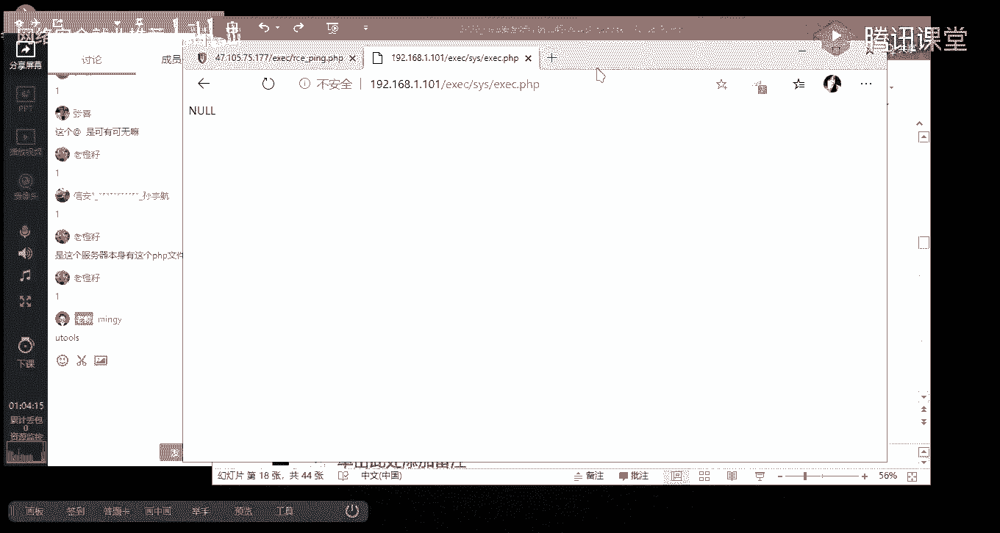

就这个。

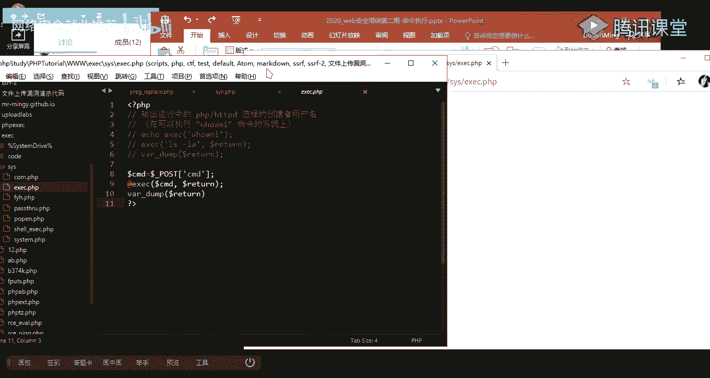

啊这样的话我是稍微改了一下哦，这样的话我们来看一下这样的一个代码，这个代码就是通过post的方式来传递，这样子的一个呃字符对吧，然后传传给传到这里好了，这里之后我们再调用这个ex 1 c函数。

来去进行一个执行，执行之后的话，结果我们把它保存到这个return的一个数组里面，好的话，通过这个widp这个函数来输出，我们的这个数组里面的一个内容，输出这个变量里面的一个内容。

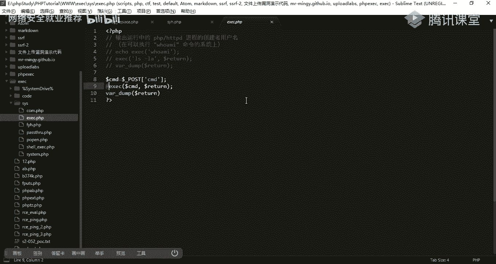

然后这样的话我加了一个art for对吧。

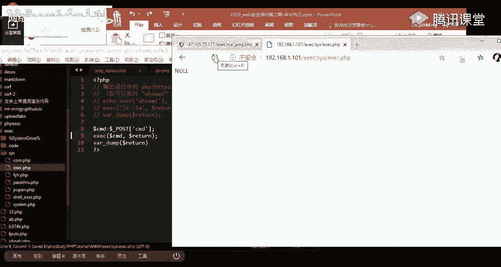

我们把这个art符号给去掉，去掉之后的话反问的话，你会发现会有一个报错，对吧啊，不是报错是一个警告，就是warring是一个警告。

就说这里的话这个e s函数它没有，就说它不能够执行一个空的命令，就是说这里一个空的命令的话，也就是我们这里的一个cmd的一个变量对吧，因为我们没有给这个变量传值，所以说所以说的话这个这里的话是没有值的。

然后的话这里的一个e x e c函数的话，它是不能够执行空命令的，所以的话它就会报这样的一个警告，好的话，我们在这里，在这里的一个只想要数截面加一个art的话，它就会他就会忽略这样子的一个警告。

然后这里的一个none的话，是因为我们没有像这里的一个数组里面传值。

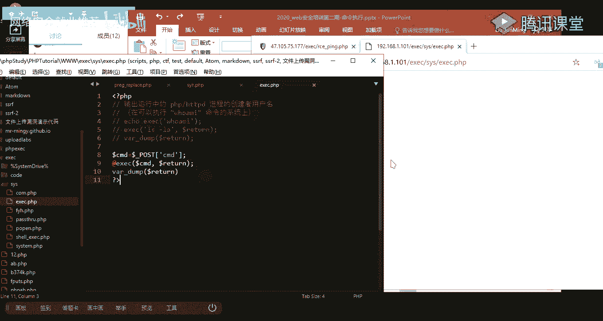

所以的话你呃因为是为空嘛，所以的话你输出之后的话，它就是一个run，也就也就是一个空到这里，我们想要执行一个系统命令，我们只需要像这个cmd参数，传一个我们的一个命令。

比如说ios杠a我们执行执行之后的话，可以看到它是一个数组对吧，然后这个数组的话，可以看到啊，第一行第一行的话，它保保存的是这样子的一串值对吧。

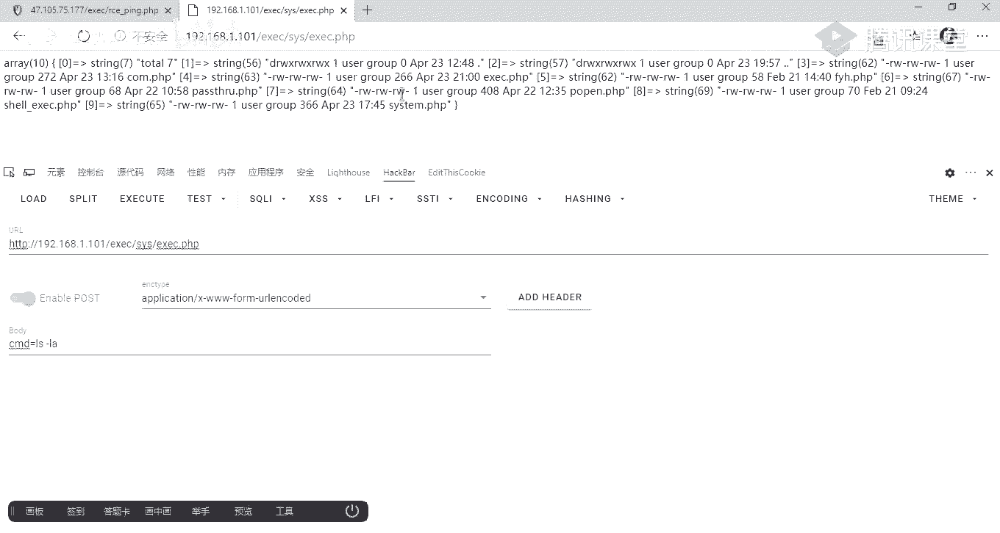

这一串值的话其实就是我们啊，呃就是在系统上面执行我们的一个l s命令，然后s ska命令是一样的对吧，它输出的一个结果就是这这里的这一行对吧。

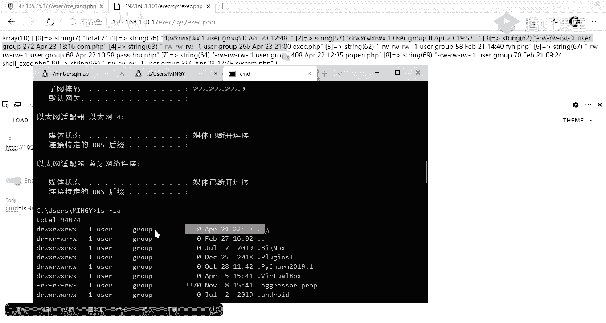

就是这里的这一行，然后第二行的话就是啊另外的一个值，然后我们可以看到的话就是呃，在这里的话有输出了当前目录，就在这个s s y s目录下面的一些文件，可以看到有一个system。p h p对吧。

还有这样子的一个文件啊，我们换一个命令执行，比如说户外卖外卖的话，你就是它返回的一个结构的话，是只有一行的对吧，我们执行之后的话，可以看到它是存储在数组的第一个，它的一个值的话就是这个这个值。

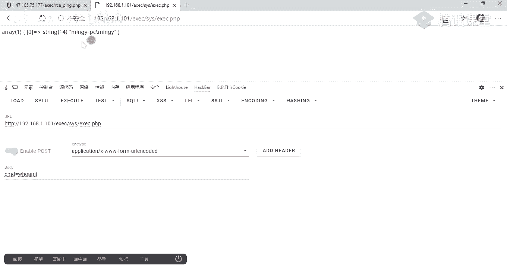

然后它的一个它是一个字符类型，它的一个长度的话就是14个14，啊这就是这个ex ec函数执行系统命令。

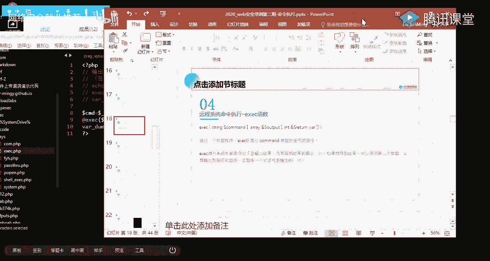

因为就从这里的话，我们能够发现，就是说我们前面的一个代码执行的话，一个菲律宾代码，然后他执行的话是呃，我们的通过这个p h p的一个函数对吧，好的话来呃调用，来调用我们的一个system。

这里的一个system函数的话，它其实就是我们啊后面讲的一个，调用系统命令的一个函数，然后的话通过呃这个system的一个函数，来去调用我们的一个系统命令，然后然后我们在这里的一个系统命令执行的话。

就是说他本来就给了我们这样子的一个功能点，然后他这个功能点的话就是呃提供了这样子的，就是调用我们的一个系统命令，来去进行一个操作，然后要调用这样的这样的一个系统命令的话，他就会去使用到这样的一些函数对。

然后使用到这样的函数的话，我们就能够利用这样的一个函数来去进行一个，执行，我们想要的一个命令，然后这一个system函数的话呃，我们前面也经常使用，主要的话就是呃区别一下呃，跟这个ex ec的一个区别。

就这一个区别就在于我们的这个system函数的话，它是在执行系统外部命令的时候。

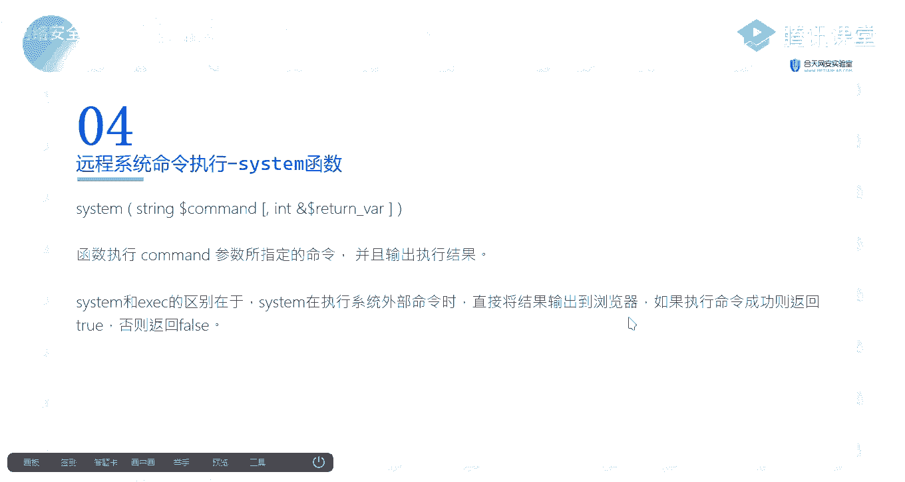

它会直接将结果输出到浏览器。

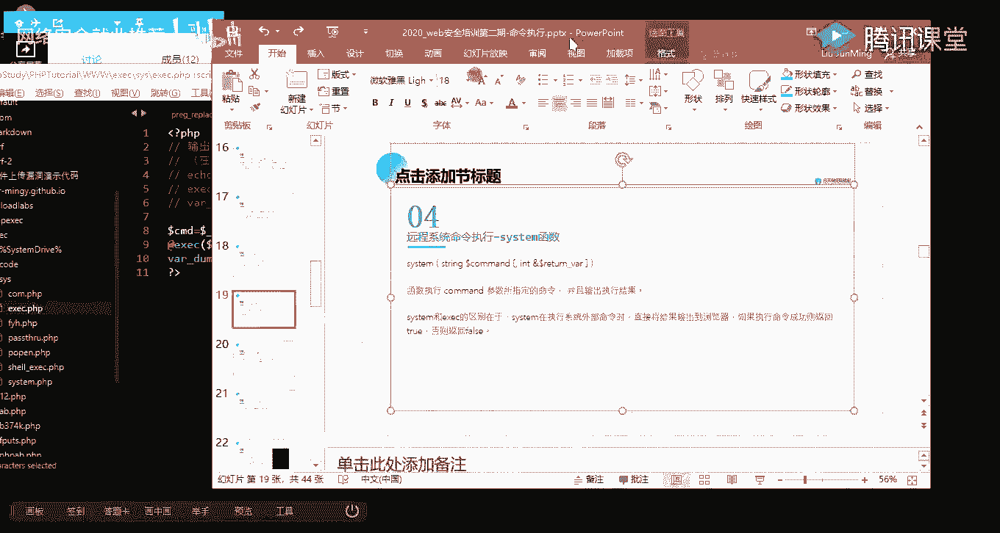

这就是呃，然后的话我们前面为什么就经常会使用到，这样的一个system system码的一个函数，来去调用一个系统命令呢，就说我们去调用这样的一个system的一个，系统命令的话，它执行的一个命令。

它会直接输出到我们的一个浏览器，也就是会显示到我们的，也就是说会显示到我们的一个浏览器界面来，比如说，比如说我们在这里要传对吧，要传的话是传递一个菲律宾代码，然后去执行我们的一个菲律宾的一个呃代码。

也就是这里一串是吧，好我们想要去执行我们的一个系统命令的话，我们还是需要通过这样子的p h p里面的，一个调用调用系统命令的这样的一个函数，system这样的这样的一个函数要去进行一个调。

然后为什么要去使用这啊这样的一个c的函数，就是因为哦他执行的这样的一个结果，它是会直接输出到浏览器的，也就是会输出到这里，我们是能够直接查看到的，要注意有一个分号嗯，哦打错了外卖，可以看到执行之后的话。

它的一个结果是直接输出在浏览器里面的，然后的话就是这个pass three这个函数，其实呃跟这个ex一次函数的话，它其实也是类似的，类似的一个作用，也是用来执行我们的一个外部命令的。

然后这里的话主要就是区分一下啊，就是有一个区别，就说这一个pass through这个函数的话，他同样的就是呃会直接将它的一个结果，输出到我们的一个浏览器，然后的话他是能够去就是呃。

输出一个二进制的一个数据，就是说它可以输出我们的一个原石，原石的一个数据好，当我们去要去输出我们的一个二进制的，一个数据的时候，就需要去使用到这样子的一个函数啊，使用这样的一个e x e c。

还有system函数的话，它是啊无法去进行一个啊输出的，然后输出这种二进制数据的话，就体现在啊，比如说图像的一个数据，我们的一个图像的话，它其实就是由一些二进制的一个数据所组成的，如果说想要好。

通过命令来输出我们的一个图像数据的话，就需要去使用到这样子的一个函数，然后我，看一下它。

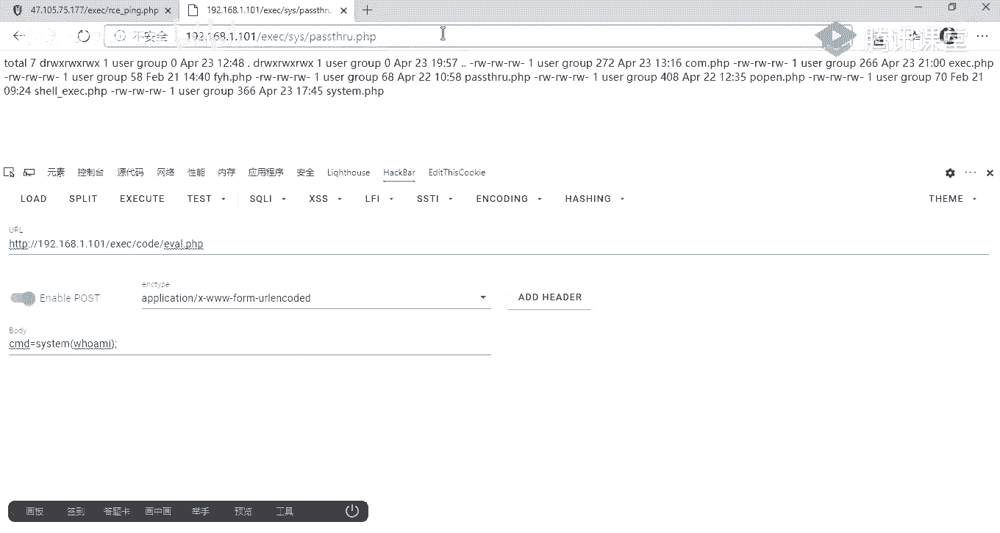

这个pass through，这个，啊，这里的话是直接把一个把我的一个命令，已经写到了这里，当然的话我们也可以通过通过get和post的方式，来传传递一个值。

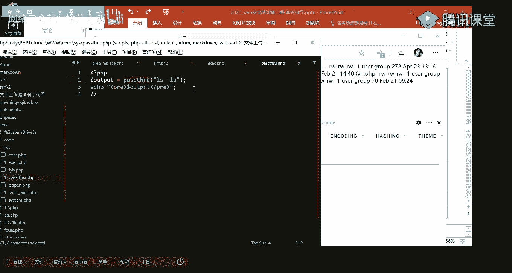

把它给传给这一个啊变量区啊，传递给这个函数去进行一个解析，然后这里的话可以看到它，这里的话输出的话是啊我们的一个l s，也就是当前目录的一个信息，就跟那个x1 c是类似的，也是，好。

第四个的话就是这个shell，杠x1 c的这样的一个函数，这个函数的话是通过调用我们的一个shell环境，来去执行命令，虽然前面的话其实也是类似，然后它的一个输出的话。

就是以字符串的一个形式进行一个反馈，就是呃调系统命令的话，我们常用的我们常用，而且常见的也是这样的这几个函数，然后它的一个使用其实我们可以从代码来看到，就是它都是嗯类似的。

就是说直接使用这样子的一个呃系统，调用系统命令执行的一个函数，来去执行我们的一个系统命令，比如说执行ios啊，pr还有呃com i等等的这种命令，然后的话我们还需要了解的一个点。

就是呃这里的话就是在命令执行当中，常会去使用到的一些特殊字符，也是我们呃在下节课会有去提到的，这样子的一个内容，就是说利用这样子的一些呃特殊字符来去啊，像我们的一个就是说来去利用它的一个命令。

执行漏洞来啊，传递我们想要的，一个想要服务器去执行的一个命令，我们来了解一下，首先第一个的话就是这个竖斜杠这个树干，这个树干就说这个树干的话，就是呃我们可以看到就无论以看这张图吧。

比如说无论sam第一是否执行成功，cmd都将被执行，就说我们前面的这个命令，还有我们后面的一个命令，通过这样子的一个树干进行一个分隔的话，就是说不管前面这个p w m d这个命令，执行它是否成功了。

或者说他是否有这样子有这样子的一个命令，后面的这一个cm，第二也就是后面的一个命令的话，他都会被执行，可以看到我这句话输入前面输入一个a，没有这样的一个命令，它同样的会执行。

我们后面的这样的一个mi的一个命令对吧，然后的话就是一个啊分号，这个分号的话就是呃无人somebody啊，跟上面是一样的一样的一个意思，好的话就是两个竖斜杠，两个竖杠。

这两个竖杠的话跟上面的话是呃不一样的，两个竖杠的话就是在我们的一个项目，第一就是我们前面的一个命令执行失败的时候，它才会执行我们后面的一个命令，我们以这个例子为例，就说我这里的话一个p w d对吧。

p w d的话就是查看当前的一个目录路径，然后的话后面的话是一个贩卖对吧，可以看到的话，就是说我们如果前面的一个命令，它执行成功了的话，后面的一个命令它是不会执行的，然后的话如果我们前面的一个命令。

他执行失败的话，也就是没有这样子的一个命令的话，它就会执行我们的后面的一个命令，然后还有就是and两个n的，很多的话就是跟上面它是呃相反的，就是说只只有在我们的第一个面点，执行成功之后。

我们在这and后面接的这一个命令，它才会去进行一个执行，没看到，就说我们用n来去连接的话，如果前面的一个命令他执行失败了对吧，他执行失败的话，后面的一个命令他是不会去执行的，航海的话就是呃。

用这样子的一个呃单引号去进行一个包裹的。

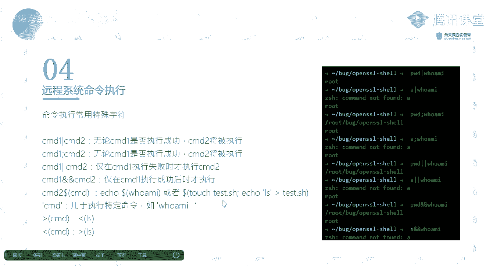

就是用于执行特定的一个命令，比如说我们，呃其实，其实就跟我们。


跟跟我们直接这样执行的话，呃它的一个输出的话是类似的，但是他的他还是啊不同的，就是我们通过这样子的一个单引号，进行一个报告的话，执行我们的特定的这样子的一个命令。


然后还有的话就是这个呃大于号，还有小药，我们给来看一下小样，后面，一个逗号好不好，一个括号来包裹我们的一个面，来去进行一个执行，可以看到他虽然。


好可以看到我在这里的话，我一个大于号，后面接一个括号，然后的话我们在后面的话是可以呃。


执行我们就是输出我们这里的一个l s命令。


对吧，就查看当前的一个目录，然后这一个。


没有。


这里是不是搞错了吗，呃这样的话大家先记住吧，就是好，我们可以通过这样子的一个方式来执行，我们这里面的一个命令。


我忘了我上面这里写的是有点忘了，这里写的是我这句话，是我不知道是我搞反了还是怎么的，就说这里的话一个大于号后面，接面的话，就是呃，相当于是一个这样子的一个执行的一个结果。


就其实呃能够执行命令的话。


就是这个就是这个大于号后面，接我们的一个命令，然后这句话我这样的话，就是我们本节课的一个内容，然后后面的话我们下节课再继续吧，下面的话哦下一节课的话会讲呃，就是通过一个实验，通过那个实验。

不知道大家有没有去预习，通过这个实验来去介绍一下啊。


命令执行漏洞它的一个应用，然后我其实我我把代码都放，都放到这个服务器里面去了，就大家可以直接能够访问到。


呃我我到时候把代码都发给大家吧。


然后他的一个命名的话。


就是在服务器上面，那个命名的话跟我这里的话是一样的，然后的话大家可以在本地，或者说直接在服务器上面去进行一个操作，都是可以的，啊呃，然后关于，然后大家对本节课的一个内容有没有什么疑问。

大家有没有什么疑问的。


呃都没有什么疑问吗。


本节课的一个内容的话，其实呃比较简单吧啊其实这个命令执行的话呃，前面的话主要是介绍和相关的，导致命令执行的一些函数，它的一个就是作用，以及我们如何利用这样子的一个，这样子的一些函数来去进行一个构造。

我们的一个命令来执行，就其实大家理解命令执行的话，就相当于我们通过这样子的，就是说通过呃应用系统，通过我们的一个web服务，它本身的一个代码，它本身的一个代码就存在啊。

能够导致命令执行的这样子的一个条件，好的话，我们只需要去利用它的这样子的一个条件，来执行系统命令，等于就是说利用它应用系统的这种功能，还有它的一个代码的一个漏洞呃，把它作为我们的一个web shell。

来获得服务器的一个权限，大家这样子应该会比较好理解，然后没有什么问题的话，那么我们本节课的一个内容的话，就到这里结束了，其实这些的话呃不需要去记吧，就这些函数的话，大家知道就呃大家知道就行。

然后主要是要理解这样的一些，理解这些函数它的一个，它的一个作用，还有它的一个使用吧，这个函数的话，大家之后的话其实呃碰的多了的话就熟了，就你使用的多的话就熟了，其实也不用特意的去记，呃还有问题吗。

你用的时候再查也可以啊，就嗯就大家要明白。


就说我为什么要讲这样的一些函数，我前面其实也说了，就大家不要大家一定要就是。


要理解方法，而不是去呃史记吧，就说我讲这些函数的话，就是让大家然后我前面的一些例子的话，就是让大家能够明白，就是说我是如果说有这样子的一个函数对吧，然后的话我们怎我怎么去能够去让它执行。

我想要的一个命令，就是说怎样去进行一个构造，能够让它传，能够让他就是呃进行一个命令执行执行，我们向他传递的这样子的一些参数，好的话，命令执行它的漏洞，它的一个导致的一个原因就是因为呃没有对。

我们就是没有对呃，就是存在能够让用户操控的这样的一些参数，对吧，我们可以通过这样的一些参数，向这些函数来传递我们的一个呃命令，然后的话传递这一些命令的话，通过这些参数传递命令的话，服务端。

它并没有对传递的这些参数做一些过滤检测，就说没有过滤我们的，比如说像这种啊，system这样这样的一些可以执行系统命令，这样这样一些函数，然后的话就会导致这样子的一些呃，导致这样子的一个命令执行漏洞。

那我讲这些函数的话，就是让大家理解，这样子就理解这些函数如何去导致命令执行的，以及其实我这里的话是以呃，就是呃就是常见的这样的一些，通过这样子命令执行的，这样的一些函数所构造的这样子的一句话嘛，对吧。

其实可以看到这样子的一个简短的一个代码，其实你也可以把它当作为一个一一句话吧，然后的话我们只需要就是利用这样的一个函数，它的一个呃原理以及它的一个特性，来传递我们想要执行的一个命令就可以了。

哦哦可能大家没有操作的话，不是很理解，大家还是就是听我讲完之后的话去操作一下吧，然后有问题的话再问我吧，啊应该没有呃，没有什么其他的问题了，大家还有问题的话呃，再给大家一分钟时间啊，提问吧，有问题的话。

现在就提出来，都没有问题是吧，哦对了，就就是嗯今天有位同学，今天有位同学找我，就说他之前是因为有事，然后没有听课，然后的话就是我我看了，你现在也在听，就是你有什么问题的话，你有什么问题的话。

可以直接在群里问嘛对吧，然后就是他们已经听了课的同学的话，你可以跟跟他们去进行一个交流嘛，就是你们之间互相去进行一个交流的话，可能还更好一点，可能我这边去说的话，有些有些东西可能就是表达的时候。

可能不是会很让你们去理解是吧，因为我用的是我的一个思维，但是你们呃是你们自己就刚开始学这个的话，可能你们自己的一个理解的一个思维的话，会更好更好一点，更快一点好吧，就呃那位同学的话，嗯就有问题的话。

直接在群里问，当然的话你私聊也是可以的，啊没有问题的话，那么我们下课吧。


我们本节课的内容的话就到这里结束了，我们明天再见。