# P24：第22天：命令执行漏洞-命令执行考核讲解 - 网络安全就业推荐 - BV1Zu411s79i

我们本节课的话本来是一个那个课程考核嘛，就说对于我，我上次布置了一个作业的一个课程考核，然后的话本节课的话。

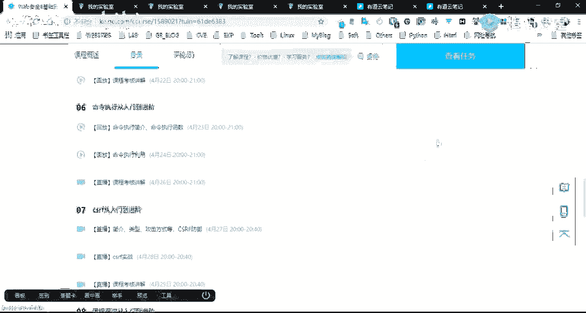

我计划，就是因为就是布置给大家的一个任务的话。

就是那些实验嘛，就是那几个实验好，其实这几个实验的话，这几个实验的话，大家对照着这个指导书来去进行一个操作的话，应该是没有问题的，然后这个的话其实就是我呃，昨天已经讲过的这一个这几个。

这几个r c干片的一个代码，然后的话其它的一个原理其实是一样的，然后我是把它呃，就是把它写到了这里，这个的话应该大家都没有问题，应该对吧，就跟我昨天讲的话是一样的，然后的话这里的话呃。

呃唯一的一个不同的一点的话，就是但这里有一些扩展对吧，就是说还有哪一些其他的一些呃，hello的对吧，这些的昨昨天的话我也有涉及，然后的话就是我们比如说我们的这里的，过滤了这种，过滤了这种啊。

分号结尾的这种呃字符我们怎么通过啊，我们怎么通过命令执行来写，我们的一个一句话对吧，这个实验的话大家应该没有什么问题吧，啊有有有问题的吗，啊有问题的扣一，没问题的扣二，作业太多了吗。

你不是都我我看你的话写的都写完了呀。

你的这个文档的话写的呃，我觉得话我觉得写的很标准啊，就就好。

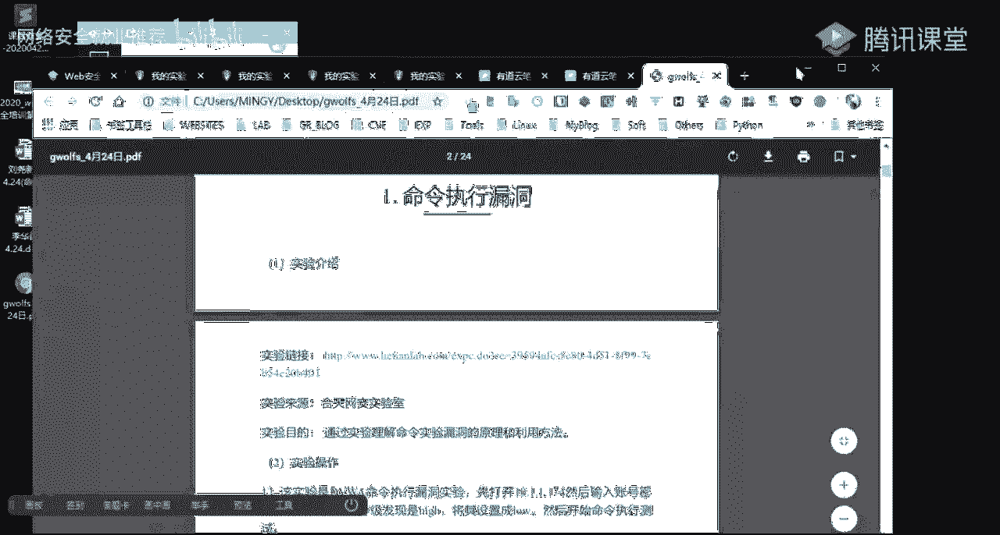

我我不知道大家有没有自己去做啊，就是我这边的话。

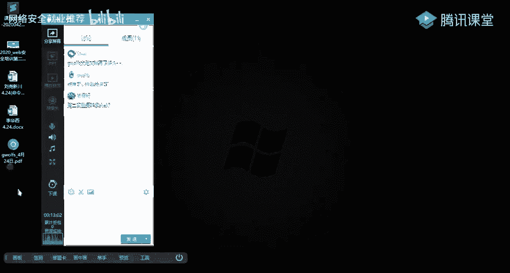

收到刘邦主任那边给过来的作业的话，就三个，就大家大家做完的话，还是你把那个过程给记录一下，记录一下嘛对吧，然后你做这个实验的时候，你里面涉及到的一些知识点，你就做笔记嘛，把笔记做下来做下来。

然后坐下来之后的话，你可以呃就是把它给分享给别人对吧，然后的话下次你可以做一个备忘嘛，第二个实验怎么拿shell，是这一个吗，啊这个struct to的这个实验，大家有没有什么问题呢。

就是怎么能拿shell是吗，怎么拿，需要的话呃，呃今天的话就是呃这个时间的话，今天白天是有同学提出了一个问题对吧，就是你再去打开这个url的时候会有问题，然后这里的话是因为哦，你是照着这里去敲的对吧。

就是这里的话指导说的话，他后面多了一个杠，多了多了一个干的话，他访问的话就是在这里的这一个目录对吧，这个目录下面，然后你访问的话是能够访问到这个页面的，但是你去啊点这个一点的话。

它就会呃多了这样子的一个目录，就是说他你点击这个edit，它本来是去访问到这个orders的这个目录，下面的一个文件是吧，然后的话你这里呃直接直接敲，直接去访问这样子的一个链接，也就是这一个目的话。

你再去啊点这个一点的话就会报错，因为没有这样子的一个目录下，有这样子的一个文件，好get shell的话，这个呃实验机里面的话，有给这样子的一个呃plc吧，然后这个的话其实就是呃。

把我们的这个plc发过去，发包发过去就可以了呀，然后这里的话呃就是这个plc的话，它是一个java的一个就jsp的一个java的一个脚本，然后的话里面的话其实大家不懂java没关系啊。

然后的话你是要注意里面的一个payload，就是里面呃它是有一个执行命令的一个语句，我这样的话先创建一个吧，或者要不pc啊，现在现在大家看不懂呃，没关系啊，就是说你现在，因为大家都刚开始接触这一块的话。

你现在看不懂这个plc是正常的哦，你在后面的话你理解过来了，理解就是你自己去深入的去理解了之后的话，然后的话你懂这些代码的话，你就会很好理解了，对这里这里嘛，这里的话就是呃会弹出一个计算器出来嘛。

然后你在这里的话，你可以写你其他的一些命令啊，就比如说你cmd调用cmd来执行一个额，ip configure啊等等的这种，然后因为这里弹个一个弹出一个计算器的话，就呃你能够直接的能够看得到吗。

直接的能够看得到，他是呃执行成功了吗。

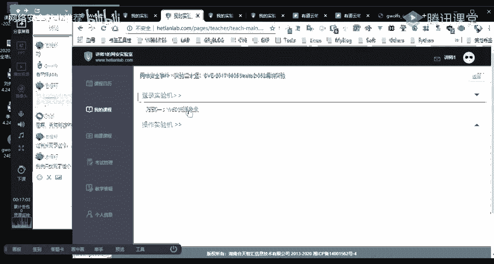

然后这个实验这个实验有有没有谁想呃，就是志愿志愿过来讲一下，就是说你是怎么去进行一个操作的，有有谁想分享一下，自己做这个实验的一个过程嘛。

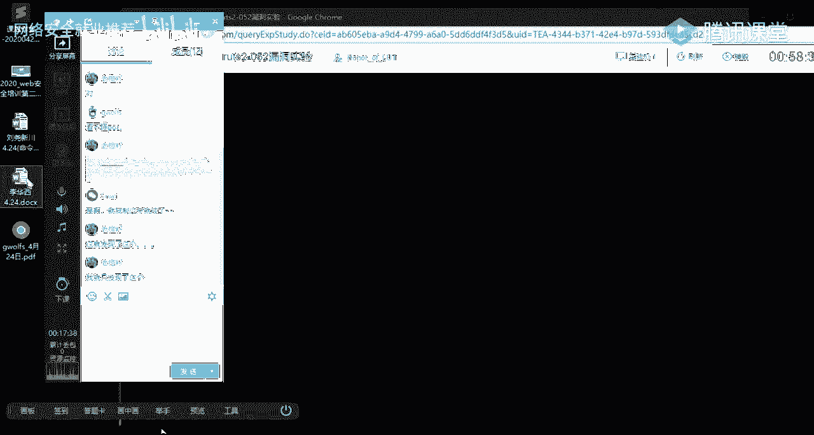

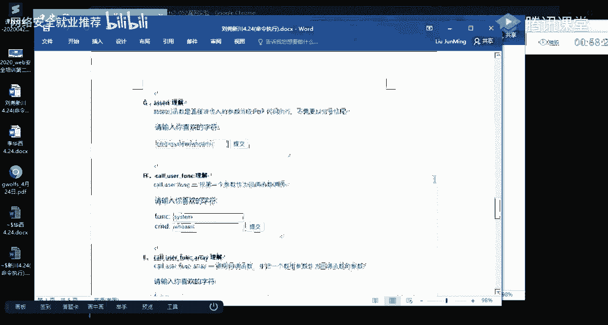

呃这里给改过来的作业的话，就呃就一位同学做了呀。

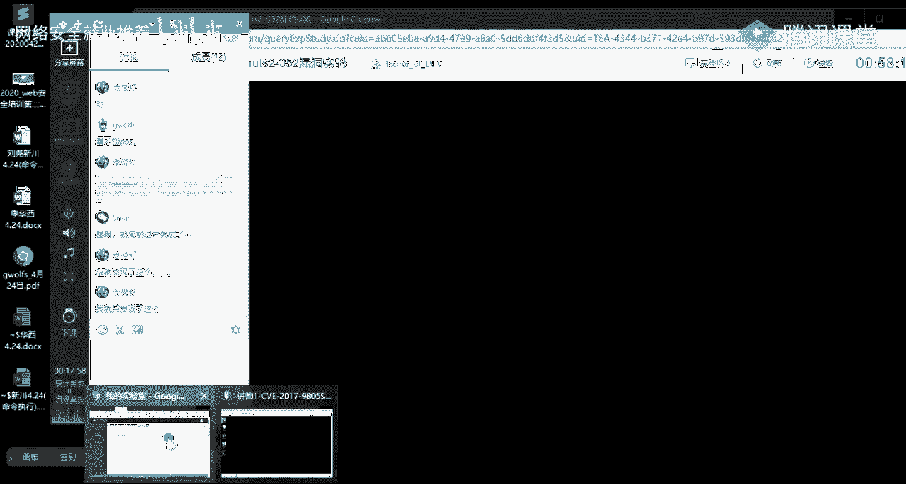

这位同学你啊想讲讲解一下吗，就说你是怎么去和操作的，就其实这个我我们看一下它的一个过程吧，好吧，其实就大家跟着指导书做的话，应该是没有太大的一个问题啊，然后前面这句话我们就呃我看了。

然后它的一个部署就是我们这个环境里面的话，就是呃有这样子的一个部署环境的一个环节，就是我们在就是在我们去做web安全，或者说去做这种外表的一个研究的时候，这种漏洞环境的一个搭建其实是一个基本功啊。

就是啊如果说你碰到一个新漏洞，或者说就是这个漏洞对吧，你想去自己做一个复线，你要你要复兴的话，你就需要去搭建环境，搭建环境的话，这个而过程当中的话，其实你可能会发现很多的一些问题。

然后的话需要你自己去做一个解决啊，这里的话就是前面的话就是先部署环境嘛对吧，然后部署环境的话就是。

指导书这里的话有一个下载链接嘛，这个下载链接的话就是这个漏洞的一个握包，就部署这个环境所需要用到的一个握包，然后你只需要打开这个呃，tom cat，就这个参map的一个环境。

然后我们就能够去进行一个访问，然后注意的话，tom cat默认的一个端口是8080的一个端口，要加这个端口，然后你才能够去访问到，对这里的话就是tom cat的一个默认的一个页面，然后这个时候的话。

我们我们需要把我们的一个握包给它部署进去，然后我们部署这个web的话，要放到这个tom cat的一个web根目录，然后tom cat的一个web根目录的话就是在好哥，在这里好的话。

有一个web a p p s，这个的话是homekit的一个默认的一个web根目录，是这样子的，好的话，我们只需要在，只需要在这里把我们的一个握包给丢进去，丢进去丢进去之后的话，我这里还没下载。

我先下载一下这个压缩包，然的话给它解压出来，截出来的话呃，解压出来之后的话，就会有这样子的一个文件夹对吧，然后我们只需要把这里面的a p p s，这里面的这两个握包，然后把它丢到这里来，丢到这里来的话。

我这两个握包的话，其实就是这个structu两个文件，就这一个框架的一个文件，然后的话呃可以看到我们只把它放进去的话，它会默认的就是这里的一个tom tom cat服务，就是把它放到根目录的话。

他会把我们的这两个这两个握把把那个解压，解压出来之后的话，就是这样子的呃，两个文件夹是吧，好的话，我们要访问的话就是，加我们的这样子的一个文件名就ok了，然后我们我们其实直接就这样子访问对吧。

就直接访问这个文件夹，它会到这样子的一个页面，然后这里指导书的话，它是呃把它呃，就是后面的话会有加这样子take orders对吧，然后大家的一个问题就是呃，你是直接就是照着指导书去进行一个。

orders去进行一个抄写的对吧，然后你这样子访问，他其实也是能够去访问到这样子的一个页面，但是的话你去点这个edit，你可以看到这里的一个链接对吧，我这里点一下，点一下这个一点的话。

它其实是会访问到这样子的一个word目录，然后然后你这里报这样子的一个问题的话，就是你找不到这样子的一个路径，没有这样子的一个路径，因为这里的话是错了的啊，其实我们只需要把这里的一个干。

就是那个表示这word这个目录的这个杠给去掉的，话，就能够去正常的去做一个啊访问对吧，然后的话呃，mp，我们先打开bp，然后这里的话其实也给了你这样子的一个plc，对吧，就这样子的。

然后这里的话其实就是一个玩我们的这里的呃，我们抓包其实也是抓这样子的一个包嘛，然的话我们其实就是往我们这样的子的一个，页面发送这样子的一个呃java的一个代码，然后主要的话其实就是执行命令的话呃。

这个不好抓，嗯怎么找不到呢，啊就是这里吧，他执行了一个命令对吗，command哎呦，这也不好看哦，嗯没有其他的机器，哦这太小了，看不清，就其实就是我们的这里的，就执行了一个命令对吧。

然后我们要写的一个命令的话，就是这里就是啊，调用我们的一个cl c的一个命令，然后你执行之后的话，它就会在这里弹弹弹出一个计算器，这里的话就说明你的这样子的一个命令的话，是执行成功了的，明白。

那这样的话其实我们也可以做一个根啊，我先发一下，我先抓个包，而且尊重，可以看到我这里执行之后的话，它就弹出了这样的一个计算器对吧，这里的话就说明我们的一个命令的话，执行成功了嘛。

好这样的话其实我们可以呃做一个更改，执行什么呢，not hard，然后我们再去进行一个发包，可以，这里的话先把它关掉吧，然后我再去进行一个发包对吧，发包之后的话，他这里的话就弹出了这样子的一个记事本。

就说明它，我们可以通过在这里修改我们的一个命令，来执行，我们的一个就是啊，我们在windows上面的一个系统的一个命令，这样的话就是这样子的一个啊命令，执行的一个实验。

然后大家看不懂这样子一个p o c的话，没关系啊，大家先知道这样子的一个漏洞，然后的话我们怎么去进行一个利用，对啊，实验的话对啊，就是按照按照指导书做就行了，但是的话你做的话还是。

你做的话还是因为你这些东西你没有接触过嘛，而且你之后的话也可能会碰到，就说你做的时候建议的话，大家做一个笔记吧，sk two的话呃，对在内网当中的话呃，在外网也有的，内网的话呃，内网的话一般的都比较多。

就说struck to的这种框架的话，因为呃然后的话在内网的话，其实很多的这样子的一些服务的话，它的一些漏洞都呃，因为在内网的话不比在外网，内网里面的话，因为呃只是内部的一些人员人员。

如果说你进进入到内网的话，内网的一些很多的一些漏洞，说不定他没有做一个及时的一个修复的话，能够直接去进行一个利用的，这个时间的话呃，还有什么问题吗，应该没有问题了吧。

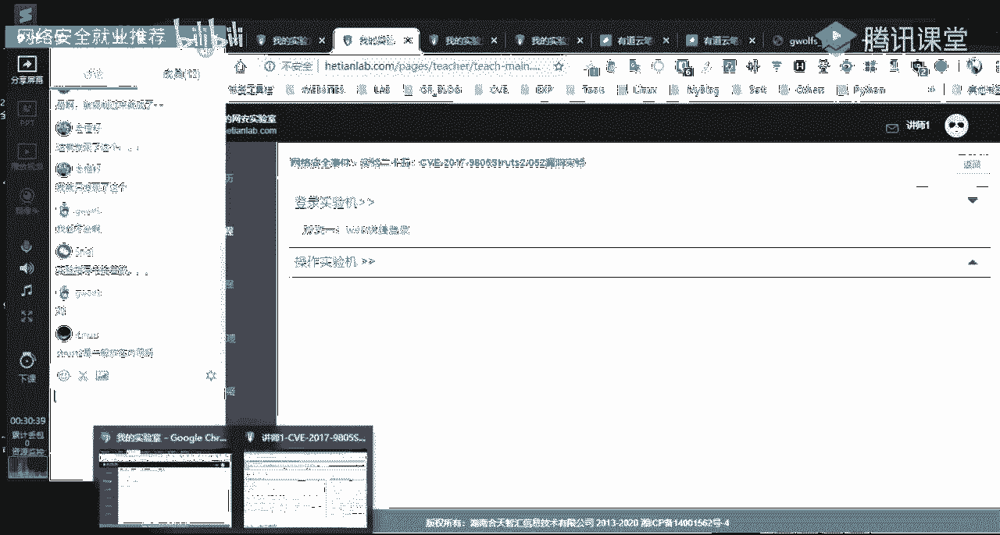

然后呃，这位同学我觉得写的很好，就是啊你就这样子的一个，就是你做完这些这样子的一个实验，这个的话就是你的一个笔记嘛对吧，就你做完之后。

这个实验的话应该没有问题啊。

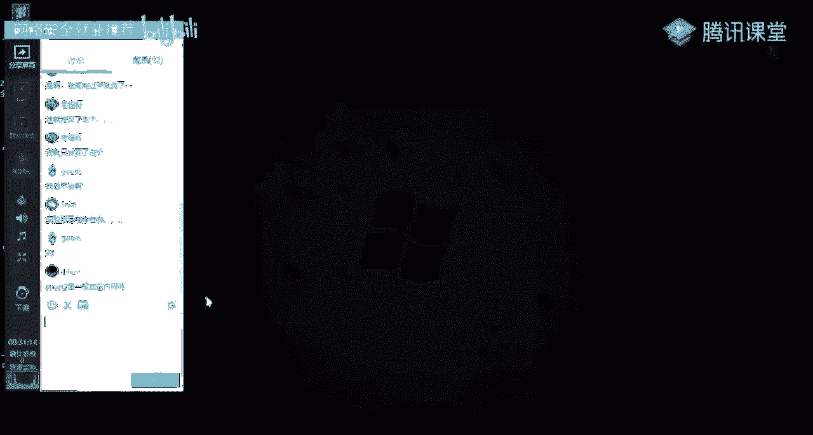

啊后面的实验还要我这个实验没有问题，呃然后的话后面还有两个实验，而这个实验的话我就不讲了吧，大家照着做吧，然后这里的话这个的话就是这个image magic，这样子的一个组件。

就是说这个的话它是在处理图像，就是呃在处理图像的一个库，然后这个image magic的话，它是存在这样子的一个命令执行的一个漏洞，然后的话呃，其实我们就是说，如果说你有碰到这样子的一个image。

这个这样子的一个漏洞的话，然后正好就是说你的，就是说你得到了这样子的一个shell对吧，你得到了这样的一个shell，然后你通过ph inf查看它，它的一个图像处理库啊，有这样子的一个组件。

然后这个组件的话正好是漏洞的一个版本的话，而且它的就是说执行命令的时候有啊，有一些限制好的话，就是说你不能够你不能够去调用我们的，比如说system的这种函数，去执行我们的一个系统命令对吧。

那么你可以尝试去使用这样子的一个，这样子的一个image magic的一个漏洞，因为这个漏洞的话，它是呃，在它的这个组件存在这样子一个命令执行漏洞，所以说我们可以通过他的这样子的一个命令。

执行漏洞来得到一个shell，好步骤的话，我就不讲了吧，然后这样的话我说一下这个三个ph p5 的一个，远程命令执行漏洞，这个漏洞的话呃，就是刚出的时候啊，是比较火的。

而且它的一个就是它的一个影响的话是很大的，因为你直接可以通过构造这样子的一个，很简单的一个payload，来去执行我们的一个呃执行一个命令，远程的一个命令，执行好的话，还能够通过命令执行写shell。

来得到web服务器的一个呃web shell，然后这里的话我这个实验的话是一个三个，菲律宾v5。1的一个版本。

然后的话还有还有一个的话，就是v五点的一个版本。

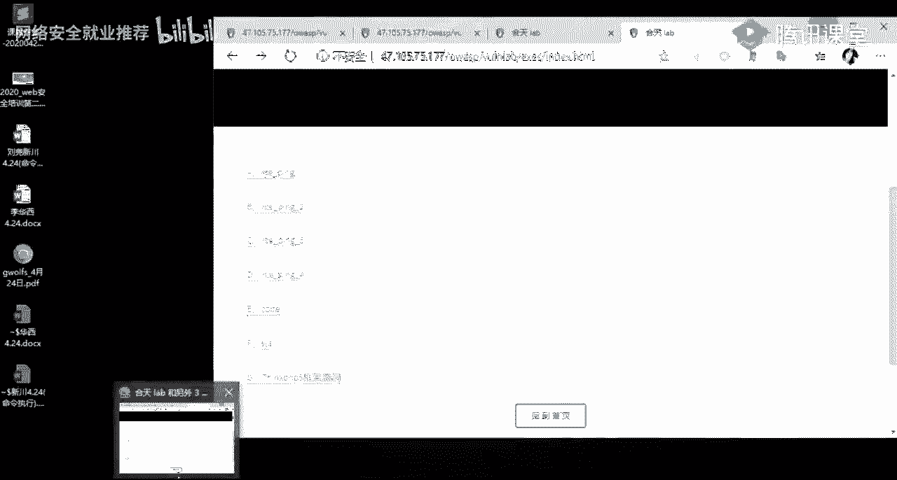

也是同样的存在这样子的一个漏洞的，然后这里的话五点的一个版本的话，我是把它放到一个啊，我们的这个靶机服务器上面去了，大家可以以这个作为一个靶机去进行一个操作，然后的话实验的话大家照着做就好可以了。

然后我这样的话就以这一个靶机做一个，就是操作的一个演示嘛。

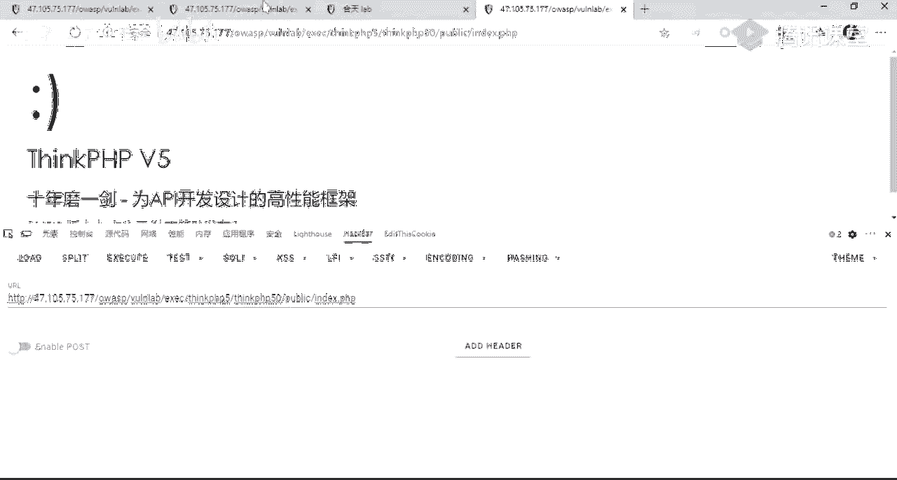

然后关于这个漏洞的一个原理的话，因为涉及到p h p代码的话，呃这里的话我不去对它做一个讲解。

就只是告诉大家这个漏洞，然后他是怎么去进行一个利用的，然后有怎么样有怎么有哪些利用的一些方法，然后怎么去进行一个测试呃。

诶。

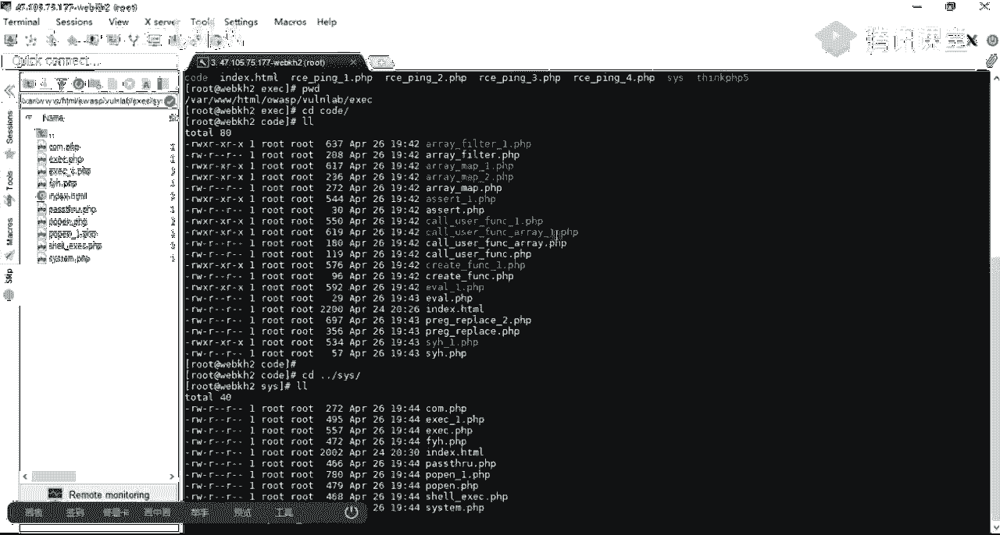

电脑有点卡哦，哎今天忘记带我电脑的充电器了，所以的话用的是电源的就比较卡，啊这里的话我这里的话有这样子的一些文件，然后大家对这一个如果说对它的一个原理，就是想去做一个了解的话。

我这样的话有有这样子的几个啊，几篇文档，大家可以去进行一个呃研究，然后的话这里的话我们主要是就是我们看一下，它的一些plc，然后我这里的话是一个五点的一个版本对吧。

我们用现成的一个plc来去进行一个测试，我们只需要在后面接这样子的一串，然后的话我们其实可以看到它这里，执行一个命令，就是这个和mi对吧，到我这里来进行一个执行对吧，可以看到它这里的话是呃阿帕奇。

阿帕奇的一个用户，然后我们这里关于前面他这里这样子去进行，一个构造的一个原理的话，我这里不说，然后啊我这里也不去给大家做一个介绍，因为介绍的话可能大家不是很明白，就是呃大家先知道这样子的一个东西对吧。

然后我们拿来看这里它的一个payload，后面这里的一个构造对吧，然后我们其实可以看到这里的话是有一个functions，这个functions的话就是这里的一个对吧，这个函数这个函数我们应该熟悉吧。

这个函数的话其实就是我们这里有讲到的，这个call you the function error这样子的一个函数，对吧好啊，我们看一下这样子的一个函数，就是说这个函数的话，它是会把我们的第一个参数。

作为一个回调函数来调用，然后的话把我们的这里这里传入的一个参数，作为我们这里的一个回调函数的一个参数传入，就是意思就是把我们这里传的一个参数啊，给这呃，给我们的这里传入的一个函数，来进行一个处理啊。

其实我们看一下这样这样子的一个例子，这个例子的话就是呃我们这里哦，这里的话我是写死了的，就在这里的话是一个第一版本的，然后我这里一个靶场，我这里一个靶场的话就是，哪一个呢，就这个这个的话就是一个。

就是我里面已经写死了嘛，然后我这里的话是啊，写了就是把我们的一个函数，以及我们的要执行一个命令，把它给分开，由我们自己去定义去进行一个传输，大家可以去，大家应该都有做。

然后这里的话就是我们把我们这里传入的，这样子的一个参数对吧，我们通过post的方式传递这样子的一个参，传给这一个变量，然后把这个变量的话负啊，给了这个error数组的第一个，第一个第一个值。

然后的话把这里的这个数组里面的参数，把给了这样子的一个s的一个函数，去进行一个处理，然后其实我们只要传的，我们是一个菲律宾的一个代码对吧，然后的话我们的一个pp代码，就会给我们的这里的一个set函数。

去进行一个解析，然后的话就能够去构造这样子的一个命令，执行好，我们再来回看一下这里的一个plc的一个构造，其实我们可以发现，他这里跟我们前面说到的一个命令，执行的一个啊构造其实是一样的对吧。

可以看到我这里的话先传这样子的一个啊，call you the function error，这样子的一个函数对吧，然后的话再传一个啊，这个传给这个数组，various这个数组。

然后他的第一个值的话是一个system对吧，然后第二个的话就是一个户外卖，然后其实我们从这里的话就能够看出来，其实这里我们给的这里的两个参数，它会给我们的这里的这一个函数，去进行一个呃处理。

然后处理的话可以看到，它就相当于是我们这里的一个这样子，去进行一个传参，我们传一个system对吧，然后再传一个户外mi，然后我们在呃不是这一个啊，最近啊不是这个，啊这这一个，关麦对吧。

然后我们去进行一个提交，提交之后的话就执执行了我们的一个呃，换mi的一个命令对吧，然后其实在这里的话，跟我们这里的话一个例子是类似的，诶哪去对吧，我们同样的是构造了啊，通过利用他的这些这样子的一个漏洞。

然后的话构造这样子的一个命令，执行的一个函数，然后给这一个命令执行的一个函数传我们的啊，传我们的就是执行一个命令的一个代码，传给这个函数，然后的话来构造这样子的一个命令，执行的一个p o c。

这样的话大家应该能理解吧对吧，就说前面的话，其实呃也要给大家介绍这样的一些函数，啊，这这个的话其实就是呃把我们这里的这个命令，执行的一个函数做了一个啊实际的一个利用。

来构造这样子的一个命令执行的一个p o c，所以说呃就前面大家不要觉得，前面讲的是一些函数，可能不是很好理解，然后的话，就是我们首先要去你了解这样有这样子的一些，能够去啊进行一个命令执行的。

一个构造的一些函数对吧，然后的话我们之后的话再碰到这样子的一些，让你去进行一个，就是进行一个命令执行的一个构造的时候，你就能你就知道怎么去进行一个使用了，然后的话怎么去进行，给给我们的这样子的一个函数。

去进行一个传输的一个传递，穿梭的传递来进行一个命令执行，然后其实后面的话也都是类似的，然后我们这里的话就是船舱的不一样是吧，可以看到这里的话是一个pp for，然后然后的话就是前面的话就是执行命令嘛。

后面的话就是一个写shell嘛，写shell的话，这里同样的也是使用的这样子的一个函数，然后这里的一个呃还有一个问题的啊，这里的一个不同点的话。

就是这个fire put contains这样子的一个函数，这个函数的话就是我们的呃，我们看一下它是一个用来写文件的一个函数，就说把我们的一个字符串写入一个文件。

就是使用这样子的一个file put content的一个函数，然后我们知道它的一个意思的话，那么我们就能够比较好理解的，这样子的一个p o c对吧，就他的一个意思的话。

就是通过这个file put content的一个函数来啊，写入到啊，就是把我们这里的一个代码写入到这样子的，一个需要点菲律宾的一个文件对吧，然后这里的话其实就是一个，菲律宾的一个代码嘛。

然后的话再给这个函数去进行一个解析嘛，然后的话就能够执行我们在这里的一个命令嘛，然后我们来可以来测测试一下，来进行一个shell的一个写入，这样的话我们直接把它粘过来贴过来。

然后我们这里直接密码的话是c c，c来进行一个执行，执行之后的话可以看到他这句话，反而这样的只对一个值的话，就说明我们这里执行已经成功了，然后我们来验证一下，看是否好，shell已经写不进去了。

我们写入的一个shell的一个名称的话，就是需要点菲律宾对我们来访问，访问发现的话，他是能够啊，就是没有任何的一个报错或者回血的话，就说明我们这样子的一个小老师，已经写入成功了。

然后我们来测试一下密码是ccc，我们执行一个pp for，执行可以看到的话是我们的一个小时，已经成功的写入了，然后嗯然后还有一点的话我再强调一下，就是我再强调一下，就是一直有同学就是有这样子的一个疑问。

就是你们的这里的，你这里传递的一个菲律宾的一个代码，一定要是以一个分号结尾的，就是以一个就是说这一个函数，它是去执行我们的一个菲律宾代码对吧，去解析我们的一个传入的一个菲律宾代码。

那么你就需要一个分号去进行进行一个结尾，然后的话就是还有一个另外一个例子的话，它的一个不同点就是这个，asset，这个asset这个set的话，我们其实前面也一直有介绍，就是说这个的话。

他是把我们它会把我们的一个呃，就是传递的一个字符串，这里是一个字符串，而不是说一个菲律宾代码，就是说它是可以不用以一个分号，去进行一个结尾的，然后的话我们这里传入的一个是一个字符串。

比如说我们就传一个ph pf对吧，这样子，然后不以分号结尾，我们去进行一个提交是能够执行的，然后你这里加一个分号，它同样的是把你当成一个字符串，然后的话他执行的话，也是能够去执行我们的一个psp代码的。

因为他这里的话是他这个函数，它会把我们传递的这一个字符串，作为一个菲律宾代码去进行一个执行，这样的话大家要去啊做一下区分啊，然后的话还有就是执行这种系统命令的时候，系统命令的话。

你是调用了一个系统的一个函数对吧，然后的话也是说没有说有这样子的一个分号，因为封号的话是菲律宾代码的一个结尾，就说表示你的这个p h p代码是啊，完成了，就是说写完了。

呃然后的话其他的一些的话都是类似的，这样子的，嗯然后的话就是两个版本不同的话，就是它就是它的一个构造的，在前面的构造的这些地方它是不一样的，呃大家这里的话大家能理能理解吗，就说应该好，能听得懂吗。

呃剩个pb 5去转，做一个探测的话，你就这你用云吸也可以，还有其他的一些看这个指纹的一些，到邮区进行一个咳咳，不好意思啊，如果你用原系，你也可以去进行一个探测嘛，你还有其他的一些可以探测网站。

指纹信息的一些网站。

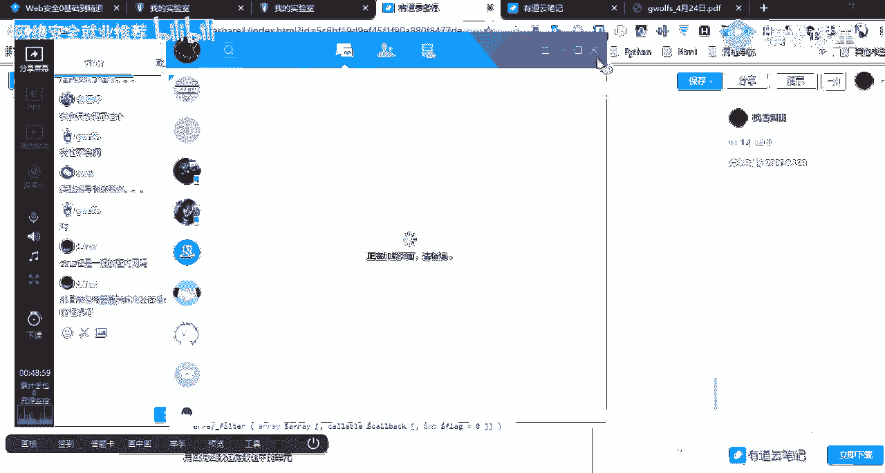

一些工具什么的。

好然后这里的话因为是一个像这种测试的。

就其实你像这种生个p h p的话，他其实啊从他的一些页面，他的一些访问的一些有链接什么的，也能够有一个有一个基本的一个判断的，比如说这种public对吧，然后在这里一个测试页面的话。

但是没有做其他的一个开发，所以的话能够直接看得到这样子的一个，测试页面，它只是一个就是菲律宾的一个框架，然后的话有很多的一些基于这一个菲律宾，三个p h p框架啊，对开发的这样子的一些呃网站。

它都是会存在这样子的一个漏洞的，指纹探测呃，我这里，呃大家有没有什么还有还有疑问吗，我刚刚那一个就是讲解应该能能明白吧，只是啊就是它的一个漏洞的，具体的一个原理的话，我这里没有讲，没有给大家做一个讲解。

因为可能现在给大家讲这个，大家也不是不会很很很很很明白，而且讲了可能还会更加糊涂，所以说这样的话，我不讲前面的它的一个漏洞的一个构造，就说怎么去通过这样子的，就是说通过这样子的一个高招。

来进行一个命令执行，然后我这里的话是把我结合我们之前的一个呃，能够去进行一个命令执行的这样子的一个函数，然后的话它是怎么去构造的，对吧，通，它是利用我们的这样调用，我们的这样子的一个。

能够去执行命令的这样子的一个函数，然后的话来执行我们的一个命令，就是后面的这一节，他是这样子去进行一个构造的，它的一个原理，呃大家有问题吗，有问题的扣一，没问题的q2 ，有有问题吗，你是有问题还是没问。

没问题。

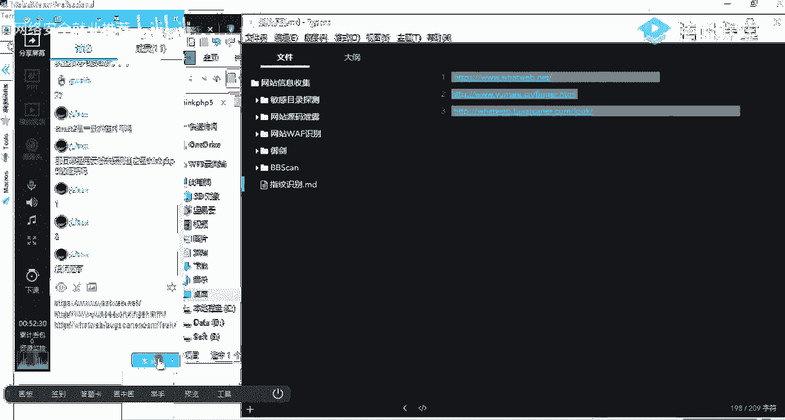

指纹识别的话，我这里给给一些网站吧，啊就这个其实用这个what web，这个的话，也能够识别很多的这样子的一些指纹啊，当然的话呃，这个的话是就是对国外的一些网站的话，它的一个这种。

比如说这种c m s的这种指纹。

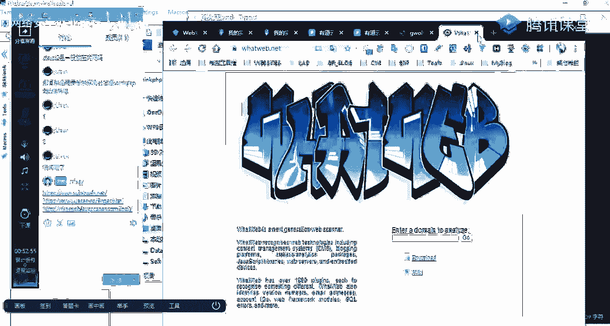

信息化识别会比较准确，当然可能国内的话准确的话不是会不会很高啊。

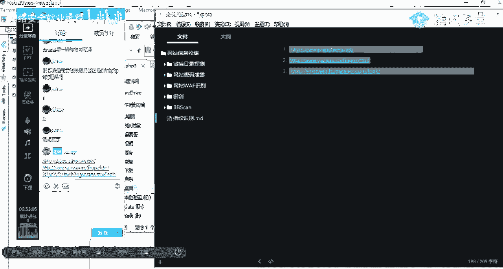

这样的话它同样的能够去进行啊，就是你网站信息的一些收集。

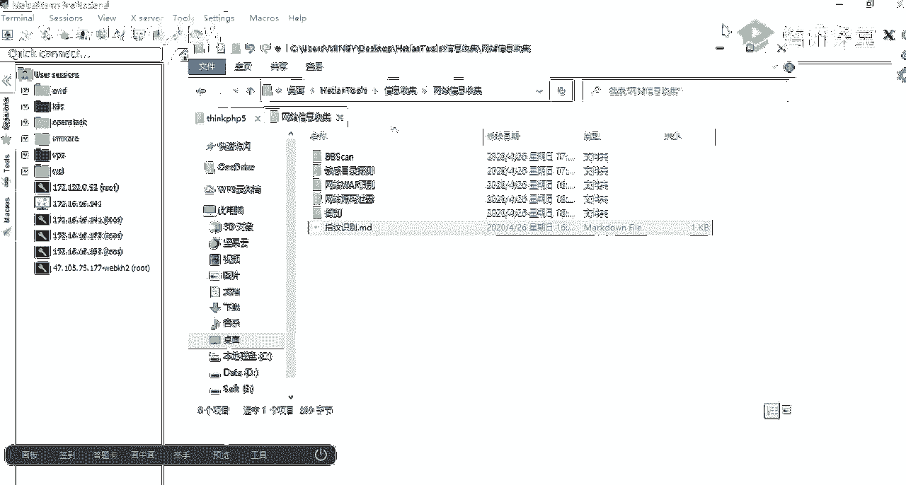

好大家没有问题的话。

那么我看一下，还有还有什么给大家讲解的，这样的话呃，我们把这些实验的话都大概都过了一遍，然后的话这命令执行的这题目的话。

如果大家还不理解的话，呃大家再去做一做做一下。

然后的话大家自己详细的一些东西的话，大家去百度吧啊，就自己去查找资料，然后的话把这些东西呃，把它给理解理解理解透，然后我看了一下这位同学，他的就是他的一个文档，我觉得，他这点的话呃挺好的。

就是可以看到他这里的话，就是在做这些命令执行的时候对吧，他不是他，我看到他有一个就是说他的一个目的，就是用这个命令执行对吧，然后去写shell对吧，这个的话大家大家不要就是大家发散一下思维。

就不要说就只是去进行一个执行一个命令对吧，我们上节课其实也讲了，就是我们通过执行命令能够去呃写信，其实最终目的嘛，最终目的的话就是利用他的一个命令执行漏洞，来得到我们得到它的一个shell。

然后的话再去进行其他的一些啊测试对吧，就这里的话，大家一定要自己去多动手去操作一下，比如说你这样子的一个echo去写shell对吧，然后的话你呃你可能中间会有一些问题什么的，对吧，这些东西的话呃。

大家只有在自己自己去进行一个操作过之后的，话，你才会啊能够去比较好的记住，或者说比较好的理解，然后的话还有直接命令对吧，通过nc nc这个工具，它的一个使用的话，我不是呃也发了一个文档嘛对吧。

那个文档的话应该写的很详细了，我这句话。

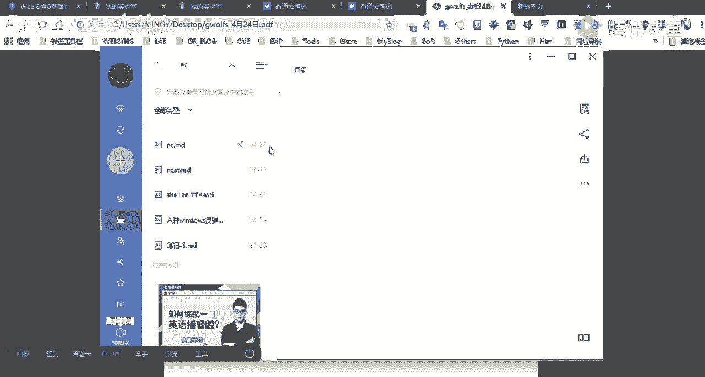

就这一个文档，就这一个工具，这工具的话我们在自己做这种啊，就是反弹shell的一个测试的时候会经常会用到，然后的话这样的话我应该写的很详细了，它的一些功能什么的，进行一个fnshell。

进行一个正向的一个连接对吧，然后这里要注意一点的话，就是你这里的一个正向连接，你要弹shell的话，你必须这个nc要支持这样子的一个，杠一的一个参数，你才能够啊返回这样子的一个shell。

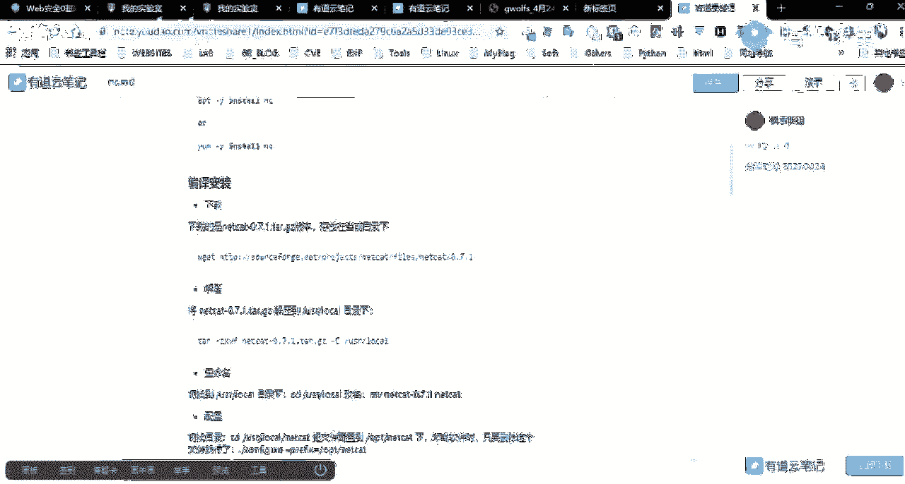

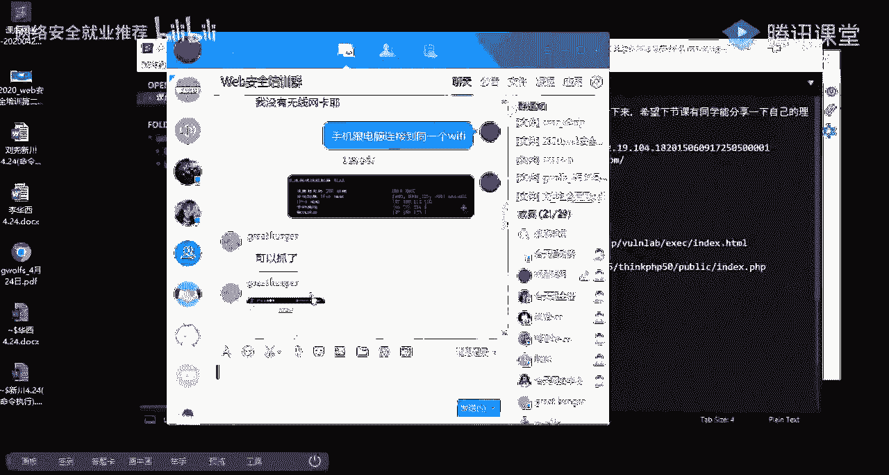

然后的话呃。

可。

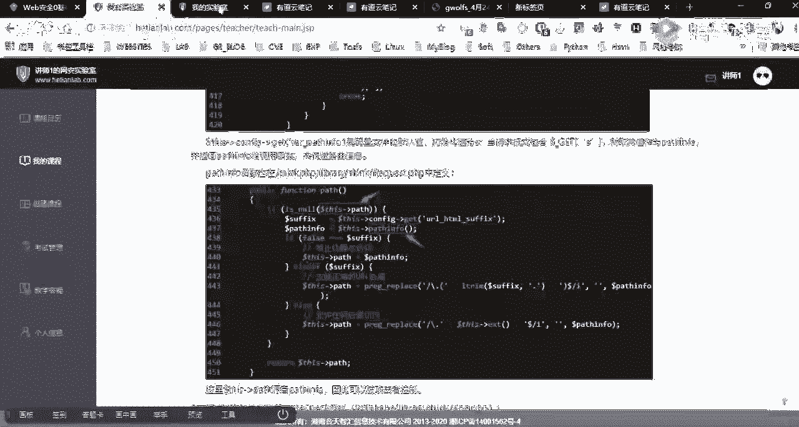

哦还有一个还有一个某还有一个地方，我在上课的时候我忘记讲了，就有一个有一个那一个。

就这一个pig的一个rep。

刚，呃这个的话呃上节课我忘记给大家说了，就是这里的这个对吧，我们前面的话给大家就介绍了这个pg replace吗，好的话，我们可以通过这样子的一个方式来构造，我们这样子的就是一个一句话嘛对吧。

然后的话这一个的话我们，最年化跟上面一个的话我做了一个改变，就是有一个更改的一个地方，然的话我们来看一下吧，就从代码来看一下，就是它的一个不同的一个地方的话，就在于就是，我们先从头来看一下。

首先的话就是通过get方式来获得，这样子的一个date对吧啊，获得从啊d参数传递过来的一个值，然后给它这一个data变量，然后给这个data变量的话就是放到了这里，放到这里的话。

就是我们要去进行一个匹配的一个值对吧，然后这些代码的话是写的是一个啊，就是匹配所有嘛，然后它同样的是一个杠一的一个参数，然后我们用我们上面的这种方式。

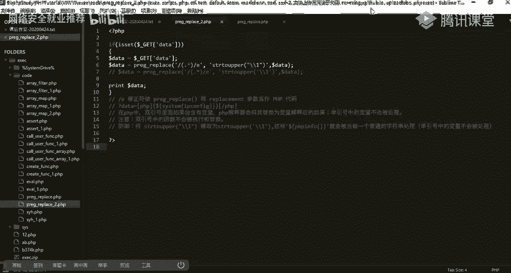

比如说我要我要让他去执行对吧，因为它有概念的一个参数。

如果我们这里去传我们的一个，hp的一个代码的话，它是能够去进行一个解析执行的对吧，这个等于，比如说我传一个pp info对吧，然后我们可以看到的话，他在这里的话，他把我们可以看到。

这里的话是输出了一个菲律宾four，然后它是一个大写的，好的话，他没有执行我们这里的一个可以拼four的，一个mini对吧，然后呃，诶没有，我们之前的这个，ig进行一个直行。

可以看到这样的话是能够正常的执行，我们的一个ph p代码的，然后在这里的话，他把我们的一个p h p的，一个本来要执行的代码，他做了一个大写的一个转换。

就把一个小写把它给转成了一个大写好，我们来回看一下代码，它这个不同的话其实就是在这里，这里的话它的一个它这里有一个代码，就是把我们的一个传传入进去的。

这这个值把它做了这样子的一个处理，这个处理的话就是把我们的一个函数，把它把我们传递的一个字符字符串。

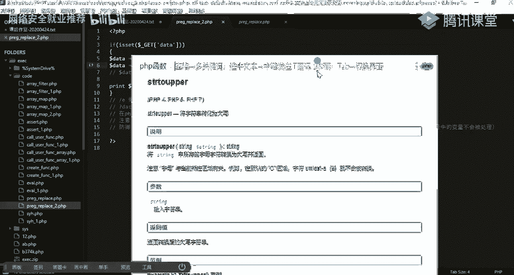

把它转化为一个大型，然后转化为大写的话，它就没有，她没有去进行一个执行菲律宾的一个代码，然后这里的话要去logo，而且绕过他的这样子的一个呃这种方式的话，我们就通过我们前面的这样子的一个，就是双引号。

就双引号里面如果包含有变量的话，它的一个菲律宾解释器，它会将其就是替换为一个变量，解释后的一个结果，就是说意思的话就是说在上双引号里面，如果是含有变量的话，那么他会呃首先它会p h p解释器。

它会解析我们啊，这个变量里面的一个ph p代码对吧，解析之后的一个结果，它就会呃把它就是解析之后的一个结果，就是我们这里的一个啊，这个双双引号里面的这一个变量的一个结果。

然后的话单引号的话他是不会做一个处理的，所以说我们这里的话，因为我们传入的一个值对吧，传入一个值，它会给这一个啊函数做一个大写的一个处理，然后如果我们是用这样子的一个双引号，去进行一个传递。

然后的话传递的话是一个这种变量的一个形式，那么它首先会去，就是处理我们这里的一个啊pp的一个代码，然后解释这个p h p代码之后的话，就是能够正常地执行我们的一个传入的，这样子的一个代码。

我们可以来看一下。

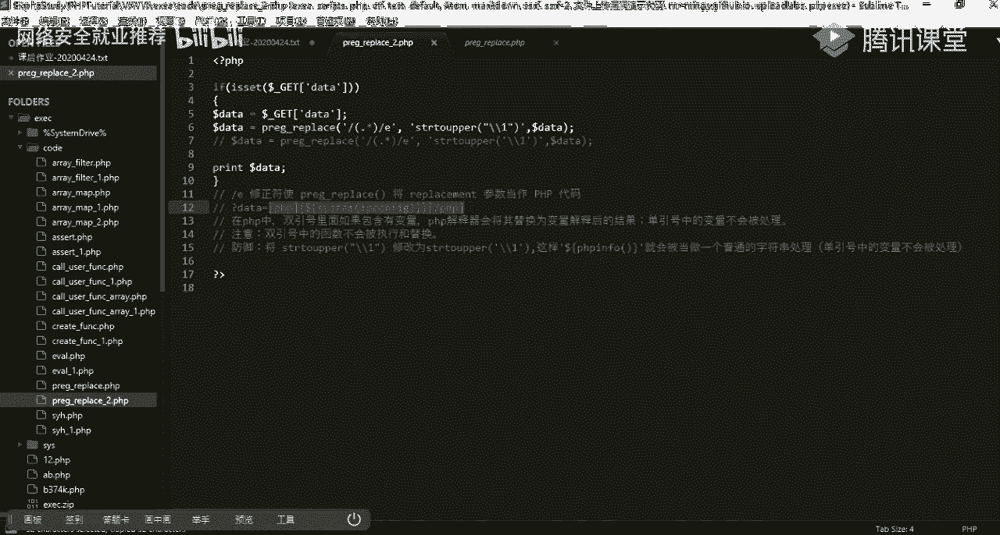

拍拍乐的话就是像这样子，我们确定一个呃，啊这里这里是在linux的话，不是ip config，if configure好，我们去进行一个执行，然后可以看到的话，他这样的话是执行了。

那首先把我们的一个ph p代码对吧，就做了一个呃解释执行，执行之后的话就是它的一个结果就是输出来，然后这个就是啊这里的一个传入的一个变量的。

这种就是绕过他的这种写的方式。

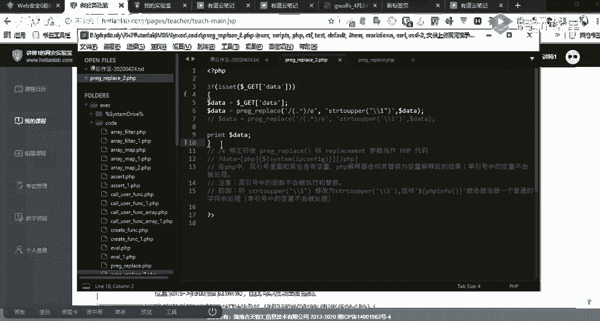

我们可以通过这样子的一个形式，来去进行一个命令执行，然后这里的话啊上节课是忘了讲了，就是讲完这个之后的话没有啊，就是上节课不是有一个那个双引号吗，双引号的这样子的一个题目，就像这样子的对吧。

然后我们在双引号里面的这个代码的话。

他会直接去进行一个解析执行的。

呃然后的话呃大家呃有有没有什么疑问呢，怎么进我分享的一个文档，呃，我不是发在群里了吗，那个分享的这个这些文档，然后你不是啊，不是直接就可以访问到吗，我这句话是写在有道云，有道云笔记里面的。

就我是通过有道云分享出来的，呃，然后然后你就是我把这几个链接我再发一遍吧，我发群里，你直接通过访问这些链接，就能够访问到我的，我分享的这这些笔记啊，我再发一遍，然后然后你这里可以保存啊。

就是保存保存到你自己的一个笔记嘛，然后你不想用这一个有道云的话，你可以下载下来吗，然后这个的话是一个挖个洞的，八个洞的一个格式，这种可以打开，然后你可以用那种，就如果你知道怎么写马克东的话。

你可以下一个马克东的一个编辑器对吧，然后用那个打开啊，其实呃你你们自己做一个笔记的时候，也就我反正做笔记的话，我是习惯用习惯用马克动哦，就是用像这样子的一，因为啊自己做的笔记的话，你肯定看起来要好看嘛。

因为你不是说做完之后就不用了，你做完之后相差也要看对吧，你这美观一点的话呃，看起来舒服一点吧，然后你这里写不上，是说啊这个三个hp你写不进去吗，是你是说这个三个app菲律宾你写不进去吗。

啊plod出来了，然后呃这里的话其实哦我这个有发给你们吧，其实我在这个网站上面，哎我课后的话我再发给你吧，然后这里的话是有一个啊我ppt里面其实也给了。

就是有这样子的一个get shell的一个脚本嘛对吧，他是用python写的，其实其实你看一下它里面的一个代码的话，其实，也不是很难啊，就是其实主要的话就是在这里，在这里。

这里他可以看到他这里的话有这样子的一些plc，对吧，这些p c的话其实就是我们呃就我这里的诶，就这些这些测试的一些p o c对吧，然后的话他直接把它放到这里来，放到这里的话，然后通过python去啊。

请求指定的，这你给定了这一个ul对吧，然后的话把这样子的一个plc把它给放进去，就就是把它给拼接，拼接之后的话去访问嘛，然后访问之后的话看他的一个回血，看是否能够呃访是否有能够访问成功。

然后的话不是有一个就是输出一个，就测试一个plc，哪个plc可以用吗，它就是这样子的一个形式，然后的话还有就是他可以这里可以get the shell嘛，get shell的话其实就是通过写嘛。

通过写一个菲律宾的一个呃，通过这种可以去写啊，就写我们的一个一句话对吧，然后的话连接连接之后的话，他这里的话是通过代码来展示的，这样子的一个get shell的一个界面嘛，其它的一个原理的话。

就是这些pop c就大家如果自己也知道了，然后如果你懂派审的这种话，你自己也可以去写这种测试的一些脚本的，这也不是说很复杂，然后的话呃大家呃有问题的扣一，没问题的q2 ，然后的话我再给大家一分钟的时间。

进行一个提问吧，mc，看一下嗯，手干扰。

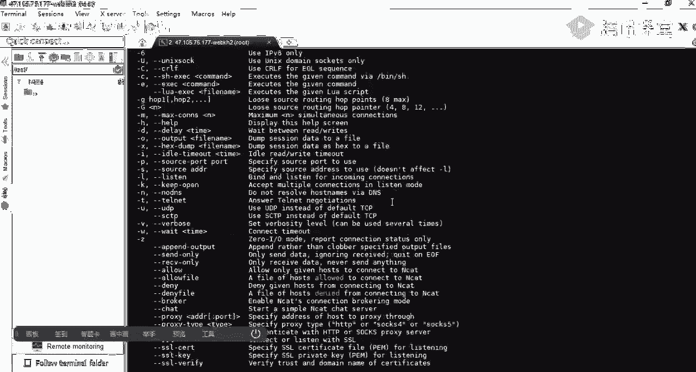

这里的话我也没我，我没这样子去尝试过了。

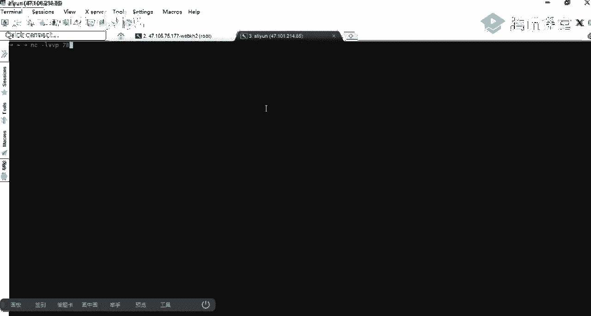

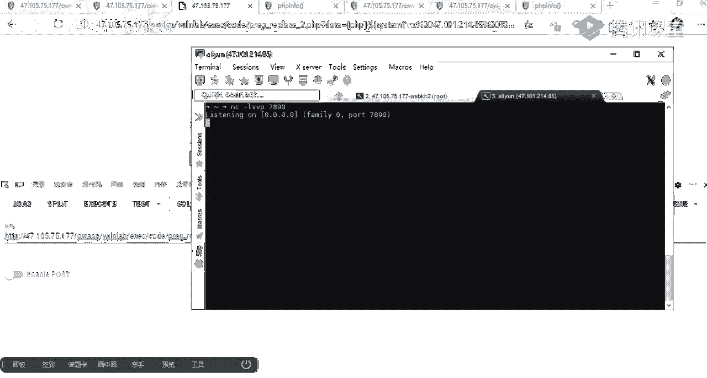

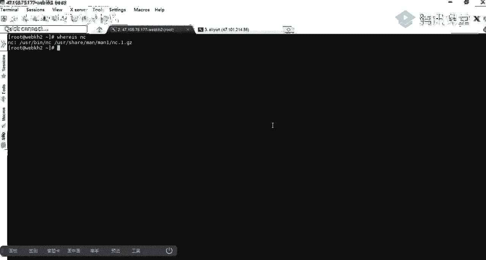

不行啊，不能这样子去进行一个，不能这样子去进行一个命令的一个执行，这样的话我也没我没这样子去尝试过呀，呃我课后再去，我课后去研究一下吧，你看那个叫啥呀。

不行不能这样子。

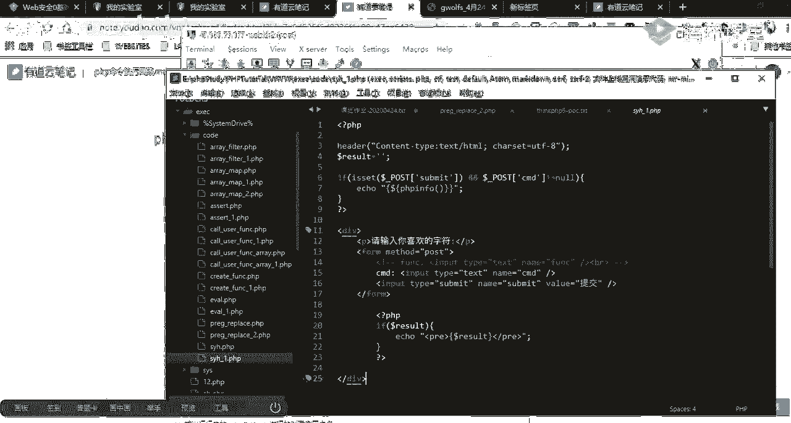

不能这样子去执行，那这样的话只能执行这里的一个单个的命令，空格啊，这个的话我课后我去研究一下，如果有结果的话，我再我再跟你们说吧，还还有其他问题吗，这个的话呃，我课后我去尝试一下，因为我没我没有去。

我也没去尝试过这样子，有问题的扣一，没问题的扣二，如果没问题的话，那么我们哦本节课的一个内容的话，就到这里结束了，好没问题是吧好，那么那我们下课吧，好吧好啊。

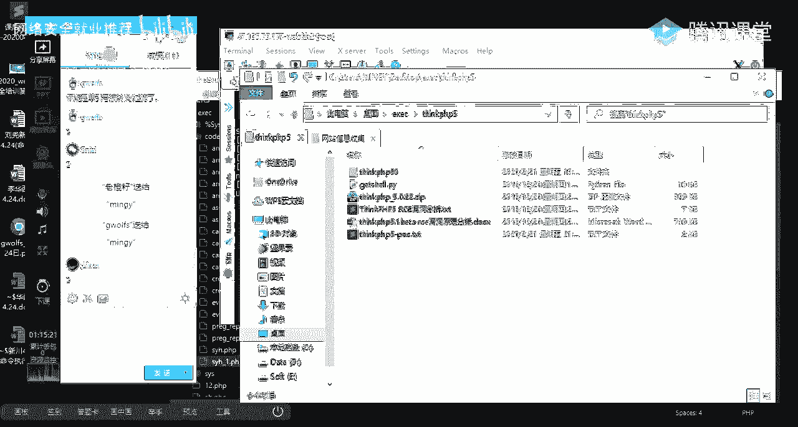

命令执行的一个课程内容的话，就就到这里结束了。