# P25：第23天：CSRF漏洞-CSRF基础及漏洞防御 - 网络安全就业推荐 - BV1Zu411s79i

看一下，叫什么去了，嗯好，当时那个就不管了，开始了今天的一个课程，今天要跟你们讲，把这个关了啊。

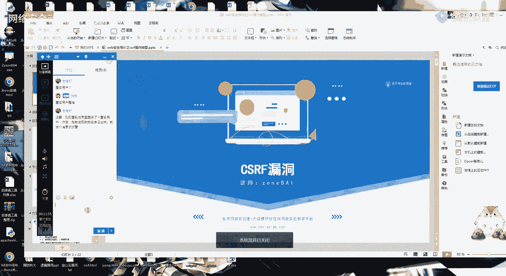

有声音吗，有声音的话给我扣个一好吧，好今天要给你们讲的是一个csrf的一个漏洞啊，这一个漏洞呢，就是在我认为我要是一个比较简单的一个漏洞，也是我们在挖掘src的时候，网络断了一下，我刚刚网络断了一下啊。

这个csf漏洞就是在我们src漏洞挖掘里面。

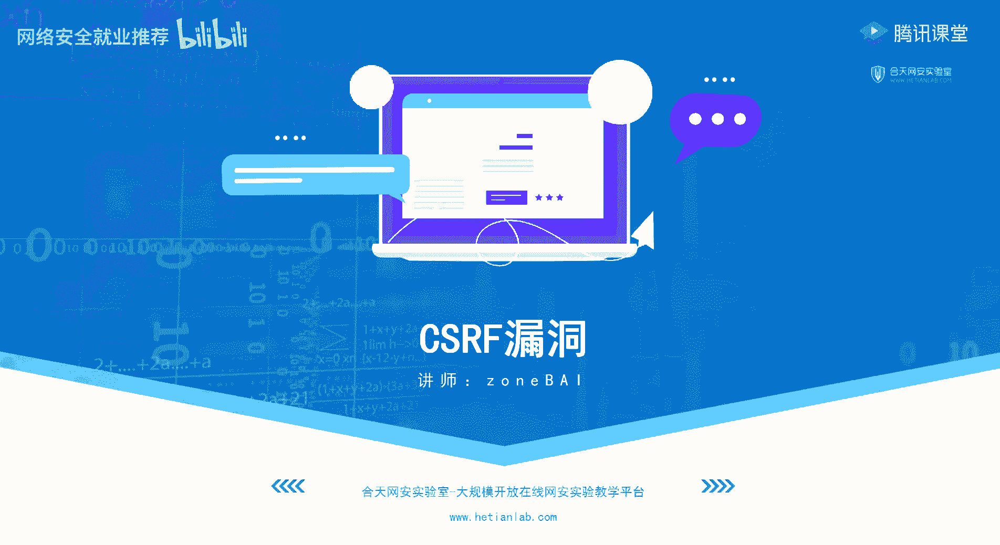

是一个捡钱的漏洞，大家懂吧，知道什么叫捡钱的漏洞吗，就是因为他这个cs i f它的一个实现啊，它的一个漏洞很好找，但是呢挖的人又少，所以呢我就可以利用这一类的一个捡钱漏洞，去对我们的hrd进行一个刷好。

今天就开始跟你们讲csf漏洞，首先看一下今天的一个内容，第一个是cs rf漏洞的一个简单介绍，第二个呢就是cs rf一个漏洞的一个利用，第三个呢就是cs rf漏洞的一个寻找，我们来看一下介绍。

csf呢是叫跨站请求伪造，啊要跟你们的一个xs s区分量差s s cs i f，他这里呢它的意思呢，就是挟持用户在当前已登录的微博应用程序上，执行一个分本义的一个操作的一个攻击方法，这里呢是什么意思呢。

待会给大家看实例啊，就是给大家通过大家从实例里面来，看到一个是什么样子的一个攻击，首先我们看一下bf f漏洞的一个纯音，第一个就是网站的cookie在浏览器里面不会过期，只要你不关闭浏览器或者退出。

那你只要在访问这个网站，都会默认你已经是一个登录的状态，然后呢，这个时候我就可以发一个构造好的csf脚本，或者含有csf脚本的链接经理进行一个点击，然后呢，你就会根据我这个攻击脚本里面。

执行一些你不想执行的一个操作，啊csf的一个简单的操作，这里是给你们发了一个预期的一个实验，就是csf攻击实验，我们这里啊应该有做预习的吧，有做预习的就可以先看一下啊。

先看一下我们的一个简单一个操作好吧，这里呢我们首先啊看他这个实验了，这里是用一个简单的一个账号登录，然后呢你可以看到这里呢，就是一个简单的一个留言的一个功能，他自己因为一个。

因为一个啊实验机的一个原因啊，只能通过我们的f 12去看一下，它的一个链接记录，选择这个地方啊，它会有一个历史的一个请求，这里呢我们首先来看一下，因为他这里的功能点大家还记得吧，这里呢就是一个。

添加一个内容的一个功能，至于我首先添加一个功能，你可以看到一个请求，然后呢在这个地方，你可以看我刚刚添加了tt 123，然后这个内容123，他的一个请求就是这样子的，对不对，就是我们在执行啊。

在登录了一个网页之后，然后要执行操作，都是通过这一个请求来进行一个操作的，然后这里呢的一个添加留言的一个请求，就是这个样子，然后我们看一下啊，看一下它的一个，恶意请求网址，好我们来看一下啊。

我们的正常操作是不是这样啊，我这里登录了一个页面，然后我没有，我弄了一个网页，我们要把它关掉，首先你要记住一个点c f f，所有都是进行，在我登录了这个页面的一个情况下，然后呢我又访问了这个链接。

然后我们再刷一下，是不是可以看到这里就多了一个恶意的标题，跟一个恶意的内容，那他这个是怎么来的呢，我们看一下这个攻击页面，看到这个位置没有，这里呢有一个image src等于这个title等于恶意标签。

然后等于恶意内容，然后进行一个添加，这里呢就是因为我们刚刚的一个添加留言，的一个请求，是一个这样的一个样子，然后呢，我这个攻击者在自己的网页上，也添加一个这样的一个请求，然后当别人在登录的情况下。

访问到我这个恶意的页面，就会执行我这一个页面里面，进行构造的一个请求。

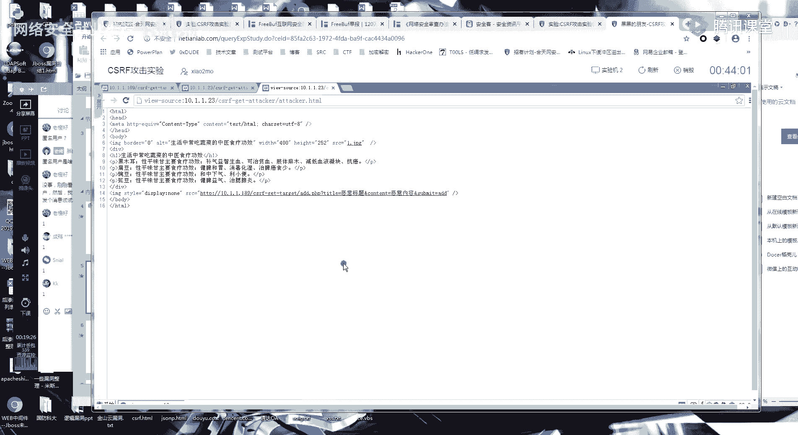

csf就是这么一个简单的一个漏洞。

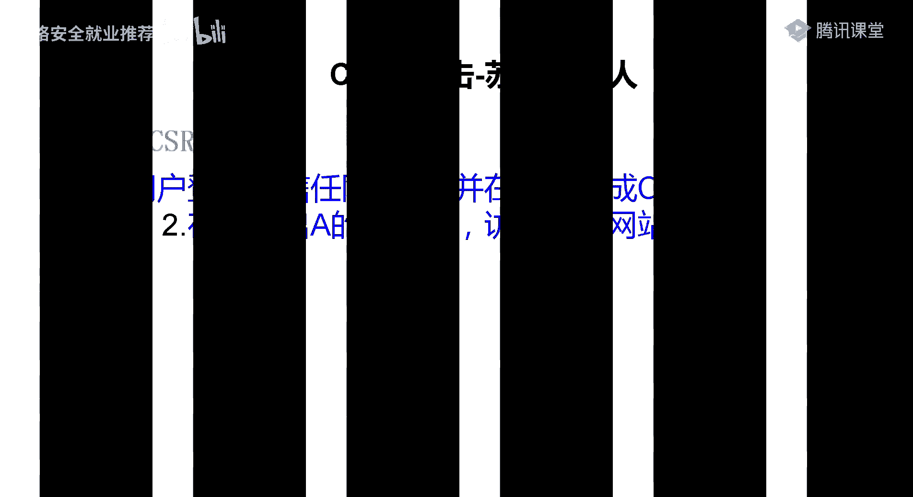

我们啊通过这一个csf的一个模型，来看一下什么是csf，首先第一个，是登录网站a，这就是我们的一个安全网站，然后这里呢它就是产生了一个cookie对吧，cookie之后cookie因为是在浏览器这里。

然后呢，我在这一个误登录出a的情况下，访问危险网站b，然后b呢就会发出一个请求，就是一个a网站的一个请求，然后呢他是一个a网站，就会执行b网站上的这样的一个恶意请求。

也就是说我这一个人在不知不觉的一个情况下，就执行了一些不想操作的事情啊，你可能觉得就是像刚刚的可能没有什么关系啊，但是你要想好，在以前就拿现在来说吧，如果你是一个管理员的用户，或者你是某平台的用户啊。

我是不是有一个注销账号的一些操作，注销账号，修改密码，绑定手机，这一些都是一些危险的一个操作，然后再仔细地回顾一下一个过程，登录a然后产生cookie，然后不登录出a的情况下访问网站b。

然后就是执行这个网站b上面的代码，如果做过这个运行实验的，应该是对csf有一个，了解了呀，就是一个简单的一个了解，那我们今天要学的是什么呢，这个cs不漏洞，你理解起来非常简单。

那我们今天要学的一个操作是什么呢，我们要学的一个操作，就是如何去构造这一个cf rf的一个利用代码，然后如何去寻找一个cf rf的一个漏洞，利用好理解csf是什么东西呢，你给我扣个一。

嗯大部分的话应该是理解了呀，然后如果还有呃，如果还不理解的呀，就是再去做一下，我给你们发了这样的一个实验，或者你继续听啊，就是我后面的后面的一个过程会给你们看，首先csf我先不看它的一个定义。

他正常的是有一个增删改的一个操作，另类的cf f jason，pcr s跟赛事跨越结石这种文件读取的，我明天会讲，我今天的一个重点就是这样这一个，基于增删改操作的一个csf，呃首先我们来看一个操作啊。

首先你要知道cf i f的一个本质，就是在不知情的一个情，啊在一个不知情的一个情况下执行一个请求，啊这里呢你要想到一个是吧，请求我们在哦，我们在浏览网页的时候，你们是不是学过集中请求啊，应该还记得吧。

get post，这两种请求是最常见的对吧，当然还有更多的一些其他的一个请求，所以就不说了，见得最多的就是一个get跟一个post，这个post，这个csf呢也是根据你这一个请求来进行一，个划分的。

这里呢用一个db w a的一个靶场，给大家看一下啊，就是先给大家看一下，b b w a的话啊，因为他这个有点臃肿。

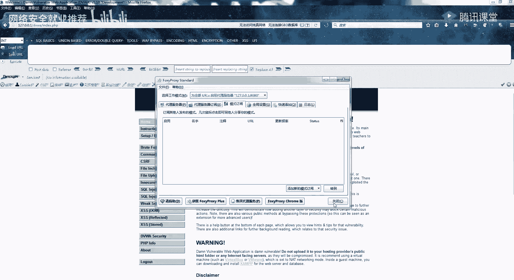

我就没有搭在公网上了，官网上的话也是有一有一些。

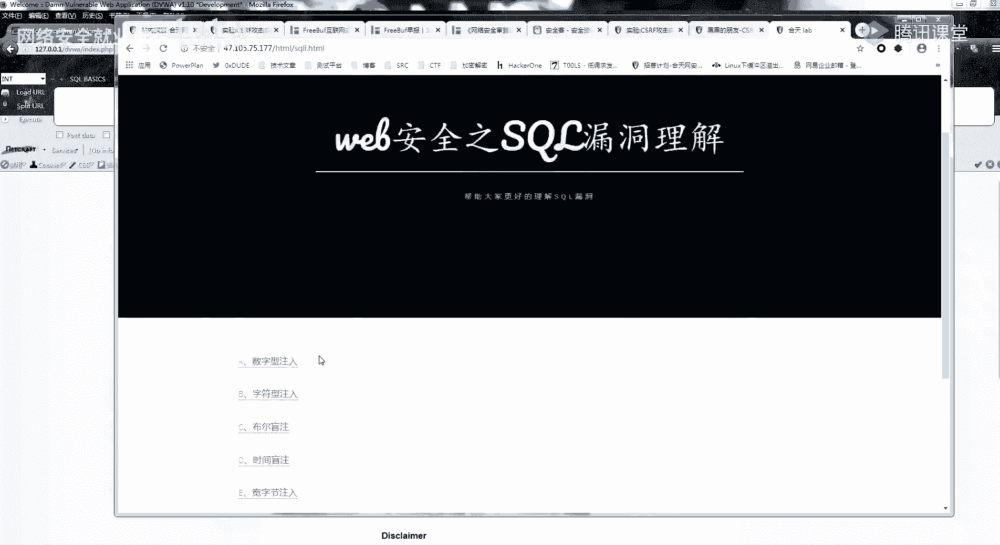

那个有些有有八场的，这里有一个提示c m s的一个csi f，待会呢，课后我会给你们布置一个特殊的课后作业，一个特殊的课后作业，可能跟平常的一些课后作业会有一点点不一样。

这里呢我们还是先来看什么是csf，好这里呢dbw的一个简单靶场是这样的，他这里的csf呢是一个修改密码的一个操作，我没我自己先随便输一个密码呀，这个命我的命，啊然后你可以看到。

我修改密码的就是一个这样的一个get请求，这是一个这样的一个简单的一个get请求，那你说这个请求我们是不是可以模拟过来，啊如果我是这样，我在我的网页上插入了一个这样的一个链接，我，好吧，我在。

如果我在我的网页上，插入了一个这样的一个链接，大家觉得会发生什么，这要是在我一个登录的情况下，你可以看到我这里的密码是改为了admin adm，然后呢，我把这个页面先把它关掉。

我这里呢我就随便写一个html，这个先关掉吧，随便删，我插入一个请求啊，你们首先要看到呀，我这里的一个http，它的一个链接，跟我的这个修改密码的这个请求是一模一样的，然后呢我就用这个浏览器。

那你们还可以看到啊，回炉这个浏览器，反问一下，看一下我们的一个源代码，看到没有，它这里呢就会加载一个这样的一个请求，我通过f 12看啊，这是因为呢我们的image这一个html。

你们之前学了一个xx应该是知道的，他这一个呢是会自动加载，然后我看到这还是之前改的对面的命，然后我退出来再试一下，这个命令的命，你可以发现登录不了了，是不是我的命，救救命，123。

他自己的密码呢就改为了一个admin，二三，也就是说执行了我们的刚刚这样的一个请求，因为我修改密码的一个请求是这个样子的，可以看跟这个是对应的，那这里呢你们是不是可以想到一个攻击点了。

就是我们怎么进行一个攻击，就是首先好就举个简单的例子，我就拿和田为例啊，你们有登录了和田的吗，有登录了和天王的实验室的吗，登录了给我扣个一，一个都没登吗，啊这个因为无所谓啊这个位置这个位置无所谓。

因为影响不大，就比如说我啊csf修改性别嗯这些这种东西，所以我们的一个工具场景呢，就是我在登录的情况下，我发啊，我就给你们发一个html的一个代码，呃为了逼真一点，我就发个网站吧好吧。

我给我服务器上面去看一下，啊你们可以地址修改还是在哪个地方去了，还是同样的是一个请求，修了修了修了，你可以看到，他这个他这个位置已经加了token了，但是我把token删掉，我再试一下啊，违法操作。

他这里已经修复了，那我就再找一下啊，修改学号，好修改学号，这里我这里呢就改，我看一下能不能改特殊的字符啊，可以加，这里的话，自动加载吗，我在上。

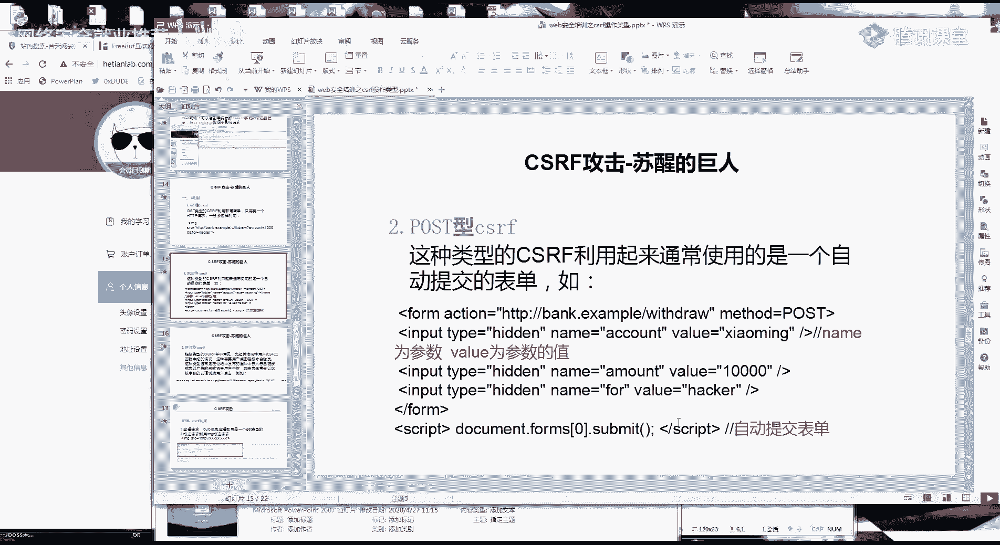

六，然后网址是，好我这里呢就给你们发个链接，记住啊，你要在登录和天晚上实验室的一个情况下。

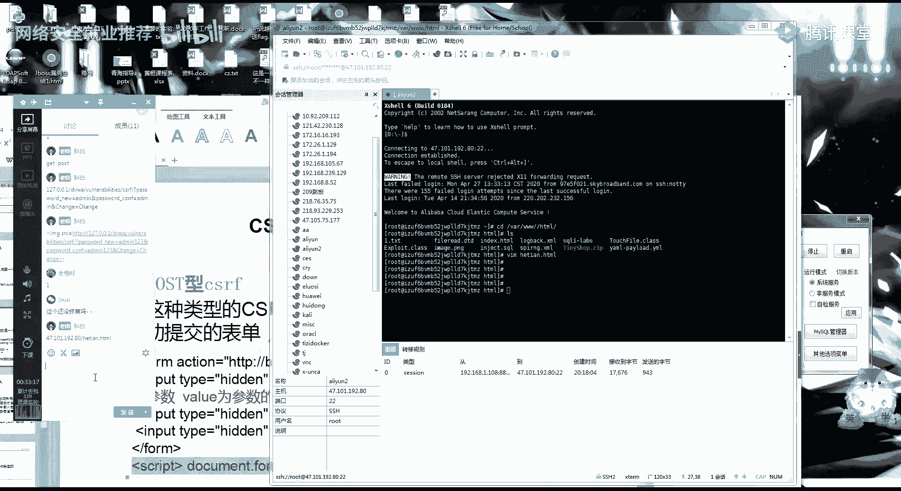

然后你们呢去访问一下这个链接。

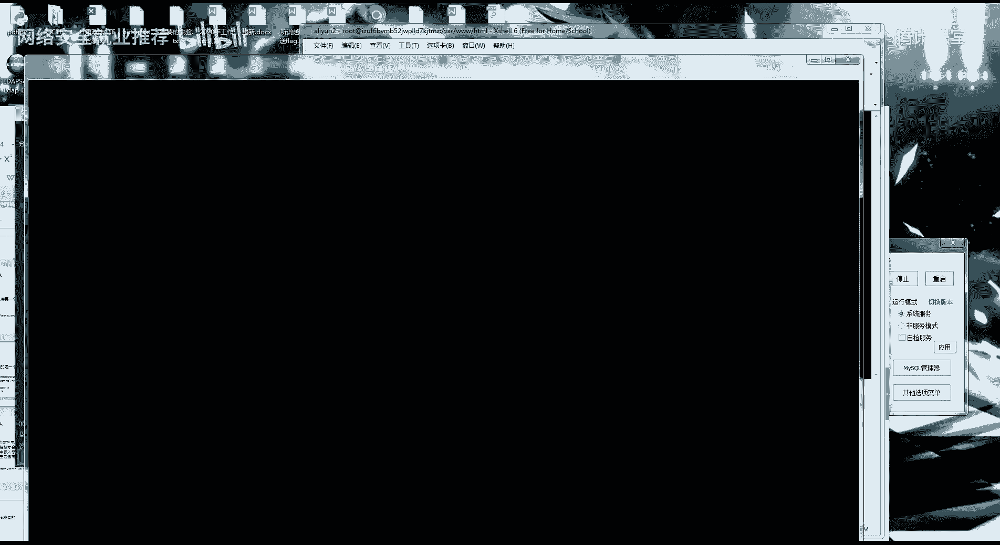

应该还记得吧，我这里的学号是3456，然后我再切回来，就是因为我访问了刚刚是一个链接，我记得学号他就进行了一个改变，对吧，所以说啊假如说假设，假设你这里比如说你有一个你重新刷一下，你登录了吗。

肯定是可以改的，其他信息，这个学号这里，假如说啊假设我这个请求是修改密码的请求，然后你点了我这个链接的话，是不是有可能可以把密码修改了，当然这里是不行的呀，网安实验室对于重要的影响大的功能。

全部都是做了验证的呀，所以我们的一个攻击场景就很容易解决了，就是很容易知道怎么弄呢，这里呢首先看一下我的刚刚的一个，哎学号无所谓了，这个无所谓的这个无所谓了，首先我们要有一个。

首先你看一下我的一个工具的一个构造过程啊，首先我是不是通过一个抓包，通过一个抓包，知道这个请求，然后呢构造这个请求的html，然后再给用户进行一个打开，你可以看，那我为什么啊，首先其实你们刚刚可以看到。

为什么我一眼就能看出来，哪些地方有一个csf呢，哪些地方没有，这里呢下一节跟你说，待会跟你说好吧，这里我们先来看一下，我刚刚的一个构造的一个利用，首先第一个让你们加载页面的位置。

它的一个标签如果是个get请求的，我们刚刚的一个dv w a，这里是不是就是有一个image的一个标签，image sr c等于这个啊，我发到群里啊，首先这是get的这一个链接呢，就是我们的一个请求。

你想要执行的一个请求，这一点应该明白吧，然后第二点呢这个也很简单，是一个cost类型的，就例如刚刚我们的这个请求，这个post类型的这个3w和天，在这个位置，这里呢是我们的一个请求位置，这里就对应。

然后这个post这里呢就是一个参数，然后这里呢是参数的值对应的这个地方，这个点呢就是自动一个自动提交表单，这个不用改，你改这里就可以了，也就是说你照着这个模板去进行一个更改，这应该会改吧。

应该还是比较简单的，看一下它的一个简单利用，这里呢是之前的一个，这是之前的一个csf的一个实例，晚上实验室的这个地址的信息的这个位置，当然这里呢是有token，这是没有的。

我这里呢先是抓到了这个请求的一个包，然后构造了一个这样的一个请求，构造了一个这样的一个需求，待会儿呢我会给你们看一些案例啊，就是下完课之后，实际的案例啊，然后让别人点击这个链接，它就执行了。

那我是怎么发现这一个数据包，就有一个cf i f呢，首先我们要来看一个，首先我们要分析请求呀，就是要知道分析数据包，我记得我是跟你们说过的，挖洞全靠分析数据包啊，首先第一个点，你首先看这个请求啊。

我拉一个没有没有，遇到这个包吧，等一下位置啊，这一个包呢是没有csf的一个包，这个包呢是有cfa和的一个包，你们可以看出这两个的一个区别吗，这两个包的一个区别，对token这里面还有一个对应的一个。

这两个数值是没有办法获取得到的，然后我有csf的包，就是所有的参数我都可以得到，然后我这一个包你可以看到我把所有的都删掉，都无所谓，诶这个不能算，这个不能删，哎哎，tap啊，这个可以。

这里呢就是我这个参数呢是自己可以得到的，我这里唯一的区别就是我这个token，我没办法得到，那你想啊，如果我这个所有的参数都可以自己得到，那我是不是我就可以伪造一个请求，就是请求可以伪造。

csf的漏洞就在于这里，我这个数据包可不可以伪造。

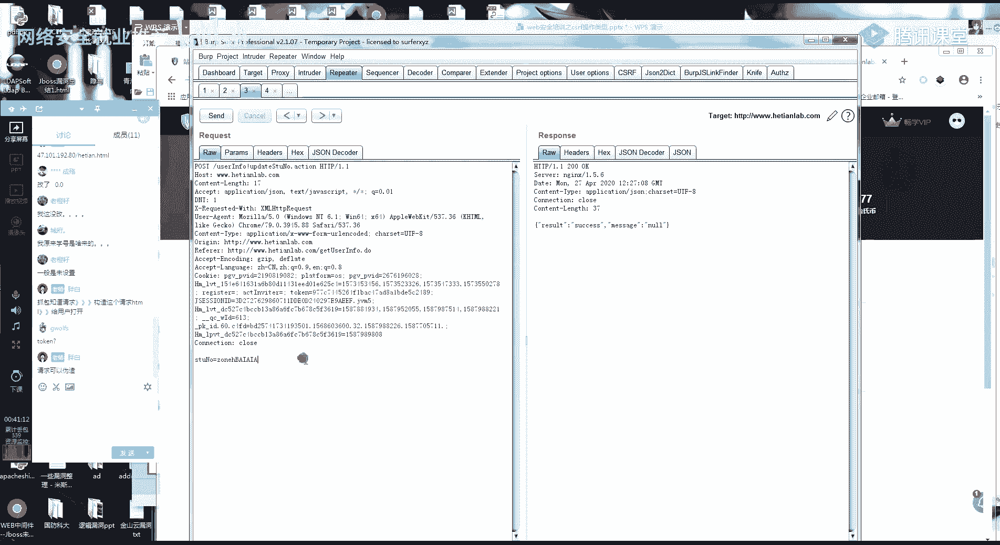

而且你可能会觉得麻烦。

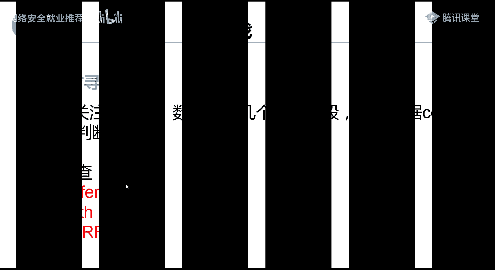

其实你要检查的参数基本上只有这三个的样子，只有这三个，没有什么其他的一个特别的一个点了，这里呢还是同样的，给你们看一个真实的一个数据包，进行一个分析好吧，最近刚好在露娜一个，月黑风向有一个东西啊。

首先呢我登录一个账号给你们看，首先你要判断一个东西啊，我浏览器是怎么识别你的身份的，啊你可以看到这一个呢，这就是vip kid的这个包，首先我要判断浏览器是怎么，他们这个包是怎么识别我的身份的。

首先第一个点是不是通过cookie来判断的，我把cookie删掉，411什么什么什么，什么鬼，他把我给ban了吗，首先我要来看就是啊我这一个整个数据包，除了cookie之外。

还有没有其他数据是来判断我的身份的，还没有其他的字段，首先这些正常的字段都是无所谓的，这些正常的一些这些正常的字段啊，然后要注意的只有这一个，这一个参数加上这一个，看到没有。

因为这两个呢是没有办法伪造的，就是浏览器不会自动生成的，好我把它删掉，试一下，会发现token错误，也就是说我这个位置，我是通过这个字段来判断的一个csf，那好那我这里就没有一个csf了。

这里我就可以判断我这里面有一个csf，然后呢还有一个rap啊，rap你可能觉得这里他是无所谓的，他这里呢是一个判断来源的，比如说京东，还有一个淘宝，他们来用来防止cs i f。

还有防止c r s都是通过这个for来判断的，我们看一下京东的一个包，嗯京东呢这里会有很多的一个叫什么，s s s s，这里呢就有我的一个很多的一个订单了，我一个人的一个订单，好我这一个个人的订单啊。

正常情况下是会出现，我这个个人订单的一些东西，我买了什么东西吗，最近买了一个饭盒呀，一个体脂秤，然后呢我尝试把这个reform给删掉，诶他这个居然还是可以，那我改一下qs啊，啊cs没用。

用淘宝吧京东打脸了，京东打脸了，我就用淘宝了，淘宝它的一个关键数值嗯，等一下啊。

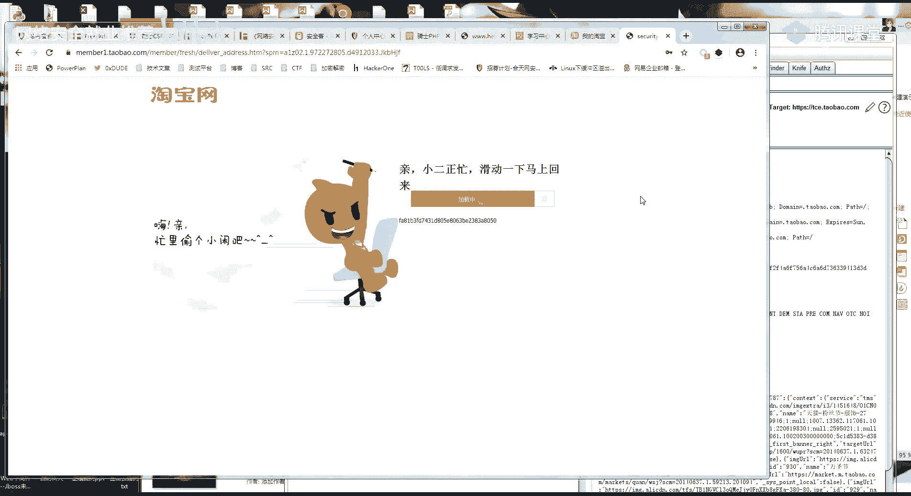

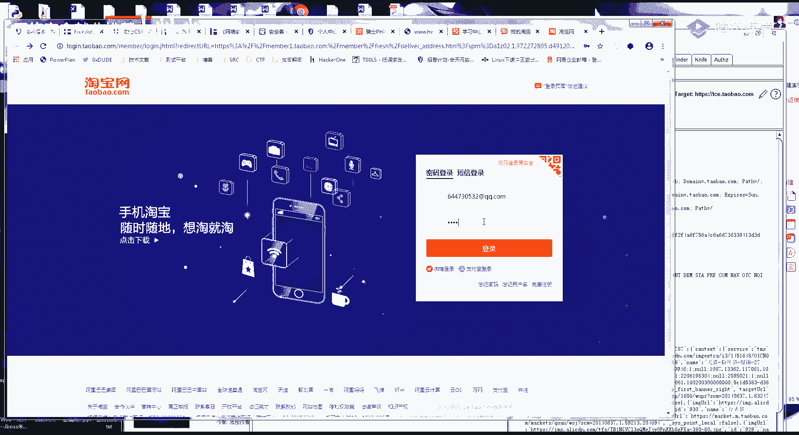

淘宝上次找了一个比较敏感的一个位置，但是它有一个v进行了一个判断，等下我翻一下啊，它是一个pob，这就很尴尬了，他淘宝有一个他的refer的话，这里呢你可以看到，这是一个正常加载的一个包呀。

然后呢它也是通过我们的cookie来进行一个判断的，但是呢如果我在这里把它的一个report给删掉，你可以看到它这个reform的一个字段，就进行了一个判断，让我们没办法登录，所以说你在测csf的时候。

注意这三个注意，最重要的就是注意这三个请求头，这三个字段就可以了，然后呢还有一个要注意的一个点了，就是自己袖子句子叫什么意思呢，就是比如说我这里是一个请求包对吧，我这里是一个请求包。

你们其实开始也是能看到，我这里呢是有一个token的一个东西，我原来的一个请求包是一个这样的，你看到这个token觉得诶我有token，那我是不是肯定就不存在csf，不是这样的，我把这个图给删掉。

这个请求还是可以进行，那我就说明我可以csf，所以说你只要把这两个字段我都给它删掉，就可以就可以了，如果还是能执行，那就说明存在csf，所以呢他一个一个安全的一个c，一个安全的一个请求。

就是它中间有一个token，或者有一些其他的，我们没有办法获取得到的一个参数，它才不会存在csf，那我如何构造一个csf呢，就是啊我给你们发了一个刚刚这两个包对吧，这里呢要告诉你们一个小技巧呀。

因为你照着这样去改，其实是一个比较麻烦的一个事情，教你们一个小技巧，bp的话用应该有，用bp的话每个人都用这里了，bp有一个简单的一个功能，就是比如说我修改了一个请求，这是我的一个请求包。

然后呢你右键到这个位置，选择这个cf i f p o c，选择这个csf的一个plc，然后我选择之后把它copy到这里，把它copy，copy到这里面，这个或者你只想自己体验一下。

就用bp它自己生成的一个链接，dp 2它会自己给你生成一个这样的一个链接，这里copy这里，然后点击一下它，这里呢也会加载一个地球，你可以看到，所以说遇到这种普通的呀，遇到这种普通的一个port。

一个guest get post的一个请求，你用bp自动生成就可以了，然后如何找csf，你就是看这个请求包，这个请求包里面除掉这一个，然后去掉这个token，他这个请求还能不能继续执行。

也就是说只要我这个包里面所有的参数，我自己都可以构造的出来，自己可以任意构造，那我就可以执行一个csf的操作，啊有没有不懂的，有不懂的话，现在赶紧提，其实应该是很简单的，懂的话，你就扣个一好吧，然后呢。

后面我会给你们发一点csf的一个简单漏洞啊，另外还有一个哦对了，忘记给你们讲一个点，有一个特殊的一个点，因为你们如果挖了fc也会知道有一些包呢，它是一个jason的一个包，有一个jason的一个包。

它是什么样子呢，啊我举个例子啊，就用vip是吧，我举个例子，它有一些数据包，是这个样子的，还有一些数据包呢，是这个样子的，那我如何对这一个json格式包进行一个csf啊，如果你普通的一个操作的话。

就是我普通操作，我利用这个csf生成这样的一个po的，它是行不通的，它后面会多了一个等号，这里呢我今天也不讲，就是你们自己去课，课后进行一个练习，然后我今天就给你们布置课后作业，因为很简单呀。

给你们布置课后作业，好吧，这是里面的一个课后作业，然后呢有一个应该还记得有一个考核，就是呢有一个考核是一直到后面的一天，这里来，我要你们做的呀，不是做一个csf，这也是一个骑士cm s的一个后台。

c s f添加管理员账号，这里呢我要你们做的是，可以对我个人啊，就是对我个人进行一个社工的一个手段，就是模拟，你们要想办法，让我来点你们的一个csf的一个链接，有两天的一个时间。

包括今天开始一直到29号，你们有一个两天的时间，你们可不可以可以想什么办法，你们自己想一下，有什么办法让我自己去点到这个链接，你们首先可以自己先下载，其实cms去看一下这个csf漏洞是怎么利用的。

当然有趣的就是怎么让我上钩，怎么让我上钩，你们可以对我自己呢进行一个操作，也可以写在文档里面，就是你对我进行一个欺骗的一个操作，也可以，不管你们用什么手段都行好吧，今天的一个课程呢就到这。

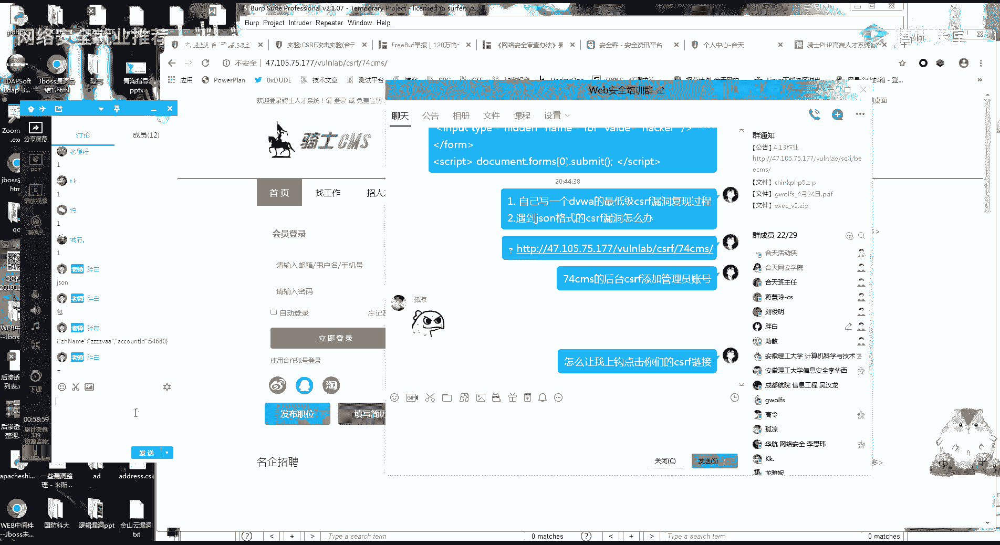