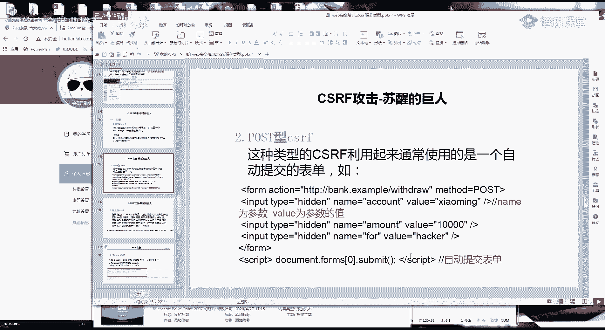
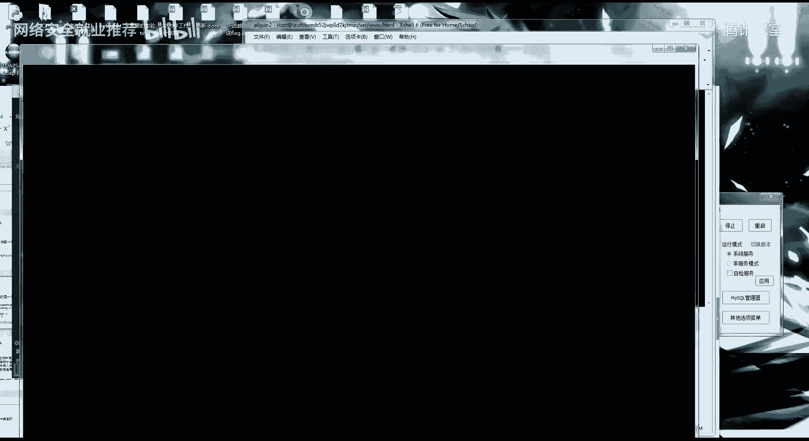
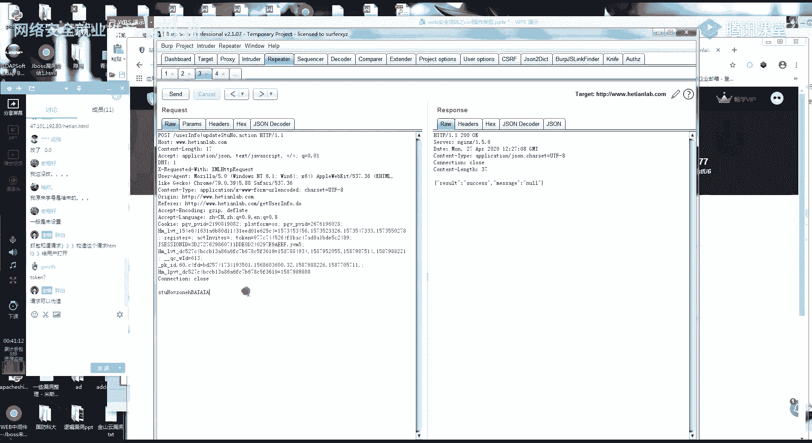
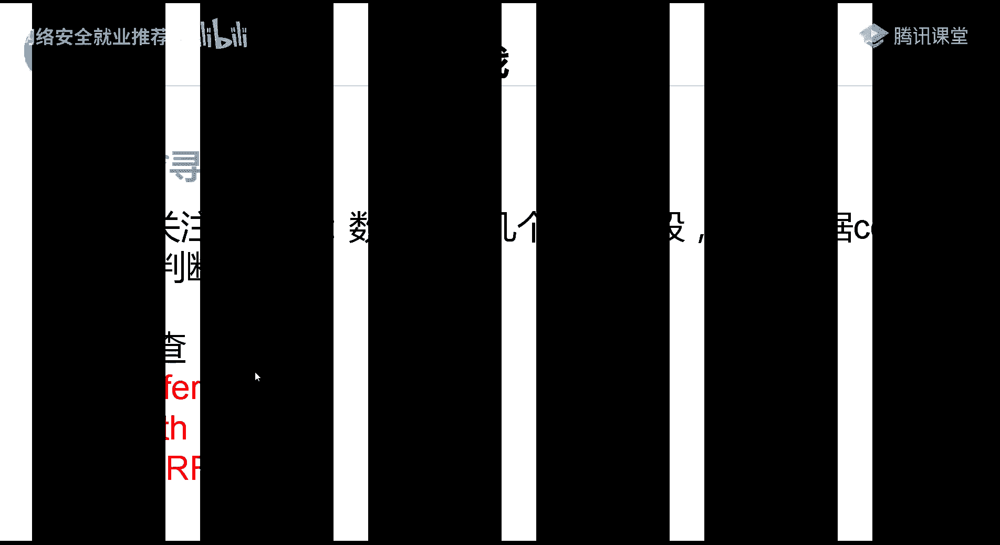
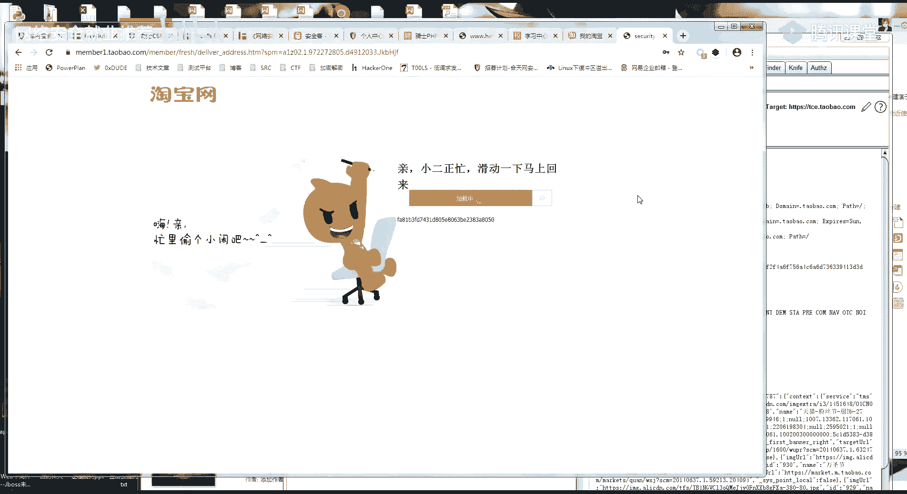

# 网络安全课程 P25：第23天 - CSRF漏洞基础与防御 🛡️


在本节课中，我们将学习跨站请求伪造（CSRF）漏洞的基础知识、利用方式以及如何寻找和防御此类漏洞。CSRF是一种攻击者诱使已登录用户在不知情的情况下执行非本意操作的攻击方法。

## CSRF漏洞简介 🔍

上一节我们概述了课程内容，本节中我们来详细看看CSRF漏洞是什么。

CSRF全称为跨站请求伪造。它需要与跨站脚本攻击（XSS）区分开来。CSRF攻击的本质是挟持用户在当前已登录的Web应用程序上，执行非本意操作的一种攻击方法。

## CSRF漏洞成因 📝

理解了CSRF的概念后，我们来看看它是如何产生的。


CSRF漏洞的产生通常基于以下条件：
*   网站的Cookie在浏览器中不会过期。只要不关闭浏览器或主动退出，访问该网站时都会默认处于登录状态。
*   攻击者可以构造一个恶意的CSRF脚本或链接。
*   用户在保持登录状态的情况下，访问或点击了该恶意内容，从而被动执行了攻击者设定的操作。


## CSRF攻击演示 🎬

了解了成因，我们通过一个实验来直观感受CSRF攻击是如何发生的。

实验模拟了一个具有留言功能的页面。用户登录后，可以添加留言。正常的添加留言请求如下所示：

```
GET /add_comment?title=tt123&content=123 HTTP/1.1
```

攻击者可以构造一个恶意的HTML页面，其中包含一个自动发起请求的标签：


```html

```

当已登录的用户访问这个恶意页面时，浏览器会自动加载图片，从而向目标网站发送添加留言的请求。由于用户的Cookie有效，该请求会被服务器成功执行，导致用户“被留言”。

## CSRF攻击模型 🔄

通过演示我们看到了攻击过程，现在用一个标准模型来梳理整个攻击链。

CSRF攻击模型通常包含以下步骤：
1.  用户登录可信网站A，并在浏览器中生成认证Cookie。
2.  用户在未退出网站A的情况下，访问了恶意网站B。
3.  网站B的页面中包含向网站A发起请求的代码。
4.  浏览器在发起请求时会自动携带网站A的Cookie。
5.  网站A的服务器接收到带有合法Cookie的请求，并执行相应操作，而用户对此毫不知情。

这种攻击的危害不仅限于留言。如果用户是管理员或拥有高权限账户，攻击者可能利用CSRF进行注销账号、修改密码、绑定手机号、转账等危险操作。






## CSRF漏洞利用 🛠️

明白了攻击模型，本节我们来看看如何具体构造CSRF攻击载荷。

CSRF攻击根据请求方法的不同，主要分为GET型和POST型。

**GET型CSRF利用**
GET请求的参数直接附加在URL中。例如，一个修改密码的GET请求可能如下：

```
GET /change_password?new_password=admin123 HTTP/1.1
```

攻击者可以构造一个HTML标签（如``、`<iframe>`）来发起这个请求：

```html

```





**POST型CSRF利用**
POST请求的参数在请求体中。例如，一个修改学号的POST请求。攻击者需要构造一个自动提交的表单：

```html
<form action="http://target-site/update_info" method="POST">
    <input type="hidden" name="student_id" value="666" />
</form>
<script>document.forms[0].submit();</script>
```

在实际渗透测试中，可以使用Burp Suite等工具自动生成CSRF攻击验证代码（PoC）。在捕获到目标请求包后，右键选择 **“Engagement tools” -> “Generate CSRF PoC”**，工具会自动生成对应的HTML代码。

## 如何寻找CSRF漏洞 🔎



学会了利用方法，接下来我们学习如何发现这类漏洞。


寻找CSRF漏洞的核心是分析应用程序的请求数据包，判断其是否可被伪造。关键在于检查请求中是否包含不可预测的、用于防御CSRF的令牌。

以下是寻找漏洞时需要重点关注的参数和请求头：

*   **Token/CSRF Token**：这是最常见的防御手段。服务器会生成一个随机令牌（Token），并随表单下发或存储在会话中。提交请求时必须携带此Token，且Token对每个用户或每次会话是唯一的。如果请求中缺少或Token错误，请求将被拒绝。
*   **Referer头**：服务器可能会检查HTTP请求头中的`Referer`字段，判断请求是否来源于本站点。如果`Referer`头被篡改或缺失，请求可能被阻止。
*   **自定义Header**：有些应用会使用自定义的HTTP头来验证请求来源。

**漏洞判断方法**：
在测试时，尝试修改或删除数据包中的`Token`、`Referer`等关键字段。如果请求依然能够成功执行，则说明存在CSRF漏洞。因为攻击者可以轻易地构造一个不包含这些字段的请求。

## 课后总结与作业 📚

本节课我们一起学习了CSRF漏洞的原理、利用方式以及挖掘方法。

**核心要点总结**：
1.  CSRF是诱使已登录用户执行非本意操作的攻击。
2.  攻击成功的前提是用户已登录且会话有效。
3.  漏洞利用分为GET型和POST型，可借助工具生成PoC。
4.  寻找漏洞的关键是分析请求包，检查是否存在可预测的参数和有效的Token等防护措施。

**课后作业**：
1.  **实践练习**：尝试对JSON格式请求体的接口进行CSRF漏洞测试（提示：这与普通表单提交有所不同）。
2.  **综合挑战**：针对提供的某CMS后台的“添加管理员账号”功能（已知存在CSRF漏洞），设计一份完整的“攻击方案”。方案需包含如何通过社会工程学手段（如欺骗、诱导）让目标（例如讲师）点击你构造的CSRF链接。请将你的思路和步骤写在文档中。


---
*注：本教程根据提供的视频内容整理，保留了原话的核心含义，并进行了结构化与简化处理，以符合教程格式要求。*