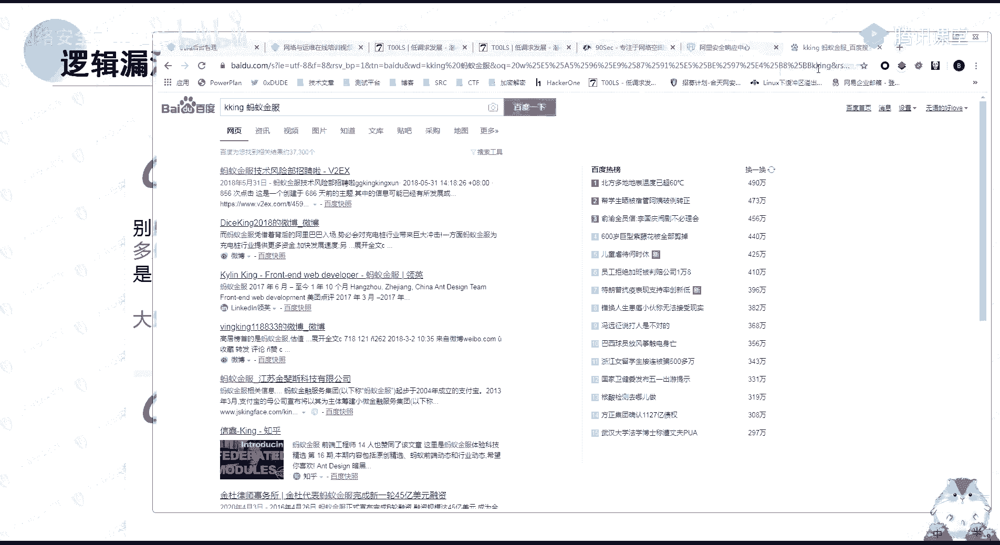
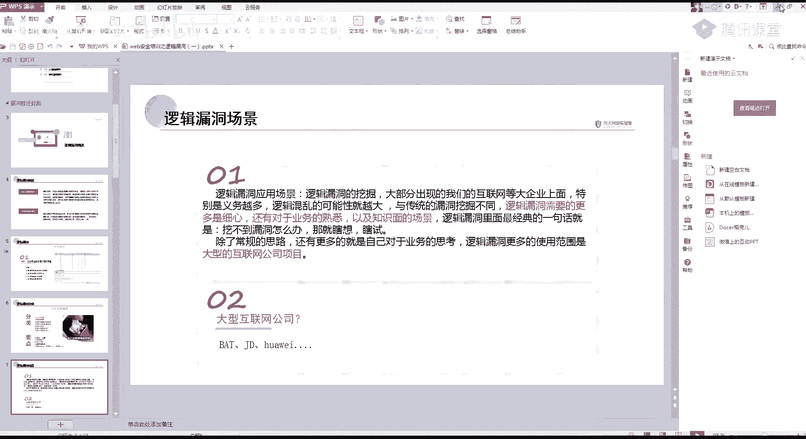
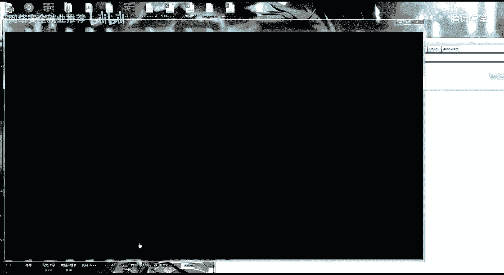
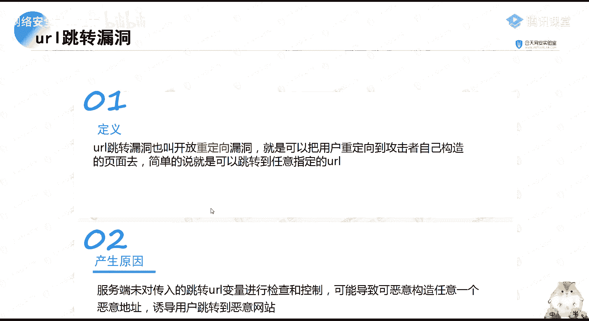
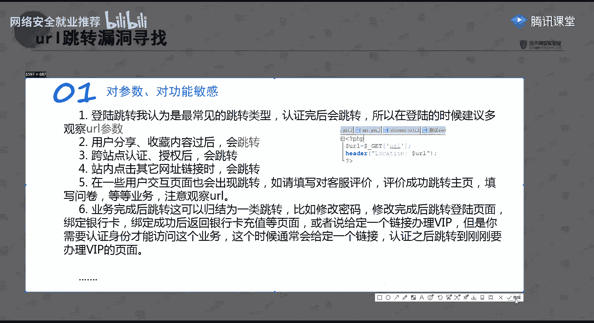
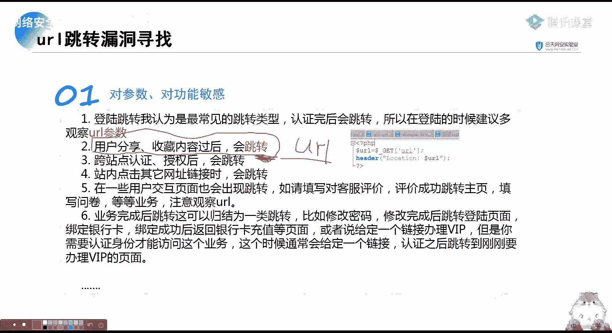
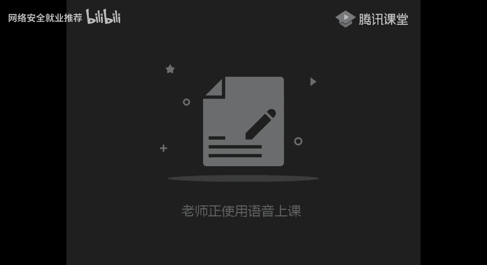
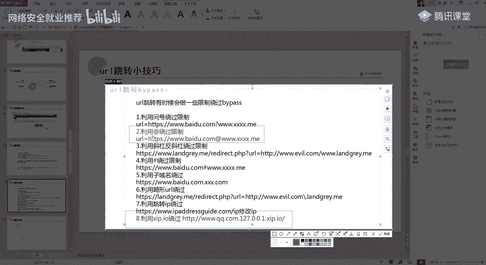
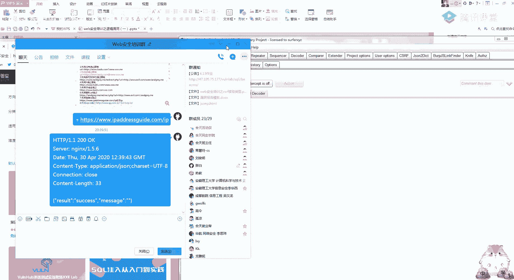
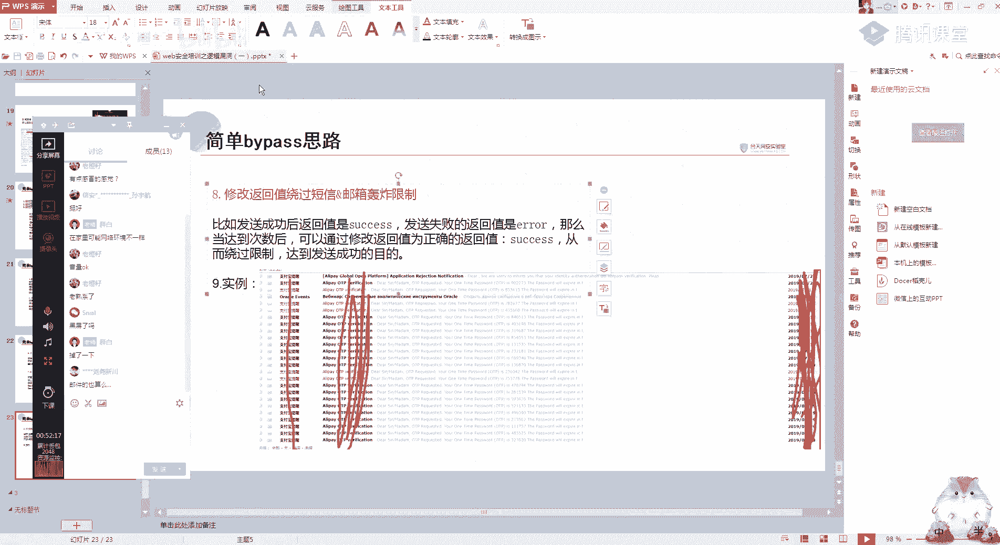

# P28：第26天：逻辑漏洞-短信轰炸漏洞bypass思路 - 网络安全就业推荐 - BV1Zu411s79i

220，嗯给大家推荐两个论坛吧，这两个论坛的话，你们写一篇文章就可以了，呃吐司的话比九零的一个实线还啊，这是一个门槛还低一点，吐司的话你稍微写一篇，比如说一个漏洞复现啊。

或者是你比如说一个四个注入一个csf等，然后你投稿投过去基本上都是会过的会过的，这两个论坛都是要邀请码的呀，因为稍微有一点点门槛，但是门槛也不高，这两个，嗯好开始今天的一个课程。

今天开始呢就是讲一个逻辑漏洞的一个，总共四个课时吧，我记漏洞四个课时，然后大家在挖掘src的时候，逻辑漏洞是一个很重要的一部分吧，因为它很简单，但是它出现的一个漏洞点又特别多，今天要讲的是。

第一个是简单讲一下什么是逻辑漏洞，第二个就是url跳转，第三个就是短信轰炸，短信轰炸的话，我记得是上小课的时候是给你们讲过的，所以说今天的一个学习任务还比较简单啊，同时也在这祝大家五一快乐呀。

要放回家了，嗯首先我看一下啊，我这个声音还好吗，因为是在，因为今天是在家里，我这声音有没有小了或者大的，嗯还好，那就开始讲，然后呢首先先给大家讲一下什么是逻辑漏洞，逻辑漏洞呢。

它是因为一个程序员在编写程序的时候，跟着人的一个逻辑思维产生的不足，要记住啊，逻辑漏洞跟我们传统的漏洞有一点不一样，它是通过一个合法的方式来达到破坏的啊，你就比如说这个密码找回，用户登录验证等这些。

大家应该上次还记得，那一个四位数爆破的一个漏洞，你要这样想，本来本来的一个验证码，我是个四位的，它是一个正常的逻辑对吧，但是他只是没有考虑到我四位数的一个验证码，它是可以进行一个爆破的。

这呢就是因为程序设计的不足，而产生的一个问题，这一类防护手段是因为设备，因为它是一个呃正常的一个功能，来达到一个破坏的，所以我们的一个设备，还有一个扫描器是很难发现这一类漏洞的。

这也就是为什么我跟你们说，在src里面它的一个逻辑漏洞的占比很大啊，大概的一个占比就是入口入啊，我在s c里面绕口令占了高位，里面绕口令占了一半，2号逻辑漏洞占了30%到40。

然后他一个产生的原因应该也很清楚了，就是程序员的一个逻辑他不严密，或者是过于复杂，特别是这一点了，大家要记住，一个网站的功能点越多，它存在的逻辑漏洞可能性就越大啊，你就比如说类似淘宝淘宝呀。

还有一个淘宝京东这种逻辑漏洞的存在，可能性是非常大的，但是当然啊，就是经过白帽子的这几年的一个挖掘，基本上是没有了的，这里疲劳就用给大家要给大家看一个吹个逼，就是我们团队的一个水泡泡师傅。

当时呢他们是挖掘了一个逻辑漏洞，就是阿里的一个逻辑漏洞，哎好像翻不到，待会给你们翻，是我们团队的一个，他就是发现了一个简单的一个漏洞吧，应该说是一个简单的一个月全漏洞，就是蚂蚁金服的。

当时当时淘宝的还是蚂蚁金服去了，当时他那个淘宝直接给了一个，21万的额外奖励，所以说你们要记住这一点，就是越复杂，它出现逻辑漏洞的一个可能性就越大，特别是在这些地方，然后我们看一个简单的一个例子。

这里呢是一个最经典的一个逻辑漏洞的问题啊，就是因为一个四位数的验证码，这是顺丰羽泉的顺丰的一个站，一个网站，这里是因为他的一个，大家其实可以看到这里重置密码的这个位置，他只有一个四位数。

然后可以进行一个爆破啊，我下次再给大家讲一个，讲那个云集的漏洞的时候，就应该是还记得吧，那个四位数就可以爆破，然后呢就可以进行一个任意的一个用户，密码重置或者登录最经典的一个例子。

这里呢就是一个逻辑漏洞的一个部分吧，因为我们课程时间还是有限的，我就会给大家，只会给大家讲一个部分的逻辑漏洞，在挖掘这一部分逻辑漏洞的时候，大家要记住了，其实这里呢你分类你可以先不看懂吗。

它总共有逻辑漏洞是应该说是数不变的，不知道大家听过一句话没有，就是啊漏洞是人找出来的，就是如果只要你够牛逼，本来你没有这种类型的漏洞，你都可以说只要你能证明你这个操作有危害，然后写给那一个sc。

他相信了，他就认为这是一个漏洞，你说漏洞是人为造成的，并不是它本来就存在的，要记住的点就是几个要点吧，这虽然这虽然说的有点笼统，但是我觉得最重要的是这两个熟练bp，然后思路清晰。

也就是我之前一直跟你们强调的，bp里面的一个包，你们会看bp里面的一个包，就可以挖掘一个逻辑漏洞，然后看一下逻辑漏洞的一个场景，啊你们应该还是有印象的，我在挖洞的时候，我是直接给你们。

这是我我挖逻辑漏洞，一般就是我直接找一个网站，就比如例如哦，例如之前在火线给你们看的一个。

这里，比如说这一些平台，它的一个逻辑漏洞我都是直接挖逻辑漏洞，就是我直接只用一个bp，只用一个bp就够了，然后另外的话，逻辑漏洞有一个点了，就是一些的一个经验之谈，这句话我觉得挺有意思的。

给大家讲一个例子，就是我们团队那个kp，他当时有一个挖洞的一个场景，我待会我会把那个漏洞的一个文档发给大家，当然这里面也是有的呀，图四里面也是有的，他就是利用一个啊，就是你这个包所有的参数都尝试过了。

我这个包的所有参数都尝试过了，发现没有漏洞，那他怎么办呢，他看到一个返回包，里面是一个json的，时间有点久远了，不要找时间给翻一下才可以，我还是抓个包给你们举例吧。

抓个包，当然他那种情况很罕见啊，特别罕见，还是拿我们的一个和田给你们举一个例子，这一种思路的话呃，你们平时是学不到的呀，你们就稍微先看一下这个思路。

举一个例子，这里一个个人信息的一个位置啊，我们首先看一下啊，这里有一个其他信息，你们可以在这里看到呀，这里呢有一个username，然后呢这里有一个squ no，这是一个jason的一个包。

可以看到它这里面呢有很多的一个参数，你比如说这个电话，还有这个这些什么东西，这些邮箱啊，还有什么，然后呢我们在修改的时候啊，我们首先看一下啊，我这里比如说我改学号的时候。

是不是可以看到这里只有一个s to no，对不对，然后呢这一个as to you know，是在这个位置，那如果我把这里面的一个jason，把这些参数都拖过来呢，啊我比如说我这个username。

我把这一个参数直接给它替换掉，你说他有没有可能可以进行一个修改，就是包括一个手机号呀，还有包括一个，包括一些不能修改的东西，它只是没有这个参数而已，他当时这个思路就是这样。

然后呢就通过一个i d的一个值发现id可以啊，id 123456嘛，然后发现那个id可以直接进行一个便利，就拿到了很多的一个信息，当然这个思路这个思路的话，你们就要稍微记一下，一定要记住啊，刮不动。

你就自己想自己试，因为因为漏洞就是别人瞎试出来的，好然后我们看一下今天的一个学习内容，首先第一个是url的一个跳转漏洞，啊什么叫ui l跳转漏洞呢，u2 要跳转漏洞，也叫开放，从逆向漏洞。

它的一个重点在这里，就是把用户重定向到攻击者自己构造的一，个页面去，大家应该还记得上节课有一个csf cf i f啊，这画的有点丑啊，我们cfnf是不是有一个攻击的一个页面。

然后呢他这一个url跳转就是我发，我发一条url给你，然后，啊他就会跳转到一个我攻击者，想让你跳转到那个页面，就跳转到那个页面，其实你简单的来说，就是我可以指定你让你跳转到任意的url底下。

它当然产生的原因跟其他的一样啊，就是没有对传入跳转url变量，进行一个警察和控制，可能导致可以恶意构造一个任意的地址，导致用户跳转到恶意网站。

这里呢我举个比较形象的一个例子举啊。

举一个比较形象的一个例子，首先我们打开看一下，这是一个京东的一个位置，对不对，这是一个京东的一个登录点，我们点击登录看一下上面的url url呀，他这里是不是由他这个认证的位置，跳转到这个京东的网页好。

那如果我随便选一个，就是比如说我选一个三星什么，看到没有，看到这个位置没有，我们再点一个登录，他是不是就跳远那个秒杀点，京东点com这个位置了，如果我这个路径，比如说我可以改为3w点百度点com。

或者是这里呢是你的一个任意攻击的一个网址，然后我就把这个网址发到群里面，别人去点击的时候，你可以看，京东当然它这里是改了呀，就是点击之后就会让你进行一个任意的一个，账号输入，那我输入之后。

它就会跳转到最后面的这个地址，如果我最后面的地址是一个钓鱼网站，或者是一个存在x ss，或者是存在csf网址的一个地方，那它就会有一个被盗号的一个风险，所以url跳转就很简单，给大家看一个看一些例子吧。

你看这里就是京东的一个url跳转，然后他这个url跳转可以干什么呢，刚刚我给你们说的基本上已经说过了，首先第一个就是钓鱼，第二个就是配合csf，第三个就是配合一个xss漏洞。

第四个呢叫配合浏览器的一个漏洞，这个浏览器漏洞是什么意思呢，就是你们常用的这些谷歌，还有火狐，还有这种ie浏览器，因为你们是没有学一个深度测试那一块的呀，实测试这里呢我给你们个关键词，你们自己去搜啊。

自己去搜索，然后学习一下好吧，双杀漏洞是好久了呀，8174吧，应该是，对，你们可以去搜索一下这个漏洞，就是说如果啊他那个漏洞大概的一个情况，就是我这里有一个网页，就是我有一个攻击者的一个网页。

然后我只要受害者用这特定的浏览器，访问到了我这个网页，就比如说我这个爱淘宝，这是我的一个漏洞的一个网址，然后你只要有只要访问到了这一条网址，那你这台电脑就会被我进行一个控制，这就是一个浏览器的一个漏洞。

老熟悉了对，挺出名的一个漏洞，20188174，然后我们看一下呢，它一个漏洞的一个寻找呀对吧，我们关键还是要去找漏洞，然后就是挖洞赚赏金，它最常见的就是认证完会跳转，所以在登录的时候观察ul登录呢。

就是刚刚我京东给你们举例的一个这个位置，登录的位置，我记得好久好久以前，是因为我刚入门那会儿就刷url跳转啊，一个漏洞也有90几块钱，100块钱刷的还是挺开心的，大部分就是都在这个位置。

都在这个登录的位置，然后第二个呢就是一个用户分享的，用户分享收藏之后会进行一个跳转，这里先看一下url跳转的一个场景，好吧，我记得我好像是有一个简单的一个场景，给你们看一下什么叫url跳转。

其实你从这个字面上来听的话就已经知道了呀，完了这个是，这里，好我们看一下这一个例子啊，就是我比如说我这里是存在一个，ui跳转的一个地址，然后呢我就直接把这条地址这样发给别人。

你正常来看都是看前面这个域名，对不对，但是呢你通过这个漏洞啊，就比如说我在这上面打开，可以看到它直接会跳转到百度这里，你这里随便改，这样就会跳转到淘宝，那如果我这个url是我们的一个攻击者的，一个地址。

那就可以进行一个任意的一个url跳转，其实你简单来说就是你这个url后面的一个地址，你随便怎么填，它都会跳转到一个地址里面去。

这就叫ul跳转，应该就还是比较简单吧。

那我们的关键呢是在哪个位置这里呢，我同样的，我给你们截张图好吧，就是你自己去思考一下。

它的这一个业务的一个地址。

同样的你们也可以就是在那一个讨论区挑出来，你们印象中，哪个哪些位置还会进行一个url的一个跳转，就是会进行一个跳转，可能我这上面都没有写着全，这些评价成功呀，写业务呀，然后业务完成之后跳转了。

比如修改密码什么的，你们还有啊，你们自己有没有一些想法，就是除了我这上面写的这几个点，还有哪些地方会进行一个跳转，其实包括昨天的，应该你们还记得吧，我给你们分享了一个qq空间，他那一个转载之后。

里面的一个url是可以进行一个修改的，那你的话呃，我也不确定他会不会算一个url跳转漏洞啊，但是从字面上的意思来说，应该是算的，就是我那个ul是可控的，分享到分享到一个qq空间里面。

然后呢这里是乌云里面的一些例子呀，就是以前的一个qq空间的一个url跳转，这里呢要你们记住的是这几个位置，第一个。

诶等一下，你就说忽然自信感觉没有了，给你们看一下这两个例子，qq空间的一个url跳转的一个地址，你们重点呢是要记住这几个东西啊，看到它的一个例子没有，你们找他的一个跳转，告我告诉你们怎么找。

啊就比如说就是看这一个包知道吧，找一下有没有一个url的一个参数，好我们这里看一下，他的这个请求里面，你看比如说这里有一个u的一个参数，但是他这不是一个跳转哪个地址啊，这里是我本地的，你看这种。

这里呢有一个u r l，后面有h g d p，然后呢，这里有一个302或者301的这种状态码，最好呢是看这个302的一个，跳转的一个状态码，你看京东的这个位置url，302跳转是跳转到这个位置。

然后我找一下，看里面有没有不常规的一个302的一个跳转，好像是没有的，反正你就是看url里面有没有有没有类似的，有没有类似像这样的一个链接，它这里呢就可能会存在一个s s r f。

跟一个url的一个跳转，基本来说是两个漏洞啊，就是存在url的一个参数，你一定要敏感，然后你要验证的时候，就是把这个u2 l改为自己设置的u2 l，跳转成功，就可以访问到上面的一个地址，所以说特别简单。

但是呢要教你们一点点比较特殊的吧，这里面好用的就是我们有时候遇到一些厂商，它是会把这个url跳转做一些限制的，但是呢我们可以利用浏览器的一些特性，进行一个简单的一个绕过，这里呢他绕过的方法有很多呀。

但是我还是觉得这种办法跟这种办法最好用，就是除了这两种，其他的都是基于一个情况下来，都是基于一个叫什么东西了，还有这个吧，这三个除了这三种，其他都是基于一个过滤的一个情况来的，我们来看一下为什么。

比如说我这些个链接啊，我就在后面加一个3w点，nn com，你看，就是我访问这个链接呢，它会直接访问到at后面的这一个url，就是加at的一个绕过，然后第五个呢就是利用一个子域名的一个绕过。

因为它可能会检测就是，可能会有点菜，比如说淘宝他可能会直接检测，我只能跳转到淘宝的这个域名字底下，但是他可能没有考虑过，比如说淘宝点百度点com，那我们的域名还是不是百度，对不对。

如果这个后面可以进行一个任意修改，那也可以跳转到我们的一个任意，就是攻击者的一个页面底下，然后第八个就是这个位置啊，这个我觉得是比较好玩的呀，不知道你们有没有去试过，它这里会直接访问到a二七点点0。1。

这都是根据一些浏览器的一些特性啊，来进行一个访问的，我这里是因为有缓存啊，实际的话应该是跳转到我这个psp study的这个底下，你可以看到，这个位置。

记住这三个常用的就可以了，其实我觉得同样的给你们发个截图。

另外呢还有一种特殊的呀，一种特殊的一个办法，就是只能说是一个姿势吧，具体的话就是它具体的原理我也没有去研究啊，你比如说这里一个ip对吧，这个地址也发给你们，你们在这输入一个ip，然后我点击一个变化。

看到没，他会得出这样的一串数字，然后我们去访问这一串数字，我们访问这一串数字，可以看到它会直接跳转到127点点0。1，就是这一串，这里也是利用一个数字的一个单纯的一个绕过，算是比较有趣的。

然后你们去做一下这一个url跳转实验，我今天是发给了你们预习的，就是那个逻辑漏洞里面都包括了这个，去做一下玩实验室的，应该就会有一个简单的了解，但是很简单，第三个呢短信轰炸的漏洞，这里我也不多说。

因为给你们讲过了，短信轰炸，它的简单意思就是你发短信还要发邮件的，这个包可以无限制的一个发送对吧，这个很好理解吧，啊，因为这里没发现是呀，就例如吧，就例如我这一个发发送一个qq邮箱好吧。

我qq邮箱给自己写邮件，对吧，我给自己发邮件，那我是不是发邮件呢，这里就会有一个数据包，咦发邮件的那个包呢，再抓一下啊，估计是这个吧，然后可以看我自己呢，就可以无限发我这个qq邮箱的。

然后呢我如果我放到这个包括里面，就是这个包括里面我随便就改一个，就是改一个无关紧要的一个数值，1~200吧，别发多了，自己的邮箱不能太狠了，花50分吧，可以看，当然我这里是网络比较慢了。

你可以看这稍微跑一下，如果快的啊，你一分钟的话可以跑好几千条的一个信息，然后我的邮箱就被轰炸了，这就是一个简单的一个短信轰炸，就是这个包可以无限发，它产生漏洞的位置也很简单，就是登录验证码，修改账号。

一切要需要验证的位置，记住这一点，一切需要验证的位置全部都会有，就是所有发要要发短信的位置都要进行，都要敏感，然后这里的话就是一个简单的例子嘛，这里就是获取短信验证码。

啊然后这里就是一个短信轰炸的一个例子，一分钟的话发个几百条，简简单单根本就无所谓，然后有一些简单的一个bypass的一个思路，呃最常用的就是在这个后面加20%，就是一个空格，我是遇到过很多次的一个。

就是因为它只验证了前面的这11位数，但是他没有验证后面的一个空格，这是一位数，然后我在后面无限加空格，就是我加一个空格，它就是一个新的短信，新的一个手机号，然后无限制的一个加空格。

然后就可以造成一个短信的一个轰炸，然后加字母这些也都是一样的一个道理，然后有一个参数叠加，参数叠加是什么意思呢，参数叠加啊，我还是同样的，用完先是做个例子，比如说我们在忘记密码的时候，点击一个提交啊。

获取一个手机号，可以看到这里吧，这是一个参数，那我是不是可以这样的进行一个叠加，就是我这样进行一个无限的一个叠加，那他有没有可能会识别四个手机号，操作很都是些操作很简单，但是思路很有意思的一些操作。

然后这里呢有一个调用接口，绕过短信轰炸，然后修改cookie，修改ip用大小写，还有修改返回值一系列吧，应该说是，当然我觉得很多都有点扯呀，很多都有点扯，就比如说这个还是比较可靠的，利用调用的一个接口。

它这里是什么意思呢，你比如说啊我一个网页是不是有好几种，比如说找回密码注册，然后修改密码，然后还有什么增加安全验证啊，这四五个接口它都是需要有一个短信验证的，然后他判断的依据是什么样子呢。

还是同样的找个实例吧，实力也啊，找实力有点太过分，就是后面呢它比如它可能会有一种i d等于一，就是代表一个短信验证码的一个类型，id等于2d等于三这种，那我到时候我就可以直接爆破这个id。

还不去修改我们的一个手机号，利用这个接口，利用它不同的功能发送不同的一个短信轰炸，第五个修改cookie，绕过它的一个意思呢，就是我们在找回密码的时候，或者修改密码，因为我们登录之后。

修改密码是要验证手机号的，我把这个cookie给删掉，看能不能无限发，第六个修改ip，修改ip，当然这里有点假，第七个就是大小写跟这个是一个意思，第八个是通过修改返回值。

但是修改返回值这个呢也还挺麻烦的吧，修改返回值的话，不知道你们有没有去做过呀，他的一个情况是这样的，这里我找一个特别经典的一个修改，返回值的一个例子给你们看了，你比如说我这里要登录，对不对。

这一栏就是我的登录的一个包，然后我这个位置呢，就是可以用抓他的一个请返回包，好然后呢，这里呢就是我的登录的一个包对吧，这是我登录的一个包，我就不发出去了，我放了，然后我是不是就成功地登录了。

那我再退出来，啊我带动了我输入一个错误的错误，等于吧，我随便输，然后我再抓他的一个返回包，然后我把这个返回包给它替换掉，替换成这样，当然我这里是无效呀，我这里是无效，如果遇到有一种呢。

就是他会一他会认为我这个返回包它是正确的，就是我先抓一个正确的返回包，比如说它这是一个发送手机号的一个返回包，发送验证码的一个返回包，发送验证成功，然后我就把这个包copy copy一下。

然后呢我在这里修改返回包的时候。

就把这个包改为返回的一个自选值，这就是修改返回报。

各种的大家都可以去试一下，这里基本上我都是给你们讲完了，大小写主要是用来绕过一个邮箱，这里的话是啊，当时支付宝的一个支付宝的一个国际啊，支付宝国际刚开的时候进行一个的一个测试啊。

就是一个支付宝给个短期轰炸，好，今天的一个课程讲解的话就到这里了，应该还是比较简单的，最后还是祝大家五一快乐啊，有时间的话多去挖洞，多实践，争取大家早日先把这个学费给挣回来好吧。

邮件的有一些算你要看ssr c，有一些算，有些不算，好今天的话我就下课了。

