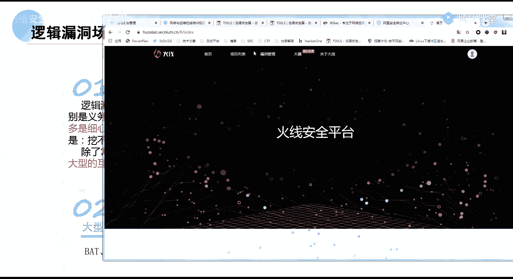
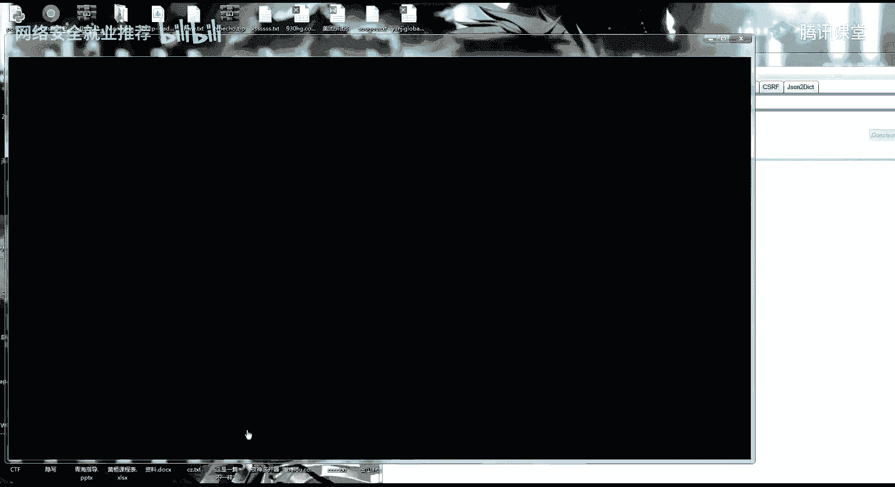
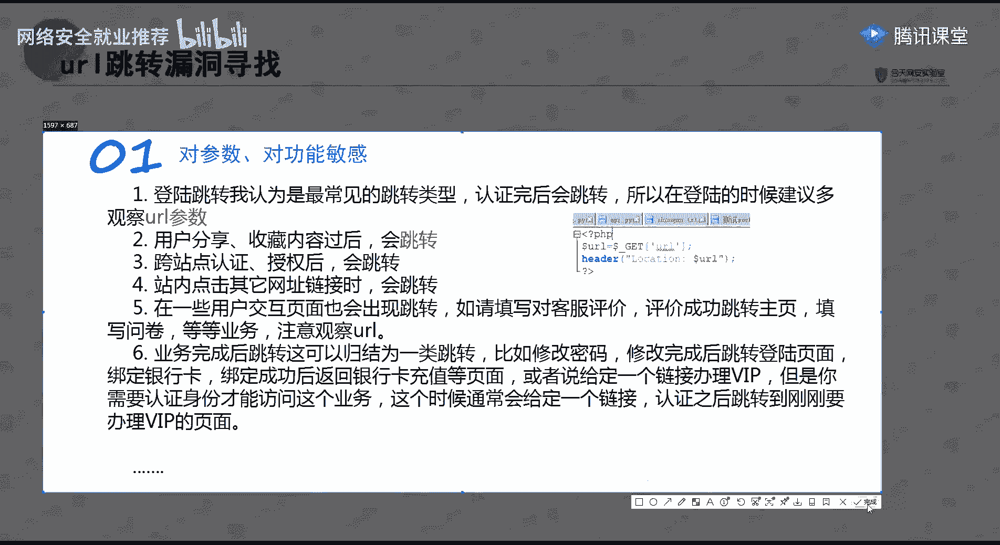
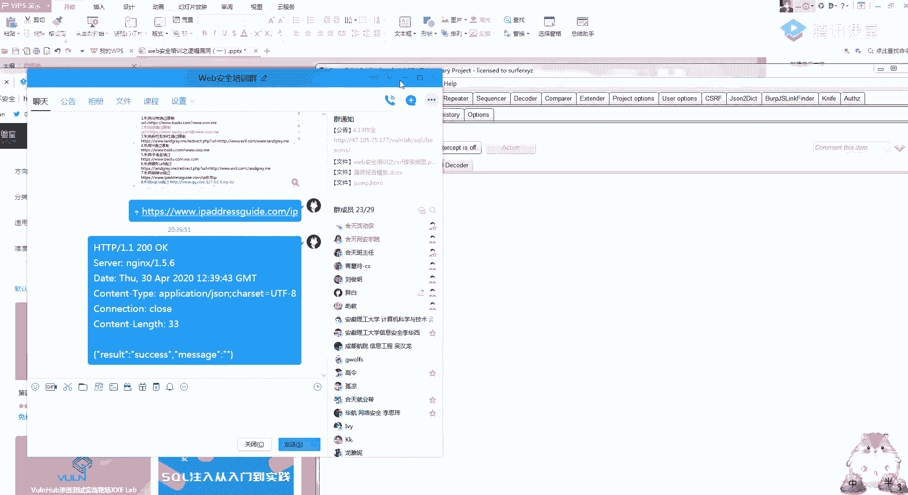
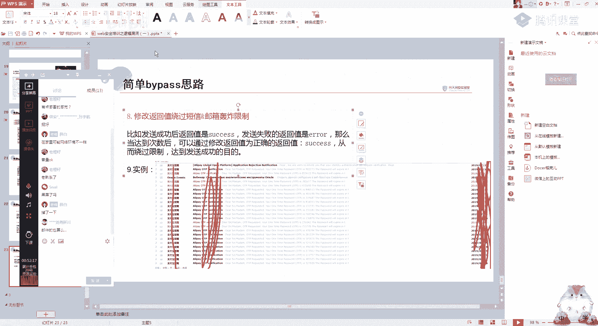

# 网络安全课程 P28：第26天 - 逻辑漏洞：短信轰炸与URL跳转漏洞 🔍

在本节课中，我们将学习两种常见的逻辑漏洞：URL跳转漏洞和短信轰炸漏洞。我们将了解它们的基本概念、产生原因、危害以及在实际渗透测试中的挖掘思路和绕过方法。课程内容力求简单直白，适合初学者理解。

## 什么是逻辑漏洞？ 🤔

上一节我们介绍了课程概述，本节中我们来看看什么是逻辑漏洞。

逻辑漏洞是由于程序员在编写程序时，基于人的逻辑思维产生的设计缺陷。它与传统漏洞不同，攻击者通过合法的方式达到破坏目的。例如，在密码找回或用户登录验证中，一个四位数的验证码在逻辑上是正常的，但程序没有考虑到这四位验证码可以被暴力破解。这就是程序设计不足导致的问题。

这类漏洞的防护手段通常难以通过安全设备或扫描器发现，因为攻击利用的是正常功能。因此，在SRC（安全应急响应中心）漏洞挖掘中，逻辑漏洞占据了很大比例。据统计，逻辑漏洞约占SRC高危漏洞的30%到40%。




逻辑漏洞产生的原因主要是程序员的逻辑不严密，或者业务流程过于复杂。一个网站的功能点越多，存在逻辑漏洞的可能性就越大。例如，像淘宝、京东这类大型复杂平台，曾经存在大量逻辑漏洞，但经过白帽子多年的挖掘，现已大幅减少。




一个经典的逻辑漏洞例子是四位验证码的爆破。在某些网站的重置密码功能中，仅使用四位数验证码且未做爆破防护，导致攻击者可以重置任意用户的密码。

在挖掘逻辑漏洞时，熟练使用Burp Suite（BP）并保持清晰的思路至关重要。很多时候，只需分析BP捕获的数据包就能发现逻辑漏洞。此外，需要具备灵活的思路，例如，当尝试修改请求包中所有常见参数都失败时，可以观察返回包。有时返回包是JSON格式，其中可能包含未在请求参数中出现的字段（如`username`, `squ_no`, `phone`等）。尝试将这些字段添加到修改请求中，可能会绕过限制，实现未授权的数据修改或信息泄露。

## URL跳转漏洞 🔗


上一节我们介绍了逻辑漏洞的基本概念，本节中我们来看看URL跳转漏洞。


URL跳转漏洞，也称为开放重定向漏洞。其核心是应用程序将用户重定向到攻击者构造的恶意页面。

**公式表示漏洞本质：**
`用户访问的URL` -> `应用程序处理` -> `重定向到攻击者控制的URL`

它的产生原因是程序没有对用于跳转的URL参数进行严格的检查和控制。攻击者可以构造恶意的跳转地址，诱导用户访问。

例如，在一个网站的登录页面，正常流程是认证后跳转回网站首页（如`www.jd.com`）。但如果跳转目标URL参数（例如`redirect_url`）可控，攻击者可以将其修改为`www.evil.com`。当用户点击攻击者生成的链接时，就会从信任的网站跳转到恶意网站。


URL跳转漏洞的危害主要包括：
1.  **钓鱼攻击**：跳转到伪造的登录页面，窃取用户凭证。
2.  **配合CSRF**：在跳转后的页面中嵌入CSRF攻击代码。
3.  **配合XSS**：跳转的URL中包含XSS攻击向量。
4.  **配合浏览器漏洞**：跳转到包含利用特定浏览器漏洞（如CVE-2018-8174）代码的页面，可能导致远程代码执行。




以下是寻找URL跳转漏洞的常见场景：
*   登录、注册、注销后的跳转。
*   用户分享内容或收藏后的跳转链接。
*   业务办理成功或失败后的跳转。
*   修改密码、绑定手机等操作完成后的跳转。
*   第三方登录授权后的回调地址。


在测试时，应重点关注HTTP响应状态码为**302**或**301**的请求，并观察请求参数中是否包含`url`、`redirect`、`return`、`to`、`link`等关键字。将参数值替换为自己的域名（如`http://your-evil-site.com`）进行测试。

当遇到服务端对跳转域名进行过滤时，可以尝试以下绕过方法：
*   **利用`@`符号**：`http://trusted-site.com@evil.com`。部分浏览器会解析`@`前的内容为认证信息，实际访问`evil.com`。
*   **利用子域名**：`http://trusted-site.evil.com`。如果过滤规则只检查主域名包含`trusted-site`，此格式可能绕过。
*   **利用IP地址编码**：将IP地址转换为十进制、八进制或十六进制格式。例如，`127.0.0.1`的十进制表示为`2130706433`，访问`http://2130706433`可能跳转到本地。
*   **利用`//`多级目录**：`http://trusted-site.com//evil.com`。
*   **利用`?`或`#`**：`http://trusted-site.com/redirect?url=evil.com` 或 `http://trusted-site.com/redirect#evil.com`。

## 短信/邮箱轰炸漏洞 💣

上一节我们探讨了URL跳转漏洞，本节中我们来分析短信/邮箱轰炸漏洞。


短信/邮箱轰炸漏洞是指攻击者能够利用网站发送验证码或通知的功能，在短时间内向同一手机号或邮箱地址无限制地发送大量信息，造成骚扰和资源消耗。

**漏洞产生的核心场景**：所有需要发送短信或邮箱验证码的功能点，例如用户注册、登录、密码找回、修改绑定手机/邮箱、支付验证等。

其原理是服务端未对发送频率、总量或接收方做有效限制。攻击者只需拦截发送验证码的请求包，并利用工具（如Burp Suite的Intruder模块）进行重放攻击即可。

一个简单的例子是拦截“忘记密码”功能中获取手机验证码的请求，然后将该请求在Intruder中重放数千次，导致目标手机被轰炸。

以下是几种常见的绕过限制（Bypass）的思路：
1.  **添加无关字符**：在手机号参数后添加空格（URL编码为`%20`）、换行符或其他特殊字符。如果后端只做简单的字符串匹配或前11位校验，`13800138000`和`13800138000%20`会被视为两个不同的号码。
    *   **代码示例（Burp Suite 修改请求）**:
        ```
        POST /send_sms HTTP/1.1
        phone=13800138000%20  // 第一次发送
        phone=13800138000%20%20 // 第二次发送（两个空格）
        ```
2.  **参数污染**：在请求中重复添加手机号参数，例如`phone=13800138000&phone=13900139000`。如果后端处理不当，可能会解析出多个号码并逐一发送。
3.  **调用不同业务接口**：网站可能有多个功能都需要发短信（如注册`type=1`、登录`type=2`、改密`type=3`）。攻击者可以固定手机号，遍历`type`参数，利用不同业务的接口进行轰炸。
4.  **修改Cookie或Session**：在已登录状态下，某些操作发短信前会验证会话。尝试删除或修改Cookie，使服务器认为这是来自新会话的请求，从而绕过频率限制。
5.  **修改请求返回值**：这是一种高级技巧。拦截服务器返回的“发送成功”或“发送过于频繁”的响应包，将其替换为“发送成功”的响应内容，从而欺骗前端或绕过客户端的限制判断。
6.  **大小写绕过（针对邮箱）**：对于邮箱轰炸，`test@example.com`和`Test@example.com`可能被系统视为不同邮箱，从而绕过针对同一地址的限制。
7.  **修改请求头**：如修改`X-Forwarded-For`或`Client-IP`头来伪造IP地址，试图绕过基于IP的频率限制（此方法效果取决于服务端校验严格程度）。

## 总结 📝

本节课中我们一起学习了两种重要的逻辑漏洞。




我们首先了解了逻辑漏洞的本质——源于程序设计时的逻辑缺陷，并知道了它在SRC挖掘中的重要地位。接着，我们深入探讨了**URL跳转漏洞**，学习了其原理、危害、寻找方法以及多种绕过过滤的技巧。然后，我们分析了**短信/邮箱轰炸漏洞**，掌握了其利用方式，并了解了一系列绕过发送频率限制的实用思路。



逻辑漏洞的挖掘极度依赖测试者的思路和对业务逻辑的理解。记住，漏洞是人找出来的，保持好奇心，多观察、多测试、多思考，是发现这类漏洞的关键。希望大家能将所学知识应用于安全实践中，但务必遵守法律法规，在授权范围内进行测试。