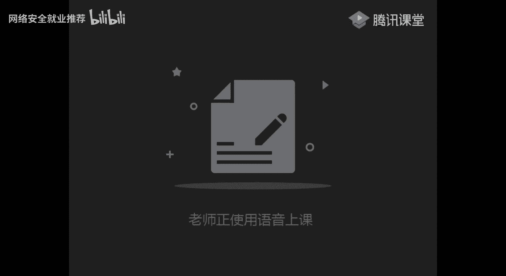

# P29：第27天：逻辑漏洞-任意密码重置漏洞 - 网络安全就业推荐 - BV1Zu411s79i

嗯今天给你们发的那两篇文章，不知道你们去看了没有，这篇逻辑漏洞之任意密码重置，还有这里的一个，今天要讲的内容呢，主要是跟你们预期的内容基本上是一样的，因为我觉得吧逻辑漏洞它一点都不复杂。

主要是在于一个思路，唉我觉得基本上就是一看就懂得这种好。

开始我们的一个漏洞的一个讲解，学了这么久了的话，应该大家都还是有一些基础的呀，今天要讲的一个逻辑漏洞呢，就是我觉得吧在所有的漏洞里面不是漏洞，应该是最简单的那一类，但是也是出现的最多的。

看一下今天的一个讲课内容，第一个呢是任意密码修改，第二个是任意的一个账户登录，我们有其他话不多说，直接来看一下这个人密码重置的一个漏洞，它的一个原理呢就很简单，就是我们在进行一个密码修改的时候。

没有对修改密码的一个凭证，做一个严格的一个限制，导致可以被绕过，进行一个任意的一个密码修改，简单的来说就是哦是一个修改密码的一个接口，我可以通过这个接口修改任意用户的一个密码。

这样说应该还是比较好理解的，它主要的一个漏洞场景呢，我这里呢是给了实处，第一个就是验证码可以被爆破，大家应该印象是比较深的，上次给你们做的一个漏洞讲解，就是因为只有四位，四位的一个验证码。

然后就可以被爆破，然后第二个验证码回传，回传的意思啊，就是他这个验证码的话，会出现在那个返回包里面，这里给你们看的一个例子，上面也是有的，你们看了一个例子。

现在也是比较明显的，其他的后面的几种的话，我们就根据一个实际的场景来进行一个查看，首先我们来看一个验证码被爆破，这个的话当然我觉得就没有什么可以说的了，就是他的验证码只有四位，然后这个验证码的话。

短信证码可以进行一个爆破，这个很简单，就是因为四位的验证码的话，一般来说大概，三分钟之内吧，三分钟之内可以把1万个数据给跑完，就可以进行爆破，进来也不多说了，但是呢要记得看一下他卖一个四位的。

等一下掉了吗。

刚刚刚刚可能哪里波动了一下，嗯还是回到这里，这里的四位我们是看过的，我们看一下它的主要的一个要点呢，就是我们验证码可以包括的一个要点，出现的最多的就是一个思维，然后没有对这个验证的一个次数。

还有时间做一个限制，这个大家比较详细了，但是呢另外还有两种特殊的一个例子，第一种也是六位的，就是虽然是六位，但是他没有对验证的这个次数进行一个限制，然后他可能一个验证码的一个时间，可能有两个小时。

有效时间有两个小时，然后的话你也可以进行一个爆破，第三个就是验证码，它不会过期，这个是什么意思呢，就是比如说一个正常的逻辑来说，就是我得到了一个验证码啊，然后这个验证码的一个有效期。

大概可能是十分钟或者半个小时，但是实际啊有一些有一些地方，也可能是十分钟或者半个小时，但是实际啊有一些有一些地方嗯，点错了，点错了，我的我的我知道为什么画面没了，我有点有点傻了，点错位置了。

我是要关画板的位置，然后把那个关掉了，它的一个验证码的一个过期，就是不知道你们有没有尝试过呀，就是我手机啊，手机上接一个验证码，他会告诉你一个有效期，可能是半小时，可或者可能是五分钟。

但是实际呢他有可能一天都不会消失，就是我不去验证的话，他可能一天都不会消失，这就是一个验证码不会过期的一个表现，但是这一类动作的话不建议去测呀，嗯浪费时间有点久，最主要的还是第一个思维，还有一个六位。

六位的话，你看他验证次数有没有做限制，还有一个时间就可以了，很简单，然后呢这里呢有一个特例，是对ip的验证进行的一个测试验证，当然这个呢在国内它是不会是被忽略的，国外的话。

facebook之前是出过一个这样的漏洞的，所以这里我不会作假，你们大概理解就是我一个ip就是我啊，你们在微信，微信引擎不是有投票吗，他可能是根据ip来判断的，它是根据ip来验证这个负数的。

然后看一下验证码的一个凭证回传，这个也是出现的特别多的呀，啊这里他就是在重置密码的时候，他会把这个凭证发送到手机上嘛，但是记录例如我们刚刚的这个例子，他这个返回包里面呢，它可能会带有一个a啊。

就是一个验证码直接带在这个返回包里面了，然后的话要记住这一个点了，这不仅仅是现在买，还有可能是一个凭证，这里的话啊，待会我会给你们看一个比较特殊的一个例子，就是，当时我遇到的是一个这样的一个站。

他验证的不是就是它重置密码的凭证，并不是验证码呀，这里的话后面我发一篇文章给你们看就知道了，一定要记住啊，是凭证，不是，是凭证50验证码，这里呢就是一个乌云的一个例子，你们可以去网上搜。

就是乌云的那一个漏洞库，因为你们可能，去搜一下乌云的一个迹象吧，就直接你百度搜一个乌云迹象，然后就可以看很多的一个比较久的呀，比较久以前的一些漏洞报告，当然也是挺有一个参考意义的呀。

这些什么类型的漏洞都有，然后呢有一个特殊的一个例子，就是我们的一个dd cm的一个，验证码的一个重置啊，我这里先给你们看，一直接看吧，他这里呢，他这个都是cm s呢，是什么样子的，就是因为。

他访问到这个链接之后，在那你看这就是访问我们的这个链接，这个id呢就是我们的一个user的一个id，就是用户的一个id，然后呢在我们的一个bp的一个抓包里面，就可以发现我根据这个id的变化。

在这个位置它会产生一个重置密码的一个链接，就是在这个html里面，自然也可以叫一个重置的一个凭证，啊当然给你们的一个，是8080端口啊，现在改了给你们的这一个多多cm s里面。

我把这个发去一点给你们的靶场里面，是有这样的，是有这样的一个漏洞实验的，然后我就根据这里面的这个链接，然后就访问到了这个重置密码的一个页面，然后输入账号密码，他就修改成功了，啊我看一下治疗，这里的话。

我们看一下它的一个url，你看它这里有一个非法提交，但是我们这里用bp抓个包，当然这里呢这里我不是教你们怎么去密码重置，而是让你们记住这样的一个思路，挖逻辑漏洞，注意它重要的不是一个漏洞场景。

还是一个漏洞的一个思路，这也是跟其他漏洞有一个不一样的一个地方吧，我刚开始入门就是通过挖逻辑漏洞，进行一个入门的，弹一下，十分钟之后尝试啊，这是因为我点了点了，刚刚那个id等于一呀，比较尴尬。

改一个cd怎么样，然后跳转到修改页面，就是这个位置你可以看到id等于二，然后呢这里呢就会有一个通知的一个url，我们把这个就把这里面这个链接货比过去，嗯注意这两这里是经过编码来的，这样可以看到这里。

就可以修改它这个test的一个密码，这里其实偷偷的说一句啊，以前就是嗯，以前其实其实包括，包括和天啊，和天的话，我以前都是挖到过一个类似的一个，密码重置的一个漏洞，就是因为有一个验证码的一个返还。

只是那个接口比较难找，其他的你们可以就是如果还是没有搞懂的，直接可以去这个乌云的这个网站搜，看一些相似的一个案例，其实看两个案例，你基本上就完全了解了，当然他可能有点卡呀。

然后我们再来看一下第三个就是一个验证码，没有绑定用户，例如这里啊，它这里的一个意思呢就是在进行一个验证，重置密码的时候，他只对验证码进行了一个正确的判断，但是没有对该验证码是否与手机号匹配。

进行一个做了一个验证，他这个是什么意思呢，就比如说啊你有两个手机号对吧，你两个手机号，然后呢我随便获取一个验证码，我随便获取一个验证码，这是他自己的表现，写得很清楚了，然后我这个验证码可以。

他只验证了这个验证码，他有没有发送过，但是没有这个验证码绑定的是哪个手机号，那我这个a手机号的一个验证码，就可以用来重置b手机号，它的一个具体表现，你可以看这里，这里呢是一个邮箱啊，就是他在修改的时候。

我直接我直接任意修改这个邮箱就可以了，我这个验证凭证根本就没有绑定，然后这里呢还有一个另外的一个案例，自然你看这里是两个手机号，然后获取验证码，先用自己的一个手机号去获取到一个验证码，然后呢看到没有。

这个6954，然后这个验证码是正确的，那我再把这个手机号改一下，点击下一步会发现，居然可以修改另外的手机号的一个密码，这个的话应该也比较简单了，可以看到，然后在这样第四个第四个很奇葩的一个例子啊。

就是一个前端验证，应该你们在学那个文件上传之后，就知道有一个前端的一个验证对吧，就是我这个验证码是个假的，我只根据这个前端，就是我这个验证码是写在我前端的一个gs里面，前端的js里面。

他这里只验证了自己的验证码，有没有跟我这个js的一个验证码相匹配，如果相匹配的话，它就是正确的，它的一个表现就是他在前台进行一个对比，然后在js里面进行对比，第三个还有一个修改返回包的一个操作。

修改返回包的操作的话，这里的话也有，刚好今天有个同学问了一下，就是bp怎么修改返回包，我之前记得是给你们讲过的，就是bp，我们这里比如说我抓个包，然后这个位置右键右键嗯。

右键这里有一个抓返回包的一个操作，在这个位置我们看一下它的一个区别啊，你看到没有，这就是我这个包的一个请求，然后我随便添加一个，他修改的是前端的东西啊，没有什么用，你看他这样就是不是有弹框了。

但是实际没有什么用，它只它只能嗯就是修改前端的一个东西，它服务器上的东西是不会修改的，你可以看，当然这里呀这里是特别特别奇葩的场景，才会发现的，基本上是不可能的，最多的最常见的就是前端认证呢。

还是修改很回报，再来看一下第五个叫跳过验证步骤，他这个是什么意思呢，就是他对这个修改密码的一个步骤没有做校验，然后导致可以直接输入这个最终的修改，密码的网址，直接跳转到这个页面。

然后输入新密码就可以重置，这里的话我是写了一个测试的一个过程，就是你先用自己的账号走一遍流程，获取每个步骤的一个页面链接，然后进入输入密码的对应链接，重置他人用户时，然后获得验证码后。

直接进入这个输入新密码对应的链接，到这个界面，同样的给你们举个例子看，啊这天举例吧，首先我们的一个验证码就是忘记密码的一个，你首先看啊我们的一个忘记密码的一个操作，首先是获取验证码对吧，获取时间证码。

然后你注意看链接啊，这里呢是获取手机验证码的链接，我点击提交，我点击提交，是不是直接到了这个页面，对不对，你看，然后呢这个链接就是我不经过前面这个链接，我不管这个了，我直接输入这个页面。

它是不是也能修改密码，这样就相当于直接跳过了，当然我这里呢是因为我这一个验证的手机号，跟这个验证码呀，在这个前端，所以是不会有这多用的，简单来说就是我在哦，我不管前面这个重置密码的链接。

然后我直接就是我不管这个页面，我直接copy这个链接到另外的一个服务器上面，打开，这样就相当于是跳过一个验证的一个步骤，这个也是很常见的一个场景啊，很常见的一个场景，大家可以仔细的记一下。

基本上你们挖两只要两个，挖两个任意密码，同时你们的学费就回来了，然后第六个就是叫token，可以被预测，他这里的表现是什么样子呢，我通过举例来说明吧，首先我们可以看到一些重置密码的一个链接啊。

传输密码的一个链接，诶，类似这种，他会发一条重置密码的一个链接过去，然后呢我们可以看到这里呢他就有两个东西啊，这个是验证身份的，就不用管，这个呢就是我们的一个最终的一个token，就是随机生成的。

如果这个token它可以被预测，他这里的几个表现是四种的，其实总结起来就是一句，这个token有规律，我可以把它给拆出来，我们看一个案例，这里是乌云的一个例子，它这个位置呢你可以看到。

他这里的一个token是在这里对吧，token是一个七七什么什么什么东西，然后去cmd解密是得到这样的一串数字，然后呢他又用另外的一个又虚证的几个，就是你可以看到它这个数字。

是不是都是基于这个进行一个变化的，就是有规律，或者是它是一个递增的，然后呢你可以看到看一下它的一个对比，只要后面的思维不一样，然后因为有规律嘛，有规律的话，那就可以直接根据这个规律进行一个。

把那个重置密码等个链接给他给推出来，然后就达到了一个任意密码重置的一个作用，啊对，应该还是比较简单的吧，前面有没有什么，前面有没有什么不理解的，就是那一个漏洞，我感觉逻辑漏洞应该算是一个思路。

记住就很简单了，没有的话就可以看几个，就是跟平常有一点点不一样的呀，就是我们的一个逻辑漏洞啊，你要记住逻辑漏洞是什么，就是一个程序员的一个逻辑的一个问题，就是你要在它的一个基础上就自己想一些东西。

就例如这个漏洞啊，就是它会同时向多个账户发送凭证，他这个是什么意思呢，给大家看一个比较有意思的一个图，它这里呢是一个获取验证码的一个页面，对不对，正常来说，我们的一个手机号就是填自己的一个手机号。

但是他这里呢他这里用逗号隔开，填了两个手机号，然后结果就得到了这样的一个页面，就是两个手机号他都接到了这个短信，然后这两个验证码都是一样的，那我是不是就可以重置任意的一个手机号，的一个账号。

这些思路的话应该也是没有想过吧，呃然后的话这个接收端可以被篡改，基本上我是叫什么呢，就是我觉得这种情况很少出现吧，同样的给你们看一下那一个例子啊，我以前是挖vip，封校的话是挖过一个。

任意密码重置的一个漏洞的，就是它有一个判断呢，好直接这样跟你们说吧，它有一个这样的一个判断啊，首先你有一个过程，就是首先第一个，第一个是验证一个验证码，对不对，第一个是一个手机验证码的一个验证对吧。

手机验证码对不对，然后第二个，然后第二步就是修改手机号，就是我这个验证码我直接通过了呀，手机手机号跟验证码啊是正确的，我这里通过，然后第二步，就是验证这个手机号进行一个修改。

这是修改这个手机号的一个密码，然后他可能还有第三步，就是可能会有查看这个手机号，是否绑定这一个uid，就是你这个用户嗯，这样讲不行，像我给大家看一个例子，现在现在的话它是修复了呀。

我给大家看一个简单的一个例子啊，给大家看一下，这是一个更改手机号的一个位置，这里我随便我先输，随便输一个手机号啊，呃我看一下啊，手机号是，我不觉着马，你看一下这个位置的一个验证啊。

嗯你可以看到这里呢除了一个，咦他们改了吗，应该没有吧，400，哦如此已经绑定了，他们当时的话是这个地方，应该是还有一个ui d的，原来的一个场景是这样的，就是我除了我这个验证码。

然后我还有这有一个username，还有个ui d等于123，然后他就是根据这个uid来判断是哪一个账号，要修改手机号，然后我当时我通过修改这个uid就可以啊，修改别人的一个任意的一个手机号。

然后第九个场景，最后一个的话基本上是基本上是遇不到呀，基本上遇不到，又是一个万能的一个验证码，因为很奇葩的一个场景，可遇不可求，所以你们就当就当有嗯，就什么就当增长一个建设。

这个我觉得去世的话是很浪费时间的，啊然后你们对前面的这几步啊，就是前面的这九个案例有哪一个不理解的，你们可以在这里提问一下，因为后面的后面的一个任意账户登录，跟这一个密码修改基本上是差不多的。

前面理解的话，后面基本上也就理解了，呃没有，没有的话，我们就再来看一下一个任意用户登录这个漏洞，这里我觉得主要还是要靠大家去实操呀，这个讲的话你们只能听一个思路而已，任意用户的一个登录。

前面的任意密码修改是跟这个是重叠了的，懂吧，这个是重叠了的，然后他任意用户登录的话，有几种场景，可能是跟那一个任意密码修改有一点点不一样，我这里呢就稍微列了出来，它的一个定义呢就是逻辑错误。

可以导致任意的一个用户登录，然后账户可以用得到一个用户名啊，然后通过验证码登录，好玩，我们主要还是呢逻辑漏洞看场景，首先第一个是验证码的一个回旋，这里的话就不多说了，跟那就是你手机在验证码登录的时候。

他那个返回包里面有一个验证码的一个回线，然后第二个就是修改返回包进行一个登录，这里的话同样的给你们看一下，一个比较有意思的一个场景啊，嗯首先我们抓一下登录的这个返回报呀，这是我的一个账号密码登录。

对不对，我们抓一下他的一个返回包啊，可以看到这一个返回包呢，就是我们登录的一个返回包好吧，我先在这挂着，然后我就把它给放出去，这就是登录了我的一个账号，对不对，那我再换一个啊，我再换个浏览器啊。

然后我再随便输一个账号，我同样的我抓他的一个返回包，好吧，这里应该是一个登录错误的一个位置啊，在这里这才是他的一个登录的一个boss，可以看到它的返回啊，有箱或密码错误，我们就把这里改一下。

改为我的一个刚刚那个账号，发现了什么，我这个账号我登录进去了，这里呢就是因为这个返回包，他这个返回包里面有什么东西呢，呃我们看一下我刚刚的一个copy的一个返回包，他这里面有一个js对吧，我们和天的话。

是根据这个js来判断有没有登录的，但是有一些情况下，有一些情况下，他他那一个包可能直接就是这个样子的，就是你所有的参数都可以自己构造，然后根据修改这个返回包里面的。

比如说这个uid修改这个id就会进行一个登录，我们看一下，同样的看一下这个uu支付的一个例子，它这里呢是在重置密码的时候修改这个返回包，重置密码的时候，把这个修改成功的返回包给抓到，然后copy下来。

然后呢在第二次抓包，就是我随便输入第二次抓包，然后把这个错误的信息改为一个正确的，然后呢，他就会发现他这个身份认证直接就跳转过去了，然后到了这个重置密码的这个位置，然后他就是修改通过这个修改数据包。

然后就会跳转到这个页面，修改成功，这就是一个修改返回包的一个经典例子，嗯然后再看第三个场景，就是通过修改uid，这里也是一些比较奇葩的一个东西啊，我觉得是比较奇葩的一个东西，我先不讲这一个。

我先讲一个简单的一个类似的一个例子。

啊就拿我们的网上实验室来说，你比如说我点开一个人的一个页面，它是不是通过这个u等于多少，来进行一个判断的对吧，u等于多少，你看根据这个参数来判断的，你这个人就是你这个人的主页是多少。

然后呢有一些场景就是我点开我的个人中心，也是通过这一个是一个什么ig来判断的，就是它可能会是有一个这样的一个场景，ui d等于1234，比如说有可能是这样的一个场景，然后我通过修改这个usd 1234。

123456，就是便利这个uid，就可以达到一个任意任意登录的一个效果，就是有这种场景，你要自己去尝试这个呢vl cm的一个任意登录，也是就是一个特殊的接口，登录的时候有一个特殊的接口。

它是根据这个uid来进行一个判断的，然后我修改这样这样的一个任意的一个，我修改这一个任意的一个ui d，就可以达到一个任意登录的一个目的，然后万能设个注入的万能密码的话，我就不多讲了。

因为这个在刺客注入的时候，应该基本上是讲过的，你看这条例子，他一个登录的是这样写的对吧，username等于人的命，然后我再在后面添一个这样的一个语句啊，这一条是我们自己填的，根据他的一个条件判断。

或1=1或是一，然后零或一它就会返回一个正确的，然后万能密码它的一个简单的一个讲解叫什么，就是通过这个word判断吧，然后这是一个叫什么注释符，把后面的这个语句全部给它划掉了。

然后我们看一下是一个刺客语句，就变成了一个usn等于的命或1=1，然后它这个语句是为一好数据库就执行正确，他就执行了这个usn等于二的命，进行了一个登录，这就是个万能密码，最重要的就是出现的最多的。

我觉得出现的最多的是一个系统的默认口令啊，呃我举个最简单的一个例子啊，就是我以前的一个学校对吧，我读大学的时候，我们当时的一个教务系统，它的一个密码是这样的啊，他的账号跟密码是一模一样的，没有修改的。

账号跟密码是一模一样的，或者是说有规律的好吧，或者要不就是默认口令a c123456 ，那这里如果我知道别人的一个学号，那我就是不是可以登录，我记得我当时是嗯随便试了一下自己的学号啊。

或者老师的公号有很多没有修改密码的呀，然后直接用那个账号加密码，账号跟密码因为是一样的嘛，然后直接用相同的一个账号密码就登进去了，当然我就没嗯，当然登进去的话千万别搞事呀，以前有一些前辈。

就是因为利用老师的账号进行一个登录，改自己成绩就被查出来了，常用的话还是学校比用的比较多，可以看到这是我拿的某个学校的大量的绕口令，最常见的入口令还是123456，最常见的还是这一个。

然后还有什么我的命啊，这是命root这一块，系统等于一个默认绕口令，别人没有修改的，然后看一下一个装酷，第六个叫装酷，大家应该还记得我给你们讲过的一个社工库吧，社工库，社工库里面呢应该是这个弓啊。

社工库里面呢就会有很多的一些呃，以前用过的老密码，然后可能别人就会拿这个老密码去，碰撞你的一个账号，比如说登录京东啊，或者12306啊，或者一个淘宝等，最常见的就是，19年吧，这是18年，18年的时候。

12306的那一套数据，这套数据的话都是经过一个装库来的呀，但是啊这个一个set表明去试了的，给的基本上是可以登的，然后每一个账号里面都有十几个身份证，因为是关联的家人或者什么的，这家装户。

然后给你们看一下乌云，有一个我觉得有一个很经典的一个例子吧，咦没看见吗，啊登录返回包里面有特有用户的cookie，如果有c r s的话，基本上是没有危害的，基本上是没有危害的，就是除非你有cos。

比如说我通过这个cos，去读取到了别人的一个账号，就是读取到了他的一个cookie，但是基本上是没有用的，这里好像翻不到了，我就具体讲一下吧，就是因为啊它通过一个邮箱，就比如说这是我们的一个企业邮箱。

通过一个邮箱，然后再去查找到了一个公司的一个邮箱，然后通过那个邮箱呢就去查社工库，然后通过社工库查到的密码就是旧密码，然后利用那个旧密码，发现可以登录别人的一个邮箱，然后就在那个邮箱里面找到了很多东西。

包括一个域名的一个接管呢，还有什么东西一大堆吧，反正大概就是一个装库，利用施工库，然后第七个就是一个cookie的一个混淆，最常见的就是类似这种了，你们在cookie里面应该是见过很多。

有这种通过uid啊，或者什么student id，来判断他这个当前用户登录的是什么，对不对，然后修改这样的一个id的话，就可以进行一个任意的一个，任意的一个账号登录，具体的案例的话。

你们可以去搜一下cm，可以去搜一下cms，然后我记得给你们的靶场，game的靶场是这个琼海cm吧，琼海cm s的一个后台，熊海还是哪个cm的球，具体忘了啊，具体忘了，好像是这个c m s。

他有一个任意的一个这对面的一个任意登录，你们自己去搜一下，把这个题目做一下，然后基本上的一个作业作业就是这四个cms，整个逻辑论文考核就是这四个课后作业的话，你们可以去做保安实验室的那一个。

逻辑漏洞专题的，是一个常规业务的一个逻辑漏洞，我是发给你们的，可以去做一下，密码找回漏洞，这里，有很多很多例子呀。

逻辑漏洞全在于你知道思路，然后去做一个场景就会了，特别简单好，今天的话一个分享就大概就这样了，待会儿我给你们发一点点实力，就是实际的一个场景，在群里面你们自己去练习就ok了。

然后今天有什么问题吗，有的话可以简单的提问一下，不是读取他的qq就可以cookie直接进去吗，对但是问题你怎么才能得到它的一个cookie呢，因为你是登录的返回包呀，哦我比如说我登录的位置。

你首先要确定一个我，我为什么会返回这个cookie，我这个返回库里是因为我账号密码输入正确了，输入正确的，然后我这个返回包里面才有这个问题啊，你说对不对啊，如果我知道他的一个账号跟正确的账号跟密码。

那我干嘛还要别人的一个cookie，我都知道账号密码了，还有没有其他的提问的，好没有的话，我就下课了，待会大家记住啊，逻辑漏洞全在于多练了，还有一个思路，如果思路还是不清晰的，大家就去看一下ppp。

我待会把ppt发给你们。

其实我觉得基本上看一遍的话就ok了。