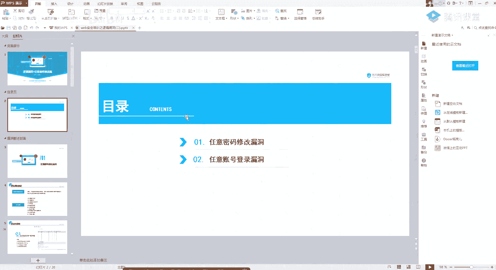
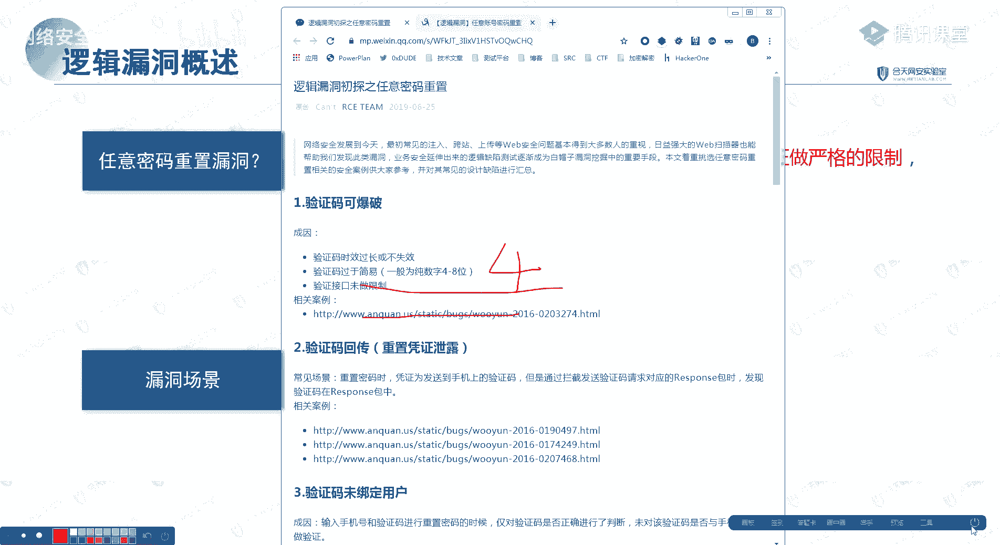
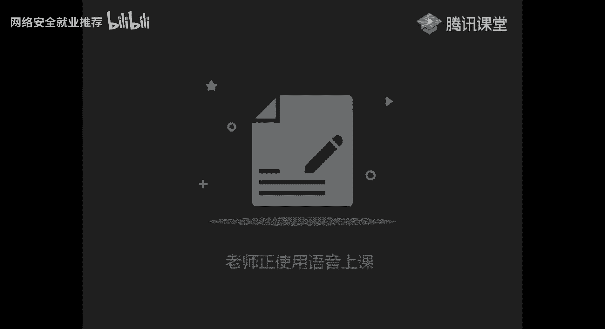
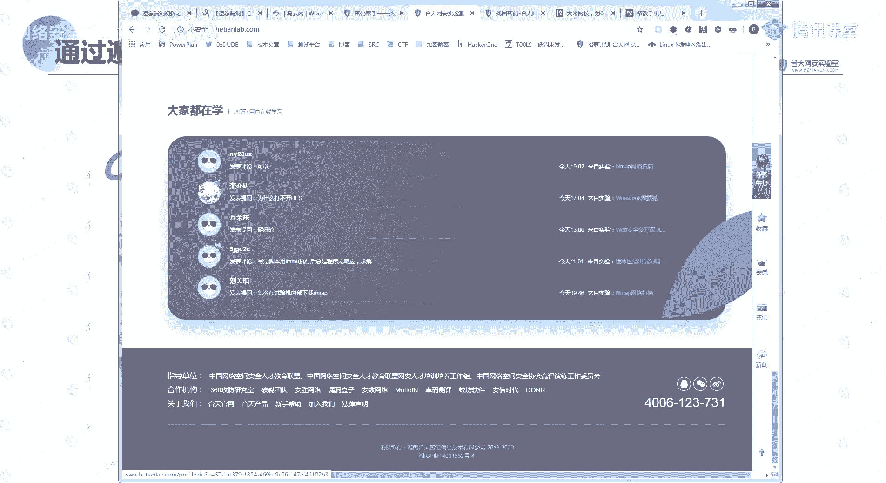
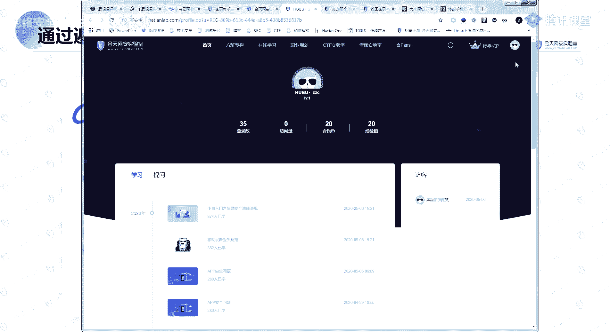
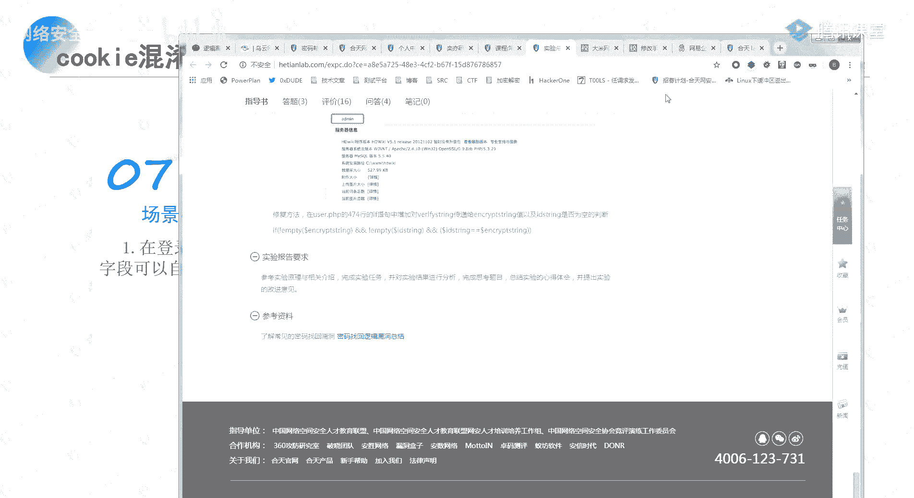
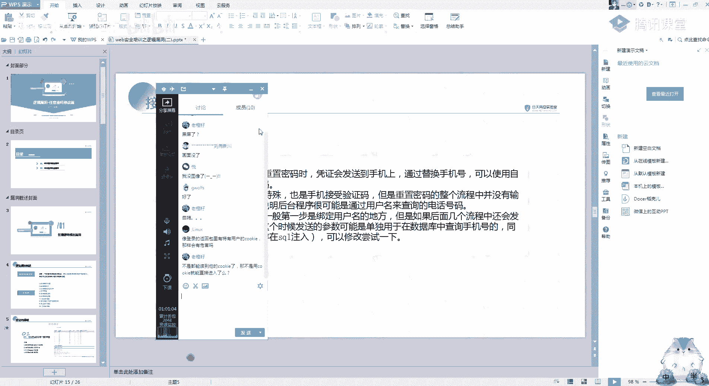

# 课程P29：第27天 - 逻辑漏洞之任意密码重置与任意账户登录 🔐

在本节课中，我们将要学习两种常见的逻辑漏洞：**任意密码重置漏洞**和**任意账户登录漏洞**。逻辑漏洞的核心在于程序员的逻辑设计缺陷，而非复杂的技术实现。理解其思路是挖掘这类漏洞的关键。

## 概述

逻辑漏洞通常不复杂，关键在于思路。任意密码重置漏洞的原理是：在修改密码时，系统没有对修改凭证进行严格限制，导致攻击者可以绕过验证，修改任意用户的密码。其漏洞场景多样，我们将逐一分析。

---

## 任意密码重置漏洞详解

上一节我们概述了逻辑漏洞的特点，本节中我们来看看任意密码重置漏洞的具体表现形式。

### 1. 验证码可被爆破

以下是验证码可被爆破的几种情况：

*   **四位验证码**：这是最常见的情况。四位数字的验证码组合仅有10000种可能，攻击者可以在短时间内（例如三分钟内）通过自动化工具尝试所有组合，从而爆破成功。
*   **六位验证码但无次数/时间限制**：虽然验证码位数增加，但如果系统未对单IP的尝试次数进行限制，或者验证码有效期过长（如两小时），攻击者仍有爆破的可能。
*   **验证码永不过期**：在某些设计中，验证码发送后可能长期有效（如一天），这大大增加了被爆破或利用的风险。**注意**：测试此类漏洞耗时较长，实战中不推荐作为首要目标。

**核心要点**：系统未对验证码的**尝试次数**和**有效时间**做严格限制。

### 2. 验证码/凭证在返回包中回传

在重置密码流程中，系统有时会将验证码或其他凭证（Token）直接放在HTTP响应包中返回给客户端。
例如，在请求发送验证码后，服务器返回的数据包中可能包含字段：`"code": "123456"`。
攻击者通过拦截（如使用Burp Suite）即可直接获取该凭证，从而绕过手机接收环节。

**核心概念**：这里的“凭证”不限于短信验证码，也可能是其他用于验证身份的唯一字符串。

### 3. 验证码未与用户绑定

系统在验证时，只检查了验证码是否正确，但没有校验这个验证码是否是发送给当前正在操作的这个手机号/邮箱的。
**攻击场景**：
1.  攻击者拥有手机号A和B。
2.  用手机号A请求密码重置，获得验证码X。
3.  在重置密码界面，将手机号改为B，但输入验证码X。
4.  系统验证X有效，便允许为手机号B重置密码。

### 4. 仅存在前端验证

验证逻辑完全由前端JavaScript代码执行。例如，验证码被硬编码在JS文件里，前端将用户输入与之对比。
**绕过方法**：攻击者可以禁用浏览器JS、修改本地JS文件或直接构造绕过前端验证的请求包。

### 5. 可跳过验证步骤

密码重置流程分为多步（如：1.输入账号 -> 2.验证身份 -> 3.设置新密码）。如果系统没有在每一步严格校验上一步是否已完成，攻击者就可能直接访问最终设置新密码的链接。
**测试方法**：
1.  用自己的账号完整走一遍流程，记录每个步骤的URL。
2.  尝试在未完成前序步骤（如身份验证）的情况下，直接访问“设置新密码”的URL。如果能够访问并成功修改密码，则漏洞存在。

### 6. 重置令牌（Token）可被预测

系统通过邮件或短信发送的重置密码链接包含一个Token（例如：`https://example.com/reset?token=7a83b1c0`）。如果这个Token的生成有规律（如基于时间戳、用户ID递增），攻击者就可以预测其他用户的Token。
**常见规律**：
*   Token为连续或递增的数字。
*   Token是经过编码的、包含用户ID和时间等可预测信息的字符串。

### 7. 可同时向多个账户发送凭证

在输入账号（如手机号）的环节，如果系统处理不当，攻击者输入用逗号隔开的多个账号（如`13800138000,13900139000`），可能导致系统向所有这些账号发送了相同的验证码。

### 8. 接收端参数可被篡改

在验证身份后的步骤中，可能存在用于标识目标用户的参数（如`uid=123`）。如果该参数由客户端提交且服务端未与之前验证的身份进行二次绑定校验，攻击者通过修改该参数（如改为`uid=456`），即可为其他用户执行操作（如修改绑定手机号）。

### 9. 存在万能验证码

在极少数情况下，系统可能为测试或后台管理预留了万能验证码（如`000000`或`999999`）。如果该验证码在线上环境未被移除，则可直接用于通过验证。

---

## 任意账户登录漏洞详解

上一节我们详细分析了任意密码重置的各种场景，本节中我们来看看与之高度重叠的任意账户登录漏洞。其定义是：由于逻辑错误，导致攻击者可以登录任意用户账户。

### 1. 验证码回传（在登录场景）

与密码重置场景类似，在手机验证码登录时，验证码可能在返回包中泄露。

### 2. 修改返回包实现登录

在登录过程中，拦截服务器返回的响应包，并修改其内容以欺骗前端，使其认为登录成功。
**攻击场景**：
1.  使用错误密码登录，拦截返回“密码错误”的响应包。
2.  将该响应包中标识失败的部分，修改为之前用正确密码登录成功时捕获的成功响应数据。
3.  将修改后的响应包放行，前端应用接收到“成功”的响应，可能就会为攻击者建立已登录的会话。

### 3. 修改用户标识参数（如UID）

某些登录接口或登录后的会话维持，通过参数（如Cookie或URL中的`uid`、`username`）来标识当前用户。如果该参数可控且服务端未做严格权限校验，修改该参数即可切换到其他用户身份。
**公式表示**：`修改请求中的 uid 参数值 -> 系统返回对应用户的数据/权限`

### 4. 万能密码（SQL注入）

这属于SQL注入漏洞的一种特例，在登录场景中尤为典型。通过在用户名或密码字段注入SQL语句，绕过身份验证。
**经典Payload**：
用户名输入：`admin' or '1'='1`
密码输入：任意值
最终执行的SQL可能变为：`SELECT * FROM users WHERE username = 'admin' or '1'='1' AND password = '...'`。由于`'1'='1'`恒真，可能返回管理员用户记录。

### 5. 默认/弱口令

许多系统或用户使用默认密码（如`admin/admin`、`123456`）或常见弱口令。攻击者通过用户名枚举（如学号、工号）搭配弱口令字典，即可尝试登录大量账户。这在教育、企业OA系统中较为常见。

### 6. 撞库

攻击者利用从其他平台泄露的账号密码数据库（社工库），尝试登录目标系统。因为很多用户在不同平台使用相同的账号密码。
**流程**：获取泄露的账号密码组合 -> 在目标网站批量尝试登录 -> 成功登录那些使用了相同密码的账户。

### 7. Cookie混淆

与“修改用户标识参数”类似，如果会话Cookie中包含了明文的、简单的用户标识（如`user_id=123`），攻击者修改此Cookie值即可冒充其他用户。

---

## 总结与课后练习

本节课中我们一起学习了**任意密码重置**和**任意账户登录**两大类逻辑漏洞。我们深入探讨了十余种具体的漏洞场景，从验证码爆破、返回包修改到参数篡改、撞库等。请记住，挖掘逻辑漏洞的核心在于**理解业务流程**和**寻找逻辑断点**，多观察、多测试、多思考是关键。

**课后作业建议**：
1.  在提供的靶场环境（如DedeCMS、琼海CMS等）中，尝试复现课程中提到的漏洞类型。
2.  完成“安保实验室”的逻辑漏洞专题挑战，巩固常规业务场景下的漏洞挖掘能力。
3.  查阅历史漏洞报告（如乌云镜像），分析真实案例中的漏洞思路和利用方法。

逻辑漏洞的挖掘重在思路清晰与实践练习。希望大家通过本节课的学习，能够掌握这些常见漏洞的原理与发现方法。