# 课程P3：第1天 - VMware安装及Kali虚拟机安装 🛠️💻

在本节课中，我们将学习Web安全基础环境搭建的第一步：安装虚拟化软件VMware Workstation，并在此基础上安装Kali Linux渗透测试系统。这是后续所有安全学习和工具使用的基础。

## 概述

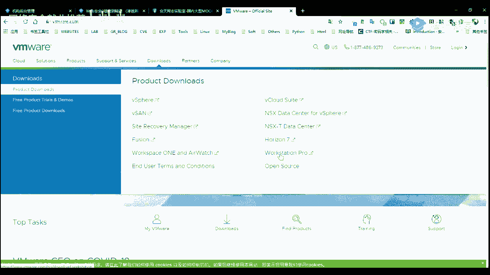


Web安全学习需要一个独立、安全且功能强大的实验环境。使用虚拟机可以在一台物理电脑上运行多个操作系统，方便进行各种测试而不会影响主机。本节课的核心就是搭建这个基础环境。


上一节我们介绍了课程大纲，本节中我们来看看具体如何搭建环境。

---


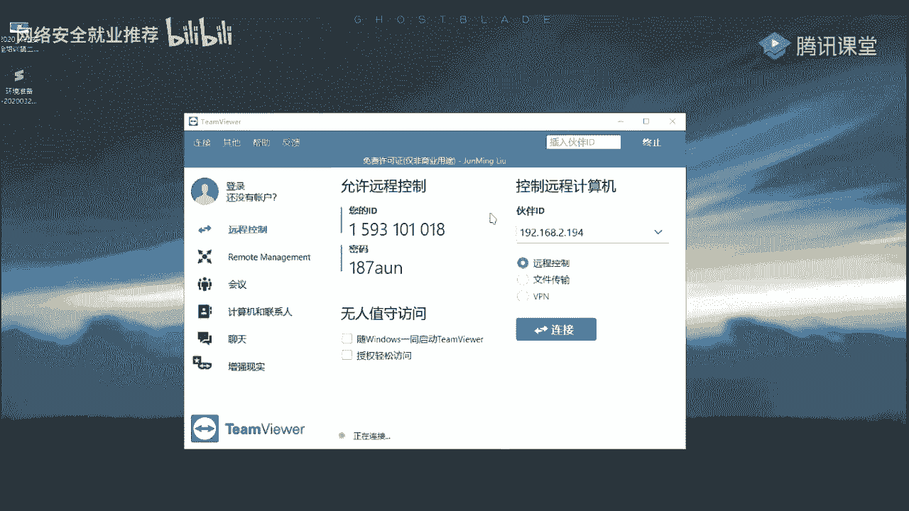

## 第一部分：VMware Workstation 安装与激活


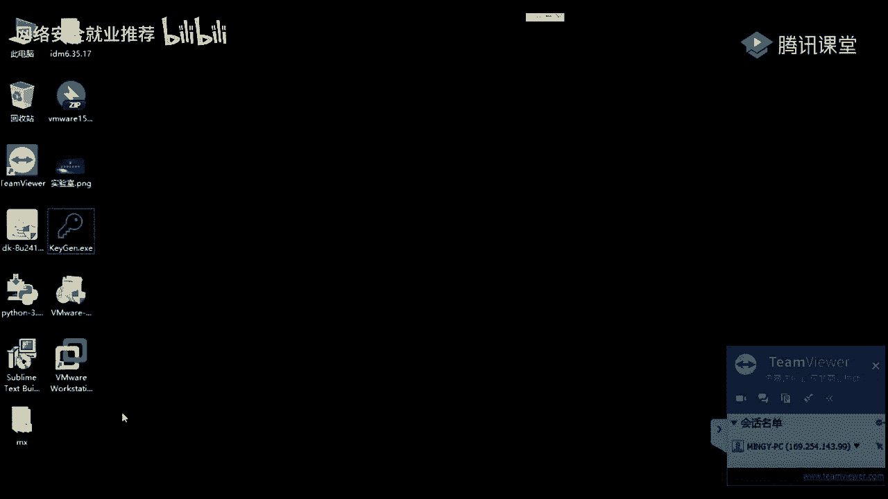

VMware Workstation是一款功能强大的桌面虚拟化软件，允许用户在一台机器上同时运行多个不同的操作系统。


### 1. 软件下载

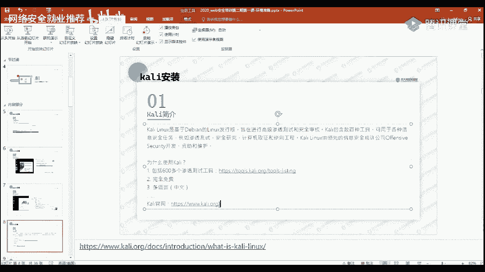

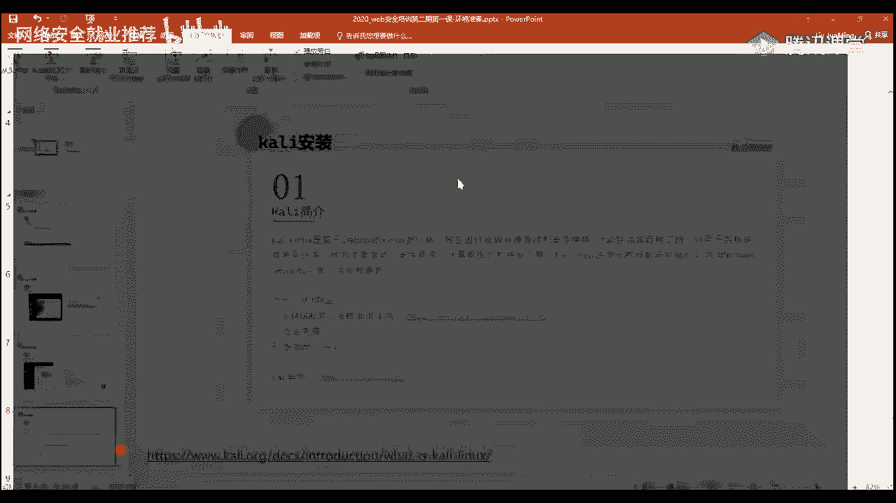


访问VMware官方网站（`www.vmware.com`）下载最新版本的VMware Workstation Pro。
*   在官网找到“Download”选项。
*   选择“Workstation Pro”产品。
*   根据你的主机系统（Windows或Linux）选择对应的安装程序进行下载。

> **提示**：课程提供的资料包中已包含VMware 15.5.2版本的安装文件及激活工具，可直接使用。

### 2. 安装步骤

安装过程较为简单，遵循常规软件的安装流程即可。

以下是关键步骤：
1.  运行下载的安装程序。
2.  接受许可协议。
3.  **更改安装路径**：建议不要安装在系统盘（如C盘），以免影响系统运行速度。可以指定到D盘或其他盘符下的自定义目录，例如 `D:\VMware\`。
4.  取消勾选不必要的增强型键盘驱动等可选组件。
5.  点击“安装”并等待完成。


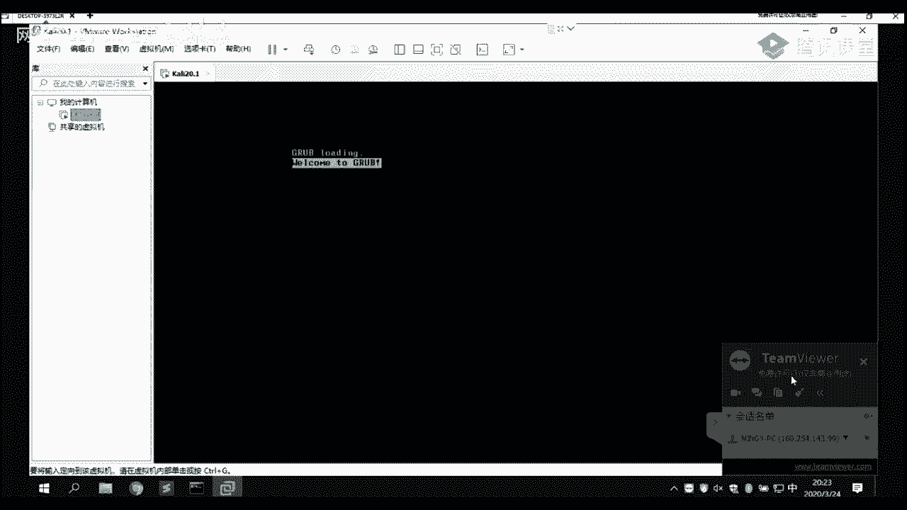

### 3. 软件激活


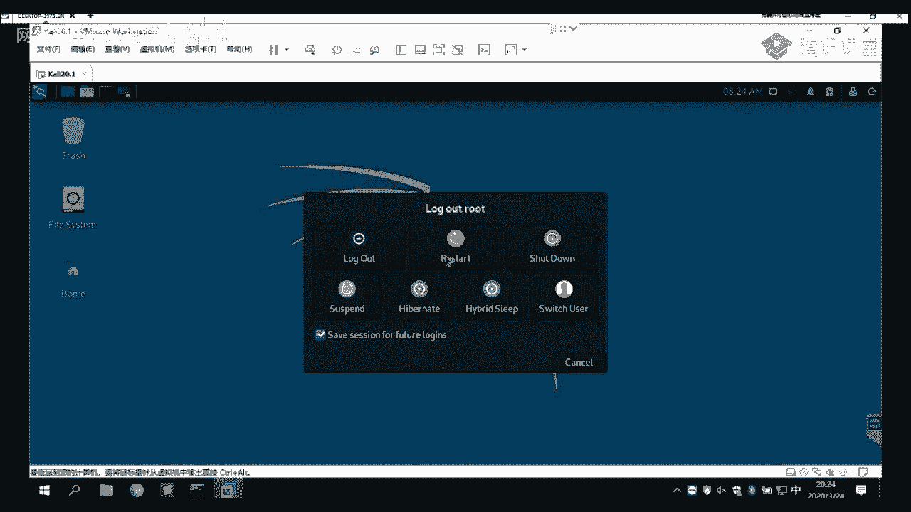

VMware Workstation是收费软件，试用版功能有限。我们需要使用激活工具获取完整功能。

激活流程如下：
1.  安装完成后，先不输入许可证密钥，直接关闭窗口。
2.  将提供的激活工具（通常是一个`.exe`文件）复制到VMware的安装目录下。
3.  运行该激活工具，它会生成可用的许可证密钥。
4.  打开VMware软件，在“帮助”->“输入许可证密钥”中，粘贴生成的密钥完成激活。

激活成功后，即可看到VMware的主界面。


---

## 第二部分：认识Kali Linux 🐉


在安装Kali之前，我们先了解一下它是什么。

Kali Linux是一个基于Debian的Linux发行版，专为渗透测试和安全审计设计。它预装了超过600种安全工具，涵盖了信息收集、漏洞分析、无线攻击等多个领域，是安全从业者的必备系统。

其官方工具列表网址为：`tools.kali.org/tools-listing`。

---

## 第三部分：安装Kali Linux虚拟机

安装Kali有两种主要方式：使用官方ISO镜像安装，或直接导入预配置的VMware虚拟机文件（`.vmx`）。我们分别介绍。

### 方式一：使用预构建的VMware虚拟机文件（推荐新手）


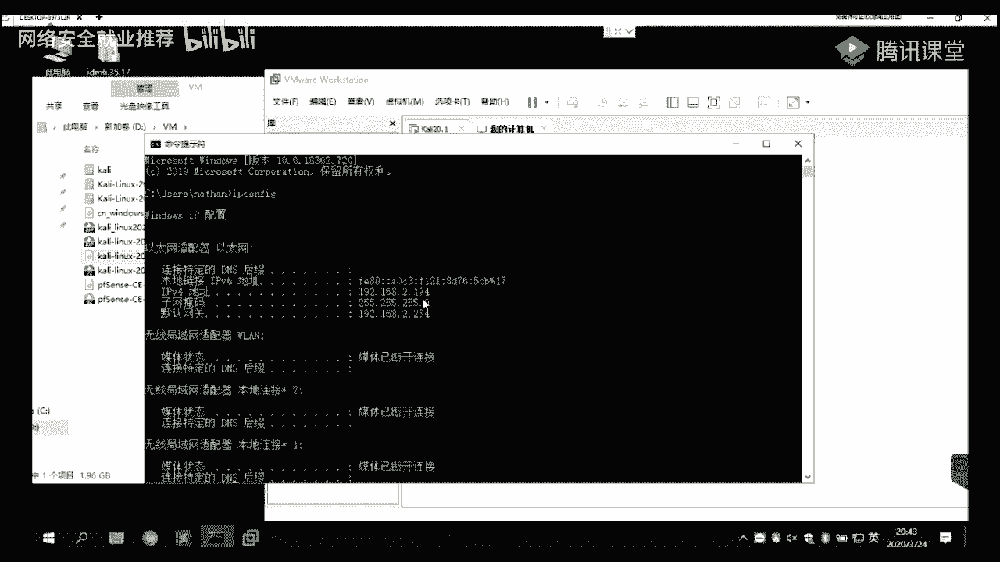

这种方法最简单快捷，适合快速开始。

操作步骤如下：
1.  下载课程提供的或从Kali官网下载的`.ova`或`.vmx`格式的虚拟机文件。
2.  在VMware中，选择“文件”->“打开”，找到并选择该文件。
3.  导入后，直接启动该虚拟机即可。
4.  系统启动后，使用默认用户`kali`和密码`kali`登录。


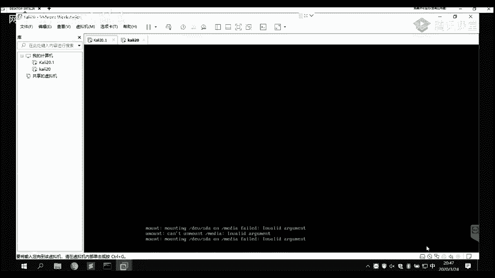

> **注意**：Kali 2020及以后版本默认禁用了`root`用户直接登录，使用普通用户`kali`更安全。如需切换为`root`用户，可在终端执行以下命令：
> ```bash
> sudo passwd root
> ```
> 输入当前用户`kali`的密码后，再设置新的`root`密码即可。之后可以使用 `su root` 命令切换用户。


### 方式二：使用ISO镜像文件安装


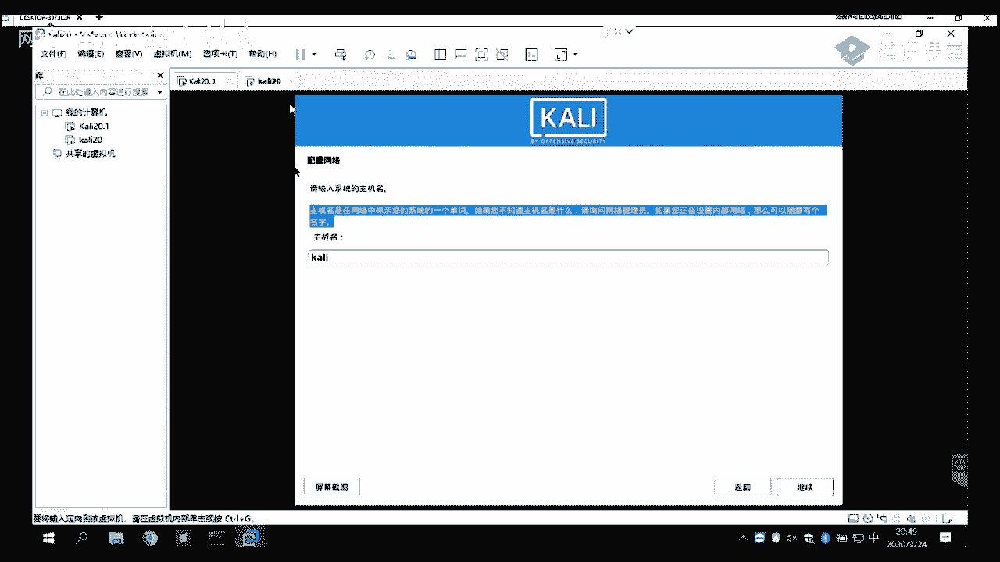


这种方式更灵活，可以自定义系统配置。

#### 1. 创建新虚拟机


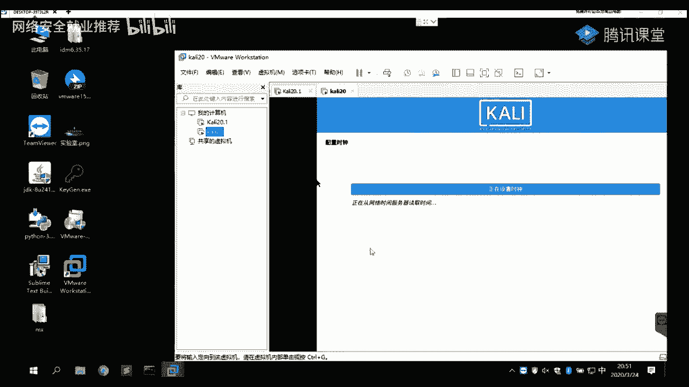

在VMware中创建新的虚拟机：
1.  选择“创建新的虚拟机”。
2.  配置类型选择“自定义（高级）”。
3.  硬件兼容性选择默认的VMware版本。
4.  安装来源选择“稍后安装操作系统”。
5.  客户机操作系统选择“Linux”，版本选择“Debian 10.x 64位”。
6.  命名虚拟机并**选择安装位置**（同样建议非系统盘）。
7.  处理器和内核数量根据主机性能分配，默认设置即可。
8.  **内存分配**：建议至少分配2GB（2048MB），如果主机内存充足（如16GB），可分配4GB以获得更流畅体验。
9.  **网络类型**：选择“使用桥接网络”或“使用网络地址转换（NAT）”。
    *   **桥接模式**：虚拟机将获得与主机同网段的独立IP，像一台真实设备存在于局域网中。
    *   **NAT模式**：虚拟机通过主机的IP地址访问外网，共享主机IP，更节省局域网IP资源。
10. 磁盘容量建议分配40GB以上，选择“将虚拟磁盘存储为单个文件”。


#### 2. 加载镜像并安装

虚拟机创建完成后，开始安装系统：
1.  在虚拟机设置中，将下载好的Kali Linux ISO镜像文件关联到虚拟机的CD/DVD驱动器。
2.  启动虚拟机，进入安装界面。
3.  选择“Graphical install”（图形化安装）。
4.  选择语言、地区、键盘布局等，建议初学者选择“中文（简体）”。
5.  设置主机名（如`kali`）、域名（本地使用可留空）。
6.  创建用于日常登录的普通用户名和密码（例如用户`kali`，密码`kali`）。
7.  **磁盘分区**：对于新手，选择“使用整个磁盘”并“将所有文件放在同一个分区中”是最简单的选项。系统会自动完成分区。
8.  确认分区更改并写入磁盘。
9.  配置软件包管理器，若无HTTP代理则留空。
10. 等待系统安装基本系统和工具包，此过程耗时较长。
11. 安装GRUB引导器到磁盘。
12. 安装完成，重启系统。

---

## 第四部分：虚拟机网络配置与基础问题排查 🌐

安装完成后，确保虚拟机可以正常上网是使用各种工具的前提。

### 网络连通性检查

1.  在Kali终端中，尝试ping一个外网地址，例如：
    ```bash
    ping 8.8.8.8
    ```
2.  如果能通，说明网络连接正常。如果无法ping通，请检查以下设置。


### 常见网络问题解决

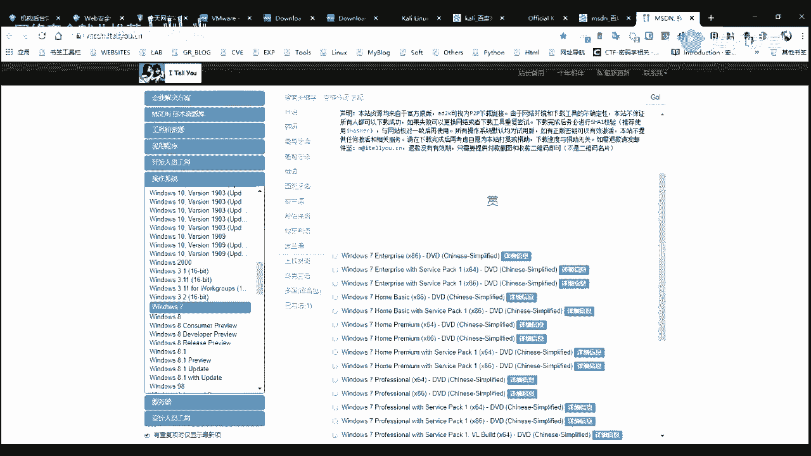

1.  **检查VMware网络设置**：确保虚拟机的网络适配器已连接，并且模式（桥接/NAT）符合你的网络环境需求。
2.  **更改DNS服务器**：如果可以ping通IP（如`8.8.8.8`）但无法解析域名（如`www.baidu.com`），可能是DNS问题。可以编辑DNS配置文件：
    ```bash
    sudo nano /etc/resolv.conf
    ```
    添加公共DNS，例如：
    ```
    nameserver 8.8.8.8
    nameserver 114.114.114.114
    ```
3.  **更新系统**：网络通畅后，建议首先更新系统以获取最新软件和安全补丁：
    ```bash
    sudo apt update && sudo apt upgrade -y
    ```

---


## 第五部分：补充：Windows虚拟机安装简介

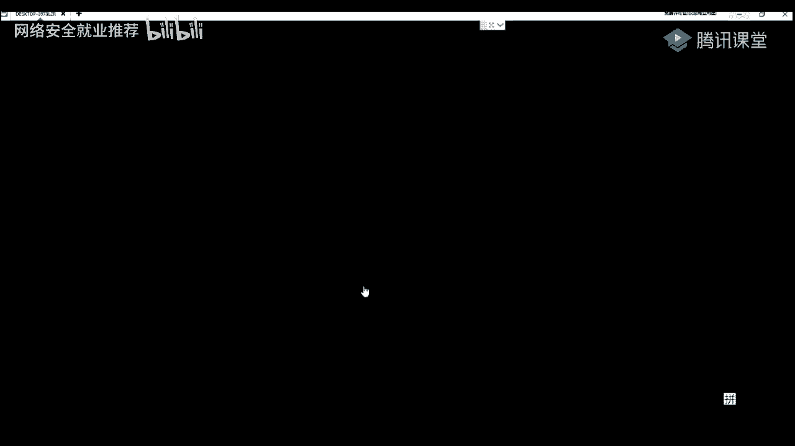

在安全测试中，有时也需要Windows环境。安装Windows虚拟机流程与Kali类似。

1.  **获取镜像**：可以从“MSDN，我告诉你”等正规网站下载Windows系统ISO镜像。
2.  **创建虚拟机**：在VMware中新建虚拟机，客户机操作系统选择对应的Windows版本（如Windows 10）。
3.  **加载安装**：将Windows ISO镜像关联给虚拟机，启动后按图形化向导完成安装即可。

---

## 总结

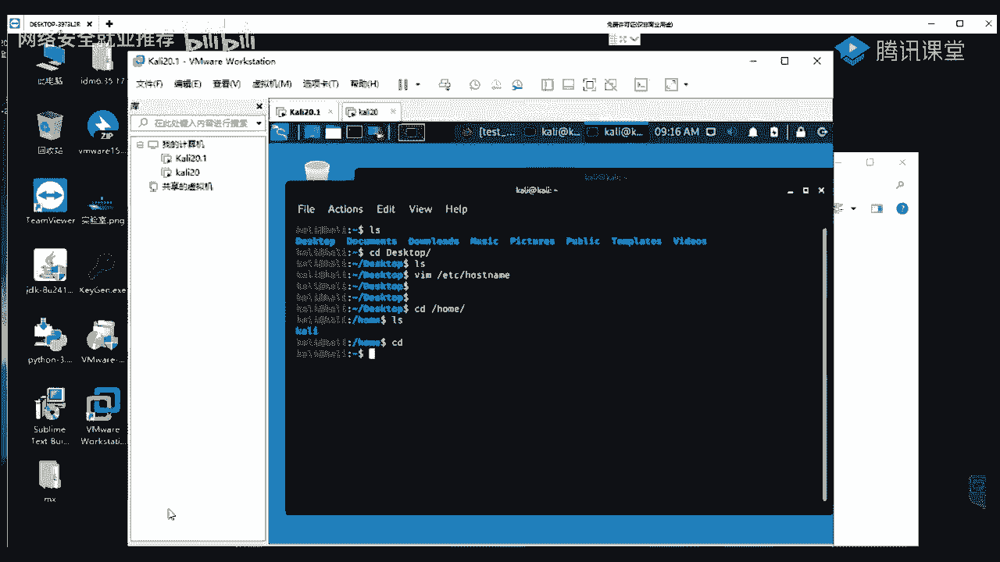


本节课中我们一起学习了Web安全学习环境的基石搭建。
1.  我们首先安装并激活了虚拟化软件**VMware Workstation**。
2.  然后认识了专为渗透测试设计的**Kali Linux**系统及其强大工具集。
3.  接着，我们详细讲解了两种安装Kali虚拟机的方法，推荐新手使用预构建的虚拟机文件以快速上手。
4.  最后，我们介绍了虚拟机**网络配置**的要点和常见问题的解决方法，并简要说明了Windows虚拟机的安装思路。

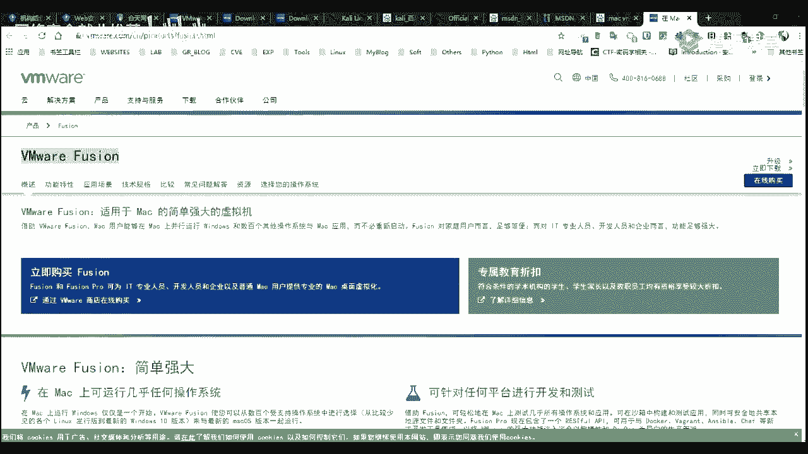


成功搭建这个环境后，你就拥有了一个安全、隔离且功能强大的实验平台，可以放心地进行后续的各种安全工具学习和漏洞测试实践。