# 网络安全就业推荐 P31：第29天 - 逻辑漏洞挖掘思路脑洞篇 🧠💡

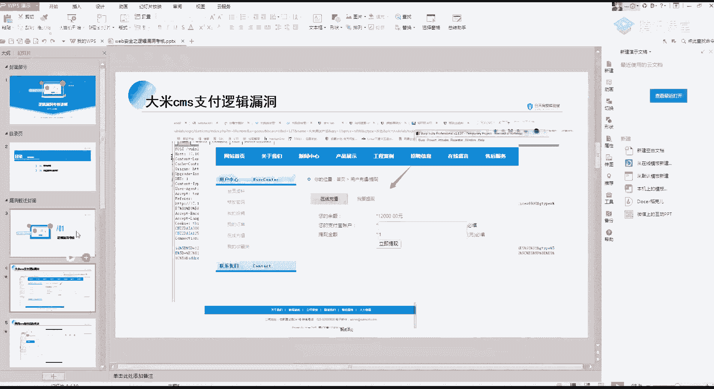

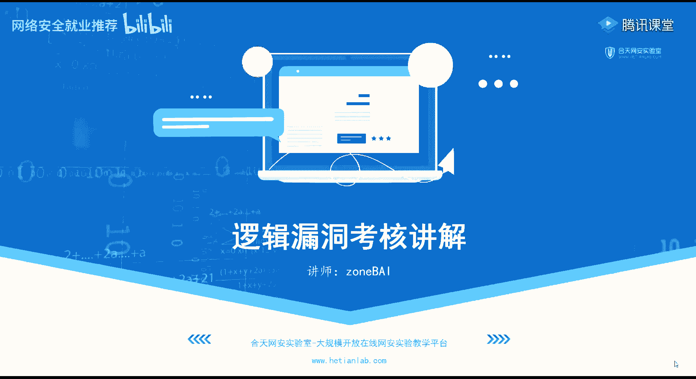

在本节课中，我们将学习逻辑漏洞的挖掘思路，特别是超越常规“改包”操作的“增”与“删”的脑洞技巧。课程将首先回顾三个考核题目的核心解法，然后深入探讨如何通过添加或删除参数来发现隐藏的逻辑漏洞。

---

## 第一部分：考核题目讲解

上一节我们介绍了逻辑漏洞的基本概念，本节中我们来看看三个具体考核题目的挖掘过程。

### 1. 大米CMS支付逻辑漏洞 💰

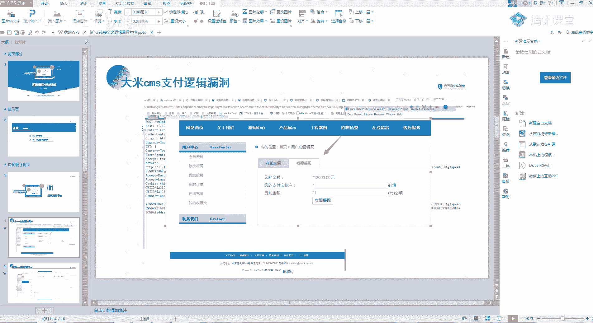

这个漏洞的核心在于修改订单请求包中的参数值。

**操作步骤如下：**

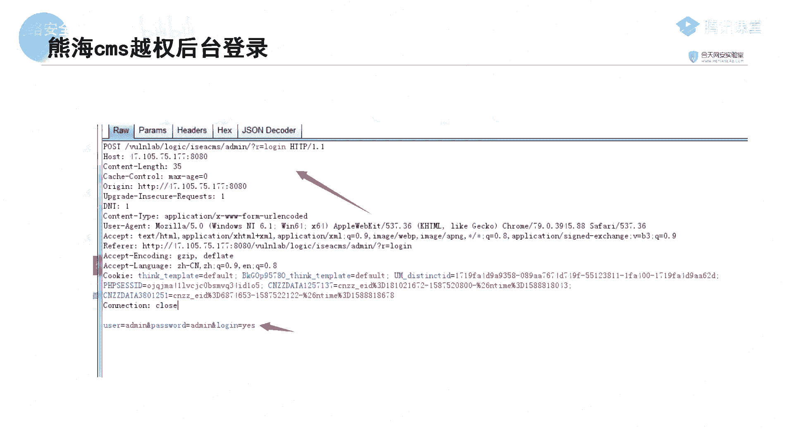

1.  注册一个账号。
2.  进入产品购买页面，选择“站内扣款”的支付方式。
3.  提交订单时，使用抓包工具拦截请求。
4.  在拦截到的数据包中，找到代表商品数量的参数（例如 `num=1`）。
5.  将该参数值修改为负数，例如 `num=-1`。
6.  放行数据包，完成订单提交。系统会因数量为负而向你的账户“退款”，从而实现“赚钱”。

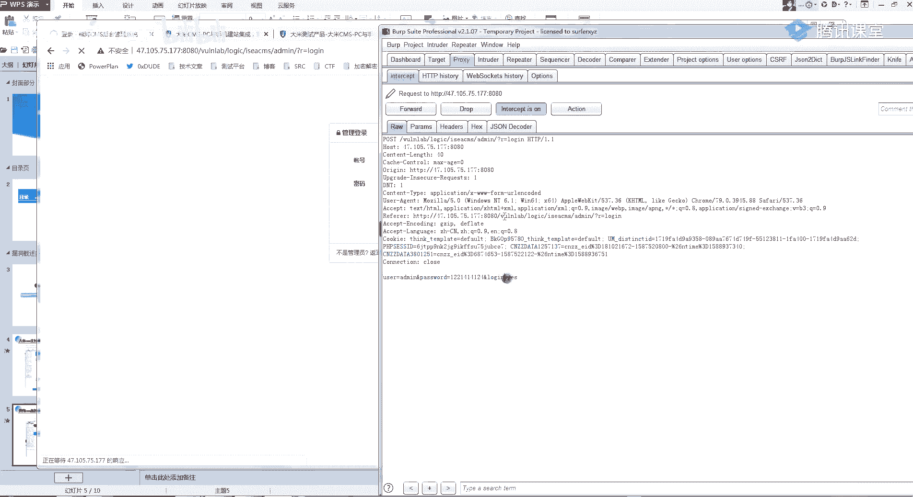

**核心思路：**
逻辑漏洞的测试基于对数据包的深刻理解。你需要尝试修改请求中的每一个参数，例如价格（`price`）、数量（`num`）、商品ID（`id`）等。开发者可能只对价格做了校验，却遗漏了数量，从而导致漏洞。

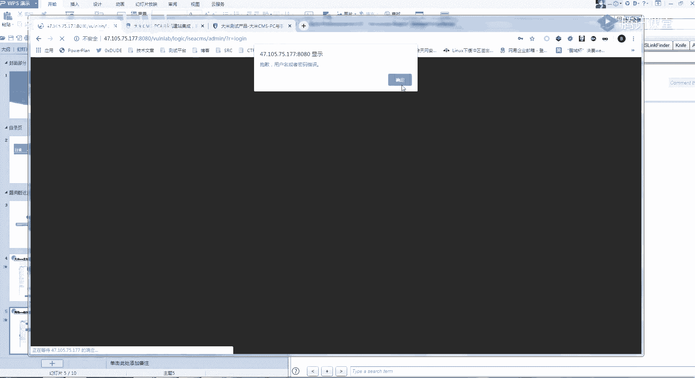

### 2. 熊海CMS后台越权漏洞 🔑

这个漏洞利用了系统通过Cookie中的特定字段（如`user`）来判断用户身份的缺陷。

**操作步骤如下：**

1.  访问后台登录页面（例如 `admin.php?r=login`）。
2.  输入任意用户名密码并抓取登录请求包。
3.  在请求包的Cookie部分，手动添加一个身份字段，例如 `user=admin`。
4.  同时，将请求的路径（`r`参数）修改为后台的其他功能页面，如 `r=index`。
5.  放行数据包，即可绕过登录直接进入后台管理界面。

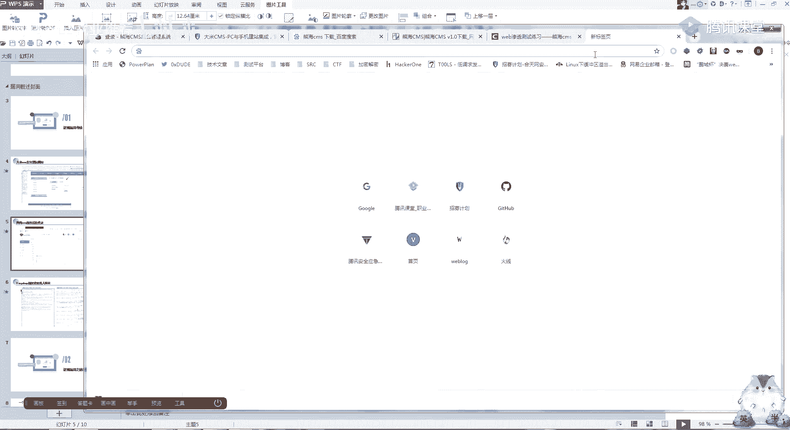

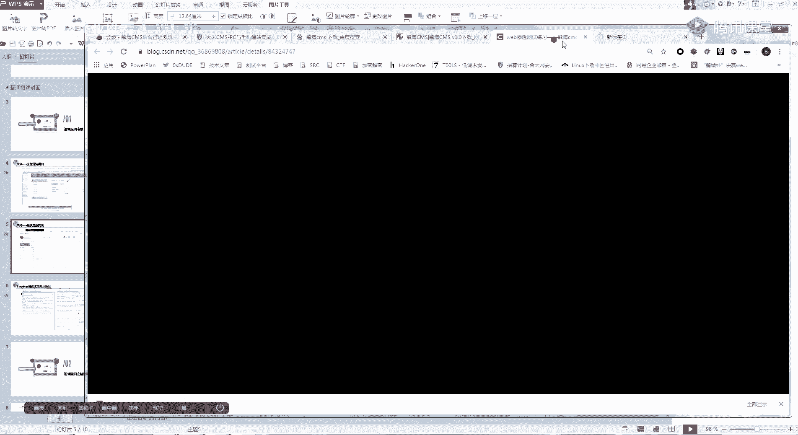

**核心思路：**
对于开源CMS，可以通过下载源码来了解其后台的所有页面和参数。漏洞挖掘时，要熟悉每个参数的作用，并尝试在Cookie等位置添加或修改身份标识参数。

### 3. 商城收货地址越权漏洞 🏪

这是一个经典的越权漏洞，通过修改请求中的用户ID（`uid`）参数，来操作其他用户的收货地址。

**操作步骤如下：**

1.  登录自己的账号，进入“我的收货地址”页面。
2.  添加或修改地址时抓包。
3.  在数据包中找到标识用户的参数（如 `uid=1001`）。
4.  将该参数值修改为其他用户的ID（如 `uid=1002`）。
5.  放行数据包，如果操作成功，则存在越权漏洞，可以查看、修改或删除他人的收货地址。

**核心思路：**
这类漏洞在查询用户敏感信息的功能中很常见，如医院病历系统、学校学生信息管理系统等。关键在于发现并修改请求中用于区分不同用户的标识符参数。

---

## 第二部分：逻辑漏洞脑洞篇 🧩

上一节我们回顾了基于“修改”操作的经典逻辑漏洞，本节中我们来看看更具创造性的“增”与“删”的思路。

### 1. 删除参数法

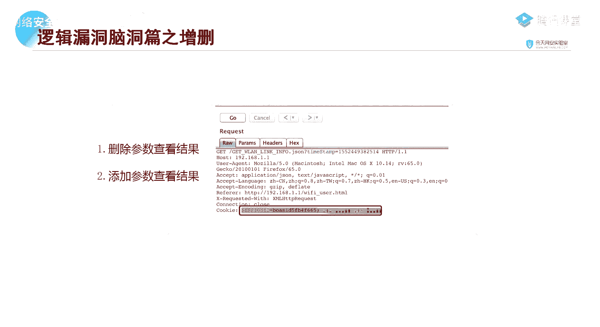

此方法的核心是：删除请求中的某些关键参数（如身份验证Token、Cookie），观察系统是否仍然正常响应，从而发现未授权访问或逻辑缺陷。

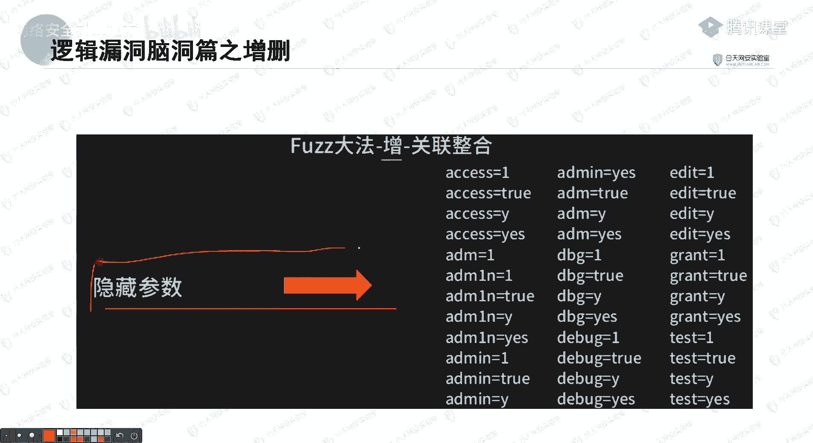

**操作思路：**
1.  拦截一个需要权限的操作请求（如修改个人信息）。
2.  删除请求头中的Cookie或Authorization字段。
3.  或者删除请求体中的Token参数。
4.  放行请求，如果操作依然成功，说明系统未对用户登录状态进行有效验证，存在未授权访问漏洞。

**公式化描述：**
`正常请求 (含身份凭证) -> 成功操作`
`删除身份凭证后的请求 -> 若仍成功操作 => 存在未授权漏洞`

### 2. 添加参数法

此方法的核心是：向请求中添加可能的“隐藏”参数，以探测额外的功能点或漏洞入口。这类似于用字典爆破隐藏的网站目录。

**操作步骤如下：**

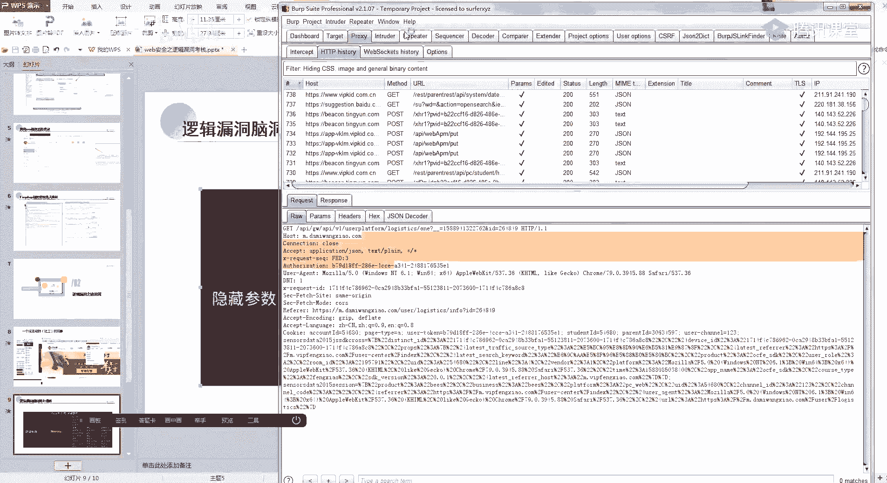

以下是使用Burp Suite Intruder模块进行参数爆破的示例思路：

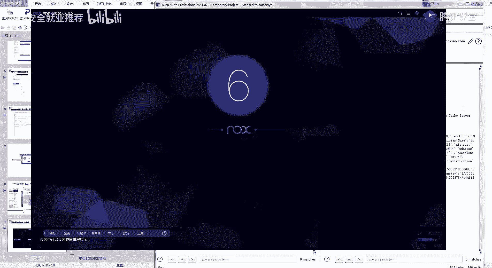

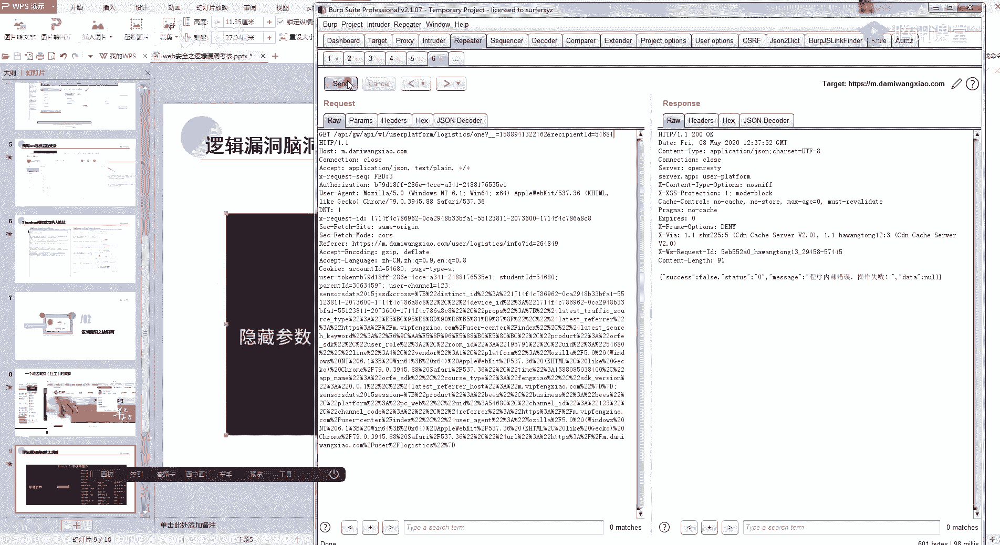

1.  拦截一个正常的GET或POST请求。
2.  发送到Intruder模块，选择“Sniper”攻击类型。
3.  在请求中选定一个插入点，例如在URL的`?`后，或请求体中。
4.  加载一个包含大量常见参数名的字典文件（如 `callback`、`jsonp`、`debug`、`test`等）。
5.  开始攻击，观察响应中是否有长度、状态码或内容明显不同的结果。

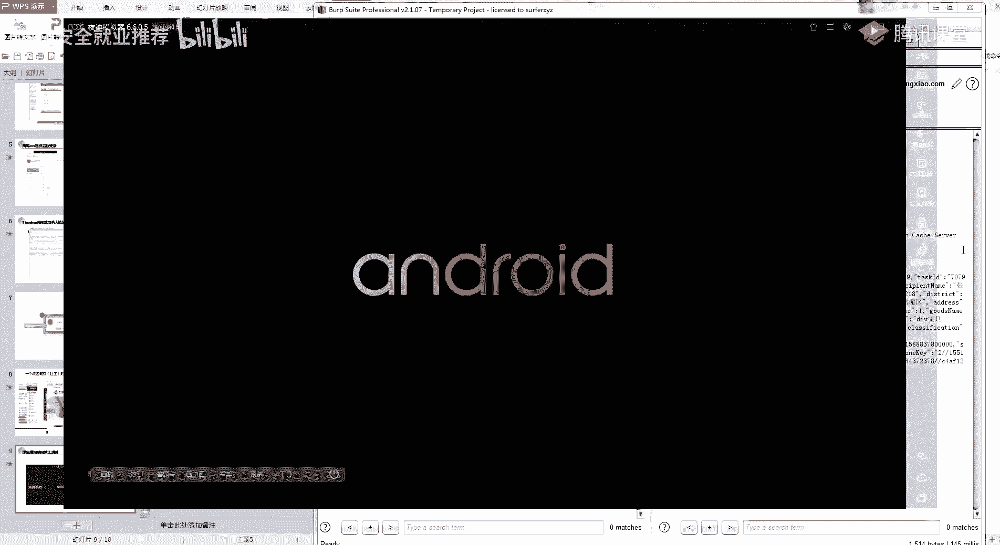

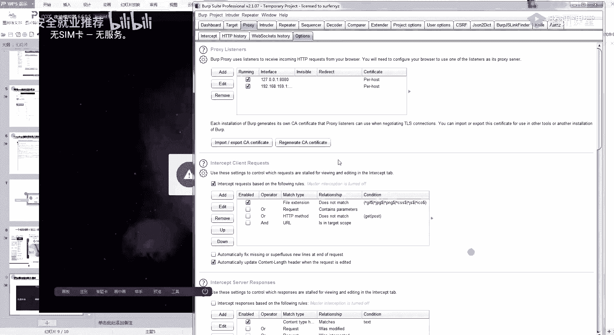

**代码示例（概念性）：**
原始请求：`GET /user/info?id=123`
测试请求：`GET /user/info?id=123&callback=test`
如果响应变成了 `test({...user data...})`，则可能发现了JSONP接口，进而可能测试JSONP劫持等漏洞。

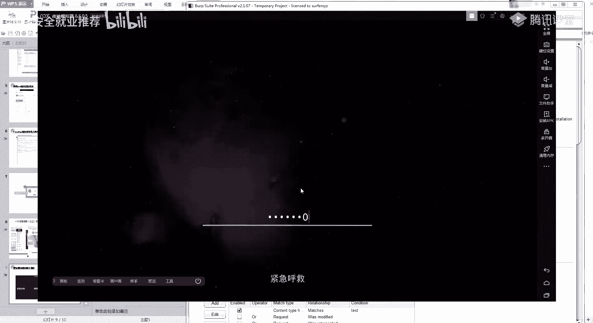

**核心思路：**
-   **隐藏功能**：开发者可能预留了某些调试参数或未公开的功能参数，添加它们可能触发不同的逻辑。
-   **参数污染**：添加的参数可能与原有参数产生交互，引发逻辑错误。
-   **漏洞发现**：例如，添加 `callback` 参数可能暴露出JSONP接口；添加 `debug=true` 可能开启调试模式泄露信息。

---

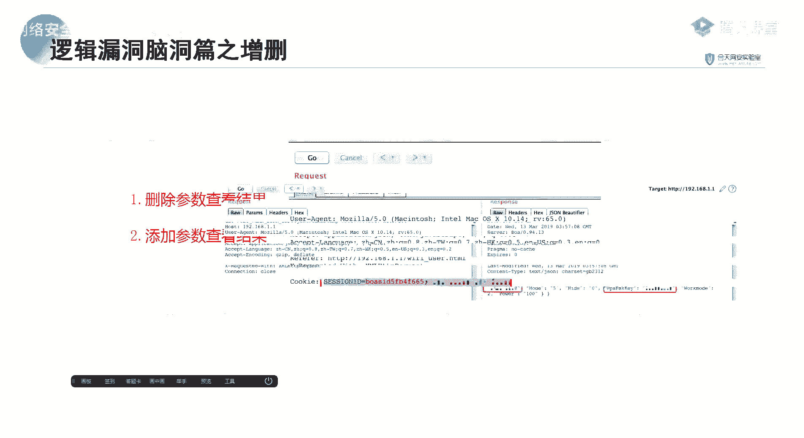

## 总结

本节课中我们一起学习了逻辑漏洞挖掘的进阶思路：
1.  **基础操作**：通过“修改”请求包中的价格、数量、ID等参数，挖掘支付、越权等经典逻辑漏洞。
2.  **进阶脑洞**：
    -   **删除法**：通过删除Cookie、Token等身份凭证，测试系统是否存在未授权访问漏洞。
    -   **添加法**：通过字典爆破向请求中添加隐藏参数，以发现未公开的功能点、调试接口或新的攻击面（如JSONP）。

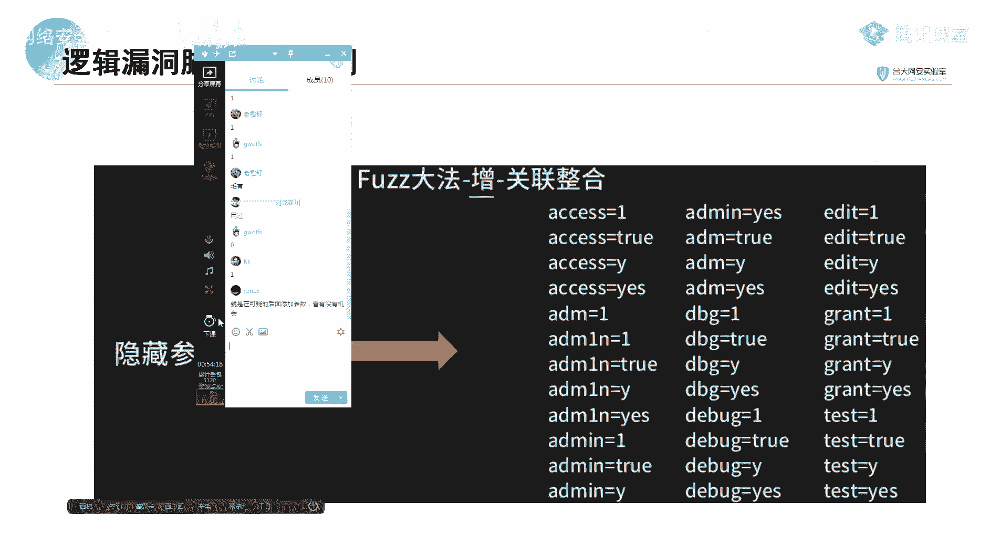

逻辑漏洞的魅力在于思维的独特性。不要局限于常规测试点，要大胆假设、细心验证，对请求中的每一个字段都保持好奇，尝试增、删、改、查各种操作，才能发现那些深藏不露的安全问题。