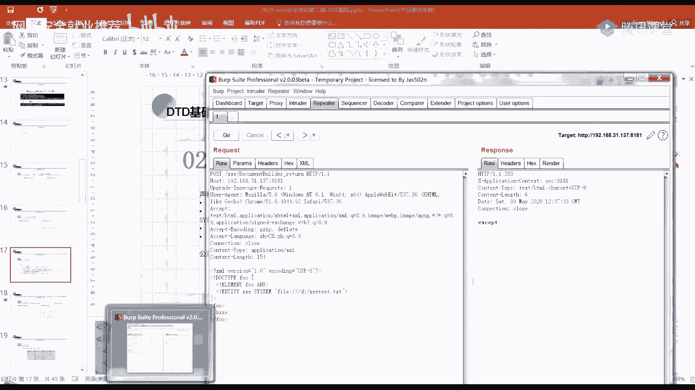

# P32：第30天：XXE漏洞-XXE漏洞基础 - 网络安全就业推荐 - BV1Zu411s79i

啊啊啊。

啊啊啊啊，哈喽哈喽，你们能听得到我说话吗，姐姐行吧，为什么为什么今天人这么少呀，你们之前人也这么少吗，可能因为放假了好吧，我好久感觉好久没有给你们上课了，是不是啊，有有没有一个月啊，我感觉好久了呀。

好几年好几年也不至于哈，中间画了个不一样对，然后今天要讲的内容你们有去预习吗，就是，这个这个内容你们有去预习吗，为什么要叫我姐姐，开了家产没有基础的东西好吧，然后这个漏洞的话可能会就是理论知识和。

可能会有点难度，所以大家要认真听，然后现在开始讲课，我们这节课讲的是这个叉叉一，然后是他全程就是xml外部实体注入攻击漏洞，因为他是这个名字，大家有看到中间就有一个xml以及外部实体。

所以说这节课的话会给先给大家介绍一些，前前期的一些基础知识，就是这个xml以及d t t的一个基础，第二个的话就是第二个是下节课，第三个是下下节课的一个内容，我们今天就只讲这个嗯。

我就把它放到一个ppt里面来了，嗯首先我们讲这个xml基础，那首先的话也是说嗯xml的一个定义，它是一种嗯用于标记电子文件，使其具有结构性的可扩展标记语言，是不是看不懂，其实就可以理解。

把它理解为它就是一种语言，然后其实它的那个形式是，和我们html语言是差不多的类似，但是我们的xml语言它并没有一个固定的标签，所有的标签它都可以有一个自定义，就不像html一样。

它就有那个什么嗯左右兼顾号，html啊，title标签呀，a标签呀等等这些固定的这些标签内插ml的话，它就它的所有标签都可以自定义，然后他设计的传输的宗旨就是传输数据，而不是像我们html语言一样。

就是用来显示嘛，就是前端显示，那xml的话，它设计的宗旨就是用来传输数据的，我们接下来来看一下，这个程序处理xml的一个流程，可以先看到左边这张图，左边这张图的话就是嗯。

这边的话我们是先生成了一个xml的一个文档，然后通过hdp发送给我们的服务端，服务端接收请求之后，接收到了之后，它就会进行它有一个html解析的一个库，然后进行解析解析之后，他可能嗯会把数据回显给我们。

或者是他自己进行另外的一些处理，那我们看到右边的话，它就是将我们的一个数据回写给了我们，在这的话我是通过这个post传传输的，这个下面就是传输的一个我们xml的一个，xml格式的一个数据。

这这个下面就是一个xml的一个文档，等一个数据，就是这个请求体里面，那在这的话，首先我们来可以看一下下一张ppt，来介绍一下它的一个嗯结构，那第一行就是这个左尖括号，问号差ml，这一行。

他就是表明我我这个文档它是一个xml的文档，然后这个book这它就定义了一个跟元素跟节点，就是这个book，然后它的属性为d d的值为一，里面呢这个book里面包裹了四个子元素。

就是整个他的意思就是说这本书啊，他的id为一，然后它里面有这本书的名字，这本书的作者，这本书的出版的年份以及这本书的价格，他可能就是这个样子，就是他的意思就是这样嗯，然后下面这里的话定义了他的一些语法。

第一个china文档它必须要有一个根元素，那在这的话就是我们这个book，然后第二个xml元素必须有一个关闭的标签，就是一个闭合标签，比如说这个brook的话，它就在这个下面闭合。

然后lamb的话它就在这个后面，每一个都有一个闭合的标签，第三个的话它是对大小写敏感的，如果你这输入这比如说这是author，然后你闭合的时候在这输了一个大写的a，然后在u t h o r的话。

它是会报错的，就是他服务器那边不能进行一个正常，正确的一个解析，它会报错，第四个的话就是他要被正确的嵌套，你不能说你不能说这个页，比如说这个，这个页换到这个这个author这个这边来。

然后你又把这个这个闭合的这个author，又换到这个下面来，这样也是不行的，你就要有一个正确的这样一种嵌套的一种感觉，第五个的话就是xml的属性值，它是必须要加引号的，这个大家了解一下就好。

我们接下来来看一下它cheml文档的一个结构，刚才也有说，就是我们看到左边的话，它是包括了我们xml的声明，第二个的话是d t d文档类型定义，这个类型定义的话其实是可选的，你可以写也可以不写。

第三个的话就是我们的一个文档元素，那看到右边的话，右边这张图它首先在前面是一个xml的声明，这个，嗯下面这一段文字，也是对这一个声明的一个解释，比如说第一条就是这是xml的一个标记，用于高速浏览器。

就是这个文档是一个xml的文档，然后这个version的话就是它的一个版本，第三个的话就是这个编码的值，在这的话就是我们选择了支持ut f杠八，所以说如果你在xml的文档里面。

就是这个里面使用的一个字符集，编码是gb 2312，就是和它不对应的话，就可能会出错嗯，可以看到中间这一个，就是我们前面没有没有了解过的，中间这一分，这一个部分的话就是一个dt d文档类型的定义。

我们接下来来看一下这个d td来介绍一下它，d d d的定义，它就是一个文档类型定义，用来为我们xml文档定义语义约束，嗯前面我们不是说，在，这个地方吗，所有的标签都可以自定义。

就是这些东西它都是可以进行一个自定义的，那有没有方法来进行一个约束呢，我们就可以使用这个d td来进行一个约束，我们可以把d d d理解为一个模板，这个模板中定义了用户自己创建的根元素。

以及对应子元素和根元素的合法子元素和属性，而元素文档元素则必须以我们的d d d为模板，来对xml的元素进行相应的规范化，就不要看这种文字，我们就直接看吧，看这个它的一个就是刚才可以看到这张图里面。

他的意思就是就是它的一个语法是这样子的，尖括号感叹号doc type，然后是一个根元素，然后然后就是这个中括号有一个里面，就是我们的一个元素声明，所以说你下面的一个文档元素的话。

你要按照这个元素声明来进行一个编写，在这的话它是声明了一个根元素，是我们的这个book元素，然后里面有就是看到这一行里面，他就有三个子元素，lab author以及音乐。

然后在这个下面的话就定义了这个三个元素，就是lab ber和y它的一个嗯，相当于是类型吧，就是这个井号pc d这个，这边传入过去之后进行解析之后，就是像右边这样得到的这样一张图。

这种方式就是我们d d d声明的内部声明，因为它是写在我们xml的文档的内部的，就是包含在我们xl源文件中，还有一种的话是d d d的外部声明，它是写在外面的，嗯在这儿的话。

它的语法和我们前面那个内部声明，就有一个区别，就是它在这个根元素后面就不是加的，我们前面这个元素声明了，而是加了一个system这个关键词，然后后面加上我们的一个文件名，就是在。

文件名或者是我们的远程的一个url地址，这个文件名的话，可能就是你去引入的一个外部，dvd文件的一个路径，因为在这的话，我就是直接去引入了一个192。16，8。1。239下面的根目录。

下面的cd a t a r d d t d，然后这个里面的一个内容的话就是我们，和刚才这个是一样的，就是这一个部分，然后下面的话就是一个文档元素，还是和之前一样，解析的话。

当然也是和前面一样的一个解析结果，我是不是讲的太快了。

我给大家演示一下吧，嗯这个的话是一个有漏洞的一个代码，然后我来把它运行起来。

给大家看一下。

thank you want it。

嗯这报了一个错，因为我们需要一个post类型的。

然后我们直接这样访问。

就是在浏览器中，这样访问的话是一个get类型的嘛，所以他就报了一个错误。

我们直接在lol里面来进行一个，嗯把这个content type改为我们这个xml，然后在这边的话可以输入我们前面。

比如说就给大家演示一下这个。

怎么这么慢。

嗯我这里写错了，我这不应该是应该是。

就是我现在这个程序，这个程序我现在运行吗，它是运行在八一端口的，然后我又开了这个ph p study，就是那个八零端口嘛，k h v3 d的话是吧，然后我在那个根目录下面。

我给大家看一下就好了，嗯这有这个，然后再搞一下，这样就会有我们的一个显示结果给我们。

这个的话，就和我们ppt里面是一样的，我可以带着大家看一下，就是它是怎样进行一个解析的。

首先是我们发送一个cos的请求，到我们这个叉叉一嗯，document builder，然后它的内容就是他的请求体里面的话。

就是我们一个xml的一个文档，xml的一个数据不能说什么，然后在这的话它就直接进入了这个方法题，就是进入了这个，然后他获取到了他的一个我们请求的一个body，请求体请求礼之后，在这儿进行了一个打印。

所以在这里的话有这个输出给我们，就是我们请求体的一个内容，嗯接下来主要其实就是在这一块，这里是进行，就是他首先是创建了一个document builder的一个实例，factory的一个实例，然后。

主要就是这一个吧，238行，这进行了一个解析，对我们输入的这一个进行了一个解析，解析之后，然后进行了一个便利，那在这儿的话它直接是进行了一个返回。

所以说在这里的话就会有一个危险的数据给我。

们嗯，这个是这个是用java代码写的，所以说他嗯这个就是一个普遍的来进行解析，一个xml文档的一个代码，然后这个是不安全的，之后我们会给大家说它的一个修复方法。

trampos的传说都是第四，cham也不一定是只能post传输，你也可以就是get to传输。

那为什么我在这就是只能用pass掉，因为在这个代码里面他写了，这有要求他的method的，就是请求方法，要是post，如果他是get的话，它就会报错，而且你如果是get的话，你可能有一些。

如果你是传一些东西的话，就可能需要进行一个编码，比如说那个连接符号，我们之后会说就是说是讲滴滴滴实体的时候，就会说一个连接符号，我们也知道我们如果是一个get型的话，你在这里加二。

就是在这个ui l中那个连接符号的话，就是分隔两个参数了嘛，内在d d d实体里面的话，就是我们xml文件里面的话，它就是用来引用一个d d d实体的，所以说可能会就是要进行一个编码。

当然你说他可不可以只能post传输，那肯定也是不行，就是不对的，就是他也可以进，就是做干传输，然后我们接着往下讲的快吗，你们能接受吗，都是第一次听说石油天猫，没关系，想着嗯好，那我就接着往下讲。

刚才说的就是这个滴滴滴的一个声明，我们前面讲的是一个xml文文档吗，然后现在讲了啊，xml的嗯，对文坛的一个嗯语法以及一个规范，接下来我们讲了，这就是这个xml文档中的一个dp p的这个部分。

因为后面叉叉e的话会用到我们dd第十题，所以要介绍这个，然后滴滴滴声明的话，刚才说了，这个是一个内部的声明，然后这个的这种的话，加上我们这个system就是一种外部的生命，这里的话我第二张图的话。

就是就是通过引入一个文件名，当然你这个就是这个cdt 2 d a t a2 ，这个点d d d肯定是要在他那边，就是在服务器那边是存在这个了，不然你没就是当前目录下是存在这个文件的，不然的话就没有嘛。

对吧嗯，接下来给大家介绍一下这个pc date，就前面，在这个地方的时候，我们有说可以把它理解为，就是它的类型是一个pc that，那它到底是什么意思，它是指的是被解析的字符数据，好像说的也不是什么。

我们能听得懂的话，其实就是说，pc data表示包含字符或者是文本数据，这些文本将被解析器检查实体以及标记，不过被解析的字符数据，不应当包含任何这种连接符号，左键括号或者是右键符号。

字符需要使用连接符号，这种左键括号以及右键括号的实体，来分别替代它们，这个实体的话就是理解为我们的这个字符实体，我们的一个还是帽边嘛，然后是这种形式的，他的意思就是说如果你在d d d中声。

就是声明它的一个元素类型的时候，他是这个pc data的话，它就会对你那个文档元素，就是你在这儿声明了这个lab它的属性是pc data，进行一个解析，那你数据里面如果包含了这些特殊字符，连接符号。

左键括号，右键括号这种特殊字符的话，它就会报错，所以说我们需要使用它的一个实体，就是这个实体来进行替代，可以看到在这的话，如果可以演示一下，如果我在这儿输入。

它是有一个except，我们可以来到这个程序里面，这个它就会这里因为是打印了一个，他的一个嗯异常的类型，所以这就会告诉我们，那在这的话还是说原档元素类型。

它其实就是将我们这个以它开头嘛，以这个左键框开头，他就会去进行解析。

把它解析为一个月一个元素类型了，然后他说你必须要以他为中，就是来终止这个元素，所以说这样的话就会报错。

那怎样进行一个就是让他不报错呢，就是使用我们这个实体编码嘛，编码之后它就能进行一个正常的显示解析出来，这个的话就是左键括号，这个是连接符号，然后右边这个的话就是大于号嗯。

与之对应的就是与这个pc data对应的话，就是这个c d，它是指的是不应由xml解析器进行解析的，一个文本数据，它里面的所有内容都会被解析器所忽略嗯，下面有进行一个解释。

在xml元素中小于号连接符号是非法的，小于号会会产生错误，因为解析机会把字符解释为新元素的开始，刚才也有说连连接符号也会产生错误，因为解析器会把该字符解析为字符实体的开始，某些文本等等，为了避免错误。

将桥本代码定义为c d a t a，它的语法是由这个开始的，嗯这里有一个注意事项，就是cba ta部分不能包含，字符串就是不能包含它的这个结束标志，也不允许嵌套c d a t a部分。

否则导致异常的闭合，从而使其信息报错，然后它结尾的这一个也不能包含任何的空格，或者是换行，我们可以直接来看一下吗，就是在这边这个lab，这我们使用这个这种语法，这种形式来将我们这个数据进行一个包裹。

你可以看到它回血，这就不会报错，而是直接将它进行一个回血，给我们就不去进行一个解析了，就像前面一样，就是遇到左键括号，它就会会要认定要有一个闭合的，因为这是xml的一个语法嘛，你如果不闭合的话。

它就会报错，那在这的话你使用这个左尖括号，感叹号中括号c d a t a，然后中括号里面这可是它的一个数据，然后再用两个中括号先括号包裹起来的话，它就不会对它进行一个解析，还有一个正确的显示。

为什么说这个呢，就是为什么会说这个e d i t a呢，因为我们后面有一个地方，就是说因为叉叉一它有一种危害，就是可以去读取文件，内，在文件中可能会存在那些，比如说这种左键括号，这种连接符号啊。

这样的话我们就可以通过这种形式来，让它不对里面的内容进行解析，而直接回写给我们，这是后面的内容，我们接下来往下吧，往下的话就是一个重点了，就是我们滴滴滴的一个实体，她其实是包括它的实体的话。

包括几种类型，第一种的话是这个内部普通实体，他的声明是这个样子的，左键括号感叹号entity这个实体，然后接着实体的名称，然后双引号里面是我们实体的值，它引用的话，就是这就是这个连接符号。

实体名称以及分号，我们可以看到这个下面这张图立在这儿的话，我上面这个橙色的圈圈里面，圈住的就是一个实体，它的名字就叫这个八，然后它的值是word，在我们这个下面进行引用的时候，就是hello。

后面进行引用的话，就是一个连接符号，大家看得清吗，这样的话他就会就是进行一个引用，这种形式来进行一个引用，前面这个的话是它的一个element，就是它的一个元素嘛，这个就是它的一个实体。

然后我们通过这种方式进行一个引用，我们就可以引入我们滴，滴滴里面的一个就是定义的一个实体，其实我们可以理解为就是一个变量嘛，在这儿它定义了它的变量值是这个word，然后我们在这个文档内容里面。

对它进行了一个引用对吧，然后回写给我们的话就是hello world，如果对这个，稍微就是加一下的话，就是我们稍微做一个思考的话，可能如果我们大量的进行一个，我们如果大量的进行一个引入的话，引用的话。

就可能造成一个didos内在，这的话就是，我们首先在这里定义了一个实体，它是word，然后接下来这些的话，他就分别就是分别去引入了这个，在这个t一里面它引入了两次这个bar。

然后在t2 里面他又引入了这种，引入了四次这个t1 ，然后在t3 里面的话就引入了五次t2 ，就是承重指数型增长，最终的话我们去进行一个引用，引用的话，它是引用这个t3 ，所以他引用的时候。

他去显示的时候，它要一层一层解析，一层一层解析的话，这样其实是很厚非服务器的一个资源的，所以如果搞不好的话，就可能会把他搞崩了，嗯这样是，这是一个稍微加稍加思考，思考之后可能会想到的一个点。

第二个的话就是外部普通实体，外部普通实体的话，和我们前面那个内部普通实体，它的区别就是从这个后面之后嘛，就是这个system，然后或者是这个public之后的这个内容。

我们内部的话就是这个nt t实体名称，然后实体的值吗，在这里的话是有一个sa system或者十分钟的public，来进行区分的，这里的话有说明这个sim密集public的一个区别，大家看一下就好。

然后我们平常用的话，直接用这个csm就好了，我们接下来往下内，在这的话这它是定义了一个外部实体，内在这个外部实体的话，它是引入了这个file协议。

却引入了c盘下的windows window i n i，然后在这儿对他进行了一个应用，最终他回想了我们这个windows 0点i ini里面的，文件里面的一个内容回写给我们，这个可以给大家演示一下。

c盘一下的，嗯这个是不回信的，在这的话它就会有一个就是这个数据回显给我，们这个内容的话，就是这个，这个文件的一个内容嘛对吧，那前面其实我们也有提到，如果说我们引入的是，你可以看到它其实会有一个报错。

就是在就是说你赢了实体。

hello单位声明它，我们可以去看一下，我d盘就是引入了这个文件里面到底是些什么，嗯内在热的话，它就其实是对它进行了一个解析，然后以为它是我们引入了一个音输入的，一个内容，然后说。

然后说你这引用了这个实体。

但是我们没有声明他，所以说他就报了一个错，嗯嗯对我们所有的实体进行引用的话，你首先是要进行一个声明的，就是你在这儿进行了一个声明，然后才可以进行一个音用的，否则就是会报错的，因为他不知道你去这个应用。

到底是引用的内容是什么，在哪他就找不到，所以他就会报错，所以说我们要先进行一个声明，嗯下面这个的话，其实是我们p h p里面的一个一种形式，就是我们大家还记得吗，就是我之前其实也有跟大家说过。

就是这个p h p的一个伪协议，这个filter，然后read等于进行一个base 64，就是以base 64加密的方式进行读入，然后他的一个文件流的话，就是这个d盘上的china一点text。

这个文件这样的话它也是能进行一个读入的，因为这样的话它就没有那些特殊的一些字符了，嘛对吧，但是这个是菲律宾文件里面独有的。

像如果说说。

java这种的话肯定就不存在菲律宾的一个威胁，一，嗯然后对它进行解码之后，也能看到这个文件里面的一个内容，我也可以给大家演示一下，这里也有一个报错，就是我们可以来看一下这个原来吗。

这个的话其实就是在我们菲律宾里面进行，解析了一个常用的一串程序吧，那对我们传入的一个xml进行一个解析，内在这的话它是通过bi get contents，通过菲律宾input，大家还记得这个尾谐音吗。

他是不是就是需要把我们的一个文件流。

然后重定向到我们的这个请求体里面来，所以在这里的话，我们就把他的channel文档写在post的请求体里面，让他进行一个，这是。

嗯这读入之后就是存到这个caml file，然后，这些就是对它进行一个解析。

最终一口出来就是回旋镖的嘛，你们可以够一些内在这里的话它就会有这个，这是一个解码，这是菲律宾语言这种它提供了这种伪协议嘛，所以我们通过他的一个伪协议，对它进行编码的话，没有那些特殊的字符。

那如果是我们java这种程序里面，没有菲律宾这种伪协议的话，那应该怎么办呢，啊我这一张图的话，就是就是说如果我们不使用这个ph p filter的话，直接是使用这个file进行一个内啥的话。

就是读取的话去进行一个引用，然后服务端那边进行解析的话，他就会报这些错误，也是说这个hello没有被定义，没有生命嗯，这里就是给大家列举了一些各个语言，引用外部实体是支持的一些协议。

我们刚才就用了这个file协议，然后htp协议其实也用了对吧，这个file协议是dp协议，p h黑尾协议嗯，这是他们在引用外部实体的时候，就是这个system标记的这这个后面它的值的时候。

它可以使用的一些，协议它其实还还有一些扩展，比如说菲律宾里面它还支持，如果你装了这个扩展的话，如果你装了这个except这个扩展的话，它其实就能拿到一个远程代码执行的一个效果，但是我这里没有没有装。

所以嗯他就会报一个错，他也不是默认会就是默认他是没有装的，折破站嗯，还有其他的一些语言点net，然后这个他们支持的一些写意，我们看到这张图的话，其实就是用我们之前说过的那个cdt，让它不进行一个解析。

然后然后从来就是不报错嘛，我们可以来就是来尝试一下，嗯我到这边吧，这边尝试，嗯他其实还是会有一个错误。

就是说你的文档结构必须从头至尾，在同一个实体里面。

这个是什么呢，这个我其实就是我们可以看一下这个d d d，这个部分，它是在这个or这个实体中，start while以及end依次拼接起来，然后在这个file里面引用了一个外部。

是就是这个file的话就是一个外部实体，它的内容就是第，就是china 1 test。txt里面的一个内容，然后是这样进行一个拼接，但是大家可以看到这样其实是会出错的。

他会不错。

所以说这种形式是不行的，那有什么形式，就是能让他就是在java中也能包含中，里面存在特殊字符的一些文件呢，这个时候我们可能就要介绍这个参数实体，我说了这么多，就类似chara什么的什么。

我不知道你在说哪个地方，嗯可以这么理解，嗯可以这么理解，我说我讲的快不快，然后你们能接受吗，你好天猫，这个就是这个外部普通实体证这种方式，来查看他那边服务器那边的一个文件，这种方式大家就是这。

我刚才说的这个大家明白吗，就是你吗，我把它放大了，就是这个大家懵吗，以及下面这个菲律宾的这种使用，它的尾形意这种形式，我在下面有说他的这个应用外部实体的时候，他会支持这些协议吗，所以说它就存在。

我们如果它存在叉叉一漏洞的话，其实这里的话他们都是存在一个叉叉一漏洞的，然后才会就是让我们去进行这样的一个引引用，就是引用外部实体，然后回信给我们，这其实是一个叉叉一漏洞的一个利用网。

就是跟服务器的关系，有点搞不懂什么东西跟服务器的发型搞不懂，跟服务器的话还是有点恐怖，我这我前面给大家介绍这个的话。

大家其实不用在意啊，大家只是说你就正常的，如果这个网站就是这个url，它存在叉叉叉叉叉一漏洞的话，它就可以进行这样的一个利用，然后至于他服务器那边他到底是怎么写的。

一些是怎么样进行解析的，大家其实暂时可以先不用管它嗯，只是我在这里就是用到了。

所以就给大家简单的说了一下，这个后面这个参数实体的话就不进，就不就不讲了吧，到下一节课再讲吧，因为大家好像没有没有太听懂，就是跟服务器还是天空。

其实可以不用不用在意，我这它服务器其实在这里的话，我就是启动了这个这个项目，然后这里面自带了一个tom cat。

所以他就能通过这种url的形式进行一个访问码，那在这的话它其实这个代码就是在代码。

这它是存在这个漏洞的。

然后能让我们这里的话演示的时候，就是演示这个外部实体嘛，他就能让我们进行一个利用，因为它没有进行一个很好的过滤。

以及他这个这边他解析的时候，也没有不允许引入外部实体等等。

所以在这里的话它是存在漏洞的，在这里的话，我其实是对它的一个进行了一个利用了，然后利用的话他引用引用外部实体的时候，它又是允许这些协议的，所以在这里的话用了这个file协议去读取嗯，他那边的一个文件。

如果是linux程序的话，就是这个服务搭载linu学校的话，你就可以去读e d c，然后password这个文件试一试，这边的话可能就会危险出a c c，password就是服务器那边的一个文件给我们。

文件内容给我们，有点明白了的感觉了，就是服务器引用了他没有，我们只要利用camel的这些代码，就能相对的控制不行，什么，你把这个你在这里把这个去掉，其实都没有关系，应该我试一下，啊这里是一个。

嗯你把它去掉都没有关系，这主要就是这个实体这个部分，然后你在这里是进行了一个声明，这个是它的一个声明吗，然后你引入的时候，他这边就有一个回血，大家如果没有明白的话，可以去做一下那个实验。

就是我前面发的那两个预习的实验，大家可以去做一下，在这就说三沙一中午能做什么，其实这个的话是它的一个利用了，只是我在这边的话就直接这样给大家演示了，不然嗯我说了这么多，大家也不知道这个有什么用。

或者是跟后面的有什么联系，所以我就在这儿就给大家说了，嗯大家听懂了吗，有什么疑问吗，暂时没有，就是福气如何，我刚才回答你了吗，老陈子，我是不是还没有回答你啊，就是服务器引用了xml。

我们只要利用china的这些代码，对可以这么说，就是服务器引用了xml，对他对这个插门文档进行解析。

但是他又没有进行一个很好的处理，就是在这边其实我们漏洞总而言之，言而总之是不是就是我们后台没有进行，除了逻辑漏洞，逻辑漏洞也算吧，就是其实就是他后台的一个代码处理过程中，有一些不严谨的地方。

或者是一些逻辑的一个错误，一些问题，然后才存在的这个漏洞，所以在这的话他如果没有对，就是在代码中没有进行一个修复，就是一个防御的话，我们就可以利用这种形式对它进行一个利用。

因为在这个实验里面有说他能做什么，就是任意文件，就是任意读取读取任意文件，然后s h i f dos攻击远程命令执行，这个s s i f还没有输给大家说，然后远程命令执行的话，其实就是刚才也有给大家说。

暂时提了一下，就是使用那个扩展，那个except，那个扩展如果装了的话，你就可以用那个，嗯就是在这儿嘛，就直接改为except冒号两个斜杠，后面的话就是你要执行的一个命令，大家还有什么问题吗。

我待会把p p t发到群里面吗，没有pdf发到群里面，没啥问题啊，那其他同学还有问题吗，如果有问题的话，就扣个一，我可以登，你如果没有问题的话，就扣个二，嗯哼大家还有问题吗，怎么没有人说话。

我给大家过一遍吧，就是今天讲的一个内容，嗯今天首先讲一下这个xml，它是它的一个语法，它是怎样进行解析的，内在这的话我们就是直接在这个post这输入了，我们的一个，xml文件文档数据。

然后在服务器那边进行解析之后。

我也给大家看了一下，简单看了一下他这边的代码就是传输过去，这边接触过来吗。

接触过来进行解析解析之后。

然后在这个代码里面的话，它就是在这个下面有回血给我们。

所以在这里的话就有一个回旋嗯，这个是他处理的一个流程，接下来的话给大家介绍一下，这个xml语言的一个语法，在接下来的话就给大家讲了一下，它的一个文档结构，文档结构中就引入了这个提到了这个d d d。

那d d d的话，它其实就是对我们拆ml，它那个文档元素的一个约束，然后说了一下滴滴滴的声明，就是你要先有声明，然后再由下面的这些东西嘛，所以在这里就有这个声明。

当然你没有就是这个d t d没有的话也是ok的，这一种的话就是内部声明，然后下面这种这种的话就是直接，我们用这个事情去引入外部的一个dd d文件的，话，就是一个外部的声明，我们声明的话是在这个1。

239的这个，cd d a t a2 里面进行一个声明的，所以就叫一个外部声明，然后在d d d里面的话，嗯这个是它的一个类型，这个的话就是表示他会去进行一个解析，所以说你要需要对它里面的一些特殊字符。

进行一个实体编码，那如果你用这个进行一个包裹的话，用这个cd a t i进行包裹的话，他就不会进行一个解析，而是直接回写给我们，就是直接就不处理，忽视嗯，就不会报错，接下来的话就给大家讲了一下这个重点。

这个才是重点，其实前面的那些大家可以先不用太在意嗯，是这个d d d实体，然后它分为这个内部的一个普通实体，以及外部的普通实体，外部的普通实体，内在外部实体的时候，在这儿的话。

如果他代码中没有进行一个很好的嗯编写，就是没有进行一个防御修复的话，它就可以，我们就可以用这种方式，在外部实体书加这个file协议，去读取它的一个文件，然后在这个文档元素中。

对他就是d d d里面的这个声明进行一个引用，然后它最终会回旋给我们，我今天讲的就是这些内容，大家还有疑问吗，其他其他同学呢，嗯然后在这的话我是给大家说了，分别在java下面，java的话。

它是可以用这个file协议的吗，然后我们菲律宾里面其实也是可以用file协议的，也是可以进行读取的，但是对于如果你要读取那个文件，里面有那种特殊字符的话，它不是引用的时候会进行一个解析吗。

阻碍进行报错吗，还会报错吗，所以这个时候如果你是p h p程序的话，你就可以用ph p伪协议来对它进行读入的时候，进行一个base 64编码，这样的话能进行一个正常的解嗯，正常的嗯，回钱给我们这边的话。

因为这里的话他就是直接读入之后，回钱给我妈妈，所以他这里就回钱给了我们嗯，把他的文件内容会先给了我们，那如果他直接在我们p h p中，直接使用file协议进行读取化也是不行的。

所以说要怎样才能就是不报错呢，就会用到我们后面要说的这个参数试题，然后参数实例的话，我们就下节课再说吧，再讲再给大家讲，那到这里的话，大家还有什么问题吗，那如果没有问题的话，那今天就先到这儿。

然后明天明天准时见，啊不对，明明不是明天后天后天，然后大家可以去学习一下去，就是提前学习一下，先做做一下这两个实验吧，明天不见嗯，如果大家没有什么问题的话，那今天就先拜拜啦，那我就下课了。

