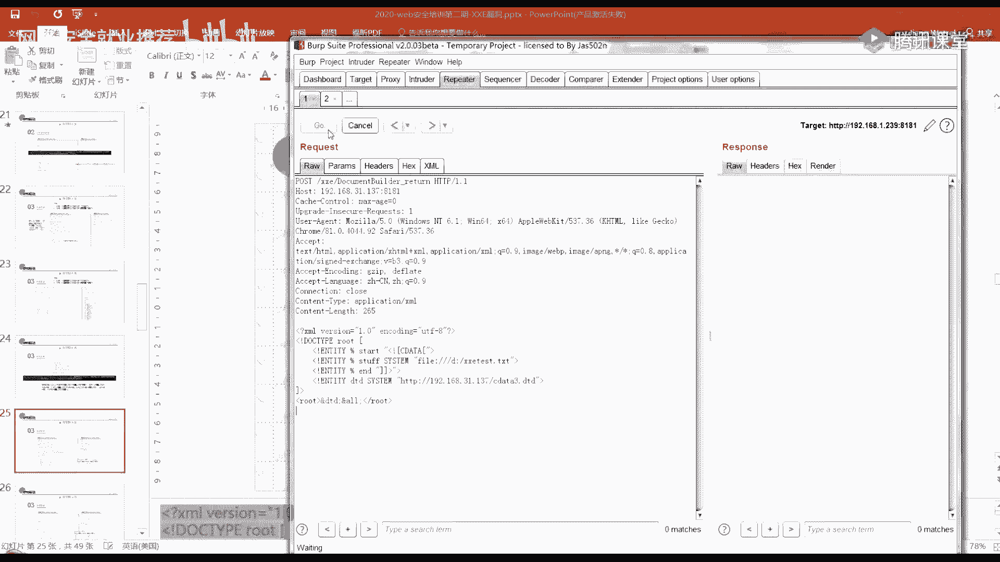
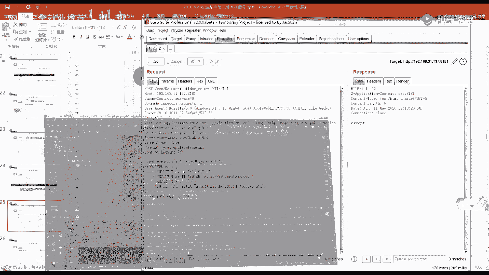
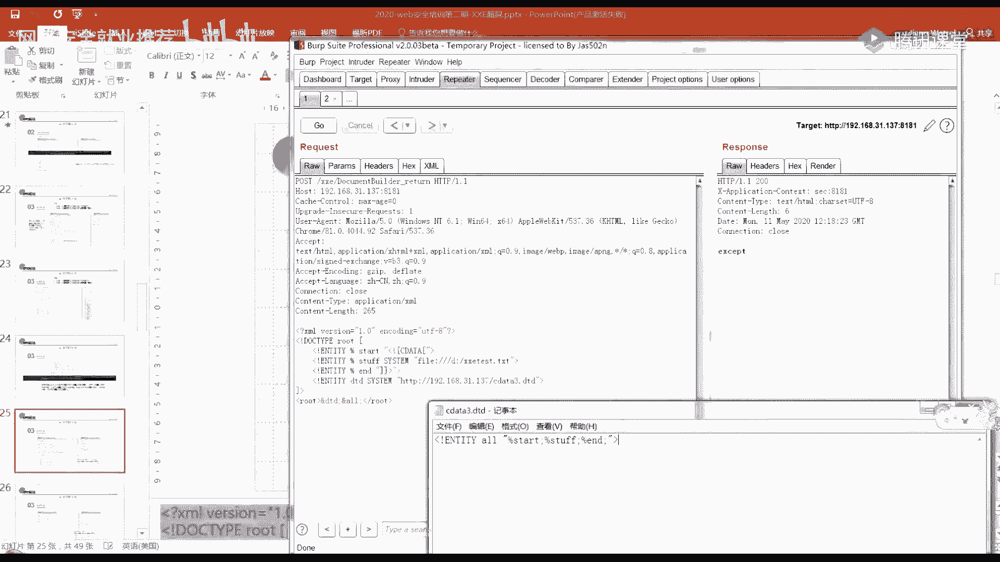
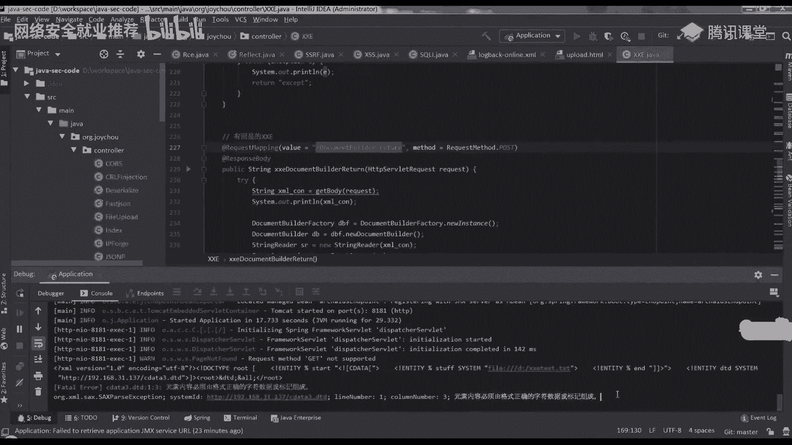
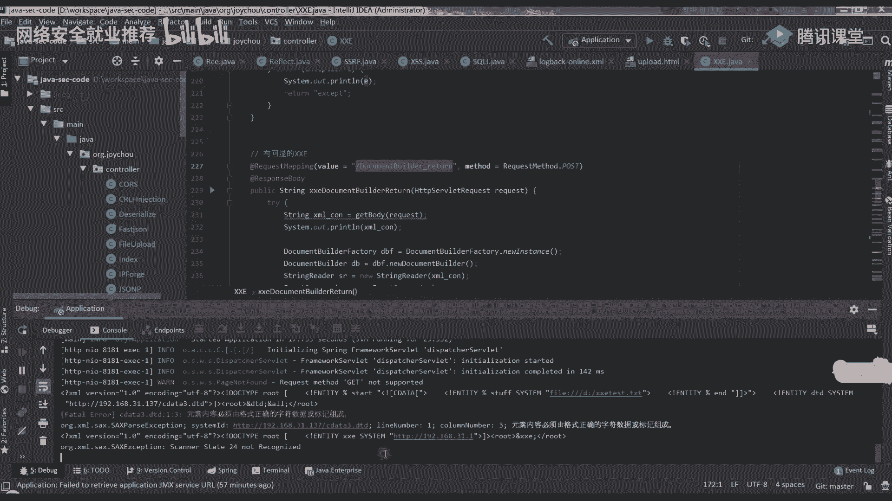

# P33：第31天：XXE漏洞-XXE利用及漏洞防御 - 网络安全就业推荐 - BV1Zu411s79i

啊。

哈喽哈喽大家好，大家能听得到我说话吗，今天稍微迟了一点，然后大家作业有做吗，就是前天说做那个实验来着，大家实验做了吗，可以，好吧那话不多说，我们就先讲今天的一个内容吧，因为今天有同学就是说让我讲一下。

这个命令执行，所以在这的话就补充一个，就是在p h p引用外部实体的时候，它支持了一些扩展，就是在这边这些，那这个就是最下面这个的时候，当我们的目标机器安装并加载了菲律宾的，expect这个扩展的时候。

就可以执行系统命令，然后它的用法是这个样子的，后面加上了我们是这个命令内在xml中的话，你在这个外部实体，这就用这个后面加这个id，如果他装的话，他就会回想我们的一个uid。

给我们这个是简单的介绍了一下，然后昨天是讲到了参数实体就讲到了这儿嘛，对吧，就是我们是想说如果是java里面的话，然后我们要包含的那个不是包含，要读取的那个文件，它里面有含有特殊字符。

我们这个时候想要用用这个sedate这个东西，把它包起来，然后读出来看看能不能把它读出来，但是这时候他就报了一个错误，说xml文档结构必须从头至尾，包含在同一个实体中，这个就是它不允许将内部实体和外。

部实体结合使用，所以在这里的话他这样是不行的，所以接下来的话我们就先来看一下参数试题，然后参数实体这边他的声明的话，就是这个样子的，它分为两种，一种是内部的一个声明，一种是外部的声明，然后在内部的话。

这里他这个值是实体值，它就它相比前面的就加了一个这个百分号嘛，对吧，然后外部的话就加这个system，然后后面是他的一个url嗯，可以看下面这张图里不对，下面这张图里面就是在这个滴滴滴中。

这里这个上面这个框框，这个椭圆的话，它就声明了一个实体是一个参数，实体，它用百分号，然后空格，然后它的实体名称就叫这个paparom entity，后面是他实体的一个值，接下来下面的话它就声明了之后。

在下面进行了一个引用，一用的话，它是跟我们之前的那个实体是不一样的，我们之前的是使用连接符号，然后这种形式来进行引用的嘛，他这里的话是使用这个百分号，然后entity分号来进行一个引用。

最后在我们云文档元素里面的话，我们去引用这个跟针具体，所以他会回响这个ba br给我们，右边有说明，就是说使用百分号是听名，这里的空格就是这个中间的空格是不能少的，然后在d td中定义。

然后只能在滴滴滴中使用百分号，实体名封号进行一个引用，它不能在这个像这个entity一样，在文档文档里面，就是文档内容里面进行引用，它只能在这个d td中进行一个引用，嗯我们可以看下一张ppt的话。

就是一个对比，首先大家可以回顾一下，就是和上一节课一起回顾一下，就是首先在这个地方的话，它是声明了一个内部实体，然后它的实体名称就叫normal，它的值是hello，然后在这个level一的话。

它是一个外部的普通实体，然后它的内容就是file，就是c windows windoi的一个文件内容，下一行的话就是我们一个参数实体，是一个内部的一个参数实体，嗯然后在这个里面的话，它的。

里面的一个实体是这个内部实体，word，下一行的话就是一个外部的一个实体，外部参数，实体，在这里的话就去引用了我们本地的9999，端口下的c date。d t t，然后我们分别引用这两个，就这两个。

嗯参数实体就是在滴滴滴中进行一个引用的，接下来在文档内容里面，这里有个hello，又去引用了这个pr a参数，实体里面定义的这个内部实体，这就用它来进行一个引用了，接下来接着就是我们一个普通外部。

普通实体的一个内容，所以回想到这边的话，就是hello world，就是这个的值，后面的话就是我们这个文件的一个内容，内战的话，如果我们去监听这个本地的9999端口的话，也会看到。

就是也会有这个请求给我们，就是我们可以看到他请求过来的url是这个，这个是参数实体它的一个简单的声明以及引用，那我们就回到之前说过的，我们如何让它来进行一个，就是将我们的文件读取出来呢。

首先假如说是这个样子，这里的话就声明了一些内部参数，实体及外部参数实体，然后在这个o里面将它们拼接了起来，最后在这个文档元素中进行一个引用，就是把这个file d盘下的叉叉，一test d txt。

放到我们这个c d a t a这个格式里面来吗，然后在o里面进行一个拼接，拼接之后，然后再进行一个引用调用，但是这里的话他报了一个错，是说参数实体引用这个百分之start。

不能出现在dvd的内部子集的标记内，这个内部资金其实就是我们xml的dt地区，就是这个地方，我下面这一段文字有说明，就是说参数实体必须定义在，单独的d d d文档中，单独的dt文档。

就比如说是我们外部的一个，比如说我们前面那张这，这个这种就是一个单独的dd d文件嘛，就是我们外部去进行一个引用的，这种单独的dd文件进行引用进来，或者是直接写在我们xml文档里面的一个滴滴滴。

那前面那种就是单独的一个d d d文档的话，它就是我们这个xml文档的外部磁吸，然后后面这种就是这一种的话，就是称为我们差还蛮有文档的内部子集，但是我们引用的话只能在dt d文当中。

就是只能在我们的一个单独的dd文档，外部子集中，而不能在我们xml的滴滴滴这个地方，这是他规定的，所以那这样的话，我们其实是不是就可以说，我们是不是，只要把它的这个引用放到一个外部的。

单独的一个dd d文件中，然后我在这个地方就是在，就是把，就是把这一行放在一个单独的嗯d td文件中，然后在这的话，我们新定义一个另外的一个外部实体，外部普通实体，然后他的ul的话。

就是我们这个我们把它放到一个单独的，ttt文件的一个路径，这样的话是不是就可以进行一个引用了呢，我们来看一下，嗯可以看到在下一张ppt的话，我就是这么做的，就是把这个放到一个单独的一个dvd文件中。

然后在这的话新定义一个，我这边是新定义了一个参数，外部参数实体，然后在这里的话进行了一个，调用这个调用的话，其实在这的话就是这个百分号d t d这个地方，它其实就是声明了我们这个o这个实体。

它是为这个的，就是把它们拼接起来的一个内容，然后在我们文档元素里面再去进行了一个调用，最终的话它就会将就是这样回钱给我们，嗯大家有听懂吗，就是说我们原本是打算这样，直接把它拼起来的嘛。

就是直接在它的一个xml的d td文档里面，然后把它们拼接起来，但是这个时候的话他会报错，它提示说参数实体引用，不能出现在dd d的内部词集中，那所以这样的话，我们就可以把它的这个参数实体引用放到外面。

来，放，放到一个外部单独定义的一个dvd文件中，这样然后再这个地方，我们先把这个滴滴滴引用进来，就是调用调用，这个时候我们调用完这个百分之滴，滴滴封号之后，就对我们这个or实体进行了一个声明了。

就已经有这个or实体了，所以在我们这个文档元素里面，就可以用这个连接符号or分号进行一个引用，最终的话它就会有一个回响给我们，就是我们这个d盘下叉叉一test。txt文件的内容，大家有听懂了吗。

如果听懂了的话，就打个一，是我掉线了还是这么长，为什么没有人理我，好难，不难不难，那就是有个问题，那我直接，嗯我刚才不是说了吗，你是说这个样子吗，就直接这样吗，那不是会报错吗，就是他规定不能这样子。

但是我们可以这个样子，就是把它放到一个单独的一个外部，它的一个xml的一个外部资集中，然后在这里的话我们去引用进来，就不要太，听懂，好吧哎我我刚才其实想说，那这样子的话，这样可不可以呢，我们来试一下。

就是，然后我现在这ip变了变成了131，一生，看一下可不可以。

啊这个也要改。

必须要正确的符号组成，好吧。

这样是不行的，我们去看一下，看一下这个日志里面有没有，诶他来访问了，但是他并没有，就是他并没有回响给我们，他访问时去访问了，你看一下cdt 3是什么东西，好吧，那这样就不行。

他并没有会献给我们，他是说元素内容必须由格式正确的字符，数据或标记组成。

哦哦哦我这是一个我这也是一个外部普通实体，然后我去在这个里面定义了，又定义了一个内部实体，这样是不行的，还是得加这个百分号，就是把它定义成一个参数实体，这样子才行，我刚才只是试了一下，不理解咋能这么深。

这个待会会说，这个待会儿会说，嗯我们接着往下走吧，还有另外一种形式，就是说我们可以把这个他引用的东西放在外面，但是我们只要只要主要是他引用是在外边，他那个前面那个就是这一串，不是说啊。

只能在d d d文档中集集外部资集中吗，就是它的引用只能在，我们的外部子集中，所以的话我们也可以把刚才那一整段，放到一个外部的一个子集中，然后在这的话我们去进行一个引用，引用滴滴滴。

这样的顺序是不能乱的，你先要引用了这个滴滴滴，然后再去引用这个or，因为你只有引用了这个滴滴滴，把它引用进来了，才是才把我们这个or给的，它的一个声明给引用进来了，然后你在这边再进行一个引用的话。

它才能把它引用进来，最后在这里的话，我们就嗯将我们这个file在这个地方输出，嗯这样也是可以的，其实只就只要是把我们的一个嗯引用，放在一个外部的一个单独的文件中就可以了，对吧嗯，我们接下来讲叉叉一把。

叉叉一的话其实嗯它的一个定义，叉叉一就是xml，external entity及xml外部实体注入，攻击发生在应用程序解析xml输入的时候，它并没有禁止外部实体的加载。

导致攻击者可以通过xml的外部实体，获取服务器中本应被保护的数据，那它产生的原因是在文档类型定义的部分，可以引用我们外部的gtd文件，所以这里就可能会容易出现安全问题。

xml解析器解析外部实体是支持多种协议，比如说fl协议可以读取本地文件内容，使用htp协议可以获取外部资源等等，这个我们上节课以及刚才也有就是用到，因此攻击者可以构造恶意的外部实体。

当解析器解析包含恶意外部实体的，xml类型文件时，便会导致叉叉一的就是这个漏洞，好我们接下来可以看一下它的利用场景，战争一的话，其实它是分为有回线以及无回线，有回血的话，它就是可以直接在页面中看到。

我们po的执行结果或者是执行的现象，那他也可以说就是带内差异，没有外部实体及攻击者，可以发送带有叉叉一有效负载，这个有效负载负载就是我们的那个pload的请求，并从包含某些数据的。

外部应用程序中获取到响应，简单来说其实就是他就会回想给我们，我们发送了，我们等一个po的工具，它会回献给我们，那无回响的话，它又称为这个blind叉叉，e，可以使用外带数据通道提取数据及带y xml。

外部实体o o b杠叉叉一嗯，这个这两个大会都会说，漏洞发现，首先的话可能是需要寻找，能够接受我们xml作为输入内容的一个端点，我们其实可以去可以发现，就是我们的一些，比如说最简单的一个登录的一个地方。

它不是有uslime及password吗，主流的话可能就是用jason来一个，来进行传输数据的，那这个时候如果你把他的那个请求方法，htp里面的一个请求方法，就是这个嗯请求方法就是哎我在说什么。

这个是这个请求方法，就是那个get poster，有的时候你把它改成poster，然后我刚才要说的是，你把整个hd p头部里面有一个content type字段，把它改为这个。

这个application，然后杠cheml，他如果是一个json格式的话，他可能就是obligation，然后obli application，然后后面是一个json格式嘛。

所以如果你把它改为一个xml的话，他或许也能够进行解析，看看政府去是否解析了发送的内容，如果解析了，那么可能会存在叉叉一的漏洞，第二个的话，如果站点解析xml就可以尝试引用实体和滴滴滴。

如果可以用外部实体，则存在x站一漏洞，我们可以看一下，首先是找到xml内容的输入点，然后检测xml是否能被成功解析内，在这的话，我就直接用我自己搭了一个这个来进行演示。

在这的话我就直接输入了uslim po内卷的话，它是成功将我们这个hello回旋给我们，就是将我们这个xl这种数据给解析了的，所以接下来的话我就可以尝试看看，它是不是可以引用外部实体嗯。

可以看到下一张就是这张ppt的话，在这个地方我是定义了一个外部的参数实体，然后它的这个ul的话是这个c ci点，i o里面提供了一个po的，这个大家之前有去用过吗，应该，有吧，就是这个东西。

嗯就是这个他会给我们每一个人分发一个域名，然后在这个po的话，他这里其实就有一个这个xml实体注入，我就直接把这个复制过来，然后把这个地方把它的这个这个域名，改为我们自己的一个域名就好了。

然后你在这个hp request jet就会有回旋，如果它能够解析的话，就是存在差异漏洞的话，就像这边这样，有一个回钱给我们，就说明它存在这个叉叉一漏洞，这个大家应该没有什么问题吧，如果没有问题的话。

那你就扣个一，ok，接着往下讲讲这个叉叉一的路利用，那这边的话本地文件读取其实已经前面有提到，就是如果是有回血的叉叉一的话，我们就有三种方式嘛，就是这个file中直接进行读取，如果是p h p程序的话。

我们还可以使用这个p h p的一个伪协议，进行一个读取它的一个文件流，然后当所读取的文件包含了这种特殊符号的话，使用sedate，然后利用的话是我们外部参数实体啊，这个就不多说了，那一阵有一个需要。

就是可能需要注意一点的地方吗，就是，有些菜没有解析，它是支持列目录的，就是直接把目录给列出来，那我们前面的话就使用这三种的话，都是我们已经知道我们要去读取的文件，是哪一个文件。

然后才能进行一个把它就是读取出来嘛，那有些差没有解析库的话，它是支持直接你在后面输入一个目录，然后他就可以把目录下的一个文件，都回钱给我们，然后攻击者可以通过类目录读文件。

然后获取账号密码后进行进一步的攻击，比如说读取这个他们开的gun users，点tml得到账户密码后，登录他们开的manager，部署web shell，这个后面大家就看一下就好。

只要主要是主要是知道他有时有些的解析库，它是支持列目录的，嗯接下来的话就看一下无回血的查查，一大多数情况下，服务器上的xl数据处理后并不会回显，所以即使是漏洞存在，我们的pload被解析了。

但是由于没有输出，也不能得到数据，所以我们也不知道到底它有没有这个漏洞，因此我们就可能想要想要利用的话，就必须找到一个不依靠其回血的方法，就是外带一个数据，把我们把我们想要读取的一个数据。

或者是它的一个文件内容，比如说这说本地文件读取的话，就是一个文件内容发送到远程服务器上，它的利用思路是通过外部d td方式，可以将内部参数实体的内容，与外部滴滴声明的实体的内容拼接起来。

利用po的来从目标主机读取到的文件内容后，将文件内容作为url的一部分，来请求我们本地监听的端口，是不是看不懂，没关系，我们一步步来看一下，就是刚才那个思路的话，其实并不是，大家可能就这么一说。

可能不能接受，所以就我们慢慢来，那首先我们如果要读取一个本地文件，本地文件读取的话，就是要读它的一个服务器那边的一个文件的话，我们肯定是要先定义一个实体的，然后它的值是用我们file协议来进行请求。

本地文件的一个内容对吧，这是肯定要的，就是，然后第二个的话我们是，我们是需要定义另外一个参数实体，将它引引用进来，就是我们要把它的那个file协议，读取出来的文件内容作为我们url中的。

比如说在下面这张图里面的话，就把它作为a指后面的一个内容，就直接把我们这个file files，就是这边定义的这个参数实体，然后在这边引用进来，然后在这里的话，所以如果我们去监听了这个9999端口的话。

就能看到我们这个files，然后就是这个嗯c windows windoi i里面的一个内容，本来是应该这样的对吧，然后我们在这个滴滴滴里面，对这个sd进行一个引用。

引用之后在这里又对这个files进行了一个引用，但是嗯可以看到我们监听，就是这个监听这个9999端口之后，可以发现，他这里get后面这个a就直接是等于百分号files，就没有对它进行一个解析。

就没有把它后面的这个内容拼接上面来，拼接到这里来，嗯这的话是，因为几乎所有的xml解析器都不会解析，同级参数实体的内容，他们两个其实是同级的，所以你说你在这儿声明了这个s。

然后你在这个set里面又去把这个files给引用进来，它是不会进行一个解析的，因为他们俩是同级，那我们就会想，那要是不同级可不可以呢，就把我们这个东西，嗯可以看一下下面这种，就是说参数实体也可以嵌套。

第当两个参数实体不是同一级时，我们可以尝试调用一下，就是下面这一张图，内在这儿的花，嗯可以看到在这个start就是我用个屁吧，就是在这个start这个参数实体里面，然后他的。

值的话就是我们有一个就是一个实体，另外一个参数实体，这样的话是对它进行了一个呃编码，然后这儿的话有一个send，然后system是一个外部的，在这个地方的话对它进行了一个引用。

对这就是对这上面的这个files进行了一个引用，所以这样的话就当就把他们变成了不同级，因为这个start明显是比这个start是，只有我们start声明了才会有这个send。

然后这个send里面它的值才是这个file，就是才会对这个file进行了一个引用，所以说这样的话，他们两个就是这个start以及这个files，他们两个是不同级的。

现在那这样的话我们可以进行一个就是引用，试一下，我们就直接先把这个，starter引用进来，引用进来之后才有这个send的一个声明，然后有sin的声明之后，我们就可以对它进行一个引用对发嗯。

我们这样运行之后，但是他这样还是不行，他还是会有一个报错，就是说参数实体应用，就是这个百分之fails，不能出现在dd g的内部子集的标记内，这个报错是不是有一点熟悉，就是我们刚才才说过的那个对吧。

他不能出现在滴滴滴的外部实习的标记中，那就可以，外部仔细呀对吧，就我们前面说了那么一大堆嗯，大家应该就懂了吧，也是因为这个限制，所以前面就想到，既然内部不行，就引用外部的滴滴滴试试。

现在就在把自己的服务器，加入到我们d td文件中，我们那么看一下最终的一个结果，嗯可以看到，这张图里面，这张图里面的话，我们其实就是将我们前面的那一个，把它们放到了一个外部的滴滴滴中。

然后在这个这边进行了一个引用，对吧，然后我们去监听这个8998这个端口的话，我们直接是用python gm htp server，8998这样简单的提了一个服务，起了一个htp服务，然后监听8998。

然后在这的话我们就可以看到，其实就会有他的一个，他就把这个d盘下一点txt就带出来了，就是这个hello world，这个后面是我一个中文的感叹号，我这么说，大家有听懂吗，嗯我这还给了一个注释。

就是说假如我们的htb它带不出数据的话，你可以尝试一下ftp，ftp的话就是h ftp服务f如何起开启它呢，就直接使用这个python m p y f t p d lib gp p。

后面就加上你的一个端口就好了，这个大家有听懂吗，就是我现在说的这个无回显的那个编码，是实体编码吗，对，其实我这的话大家有看到，我这其实和就是和前面的可能不一样，这的话我是直接将直接将这个滴滴滴。

放在我们这个dog type for，这就是引用，这个就是一个滴滴滴的一个外部声明嘛，这样的话就没有一个就是那个entity，就是没有这个关键字，这样的话可能就会绕过一些wap，大家还有问题吗。

就主要是使用这种方式，就将我们的file先定义出来嘛，首先肯定是要把我们的file给定义出来，就是用一个参数实体plow的把它定义起来，接下来的话因为他们不是不能是同级的，所以我要把这个payload。

放到一个另外一个entity里面，所以在这里的话，我就把它放到了这个trick这个里面来，然后在这个trick里面它又是一个，外部参数实体在这个后面的话，就直接将我们这个payload引用进来了。

所以说这样的话，我们的这个现在我们这个int以及这个pload，它们就不属于同级的了，但是我们如果是直接这样进行，放在这个里面进行引用的时候，它就会报一个错嘛，放那个不能出现在dt的内部子集中。

就是不能出现在d t d的一个文档里面来，所以这个时候我们就把它，放到一个外部的dvd中，对吧，这个百分之啊不是什么，这个连接符号井号三七和我们前面这里有一个，这个是嗯，这个是连接符号井号x25 。

他们两个是一样，只是这个是用16进制表示的，所以它前面有一个x吗，都是这个百分号的一个编码，大家还有什么问题吗，这有听懂吗，如果听懂了的话，就打个一，如果没有听懂的话，就打个二，没有人理我，是卡了吗。

是延迟了吗，一好的，那我们接着往下讲，嗯这个也是一个本地文件读取，然后在这的话这一张图相比上一张图的话，其实就是我们把这个dd，这个这个放到我们这个entity里面。

就是放到这个d o c type里面来了，就放到这个里面来了，然后在这个里面进行了一个引用，就是不对，不是引用，这个是声明吗，这个是声明了，这个滴滴滴的一个嗯外部参数实体，然后在这进行了一个引用。

接下来就引用了这个int这个，然后再由这个send发出去，所以在这里的话，我这是使用了这个p h p filter这个伪协议，然后将我们这个c盘下windows windoi读出来，这里就是这个东西。

就是这个等于后面的这一串内容，接下来就可以把它拿去进行一个解码，解码之后得到的就是他的那个文献内容，因为为什么会就是要这样呢，因为有时候使用使用这种方式，他带不出来，就是他不会有数据回显给我们。

所以如果是为了稳妥的话，大家还是可以，就是把它声明为一个外部参数实体，然后这样进行一个引用，这是两种方式，我们接下来往下走，就是主内网主机探测，如果我们是已经知道了，它的一个内网的一个网段的话。

我们是不是就可以对它进行一个内网，怎么操作呢，其实就是在我们bp里面的那个爆破模块，intruder吗，就是那个intruder那个模块，然后将我们后面这一个字段，就是比如说这里是192。16。1。

239，我们就将它设置为一个变量，这个这个是什么意思，应该大家都懂了吧，就是我们我们是在这声明了一个外部普通实体，它的内容就是这个，然后在这里进行引用的话，就会有这个就是去访问我们的这个hdp，192。

168。一点，这个内容的八零端口对吧，然后在这儿设置py的时候，我们就将它设置为1~254嘛，然后步长是为一，我们可以就是最后我们start就是开启攻击之后。

我们就可以通过这个length来进行一个判断，看我们就是他是不是存活的，如果是无回线的话，我们其实就可以通过，也是这种形式，就是这里是一，但是这个时候因为它是无回血的，我们可以通过它的一个响应时间。

来进行一个判断，你可以看到这边其实是，差不多是21秒的样子，但如果是一个存活的一个主机的话，19519，我说前面这里，这里扫出来的，所以我就直接用195试一下，这样的话他其实才一秒都不到对吧。

就回血给我们了，所以说他的这个时间是有一个很明显的差别的，例如这样手动的话肯定是很麻烦，所以大家可以写一个脚本来进行一下判断，判断的条件，可能就是根据他的这个时长来进行一个判断，如果自己不会写的话。

也可以去网上搜一下，比较多，也，其实内类似于这样的话，就是内网主机探测的话，就是这种形式的话，是不是也就可以对它的端口进行一个探测了，对吧，我们如果知道这个192。16，8。1。195是存活的。

这样的话我们就是在后面加一个冒号，我们这个时候就把冒号后面这个端口号，把它设置为一个变量，然后进行一个爆破，你爆破的话只要包括那些常常用的一些端口，或者是一些危险的端口就好了对吧。

大家这个应该也没有什么问题吧，这个需要演示一下吗，那现在的话针对我这个子网的话，就是服务器那边它的一个呃网段的话，就是192。168。31吗，点一吗，从一开始从1~254嘛，它的一个网段是对吧。

然后在这里进行一个叉叉一，进行一个引用，现在看一下，发送到intruder。

然后把这个声明加一个，这个大家应该都会吧对吧，这个po的选成，从1~254，然后步长为一，这个线程你也可以设置一下，然后就start开始开始攻击就ok了，就完事了，应该不难吧。

如果你是需要对它的一个端口进行爆破的话，比如说是40，45端口，然后，and接下来在这里的po的话，你就可以把它设置为simple list，然后从你自己的本地进行一个添加也行，添加本地输入了一些端口。

常用的端口也行，就是这样来进行一个判断，这个大家都懂了吗，后面的从这个java中上传一个sl，导致叉叉一楼的话，我们就下节课再讲，嗯然后因为我就是把这个ppt修改了一部分，所以说你们要现在新的吗。

还是之前的就可以了，因为我昨天哦不对，前天给大家发过一份嘛，要新的是吧，好像，现在56了，大家还有什么问题吗，就是关于今天的这些内容，可能就是这个地方会稍微有点难度，就是舞会线需要把他的数据外带出来的。

这种形式的话，大家可能就有点难接受，但是不知道现在有没有就是明白了，后面前面不用跟，嗯这个其实你跟与不跟都无所谓，因为它主要是是为什么呢，就是你主要是要把他的这个数据回显给我们，就好了。

然后你这边如果是监听的话，我们可以其实可以看一下，就是我们菲律宾study去进行一个记录的时候，它的一个log access点，log，嗯看到它在这里的话，其实就是会记录整个它的一个ul。

除了他前面那个跟就是，比如说这的话就除了这个之外，他后面的这一节从叉叉一开始，这个后面的这一节都会记录下来吗，就把它就是访问的这个url，请求的这个url给记录下来吗，所以说你这加一个问号语。

加不加问号，其实都没太大区别，主要是能把它的一个数据给带出来就行对吧，我这么说，你听懂了吗，然后大家今天的一点今天的作业的话，大家可以去做一下这个实验，这个叉叉一把叉，大家觉得作业要交吗，如果。

嗯还是就是嗯大家就稍微教一下吧，做就随便写一下，让我知道你就是去做了这个实验，然后嗯就行教的吧，嗯交了吧，那你前面就是今天的不对，前天的怎么就没交呢，那你们去好吧，作业给交上来，给我看一下。

就让我也知道下次一定，但我也知道你们就是做了好吗，今天的内容大家还有什么问题吗，如果没有什么问题的话，然后我们就可以下课了，然后明天见，明天还有一节课，后天还有一节课，实验做15分钟。

把它写到文档里有两个小时，为什么为什么要两个小时啊，哦你是想把它总结出来是吗，还是怎么着，总结的话你可以如果你没有太多的时间的话，你就直接把最后你做完之后的那个截图，截个出来，然后发个文档给我们班主任。

然后班主任发发给我就好了，如果这是你的时间不足，如果你想总结，然后觉得就是时间也够的话，其实总结一下是对自己的学习也是一种巩固嘛，就还蛮好的，你就可以也可以就是就总结了再发给我。

你也可以就是等你有时间了，总结自己进行一个总结，但作业的话，你就发一个最后的一个截图给我就好了，好吧，那今天就先这样啦。

