# P35：第33天：课程考核讲解 - 网络安全就业推荐 - BV1Zu411s79i

so for me the day。

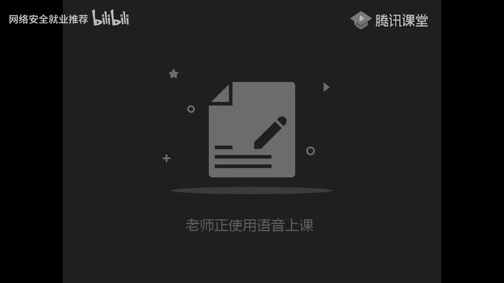

you to stay you，don't stay your man，哈喽哈喽，大家能听得到我声音吗，空灵是谁，天天团建一个人，好的哎对耶，你们今天好像没有交作业给我哈，那你们做了没有啊。

就是昨天说对这两道题你没有做吗，从我们的爱快过来给我来给我们快乐的那1年，所有的星球，我们多，亲爱的爱，爱情妙不奇妙，我的爱我爱我，你们都没有做吗，嘟嘟嘟嘟，昨天有约定好，就是来讲题目的那个还差得多。

什么东西还差得多，就是到哪一步了呢。

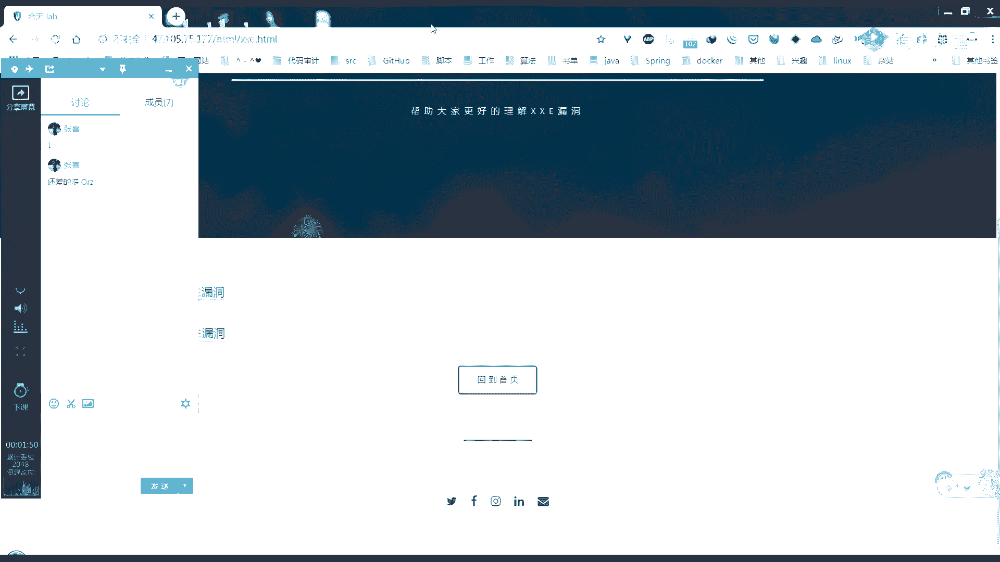

就是你到哪一步了呢。

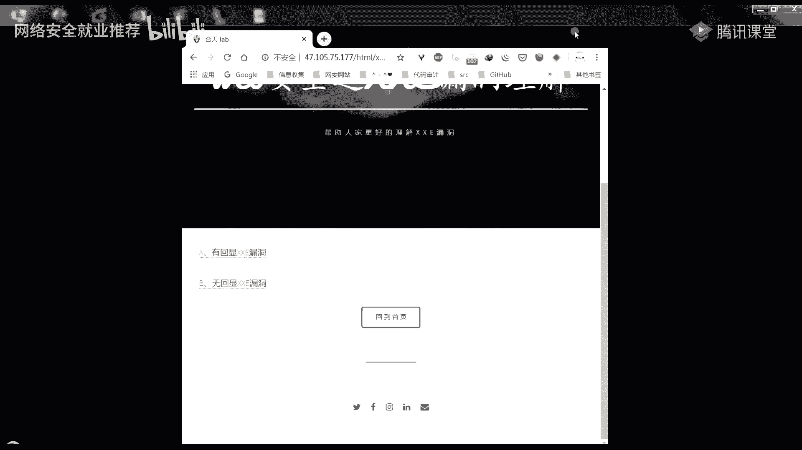

怎么说还差得多呢，其他同学呢就是关于昨天的作业，没有人做吗，难道，这么晚吗，嗯那要不然你来分享一下，其他同学没有做嘛，都，是我这边网络有延迟吗，所以你们没有和我说话，昨天的作业应该还算是简单的。

然后你们有什么问题吗，所以就都没有人回答我，刚到学校哦，你们就是大学开学是吗，就是刚开学，好吧，那，那我不知道读你这个单词啊，就是，要不然你来举手来给我们就是演示一下好吗，就是s n i a l同学。

嗯你说句话，让我们看看来，嗯嗯能听得到，大家能听得到吗，嗯大家能听得到吗，啊各位如果听得到吗，嗯好好，他们也听得到，那你说吧，我开一下我的文档，啊就是说你有危险的吧，有回血的嗯对，怎么这么卡。

有危险的你先去先再抓个包，扎个包，开一下bp，然后点点，放放心吧，放心吧，放血放血，然后看他看他那个，看他那个看看那个叫什么来着，返回包，看他的返回包，嗯这样是吗，你的意思是对。

然后看到那个看到它显示的危险的，是armin的那个位置，然后啊这个位置，然后我们就就是我就我就出了个这个，然后我就在那边写这个，写这个这个叉叉一的东西，嗯嗯你就写这个，然后在那个人命的地方呃。

那个地方就是加上那个叉叉一，然后我的那个s n i a，然后就就就就就变上去了，这样是吗，还是怎么着，对对对，就这样，嗯老师，这就是吃到他回血的位置了，然后然后我再看一下，然后大家到这里应该没有问题吧。

然后就是执行那个啥s y s t e m，然后就就就是那个文件包含的东西，写上去就就完事了啊，你说啥s y s是就那个命令啊，就是这个就是这个，保一下，然后后面再加上那个那个我这，啊这个放在哪呢。

这个sister，把那个把那个叫什么来着，我看你，就放在那个叉叉一的后面嘛，这样是吗，对然后你换一下那个那个是二，是那个是我做无回旋的那个，你就把这个换成一，换成当前的这个对吧的那个。

然后就执行就够够一下，勾一下，然后就就解个码，就找到密码了，好的，你这个走了走了嗯，然后就就可以登录了嗯登录就完事了，是吧对就完事了没错，嗯那有同学没有听明白的吗，这，这个kk同学你分明就就在线嘛。

所以我我要点你哦，那你有听明白了吗，我以为都没有人，你在线，所以没人理我，那显然你在线的话，你就说说你理解了吗，就是明白了吗，他整个过程如果没明白，我们就让他再讲一遍，明白了是吧。

嗯这里就有一个login success，那其他同学呢，这这个题目还有什么问题吗，如果没有问题的话，就扣个一，如果有问题的话，就扣个二，好的，那kk同学月同学以及老橙子张喜同学，你们做了第二题吗。

你们有谁要来分享。

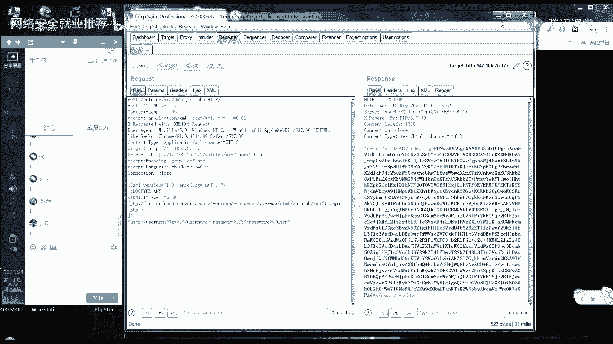

就是这个误会写的吗。

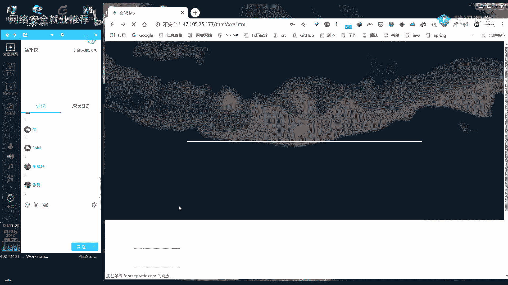

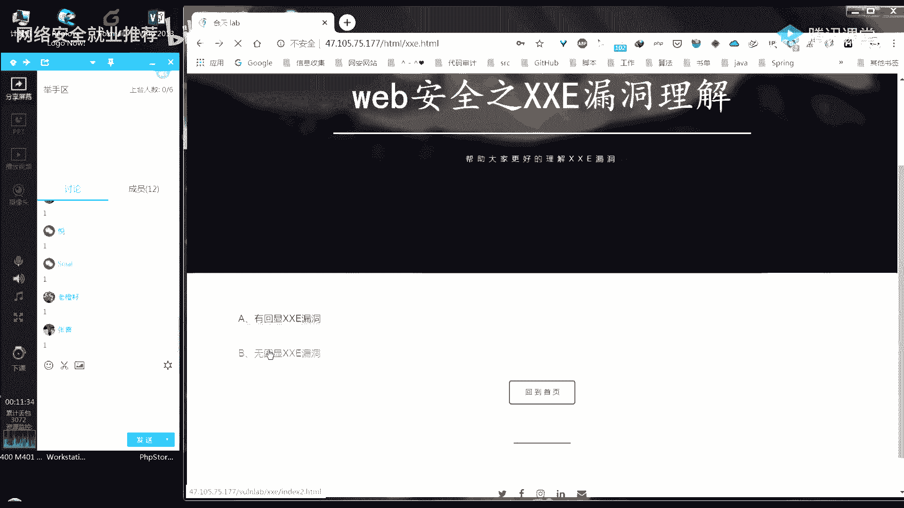

如果有人做了的话，就举手，没做为什么没有做呀，做不出来，是哪个地方出了问题呢，还是怎么着，你们关于这道题就是有想法吗，还是没有想法，所以不知道怎么做，好吧，你们想法就是发微服务器看日志。

访问服务器看日志，你是说访问我们这个靶场的这个服务器，然后看他的一个日志吗，自己的，嗯那你为什么会，有这个想法呢，昨天上课说的，嗯好吧，嗯我想知道就是其他同学就是是第一题嗯。

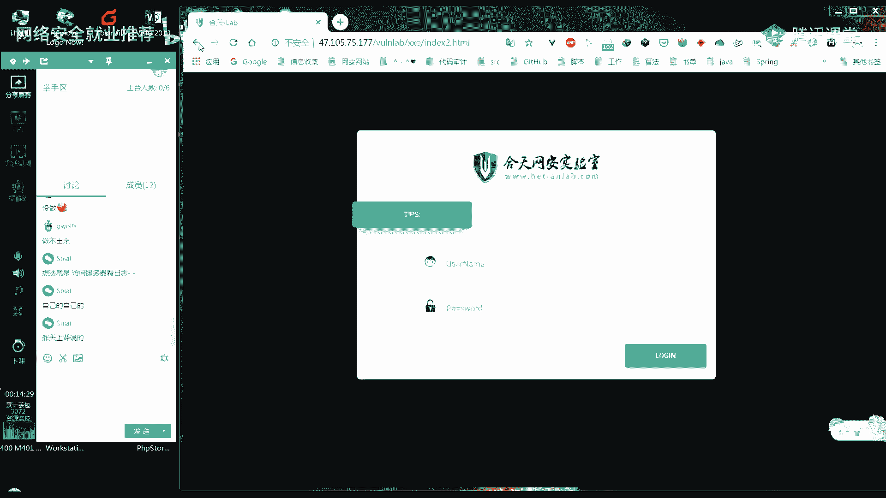

对第一题嗯做了吗，还是第一题也没有做出来，还是就第二题没有做出来而已，如果你是第一题没做出来的话，就打个一，然后如果你是第二题没有做出来的话，就打个二，第一题错了，第二题没做出来。

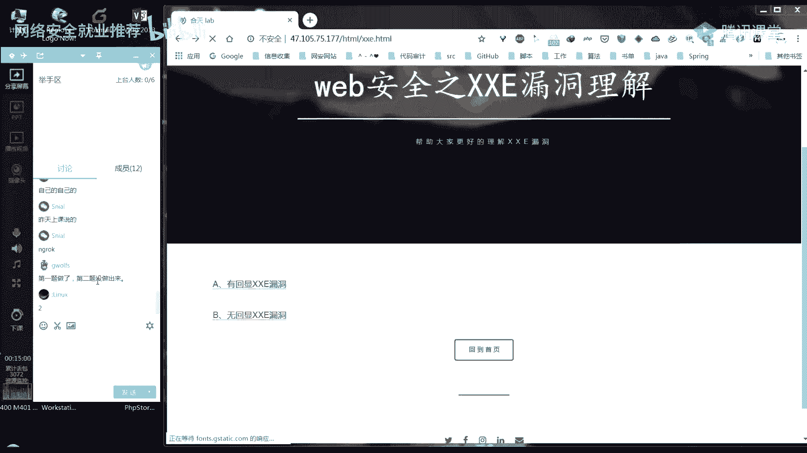

好吧，哦那看来大家第一题应该都没有什么问题，那有人分享第二题吗，我们，都没有，不会要不会有这个s嗯，我真的不知道读你这个名字，所以好像只能把你拼出来，就是s n i a l，然后来分享第二题吗。

没有其他的人做出来了吗，如果有同学做出来了，然后想分享的话，就扣个一呗，让我看见，大家第二题是出现了什么问题呢，就首先也是同样的嘛，就。

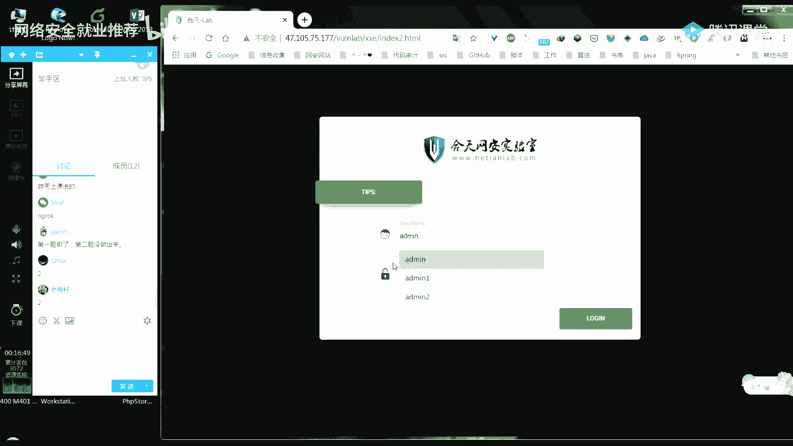

先抓个包试试看看。

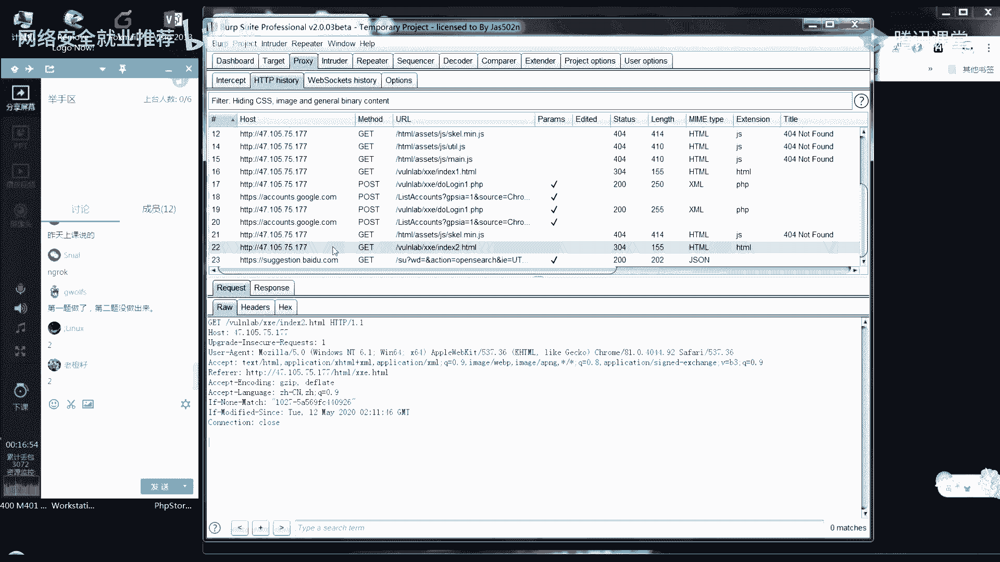

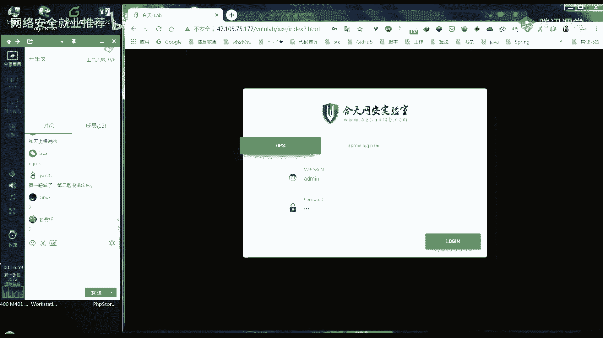

然后这个时候我们点go的时候就是发出去，把这个包发出去之后，你会发现其实它相比第一问的话，就是第一个有危险的地方，他其实就没有把这个message就是message中。

我们这个uslam的一个内容回写给我们，他现在就只是一个code，就是你登录成功的一个，就是登录成功与否的一个code，如果你登录失败的话，它就是一个零，如果你登录成功的话，它就是一个一这样子的话。

他就没有把这个回旋给我们，这个message这个这个地方回信给我们，所以这里的话我们可能就是有一个无，就是它是一个无回响的嘛，叉叉一那个标题也有说，所以无悔线的叉叉一，我在课堂上，给大家讲过呀。

大家是哪个地方出现问题了呢，开了构造失败，我知道我知道你的问题，其他同学呢，出现什么问题了吗，就是关于无回血的话，我们为什么会想要ttd文件，放在网站根目录下吗，可以引用d td。

但是system连接不到，可以用dcd，在system连接不到自己服务器开的端口上，嗯什么意思，t t t文件放在网站的根目录下吗，对呀，你可以放在根目录下，也可以放在别的目录下。

只要是你能外网能够进行一个，我们这个17。105。7，5。1g7 能够访问到的一个地址就ok，阿帕奇日志上有访问滴滴滴的日志，那应该就没毛病啊，其实这道题直接拿我ppt这个来套就都行呀，我们只需要把。

只需要把这个地方改为我们外网可以访问的，一个u l l，然后后面存的是你这个ttt的一个位置，然后在这里的话，你把这个文件改成我们这个do log 2点p h p，然后这里的话也改改成我们那个外网。

能够访问的一个地址就ok了。

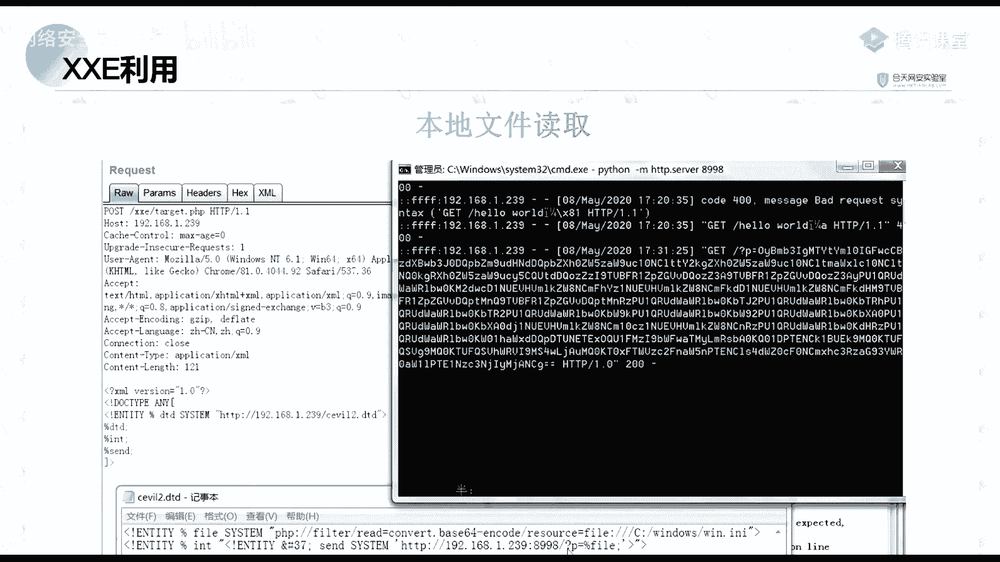

阿帕奇日上都有访问dt d的日志，就是python开的服务器收不到实体中system的请求，好吧嗯，那要不然就请个人给我们演示一下，那其他同学都没有做出来的话，a s i a l同学。

你要不要再次上台为我们展示一下，不是吧，你后来还没有成功吗，那你给大家演示一下吗，没关系就，因为其他同学都没有，都没有做出来，或者是有其他同学想要嗯分享，或者是看一下，看一下自己哪儿不行的话。

也可以上台，我们一起来看一看，没有人上台吗，好尴尬呀，没有人举手吗，嗯我今天下午自己试的时候，我发现就是那个啥，我不是给大家发了一个这个吗，但是我发现他我下午试的时候打不开，我不知道是不是。

是用的人太多了还是怎么着，所以说大家如果可以的话，还是自己去买一个吧，嗯还是，还是打不开好吧。

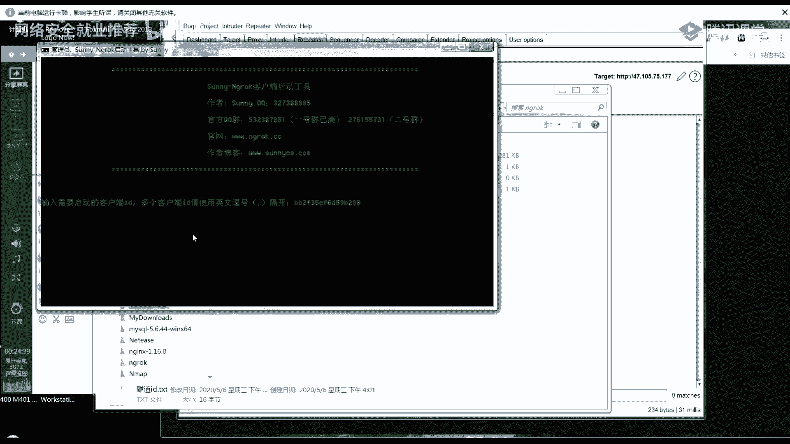

好尴尬，没有没有人没有人举手，要分享这道题吗，s s n i a o，你要不举手吧，我按着你的思路来走一遍，好吧，没有人举手，那我就自己想吧，但是我那个他开启不了，所以说如果你们谁有服务器可以借我的话。

算了，还是不要不要，就大家就直接看我的写的这个文档吧好吗，我给大家讲一下。

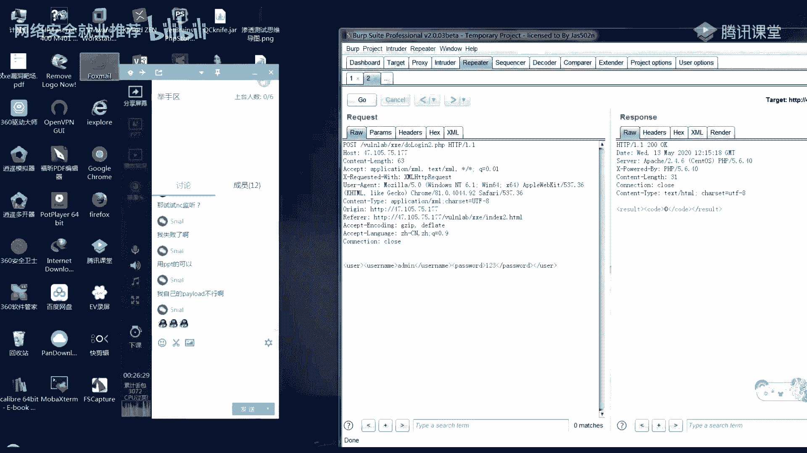

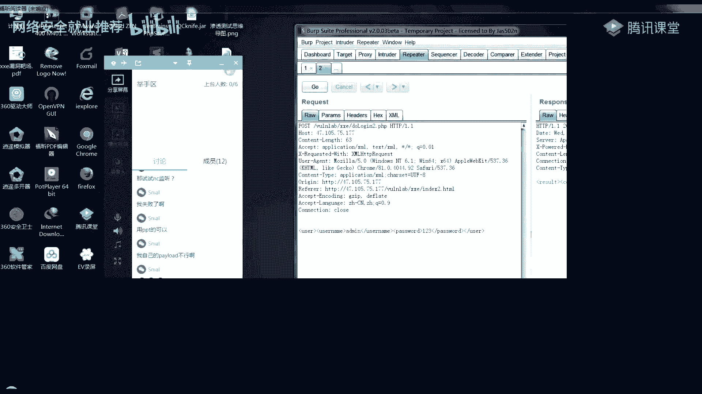

那首先第一题的话应该大家都都会了，然后我们就把它先过一遍嗯，首先抓个包，然后我们尝试更改这个username的值，其实我们第二关也是一样的，所以我们也可以进行，就是来试一下，把这个哦这里没有回血。

嗯你会发现它这边回响给我们的这个值，是能根据我们这边输入的。

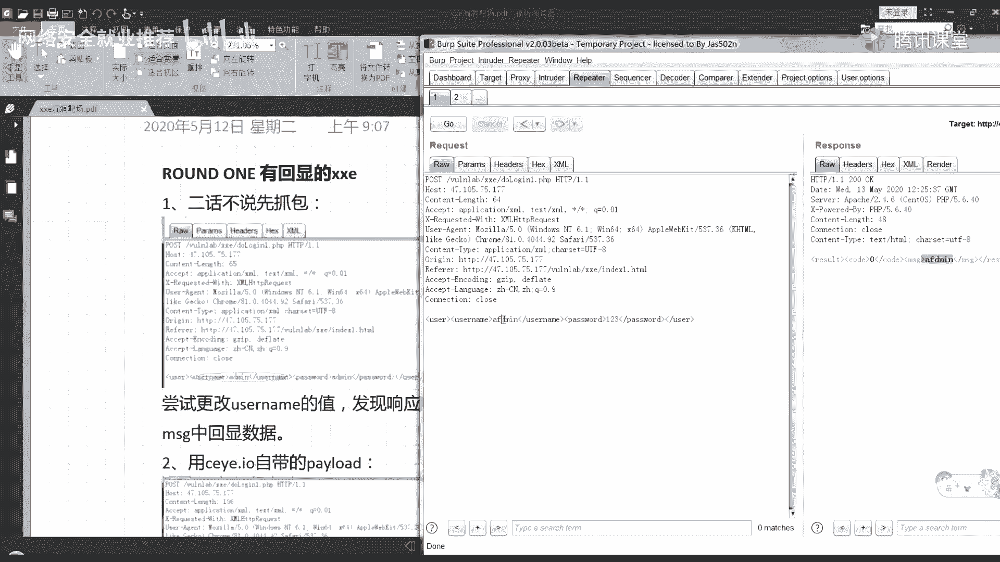

就是在那个页面中输入的这个username。

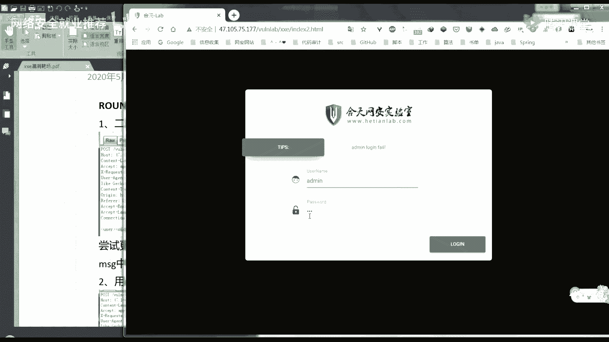

而进行一个改变的，然后他这里的话又是能够解析，我们一个这种xml格式的，它里面就是一个user这个根元素，然后里面有两个嘛，一个是username，一个是password嘛，对吧。

嗯这个时候的话我们可以尝试来，就是看一下引入一个外部的一个实体，看看能不能把它引进来，然后我这里用的一个po的话，就是那个c e y e自带的一个pdd，然后我们发送之后就会看到那边已经有。

我们这个请求怪了，就是我们登录到那个c e y e d i o，就会看到这个请求，那么就说明它存在这个叉叉一个漏洞。

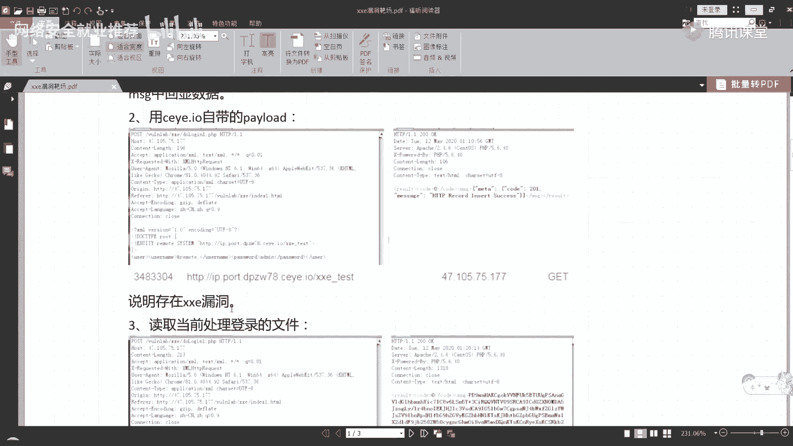

因为我们当前是我们是要干什么，是要上一次，昨天就是给大家说，就是想让大家能就是知道他的密码，自己登录进去，大家也可以尝试其他的一些。

比如说入口令什么的都可以，那阵的话我们昨天学了叉叉一的话，然后它明显这里也是一个叉叉一的格式这样子，所以我们就先就直接用就是叉叉一的思路，来试一下，刚才试了，也知道它确实是存在一个叉叉一漏洞的。

所以说那么我们就可以猜测。

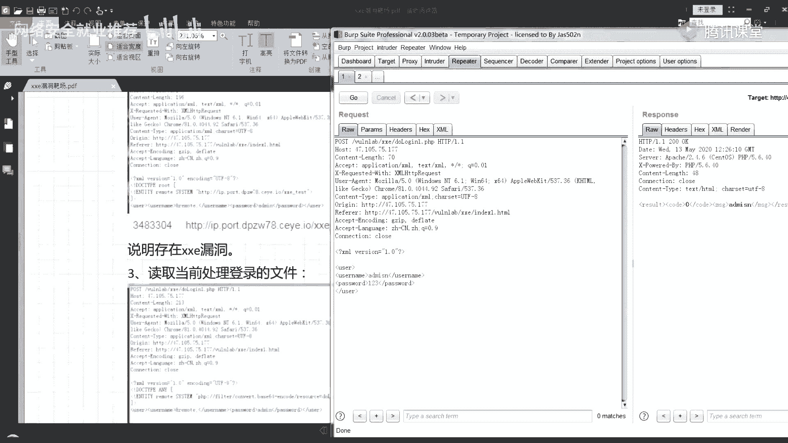

他是去处理这个逻辑的时候去判断，就是是不是相等的时候，它的那个变量可能就存在。

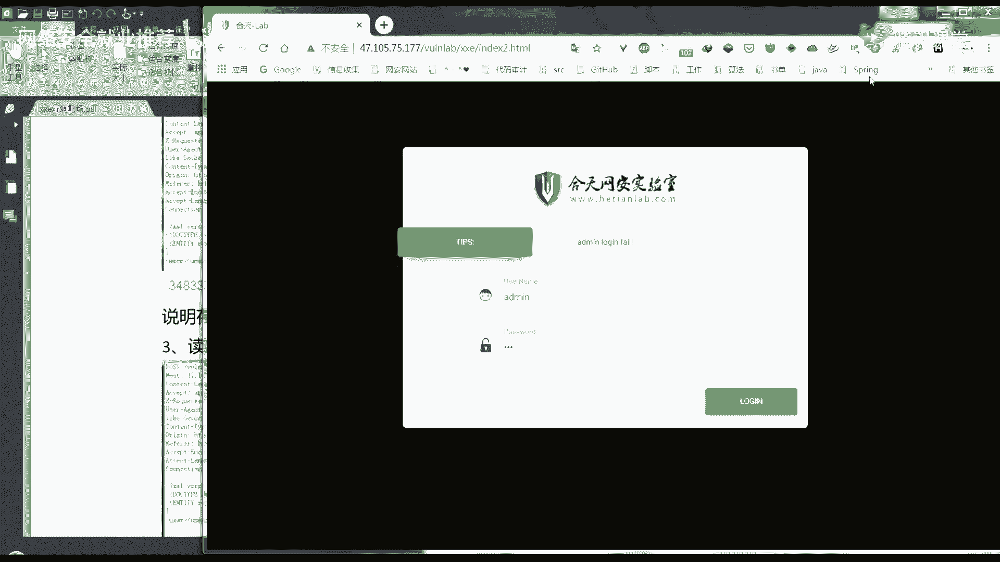

我们去处理这个登录逻辑的这个文件里面，所以我们可以想到，就是我们把这个文件给读出来对吧，然后可能会看到它的一个登录的，登录了账户和密码，所以说我们就在这边的话，就其实是一个读文件的一个操作。

那读文件的操作的话，就像刚才我们那个同学有说过的，把这边加一个，dog type，any，然后这里面的话就是一个外部实体对吧，我们不能定义一个外部实体，然后这儿的话，其实一个外也不需要用到一个参数实体。

因为我们只需要把它就是带出来就就好了，因为它这是有回旋的，我们不需要再去，就是把这个数据带到我们自己服务器的一个，访问的url上面，我们就可以直接从这边来获取到它的一个信息，所以在这的话。

我们就只需要定义一个外部的实体，外部普通实体在这边的话，它的值的话，我们就一般用ph，那个就是为了防止它是有那个特殊符号的吗，为s6 s杠encode。

然后resource就会等于do login to 1，对吧，我应该没有打错吧，然后在这个username，这就是替换为这个remote，这样的话他能就他就在这边会回血吗，因为会回血给我们。

所以他就会把这个数据给带出来，我们go一下嗯，就和刚才那位同学讲的一样，然后进行解码就可以看到它的一个账户名，密码内无回血的话，就是我们如果输入刚才的这一套东西，他都是在这边是没有回血给我们的。

只有他的一个登录他的这个code的话，可能就是表明你当前它返回的那个值，是true还是false，那这里的话就用零和一来代替，如果是一的话，就可能能登上去，那他除了这个之外，这个是我们没有办法改变的。

因为它是通过后台进行处理，然后返回给我们的，我们没有办法从我们就是这边来进行一个绕过，只能说你把这个username以及password写对了才行，那这样的话。

我们怎么样把它的一个就是它的usm以及password，写对的话，我们也同样可以利用上一个的这个思路，就是去读取它当前的这个文件，当前处理逻辑，登录逻辑的一个文件，那在这的话，因为它是一个无回显的。

其实我们上课的时候也有说过，我们就直接看到第二部，首先前面判断的话是跟前面的步骤一样，但是我这儿好像不能给大家演示，因为我也不知道为什么他就一直打不开呀，你们这能打开吗，你没有装这个吗。

你们的能打开吗哦，我的就是一直在这边嗯，今天下午也是今天下午试了一下，然后他一直在是这个样子的，嗯所以的话我就可能不能给大家演示，就是它出来的一个效果，但是我这边都已经截图了，所以也是一样的。

这个代码大家应该都理解是什么意思啦，就是我在这边，对这个代码，这个代码是和我们ppt里面是一样的，其实就是这个本地文件读取无回显，这就是这个地方，然后他的dd t文件里面的话，就是这个。

当前它的值就是do logging 2点p h p，然后把我们这个file带出来，怎么样带出来呢，就是去请求在这里有一个在这个int的外部实体，啊，不对就是实体参数。

内部实体参数里面它有一个外部的参数实体，这个sand在这里的话，他是去访问了我们这个当前的域名，然后加上了这个的值，其实就是我们这个do log 2点菲律宾，它进行被464编码之后的值给带出来。

怎么样带出来了，你肯定要就是你这只是进行了一个声明，都没有调用，就只是这个file在这里进行了一次调用，你这个int以及这个send都没有进行调用，所以说我们可以在这个这个地方。

首先你肯定要先把这个给调用了，你才能获得他的这些其他的一些文件的声明，所以第一个写的话就是这个百分之d d d，然后一个分号把它调用，然后把他们的一些这个file int。

以及这个send的声明都应用进来，接下来的话我们就去调用这个int，在接下来的话我们就去调用这个sand，对嘛这个代码大家应该没有问题吧，嗯我这里也是一样的，然后可以在日志中怎么看看到。

就是因为我前面有给大家说，就是在我们tom cat啊，刚才有个同学说是不是可以放在，就是放在根目录下，那你一般就是放在根目录下就好了，你如果跟目录下不方便的话，你另外创一个，然后你把这个放到这个里面去。

那你在这个po的这个地方，你在前面加一个叉叉一就好了呀，只要是能够访问到的一个位置对吧，这都是无所谓的，然后昨天配置那个ng rock rock的时候也有说过，就是我们，config，然后server。

xml里面，就是配置了一下它的一个日志存放的位置吗，就是他会，存放到我们这个logo下面的，local local host seglogo，点后面后缀是点txt。

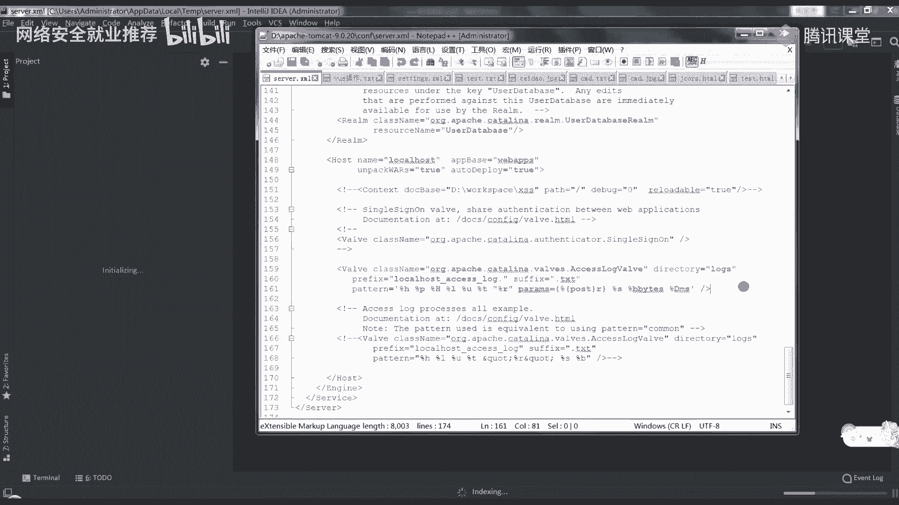

所以我们就可以来到他的一个日志。

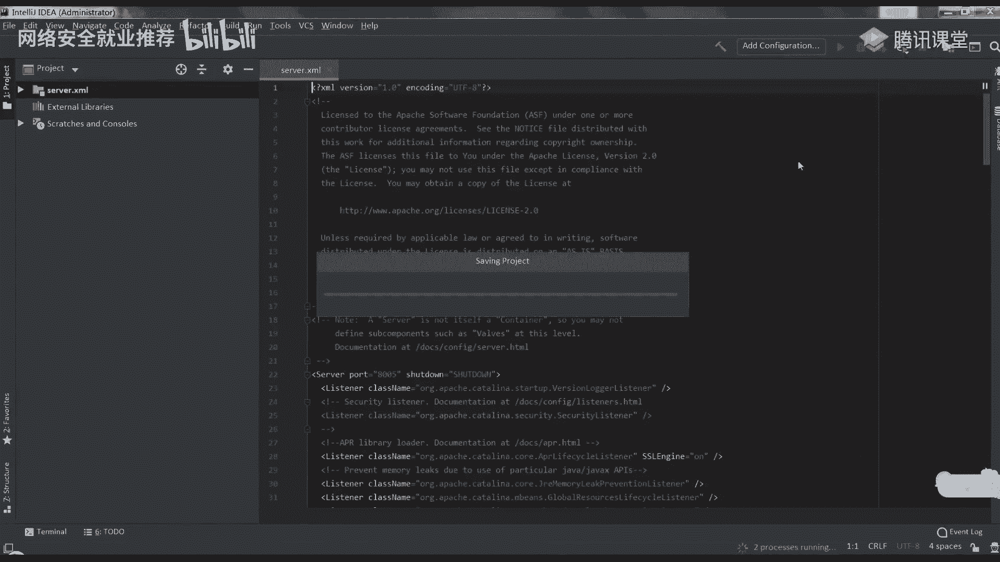

去看一下，就是这个logs目录下，今天是多少号，13号，哦这个是我那个的，你看，我测试那天应该是昨天，昨天的话对，就是他的一个带出来的这个数据，它的流程就是这个样子，就是在这边set go之后。

然后这边可能是没有，就还是这个样子，但是你在我们的服务器上，服务器的一个日志中就可以看到，他带出来的一个数据同样进行解码之后，都会有它的一个，账户名密码其实和log给你一点菲律宾是一样的。

嗯我这就没怎么改，啥想法，你用这个服务器添加一个，看能不能用，什么意思，你用这个服务器添加魔法问问，可是，可是这个样子的话，你访问的日志的话也是在他那边的呀，那我们怎么看呢，你是说就是为了有一个服务器。

然后给大家演示一下，然后大家就把这个服务器，当成是我们自己的一个服务器，对这个意思吗，还是怎么着，那如果不是这个意思，你是说直接就是如果是嗯，我们并不是我们自己的一个服务器。

而是真实的一个的一个别人的一个服务器的话，你把在这个服务器上添加一个ttt文件，然后进行访问，那你数据也是看不到的呀，你最终还是要返回给我们自己这边对吧，大家有其他的一些思路吗。

或者是这个有没有听懂的吗，诶你们的这个东西能，登录进去吗，就是访问进去吗，就是这个，我为了给你们演示，专门找了一个结果，他现在又掩饰不成了，我真是服了，这个有发吗，我记得只发了pdf，对呀。

我只发了pdf呀，然后在pdf里面的话，有他详细的一个嗯部署的过程呀，你们就是没有去看是吧，我知道，就是那个pdf都没有去看，反正我每次发在群里面，你们也没理我，看了好吧，太麻烦了，买了个夫妻有没看完。

有服务器不打算有，为什么有服务器不打算用呀，那个封号linux你你说一下，你第二题为什么没有做出来，注册好麻烦，封号linux，你第一题做出来了吗。

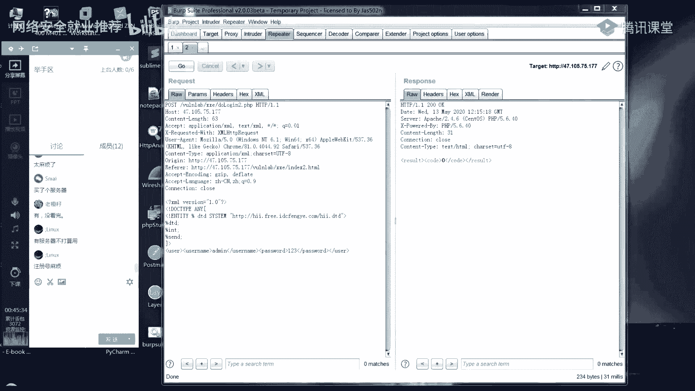

然后你第二题做出来了吗，嗯第一题ok那第二题是什么原因呢，大家第二题，我刚才说的应该有懂吗。

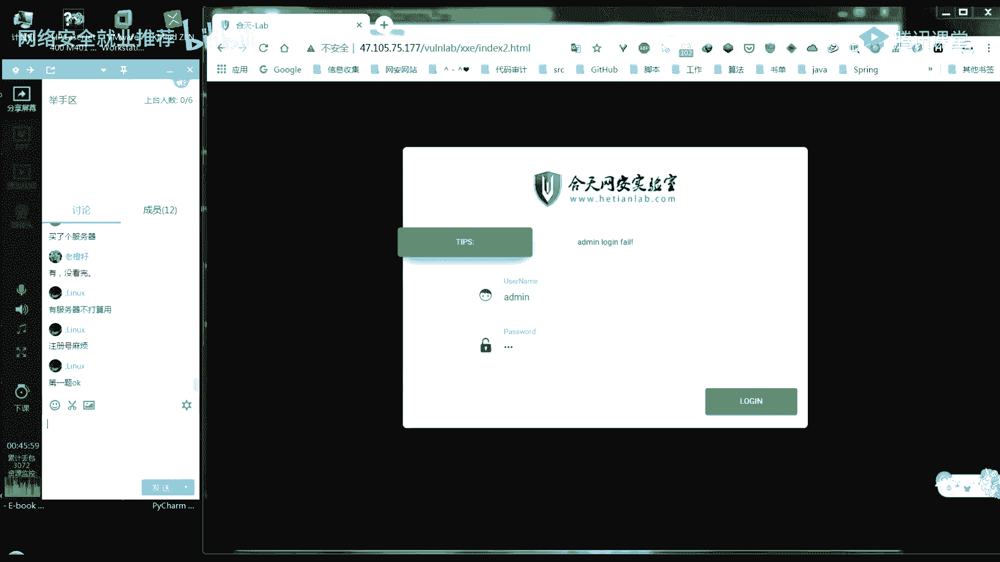

有听懂吗，嗯这个的话我其实上课的时候有给大家，就是已经说过了，只是在这里的话，换成一个外网能够访问到的地址就ok了。

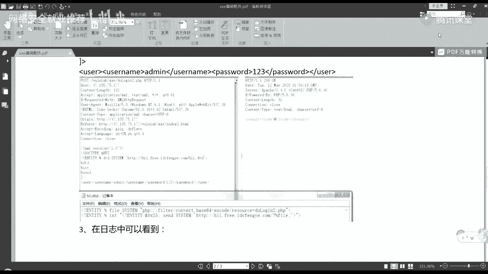

可能还是配漏的，我再试试，嗯好的，那你那你们用的是哪个po的呢，能发出来让我看看吗。

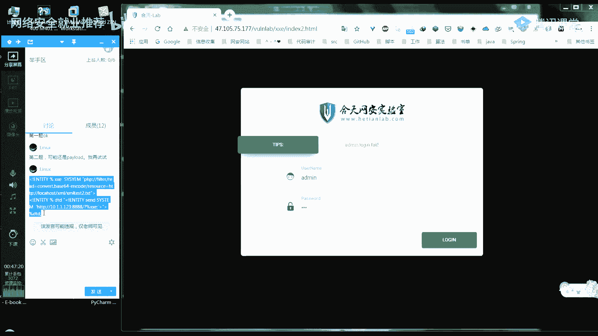

我们先把它复制到这边，高考后，有大家有人来就是来分析一下这个错误吗，就是这个封号linux这位同学的，我先把他的封号给加上，然后有同学能够给我们说一下，他的出现的问题吗，read错了吗，哪个read。

这个read吗，这个read是没有关系的，读的不应该是服务器上的东西吗，对，你这访问访问localhost是什么意思，你这样访问的话，用应该是去访问你自己搭的那个，服务器的一个位置，我们为什么要去访问。

自己搭了一个服务器的一个位置呢，因为你这个东西就是你存的这个d d d文件，在你搭的那个服务器上面，所以你要去访问这个这个e v l2 点gtd的话，那你就要你，你这样子，你就要把这个dcd文件。

放在你自己搭的一个服务器上面，然后你在这儿的话，你的一个地址就不应该是一个local host，而是你服务器的你自己服务器的一个位置，相当于是这个47。105。7，5。177来进行访问。

他为什么会访问呢，因为你在这儿就是你把这个发发给服务器之后，他那边不是会去进行一个解析吗，解析之后解析之后他发现他是一个这个root，这它定义的是一个外部实体，然后它的u i l是这个。

所以他就这边的话，应该改成你自己搭了一个服务器的一个地址，我这边就直接用叉叉叉叉代替吧，这个应该是，我们自己的e v a l吧，我们自己这边的一个位置，让它来进行访问访问。

我们这边我们这边存的一个dt d，因为它服务器上不正常情况下，是没有这种d d d文件的，是我们自己写的，所以要让它来访问我们服务器上的一个东西嗯，dog type，对对对，这里也写错了，就是。

做个type嗯，还是我复制错了呀，没有，这里要就是有一些细节的话，也是需要注意一下嗯，所以说在这这是第一个地方，然后第二个地方的话，你不应该是local host，是我你自己搭的一个服务器上的。

一个就是你存放ttt的一个位置，这个样子的话，这个司机他就会来访问这个e v l2 点ttt，然后在你搭的服务器上面，你把这个存成，你把这个存成一个vl 2点滴滴滴，然后大家可以看一下。

就是这一串有什么问题，这个就是在你服务器上存的这个d td文件的话，同样的一个地方就是你在这儿的话，不应该是去读这个文件了，这个是你本地的一个文件，你现在应该是读的是我们要把它。

我们要读取服务器上的那个文件，把它放在这边来，所以的话这里就是这个，do login 2点p h p这个样子，接下来的话你就把这个带出来，就是通过这边，然后给带出来，就是这个这个给带出来嘛。

通过到时候我们去那个日志里面，看他的一个访问的一个url l，我这么说你能听懂吗，或者是你根据我刚才我们说的这些，然后你改一下，然后看看能不能就是成功，还有其他的同学的一个就是我刚才说的，大家有明白吗。

或者大家还有其他的一个pload，然后想分享给我们，然后是自己没有做出来的，然后想让我们一起来看一下的。

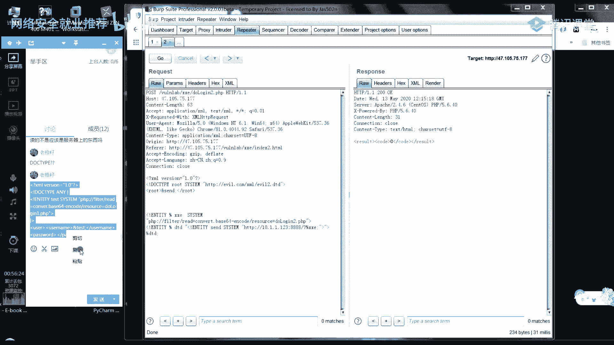

嗯这是第一题，嗯好像，好像并没有什么问题的样子啊，嗯大家有看出来就是这个，嗯就是这个第一题大家有什么，就是他发的这个pada有什么问题吗，我好像也没有看出来有什么有什么问题呀，哦哦哦哦哦哦哦哦唉。

你可以哦啊对，对看完，哈哈我对嗯，那个这个应该是第二题的吧，这个地方你不能再去用一个htp这样子啊，你去看一下，就是我们之前学文献包含的时候，选文件包含的时候不是说过，而且这个是等于而不是杠。

就是read等于不是不是杠，你去看一下那个文件包含的时候，我们那个resource这边，不是他要读取的一个文件吗，你这不能再加一个htp，这样进行一个访问，你就加一个相对于我们这个当前这个路径下。

就是这个叉叉一路径下的一个文件就好了，那在这的话我们就可以直接使用一个相对路径，do login 2，因为它就是在这个叉叉一下，就是这个文件吗，所以我们就可以直接这样写，然后哦这个是那个滴滴滴文件是吧。

这个应该是没有问题的吧，这个是不是不要这个封号呀，就直接是这个样子的，但是有时候他这样是带不出来数据的，就是使用这种形式写的话，是带不出来数据的，所以说最好的话，就是按照这这种形式。

就是你在这个dt d文件里面再定一个实体参数，实体，而且你在这个sand，这就是我把这个放大，这个sd这也把它定义为一个参数实体，就是一个外部的参数实体，在这里就直接进行引用了。

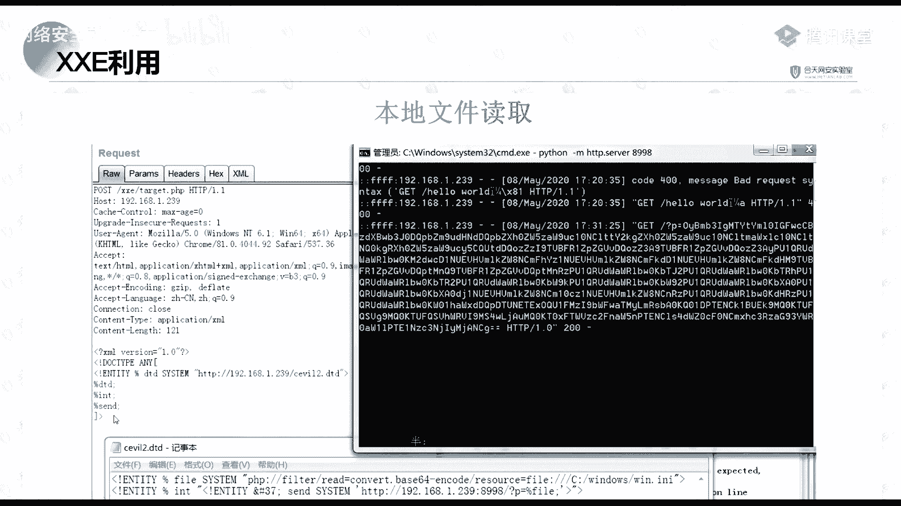

好吧，还有其他同学的plog想发出来，我们一起看一看嘛，没有的话，那今天课程也九点了嗯，如果有的话，就扣个一，我们就等你，如果没有的话，就今天就得下课了，如果还想发的话，就扣个一，如果没有要发了的话。

就扣个二，kk小朋友，你是怎么，你是你怎么，刚开始说话，后面又不说话了，好吧，没有人理我，潜水，你们我以为是你们就是网络有延迟，所以我就以为是你们没有，就我还你们还没有听到我说的话。

原来你们就都不说话了是吧，就也没人跟我互动，就我一个人在这里瞎讲，好吧，那大家没有什么问题的话，每次等人说话嗯，但是我不是说如果有，就是有想要有想分享快乐的出来的话，就扣个一嘛，然后不想的话就扣个二吗。

你们也没有打呀，真听课还行吧，之后如果有什么问题的话，好之后有什么就是大家还有什么问题的话，就qq找我呗，那今天就先下课了。

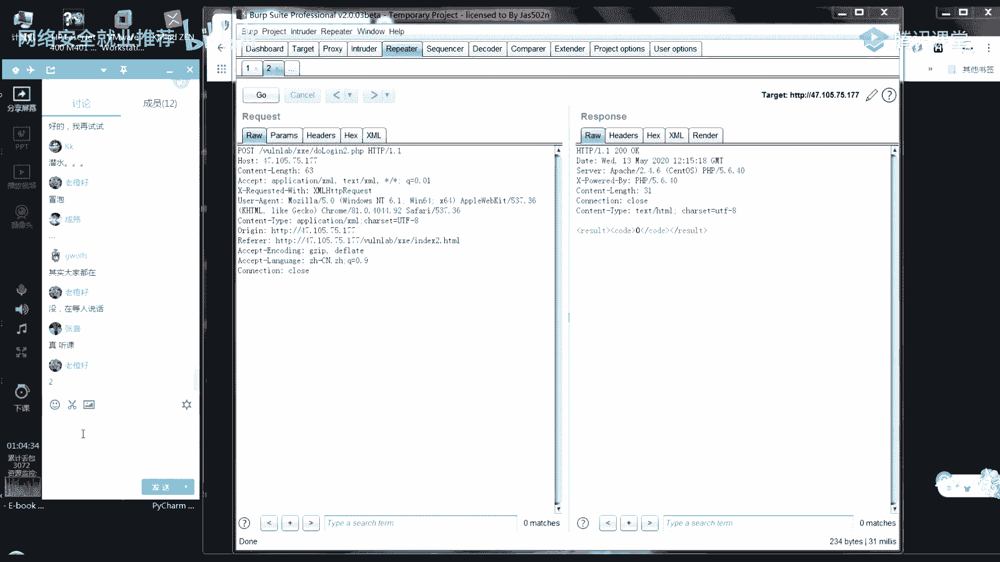

