# P36：第34天：SSRF漏洞-SSRF简介及漏洞防御 - 网络安全就业推荐 - BV1Zu411s79i

大家能听得到我的声音吗，能听清楚声音的，在公屏上面扣个一吧，声音的话应该也清楚吧，嗯好的，那么呃我们正式开始我们今天的一个课程内容，我们今天的话主要讲的一个课程内容的话，是这个服务端的一个请求伪造。

也就是这个s s r f它的一个呃，是这样的一个英文的一个呃，仅仅写缩写就serverside request for glory，就是服务端的一个请求的伪造，这样子的一个攻击。

那首先的话我们先来了解一下它的一个漏洞，它是什么样子的一个漏洞，它有什么作用，首先我们先来看一下，先来了解一下什么是ssr，也就这一个服务端的一个请求伪造，就大家其实可能看到这个ssr的话。

可能会想起来，就是前面前面老师所讲到的一个cs rf对吧，他们两个的话其实挺像的，这样的话他们呃他们是有本质上的区别的，再等会的话会给大家做一个呃讲解，然后这个s cf的话，它是攻击者构造的。

这种令攻击链接传给服务端执行，然后造成了一个漏洞，一般的话是用来进行一个外网的一个探测，还有的话是攻击内网的一个服务，那我们来看一下这个图，这个图的话啊，比较好的解释了啊。

这个s s r5 它这样子的一个漏洞，它的一个利用以及它他能够做到的一些事情，就是说其实这样的一个一句话，能够概括这个漏洞，它的一个作用，就穿越穿越网络防火墙的一个通行证，就说我们呃应该大家都有了解到。

就是说一般的这种呃网站对吧，或者说呃你一个公司一个企业的一个网站，它啊你是能够去从外网访问到对吧，然后的话你能够访问到这个网站，但是你不能访问到这个公司，他的一些内网的一些好东西，因为它是有防火墙啊。

我们其实可以看到这个s sf的话，就是呃利用这样子的一个ssr漏洞的话，我们可以啊通过一些通过服务器来去访问，或者说去攻击内网的一个服务，那为什么他能够做到这样子的一个呃功能呢。

我们可以来看一下这个漏洞，它的一个形成的一个原因，大多的话它是由于服务端提供了，从其他服务器应用获取数据的一个功能，然后的话他没有对目标的一个地址，做严格的过滤性质，然后的话我们来呃理解一下。

这一个从其他服务器应用获取数据，这样子的一个功能，这个功能的话其实啊我们也是经常能够去见到，也也能够去使用到，就说啊比如说我们的一个服务器，比如说我的啊我们的这样子的一个网站对吧。

我这里的一个网站我反问我访问之后的话，我的比如说我这里的这些图片对吧，这图片的话，在这里的话是放在我们的这个服务器上面吧，如果说如果说你的这样子的一个图片，它是啊托管在其他的一些服务器上面啊。

他不是给你的一个网站服务器在一个服务器，所以的话他需要通过这种呃链接对吧，通过一个链接的一个方式，来去远程的去加载另外一个服务器上面，或者说图片服务器上面的这种资源，然后的话如果说他没有对呃。

这里的就说请求这个图片资源的这个呃链接，这种目标做一个限制以及过滤的话，就会导致这样子的一个s sf的一个漏洞，我们可以利用啊，我们可以利用我这里的这个网站服务器，然后的话来去呃攻击。

利用其他的啊去访问其他的一个资源，然后这里的一个呃，这里的一个目标的一个地址的话，我们可以去使用到内网的一个地址，如果说他能够去允许，去访问到内网的一些资源的话，好的话这样子的一个过滤限制。

就是说它没有对我们的这样子的一个呃，请求的这种资源，就说请求其他服务器的这种资源啊，这样这样子的一个链接，或者说这样子的一个url做一个啊，限制他限制的话，好在后面的一个漏洞的一个修复会有讲到。

就是说啊，比如说我们要限制，他不能够去访问到内网的一些ip对吧，因为它它呃因为他这一个服务器，它去获取到的那些资源的话，它可能是存在内网的一个服务器上面的，所以说如果你要去获取到内网，服务器的一个资源。

你需要去通过这样子的一个链接对吧，通过这样子的一个i p，然后的话你没有对这样子的一个ip，做这样子的一个性质，就说啊，因为你一个内网，你有其他的一些ip嘛对吧，然后的话我们可以伪造这样子的一个。

就是伪造这样子的一个请求的一个目标，由我们的这个就是含有漏洞的这个服务器，向我们指定的这个目标发送这样子的一个请求，比如说访问内网的一些ip的一些呃，端口以及服务。

然后的话最常见的一个例子就是攻击的攻击者，它会传入一个这种未经验证的一个url，然后的话后端代码，它直接去请求这样子的一个url，然后的话会造成这样子的一个s3 f漏洞。

就是说呃我们这里的一个url的话，是攻击者能够去可控的对吧，然后的话这个呃url可控的话，并并没有对它做一些过滤以及限制，所以的话我们呃能够去进行一个应用，然后的话会导致这样子的一个漏洞。

然后的话就是我们来区分一下，ssr f与csr的一个区别，据说csf我们其实上之前的课程的话，讲到了，就是说它是一个跨站的一个请求伪造对吧，cross site request forgery。

然后他在这种夸张的一个请求伪造的话，它一个发生的条件是，就是说当我们用户在比如说一个a网站对吧，你登录之后有这样子的一个登录的一个状态，然后的话攻击者呃，就是呃发送像这样子的一个用户。

发送呃一个2亿的一个网站，这个网站呢就比如说一个二一的一个链接对吧，然后他访问这样子跟链接的话，就访问到了我们的这样子的一个二，还有恶意代码的一个网站b，然后这个网站b的话，能够去劫持用户的一个浏览器。

然后的话以用户的一个登录的一个状态，或者是身份来发送啊，就是不是本人用，就是不是用户本人操作的一个请求，就是说嗯，然后的话csf的话，它是服务端没有对用户提交的一个数据。

进行一个这种随机值的一个交易对吧，就是说他没有而校验你的这样子的一个，数据的一个来源，好的话，没有对我们的一个htp的一个请求包，就是常见的这种raf字段是吧，来进行一个校验。

然后的话攻击者可以利用这样子的一个csf，来利用用户的一个cookie信息来去啊，进行一个伪造用户的一个请求，来发送到指定的一个服务器，然后的话s s f的话，它是服务器对用户提供了一个可控ur。

我过于信任，就是说呃s sf它是呃利用的，就是啊，用户就是利用的是服务器对用户提供的一个url，就是过于信任，然后的话csf他是，呃，是什么来着，突然忘记了，而是对用户的这个这样子的一个请求。

是过于信任，他没有验证用户的一个就是一个呃身份，就说没有对用户提交的一个数据进行一个验证，然后对它的一个这种请求的话过于信任，所以的话会导致这样子的一个漏洞，然后s3 服他没有对攻击者提供了这种url。

进行一个呃限制，以及检测它的是否是一个呃正常，或者说是否是没有恶意的一个呃请求，好的话，我们可以用s s f来啊，以这种还有这个sf，还有这种s sf漏洞的一个服务器，以它作为一个跳板来攻击内网。

或者说其他的一个服务器，i s s5 ，它攻击的一个危害，就危害的话就是我们可以通过呃获取web应用，可达服务服务器的一个banner信息，好的话收集内网服务的一个指纹信息，以及内部网络。

还有端口的一个信息，唉如果它存在这样子的一个s s f漏洞的话，对吧，我们可以通过啊这样子的一个服务器来去啊，访问他能够去访问到的这种啊，服务器的这种资源，就包括说内网的一些资源，好的话。

我们可以通过一些啊url的一些协议，来去对内网的一些ip以及端口，以及服务的一个信息做一些收集，呃这个的话在后面会有介绍的，第二个的话就是呃，攻击运行在内网的一个系统或应用程序。

然后对行业漏洞的这种内内网服务的话，实施攻击获取获取外部需要，这个的话其实呃比较好理解，就是说我们呃其实在内网的一些服务的话，它不像在外网的话有很严格的一些限制，而在内网的话。

呃你的一些就是一些安全的一个力度，其实是啊，相比于在外网的一些应用的话是不足的，就说它会存在这样子的一些啊，比如说未授权的这种内网的一些服务对吧，他没有做一些呃测试，然后的话我们就可以利用这样子的一个。

s sf攻击去访问到内网的这种，还有漏洞的一些服务，然后的话我们能够去通过啊s2 ，像这种内网服务，发送我们的这种啊payload来攻击它，来获取到他的一个web share。

所以说的话我们如果说你能够正好能够去进啊，正好去利用到这样子的一个漏洞，来攻击到了内网的一个服务的话，我们可以直接啊就是绕过防火墙对吧，直接穿透防火墙来进入到目标的一个内网。

第三个的话就是通过这种url项目，来读取内部的一个资源，或者让服务的一些执行相应的一些攻击动作，然，像比如说在内网的话，有就是说内网的话有像这种我们之前有说到的，就命令执行的这种。

struck two的这种命令执行对吧，还有的话就是呃之后会有讲到的一个release，的一个未授权，就是说我们可以通过啊，因为在内网里面的话，这种缓存对服务器的话，一般都使用这种radish嘛。

然后的话它会有存在有大量的这种radio，然后的话它的一个授权的话，他没有做这样子的一个严格的一个进群，所以的话我们能够去通过他的一个未授权的一，个访问来get shell，就包括说呃。

像我们的一个像我们的一个网站目录，写我们的一个shell，以及通过电视任务来谈一个bash shell回来等等，在后面的话会有介绍的，啊那前面介绍了，就是说这一个s肉段它的一些嗯，就基本的一些原理。

然后的话它形成了一个原因，以及csf它的一个区别，下面的话我们来就是了解一下，就是说这样子的一个是s rs漏洞，它存在于哪些场景，也就是说我们能在哪些地方，哪些功能点上面去查找到这样子的一些。

去寻找到这种这种sf的一个漏洞，就说这样子的一个漏洞场景，首先第一个的话，就是从我们的一些web功能点去寻找，首先第一个的话就通过我们的一个web的这种url，地址的一个分享网页的一个内容。

这样子的一个功能，然后这种功能的话就是呃，其实我们就是访问这种网站对吧，反正网站的话他有就说你发，你查看他的这样子的一篇文章，这篇文章的话有这种分享到微博啊，空间等等的这样的一些信息啊。

不是这样子的一个功能对吧，然后他的在这样子的一些分享功能的话，然后他会就是说通过啊，你给定的这个就是网站对吧，然后他会通过目标地址获取到，你给定的这个网站，它的一些开头啊。

还有就说一些图片等等的一些内容，然的话，如果你没有对你的这样子的一些，就是说通过指定的这种链接，给定的这种资源，你们要对它做一些限制过滤的话，就可能会存在这样的一个s s f漏洞啊，比如说在这里的话呃。

我这里的话是啊，就随便找了一个那个free buff的，就说经常去看他的一些文章嘛，他底下的话就有这种啊，分享分享到微博空间等等的，这样这样子的一个功能对吧，然后然后他的一个请求包的话。

其实就是像这样子的一个请求包，就说你分享过去之后的话，比如说我分享到微博对吧，分享到微博之后，他后面的话就是会携带这样子的一个，url的一个参数，这个参数的话哦，还有其他的一些参数，比如说开头啊。

还有这样子的一个p i c，就图片的一个链接等等啊，url 2的话就是你这篇文章的一个地址对吧，title的话就是在这里啊，比如说这个这篇文章的一个呃，就是标题就在这里对吧，然后还有的话就是一个图片。

图片的话就是说它会获取到你啊，就是你分享过来的那个网站，它的这样子的一个图片的一个啊资源，然后他的一个资源的话，就是体现在这样子的一个url链接上面，就说这个图片的一个链接好，在这里的话。

你可以把他的这样子的一个p p i c的这个，图片链接对吧，把它改成为啊我自己的这样子的一种图片，或者说指定的一个嗯，指定的一个图片的一个资源，那样的话我去进行一个发包的话。

是能够去获取到我自己服务器上面的，这种图片资源，然后的话你也可以说去啊尝试，就是说去尝试去进行一个访问它的，一个内网的一个ip对吧，就说啊大家对内网ip有概念吗。

就是说内网的一个ip的话，它是有这样子的一些网段的，呃。

常见的一个内网ip段，像比如说我们的一个1920168对吧，还有的话172。16，还有一零，它是有abc 3类的，就是说常见的这种内网的。

比如说我们在这里，查看自己的一个ip地址，所以一般的话呃，一般的话都是1920168开头的这种对吧。

这种的话就是一个内网的一个地址，然后的话还有就是172。16。

这样子的一个网段。

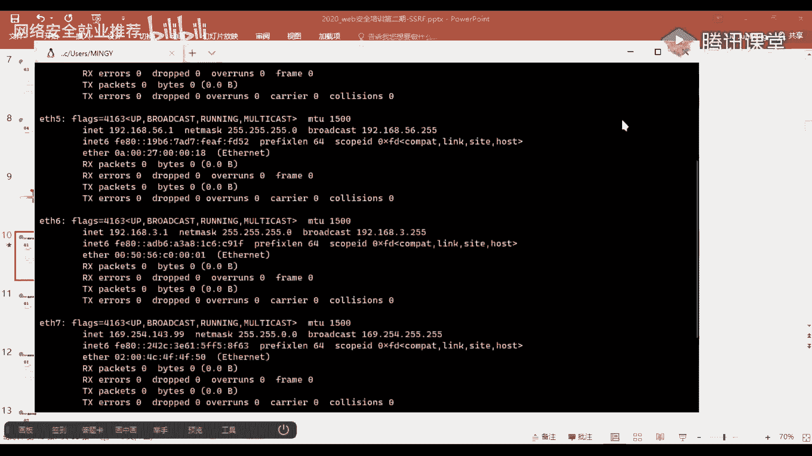

这样的话提一下，可能有些人不是很分得清楚，好的话，在这里的话，我们其实可以去尝试去尝试修改，我们的这样子的一个资源，修改为一个内网的一个ip地址对吧，如果说它这里存在这样的一个漏洞。

他就会去请求我们这里，给定的这样子的一个ip地址，给定的这个ip地址的话，呃，就是我们啊自己去进行一个构造的，当然的话前提你是啊，就是不知道他的一些内网的一些资源的，所以说这里的话。

如果它存在这样子的一个漏洞，我们可以通过去进行一个爆破，就包括它它的一个内网的一个ip ip段哦，我们通过他的一个就是说他会去请求，我们这里给定的一个内网的一个ip资源对吧。

如果说存在这样子的一个i p，然后指定的这样子的一个资源的话，就说明啊它存在这样的一个漏洞，能够去访问到内网的一个指定的一个ip，然后的话我们可以通过这样子的一个漏洞，来去爆破它的一个内网的一些ip段。

然后这里的话呃我这里试了，就是说他去请他啊，我这里改成我自己服务器的一个ip地址对吧，就是一个图片，然后的话进行一个发送的话，可以看到在这里的话，他会去请求到我在这里的一个服务器。

这里的一个啊qr code，点pg的这样子的一个资源对吧，然后可以看到它是从这，从这样子的一个链接过来的，就是我这里的好发送过来的这个包，这个链接过来的，当然的话这里的话它是呃。

就是呃以这样子的一个例子，来给大家做做一个解释讲解，就是说他会去对我们这里给定的这样子的一个，链接去进行一个请求，然后获取到啊指定的一个服务器的一个资源，然后加载到这里来对吧，那么我们就可以去伪造。

伪造他这种请求的一个地址，伪造成其他的一些资源的一个地址。

那这样的话大家其实呃这样的话大家，看一下。

这个的话是我挺早之前就随便找了一篇文章，然后这里的话不是有个这样子的一个功能嘛，对吧，就分享到一个微博，然后一般的这种分享的这种的话对吧，可以看到在这里的话它会有这样子的一个图片，而这个图片的一个地址。

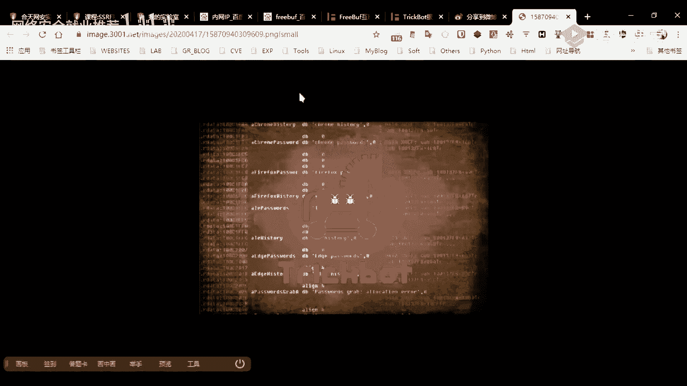

就是这样子的一个地址，然后我们其实可以通过抓包，然后抓包的话能够抓取到这样子的一个，抓取到这样子的一个请求，就它里面的话就携带了这样子的一些内容，而这些内容的话，它是从指定的一个啊链接上面去获取来的。

当然话这样的话它是大家可以去尝试一下，这样的话是呃，他没有没有这样子的一个s sf漏洞，我只是以这个为例子讲解一下，就是抛砖引玉，介绍一下这一个从医这种药的地址，分享这种网页内容啊，他其实这里的话。

它其实是有请求，我这里的一个服务器的一个ip地址的，当然的话也可以去请求其他的一个外网的一个，服务器的一些资源对吧，但是的话对于内网的一些呃资源的话，呃大家可以去进行一个尝试，就如果去进行一个爆破的话。

呃就比较麻烦，那我们呃，再看一下第二个，第二个的话就是一个在线翻译，就是说呃我们常我们常见的，像那种百度翻译对吧，还有有道啊等等这样这样的一些翻译，它其实有这样子的一些功能。

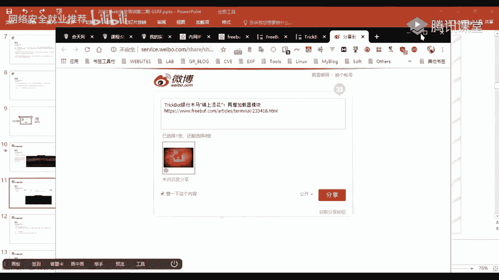

对就是这是一个百度翻译对吧，它你可以看到它这里可以输入文字网址，还有图片文档等等对吧，那这里可以允许你输入网址，啊这里网址的话，我们啊随便找，诶，就说这里的一个百度翻译的话，他可以去翻译呃。

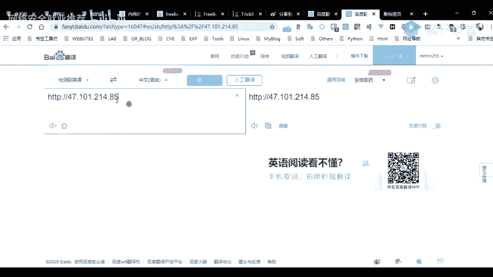

就说你指定的这样子的一个网站，我发一个网站，找个英文网站嗯。

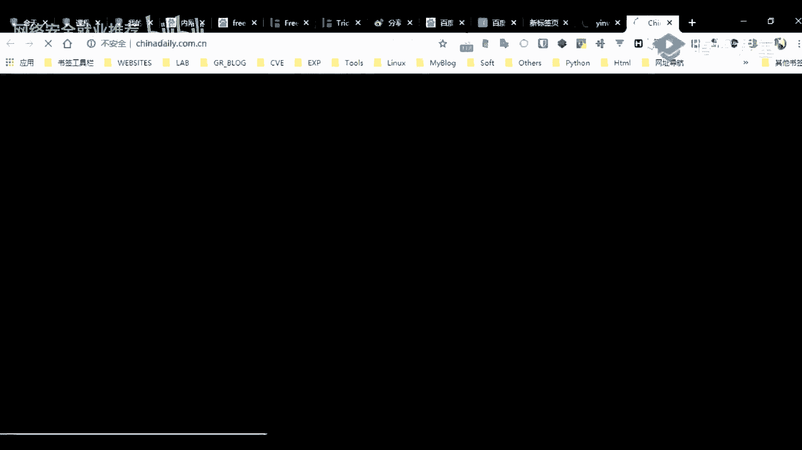

然后可以看到我这里的话，输入这样子的一个url地址对吧，输入这样子的一个网址，然后它这里有这样子的一个功能，就是能够把我这里输入的一个指定的一个啊，url的一个内容，把它翻译成一个中文对吧，啊。

其实在其实在这这样子的这样子的，一些功能的话，它的一个原理其实就是他会去，首先他会请求你给定的这样子的一个，二楼沙发吧，我们可以查看一下它的一个请求包，其实啊可以看到在这里的话。

它是我们这里输入的一个网址对吧，然后他会以这样子的get请求去查询，就是这样子的一个网址，我们这里输入的一个网址，那他查询之后的话，它会返回这样子的一个呃内容，然后他返回这个内容的话。

它是呃要返回你这这样子的一个指定的，这个网站对吧，那么他首先就需要去请求这样子的一个网站的，一个这种网页的一个资源对吧，然后的话他再去用它的一个翻译的一个服务，对它进行去进行一个翻译。

所以说在这里的话呃，它也会有存在这样子的一些asset up漏洞，它你没有对这样子的一个啊，这种你这里输入的这种链接，这种url地址做一个过滤的话，就会存在这样子的一个漏洞。

就比如说你这里可以尝试使用一个内网的，一个ip对吧，然后这里是如果说它这里的一个服务器，它允许呃，他有允许去访问到，内网的一些ip的一些资源的话，那么它会存在这样子的一个漏洞。

当然的话你需要去就输入到啊，你要确定你能够，你要能够知道他内网的一些ip的一些网段，然的话你再去啊对这些网站去进行一个呃测试，因为我们知道就是内网的一个网站的话，有很多的就刚刚有看到。

它的一个是它的一个这种啊，他在这样子的一种ip的一个数量的话是很大的，然后的话在这里其实呃你们也可以去尝试去啊，去尝试输入你自己的一个啊地址对吧，输入你自己的你服务器的一个啊页面。

然后的话你去进行一个呃翻译，翻译之后的话，它会有这样子的一个请求，就这个请求的话，他是从啊这个百度翻译的这样子的一个服务器，去建一个发送的，然的话他会请求到你这里，给定的这样子的一个呃链接。

然后他获取到我这里的一个资资源内容，之后的话，再去进行一个翻译，可以看到有这样子的一些呃，这里这样子的一个请求，好，第三个的话就是通过呃要地址加载与下载图片，就这个的话其实跟前面也是类似的。

就是说在这种就是通过要地址去进行，而加载这种资源的话，就呃很有可能会存在这样子的一个漏洞，他没有对这样子的一些呃有严格的限制，然后还有就是图片的一个文章收藏的一个功能，就说你去啊收藏这样子的一个文章。

对比如说你去啊收藏到啊印象笔记对吧，然后你去收藏当于印象笔记的话，他会呃你们有用过的话，他会把，就是他会把你给指定的这种文章的一个内容，然后它会把它给保存到你那个，印象笔记的里面啊，印象笔记里面去。

然后它其实就是把你给定的这一个啊，要地址里面的这种文本的一些内容对吧，然后把它给放到了，那你那个印象笔记的一个呃内容里面去，所以说的话它中间就有这种去向指定的，你改变这种url地址去进行一个请求。

里面的一些title，还有文本内容，然后的话再显示出来，啊，第二个的话就是从ur的一些关键字，去进行一个寻找，像比如说这种小啊，还有像这种url对吧，因为呃像这样子的一些关键字。

后面的话他啊通常会去接这种啊链接，就说去接啊，常见的这种请求资源的这样子的一些啊链接，就是说通过这样子的一些参数，当然的话还有其他的一些，就是呃看实际的一个功能点的一个不同。

然后最后的话对前面做一个总结，就是说这种ssr不漏洞，它常见的这种场景的话，首先第一个就是能够对外发起这样子的一个，网络请求的这种地方，比如说我们啊啊这种下载图片对吧，还有就是啊获取指定服务器的一些图。

片的一些内容对吧，像这种地方的话，就很有可能存在这样子的一个漏洞，第二个的话就是从远程服务器请求资源，就说从我们的一个啊指定的这种啊服务器，去请求这种文本的一个内容，还有像这种图片资源是很常见的。

那我们去去寻找这样的一个漏洞，大家就啊注意去观察这样子的一些啊功能点，第三个的话就是呃漏洞的一个利用，就是说我们怎么去利用这样子的一些漏洞，然后在这里的话呃，首先的话带大家一起了解一下。

就是说这样子的一些协议，一些url的schedule的一个协议，就是我们在常啊经常会去使用到，这就说在ssr f漏洞里面的话，经常会去使用到去验证的这样子的一些协议。

首先第一个的话就是这个dictor的一个协议，这dk的协议的话就是一个字典服务器协议，其实从字面意思的话也能够知道，就是啊我们在s2 当中的话，可以去使用到这样子的一个dt协议。

来获取我们的一个目标服务器上面，端口运行的一个服务，版本的等等的这种banner的一些信息，好我们看一下这样子的一个例子，一个的话就是一个本地利用，这里的话使用的是一个cl的这样子的一个命令。

就是说这个命这个cl的话，它其实是一个命令行的一个工具，它的一个作用的话就是用于发出这种网络请求。

获取数据，其实就是说你在命令行上面的一个啊。

可以达到像浏览器的这样子的一个功能，就是说去好访问，去请求你给定的这样子的一个啊链接啊，然后的话再获取你给定链接的一个，这种数据资源，这个的话是呃经常去使用到的，这样子的一个命令，in what um。

就cl这个面的话是啊，一般的话都是默认都有的，然后这里的话有一个杠v的一个参数，就是显示我们的一个就是我们的一个呃，对指定资源的一个请求的一个详细的一个过程，以及信息，这句话我使用这个dk的协议来去啊。

访问我本地的，来去探索我本地的，比如说啊一个3306的一个端口，就说我们的一个数据库的一个端口对吧，然后我们这里去进行一个访问啊，打错了，进行一个访问，访问之后的话，可以看到上面这里的话就是呃。

我们对这样子的一个请求的一个过程，就说他会去请求这样子的一个啊啊链接对吧，然后去请求我们的这里给你的这一个ip地址的，这个3306的一个端口，然后在这里的话，可以看到它这里返回了这样这样子一串信息。

这样的一个字符串，这个字符串的，我们其实可以看到这里有一个mary db对吧，乌班图啊，1604，这里的话其实就是显示了当前的这一个数据库，的一个版本的一些信息，它是一个5。5。5啊啊。

不是他是一个mary db的一个呃十点的一个版本，然后的话当前的一个系统的话是一个乌班图，16004，我们可以看一下，可以看到我当前的这样子的一个呃数据库，是一个marry db。

一个十点的一个版本对吧，然后我当前的一个系统版本的话，是乌班图的一个1604的一个版本啊，其实我们可以看到，我们通过这样子的一个dt协议的话，能够获取到就是说指定的一个ip地址，指定的一个端口。

上面的一个服务的一个版本的一些信息对吧，那么我们可以尝试一下使用啊，就是访问其他的一些端口，比如说嗯8080的一个端口，没有关，有诶哦，这里打错了，d i c t dictor，你好。

在这里可以看到的话，我这里访问啊，我本地的一个24680的这样子的一个端口，然后的话可以看到它这里返回了，这样子的一个信息，是一个ssh二点对吧，然后我这里的话是使用的这一个端口。

是一个s区的一个服务的一个端口，所以说我这里去进行一个探测，指定的一个端口，然后他给我返回了一个这个端口，上面所运行的一个服务的一些信息，这就是一个这个dict协议去探测啊。

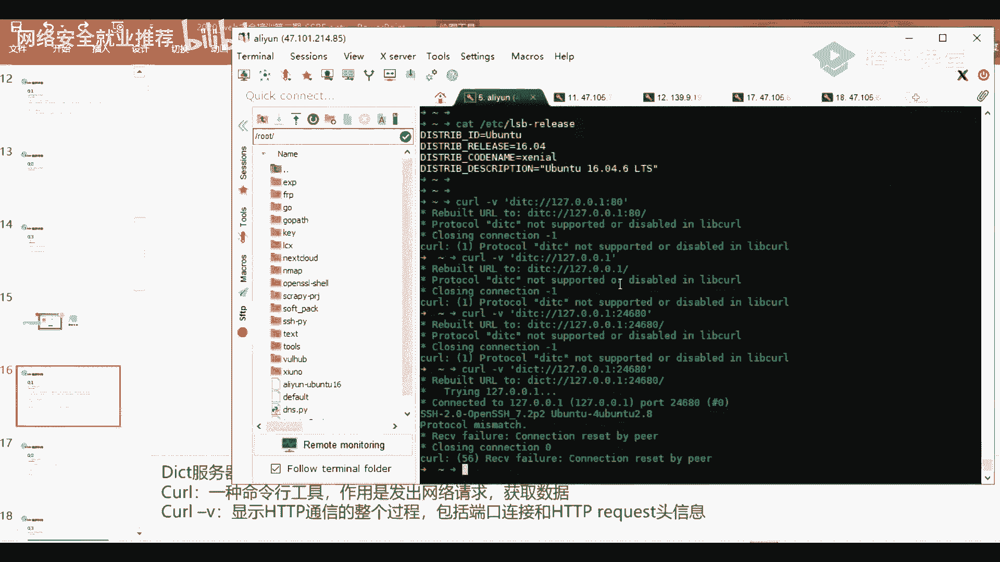

指定ip端口的一个这种banner信息的一个啊功能，然后的话再应用到我们的一个s f里面的话，就是说我们就是说下面的一个远程的一个利用，就是说我们前面知道，就是说如果说它存在这样子的一个。

s sf漏洞的话，我们可以通过，就是说他请求的这种资源的一个链接地址，它是可控的，那么我们可以去进行一个伪造，伪造成我这里指定的这种啊，一伪造成我这里的，比如说这个dictor啊。

指定的这个ip是这个等一个二二十二端口对吧，然后然后的话我去进行一个发送，发送我的这样子的一个请求，然后我们这里的这个啊服务器，这个这个服务器的话，它就会去啊以这一个dict协议去啊。

请求指定的这个ip的22号端口，好的话，它就会返回这个指定的22号端口，如果说它存在这样子的一个端口，就说这个端口是开放的，那么它就会返回这个端口上面的这种啊。

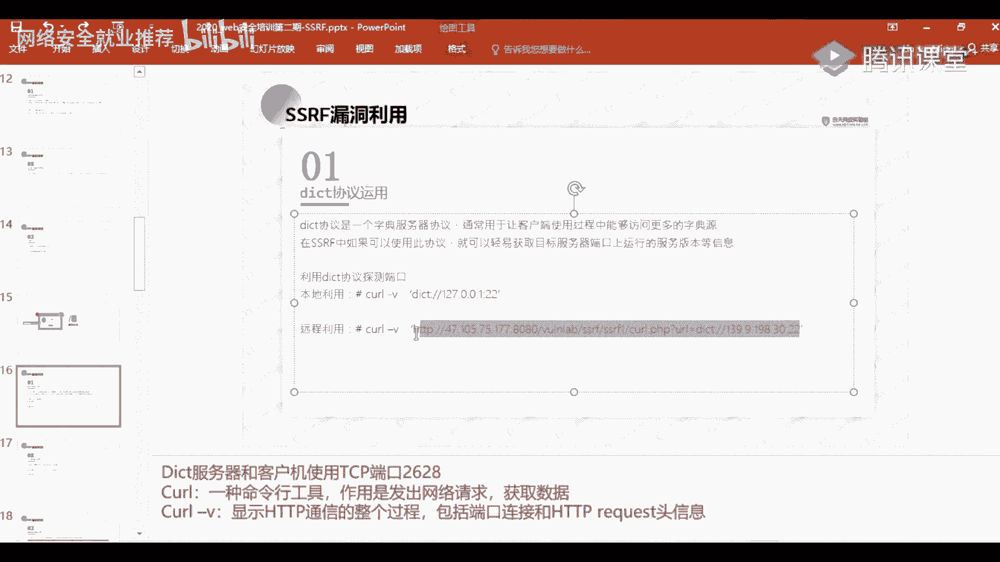

服务器的一个版本的一个信息。

这么卡呢。

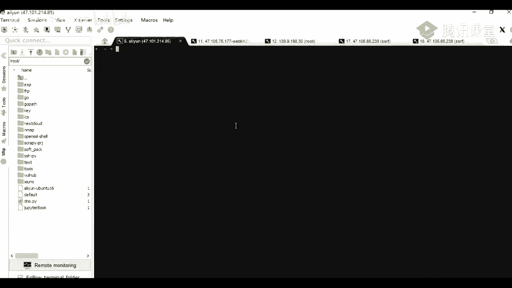

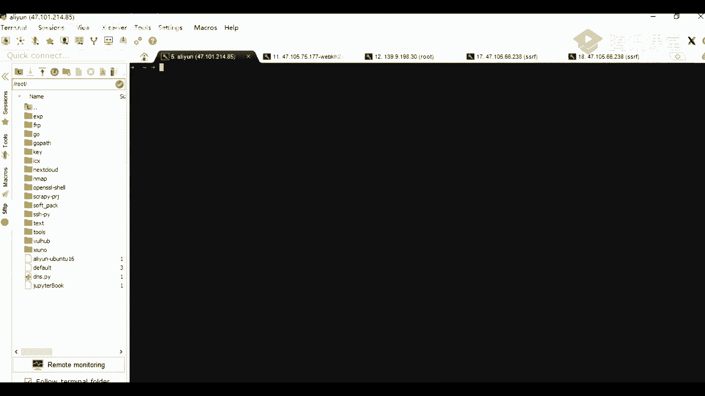

而我这里的话访问的是嗯。

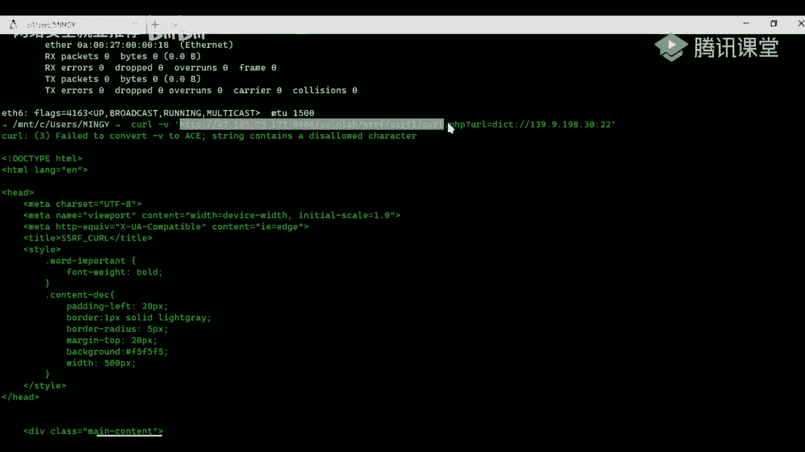

我这里的话是访问的这样子的一个网站，就是说这个网站对吧，它存在这样子的一个s s s s f的一个漏洞，好的话，我在这里的话，我去啊发送这样子的一个请求，我这里修改它的一个呃，请求的一个地址为我这里。

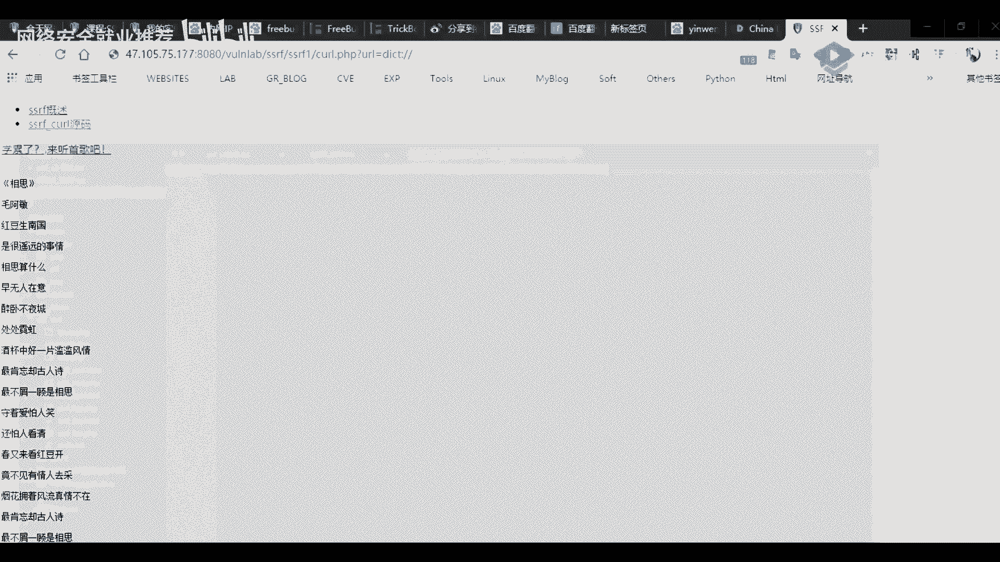

而我这里的这一个dict协议的，这样子的一个地址，然后的话我去进行一个请求的话，可以看到可以在这里看到能够探测到啊，指定的这个远程服务器，它的呃端口的这种banner的一个信息。

就是说它的一个版本的一个信息。

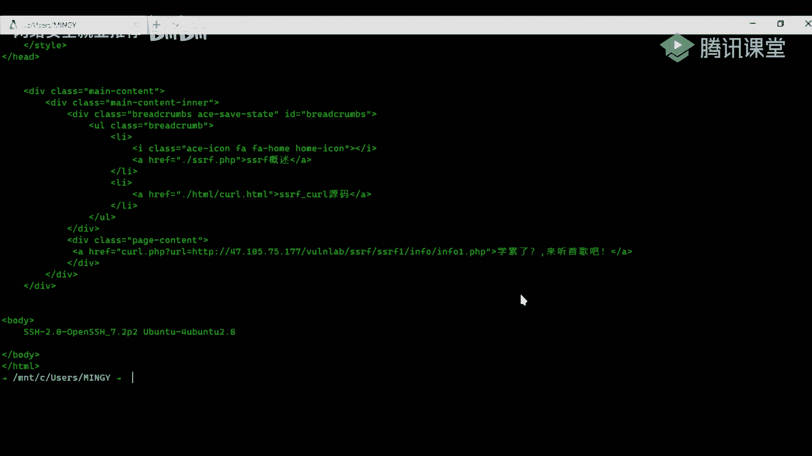

以及它服务器的一个信息，然后还有其他的一些端口。

在这里的话我就不一一的去尝试了，这就是一个啊dt协议的一个使用，好第二个的话就是一个fire协议，fire协议的话，其实前面也给大家已经有介绍了，就说它是主要就是用于文件系统中的一个内容。

的一个获取读取，就是说访问我们的一个文件系统当中的，一个文件的一个内容，啊这里的话其实就是，就是利用到这样子的一个file协议，去读取我们的文件系统中的一个内容，这样的话我以还是以这个为例子，比如说。

我这里想要去读取到指定系统中的一个etc，下面的一个password的一个内容，那么我们可以使用到这样子的一个file协议，去进行一个读取，然后的话因为它这里存在这样子的一个漏洞。

这样这样子的一个sr sf漏洞对吧，他会去请求我们这里给定的这样子的一个啊，这样子的一个链接，然后的话他会请求我这里给定的，以这个file协议的一个链接，然后的话获取给定的这一个啊链接的一个内容。

然后的话再返回给我们，可以看到，在这里的话是能够获取到它的一个啊，password的一个内容，这就是一个file协议，好的话，第三个的话就是这个go f协议，就go f协议的话呃。

在后面的话去进行一个漏洞的一个应用的话，会经常会去使用到，就说像比如说这种radius的一个未授权，然后的话go for的话，它是一个就是万金油的一个协议，他什么都能够去进行，一个就是什么都能干。

就他能够去发送到去，就是说在后面去进行一个漏洞啊，应用的时候，我们就会去使用到这样的一个篝火协议，来向指定的这种在内网的一个服务，比如说release的一个未授权，我们需要向他发送我们的一个pload。

然后的话发送给release去进行一个执行，就会去使用到这样的go f协议，而这里的话我们可以看一下。

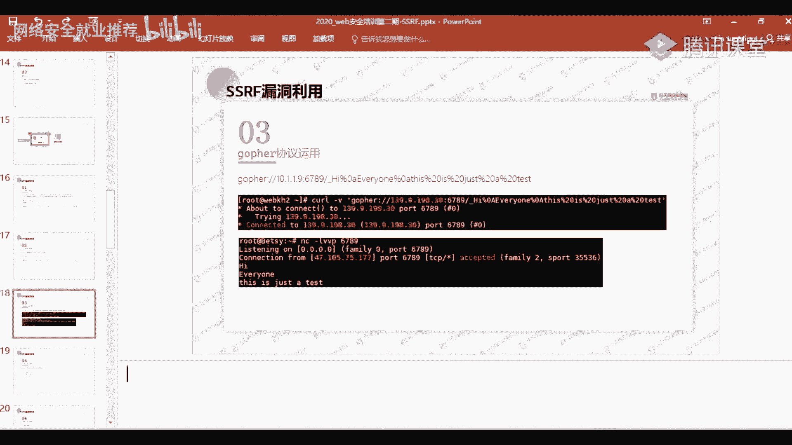

比如说我在这里。

好卡呀。

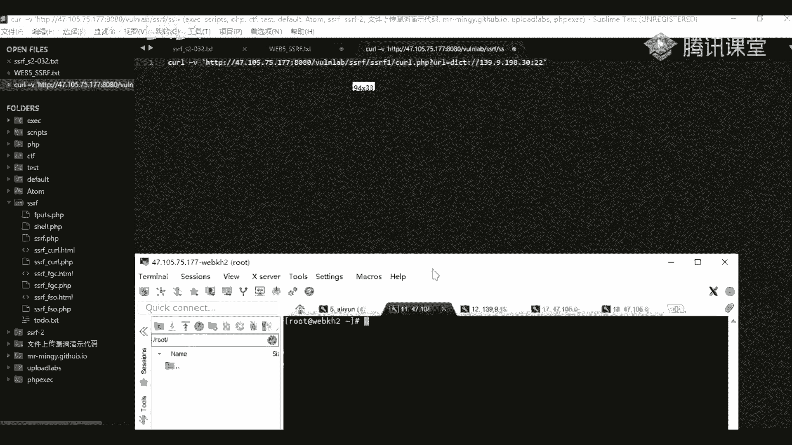

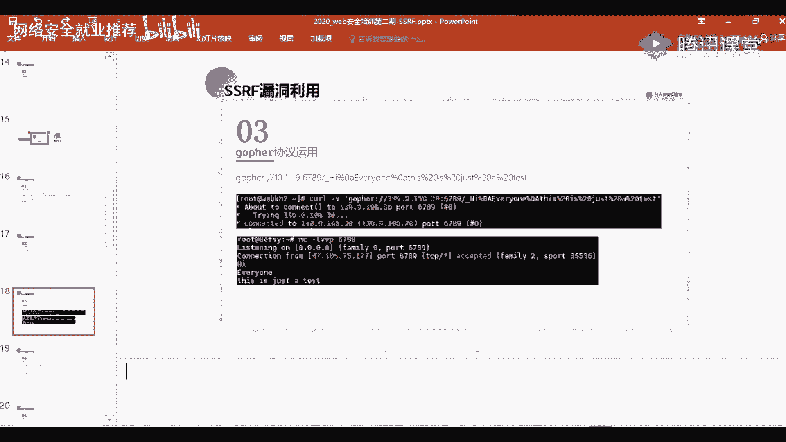

比如说这里我使用一个c l l来去啊，就发送这样的一个请求，这个请求的话是啊利用gf协议，然后的话他请求在一个地址的话，是我这里的一个服务器的一个地址对吧，请求的一个端口的话是呃6789。

然后后面这里接的话，就是我们利用这一个篝火协议，去传递的这样子的一个内容，然后这里的话是一个hi everyone，this is just a test对吧，然后中间这里的一个0%a，还有20%的话。

就0%a的话就是一个空格嘛对吧，哦不对，0%a是一个换行，20%是一个空格，就它是一个诱饵的一个冰嘛，然后我在这里的话，我去进行一个呃，首先我需要在这里啊，因为这边的话，它没有开放这个这样子的一个端口。

所以的话你直接去进行一个访问的话，他肯定是不会有信息的，我在这里的话使用一个，我在这里使用nc来今天这样子的一个呃，6789的一个端口，然后的话我再使用这一个go f协议区，进行一个访问。

或者说去发送我这里的一个内容啊，其实我们在这里的话可以看到，在这里的话接收到了，从这里的一个服务器上面所发送过来的内容，这个内容的话就是像这样子的一个hi everyone。

this is just a test这样子的一个内容。

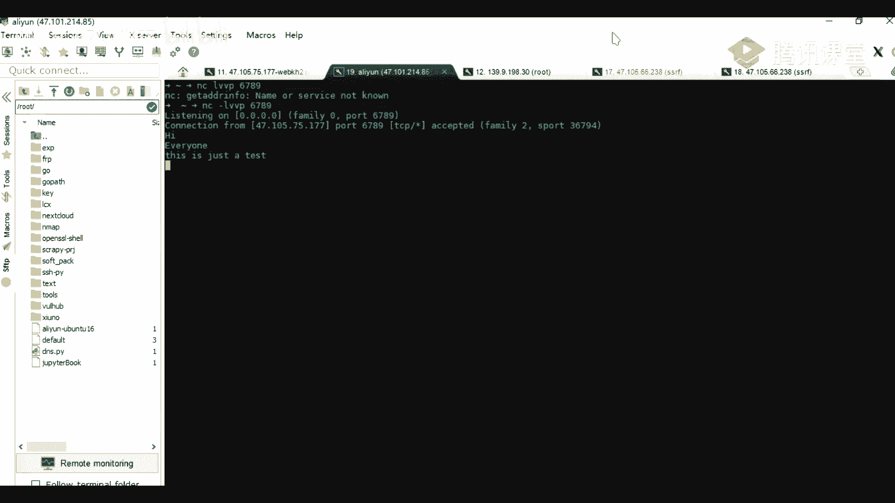

就是啊勾否协议，然后第四个的话就是s sf in ph p，在这里在这里的话，我们主要的话就是给大家介绍，就是说在菲律宾当中所导致的这样子的一个，就说啊，导致就存在这样的一个哈萨沙漏洞的。

这样子的一些原因，好的话是有什有什么样子的一些功能，或者说菲律宾当中的一些函数使用不当，然后导致的这样子的一个sf的一个漏洞，首先的话我们可以看这里的话，我列举了三个。

就是说这里的这三个函数如果说使用不当的话，而十分的容易导致存在这样子一个漏洞，首先第一个的话就是这个crl e x e c，然后第二个的话就是这个发get contains。

第三个是这个f sock open，下面的话我们111的对它做一个介绍，所以第一个的话就是这个c r l e x e c，就是我们从这个函数它的一个啊，就是名字的话。

也能够知道它是使用的这种cl的一个方式来去，呃，请求我们指定的一个资源，然后这个函数它的一个作用的话，就是我们从前端传过来的这种url对吧，它会被后台，如果是，如果它后台使用的是这样子的一个函数的话。

它传到传递到这个函数的话，它就会指定的这个要要去进行一个请求，然后的话把请求的一个结果又返回给前端，也就是返回给我们的一个啊浏览器的一个页面，对吧，奥特曼啊，我们他都这样子的一个协议。

我们如何去进行一个啊，就是有，就是说如果说它是它的一个后端，它是使用到这样子的一个啊函数，然后的话它没有啊正正确的一个进进行的一，就是没有正确的使用这样子的一个函数的话，我们能够通过什么样子的一些。

方法来去进行一个攻击以及利用，那这样的话就需要使用到，我们前面有说到这种啊dict这种协议，然后同样的我们在这里的话是使用这个协议，来对我们的一个内网的，内外网的一些端口进行一个探测。

探测它的一些版本信息等等，好在在这里的话，我以这个为例。

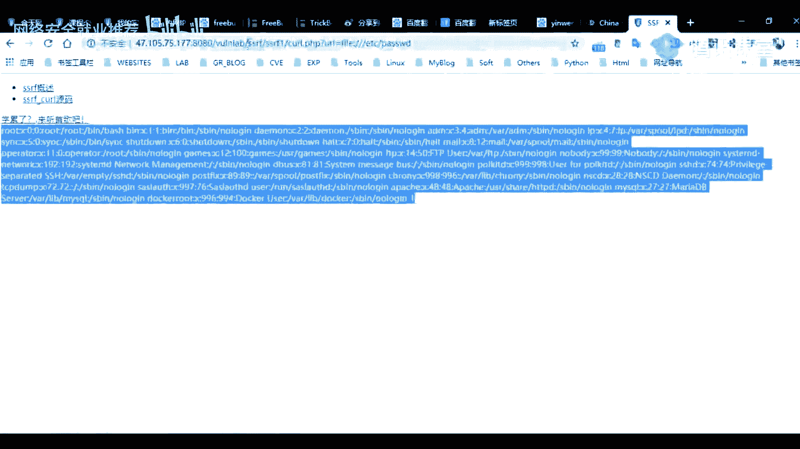

啊这个这个的话就是那个把机啊。

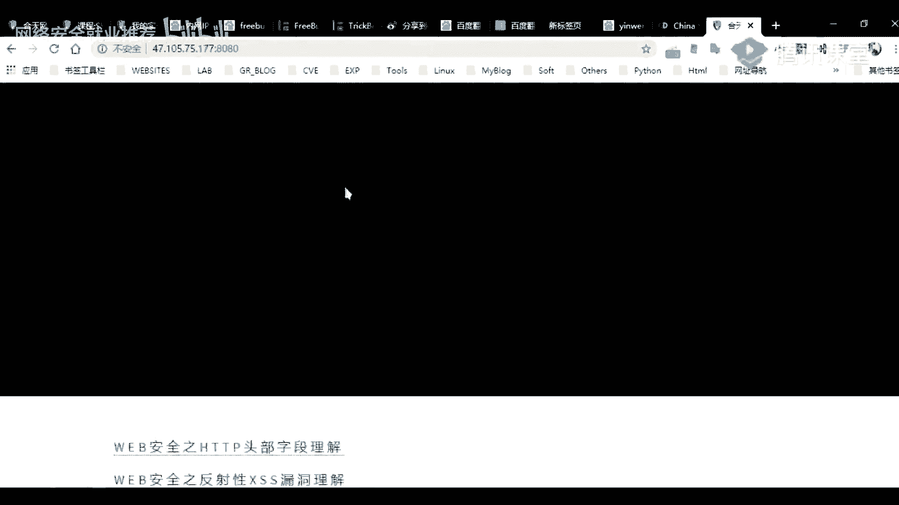

我忘了说了，就那个把机这个s的一个漏洞理解对吧，然后这里的话已经给了有这样子的五个啊题目，然后第一个这个cl的理解的话，它就是使用使用到的这样子的一个c l e x，e c的这样子的一个函数啊。

其实啊这样的话我有给了这样子的一个，就是大概写了这样子的一个简单的一个界面，那这样的话给了这样子的一个源码，就是说这个题目的一个源码就在这里的话，主要的话就是这个是要ex 1 c的一个函数，然后呃。

前面的话就是就通过这个u r l的一个参数，对吧，获取用户传递的这种链接，然后传递过来之后的话，就用这样一个c l e x e c去进行一个请求，然后请求之后的话，他会把请求到的一个内容。

然后进行一个输出，就是echo就输出到我们的一个页面，好在这里的话，在这样的话要提一点的就是cl的话，它不仅仅就是支持这种htp，还有h h t p s的一个协议，对我们前面利用这个cl去访问。

指定的一个web的一个页面对吧，然后他其实还支持其他的这样子的一些协议。

在这里的话我们可以使用这个c，杠v吧，非要杠大v这样子的一个参数来查看到，就说这个cl这个工具的话，它能够就是支持有这样子的一个协议，有这么多的一些协议。

像比如说dictor file ftp ftp啊，就是文件传输嘛，还有我们那个勾符啊，h p h p以及常见的像这种pop 3就邮件服务的，还有sb以及tnt等等的这种协议。

我们都能够使用这样子的一个cr 2，来去利用这些协议来发送我们想要的一些请求。

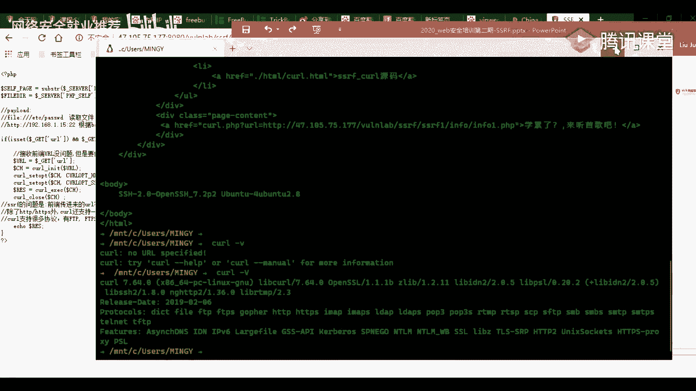

那这里的话我们看一下这个，啊这个概述的话，我这里就是呃以文字的形式对应，s35 做了一个基本的一个介绍吧，那我们先看一下第一个题目，第一个题目的话我们可以看到就是我这里访问，访问之后的话。

它返回了这样子的一个内容对吧，返回了这样子的一个内容，然后的话我们其实从页面的话，从页面上的话没有发现什么特殊的一些地方，而我们主要的话看这里就看它的一个链接，我们前面有说到。

就是说啊他有这样子的一些就是关键字对吧，我们常见的一些关键字，比如说url，还有其他的一些啊，就说后面接，后面接我们啊的一个链接的这种关键字，然后这种关键字后面的话。

通常的话会接这样子的一个呃逆ip url，而这个url地址的话，就是他要去请求的这样子的一个url地址，而在这里的话，它是请求到了这样子的一个资源对吧，我们可以直接去进行一个访问，对吧。

它它的一个资源内容的话，就是这样子的一个歌词，歌词的一个内容对吧，那么在这里的话，我们就可以去进行一个ss漏洞的一个测试，而测试的话我们首先就要啊，想到就说我们要测试它的什么什么。

什么样的一些内容来去对它进行一个验证，首先第一个比如说我们请求一个其他的一个啊，在这里的话，可以看到它是能够请求到其他的一个资源的，对吧啊啊没有，他是同他是在同一个服务器上面的对吧，是在这里的话。

我去尝试去请求一下，其他服务器上面的一个资源，说呃，啊就我就访请求啊，这个这个ip地址上面的一个啊资源，然后我去进行一个啊访问，访问之后的话，可以看到它在这里的话，显示了这样子的一个内容。

而这个内容它是从哪里来的呢，我们来访问一下这样子的一个地址，这个地址的话，可以看到它的一个网页的一个内容的话，就是这个内容，那么我们从这样的话能够分析出，就是说他在这里的话，它有这样子的一个功能。

就是它可以去请求你这里给定的这个url地址，然后的话啊，把这个url地址的一个网页的一个内容，文本内容或者说他其他的一些内容把它给获取，就把它给请求过来，请求过来的话，再输出到我这里的一个页面上面来。

那我再尝试一下啊，内网的一个ip地址对吧，比如说呃幺七点点0。1，这个的话其实也不能说是一个内网的一个地址，就说一个啊这是一个回环地址嘛，就是说呃访问这一个的话，就相当于访问的是，你本地的一个资源吗。

然后在这里的话我去进行一个访问，我这里本地的这种啊，内网的一个ip地址对吧，然后可以看到在这里的话，他返回了这样子的一些内容，这些内容的话其实就是这里，这里的我这里的这个服务器上服务器，我这里访问之后。

这里的一个内容对吧，那么说明的话，他在这里的话是存在一个sr sf漏洞的，而且它没有对我们这里传递的这个呃链接，这种啊，内网的一个ip地址，还有外网的这种链接地址，没有做任何的一个检测以及过滤好的话。

我们就可以利用这样子的一个功能来进行一些，就是你原本访问不到的这样子的一些内容，的一个请求，啊这里的话我们验证的话，它是能够去访问到他内网的一些ip的对吧，然后的话想要去进行一个呃端口的一个探测。

就说探测我们的一个啊指定的一个服务啊，不是就探测我这里的一个服务器里面，它的一个呃一些ip或者说一些端口好探测，探测一个内网的一个ip的话，因为这里的话其实可以看到，它是能够访问到内网的ip地址的。

一个资源的对吧，那么我们可以尝试一下其他的一些ip地址再说，像这样子那种ip地址对吧，然后，好在这里的话可以看到这里一直是在转的，说明的话，他这里的话是没有这样子的一个，说明的话他是没有这样子的一个呃。

呃就是存在这样子的一个i p上面有啊，一个web的一个服务的这种资源的。

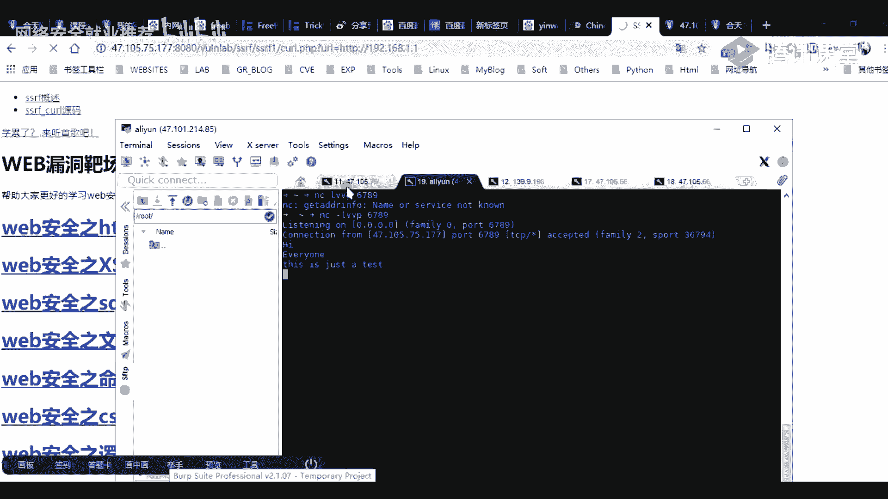

因为我这里的话是一个，这个这句话是一个阿里云的一个机器，就是，他这里的话就啊有这样子的一些内网的一些ip，但是的话它是没有其他的一些资源的，就没有其他的一些服务的。

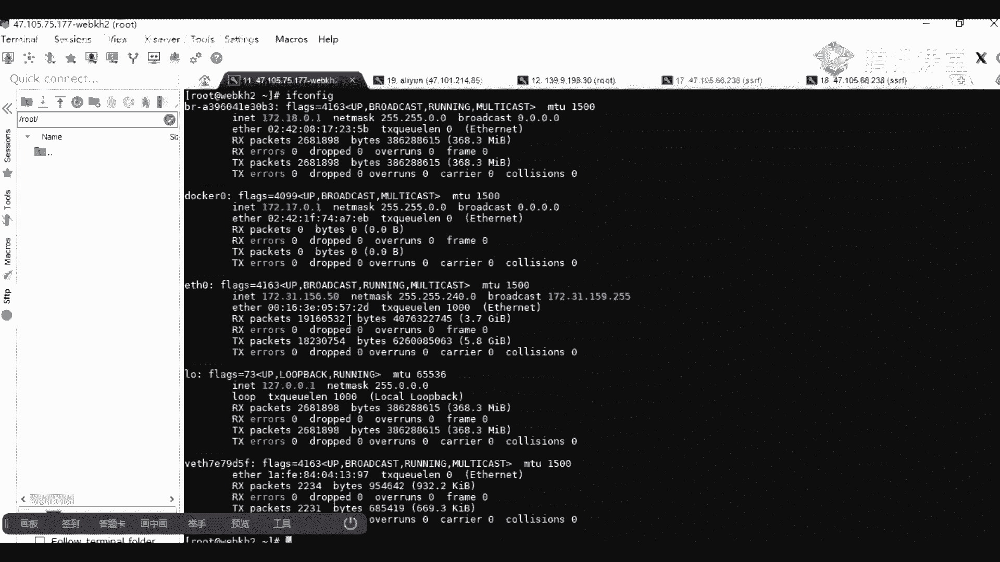

然后像正常的正常的这种服务器对吧。

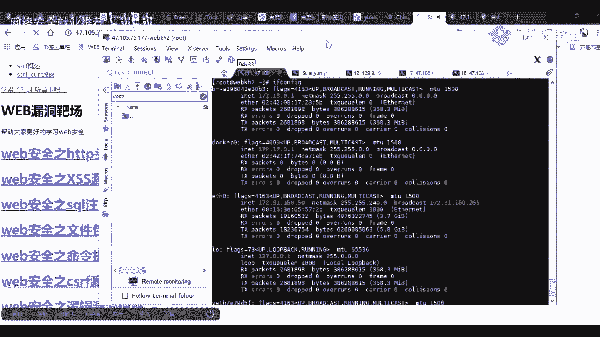

比如说你是你的这个服务器，它是一个外网的一个服务器，然后的话这个服务器，正好是能够去访问到内网的，那么我们就可以利用这一个服务器去访问到，指定的这一个内网的这样的一些资源，比如说比如说在这里的话。

一个内网的一个ip是这个对吧，那么我们可以尝试去访问这个171这个网段，其他的这样的一些ip。

它是否有存活，如果存活的话，这个存活的这个ip它开放了哪些端口。

然后这些端口它有什么样的一个服务对吧，然后的话说到探测端口的话，在这里的话我们就需要去使用到这个dict协议，我们在这里我们可以尝试去啊用这个dict协议，来探测一下。

比如说呃它的一个808年的一个端口对吧，也其实也就是这一个也就是这个服务器啊，这里的一个好web页面的一个呃端口，然的话在这里我们其实访问之后，可以看到它返回了这样子的一个内容，就是说htp 404。

然后的话其实可以看到它在这里的话，返回了你这一个服务器，所使用到的一个呃阿帕奇的一个版本，以及呃你的一个菲律宾的一个版本等等的，这样子的一些信息，然后说明的话他在啊。

虽然他这里显示的是一个bad request对吧，但是的话其实可以看到，可以知道它这里的话是能够去进行一个访问的，而我们呃可以尝试其他的一个端口对吧，如果说他没有这样子的一个端口的话。

它是什么都没有显示的，然后的话还有22s3 h这样子的一个呃，它的一个版本以及它的一个服务嗯，还有像比如说3306对吧，这样子啊，其实在这里如果说他能够去进行一个探测的话。

我们不可能说这样子一个一个去试吧对吧，就是一个一个ip的去尝试，这个时候的话我们其实可以去使用，去使用我们的一个bp，对，就是说我们可以直接使用一个bp来，就是对我们这里指定的这一个啊。

端口的一个数据去进行一个爆破，比如说，它的一个请求的话，就是呃这样子的一个请求对吧，然后的话它的一个回形的话是在这里，然后如果说就说他这里是有这样子的一个，服务开放的，所以的话他会有这样子的一个回血。

就是说有这样子的一个内容显示出来，如果说他没有这样子的一个，它好没有存在这样子的一个端口对吧，我们去进一个访问的话，它其实是没有啊，其他的一些内容的，它的一个字节是1600对吧。

我们访问一下3306可以看到的话，他的一个字节数的话是1724，然后的话我们可以把它发送到，我们的一个爆破模块嘛对吧，来对我们的，这里指定的这一个ip去进行一个爆破，这里的一个爆破的话啊。

我们首先要知道，就是说啊我们的一个i p端口的话，它是最大是一个6536，就说它的一个i p的一个端口数的话，是从1~65536好，这里的话这样的话我们选择一个numbers。

numbers的话就是数字嘛，然后的话我们从1~65536对吧，好的话啊，进进去的话就是一嘛就是123456，重播的话是有65536这样子的数据，好的话，我们可以去进行一个啊爆破去访问。

然后其实然后可以看到在这里的话，已经有了一个8年端口对吧，我们看一下它的一个返回的一个信息，返回了一个信息的话，是这样子，说明的话它的一个八零端口它其实是存在的，然后它是一个呃阿帕奇的一个服务。

然后还有就是22端口对吧，然后以及啊这个3306，当然的话我这里的话就不一一个一个去跑了，因为有点多，这话就是介绍一下，比如说思路，然后这里的话是一个det协议的一个使用。

然后第二个的话就是我可以去进行一个尝试，去读取读取我服务器上面的一个文本内容，那么我想实现这个的话，我们就需要去使用到这样子的一个file协议，这个file协议的话，比如说我们这里的话。

已经知道它是一个linux服务器对吧，我可以啊，就是用常见的这种啊文件，比如说etc password，又常见的这种文件，就每个系统每个linux系统都有的这种文件，然后去进行一个尝试访问。

访问之后的话，我们来就是观察它的一个响应，它是否有返回你指定的这样子的一个，文件的一个内容，然后这里的话是返回了，就可以就正常的返回到了我们这里，返回的这个文件的一个内容。

啊这样的话就是一个啊dict协议，就对我们的一个端口的一个服务，去进行一个探测，然后第二个的话就是一个敏感文件的这种读取，就是fire协议，就是啊在念令时灵，在另一层面的话，就另一些系统里面都全啊。

都有的是这样子的一种文件，就是说etc password这种文件，然后windows的话就是我们可以使用这种啊，windows下面有一有一个这种windoi n i的，这样一个文件，就是系统的一个文件。

就是啊所有的这种windows系统都有都会啊，都会有这样子的一个文件，我们可以去访问一下，它，其实就是这样子的一个内容，然后我们可以通过这样子的，就是啊常见的这种文件来去进行一个验证。

就印证它是否能够去使用这种file协议，去进行一个文件的一个读取，而第二个的话就是这个file get content，的这种这样子的一个函数，这个函数的话，它同样的能够去进行一个。

就是给我们对我们给定的这种链接，去进行一个请求，然后在这里的话它与前面不同的一个地方的话，就是它支持这样这样子的一个，菲律宾的一个伪协议，我们可以通过这一个菲律宾的一个伪协议，来去进行。

一个就是这个服务器它的一个源码的一个读取，懂了，这句话我，是，不好意思，喉咙堵了，这样的话我我以这一个啊题目作为一个例子，我们直接先看源码吧，就是它的一个源码的话，其实跟前面也是类似的。

就通过这个file协议好吧，通过这一个file参数去啊，获取指定的一个资源对吧，然后的话给这一个file，get content的这个函数去进行一个处理啊，这个这个文件的话，它把这个函数的话。

它的一个作用就是将你给定的这个文件，读入一个字符串，然后在这里的话它会用echo把它进行一个输出，那我们可以看一下，就是这个题目，我们可以看到我这里的话好访问之后的话。

可以看到同样的是在他的一个url地址里面，有这样子的一个内容，有这样子的一个链接对吧，而我们访问一下它的一个内容的话，其实就是这样子的一个一张图片对吧，而这张图片的话它是把呃。

这张图片的话它是在这里的话，它是通过那个far get content，这个函数进行一个获取的，然而这样的话跟前面的话其实都是一样的，就是进行一个进行一个测试嘛，测试的话像啊啊外网的一些服务对吧。

外网的一些hp服务，还有内网的一些htp服务等等，这样子的一个一些资源去进行一个测试，对吧，这样的话我就不重复了，然后在这里的话，主要就是介绍这一个这一个番啊，这个p h p伪协议。

也就是这个就是菲律宾file read，这样子的一个啊协议，这个协议的话啊，其实呃大家别看着就是很复杂的一个样子，其实就啊挺好挺好记的，也挺好理解的，主要的话就记这里就这一个convent base。

64encode，然后resource，resource，后面的话就是接我们的一个就是资源嘛，就是我们这里要读取的，就是说读取的这样的一个文件，然后的话给这一个base 64 encoder。

这个函数区间一个处理，而这个函数的话，他就是把我们这里的一个啊，给定的这一个好文件，把它的一个内容做一个base 64的一个冰嘛，然后把它编码之后的话，再进行一个，再用这个菲律宾尾写预期读取读取出来。

然后它的一个效果的话就是像这样子，我们在这里的话呃，使用这样子的一个伪协议，然后的话我们读取这里的，就是这里的一个f g c的一个内容对吧，我们回车回车之后的话，可以看到它在这里的话。

它显示了这样子的一个内容，这个内容的话，它其实就是一个base 64的一个编码的一个啊，字符串呃，我们可以对它做一个解码，解码之后的话，它的一个内容就是这里我们其实可以看到的话。

这里的话就是当前这里的这个页面，它的一个源代码，而它的一个代码的话，其实他那个源代码的话不是说我们在这里的啊，我们这里右键查看网页源代码的一个代码，就是说我们在这里右键查看网页源代码的话，是啊啊。

就是服务端它的比如说我们的一个菲律宾脚本，他啊把我们的一个内容进行一个处理，处理之后的话，再返回给我们前端的一个内容，是这样子的一个内容对吧，在这里，在这里我们读取到的这样子的一个内容的话。

它的一个源代码是，就说这个页面的一个完整的一个源代码，就包括了我们的这种菲律宾的一个代码，我们其实可以发现，就是说因为你是这样子的一个菲律宾文件，如果说你的一个服务器支持这样的一个，菲律宾文件解析的话。

如果说你这个文件它存在一个菲律宾代码，他就会把这个文件里面的，p h p代码做一个解析对吧，然后的话再把它解析之后的一个内容输出来，然后大家可能这里会问为什么，就是说为什么不直接通过file协议。

去进行一个读取呢，就说直接我这里直接读取这一个指令的，一个文件内容不行吗，呃，那我直接我直接通过这样子的一个方式去进行，一个读取它这样一个文件呃。

这样的话我。

我这里的话直接去进行一个文件的一个读取，哦不是搞错了，可以看到我在这里的话，我直接啊，就是说在这里我直接传一个文件名对吧，就说读取当前这个目录下面的，这个一点text文件对吧，而不是一样的。

可以进行一个输出吗对吧，然后他这里的话一定要大家一定要注意的一点，就是我在这里的话，我是这样子的一个text的一个后缀，就是说他这里啊读取的一个文件，是这种text的这种文本文件，对于这种文件的话。

他会直接把里面的一个内容进行一个输出对吧，但是的话对于这种啊，我这里换一个文件c l l点片区域，对于这种菲律宾的一个文件，去进行一个啊直接的去进行一个获取的话。

可以看到在这里它返回了这样的一个内容对吧，这个内容的话，其实就是我们前面直接去访问这样子的一个，cl。ptp的一个内容对吧，他其实没有返回，说没有说返回这个菲律宾文件里面的一个，而代码，而是返回了。

而是返回了，就是啊，把这个菲律宾文件作为做了一个解析之后，它的一个内容给返回出来了，所以说我们想要获取到你指定的这一个文件，它的一个啊云代码的话，你就需要去使用到这样子的一个。

菲律宾的一个伪协议来去进行一个读取，而它读取的话就是把它的一个指定的一个文件，里面的一个啊内容做一个base 64的一个冰嘛，然后的话再进行一个输出，这样子的话，他就不会说把里面的这个p h p文件。

里面的一个内容啊，当成一个啊就是进行一个解析，然后进行一个输出，这句话是一个fire get contains，以及这个片区伪协议的一个介绍，然后第三个的话就是这个f sock open。

而这个f sopen的话，它的一个意思就是打开一个网络连接，或者是一个这种linux的一个套接字连接，它其实就是一个打开一个这种socket，一的一个零件，然后它的一个行这个函数的话。

它就是他能够对指定的这种ip地址。

去进行一个访问以及请求。

而ip还有域名，然后的话把它会把请求到的，这样这样的一个内容，然后进行一个返回输出，看一下，好可以看到我在这里的话呃，就访问之后的话，它的一个链接是访问的这个3w点，百度点com对吧。

然后他返回了这样子的一个就是呃，返回了这样子的一个啊百度点com的一个首页，这样子的一个页面，就说他把这一个百度点com的这个首页的一个内，容进行了一个请求，请求之后的话获取获取值啊。

请求获取下来之后的话，输出到了这样子的一个页面，然后在这里的话可以看到这里的话是他的啊，一个请求的一些啊内容，就是说它的一个请求的一个响应，然后的话这个函数的话，还有就是对啊，指定的一个ip地址。

这个内容去进行一个访问。

可以看到这里的话它就是它的一个内容的话，是在这里。

还有就是他的一些ban的信息，都给你进行了一个返回，这就是这个函数，然后注意的话这里是就是说socks的话，它是只针对于说是这种ip地址进行一个访问，请求你你如果是说像这种一个啊。

就是url l l的话，确定，这种url地址的话，它是无法去进行一个啊解析以及处理的。

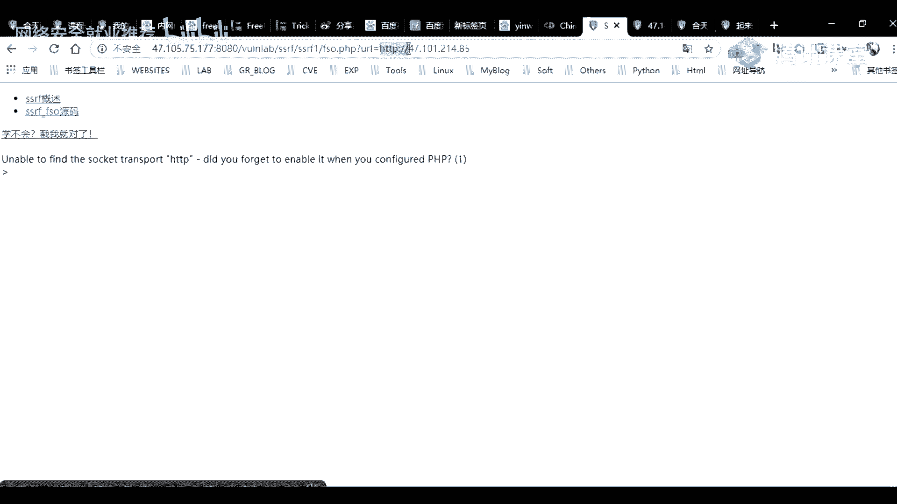

他只只能是对这种啊，就是啊我们的一个域名以及我们的一个ip地址。

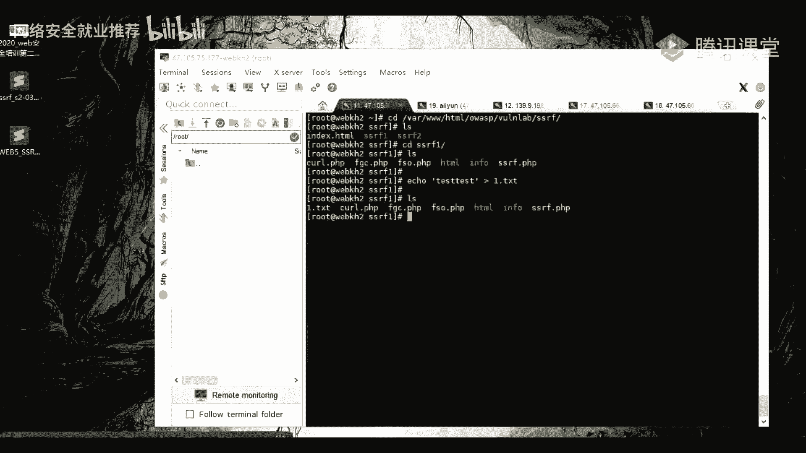

才能够去进行一个请求，啊第四个的话就是呃前面其实我们了解，就是我们通过前面的这些例子的话，有发现一点，就是说他的这种呃他的这种请求访问之后的话，它都会有这样子的一个回形对吧。

就是说比如说我这里请求这样子的，指定的一个内容，它会啊回形出这样子的一个资源，的一个内容对吧，然后的话有存在这样子的一些情况，就是说访问请求之后的一个资源，它不会说在这样子的一个页面上面。

去进行一个显示，但是的话它实际是好，实际的话是有对这样子的一个链接，去进行一个请求的，是的话，它没有返回到我们的一个前端，然后在这里的话就是啊要说到这个s sf，它的一个呃没有回血的这种啊盲s。

而针对这种盲s3 f的话，我们怎么去对它进行一个测试呢，就说前面我们我们进行一个测试的话，比如说我们通过访问指定的这种啊，一个外部的一个访问外部的一个，这种链接对吧，访问外部的这种链接。

然后的话我们怎么知道他访问成功呢，因为他这里的话要有就是有回血对吧，就显示了就是啊只给定了这个链接的一个内容，我们才知道他啊行就是请求成功了，就说有对指令的这一个呃定接去进行一个请求。

如果说他没有这样子的一个返回的话，那么我们怎么去进行一个判断呢，在这里的话介绍两种啊，介绍两个方法，第一个的话就是htp的一个带外通道。

这里要介绍的话就是这个bp的这个call back cocooperate，这个client就是在这里这里有一个bp，然后这个那这样的话他这个bp的话，它有提供有这样子的一个服务。

就是说我点这里的一个copy to。

就复制到我们的一个剪贴板呃，然后我们粘贴出来看一下，上线出来之后的话，它其实就是像这样子的一个呃链接一个地址，然后这个地址的话，它其实是bp官方的一个这样子的一个地址。

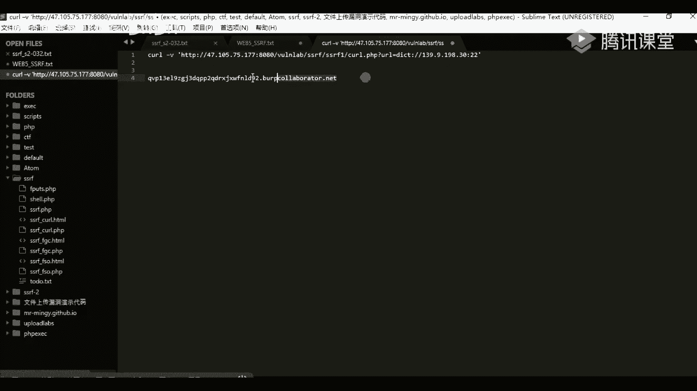

啊这这个的话它有什么作用呢，我们在这里我们去进行一个访问，访问之后的话，他会有有给了这样子的一个字符串对吧，这里我们不管，然后我们可以看到过了一会儿之后的话，他在这里的话有显示这样子的一些内容。

而这里的一些内容的话，其实就是我在这里访问之后，所做的一些请求与它的一个处理，首先我们可以看到第一个，第一个的话是一个dns的一个请求对吧，他的这样的一个意思的话，就是说我们在这里访问对吧。

我们这里访问这个链接之后的话，它首先进行了一个dns的一个解析，就就说把我们这里指定的这个域名进了一个，进行了一个dns的解析对吧，解析之后的话啊，就说它解析成一个ip地址。

就是说从我们的一个电服务器上面，解析为一个对应的一个ip地址，然后的话，然后的话再去请求这样子的一个ip地址啊，我们在这里的话是发送的这样子的，一个htp的一个请求对吧。

然后在这里的话都有记录我们这样子的一个，请求的一些啊过程，所以说在这里的话，我们同样的可以就是说在进行一个sr 3 f，它没有回血的时候，我们可以利用它的这样子的一个功能，来去对它进行一个判断。

就是说判断他是否有对我们这里给定的这个，url地址好进行了一个请求以及解析对吧。

而第二个的话就是这个dns log电slog的话，就是这里网上有这样子的一些平台啊。

其实同样的就是利用的这样子的一个，而dns的一个解析，就是说大家要了解的一个。

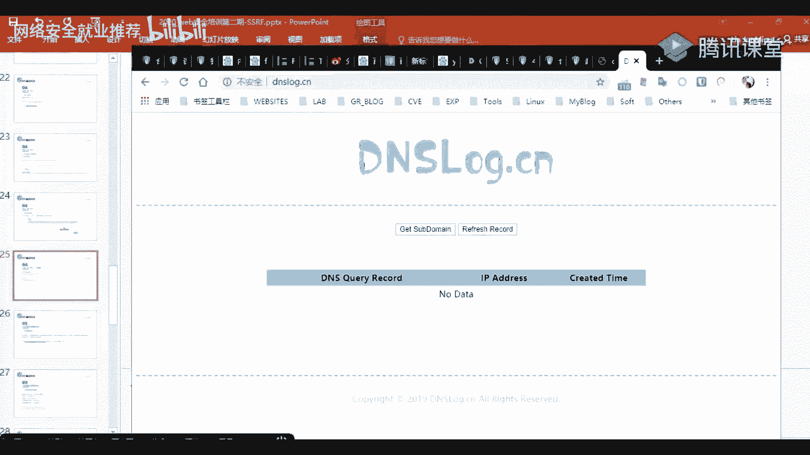

就是说我们访问我们这里。

正常的去访问这样子的一个网站对吧，比如说访问一个百度，访问这样子的一个百度，它是这样子，它有这样子的一个过程，就是说你在这里，浏览器访问了这个百度之后的话，它会首先在你本机，在你本机的一个dns。

也就是那个host那个host文件里面啊，你电脑电脑有没有，它都有这样子的一个host文件嘛，对吧，就是说他会在这个文件里面去查找，你这里的一个域名，它是否有这样子的一个ip的一个记录，如果有的话。

它就会啊解析到，他会去访问到指定的这样子的ip地址，然后的话把指定的一个ip地址的一个内容获取，获取下来对吧，如果说没有的话，他就会去像好公共的这种d s的一个服务器，去进行一个解析。

在dns服务器上面的话，它就是记录的好，域名以及ip的一个对应的一个表嘛对吧，它其实就是这样子的一个呃关系啊，关系表就是对应的一个表，就是域名跟ip的一个对应表，那我们再去公共的这种dns。

就这个dns服务器的这种表当中，去查找到指定的一个ip地址，然后然后的话再去请求这个ip地址，然后他就是有这样子的过程，然后在这里的话，我们就可以去使用到这样子的一个dns的一个logo。

因为我们首先会去像我们指定的这样子的一个，呃，就是指定的这一个啊域名对吧，做一个dns的一个解析对吧，这个dns解析的话，它就会有这样子的一个记录，所以说我们get一个sub，就是这样子的一个域名对吧。

然后的话我们嗯对它做一个请求。

在这里的话。

有那个8g的，这里在这里把鸡的话，是有这个无非钱的一个sr f，我们在这里的话，可以去，请求我们这里啊，首先的话先正常的一个来吧。

来一个正常的百度点com对吧，我们执行之后的话啊，我这里忘记改了，我这样的话是把代码做了一个改动，让他有了回血，就其实我在这里的话就是加了这个echo output。

就是把我们这里c l e x e c，获取到的一个内容的话，用echo把它输出来，然后我这里把它去掉的话，它就它虽然有请求了这样子的一个啊url对吧，然后的话同样的有内容，有内容获取获取了他的一个内容。

但是的话我们没有使用echo去把它输出，也就是说他没有这样子的一个回形，这样子的一个输出好，我们再测试了一下，可以看到这里的话是已经没有内容了，好在这里的话我们怎么去进行一个判断。

它是否对我们这里给定的这一个啊地址，进行了一个请求以及解析呢，是我们这我们可以使用这个dns slog，我们，然后去进行一个尝试，特色了之后的话，我们回来去看一下，刷新一下，刷新之后的话，可以看到。

在这的话有了这样子的一些请求的一个记录，对吧，我们可以在后面再加一点，加一点内容，我们去进行一个测试，这个时候的话刷新刷新之后的话，可以看到，在这里的话就返回了这样子的一个内容。

好我们可以通过这里来去进行一个判断，判断我们在这里的话，给定的这一个呃啊域名这样子的一个地址的话，啊，服务端它是对它做了一个正常的一个请求，虽然的话它这里的话是没有任何的一个内容，就是回形的。

也就是呃介绍两种，就是如何去测试这种没有回血的，这种sr r f的一些方法，然后然后本节课的话嗯，这样的话我看了一下时间的话又稍微有点晚了，这样的话剩下的一个内容的话，我们下节课再讲吧。

剩下的内容的话其实没有多少了，就是对我们的一个sr r f，它的一些性质如何去进行一个绕口，你们有什么样的一些知识以及方法，而去绕过服务端，对这样子的一些啊，就是说对这个s3 f漏洞。

他请求的这种啊地址啊以及链接它的一些性质，针对这些性质，我们可以采用什么样的一些方法，去进行一个绕过，这样的话我们下节课再给大家做一个介绍，然后这节课的话就到这里了啊，就下课之前的话，下课之前的话。

我在这里的话呃，就是布置三个课后作业，就说这三个实验，这三个实验的话，我们下节课会给大家去进行一个讲解，然后这里的话哦大家先去做一下，然后等会的话，我会把这个三个实验的话链接发到群里吧。

然后最后的话呃大家有什么啊问题吗，在这节课的话呃，主要的话就是介绍了一些就是理论吧，就是基础的一些理论吧，然后下节课的话，下节课的话主要的话就是操作，就是我们如何用这样子的一个ssr f手动。

然后的话嗯，利用我们的这样子的一个一些ur的一些协议，来去进行一个呃内网服务的一些攻击，利用比如说radias，还有呃struck two等等这样子的一些漏洞，大家有疑问吗。

就是说对于课程的一个内容的一问，而这节课主要的话就是介绍了sf漏洞，就是他是什么样子对吧，然的话这个漏洞的话它有什么样的一些场景，就是说我们可以通过什么样的一些功能功能点，就去查找什么样的一个功能。

能够查找到这样子的一个sf漏洞，然后的话就是呃在s漏洞，它的一个利用以及测试的时候，我们会去使用到的这样的值的几个协议。

就fire协议，go否协议，其实呃还有的话就说，大家如果发现了有这样子的一个sc漏洞的话，对吧，首先第一个的话就是你去测试一下它的，它支持的这种一二的这种协议，比如比如说在这里，如果说它是我的。

如果说它是使用的这种u2 ，ex e c的这样的函数对吧，去进行一个请求的，那么你可以去尝试它是否有支持这样子的一些，ur的协议，然后的话，如果说他支持这样子的一些幼儿的协议的话。

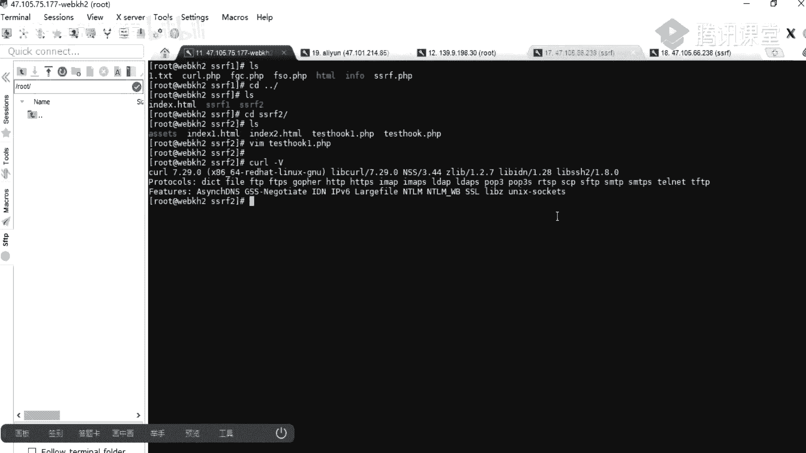

那么我们就可以去尝试使用这样子的一些协议，对指定的这样子的一些服务去进行一个攻击，利用，然后我看大家都没有什么问题啊，那么我们本节课的话就到这里结束了。

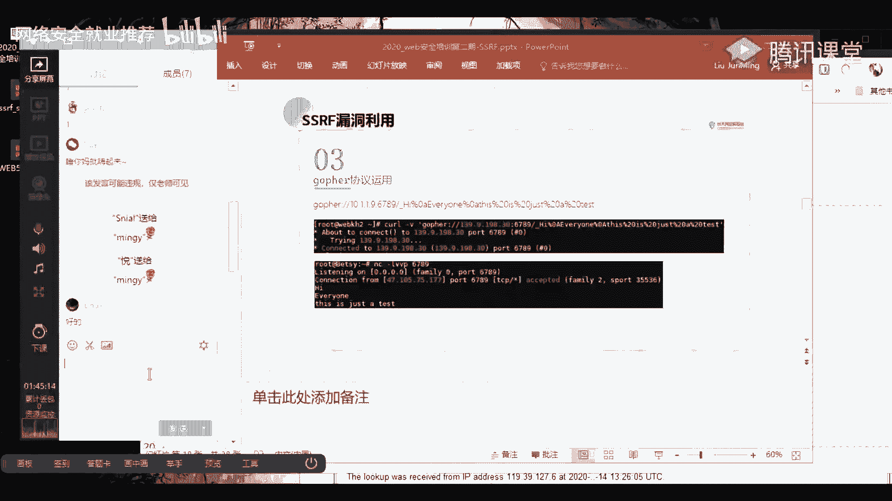

我们下节课再见。

好的，那么我们呃开始我们今天的一个课程内容，我在讲我们今天课程内容之前的话，我们先啊哦，一起来回顾一下我们上节课的一个内容，我们上节课的话是介绍了s s f这个漏洞，它的一个形成的一个原因。

以及介绍了它的一个作用，以及什么是一个s sf，就是这个服务端的一个请求伪造，大家要记住它是一个好，能够去穿越网络防火墙的一个通行证，我们可以利用这样子的一个一个s s f的一个，漏洞来去啊。

攻击我们原本是无法去访问到的，这种内网的一个服务，像包括radi啊，我们这节课会讲到的，以及还有其他的一些呃web的一些应用，这些应用的话啊通常会存在于一个内网当中，因为在内网当中的话。

我们是无法去直接的去访问到他的一个服务的，对吧，对，包括有防火墙以及有nt的这种网络地址转换，我们是无法去直接访问的，然后的话如果他的这种啊，一个企业或者说一个公司，他的这种外部的这种网站服务器对吧。

或者说他的一些啊提供的这种web，应用的一些功能点，它存在这样子的一个s sf漏洞，那么我们就可以利用它这样子的一个漏洞，来去攻击他的一些内网的一些服务，啊这个s5 它漏洞。

它形成的原因就是它没有对我们的这种啊，就是服务端提供的，从其他服务器应用获取数据的一个功能，没有对它做一个过滤以及限制，好的话，s5 它的危害的话就是啊，我们可以通过它去攻击内网的服务嘛。

然后的话通过一些url的一些协议，来去探测内网的一些信息，包括它的内网服务的一些端口啊，以及它的一些版本信息等等，他的话能够啊，就是对针对于在内网当中的这样的一些，含有漏洞的这种服务进行一个攻击。

来获取内网服务的一个web share，来直接进入它的一个内网去进行一个攻击利用，然后第三个的话就是通过一些幼儿的一些协议，能够去读取内部的一些资源，然后的话执行相应的一些攻击动作。

比如说这节课会讲到的一个，而攻击内网的一个未授权的一个radius，以及攻击内网的这种structure，这种啊，能够去进行一个远程命令执行的这种漏洞，然后的话就是介绍了如何去进行一个。

sf漏洞的一个寻找，也就是说这种漏洞，这个s漏洞它存在的一些场景，就是通过一些web的一些功能点，就这些web功能点的话，有比如说一个通过这种ui的地址的一个分享啊，网页的一个内容对吧。

他会去请求去请求远程的这种啊，服务器的一些内容，如果说他没有对这里的这个去其他服器，获取资源的这种啊功能去进行一个限制的话，那么我们可以去尝试啊，请求内网的这样的一些资源。

那他就是这种在线翻译的这种断点，这样的话呃像一般的这种比较大的这种呃翻译，比如说百度有道这种翻译的话，它是没有说存在这样子的一个road，它性质的话是啊十分的严格的。

然后的话就是通过电话地址加载下载图片，这个的话是我们经常会去啊看到的，也是会经常去碰到的这样的一些功能点，这样的话我们可以针对的，针对性的去对它做一个测试，那他就是啊一些我们去查找这样子的一个。

漏洞的时候，我们可以通过这样的一个url，它的一些关键字，因为我们再去查看请求包当中对吧，它会有很多的这样的一些参数，这个参数的话，我们可以就是啊，有针对性的去查找这样子的一些关键字，这些关键字的话。

它它的一个功能就是去获取，远去请求远程服务器的这种资源，的一个功能点对吧，那么他就可能会存在这样子的一个s，s f的一个漏洞，那这个号的话就是一个总结，总结的话其实就两点。

就是能够对外发起网络请求的一个地方好，第二个的话就是从远程服务器去请求资源，哦然后的话我们也介绍了就是s5 漏洞，它的一个利用就利用的话，主要的话就是我们碰到这样子的一个漏洞的时，候。

我们通过什么样子的一些这样的一些协议，来去进行一个测试，比如说第一个就是这个dictor，dictor的话，我们可以用用它来去探测啊，去探测目标服务器上的一个端口，以及它它的一个端口的一个存活。

以及它端口上面所运行的一个服，务的一个版本等等的这样的一些信息，然后第二个的话就是这个file协议，fia协议的话主要就是用于文件系统的一个啊，就是获取文件系统当中文件的一个内容。

然后第三个就是这个篝火协议，篝火协议也是我们常去使用到去进行一个啊，攻击内网服务，就是攻击内网当中含有漏洞的这种服务啊，用用它来去发送我们的这样子的一个攻击的。

一个payload来去攻击内网服务的一些漏洞，好接下来的话有介绍，就是说在ssr啊，不在菲律宾当中的话，有这样子的一些函数，能够导致这样子的一个s f漏洞，就说我们在进行一些这样子的一个啊。

功能点的一个测试，或者说是一个白盒的一个测试，对它的一个代码去进行一个审计的话，我们啊可以着重的去关注这样子的一些函数，可能第一个的话就是这个c l e x e c，它的这个函数。

它这个功能的话就是去啊，请求我们传我们传过去的一个url，然后的话把这个url的一个请求的一个内容，把它给返回，返回到我们的一个前端页面，然后的话我们可以啊，针对这样子的一个函数的话。

能够去使用这种dictor，还有file协议去进行一个文件的一个读取，还有端口的一个探测，然后的话就是这个file协议的话呃，就是注意一下，就是在windows进行时，系统里面的话。

就是我们啊都会有的这样子的两个文，就两个文件，我们可以用这样子这样子的，就是存在的两个文件来去进行一个测试，如果说你能够去读取到这样子的，两个文件内容的话，那么说明你能够去使用这样子的一个file协议。

来去读取啊，系统当中的一些敏感的一些文件，这个的话就是这个呃发get content这个函数，这个函数的话，主要就是用于文件的一个内容读取，就是说它的一个功，这个函数它的一个功能的话。

就是用于文件的一个读取，它也是啊，同样的可以去进行一个，就是对我们啊提供的这种url去进行一个请求，把他请求的一个内容返回给我们的一个页面，然后的话这里的这个函数的话，它的一个特别的一个地方的话。

就是我们可以使用这样子的一个ph p伪协议，来去读取这个网站里面的啊，这个网站里面的一个源代码，然后这这这这psp伪协议的话，其实在我们的这种cctf题目当中，这种web题目当中的话是很常见的。

好的话还有就是像s s r f这种啊，攻击radir这种，这种形式的一些题目也是存在的，好第三个的话就是这个f socks建立这种socket，socket的一个网络连接。

主要的话是去对我们给给出来的这种ip，以及域名去进行一个请求，然后的话前面的话主要就是啊介绍了，就是说啊常见的这种有回旋的说他有啊，我们可以通过这样子的一些协议来去啊，去进行一个测试。

测试它是否支持这样的一个协议，主要的话就是通过查看页面上面啊，它使用这样的一个协议，比如说读取文件的一个内容对吧，好的话，他会在页面上有这样子的一个显示，这个的话就是有回血的。

一个就是basic的一个s3 f，然后还有的话一种情况的话，就是说服务端它不会对你给定的这个url啊，他请求之后的一个内容，给你呈现到一个前端的一个页面，所以的话它是啊我们无法去通过啊。

在前端的一个页面上面去查找返回的一个内容，来去验证是否存在这样的这样子的一个漏洞的，所以说我们可以通过这样子的两种方法，第一个的话就是这种htb的一个带外通道，主要的话就是bp里面的话。

它有这样子的一个自带的一个功能，那样的话你也可以使用你自己的一个，官网的一个服务器对吧，你可以通过今天你的一个官网服务器的一个呃，外表日志来去查看它是否有就是请求。

就是远程去请求我们的服务器上面的一个资源，然后的话就是这种dns log这样子的一个平台，就通过啊dns的一个日志来去进行一个判断，啊下面的话就是呃我们上节课没有去啊，没有来得及讲的一个内容。

进这里的话我们继续嗯，首先的话就是这个sf漏洞，它利用的一个限制logo，就是我们如果查找到这样子的一个s s r漏洞，对吧，他不可能是说啊，就是他可能会对我们访问的。

或者说给定的这种url有相应的一些性质，安的话这一些限制的话，我们可以通过这样子的一些方法来去进行，一个绕过，首先第一个的话就是嗯，我们看一下这里的一个例子，这个例子的话我们啊可以看到在这里的话是啊。

百度点com，后面的话我们接了一个art符号，art符号后面的话，接接了我们的这样子的一个内网的一个ip对吧，或者说其他的一个ip，然后其实这样子的一个一二的话，你实际去进行一个访问的话，它其实是啊啊。

实际上去解析到的一个ip地址的话，是这一个是我们在at符号后面所接的，这样子的一个i p，我们可以在浏览器上面去进一个尝试对吧。

我在这里是啊，我们还点lab。com对吧，我在后面接一个at符号，后面的话接我的内网的一个ip，比如说292。168。一点，我然后回车对吧，回车之后的话，你你可以发现它实际解析到的。

就是说访问到了这样子的一个ip的话，是我们的这一个内网的这一个192。16，8。1。52的这样的一个i p对吧，就是之前的话是这样子的一个网站，好的话我们可以通过这样子啊。

就是他对我们的这样子的一个url对吧，有这样子的一个就是啊域名的这种限制，然后你可能他实际的去进行一个啊解析的时候，它实际的话是解析到了这样子的一个，内网的一个ip，而不是我们在这里好。

可以直接去看到的这样子的一个，百度点com的这样子的一个域名，那这样的话就是这个ip地址转换进制，这个的话我们看一下，就比如说我这里的这样子的一个192。16，八点点一这样子一个ip地址。

我们可以把它改写成这样子的，一些进制的一个形式，首先比如说一个八进制，八进制字形式的话，就是像这样子，然后就还有的话就是啊16进制，16进制的话是以这样子的一个0x结尾啊，不开头的这样子的一个字符啊。

我们其实，这里防不到，我们可以用这样子的一个在线的一个工具，去进行一个转换，首先比如说我们在这里啊，我们的一个ip的话是一个，顶分十进制对吧，比如说我是192。168，顶一顶五，哎我这里复制不了啊。

因为我，之前的那个电脑。

我这里是换了个新电脑，就之前的那个电脑，昨天下雨的时候被拧坏了，拧拧短路了，然后用不了了。

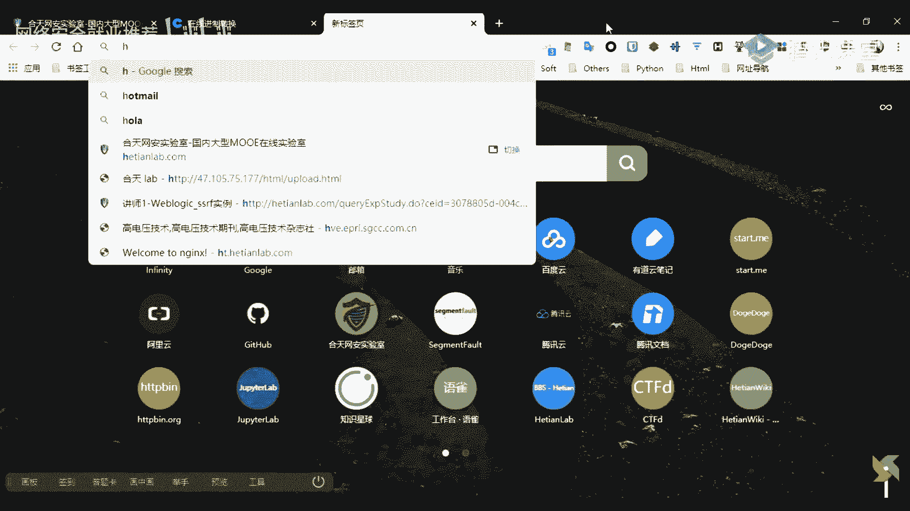

好现在正在修，所以的话，这里的这一个office的话，他没有激活，它用不了复制的一个功能，我这里的话敲一下吧，啊我用他的这样子的一个功能，能够把我们的这样子的一个ip地址，转换成一个就是数字。

就转换成一个静止，我们这里转换之后的话是这样子，然后他你看着这样子的话，是一个字符串对吧对吧。

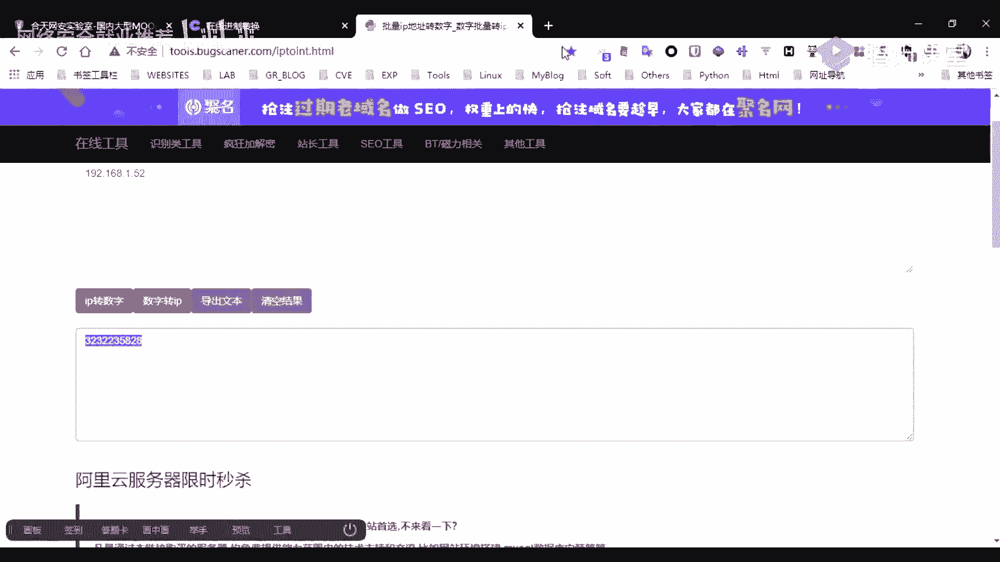

就是一个一个平平无奇的一个字符啊，把一个数字组成了一个啊，就一串数字对吧，但是的话我们在这里可以看到我在这里的话，我输入到浏览器当中对吧，那这里的话因为这里的话有记录。

他直接的话就解析成为了这样子的一个。

我这里的一个内网的一个ip，我这里的话重新换一个吧，2020，然后我进行。

然后我回车，可以看到我在这里的话呃，我去把它当成一个就是一个ip地址，去进行一个访问对吧，当成一个幺幺去访问我这里访问招的话，可以看到它就是会去自动的去解析，为我们的这样子的一个顶分十进制的。

这样子的一个ip地址。

然后我们可以通过这样子的一个方式来去，就是绕过好绕过服务端，它对我们的这种ip地址的这样子的一个性质，对啊，我们可以通过这样子的一个啊进制的一个形式，来去啊，进行一个logo，而第三个的话就是添加端口。

就可能绕过它的一个正则的一个匹配，就是说我们呃服务端，如果说它是采用了这种正则匹配的一个方式，来去过滤我们所传递的这样子的一个url的话，我们可以啊，有可能就是说通过添加这样子的一个啊端口。

就是说比如说添加一个八零端口，来去绕过它的一个正则的一个匹配，啊这个的话是啊。

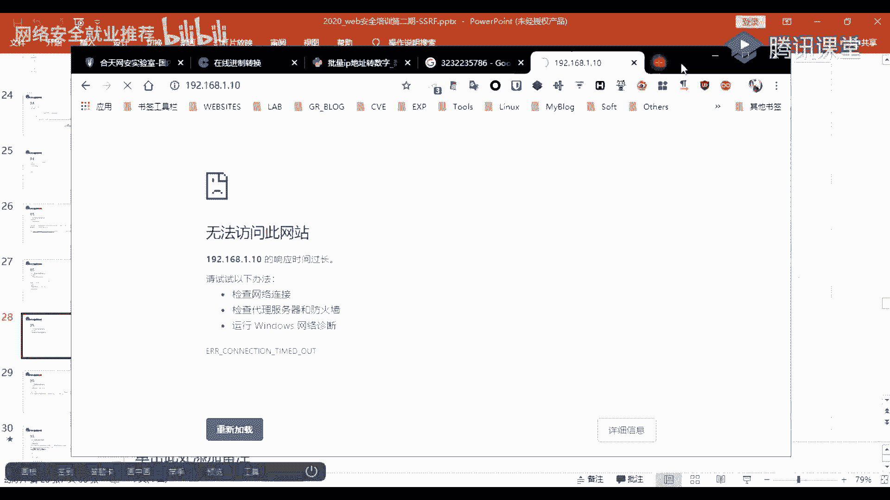

是那个就是乌云上面的一个按钮啊，就大家大家啊，有知道乌云吗，应该都听过吧，然后的话就是呃因为无源的话。

现在是呃网站关了嘛，就是啊我们有这样子的一些网站，就是啊婺源的那些网站的话，里面有很多的以前的那些大佬，他们啊挖掘漏洞的这样子的一些，详细的一个过程。

然后的话呃我们可以通过这样子的一些网站，就说他有啊物源的这种历史的一个漏洞，就别人搭的一这样子的一个网站，我们其实可以在这里面的话啊，能够去学习到，就是说因为现在的话这个网络安全的。

就是网络安全法的这种性质，就有很多的这样子的一些内容，或者说就是漏洞的一些细节内容的话，是否能不能去公开的披露的对啊，所以的话呃其实有很多的这种就去啊，去直接去学习的这种知识的话。

你可能自己的话比较难的去看到，所以的话我们其实可以去查查找，就是以前的他们的这种啊，漏洞利用的一些思路对吧，他这里的话啊有写的很详细，就就是我们就是提交的，他其实就是一个提交的一个那个漏洞报告嘛，对吧。

就是你发现这个漏洞的话，它的一个过程，这样的话我们可以去查找，我们想要去了解这种，比如说c s s s r f对吧，像这种呃，它里面还有这种脚本对吧，这种探测指定端口的这种脚本。

我们用可以用这样子的一个脚本去探测啊，用这个sf漏洞去探测它的一个内网的一个ip，的一个存活对吧，像6379的话，就是啊release的一个端口嘛对吧，能够探测到它内网的这种ip有哪。

有哪些ip有这样子的一个6379，如果说它其中存，正好存在这样子的一个未授权对吧，那么我们可以利用它，利用他的这样子的一个呃内网的这种服务，来对它进行一个攻击，然后的话还有其他的话。

我这里的话就呃有很多的这种记录，大家可以去学习一下呃，大佬的这种这种姿势，然后第四个的话就是这个呃，这样子的一个就是域名，这个域名的话是，它它的一个特点的话就是啊这个是别人给啊。

就是别人做的这样子的一个服务，这个服务的话就是啊，我们访问这个网站的一个子域名的时候，比如说我们啊访问的是这样子的，一个192。168点点一，这样子的一个子域名，而我们访问这样子的一个主域名的话。

它会自动的去重定向到我们的这样子的，一个i p，我们可以来尝试一下。

比如说我啊访问一下我的这个对吧。

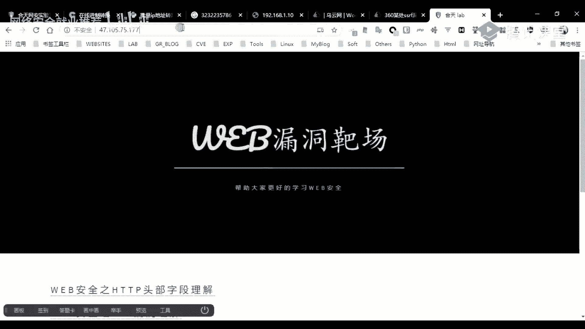

访问这一个我们把把记得这样子的一个ip，然的话我在后面接我们的一个xp。io，这样子的一个啊域名对吧，而我们其实在这里的话，其实可以看到我们这里的话，相当于是这一个域名对吧，这个x i d。

o这个域名的一个值域。

然后的话我们去进行一个访问，访问之后的话可以看到它虽然这里是访问的。

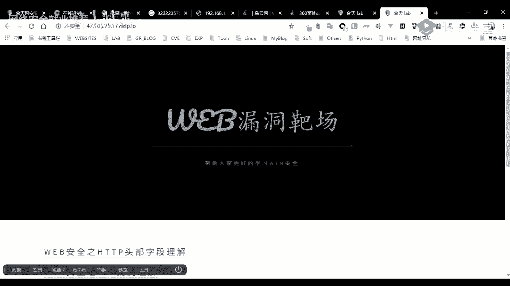

是这样子的一个i p对吧好吧，这样子的一个域名有一个值域，但是我们实际访问到能够去访问到的，这样子的一个内容的话，是我们在这里的一个啊给定的这个域名，或者是说ip的这样子的一个内容。

这个呢这个的话就是这个啊域名的一个作用。

然的话像这个name。

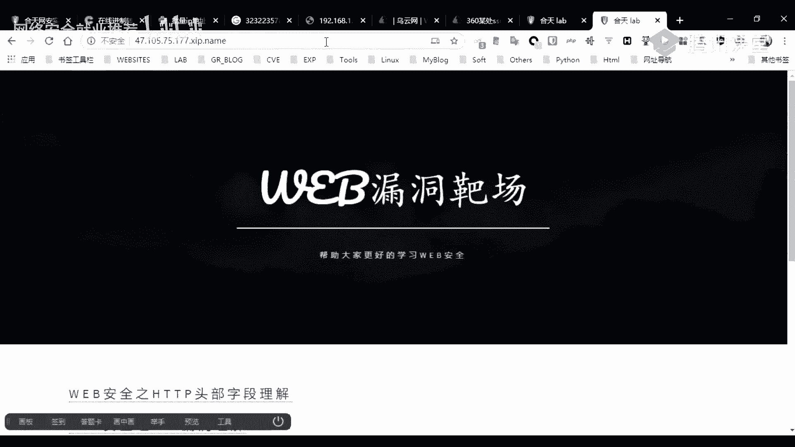

也是可以的，这个的话呃。

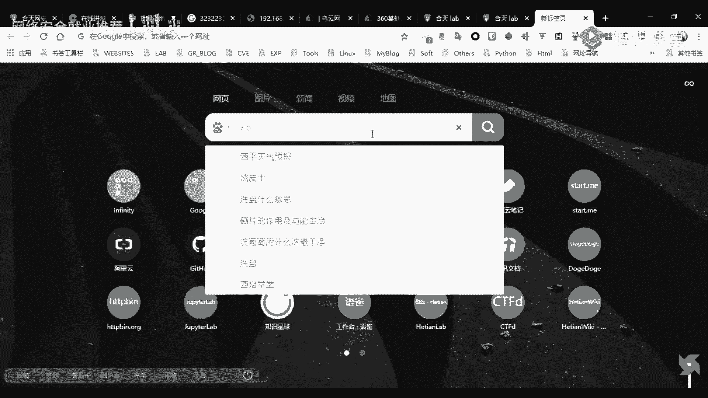

还有这个，呃这个是一个开源的，是别人，是有这样子的一个项目，它其实是一个这样子的一个电的一个重定向，就是说它这个域名的话，它其实设置好了，就我们在前面啊加的这样的指的一个值域的话，呃。

它会重定向到我们这里的，加的这里的一个内容。

这个的话呃这个是它的一个网站，还得换一个点name，这样的话我就不一的去看，这个话是呃比较有意思的一个东西啊，然后第五个的话就是这个短地址的一个绕绕过，就说呃我们有一些ip地址对吧。

ip地址因为我们的一个ip地址，正常的ip地址都是啊，这点分十进制这样子的一个格式对吧，我们可以有针对性的去对这种ip地址，进行一个过滤，好的话，我们可以通过使用这样子的一个短地址。

就有这样子的一些啊短地址，就当你们大家应该也有碰到，像比如说有微博啊，百度还有这样子的一些短地址的一些服务。

啊微博像新浪的这种短地址对吧，比如说我这里啊，除了一个ip。

除了这样子的一个ip，我们可以和这里的话，可以选择这样子的一些短域名，比如说我选择这个dw点之一顶分对吧，我们可以，应急不正确。

我随便找一个域名吧，换一个这个。

tm，诶我反问不了了呢。

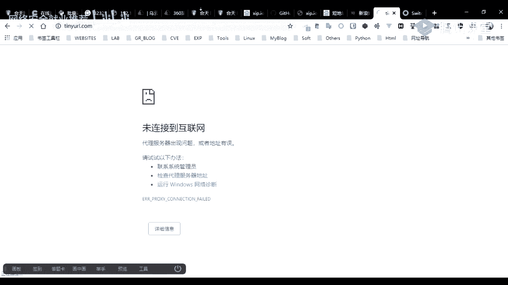

哎我这个。

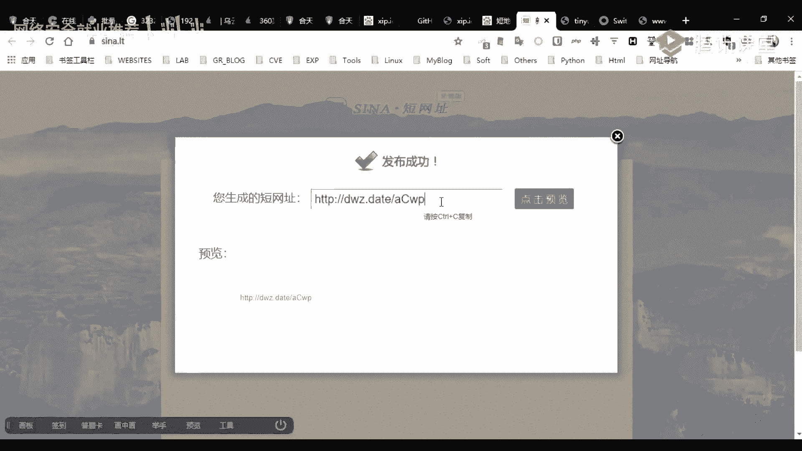

算了就就这个吧。

这代理我这个代理没有配了，我刚刚才弄的，要翻墙的吗，这个怎么样，行吧，我们就用这一个服务吧，就这里的话我们可以看到它，这里的话把我们刚刚的那个呃链接对吧，把它给缩短成了这样子的一个短地址，好的话。

我们可以通过这样子的一个短地址来去访问，来去访问到我们的这样子的一个域名，这样子的一个就是你想要去访问的，这样子的一个域名，然后我们可以通就通过这样子的一个方式，来去进行一个绕过，然后第六个的话就是呃。

利用这样子的一个句号的一个形式，就我们其实可以就是我们常见的这种ip对吧，它是通过这样子的一个点来去进行一个分隔的，好的话，我们可以通过利用这样子的一个句号的，一个风格的一个形式。

我们可以看一下，就是我这里要访问一个啊，就访问这个吧，我把它改为一个句号，就把它的一个点，对就是这样子的一个。

就是这样子的一个形式，这样子的一个ip形式对。

然后我们直接去访问的话，它其实它同样的会去跳转，然后这样子的一个啊域名，它其实是跟好我们这样子的一个ip是相等的，比如说327，比如说我访问这一个127点点零点对吧，好我们啊访问之后的话。

其实他在，其他在我们浏览器里面去进行一个解析的时候，它实际的话是去访问的，是这样子的一个i p对吧，我们可以通过这样子的一个构造的这种形式来，去，就是啊就是去混淆它的这种格式嘛。

啊就他如果说他过滤的是啊，通过这样子的一个啊点去进行一个分隔对吧，就像我们之前讲那个呃将命令执行的时候对吧，就是他他通过这样子的一个用，点去进行一个分割，然后的话给它分隔成为一个呃部分。

分为分割成为四个部分，好的话，一一的去对它做一个判断来证。

来证明他是一个正常的一个i p。

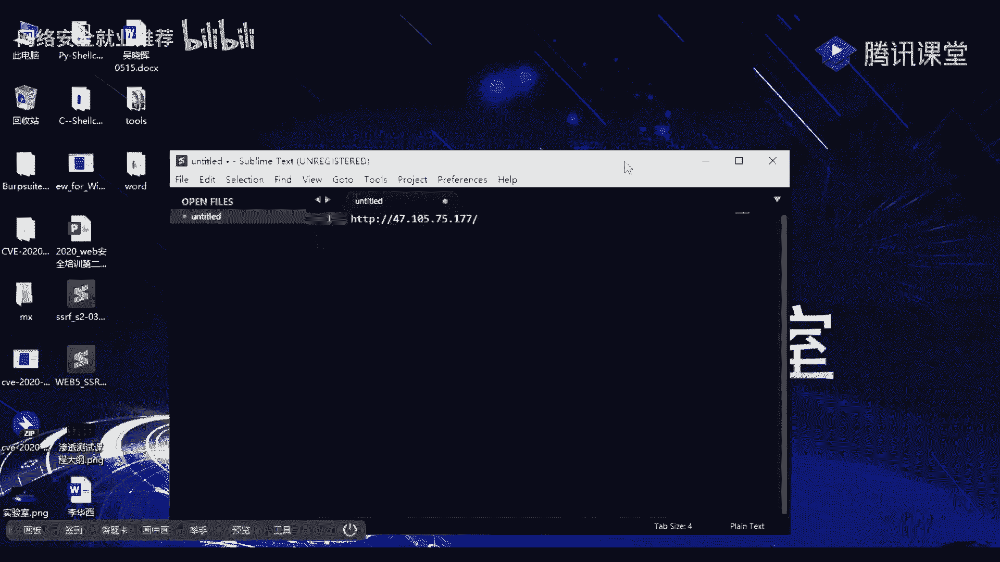

那么的话这里的话我们可以通过这样子的一个，构造的这种形式来去进行一个绕过，以上的话就是针对这样子的一些，就是好分享给大家，这样子的一些绕过限制的这样子的一些知识啊，有些的话其实还是比较有意思的。

那下面的话我们来了解一下，就是这个漏洞的一个防御，就防御的话嗯，其实我们从前面的话也大，基基本上大概都有对他有了一个了解对吧，所以第一个的话就是过滤他的一个返回信息，对吧，就我们我们不让。

就是说我们的这样子的一些请求的一个资源，或者说啊这一些不合法的这种请求的话，它的一个返回信息是啊，就是它里面包含有这样子的一些敏感的，一些信息对吧，那么我们对他的这样这样子的一些反馈的。

一些信息做一个过滤，那就不允许他去进行一个返回，就如果包含有这样子的一些敏感信息的话啊，第二个就是统一这样的一个错误信息，就有些呃它的一个请求我们可以通过啊，就是如果说你能够去访问到的话。

它不会有显示内容，但是的话呃我们可以通过判断，就是说它有这样子的一些状态吗，或者说有这样子的一个tree或者force，又如果你访问成功了，他就会有一个去访问失败了，他会有一个force。

我们其实也可以通过这样子的一个形式，就是说它的一个响应的一个状态，来去判断你的这样的一个请求是否成功了，第三的话就是啊性质它紧缺的一个端口，就会采用的这种端口，就我们常用的就是hp的话，就是八零嘛。

还有8080等等的这样子，这样子的一些端口嘛，还有其他的一些，比如说呃其他的一些22呀，3306啊，这种端口的话就不允许它进行一个访问，而第四个的话就是呃更严格的这种，对我们的一个内网的一个名单，好不。

内网的一个ip设置，这样子的一个黑名单，就只允许允许这样子的一个i p，去进行一个呃访问，然后第五个的话就是尽量不需要的这种协议，就只允许中htp啊，还有htp的这种请求，就我们前面的话有去说到。

就是像这种firework，还有dict这种协议的话，能够去进行一些信息的一些探测是吧，然后的话我们可以通过禁用它的，这样子的一些协议，就是不允许他去使用这样子的一个协议，好。

最后的话对我们前面的一个内容，做一个基本的一个总结，其实就是这样子的一张图，就前面的话我们也讲了，就是啊这个漏洞的一个产生对吧，大s4 好，不在p h p当中啊，我们需要去关注这样子的一些函数。

这样子子的几个函数，是容易导致这样子的一个漏洞的，然后的话就是对它的一个利用，就是说这样子的一些协议，然后攻击的话就是我们能够去进行一个攻击的，这样子的一些应用，比如说radius discuss。

一次盖子的话，其实它其实也也存在，有这样子的一个sf的一些漏洞的，好的话，还有的话就是这个faster cgi等等的，这样子指的一些内网的一些应用，我们都可以通过这样子的一个s漏洞，去进行一个利用。

攻击，好的话就是啊对于这个漏漏洞的一个防御，以及一些绕过的一些方法，这个的话就是呃我们上节课就是啊，我上节课发给大家的这样子的三个实验，这三个实验的话大家有没有去进行一个预习呢，就有没有去做。

啊我这里的话是啊，有收到两位同学的这样子的一个作业，我看了一下的话，我看了一下的话，都做的挺好的，啊对于这啊，对于这一个课程的，就前面我讲的这个课程内容的话，大家有没有什么疑问。

然后还有的话就是这三个实验，大家有没有什么疑问，需不需要我去啊，给大家做一个讲解，大家都没有没有问题吗，第二个实验自动连接，需要第二个实验是吧，第二个的话是这个。

第二个你说的这个定时任务的话，应该是这个radio吧，是这个release的这个实验吧。

就是啊你说的是这个第二，这里的第二个是吧，就这个radi这句话我给大家，讲一下吧，然后这里的话呃，也是本来就准备给大家去做一个讲解的，就是说这个的话，我就比较常见的这样的一个案例，就是说通过s2 。

s pro中去攻击我们的内网的这种radio，好在你的一个实验的话，我先建一个机器，这样的话前面的话应该没有什么问题啊，前面的话我在课上的话都有讲过了。

然后这里的话呃。

就这一个靶场的话，其实跟我们这里的话是啊一样的，有类似的，前面的话应该没有什么问题，就通过这样子的一个s漏洞对吧，我们测试测试的话，它存在这样子的一个s s r f，好的话。

我们通过这样子的一些就是啊去发包，去请求我们的一些端口对吧，我们指定的这种端口，比如说22号端口和其他的一些端口，如果说它存在这样子的。

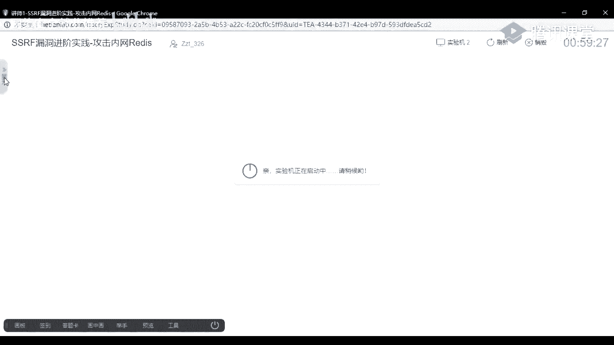

比如说这这些端口存活的话，那么它就会有返回这样子的，一个200的这样子的一个状态嘛对吧，如果说他啊，如果说他这个端口它没有存活的话，它它的一个响应的话是会啊，就是会比较慢的。

因为他要去请求这样子的一个端口，然后的话与这一个端口建立这样子的一个连接，如果他没有端口的一个存活的话，它会它的一个响应的一个时间的话会比较长，呃前面的话就是，前面的话就是一个环境的一个搭建阵容的话。

我没有怎么讲的啊，你的你的一个问题的话，应该是在这里在这里对吧，就说这一个啊，ladies反弹需要的这样子的一个batch脚本对吗。

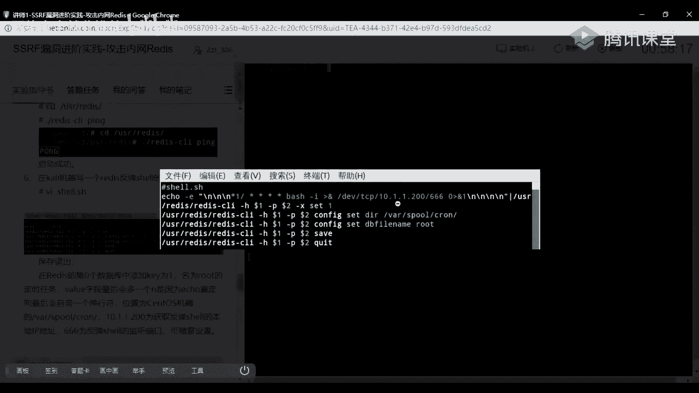

就是说你不知道啊，你对这一块不是很很很理解。

哦是吗。

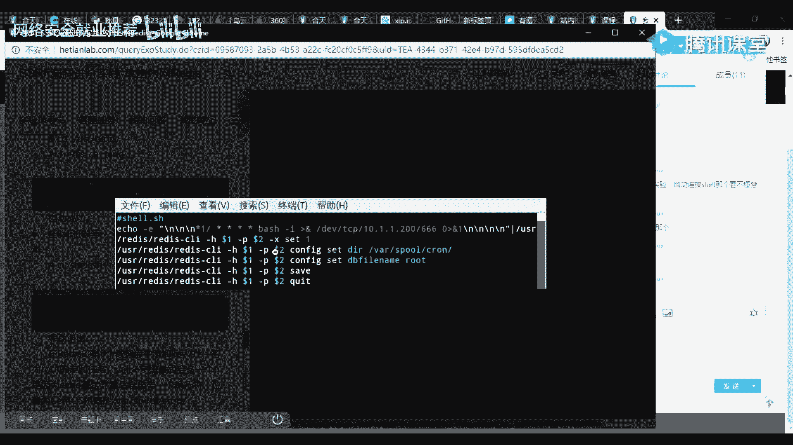

是的吧，那呃我这样的话给大家做一个就是介绍，这样的话呃，其实我准备了这样子的一个笔记，待会的话可以发给大家，这样的话就是呃我们先来看一下，这个radiv社群来进行利用这这样子的一个release。

未授权去进行一个攻击的一个反弹，需要的一个脚本，对他的一个脚本的话，就像这样子，首先这里的话我们可以看一下对echo杠一echo的话，其实就是呃把我们的这里的一个内容对吧，就是主要的话就是一个管道符。

这个管道符的话就是把我们前面的一个内容，单单作为这里的后面的一个呃输输入对吧，这里前面echo的一个意思的话，就是就是把我们的这里那个内容输出来嘛对吧，输出来的话，这里的话把它作为了一个输入。

然后这里的话就是这个release videos客户端，这个是ci这个video的一个客户端，然后它的一个命令的话，就是是这样子的一个形式，杠h后面的话是接我们的一个，就是你要连接的这样子的一个。

release服务器的一个i p好，干p的话，就是我们你们就是我们要去连接的，release服务的一个端口，默认不默认，一般的话是一个6379的一个端口，然后杠x后面的话接的set 1，那你的意思的话。

就是把我们的就是在我们的这个radio，就是前面的是连接，连接到这样子的一个radio服务器对吧，连接之后的话执行这样子的一个命令set 1，然后这里sert一的话。

就是在我们的这个release数据库当中，添加一个这样的一个key值，然后这个key也就是静嘛，就是它是一个净值啊，对的这样子的一个数据库，就一个键的话存储这样子的一个值。

然后的话这里的话是把我们就是添加这样子的，一个喂啊，添加这样子的一个e的一个key，然后它的一个值的话就是我们这里的一个啊值，而这里的一个值的话其实就是一个定时任务，就嗯时任务的话。

这里的话啊大家可以去自己去百度1下吧，就是说这里的话是一个念历史上面的一个电池，任务的一个写法，就是前面的话是一个啊，这也是一个分分钟啊，就是最小的一个单位，它是一个，啊就是我们啊你定时嘛，电池的话。

你需要设置这样子的一个时间对吧，就是秒多少秒来执行一次，然后多少分多少。

就是啊月啊，还有零啊，就是呃再百度1下。

on table是linux里面的一个定时任务的一个命令，这样的话我们可以看一下，这里就默认的话它是这样子的一个格式，就是啊它默认的话是这样子的一个格式嘛，就是新新新新。

然后分别代表的话就是我们的一个啊，分钟多少分钟，0~59分钟对吧，然后多少小时啊，多少天多少月，啊这个是，没有week是多少周吗，就隔隔多少周，隔多少周去啊，执行一次。

然后后面的话是接我们执行的一个命令啊，这里有个user name的话，就是我们以什么样子的一个，用户去进行一个执行，这样的话可以省略，然后后面的话是接我们的执行的一个命令，然后我们回来去看一下。

这里回来之后的话，我们可以看到这里的话，其实就是我们前面有说到的，这个bush的反弹命令对吧，通过白雪的这样子的一个方式，来反弹这样的一个shell，来去迎接我们这样子的一个，指定的一个ip以及端口。

这样的话是呃，写的是127这个幺七点点零这个端口，然后这里的话前面这里的一个杠n，杠n的话就是一个呃换行，就像我们呃，实验。

在这里我们看一下，就是在这里在这里我们可以看一下，这里的话就是他执行这个需要之后对吧，我们其实可以看到在这里执行之后的话，它传递的这样的一个数据是这里嘛对吧，而这样的话其实它有这样子的三个换行。

三个空行就是我们前面的一个杠n杠。

而后面的话是会有四个，啊这你要注意的一个点就是，这里它会有多多一个干员多的一个概念的话，是，因为我们的一个echo端口，去进行一个这样子的一个重电量的话，它会自动的去添加。

就是它会默认的会带有这样子的一个换行符，然后后面的话就是我们通过这个release的一个，客户端的这样子的一个啊命令去啊，去执行我们的这样子的一个啊设置，这样的话就是连接我们的这个radius服务器。

然后的话执行这样子的一个命令，执行命令的话就是设置我们的一个目录，就是我们的一个工作的一个目录。

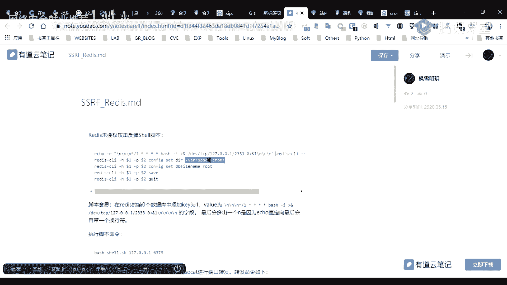

是这一个目录，而这个目录的话就是我们的一个定时任务，所在的一个目录啊，我去服务器上面看，也就是这个rutable啊，这样的话暂时没有这样子的一个定时任务，就是给root的root用户的。

然后我们可以去wbg这个目录下面去看一下，这里的话是啊，他是现在的话。

因为没有定时任务嘛，所以的话它里面的话是没有文件的，而这样的话我们设置这样子的一个目录。

然后下一个的话就是设置我们的一个文件，的一个名字是一个root，然后这里的话note的意思的话，等于就是我们会啊，在这里它会有去创建这样子的一个啊，就是我们在我们当前的一个工作目录下面的话。

会生成这样子的一个root，用root文件啊，这个root文件的话，它的一个内容，内容内容的话就是我们保存，这样的话是保存就保存我们上面啊，执行的这样子的一个命令，把我们的一个啊内容给写到了这一个啊。

key为一的一个值，然后保存之后退出，然后保存之后的话，他就会去进行一个啊执行，这样的话是v底的一个特性，就是它通过这样的人格命令他们执行，我们就在我们的这个指定的一个目录下面，生成这样子的一个文件名。

而这里的一个文件名的话，就是我们这里啊设置的这里的一个值，把我们的值保存到了我们这样子的一个文件，然后保存到这个文件的话，等于就是我们在服务器上面，新建了这样子的一个啊，新建了这样子的一个定时任务。

而这个定时任务的话，就是我们这里隔一分钟之后，就每一分钟他都会执行一次，每隔一分钟它会执行这样子的一个命令，就是弹一个shell，谈到我们指定的一个ip端口，因为就是这个电池任务的一个呃。

电池任务的一个解释，这句话大家啊理解了吗。

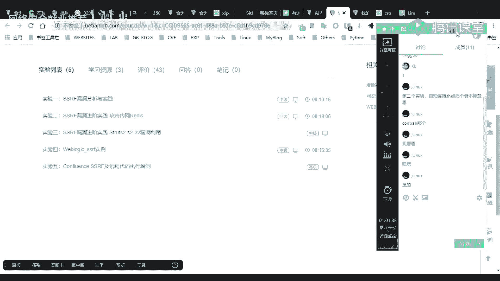

能明白吗，不明白的话呃，说一下哪里不明白，好然后的话还有其他的一些问题吗，这个的话应该是呃，就步骤的话已经写得很很详细了，大家还有其他的一个问题吗。

都都没有问题了吗，我把这个呃文档发群里吧，我这句话应该写的比较详细呃，呃这样的话是我之前的一个笔记啊，时间的话可能不对，就是我我直接从我之前那个笔记上面，摘摘下来的，然后这个的话应该没有啊。

大家有没有什么问题啊，要不要我讲一下，下面要写进radio，我们的这样子的一个密钥不是不是写到了radio，而是而是我们通过这个radio对吧。

它能够去进行这样子的一个写文件的一个操作。

然后他写的话，他是会把它写到了那个我们的就是，我们的一个ssh有这样子的啊，不知道大家有知不知道，就是免密登录啊，就是我们登录这样子的一个linux服务器，我们要登录的话是要要输密码吗对吧。

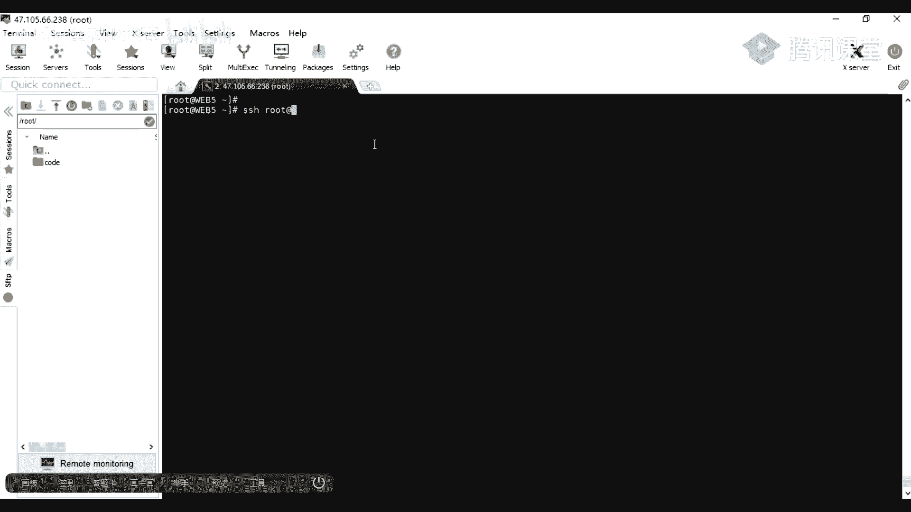

如果说你的这个密码你输，你看这这样子的一个密码。

你是啊设置的比较复杂对吧，比较复杂的话，你都记不住嘛，所以的话我们可以通过设置这样子，这样子的一个免密登录名，密登录的话，因为s s g它是呃，那前面一个连接你中间的这种数据的话，它是经过加密的。

经过加密的话，我们想要就是客户端和服务端，也就是说我们的一个机器要去隐密的去迎接，我们的一个服务端，好连接我们的一个服务器的话，我们需要生成这样子的一个密钥以及供样，这是生成错的一个生成的一个方法。

那就是s曲线，t g，利用这样子的一个工具来生成我们的一个密码，好干，t后面的话是接我们的一个呃加密的一个方式，一般的话是rsa的一个方式，嗯r s a，然后的话它会保存在这样子的一个目录。

默认的话是在这这样子的一个目录下面，我们这样的话直接回车，然后需要你输入一个密码，这个密码的话就是啊，可以是一个比较简单的一个密码，因为就是说当然的话你也可以不输，如果你不输的话，就是说啊。

比如说某个人，他使用了你的这样子的一个电脑对吧，然后的话他就能够去不需要使用密码，使用任何密码的一个方式去进行一个连接，这样子的一个机器，然后我这里的话就不设密码，就回车回车就可以了，回车回车之后的话。

我们可以去这个目录下面查看一下，打开之后的话可以看到它，这样的话会生成这样子的两个文件，就一个的话是一个i d i s a，这样子的一个文件对吧，这个的话就是啊写入的是我们的一个私钥。

这个私钥的话就是在我们的一个服务端好吧，在我们的一个就是我们想要去连接啊，其他服务器的这样子的一个密钥。

我可以看一下。

另外就是这样子的一串值，它是使用i sa的一个方式进行了一个加，然后的话还有一个公钥，开始点public，它是这样子的一串值这一串公钥的话，内串公钥的话，我们可以就是啊。

把它发给你想要去隐密登录的那个机器。

就把这一串直，然后这里的话这里的话那个实验的话呃。

是哪一个实验。

真香了，是那个，是哪个实验，我就是就是这一个是吧，在后面是吧，这一个吧，这个呃攻击strike to的，对这个这个这个weblogic的这个s sp的一个漏洞。

这个算是web logic的这个啊它自带的啊，它自身就有的这样子这个漏洞，然后他这句话是用到的这样子，他的这样子的一个功能点，我们可以通过这样子的，在这里传我们的内网的一个ip，来去对它做一个探测。

而且他而且的话他是一个有回血的，然后在这里的话主要是这里，这里的话我们通过前面的这样子的一个利用，前面的话主要的话是看这里啊，就我们前面应该比较详细啊，就介绍了这一个c i。

c i l f的这样子的一个注入啊，这个c i l f注入，需不需不需要大概的给大家说一下呢。

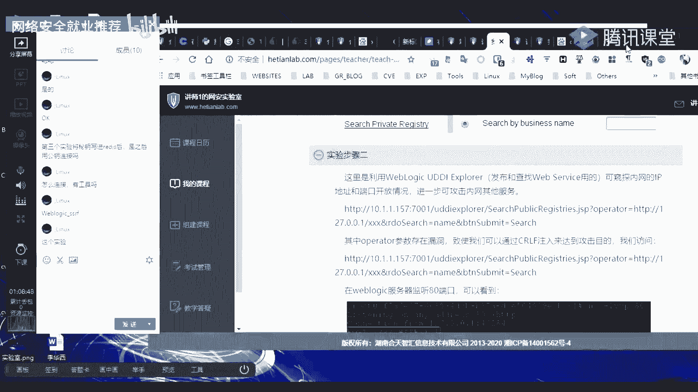

就这样的话，大家有理解吗，我大概说一下吧，就这一个c i l f的一个漏洞的话，就是这个c r l f的话，就是我们的一个回车换行，就cr的话就是回车嘛，lf的话就是换行，然后大家回想一下。

就是我们之前在讲http的一个啊请求头，就是他的一个字段的时候有给大家说过对吧，就大家回想一下那张图嘛，就是说每一个这种我们的一个htp的一个，请求头当中的话啊，啊每一个啊请求头部它的一个字段。

它的最后都有这样子的一个c r l f，这样子的一个呃字符，然后这个字符的话就是一个回车换行，好在这里的话我们怎么去进行一个利用呢，就是我们可以通过这个cf，然后这里的话其实就是呃回车的话。

就是这个它的一个url编码的话就是0%d，然后呃矿产的话就是0%a，他是一个ur l的一个兵马，然后我们可以通过这样子的一个0%d，0%a来构造这样子的一个回车换行，然后他这里的一个漏洞的话。

就是我们在这里能够去通过这样子的一个，0%d 0%a这样的一个方式，因为我们前面有说到，就是它的一个字段，它是以这样子的一个方式结尾的，就说明是前面的一个字段的话，它的一个内容的话是已经结束了。

然后后面的话就是新的一个字段，然后我们可以通过在这里的话输啊，构造这样子的一个cf来，就是把我们重新再构造另外一只另外的一个呃，呃另外的一个请求逃亡，就我们其实可以在这里看到。

就我们在这里通过发送这样子访问，这样子的一个请求包对吧，访问到这里的一个端口之后的话，我们通过它的一个响应，好吧，通过他的一个请求过，能够知道它是发送了，就是他请求的是一个啊post的请求嘛。

然后他访请求的是这样一个xs的一个内容，然后的话主要的话看看这里，这里有一个host 3 w点，百度点com这样子的一个啊字段啊，其实这个字段的话，其实是在我们原本的一个请求头，它是没有的啊。

是我们通过这样子的一个构造来啊，添加的这样子的一个啊，就是注入了这样子的一个呃请求头，啊到了后面的话就是说因为他是这一个参数，存在这样子的一个cf的一个注入嘛，啊我们可以在这里。

在这里通过他的这样子的一个cf的一个注入，来发送我们的啊，这样子的一些数据包给我们的一个radio，给我们的这里这个release的一个服务器，然后发送的这个数据包的话就是这里的一串。

这里这里这一串的话我们可以看到就是set test，set test的话就是创建了这样子的一个，test的一个key嘛对吧，然后它的一个值的话就是这里的一串。

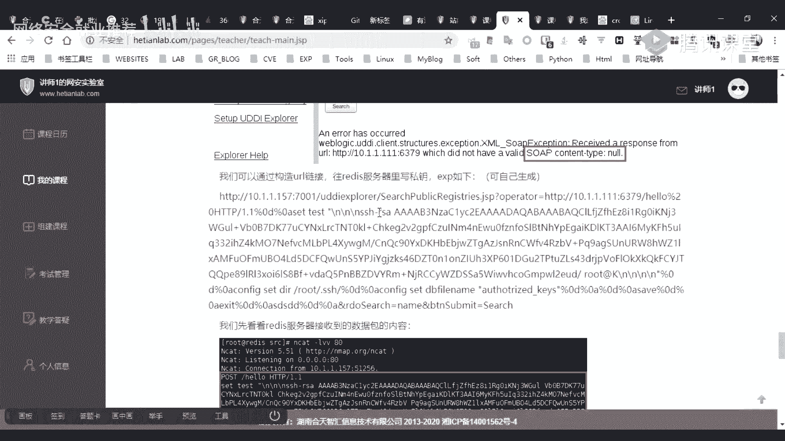

这一串的话就是我们前面说到的这个啊公钥。

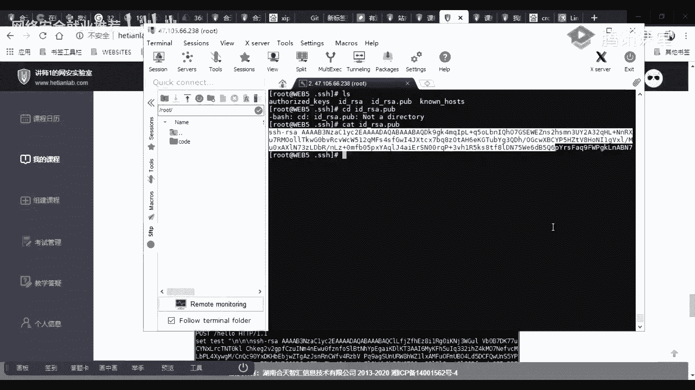

就我们在这里生成的这样子的一个公钥，在工业上的话啊，可以自己生成，就生成之后的话，我们把它放到这里报告，这里的话就是啊这个test啊，这个t名为test的这一它的一个值。

它存储到这个release的一个数据库啊，到了这里，这段话其实跟我们前面的那个需要脚本的话啊，应类似的，应该能看得懂，然后后面的话后面的话就是啊，前面的跟前面的一样。

我们设置我们的一个目录为这个这个目录，这个目录的话就是我们保存的我们的一个呃，那个ssh的那个密钥以及公钥的一个目录。

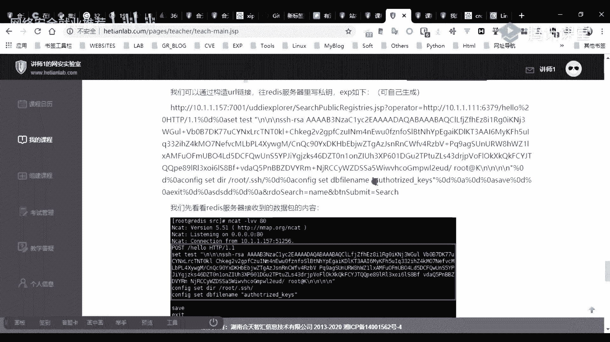

我们设置的一个目录的话，是在这里把我们设置了一个文件名。

是这个authy kiss，这个author kiss的话，这个文件的话它里面存储的就是我们的，就是比如说我们已经连接过了，我们已经有连接过了，诶这里没有吗，我们可以把我们的就已经有连接过了的。

这样子的一个t就是它的这种公钥，把它存储到这样子的一个文件里面，然后存储到这里的一个文件里面的话。

那其实就是一个啊，就是我们去进行一个身份验证的时候，会去用到的这样子的一个好公钥，就一个钥匙嘛，然后我们我们可以通过存储的，我们这里生成的这一个公钥，好，我们可以使用这里的。

就是我们直接能够通过snh这个方式。

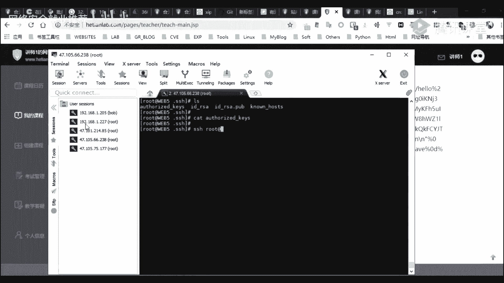

来去连接我们这里存放公钥的这个服务器，这里的话应该有你看到我这句话啊，我这句话有设置了一个，这个的话是我之前设了一个明媚的一个登录，然后我们只需要把它把那个公钥，把它给放到这里来，好保存，保存之后的话。

我们可以直接通过ssh啊，root 17，通过诶我这里的话和s h的端口是那个，每个端口好，我们可以看到，这里的话有了这样子的一个验证对吧，那验证的话其实就是呃，验证我们这里存储的一个公钥。

它是否啊是我们这里生成的啊，我们yes yes，之后的话，可以看到我们没有输任何的一个密码对吧，我们没有输密码，我们直直接就啊就是确认了这样的一个连接，我们就连接到了这里的一个服务器，看一下它的内容。

对吧，好，在这里的话就是通过这样子写这样的一个，s h的一个啊key这个免密登录的这样的一个key，写到这样的一个文件之中，写入之后的话，我们直接可以在我们在这里生成的这个，t的服务器上面来通过啊。

不需要密码的去登录到指定的这一个服务器，这句话就是这里的一个关于这个s h i s的，一个key的一个，解释，这句话大家应该明白了吧，能明白吗，大家可以自己去尝试一下，就是通过这样子的这种呃。

这种通过radish写这个s h key的话，也是呃也是啊比较经典的一种方式，就是我们能够直接的通过写入的，我们的这样的一个公钥对吧，能够不需要立马的去登录到，就直接获取到目标服务器的一个啊shell。

而且是就是很稳定的一个需要，呃大家还有还有疑问吗。

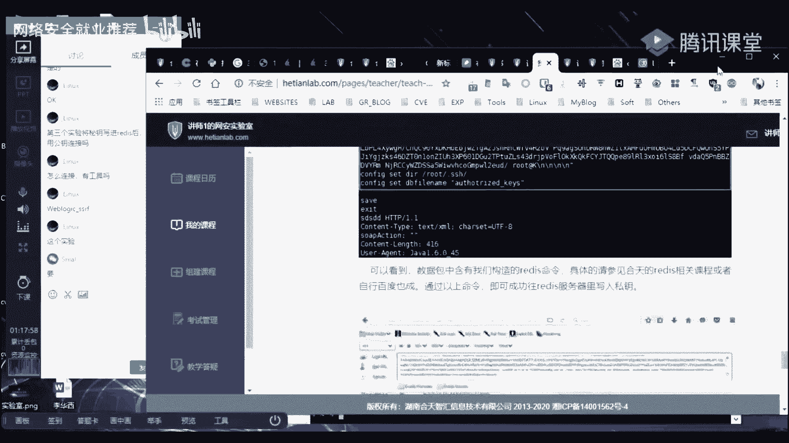

嗯大家还有问题的话直接提哦。

还是说这个struck two的话呃，应该呃跟前面的话其实也是类似的，就我们直接用这样子的一个payload就可以了，好用他的这个p o c，因为他这里的话就是直接能够去进行一个命令，执行嘛对吧。

然后的话我们通过这个s s r f，通过这个s2 f来去访问，就说同直接去访问他的这个呃，struck two这个啊服务访问这个服务的，它是存在这样子的一个漏洞，我们可以通过这样子的一个plc来去执行。

我们想要的一个命令，然后他这里的话就是通过呃，通过通过那个下载一个，就通过we get下载这样子的一个shell脚本，然后把它下载，下载到这个指令的一个服务器上面，然后下载下载之后的话，我们在啊。

给他就是给他一个执行的一个权限，给他执行权限之后的话，我们再去执行它，因为我们已经能够去命令执行了嘛对吧。

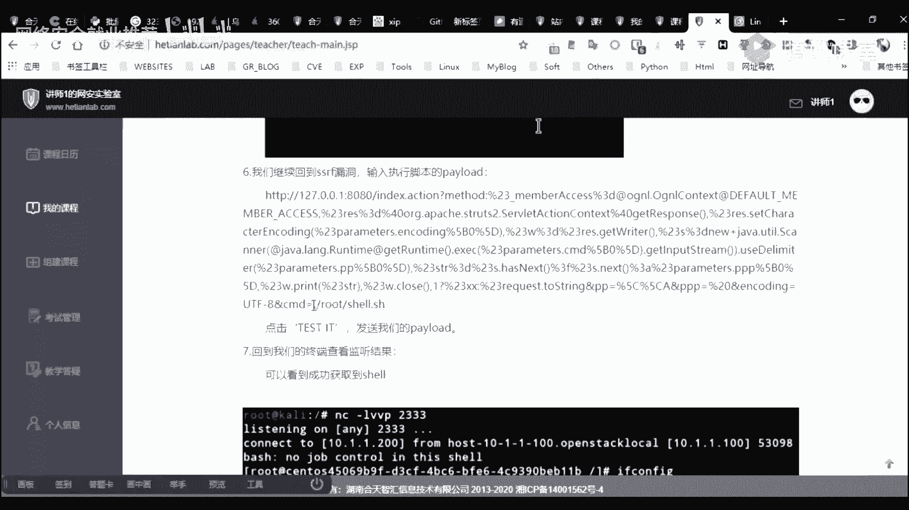

直接通过这样子的一个payload去啊，执行，执行我们的这样子的一个反弹shell的一个脚本，然后的话在我们的一个服务器上面去进行一个，今天就能够弹回我们的目标服务器的一个shell。

然后这里的话关于这个struct to的话呃，大家可以直接搜一下，搜一下实验室，有实验的，这样的话呃这个struct to的话是很好利用的，就不像radise那样子，就是说我们可能需要通过这样子的。

比如说你要弹shell，我们需要通过这样子的一个脚本，就是因为我们想要把我们这里传递的，这样的一个脚本，就说这种数据要把它给发送到我们那个，radius服务器，然后发送到这个radio所服务器的话。

我们需要啊就是符合它的一个格式啊，因为我们是需要去使用到这个go for go，呃这个这个篝火协议去进行一个发送，所以的话我们需要把它就是啊转换成啊，能够去直接去进行一个发送的这种格式。

就是发送的用这个goff协议去发送的这种数据，直接发送到我们的一个radius服务器的，一个6379的这个端口，发送过去的话，它就会执行我们上面的一个shell的一个脚本，然后把我们的一个定死啊。

这一个电池任务，弹shell这个脚本写到我们的电池任务里面去，然后的话隔一分钟之后就能够弹弹shell，然后在这里的话我们可以通过它返回的这种加，就这个加ok的话。

就是radio他执行执行完命令之后的话，它就会返回返回给你，就执行一条命令，它就会返回给你这样子的一个啊字符就ok，就是执行成功了嘛，然后我们这里的话是有五条命令，所以的话返回五个。

ok就说明的话这样的话是已经出现成功的，然后这里的话呃这样的话可能这里要说一下，大家可能会有疑问，在这里的话我们是通过这个so cu，这个so cut的话，其实也是一个就是啊一个工具。

它是你可以说是好nc的一个加强版，就是说它的一个功能的话，比nc要其实是要更强的，就更强大的，它的一个功能的话很丰富，能够端口转发压床，就是nc能干的，他都能干，等于就是然后他还有其他的一些啊。

其他的一些功能，然后这里的话我们通过它的这样子的一个命令，其实我们想要获取到这样子的一个数据，这个数据的话，其实就是我们啊执行这个脚本对吧，执行这个脚本之后，我们发送给我们的一个release服务器。

那这样的一个数据是这样子的一个格式对吧，然后的话我们发送的数据格式是这样子，我们如果说要去使用到这样子的一个go for协议，发送这样子的一个啊，我们这里执行需要脚本的一个数据的话。

我们就需要获取到它的发这种原始的一个数据，好的话，通过转换转换为就是呃符合go for的这种，go for发送数据的这种格式的，带一个啊，这样子这样的话有给一个脚本。

就是它有这样子的一些转换的一个规则嘛，然后在这里的话就是通过这一个socat来监听，我们的一个44的一个端口，而今天的这一个端口的话，他会把这里的一个就是呃，把发送到这个444端口的。

一个数据给转发到我们的一个呃，这里的一个6379的一个端口，这个637的话，其实就是我们本地的一个release的一个服务器嘛，对吧，然后在在这里的话，我们就是执行这个脚本，这些脚本的话。

这里需要两个参数，大家要注意的话，这里的话是两个变量有啊，多了一的话就是我们这里的第一个变量，就是我们的一个ip嘛，然多了二的话就是一个端口，然后执行之后的话，执行之后的话呃。

啊不是在这里就执行之后的话，我们像我们的一个这里，今天的一个14 四的一个端口，发送我们的这执行命令之后的一个数据，也是这里的一个数据嘛，发送给这里，实际的话其实就是发送到了我们的一个呃。

这里的一个6379的一个radio服务器，然后在中间我们这里监听的话，就像就相当于一个中间人对吧，我们可以把它发送到服务端的，就是说这个6379的端口，它的这种原始的一个数据把它给获取下来。

就是你发送过去，你发送发送到服务端，然后的话服务端返回的一个响应的这种数据，能够通过这种方式把它给获取下来，然后的话再通过这个go f协议，就啊我们的指定我们的一个release的一个端口。

后面的话接我们的这里的一个数据，然后发送，发送之后的话就能够去进行一个呃，写这个写这个shell，学我们的一个定时任务来反弹一个shell，这里应该能明白啊，其实我这个文档的话已经很详细了。

然后这里还有要注意的一点的话，就是这里了，就大家哦大家可以可以自己在本地啊，就是我那时候的话，也是就自己自己在本地搭环境嘛，大环境，然后你自己搭一个radius的一个服务器嘛。

然后通过这样子的一个方式截获这一个数据，结合这个数据化，你需要去进行一个啊转换转换构造好，这里构造的话我们要注意的一个点的话，就是它在这里，我们其实可以看一下这里的我之前的一个数据。

这里这句话其实就是我们这里的感恩感恩，给你复制下来。

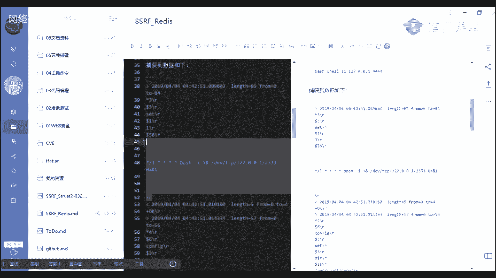

我们复制下来咳，就这里的话，我们可以看到前面的话是有三个换行对吧，这三个空行其实就是我们之前的一个感恩，感恩的话就是换行的意思嘛，就换了三个行，然后这里的一个数据的话，我们可以看一下，这里的话。

我们选中这里的话其实是有51个字节，就51个字符对吧。

这样的话它的一个长度是51，然后后面的话这里呢要注意的话。

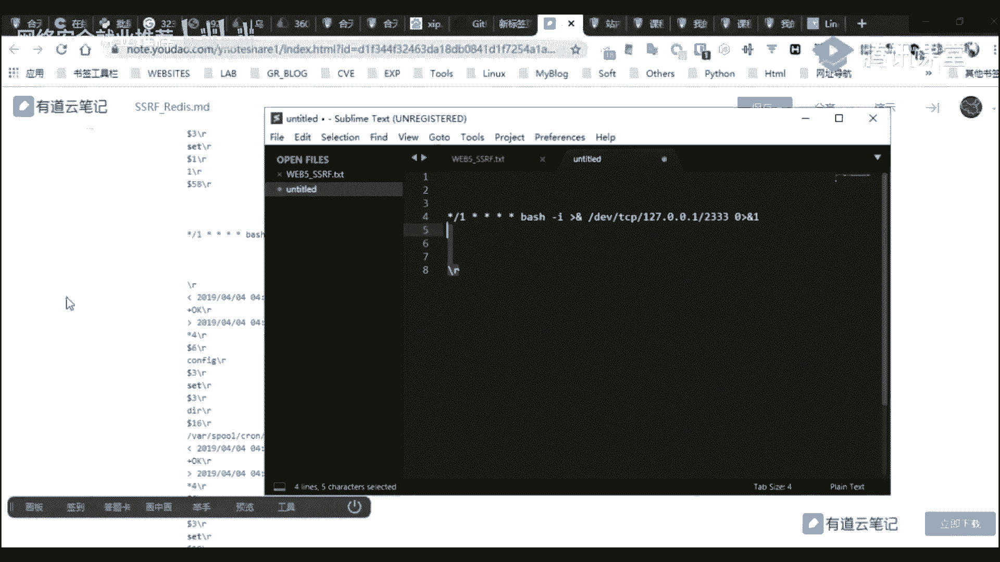

它是有四个字符，然后，就可以看到在这里的话有一个这样子的一个值，58，这个58的一个值的话。

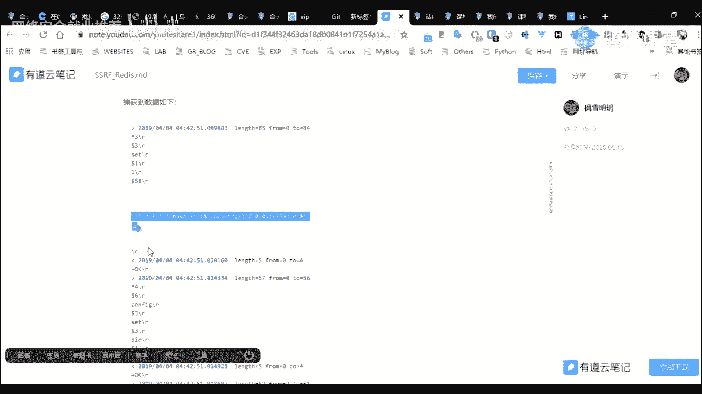

就是表示我们这里所传递的这个数据，它的一个啊长度是一个58这一个长度，然后因为我这里的话是一个本地嘛，如果说你想要你要去连接一个指定的啊，这里面是这样子吗，你想要去连接一个指定的，123指定的一个ip。

比如说电网的一个呃，1。100这样子的一个ip对吧，然后端口的话是，啊666，然后这里的话我们实际的实际要去反弹的，一个小小的话是这样子的一个ip对吧，然后这一个端口，所以的话我们这里的话需要更改一下。

它在这里的一个呃就是长度的一个值，我们可以看到这里的话是一个55，这里55，然后加上我们这里的一个三，再加上这里的一个四。

就是55+7嘛，55+7的话，就是他在这里的一个长度的话就是62，所以说我们在这里的话，我们需要做一个更改，更改为一个62，就是啊体现到这里，那个po的话就是在这里嘛，呃在这里那应该有58嘛。

我们把这里58改成62就可以了，另外就是关于这个sf啊，radio就是攻击内网radio的一个啊步骤以及方法，我看大家呃没有反馈给我，就是大家都听懂了是吧，听听懂了，听懂了就是没有问题的。

大家在讨论区扣个一好吧，让我了解一下大家的一个就理解的一个情况，如果有问题的话扣二，然后把问题发出来嘛，我现在的话就再给大家五分钟的时间吧，如果没有问题的话，我们这节课的一个内容的话就到这里结束了。

好这位同学，这一个应该理解了吧，就连接工具的话，就我们直接通过s h就能够连接了，呃大家是有问题还是没有问题的，也也给我一个反馈吧，啊没有问题的话，那我们下课吧。

呃下课之前的话。

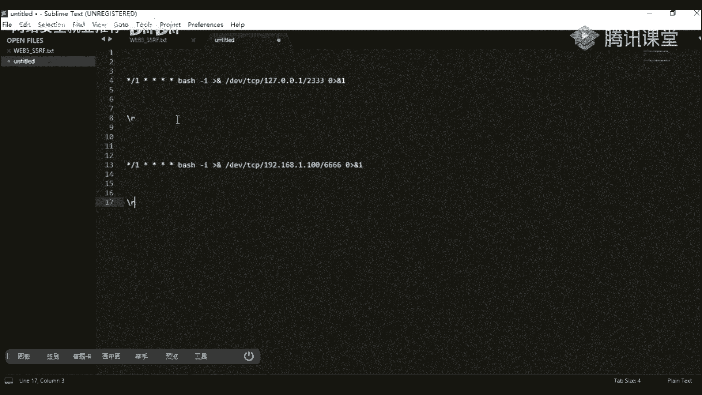

呃，有一个就是我们下节课的话就是一个考核嘛。

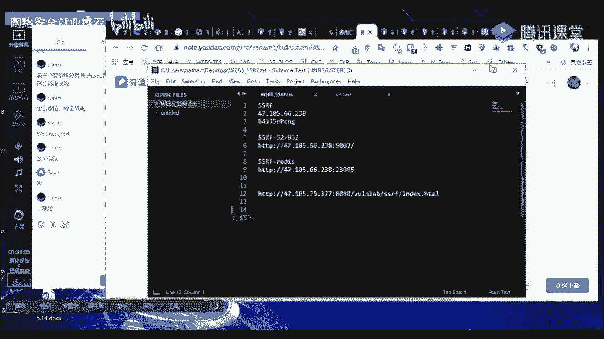

然后考核的话我在这里的话有就是。

准备了两个题目。

准备了这样子的两个题目。

我发到群里，然后的话需要大家去啊进行一个做，做出来做的时候的话呃，大家就是啊在下节课之前的话啊，把那一个就是你做的这样子的一个详细的过程，以及步骤把呃记录下来，然后写下来啊，就是把作业发给班主任。

然后到时的话呃如果有问题的话，我给大家讲解，呃这里的话，看一下。

我在这里的话，我写一个flag，就是啊考核的一个目标的话，就是把这一个啊flag就是拿到，三个点text。

就是他的flag的一个目录的话，是在这一个tap tap目录下面，我直接告诉大家吧，就在这一个tap目，下面有一个flag intt这样子的一个文件。

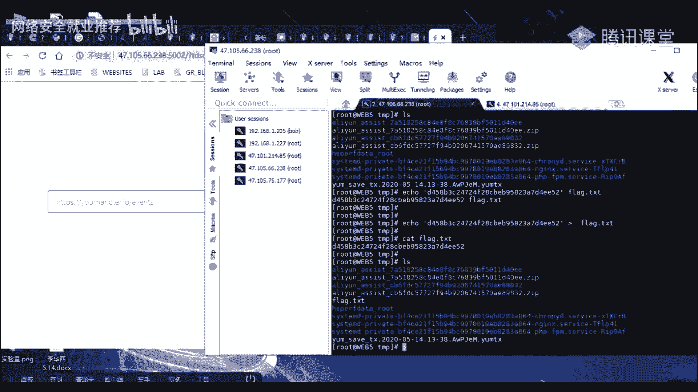

我需要你就是啊，目标的话就是获取到它里面的一个值。

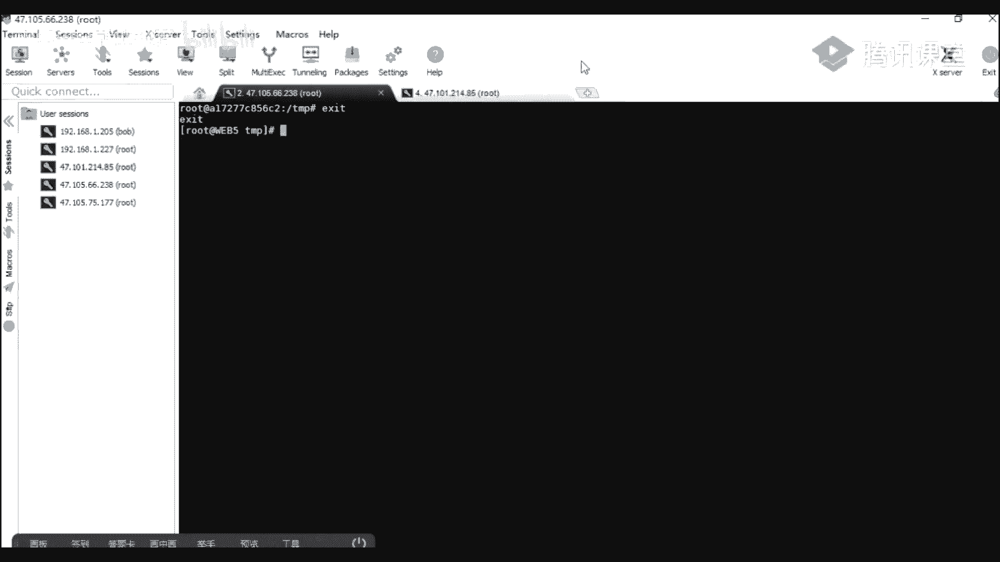

呃然后的话这个的话就是下周的一个考核好。

我们这节课就到这里结束了。