# P37：第35天：SSRF漏洞-课程考核讲解 - 网络安全就业推荐 - BV1Zu411s79i

是我们这一期的一个web安全培训的啊，就是课程内容的最后一课了，应该是，然后后面的话就呃我这节课讲完之后的话，后面的话就是呃两节，就是把我们前面的一些内容的，就是关于这些web安全相关的一些知识点。

给他给大家做一个就串联对吧，就是针对这样子的一些web安全漏洞啊，我们如何去发现，如何去利用的一些思路，好的话就是最后的一个呃就业的一个培训，就是这啊，解决大家就是在去进行一个就业的时候。

一些简历制作啊，还有就是就业的一些选择等等的，还有的话就是呃有相关的一些呃，企业的一个内推的一个资格，然后本节课的话就是一个课程的一个考核的，一个讲解啊，讲解的话主要的话就是呃上节课给的两个题目。

就这两个题目，然后呃大家有做出来的吗，就这两个题目大家有做出来的吗，没有，hp为c82 21，那其他的呢没没有尝试吗，呃这个的话是啊，这两个题目的话，是把那个file协议给就是过滤了呀。

就是你的这个file协议，那如果说你能够去直接使用到一个file协议的话，我可以直接就是file对吧，因为我已经知道flag的位置嘛，我直接，我直接通过file协议对吧。

然后直接读取这一个flag的一个文件，这样子的话就直接就能够出来一个flag对吧，那这样子的话没有什么就是没有什么可考性，就是没有什么考点是吧，所以的话这两个题目其实是有，把这样这个法尔协议给禁用的。

就是把它给过滤掉了，而其他人呢这这两位同学是啊，有碰到一些问题对吧，其他同学有没有就是有一些思路，或者说有做出来的，公钥，你说的用公钥尝试是哪一个，是哪一个题目啊，就这个是吧。

这个你为什么会想到用公钥去做呢，就是你啊你用功要去做的一个，就是你前面的一个思路是怎么怎么样的，啊要不要不就是说呃，就大家有什么就是有什么想法直接说吧，这边是可以这样子举手吧，就大家可以直接举手。

然后发言，就大家碰到了一些问题啊，然后的话呃有有有就是你你的一些思路，啊你你这个这个老橙子，你要不要说一下，你要不要说一下，就是你的，你为什么要想想，要去用公钥去来尝试做这个题目呢，就是你的一个呃依据。

要不要尝试说一下。

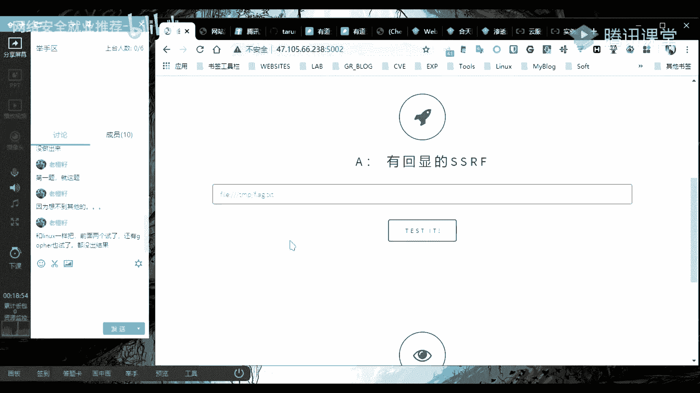

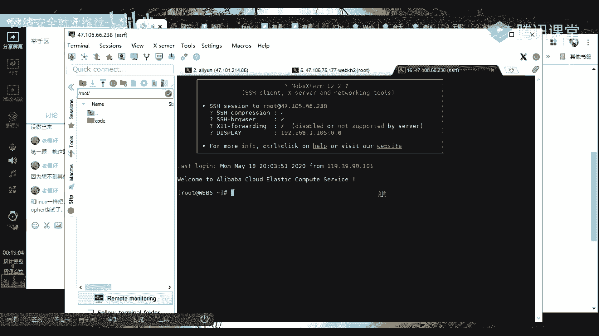

都没人想分享一下的吗，没的话，那那我来我来讲吧，就，首先的话在这里的话就呃，就从明很明显就是一个s s r f嘛对吧，其实就前面的一些题目，然后的话你要做出来一个，你要得到那个flag的话对吧。

我们先回想一下，我们就是前面讲s f的时候，我们要怎么去进行一个啊测试，就说怎么去测试这样子的一个ssr f漏洞呢，对吧，我们前面的话有提了，就是有通过一些ur u i5 协议对吧。

通过协议来去进行一个测试，然后的话看他的一个回血对吧，来判断啊，来获取他的一些信息，来判断服务服务器的就是啊一些端口啊，服务它的一个开放的一个状态对吧，然后的话我们我们知道了这样子的一些信息，之后的话。

我们再去针对这样子的一些端口，它的一些服务，来去进行一个啊针对性的一个利用，对不对，然后前面的话有说到是吧，用啊，就是这里的话有提示让你输入一个url嘛对吧，那我输入一个url进行一个测试嘛。

就是htp协议嘛，比如说我输了一个百度，对啊，然后我测试一下，测试一下之后的话，发现他是返回了我这一个啊链接的一个好，源代码对吧，源码，那么你在这里这样的话，我们要明白，就是说他啊。

就是它后台后端怎么去进行一个处理的，就说你首先你要有这样子的一个概念，我们在这里输入这样子的一个url对吧，输入之后的话，后端它是怎么处理的呢，我们从结果的话能够发现，它是返回了我们的一个源码。

返回了我们给定的这个链接的一个源码，那么我们就能够大概的知道它后端，它其实会向我们给的这个链接发起一个请求，对吧，就啊请求这里的一个链接，它的一个源代码，然后的话显示出来我也想到了这里对吧。

然后这里是htp协议，那么我们还有呃前面有着重说的dict协议，对吧啊，dict协议，比如说我，我随便输入一个ip对吧，我先不输入这种内网的一个ip，我输入一个公网的ip嘛。

我为了验证他是否支持这样子的一个协议，对不，他的话呃。

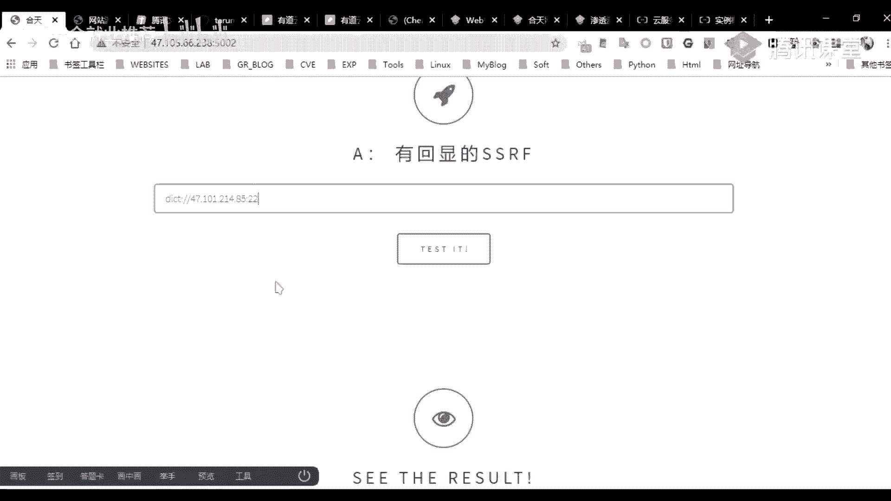

22号端口对吧，我这边的话，我在我自己的一个服务器上面先做一个，就是今天今天我的一个，22号端口对吧，我这里监听之后来，然后我在这里通过这个协议去啊，访问我的这一个公网服务器的，22号端口对吧。

因为它会对我的这里的22号端口，做一个探测，然后的话我进行一个test，test了之后的话，我们怎么去查看它是否有就是请求呢，有像我这里给定的这个dex协议，就是有去使用这个协议去啊。

探测我这里的一个服务器的一个端口呢对吧，我从我服务器上面的一个危险就能够知道，它其实是好有趣，请求我这里的一个22号端口的对吧，好的话，可以看到这里的话是他请求的一个客户端，它是使用的一个c r l的。

一个7。29的一个版本对吧，他是从呃这个ip啊访访问过来的，对吧，然后的话其实呃其实在这里的话，其实就是建立了这样子的一个连接，我们其实可以看到在这里的话，它其实连接到了我这里，服务端的一个22号端口。

然后我们如何去，就是说其实就是客户端与服务端之间建立，连接了之后的话，我们其实可以去传递数据的对吧，我可以在这里随便输入，这样输入这样子的一串数据，然后我这里输入之后的话。

其实我们的这一个连接而断掉之后的话。

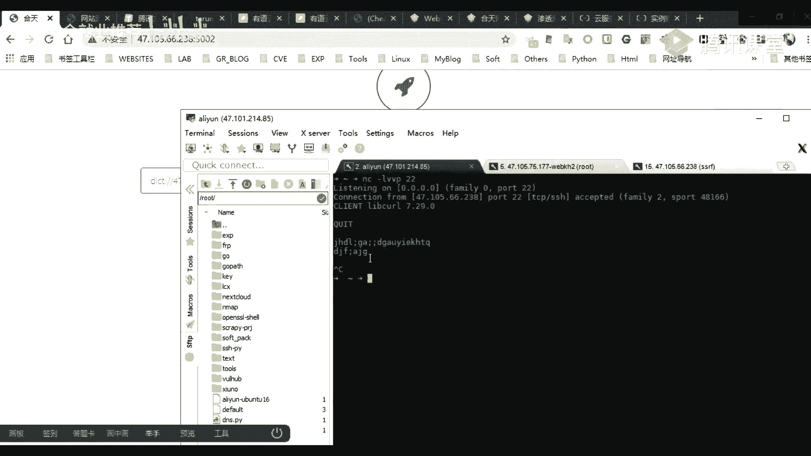

它就会把我的这里的一个数据给传到。

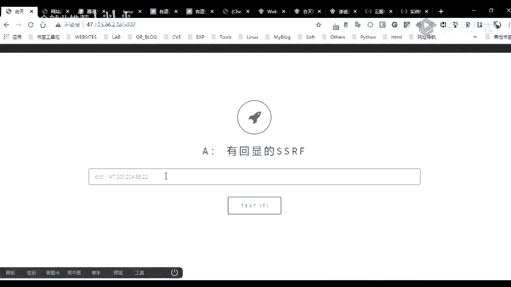

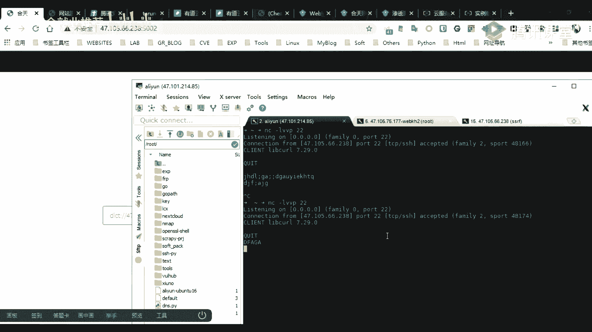

可以看到我在这里的话呃，像客户端对吧，随便呢传输了这样子的一个字符串对吧，然后服务端的话，他请把客户端，他请求我们服务端的一个数据对吧，我这样的话给了他这个数据的话，在客户端的话他就回显出来了。

其实就跟我们去请求一个链接，然后服务端就是啊请求的链接的一个服务端。

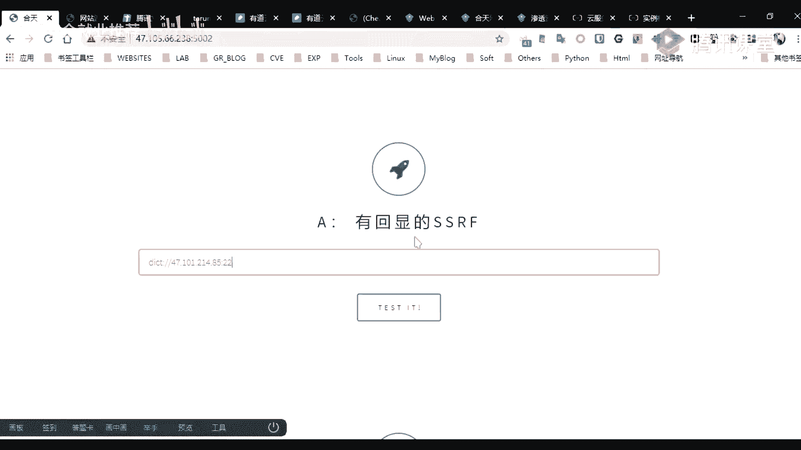

它返回给我们这里的一个数据。

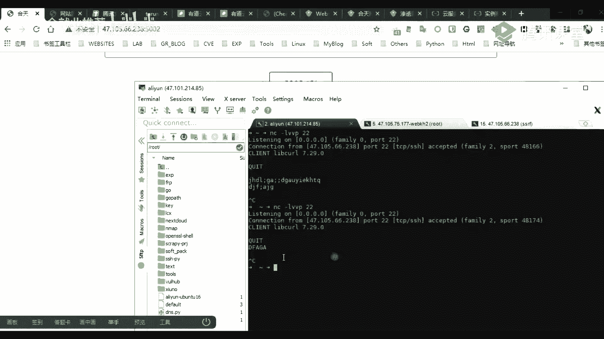

其实是一样的对吧，这样子的话，我们能够判断它是能够支持这样子的一个，dict协议的，也就是说我们可以使用这样子的一个dict协议，来去探测内网的一个端口，对吧，那么我们尝试一下啊。

探测一下内网的一个端口，就是说啊，因为我们现在这里的话是在这个服务端对吧，在这一个啊，在这一个服务器，然后的话我们在这里请求我们可以尝试，如果他没有，就是说它存在这样子的一个s漏洞，也就是他没有去限制。

我们在这里请求的这种优的一种效啊，不是url的一个协议，以及它没有限定我们的这样子的一种啊，访问内网的ip以及特定的一些端口的话，我们可以去进行一个尝试，好的话，我们在这里尝试一下，尝试之后的话。

可以发现它这里的话返回了这样子的一个呃，我们22号端口，它所运行的一个服务以及版本，它的一个服务的话是s h，版本的话是7。4的一个，open s h的一个版本对吧，那么我们能够去使用这样的dt协议。

去探测内网的一个端口，那么我们是不是能够去探测其他的一些端口呢，比如说3306对吧，进行一个测试，然后发现的话它这里有回血，然后可以看到这里的话是一个，5。7。29的一个版本，但这里乱码的话。

其实呃是因为中文的，而它本来就是这样子的一个乱码，然后显示的话是有问题的，好的话，我们不可能是说这样子，手动的去一个一个端口区进行一个探测对吧，那么我们，我们如果说你这样子。

手动手动的一个一个端口去探测的话，那太太麻烦了，所以的话我们可以尝试使用bp嘛，就是啊其实上节课也有用，有说到对吧，使用bp的这一个爆破爆破模块，是这里吧，就这样子的一个包。

嗯啊抓抓取他这样子的一个请求的一个包的话，就是像这样子的一个包，然后的话我们可以通过bp的一个爆破模块对吧，然后对它进行一个爆破，爆破之后的话，它的一个结果其实就是我们就是我们在这里。

我们的这个服务端对吧，这个服务端它的一个啊，它内网的，就是说它本地的这个啊开放的一个端口，我们通可以通过通过它的一个响应，来去进行一个判断，啊这样的话会比时间啊，因为我这里的话是探测的一个全端口。

就是1~6535，然后的话它它的一个呃时间的话会是比较久的，因为他需要一个一个包，一个一个端口，也就是一个端口要发送一个包，然后的话获取它的一个响应，这样的话已经出了一个22号端口对吧。

然后最后探测之后的一个结果的话，其实就是啊有这样子的一些端口存活，我们可以看这里就能够得到它存活的一个端口，有这样子的一些22元，33065002，还有8080，还有23005这样子的几个端口。

然后的话呃，主要的话看这个就是它的一个状态码，是200的嘛，其他404的话就说明这个端口的话啊，没有开放的，然后这里的话呃我们再回过头来，就是呃看一下我这里的一个文档吧，我的话呃写了这样子的一个文档。

也就是我们如何去进行这样子的一个，就是去测试这样子一个s漏洞的一个思路，首先我们得到这样子的一个站点对吧，得到这样子的一个站点，我们想要去测s s s f，首先我们我们要去测试它。

也就是呃要能够获取到它的一个信息，大家一定要注要记住的话，就是s f它的一个作用对吧，它的一个作用就是去探测内网的一个信息，因为我们要去啊利用，就是利用这样子的一个存在。

3伏的一个这种啊web服务器对吧，然后的话它是能够去访问，如果说它是能够去访问内网的对吧，那么我们可以利用它这样子的一个s漏洞，去探测内网的一个信息，也就是说以这一个啊服务器作为一个跳板，去获取去。

直接就是穿穿越我们的一个呃防火墙，来去访问内网的这样子的一些服务，以及获取它的一些端口信啊，信息，版本信息等等，然后的话我们前面的话有说了，就是啊htmd好不，h t t p的一个协议以及这个协议对吧。

然后的话还有其他的一个一些，就是说的一些fire协议对吧，也是常常用的，也是常见的一些file协议对吧，放协议的话，因为我们能够其实通过啊，这样子的一些信息的话，能够知道。

它其实是一个linux的一个服务器对吧，它其实是一个linux的一个服务器，然后的话因为有像这种22号端口嘛对吧，如果是一个linux服务器的话，那么我们就是可以尝试使用file协议去读取啊。

linux系统当中那些特殊的一些文件，也是啊常见也是常用的一些文件，比如说etc password对吧，然后我们可以去进行一个测试，而测试之后的话，这里的话是啊，没有这样子的一个信息的一个返回对吧。

然后的话从这里的话，我们其实也能够就是啊测啊，知道了解一点的话，就是说他这样的话不能够去使用这样子的一个，file协议，直接去读取啊，这个系统里面的一些文件，也就是这里的话有对这个发展协议做一个禁用。

然后的话还有就是其他的一些协议，比如说啊ftp ftp协议就我们怎么去测试的这个呃，测试它是否能够去使用ftp协议呢，好我们首先要知道ftp的话，看一下这里的这个文档。

这个文档的话就是啊列举了就是常见的，也就是一些啊我们经常呃就是经常会去使用，而且碰到的这样子的一些端口，以及它的一些服务，就是说一般的一般就是约定俗成的这种，比如说12号端口对吧。

就是对应就是使用的一个s h的一个服务，当然的话你也可以去更改它的一个端口，就说你可以把s h服务的一个端口，改成其他的一个端口，比如说我的话，我把我自己的服务器的话，是改成了其他的这样子的端口。

因为你就是默认的12 12号端口的话，你现在公网的这种服务器的话，别人会去尝试，就是就你去挂个挂个那种爆破，弱口令的一个脚本对吧，你直接挂挂在那里，然后的话直接对这种官网的这种服务器。

直接去进行一个批量的去爆破对吧，然后他批量爆破的话，他批量爆破的话，他针对的就是默认的去使用这种，22号端口的嘛对吧，如果说你去跟使用其他的这样子的，一些端口的话啊。

可以比较有效的去防止他的这样子的一种爆破，除非的话它是有针对性的去对你的这个服务器，做这样子的，做这样子的一种探测对吧，那么的话他肯定也是能够去发现到你，你的服务端就是啊开放了哪些端口。

然后的话这个端口它使用的什么样的服务的话，都是能够探测出来的，就是我们使用map就能够去进行一个探测，然后的话我们呃这里的话，比如说我就是大概说一些常用的一些端口啊，这个的话大家可以不用去死记啊。

就是就是之后的话大家肯定也会经常碰到，也会经常用到的，比如说ftp ftp的话就是20~21的一个端口，然后s h是22，tnt是23，还有像我们的一种邮件服务啊，25对吧，还有常用的电的话。

它是使用的一个53，以及hdp对吧，八零，还有的话像，还有的话像我们的我们的一个radio对吧，radius的话是一个6379，还有像我们的啊就mysql，等等的这样子的一些就是常见的一些端口。

以及就是80808080的话有啊，这样的话是一个他这里写的话是htp的一个pro，就是hp的一个代理，它默认的话是使用808年的一个端口，就比如说bp的话，1p里面的一个hb的一个代理的话。

它默认的话也是使用了一个8080端口对吧，然后的话像tom cat这种web服务的话，它默认的也是使用的8080的一个端口啊，这样的话就是对长镜的一些端口，给大家啊做了一个基本的一个介绍吧。

就让大家有这样子的一个印象，好我们回回回到我们的一个题目，就是说我们如何去探测它是否能够去使用，这种ftp的一个协议呢对吧，我们前面的话有说到就是ftp的话，他使用的是一个21号端口对吧。

然后我想要去探测它是否能够支持，使用这种ftp协议对吧，我这里的话我首先。

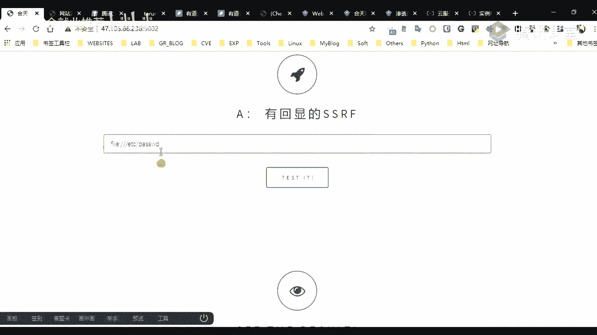

我首先我要去探测的话，我需要去使用到我我们的一个公网服务器对吧，我首先在我的一个公网服务器上面，今天一个21号端口。

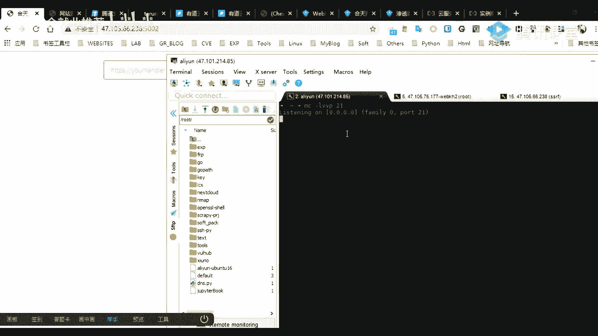

因为它默认的话它是使用的这样子的，21号端口，如果你不去特意的去指定的话，然后的话我们在这里的话，我们在这里的话，通过ftd协议去访问我的这这样子的一个呃。

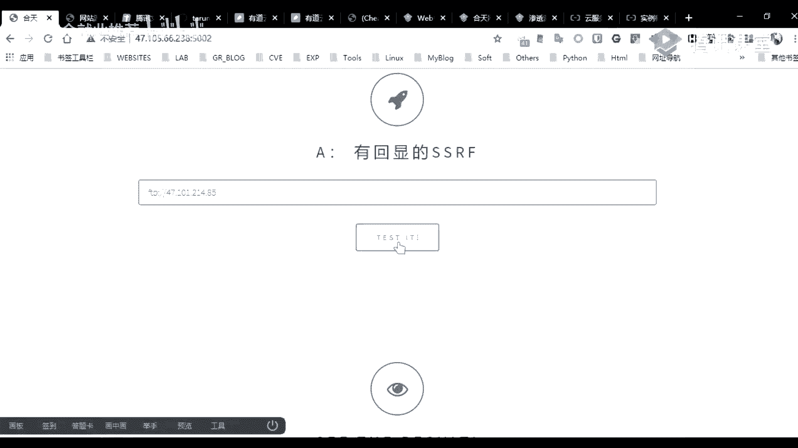

服务器的一个ip对吧，好的话，我去进行一个测试，去建一个访问，访问之后的话，我们从服务端的一个回响也能够知道对吧，可以看到这里的话是有一个ip，有这样子的一个ip来连接了我的21号端口，对吧，是啊。

一个ftp的一个呃服务，然后这里是。

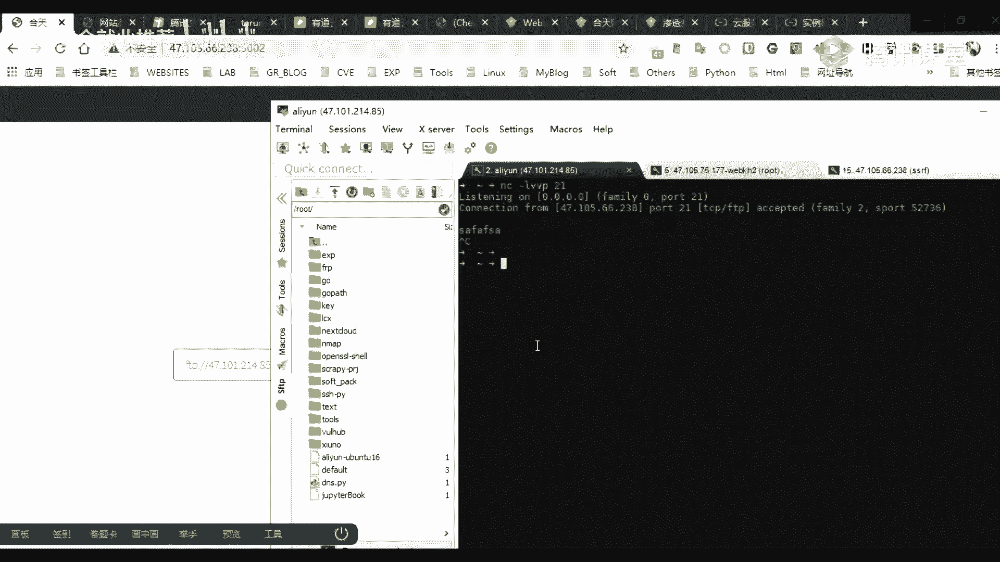

从这里的话我们也就能够啊大概的知道他是啊，就是这里的话它的一个服务端的话，它是能够去支持使用这种fdp协议的，以及还有其他的这样子的一些协议，比如说f t p s啊，还有sf tp啊，还有tnt呀。

然后的话还有go for，关于go for的话，其实上节课也说到了嘛，也是就是我们在后面去进行一个应用的时候，也会经常去使用到的这样子的一个协议，然后的话我们探测完了。

就是说我们能够去使用这样子的一个要的，这种这种协议对吧，能够使用它去获取到特特定的一些信息对吧，然后的话还还能够去用这样子的这种协议，去发送这样子的一些payload以及一些数据对吧。

然后的话我们就需要好，应该是说我们可以前面的话我们也是啊，就是有测试了，他能够去使用这样子的一个dc协议对吧，那么我们就能够去使用这样子的一个电协议，去探测啊内网的一个端口以及服务信息。

然后探测内网的话，我们可以通过这样子的一种爆破的一个方法去，就是通过他的一个响应来去啊，验证来去发现它的一些端口的一些开放，以及它的一个啊就是端口开放的一个情况，然后的话我们知道了他的开放了哪些端口。

那么我们就能够有针对性的去利用它的，这种端口的一个服务对吧，比如说啊22对吧，然后的话像这种数据库mysql mysql数据库是吧，然后呃，其实s也是可以去使用这样子的一个go f协议，去。

就是去好利用这样子的一个mysql数据库的，当然的话利用这个mysql数据库的话，它是就是说用这个上分零六的话，是需要有一些前提条件的，就他的一个前提的话，就是说你需要去呃。

你需要知道你的这个这个数据库，它的一个用户名以及密码，所以的话好的话，才能够去利用这个go f协议来去啊，像我们的这个啊，内网的这种三这种数据库服务，去发送我们的一个数据，好的话。

还有就是呃5002的话，就是我这里的一个web服务嘛，web服务的一个端口，以及呃8080的一个端口，8080端口的话，我们前面有就是前面也说了，也提了，就是说8080端口的话，默认的话呃好。

这样的话我们可以去进行一个访问，就是一般的话它是使用的这种，就是用于做一个web服务器，像比如说我们的就说hd p你也可以啊，像比如说我们的angx啊，还有像这种tom cat，tomcat的话。

默认是使用的8080端口，然后的话像其他的这种web服务器的话，也是也有可能会去使用到这样子的一个端口。

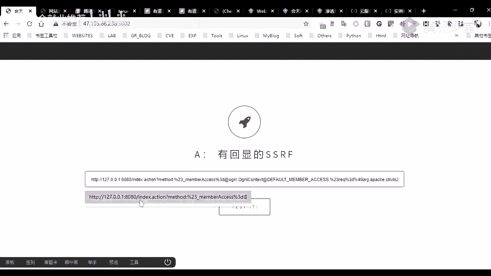

然后这里的话，啊这样的话这个题目其实大家没有做出来啊，这两个题目大家没有做出来的话，其实。

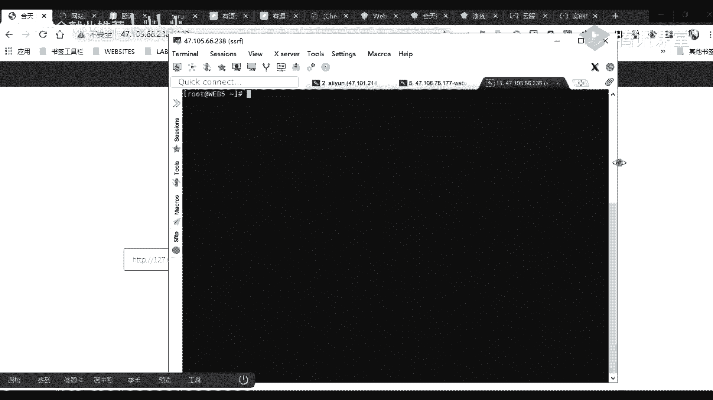

其实没有关系啊，就是这两个题目的话呃。

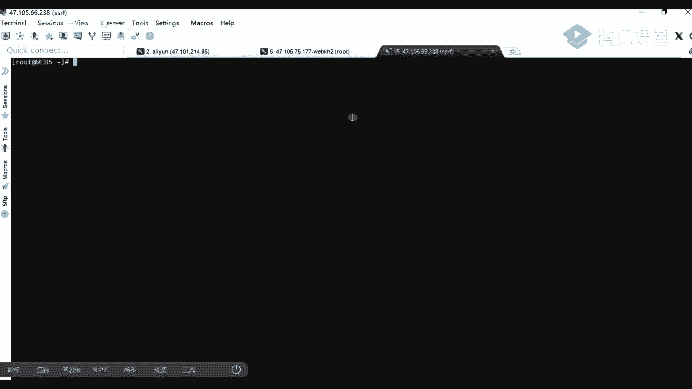

首先这一个就这一个这一个题目的话。

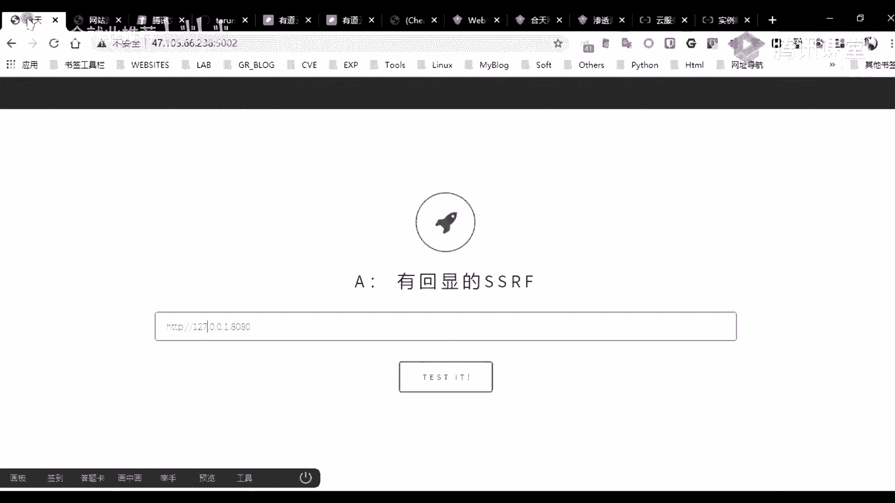

应该说这两个题目其实都有稍微有一点问题，这个问题我也不是，就是他这里的话有一个tomcat的一个服务，然后这一个tom cat服务的话总是会断掉，就是我不知道是他的一个连接数太多了。

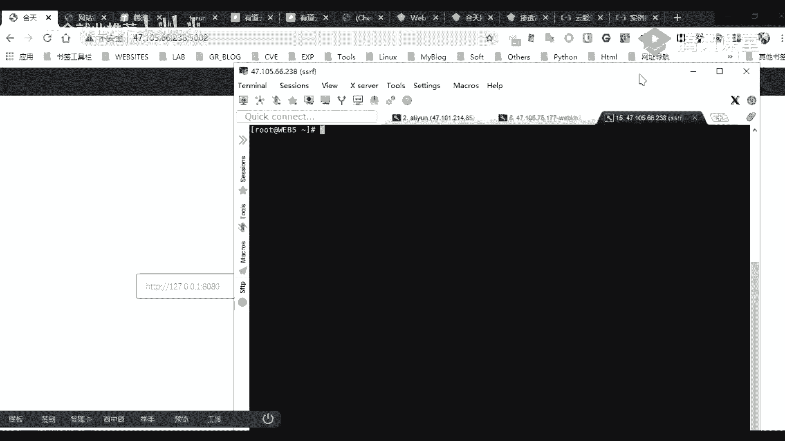

还是怎么的，就他过一会就会断掉，然后起了的话。

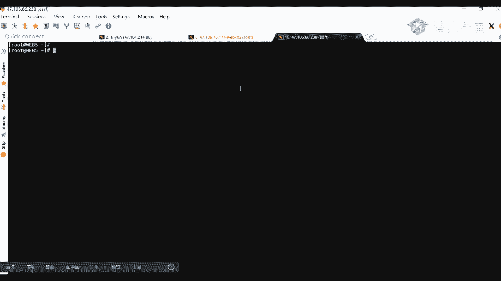

它的一个端口也会就起不来，所以的话可能大家也如果有去呃，有同学去这样子去进行一个端口的一个爆破。

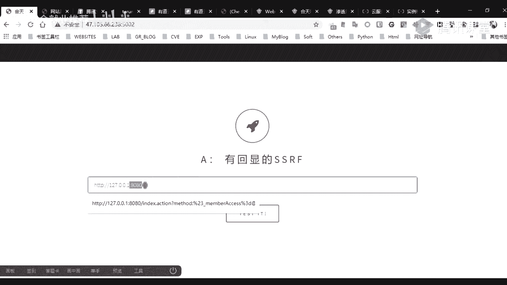

探测的话，如果没有探测到这个八零端口的话啊，这个8080端口的话，其实啊可能是服务端挂掉了，就是这里的一个嗯嗯，我刚刚起了一下，这起了一下这个tomcat服务的话，直接整个机器都卡死了呀。

然后的话直接零都连不上去了，所以说这里的话稍微有点问题，而且这个tom片啊这一个服务的话，现在的话可以看到是已经起来了。

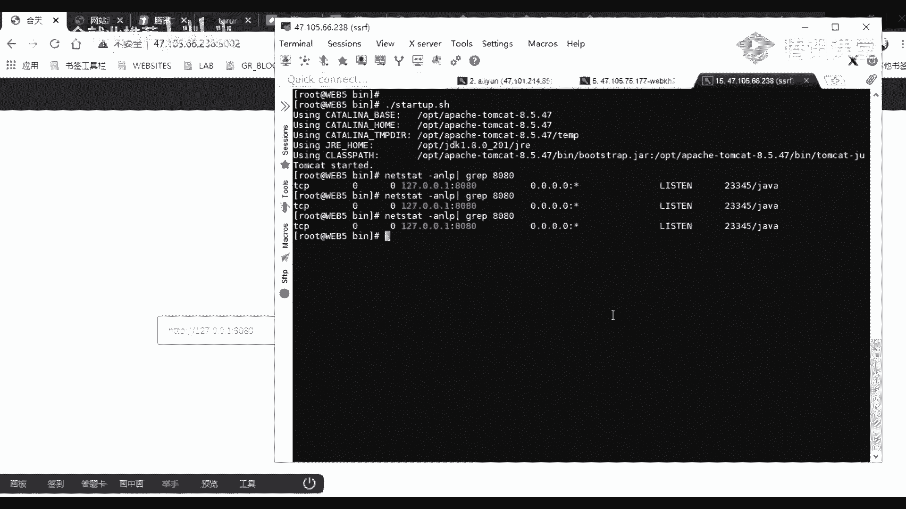

就是他今天在8080端口好的话，这个服务的话他要起来其实需要需要一段时间，就是而且他的时间的话说不准啊，然后可以看到我在这里的话啊，我这里起来了对吧，起来之后的话，我这里去进行一个访问对吧。

我们通过hdp的一个协议，或者说你通过det协议，通过这个协议的话，它会返回就是你的一个服务，你的这个服务的话，它使用的一个阿帕奇对吧，那么我们知道他是阿帕奇的话，那么我们就可以尝试使用http协议。

去进行一个访问它的一个页面对吧，然后的话我们从它的一个回血，其实也能够知道啊，不好看的话把，从他的啊就就这样吧，其实这个的话就是那个实验的一个题目，类似的，当然那个题目的话。

就是他没有去禁用这样子的一个凡尔协议啊，他是能够去直接通过法尔协议去进行一个，flag的一个获取的，然后从这里的话，我们从它一个回形，其实我们也能够知道它是使用的是struct to，对吧。

然后的话从他的就是啊struct to的话，我们要去访问他的首页，从啊返回的信息里面也能够知道，就是访问它的一个index对action，这是struck to这个框架的一个特点，一个特点。

这个的话就是它的一个首页，然后这里的话就是呃8080端口，我们这里知道他是一个struck two对吧，知道他是一个struck two，那么我们就可以去尝试使用，subject to的一些漏洞。

我们既然知道了，他是这样子的一个struct to对吧，那么我们可以尝试去使用，就是去好查找已有的，已有的这种ject to的这种漏洞，还有一个p o c对吧。

我这里的话呃就是查找了一部分的这种structure，因为是two的话，它的一个漏洞，它其实是很多的，有一系列的一些漏洞，这样的话我只列了一部分，就他的一些p c我们可以直接去进行一个使用。

然后的话我们通过测试的话，就通过通过在这里去啊使用我们的这种plc的话，能够啊知道的话它是使用的一个好不好，它是存在的这样子的，一个shake to的一个032的一个漏洞，然后他的一个plc的话。

就像这样子，这是他的一个plc，然后他执行的命令的话，这里的一个命令的话就是执行的一个或卖，也是查看当前的一个用户，我们来尝试一下，然后可以看到这里，我发送了我们的这样子的一个plc的话。

可以看到它返回了它的一个结果，就是root，也就是我们当前的一个用户的话，它是一个root用户，也是linux的一个最高的一个权限，然后其实这里的话我们就已经能够去啊，通过这样子的一个。

就是通过这一个四七这个服务器的，这样子的一个s漏洞，然后的话来去攻击他内网的这样子的一个，8080端口的一个strike two的一个框架对吧，然后我们通过这一个框架，它所存在的一个漏洞来获取到。

就是说这个啊就是他的一个命令执行漏洞，来获取到内网的这一个strong to这个服务的一个shell，那么我们怎么去执去获得他一个需要，那这个的话其实上节课也也说了，就是那个实验嘛对吧。

我们既然能够去进行一个命令执行了，那么的话我们就能够通过好执行，我们的一个命令来反弹一个shell，反弹到我们的一个服务端，好的话，反弹之后的话，我们就能够获得内网的一个呃。

内网的这一个strike to服务的一个shell，也就是我们能够直接的啊得到内网的一个shell，当然的话前提的话是这个内网的一个服务啊，这个服务器是能够去直接的去访问到外网的。

这个的话就是这里的第一个题目，这里的第一个题目的话，呃后面的一个get shell的话我就不说了吧，就执行命令吗，呃就通过之前的一些命令来访谈一个shell，你可以通过bh啊，咳咳咳。

通过半起来反抗这样子的一个笑，这样的话就是第一个这一个呃，有回旋的一个s3 f的一个啊，解题的一个思路，关于这个的话，大家有没有什么疑问呢，就有没有什么问题啊，你啊你们现在你们现在访问一下吧。

因为那个的话，因为那一个的话，我之前放上去的时候是没有问题的，就我之前放上去是没有问题的，然后后面的话大家可能在测的时候啊什么的，或者说他过了一会。

他的一个那个，就服务端的话，他这个服务的话会断掉，断掉之后的话，这个就等于就这个服务断掉的话，它的一个端口就没有开放了嘛，所以的话你就找不到，现在的话是开放了。

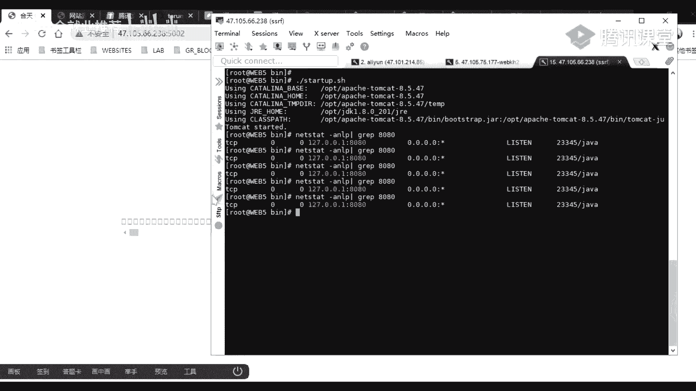

大家可以尝试一下，下午访问没反应呃，这个服务这个服务它有问题，它所以说这个题目啊稍微有点问题吧，但是啊但是不影响，因为他的就是这个题目。

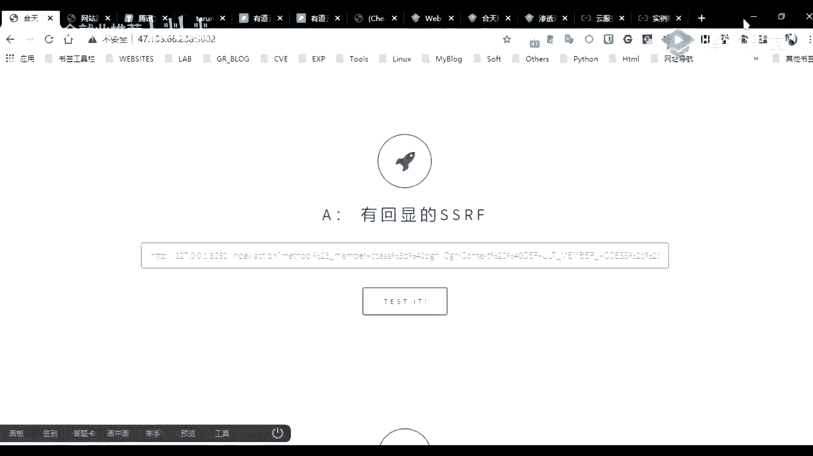

他的思路就是这样子嘛对吧，然后其实我其实我挺好奇，就是啊这个老陈仔好不老臣子吧，就是你的你说的通过这个呃公钥来去尝试的话，其实我没有明白，你为什么去想到使用公钥来去尝试。

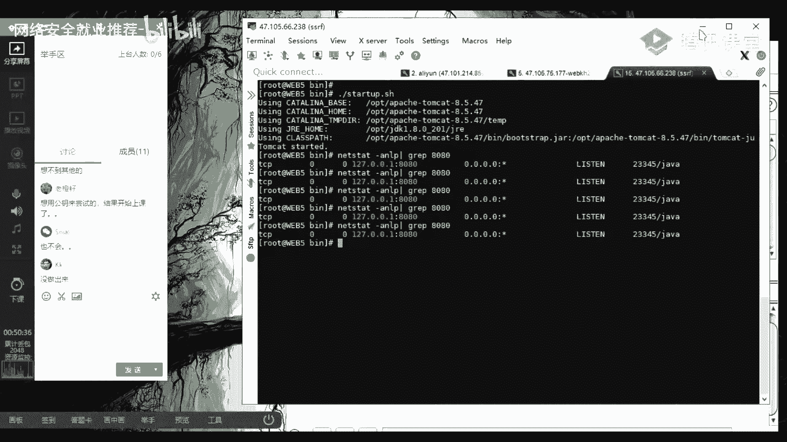

就是说这里的话啊，你通过公钥的话，你是啊你的一个思路是什么呢，啊就是你去使用什么样子的一个方法，去建一个利用的话，你首先你要有一个前提，你要能够去就说你能够去啊去使用到这样。

能够去实现这样子的一个方法对吧，而我们其实通过前面的一个思路对吧，前面的一个做法，我们通过这样子的一个啊，通过他的一个呃端口服务的一个，信息的一个探测的话，就是我也发现这样子的，就说这这些端口的话。

他是没有说能够去啊写我们的一个s s渠道，然的话如果说你能够知道这样子的，就你已经知道了，他的这个structo这个框架对吧，能够去执行命令，能够去执行命令，当然的话你就可以去写嘛。

他的话如果你能执行命令的话，直接弹一个shell啊，其实雪公要的话更加更加稳定一点，但是的话你写公钥的话，你是无法去直接的，就说你在公网的话，你是无法直接的去访问到内网的这个服务的，明白我意思吗。

就是说我们需要它就啊，我因为我们我们是无法直接去从公网访问到啊，这个阵营的一个内网的，就比如说你一个企业，你你无法是，你是无法从，就说不通过一些通道来直接去访问到内网的。

而我们在这里的话是因为使用了这样子的，就是说利用了这个sf漏洞，然后的话能够去啊访问到内网的这样子的，一些服务，然后的话对内网的这这些服务发起攻击，然后一般的一般的话一个一个思路的话。

不会不会是说去正向的去连接，去迎接我们的这种需要，而是通过反弹shell就说通过啊内网的这种服务，他能够去访问公网的话，通过他就是说让内网的一个服务，来主动的去迎接我们在公网上面的一个小。

也就是反弹一个shell到我们的一个公网服务上面。

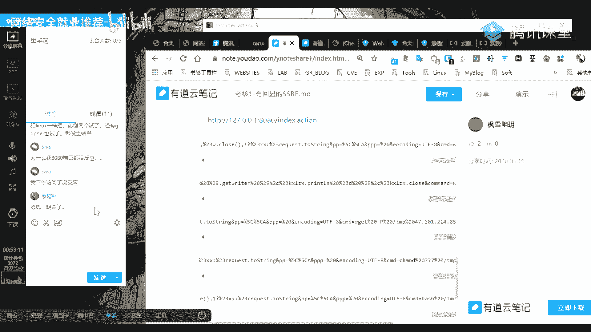

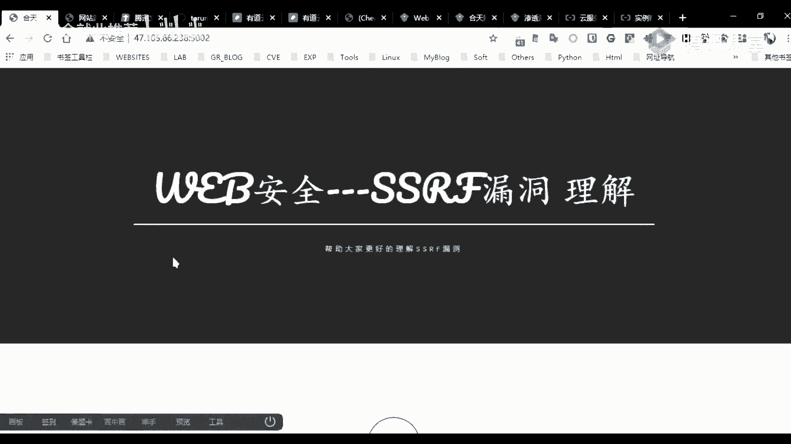

好的，这样的话就是第一个题目嗯，我把二八全点了，那第二个题目的话就是这个网站源码获取系统，就这一个的话就是这个页面，然后这个题目的话啊，我的锅就是我的问题，就这个题目的话。

我之前啊我弄上去了之后没有去测试，没有测试它它的一个就是它的一个功能，能不能能不能去使用这个这个题目的话，是我今天试了一下，是有问题的，我也我也没，我也没花太多时间去那个，就我试了一下的话是有问题的。

然后的话这个题目的话是大家没做出来，那也没关系啊，就主要的是理解思路，这里这样的话我主要就是介绍思路，介绍思路，以及就是啊介绍啊如何去利用那些方法，在这里的话，我们同样就是呃，我们同样的话就是。

首先的话就测试它能够可以去使用的这种，url的一个协议对吧，就是跟前面的话也是类似的一个方法，在这些常见的这种题，然后发现能够去使用dict协议对吧，能够去使用这种dx协议的话。

那么我们就去探索了一个端口嘛，存放的一个端口，然后探测完之后的话，通过bp的一个爆破，爆破的话能够发现他就是嗯开放的多，开放的端口，有这样子的一些端口，就是有八零啊，还有3306，还有6379。

然后访问801端口之后的话，其实就是这里的一个首页啊，我们来访问一下，80880端口发完之后的话，其实它就是当前的一个就是这里的一个页面，就是它的一个源码，然后的话就是呃3306。

330的话也也是一个数据库，然后我们主要的话就是看这里就是6379，6379的话就是我们常见的一个radio，然后常见的，然后这一个瑞典式的话，就是碰到release的话。

大家首先可以去想去尝试去使用这种，去使用radius的一个未授权，然后因为我们前面也介绍了对吧，就是radior的一个未授权的话，未授权访问的话，我们是能够去get sh好，get shell的话。

这里的一个ladies get shell的话，有以下的这样子的一些就是啊利用的一些方法，就是能够去反弹一个shell，我这句话主要就是介绍这些方法吧，因为这个题目的话是我试的话是有问题的。

就是一直都写不进去，好啊，大家要做的话，其实可以去那个就是我们实验室，就是那个绿dise，就是s25 攻击内网radio的那个实验，去建一个尝试好，这样的话我首先就是我们首先来看一下第一种。

第一种的话就是我们通过写入这样子的s h k，也就是我们昨天的昨天的那个呃，那个weblogic的那个s s f对吧，那个的话啊我们通过探测的话，通过端口探测的话，发现他内网是开放的，有这样的一个啊。

开放了一个6379的一个端口啊，这一个6379的一个端口的话，正好是radio，那我们可以通过他的一个cf的一个注入是吧，来去发送我们这样子的一个呃，就像我们的一个radios服务。

发送我们的这样子的一个啊脚本，发送我们的一个payload来去写入我们的一个s曲，s区的一个key啊，这个key的话它的一个生成啊，其实昨天也讲了，大家有没有去尝试啊，这有没有自己去尝试。

去生成这样子的一个s h key，以及啊就通过明密登录对吧，这些的话是比较呃，常见的一些就是知识点啊，然后的话呃，首先的话我们想要去利用这样子的一个，写入hp的一个方法，我们需要生成这样子的一个t。

这个key的话其实就是一个公钥，这个公钥的话，我们需要把它写入到我们啊。

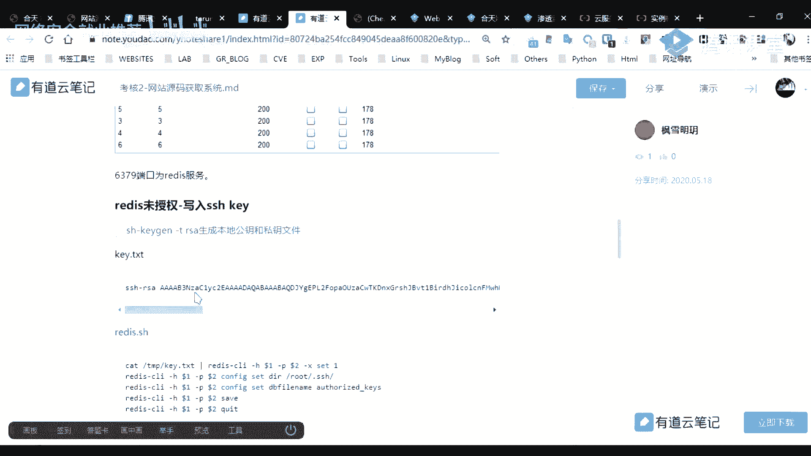

要攻击的那个服务器的一个呃，这个目录，有一个点取的一个隐藏目录，然后要把它写到这个authorize的kiss，这样子的一个目录，下面，这个目录的话，里面的话就存储在我们的这样子的一个公钥。

然后我们把它写进去之后的话，我们就能够在我们的就是啊含有私钥，就是说还有私钥的这个工这个服务器上面，来去敏密的去登录哦。

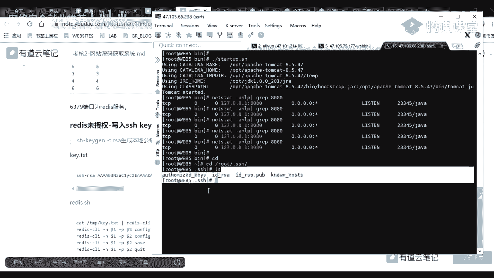

我们写入公钥的这样子的一个机器，当然在这里的话也是同样的，就是说，也是就是说同样的，就是我们在这里写入进去的话，写入到它的一个内网之后的话，其实呃就是我们无法去直接去进行一个访问的。

然后这一个这里的一个写入hp的二次，针对于那些在公网上面的这种radio，这种radio的一个未授权这种漏洞对吧，我们可以通过写入这个key，写入到它公网的服务器上面，然后的话我们再去啊。

再去通过我们的一个呃私钥所在的一个服务器，去连接这一个啊，目标的这个服务器也就不需要去密，不需要去使用到密码来去进行一个登录，然后后面的话呃就是，一个脚本就说我们去对这样子的一个radio。

是未授权攻击的一个脚本，其实这个脚本的话跟我们前面讲的那个radio，是未授权的这一个呃，写入电池任务的这个脚本其实是类似的，它这个圆它的一个原理是一样的，就是我们在这里的话，我们把这个key对吧。

把这个key把它写到这个key text文件，然后我们把它放到这个tap目录，或者说其他目录，我们通过cat cat的话就是反问，就是啊，就是读取这个文件里面的一个内容嘛对吧。

然后的话我们把这个读取的一个文件内容，作为这里的一个输入，这里的一个输入的话就是通过radio啊，就是通过radios客户端去连接指定的一个啊，release的一个服务器，好的话。

把它那个啊值就是添加一个这样子的一个key，唯一的，然后值为我们在这里写啊，写入的这一个s h p的一个值，添加这样子的一个啊key，然后的话再去好，通过radio去的一个config的一个设置。

来把我们的这个值写入到这里的一个root。s，取得一个目录下面的这个authorize，key的一个文件里面，我们知道这样子的一个脚本的话，我们回想一下，就是我们上节课讲那个电写电池任务的时候，对吧。

我们需我们想要去，好像我们的这样子的一个video服务器，发送我们的这种，数据的话我们需要对这些数据做一个处理，然后这里处理的话，我们首先需要获就是获取到他的这样子的，一个发送的一个数据。

其实这个数据的话，就这一个数据的话其实都比较类似，就比如说我在这里的话，我在这里是使用了这样子的一个脚本对吧，所以呢一个这样子的脚本去获取share对吧，然后我通过啊这个socket来获取到它的。

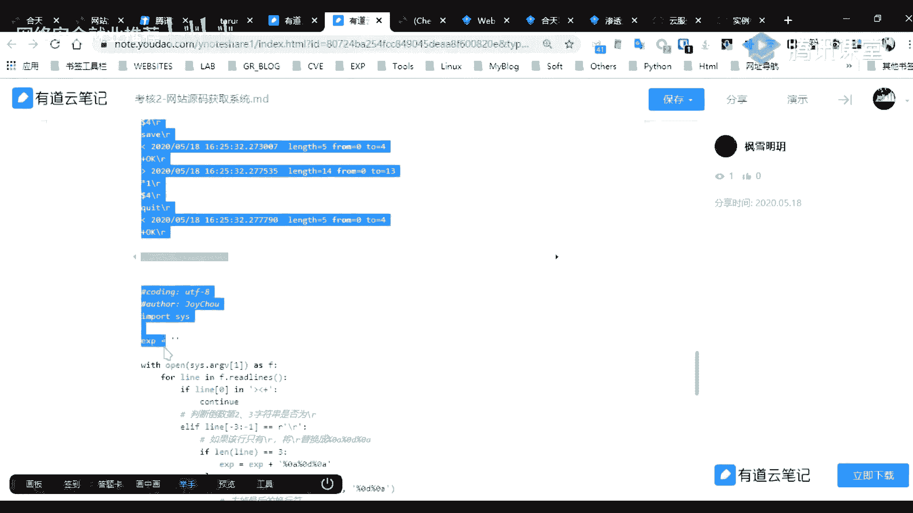

一个传递的，这这里的一串数据是这样子的对吧。

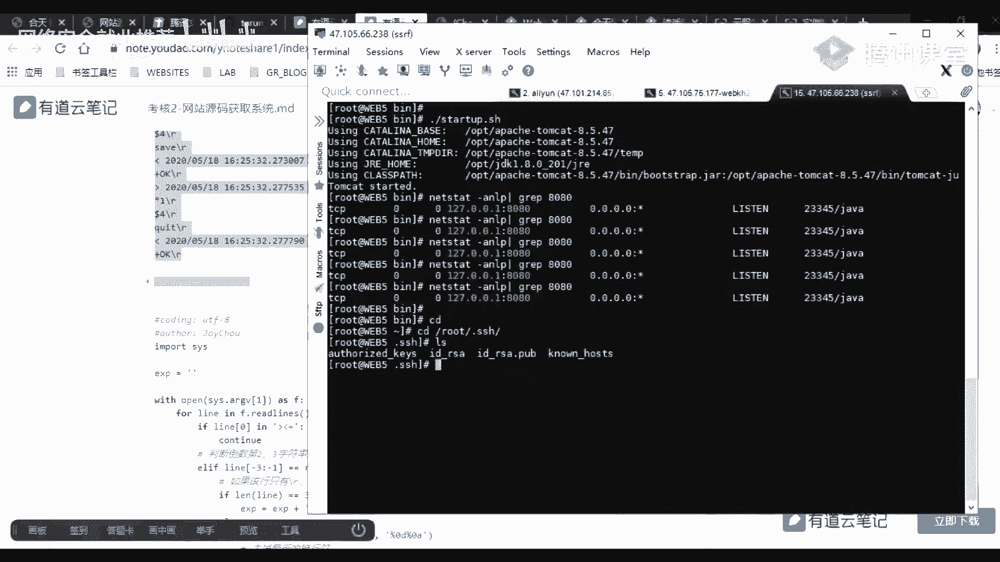

然后的话，我们可以把我们这里获取到ak。

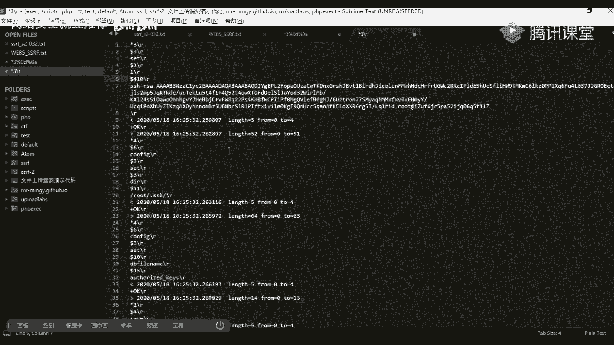

把它给抠下来，抠下来之后的话，其实。

与我们前面来做一个对比吧，前面的是，这个，这个，我们呢前面的这一个做一个对比。

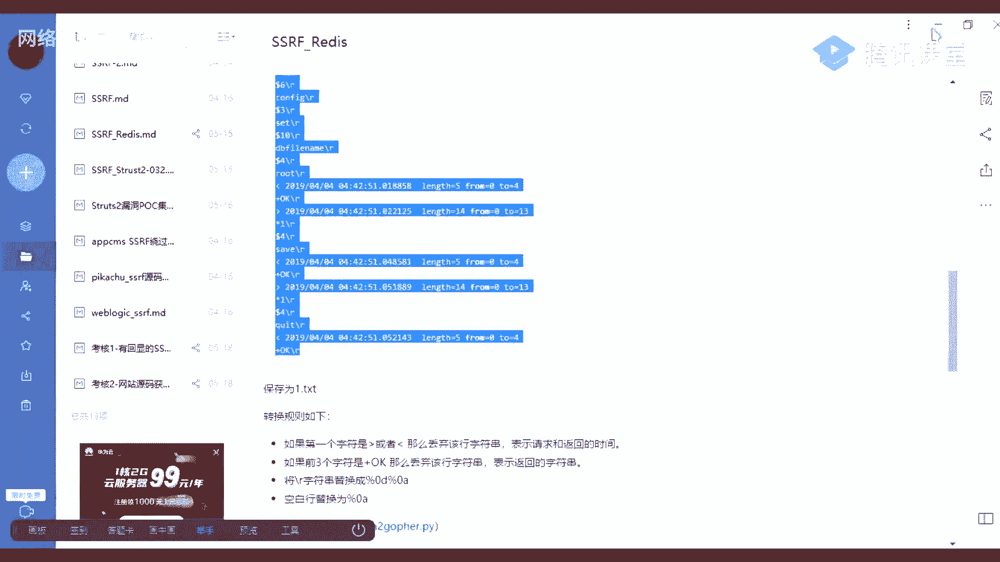

其实可以发现的话，其实前面的这样子的一些内容的话，其实啊类似的，然后主要它的一个不同的话，就是在这里的一个啊你执行的一个命令，也就是这里的一部分，可以看到我们前面写这个电使用的话，就是在这里嘛对吧。

我们的一个啊定时任务的一个脚本，就是写入了这里，然后的话把它就是通过set嘛，通过set设set了，就是添加了这样子的一个啊，t唯一的这样子的一个啊进，然后有了这一个镜的话，我们再添加了这样子的一个值。

就是一个电视任务的一个脚本对吧，然后上面的话其实就是我们添加了这样子的，一个镜为一，然后值为我们的这样子的一个啊，s h key的一个啊脚本，然后它还有的一个不同的话，就是我们这里的。

我们这里config sert的这样的一个目录，就电池任务呢它的一个目录是这里吗，是这样子的，就是set d dr就是set目录嘛，然后再写s h k的话，就是这个目录嘛对吧。

其实都是类似的这样子的一些数据。

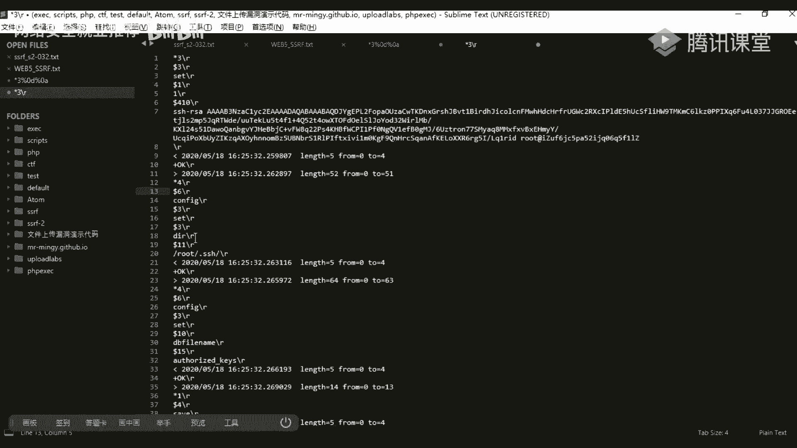

好的话我们针对这样的一个数据的话，我们要处理。

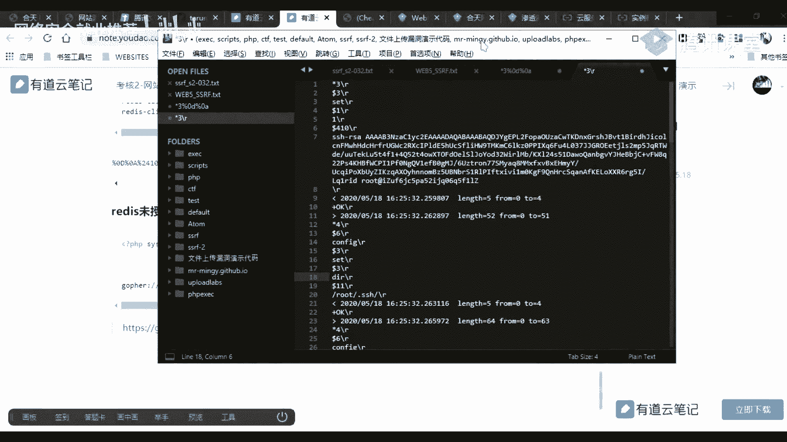

我们要就是要把它呃进行一个处理，把它转化成我们能够直接去使用go for协议，使用这样子go for协议去进行一个发送，所以的话我们需要对它这个转换，而转换的话。

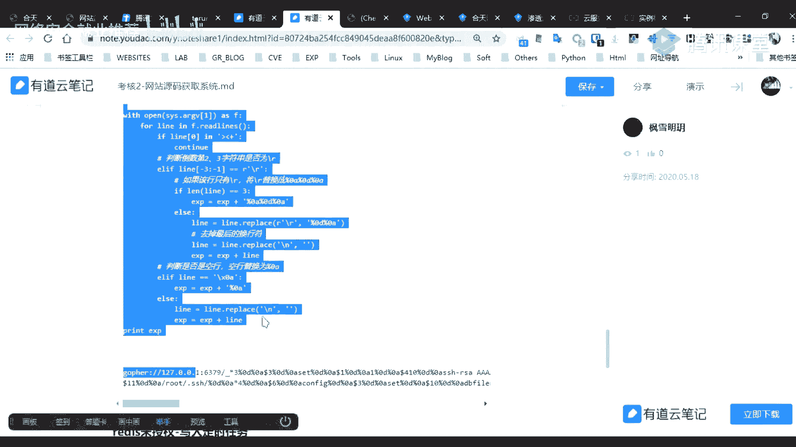

其实就是呃这里的话有一个脚本，就不用脚本也可以啊，我们的一个他的一个转化的一个规则，其实就是我这话给大家说一下，就以上面的这一个为例，上面这里的话，其实呃开头的话也是有这样子的一个，就是时间嘛对吧。

就是说它的一个请求请求了一个时间，好的话，我们获取到的话就是这样子的一串值嘛，我们首先第一个规则的话就是，把这里的有这种开头的，就是有这种方向就大于小于开头的，把它给删掉，就是把它给去掉。

然后还有的话就是像这种加k加k的这一行，把它给去掉，就像这种，这种多余的这种数据就没有用的一个数据，就是一些时间，还有这种返回的这种命令，执行成功之后的这种这种值把它给去掉。

去掉之后的话就是像这样子的一串，然后大家要注意的话，就是别就是别弄错了，就一般的话就是呃前面的话我们也说了，就是五条命令吗，它返回的话就有五个ok要把这五个ok都给删掉，然后的话呃前面的话就是。

两条转换规则，然后第三条的话就是把这个杠啊，这干拉的话其实就是我们的一个呃换行嘛，好不回车嘛，好我们需要把这个杠杆把它给转化成，就是我们这里是换行吗，好吧，这里是回车嘛，黑车的话。

然后我们需要把它转化成一个啊，就是换行回车回车，换行就杠啊，杠n这种好的话，需要把它转化成我们的一个basin，和一个u2 的一个兵嘛，也就是百分之，0%d 0%a。

这个的话就是我们的一个回车换行这个url编码，然后我们需要把这个杠杆全都给它替换掉，也就这些，全都给它替换成0%，d 0%，a，好听完之后的话就是像这样子的一串数据对吧。

然后的话我们需要把就是多余的这种换行，把它给删掉，就把它给画，换成一句话。

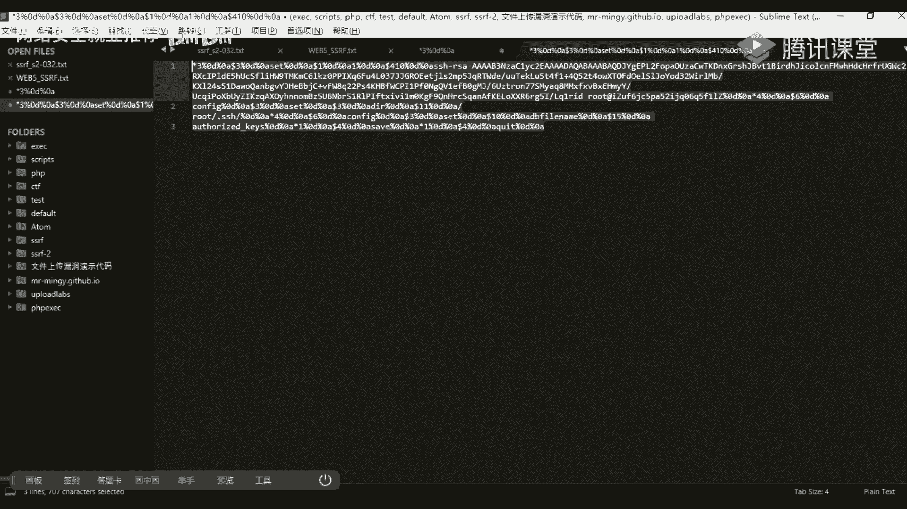

然后在这里的话就是其实就是我们的一个po的。

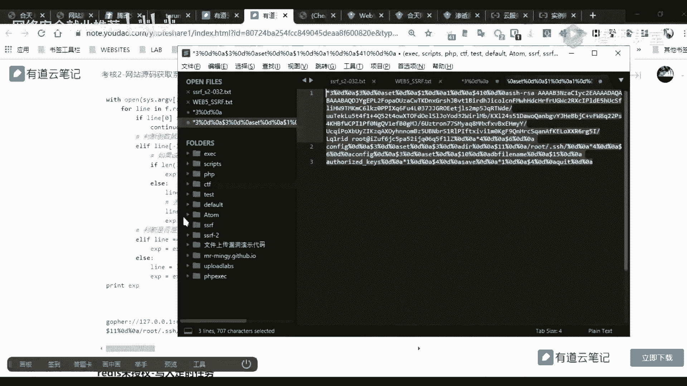

然后这里的一个po的话，我们直接可以通过我们的一个go for协议，直接去进行一个发送，然后go for的话啊，这样的话再提一下，就是go for的话，我们前面的话是写我们的一个ip以及端口嘛。

也就是我们服务的一个ip以及端口，然后后面的话有一个竖形啊，就是下划线，就注意是杠下划线，下划线后面的话是接我们的，就是要传递的这个数据，也就是我们要发送的这样子的。

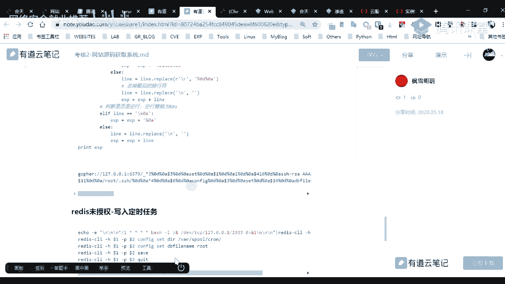

这样子的一个payload，比如这一串值就是我们这里得到的这一串值。

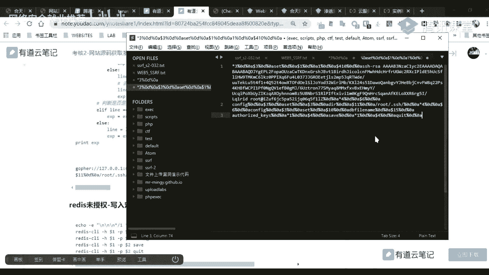

然后的话我们直接通过高f协议区，进行一个发送。

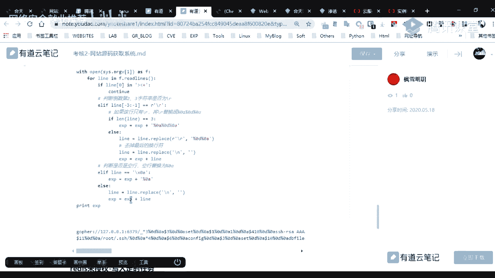

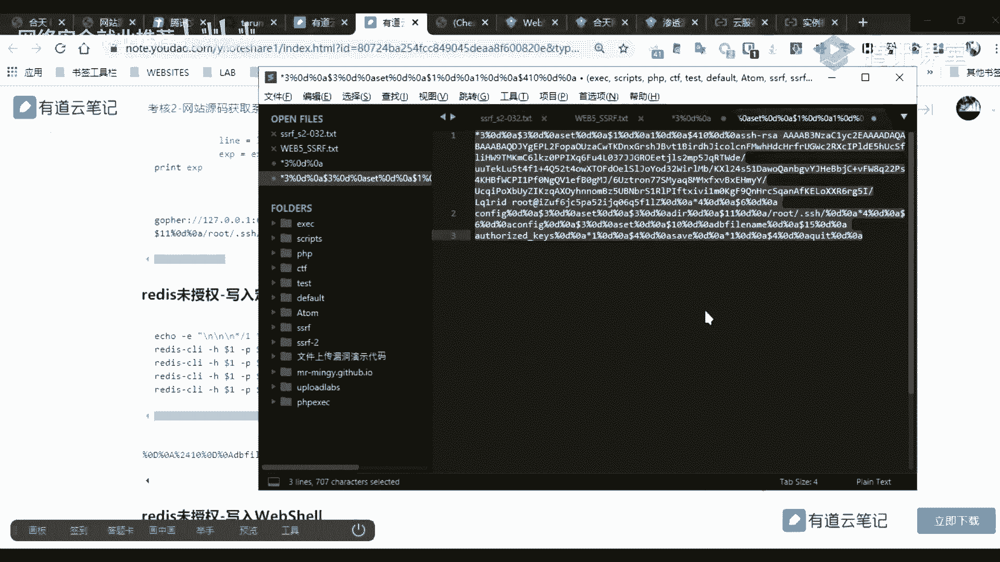

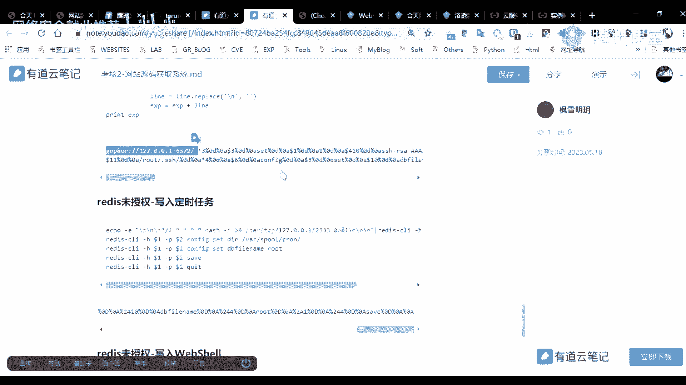

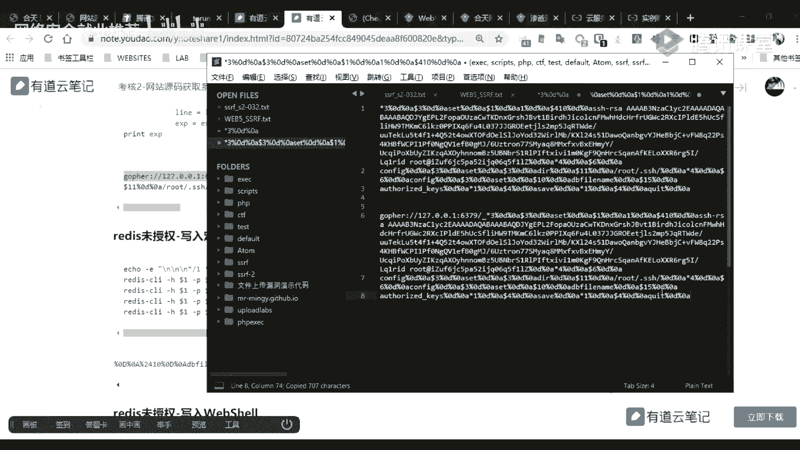

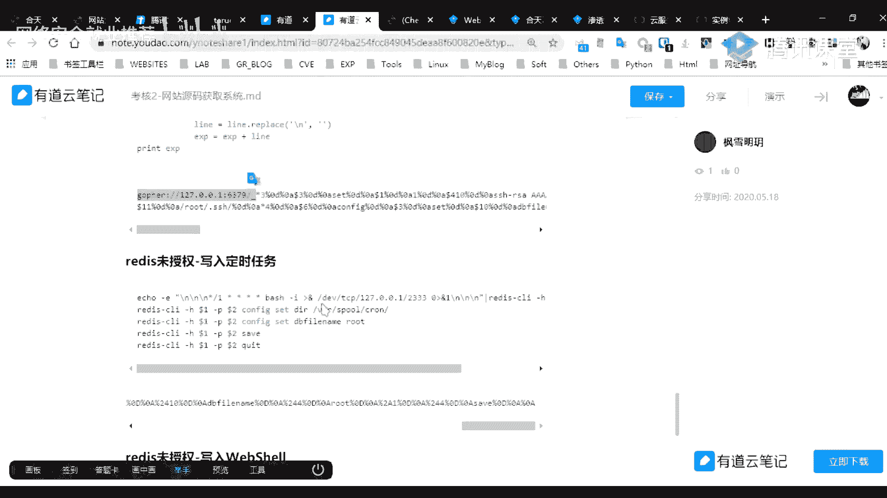

也是这就是我们构造了一个po的，诶，不对啊。

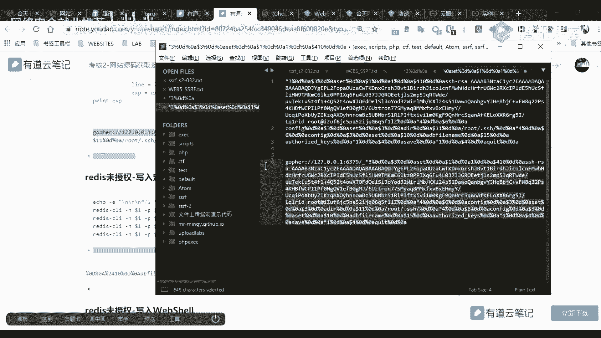

这样子才是一句话一句话好的话，我们就可以通过这里去进行一个发送，然后其实前提的话，因为其实我们在去进行这一步之前，其实我们需要对我们的这种go for协，去进行一个测试对吧。

你首先需要测试它是否能够去支持，我们的这这种协议，对啊，如果他不支不支持这种go f协议的话，那么我们我们就无法去进行一个，通过go for协议去发起我们的攻击，所以的话我们前期的话就是你能够啊。

证实能够去测试出来。

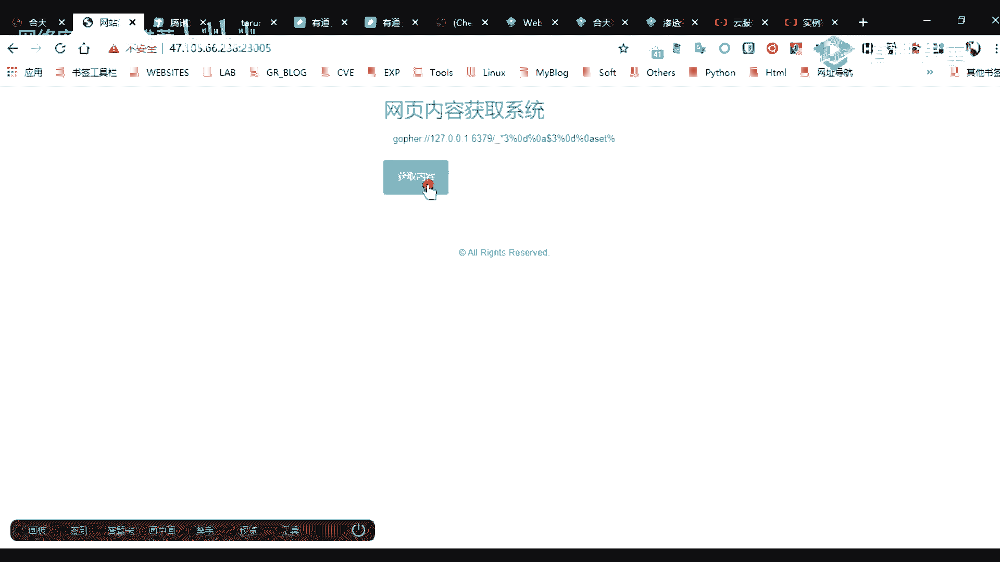

它是能够去支持这样一个go或协议的，然后我们直接去进一个发送，那么这里的话是有问题的，我是在一个就是做了一个多，是有做了这样子的一个多，这就是它的一个源码，然后的话呃，然后这里的话是没有写进去的。

这个题目这个题目的话有点问题，我这句话之前没有去进行一个测试，然后其实这里的话一个key都没有写进去，也就是我们的这里的，就发送的这个数据，没有到我们的这个radio服务器这里。

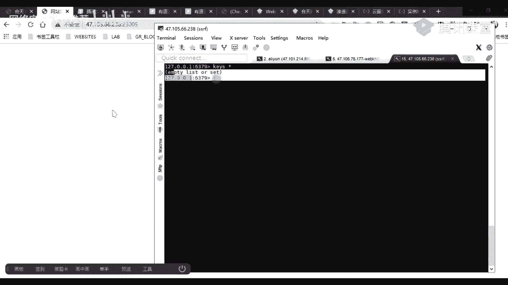

我，然后这个题目的话我们主要讲思路吧，前面的他就是通过这个radio所写，我们的一个s h p，就是我们如何去构造这样子的一个payload，就构造构造这种通过go for协议去进行和发送的。

这种配置的，然后的话就写定时任务的话，其实也是一样的嘛，也是一样的，呃其实这种的话讲一个其他的都类似，然后的话就是这一个，瑞典是未授权写入web share，像我们也可以通过瑞典所谓授权。

就是像我们的一个web根目录，直接写入我们的这样子的一个一句话码，对我们可以直接直接通过写入，因为它本身就能够去向我们那个服务端，就是release，他未授权，他本来就能够向我们的一个服务器。

写入一个文件嘛对吧，那么我们也可以直接写入我们的一个一句话，木马嘛，然后他写了一个一句话木马的话，其实嗯其实也是类似的，就写就是比如说像这样子的一个脚本，然后的话它就把它的一个就是。

把我们的这里的这个内容对吧，同样的就是呃就像在这里嘛把它存一个文件嘛，存一个文件之后的话，我们把它就是写入到啊任意的一个镜，然后把它的一个值的话，就设为我们这里的啊一个一句话码的一个内容。

然后的话就是通过这样子的一个脚本对吧，来去就是得到这样子的一个数据，其实我们也可以就是说直接直接更改它的，这样子的一个数据，就把这里把这里的一个内容把它给改掉，改成我们的一句话嘛。

然后的话相应的这里的一个这里的一个字符，这里的一个字符数，我们同样的需要做一个更改，然后字符数的一个计算的话，其实就是这里的一个数值，然后这里的话总共是有400 410，最后的话再就是给大家一个脚本吧。

就这这里的一个有一个别人写的一个脚本，就这个脚本的话就省略了，就是这里的这样子的一些步骤，就前面的这种获取这种的，然后去进行一个你手动的，去生成这种配套的一个步骤，这脚本的话就直接通过呃执行这一个脚本。

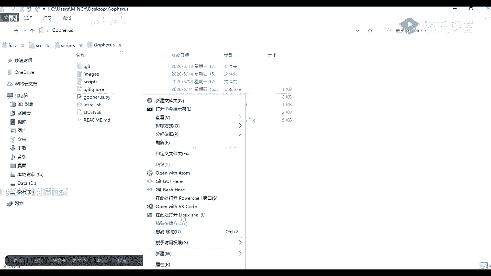

就能够生成对应的这种payload，和，通过这一个，deploit这个参数，然后这样的话它是支持有这种mysql啊，还有first cg i radio和sumtp啊，这个dbs还有其他的这种呃。

其他的这种服务，他都能够去用这样的一个脚本去生成这样子的，就去生成能够使用这种好，不能够去使用go for协议去发送的这种pload，然后我们这里的话是使用radio吗，radious好。

这样的话他会让你选这样子的一个，就是啊你想要的一个shell，可能第一个的话就是反弹shell，反弹shell的话，其实它就是一个写入一个定时任务来反弹shell。

然后还有的话就是写入一个菲律宾的一个web shell，我们可以，然后这里的话就是输入你反弹需要的一个ip嘛，也就是我们呃就那个bash shell，那个bash就是dv tcp。

然后后面我们要反弹的一个i p，后面的话默认就行了，然后它就会生成这样子的一个啊，能够去使用go for协议，去好发送的这样子一个payload，而我们只需要去在我们的一个，我们这里输入的这个ip。

这个公网ip的这个服务器上面，今天一个1234的一个端口，然后的话我们通过go for协议，发送这里的一个字符串好吧，发送这样的一个配偶的就能够反弹一个shell回来，就是从它的一个配偶的。

其实我们也能够就大概能看出来，它就是啊跟我们的一个写定时任务是一样的，然后他的一个反弹的一个呃代码号。

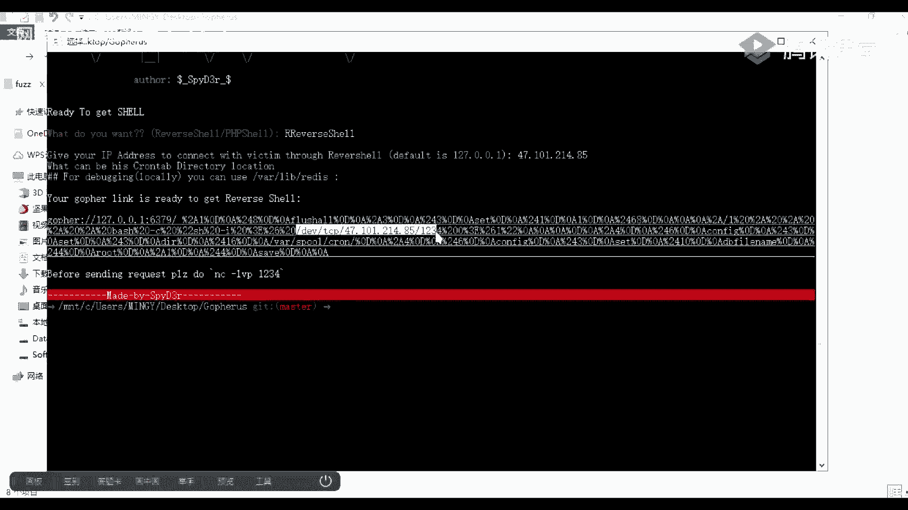

就是这里嘛通过代写的那个dv tcp去反弹的，然后其实像这种的话，其实大家如果懂python的话，自己也能够去写的，我们其实可以看一下它的一个代码，就是这个生成radio的一个代码。

它的一个代码其实就是啊主要的话就这两块，就这一块pro的，还有这一块pro的，这两块pro的话，其实就是我们刚刚的那一个一个反弹shell，以及写入一个web shell的一个hero的啊。

其实这里的话我们能够知道啊。

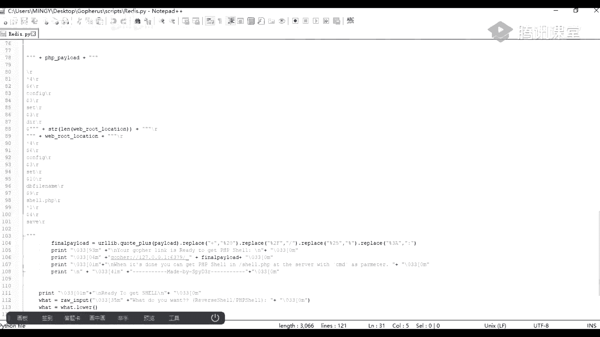

也能够发现，其实跟我们前面这里啊，跟我们前面。

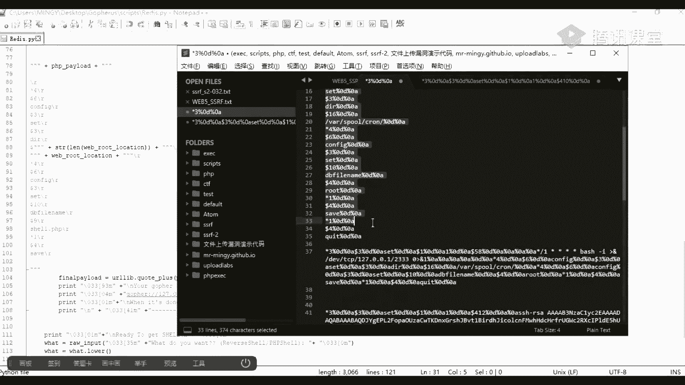

这样子获得的这种是一样的对吧，他也是这样子去进行一个构造的，然后这里的话它是呃获取到了这样子，然后把里面的这样子的一些就是可变的，一些参数值给它做了一些处理，就把它做成了一个变量嘛对吧。

像payload，我们在这里的一个p h p的一个payload啊，这个是返回一个p h p的web share嘛，我们这里的一个payload的话，其实我们是可以去直接去输入自己的一个payload。

好的话，我们输入po的之后的话，他就会把它拼接到这里。

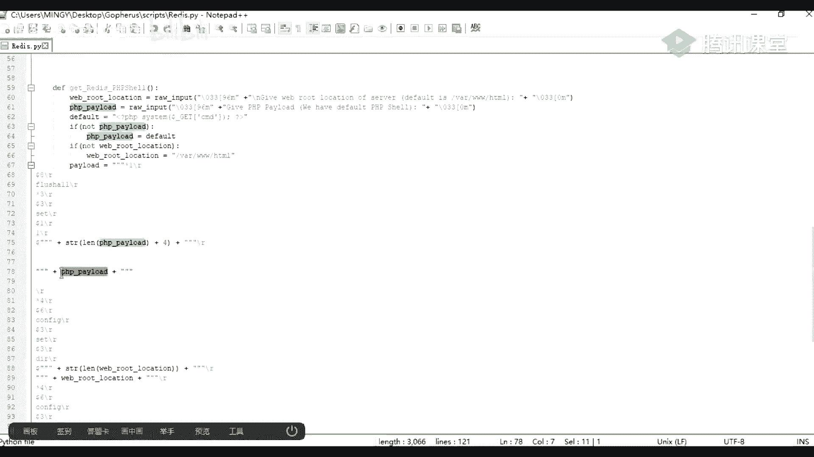

就把它添加到这里来，然后这里的话就是我们这里输入这个payload，它的一个长度嘛。

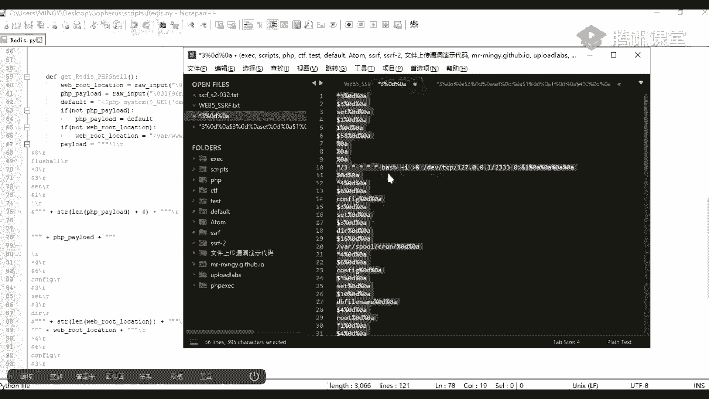

也就是我们的，这里的一个长度，这样的话是58，也就是这一串的一个长度嘛，然后以及就是我们的一个web的一个目录，这里的一个web目录也是呃，就是每一个web服务器都不一样嘛，对吧，你可以去自定义。

好的话再对他做一些处理，这里处理的话，他把他已经把那个就是多余的这种这种呃，时间什么的，还有这种加ok呀，这种加ok的这种都已经给删除掉了，然后他剩下的只需要去进行一个处理的话，就是像这个干扰对吧。

这尴尬的话我们其实也能够看到它，这里刚刚的话是把把它做了一个替换，它是有把它做一个替换的，那，a代码呢。

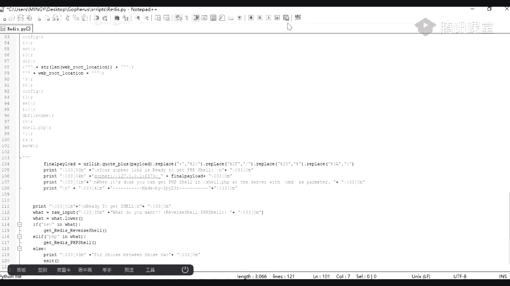

他这句话同样的是有把这个杠二给做一个替换。

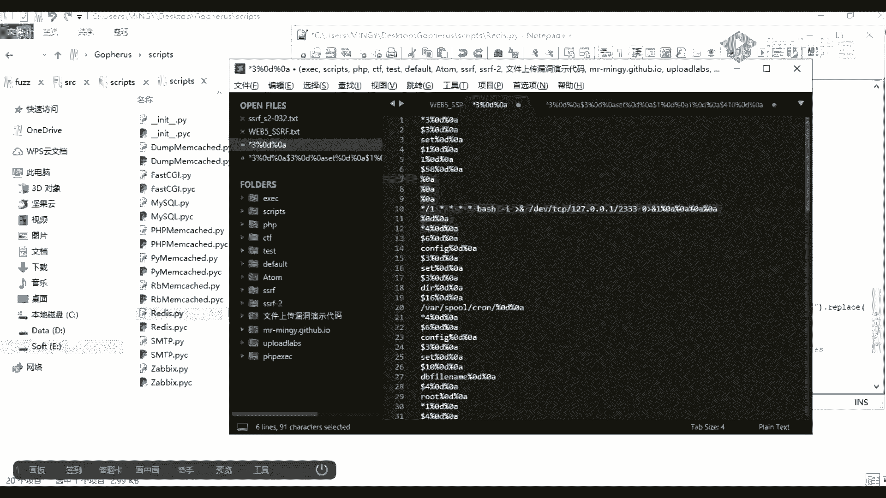

替换成了我们的那个百分之，我们从它的生成的代码来看，呃这里所以我们可以看一下它，同样的就是可以看一下这里0%d，0%a对吧，然后跟我们呃这里的话其实是一样的。

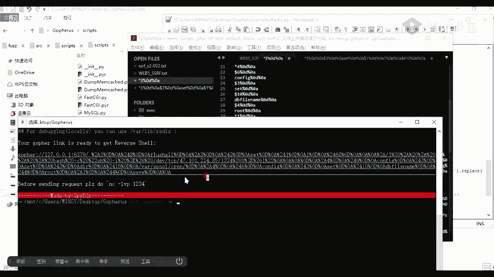

就0%d 0%a对吧，然后这里的话他是做了一个大写的。

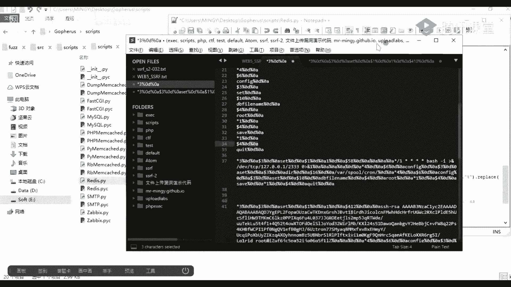

一个就全部都统一了一个大写嘛，它上面的这一个也是类似的，就写入一个电池任务嘛，然后我们这里输入这个ip。

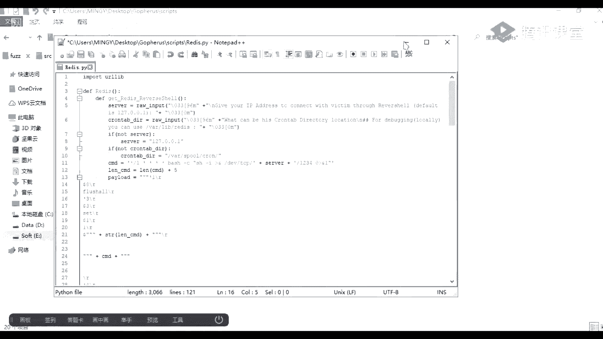

就我们的一个服务端的一个ip端口的话，是写死了一个1234。

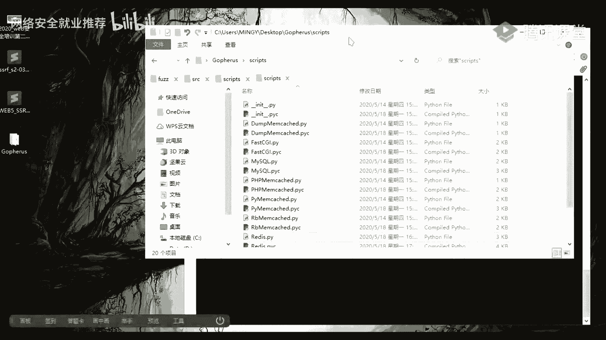

这就是他的一个脚本啊，那这种的话大家其实呃你写了之后的话。

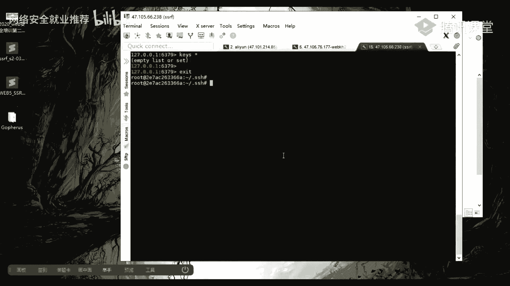

其实也可以自己去进行一个书写，就如果懂python的话，还是比较简单的，然后的话呃本节课的一个内容的话，大概就是这些有，然后大家有没有什么疑问呢，有没有什么问题啊，大家有有没有什么疑问。

或者说哪里哪里没有听懂啊，哪里没有懂，都可以提出来，都没有问题吗，都没都没有问题的话，那么，把这个发群里啊，这两个文档我都发群里了，大家可以去，就是可以把它做一个笔记嘛，然后这一个这一个文档的话。

我也发群里了，然后哦本节课的内容就到这里结束了，大家没有问题的话，那我下面的话呃，稍微就是花大家一点时间。

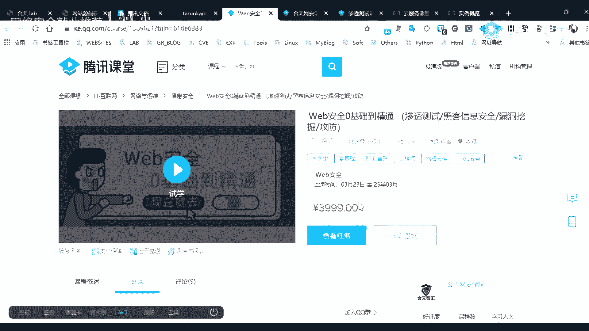

就是打个广告吧。

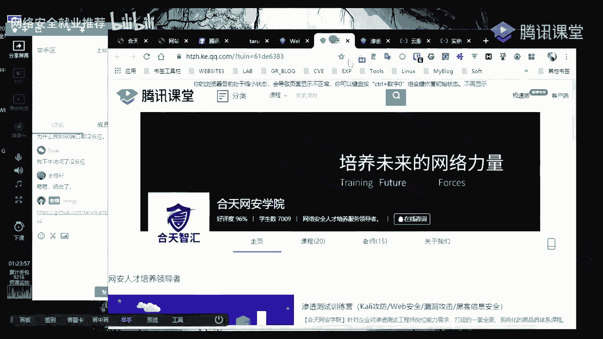

就我们的这一个web的一个就是web安全，连基础到精通的这个课程的话呃，就课程内容的话，大概的话就就就结束了，就到这里的话，后面的话还有就是一些还有一些内容嘛，就还有三节课，然后我们我和天王学院的话。

就是最近的话又上了一节课，我不上上了一门课程，这门课程的话就是一个渗透测试的一个训练营，然后这门课程的话嗯，大家可以去看一下，这门课程的话大家可以看一下目录啊，现在的话是已经开始在报名了。

就是啊把等这一次的一个web的一个内容，弄完之后的话，我们下一期的话就是嗯，讲这一个渗透测试的一个训练营，给一个内容，主要的一个内容的话，其实就呃大家可以看一下目录吧。

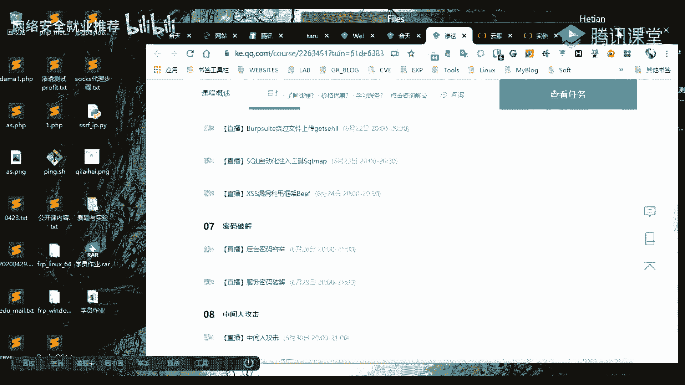

呃，大家可以看一下这个图片，这里的话就是主要我们呃一个基本的一个大纲，就是嗯会讲的一部分的一个内容，就是主要会讲的一些内容，当然它不是所有的一些内容啊，就不知道大家有没有去了解。

就是渗透测试的一个基本的一个流程，然后下节课的话那个好，下节课的话应该会也会给大家基本的一个介绍，就是渗透测试的一个基本的一个流程，好的话啊，我们这一个课程的话，就是呃针对这一个渗透测试的一个流程的话。

而是专门设计的一个，就中间它所涉及到的一些知识点的话呃，给大家做一个就是讲解，然后比如说有包括就是我们常常用的一个mad，spm sf，他的一些攻击的一个实战，还有的话就是web漏洞利用的一些集合。

就包括um weblogic strike，two jboss等等的这种，还有三个菲律宾等等的这种漏洞的一个利用，然后其实web的话就是在渗透测试里面的话，web的话是只是就是占了其中的一块。

然后主要的话还有其他的一些，就是像比如说我们的一个，就渗透测试的一个流程，首先在第一步的话就是信息收集嘛对吧，信息收集的话，我们啊，因为我们其实现在的话就是呃，这种进行一个渗透测试的话，它的一些啊目标。

它都是从一个web网站开始的对吧，就比如说你去y s21 ，你也是通过这样子的一个web网站开始，然后的话针对这样子的一个目标，去进行一个信息的一个收集，好进行信息收集的话，就有这样子的一些信息。

比如说域名子域名，ip端口等等的这样的一些信息的一些收集，你在外表外表的话其实也有讲，然后的话呃，在这里的话可能会就是更加全面一点，好的话，我们再去通过相应的一些web的一些漏洞对吧。

通过这样子的一些web漏洞之后的话，得到它的一个web服务器的一个需要，得到这一个需要之后的话，我们还能够去进行，我就说我们得到这样子的一个需要的话，我们还能去干嘛呢，然后下面的话就是对。

针对于我们就得到这样子的一个web shell之后，我们能够去进行的一些操作，也就是我们能够去进一步的一个测试，好进一步测试的话，像在后面的话就有这样子的一些啊，我们针对我们得到这个web share。

就通过这一个啊web服务器的一个web share，来去进行一个内网的一个渗透对吧，因为其实呃在就是我们的一些业务啊，一些业务的话，它会有这样子的一些就是边界区，这一区域的话。

就像比如说我们的一个dm之一的一个区域，这种区域的话啊，一般的这种工企业的这种web服务器，它都会在这个区这个区域的话就是好，它是能够去访问外网的，外网能够去直接访问到，然后的话在内网的话呃。

因为有一些数据，它是需要从内网去进行一个获取的，所以的话他其实也能够去访问到内网的，这样子的一些资源，就比如说我们那个s s f嘛对吧，他同样的呢就是如果它没有，它存在这样子的一个啊漏洞。

能够去允许访问内网的请求，内网的一个资源的话，然后的话我们就能够去通过这样子的一个web shell，来进一步的去攻击内网，然后攻击内网的话，我们怎么去进行一个操作呢，就是他中间涉及到哪些知识点。

对就同样的进行了一个内网渗透的话，它同样也是需要去进行一个信息收集，他信息的一个收集的话，就不是说像这种我们进行一个web渗透的时候的，这种外表的一个域名的这种信息收集了，然后在内网的话。

我们进行的一个信息收集的话，主要就是主机对吧，就在内网的话主要就是一些啊机器嘛，就服务器，还有的话像pc机等等的这种信息的一个收集，然后包括呃主机的一些凭证，凭证的话，就是我们的一些密码信息对吧。

登录信息等等，然后我们通过这样子的一些信息的话，来去进一步的去，就是扩大我们的一个攻击的一个范围，然后这一个这样子的一些操作的话，都是在内网去进行一个操作，然后进行在内网操作的话。

中间的话哦会有涉及到这种像内网反弹shell对吧，我们需要从内网当中如何去反弹一个shell，反弹一个稳定的这种shell反弹到我们的一个外网，然后的话我们直接通过外网能够去直接去啊。

攻击内网的一个机器，因为你毕竟sf像这种sf漏洞的话，它同样的是有局限性的，就他就没有说像直接反弹一个，需要来这样子去容易操作，好的话，还有的话就是像这种内网代理啊，就通过一个socket代理。

我们因为企业的一个内网的话，它不是说只有一层的，就一些复杂的一些企业的一个内网的话，它很多层就说一层一层的，而且的话内网的一些呃机器的话，它有些像比如说银行定网等等的这种机器，它是啊就它的一个机器的话。

它是不允许去访问外网的，它是没有外网的，所以说针对这样子的一些，无法去访问外网的一些机器，然后的话它因为又是在内网，我们在外网也是无法直接访问到的，所以的话我们可以通过这样子的一些，内网的一个代理。

也就是socket代理，来建立这样子的一个socket的一个通道，然后的话稳定的去进行一个内网的一个，渗透的一个操作，然后还有就是权限的一个提升，权限提升的话简单来说就是提纯吧对吧，像我们常经常去呃。

得到的这种web的一个权限的话，它就是一个web服务器的一个权限，再比如说阿帕奇还像呃i s等等的这种，它是一个普通的一个权限，然后这些普通权限的话，它的一个操作是有限的。

我们需要通过一些方法来把它提提纯，比如说在那个层面的话，就把它提取提成为我们的一个root权限对吧，因为我们的一个权限越高的话，我们能够去进行的一些操作的话就更多。

然后还有的话就是我们获取到它一个权限对吧，我们想要去持续的去，就是说持续的去对内网的这种机器，进行控制的话，我们就需要对它做一个啊权限的一个持久化，就需要利用一些技术，像比如说呃我们的一些进程注入。

把我们的一个呃，需要把它给注入到我们的一个进程当中，还有通过第二劫持等等的这样子的一些呃方法，来维持我们的一个权限，然后最后的话我们就是大概的这样子，过了这样子一个流程是吧对吧，我们就需要收尾嘛。

收尾的话就是把我们操作一些痕迹啊对吧，因为你在内网去进行操作的话，它其实在这种windows机器定是机器上面，你去操作的话都会有留下这样子的一些记录的，好的话，我们需要对这些记录做一些清除。

就是不让别人发现嘛对吧，然后呃刚刚的话我针对了我们这个课，课程大纲的话，就是大概的给大家就是介绍了一下呃，就是渗透测试，它中间会去涉及到的一些呃内容。

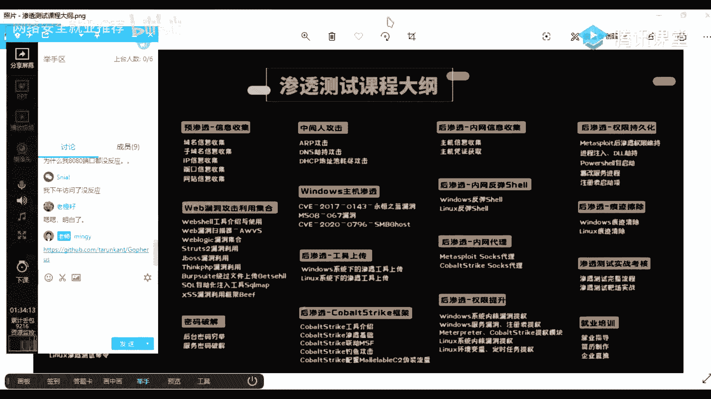

就呃大家可能就是大家可能就是接触的多的话，其实也是就是web相关的一些知识嘛对吧，就可能对于这些呃内网的这些知识的话，了解的不是很多，然后可能对于整个的这种渗透测试流程。

其实啊web安全和渗透测试的一个概念的话，其实也是比较模糊的，就其实你渗透测试里面的话，你也要去用到这样子的一个web，web漏洞的一些攻击方法，因为其实现在的话，这种都是在这个就web二点吗。

二点时代开始嘛，就是我们的这种web应用的话都是越来越多了，就是说一些啊业务什么的，都是通过web web应用去进行一个展示嘛对吧，然后的话其实web的相关的一些攻击漏洞的话。

是我们去进行这个渗透测试的一个路口，就我们通过这种常见的，就说常见的这种存在web漏洞的这种站点，来作为一个啊渗透测试，就是说走向内网的这样子的一个入口点，啊不知道大家有没有就是听懂过呃。

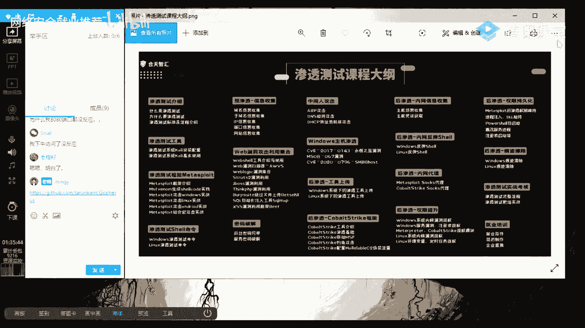

呃就是有没有大概的有一个了解，这样的话我就是大概给大家做一个介绍吧，就详细的一个内容的话，大家可以看一下这里的一个目录，然后呃这里的这里我要就我为什么要说这个呢，就是，我们现在这个课程的话。

就是新现在的话是原价是6588嘛，然后现在的话是有一个1000元的优惠券，然后这里这个的话是呃，针对就是啊没有报我们课程的那些同学，然后现在的话是呃，就是因为大家都是现在就已经有报了。

这一个web安全的一个课程，然后的话在这边这边的话，就我们这边商量了一下的话，呃，就是有专门给大家有这样子的一个优惠，就可以，就是在原来的1000元的一个基础上再减1000元，然后如果大家有兴趣的话。

可以去找班主任去进行一个了解，就是详细的一个详细的一些东西的话，倒可以找班主任去进行一个咨询，我这样的话就是给大家大概的一个介绍，就让大家有了解一下这样子的一个。

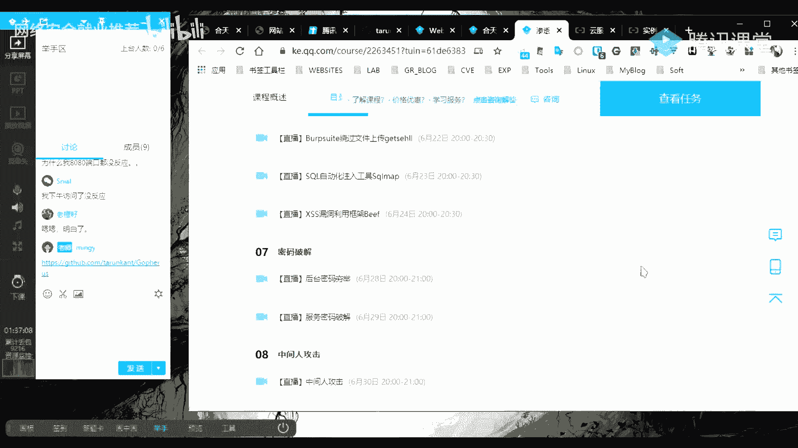

我们这里的一个新开的一个课程，好安静啊，大家没有什么问题要问的吗，啊那么呃大家没有问题的话，那么我们这节课就呃，就到这里就结束了，然后呃关于课程相关的一些问题的话，呃，大家可以去找班主任去咨询哦。

那我们本节课的话就到这里结束。