# 🛡️ 课程 P38：Web安全漏洞挖掘思路梳理

在本节课中，我们将系统梳理Web安全中常见漏洞的挖掘思路。课程将重点讲解如何手动发现漏洞，并结合扫描器进行验证。我们会逐一分析XSS、SQL注入、文件上传、文件包含、命令执行、逻辑漏洞、XXE、SSRF等漏洞的常见出现位置和挖掘方法，帮助初学者建立清晰的渗透测试思维框架。

---

## 🎯 明确渗透目标与常规思路

进行渗透测试或Web安全评估时，首先要明确目标。我们的最终目的通常是获取服务器权限（Get Shell）或窃取核心数据。

最常规的渗透思路如下：
1.  直接测试目标主站是否存在漏洞。
2.  若主站无果，则探测其子域名、C段IP、移动端App、小程序等资产。
3.  若仍无突破，则考虑进行社会工程学或钓鱼攻击。

整个过程中，最困难的环节是“打点”，即找到目标的脆弱边界作为突破口。本节课的核心就是讲解如何手动寻找这些“点”。

---

## 🔍 XSS（跨站脚本）漏洞挖掘

上一节我们明确了渗透的目标和常规流程，本节中我们来看看如何挖掘具体的漏洞。首先从XSS开始。

XSS漏洞主要分为反射型和存储型两种。挖掘思路非常简单：**有输入框就测试，有内容编辑功能就测试**。

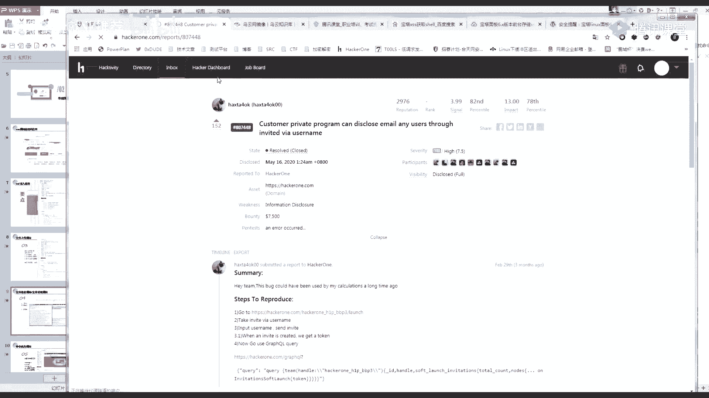

以下是XSS漏洞的常见出现位置：
*   **存储型XSS**：通常出现在可以编辑并保存内容的位置，如文章标题、评论、个人简介等。攻击者插入的恶意脚本会被保存到服务器，影响所有访问该页面的用户。
*   **反射型XSS**：通常出现在搜索框、URL参数（如用户名、订单ID）等位置。恶意脚本不会存储在服务器，而是通过链接诱使用户点击触发。

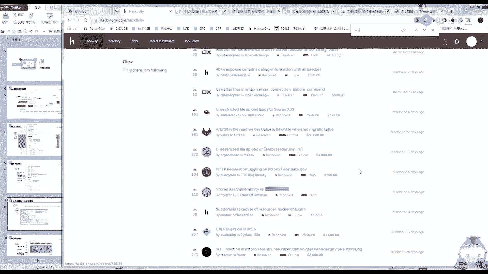

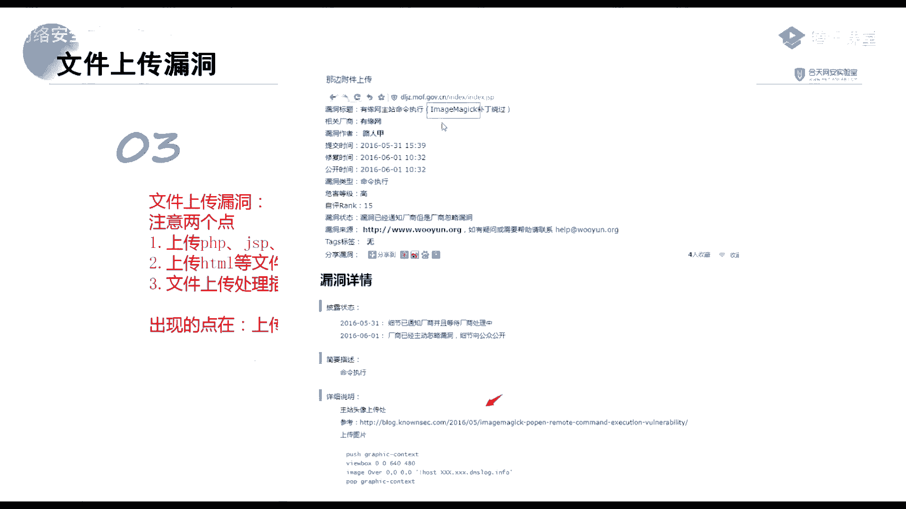

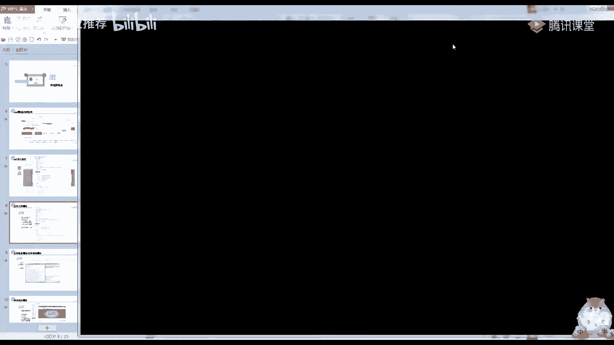

**核心验证方法**：在可疑位置插入一段简单的JavaScript代码，如 ``，观察是否弹窗。

> **关于HttpOnly的补充**：HttpOnly属性旨在防止XSS漏洞窃取Cookie值，但它并不能完全防御XSS攻击。攻击者依然可以利用XSS构造请求（如发起CSRF攻击）或进行其他前端操作。

---

## 💉 SQL注入漏洞挖掘

了解了前端脚本漏洞，我们转向更底层的数据库漏洞。SQL注入的核心是找到Web应用与数据库交互的点。

数据库的基本操作是增、删、改、查（CRUD）。因此，我们需要关注Web应用中可能执行这些操作的功能点。

以下是SQL注入的常见出现位置：
*   **查询功能**：这是最高发的位置，如搜索框、商品筛选、数据查询接口。
*   **用户交互功能**：登录、注册、密码找回、个人信息更新（更新操作）等。
*   **管理功能**：后台的数据添加、删除、修改操作。

**核心验证方法**：在参数后添加单引号 `‘`、`and 1=1`、`and 1=2` 等测试payload，观察页面返回结果是否存在差异，或是否报出数据库错误。

---

## 📁 文件上传漏洞挖掘

数据库注入通常发生在输入点，而文件上传漏洞则是一个独立的攻击面。文件上传功能不仅可能导致网站被植入后门，还可能引发其他漏洞。

文件上传漏洞的影响远不止“上传Webshell”。

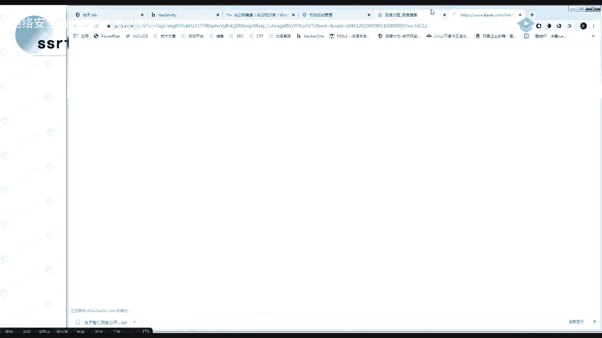

以下是文件上传漏洞可能造成的几种影响：
1.  **上传Webshell**：直接获取服务器控制权。
2.  **上传HTML文件造成XSS**：在可被访问的目录上传包含恶意脚本的HTML文件。
3.  **导致RCE（远程命令执行）**：某些文件处理组件（如图片处理库ImageMagick）存在漏洞，上传特定文件可触发命令执行。
4.  **导致XXE（XML外部实体注入）**：上传包含恶意XML内容的文件（如某些特定格式的文档），若服务器解析该文件，可能造成XXE攻击。

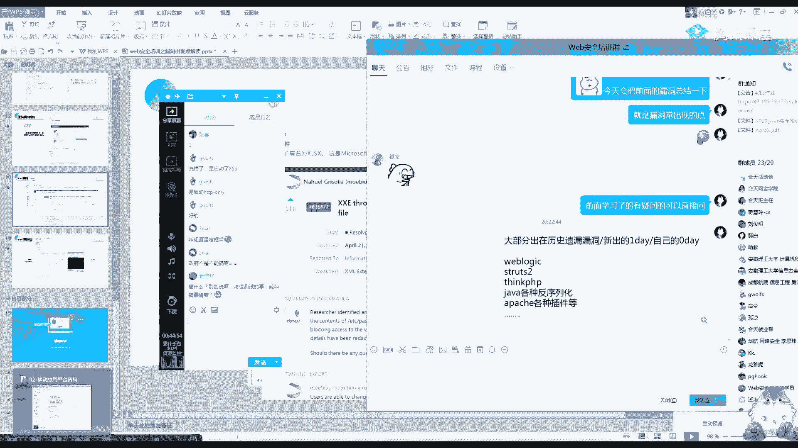

**挖掘思路**：关注所有允许上传文件的功能点，如头像上传、附件上传、视频上传、Excel导入等。

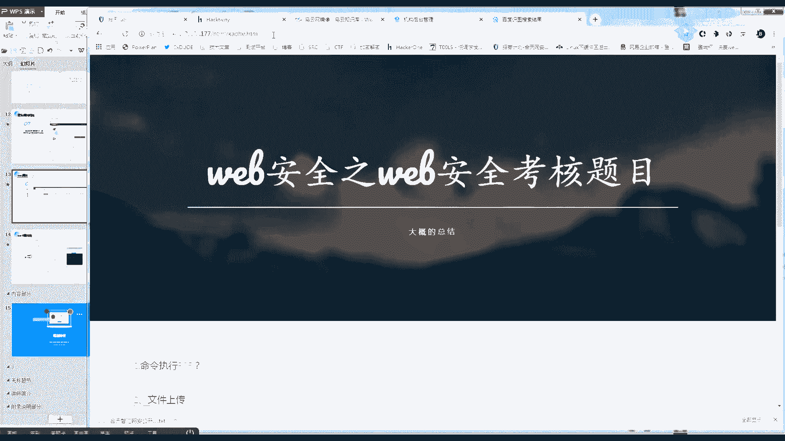

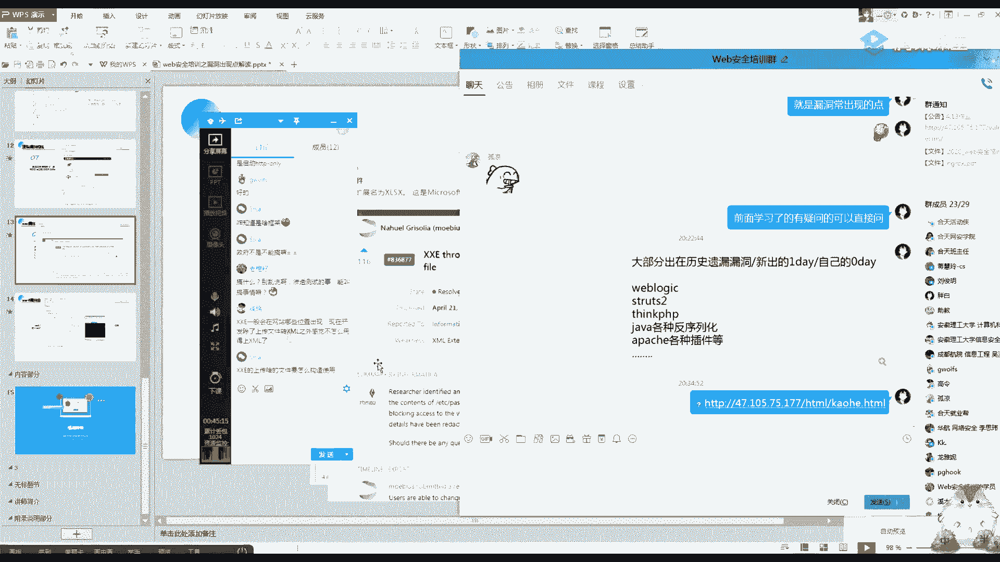

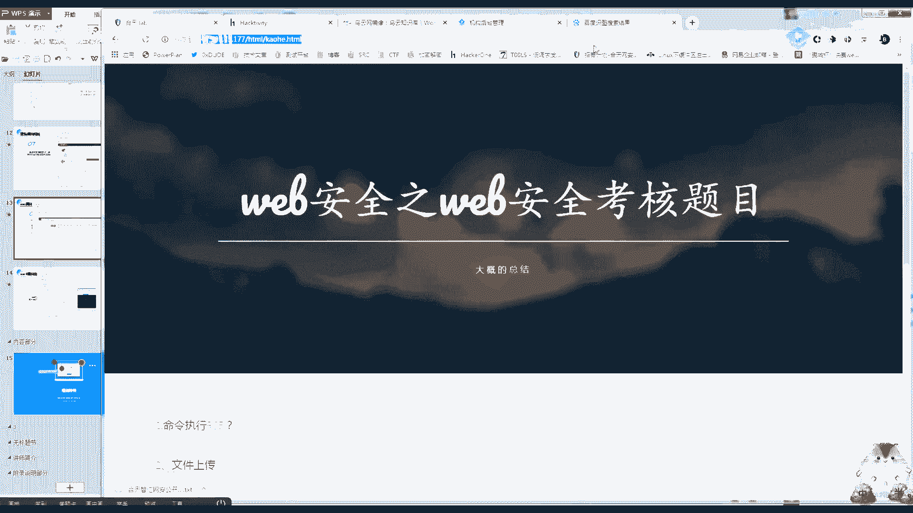

---

## 📄 文件包含与任意文件读取漏洞挖掘

与文件上传相对应，文件读取功能也常常存在安全隐患。这类漏洞在实战中非常常见。

任意文件下载/读取漏洞的挖掘重点非常集中。

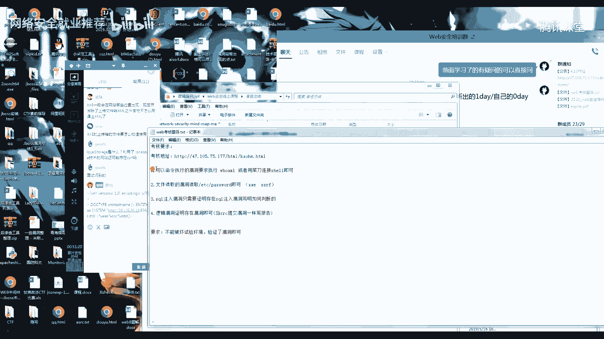

该漏洞最常见于**文件下载功能**。当下载文件时，参数中可能直接包含文件名或文件路径。

**挖掘方法**：
1.  拦截文件下载请求。
2.  观察参数（如 `file=report.pdf`、`path=/uploads/`）。
3.  尝试修改参数进行路径穿越，例如尝试读取 `../../../../etc/passwd` 等系统敏感文件。

---

## ⚙️ 命令执行与逻辑漏洞挖掘

有些漏洞直接关联系统层，有些则与业务逻辑紧密相关。命令执行漏洞种类繁多，通常依赖于对特定组件历史漏洞的了解。

命令执行漏洞通常与第三方组件、框架或中间件的已知漏洞相关。

常见的攻击点包括：
*   存在漏洞的框架，如 Struts2、Spring Boot。
*   存在漏洞的中间件，如 WebLogic、Jenkins。
*   存在漏洞的组件，如 Fastjson、Shiro。

**核心要点**：知识面决定了攻击面。多积累历史漏洞知识，才能更快地识别出潜在的攻击点。

逻辑漏洞是扫描器难以自动发现的，它完全取决于程序员的业务逻辑设计。

逻辑漏洞没有固定的模式，但有一些常见的场景：
*   **任意用户密码重置**：绕过验证码、修改返回包状态、利用响应时间差等。
*   **越权访问**：平行越权（访问其他用户数据）、垂直越权（普通用户访问管理员功能）。
*   **业务流程绕过**：如优惠券无限领取、支付金额篡改等。

**挖掘思路**：深入理解业务逻辑，对每个关键步骤进行“非常规”测试，尝试绕过正常的校验流程。

---

## 🧩 XXE与SSRF漏洞挖掘

最后，我们来看两种需要特定条件触发，但危害极大的漏洞：XXE和SSRF。

XXE漏洞发生在应用程序解析XML输入时。我们需要寻找那些会处理XML数据的功能点。

以下是XXE漏洞的常见触发点：
1.  **XML数据接收点**：任何接受XML格式数据的接口（如SOAP API）。
2.  **文件上传点**：上传Office文档（`.docx`, `.xlsx` 本质是ZIP包，内含XML）、SVG图像等，服务器解压或解析时可能触发。
3.  **图片上传点**：某些图片处理库（如ImageMagick）在解析特定格式图片时可能处理其中的XML内容。

SSRF漏洞允许攻击者诱使服务器向内部或任意网络发起请求。

SSRF漏洞几乎只出现在**需要服务器从指定URL获取资源**的功能中。

以下是SSRF漏洞的典型场景：
*   **在线识图/图片处理**：提供图片URL让服务器抓取并处理。
*   **头像设置**：通过URL设置远程头像。
*   **网页抓取/转码**：提供网页URL让服务器抓取内容。
*   **文件导入**：通过URL导入远程文件。

**挖掘方法**：寻找所有包含URL地址的参数，尝试将其值修改为 `http://内网IP`、`file:///etc/passwd` 或 `http://burpcollaborator.net` 等地址进行测试。

---

## 📚 总结与进阶思路

本节课我们一起学习了Web安全中主要漏洞的手动挖掘思路。我们从明确目标开始，梳理了从XSS、SQL注入到文件操作、命令执行，再到逻辑漏洞、XXE和SSRF的完整攻击面。

**核心总结**：
1.  **思路大于工具**：明确每种漏洞可能出现的业务场景（如查询点、上传点、下载点、URL参数点）。
2.  **敏感度是关键**：对用户可控的输入点保持高度敏感，并尝试进行测试。
3.  **知识积累是基础**：尤其是对于命令执行、XXE等漏洞，需要不断学习积累已知组件的漏洞信息。
4.  **善用案例学习**：通过研究历史漏洞报告（如乌云镜像）可以最直观地理解漏洞的发现过程。

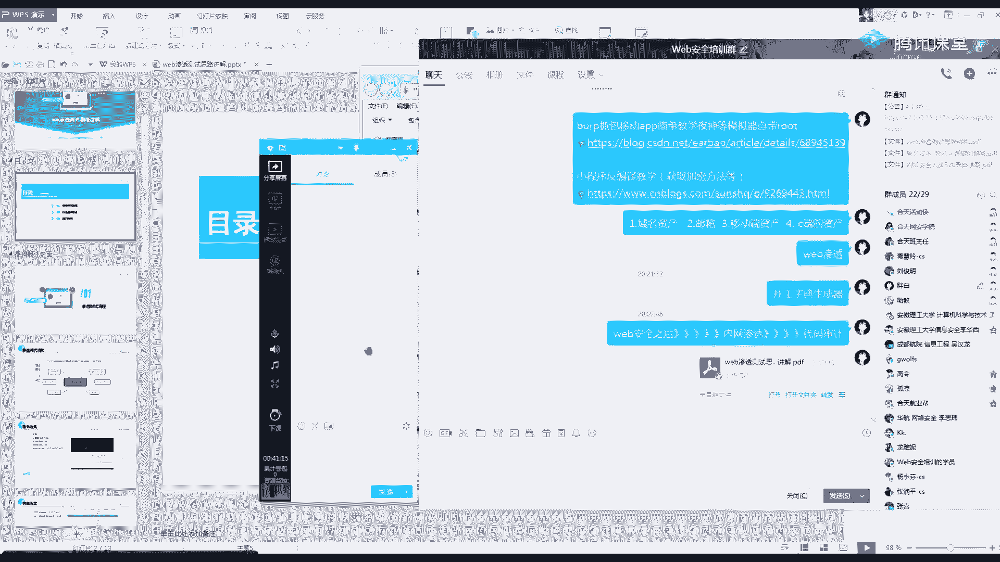

Web安全是渗透测试的起点，而非终点。在此基础之上，还有内网渗透、代码审计、社会工程学等更广阔的领域等待探索。保持发散的思维和持续学习的习惯，才能在这个领域不断进步。