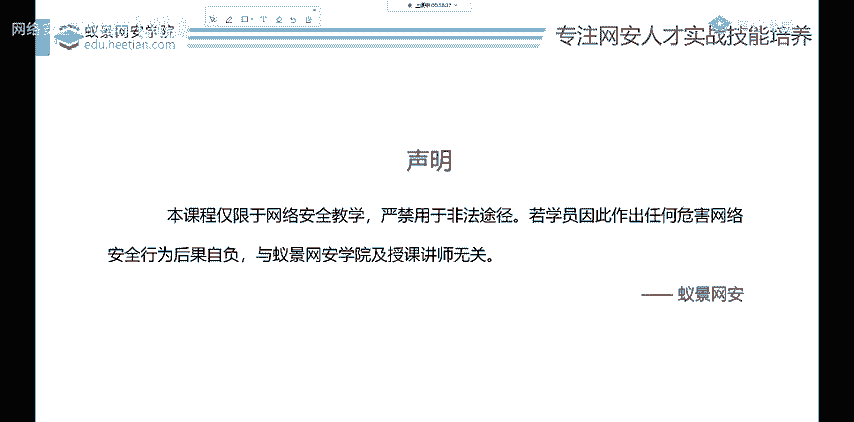
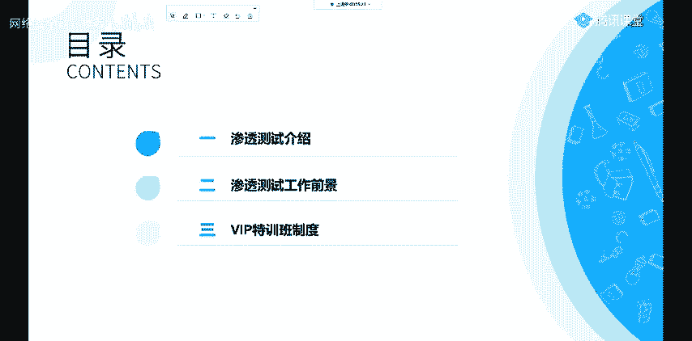
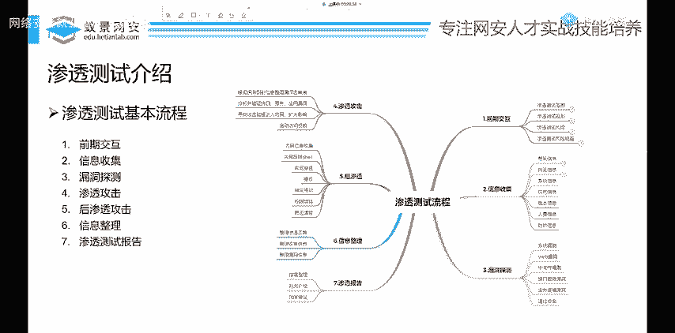
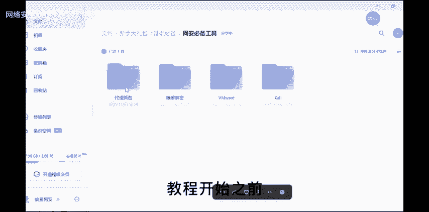
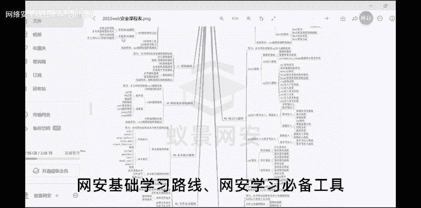
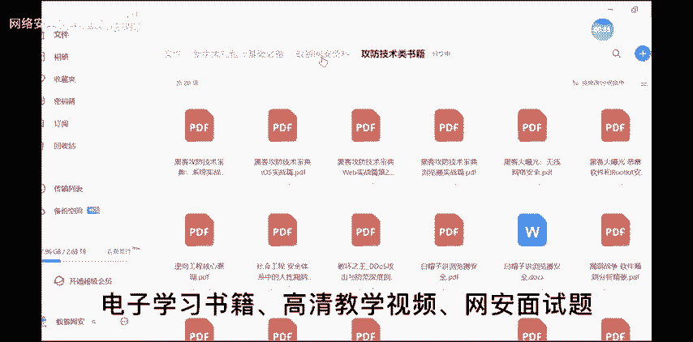
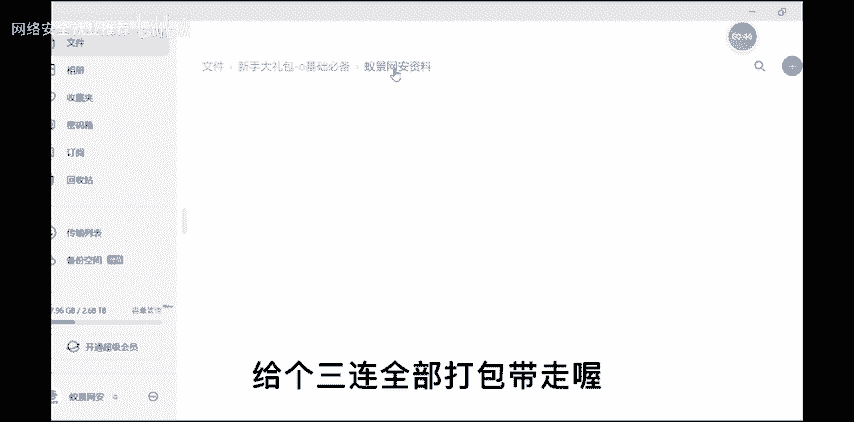

# P39：渗透测试基本流程 - 网络安全就业推荐 - BV1Zu411s79i

这个视频投币大家觉得合不合适，合适的不得了，就去搞点事情啊，这样是肯定行不通的，也学不好的。

ok那我们来看一下，那本节课呢主要是讲这些内容，那首先是给大家再多一嘴，介绍一下渗透测试是什么东西啊，防止你到最后啊都不知道自己在学什么东西，能干什么，你都不清楚，哎我给大家再介绍一下。

然后就介绍一下这个渗透测试呢，能找到哪些工作，以及我们vip特训班的一些管理制度，以及奖励激励机制啊，大家呢注意听一下，如果你对我们特训班感兴趣，还没有报名的话。

那一会呢你可以在讨论区呢跟我们班主任沟通，或者一会我也会把我们班主任小姐姐的这个，二维码，微信二维码呢放在这个屏幕上面。

大家可以加一下，那首先呢我还是介绍一下这个渗透测试，渗透测试是什么东西呢，其实这个东西很好理解，就像一个黑客他去做什么，肯定是攻击一个网站，攻击一个系统，想去给他搞破坏。

那我们渗透测试呢其实也是做这个工作，不过呢我们不去搞破坏，而是呢去按照黑客的这个真实攻击方法，去攻击别人的网站或者是操作系统，或者是内网环境去发现它系统中存在的漏洞，然后提交给这个公司。

也就是甲方接了活之后，我们把这个就找到漏洞，提交给甲方，获得一定的报酬，那不论是我们挖掘这些bt，就是百度，阿里，腾讯这些大公司的漏洞，或者是呢我们做渗透测试岗位，以及每年的互网行动。

那也都是基本上流程不变啊，都是这个意思，大概ok，那我们下面来看一下，渗透测试到底要学习什么东西，那学习的这些内容，大家千万不要心急，要一步一个脚印，你肯定不能一步登天啊。

如果说唉大家你学习几天都能去攻破一个系统，那这个系统是什么，微软啊，苹果它们的安全性也太差了，其实并不是啊，他们做安全做的非常好，安全防护，那我们就需要去一步一步的去深入学习，从由浅入深。

那首先呢我们学习渗透啊，肯定要有一些计算机的基础，网络基础以及常见的网站漏洞，那这是计算机基础以及网络基础，掌握到什么程度呢，首先给大家讲，你并不是做开发，也不是去做网络工程师，你只需要了解一点。

比如说这个计算机经常怎么去使用这，windows以及linux这些操作系统，还有就是比如说你windows啊会打开一个cmd，我觉得啊这个程度基本就够了，基本就够了，就你知道cmd是个什么东西。

那第二点呢就是网络基础，网络基础你能知道ip端口是什么东西，我觉得基本没太大问题啊，然后就是常见的web漏洞，web就是网站啊，就你看到百度这网站，这个就是哔哩哔哩执行网站漏洞。

那这个网站中有非常多的一个漏洞啊，并且有很复杂的分类，因为我们渗透测试的特训班，是比较侧重于内网渗透的，所以说web这个方面我们做了一下简化，但是如果你现在没有任何基础，也千万不要担心，我可以告诉大家。

这些学习起来是非常的呃，不能说非常简单吧，也是偏向基础，并且呢你在深入学习之后，我们也会有讲解啊，也会有讲解的，只是我们简化了一下，那关于他学习什么东西，比如说一些常见的漏洞，像sql注入诶。

大家做t如果你是计算机专业，或者是你学过java开发，那应该对sql注入应该非常了解吧，这个是非常老的一个漏洞啊，大家也可以在讨论区跟二语老师互动啊，全完全没有关系，这是直播啊。

我们所有的课程都是直播形式啊，像sql注入漏洞，咨询部上调老师是什么意思，你可以在这个讨论区提问啊，可以在讨论区提问，那你提问的时候不要发这个网址链接啊，因为腾讯课堂他会做屏蔽啊，你直接发文字就行。

或者是截图，然后这个web安全呢，像sql注入漏洞这类似的还有很多，比如说文件上传，我简单给你说一下文件上传是什么，比如说哎，我们在使用一些社交软件或者是网站的时候，是不是经常有个功能叫做头像的上传。

我们就是简单找一个图片啊，找一个帅哥美女，或者一些动漫图片来给他传上去，当做我们的头像，但是你有没有想过我不传一个图片，我去传一个木马病毒传上去行不行呢，如果可以的话。

我们就把这些漏洞呢叫做文件上传漏洞，那其他的漏洞也几乎都是如此啊，了解一下啊，网上都有非常详细的教程，大家可以认真学习一下，ok那下面呢就是来到我们渗透测试，一个基本的流程，这深度测试的流程啊。

不论你是在哪一个公司，几乎都是一样的，如果想了解详情的话，你可以到每一个公司中，他有渗透测试的白皮书，就是有详细的讲解这个公司是干什么的，以及实施的流程，这里我给大家大致总结了一下，首先呢就是前期交互。

这个交互就是告诉大家这个你要去测试的范围，比如说哎这个是甲方，他告诉你我要去执行哪些对哪些网站，对哪些资产进行一个探测，以及呢我们探测的时间以及规则，比如说能不能去给别人删除文件呀。

能不能上传这个木马病毒啊，这些等等，都是需要和甲方进行沟通好的，当然这件事情呢是交给我们公司去做啊，跟大家呢几乎没有太大关系，给大家呢可以不用刷屏啊，可以不用刷屏，这个刷屏没有太大的意思啊。

这个也不会给你增加经验，也不会干什么，那第二点呢就是信息收集，什么是信息收集，这个仙女收集给大家简单讲一下，我用最简单的语言保证大家都能听懂，首先比如说你们公司让你去攻击百度啊，你很简单。

你就输入3w点百度点com去攻击它，那很抱歉，这个百度的主页，他一般呢做的防护，可以说比其他的网站相对于来说都要好很多，3w点，百度点com这个搜索框中很有可能不存在漏洞，那这个时候怎么办呢。

我们我们就想百度难道只有这个搜索功能吗，可不是啊，它有百度新闻，有百度知道，还有什么百度贴吧，百度地图，那这些是不是都是属于这个百度这个公司呢，所以说我们就需要对这个公司的资产，做一个信息收集。

我们拿到他更多的网站，更多的一个机器才能够进行更好的渗透，就是这个意思就是信息收集，那第三点呢就是漏洞探测，这里我就不要不要多讲了，像探测，比如说一些系统漏洞，一些网站的漏洞，也可以使用扫描器。

或者是呢手工的去检测是否存在漏洞，如果有的话，很好，直接就攻击，攻击之后，哎我们这攻击啊就是利用相关的这个漏洞，利用脚本，然后进行攻击，但在攻击之后能够做什么东西，其实才是我们在互网以及内网渗透中。

特别要注意的后渗透环节，因为呢比如说大家在学校里或者是公司里，不可能只有一台机器吧，大家的办公电脑，大家的服务器，路由器，这些都是实打实存在的，这个计算机就是电子设备，那这些设备啊可能都存在一些漏洞。

所以说我们要对这个公司的内部环境，进行一个充分的攻击和利用，争取拿到他们更多的机器，这一点是内网渗透，那现在招聘主要考察的技术还是这一点，就是在内网中你能掌握哪些技术，能不能绕过常见的杀毒软件。

能不能进行一个预环境，很好的一个移动以及一些攻击高级攻击手法，那这一点呢我们在课程中也会讲到，而且我们重点也是放在这个地方，因为招聘需求，我们技术的岗位需求就在这里。

那最后呢就是对于我们整个渗透测试过程的，信息收信息整理以及漏洞报告的一个编写，我们在写完漏洞报告之后，也就是一个word文档啊，正word文档提交给这个甲方，甲方人员在进行审核之后。

就会给公司相应的报酬，同样你也能够拿到工资以及这个绩效奖金，ok大部分的安全公司全部是这个样子的，ok那这就是渗透测试的一个基本流程，大家如果哪里觉得没有讲清楚，那你可以一会儿呢在讨论区随意提问。

或者是在课后的时候，在我们的微信群里啊，随便问，如果你不好意思的话，也可以私聊我啊，没有关系。

可以加我的微信私聊我，那我们下教程开始之前。

up已经把相关的网安基础学习路线，网安学习必备工具。

电子学习书籍，高清教学视频，晚安面试题都已经准备好。

放在pl区了，给个三连全部打包带走哦。

