# P4：第2天：实操靶场环境安装 - 网络安全就业推荐 - BV1Zu411s79i

we are，那我们本次的一个课程内容的话嗯，我给你录个屏，那本次我们的一个课程内容的话，是一个l a n m p，以及片区斯巴黎的一个环境的一个部署，以及通过这样的两个环境集成的一个环境。

来部署我们的一个漏洞靶场，就嗯l o n m p的话是在linux上面的，以及p p h p是大理的话，是在我们常用的一个windows系统上面，去搭建了一个web集成环境。

然后首先的话在环境搭建之前的话，我们先来了解一下l a m p的一个安装，以及对它的一个简介，我们一起来看一下l a m p的话，它其实是指的是一组，经常用来搭建动态网站或者，服务器的这种开源软件。

它它们本身其实是一个独立的一个程序，好的话是，因为他们是，因为我们经常会使用这样子的一个组合，所以的话我们就经经常会把它，直接就是放到一块来讲，然l a m p它其实是，啊几个这种独立程序。

它的一个偏它的一个缩写，首字母的一个缩写，我们先来看一下l l的话就是指我们的一个linux，linux的话呃，应该不用我去多说，它是一类union unix的一个操作系统的一个统称。

我们其其实除了一个windows的话，使用最广泛的也就是把linux的一个系统，然后幽灵的话像比如说mac mac，mac os，那也是一个幽灵幽灵x的一个系统，而我们常见的这种年龄时。

系统的话有比如说center words啊，还有d b一遍的话，我们的一个卡点的话，也就是基于低变的一个发行版本啊，乌班图还有red heart等等，我们一些经常会使用到的一些linux系统。

linux系统的话，它其实不像我们windows的话，它是啊专注于就是这种桌面的一个系统，我们linux系统它的一个占比，它其实不是在于桌面，而是在我们的一个服务器领域，它所使用到的话是啊更加广泛的好。

a的话就是指阿帕奇，阿帕奇的话就是一个网页服务器，n的话是指nginx，它是跟阿帕奇类似的一个高性能的一个htp，的一个网页服务器，版本的话是指mysql，mary db等等这种数据库的一个管理系统。

还有它的啊，就是一个数据库服务器，p的话，是指我们常用的这种菲律宾的一个脚本语言，这句话我有呃，分别有说，然后这里我主要讲的是一个l a l a m p，也就是我们的这种linux加阿帕奇。

加mysql加p h p的一个架构，这里的话是关于一个ntx加阿帕奇的一个区别，就前面的话有说到我这里的话，主要讲的是讲的话是一个l a m p的一个架构，当然了，同样的也有l n m p的一个架构。

就说啊ngx跟阿帕奇，他其实是可以嗯就是差不多的一个作用，当然的话它的一看它的一个区别还是有的，就是它的一个区别还是比较大的，我们就是通常的话我们也可以使用这种l a m，l a n m p的这种架构。

它是利用我们的这种ngx加帕奇这种服务器，它的一个特性来进行一个搭配，就说阿帕奇的话，它是通常会作为一个后台服务器来处理，我们的这种菲律宾以及动态的一种脚本语言，动态的这种请求。

ngx的话它主要是作为一个前端的一个服务器，因为它的一个特点的话，就是它会占用它占用的一个系统资源，是比阿帕奇要少的，然后它处理静态页面的一个请求，然后介绍完ngx与加帕奇的一个区别之后的话。

我们来看一下如何在con里面去搭建，我们这样子的一个l a m p的一个环境，上节课的话我们有讲到如何去啊，在虚拟机里面安装我们的一个canon linux系统，那这样的话主要是这几条命令。

就是说在linux里面安装这种软件的话，是我个人认为的话是比windows要方便很多的，就是说只需要这样的几条命令，就能够搭建我们想要的一个环境，这样的话前提是大家要能够熟练的去使用。

这样的一个linux系统，以及对啊这种软件有相当的一个了解，这样的话因为是使用的一个linux linux，然后如果这里的话再多说一句，多说一句话，就是对那些就是呃电竞史不是很了解的同学。

就是说我这里的话是使用的一个a p t，a p t是什么呢，app是linux好，具体说的话是畸变系统下面的一个包管理器，就说我们可以用这样子的一个包管理器，工具来下载啊。

我们的这种呃软件下载我们所需要的一个软件，那我大概说一下它的这样的一个命令，的一个意思，这样的话a p t store阿帕奇二杠y好，首先的话我们需要使用到app，这样的一个下载包管理器工具来下载安装。

in solo的话就是安装的意思，阿帕奇二的话，就是我们想要安装的一个web服务器，然后杠y的话就是呃确认，就说我们在安装的时候，它中间会让你选择说，那你是否把安装有那样子的一个。

yes or no的一个选项，如果说你不加这个的话，它会出现有一个让你选择是否继续安装的一个，yes or no的一个选项，所以说我们可以，如果说我们想要默认它一直安装下去的话。

我们可以在后面加一个杠y的一个参数，就是默认都是yes的，然后安装mysql的话呃，跟前面的一个命令是类似的，这里要说的一点的话，就是啊大家要注意的话，就是说在我们的一个卡里，你看你那里面的话。

它的一个mysql它是叫mary db以及mary db server，我们需要安装这样子的两个软件好，关于这一个mysql以及marodb的话，我这里大概说一下。

就说mysql跟mary db它其实是类似的，这种数据库的一个管理系统，然后啊为什么会做这样子的一个区分呢，因为啊mysql跟mary db它其实是同一个作者啊。

因为mysql的话它是被呃oracle收购了吧，因为大家知道啊，我记得是oracle吧，然后大家都知道oracle公司的话，他是一个呃商业公司，就是说他他的一些东西都是要收费的。

所以说然后mysql的一个作者的话，他为了避免就是说这个mysql的这个软件就是收费，然后在看linux啊，不在linux系统上面啊，不能够去免费的使用的话，他就另外开发了这样的。

以他女儿mary命名的一个mary db的一个数据库系统，就是我们在安装的话，是使用着这样子的一个命令，这样的话我们启动服务的时候，其实也可以使用这样的一个mysql。

而且它的一个啊命令什么的都是类似的，第三个的话就是安装ph p安装安装ph p的话，大家可以看到我们需要安装这样子的啊，有比较多的一个扩展，就说菲律宾语言的话，我们需要去好在我们根据我们自己的一个需求。

我们需要去处理什么样子的一个啊，p h p的一个脚本，然后再去安装我们所需要的一些扩展，我这里的话就是列了一些，我们日常我们去搭建这样子的一个网站啊，什么的，靶场什么的。

会经常会去使用到的这种啊菲律宾的一个扩展，啊关于具体的一个的话，大家可以自己去百度吧好吧，然后这里的话要说一下的话是啊，这一个片区域mysql，比如说这个ph mysql的话，它是用于支持啊连接我们的。

我们的一个就是菲律宾来去啊连接数据库，对数据库进行一个操作的这样子的一个扩展，这个的话我们如果需要去使用到数据库的话，这个扩展是必须要去安装的，还有说像这个菲律宾gd这样子的一个扩大。

它是对于啊比如说你的一个网站，它需要去使用到啊验证码这种图形的一个呃，处理库的话，我们就需要去安装这样子的一个扩展，然后其他的话我就不再过多的一个呃，说明了吧，好这里的话是我在看你。

你看你里面去进行一个安装的一个过程，然后要说一下的话，是在candy里面，它其实是已经有好，自带已经安装好了的一些服务的，像比如说阿帕奇，阿帕奇二的话，它是呃，我这里是我忘了。

我是自己已经之前已经安装了，还是啊我记得是他默认就已经安装好了，如果没有安装好的话，我们可以通过这样子连个命令去进去，进行一个安装，然后安装之后的话，我们需要去启动它的一个服务，启动服务的话。

我们可以用这个service阿帕奇尔，然后states states states的话就是状态，这个状状态的意思的话，就是我们来查看我们的这个阿帕奇，阿帕奇二的一个服务，它是否处于一个启动。

或者是说关闭的一个状态，如果说像这种的话，就是处于一个dead，也就是关闭的一个状态，我们就可以使用start来对它进行一个启动，启动之后的话，可以看到我们的一个状态就变成了一个running。

然后在我在安装之后的话，我大概给大家就是这里的话有念了几个卸载，就如何去卸载我们的一个l a m p的这种架构，比如说我们安装的，我们不想要去使用这样的一个东西，我们想要或者说版本安装错了。

我们需要把它做一个卸载，卸载的话我们就使用这样子的一个命令，然后这里的话主要讲的话是啊卸载的一个命令，卸载的话，首先第一个的话是这个auto remove，auto remove的话。

他会去自动的去卸载我们的这样的一个mary db，还有mary db server它的一些安装包，然后remove的话就是卸载我们安装了这个软件，然后我们可以通过dp k g d p k g的话。

它是linux里面的一个呃，就是查询我们的这种安装包，比如说我们想要查询我们安装了哪些应用，我们可以通过这个dp k g这个命令，来去进行一个查找，就像我们在windows上面的一个应用管理器一样。

然后这里的话我们可以通过来通过这样子的一，个过滤的一个方式来查找到啊，关于这样的mysql我们想要卸载的这种软件，它是否有卸载完成，或者说卸载干净了，然后的话就是这个我们在linux里面安装的。

这种软件的话，它会在etc下面它会有创建这样子的一种文件，就他的这些文件的话，就是关于这个软件的一些配置文件啊，都会放在这一个etc目录下面，所以说我们通过这个放的放的话。

就是在linux里面去进行一个啊文件，还有目录等等的这种进行一个查找的一个命令，就相当于一个全局搜索，然后搜索我们的一个etc目录下面啊，匹配这样的一个mysql或者说mary db的这种啊文件。

如果有这种的话，我们就执行rm gf，就是删除掉，删除掉这样的一些文件，或者是说目录，他的话和阿帕奇的话也是呃类似的，这样的一些命令，这里的话如果是就是懂linux的话，就都能够看得懂了，然后的话我。

以及菲律宾的一个下载卸载都是同样的，然后这里的话，我把这些命令就说发给那些，就是可能刚开始接触linux的同学吧，其实这个的话其实我不用发也行，就大家直接去网上去查找都是可以的，内容太多了。

我这里的话就不一个一个发了吧，如果大家有有疑问的话，可以在课后在群里问，或者是说直接私聊，我也是也可以，好的话，我们来看一下如何利用这样的一个l a m p，来部署我们的一个dp w a的一个漏洞靶场。

就是说在部署之前的话，同样给大家介绍一下什么是db w a，也就是说这个漏洞靶场是什么样子的一个东西，大家可以看一下，这个的话是我从他那个官网上面call的啊，它的一个网站的话就是这一个我们看一下。

呃网络可能稍微有点慢，稍等一下，就是这样子的一个，网站就是说我这边的话是就call的这样的，这里他的一个介绍，它其实就是一个基于ph mysql的一个web应用程序，就说这个应用程序的话。

它有集成了很多的集成了，就是说我们的一个ow o w s p top 10等，top 10的这样的一些漏洞，就说这这些漏洞的话，它把它集成到了这样的一个靶场，然后他有分啊，初级分low呃，low级。

还有中级，还有高级，以及不可能的这样各个等级的这种这种漏洞，靶场，就是说它里面包含的就是啊ow m o s ow sb，top 10的一些漏洞，呃ppt的话，ppt的话，我暂时不知道能不能发给大家。

下课的话，我问一下领导吧，如果领导说可以发的话，我会发给发在群里好吧，然后关于这个ow s p top 10的话，大家可以去了解一下，就是说关于web安全相关的一些东西，他会啊，他会隔隔2年。

还是隔多久发布一个这样子的一个呃榜单，这个榜单的话就是呃列举了，就是说在呃这些年内，攻击者经常会去使用它的这种web，攻击的一些技术，以及它所用的一些漏洞攻击技术。

然后这一个靶场的话就是包含有相关的一些啊，环境这样子的一个web应用程序，主要的话就是用于啊，大家去进行一个啊这相关知识点的一个学习，以及进行一个操作性的一个利用，下载的话我们直接点这里下载。

然后它是托管在github上面的，就是这个网站，对后面大家看录播其实也是一样的，看录播的话呃，因为我p p t展示出来了，大家可以跟着我就是跟着敲嘛对吧，你自己去进行一个练手。

然后的话这里的话就下载完毕了，呃我这里的话其实已经有下载好了，大家可以去啊下载，然后跟着我一起进行一个操作吧，然后我这里的话新新步操作新啊，讲一下ppt的一个内容，好我们下载好哦，那个安装包之后。

它是这样子的一个dv w0 a杠max的一个压缩包，好我们需要去进行一个解压，解压的话，我们就会去使用到这样的一个，unip的一个命令，就是解压我们的一个啊zip包的一个命令。

是在linux里面去进行一个使用的，然后呃，然后的话需要把我们的这样子的一个压缩包，把它好复制到我们的一个网站根目录，也就这个网站根目的，意思的话，就是我们安装完我们的一个阿帕奇之后。

它就会有一个网站的一个根目录，也就是说我们的这种网站的一些脚本文件，以及我们的一个应用程序，都需要翻到这样的一个目录下面，然后的话才能够去进行一个解析，也就是我们能够去直接的对它做一个访问。

然后这里的话我使用的是一个move，这样子的一个命令，啊就是就是我这里的话，就可能如果说对于linux有比较了，有了解的同学的话，可能觉得我这里会讲的会有点啰嗦，我这样的话主要是考虑到啊。

因为我在我们的这一个课程的话，是一个面向零基础，或者说你想做，我想入门这样子的一个web安全的一个课程的话，呃web安全的一个这种行业的话，可能就会没有接触到相关的这些东西。

所以的话我会呃大概都会提一下，这样的一些命令，它的一个意思啊，所以说啊希望不要觉得啊啰嗦或者是说多余的，然后cd的话就是切换目录，在历史里面去切换目录。

我们就是啊就像在windows里面去打开一个文件夹，我们可能使用的话是用鼠标去点点点是吧，我们在linux里面的话，直接在命令行里面用mini，然后cad切换到我们的这样的一个目录。

切换到这个目录之后的话，就会是啊关就会是这个web应用的一些，文件，这样的话我等会也会给大家进行一个操作，然后好，这里的话我要提醒的话，就是在安装的一个dv版本的话。

我们需要必须要去安装这样子的几个扩展，就是说这个p h p gd，也就是呃我们前面说的啊，一个啊处理图像的一个库，然后的话mysql是连接mysql与mysql，进行一个数据的一个交互的。

一个不及p d o的一个这样子的一个库，需要去进行一个安装，然后呃这样的话我先不说。

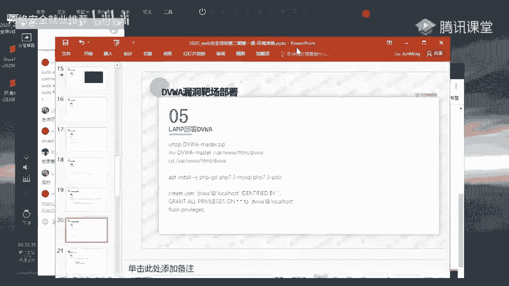

我先带着大家一起来进行一个操作吧，同样的我使用的话是啊，昨天安装的这样的一个candy linux的一个系统，我们首先进行一个登录，就默认的话是使用的一个，看你登录我这里的话呃。

图方便的话就使用bot去进行一个登录，登录之后的话，打开我们的一个终端。

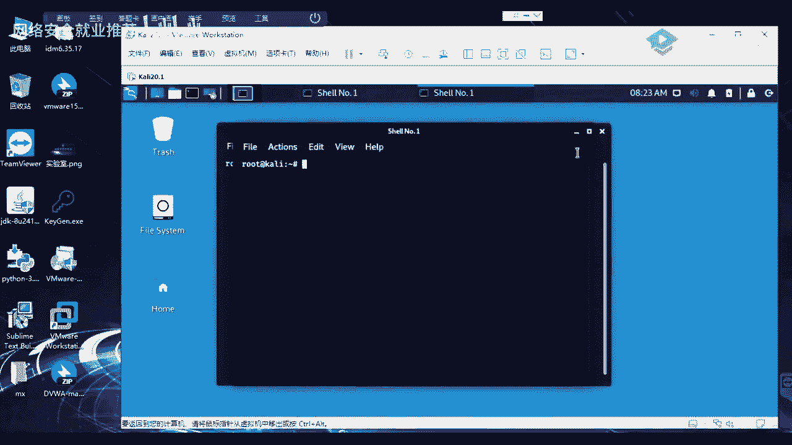

打开这个终端的话哦，我这里的话已经有下载好了，这样子的一个dv w0 的一个压缩包，它里面的一个内容的话，就是像这样子的一些菲律宾的一个脚本啊，菲律宾的一个一些文件，然后我这样的话直接把它嗯。

把它复制进去，复制到了这里，然后这里的话是在桌面，我们切换到桌面，也就是这个文件，我们使用unzip这样的一个命令，去进行一个解解压，如果说没有这样的一个on zip命令的话。

我们呃通过app in store来去进行一个安装，我这样的话是已经安装完毕了，我直接去对它做一个解压，那是，解压之后的话就是这样子的一个文件夹，ios杠就是，啊不好意思，喉咙卡了一下，就是ios的话。

就是列出当前目录下面的这样的一个文件，但是的话你看不到他的一些详细的一些信息，比如说他的一个啊一些权限，以及它的一个数组等等，以及它的一个大小，我们就可以使用l s杠l来进行一个查看。

这样的话呃你也可以，而就是在其他的一些linux里面的话，是直接可以使用lol来去进行一个查看的，然后这里的话每呃其实它是一样的一个意思，你也可以在linux里面加一个ending，加一个ending。

也就是加一个别名，可以把它改成一个l l，就是这样子的话会更加方便一点，就不用再出其他的一些选项，这样的话提一下，这样的话我直接把它哦哦我这里看一下，应该已经安装了吧，安装一个我们的一个web服务。

也就是阿帕奇，这样的话重新再操作一遍，就是a b t in store，阿帕奇二加y，然后我这里的话是已经安装好了，所以的话它会显示这样，好安装完毕的话，还有的话我们需要安装mysql。

还有db以及mdb，干啥管，啊我这里的话是已经安装安装好了哟，然后的话安装好之后的话，我们需要对它做一个启动，启动的话我们使用这个service的一个命令，然后在linux里面有一个技巧的话。

就是我们在敲命令的时候，大家可能是可能会记不住这样的一些单词对吧，比如说service，你这一个记不住，不要u s1 ，你这个记不住，你可以有一个技巧的话，就是有一个自动补全的一个技巧，s e r。

比如说我们敲入一个s1 ，然后按table他就会补全一位对吧，补全，然后你再按一下，你多按几下的话，它就会列出你这一个s e r v开头的，这样的一些命令，它会列出来。

我们要用的话就是这个service对吧，然后我们再敲一个i，然后再按table，大家知道tab键吧，tab键的话就是那个esc下面在下面的那个键，也就是那个波浪波浪号下面的那个tab键。

它就会做一个自动补全好，我们再输入，在后面的话接我们想要启动的一个阿帕奇服务，阿帕奇，然后要启动的话是用start start的话就是开启嘛，就进行了一个启动，然后的话我们啊就大家可能会觉得。

每一次就是开机，然后的话去去启动这样的一个阿帕奇夫的话，比较烦，比较麻繁琐对吧，我们可以通过呃把它设置为一个开机自启，设置为开机自启的话，我们这里用这个system c to l。

其实这个c system city l也是用来启动命令的好吧，启动服务的，然后的话因为我这里的话是使用习惯了，就是使用的一个service，当然正规的话是用这个system ctrl。

带的一个系统控制的一个程序，来去启动我们的一个服务，然后这个的话它的一个命的话是不一样的，跟前面的一个service对吧，这样的话system c t l这个命令的话，后面是接我们的一个操作的一个命令。

我们的一个操作想要它执行的一个命令的话，就是比如说start就是启动对吧，然后后面的话再接我们的一个启动的一个服务，这样的话就已经启动完毕了，就这种命令的话，他没有输出这种信息的话。

就说明你是命令就执行成功了，如果说你后面出现了这种东西的话，就说明你是会有问题的，像比如说这样的话，就是不知道这一个啊操作这个阿帕奇亚的，是什么样的一个操作，因为没有这样子的一个呃选项。

那我们想要让他自写的话，我们可以system city enable，内部的话就是啊使用吗，使用快棋就自启，然后的话他就会自己会创建这样子的一个，执行可执行的一个程序，然后的话把它设置为一个字体。

它会创建这样子的一个啊链接，然后这里的话我们设置完之后的话，我们下次再启动我们的这样的一个进行，系统的话，它就会自动的启动我们的一个阿帕奇服务，同理我们的一个mysql也是一样的的话，就用系统ctrl。

r v d b，然后启动启动完毕，我们查看一下它是否启动成功，你看到这里的话是已经running，也就是启动成功了，启动成功之后的话，我们需要呃把我们的这样的一个程序，把它放到我们的一个web根目录。

外表，根目录的话就是常见的像阿帕奇的话，就是画3w htm这样的一个目录，这样的话我们直接cd进去，可以看一下，这里的话它只有两个默认的文件，这两个文件的话就是我们的一个首页，我们可以用一个浏览器。

用这个火狐浏览器来打开看一下，这样的话呃，因为在虚拟机里面的话可能会比较慢一点，我这样的话先把我们的一个，把我们的这个dv w的一个文件夹，把它给复制到我们的一个web跟目录下面。

然后的话把它命名为一个小小的一个db w0 a，然后复制过去啊，直接移动过去了，就移动的话就像我们的一个啊，windows里面的一个剪贴，大家应该理解吧，就是把我们的一个文件直接剪切过去。

就使用了一个move命令，然后复制的话就是cp命令，好的话就是啊多了这样子的一个文件夹，dv w0 ，这样的话我们可以先来访问一下，我们的一个阿帕奇服，因为我这里的话，在本地的话。

我直接输入一个logo host，然后回车，或者是说嗯说了一个127点点0。1，也就是我们的一个本地回环地址，就可以看到这里有一个这样的一个，阿帕奇二的一个默认的一个页面。

这个页面的话其实就是这里的一个网站根目录，它的一个文件，一个htm的一个文件，然后这里的话我这里已经有，把我们的一个dp w a程序，复制到了一个报表目录，我们可以直接在后面用。

访问这一个dp版本的一个目录，然后直接访问的话可以看到这里有一个报错，就是说明的话，我们的一个程序的话是没有配置正确，这里一个报错的话，是可以看到我们的一个配置文件，没有去做一个修改。

这样的话我们需要找到这样的一个配置文件，配置文件的话我们可以看一下，是在，有一个config，背一个文件夹，我们cd进去塞进去的话，可以看到它是这样子的一个后缀的一个文件。

但是他这里提示的话是需需要一个这样子的，一个空b。c。p h p的一个文件，所以说我们需要把它做一个命名，我们这样的话啊把它cp就是复制一个，去掉后面的一个点，dt不知说的话就有了这样子的一个配置文件。

是这个我们可以来看一下，查看文件的话在另一个里面是用cat，然后可以看到它里面的在它里面的一些内容，它其实这个配置文件的话，里面写就已经写好了啊，这个程序比如说它的一个mysql的一个零件啊。

密码连接密码以及它的一个数据库的一个用户，以及我们的一个数据库名，他还有其他的一些我们需要去使用到的，一些配置，它都在这样的一个文件里面，然后这样的话我们再去重新访问，访问之后的话。

可以看到已经到了这样子的一个界面。

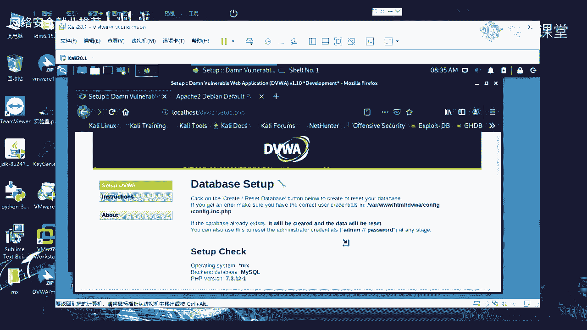

再见面的话诶，直接，把直接全屏嘛，这界面的话就是我们的这一个程序的一个，安装界面，可以看到是我们需要对我们的一个数据库，进行一个设置配置以及安装，然后的话才能够去进行一个动态的一个访问，以及请求。

这句话要给大家说的话，就是这里这里的话有聂耳这样的一些信息对吧，大家主要的话要看的话就是这些啊，红色的字是红色的字的话，比如说这个disable disable的话，就是嗯就是不允许对吧。

就是说我们的这个配置它是不正确的，以及下面还有这样的一些，我们一个个的需要做一个配置，然后解决它的一个问题，首先的话这里的一个error inclu，这里的话我们需要开启这样子的一个u r l的。

一个包含的一个功能，这个模块，这个模块的话我们需要在一个pgpu，在一个配置文件里面去进行一个配置，他在一个配置文件的话，是在pp下面的，在这样的一个目录下面啊，因为你默认安装的个p h p版本的话。

它是一个7。3了，然后的话是啊阿帕奇啊，因为我们使用的一个web容器方是阿帕奇啊，然后的话有一个p h p。i，也就是它的一个ph p的一个配置文件，我们直接进去，进去的话，我们需要找到这一行。

erroyal include，我们直接进行一个搜索，也就是这个alloy，you are include这一行，我们需要把它更改为phone，就是开启它的这样的一个呃包含的一个功能，然后的话保存。

到这里的话呃，如果没有接触过linux的话，可能对我的这样的一个操作会感到困惑，或者说看不懂了，就这里的话主要的话是这个vm，也就是在linux里面常用的一个编辑器，vim编辑器。

我们可以通过这样的一个命令来去进行一个编，辑，我们的一个文件啊，关于这个编辑器的一个使用的话，大家自己课后去进行一个学习吧，因为这个东西的话，比较复杂，就是说你如果想要去讲的话，可以讲一节课的。

我这样的话就不去做一个详细的一个讲解了，好吧，然后配置完成之后的话，我们可以来它需要重启，说更改了这种配置文件之后的话，我们需要重启我们的一个服务，好我在这里的话。

我们需要重启我们的一个阿帕奇的一个服务，我们重启的话就是restart好，我们再重新访问之后的话，可以看到他这样的话就是已经变成了允许了，然后的话还有这个hp mod gd。

啊这个的话就是我们需要安装我们的那个gd库，我这里的话应该是已经安装了吧，怎么讲呢。

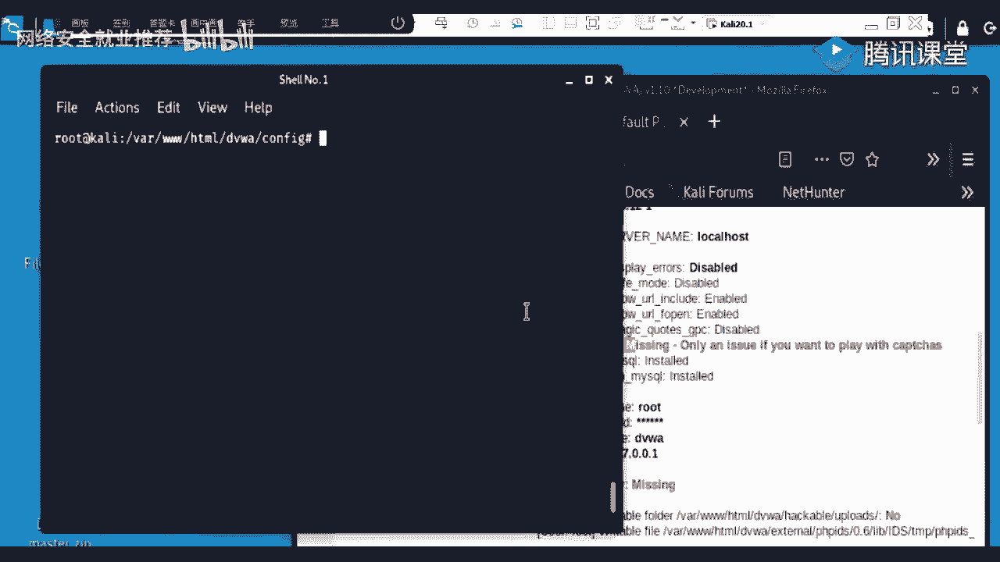

需要安装我们的这样的一个基地库，诶，这里怎么。

呃我这里的话先跳过吧，因为这一个的话，其实就是对那个里面有一个靶场，它是需要使用到这样的一个验证码，就是说有一个capture的一个靶场，他需要用到这个验证码，所以需要安装这样的一个gd库才能够去显示。

这样的话其实如果不做那个的话，其实是无所谓的，这样的话比较慢，这个呃更新网络，然后的话它会进行一个下载，就是说啊，前面的话是因为他没有找到这样子的，一个软件包。

我所以的话我们需要更新我们的一个a p p源，也就是啊更新我们的一个软件的一个，就像应用列表一样更新它，更新之后的话就能够啊，去找到我们最新的这种软件软件包，然后这里的话直接使用命令去进行一个安装。

这里有一个交互的话是，就是选择我们想要安装的一个呃这个p h p，首先第一个的话它是安装我们的这样的一个，最新的一个版本啊，第二个的话是就是保留我们当前的一个版本，我在一块就选第一个安装最新的版本。

然后就已经安装完毕，安装完毕，ktp的安装之后的话，我们需要重启一下阿帕奇，重启之后的话再来访问一下，就可以看到它，这里的话是已经安装了，然后的话我们需要更改一下，我们的一个mysql数据库的一些信息。

因为前面的话我们是默认安装的，默认装的话是呃那个mysql它是没有密码的，然后可以直接能够查看到嗯，啊不能够直接进入到我们的一个数据库，直接查看了我们的一个数据库，然后因为在这里。

我们想要去迎接我们的一个这样的本地的，这样的一个数据库的话，我们需要更改我们的一个配置文件，就是刚刚给大家看到的那个，这个配置文件我们需要对它做一个编辑，编辑的话。

主要是在这里我们需要更改它的一个啊密码，因为我这里的话是没有设置密码的，所以我直接把它给呃删除，这样的话如果你设置了密码的话，你也可以把你的数据库设置一个密码啊，建议的话还是设置一个密码。

然后的话在这里添加你设置好的一个密码，然后默认的一个使用的一个数据库，用户的话就是root，然后我们想要的一个数据库的一个名字的话，就是d b w a，这里的话我们直接默认，然后修改之后的话。

就是下面这里的这个ie kept，这里的一个key，这里的话这个是主要呃是谷歌的一个，哦那个是什么呢，我有点忘了，就说它是一个谷歌的一个，证书，我们需要在我们的一个呃，在那个谷歌上面去进行一个添加。

添加之后的话，然后的话我们可以呃通过一个谷歌的一个验证，不知道大家有没有去，就是说访问过国外的谷歌的一些网站，就说他会有这样子的一个框，就是说用来验证你的人机登录的一个框，就说你点击这一个框的话。

你就验证通过了，就说明你不是一个机器人，它就是用于这样子的一个印证，然后这里的话呃可以看到你直接搜这个的话，它就会显示这样子的一个b w的，也有，这个的话我们有一个解决方法。

就是说我们需要去谷歌的那个网站，然后配置我们的这样的一个网站，然后获取它的一个key，然后的话再添加到我们的这样的一个，配置文件里面，就是添加到这里，有一个私钥以及公钥添加到这里。

然后的话因为这个靶场里面有八行，这样子的一个呃，那个人机验证的一个呃，绕过这个方法，也就是说他是那个人机验证，它其实也是很有漏洞的，可以通过方法去进行一个绕过，当然的话这里的话因为去需要去访问谷歌。

所以的话可能需要翻墙，然后这样的话其实呃如果说不不做那个的话，其实可以不用管它的，就这个key miss啊，miss的话，我们继续看下面的，下面的话，这里有一个提示，就是说我们的这样的一个文件夹。

它是不可写的，就是说因为这里是肉嘛，就是说判断这个文件夹它是否是可写的，这里是roll的话，所以说它是不可写的，我们需要给这个文件夹加一个写的一个权限，但是在这一个目录下面，也就是这个目录。

其实纯录屏的话，就能够看出来他是一个上传文件了，app嘛就是我们上传的一些文件的话，会存在这个目录下面，所以说如果你想要上传文件的话，我们需要给它加权限，首先的话我们先来看一下它的一个权限。

是默认的是啊，755默认的话是一个755，也就是呃这里关于这个权限，关于这个权限的话，如果大家对应的是不了解的话，可能不是很好讲，所以说这里的话我好虐过好吧，就大家可以在学习完linux之后的话。

如果对这里不是很懂的话，好，再来看我的这样的一个看看录播，大家自己去学好吧，因为讲linux的话呃讲这个的话会比较麻烦，我这样的话就直接操作好吧，我的话直接给他一个777的一个权限。

也就是呃我们的一个root用户，当前的一个root用户以及其他的用户，也能够对这一个目录进行一个啊读取，以及写入文件的一个权限，你可以看到改完之后的话，那这里的话就验证通过了。

然后的话还有这样的一个目录呃，这个目的话比较长，好，这样的话它是有这样子的一个ph p i d，点logo的这样的一个文件，它是说不可洗哦，ids，按，这部的话比较长，就在这一个文件需要给一个啊。

可写的一个权限啊，这样的话我直接给这一个目录，这个temp目录给一个默认的话，它是一个七五的一个权限，我直接给他一个777的一个权限，然后，这样的话加一个杠二的一个参数，gr的话就是说呃。

不仅这一个目录以及这一个目录下面的文件，都是给它赋予了这样的一个777的一个权限，然后这里配置完之后的话，还有一个，这一个目录，也就是我们的一个配置文件的一个目录，需要给它加写的一个雄性。

我是一个第一个目录，我们，后面的话他也是呃七五，然后我直接呃就是图方便的话，也给他一个七七的一个权限，然后的话这样的话就已经配置完毕了，可以看到好，除了这个这个的话，大家想去弄的话，自己去百度1下吧。

然后的话因为还需要去翻墙，然后去进行一个呃配置的话，这样的话我就不操作了，然后这里的话已经可以看到的话，都是诶这什么，我这边重启一下我的一个阿帕奇服，好好，诶我这里刚刚没保存吗。

我之前设置的话是一个2m，然后更改完配置文件的话，我们需要重启一下阿帕奇服务，然后的话刷新可以看到的话，这样的话是都已经变成了绿色，也就是都配置完毕了，配置完毕之后的话，我们这里。

然后这里的话它显示红色的话，是我们前面的话是已经用了，就已经是没有问题了，那我们需要创建我们的一个数据库，创建数据库的话，这里有一个问题，就是说这一个问题的话是我们在这里的话呃。

有一个在linux里面去进行这样子的一个操作的话，会有一个问题，因为我们在这里所使用到的一个mysql的话，它是一个mary d b，然后可以看到这里它会有显示有报错。

就是说如果说你使用的一个数据库是用root用户，而且你是使用的一个mdb的一个，数据库系统的话，它是不能够工作的，也就是我们不能够去这样子使用root用户，来使用这个mary db，好，解决办法的话。

就是我们在这里我们需要创建一个普通用户，创建一个dva的一个用户啊。

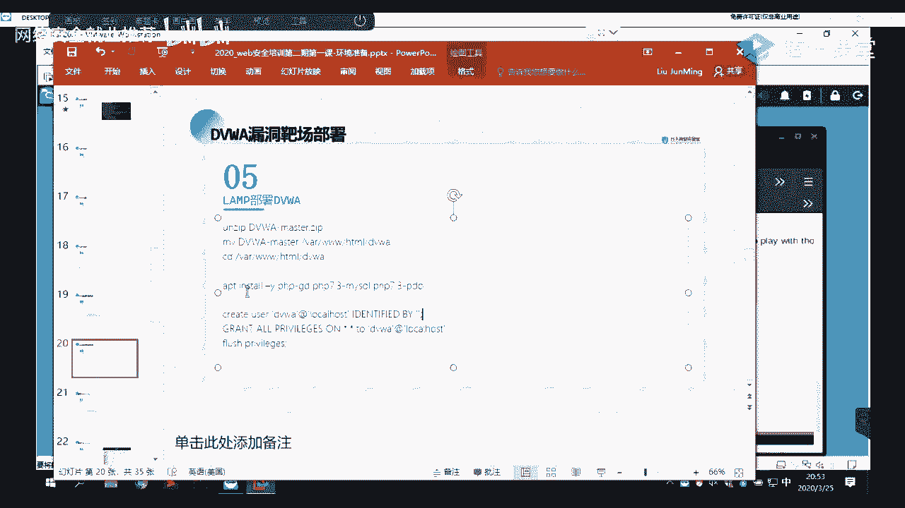

命令的话就是这样子，我这里的话，首先呢，我们需要临近连接到我们的这样的一个数据库，也就是这个，然后的话我们需要创建一个数据库用户。

我这里直接复制粘贴吧，应该能，三天不见了，我直接我手打吧，然后这里的话是涉及到了，一个数据库的一些操作，这样的话我创建了一，创建一个这样子的一个数据库，一个啊，把数据库用户dp w a的一个数据库用户。

然后的话我这里设置的一个密码的话，就直接设置为空，如果你想要设置密码的话，就在后面写写上里面的一个密码，这句话直接设置为空，写错了吧，id，啊我给你写错了，大家一定要注意啊，tr 8 e d。

呃我英语也不是很好啊，所以说啊这单词不是很很很好打，大家如果不是很好打的话，就不记的话，直接复制粘贴吧，好这样的话已经创建成功，就可以看到已经查询成功了，焊接之后的话，我们需要给它赋予权限。

然后给给的权限的话，我是啊给这个db w a的一个数据库，也就是我们这一个应用程序，主要去使用到的一个数据库，给他所有的一个权限，应该没有错，这里的话已经执行成功，也就是赋予了他的一个权限。

然后的话我们需要用fresh来刷新我们的一个权限，有点卡哦，然后刷新完完成之后的话，就是我们前面的一个命令的话，它会及时生效，及时生效之后的话，我们呃还需要去更改一下，我们的这样的一个配置文件。

因为我们这里的话，不能去使用到这样的一个root用户，我们只能去使用到我们刚刚创建的一个，db w a的一个用户，保存保存之后的话，我们需要重启一下我们的一个呃，我用这个吧，这个正规一点。

重启一下我们的一个呃数据库服务，以及重启一下我们的一个阿帕奇，分级之后的话，我们来重新创建一下我们的一个数据库，创建之后的话，可以看到这样的话是啊创建了数据库啊，刚刚一闪而过，就是已经创建成功了。

创建成功之后的话，它会自动的跳转到我们的一个登录界面，登录界面的话就是这样子的一个界面，然后它默认的一个用户密码的话是我的masword，对，这是一个admin password，然后就登录进来了。

好这里的话可以看到是这样子的一个样子，里面的话呃，我大概说一下，有像这样子的一个，比如说啊爆破以及命令注入啊，还有cs rf啊，sl，注入xss等等的这样的一些呃，一些实验的一个环境。

就说像一些题目的这样的一个环境给你，然后这里的话关于这个的话我就不多说了，因为呃其实这个的话比较简单，而且就是里面的一些啊内容，都有很详细的一个教程，如果说大家对这个东西有不了解的话。

或者说不知道怎么做的话，可以啊，在群里问或者说私聊我好吧，然后这样的话就是在linux上面搭建这样子的，一个靶子，躺了一个算是比较曲折，就它里面的话涉及到了挺多的一些操作。

就是说你需要对啊这个web服务啊，还有他的一些配置文件的一个路径等等，需要有一个相当的了解，所以说啊建议大家呃，就是说对于我想对那些没有了解过电历史系统，相关的一些知识的人的话。

那同学就是强烈建议大家去好，从现在开始去学习使用linux系统，大家可以就拿这个candy，linx系统去进行一个操作对吧，而且它里面的话有很多的一些工具，大家在可以去研究一下。

在呃呃自己的一些去进行一个，测试的一个过程当中，也会去使用到，好吧，然后其实就关于这些靶场的话，大家可以去玩神似啊，这实验室里面的话，就没有这样子这么复杂的一个过程，而且他有详细的一个步骤。

有有相关的一个实验，大家可以去找一下，就是有关于这一个靶场系列的一个，他的一些啊漏洞的一个解题过程，以及它的一个利用过程，还有他知识点的一个讲解，而且它环境是已经搭建好了的。

就不要你再去做过的那个操作吧，就把时间浪费在搭建这样子的一个版本，上面的话，还是挺亏的吧，好这样的话啊，本次的一个课程的话，其实就是教大家怎么去进行这样的一个，靶场的一个搭建模哦，忘了对了。

忘了看大家的一个回复，大家有有没有什么问题吗，呃还在吗，大家有问题吗，有问题的话，在公屏扣个一吧，没有人啊，有问题吗，有问题是吧，呃问题啊，有问题的话，建立靶场的作用，靶场的作用的话。

就是你自己去进行一些这样的一个呃学习啊，比如说你想要做一个，比如说这样的一个命令注入对吧，你想要去学习关于命令注入的一些知识对吧，你你去哪里学习呢，你想要去学习这些东西的话，如果说你自己去。

你刚开始还不是很很懂，去找这样子的一些漏洞的话，就是说这样的一个靶场的话，就是正好弥补你学习的一个啊空间，就主要是用于你去学习知识嘛，通过这样子的一个靶场，然后你可以在啊。

你学习到了相关的这个漏洞的一个知识的话，你可以在这里自己去进行一些操作来啊，使用你自己的一些攻击的一个方式，来查看你攻击的一个效果，为啥在看你上，在看你上的话，你也可以在其他的一个系统上面。

比如说windows windows的话，呃我这里也会讲怎么去部署，然后为什么说在卡里上面的话，其实，看你因为它是一个linux系统对吧，我只是以看你这个linux系统做一个啊逆子。

然后的话是在这个上面给大家做一个操作，因为上节课的话是讲的话是这个candy lix嘛对吧，当然你也可以在其他的一些，比如说啊centos对吧，red heart这样的一些操作系统。

上面去进行一个操作嘛对吧，你也可以，你也可以在上面去进行一个搭建的windows，windows上面的话确实方便多了，因为大家习惯性的话也是使用了一个windows，操作系统嘛对吧。

就呃相比于linux的话，你没有去系统那个去学习的话，去使用的话可能会有难度吧，对对对，就是这样的一个意思，我们的一个完形式，其实也是基于这样子的一个目的，就是说让大家来在这个实验室上面。

去进行这样的一个操作，然后的话就是节省了这样子，我们刚刚讲的一个环境搭建的一个过程，节省了这样的一个时间对吧，然后让大家呃就是专心的去研究，怎么去学习这样的一个漏洞的一个利用。

这话如果说你自己想要去研究，和相关这些漏洞的话，你可能也会去使用到，也会去涉及到自己去搭建这样的一个靶场，就比如说刚开课的时候，有同学问我说搭建cm的一个靶场对吧，也是其实跟这样子的话。

我这里的一个操作其实是类似的，就把你一个赛姆斯的一个靶场，放到这样的一个web目录对吧，然后的话进行一个搭建就可以了，然后可能会需要做一些啊，配置文件的一些修改等等，大家还有问题吗。

而就是windows的话，因为时windows上面去进行一个操作的话，因为时间关系的话，我们留到下节课再给大家做一个讲解吧，但现在的话已经呃加班了十分钟左右了，十多分钟了，在windows上面的话。

其实呃搭建的话会比战舰上面会简单很多，因为他没有他没有在windows上面那样子好吧，他没有在link上面这样的一个权限的话，会呃那么控制的那么严格，在外面上面的话，它一些权限的一个配置的话。

它是没有那么严格的，root用不了浏览器吗，能能用吗，你看我这里的话不是啊，已经启动了一个浏览器吗，啊浏览器的话大家可以就不像在windows里面的话，你可能直接就在这里就能够找得到对吧。

你在这里你点击右上角，这里不是有一个搜索嘛对吧，你搜索你直接搜索bbox吗，bbox第一个就是火狐的一个浏览器，它是一个开源的，还有谷歌也有啊，tom这个上面的一个web web浏览器，还有还有疑问吗。

如果没有，大家没有问题的话啊，我们今天的一个课程内容内容的话，就到此结束了，好吧好，没有问题的话，那我们今天的一个课程内容就到此结束，我们下课啊，欢迎大家好吧，谢谢大家的一个收看，好我们明天再见。

大家早点休息吧，现在时间也不早了，好吧。

好那么现在的话已经八点钟了哦，我先录个屏，好哈喽，大家晚上好啊，现在的话我们正式开始我们今天的一个课程，内容，好的话，如果还有呃，今天的话有同学跟我请假，就说要上课，如果没啊，有没有来的同学的话。

大家可以啊，我这里的话会有录制的一个回放，大家可以去看回放，然后的话如果在看回回放的过程中的话，有什么问题的话，可以直接在和权利在我们的这个权利以及，在我们的这个群里直接问我就可以了。

还有的话可以私聊我也是可以的啊，啊情话就不多说了，我们正式开始我们今天的一个课程内容，我们今天的话讲的是一个java以及python，环境的一个安装，就就说为什么要讲这一个环境的一个安装呢。

就是啊因为我们后面所需要到的，所需要用到的一些工具，都是要需要这这些环境的，只有在然后你电脑上面有安装，有这些环境才能够使用一些工具，然后的话便于我们后面的一个讲课，首先的话我在讲环境安装之前的话。

我把我们上一节课没有呃，因为时间关系没有来得及讲完的一个内容啊，做一个补充，在这个的话我们讲到了呃，利用l a m p的这种架构来部署，我们的一个db w a的一个漏洞靶场。

然后这里的话我们今天的话我们补充一下，在windows上面如何去安装这样的一个ph p，18里的一键集成环境，来安装我们的一个db w0 a，以及其他的一个cm等等。

首先的话我们先来了解一下什么是菲律宾，study k g k h p，480的话是一个菲律宾的一个调试环境，的一个程序集成包，然后的话它的一个功能的话还是比较强大的。

而且的话它的一个最大的一个特点就是呃，它里面有集成，有很多的一个环境，不需要我们在做呃，其他的一些呃安装，我们直接能够一进去创建网站，还有数据库ftp等等。

而且它里面有自带l n m p以及l a m p，所以的话我们直接只需要安装这样的一个软件，就可以完成我们前面的这样的一些环境内部署，而这里的话是它的一个官网，大家可以去看一下。

这样的话呃这个软件的话是做的挺好的，而且就是便于我们去搭建自己的一些环境，然后下载的话，大家自己去官网去进行一个下载吧，好吧啊，然后说到这个ppp是代理的话，今天有同学问我问题啊，就是啊。

用这个菲律宾代理来搭建一个cms的一个靶场，然后的话我看到他就是给我截图的话，他用的是一个啊18年的一个老版本的一个，p h p study，在这里的话我要提一下的话，就是啊不知道大家有没有了解到。

就是说这个老版本的ph p s study的话，它是有后门的，就说它里面有一个而可以执行命令的一个后门，然后如果你自己用的一个老版本的ph study，部署的这样子的一个web环境的话。

它可以直接通过这一个后门来执行命令。

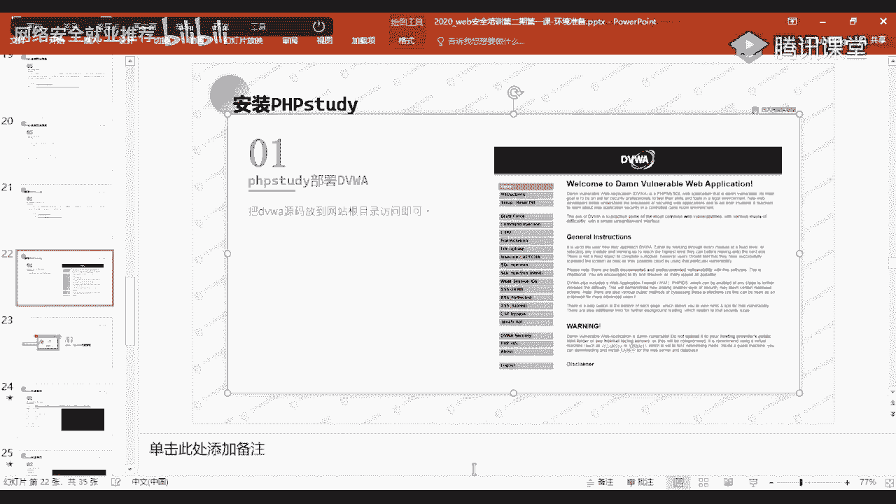

然后的话来达到操控你电脑的一个目的，而关于这个ph 4大理。

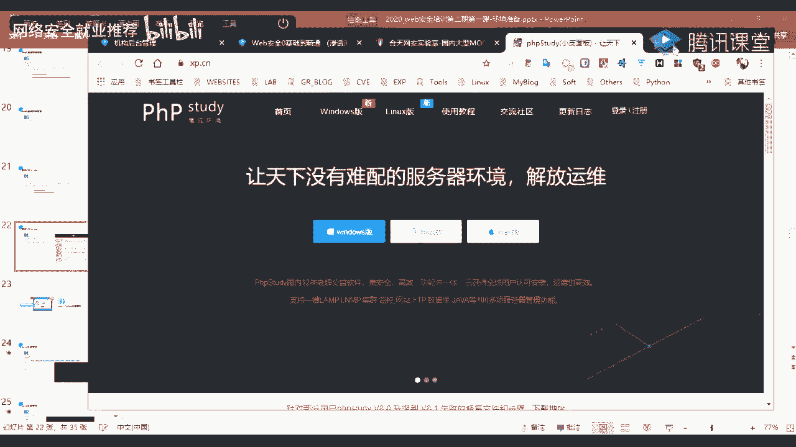

这个漏洞的话详细大家可以去做一下这个实验，这个ph study的一个后门漏洞的一个副线，大家可以去自己去做一下，了解一下，就说这里的话呃，因为讲到这里的话就提一下，就建议大家的话使用的。

最好的话是使用一个最新版本的，这样的话大家可以去做一下，好的话，我们如何去用这个ph 4 study来部署一个db w a，昨天的话呃也说过，也说到了在linux上面的一个搭建。

这样的话我们是在一个windows环境上面去搭建，这样子的一个db w a呃，这样的话我给大家做一个操作，大家可以跟着我一起进行一个而安装以及部署，呃首先的话你需要下载一个菲律宾study，看一下二。

哎呦我忘记下了吗，我这里的话呃，重新下一个吧。

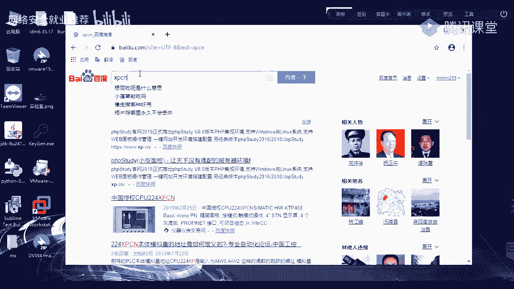

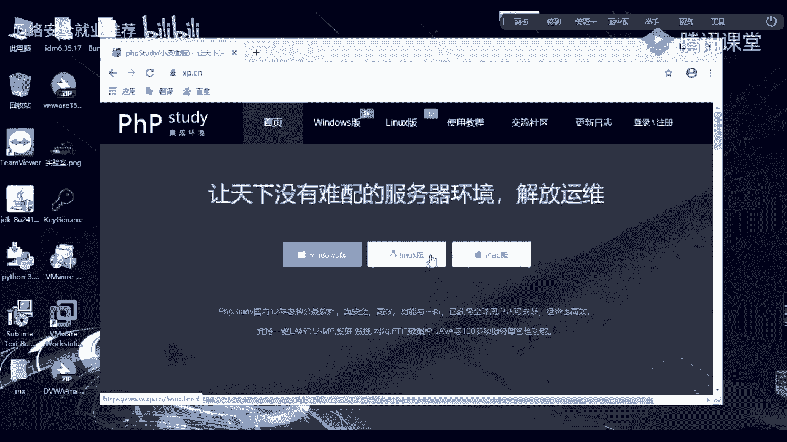

下一个这个windows版的最新版本的话是一个8。1，我们直接下载一下，然后我这里的话是64位的。

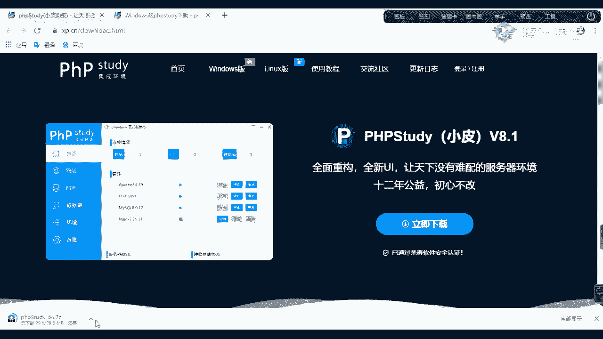

这样的话我下载完毕做一个解压，节奏的话只需要执行这一个exe文件，这样的话我们点人要运行，稍微有点卡，你看我机器卡了，稍稍等一下，哦好了，啊不好意思啊，机器稍微卡了一下，耽误了大家一点时间。

这样的话呃我先做一个安装啊，我这样的话就默认就装在这个d盘下面啊，立即安装，啊这里的话先等他装着吧，然后我先用我自己电脑上面的这一个，给大家做一个基本的一个介绍吧，就安装完成之后的话。

就是这样子的一个环境，它有这样子的一个命吧，那这样的话我们可以选择，我们想要开启的一个服务，比如说我们想要做一个web服务器的话，我们必须要去开启这个阿帕奇，这样的话已启动就可以了。

还有的话我们需要启动一个mysql其他方向，比如说ftp，还有其他的一个mysql版本，大家按需去进行一个开启，还有ngx等等，而这里的话我们需要配置我们的一个网站，网站的话就是我们这我们的安装之后。

它会有一个路径，也就是这样子的一个3w路径下面啊，我这里的话是这样子的，然后的话在这一个路径的话，就是我们的一个web根目录啊，我们只需要在这下面放我们的一个啊，放我们的一个源码。

网站的源码就能够直接去进行一个访问，然后这里的话，还有一个就是一个数据库的一个配置，这里数据库配置的话，我们需要设置我们的一个数据库的一个密码，就是说我们这里启动数据库之后，我们需要设置一个密码。

我这样的话默认的话是一个root root，这样的话你也可以自己进行更改，因为在本地的话呃，对密码的一个强度的话呃不做要求，然后这里的话我们可以选择其他的一些呃环境，这样的话自己大家自己去研究吧。

啊然后我这里安装好了之后的话，做一个启动，他这个有问题啊，他这个程序，然后的话呃阿帕奇已经mysql服务启动之后的话，我们就能够去进行一个访问，访问我们本地the post，然后回车。

这里的话就是它的一个默认的一个页面，这话就说明我们那个站点进成功了，然后的话我们接下来需要做的话，就是把我们的一个dv w a的一个源码，给它放到我们的一个网站根目录，然后这样的话他自己已经做好了配置。

我们直接打开根目录，打开之后就是这样子，然后这一个index。html的话，其实就是我们的那个首页，就是刚刚这个首页，而我们只需要把我们，这个文件夹拷拷贝到这个目录下面，我们要做一个重命名。

d b w a，然后的话里面的话就是它的一个源码，然后我们直接访问我们的一个db w的一个目录，广州的话同样都跟我们昨天一样，就是说我们需要更改它它的一个config目录，下面的一个配置文件。

我们需要给它做一个重命名，把后面的这一节给删除掉，好的话，我们刷新一下，刷新之后的话，可以看到就是我们昨天熟悉的一个界面，但是在windows里面的话，它没有啊，在定时里面说这种文件权限那么严格。

然后问题的话还是昨天的这个这个key啊，这个key的话大家可以不用去管，如果你想管的话，想要去把它解决的话，可以去百度找一下，也有别人已经有生产好的这种key，你直接放进去也是可以的。

然后这里的一个又要include的话，跟昨天一样，我们需要更改，我们的这样的一个片区的一个配置文件，啊配置文件的话是在这个设置这里，我们直接点这里配置文件，然后他这里的话有这样的一些配置文件。

就它这里已经列出来了，对吧啊，我们这里使用的一个ph版本是7。3。4的，我们直接打开，打开的话找到一个url，a layer，you are include，把我们的这里做一个更改，改成on，然后保存。

保存之后的话，大家一定要记记住，就是说你更改了配置文件之后的话，我们最好重启一下服务，不然的话它的一个配置不会做一个生效，更改完毕之后的话，我们刷新一下，刷新之后的话。

可以看到它这里的话是已经没有问题了，然后我们直接点这里创建我们的一个数据库啊，这样的话有一个问题的话，是我们的一个配置文件需要更改，我们的一个数据库的一个信息。

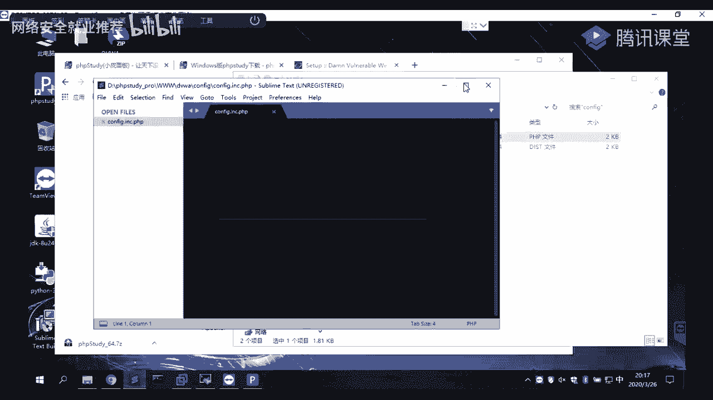

主要改的地方的话，就是改我们的一个数据库的一个密码，我们之前的一个密码的话是呃，应该是root吧，我看一下，默认的话是root root，我们这里只需要把这里做一个更改。

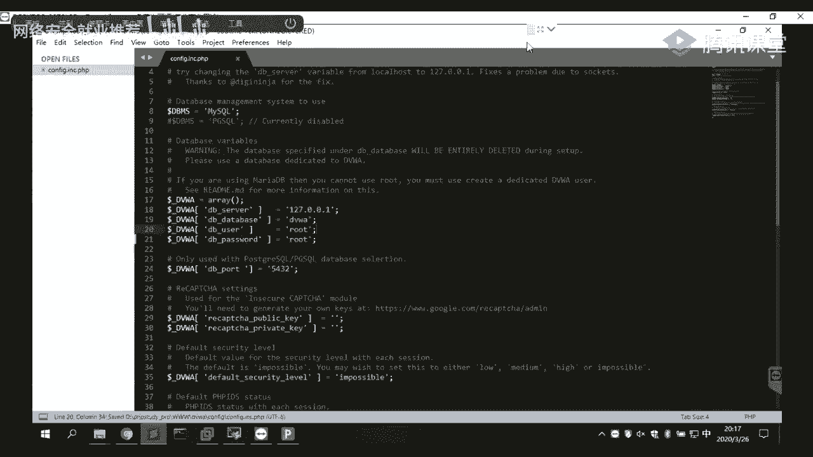

然后保存，保存之后的话重新创建一下，可以看到的话，这里的话已经创建成功，然后就是一个登录界面，登录界面的话，默认的一个账号密码admin password。

这样的话我们的一个在windows上面搭建这样的一个，db w0 环境的话就已经成功了，大家可以发现的话，就是说相比于昨天我们在linux上面去搭建的，这样子的一个环境的话。

在word上面是要更加简单的，而且更加方便吧，啊可能对于就是说对于呃不是很了解linux，你个人来说的话啊，在word上面操作肯定是要更加方便一点的，然后这里的话就是一个呃，dbw 0环境的一个部署。

在这里的话我就是再稍微多说一个，今天有位同学就是问我这样子的一个问题，就说搭建一个这样子的一个熊海的一个cm，然后我这里的话就以他以他的这个cm做一个例，子，就是说，呃教大家怎么去搭建这样子的一个。

cm的一个环境，就其实跟我们在windows上面去搭建这个db w连接，其实是类似的，同样的，我们只需要把源码，把它给复制到我们的一个网站根目录，也就是也就是这个3w啊，我们复制复制的话需要稍微等一下。

呃我这样的话就不等了吧，我直接在我自己的一个电脑上面做一个操作吧，我这样的话其实已经，有安装过了，我这样的话是在这一个三大门的一目录下面呃，一个这个i s e a的一个3m s。

然后这里的话我们其实就说这种cm s的话，其实大家的一个搭建其实都大同小异啊，就是说如果你们碰到问题的话，其实就是啊我下面要说到的这几点，首先第一点的话，就是你把它的一个源码放到这里的话。

你一般的话都是首先的话做一个访问对吧，访问你本地的一个服务，然后我们的这个目录，然后这里的话我们直接访问呃，这话是已经搭建好了呀，啊我这里的话是呃，如果你没有搭建的话，你直接访问之后的话。

就是会跳转到一个install的一个目录下面，这个目录下面的话会有，就是它的一个安装安装文件，就是访问这一个页面，我这里的话是已经安装过，安装之后的话，它会有这样子的一个，就是镜子里安装的一个文件。

如果有这个文件的话，它就不会再继续下面的一个安装操作，所以这里的话我们需要把它删掉，删掉的之后的话，我们刷新一下，就是到了这样子的一个安装界面，对吧啊，大家其实可以可以看到这里有一个sql文件。

我们可以打开来看一下的，这里的话其实就是它的一个一些，数据库的一个操作，就是创创建表等等，我们这里访问这样的一个界面的话，其实就是呃做一个数据库的一个，串表的一些操作，这话我随便选一个写一个密码。

然后数据库的一个名称的话，我这里的话是以这个s e a c m s，然后如果大家没有，大家第一次进行一个安装的话，会有一个问题，就是你再去安装的时候，它会呃，我这样的话是已经有了，我先把它做一个删除。

把这个数据库删掉，然后的话呃数据库用户名的话是root root是吧，好我们点击提交，提交之后的话，他会有这样子的一个报错，这个报错的话，就是需要你创建一个这样子的一个数据库，哎。

其实就是我们前面提到停写的，一个数据库的一个名称，这样的话大家可以自定义我这边写了这一个，所以我们需要创建一个数据库，创建数据库的话，我们这里开一个命令行界面，创建数据库的一个命令的话，十分的一个简单。

great great the database，b s，然后的话接我们的一个数据库名，然后注意要以分号结尾，然后的话这里的话就已经创建成功了，我们刷新一下，刷新之后的话已经创建成功。

它是一个空的数据库，它里面没有任何的一个数据表，然后我们创建完成之后，再做一个刷新，刷新之后的话可以看到他这里的话是在呃，导入我们的这样的一个circle文件，就是执行这一个circle文件里面的。

一个创建表的一些操作啊，做一些配置信息的一个写入，就是我们前面设置的一个管理员的一个账号，密码等等，然后写入到一个数据库里面，然后的话这里的一个cms就已经搭建成功了，就是这样子的。

就大家在搭建这种cms的话，注意的几个点就是数据库，然后的话就是呃一些配置文件，就比如说dp w a的那些，它会让你啊需要去更改，你的一个数据库的一个连接信息对吧，那其实这些的话比较简单，然后呃。

其实大家之后再去研究这些cms的漏洞的话，也会去做这样子的一些操作啊，我这里提一下的话，就是避免大家走一些弯路吧，好吧，好的话，我们继续我们的一个课程内容，下面的话我们一起来了解一下。

java以及python环境的一个安装，首先在安装之前的话，同样的，我们需要先下载我们的一个jdk，八的一个安装包，也就是我们家java环境的一个安装包，下载的一个路径的话是这一个。

这样的话有这样子的一些版本，我们选择一个在windows上面能用的。

就是windows 64，我是60设备的一个系统，所以下载这一个，这里点击，然后它会下载。

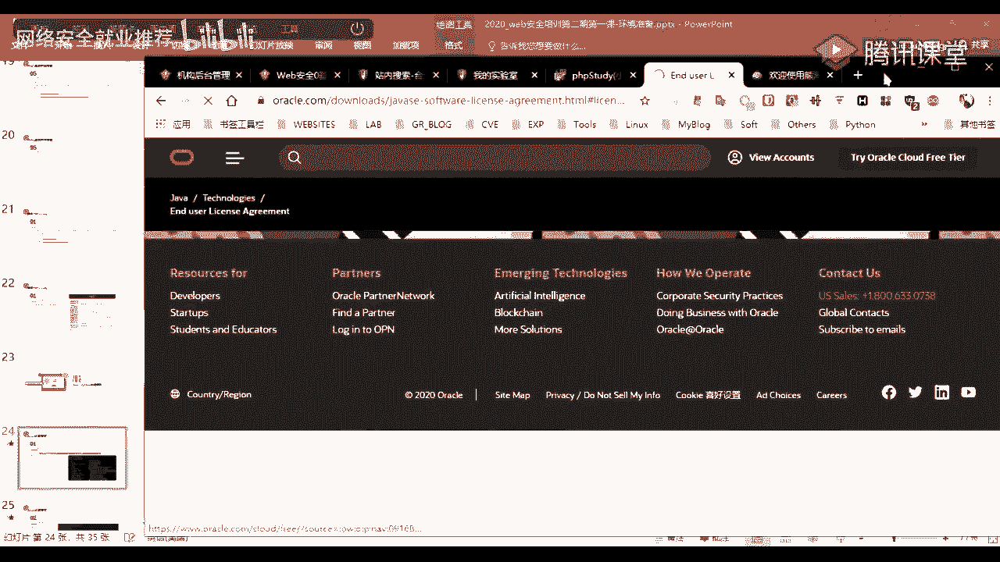

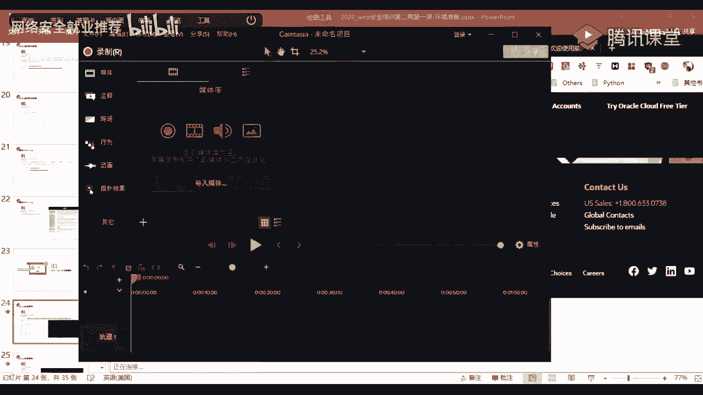

嗯这样的话我把链接发给大家吧，而源码的话直接网上就能找得到的，你去github，还有他的一些官网，还有别人发的一些呃。

源码都能找得到的。

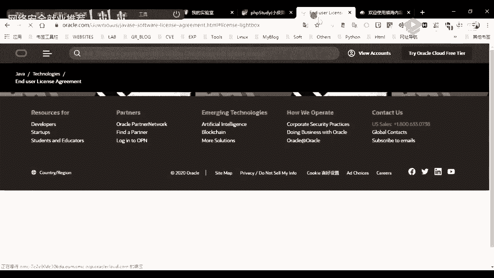

嗯怎么，所以的话点击这一个的话，它会让你呃做一个选择，我们选择下载这里好下载，这里的话就是你现在要去下载这个呃，java的这种jdk的一个环境的话，你需要有一个账户去进行一个登录。

因为啊oracle啊它其实是一个收费的一个商业公司，而这里的话我提供大家一个网址吧，就其实呃也是网上找的这个网址的话啊，就是这个大佬的话，他有给一个oracle的一个账号密码。

就是供供给我们就是有这种需求的人，就用他的一个账号做一个登录，就不用自己再去做一个创建账号等等什么的，然后我们直接登录，然后的话登录进去进行一个下载，可以看到我这里登录之后的话。

它立马就有在下载这样子的一个软件是吧，我这里的话就不不再下载了，因为我已经下载完了，而且他那个还还挺大的，有200多兆，然后下载完成之后的话，我们需要去进行一个安装，安装的话。

我们其实就是跟我们安装一个应用程序一样，我们直接点安装就可以了，然后下一步下一步安装之后的话，我们需要做一个环境变量的配置，好在windows里面的话，我们需要配置这样的一个patch的一个环境变量。

就是说这个环境变量的意思的话，就是比如说我们配置好了。

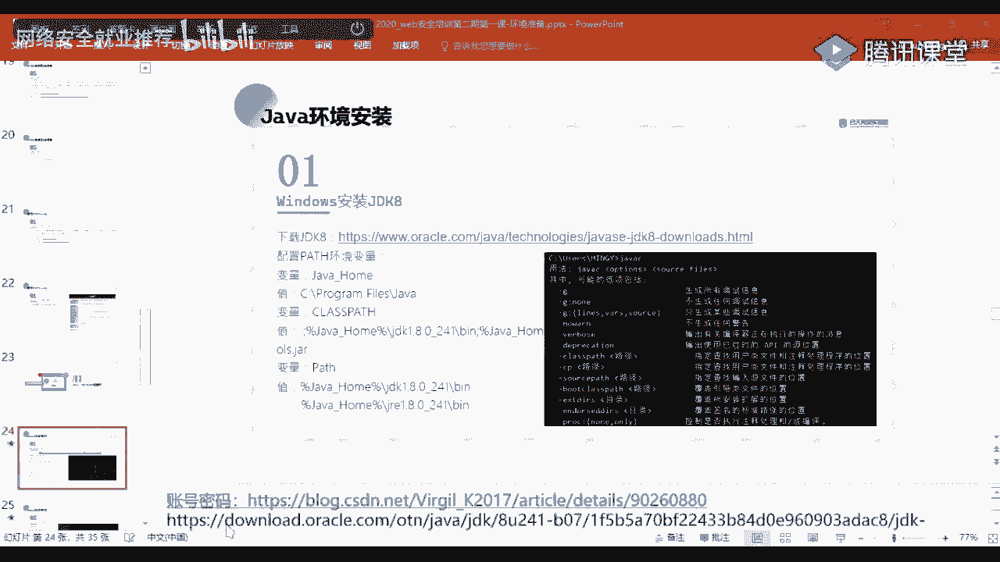

这样子的一个环境变量的话，我们直接在我们的一个cmd里面。

我们直接在一个我们的一个cg里面，直接能够输入java。

就能够执行我们的一个java命令，这就是它的一个环境变量的一个e，就是我们执行命令的话，他会去这个path环境变量里面去检索啊。

有没有这样子的一个程序，如果有的话，他就会去执行，啊配置环境变量的话，就呃主要的话就是这四个啊，不这三个就是一个java home，也就是我们安装的java的一个目录。

以及我们的一个class path，把我们java所需要的一些环境以及命令，它的一个目录给添加到这个class path里面，然后最后的话就是一个pace，需要加我们的jdk以及jr 1。

它也是一个java的一个环境，它里面的一个变幕，下面的这种可执行的一个文件，把它加入到我们的一个pass环境变量，然后呃如果你配置完成之后的话，直接在我们的一个samd里面去执行。

这样的一个java或者java c，就能够输出这样子的一个信息的话，说明你的一个java环境就已经配置成功了，好的话，前面讲的话是在一个windows上上面的一个安装。

在linux里面安装的话比windows要方便快捷很多，我们只需要一条命令，就是使用我们的一个包管理器去进行一个安装，要么杠y然后的话呃这里第一个面的话，亚姆加一个list的话。

就是列出我们的一个当前啊，就是这个，就是安装包的这个云里面，它包含有哪一些java的一个版本，然后的话我们找到我们想要安装的一个版本，然后进行一个安装就可以了，然后安装的话它会自动安装。

安装完毕的话就能够直接去进行一个使用，然后还有的话就是在linux里面，你可能你的一个你需要做自己的一个，指定版本的一个java环境，所以说你可能啊你用亚麻安装这种包管理器，去进行一个安装的话。

可能没有找到直接一个版本，所以的话我们可能需要用到一个源码的一个安，装，源码安装的话其实也是不是很复杂，同样的就跟在windows里面一样，我们需要去下载这样子的一个包，这样的一个包。

然后把它解压到我们的一个linux系统里面，解压之后的话去进行一个安装，然后我们需重要的一点的话，它同样的也需要去啊，就是加我们的一个环境变量，就把它加到我们的一个linux的环境变量里面。

就是需要更改这样的一个profile的一个配置文件，把我们的一个呃，jdk的一个目录等等的这样的一些class pace啊，还有java pace这些东西，把它给放到我们的环境变量里面。

它的一个在电力室里面的一个环境变量，其实跟在windows里面嗯，大家可以就是理解成是一样的，也是就是说你在linux里面去执行命令的话，他会去检索我们的这样的一个环境变量，然后找到这样的一个程序。

如果没有没有这个程序的，没有找到的话，他就会执行失败，然后呃安装完毕的话，我们可以输入java杠vision，来查看我们当前的一个版本，然后的话如果看到这个的话，就说明我们已经安装成功了。

然后的话我们一起来了解一下，在windows上面去安装python的一个环境，就说在现在的话，python的话，python的话是使用的越来越广的一个编程语言了，就是大家如果想要去从事这一块的话。

python是强烈建议大家去进行一个学习的，而且在大家的一个工作，日常生活当中也掌握这样子的一个python，编程员的话，会有很多很大的一个方便，又便于自己的一些呃呃使用，那这样的话我呃介绍一个。

就是在windows上面的一个app啊，不这个微软的一个应用商店里面，他现在的话已经有集成了这样子的一个python环境，有python 3。7g3。8的一个版本，大家可以直接在这个应用商店里面去。

进行一个安装，然后的话如果你不使用这个的话哦，因为这个微软上面的话啊，我反正是没有使用到使用到它的这个版本，就是我看他底下的一个评论的话，说这一个好在这个上面安装的这个版本的话，是会有问题的。

就是比如说你在id上面需要去调用这样子的一，个开始的环境的话，他不会去啊，找到那个安装的一个目录，所以说可能会有问问题，所以说这样的话，我介绍第二种就是呃，用在python官网下载它的一个安装程序。

然后进行一个安安装，路径的话就是这一个，我发给大家，直接啊直接下载这样的一个版本就可以了，这样的话我呃使用的是一个3。7的一个版本，当然现在的话3。83。9都有了呃，3。7的话。

因为就是之前也是用的这个版本，而且就是比较稳定吧，大家可以去安装那个版本，然后在安装的时候的话呃，大家去选择这一个安装的时候，最后建议大家选择这个自定义安装，然后安装选择自己的一个强化安装的一个目录。

以及一定要注意的话，这里有一个a的papython，3。7to pass，就是我们勾选这个的话，它会自动把我们的一个python的一个环境，python的一个目录程序的一个路径。

它会加入到我们的一个pass环境变量当中，所以说我们安装完之后的话，直接能够在cmd里面去执行啊，执行python，然后教育我们就是执行我们的一个python程序，这样的话呃，看自己的一个需求吧。

就是啊要注意的话，这一个pip是一定要去做一个勾选的，就是我们在后面kp的话，它其实就是一个python的一个包管理器，就是说我们可以通过这个pip来去安装，我们的一个python的一些库。

然后这样的话选择它的一个安装路径呃，看大家自己的一个需求，你可以选择在c盘，也可以在其他的盘，然后在linux linux里面去安装python的话，首先的话我们先介绍一个，就是源码的一个安装吧。

就是说在历史里面的话，我们通过这样子的一个源码器安装，在安装之前的话，我们需要安装一些环境，也就是一些工具，首先我们的一个we get b站的话，是一个linux上面的一个下载的一个工具，以及gcc。

是我们啊去进行一个源码安装，需要对这一个啊程序做一个编译，还有一些需要的在后面去进行一个编译的时候，需要得到的一个呃库，这个liber tv，啊这样的话呃我先给大家大概介绍一下吧。

等会的话呃如果有时间的话，再一的进行一个操作吧，这linux安装之后的话，我们需要创建一个这样的一个软链接，l o n来创建一个软链接，软链接的话就是呃大家可以理解成。

在windows上面的一个快捷方式，就是说我们把我们的这样的一个呃，在比如说在d盘的一个目录下面，在一个文件把它创建一个快捷方式到桌面对吧，然后我们直接在桌面执行那个快捷方式的话。

就能够啊执行在这个目录下面的一个程序，好的话，安装完之后的话，我们还需要啊，有必要去安装一个pip，这一个python的一个包管理器，安装的命令的话。

安装python 3版本的话是python 3杠p i p，然后还有一个的话就是要将我们的这个pyth，的一个闭目闭目录，下面的话就是呃python的一些执行程序，我们需要把它加到一个环境变量当中。

就能够直接在linux啊，命令行当中去输入python来调用它。

呃，呃这里的话先给大家做了一个基本的一个介绍，下面的话我给大家一的做一个操作演示，首先的话是在windows上面安装java，啊不知道大家有下载好没有，或者说大家原来是不是也有啊。

安装好的这样子的一个环境，uh well，问一下大家，就大家这两个环境在自己电脑上面有安装吗，没有安装吗，有，有对linux上面的话，其实比如说你在candy里面的话，它其实有自带了。

就是已经自带了一个python环境，已经java的一个环境了，就是说如果你常用linux的话，你就可以啊，直接不用去进行安装，直接使用它，使用它自带的一个就行了啊，我看大部分都是有安装的啊。

那这里的话我就大概啊演示一下吧，我这样的话已经下载好了这样子的一个jdk，好我们直接执行，安装的话，这里的话呃这些都不用管，然后这里的一个安装目录的话，我这里把它看一下，我ppt。

我这里的话就把它安装到这个默认的一个目录，下面，c盘的一个java，呃然后他一个安装的话可能会稍微耗一点时间，那这样的话在安装的时候。

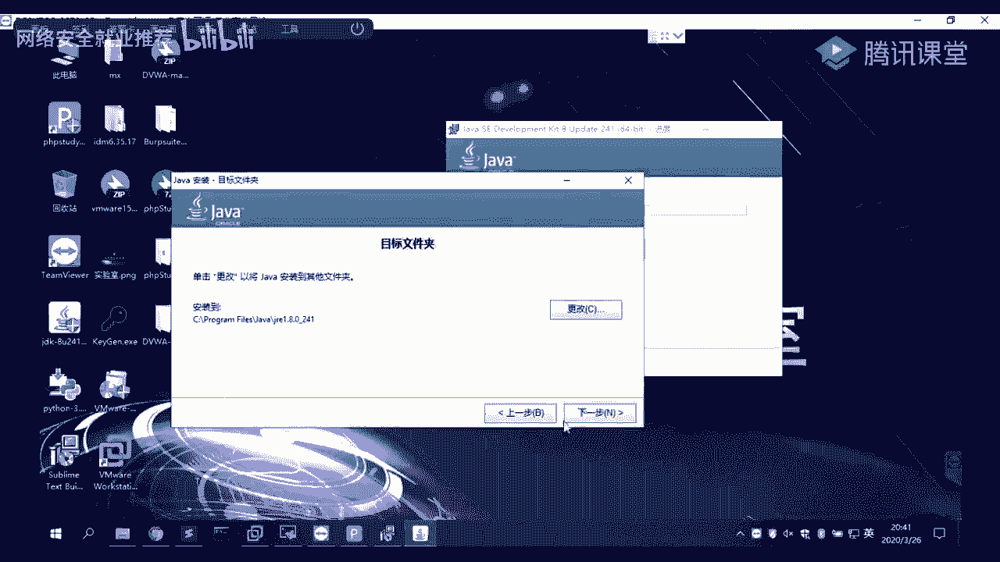

它会有让你去安装这样的一个j r e，我们这里的话同样的就把默认就好了，然后它正在进行一个安装，在安装的这段时间的话，我们先把它放在这吧，安装的这一段时间的话，我们来看一下。

我们在linux上面去安装这样子的一个java环境。

在linux里面的话，我们先呃我用我的这样的一个机器。

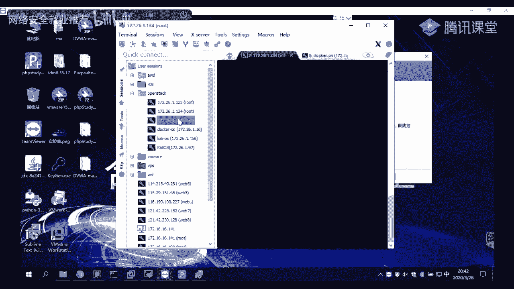

啊我用这个机器吧，这个机的话是一个呃三的，27。7的一个机器。

我们看一下应该没有，这样的话，他没有安装这样的一个java环境，首先我们先要来呃查看一下，在我们的这样的一个项目包管理器里面，它有哪一些版本的一个java，可以看到他这两话列出了这样的，比如说有1。

6版本，1。7，1。8版本的对吧，还有11 11版本的，这样的话我们就安装这个1。8版的，一个open jdk，然后我们需要安装这类的这样的一些东西，这样的话我直接要么杠y install安装这个。

然后这里的话我就不一一的去那个，我们这里使用一个通配符，信号的话就是说就是啊，只要前面这一段是相同的，后面的话这样的一些它会做一个匹配，它会匹配前面这一段相同的这样的一些软件包。

如果是你这个java杠1。8，open jdk开头的话，他都会去进行一个安装，然后我们回车回车之后的话，它它就再进行一个安装，当然的话它的一个安装的一个时间还是，稍微呃稍微要花一点时间。

然后可以看到的话，这里他要下载这样子的一个呃安装包。

一些源文件，这样的话我先呃给它放在这，让它安装着，然后这样的话已经可以看到已经安装成功了，我们关闭，安装之后的话，我们可以来试一下，使用java，这样的话已经。

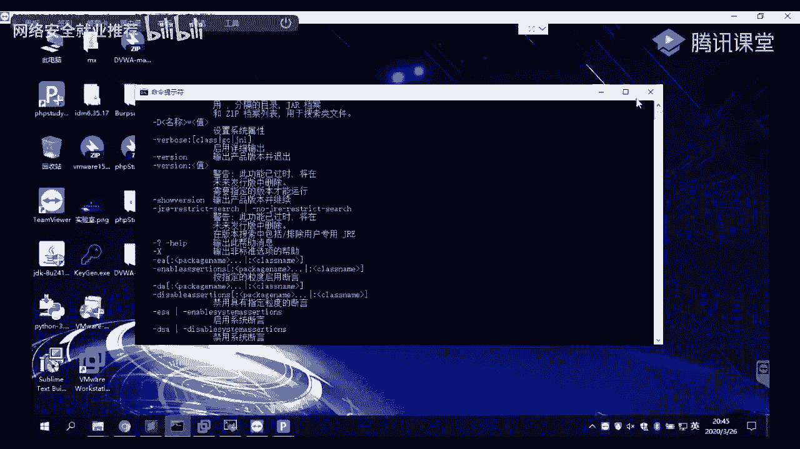

哦这里的话，之前的话因为已经安装过了，我之前的话是在这里已经安装安装过了，然后的话是把它做了一个卸载，就卸载之后的话哦，那个环境变量里面，环境变的话，在大家右击这个电脑，是我的电脑，此电脑。

然后有一个属性，主线的话点这个高级系统设置，这里有个环境变量，而环境变的话，因为之前的话我已经加过了的，而且没有做一个删除，就我们需要加的话，是这个我们需要新建一个，这里在这个系统变量下面新建一个变量。

名的话是java home，java home的话就是我们的一个安装的一个目录，java一个安装目录，就这一个好，把它填到这里，还有的话就是一个class class class pass的话，大家。

我把这个发到发出来吧，大家就照着我这样停就可以了，这样的话还还是需要做一些修改的，要根据自己的一个呃这样子的一个，比如说这一个jdk，你的这个名字是这版本跟我一样的话，你就可以直接这样子停。

然后大家要注意的话，前面这里有一个顶加封号开头，然后的话在后面接我们的这样的一个目录啊，是以分号做一个分隔的，比如说这里一个java home的话，就是找到我们的这里。

我们这里停了一个java home对吧，就说找到我们的这一个这一个目录，找到这个目录之后的话，这个目录下面的这个jdk，然后这个病目录啊，还有其他的一些啊，twice jar。

这样的一些包把它给呃加到这个变量里面，当我们在执行的时候，它就会自己去寻找好的，还有就是在这个pass在这个pass里面的话，我们需要添加把它的一个，呃这样的话我在目录里面看一下c盘的一个，知道吧。

这里这样的话有这样的两个目录，我们点开这个jdk，jdk，并屏幕下面的话，可以看到它都是在这样子，点e c结尾的这种可执行的一个程序对吧，我们就需要把我们的这样的一些啊程序。

把它给加到我们的一个环境变量里面，并与我们的一个呃使用。

啊你配置好之后的话，就能够直接在好sam店里面去执行，我们的一个java命令。

呃然后linux的话，这样的话它所需要的一个时间的话会比较长哦，大家在装的时候耐心一点，这样的话我就给他就先放在这吧，就在那个什么安装的话，你只需要这样一条命令，然后等它安装完就可以了。

他比如说这种环境变量的一个配置的话，它会自动帮你配置好，然后的话就是一个源码的一个安装呃，源码安装的话，我这里的话就不做演示了吧，这个的话如果大家有这样的一个需求的话，大家自己去百度1下吧。

我就大概说一下啊，我们首先的话需要建立这样子的一个安装目录，就跟我们前面所一样的，我们需要建立这样子的一个安装目录，在问的上面的话，是在那个默认是在c盘的program，然后有一个java目录下面。

这样的话我们需要自己创建一个，然后的话把我们的一个源码解压解压之后的话，把它重命名为这个jdk 8，就是它会在这样子的我们的这个java目录下面，然后的话就是做一个这样子的一个，环境变量的一个添加。

添加之后的话，我们啊添加之后的话，我们就可以去直接去进行一个调用。

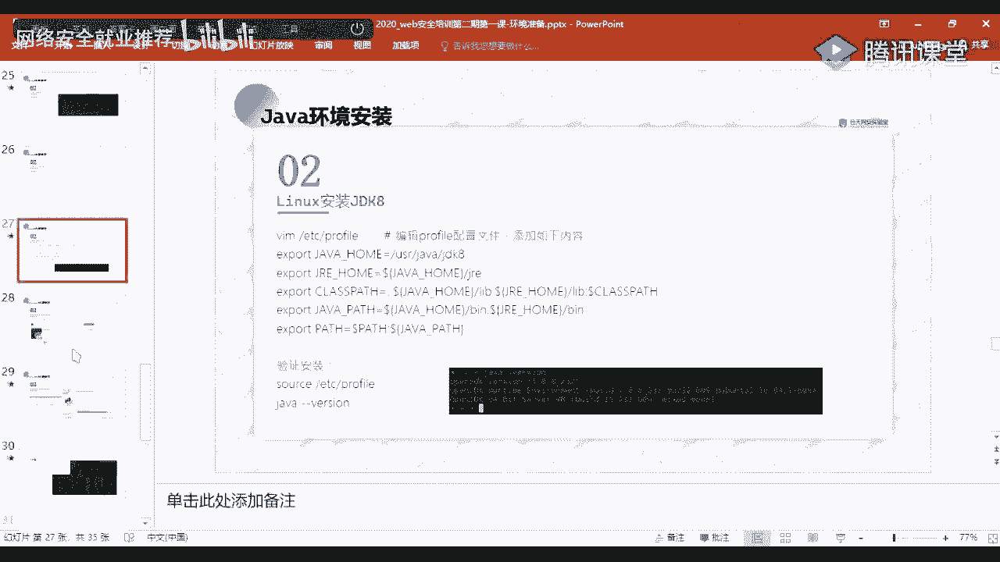

这样的话可能还需要哦，这里的话已经安装完毕了。

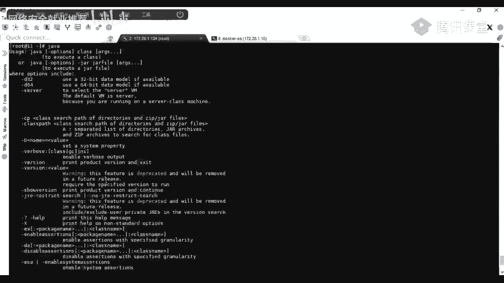

安装完毕的话，可以看到我这里直接执行java，就可以直接进行一个使用了，这句话就是啊java环境的一个安装，它的一个详细的一个步骤，这这个的话应该没有什么问题啊，大家的话都有，安装的话。

我这里面讲的话是给呃那些哦，就是没有安装，跟同学听的，好，下面的话我们来说一下，如何在windows上面去安装我们的一个python环境，首先的话呃。

在windows里面的一个story就是应用商店里面，它其实有自带的这样子的一个python安装包。

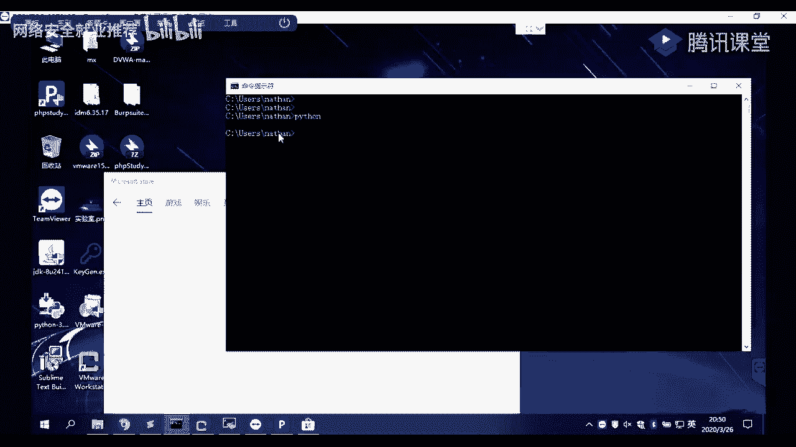

我们只需要在我们的一个samd里面挑一个python，它就会自动打开我们的一个应用商店，然后跳转到这样子的一个安装，这样的话它跳转的话是3。8的一个版本，而我们只需要获取，获取之后，它会进行一个安装。

然后的话当然我们也可以自己搜一下python，可以看到这里有3。7的一个版本，要不看自己看自己的一个要求吧。

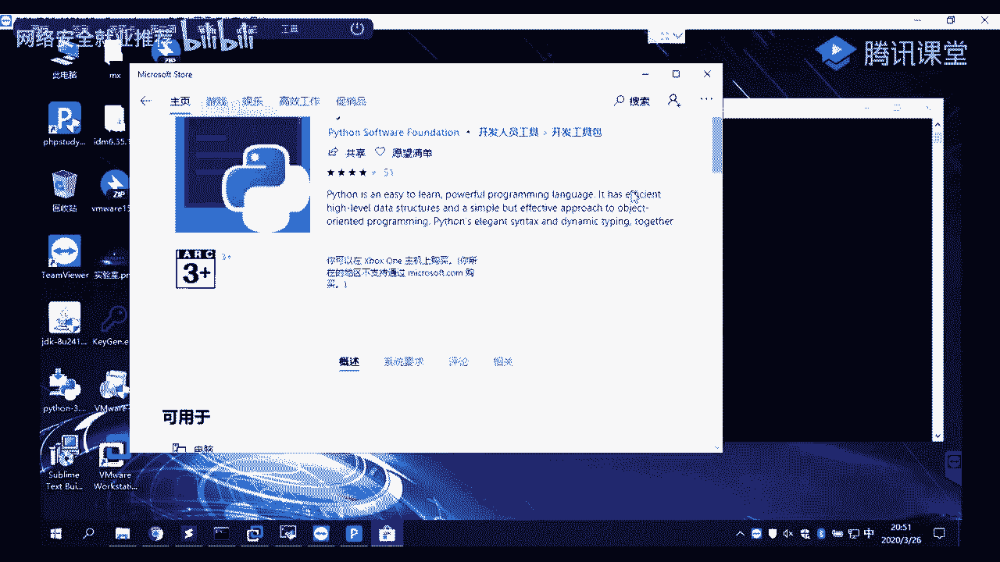

这两个版本都是可以的，然后这里的话呃，我就不去不去使用这一个，它应用商店里面自带的一个版本啊，我使用的话是，python的一个官网上面下载了一个安装应用程序呃，大家要注意的话。

这里这个添加环境变量也没有必要去勾选一下，然后选择这个自定义的一个安装啊，这些呃看自己的一个需求吧，像第一个的话，其实可点可不点，就是一些呃他的一些python的一个说明的一个文档，一些文件。

然后我们默认就可以了，然后next，这样的话，我们可以自己选择一个安装的一个目录，就说我这里的话呃，选择在c盘的一个program file，我们新建一个，新建一个python 3的一个目录。

然后我们选择安装在这个目录下面，然后直接安装，这里有个问题，然后的话只需要稍等一下，呃这里的话在等了大概啊一分钟左右吧，呃，可以看到这里的话已经安装完成了，安安装完成之后的话，我们直接在下面那里面。

夺冠fpython 3，它安装在这个python 37的一个目录下面，这话我们直接执行这一个就可以了，他没加到，他没有加到环境变量，我忘了勾选了吗，然后呃，如果你发现你直接在3d里面调不了的话。

你可以在这里加一个环境变量就可以了，就在一个page里面诶。

你加了个，好现在的话可以了。

可以看到，直接敲python的话就进入了他的一个python环境，这里的话就是一个python环境的一个安装。

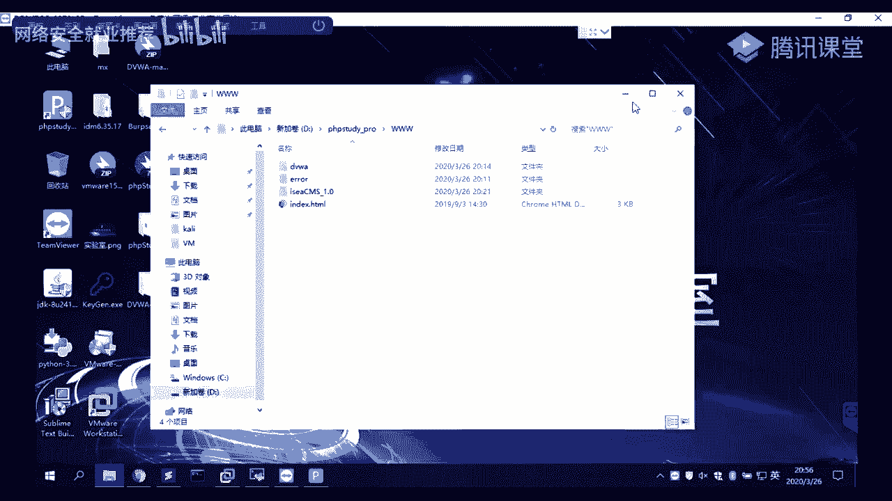

它的安装步骤的话大概就是这样子。

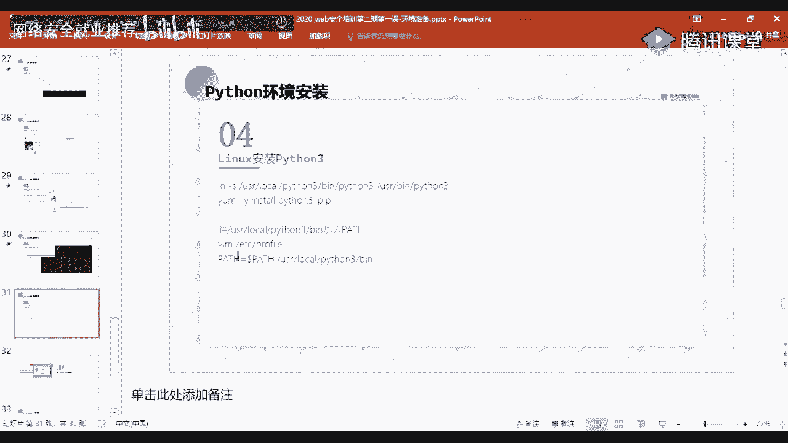

然后的话是linux上面的话我就不讲了吧，好大家可以直接去使用卡尼尔，使用卡里的话，其实这两个环境啊都是已经安装好了的，这样的话我考虑到大家就是常用的，也是在windows上面进行这样的一些操作。

我的话呃咱们的上面好安装一个的话，便于自己的一个使用，也不用直接，也不用再去虚拟机里面去开一个这样的一个卡，里，看你的话他其实已经安装好了，有两个版本的python，二级python 3。

他都是已经安装好了的，还有的话java环境也是已经有了的，就不用我们再去进行一个安装，这就是呃这个呃系统它的一个好处吧，就是呃有很大的一个便利性，就我们不需要去准备其他的这样的一些环境。

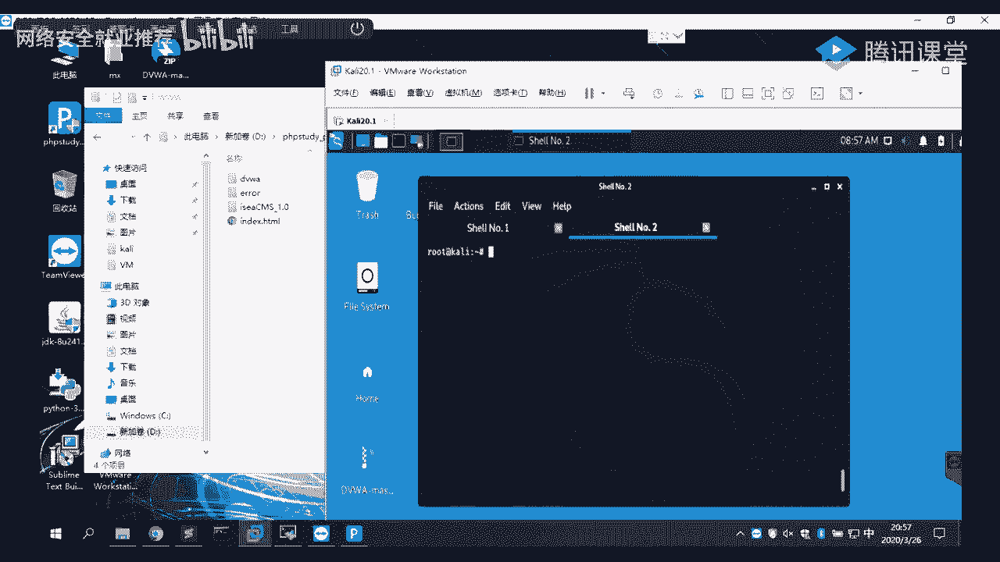

能够直接去进行一个使用，啊前面的话讲到了，java环境在windows已经历史上面的一个安装，以及python环境在windows上面的一个安装，接下来的话我们来介绍一下这样子的一个工具。

as a boot这样的一个工具，这个工具的话嗯，是我们之后会经常会去使用到的一个工具，而且他这个工具的话是啊，专门用用于做一些呃，我们的这种测试的一个工作，好之后如果大家去进行一个漏洞的一个挖掘。

发现的话，也会去是经常使用到这个工具，如果你使用的好的话，给你自己的一个这样的一个，漏洞的一个挖掘的话，会带来很大的便利性，首先的话，这里的话给大家介绍一个它的一个安装啊，为什么要去介绍它的安装。

其实这个就是在之前的一些培训里面，其实也有很多的一个学生，他就是呃我直接发给他这样子的一个，这样的一个安装包对吧，发给他，但是他不会去进行一个使用，或者是呃或者是说是一个激活，就是一个破解。

因为因为它是一个收费的一个软件，那这样的话我大概给大家介绍一下，如何去啊对它做一个破解以及啊使用吧，这样的话我把它放到了，这是我自己的一个，我把它放到了一个百度网盘，发给大家，大家可以做一个下载。

版本的话是1。7。3亿的一个版本，当然的话现在的话2。一点，二点一点多的一个版本也也是有了，然后的话在看你里面，他其实呃已经有安装好了的一个软件，可以直接去进行一个使用，而且它那个版本的话是。

如果你安装的是，我这里给了一个新版本的一个镜像的话，它是一个2。1。07的一个版本，就说比这里的话是要新的，而且功能的话是要多一点，就是说毕竟它的一个版本是要新一些嘛，啊这样的话我是给大家说的话。

是这个1。7。31的一个版本，然后大家下载好之后，就是这样子的一个这样子的四个文件，就是说其实它主要的，其实它本来里面只有这两个文件，在下面的话是我自己加的，我自己大概就相当简单的写了几个命令。

就我们直接执行这样子的一个bbs的一个脚本，然后它就会打开我们这样子的一个bp，这样的话这里的话需要做一个破解，就如果你没有破解的话，它就会显示这样让你输入，我们的输入这样的一个license。

这样吧我先取消，然后首先的话对它做一个基本的一个破解，我们首先需要运行这个bp的一个load，这是一个破解的一个补丁，执行之后的话，我们是这样子的一个界面，然后我们点这个run，点击这个乱糟的话。

它就会启动这个bp python这个它的一个程序，启动好之后的话，他让我他这里会让我们输入这样的一个license，我们直接复制这里的一个生成了一个license，复制粘贴啊。

next next之后的话，它就会到这样子的一个界面，然后的话我们需要呃点击这里，这里有一个呃，点击之后的话会到这样子的一个界面，然后的话我们他这里会有提供给你一个request，然后我们直接copy。

然后把它粘贴到这里来，粘贴到这里来之后的话，它就会生成这样子的一个响应，一个激活响应，我们直接全选复制复制，把它粘贴到这里来，test粘贴之后的话，我们下一步next，然后finish之后就已经好。

可以进入到我们的一个bp了，这话我们那三角，然后直接点下一步next，然后启动这个的话就已经可以把它擦掉，启动之后的话就是这样子的一个界面，如果熟悉的话，对这个工具熟悉的话，呃大家对这个工具熟悉吗。

就是呃也应该有去使用过吧，或者说没有使用过，但是应该也有听说过这一个工具吧，呃都没人说话吗，看来是都呃没有使用过是吧，有使用过是吧，如果没有使用过的话，在呃下节课的话。

我会给大家就是在讲htp协议的时候，会给大家啊做一个他的一个基本的一个使用吧，就是他的一个抓包改包以及发包啊，我们使用到的最多的一些呃功能链接吗，啊可以的呃等等我们把这里讲完之后的话。

下下课的时候我再发到群里吧，而这里的话就已经啊激活成功了，激活成功之后的话，我先把它擦掉，就如果你计划成功的话，如果你没有下面我这里写的这样两个文件的话，你会你首先你要去启动的话。

你要去去点击这一个对吧，点击这个，然后点这个run，点击呃这里点击万兆的话就到了这里，我们需要下一步下一步，然后启动对吧，所以说呃这里的话会有多了这样的一个开启，这样的一个步骤。

所以我这里的话就啊因为懒嘛就偷懒的话，就写了这样子的一个bbs的一个脚本，这其实就是执行我们的这一个，这一个的话就是用来启动呃，启动这个破解补丁，然后的话再启动这个我们的这个应用程序。

这是java相关的一个启动的一些呃，执行的一个命令，然的话就是直接在cmd里面执行我们的这个脚，本来启动这一个，然后的话我们直接执行它，执行它之后的话，他直接就打开了吗，就省去了中间的一些步骤。

就其实主要就是为了呃稍微方便一点的，稍微方便一点吧，然后这个这个的话我会发给大家，大家可以去啊下载一下，然后使用吧，然后大家对于今天的一个课程内容，有没有什么疑问呢，哦今天的课程内容的话大概就到这里了。

嗯给大家五分钟的一个时间提问吧，如果没有问题的话，呃我们今天的一个课程内容的话就到此结束了，嗯你要在虚拟机里面使用dog是吧，在虚拟机里面使用docker的话是可以的呀，哦您说windows镜像吗。

而windows的一个多口的话，我我只在我自己的一个本机上面有使用过，但是，我对这个windows上面的一个端口的话不是很熟啊。

就是我之前的话是试过，在windows上面安装这样子的一个多口，然后的话就是你安装之后的话，比如说呃我这里的话，因为windows最新他不是有这样子的一个w s l吗，还有一个linux子系统。

如果你安装了那样的一个windows dog的话，你需要开启一个那个虚拟化的一个选项吧，还是要关闭来着，然后你就不能够去使用这样的一个呃，linux的一个子系统，所以的话我就。

而且其实没必要在windows上面装那个多壳呀，你在linux里面去使用多口的话，还要更加方便一点的，呃我这里的话，找一个机器，这个，你直接在linux上面去安装这样的一个多。

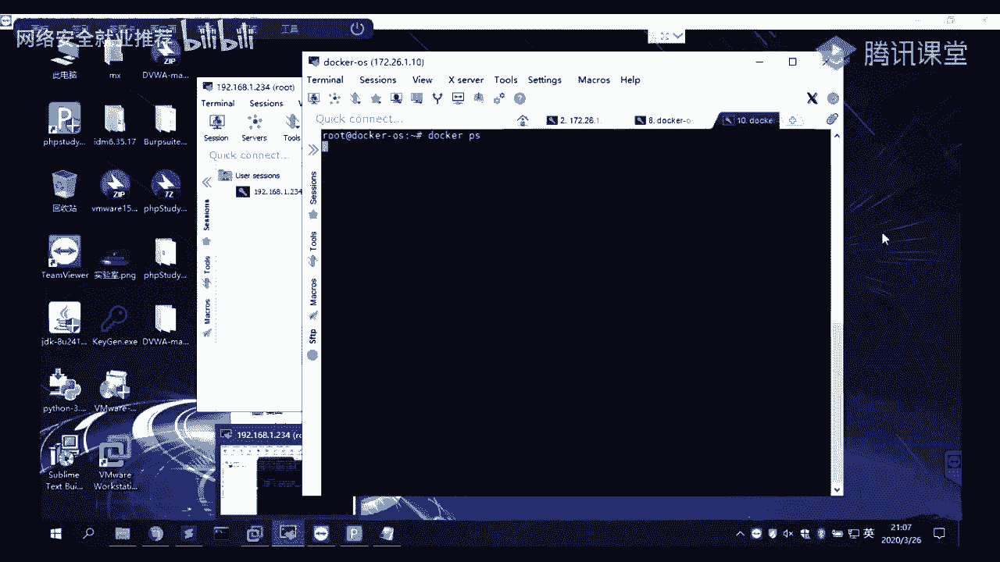

可不是更好吗。

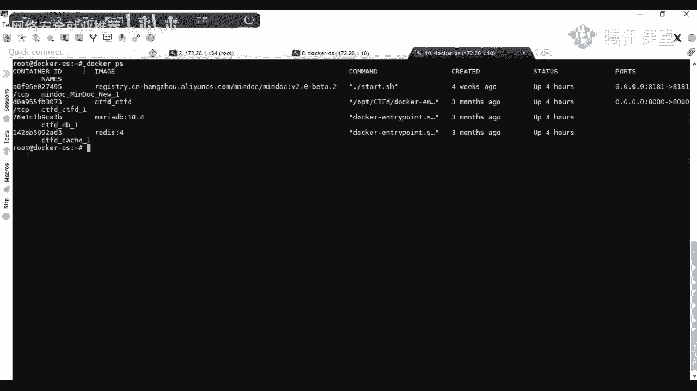

对吧，而且在另一层面操作多核的话，就只要几条命令的事情，在windows上面的一个多口的话，我个人是不太熟悉的，哦还有还有其他问题吗，克莱，克莱是什么，你搭建docker的话。

我建议你是使用linux吧，linux的话，你，只要几条命令的事情，而且你安装的这个环境的话，多可环境的话也会更快一点，就不用去整其他的一些操作，在windows上面可能会方便一些吧。

但是可能但是在使用效率上面的话，我还是觉得那上面要方便一下，呃还有两分钟的时间，大家还有什么问题可以提的，可以直接提要。

都没有问题了是吧，呃如果都没有问题的话，那我我们今天的一个课程内容的话，就到这里结束了，首先嗯然后的话谢谢大家的观看吧，我们哦下节课再见，大家呃。

