# 课程P40：第1天 - 渗透测试工具环境准备 🛠️

在本节课中，我们将学习如何搭建渗透测试所需的基础环境。主要内容包括虚拟机软件VMware的安装、Kali Linux渗透测试系统的安装与基础配置、Java（JDK）和Python开发环境的安装，以及渗透测试基本流程和常用工具的简介。

---

## VMware安装与Kali Linux部署 🖥️

上一节我们介绍了课程概述，本节中我们来看看如何搭建虚拟化环境。

VMware Workstation是一款功能强大的虚拟机软件，允许我们在单一物理机上运行多个操作系统。它是我们搭建渗透测试实验环境的基础。

以下是VMware的安装步骤：
1.  从课程预习资料或VMware官网获取安装程序。
2.  运行安装程序，按照向导提示完成安装。
3.  使用提供的许可证密钥完成软件的激活。

安装好VMware后，我们需要在其中部署Kali Linux。Kali Linux是基于Debian的Linux发行版，它预装了超过600种渗透测试和安全审计工具，是安全研究人员和渗透测试人员的首选系统。

我们选择Kali Linux的原因如下：
*   **环境集成**：Kali已预配置好渗透测试所需的基础环境。
*   **工具丰富**：自带大量安全工具，涵盖信息收集、漏洞分析、密码攻击等多个领域。
*   **免费开源**：完全免费且支持多语言（包括中文）。

Kali Linux的安装步骤如下：
1.  从Kali官网下载系统镜像文件（ISO）。
2.  在VMware中创建新的虚拟机，选择下载的Kali镜像文件。
3.  按照虚拟机创建向导，分配内存、硬盘空间等资源。
4.  启动虚拟机，跟随Kali安装程序的图形界面指引完成系统安装。

**注意**：在渗透测试学习中，我们通常需要模拟攻击方（Kali）和被攻击方（靶机）。因此，建议你参照此方法，再安装一个Windows操作系统（如Win7/10）的虚拟机作为练习靶机。切勿对未授权的真实目标进行测试。

---

## Kali Linux基础配置与使用 🐧

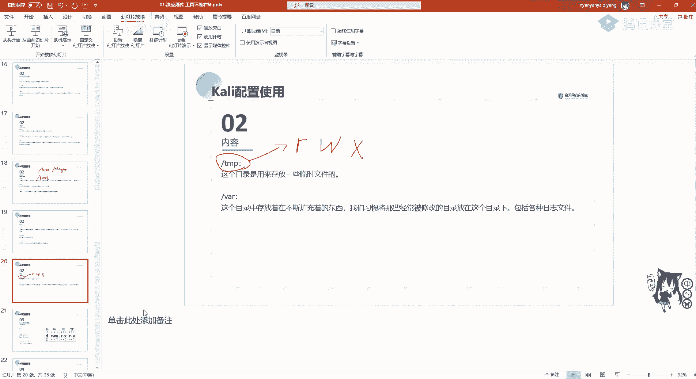

上一节我们完成了虚拟环境的搭建，本节中我们来看看Kali Linux系统的基础知识。

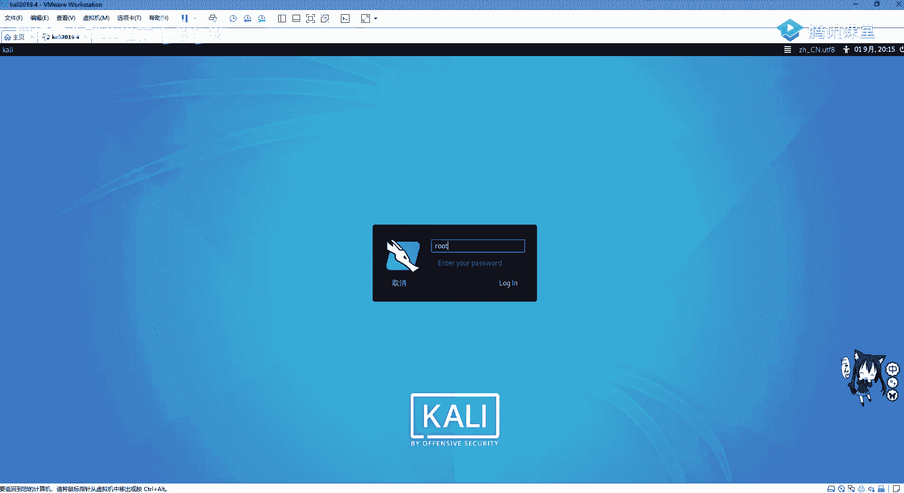

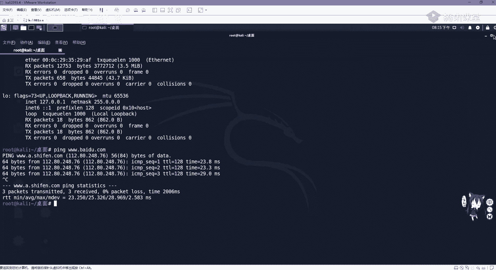

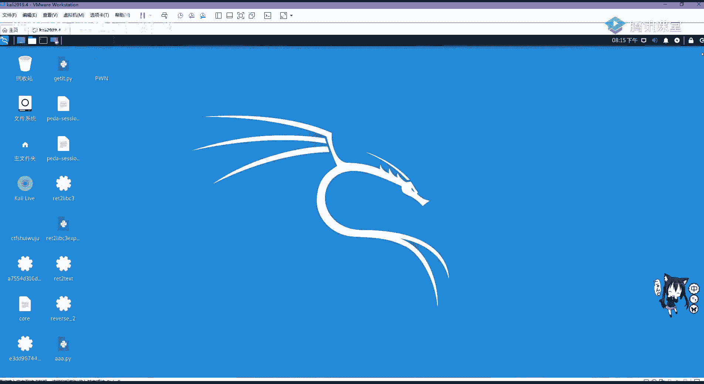

Kali基于Debian，而Linux是一种开源的类Unix操作系统。它与Windows不同，采用树状的目录结构，并且“万物皆文件”，包括硬件设备、配置、命令等都以文件形式存在。

Linux系统的根目录是 `/`，其下包含许多重要的系统目录。以下是根目录下主要子目录的功能简介：

*   **`/bin`**：存放最常用的用户命令二进制文件，如 `cat`, `ls`。
*   **`/boot`**：存放系统启动时所需的内核与引导文件。
*   **`/dev`**：存放设备文件，如接入的U盘会在此生成对应文件。
*   **`/etc`**：存放系统管理和应用程序的配置文件。
*   **`/home`**：普通用户的主目录所在地，每个用户拥有一个以用户名命名的子目录。
*   **`/lib`**：存放系统最基本的动态链接共享库文件（类似Windows的DLL）。
*   **`/opt`**：用于安装第三方额外软件，默认为空。
*   **`/root`**：系统超级管理员（root用户）的主目录。
*   **`/sbin`**：存放系统管理员使用的系统管理程序。
*   **`/usr`**：存放用户应用程序和文件，类似Windows的 `Program Files`。
*   **`/tmp`**：存放临时文件。**该目录权限特殊，所有用户通常都有读写执行权限**，在渗透测试中常被用于上传木马等操作。
*   **`/var`**：存放经常变化的文件，如日志文件。

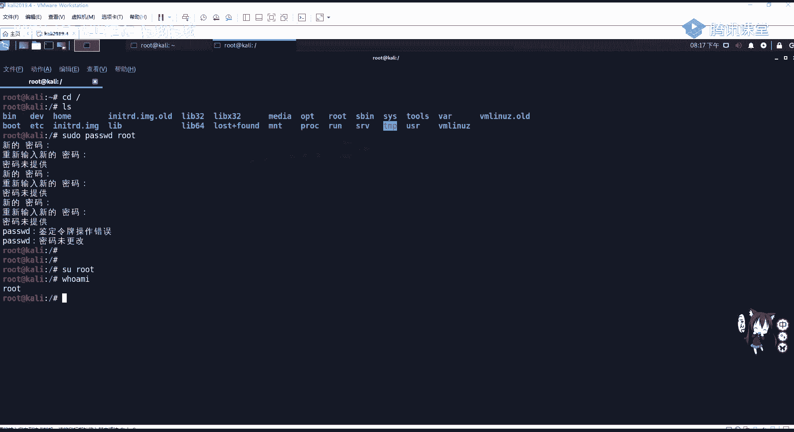

### 用户与权限管理

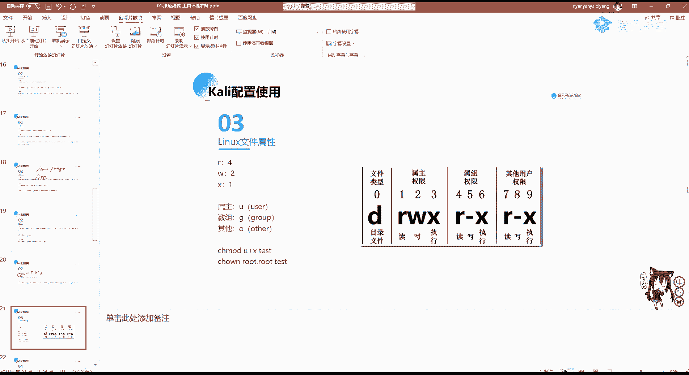

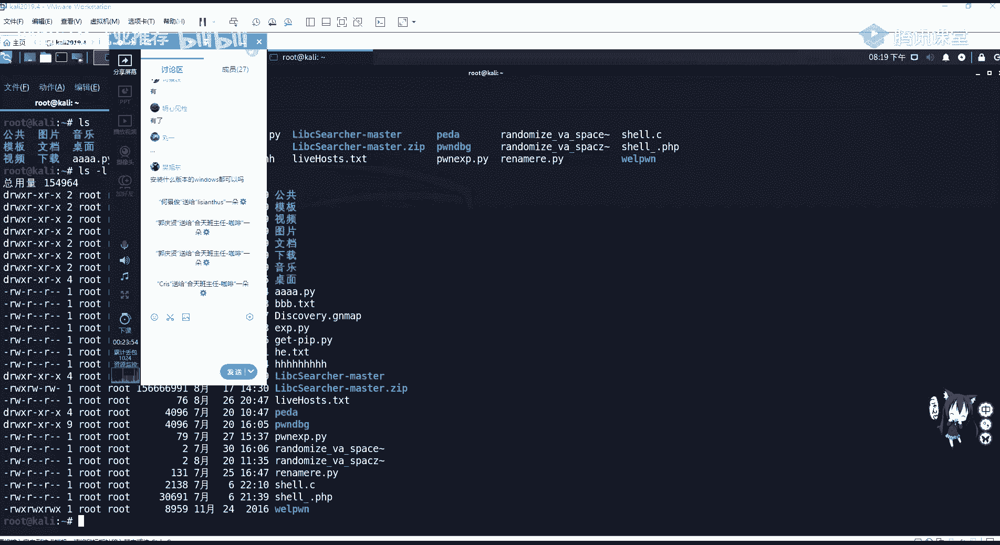

在Kali中，默认可能不是以root用户登录。要切换到root用户，可以执行以下命令：
```bash
# 首先为root用户设置新密码
sudo passwd root
# 然后切换到root用户
su root
```
`#` 符号提示符代表当前是root用户。在虚拟机实验环境中，可以使用root权限，但操作需谨慎。

Linux系统的文件权限管理非常精细。使用 `ls -l` 命令可以查看文件的详细权限信息，例如 `drwxr-xr-x`。
*   第一个字符 `d` 表示目录，`-` 表示普通文件。
*   后续9个字符，每3个为一组，分别代表**文件所有者（属主）**、**所属用户组（属组）** 和**其他用户**的权限。
*   `r` 代表读，`w` 代表写，`x` 代表执行。

为了方便，权限常用数字表示：`r=4`, `w=2`, `x=1`。因此 `rwx` 就是 `7` (4+2+1)，`r-x` 就是 `5` (4+0+1)。

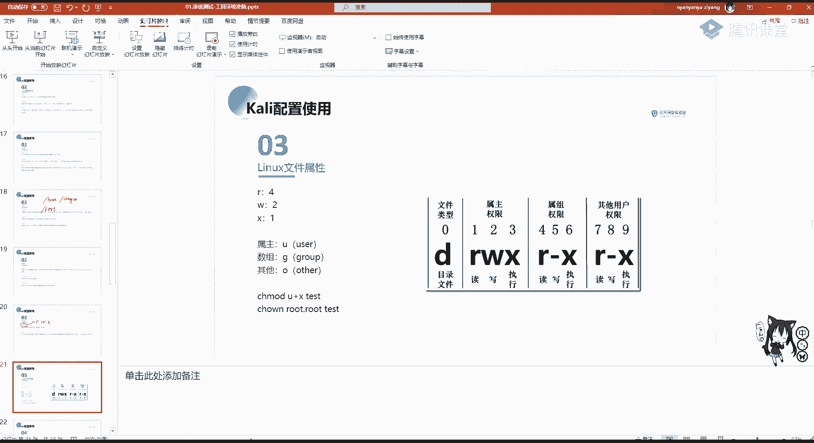

以下是权限管理的常用命令：
```bash
# 创建一个新文件
touch test.txt
# 查看文件详细信息（包含权限）
ls -l test.txt
# 修改文件权限为所有用户可读、可写、可执行（777）
chmod 777 test.txt
# 修改文件权限为仅所有者可读（400）
chmod 400 test.txt
# 修改文件的所有者和所属组
chown username:groupname test.txt
```

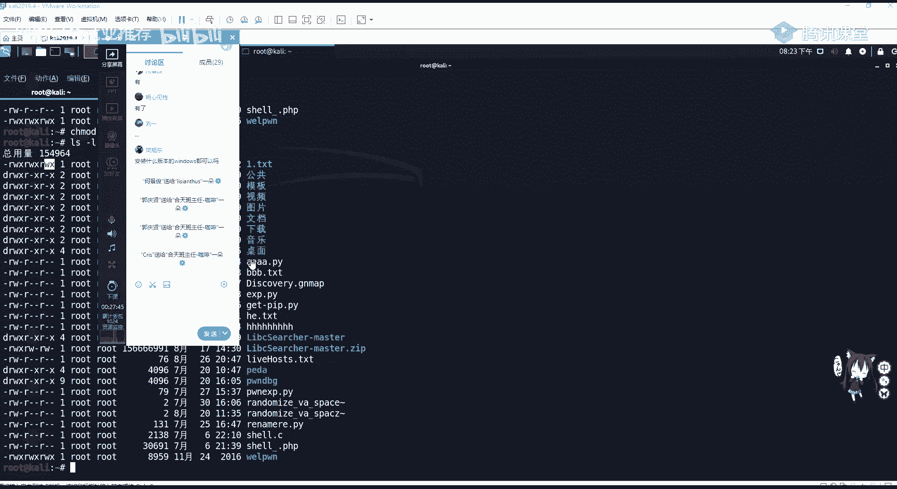

### 文件与目录操作

操作前需理解两个概念：
*   **绝对路径**：从根目录 `/` 开始的完整路径，如 `/usr/local/bin`。
*   **相对路径**：相对于当前目录的路径，`.` 代表当前目录，`..` 代表上级目录。

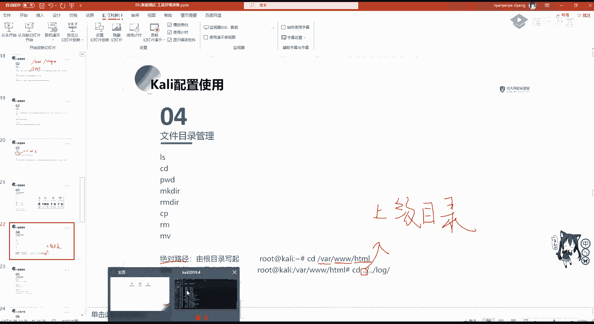

以下是基本的文件和目录管理命令：
```bash
# 查看当前目录下的文件和目录
ls
# 切换目录到根目录
cd /
# 显示当前所在目录的路径
pwd
# 创建新目录
mkdir new_folder
# 删除空目录
rmdir new_folder
# 复制文件
cp file1.txt /home/
# 移动（或重命名）文件
mv file1.txt /home/renamed_file.txt
# 删除文件
rm file1.txt
```
**提示**：Linux操作重在实践，建议在Kali中多练习这些命令。如需系统学习，可参考课程资料中的“菜鸟教程Linux”或“合天网安实验室”相关课程。

### 网络配置

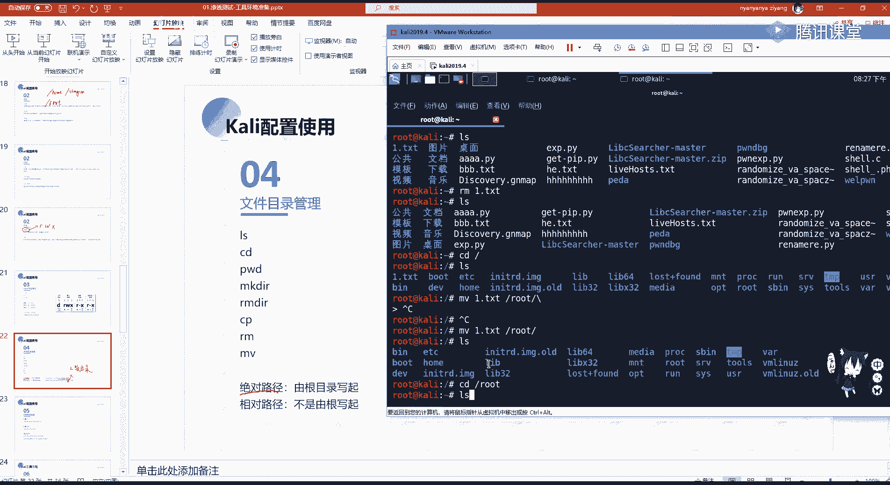

Kali的网络配置通常位于 `/etc/network/interfaces` 文件。可以使用 `vi` 或 `nano` 编辑器进行修改，配置IP地址、子网掩码、网关等信息。配置后需重启网络服务。

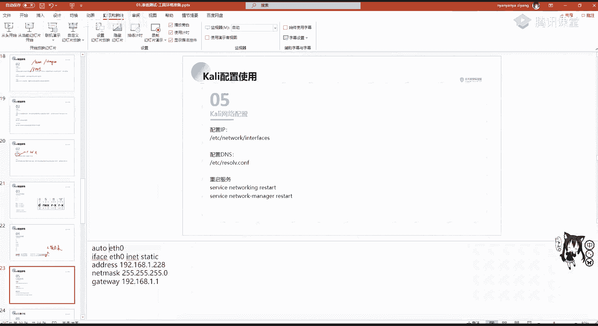

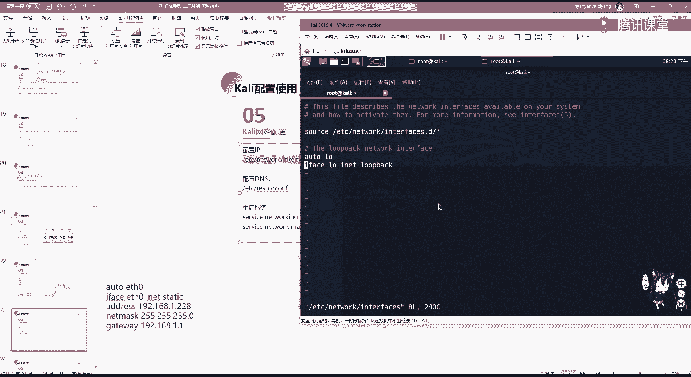

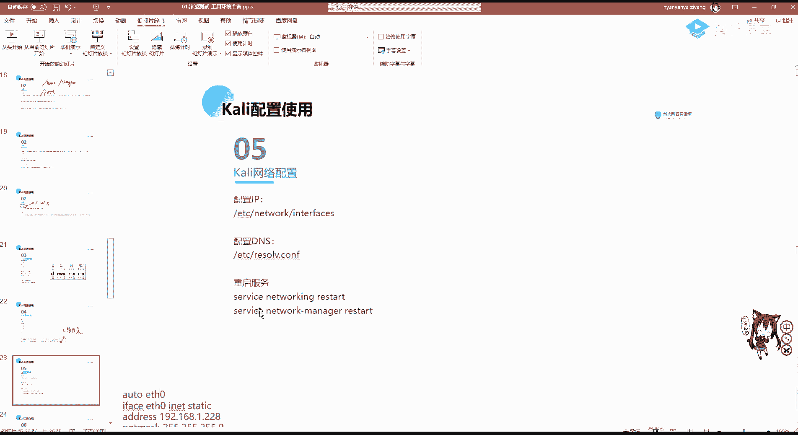

在VMware中，虚拟机网络连接有三种主要模式：
1.  **桥接模式**：虚拟机直接连接到物理网络，获取与宿主机同网段的独立IP，可访问外网。
2.  **NAT模式（推荐）**：虚拟机通过宿主机的IP共享上网，宿主机充当路由器。这是最常用的模式。
3.  **仅主机模式**：虚拟机与宿主机组成私有网络，不与外界通信。

使用以下命令检查网络：
```bash
# 查看IP地址等网络配置信息
ifconfig 或 ip addr
# 测试网络连通性（ping百度）
ping www.baidu.com
```

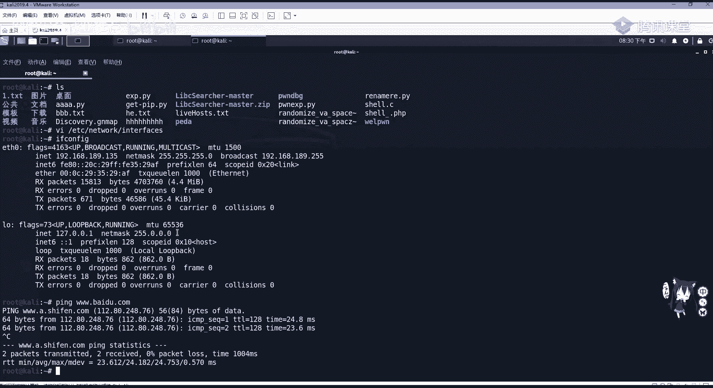

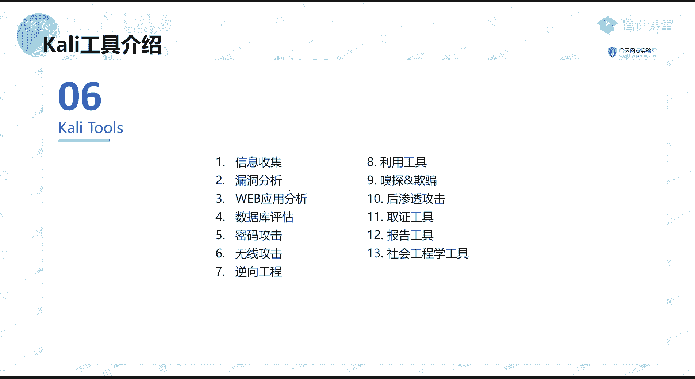

### Kali内置工具

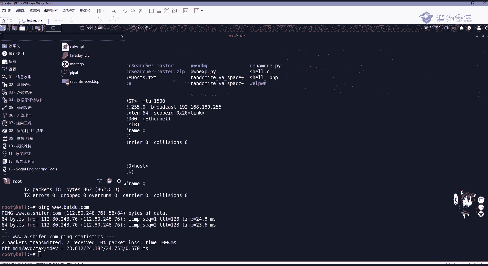

Kali的工具菜单按功能分类，如“信息收集”、“漏洞分析”、“Web程序”、“密码攻击”等。你可以通过左上角的应用程序菜单浏览。每个工具通常有对应的手册页（`man 工具名`）或在线文档说明其用法。

---

## Java与Python环境安装 ⚙️

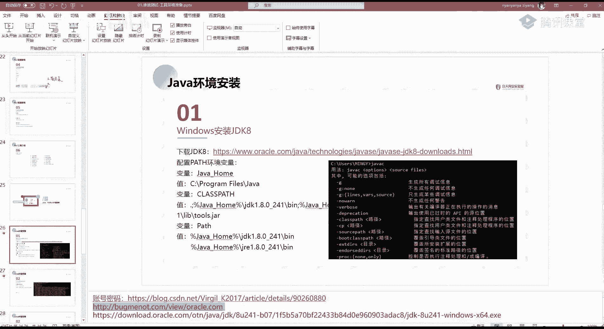

上一节我们熟悉了Kali Linux系统，本节中我们来看看渗透测试中另外两个关键环境：Java和Python的安装。

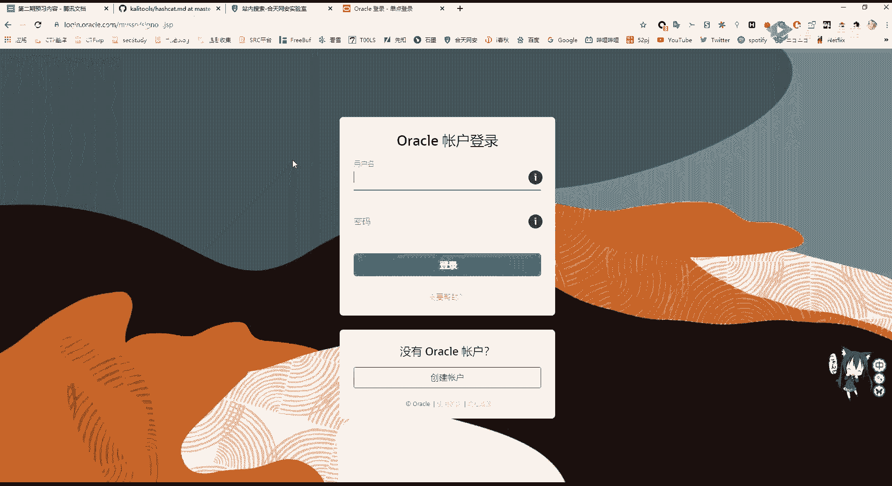


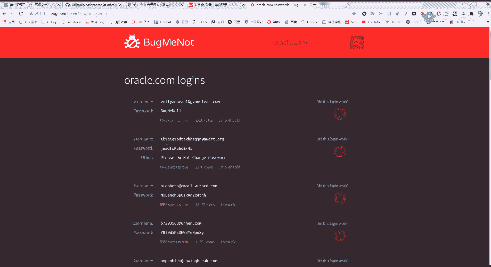

**为什么需要它们？**
*   **Java (JDK)**：许多渗透测试工具（如Burp Suite）是基于Java开发的，需要JDK环境才能运行。
*   **Python**：渗透测试中大量的漏洞利用脚本、自动化工具和安全工具都是用Python编写的，因其语法简洁、库丰富，是编写测试脚本的首选语言。

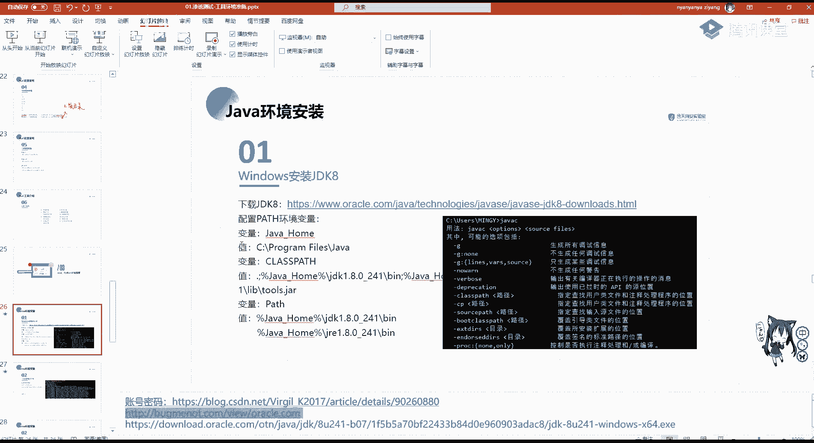

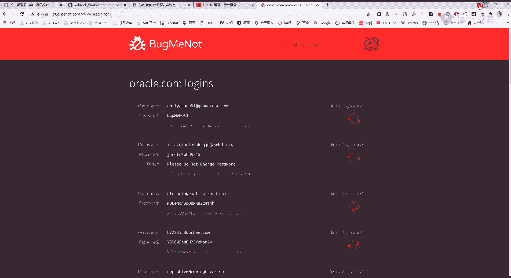

### Windows系统安装JDK

1.  **下载**：从Oracle官网下载JDK 8（版本稳定且够用）的Windows x64安装包。下载可能需要Oracle账户，可使用课程资料中提供的共享账户。
2.  **安装**：运行安装程序，建议使用默认安装路径（如 `C:\Program Files\Java\jdk1.8.0_XXX`）。
3.  **配置环境变量**：
    *   右键“此电脑” -> “属性” -> “高级系统设置” -> “环境变量”。
    *   在“系统变量”中，新建变量 `JAVA_HOME`，值为JDK的安装路径（如 `C:\Program Files\Java\jdk1.8.0_XXX`）。
    *   编辑“系统变量”中的 `Path`，新增两项：`%JAVA_HOME%\bin` 和 `%JAVA_HOME%\jre\bin`。
4.  **验证**：打开命令提示符（CMD），输入 `java -version` 和 `javac`，若显示版本信息而非错误，则安装成功。

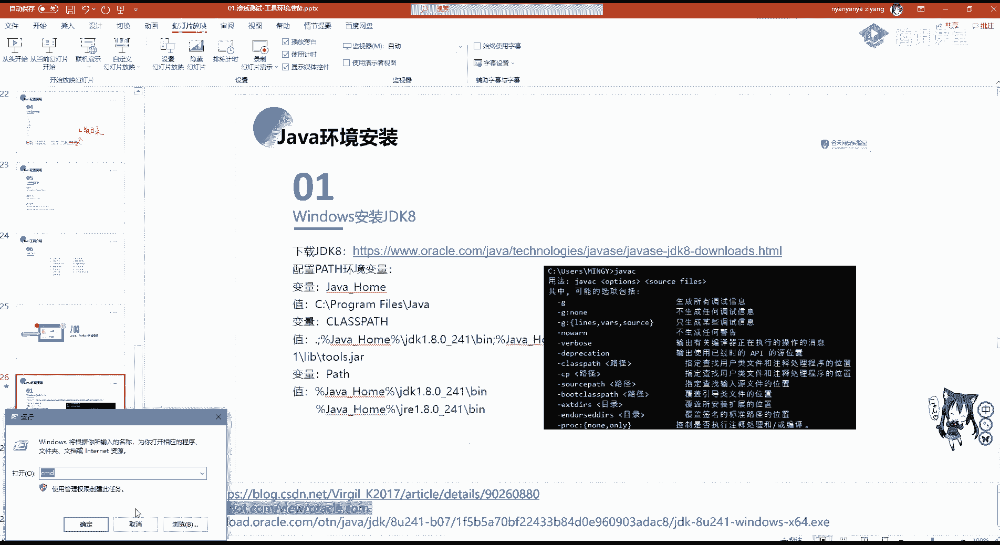

### Linux系统安装JDK（以CentOS为例）

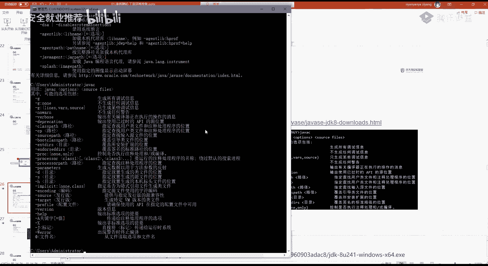

在Kali中，JDK通常已预装。如果在其他Linux系统（如CentOS）中安装，推荐使用包管理器：
```bash
# 使用yum包管理器安装JDK 8
yum install java-1.8.0-openjdk-devel -y
```
`-y` 参数表示自动确认安装过程中的所有提示。

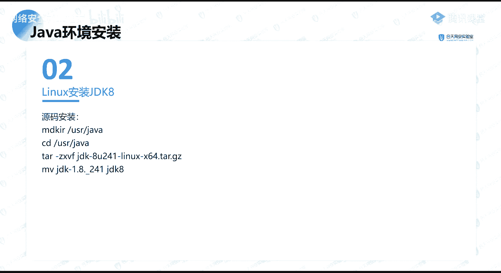

### Windows系统安装Python 3

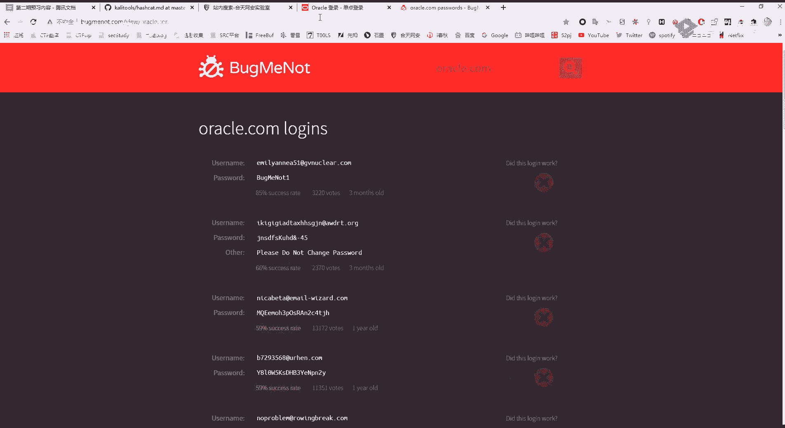

1.  **下载**：从Python官网下载Python 3.7或3.8的Windows安装程序（建议选择3.x版本，Python 2已停止维护）。
2.  **安装**：运行安装程序。**关键步骤**：务必勾选 “Add Python 3.x to PATH”，这样安装程序会自动配置环境变量。可以选择自定义安装路径。
3.  **验证**：打开命令提示符（CMD），输入 `python --version`，显示版本号即成功。

### Linux系统安装Python 3

Kali通常已预装Python。如需在其他系统安装或升级，可使用包管理器：
```bash
# 对于Debian/Ubuntu/Kali（使用apt）
apt update
apt install python3 python3-pip -y
# 对于CentOS/RedHat（使用yum）
yum install python3 python3-pip -y
```
`pip` 是Python的包管理工具，用于安装第三方库，非常重要。

---

## 渗透测试基本流程与工具简介 🎯

上一节我们配置好了编程环境，本节中我们来看看渗透测试的整体工作流程以及会用到的一些核心工具。

一个标准的渗透测试流程通常包含以下阶段：
1.  **明确目标**：获得客户授权，确定测试范围与规则。
2.  **信息收集**：收集目标资产信息（域名、IP、端口、服务、人员信息等）。这是后续所有步骤的基础，也是面试常考点。
3.  **漏洞探测**：利用工具或手动方式，分析收集到的信息，发现可能存在的安全漏洞。
4.  **漏洞利用**：编写或使用现有漏洞利用代码（Exploit），尝试攻击漏洞，获取系统权限或敏感数据。
5.  **内网渗透**（如果涉及）：在取得立足点后，进一步探测和攻击内网其他主机。
6.  **信息整理与报告编写**：整理攻击过程、所利用的漏洞、获取的数据，形成专业的渗透测试报告交付客户。

在整个流程中，尤其是在信息收集、漏洞探测和利用阶段，我们会借助大量自动化工具来提高效率。课程资料中提供了工具包，包含以下类别（后续课程会详细讲解）：
*   **信息收集工具**：用于扫描端口、识别服务、收集子域名等。
*   **漏洞扫描器**：自动化扫描Web或系统漏洞。
*   **密码破解工具**：用于爆破登录口令、哈希等。
*   **Web攻击工具**：如 `sqlmap`（自动化SQL注入工具）、`Burp Suite`（抓包与Web漏洞测试平台）。
*   **漏洞利用框架**：如 `Metasploit`（渗透测试神器）。
*   **后渗透与权限维持工具**：如Webshell管理工具、代理工具等。

**重要提醒**：所有工具都应在自己搭建的虚拟机实验环境中学习和使用，严格遵守法律法规，切勿用于未授权的测试。

---

## 总结 📝

本节课中我们一起学习了渗透测试入门的第一步——环境准备。我们详细讲解了如何安装VMware虚拟机软件和Kali Linux渗透测试系统，学习了Linux的基础命令、文件权限和网络配置。同时，我们也完成了Java（JDK）和Python 3开发环境的安装，这是运行众多安全工具的基石。最后，我们概述了渗透测试的基本流程和常用工具分类，为后续的实战学习打下了坚实的基础。

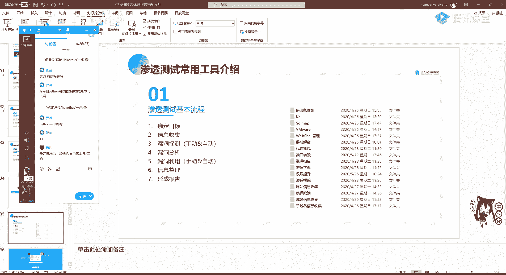

如果在环境安装过程中遇到任何问题，请及时在课程群内提问。下一节课，我们将深入探讨渗透测试的核心起点——信息收集。