# P41：第2天：域名信息收集.mp4 - 网络安全就业推荐 - BV1Zu411s79i

今天给大家讲解渗透测试信息收集的第一课，信息收集分为三天来讲，分别讲域名信息收集，ip端口进行收集和网站进行收集，那今天我们来看域名信息收集，首先为什么要进行线性收集呢。

信息收集是指通过各种方式获取所需要的信息，便于我们在后续的渗透过程中，有更好的一个进行一个渗透测试，我们要收集，比如目标站点的ip地址，中间件，中间件，也就是服务器，比如说阿帕奇。

还有tom cat等等，脚本语言，p h p j s p i s p等等，端口邮箱等，信息收集包括资产收集，但不限于资产收集，在渗透测试的过程中，为什么要进行信息收集呢，一信息收集是渗透测试成功的保障。

第二信息收集会给这个资产带来更大的暴露面，会增加我们渗透成功的可能性，大家应该都知道，知己知彼，百战百胜，我们当公司的甲方给我们一个目标之后，我们要对这个目标进行，进行一个充分的资产收集。

收集他的ip和域名信息，才能够进行很好的渗透，让大家去，比如说公司给你一个ip，不可能只对仅仅对这一个ip进行一个扫描，你去啊挖百度的s r c不可能直接对着3w点，百度点com这个主站进行疯狂的扫描。

是它是出现漏洞的几率是非常小的，这个时候我们就需要搜索它的子域名，或者是旁站c段等等，去探索有没有那些是就是不太重要的站点，或者是刚刚上新的测试站点，去找这个里面有没有漏洞，信息收集的分类呢。

主要是分为主动信息收集和被动信息收集，也就是字面意思，主动进行收集，就是通过直接访问网站啊，在这个服务器的网站上进行操作，对网站进行一个漏洞扫描和端口扫描等等，这是由网络流量。

经过目标服务器的信息收集方式，这种信息收集方式会在对方，也就是我们靶机的服务器日志上，会留下你的日志访问信息，如果对面有防火墙或者是硬件rt的话，可能会对你进行封锁，而被动进行收集，就是基于公开的渠道。

比如说搜索引擎或者是网络空间，搜索引擎等在不与目标系统直接交互的情况下，获取信息尽并且尽量避免留下痕迹，比如说我们需要对一个网站进行一个搜索，我们不一定非要访问这个目标机器，而是利用搜索引擎。

搜索引擎的爬虫已经帮我们爬好，并且放在互联网上了，我们只需要在搜索引擎中输入我们想要的内容，进行一个信息收集即可，也就是主动信息收集和被动信息收集的区别，那我们在信息收集中通常是要收集哪些信息呢。

这些不论是面试，刚入门想转行渗透测试的同学，包括自己已经从事渗透测试工程师，接不论是大小项目，渗透项目，互网项目的时候，都需要对这些信息进行收集，分别是服务器信息，也就是端口服务和ip地址。

第二网站信息，我们通常对目标进行渗透，首要是渗透它的web服务，也就是网站，我们需要了解这个网站的架构，包括网站服务器的操作系统，中间件，数据库，编程语言，包括其他指纹信息，wolf。

wolf意思是web应用防火墙敏感目录，敏感文件是否有源码泄露，包括c段和旁站的搜索和查询，第三点，我们需要查询这个网站的域名信息，通过who is查询或者是备案信息和子域名搜索。

最后我们还需要搜索这个目标，所具有的人员信息，比如这个甲方去给的渗透目标，这个服务器所具有的人员，管理员姓名，职务生日，联系电话或邮件地址等等，我们拥有这些人员的管理员信息。

就可以对其姓名职务生日进行啊打乱生成字典，进行一个密码爆破，大家都知道管理员，包括我自己在设置一些密码的时候，通常会使用自己的姓名或生日，再加上其他的一些字母构成我的密码，这个别人如果知道了自己的姓名。

生日就可以生成一个字典，进行一个有效的爆破爆破，那这里啊我们就来看一个域名信息收集，首先我们来看什么是域名，域名很显然大家已经非常清楚了，现在已经是网络时代，也就是用一串用点分隔的名字组成。

internet上一台计算机或计算机组的名称，也就是域名，就代表计算机别域名相对于ip是互相对应的，是通过dns又叫做域名解析系统，将域名和ip地址相互映射，映射成为一个分布式数据库。

能够使人更方便地访问互联网，当我们访问一个网站，比如和天籁，我们合天网安实验室的官网，如果让你去输入和天实验室服务器的ip值，这个是非常的啊，不容易记忆，也不容易访问。

那我们把它通过dns映射为我们的域名和tlab，这个大家就非常容易记忆，访问微博，3w微博点com，访问百度，百度点com，这些就是通俗易懂的域名，域名分为顶级域名，二级域名，三级域名等等。

点击域名也就是我们域名最后面的这一个啊，最后面点后面的字母为点com，顶级域名有很多种类，比如普通的国际顶级域名点com政府域名点goov，商业与教育域名点e d o，在我们政府政务网站一边。

一般是以点goov进行结尾的，我们在没有得到一个授权的情况下，是一定不能对gov进行渗透，或者是扫描及信息收集，有可能你对g u v进行一个啊一个一个输入框，你对他xs s了一下。

有可能后面就请你去喝茶了，教育域名edu，大家如果挖src就是一开始挖不到的话，可以去尝试挖一个叫e d u s r c，一般呃各个高校嗯，使用的一个域名都是点edu结尾的。

灰子灰子呢就是用来查询域名的ip，这个域名所属的这个管理者信息，也就是用来查询域名是否被注册，以及注册域名的详细信息数据库，比如说域名的所有人，包括域名的注册商，这就相当于我们去一个商店里面。

这个商店包括公司都会有一个工商注册信息，我们可以通过一些web接口，比如说天眼查去查找这个啊，公司这个商店是谁开设的，法法人是谁嗯，是在哪里，是在哪个板块上市的推子呢，也就是同样的道理。

它是用来查询我们域名是谁注册的，注册商是什么，那who意思呢，其实就是一个啊服务器，我们通过who is子查询可以获得域名注册者，邮箱地址等信息，一般情况下，中小型网站域名注册者就是网站管理员。

我们可以利用搜索引擎，对gui子查询到的信息进行搜索，获取更多域名注册者的个人信息，我们来看boss应该如何去查询，首先web接口查询，这是非常方便的，有阿里云的故意子查询接口。

还有站长之家的故意查询接口，我们这里站长之家来为例给大家看一下啊，这个都是一样的啊，哪一个都是一样的，它都是请求我们的who is服务器，啊在这里在这里啊，直接去找我们的，比如说隔天rap。

点com可以看到这个是和tlb的who is信息，可以看到它的创建时间，包括dns解析，dns服务器的一个情况，这里的注册商包括联系邮箱都是他的，就是一个代理商，也就是阿里云，因为我们现在注册域名。

包括自己搭设博客网站去注册域名，你总是去找注册商，比如腾讯云，还有阿里云万网进行一个注册，这里的话你进行你自己注册的域名查询，那这里的注册商和联系邮箱，就是阿里云这个注注册商的一个邮箱。

当然也可以使用一个who is命令行进行查询，who命令行在卡里里面就可以使用啊，他也是请求故意服务器，这直接进行估意思，故意百度，又来查询一个百度的信息，那我们继续来看，第二种方法查询备案信息。

查询备案信息，什么是网站备案，在中国大陆进行网站搭建域名解析，都需要对网站服务器进行备案，在备案之后会形成一个网络i icp域名备案号，一般在中国大陆的网站最下方的banner，都会显示这个备案号。

旧牙套，如果在国内你搭设网站不去备案的话，是没有办法进行正常域名解析的，所以我们可以使用备案号信息，去搜集这个网站的一个管理员信息，包括旁站，还有子域名信息，这里我们还是以公司的隔天lab。

还可以看到这个跟刚刚我们看到banner下面标注的，是一样的，同时这个呃注册这个单位，还会注册了其他的网站，比如说点o r g点啊，这个竞赛系统一些资产，这就可以暴露公司的一些资产。

那下面呢可以经过经过这个故意获取的，注册人和邮箱进行反查域名，这个是实际是不太实用的，因为刚刚已经说过很多公司的dns解析，包括域名的注册都是由运营商，也就是中间商代理商进行注册的。

查到的这个运营商和邮箱，注册人都是代理上的信息，这个已经不常用了，大家想使用的话也非常简单，只需要在我们刚刚查找的那灰子里面，去点一下那个邮箱即可，下面我们来看在渗透测试中，非常重要的一个环节叫此域名。

收集此域名即为二级域名，二级域名很显然是顶级域名的下一级域名，比如mail和天点com是bbs和天com和和天com的子域啊，这个就非常好理解了，那我们为什么要收集子域名呢，大家要知道我们在挖挖掘漏洞。

包括src和渗透测试的时候，信息收集是渗透测试成功的一个保障，你收集的子域名越多，你挖到src的可能性越大，如果你只收集了这几个常用的子域名，或者是只是主战，它有可能没有漏洞，或者是它的漏洞比较小。

或者是已经被其他的大佬给挖过提交，然后修复好了，所以一般我们是要进行一个子域名的广泛收集，那收集的方法有哪几种呢，首先是搜索引擎的收集，搜索引擎我们是利用谷歌语法，大家如果去尝试。

是有搜过和谷歌黑客语法应该会了解，我们来试一下，在google中，google中搜输入我们的site，就为指定我们的域名为和田lab，然后这里呢就会把这个和天lab上面，一些信息都会显示出来。

这里可以看到3w和田lab c u m t和田lab，g s l i和田lab等等，利用谷歌语法，我们可以搜索子玉，并且搜索其他的一些信息，大家可以去简单啊，去搜索一下谷歌搜索语法。

google google hk这个语法总结，可以去，啊这个打不开这个大家可以去寻找一些，比如说你想找啊这个sql注入漏洞也可以啊，直接in ui l啊，比如说p h p结尾的啊，i d等于一啊。

你要找到的有可能就是一个啊id等于一啊，比如说这里你打开他后面id等你，你可以测试一下他有没有收不住漏洞，他常用的一些语法，大家可以看intest in tural。

还有ufo in url site等等，大家可以在课后自己如果感兴趣的话，可以多看一下，这个可以帮助你找到一些小站的一些漏洞，去练练手，拿一些嗯国外的一个网站练练手，第二呢就是一个第三方网站查询。

也就是利用这个啊，一些站长之家也是能够查询一个子域名的，因为它里面收集了大量的dns第三方服务，可以用供我们来查询一个子域名信息，这里我们啊百度，被屏蔽的域名，这个我们还查询我们公司的这个。

还可以看到他找到的非常少，还没有谷歌google语法找到的多，这里有几个，那我们就是用这几种方法综合的一个去寻找，然后去重即可收集一个子域名信息，啊这个这个东西你自己在这自己不要说嘛。

自己去百度找一下嘛，然后我们再接下来继续，还有其他的方法，还有就是刚刚在搜索的时候讲到的，网络空间安全搜索引擎，网络空间搜索引擎方法，还有那个撒旦，还有一个钟馗之眼，这些都是跟我们普通搜索引擎不一样的。

它是一个服务器不停的对全网进行端口扫描，去暴露他的一些啊服务器信息，包括其他关键信息，当然这里我们也可以对子域名进行搜索，这里我们要说打开我们的方法，然后输入我们的这个域名。

等于这个百度啊，等于百度，可以看到搜索出很多百度的一个子域名，不仅仅是二级，包括三级域名都能找到，还有它的服务器的一些信息，但这里呢是一个收费的，这个是个收费的啊，不可能这么好的东西给你免费用是吧。

别人这个服务器也需要一个资金来维持的。

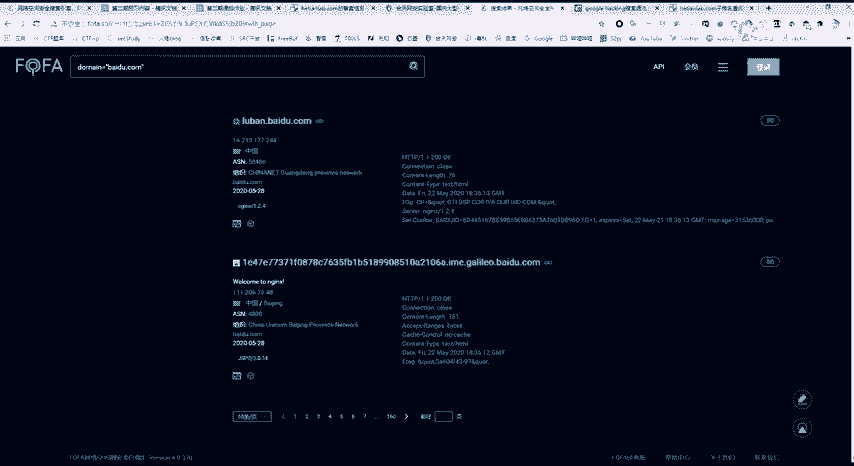

还有个方法叫做s s l证书查询，大家都知道，当这个网站开启443，也就是http s安全传输协议的时候，都会有一个运营商去颁发ssl证书，那么ssl证书在哪呢，在我们已经有这个htvs的。

可以点开这个证书可以看到啊，这是由哪一个公司给颁发颁发的，日期是到哪儿的，我们通过这个证书这个证书的，我们可以查看这个查看这个证书，包括这个证书的一些信息，可以找到子域搜索紫玉。

它通过这个web接口进行一个呃查找，他找到的，是要比我们之前说的那些都要多一些的，因为只要开启了我们的443，比如这里我们输入我们的百度，百度，百度点com，啊这里可以看到他找到了很多。

百度的一个子域名，另外一种一个发现就是通过js文件发现自语名，js，可以把它就是当做就是网页的前端，这个代码去发现自域名，是如何通过前几这个前端去发现代码呢，我们知道在我们查看网页源代码之后。

这里面就会出现很多的一些链接，比如说啊这上面一些链接，包括一个域名信息，我就拿百度来开刀，我们来看百度的一个源代码去搜索百度，点com，那我们来看有没有它的子域去暴露出来，所以肯定是有的。

大家可以看到这是mm点百度，m点百度，我们再往下m点，百度是不是有很多news，百度map，百度贴吧，百度都是有很多自域名的，但是我们不可能这样ctrl f进行一一的查找。

在这里我们还是要利用工具进行一个爬虫，并且筛选是使用我们的js bender，可以把它直接下载下来，直接它是一个github文件，把它打开，你想安装到我们这个卡利卡利里面的话，就是git，然后克隆。

大家做这个安全或者是开发的话，一定要对github 10分熟悉，github上面都是一个代码库，就是直接hit，然后克隆过来，在国内的话，你克隆可能是比较慢，你可以去自己去寻找代理，把它再挂挂挂过来。

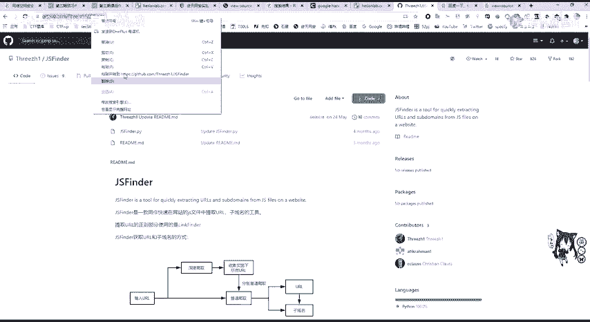

克隆过来啊，稍等一下，它克隆完成之后，我们进入这个里面啊，可以看到直接你的python jjs b。

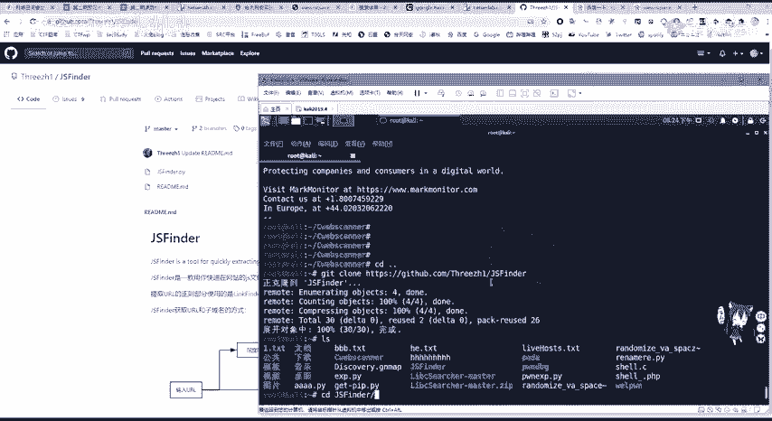

这是一个爬线二啊，帕先python 2没有这个模块，我们使用p r a p install进行安装，ok先安装好，这个就拿这个之前服务器上安装好的一个，这里我们使用这个python js fender。

唉这个是python 2就不行了啊，这个这个也不知道为什么这个这个又不行了，他是之前试是可以的，他就是用爬虫把这些网站都爬下来，唉pip都找不到，奇了怪，之前都是调好的，那这里的使用方法也非常简单。

就是啊python加上我们这个pr脚本杠，u指定你这个链接，比如说3w百度http，然后就可以进行一个爬取，爬取之后这些啊紫玉就会被暴露出来，对的这个帕金模块没有装啊，之前我是调好的啊，这有点翻车。

但是也没有没有事啊，这个就非常简单，非常好用，那我们一般进行信息收集的话，还有几种方法，分别是利用三个工具，这三个工具我就分别讲一下，第一种呢叫做爆破工具，叫子域名挖掘机。

这个在啊和天班主任跟你们的这个工具包里面，还是有的是有的，那它的一个原理，就是利用这里面的这两个tt文档，再点开这个贴t文档，看一下，利用它这里面的这个字典去拼接我们的域名，进行爆破，看回险。

它的一个作用就是爆破嘛，可以在这里设置线程来启动即可爆破，在这里我就不给大家演示了，因为它是非常的慢，他要把这个字典给跑完，啊断网挖掘机，是的，你的线程比较高的话，他这个而且这个线程比较高的话。

挖的有可能会错，就是有的域名他会跳过去，因为他没有收到一个http，一个呃response响应包还会丢掉，以为它没用这个子域名挖掘机啊，这个不常用也不好用啊，占用内存资源，那下面我们来看一个现在正在。

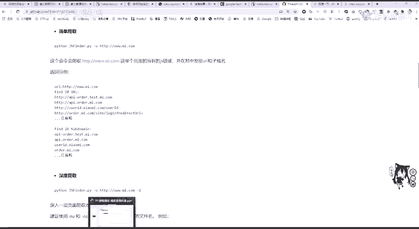

而且这个呃，来lawyer这个挖掘机都已经很长时间没有更新了。

那么来看现在就是一直在更新为good one for 2，wifi是一个非常强大的自律屏收集工具，但缺点呢，就是我们需要一一的去配置这个ip i接口，这个接口有可能是收费的，我们配的越多，他找到的越多。

你配的越少，那他基本上就跟你这个dns，还有s s l证书找到的就差不多了，这个要去配置，这也很简单，直接去下载或者是gcl，可能这就性克隆哪个地方呢，这个code里面这个地址看到没。

这地址我们安装的时候只需要这个g啊，这个我发现c l o n e加上我们这个地址，它就会下载到我们本地，或者是你说你这个get不会挂代理，或者是没有代理的话，你可以在浏览器里面。

先把这个z r p压缩包下下载好，然后又u n on v i p进行解压缩，再放到我们的卡里，或者是linux操作系统，或者是我们本地来进行一个运行，都是没有问题的，它的缺点，来看这个官方号。

它是非常好用的，它的用法也非常简单。

就是使用我们的python，这里挖个二是python 3。8或3。7，加上我们的one four，二点pui杠杠target指定我们的目标，这里有着隔天lab。com指定目标之后，设置run进行跑啊。

这里因为我是没有设置任何ipi的，他跑出来的应该不是很多啊，先让它简单跑一下，看看能不能跑好，啊这个跑的太慢了，跑的太慢了，就就不跑了啊，要知道他跑完之后啊，不是跑完之后。

会在这个result这个目录啊，results这个目录结果里面会有一个对应的t i t，以时间这个为命名的t i t文档，这里面就包括了我们的子玉，它的复杂之处在于你需要去设置ipi。

这是i t r在我们one po的config目录里面啊，点击confic d的config里面，可以看到有个i p i。pi和setting设置pi，先看这个setting，cc的py需要配置。

我们这个线程数，可以看到有一个可以开启它的阀门检查，包括一个代理，延延时的一个超时设定，还有搜索的递归层数，这里默认是二，这个递归层数大家应该知道吧，就是二级三级的，还有递归搜索，紫紫玉可以设置dns。

后面呢可以设置一个端口，因为并不是所有的web服务，都是开放在八零和443上面的，我们可以进行自定义端口，这里默认的是对八零进行了扫描，我们可以在这里添加443，就是h t t p s。

那这里呢可以对其他端口进行扫描，但是这里是不建议使用的，因为你去扫描这些端口，这里也会有提醒，看加上使用大端口范围，会导致生成请求上10万百万千万，导致内存不足，程序崩溃，另外这个时间也是非常漫漫长的。

那就如刚刚这个同学所说，这官方号就不是wfall的，变成了断网挖掘机，他有可能挖不到什么啊，这个默认基本上用默认配置就没有问题，我们对wifi的设置啊，主要在这个ip i里面。

ipi可以看到你需要去设置，比如说站长之家的一个i p i，这里可以免费注册获取，这里挖矿特别贴心。

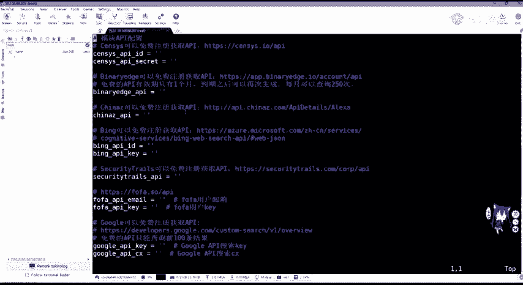

他把这些用中文注释，还有链接都给放出来了，但你只需要去啊，现在已经这个啊去注册，分别注册，然后进行填充，这里还有必应的方法复发。

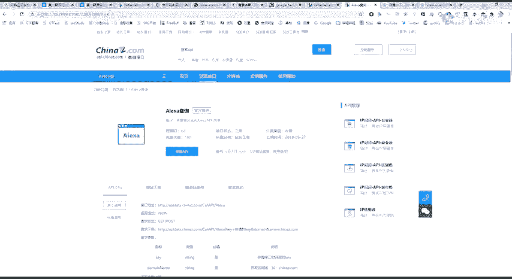

这里是收费的，还有google的ipai，包括肖战的ip i等等，这里需要大家自己去一一设置，dns db的一个i p i，包括github的一个token，这里大家都可以自己去访问这些链接。

然后去设置去设置就ok，在这create new cooking进行设置即可，这里大家如果有不会的话，后面可以问啊，可以问，这里就不给大家做演示了，因为这个ip r是非常复杂，有些收费。

但他只需要把免费的啊，就是给搞上就行了，这些子域名工具啊是非常的多，你去bhub或者是网上一搜，会搜出一大堆，它有的呢是非常的好，有的搜索出的子域名也就非常一般了，数量也不是太多，速度也非常一般。

那我们就需要不停的使用，然后进行综合去去除重复的内容，进行找到我们最多最快最实用的子域名，那这三个工具其实都是非常不错的，还有一个是sdman这个紫玉的一个爆破脚本。

这个也是到我们的这个github上面，进行一个克隆下载即可，他这里是增加了python 3的一个支持，这里是更简单了，直接加上我们的域名即可，那我们来看还能爆破出什么东西。

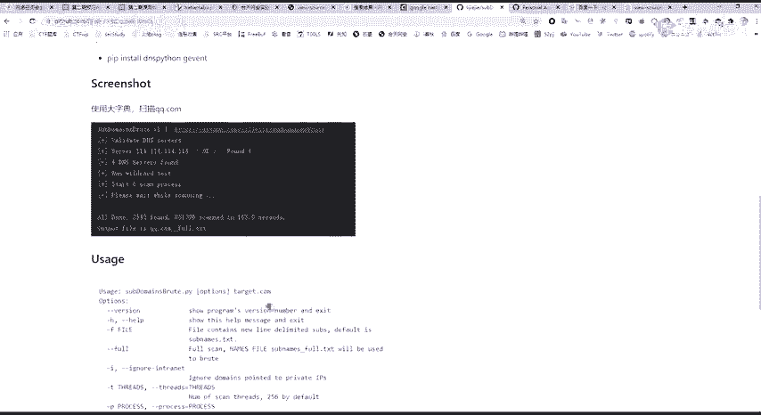

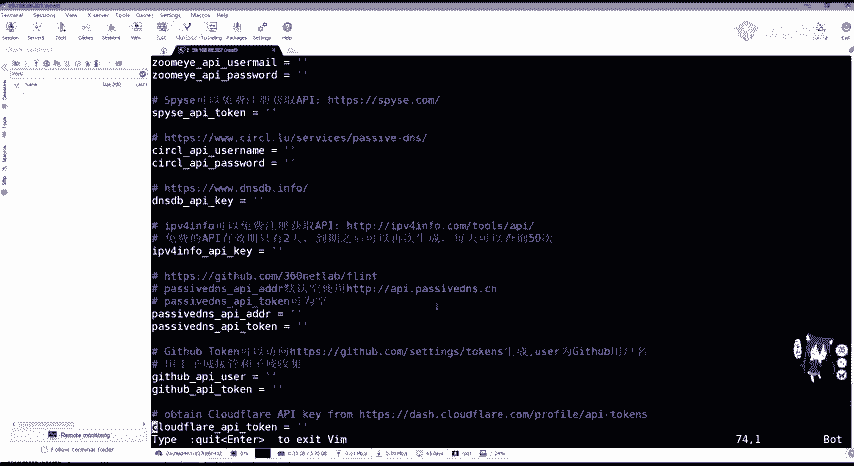

在这里我们啊这个我已经之前也试过了，那我们python，啊python加上我们的域名和天lab，com，来进行一个dns扫描，也就是相当于用dns db进行一个寻找，是原理是相同的。

那这里呢它是有几个啊选项的，包括fs can，也就是全部scan，这里呢会利用我们这个sub name full txt，进行一个爆破，如果你不加这个杠杠负的话，它默认就是使用这个dns进行一个查找。

爆破其实也是搜索子域名的一个，非常好用的一个方法，但是不同的工具有可能这个爆破的这个效率，有可能就比如说这老爷他爆破的非常慢，而且会造成极其卡顿。

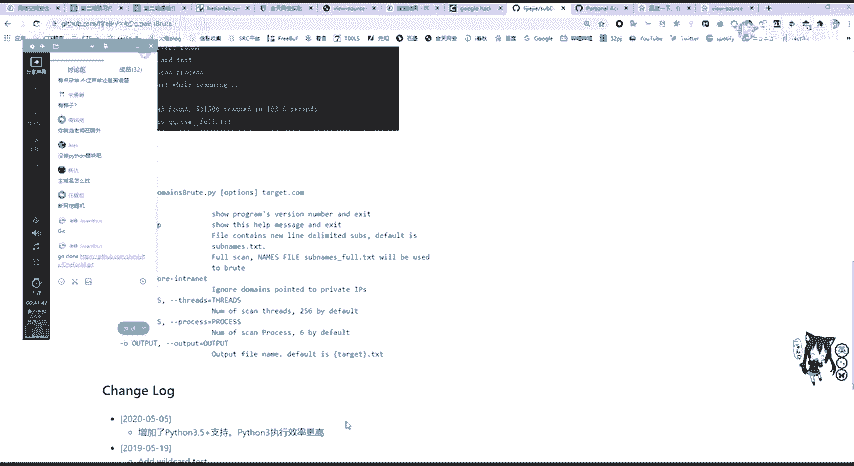

来看他现在才找到12个，没有wifi好用的，大家把wifi的ip i也配置好了，那其实one fo是好用的，但是它的ip i收费，而且还有一个次数限制，就是站长之家一天只需100次，这个就是不是太好了。

所以要进行一个结合，这里他只找到了13个，只找到13个，还没有这个google语法找的多好，我们cat一下，你看他知道的这13个啊，这edu和天lab包括3w和天lab，那么搜索的子玉啊。

大家掌握这三个方法就行，大家如果有更好的方法。

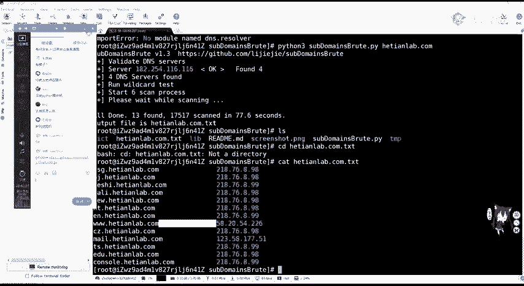

可以就是自己啊藏起来，你可以有更好的自域名搜索方法，自己去发s r c，那能找到更快，比如说你一秒能找到很多域名，这些也有这种工具的，那今天的这个课后任务呢，大家就是使用任意两种工具吧。

因为前面我还是讲是这是日渗透阶段，我们的作业啊可能比较简单，大家一定要练习一下这个工具的使用，因为在后期你去做真正的渗透测试过程中，是肯定都要对资产进行一个收集的，使用任意两种工具来进行搜索，收集。

和天lab啊，和天lab。com，还有百度，呃子域名，i pi。pi啊，可以的，那这里我就给大家就是看一下吧，看一下这个i p i p i怎么配置，啊这里是大同小异。

因为它很多就是不停的这个东西，你这个官方号不不配置i pi，它基本上是嗯拿不出什么东西的，让我们来看看这个在康菲克这个目录里面，咖菲克这个目录里面，ios，这ipi还有我们vm，进行一个配置。

那这个github我们来看呀，来看他们进行配置，就比如说嗯就用第一个，这里告诉我可以免费注册获取，那我们就去这里吧，这里来打开这个链接。

这个是比较费费劲的啊，比较费事，可以在这里点击注册，进行一个注册，好像已经注册过了，好像又没有注册，啊我是已经注册过了，那注册过之后，我们去访问这个访问这个链接啊，也就是他i pi链接。

我们来到这个首页，一般的i p i它会在哪呢。

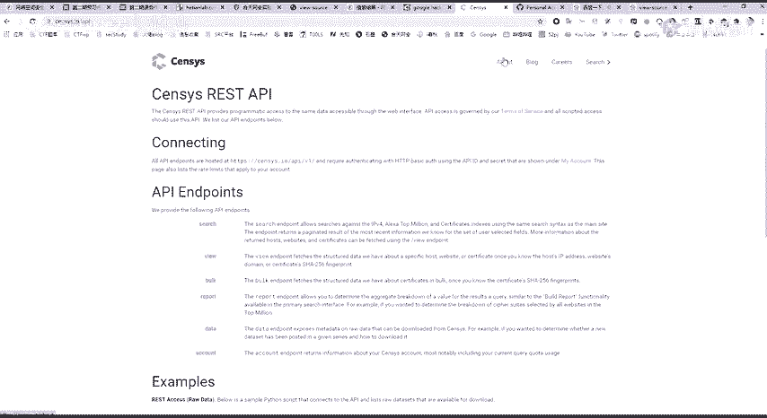

这怎么怎么给退掉了。

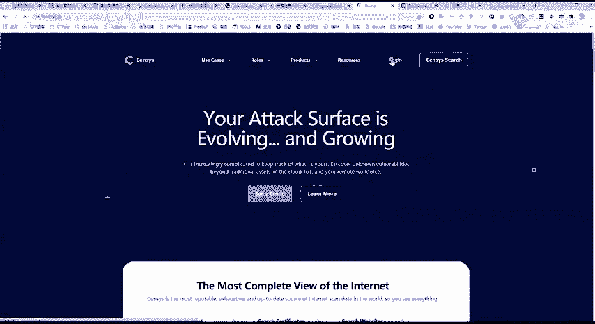

在这个我的用户里面，用户里面可以看到一个ipi，大家应该能看到ip i i pi，这里还有i p i i d，还有secret，让我们分别复制过来，点这个复制哎，看到这个i p i i d啊。

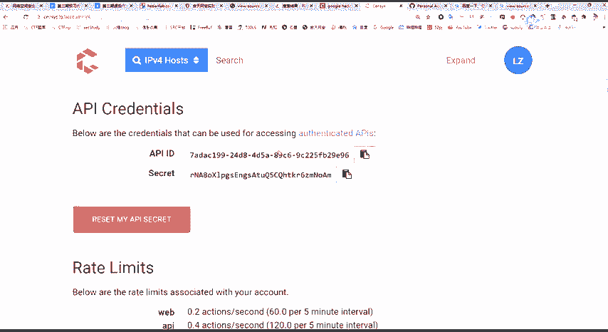

这个vi编辑器大家应该会是我吧，按i进入insert，也就是插入编辑模式，然后把它给粘贴过来。

这工具包就是和天的工具，可以找班主任进行啊。

进行去找班主任，要找班主任，要下载链接，或者一会我发到群里也行，把这个片的链接发到群里o，那我们这里第二个就是这个secret，把它复制过来，然后同样粘贴，那我们这里第一个i t i就配置完成了。

配置完成之后按e s c冒号wq进行保存，那我们这时候。

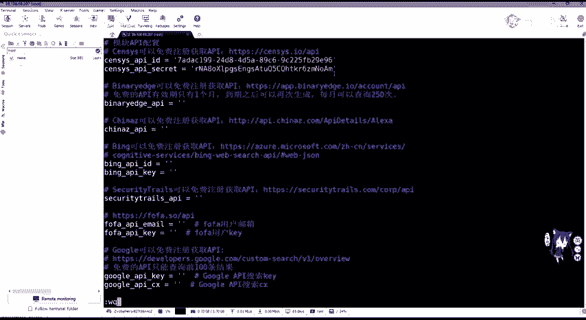

对的有在建子域名挖掘的，在线子鱼王挖掘，你是浪费别人的服务器资源吗，也有在线的爆破。

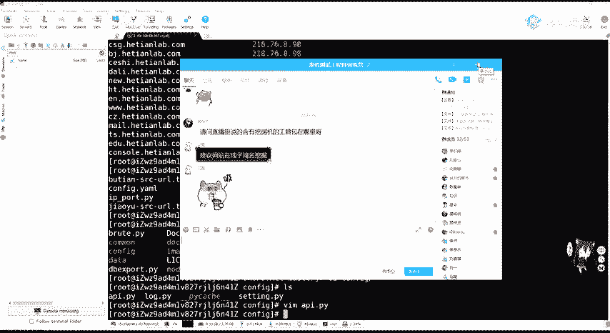

因为谷歌谷歌一搜就能搜到，你可以去搜嘛，这个在线的一个挖掘，而子子域名爆破就要爆破啊，你看第一个就有，那我们这里输入此域名，这里输入我们就不会卡了，启动让它进行爆破是吧，它慢慢的爆破呗，这也是一些方法。

你可以写一个爬虫啊，写一个用软request，然后把这些信息给抓下来就ok，也是一种爆破的一个方法，那么下面ipi再看一下还有哪些啊。

看一下有哪些啊，后面这些免费注册的我就不多说了啊，一样的事情则必应的，还有这个security cheers，这个是一样的，oppa的话是收费的，那我们来看这个啊，比如说github用接管子于收集。

那github很简单，你去访问这个token去生成一个ipi即可。

哎这边紫玉米还在爆破啊，还抱着玩吧，在这里github如果没有账号的话，还可以免费进行注册，生成一个新的token，然后输入我们的这个内容，然后可以在这里去点击我们的一个token。

甚至token的信息，生成一个demo，一偷看软件生成唉这个图片就来了，我们直接复制过来，粘贴到我们这个地方。

那上面已经告诉你，我们这个token是这个值，那我们的i p r user就是我们的这个，github的一个user名，github用户名，那大家都可以这样去设置。

那后面的这个dns sdb感觉是一样的。

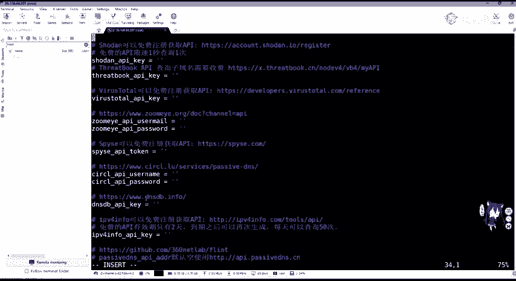

进行一个注册啊，登录即可啊，这个好像还注册不了了，啊最后进行保存。

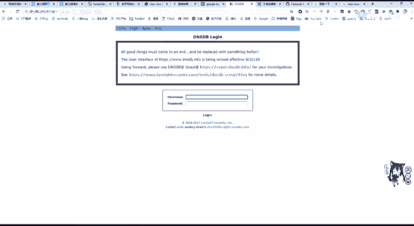

这ipi就基本ok。

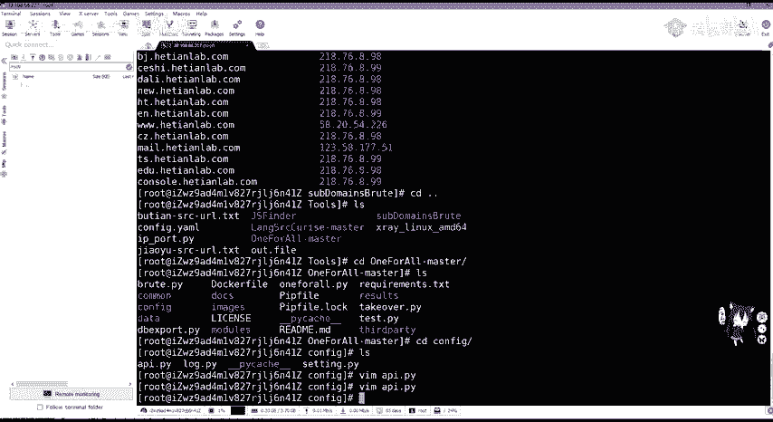

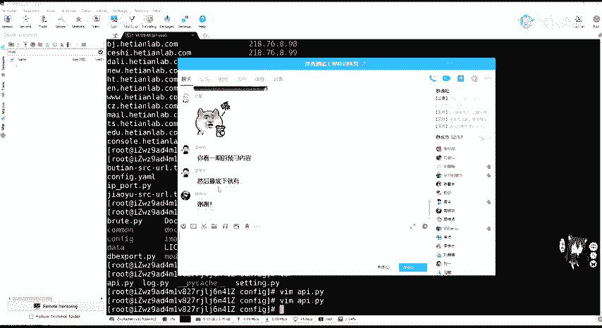

那这ipi也应该没有问题了吧，这个上面它是都有解释的，那今天的课程有没有哪里都是需要再详细讲解。

会有问题的，子域名收集是非常重要的，大家不要觉得它简单，就是确实是基础，但是也是最重要的，你收集的域名信息，是直接关乎你渗透测试的一个成功率，那大家如果没有什么问题的话，那今天的课程就先到这里了。

大家的课后作业就是使用任意两种工具，如果你爆破也好，one call也好啊等等，或者是你自己从网上搜索工具，自己写的python脚本也好，去搜索啊，收集这个和田lab和百度的一个子域名。

然后记得一定要在明天下午三点之前，提交到我们班主任的这个邮箱，这个课后作业我也会复制到这个文档里面，啊这里就是使用任意两种工具，收集和听lab和百度com的子域名，ok那这节课就到这里了。

大家在课后的时候，一定要把这些工具啊都给安装好，如果没有的话，可以再问和天班主任去啊，要这个下载链接，他如果就是没有回复的话，可以直接在群里要或者找我要就行，大家要记住啊，渗透测试。

包括大家在学习web安全和渗透测试的过程中，一定要常动手，要做副线听，可能觉得听懂了，但是自己复现有可能会遇到各种各样的问题，就像我刚刚进行一个域名爆破的时候，这个不在上午是已经调好了。

但是刚刚还是翻车了，大家在做的时候也有可能也会遇到同样的问题，帕森脚本无法运行，或是出现各种各样的错误，在解决中学习，在学习中去记住，然后再应用到工作中，就是这样，那这节课就先到这里了啊。

感谢大家的听讲，如果大家有什么问题的话，可以在群里问或者私聊，我们都行。

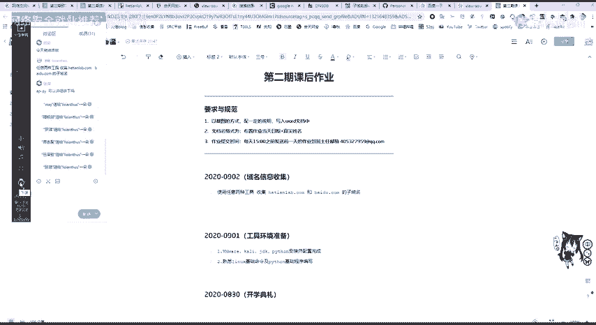