# 网络安全就业推荐 - 课程P41：第2天：域名信息收集 🎯

在本节课中，我们将要学习渗透测试信息收集的第一部分——域名信息收集。信息收集是渗透测试成功的关键保障，它帮助我们全面了解目标资产，从而找到潜在的突破口。本节课将详细介绍域名信息收集的核心概念、方法及常用工具。

## 为什么要进行信息收集？🤔

信息收集是指通过各种方式获取所需信息，便于在后续的渗透过程中更有效地进行测试。我们需要收集的信息包括目标站点的IP地址、服务器中间件（如Apache、Tomcat）、脚本语言（如PHP、JSP、ASP）、开放端口、管理员邮箱等。信息收集不仅限于资产收集，它还能扩大目标的暴露面，增加渗透成功的可能性。

上一节我们介绍了信息收集的重要性，本节中我们来看看信息收集的具体分类。

## 信息收集的分类

信息收集主要分为主动信息收集和被动信息收集。

主动信息收集是指通过直接与目标系统交互来获取信息，例如对网站进行漏洞扫描、端口扫描等。这种方式会产生网络流量，并可能在目标服务器的日志中留下访问记录。如果目标部署了防火墙或入侵检测系统，可能会触发警报甚至封锁。

被动信息收集则是基于公开渠道，在不与目标系统直接交互的情况下获取信息，例如利用搜索引擎或网络空间搜索引擎。这种方式旨在尽量避免留下痕迹。例如，我们可以利用搜索引擎已爬取并存放在互联网上的信息进行查询，而无需直接访问目标服务器。

## 信息收集的具体内容

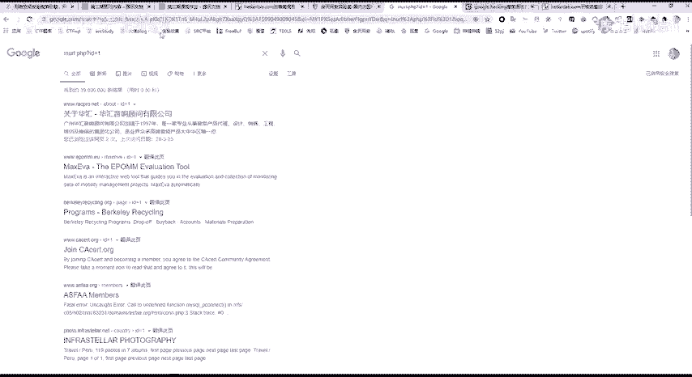

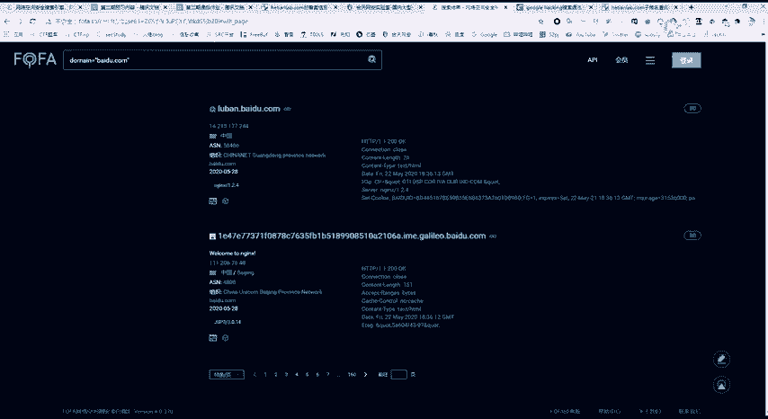

无论是面试、刚入门想转行渗透测试的同学，还是已经从事渗透测试的工程师，在进行项目时都需要收集以下几类信息：

以下是需要收集的核心信息列表：
1.  **服务器信息**：包括IP地址、开放的端口及运行的服务。
2.  **网站信息**：这是渗透测试的首要目标。需要了解网站的架构，包括：
    *   服务器操作系统
    *   中间件（如Nginx, Apache）
    *   数据库（如MySQL, PostgreSQL）
    *   编程语言（如PHP, Python）
    *   Web应用防火墙（WAF）指纹
    *   敏感目录与文件
    *   是否存在源码泄露
    *   C段和旁站信息
3.  **域名信息**：通过WHOIS查询、备案信息查询和子域名搜索来获取。
4.  **人员信息**：目标系统相关人员的姓名、职务、生日、联系电话或邮件地址等。这些信息可用于生成密码字典进行爆破，因为管理员常使用此类信息设置密码。

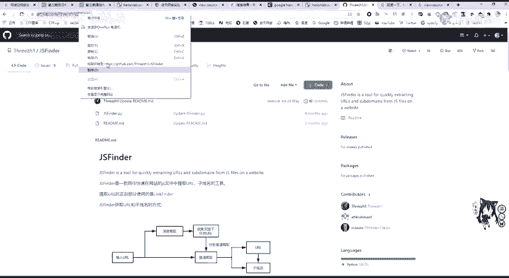

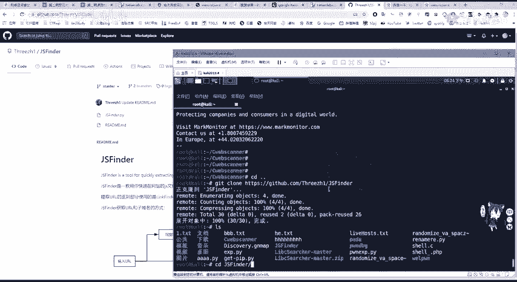

上一节我们明确了需要收集哪些信息，本节中我们重点来看域名信息收集的核心概念。

## 域名与WHOIS查询 🌐

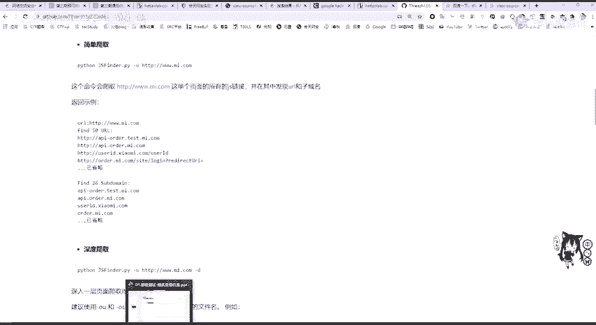

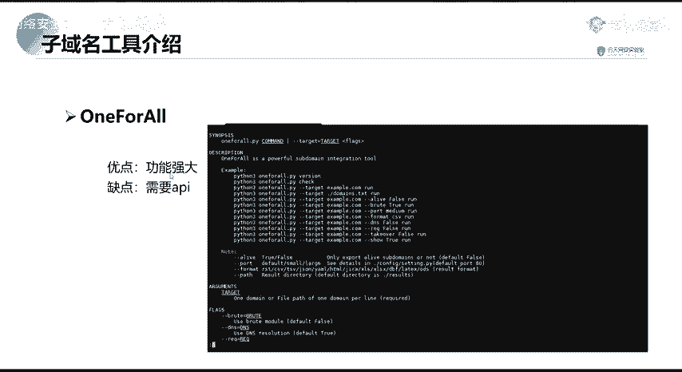

域名是Internet上用于标识计算机或计算机组的一串用点分隔的名字。它通过DNS（域名解析系统）与IP地址相互映射，使人能更方便地访问互联网。例如，`www.baidu.com` 就是一个易于记忆的域名。

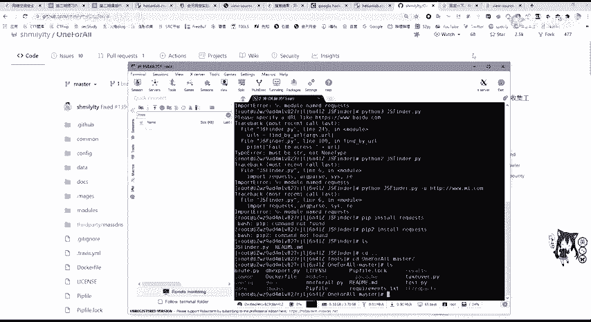

域名分为不同级别，如顶级域名（.com, .gov, .edu）、二级域名（如 `mail.example.com` 中的 `mail`）等。

WHOIS是用来查询域名是否被注册以及注册域名详细信息的数据库。通过WHOIS查询，我们可以获得域名的注册人、注册商、注册日期、过期日期和联系方式等信息。通常情况下，中小型网站的域名注册者可能就是网站管理员。

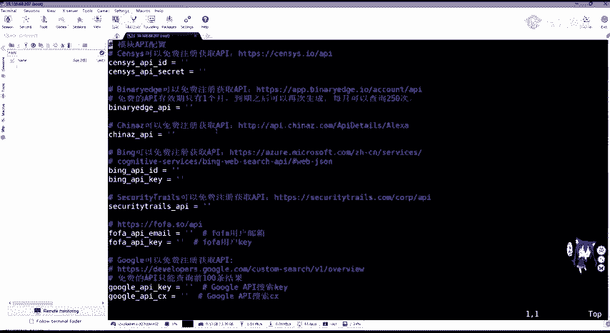

以下是进行WHOIS查询的两种主要方法：
*   **Web接口查询**：非常方便，例如可以使用阿里云或站长之家提供的WHOIS查询接口。只需在查询框中输入目标域名即可。
*   **命令行查询**：在Kali Linux等系统中，可以直接使用 `whois` 命令进行查询，例如 `whois baidu.com`。

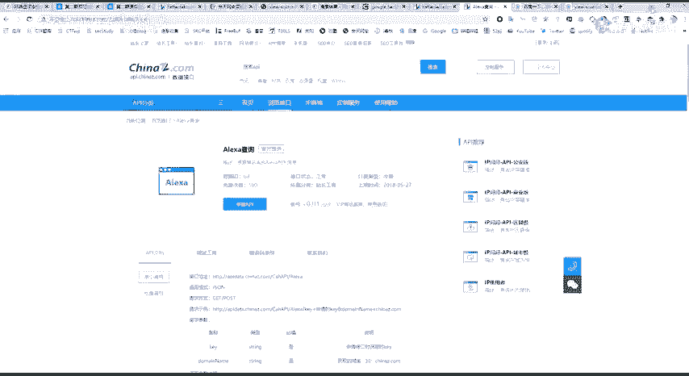

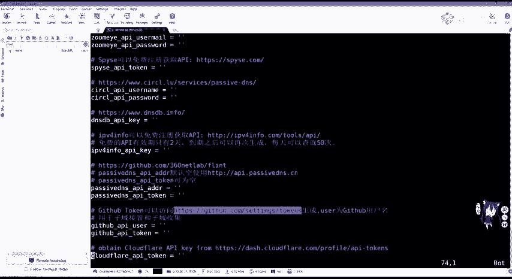

## 备案信息查询

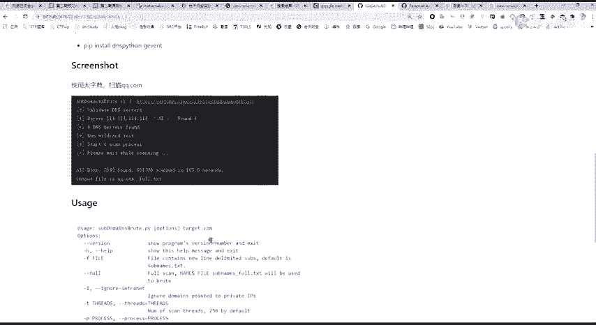

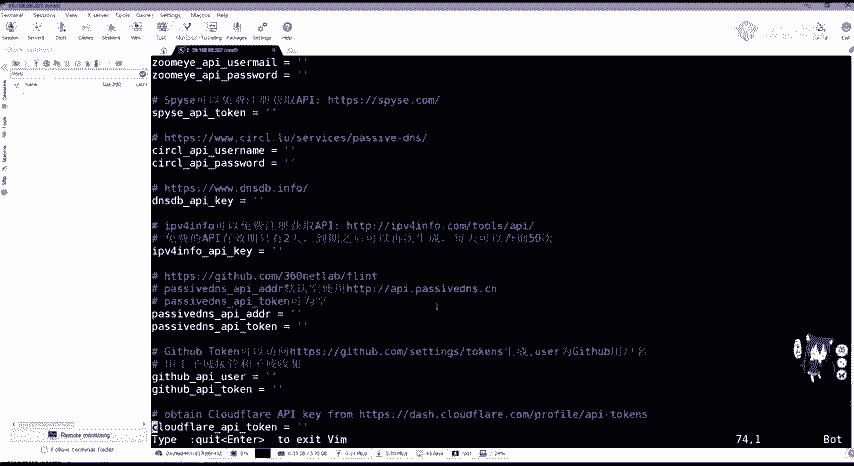

在中国大陆，搭建网站并进行域名解析需要进行备案，备案后会获得一个ICP备案号。通常，网站底部会显示此备案号。通过查询备案信息，我们可以搜集到网站的管理员信息、关联的旁站以及子域名信息。


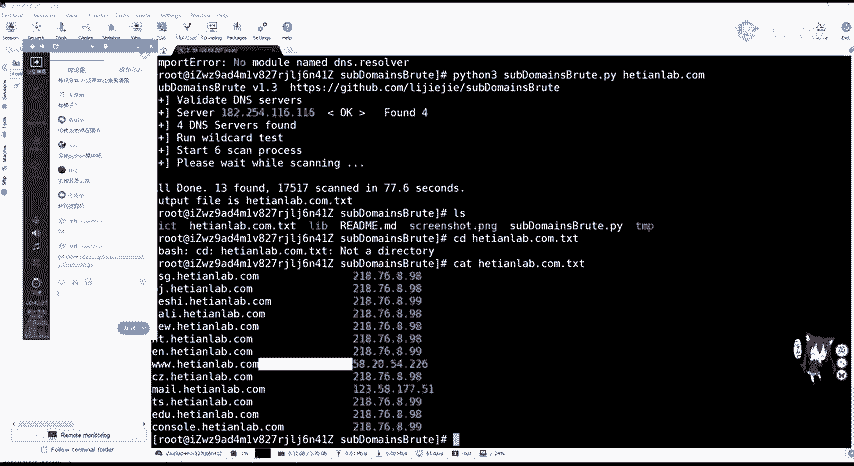

## 子域名收集 🎯

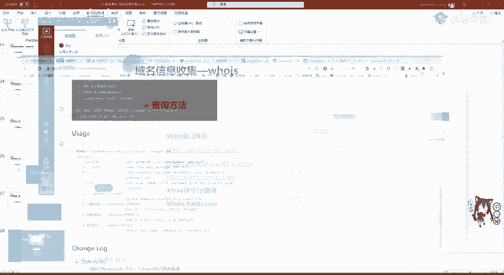

子域名收集是渗透测试中非常重要的环节。子域名是顶级域名的下一级，例如 `mail.hetianlab.com` 是 `hetianlab.com` 的子域。广泛收集子域名能极大增加发现漏洞的可能性，因为主站往往防护严密，而一些次要的或新上线的子站可能存在安全漏洞。

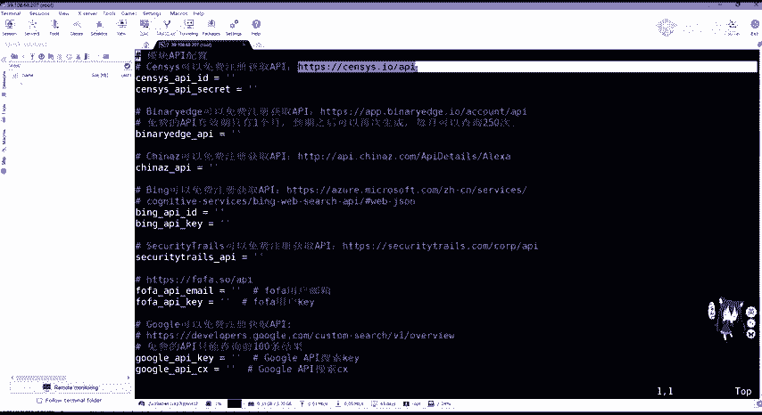

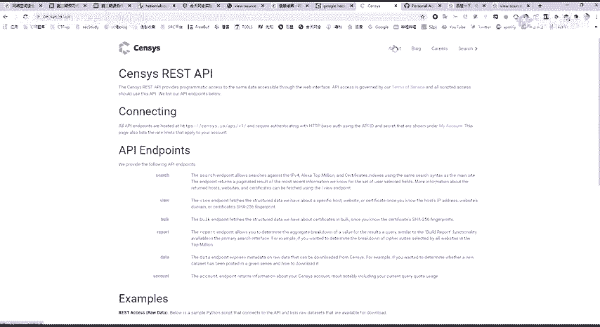

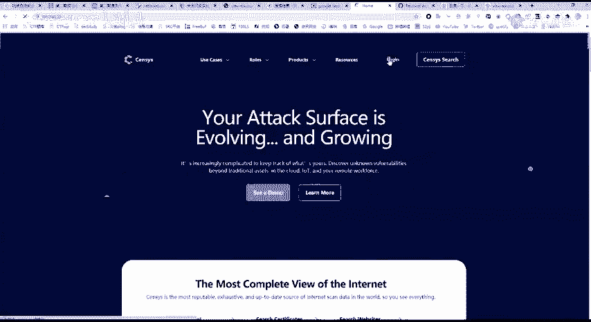


以下是几种常用的子域名收集方法：
1.  **搜索引擎语法**：利用Google等搜索引擎的特定语法进行搜索。例如，使用 `site:hetianlab.com` 可以搜索出与该域名相关的众多子域名和其他信息。其他有用的语法还包括 `inurl:`, `intitle:` 等。
2.  **第三方网站查询**：利用如站长之家等提供子域名查询服务的网站。这些网站聚合了大量的DNS记录，可供查询。
3.  **网络空间搜索引擎**：使用如Fofa、Shodan（撒旦）、ZoomEye（钟馗之眼）等专业搜索引擎。它们通过持续扫描全网来暴露服务器的端口、服务等信息，同样可用于搜索子域名。
4.  **SSL证书查询**：启用HTTPS（443端口）的网站需要SSL证书。通过查询证书颁发机构记录或利用相关接口（如 `https://crt.sh`），可以找到关联同一证书的多个子域名。
5.  **JS文件发现**：网页的JavaScript代码中常常会引用其他子域名的资源。通过工具（如JSFinder）对目标网站的JS文件进行爬取和分析，可以提取出隐藏的子域名。
    *   代码示例（JSFinder基本用法）：
        ```bash
        python3 JSFinder.py -u http://www.example.com
        ```
6.  **工具爆破**：使用专门的工具，通过内置或自定义的字典，对目标域名进行子域名爆破尝试。
    *   **子域名挖掘机**：图形化工具，利用字典进行爆破，但速度较慢，资源占用高。
    *   **OneForAll**：一个功能强大的子域名收集工具，其效果很大程度上依赖于配置的API数量和质量。需要配置如搜索引擎API、DNS查询API等。
        *   代码示例（OneForAll基本用法）：
            ```bash
            python3 oneforall.py --target example.com run
            ```
    *   **Sublist3r**：一个用于枚举子域的Python脚本，支持多种数据源。
        *   代码示例（Sublist3r基本用法）：
            ```bash
            python3 sublist3r.py -d example.com
            ```

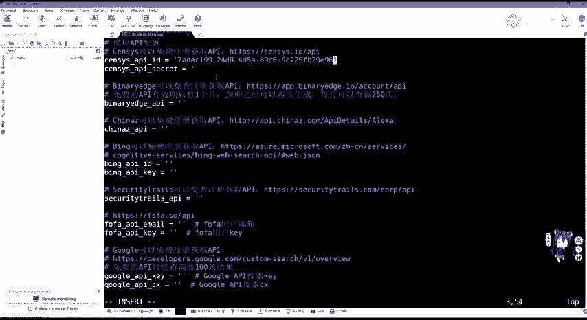

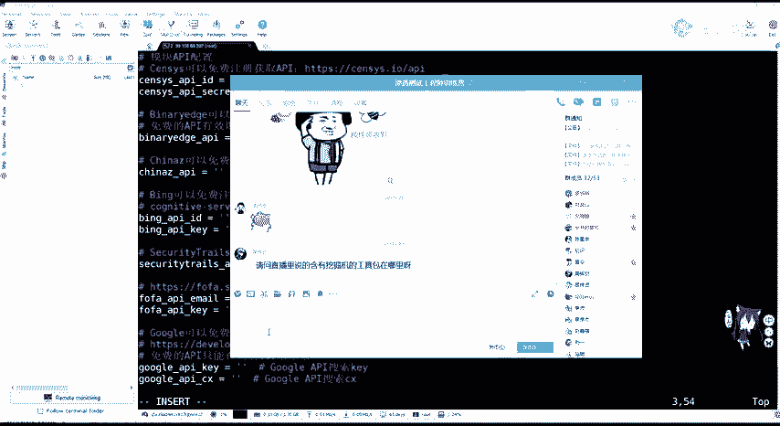


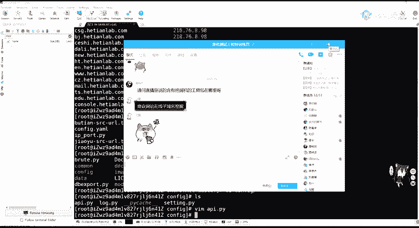

在实际渗透测试中，通常需要综合使用多种工具和方法，将结果去重汇总，以获得最全面、最准确的子域名列表。

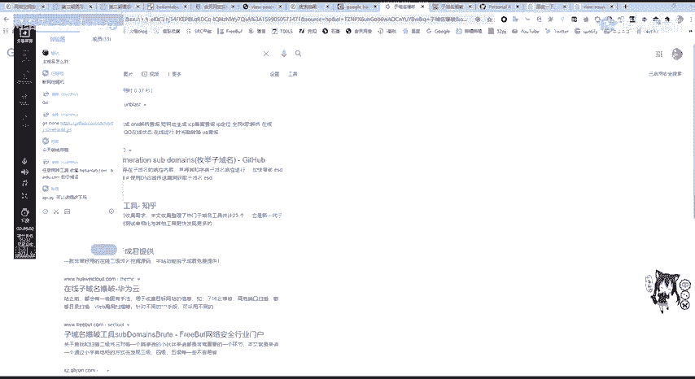

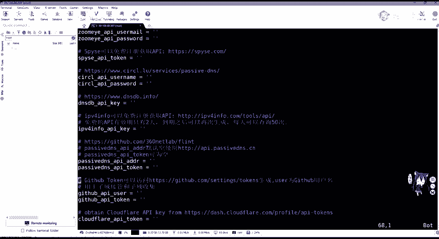

## 总结与课后任务 📚

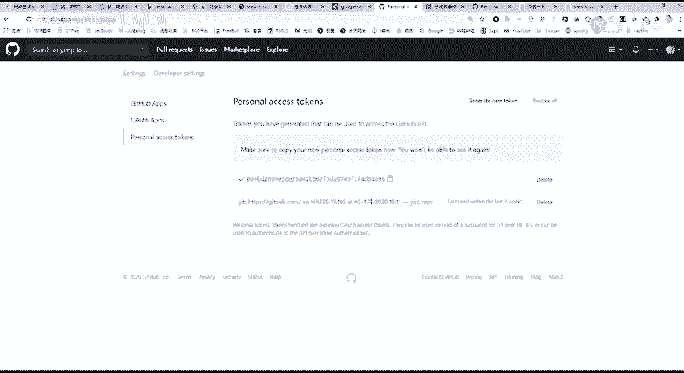

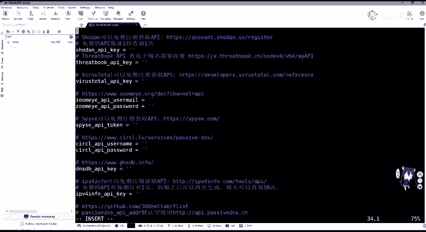

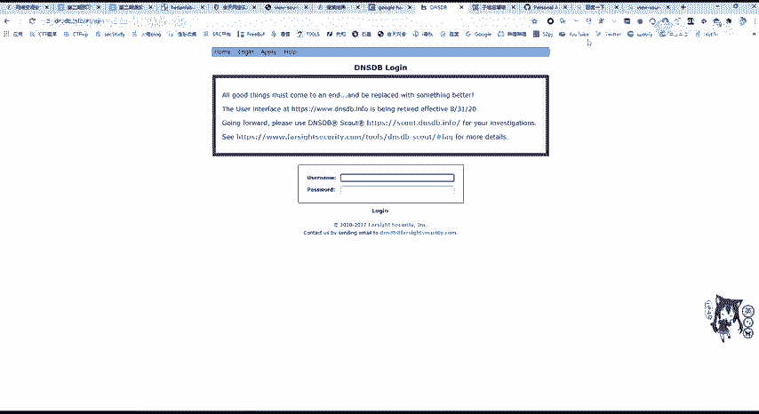

本节课中我们一起学习了域名信息收集的核心知识与实践方法。我们了解了信息收集的重要性与分类，掌握了通过WHOIS和备案信息查询获取域名基本信息，并重点学习了多种子域名收集的技术，包括搜索引擎语法、第三方查询、网络空间搜索引擎、SSL证书查询、JS文件分析以及工具爆破。

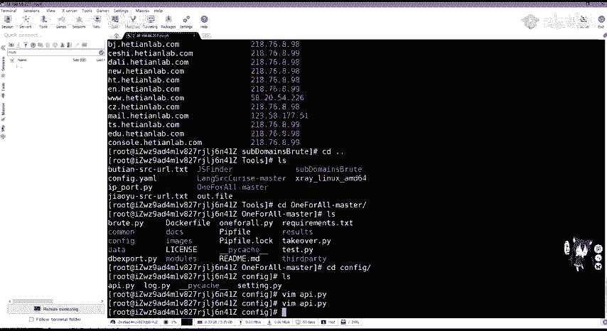

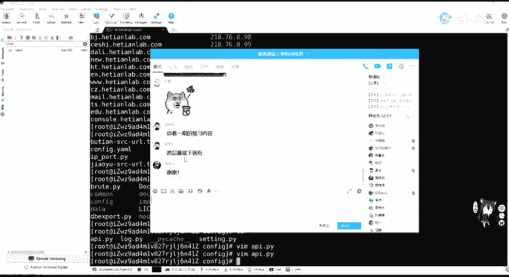

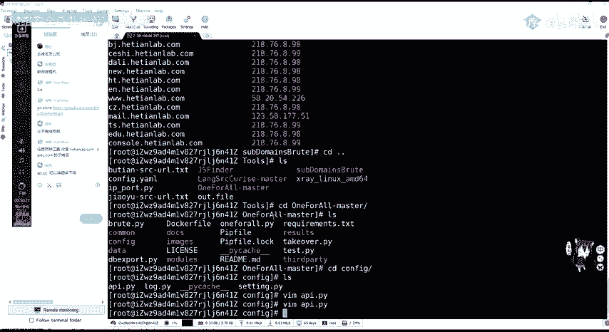

**课后任务**：请使用任意两种本节课介绍的工具或方法（例如OneForAll、Sublist3r、搜索引擎语法等），分别收集 `hetianlab.com` 和 `baidu.com` 的子域名列表。

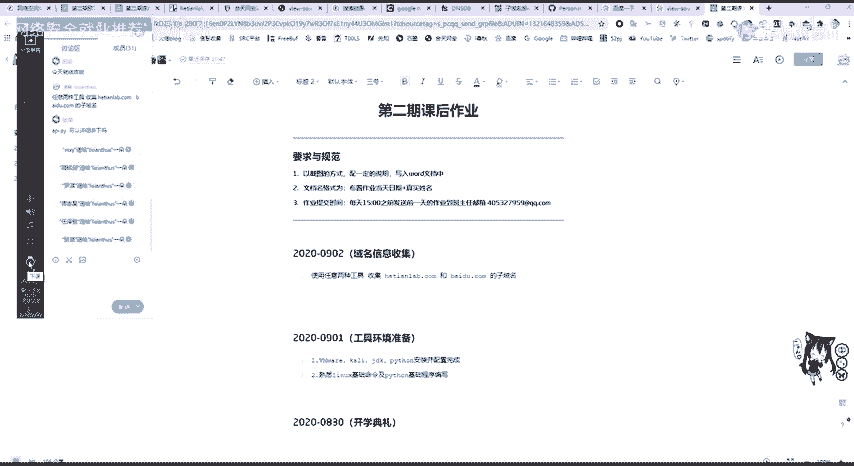

请记住，在学习和实践Web安全与渗透测试的过程中，动手复现至关重要。听课可能觉得简单，但自己操作时可能会遇到各种环境或工具问题。在解决这些问题的过程中学习、记忆，并将知识应用到实际工作中，才是正确的学习路径。