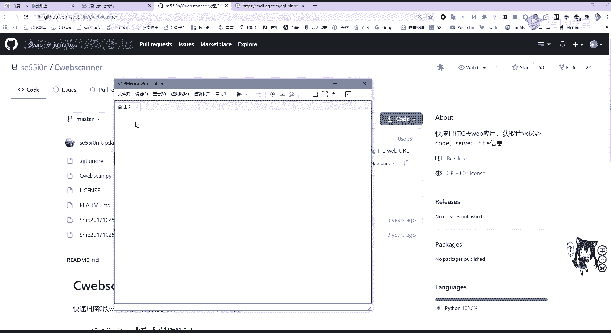
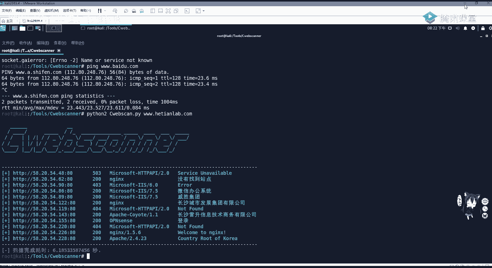
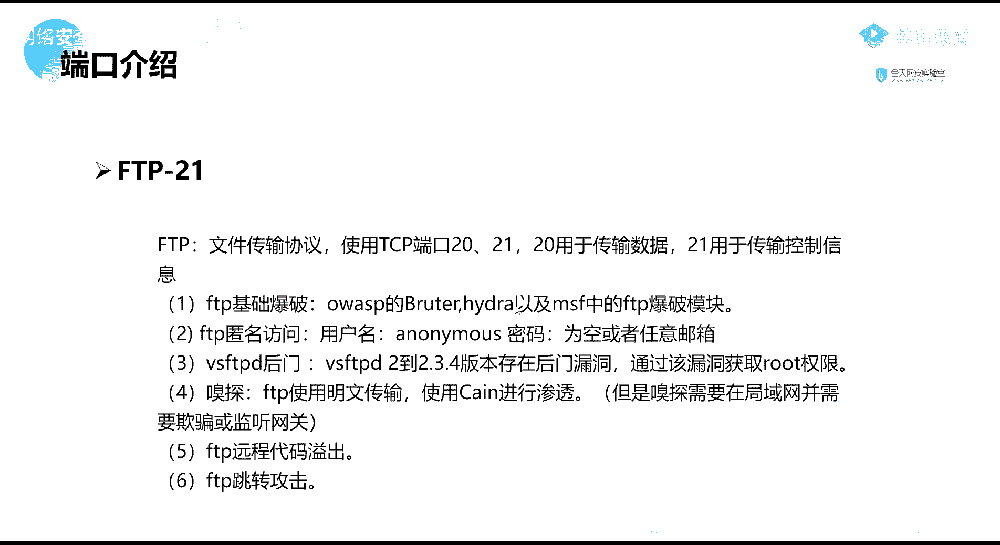
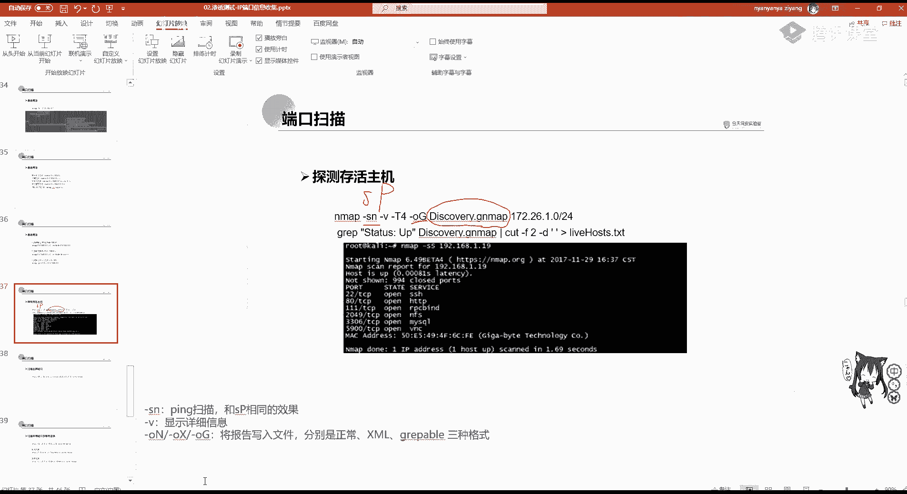
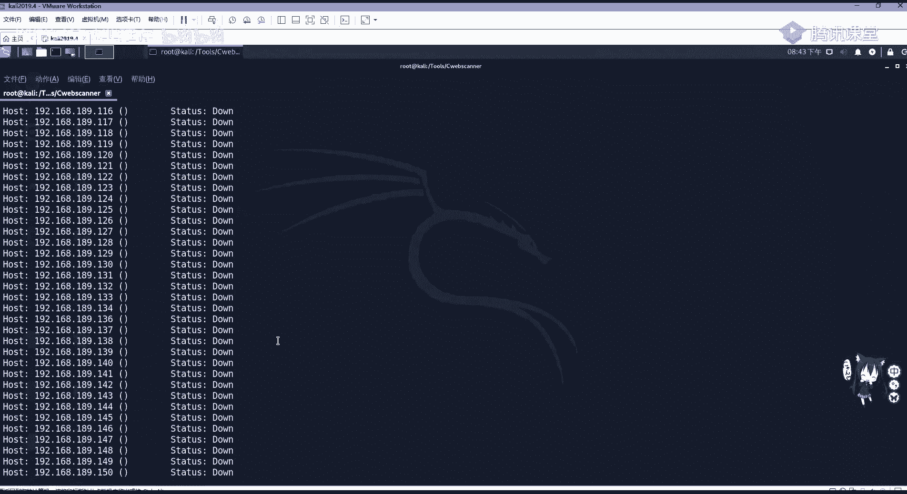
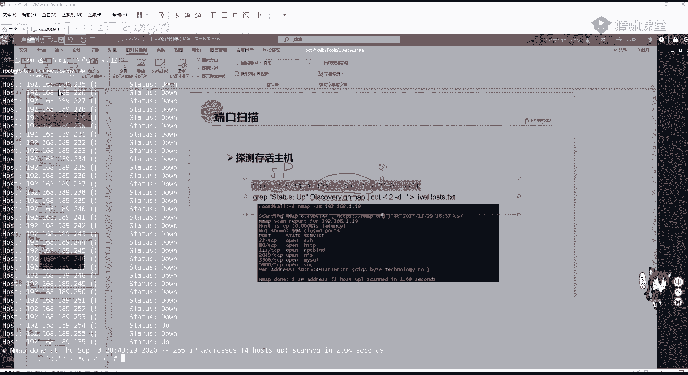

# 网络安全就业推荐 - P42：第3天：IP、端口信息收集 🎯

在本节课中，我们将学习渗透测试信息收集的第二部分：IP地址及其端口的信息收集。掌握这些技能对于定位目标、发现潜在攻击面至关重要。

## IP地址信息收集

上一节我们介绍了域名与子域名收集，本节中我们来看看如何收集IP地址信息。IP地址代表主机在网络中的位置，其信息收集非常重要。当甲方给予的目标是IP地址时，我们可以通过IP进行反查域名。如果渗透目标为虚拟主机，那么通过IP进行反查域名就很有价值。因为一台物理服务器上可能运行多个虚拟主机，这些虚拟主机有不同的域名，但通常共用一个IP地址。如果你知道有哪些网站共用这一台服务器，拥有同一个IP地址，那么就可以通过IP进行反查域名。通过此台服务器上其他的网站漏洞获取服务器控制权，进而迂回获取渗透目标的权限，这也就是我们经常说到的“旁注”。

以下是进行IP信息收集的两种主要场景和方法：

1.  **通过IP反查域名**
    此方法适用于目标为IP或需要查找同一服务器上的其他站点（旁站）。我们可以使用站长之家（`chinaz.com`）的Web接口进行查找。在查询框中输入IP地址，例如 `58.20.54.26`，即可查询到该IP绑定的域名，如 `hetianlab.com`。

2.  **通过域名查IP**
    此方法用于获取目标服务器的真实IP地址。如果收到的资产是域名，我们需要对IP进行服务探测和端口探测。通过域名查IP很简单，可以使用 `ping` 命令请求DNS解析。
    ```bash
    ping hetianlab.com
    ```
    或者使用站长之家的Web接口进行查询，输入域名即可获得IP地址及地理位置等信息。

## 绕过CDN获取真实IP

现在大部分网站都开启了CDN服务。CDN（内容分发网络）依靠部署在各地的边缘服务器，使用户就近获取所需内容。这会导致我们查询域名时得到的是CDN节点的IP，而非网站真实服务器的IP。我们需要绕过CDN来获取真实IP。

首先，我们需要判断目标是否使用了CDN。可以使用站长之家的“多地Ping”功能。如果从不同地区Ping同一个域名，返回的IP地址不同，则很可能开启了CDN。

以下是几种绕过CDN获取真实IP的常用方法：




*   **国外访问探测**：CDN服务按流量收费，且在中国大陆以外地区架设成本较高。因此，很多国内网站不会对国外用户开启CDN。我们可以利用国外的在线Ping工具（如 `ping.chinaz.com` 的海外节点）进行探测，如果海外节点Ping出的IP一致，则该IP可能是真实IP。
*   **查询子域名IP**：CDN价格昂贵，通常只对主站或重要子站启用。一些不起眼的子域名可能直接解析到真实服务器IP。通过查询子域名的IP，并进一步探测其C段（同一网段），有可能找到真实服务器IP。
*   **查看PHPInfo文件**：如果目标服务器存在 `phpinfo.php` 文件且未被删除，访问该文件可能在 `$_SERVER[‘SERVER_ADDR’]` 变量中看到服务器的真实IP地址。但此方法成功率较低，因为管理员通常会删除此文件，且很多网站并非PHP架构。
*   **查询邮件服务记录**：如果目标网站有邮件服务器，并且邮件服务器与Web服务器在同一台物理机上，则可以通过查看邮件的原始代码获取IP。在邮件原文中查找 `Received from` 后面的IP地址，可能即是服务器真实IP。
*   **查询历史DNS记录**：网站在启用CDN之前，需要先将域名解析到真实IP。这些历史解析记录可能会被DNS查询网站收录。我们可以通过查询域名的历史DNS记录（特别是A记录）来寻找真实IP。可以使用 `viewdns.info` 等网站进行查询。


如果目标对全球都开启了CDN，并且没有历史解析记录，则可能无法绕过。但对于一般的中小型网站，通常能找到其真实IP。



## C段主机探测

在找到真实IP之后，我们需要对IP的C段进行主机探测。什么是C段？它指的是同一网段内的IP地址群，例如 `192.168.1.0` 到 `192.168.1.255` 就属于一个C段。公网中，一个公司申请的IP地址通常是相邻的。探测C段可以帮助我们发现目标公司的其他网络资产。




以下是进行C段探测的工具：

*   **使用Nmap**：Nmap是一款强大的网络扫描工具。可以使用 `-sn` 参数进行Ping扫描，探测存活主机。
    ```bash
    nmap -sn 192.168.1.0/24
    ```
*   **使用第三方工具**：例如 `CWebScanner`，它专为Web资产发现设计，速度较快。可以通过GitHub克隆项目并使用Python运行。
    ```bash
    git clone https://github.com/xxx/CWebScanner.git
    cd CWebScanner
    python cwebscan.py -d example.com -p 80,443
    ```


## 端口信息收集

端口是网络通信的入口。在渗透测试中，了解目标开放了哪些端口，以及这些端口对应的服务，是“踩点”的关键步骤。服务器可以比作房子，端口就是进入房子的门。我们需要知道有几扇门，门后是什么。

端口根据号范围可分为三类：
*   **周知端口 (0-1023)**：如 `80` (HTTP)、`443` (HTTPS)、`21` (FTP)、`22` (SSH)。
*   **注册端口 (1024-49151)**：分配给用户进程或应用程序。
*   **动态/私有端口 (49152-65535)**：一般不固定分配。

我们需要重点关注那些常存在漏洞的周知端口。以下是一些关键端口及其常见安全隐患：

*   **21 (FTP)**：文件传输协议。可能存在爆破、匿名访问、特定软件（如vsftpd）后门等漏洞。
*   **22 (SSH)**：安全外壳协议。可能存在弱口令、用户枚举等漏洞。
*   **23 (Telnet)**：远程登录协议，明文传输，易被嗅探。
*   **25/465 (SMTP)**：简单邮件传输协议。可用于发送钓鱼邮件。
*   **80/443 (HTTP/HTTPS)**：Web服务。存在大量Web应用漏洞（如SQL注入、XSS）及中间件漏洞（如Apache、Nginx）。
*   **139/445 (SMB)**：Windows文件共享服务。著名漏洞有MS17-010（永恒之蓝）、MS08-067等。
*   **3306 (MySQL)**：数据库服务。可能存在弱口令、权限提升漏洞。
*   **3389 (RDP)**：Windows远程桌面。可进行爆破攻击，或利用相关漏洞（如“蓝色脉冲”）获取控制权。
*   **6379 (Redis)**：内存数据库。常存在未授权访问漏洞，可通过SSRF攻击利用。
*   **7001/8080 (WebLogic/Tomcat)**：Java应用服务器。常存在反序列化、任意文件上传等严重漏洞。


## 使用Nmap进行端口扫描


Nmap是端口扫描的“神器”。它功能强大，可用于主机发现、端口扫描、服务版本探测、操作系统识别甚至漏洞检测。

Nmap扫描端口后，常见的状态有：
*   **open**：端口开放，有程序监听。
*   **closed**：端口关闭。
*   **filtered**：端口被防火墙或IDS过滤，无法确定状态。



以下是Nmap的一些基础用法：






*   **全面扫描**：`nmap -A -T4 target_ip` （`-A` 启用全面扫描，`-T4` 指定扫描速度）。
*   **SYN半开扫描**：`nmap -sS -Pn target_ip` （`-sS` 发送SYN包，不完成TCP握手，隐蔽且高效；`-Pn` 跳过主机发现，直接扫描端口）。
*   **指定端口扫描**：`nmap -p 80,443,8080 target_ip`。
*   **全端口扫描**：`nmap -p- target_ip` （扫描1-65535所有端口，速度较慢）。
*   **扫描C段存活主机**：`nmap -sn 192.168.1.0/24`。
*   **导出结果**：`nmap -oN result.txt target_ip` （将结果保存到 `result.txt`）。

Nmap还内置了大量脚本（位于 `/usr/share/nmap/scripts/`），可用于漏洞检测。例如，扫描MS17-010漏洞：
```bash
nmap -p 445 --script smb-vuln-ms17-010 192.168.1.0/24
```

## 其他信息收集与社会工程学

除了技术层面的信息收集，还有其他辅助手段。

*   **历史漏洞信息查询**：在攻击特定CMS、框架或中间件时，需要查找其已知漏洞。可以利用以下平台：
    *   乌云镜像、乌云知识库（虽然已关闭，但有镜像站）。
    *   Exploit-DB (`exploit-db.com`)：国外的漏洞和利用代码库。
    *   CNVD、CNNVD：国家信息安全漏洞共享平台。
*   **社会工程学**：这是一种利用人性弱点（如信任、好奇、贪婪）获取信息的手段。在渗透测试中可能用于：
    *   **钓鱼邮件**：伪造高管或系统通知，诱骗管理员点击链接或提供密码。
    *   **钓鱼网站**：克隆目标登录页面，诱使用户输入账号密码。
    *   **信息刺探**：通过公开渠道（社交媒体、公司网站）搜集管理员姓名、邮箱、电话等信息，用于定制化攻击。

**请注意**：社会工程学攻击在法律和道德上存在灰色地带，在未获得明确授权的情况下严禁对真实目标使用。挖SRC（安全应急响应中心）时也禁止使用社工手段。

## 总结与作业

本节课中我们一起学习了渗透测试中IP与端口信息收集的核心知识。我们了解了IP反查域名、绕过CDN获取真实IP、进行C段探测的方法。深入学习了常见端口及其关联的安全风险，并掌握了使用Nmap进行端口扫描的基本技巧。最后，我们简要了解了历史漏洞查询与社会工程学的概念。

以下是本节课的作业：
1.  使用Nmap或CWebScanner对 `hetianlab.com` 进行C段扫描，并扫描该网站开放的端口。
2.  **尝试性作业**：自行搭建一个存在已知漏洞的旧版操作系统虚拟机（如Windows XP或Windows Server 2003）。使用Nmap对其进行端口扫描，并尝试利用公开的漏洞利用代码（Exp）或Metasploit框架获取该虚拟机的控制权。此作业旨在练习漏洞搜索与利用的基本流程。


请大家按时完成作业。如果在环境搭建或工具使用中遇到问题，可以在群内提问或联系助教。