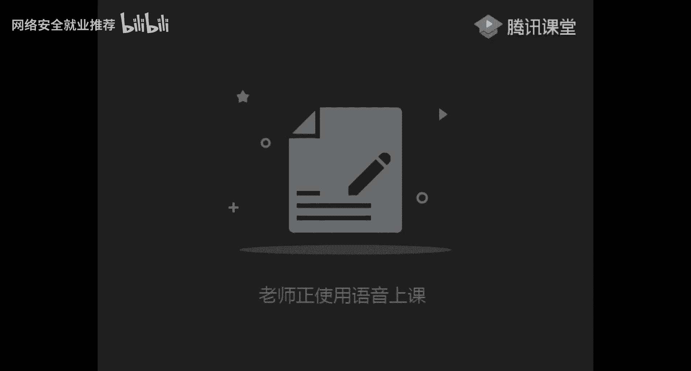

# 课程P43：第4天：网站信息收集 🔍

在本节课中，我们将学习网络安全渗透测试中至关重要的一步——网站信息收集。我们将了解如何识别网站的“指纹”，探测敏感文件和目录，以及识别网站的防护措施（WAF）。掌握这些技能，能帮助我们更高效、更精准地发现潜在的安全漏洞。

## 网站指纹识别 🧬


上一节我们介绍了信息收集的整体框架，本节中我们来看看如何识别一个网站的“指纹”。网站的“指纹”是指其构成组件的信息，主要包括服务器操作系统、Web中间件、脚本语言和数据库。了解这些信息是后续渗透测试的基础。


一个网站最基本的组成包括：
*   **服务器（操作系统）**：通常是 `Linux` 或 `Windows Server`。
*   **中间件（Web容器）**：例如 `Apache`、`Tomcat`、`Nginx`。
*   **脚本语言**：例如 `PHP`、`JSP`、`ASP`、`.NET`、`Python` 的 `Django` 或 `Flask`。
*   **数据库**：例如 `MySQL`、`SQL Server`、`Oracle`、`Access`。


### 操作系统识别


以下是判断网站服务器操作系统的三种常用方法：


1.  **Ping命令TTL值判断**：通过 `ping` 目标IP，观察返回的TTL值。Windows系统的TTL值通常为128，Linux系统通常为64。公式可概括为：`TTL > 100` 一般为Windows，`TTL < 100` 一般为Linux。
    ```bash
    ping 目标IP
    ```

2.  **Nmap扫描识别**：使用Nmap的 `-O` 参数进行操作系统识别。
    ```bash
    nmap -O 目标IP
    ```

3.  **URL大小写敏感性测试**：Windows服务器对URL路径大小写不敏感，而Linux服务器敏感。例如，在Windows服务器上访问 `http://目标/DVWA` 和 `http://目标/dvwa` 效果相同；在Linux服务器上，则可能因大小写错误而无法访问。

### 中间件、脚本语言与数据库识别

识别网站的中间件、脚本语言和数据库类型，有助于我们寻找针对性的漏洞。

1.  **浏览器开发者工具（F12）**：打开浏览器开发者工具的“网络(Network)”标签页，刷新页面，查看HTTP响应头中的 `Server` 字段，通常包含中间件信息（如 `Server: nginx`）。

2.  **浏览器插件**：使用如 `Wappalyzer` 这类浏览器插件，可以快速分析网站使用的技术栈，包括中间件、前端框架、脚本语言等。

3.  **URL后缀与经验判断**：观察网页URL的后缀名，例如 `.php` 通常代表PHP，`.jsp` 或 `.do` 通常代表Java，`.aspx` 代表ASP.NET。

4.  **在线工具与Nmap脚本**：可以利用在线指纹识别平台或Nmap的脚本引擎进行更全面的探测。

### 常见CMS识别

CMS（内容管理系统）如 `WordPress`、`Discuz!`、`织梦(DedeCMS)`、`PHPCMS` 等，通常有公开的漏洞。识别CMS有助于快速定位可利用的历史漏洞。

识别方法包括：
*   **查看网站页脚/Banner**：许多CMS会在页面底部显示版权信息，如 `Powered by Discuz!`。
*   **使用在线识别工具**：输入URL，让工具自动分析。
*   **搜索漏洞库**：在 `exploit-db`、`seebug` 等漏洞平台搜索已知CMS的漏洞和利用方法。


## 敏感文件及目录探测 📂

在了解了网站的基本构成后，我们需要探测网站是否存在敏感文件或目录泄露。这些泄露可能源于管理员配置疏忽，是获取关键信息（如源代码、配置文件、备份文件）的重要途径。


以下是常见的敏感文件或目录类型：

*   **`.git`、`.svn` 泄露**：版本控制系统文件泄露，可能导致整个网站源代码被下载。
*   **`.DS_Store` 泄露**：Mac OS系统目录文件，可能泄露目录结构。
*   **`WEB-INF` 泄露**：Java Web应用的安全目录，若配置不当可能泄露源代码。
*   **网站备份文件**：如 `www.rar`、`web.zip`、`database.sql` 等，可能包含源代码或数据库信息。


### 探测工具与方法

探测这些敏感信息通常需要使用专门的工具进行扫描。


以下是几种常用的目录和文件扫描工具：


1.  **御剑**：经典的图形化目录扫描工具，支持多种脚本类型字典，易于上手。
2.  **dirsearch**：基于Python的命令行目录扫描工具，速度快，可定制性强。
    ```bash
    python3 dirsearch.py -u http://目标网址 -e php,html,zip
    ```
3.  **dirmap**：另一款高效的Python目录扫描工具，支持并发扫描。
    ```bash
    python3 dirmap.py -i http://目标网址 -lcf
    ```

**针对特定漏洞的信息泄露**：某些框架存在固有的信息泄露漏洞。例如，Spring Boot框架的 `/env` 端点未授权访问，可能泄露数据库密码等敏感配置信息。发现这类漏洞通常也需要通过目录探测来寻找特定路径。

## 网站WAF识别 🛡️

在尝试渗透之前，识别目标网站是否部署了WAF（Web应用防火墙）至关重要。WAF会拦截常见的攻击流量，盲目测试可能导致IP被封锁。

WAF主要用于：
*   防御常见Web攻击（如SQL注入、XSS）。
*   防止自动化攻击（如暴力破解、漏洞扫描）。
*   阻止恶意爬虫等。


### WAF识别方法


识别WAF可以帮助我们选择针对性的绕过技术。


1.  **手动测试**：提交简单的测试Payload（如 `' and '1'='1`），观察返回页面是否包含 `安全狗`、`云锁`、`阿里云盾` 等WAF拦截提示。
2.  **工具识别**：使用 `wafw00f` 工具可以自动化识别WAF。
    ```bash
    # 安装
    git clone https://github.com/EnableSecurity/wafw00f.git
    cd wafw00f
    python setup.py install
    # 使用
    wafw00f http://目标网址
    ```
3.  **Nmap脚本**：Nmap也提供了一些用于识别WAF的脚本，但识别能力相对一般。

识别出WAF后，可以搜索该WAF的已知绕过方法，例如使用特殊字符、注释、编码等方式尝试绕过防护规则。

## 总结与作业 📝

本节课中我们一起学习了网站信息收集的三个核心部分：**网站指纹识别**、**敏感文件及目录探测**以及**网站WAF识别**。这些是渗透测试前期最关键的信息梳理工作，能为后续的漏洞挖掘和利用提供明确的方向。

**课后作业**：
1.  **实验练习**：在和天实验室平台完成《Nmap网络扫描》与《Web敏感信息泄露（Git/SVN）》相关实验。
2.  **实战尝试**：选择一个公益SRC平台（如补天、漏洞盒子）上的一个目标，尝试进行完整的网站信息收集，并记录收集到的信息及过程。


通过理论与实践的结合，你将能熟练掌握网站信息收集的技能，为成为一名合格的网络安全工程师打下坚实基础。祝大家学习顺利！