# P44：第5天：WEB漏洞扫描器-AWVS及nmap - 网络安全就业推荐 - BV1Zu411s79i

现在开充电了哦，那个麦有没有什么问题呀，可以是吧，那我们就开始上课了，刚好八点有回音吗，那我把这个窗关一下看看，现在呢现在好点没有，因为这个房间还是比较大的，哦对今天是我给大家上课。

那那我说话大声一点吧，这节课呢我给大家就是点一下，我们的一个漏洞扫描器a w vi，这个呢是一个比较常用的一个扫描器，它呢是主要是针对web应用的一个扫描器，上节课上节就是前面那几节课。

我们老师给大家讲了，那个就是一个信息收集，比如说一些端口啊，或者网站信息收集，以及它的一个网站的一个子域名的信息收集哦，对今天呢会剪会剪一下这个批量扫描，啊那我们上一节课就是刘老师给大家讲了。

他的一个子域名信息收集，要收集到了子域名之后呢，我们就需要对它进行一个漏洞的发现，也就是我们这节课讲的一个内容，就是我们利用这个aw v s进行一个漏洞扫描，首先呢我们这里是分为三个的内容。

来给大家讲这个aw v s，第一个部分呢是讲我们的一个漏洞扫描器，就是讲我们什么是一个漏洞扫描器，以及我们的一个这节课的一个，aw v s的一个介绍，第二个部分呢就是我们的一个a w e s的一个。

安装与破解，因为我们一个正版的话，是需要进行进行一个收费的，所以呢我们这里呢去使用一个破解版，就是安装并并进行一个破解，第三个部分呢就是我们点一下，我们的一个a w e s的一个功能介绍。

比如说如何去使用，后面呢我们来看一下第一个部分，就是一个漏洞扫描器以及aw v s的一个介绍，这个有没有这个语速有没有就是比较快呀，好不发了那就好，首先呢我们来看一下漏洞扫描，就是就是什么是漏洞扫描。

漏洞扫描呢是一只基于我们的一个漏洞数据库，通过我们就是扫描要等一些手段，对指令的一些远程或者是本地，计算机系统的一个安全性进行检测，也就也就是说，我们就是通过这个这一个扫描的手段。

对我们上一节课给大家讲了一个子域名，信息收集，就是收集到的一个子域名，进行一个安全脆弱性的检测，也就是说我们对它扫描就是有没有这一个漏洞，然后去通过这个扫描去发现，可以利用漏洞的一种安全检测的行为。

也就是我们的一个渗透攻击，就是就是通过我们找到的一个漏洞，然后去对它进行一个利用，那么常见的一个漏洞扫描的工具有哪些呢，首先呢这个网络上公布的一些部位的，或者免费的一个漏洞扫描的工具，或者是脚本。

是很多的，比如说我们在giugia上面，就是有许多的别人写的一个脚本，那种脚本呢也可以说是一个漏洞，可以进行一个漏洞扫描，首先呢我们来看一下第一个点，就是针对某类漏洞的。

比如说针对我们的一个sql注入的一个漏洞，也就是，通过我们的一个有一个工具叫做叫做super ma，通过这个搜circle map这个工具，就是可以发现我们那个网站是否存在。

我们的一个sql注入的一个漏洞，第二个呢就是一个针对v和log，和一个biologic game，就是这个东西呢，我们可以在网上可以搜索到这里给大家来看，哦我们可以在我们的一个网站可以搜索，别怕。

我们可以在我们的一个网网上进行一个搜索，比如说是搜索这个外号magic tm，这个这个工具呢它里面也写了许多的一个，就是里面已经内置了许多的一个标记，也就也就是我们的一个漏洞检测的脚本。

我们可以看到这里呢有有许多的一个，比如说一些s h i f啊，还有一些反序列化，以及一些文音译文件上传等等的一些漏洞，但里面已经内置了，这个呢就是针对我们的一个weblogic的一个漏洞。

以及我们针对某类tm的的一个water flash的一个gm，也tm s呢也也叫做我们的一个内容管理系统，就那些ms，比如说我们的针对cms的一个w p cam。

以及一个gd t m s的一个dd t m s game，这个呢我们都可以在网络上搜索到的，比如说我们这里有一个wp，这里呢我们可以搜索到，还有还有一个就是我们的一个dd c s d d d。

这个呢是针对就是针对我们某一类漏洞的，这个呢也是内置了许多的一个检测脚本，这个呢是就是我们针对某类漏洞，然后让我们来看一下，就针对我们的一个系统应用层的，我们前面讲的都是一些web方面的，一个就是工具。

还有呢就是一个针对系统应用层的，比如说我们的一个nexus nexus呢，也就也就是我们经常是用来对我们的一个器，扫描系统的一个就是工具，它呢也是一个嗯收费的，还有呢就是针对某类框架的一个检测工具。

比如说struct to的一个一个框架，可以使用我们的一个stress to的一个漏洞，检查工具，这个呢这个工具呢，你们的一个工具包里面应该是有这个工具的。

还有呢就是针对我们的一个spring pool的一个工具，就是脚本，我们只有一个s b，然后这个工具，我们这个呢都可以在我们的gp上面搜索到，然后呢，还有呢就是一个针对我们的一个web服务的。

web服务，我们还有一些比如说我们的一个boss swit，我们这个bp swit，它不不不仅仅是一个抓包的工具，我们还可以使用它进行一个漏洞扫描，还有呢就是我们的一个长亭，长亭科技给了一个工具。

一个叉叉r a y，这个工具呢是最近比较火的一个工具，还有呢也有一些四驱版，还有一些收费版，就是高级版四驱版，它的功能没有那么多，第一个呢就是我们这一这一节的一个内容，1w vs。

那么什么是aw v s呢，aw aw v s，但是一名一款知名的网络漏洞扫描工具，它可以通过网络爬虫测试我们的网站是否安全，去检测我们的一个流行的一些安全漏洞，比如说我们的一些sql注入啊。

xxr以及更多的一些漏洞，然后呢我们是在11点版本以前呢，是我们是一个客户端的一个工具，也就是，也就是相当于是我们相当于是我们的一个，比如说是一个类似于qq这种客户端。

或者说是一个微信的一些客户端的一些工具，来找一下，然后从11点之后，11点之后呢，它就变成了一个使用浏览器端打开的一个形式，我们访问它的话呢，就是使用我们安装和自定义的一个端口，来进行访问的。

那现在呢是通过我们的一个网络，就是客户端，就是这个浏览器进行一个访问，比如说这个呢就是我搭建的一个，就是安装了一个aw v，那么它有哪些功能特点呢，首先呢就是一个web spanner。

就是我们的一个web扫描，这个呢是它的一个核心的功能，可以对我们的一个web安全漏洞进行扫描，这个呢就是它的一个爬虫的功能，就是便利我们的一个网站，站点的一个目录结构，就是可以可以去爬取我们的一个网站。

它的一个站点目录，第三个呢就是一个端口扫描，扫出web服务器，就比如说我们常见的一些八零端口，443端口等等，其实呢就是一个子域名扫描器，利用一个dns查询来发现我们的一个子域名。

第五个呢就是一个sql注入工具，也就是说他可以去发现我们的一个circle，输入，还有就是一个协议数据包跟仪器，下面呢我们会对它进行一个展开来讲，我们的这个功能特点，还有的一个就是模糊测试工具fs。

我们常常说所呈现所做的一个f，还有呢就是一个web认证破解工具，也就是可以去对我们的一个入口令，去进行一个破解，下面呢我们来看一下第二个部分，a w vs的一个安装与破解，首先呢我们下载。

将我们的一个工具进行下载下来，这个工具呢我已经在你们的一个预习内容里面，已经写在上面了，并且把我们的一个破解的一个呃，那个破解好像是没有讲的，但是呢我们这节课呢那里是写的比较简单一点。

这节课呢我们来给给大家讲一下如何去破解，首先呢这个是我们的一个下载链接，你们可以去访问进行一个下载，那我们的一个bt码，提取码是我们的一个和k lab，就是我们这个h e t r a m。

a a n l a d o s lab，所以呢这个呢是我们的一个a w e s，主要的一个安装包，以及它里面还有一个破解破解包，好bt就是我们所做的一个模糊测试，你这个呢你可以去就是就是模糊测试。

我们先来看一下这个，然后安装安装的话呢，是跟我们正常安装一些qq啊或者微信啊，是一样的，不过呢到这一步，就是，我们有一步是需要去对我们的一个账户去进行，一个设置的，就是设置我们的一个邮箱。

登录的邮箱以及我们的一个登录的密码，这里呢都是一些一些比较简单的一些设置，然后呢，我们还有一步就是去设置我们的一个端口，就是我们web访问的一个端口，就是浏览器访问的一个端口，这个端口呢你可以随意设置。

就是设置完了之后，我们访问的端口就是你所设置的一个端口，然后下面这个呢就是我们就是询问，我们是否允许远程进行一个访问，就是说是保值只允许你这个本机进行访问，还是可以允许其他的机器进行访问。

你这个aw v s我们我这里呢是没有选择进行，这是允许的，所以呢我这里呢是指，只能在我们的一个本地进行访问，下面呢就是一个破解，破解呢我们有当然里面呢就是有两个工具，就是我们的下载的一个下载包里面。

解压了之后，里面有三个工具，一个有三个安装包，一个呢是我们的一个aw v s，主要的一个安装包，另外两个呢就是我们的一个破解的一个破解包，首先呢将我们的一个破解破解包点一ex 1，还有一个d这两个包。

去复制到我们的一个aw vs的一个安装目录，那这个安装目录呢是我们默认的，它安装的是不能，我们不能去选择它的一个安装路径的，所以呢这里我们可以来找一下它的一个路径，我走我先走一下，在在这个c盘上面。

然后看一下是不是这几个啊，在这个flag lemon fllam，这个bet这个文件夹上面，就是在这个乘八六这个文件夹上面，那我们我们这里呢有一个这个第一个工具，就是第一个和这个h c n。

这个文件夹文件夹下面，然后呢，我们可以看到我们是不是将我们的这两个，一个两个破解包去复制到我们的这个目录下面，破解到了下面之后，我们运行即可，就是以我们以一个真，就是这个管理员的一个身份去进行运行。

运行了之后呢，它会提示我们去填写一些信息，比如说这个名姓名栏，公司名称啊，还有一些就是我们的一个电话号码等等，那那那里呢我们可以随意填写，因为这里呢我没有截图，但是这个呢都是我们看看都能看懂的。

我所以呢我这里就不进行演示了，下面呢我们来看一下我们的一个，我们的一个w vs功能介绍以及应用，首先呢我们它的一个页面布局，页面布局，这里呢我们第一个呢是一个仪表盘。

就是仪表盘就是这个第一部分的一个仪表盘，仪表盘里面呢第二个呢就是一个目标，就是一个他给，第三个就是我们的一个漏洞，就是我们手就是我们通过我们扫描到的，扫描的一个域名，或者是一个子域名所扫到的一个漏洞。

第四个呢就是一个扫描看，第五个呢就是一个雷p报告，就是我们导出的一个报告呢都在这里，第六个就是一个设置，要从仪表盘，我这里打开来讲吧，这里先登录我。

好像在登录的时候，我们可能会经常会遇到这一个的问题，就是遇到这一个它弹出，我们这个他说在我们的一个本地，已经有另外的一个账号进行一个登录了，已经有账号进行登录了，所以呢因为我们这个aw bs。

现在呢是只允许同时登录一个账号，也就是说就是说我们只只允许我们的一个，一个session，是在这同时进行一个登录的。

只允许一个，所以呢我们这里呢是点击这个退出就行了，点点击退出，这里呢我们这里呢可以看到流体这个仪表盘，这里仪表盘这里最上面呢，这里呢是我们所找到的一个漏洞，漏洞数量以及漏洞分布，比如说我们在这个。

第一个这里这个本应该说是一个粉红色的吧，粉红色这里呢就是一个高危漏洞，高危漏洞的一个数量，一个一个分布的数量，中间这个呢就是一个中规漏洞的，一个分布的数量，就是这个这个橘橘黄色，淡黄色。

这个这是一个中位漏洞的有的一个数量，然后到这个浅蓝色，浅蓝色，这里呢就是我们的一个dv漏洞，就是我们我们的一个dv漏洞的一个分布的数量，然后上面这里就是左下角，左下角这里。

这就是我们所找到漏洞的一个网站，比如说我们在这个car这个网站看点f l y m e，这个是一个网站，我们可以找到了这个88个这个红色的，也就是我们的一个高危漏洞，以及99加的一个中微漏洞。

这个呢就是我们的一个漏洞分布的一个站点，然后右下角呢，这个呢就是我们找到的一个漏洞的一个排列，比如说我们找到了89个，这个这是一个我们的一个目录目录，便利我们这里呢看这个英文呢也可以看出来。

这是它的一个排名，比如说把目录遍历，这个漏洞呢是39个是最多的，然后第二个呢就是一个ccs，也就是我们的一个xx这是88个漏洞，这个呢是按按它的一个数量进行排序，那第二个这个仪表盘。

仪表盘这个上方的零呢是一个漏洞数量，中间就是我们的一个任务进度，我们刚刚也给大家讲了，还有一个就是左左下角就是我们走找到logo的，有一个一个目标站点，交代表的就是我们的一个漏洞类型。

我们来看一下第二点，target，target就是这个目标，我们点击这个target，这个权限呢，就会展示我们之前新建的一些扫描网站的信息，就是我们今之之前今天的一个站点信息。

这个呢就是我们对我之前的一个目标信息，我这里呢就直接给大家访问这节课来讲吧，所以呢我们这里可以看到这个呢，就是我们我之前的一个目标信息，首先呢我们这里有一个scan，是这样，这里。

就在这里呢就是我们扫描。

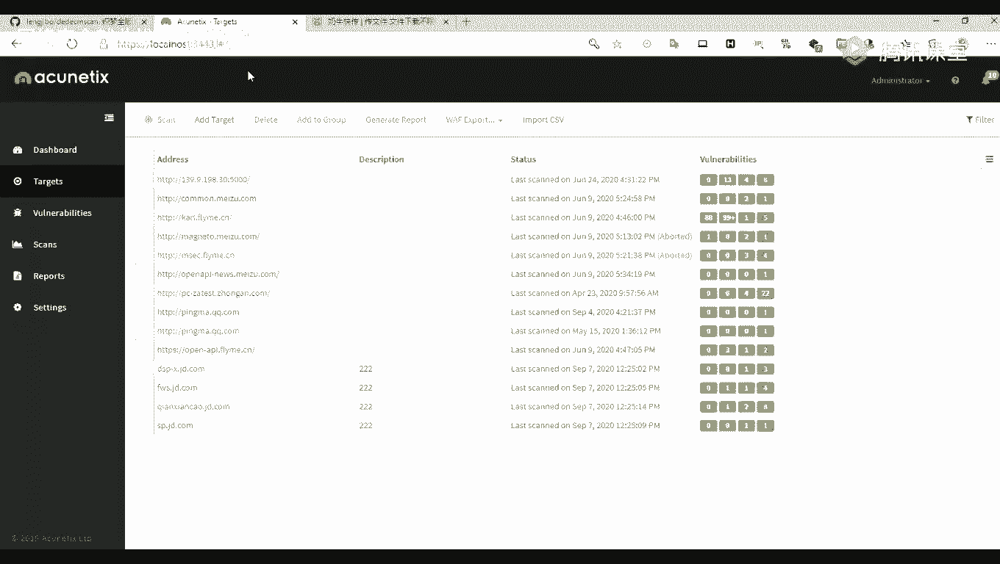

就是我们比如说我们添添加了目标之后。

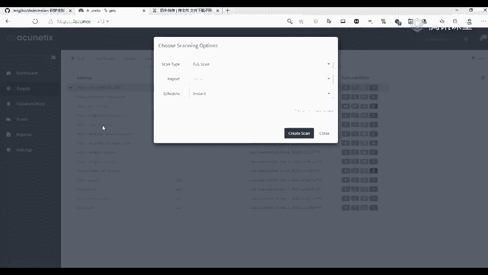

我们进行一个扫描。

比如说我们在这里添加了一个，就是添加目标at at target。

这个还有第三个呢就是一个delete，delete就是我们的一个删除目标，就是将我们这些水目标进行选中，然后删除，第四个ex flop，这个呢就是将我们的一个目标，添加到我们的一个组。

比如说我们新建某个组，然后我们呢比如说我们在这里，一个将我们的一个魅族魅族点，魅族点com就是添加一个魅族点com组，然后我们将这个魅族点cod，一个站点距都进行一个归类，就是将它去进行一个分类。

第五个呢就是我们找出我们的一个报报告，就是将我们扫描到的一个我们的一个目标。

就是的一个报告进行导出，这里呢我们也可以，就是选择我们导出的一个类型。

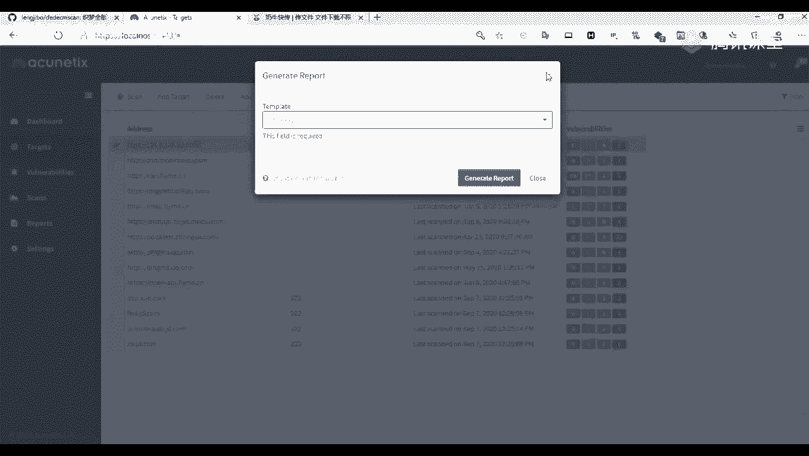

比如说我们这里呢我们等着第一。

第一个就是13909这个进行一个导出，比如说我这里就随便找一个吧。

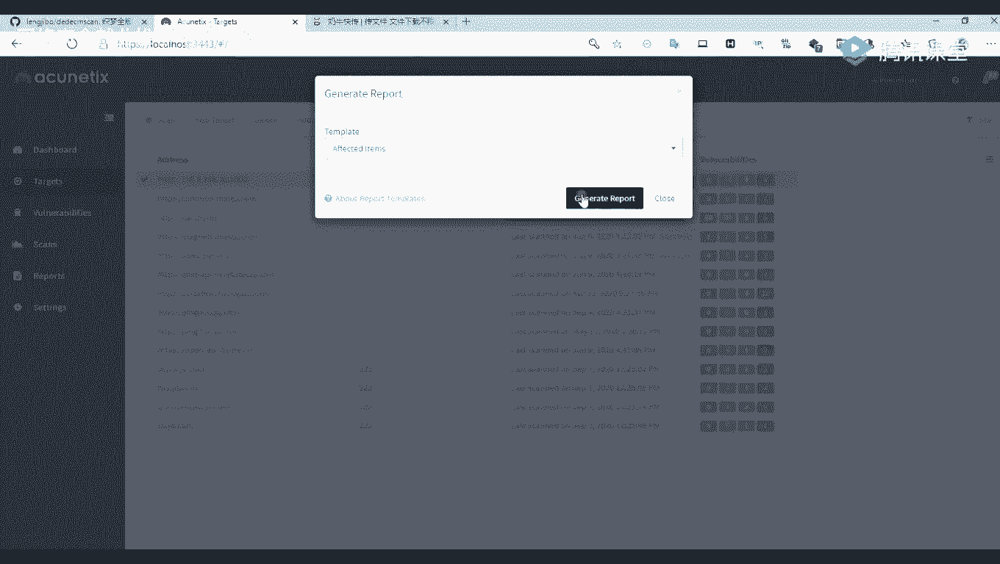

要倒倒了之后，我们在我们在这里，在这个report reports这里，我们可以看到我们的一个就是导入的一个目标，这里呢我们只是将我们的一个导出到，我们我们的这个report这个选项。

我们还需要进行下载才可以，比如我们上将它进行一个下载，下载之后呢，我们可以看到它的一个命名，命名方式是我们的一个就是日期，加上我们导出的一个类型，以及我们的一个站点，站点后面的一个端口。

要将它导出一个pdf的一个文件，我们保存之后，我们可以来打开看一下这个文件，啊你哪里打不开呀，是有出现什么问题吗，打不开https是一个http的一个战略，我们之前安装这里面不是有这个吗。

我们安装这里呢也可以看到的呀，我们这里呢是不是一个http s加lol host，3443的一个端口，这个呢就是我们我们访问的一个端口，啊，这个呢就是我们就是刚刚刚刚下载的一个，导出的一个文件。

就是导出的一个报告，报告里呢大家都是一个英文的，我们报告里那就是他给出我们的一个dc信息，比如说我们的一个u r l，还有一个就是网站，就是一个host，还有呢就是我们扫描出来的一个漏洞，数量高为零的。

然后中位13个dv 4个，还有一些信信息泄露，其他的一些是八个，然后后面呢就是我们扫描出的一个漏洞，的一些介绍，这里呢我就不不展开来讲了，就是给大家说一下这个导数的一个后后，那你们点一下那个详细了解。

看一下，我那个有问题的话，我们待会儿之后再解决吧，我们先进行上课，能点到哪里，好我们点到我们的一个目标，目标这里就是一个，目标，我们刚刚讲到这个目标的一个就是导出报告。

然后后面这个呢其实也是一个导数的一个报告，这个bug，what is all，这个选项呢也是一个导出报告的一个选项，然后呢还有一个就是import import csv。

这个呢就是我们可以导入。

我们我们的一个csv文件，也就是将我们的一个目标进行一个批量的导入，在这里呢只是一个批量的导入，比如说我这里有有一个csb的一个文件，csv里面的文件呢是我们的一个。

域名这个呢是我们csv文件里面的一些实域名，现在我们进行导入，去进行一个批量的导入，比如说我们这里b import csv这个选项。

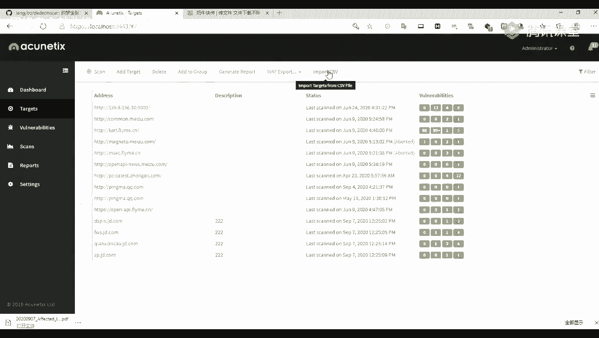

现在我们可以看到它的一个就是那个，csv文件里面我们的一个一个格式吧，前面呢是我们的一个例子，也就是或者说是我们的一个子域名，或者是一个ip，后面呢就是我们的一个描述，就后面跟一个逗号。

然后是我们的一个描述，我们这里呢导入一个js v。

然后呢然后导入了之后，它这里呢就提示我们成功导入五个目标，现在能看到了吗，就是这样子导入完你，你上面你昨天是这样的客户吗，但是我们可以新建就是新建一个excel的一个文件，在这里。

比如说我们这里呢有一个新建的一个，一个一个cel文件，那么我们这里呢有一些就是输入一些域名，比如我们这里呢随便输入一个，然后输入了之后，我们将我们的这个文件另存为另存为主，为我们的一个js v。

另存为我们的一个csv的一个文件，要你要点字，这样呢就可以了，就可以看到我们这里，这里呢是有一个csv的一个文件了，要导入了之后，我们就在这里呢，就是这个灰色的这些部分，就是我们我们导入的一个文件。

我们是没有进行扫描的，然后呢我们可以点击这个scheme进行一个扫描，然后我们这里待会会给大家进行一个演示，当然还有这这里面还有一个filter，就是一个过滤器，就是我们将我们的一个目标进行过滤。

比如说我们就是我们咱们就是过滤一个目标，是以一个地址或者是一个描述进行过滤，比如说我们这里就是选择三个二，就是我们这个描述呢是一个三个二的对吧，那我们这里呢就选择三个二，这样呢在这里呢就给我们演示了。

这个它的描述是三个二的一个目标，还可以呢去选择一些其他的，比如说一些选择上一次扫描的，比如说从没有扫描过的一些目标，比如等等去进行一个过滤，现在我们来讲一下，就是我们新建的一个扫描。

首先呢在我们他在那里，目标就是我们目标在那里点击at target，并新建一个扫描，然后上面那个address address，就是我们需要扫描的一个域名或者是ip，我们在这里点击我们第二个选项。

去添加一个域名或者是一个ip，比如说我们这里选择我们的一个http，哦天lab。com，我们可添加我们的一个和天lab。com的一个目标，后面呢是一个描述，比如说描述我们可以随意填。

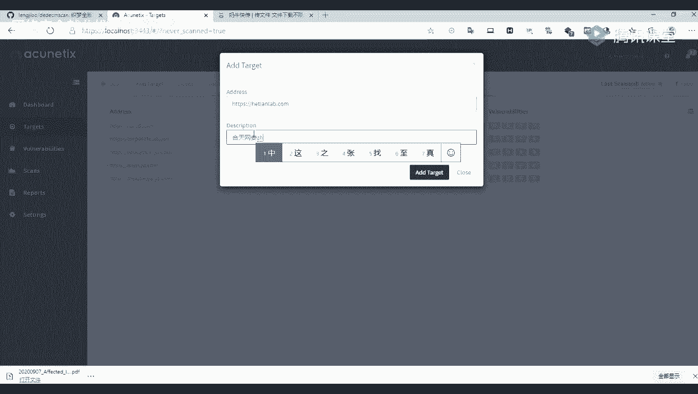

而且保安前面是一比一个天上添加了目标之后，这里呢就是我们的一个目标信息，首先呢我们的这个比如说这个这个选项，business这个选项，这里就是我们的一个扫描的一个优先级。

也就是说是一个低级的或者是一个低级的，就是高高级的，还有一些顶级的是严重的顶级的，就是一些扫描的一些优先级，然后这个gsb，gsb这里呢就是我们扫描的一个速度，比如说一个best。

还有一些其他的一些loslow glower，狄仁杰，就是我们扫描的一个速度，扫描越快呢，那么我们就越越那个对我们的一个网站，就是越能越快完成进行扫描，但是呢怎么样的越快。

那也意味着我们扫描的一个并没有那么的仔细，我们呢可以去根据我们的一个需求进行扫描，然后上面呢还有一些data lock lock locking这个软件，就是去登录我们我们的一个网站。

这是去扫描我们我们比如说我们有一些网站，可能是你访问的时候就是什么都没有，就是只有一个登录的页面，那么我们这种呢我们就可以先进行一个登录，要再进行扫描，这种呢就是一个需要登录的一个扫描，现在我们前面。

前面我们就选随便选择一个，就是一个天lab。com，然后我们这边就不需要不点登录了，现在我们去进行一个点，我们点到保存了。

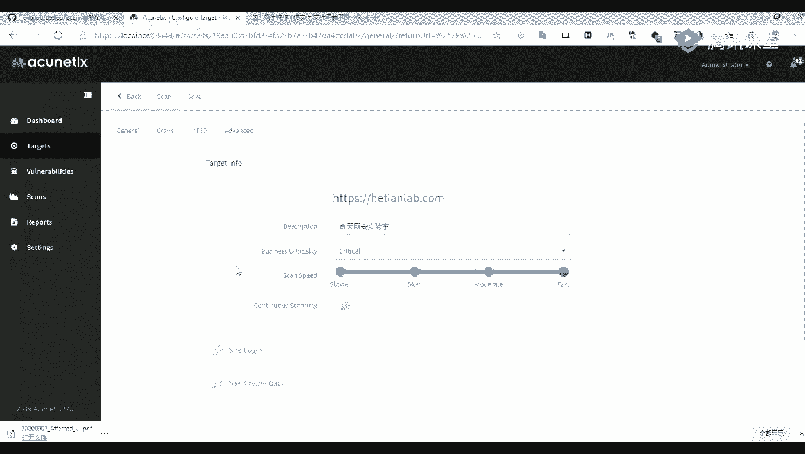

看到我们点击这一个scan scan，这里第一个这个spp part就是我们点击点击了game，只好在这里呢是需要我们去选择，我们的一个扫描的一个设置，比如说我们一个扫描类型。

这个安排扫描类型有一些全面扫描，就是第一个就是它默认的就是一个全面扫描，还有呢一个就是扫可以，我们只是扫描仪一些高危漏洞，或者是一些xx的漏洞，ak车头收入劳动等等，还有一些就是密码。

就是绕口令的一些漏洞，还有就是一些爬虫，就是爬虫爬是爬起我们我们的一个目标网站，然后中间这个就就是一个report，就是告诉我们需要生成什么样的一个报告，比如说我们它默认的是一个空，就是没有报告的。

这个冒药里没有报告的，然后呢还有呢就是一个标准标准报告，还有上上面呢就是一些合规报告，就是以什么样的一个方式并进行一个输出报告，还有呢就是一个扫描的频率，扫描的频率就是insteam。

这个就是我们的一些立立刻扫描，这个instea就是一个立刻扫描，然后中间这个呢就是我们未来，这就是以后的某一个时间，就是就是我们做一个定时定时任务，比如说我们在这个9月7号去进行一个扫描。

或者是我们还可以，或者是一个9月8号进行一个扫描，还有呢现在我们可以选择多少点多少分，以及一个就是一个循环扫描，循环扫描就是说我们在某一个时间点就没到达，那一个时间点就进行一个扫描。

比如说我们在周期进行一个扫描，比如说或者是哪一个月，就是每每周并扫描一次，或者是每月扫描一次，或者是一个每天都扫描等等，我们这里呢就选择一个立刻就是立刻扫描。

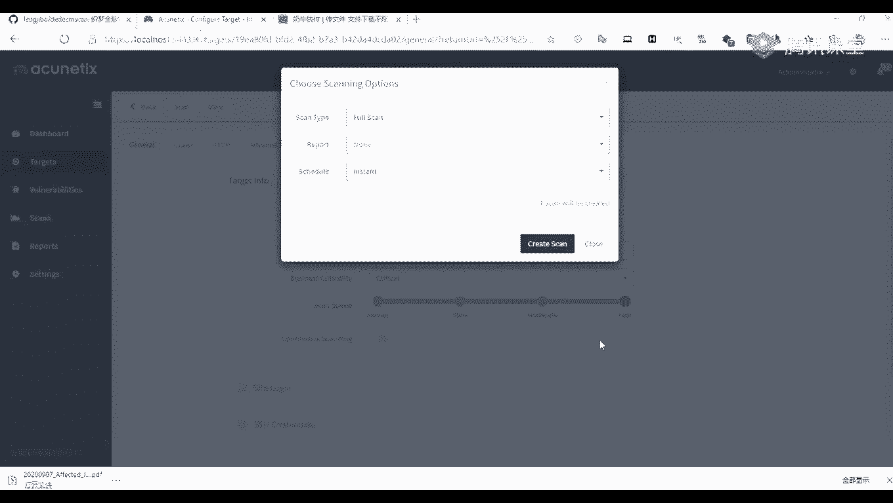

一个扫描车我们点击这里sm就可以了，然后它就会并对我们的一个目标网站进行扫描。

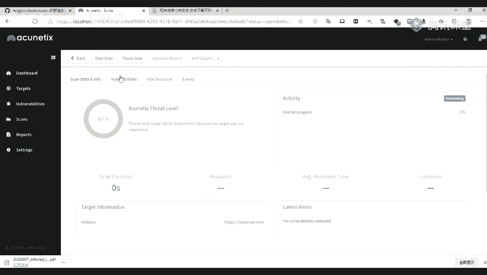

我们这里呢，因为我们机器的一个原因就不进行扫描了。

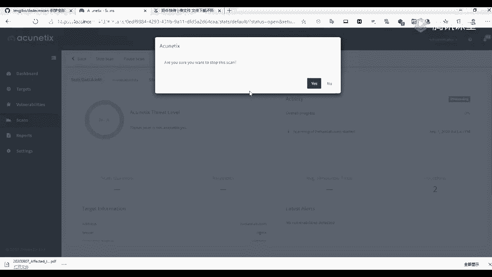

然后第三个，第三个就是我们我们的一个漏洞列表，这个漏洞列表给我们展示了，给我们展示了我们所扫描到的一个漏洞，比如说我们一些d o r s的一些漏洞啊，还有一些其他的，那么我们可以点击某一个漏洞。

就比如说我们点击这个漏洞，点击漏洞里面呢它有一个漏洞的详情，不过那都是一个英文的，我们可以就是找一些，就找一个汉化包去进行一个汉化，不过呢我们在这种一模的话，我们也可以去进行一个翻译一下。

p p p o i s的一个漏洞，没有呢，它会给出我们的给出，向我们展示它的一个http的一个request，也就是他一个请求包，还有一些返回包等等，还有呢就是一些就是我们的一个漏洞，漏洞修复。

这个给我给给出了我们的一个漏洞，修复的一个方法，或者我们选一个xx的一个漏洞，所以这个这个呢就是给出了，我们的一个工具的一个plot，也就是我们的一个工具的一个语句，我们可以看到它。

这里呢它在这里测完这个部分呢，实际上就是我们的一个攻击的语句，还有后面呢就是我们的一个原因包，就是我们再把比如说我们访问这个页面的时候，要插入某一些攻击语句放在这里呢，就给我们返回返回了，给我们。

你要拿，还有就就是一个st ok这里呢也有几个选项，一个呢就是new scheme，就是一个新建扫描到game就是停止扫描，还有一些删除扫描输出报告以及比较结果，比如说我们这里呢。

是我们这里呢是一个以前的一些扫描，我们可以先进行一个new scheme，要去扫描我们以前所扫描的eva站点，或者是我们将我们的一些人。

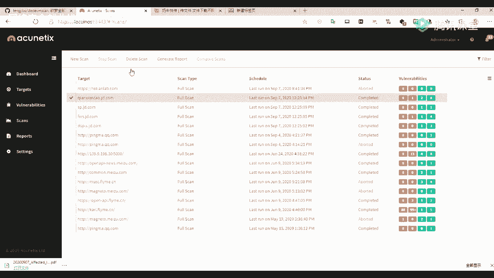

以前扫描了一些站点进行一个删除等等。

还有一些输出也是跟我们前面的是一样的，就是输出报告，还有呢就是一个比较比较结果，也就是说比较我们两次扫描的，一个就是相同的一个站点，两次扫描是不同时间段扫描的一个结果。

比如说我们在今天的时候扫描到了一个漏洞，然后呢我们去通知别人进行一个修复了，然后我们在明天的时候，就是他告诉我们已经修复了，那那我们再重新进行扫描一下，扫描一下呢。

我们再然后将我们的两个结果进行一个对比，要对比呢就可以，对比呢就会它自己会生成一个报告报告，我们将我们这的一个报告进行下载下来，看一下这两次扫描的一个结果，不是这一个是另外一个。

所以呢就会我们将我们的一个报报告，下载下来之后呢，就会将将我们的两个结果进行一个扫描，就是比较，比如说这里呢就是第一次扫描这个青蛙点，qq。com顶马二个呢就是一个第二次的一个扫描。

就是将原来就是立立志扫描的一个就是结果，一些扫描到的一些漏洞进行一个比较，还有一个就是我们的一个定理定啊，报报告这里报告这里呢就是一个report reports，就是这里呢就是我们前面我们导出。

导出的一个报告，就是生成的一个报告，都在在我们这个reports这里都可以看到，那然后呢我们想看一些报告呢，我们就将它进行一些下载下来，我们可以下载了一个pdf的一个文件格式的文件。

可以下载成一个就是导出为一个html的，一个格式的文件，我们点击这个download download，这里呢就可以进行一个下载，还有还有呢一个就是一个设置设置这里啊，还有一些就是我们的一些设置这里。

那我就会一一给大家讲了，因为我们的一个时间关系，我们主要是讲我们前面的一些，就是如何去利用这个工具进行一个扫描，还有呢就是我们我们在激活的时候，如何去去知道我们是否去激活成功能呢，我们就是在登录之后。

我们在这个右上角这个administrator这里，我们点击点开它，原来我们找到这个第二部分这个零件，这里这里呢我们可以看到我们的一个产品，就是这个产品的一个道具的一个时间，我们可以看到是一个到了。

到到了这个2118年来到t的，我们可以可以在这里去看看，我们是否激活成功了，然后呢这里呢我们就讲到这里，我们来讲一下这个这个音量，音量扫描，那为什么要进行一个批量怎么样呢，因为我们在遇到大批量的目标值。

比如说我们可能一个网站，它可能有一些几千个的目标，几千个的一个子域名，这时候呢就需要我们利用一个音量的一个脚本，来进行一个操作，因为我们不可能说每一个，如果说是一个单子的话，我们不可能是每一个嗯。

每一个网站都去进行看，都去看他，因为我们看一个网站，它可能一些功能多，这个功能点比较多的一些网站的话，那你可能要看，你要在上课之前呢，我们先讲一下我们上一节课的内容吧，上一节课呢给大家讲了这个aw v。

上一节课给大家讲了，这个aw vs的一个安装破解，以及它的一个使用的简单的一个使用的方法，它有它的就是它的一个，看一下，其实还有它的一个批量批量的一个小板的使用，然后呢我们我们就是还有同学。

就是我今天看了一下你们的作业，那你们的就是交经是交上来的，同学都已经完成了这一个破解，两个两个软件的一个破解了，如果你们就是还没交作业的那些同学，就是你们有什么不懂的，就是没有没有完成这个破解的。

你可以就是着火就可以在群里就是提问，或者是给我，你给我治疗也可以，然后我帮你们就是远程看一下是什么问题的，然后第二部分呢给大家，我先把这个给关掉，第二第二部分呢就是给大家讲了这个box swit。

你是一个工具，它的一个，放这边，这个工具的一个破解就是安装以及破解，安装的话我们是不用安装了，就安装一个a d k就好了，然后就是安装一个配置java环境，然后直接打开它的那个下包就可以了。

打开下包我们我们破解完了之后，就是我们打开的是这一个，啊比如说我这里我这里有个两个，我们我们的话就是由这是给你们发了两个文件，一个就是它里面有两个文件，一个是box box，sweet road。

就是它的一个运行了一个程序的一个包，另外一个呢就是它的一个破解程序的一个包，可以说是一个破解程序的话，这个一个这个一个load，包括k这个包，就是你们在打开破解完成了之后。

你们打开就打开这个lok是一个包就可以了，双击然后点击运行，关机之后它会打开这样子的一个页面，打开页页面之后，然后点击乱，这里要等一下，有点有点卡，我们点击运行图之后，它就会出现这个页面。

然后我们点击next就可以了，然后呢我们就可以使用这个工具，我们可以把原来的这个给关掉，我们我们我们就可以对这个工具进行一个操作，使用了，然，另外呢还给大家就是点了它的一个使用的一个。

或就是代理的一个抓包，以及我们就是简单的就是安装了一个证书，因为它默认的话是只能抓http的一个包的，还有呢我们需要下载一个证书，用来去抓取那个h t t p s的一个包，后面呢我们还给大家讲了。

就是它的一个快捷方式，就是我们直接使用一个扩展，使用扩展程序来代替，我们就是设置代理，另外呢就是给大家讲了，我们的一个模块的一个使用，就是各个模块就是我们常用的一些模块的使用。

比如说那个plus的一个模块，以及我们的一个intel的就是一个攻爆破，或者说是一个枚举，就是我们这个intel的这个模块呢，都是我们经常是用它来进行一个爆破的，还有就是一个lip这个模块。

这个模块呢主要是用来，其实可以说是一个进行一个东西，存放的一个模块，就是我们将我们的一个数据包，发送到我们这个这个app这里，我们就可以对里面的一个请求包，进行一个修改编辑。

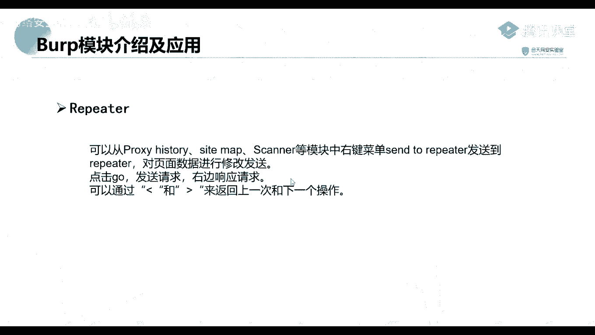

现在我们看回我们今天的一个内容。

今天的我们，我们今天的一个内容就是我们的一个注入神器，sl map，我们在讲这个super map之前呢，我们先来看一下它的一个目录结构，就是第一部分，我们首先讲一下这个sql注入的一个产生的原理。

这一部分呢就是一个sql mate的一个安介绍与安装，第三部分呢就是它的一个功能以及应用，就是如何去使用这个sql map，对我们的一个漏洞进行一个注入，下面呢我们先看一下第一个部分车头。

车头就有的一个产生的原理，首先呢这个思考注入漏洞，是从1998年圣诞节大火以来长盛不衰的，就是在那时候，就是在1998年就已经出现了这个漏洞了，然后到现在呢，我们还是能经常看到这一个接口。

输入的一个漏洞，那么什么是车头注入漏洞呢，也就是说它的一个sql注入漏洞，是将我们的一个sql语句，就是sql一个查询的语句，或者是其他的一个sql语句加入，或者是添加到我们的一个用户的一个输入的。

一个参数中的一个攻击，然后呢，再将这些参数传递给后台的一个sl服务器，加以解析并执行，也就是说可以可以将我们输入的一个数据，就是输入的一个sql语句，去当成传递给后台的一个sql服务器去执行。

这个呢你们可能是有有一点点不懂，不过呢这个没关系，待会你们就是有就是我们实验室里，你们有有就是里面可以对这个漏洞，就是去进行一个读题，下面我们来从代码这个方面，我们来看一下它的一个输入原理。

首先呢它是由于同一个由于是没有过滤，也就是说我们输入的一个，只能将我们直接将我们输入的一个参数，或者说是一个语句直接进行一个执行的，或者说是一个过滤不严，也就是说我们可以对它进行一个绕过。

首先呢我们从这图中的代码可以看到，当代，我们从代码中可以看到，它对我们输入的一个id，并并没有进行一个严格的过滤，也就是这里的一个id并没有进行任何的过滤，就是我们通过一个get方法去你算了。

我不放过你点一下，那从我们就是我们通过一个get方法去，获取我们一个id，但是呢他并没有对我们获取到的这个id，里面的参数的值进行任何的过滤，那么我们就可以他就是输入一些搜索语句，来进行一个查询。

查询我们想要查询的一个数据，这个能不能理解你们，这个可以理解吗，就是讲的这个sql语句的一个注入的一个原理，就是你们就是你们学过这个sql语句的，就是学过学过数据库的话，应该是可以理解的。

也是不能理解挂超过二，哦那没问题的话，那我们就继续了，因为我们这里的更多的是一个，讲一个工具的使用，所以我们对它的一个并没有最大的一个，其他的一些方面并没有进行深入的一个对。

首先呢我们判断的方法我们可以看一下，等我们这一般呢我们对这个sql，这个是判断它是否存在一个sql注入漏洞，我们一般都只用一个单引号进行一个判断，比如说这里呢是之前的一个实例。

就是一个例子是真实网站存在的，我们正常的话我们在这个name这里，这个参数方面看后面，但是一串这个字符串，就是第一个ur l编码的一个字符串，嗯我们可以看到我们在正常的情况下，我们输入的时候。

它它返回的这里是一个正常的一个内容对吧，然后呢我们我们插入一个单引号，就是我们可以看到在这里呢可以看到，我们这里呢是插入了一个单引号，然后呢我们可以看到它后面这里，它返回包这里。

它跟我们前面返回的一个内容是不一样的，返回的不都不一样，之后呢，我们再来看一下，我们再再输入一个单引号，我们在输入一个单引号之后，我们可以看到在这里，在这里呢输入了两个单引号。

我们这里呢注入了两个单引号，然后呢在这里在这里返回的一个内容，也就是跟我们前面明珠带引号的时候是一样的，那么我们就可以说这里呢是存在一个注入，注入漏洞，啊比如说我找个网网站吧。

比如说我们这里有一个看一下就，比如说我们这里呢有一个网站，这个呢是我们用来进行一个练习的一个网站，我们这里有一个网站，我们在输入一的时候，它是给我们返回的，一个是这个是一个正常的，就是回填对吧。

就是给我们返回一个正常的一个页面，并且在我们这里呢大家的一个sql语句呢，也是相当于是这样子的，这是一个select，然后新the flauser where id等于一，where id等于一之后。

它返回的一个内容是正常的，但是呢如果说我们在这里加上一个单引号，单引号，这里呢是不是就会进行一个报错了，那为什么报错呢，我们可以看到我们这里sql语句，这里在这里是不是多了一个单引号。

我们在输入一个单引号的时候，在这里是不是多了一个单引号，那单引号这里就是不是就会引起一个报错，这个可以理解吗，啊然后呢我们在输入输入一个单引号的，是因为在这里输入了一个单引号对吧。

那么我们那怎么将这个单引号给就是闭合掉，或者是去掉呢，我们可以使用一个这样子，我们再输入一哦，好像不是这个，我看一下是不是这个，哦因为因为这个是一个，因为这个是数字型的一个注意。

我们来看一下第二第二个的吧，我们来看一下，因为前面那个是数字使用的，哦因为我们这里呢我们应该是这一个是这一关，嗯我们我们这里先查询一个a的时候，在这里呢是因为他我们输入的是一个字符，字符串。

是它这里呢是一个字符型的一个注入，或者说是一个字符型的一个搜索，哦就是如果是数字型的话，数字型的话，这个语句我们我们在在这里进行一个嘛，这里举个例子啊，比如说我们如果是一个数字型的话。

select新号要l user where i d等于一这个数字，这种呢就是一个数字零的一个看，一会将这，就这样子吧，但他数字性能的它的一个sql语句呢是这样子的。

这是一个select your single lauser，where id等于一，它没有没有利用一个引号进行扩起来了，但是呢如果说一个字符型的话，字符型的话可能就是a。

他就是里面里面的是一个我们搜索的话，我们是搜索一个这样子的一个东西，就是a b c d以a b c d这些，来进行一个开头的，是我们字符型呢是用有有有引号进行引起来的，数字型的话就没有引号引起来。

然后回回到我们这里，回到我们这里，我们在输入一个a的时候，正常有的一个查询的时候，他的一个sl语句是这样子的，我们将在这里，但它是这样子的，然后呢我们在这里，我们在这里再添加一个单引号对吧。

再添加单引号，这里它就会进行一个报错，为什么会报错呢，因为我们这里就相当于，我们在这里输入一个二幺，再输入一个单引号，在这里是不是就多了一个单引号说了，但以后是不是就会引起一个报错，要引起剥脱呢，我们。

那么我们就怎么怎么将这个报错给，就是让他没不再进行一个报错呢，我们这里呢有有两个方法，一个呢是我们可以将我们的这个语句，就这单引号给闭合，或者说我们再增加一个单引号，增加单引号，是不是。

我们就相当于是一个成成为了两两个部分了，这是第一部分，是在这一个，比如说我们在这里再增加一个单引号，我看一下它增加了一个单引号，再增加一个单引号，是不是都没有报错了，但是呢他这里就没有。

但是没有并没有查出一个数据，现在我们可以利用另外一个方法，就是将我们后面的这一个部分的内容给注释掉，怎么注释呢，我们在sql语句中啊，我们有注释注释的一个方法呢，也可以使用一个简简单进行一个注释。

那是什么意思呢，也就是说我们将我们这简简单，后面的一个内容给注释掉了，就是不起作用了，不起作用了之后，在这里呢就相当于是成为这样子了，是不是我们就正常了呀，这是我们可以利用一个简简章。

点检查或者是一个井号给注释，或者是一个井号进行一个注释，我们这里呢可以试一下呃，其实以后点点加我们注意一个点点大的时候，是不是就就会我们这个语句就会正常执行了，这可以理解吗。

简单来说我们就是将我们的一个报错，报错信息给注，将后面的一个信息给注释掉就可以了，好那要是没有疑问的话，我们就继续了，我们这边呢就简单的讲一下，它的一个sql注入的一个原理，以及它的一个判断方法。

下面呢我们来看一下，super map的一个介绍以及安装，首先呢我们来看一下sol map是什么呢，它是一个开源的一个渗透测试工具，它可以用来进行一个自动化的检测，利用这个sql注入漏洞。

获取数据库服务器的一个权限，也就是通过我们刚刚讲的那个sql注入漏洞，来获取一个数据库服务器的一个权限，然后呢它是用一个python python语言写的，所以呢我们如果要使用的话。

我们需要安装一个python的环境，安全的环境呢你们在前面的课已经安装了，我这里呢就不给大家做一个演示了，当然我这里有一个一个是官方的一个网站，还有一个是githu，我们来看一下这个。

这个呢是它的一个官方的一个网站，我我之前呢也给也给大家在预习内容里面，也给大家写了这一个，你们就是将这个下载先下载这个压缩包，然后进行解压就可以进行一个使用了，并不并不用说像其他的那些要激活或者什么的。

没有呢，另外一个呢就是这样的一个别的号，这个呢，是它的一个官方的一个仓库，这里也有一些它的一个安装安装方法，以及它的一个使用方法，还有他在这里呢也做了它的一个版本，运行的一个版本，刚刚我也给我。

我也在我的一个就是网盘里面。

给大家放了一个链接，你们可以也可以在我这里下载。

下载了之后，那是这样子的一个，用充满，啊这个呢就是我我找一个设计，有点解压了之后是它的一个cl map so map，我们可以看到它这里它的一个运行的一个脚本，实际上是使用这个qq map屏py。

我们就运行这个文件，但是呢我们就是说每一次每一次都需要进入到，进入到里面来的话，就是进入到我们文件里面来的话，是不是有一点点麻烦，那么我们就可以为它创建一个快捷方式，怎么创建呢，我们可以新建页面。

新建这个桌面呃，这个右键桌面，然后新建一个快捷方式，新建快捷方式，然后我们在这里呢就是需要我们去填，让我们填入一个对象的位置，我们我们这里呢是为我们的一个cmd，一个cmd的一个窗口，让我带你给我放。

所以呢我们这个右键创建一个快捷方式，然后为这个填入一个cmd它的一个路径，再然后呢我们就是右键属性，在它的一个起始位置，便于我们的一个super map文件的一个位置。

就是说我们在这里填入了我们的一个dmd之后，我们点击下一步，这里呢你可以命名，随便命名，或者是一个circle map，要完成完成了之后，我们在右键右键属性这里最大的一个起始位置，将我们的一个。

这个map的一个路径给放上去。

对我们说用起始位置这里将它放放进去，再点击应用就可以了，你应用之后，让我们就可以在桌面去对它进行一个使用冷门，双击它问题，他在这里呢是直接进就可以，直接进入到我们的那个路径这里。

然后我们输入一个python python，要看你们的一个python是是输入python呢，还是一个直接来一个那个就是多多多版本，一个共存的，比如说我这里是一个多版本的，可以的文件。

我的一个python改为一个python 27，人家输入一个python 2 t单，这里呢就会出现我的一个拉了一个版本后，我们这里的不是这样，然后我们去执行这个python 27。

然后再执行我们的一个sl map，sql map，点py这个文件，听到吗啊，这里少了一个b y g o python prt n o max，原来我们就可以看到它的这里。

这里的一个它给我们显示的一个版本信息，环境变量环境变量，你那个我我我没事了。

环境变量，待会你们也可以试一下，我这里就是我们主要是我们将我们的一个，python的一个环境变量搞好就行了，这个的话都是不重要的，我们也可以就是我们在运行的时候，我们也可以进入到它的一个目录里面。

进行一个cmd，然后去运行它，然后呢我们这里呢有有一个中文的一个手册，中文手册呢也介绍了一个比较很详细的，我这里呢只是给大家介绍它的一个，简单的一个用法，首先呢我们可以看是可以看到。

这里给大家列出了几个参数，一个是杠一曲，上一局参数呢是查看到的一个一个基本用法，以及它的一个命令行参数，还有呢就是一个杠h h，就是查看所有所有的一个用法以及命令行参数。

还有呢就是它的一个刚刚word查看到的一个，版本信息，下面呢我们先来看一下它的一个用法，我们先将我们一一边介绍这个用法，一般来讲这个课，所以呢我们进行一个漏洞的一个检测，漏洞的检测呢。

我们主要是使用一个杠u的一个参数，杠u参数呢在后面呢就是跟我们的一个u r l，或者是一个杠m参数，也就是我们可以去批量去对我们的一个uri，进行一个检测，注入就是检测它是否存在这个注入漏洞。

比如说我们这里杠我们来给大家测试一下。

要passion 2。7，你要circle map，杠优杠u呢就是跟我们的一个url。

后面跟我们的一个u r l，这里大家双引号，然后这个这里呢就是跟着我们的一个。

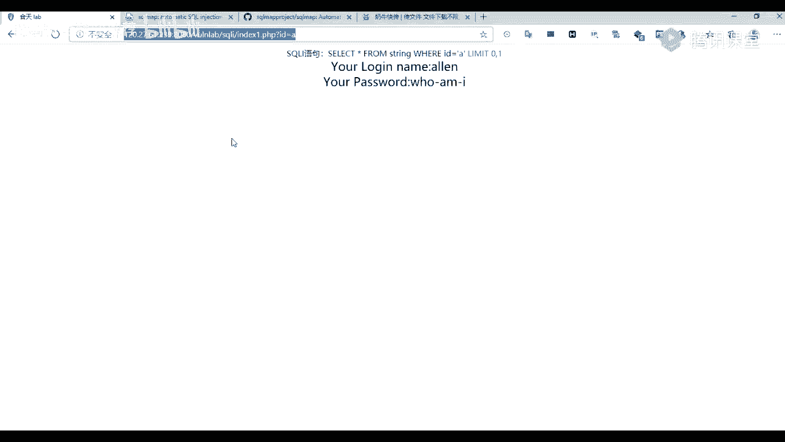

跟我们的一个ui好，就是我们的一个参数的一个值，这里因为我们ui ul，要进行回车，回车呢。

在这里呢就会给我们进行做一个检测，检测的话在这里呢大概大家询问我们，其实如果说我们不懂这些英文什么意思的话，我们也可以进行一个复制，那这个意思呢就是告诉我们，我们后端的一个数据库。

看起来呢现在是一个mysql的，看起来像是一个mysql数据库，然后你要再询问我们是否去跳过测试，其他的一个数据库。

我们这里呢也可以去翻译一下，在这里呢是别问我们是否要跳过，设置其他的一个数据库。

啊然后然后呢我们就确定就好了，最后一个y就确定，然后这里呢我们就是看不懂的话。

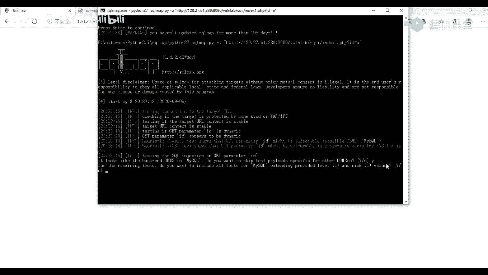

那我们我们也可以继续进行一个复制，看看它是一个什么意思的，刚刚在这里来询问。

我们是否要包括所有针对一个mysql的一个测试，我们这里呢也可以可以就选个n n也可以，这里我们可以就随便去，就是要是我们不懂使用的话，我们都都可以去多进行一个尝试，就是可以输入y。

第一次输入输入y看看一下会是什么结果，你要输入ne看一下什么结果，那到这里大家询问，我们就检测到这个id的这个参数是脆是脆弱的，也就是说它检测到了这个id的这个参数，可能是存在一个漏洞，然后面这句话呢。

就是问我们是否要还要去测试其他的一个参数，我们这里呢就不进行测试其他的一个参数了，我们这里呢就是测试一个id的一个参数，现在我们都有一个n注意n这号，那这里呢就是我们的一个检测的结果。

那这里呢就是检测到了它的存在了一个注入，就是存在了一个get型的一个注入，然后呢如果是我们使用的一个杠杠m参数，二七秒co map。

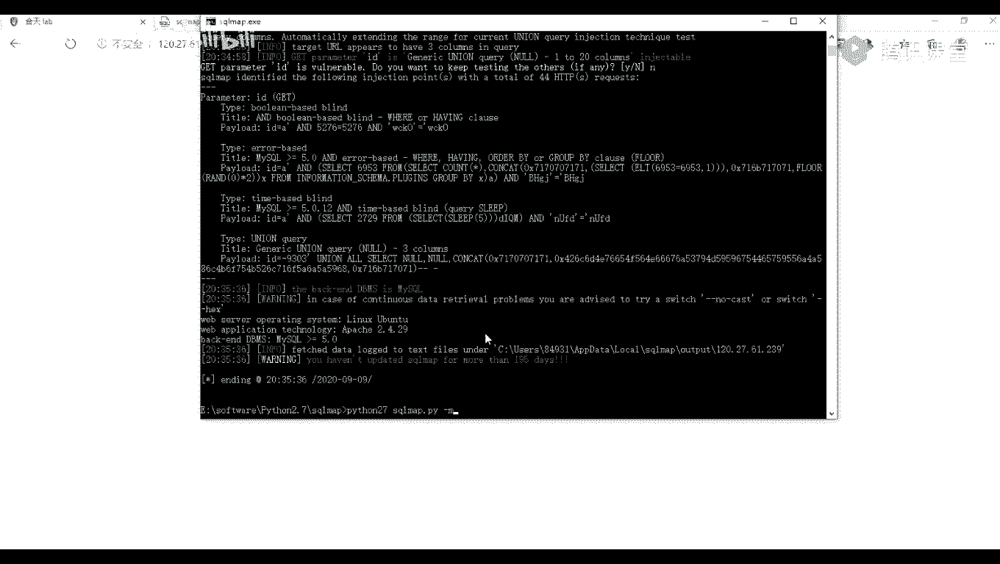

杠m杠m参数呢，我们可以就是将我们的一个u i l复制到一个，文文本里面有说文复制复制到这里，要一行一行一条，比如说这里是一个一，还有一个二，比如说比如说这样子，如果我们是自己单加一个。

就是我们一一行一个ui。

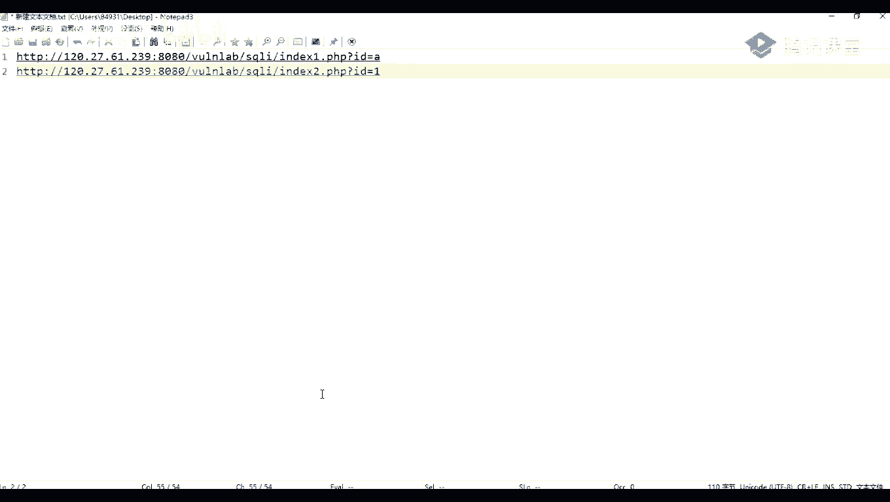

如果我们使用的一个杠m参数，就是进行一个批量的一个检测。

下面呢我们检测到了它存在的一个操作，那么我们在这怎么去进行一个利用呢，首先呢就是一个第一，第一步就是枚举到的一个数据库，这里面没举到的一个数据库呢，就是我们要注意的时候，那就是一个地方。

就是我们后面的是一个杠杠，bp s刚刚db刚刚dbs，也就是说枚举所有的一个数据库，也就是在我们的这个，数据库系统里面的一个所有的一个数据库。

哦这个呢就是就是它的一个测试的一个等级。

比如说我们这里呢是一个也，因为我们一个注入的话，我们并并不是并并并不仅仅只有一个get，或者是这个post，我们还有一些我们您的学友，也可能会存在一些cooki cookie注入。

还有一个h t t p桃注入，h t t p头部作用就是这是什么意思呢，就是说如果我们我们注入的一个参数，就注入点并不在这这里面，get或者post里面就是并不在这里，那么他们就大。

如果说在这个cookie的话，如果我们选择你刚刚说的这个，那么他就会去测试其他的一个地方，动一下，比如说他的那个level，就是你就是那个等就是等级的level，那里它一共有五个五个等级。

在默认情况下呢，这个事后map只支持我们的一个get，还有post参数的一个注入测试，但是呢如果能当我们这个level大于等于二的时候，就会测试它的一个htp http里面的一个cookie。

以及一个usa转，还有ak follow diva头等等，这个呢你可以看一下那个中文手册，里面也有一个介绍，可以设置，但是我们对啊，就是你你扫描，就是跟我们前面讲的一个扫描器一样，就是aw v s一样。

你你设置的就是越越慢，那就是我们不是有一个选择码可以设置快的，还有一个慢的，如果你设置五的话，那就会走得很慢，但是呢它就会可能就是走的比较详细，就是我们我们可以根据我们我们的一个需求，来进行一个设置。

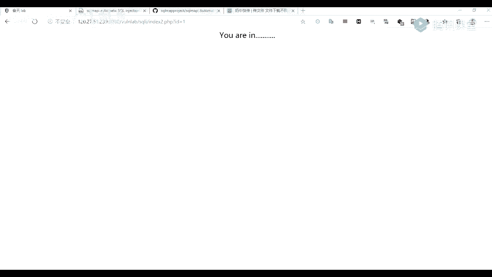

好下面呢我们来看一下我们的一个继续，我们不能管，原来我们在凹面加上一个刚杠杠，dbs就是我们每枚举我们当前的一个数据，那个数据库管理系统里面的所有数据库，我们可以看到我们这里呢已经给我们枚举了。

我们的一个所有的一个数据库。

存在的一个数据库，这里呢跟我们的一个是一样的，这里，哦对诺亚呢是一级默认为一单就可以测试。

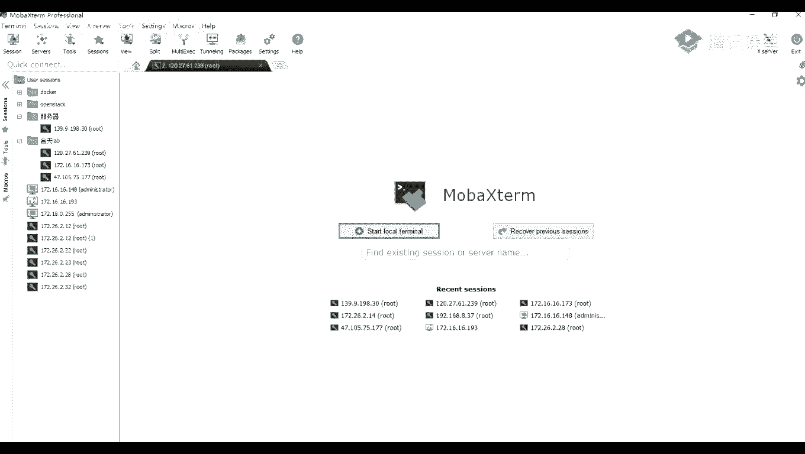

我们get还有post参数里面的一些参数，比如说我们这里mysql杠u o的上一，搞错了，mysql can u fold，上新，好比如说我们进入，进入到了我们这个数据库这里了，然后呢。

我们来看一下它里面的一个所有的一个数据库，这一应该背的背。

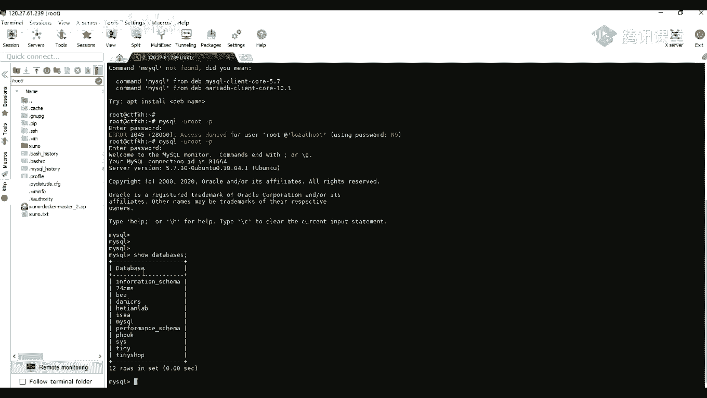

我们这里可以看到呢，它这里它的一个数据库跟我们跑出来的，这里呢是一模一样的，在这里呢是12个，我们跑出来的也是12个，原来我们读了好，我们的这一个所有的一个数据库之外，我们还可以去跑。

我们当前当前的一个当前所使用的一个数据库，就是我们将我们的一个课堂地点改为一个q，r e n t杠dd这个参数，kn这个参数，q an杠b b这个参数就是没几没，就是查询。

我们当前当前这个网站所使用的一个数据库。

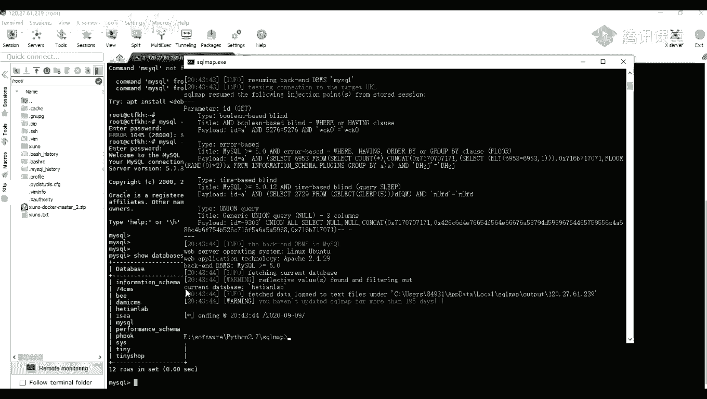

现在我们这里呢可以看到在在这里在在在这里，我们已经注册了一个它的一个数据库名字，当前的一个数据库的名字和一个和天lab，那么我们在实际发s i c的时候啊，我们就是跑出这个数据库名就可以了。

就是我们在使用这个super map，还是一个人工进行一个输入的时候，我们都是我们一般来来一般来讲的话，我们跑出了这个数据库名就可以提交了，并并不再需要进行后面的一个e注入了。

那当我们注入了一个注入出来，跑出了一个数据库之后，我们就还还可以去对它进行一个数据表，就是跑它的一个数据表，数据表中的，我们前面的一个数据库呢是一个杠杠d b s。

然后数据比较数据表呢就是一个杠杠黑保tables，就是一个表表明对吧，这个这个杠b杠b参数就看大学第一，这里后面呢就是跟我们上一步，美女到的一个数据库名，比如说我们上一部。

上一部是不是枚举到了一个和天lab，那么我们嗯这里报到的一个数据表呢，就可以将我们的那个数据库名就是写写出来。

比如说我们比如说我们这里，我们前面是，前面我们跑出了一个天lab，然后让我们更低更低，也就是我们的一个database，就是数据库嘛，要和和天，然后后面刚刚一个刚刚黑宝黑宝。

他就会对我们的这个数据库里面的一个表，进行一个查询，现在我们可以看到我们查查到了这个八八个表，一个user，他们以及email liquid等等，那我们我们跑出了一个表名字。

我们是不是还可以跑它的一个表列，就是它的一个列名。

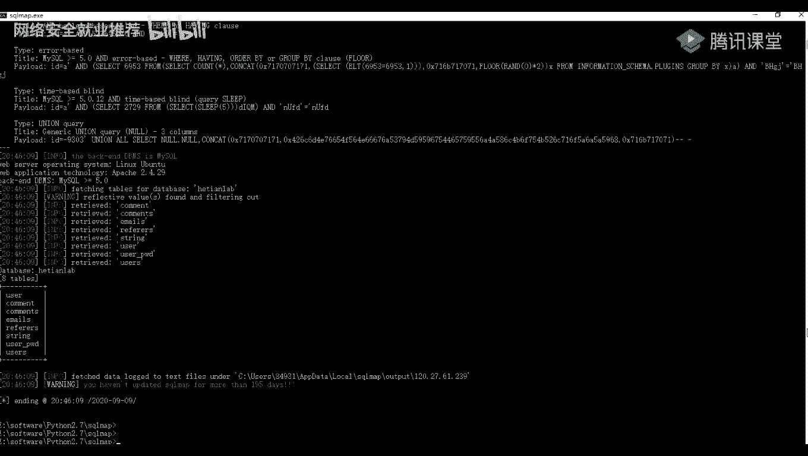

那你比如说然后呢我们可以在这里，我们前面跑出了一个表明有杠杠t，杠t呢就是我们跑出来的一个前面的一个表明，比如说比如说我们这里呢好一个u，这里是一个user。

是不是这个user就是我们前面跑到的一个表明，那我们在列宁列宁是哪一个呢，就是colin c o l u m m n x，这个呢就是从它的一个列名，好内名之后，我们来看一下。

这里呢可以跑到它存在的三个类，分别是一个id password，一个以及一个username，啊对这些呢是自己自己添加的，就是那个呢是我们用来练习的一个网站的，这个你你你在上一个的时候。

应该也也有做过这一个吧，对这个是不是给我们做一个练习的，现在我们跑出来这个id还有一个excename，password之后，password之后呢，我们还可以对它进行跑出，它里面的一个具体的一个数据。

那么怎么要到了这一步呢，也就是还要再继续的话。

也就是我们所做的一个拖库，就在前面，我们前面这里呢我们跑出了它的一个枚举，得到了它的一个数据表列，然后呢我们这里呢有还有一部是拖库，拖库这里呢我们在挖s i c啊，或者是做一个做一个极大的一个漏洞。

挖掘的时候，我们这个呢就尽量不要去使用，除非说我们是在做一个渗透的项目，就是别人有一有的一个授权要，并且说明这个情况了之后，我们才可以对这个进行一个使用，不然的话我们这个拖布这个杠杠杠。

这个命令就是我们最好是不要对它进行使用。

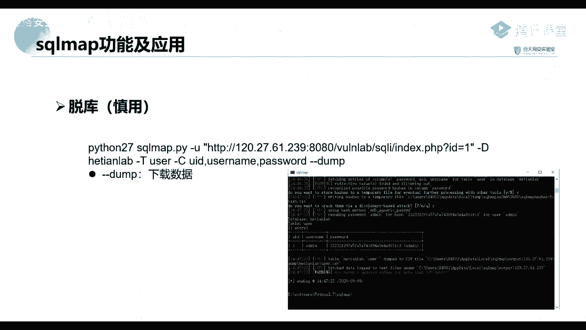

因为这个很很容易就，那个被抓进去了，那我们怎么我们前面呢我们跑到了它的一个，跑到它的一个数据表列，然后我们杠七杠七呢，后面就是跟我们的一个列列名，比如说我们这里的一个i p id，要user name。

你要打好大的还是word，后面就有一个杠杠杠好。