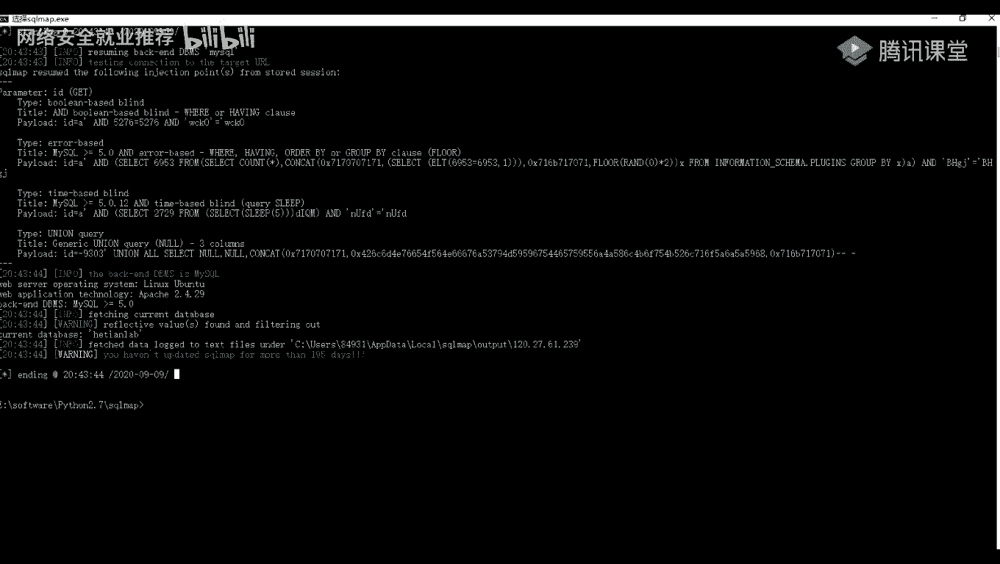

# 课程P44：第5天：WEB漏洞扫描器-AWVS及nmap 🛡️

在本节课中，我们将要学习两款重要的网络安全工具：AWVS和nmap。我们将首先了解什么是漏洞扫描器，然后详细介绍AWVS的安装、破解及核心功能。接着，我们会学习nmap的基本概念和使用方法。课程内容力求简单直白，适合初学者理解。

## 第一部分：漏洞扫描器及AWVS介绍 🔍

上一节我们介绍了信息收集，本节中我们来看看如何利用工具发现漏洞。漏洞扫描是一种基于漏洞数据库，通过扫描等手段，对指定的远程或本地计算机系统的安全性进行检测的行为。也就是说，我们通过扫描手段，对上一节课收集到的子域名进行安全脆弱性检测，以发现可利用的漏洞。

以下是常见的漏洞扫描工具分类：

*   **针对某类漏洞的工具**：例如，针对SQL注入的sqlmap工具，可以检测网站是否存在SQL注入漏洞。针对Weblogic的WeblogicScan工具，内置了多种漏洞检测脚本。
*   **针对系统应用层的工具**：例如Nessus，常用于扫描系统漏洞。
*   **针对某类框架的检测工具**：例如针对Struts2框架的漏洞检查工具。
*   **针对Web服务的综合工具**：例如Burp Suite（不仅是抓包工具，也可用于漏洞扫描）、长亭科技的Xray等。

**AWVS**（Acunetix Web Vulnerability Scanner）是一款知名的网络漏洞扫描工具。它可以通过网络爬虫测试网站安全，检测流行的安全漏洞，如SQL注入、XSS等。在11.x版本之前是客户端工具，11.x之后改为通过浏览器访问的Web形式。

AWVS的功能特点包括：
*   **Web扫描**：核心功能，对Web安全漏洞进行扫描。
*   **爬虫**：爬取网站目录结构。
*   **端口扫描**：扫描Web服务器端口。
*   **子域名扫描**：利用DNS查询发现子域名。
*   **SQL注入工具**：发现SQL注入漏洞。
*   **HTTP请求编辑与重放**。
*   **模糊测试工具（Fuzzer）**。
*   **Web认证破解工具**。

## 第二部分：AWVS的安装与破解 💻

上一节我们介绍了AWVS是什么，本节中我们来看看如何安装和破解它。AWVS是收费软件，因此我们需要使用破解版。

安装过程与常规软件类似。关键步骤包括设置登录邮箱、密码以及Web访问端口。安装时可以选择是否允许远程访问。

破解步骤如下：
1.  下载安装包和破解包。
2.  将破解包（通常为两个文件）复制到AWVS的安装目录（默认路径通常为 `C:\Program Files (x86)\Acunetix\` 下的相关文件夹）。
3.  以管理员身份运行破解程序，并按提示随意填写姓名、公司等信息即可完成激活。
4.  验证激活：登录AWVS后，点击右上角`Administrator` -> `License`，查看许可证到期时间（如显示为2118年），即可确认激活成功。

## 第三部分：AWVS功能介绍与应用 🚀

上一节我们完成了AWVS的安装，本节中我们来看看它的主要功能界面和使用方法。

AWVS的Web界面主要分为以下几个模块：
1.  **仪表盘 (Dashboard)**：展示漏洞数量分布、扫描任务进度、存在漏洞的目标站点排名等信息。
2.  **目标 (Targets)**：管理待扫描的网站目标。可以添加、删除、扫描目标，也可以将目标分组或导出报告。
3.  **漏洞 (Vulnerabilities)**：列出所有扫描到的漏洞详情，包括请求包、响应包和修复建议。
4.  **扫描 (Scans)**：管理扫描任务，可以新建、停止、删除扫描，比较两次扫描结果，或导出报告。
5.  **报告 (Reports)**：存放所有已导出的扫描报告，支持下载为PDF或HTML格式。
6.  **设置 (Settings)**：进行各项系统设置。

**新建扫描任务**：
1.  在`Targets`页面点击`Add Target`。
2.  输入目标地址（URL或IP）和描述。
3.  设置扫描优先级和速度。
4.  对于需要登录的网站，可以配置登录凭证。
5.  保存后，点击`Scan`按钮。
6.  选择扫描类型（如全面扫描、仅高危漏洞等）、报告格式和扫描计划（立即、定时或循环）。
7.  点击`Start Scan`开始扫描。

**批量扫描**：
当目标数量很多时，可以使用批量导入功能。
1.  准备一个CSV文件，每行格式为：`目标地址,描述`（例如：`http://example.com,示例网站`）。
2.  在`Targets`页面点击`Import CSV`，选择文件导入即可。

## 第四部分：SQL注入原理与sqlmap介绍 🗃️

上一节我们介绍了AWVS的使用，本节中我们来看看另一种常见的攻击方式——SQL注入，以及自动化工具sqlmap。

SQL注入漏洞是将SQL语句插入到用户输入参数中，并传递到后台SQL服务器加以解析执行的攻击方式。其产生原因是程序没有对用户输入进行严格的过滤。

**判断方法**：通常通过输入单引号`‘`来测试。如果页面返回错误，或与正常输入、输入两个单引号`‘’`的返回结果不同，则可能存在SQL注入漏洞。
*   **数字型注入**：SQL语句类似 `SELECT * FROM users WHERE id=1`
*   **字符型注入**：SQL语句类似 `SELECT * FROM users WHERE name=‘admin’`
*   **闭合与注释**：通过添加`‘`、`‘’`或使用注释符`--`、`#`来尝试闭合SQL语句，使其正常执行。

**sqlmap**是一款开源的渗透测试工具，用于自动化检测和利用SQL注入漏洞，从而获取数据库服务器权限。它由Python语言编写。

## 第五部分：sqlmap的安装与使用 ⚙️

上一节我们了解了SQL注入原理，本节中我们来看看sqlmap的安装和基本用法。

sqlmap无需安装，只需配置好Python环境（建议Python 2.7），下载解压即可使用。为了方便，可以创建桌面快捷方式，将命令行的起始位置设置为sqlmap的目录。

**基本用法**：
*   `python sqlmap.py -h`：查看基本帮助。
*   `python sqlmap.py -hh`：查看详细帮助。
*   `python sqlmap.py --version`：查看版本。

**漏洞检测**：
*   `python sqlmap.py -u “http://target.com/page?id=1“`：检测指定URL是否存在注入。
*   `python sqlmap.py -m urls.txt`：批量检测urls.txt文件中的多个URL。

**信息枚举与利用**（**注意：仅限授权测试环境！**）：
检测到注入点后，可以进一步获取信息：
1.  **枚举数据库**：`python sqlmap.py -u “URL” --dbs`
2.  **获取当前数据库**：`python sqlmap.py -u “URL” --current-db`
3.  **枚举指定数据库的表**：`python sqlmap.py -u “URL” -D 数据库名 --tables`
4.  **枚举指定表的列**：`python sqlmap.py -u “URL” -D 数据库名 -T 表名 --columns`
5.  **导出表数据（拖库）**：`python sqlmap.py -u “URL” -D 数据库名 -T 表名 -C “列名1，列名2” --dump`
    **警告**：`--dump`操作会导出真实数据，在未授权情况下使用属违法行为，务必谨慎！

**常用参数**：
*   `--level`：测试等级（1-5），等级越高测试越全面（如包含Cookie、HTTP头注入测试）。
*   `--risk`：风险等级（1-3），等级越高测试语句可能对数据造成的影响越大。

---

**本节课总结**：
在本节课中，我们一起学习了网络安全中两个重要环节的工具使用。首先，我们掌握了Web漏洞扫描器AWVS的安装、破解和基本操作，了解了如何用它来发现网站的安全漏洞。接着，我们学习了SQL注入的基本原理，并掌握了利用sqlmap工具进行自动化SQL注入检测和信息枚举的方法。请记住，所有技术都应在合法授权的范围内使用，用于提升系统和网络的安全性。