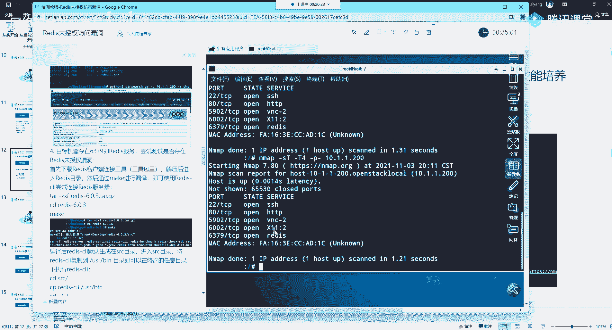
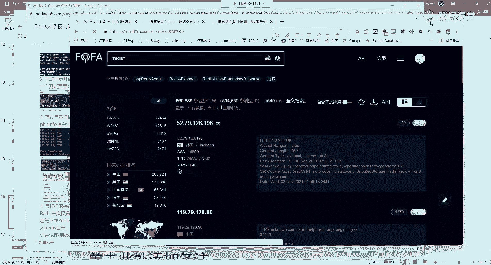
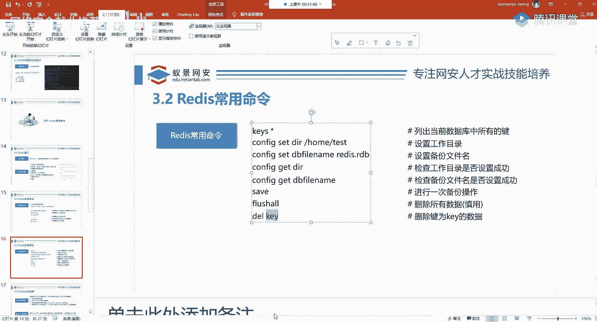
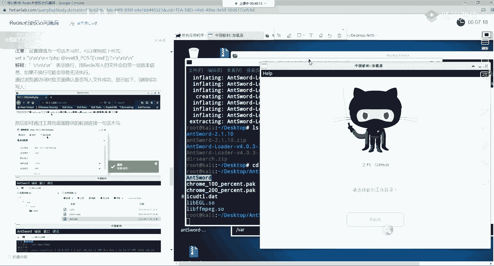
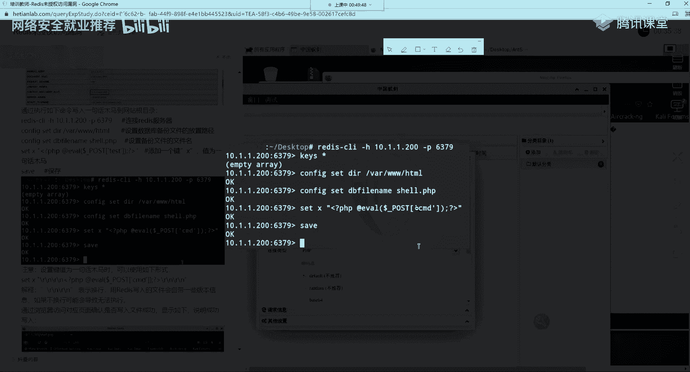
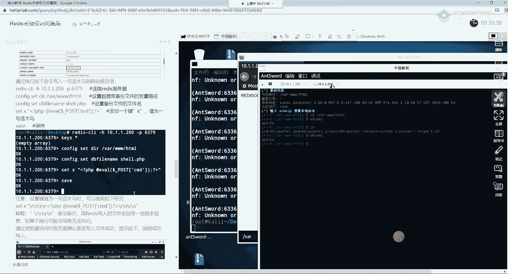
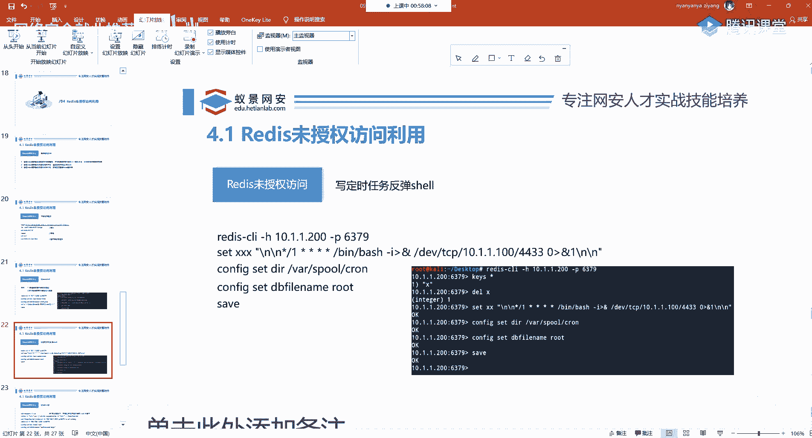

# P47：第11天： redis未授权访问漏洞介绍 - 网络安全就业推荐 - BV1Zu411s79i

首先还是欢迎大家晚上准时来听课，今天我们开始新的内容，叫做未授权访问，在未授权访问，不论是实际的应用中，还是各种组件也都经常存在，那这个漏洞是什么意思，给大家先讲一下，未授权访问很简单。

比如说一个网站的后台，它本来是要你输入用户名和密码，才能够访问，但是你现在不需要任何凭据信息，就能够直接的访问后台，或者是能够绕过这个凭据的验证，去直接访问后台，那这种漏洞我们都称之为未授权访问。

那未授权访问造成的原因有几种，第一种就是它这个开发人员，水平不高 没写好，那在业务，一个公司的业务非常多的话，就经常出现这样那样的漏洞，而他可能是采用的前端认证，也就是说这个验证的模式。

它是写在JavaScript里面的，那我们就可以采取一些绕过方式，那第二种出现未授权访问的情况，就是这个韵尾它配置的时候，没有配置好，也就是我们今天要讲的第一个，Redis未授权访问，这个是非常常见。

并且经常和其他的漏洞一起，打出组合拳，获得目标的命令执行权限，OK 那今天我们就来介绍一下，有同学说我不知道这是什么东西，没关系 我们一步一步的来，保证你能够理解，那我们直接跳到课程的正式内容。

那今天我们首先就是讲解这个Redis的未授权，然后是讲那个Docker，这两个东西是一个典型的，首先这个未授权访问的这个介绍，我刚刚已经做了一个简介，那这边有官方解释，就是我们可以理解为。

需要权限认证的地址或页面配置不当，导致其他用户无需认证授权，就能直接访问，从而引发重要的权限，就是这样一个权限绕过，那一般呢在学校中，尤其是学校中经常会出现这个漏洞，就像以前我去看那个EDU的时候。

有部分的学校，它的那个登录平台，会让你选择相应的角色，就是你是登录管理员还是登录学生，那我们就可以通过BP抓包，把我们的角色进行更改，比如说管理员，他的一个角色编号为0，而普通学生为1，教师为2。

那我们通过抓包，把我们本身应该是1的，这个就是学生，他的编号为1，我们手动改成0，然后把这个包呢放出去，你会发现你登录了管理员的界面，这些漏洞还是非常常见的，但是现在安全是越来越重视，这些能不能发现。

还是取决于大家的信息收集，这里呢我们就来看常见的这些未受权访问，非常多呀，有Redis、Docker、MongoDB等等，JBoss、VSA等等，这些东西都是啥呢，这些东西有很多，第一种叫做服务。

服务很好理解吧，像MySQL、像Apache，像RDP、远程连接，这些都是服务，第二种呢是框架、组件，什么是框架呢，就比如说像ThinkPAP，像Java的Spring、Struct2。

这些都是属于开发框架，那另外一种呢叫做CMS，CMS叫做内容分发管理器，什么是CMS，这里大家不要记啊，如果你听不懂的话，我们后面遇到了还会再讲，CMS是什么东西，首先大家要想，你去创建这些网站的人。

不一定都会代码是吧，现在不需要你懂任何的代码，你都可以搭建自己的博客网站，使用一款叫WorldPress，这样一个CMS去搭建，我们只需要去在鼠标点击，我们想需要的主题，以及呢发布我们的博客。

就可以自定义一个非常美观的网站，这些我们统称为CMS，就叫做建站系统，而这些呢都可能存在未授权的访问，那今天呢我们就举前两个典型的例子，来给大家了解，因为这些组件实在太多了，你去在那列。

你列一天也列不完，那我们就讲这个典型的，也是最常遇到的，首先呢我们来讲这个Redis，在讲这个之前，我们要了解Redis它是什么东西，Redis它是一款数据库，这个数据库跟平常我们使用的，像MySQL。

像SQL Server，像Oracle，有很明显的区别，首先呢Redis它是一个基于内存的，一个数据库，有同学说这个基于内存干啥，如果你学过开发，学过加发开发，应该都使用过Redis这样一个数据库。

如果你说老师我没用过，没关系，这里我们不要费用，你就知道它的默认端口是6379就行，这是它的默认端口，那其他的一些服务呢，比如说像MongoDB，MongoDB也是一款关系性数据库。

它的一个默认端口是27017，而其他的呢，比如说像Docker，它是2375，MySQL是3306，我们下面呢就先来看Redis，OK，首先呢你怎么从一个这样一个，比如说你拿到一个目标。

你怎么判断它有没有Redis的一个开启呢，我同样的去扫描它的端口，就是用nmap去扫它端口。

扫这个6379呢，有没有打开，如果打开就代表啊，它是开启Redis服务的，然后我们就可以进行一系列的攻击扫描操作，我们现在先用实验机给大家展示一下，这里呢，有同学在客户的时候给我反映。

我们的实验机不会用是吧，我来给大家通过这个演示操作，给大家讲一下这样一个实验机应该如何去使用，首先呢，这个和天网实验的实验机，它是不能够连接互联网的，大家一定要清楚，就你在里面打不开百度。

也连不到外面的这个网络，是因为呢，如果让你连了网，那大家呢，就会使用这里面的一些工具，对其他的网站发起攻击，到时候这个公安部门找上门来，那用的是谁的IP啊，那肯定是我们网安实验室的IP是吧。

到时候解释不清，这个也不允许这样去搞，OK，那所以说这里面都是做了内网隔离的，你是不可能访问互联网的，那第二点呢，就是大家在做实验的时候，一定要仔细的阅读这个指导书，这指导书呢，嗯。

我们可以按这个小扳手，它这个小扳手点击指导书啊，它就能跳出来了，在这边，然后在这个环境中所需要使用的脚本，都会放在这个链接中，这个链接你是不能在外面打开的，懂吧，就是你自己的浏览器打不开。

你只能在公积机中去访问这个链接，如果你需要这里面的脚本的话，你可以自行到Github上面搜索，或者是问我要具体的关键的脚本，我也会发给大家，也会发给大家，首先呢，我们来看，这这机器呢，是分为两台机器。

一台是公积机，就是Kali，它的地址是10。1。1。100，是这个地址，另外一台机器是我们的靶机，上面安装了Redis服务，有漏洞，它的地址是10。1。1。200，我们可以在这边呢。

也能看到它一个Attack，一个Target，OK，那么首先呢，要确定目标机上面有没有开启6379，这个端口还是老规矩，用我们的这个神器NVAP去扫描，NVAP相关的参数。

大家一定要记住一套你所使用的标准，而不需要进行全部的记忆，因为它无非呢，就是这样几个，首先我再给大家回顾一下，首先-S-T，这个意思呢，代表扫描的技术，就是Scan技术，扫描技术，叫做Scan TCP。

就是以TCP的方式进行扫描，然后面呢，跟上T4，这个T4呢，代表Time，时序的意思，从1到5，越大代表越快，越小代表扫描的越慢，我们通常使用的是4，叫做Fast Scan，快速扫描，这两个参数。

我相信大家都能记住，我就不再重复了，然后是-P，-P呢是指定你想扫描的端口，如果你不加这个参数，NVAP会自动扫描常见端口，如果你加了就可以指定，比如说扫描，6 3 7 9，中间不要加上空格。

直接写就行，然后面呢，可以直接跟上我们目标的地址，10。1。1。200，我们回车，它就可以正常扫描Open，但是我们平常，并不会去指定单一端口去扫描，而是指定一个端口组，比如说我想扫描1到1万端口。

直接去写1至1万，这样就扫描了，如果你说，我想扫描全部的端口，有几种方法，大家应该猜都能猜到，就是1到65535，这是一种，那第二种呢是更简单的方法，就是将这个1到6535换成个杠，这样也是可以的。

给大家讲NVAP的技术使用方法，相信大家听到这里，应该不会再忘了吧，如果你忘了的话，就敲个两遍，不要求你敲三遍，两遍自然而然就记住，你关键是要知道，这每一个参数，它代表什么意思，去理解性记忆。

就像我们去学习英语一样，你不可能去死记的硬背是吧，要根据它的一个语义，去了解，那我们从中可以看到，它开启了80以及6379端口，那每一个端口呢，又对应的有服务，比如说22端口有SSH远程连接服务。

80端口我们的网站，超文本传输协议，http，5902呢开启的是VNC，VNC呢也是一个远程桌面的协议，一般是用在这一个Linux操作系统上面，可以搭建VNC服务。

当然我们的Windows也是完全可以的，然后这些服务呢，并不是我们今天要讲的内容，我们今天要搞的是这个Redis。

Redis，OK我首先再回到PPT中给大家讲解一下。

我们通过扫描之后，下面给大家先了解一下Redis，那Redis呢，它所在开发中做的操作，正在面试的时候，经常有面试官去问你Redis是干啥的，就像大家去学一些东西，像ThinkPAP的漏洞。

你学到最后都不知道TP，它是做什么的，它有什么用，那这样的一个学习呢，其实就是我们俗称的嚼稳小子，你几乎就是对概念，对整个的安全体系框架不是太了解，首先我们的Redis啊，它并不像这样一个MySQL。

存储这种像硬盘中存储数据，比如说呢，MySQL经常，这个同学说得非常对啊，你百度百科就能搜到，并且Redis在菜鸟教程也有非常详细的过程，如果你懂开发应该都知道，而这个Redis呢。

它并不是存储什么账户密码，它首先呢就是开发的时候，相当于是一个内存缓存一样，比如说我们去搜索，搜索的时候像微博的这个热搜，这个热搜呢，它其实就是存储在Redis中的，它通常呢是用于这个基础缓存。

计数器实时的系统等等，就是这些，这是它最常使用的一个功能，并不是永久性的这个存储，我们都知道内存啊，它是一个通电存储，就是断电之后就没了，就没了，所以说它并不是一个持久性的数据库，OK。

那我们下面呢来看一下Redis的一个连接，首先Redis，我这里先给大家讲清楚，保证大家能够理解通，首先Redis，上一款服务在很多的机器上面都有，但是Redis默认的监听端口是属于这样一个，127。

0。0。16379是属于这样一个状态，这个状态是什么，就是它监听在本地端口上面，监听在本机上面，我现在请问Redis监听在这个上面之后，一个黑客从互联网能连接他吗，大家可以告诉我。

现在你看到了这样一个监听，一个黑客能连接吗，你想一想，连接不了，为什么连接不了，因为它这个是本地地址，就是Redis他所在机器的地址，你连不了，懂吧，你一访问就是你自己，你怎么能连别人呢，是吧。

连不了的，但是Redis的配置，特别是网上的那些教程，大家在搭建Redis的时候，经常不是靠一个服务器，而是很多个服务器，很多个Redis形成一个主同关系，那这时候就会有人，有开发人员会百度搜索。

这Redis怎么开启远程连接，他会在百度搜索这个东西，这个时候百度的像CSDN，这些博客就有很多很坑的人，他会去写，你去配置Redis，允许远程机器访问，那这个时候呢，我们这些懵懂的这些开发人员。

他根据CSDN的配置，把这个Redis呢，开放在了这个地方，我先给大家讲原理，他开放了在四个0上面的6379，首先四个0代表所有的IPv4地址，他就代表我们是监听在了，整个的一个机器上面，所有的接口中。

那通向互联网的接口呢，同样也开启了6379的一个监听，那现在一个外面的这样一个黑客，他去访问能不能访问到呢，就能访问到了，OK，这就是一个缺陷存在，本身他是不允许外网去连接的。

但是现在这个Redis经过了这样一配置之后，他就允许远程连接，并且Redis有个很坑的地方，Redis默认是没密码的，Redis默认是没有密码的，就导致了很多人去装Redis。

特别是去做那个Python的时候，他就使用无密码，就觉得你又连不上来是吧，我设密码干什么呢，是吧，你又连不上来，所以就会导致这些缺陷的存在，那我们下面就来看，如果他开启了远程连接，我们应该怎么去连。

首先就是要用Redis的客户端，叫做Redis-cli，cli是client客户端的前三个字母。

客户端前三个字母，那我回到实验机给大家演示，首先呢，这样一个cli中，他默认是没有Redis客户端的，我们需要安装，怎么安装，复制他，复制他之后啊，点这个剪切板，然后给他粘进去，保存，粘到这里面。

我们使用简单的命令，比如说像wget这样一个下载命令，把它下载下来，下载下来之后啊，为了方便，我把它移到桌面好吧，把它移到桌面，稍等一下，把它移到桌面，好移到桌面之后啊，现在怎么去解压他呢。

解压他也是非常简单啊，解压他也是非常简单的，解压他呢，我们只需要输入unzip，un的话就是相当于是反着操作嘛，zip就是我们常用的压缩包，我这样呢，把它开保健补全把它解压出来就行，解压出来之后啊。

我们就能看到还是有四个压缩包，就分别是zip，还有一个Tar包，那我下面呢，这一个redis的客户端就在这个Tar包中，然后我们现在把它给解压出来，就是Tar-xzvf，这些是Linux的基础命令。

如果大家不清楚的话，你可以在菜鸟教程中去自己学习Linux，或者是你完全不用担心，还是那句话，大家不用刻意的去学习，敲两遍，你的手自然就记住了，然后我们回车，我们解压出来，解压出来之后。

我们cd到这个redis这个里面，然后mac，mac呢，就是调用它的一个编译，因为这里的redis是语言码，就是都是c语言代码，我们需要把它编译成可执行程序，你直接输mac就行。

那这些操作其实在指导书上面都有写，都有写，我只是给大家重复操作一下，OK，它编译呢是需要一定的时间，我们现在来继续给大家讲，首先redis它的一个，一个结构呢，是我们最常见的建制队，就是一个建什么是建。

就是相当于一个key value，我写给大家吧，就是这个东西，建制队大家可能有的同学基础薄弱，薄弱的话，他就是理解不了，我就给你写，就比如说什么意思呢，比如说一个name，张三，edge，18。

这些就是建制队的一个形式，这建就是name，值就是张三，建是edge，0年龄值是18，这就是建制队，那redis呢，它是就采用了这种方法，我们仔细看一下，比如说我们为一个建复制的话，就是set。

set就是设置的意思，设置的意思，比如说set testkey，testkey呢就是一个建，它的值为hello world，然后我们获取建的一个名称，获取建的值呢，就是get，get就是获取拿到的意思。

就获取testkey，它里面保存的值，那我们都知道这个结果应该是什么，hello world，ok，这个没有任何疑问，同样，比如说也有其他的一些命令，像inc2，这是自增，自增就是把这样一个建。

score里面的99，自增1就是加1变成100，然后去获取它里面的内容，大家如果这里，觉得听着有点懵也没有关系，你就了解它这个建置队，就像你设置名称设置年龄一样，ok，这是redis其他的常用命令。

比如说呢，我们可以去更改它的配置，更改配置的时候，我们redis的配置，我们也是用建置队的一个形式表示，我们只需要在平常的这样一个语句前面，加上config，config就是设置的意思。

加上config就可以对redis的一些配置项，设置我们自己想要的一个值，就这样非常简单，然后它有一个非常重要的命令，叫做flushout，叫刷新所有数据，如果你发现在互联网中，有redis未授权的话。

那你大可以去输入flushout，去删除它所有的数据库数据，这一点呢，一定要慎用，尤其是大家在互网中发现了redis，这样一个未授权，你千万不要去flushout，你把别人数据都给删了。

有同学说内存啊没事啊，那你可不能删啊，也是保存着重要数据的，好，想删除单个键的话，就是del，delete的前三个字母，加上你想删除的键名，就行，这就是redis的技术使用。

那在这边呢，嗯，在指导书上也有相关的一个概述啊，大家可以简单看一下。

然后这个redis的未授权怎么去找呢，其实大家可以在一些网络空间安全搜索引擎，就比如说fofa。

比如说fofa上面呢，你直接就可以搜到redis，就可以搜到redis，好，我们看一下，App的redis，玉玺文档没更新吗，更新了呀，我昨天就更新了呀，没更新吗，不会吧，应该更新了吧。

我记得我昨天专门更新了，你看一下有没有更新，难道我写错地方了吗，好，这是redis的一个场景。

那在这里面我们就能够看到这些相应的redis，这些等等啊，你或者是你选择6379，通过端口去搜索6379，也是能够看到的，这些都是开启了6379。

他很多里面就是有这个未授权访问的，大家可以自行尝试，但是不要搞破坏，我们下面呢，就来看这个未授权访问，他可以有哪些危害，首先呢，肯定就是数据库泄露，你还有什么危害呢，就是导致敏感信息的泄露，第二个呢。

就是我们刚刚所讲的Flushout，可以清空数据库中所有的数据，对操作系统，对目标的这个正常运行产生一定的危害，第三点呢，就是我们可以像通过redis，像SPA中写文件，那写什么文件呢。

就是我们的木马后门，或者是定时任务，我们后面呢，会讲一再去讲，然后呢，就是给root可以写这个公钥文件，进行绵密的登录SSH服务，并且呢，redis有一个非常特性，有个特性，也不是说他的特性吧。

像mysock也有就是主同复制，那主同复制呢，可以导致这个redis，加载恶意的动态连接文件，达到代码执行的目的，公告没有更新，公告那个链接是一直不变的，那个大家这个全公告那个链接是一直不变的。

就是那个东西，你直接打开这个预期内容，我肯定会在那个每天上课之前，最迟前一天就会更新到那个文档中，到时候你打开看就行，而且今天的PPT啊，我在上课前一个半小时都已经上传了。

你打开那个PPT的链接就能够下载，就能够下载，OK，那我们下面呢，就来具体实现一下上面的三次功能啊，三次功能更新了就好，如果没有更新的话。

大家可以及时跟我说，我们来实现相应的功能，首先呢，我们来看第一个，刚刚这个东西已经编译好了是吧，编译好了，很好，哎，稍等一下，这个机器啊，已经编译好了，编译好之后呢，我们首先把它要放在大家看我操作。

首先找到这个Redis，Redis编译好之后，它会产生一个叫做src的一个文件，我们cd进去，在src这个文件里面，就有一个文件叫做Redis-cli，叫做它，但是在这个地方。

我们去运行Redis的客户端并不是太方便，所以说我们可以把它添加到user，并目录下，让我们的Linux终端在任何的地方都能够执行，怎么去怎么去切换呢，就是把cp就是copy。

copy的第一个字母和第三个字母叫复制，复制这个东西到user，并目录下就可以任意运行了，下面我们来进行操作，Redis-cli复制到user，记住这个user是没有e的，没有e这个字母的，它是简写的。

千万不要瞧错，并这个目录下，我们下面来看，我们在任何地方都能去执行这个Redis，都能执行这个命令了，OK，那下面呢，在我们发现目标就是10。1。1。200上面开启了，这样一个6379端口之后。

你大可以自己去连接，-h-h的意思呢，就是host，host的地址的第一个字母，就是地址，你要连谁，懂吗，大家这个参数，你不论我们讲多复杂，到后面内网中那些复杂的工具，或者是有新的工具。

你也千万不要去说记这个参数，没有必要，你要理解，要理解，并且它的帮助文档中都有写，-h呢，那就是指定host的10。1。1。200，这是目标的地址，然后里面呢，也可以跟上-p6379，如果你不跟的话。

因为它默认的端口就是6379，你可以省略不写，无所谓，那我们这时候就连接上来了，连接上来之后，我们下面要做一件事情，来确定它是否真的拿到了权限，就是简单执行一条命令，叫做info，信息，信息。

我们在执行info之后，就能够看到这个redis相关的配置，比如说redis的version，它的版本信息，以及redis的git相关的hash值，以及相应的操作系统版本，相关的架构。

我们在看到这个之后，就百分之一百确定，目标机器拥有redis未授权漏洞，而这其实并不是漏洞啊，像是一个配置缺陷，这个缺陷也是普遍存在的，就是因为大家可能就是不去专门的学习redis。

而直接去拿别人的网站，然后百度一搜直接去配置，就会造成一定的缺陷，OK 那我们下面来实际演示一下，那么第一个就是写webshare到目标的机器，webshare是什么东西，有同学呢可能完全不知道web。

我来跟大家讲一下，webshare就是一个针对于网站的密码，我们在为一个网站植入webshare之后，就能够接管这个网站，进而接管它的操作系统，就是我从一个网站中，传上一个webshare。

就像是一个小木马，我就能攻破它的网站，就是这个意思，那这个东西非常简单啊，我们一会儿就，你现在不理解没关系，我们一会儿就看到了，首先呢我们第一件事，就是要往web网站中写东西。

那我怎么确认目标机器有没有网站呢，如果它压根没有网站，你webshare要写什么呢，是吧，它没有网站，你肯定没法写，一定要记住，那刚刚我们使用nmap，是不是发现了它有80端口，很好。

我们现在打开网络浏览器，访问一下靶机，看有没有网站在，10。1。1。200，直接访问就是默认80端口，可以看到显示，This is the test page，OK，大家要记住，不论它显示什么。

如果能够成功访问，就代表目标机器是有web的，就目标机器有网站，你不要管它显示什么，它显示空白也没关系，因为它没有代码，那这个时候呢，我们通过一些目录扫描，那在之前的指导书也有说，能够发现呢。

这个phpinfo，我们可以访问一下它，在phpinfo这样一个页面中，我们能够清楚的看到，这个网站是保存在哪里的，这个网站中有个配置项，叫做document root，就是网站的根路径。

在vir3whtml这个目录，现在有同学说，这个phpinfo，我看不到怎么办，没关系，你可以猜这个路径，一般情况下，路径都是vir3whtml，或者是vir3w-3wroot，都是这几个路径。

大家可以尝试，如果你试不出来，那也没办法，这是肯定要知道的，要知道这个路径，也就是说，我们写的php脚本，包括我们一会儿要上传的webshell，都必须在这个路径中才行，你乱上传可不行。

你传到其他的目录，他不会把它当作网站去执行，一定要记住，那我们现在呢，去往这个文件里面写东西，怎么写，首先你要更改，你要写的路径就是config，在redis的配置项中，有个叫做dir。

就directory，目录的前三个字母，这个地方呢，代表redis服务的当前路径，我们设置成vir3whtml，这时候显示ok，代表路径已经切换到了，网站的根目录，就是网站的根目录，那下面呢。

我们要设置一个选项，一个界叫做dbfirename，首先给大家讲，redis为什么能够写webshell，因为redis和其他的数据库一样，都提供了一个功能，叫做保存数据库到硬盘。

mysockle是不是可以导出数据库到硬盘，可以任何的数据库都可以，那所以说，它这个功能本来是让你保存数据库，从内存中保存到硬盘里面的，但是我们现在不想保存数据库，我想保存一个木马，就是这个意思。

大家要理解理解这个原理，你不要搞糊涂了，我们下面来去尝试configure set，所以说这里面叫做db，就是database数据库firename，这个name叫什么呢，我们是php的网站。

你说叫什么，叫什么都行，比如说叫张三。php，123。php都可以，我这里啊写成shell。php，然后呢，我们要把一个件，就是把一个件之队保存进去，那你首先先配置一个件之队，好吧，先配置一个件之队。

先配置一个件之队，大家如果听不懂的话，可以随时提问，那一会呢，也会给大家时间休息，并且有一个提问环节，不要急，这时候就不要加config了呀，就是你set设置件，你set一个x，你这个随便写啊。

这x你可以改的，改成123456都没有关系，写什么呢，写我们的php一句话木马，这一句话木马，我在写的时候，同时给大家解释一下，这个一句话木马是调用了php中的一个语言构造器，叫做ever。

有同学叫它eval是一样的，这个一样的，你不要纠结这个读音好吧，不要纠结这个读音，然后这个东西是啥呢，这个ever它是个语言构造器，它会将我们post上去的数据。

就它会把我们传入的字符串当做php代码执行，哎，这还了得，也就是说我们可以更改它的代码了，能更改代码就能干啥，就能命令执行，能更改代码就能命令执行，那我把它写一下，记住要写全这个都不能少，好，我们写好。

写好之后，现在一步操作就可以写入到vr3whtml里面，就是save保存，就相当于保存数据库，而这个时候呢，这个键就是x这个键的值，就这个一句话木马就会被保存在vr3whtml，shell。

php这个里面能够理解吧，大家应该能够理解吧，现在你要清楚你控制的是谁，你控制的是靶机是受害机，懂吧，我们这个redis是通过远程连接到另外一台受害机器的，所以说你这个写是写到受害者上面。

但是我们看不到，因为这个机器啊，你登不进去登不进去怎么办，你访问一下呗，现在把phpinfo改成shell。php，看能访问，如果你改个其他的，比如说ai，我给你改ai，就404是吧。

404not found找不到，那所以说呢，我们这个shell。php确实存在，并且我们成功写进去了，写进去之后就可以使用webshell管理工具去接管这样一个网站，获取目标系统的权限。

那这里使用的这样一个webshell管理工具呢，是以见以见，如果大家就是没有web基础的话，那其实这个以见用起来是非常简单的，我现在给大家做演示，并且这边也有指导书啊。

中国菜刀完全可以很多哥斯拉冰鲜以见菜刀啊，包括自己写的都可以啊，都可以的，现在我们把它退出，然后回到刚刚解压缩之后的有东西，以见叫做and sword就是蚂蚁宝剑，就是这就是中文中文是英语啊。

以见的意思，以见呢，有两个东西，一个是以见的源代码，一个是以见的loader加载器，这两个东西我们都要解压，怎么解压，unzip，你输int按tab键补全，能补全的回车，解压完成第一个，然后呢。

再解压第二个，都解压出来，解压出来之后，我们首先呢，进入这样一个and sword loader，进入这一个东西，这个不论是windows还是linux，从大家的讨论区能够发现。

部分同学还是了解web的，如果你不了解也没关系，可以百度搜索，并且二一老师为大家准备了公开课，感兴趣的也可以来听，就在下周的周三到周五下午两点半，有三节课是针对于web安全的。

然后那个如果你没有时间来听，说下午没时间，到时候如果你需要的话，我会把当时的课程录屏，然后发给大家，如果有需要随时找我，你想听什么，我都可以给你录屏去给你讲，完全没关系，这个同学说啊。

你看他这个问题问得非常好，这个unzip比TAR简单多了，其实这个unzip跟TAR你应该知道，它并不是一个算法，这个TAR它是一个打包程序，而zip它是一个压缩算法，它其实使用的一个原理是不同的。

是原理是不同的，其实TAR也非常简单，就是TAR那几个参数嘛，打包是CZVF，解压是XZVF，我就是我没有去记它呀，这是敲出来的，就这几个参数，OK，那我们进入到这个地方之后，我们直接点杠。

就是运行在这个里面有个叫已建，有个叫已建的一个程序，我们回车就行，回车，就打开已建了，第一次打开已建，这个不论你是windows，macOS还是Linux都是一样的，都要选择已建的原代码。

我是不是给大家讲过，已建的是吗，第一个是原代码，loader是加载器。

所以说我们点击初始化，点击完成之后。

我们找到这样一个原代码在哪，我找到原代码在哪，在我们桌面上面的，Underscore的它这个地方是吧，我点OK，可以看到检测到原代码。

让你手动重启，OK，我们现在按一下上键，重新运行这个已建，这个时候你就能成功的打开它了，打开它使用方法也非常的简单，大家只需要操作一遍，你就能记住，因为这里完全是鼠标加上界面化的配置，这个时候又来了。

看这个实验机，大家跟我说它只有一个小时，其实没有关系，在剩余十分钟的时候，它会让我们延时，我们可以点一个延时30分钟，这个是可以无限延的，就是每到十分钟都可以延一次，然后我们在这里点击添加数据。

这个数据首先定一个URL地址，这个地方代表我们后门的这个地址，我们可以直接从浏览器中复制过来，单击到这里，或你自己敲都无所谓，然后连接密码，这两个信号代表B选项，连接密码是什么。

就你刚刚写的这个单引号中的这个东西，就是POS的这个方框号，单引号中的这个字母，叫CMD，你可以更改它。

你这里写123，那你这边的连接密码，就要写123，我们写CMD，可以测试一下，然后把添加进去，添加进去之后，我们就可以双击，还看到就成功接管目标的机器了，看到没，这就是目标的这一个网站呀。

并且在这个地方。

你还可以打开终端share，可以看到这个地方，我能够输Linux的命令，部分同学可能了解过web安全，但是如果你不了解的话，可以告诉你完全没关系啊，完全没关系，因为这样一个程序。

就是大家的这个水平肯定都是参差不齐的，这个没关系，毕竟我之前就说过，我之前就说过，这个文道有先后，懂吧，这几千年这个先人就说过，这个不要急，慢慢学，好吧，慢慢学，我们在这边呢，就能够去执行这些命令。

执行这些命令，OK，那这个操作我相信大家应该没问题吧，你几乎不能看懂吧，就你虽然不知道web安全，这个同学说接下来就是提前，是的，接下来可以提前，但提前呢，我们会放在后面来讲，这个同学说3389。

3389是windows的远程桌面连接端口，那linux是不存在的，linux是没有这个东西的，所以说我们就不去考虑这个3389，对我们这个课主要是讲内网渗透，内网渗透，因为现在互网很多的都是在打内网。

在打内网。

所以说我们是把web安全简化了，不然的话给大家讲半年，这个是吧，这个公司也是吧，对我们只能用三个月的时间，尽量把这个内网渗透讲好，但是也不用担心，不用担心，大家有什么需求随时跟我说，而这个地方呢。

我们就相当于通过这个redis的这样一个未授权访问，写入了一句话的木马去接管了目标的网站，那接管之后还能做什么，那就需要大家突发奇想，比如说你给他删掉，你把他的网站删掉都完全可以，这个你就是随便搞了。

随便搞，只要有权限够，在这边我们完全可以删掉一些东西，你看这边有编辑文件，还有什么上传文件，下载文件，删除重命名，随便大家，都无所谓了，这是第一种，我们回顾一下ppt，这是利用方法，这个地方也有讲过了。

就是这个条件有两个，第一个就是要知道网站是在哪里，一般情况下是vr3whtml这个目录，一般情况下，然后通过config配置redis的两个配置项，分别是dir就是路径。

以及database firename，就是数据库的名称，然后下面去设置一个任意的键，它的值就是我们的一句话木马，然后把这个键的值保存在这样一个shell。php，也就是vr3whtmlshell。

php，这里面我们就已经成功写入了一句话木马，就可以正常连接，ok那这是redis最好利用的一个办法，也是我们在正常攻击中最常使用的一个方法，有同学这时候会问，并不是所有的机器都有网站的。

就比如说大家的个人电脑，可能就没有网站，那怎么办，没关系，有其他方法，这个方法呢，叫做写定时任务反弹shell，定时任务是Dynx操作系统中，公有的一个东西，定时任务是干啥，定时任务就像你定闹钟一样。

定闹钟是什么，七点钟闹钟响，那你这个Dynx呢，你可以定七点钟我关机，七点钟我执行个命令，七点钟我攻击一下自己，都可以到时间就执行，叫定时任务，大家应该都理解，这个就是字面意思，非常好理解。

那这个是干什么呢，这个定时任务的写反弹shell，现在去讲啊，这个命令我看到大家很多同学，对网络不是太了解，这个地方可能你看不太懂，我先给你讲一下，这个意思就是为定时任务中。

写一个任务叫做每分钟执行一下，执行什么呢，执行向攻击机的四四三三端口反弹shell，反弹shell是什么意思，现在我先给大家讲第一遍反弹shell，大家请认真听讲，在这个课程中，如果后面啊。

如果后面的课程还是二一老师带大家的话，那我会讲三遍以上，啊，现在已经47了，大家先休息几分钟，好吧，我们50多开始讲吧，50多53开始讲好吧，大家休息几分钟，有什么问题，现在可以提，有什么问题可以提。

能听懂吧，这个东西，数据库就是数据库数据库是干啥的，应该知道吧，你那个像搜索的一些东西啊，保存在数据库中就保存数据的地方吗，你注册的用户名和密码都放在数据库中，应该能知道吧，嗯。

那我现在就把这个数据库的密码放在数据库中，然后我会把这个数据库的密码放在数据库中，然后我会把这个数据库的密码放在数据库中，然后我会把这个数据库的密码放在数据库中，然后我会把这个数据库的密码放在数据库中。

然后我会把这个数据库的密码放在数据库中，然后我会把这个数据库的密码放在数据库中，然后我会把这个数据库的密码放在数据库中，然后我会把这个数据库的密码放在数据库中，然后我会把这个数据库的密码放在数据库中。

然后我会把这个数据库的密码放在数据库中，然后我会把这个数据库的密码放在数据库中，然后我会把这个数据库的密码放在数据库中，然后我会把这个数据库的密码放在数据库中，然后我会把这个数据库的密码放在数据库中。

然后我会把这个数据库的密码放在数据库中，你大姨学的C语言和C++，刚好你大姨把最难的两个语言都学了，非常优秀，学校的专业课一般情况下，就明说像大学里面，它这种东西都是什么，都是你半年学过语言。

就是没有深入去学一个东西是吧，没有深入去学，就是不会深入去讲一个东西，听了之后才能去试试，才能理解，那肯定啊，这肯定啊，实践出真理，是吧，你不论干什么事情都得去实践呀，是吧，这个是习大大说的是吧。

实践是检验真理的唯一标准，这个东西以前刷党科就刷过是吧，肯定要动手实践，那肯定得自己动手啊，改革开放时候说的，那这个，要动手实践，要动手实践。

