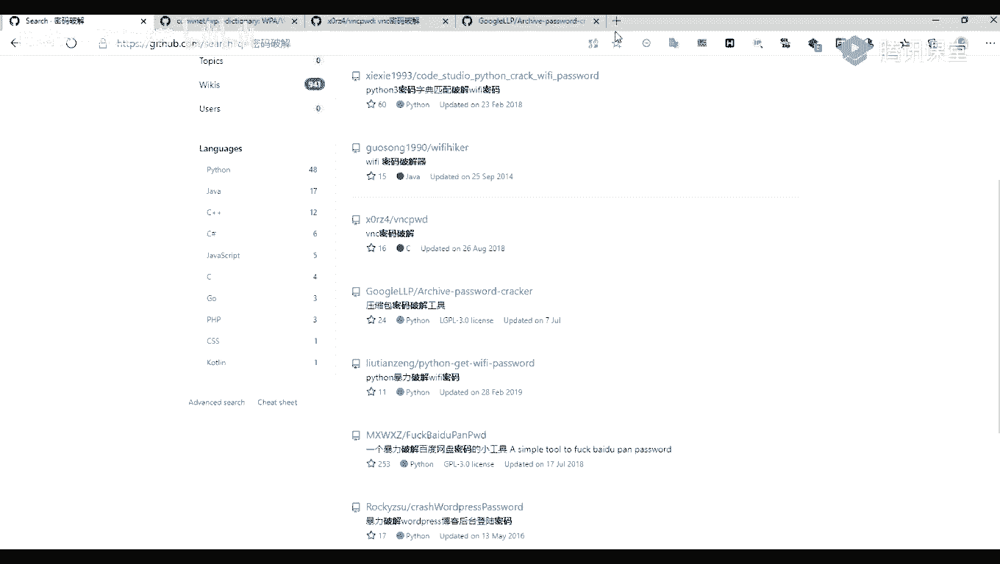
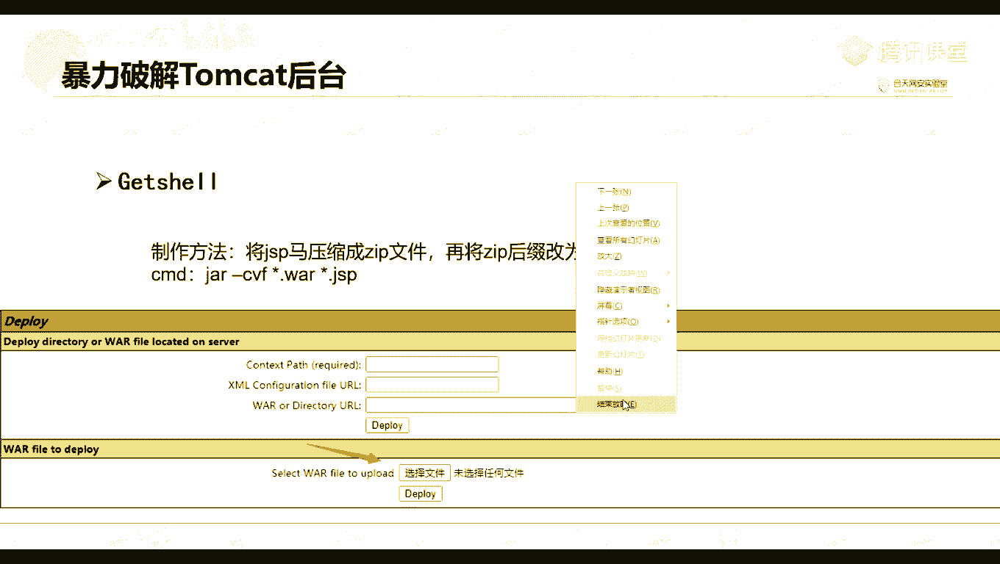
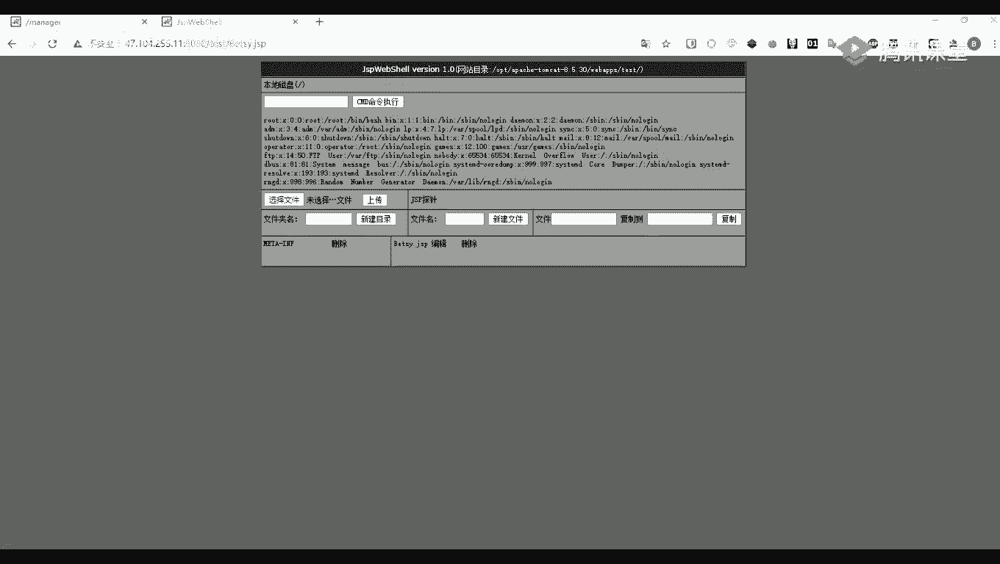
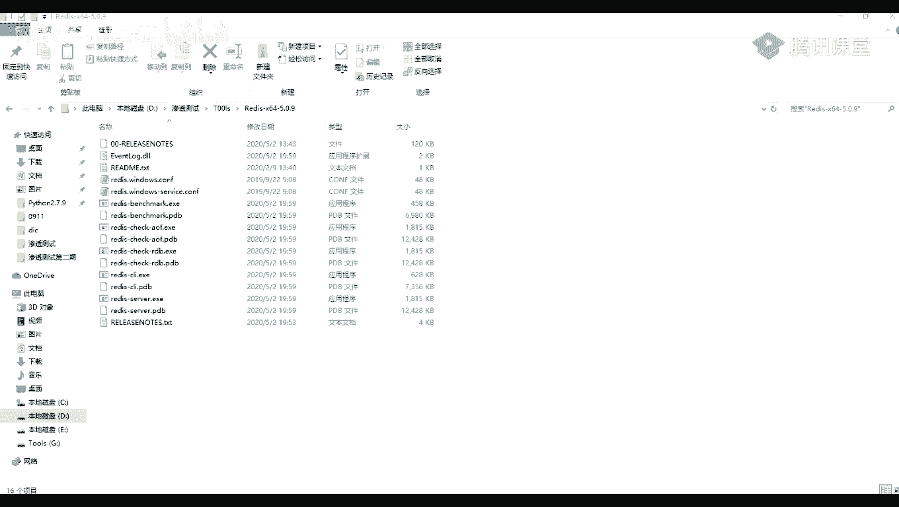

# P48：第12天：后台密码穷举、Tomcat密码破解 - 网络安全就业推荐 - BV1Zu411s79i

确定的话，那我们就开始上课了，这节课我们这节课呢我们给大家讲一下，我们的一个绕口令的一个密码破解，当然了，也不不仅仅是说它的一个，只有它的一个密码破解，包括他的一些账号啊，验证码都都可以。

就是在一些情况下都可以遇到的，都都可以就是进行一个破解的，或者说爆破，那么我们先来看一下，看一下我们的一个第一部分的一个内容呢，就是我们点一下这个暴力破解它的一个介绍，以及它的一个应用场景。

也就是说我们一般都能在哪一点，哪一些地方去应用，第二个呢就是我们点一下这个这个使用，暴力破解，就是去破解它的一个tomcat的一个后台，我们先来看一下第一部分，暴力破解的一个介绍，以及它的一个应用场景。

首先呢我们来看一下暴力破解，他指的是用枚举的方式来包括用户的信息，具体的一个流程嘛，就是用我们事先收集好的一个字典，要使用字典不断的进行枚举，直到枚举成功，这个呢是比较容易理解的，那么。

和美女一般都是枚举一些入口令啊，或者是一个验证码，还有其他的一些，别人的一个就是上传的一个web tell，也就是也就是一些大码的一些信息，我们来看一下它的一个常用字典，常用字典呢，我们一般呢都可以。

再往就是就是在我们的github上面，去搜索到他的一些字典，比如说我们可以这样子搜一下，比如说我们可以在网网上去搜索它的一些试点，看一下入口令，你可以去自己去生成一个字典。

就是自己去收集我们常见的一些字典，比如说我们在网上，也可以搜到一些比较多的一些字典，比如说，它的一个入口令，还有它的一些就是根据关键词，然后快速生成相关的一些入口令的字点，这种呢就是一些脚本。

就是生成字联机的一些脚本，那当然了，还有我们除了可以爆破，现在入口令，我们还可以就是对我们的一些敏感文件等，都可以使用一个字点进行爆破，比如说我们可以看到这里有一个就是第一个，就是在这上面的一个字典。

但是收集了2011年到2019年的一个top，100的一个入口令，以及top 1000的一个密码字典，服务器的一个密码字典，还有一些后台管理密码字典，数据库，密码字典等等，那么我们说的入口令。

什么是入口令呢，右口令呢就是指仅包含一些简单的数字，或者说是一个字母的口令，比如说123123456以及一些note ame，排除word等等，还有或者是一些一个单英文单词。

因为这样的一个口令很容易被人破解，从而使得我们的一个用户的一个计算机啊，或者是一个的网站，还有一些个人信息，就比较容易招招到它的一个泄露，因为我们在现在很多的地方呢，都是以一个用户名。

就和他的一个密码作为一个健全的世界，也就是作为一个登录的一个第八，原来我们的一个口令呢，就相当于是我们家门里的一个钥匙，但是呢当他人有一把可以进入，你这样的一个钥匙呢，那么你的安全啊，你的财务啊。

你的隐私啊，就就会非常的容易遭到泄漏，然后呢，入口令呢就相当于你就是把你家里的钥匙，放到你家门口的那个垫子上面，那么我们来来看一下这一个右口令的一个字典，这这上面这张图呢是我们一个2019年。

还有一个2018年以及2017年的，就是top 100的一个入口令，我们可以看到我们最常用的一些呢是，排在第一位的是一个u23456 ，这个密码就是单纯的一个六个数，六位数字，这种呢是非常好记的。

所以呢也会非常的被人去拆解到的，因为很多时候我们就是为了做一个方便，方便对吧，方便呢就自己随便的一个设置一个好记的密码，所以呢就会很容易被别人拆解到，那么我们来看一下一些常见的一个，密码破解的工具。

密码破解呢，我们前面在前面讲一个boss sweet的的时候，我们也讲到它的一个control的一个的一个模块，也就是它的一个爆破的一个模块，这里呢我们就讲到使用这个爆破的一个模块，去地形爆破。

第二个呢就是我们的一个工具，snk的snack recor的一个工具，这个工具呢它里面呢也是可以作为一个破解，密码破解的一个工具，它里面是集合了非常多的一个就是应用版，就是它可它可以破解很多的东西。

比如说我们的一个s h mysql等等的一些应用，然后除了这一件呢，我们还可以使用我们的一个metal pro的一个里面的，一个爆破的一些模块，或者说是爆破的一个拍照，除了这些呢。

我们还可以在网上去搜索一些脚本，就是密码破解的一些脚本，比如说我们处理呢也也可以在这列出了一些，比如说它可以破解一些wifi的，以及ssh的的一些字典，还有上面的最后一个。

还有一个破解我们的一个vn c的一个密码，呃我们也可以在这里我们给大家看一下，怎么去找这个，比如说我们这里呢就随便招一个密码破解，然后呢就可以设置到非常多的一个工具，或者说是一个脚本。

同样的这边呢还还需要自己去看看，是能不能用的，比如说我们这里的一个破解它的一个wifi的，因为wifi呢这个一般的话都是最少是八位数的，所以呢这个如果使用的话，应该是要那个破解非常的久的。

还有一些比如说做简单的一个vc的，还有一些压缩包等等等，我们破解的一个成功成功率呢，一般呢就是取决于你字典是否够强大，如果说你字典就是，字典里面是包含了那个密码呢，包含了一个正确的密码呢。

那么理论上呢你就是可以破解成功的，那我们来看一下，当然一般是一个暴力破解，一般呢都适用于哪些场景，首先呢可以去爆破它的一个验证码，我们现在的话一般登录网站的时候呢。

也可能是一般呢都是需要输入一个验证码的，如果说他这是一个验证码，这里呢它没有没有过期，就是没有它的一个时间的一个限制，那么我们验证码呢就可以去进行爆破，第二个呢就是不含验证码的后台。

一般的话我们后台的话也会有许多的后台，是不包含它是一个印证码的，他一般都是可能是前台的一个普通用户登录，他可能是需要去使用验证码去校验，但是呢它有一个后台的话，他可能是不需要验证码的。

以及一些各种的应用程序，比如说p h p mme，home cat mysql等等，这个p p h p版的密码呢，就是我们用来管理数据库的一个外，web端的一个管理工具，数据库的一个管理工具。

就是web端的一个数据库管理工具，这个tom cat呢就是我们前面给大家讲了一些，比如说搭载一些中间件，类似于阿帕奇nt等等的一些中间件，这个mysql呢就是我们的一个数据库。

这里有一个mysql数据库，除了这些呢，我们还可以对各种协议进行一个爆破，比如说ftp的协议，还有s h的一个协议，以及r d p i d p等等，我们平常就是登录我们这个linux的之后。

一般呢就是使用的这个x h的一个协议，比如说我这里给大家就是做一个登录。

等一下，比如我这里呢做一个登录文档器，是使用了一个登录我的一个服务器，原来我就是使用使用了我的一个x x h，要加上我们我们的一个用户名，用户名root，然后at at a后面呢就跟上我们的一个例子。

我们这里呢是一个139。9。198。30，然后回车回收之后呢，因为我这里之前是已经已经保存了密码了，所以呢我这里呢直接就可以连上了，如果是没有密码的话，那么我们就需要去输入它的一个密码。

这个呢就是我们的一个s s s s h。

下面呢我们来看一下，就是使用我们的一个bp，就是boss sweet，去对我们的一个tom cat的一个后台进行破解，首先呢我们来看一下这个tom cat。

我这里这个网站呢是搭了一个tomcat的一个环境。

我看一下是哪一个啊，我找我找一下哪一个来着。

471。10447，比如说我这里呢是有一个com cat，这里有一个tom cat，然后我们访问的时候，我们可以看到它这里是一个，就是很明显的告诉我们，这里呢是一个tom cat的一个界面。

那么我们在就是找他的一个后台的时候，我们可以直接在这里呢输入一个manager，m a n a g r，然后回车回车之后，我这里已经进行一个登录了，我用另一个吧，比如说我这里，这里充电都要四七。

这里我看一下，这里应该没有登录，等到我们输入到了一个manager，m m m a n a g e r有回车，回家之后我们看可以看到它，这里呢是需要使用我们的一个密码，账号密码才可以进行登录的。

那么我们没有，这就是没有这个账号密码怎么办呢，那么我们就可以对它进行一个爆破，那爆破呢我们先来包括之前，我们先来看一下它的一个密码的一个组成，因为这个tomcat它的一个账号密码的一个组成。

是我们虽然说看到这里呢是分别是两个登陆框，就是输入框对吧，但是实际上它在传输的过程中并不是这样子的，我来看一下，首先在我这里随便输入两个test p s p，然后声卡我们密码呢。

这里呢也注意我们的一个test，然后进行登录，登录之后他还是返回，就是弹出这个登录框，说明我们的一个验证码是不正，就是我们的一个密码是不正确的，那么我们来先来看一下它的一个密码的一个，组成部分组成。

我们这里呢因为已经开启了他的一个代理了，就是可以进行抓包了，看到我这里，我这里可以就是开启了代理代理之后，我这里呢可以进行一个关闭它的一个拦截，就关闭拦截之后。

我们可以在我们的这个http的一个history里里面去找，找到它的一个就是请求包，比如说这个这个呢就是我们刚刚的一个请求包，我们我们将这个包呢，先发送到我们的一个repeat这个模块这里，当然了。

我们也我们来看一下它这里呢是就是请求一下，也就算是一个401的一个错误，就说明我们的一个用账号密码呢是不正确的，不正确的呢，我们来先来看一下它的一个就是密码，密码的一个部分，这里就是这一串。

就是它的一个密码的一个主部分，这个呢它是经过它的一个base 64进行编码的，一个这个字符串，这一串我们先来先将它进行一个解密来看一下，我们将我们的这一这一串这一串数据，然后右键右键发送到我们的这个先。

then to live to decode，decode这个模块，这里，这个模块呢就是用专门用来进行一个编码，解码的一个模块，也就是这个decode这个模块，期间我们的这个数据，这一串数据。

然后发送到我们这个gentle recorder这里，要因为我们是已经知道了这个tomcat，但是只用了一个base 64进行一个编码的，现在我们这里呢就对它进行一个解码。

然后找到这个decoder decoder a，然后这个找到这个base 64，这里我们可以看到它，这里呢其实有有许多的一个选项就可以选择的，我们这里呢就选择一个被64，然后我们解码之后。

我们可以看到它的一个密码，密码组成是是这样子的，这是一个test。

这里看一下，就是一个test，然后加上一个冒号，再加上一个test，我这里给大家弄出来。

就这样这样子的一个，这就是还原之后，我们可以看到前面呢就是我们的一个用户名，这是它的一个组合吗，这是一个用户名，用户名加上一个冒号啊，这是冒号对吧，要加上一个密码密码，然后在之后呢再定义一个被子。

64的一个bf，164的一个dmi，就是编或者说是一个编码，然后就得到了我们的一个就是传输，就是传输的一个密码，那么既然我们知道了它的一个就是，就是他知道了它的一个加密方式。

那么我们就可以去构造出我们的一个字典，首先呢我们将我们的一个包的请求包，发送到我们这个intel的这个模块之后，我们就可以对于我们的这一串这一串东西，要进行一个就是添加一个标记。

我们本来应该是没有标记的，我来看一下，inq的能发送到这里之后，但是这里呢是没有标记的，现在我们先添加一个标记就对，就是标记这一部分是用来进行爆破的一个部分，然后呢我们这这个呢我们是前面的课呢。

也给大家讲过了，所以呢我们这里就不详细的去讲了，要添加这个标记的一部部分之后，我们进入到我们的一个plot的一个设置，这里欢乐的，然后呢这里，有有有几个选项，一个是plot的set诶。

还有一个呢就是pilot set of option，这个权限，看到我们，因为我们那里前面呢是只选择了一个，一个爆破的一个参数设，所以呢我们这里是只有一个设置po set，那么我们选择一个字典。

这里呢就是它的一个字典的一个类型，比如说我们比较常见的就是一个一个simple simple list，这个呢就是一个简单的一个字典，上面这个呢轮轮胎bell就是一个运行文件。

以及上面的一些比如说它的一个日期呀，a或者是一个数字等等，或者一些日期我们可以看到，也可以去设置它的一些日期是，那么我们这里呢，就选择我们的一个自定义迭代器，也就是我们可以自由去设置的一个这个。

字典类型，选择第三个，第三个呢就是gsp这个选项啊，就是一个自定义迭代器，我们选择了之后就对，就设置我们的一个用户名，首先呢我们在这个proposition这里，这个po option这个选项。

这里要找到我们这个proposition这个地方，那我们我们可以看到，在这里呢有一个12345678，但是呢我们这一个字典的一个组成，是一个分为三个部分，第一个部分呢就是我们的一个用户名对吧。

所以呢我们就可以设置我们的一个用户名，就现在就现在我们这里设置它的一个用户名，我看一下这里，我们比如说我们这里面随意设置一个test也可以，我们可以自己添加进去，也可以去导入，就是导入我们的一个字典。

我们这里呢就随便就添加几个吧，然后1231234，这个呢就是我们的一个用户名啊，lo，啊以及ame，还有一些，好吧，我们随便做这几个啊，原来我们在再设置我们的一个第二，第二个部分呢。

我们我们前面这个第一呢，就是我们的一个第一部分，就是一个用户名，然后呢我们进入到第二第二部分的一个设置，就是加上一个冒号，加上我们的一个冒号，加上冒之后呢，我们就添加就行了，然后进入到第三个的设置。

第三个设置呢就是我们的一个密码，密码，然后呢，我们这里就设置我们的一个，随便设置它的一个密码，然后弄他，好我们再看一下，我们这里呢就随便设置五个12345个密码，设置了密码之后，我们如果是直接爆破的话。

我们可以看到如果是直接爆破的话，它这里呢是它的一个并没有进行它的一个加密，我们可以看看到，而且它会对它的这个特殊的一个字符，也就是这个冒号进行一个编码的，比如说我们这里呢就是进行一个编码。

就是对一个特殊字符进行编码了，并且他并没有对这一串数据进行，我们输入的一个账户密码进行一个背词，60字的一个编码，背着我们还要去进行一个设置，首先呢我们进入到我们的这个这这个倒数，第二个。

这个final processing这个地方这里嗯，然后我们添加添加一个就是三方式，它的一个编码的一个方式，比如说我们这里呢就选择一个就是我们add add，然后选择它的一个类型。

我们这里呢是进行一个编码的，就是意思呢就是对我们的一个这这里，这一串这些设置进行一个编码，那我们就设置一个encoder encode，这里进行一个编码，然后呢我们是一个base 64的一个编码。

所以呢我们就找到我们的一个base，64的一个import，之后呢我们点击ok，ok之后因为我们前面说了，他会对我们的，对于我们的一个特殊字符，比如说这里的一些特殊字符，进行了一个url的一个编码。

就是他会对这这种字符，比如说这点后斜杠，反斜杠等于还有尖括号，问号加号分号，双引号等等的一些符号，进行了一个u r l的一个编码，所以呢我们这里呢就让它不就是不进行编码，就是不对不对。

这里面的一些特特殊字符进行编码，就是我们把这个勾勾给去掉，这不进行编码之后，然后呢我们就可以设置完成了，设置完成之后呢，我们就点击进行一个爆破，我们点击这个start attack这一个选项。

就在最右上角这里，那么我们可以看到它就进行一个爆破了，并且他的这些爆破的这些数据，就是这个用户以及密码的一些这些数据，进行了一个加密了，然后之后我们可以进行一个筛选。

我们可以根据它的一个状态状态进行一个筛选，因为我们如果是登录成功的话，那么肯定是一个200的一个状态，现在我们可以根，根据它的一个状态来进行一个筛选，我们这一状态的筛选之后。

我们可以看到这里有一个200的一个状态，明显跟上面的一些是不一样的，有很大的一个区别的，就是上面这些是零一呢，就是说它的一个用户名以及密码是不正确的，那么我们可以就是从这个状态码可以。

找到它的一个正确的一个用户用户名以及密码，最后呢我们还可以根据它的一个长度，长度来进行判断，比如说我们可以因为我们一个登录成功，登录成功的一个，它给我们返回的一个包的一个长度，跟登录不成功的。

返回包的一个长度呢是很有可能不一样的，这样的也有也有些是一样的，我们得根据一个实际情况来进行一个使用，我们这里呢就使用我们的一个长，也可以使用我们我们的一个长度，来进行一个判断。

就是它的一个返回报的长度等等，我们可以看到它这里呢，有一个是20955的一个返回包，长度，跟上面的一个2736的一个长度呢，是明显不一样的，所以呢我们这里呢就可以得。

就是得到了它的一个正确的一个用户名及密码，就是这一串这串数据呢，就是它的一个用户名以及密码，那么我们就对它进行一个解码，就是对单进行一个解码，然后呢我们发送到这个decode这个模块这里。

要要进行一个叠码，点完之后我们可以看到它的一个用户名，以及它的一个密码呢是一个tom cat跟tom cat，所以呢我们就可以属于我们的一个得到的一个，用户名。

tomcat以及密码tom cat来进行登录，不过呢有一点需要注意的是，那个嗯在这个tom cat 6版本以后呢，它是针对了一个爆破，做了一个锁定的机制的一个设置，所以呢如果是我们有时候就是爆破的时候。

我们会爆破，不管是正密码是否正确，都可能会爆破不成功的，就是它这里面都是可能是显示到的，一个是零一了，因为他对这个爆破做了一个锁定的机制，不管我们的一个用户名以及密码是否是正确的。

都是都不能进行一个登录了，需要等30分钟吧，还是五分钟来着，然后才能进行一个结合，所以呢我们遇到遇到这这种登录框，就是这种登录cat的时候，我们可以就是去找动，就是随手动输入几个常见的一些用法类。

比如说我们比较常见的，比如说跳的一个some cat及tom cat，这是他们cat，这个呢就是它的一个默认的一个，用户名以及密码，还有一些是其他的，比如说protest或者是一些通通密码。

通密码现在也是可以的，然后我们爆破得到了他的一个正，正确的一个用户名密码之后，我们就是接下来呢就是对它进行一个get cell，也就是上传它的一个外包进行get c，软件呢换成了一个外包外包。

它是什么东西呢，它是用来进行一个web开发，值得一个网站项目上所有的代码，包括我们的一个前台html代码，js的一个代码，以及j的一个代码，以及它的一个后台的一个java web一个代码。

也就是它的一个java的一个代码，当我们的一个开发人员开，将我们的一个网站就是开发完毕时，就会将这些源码就打包成一个外包，就是给我们的一个测试人员测试，那么我们我们呢就可以就是通过这次这种远程。

就是通过外包装去部署这个外包，进行一个复制这个网站，原来这个外包呢可以放在我们的一个tom cat，上面的一个web app上面，也就也就是web app上面呢是它的一个根目录，是它的一个根目录。

那我们我们的一个阿帕奇的一个up，那个v r3 w h t m l，这个目录是差不多的一个意思，然后呢当我们的一个tomcat启动的时候，我们的那个挂包呢也会将之进行一个解压，来自动进行一个部署。

所以呢我们这里就可以将我们的一个web c。

那我们的个java java的一个web shell，就是打包成那个jvr包，那么打包呢这里给大家演示一下，首先呢我找到我们的一个就是web c，因为我们这个dm cat是用我们的一个java。

进行一个开发的，所以呢我们上传了一个，上传了一个包呢也是需要的，一个是java的，不能是pp hp的，我我在在这里找一下，等一下一般的c，首先找一下我们的我的一个web叫。

啊比如说我这里呢有一个有一个一个jsp的，一个web，一个文web sl，那这个呢，我看一个这个微博最大的一个密码呢，就是它的一个111，这里呢也进行一个备注了，那么我们怎么去制作我们的一个。

像我们我们的这这个jsp的一个文件。

制作成我们的一个外包，首先呢我们打开我们的一个cm cmd，打开cmd之后，我们进入到我们当前的一个路径上面，摇篮路径上面有一个dsp的一个文件，现在我们注意我们的一个dj压要杠，cv f。

他cpf也要跟上，我们的一个想要打包成了一个什么名字，比如说我们这里呢想要打包成一个test点挂，然后后面呢就是跟上我们的一个一个，dsb的一个文件，要回车之后，我们可以看到他这里呢是已经成功了。

输出了一个外包了，我们来看一下，这个呢就是我刚刚说刚刚的一个外包，就是利用这个bc连接sp去压缩，成了一个一个挂包，这样呢我们就进行一个附属部署之后，我们找到我们上面的这个wifto dep这个地方。

这个那就是我们那的一个就是数组，我们我们的一个画包，那么我们选择我们的一个文件，就选择我们刚刚的那一个包，the test test。wb要打开，打开之后进行一个附属部署之后呢。

我们就可以对我们的一个网站进行管理了，然后呢我们的一个路径路径呢要注意，我们的一个路径呢，就是我们的一个网站的一个根目录，就是我们的这里，要加上我们的那个外包的一个名字，比如说我这里呢是一个test啊。

就是这个外包的一个名字是一个test，然后后面再加上我们的那个jsp，就是这个web shell的一个名字，b e t s y n c h p上呢。

我们回车回车之后，我们可以看到，我们已经可以访问我们的一个web下了，那么我们的一个密码呢，就是一个111来进行一个登录，登录之后呢，我们就可以就是对我们的一个网站，进行一个管理的。

我这里呢是使用我的一个web端进行一个管理的，我们呢也可以去上传我们的一个，其他的其他的码，我这里呢算是一个小马吧，其实可以对我们的一个文件进行一个管理的，或者比如说新增文件或者是复制文件等等。

还可以进行一些执行到的一些其他的命令，比如说我这里已经装备了是没有的，l a l s的一个命令，现在我们可以看到，我们执行了我们的一个l s的一个命令呢，它这里呢就给我们列出了它的一个文件。

一个l s命令呢就是我们在我们linux linux上面，就是查看我们的一个，就是列出我们的一个文件的一个命令，就la，以及cat我们的一个密码文件，cat cat就是一个查看cat。

然后tp上面的一个password，我们可以看看能不能执行，那也可以看到我们cat d e d c，把word也可以去查看这个文件，就是我们的一个linux上面的一个密码文件。

好然后呢我们这一节呢就讲讲到这里啊，然后呢这个这一节课的这一节课呢，我们主要是给大家介绍了这个工工具，就是我们的一个，一些常用的一些工具哦。

这里呢还有一个network，这个这个工具，就是这个这个工具呢，你们的一个工具包里应该是有这个工具的，这里呢打开给大家看一下，盘，好就是就是这一个工具，你们的那里呢应该是叫一个超级超级绕口令，检查工具。

然后找到我们这个snet net neo的这个程序，然后我们双击打开它，同意的，打开它之后，我们可以看到它这里呢是支持爆破，非常多的一个协议，比如说我们的一个i p p，mysql。

oracle ftp等等，eternet v n p各种的一些应用或者说一些协议，并且它还支持它的一个就是批量，就是批量的是一个破解或者是一个账户呢，我们也可以去自己去导入它的一个密码，就是用户名。

密码呢也可以自己去导入，然后呢，它这里面是已已经内置了许多的一个一个密码，就是密码或者说是一个字典，这里面有39个字典，我们也可以自己去进行添加，这使用的是比较简单的，我们直接在我们的一个目标账户。

比如说我在这里呢举个例子啊，这点上有一个127点点0。1，我们这里呢是举个例子啊，看到我们选择我们需要爆破的一个应用，我们这里呢选择我们的一个mysql，原来我们导入我们的一个账户，导入我们的一个uc。

一个username mysql，这里要再导入我们的一个密码，那之后呢就可以进行一个检查了，要检查呢在这里呢也非常的快，就是直接给我们检查出了我们的这个mysql，要它的一个用户名是个root。

它的一个密码，这个123456，并且还有它的一个数据库的一个版本，5。6。27，那么我们就可以去登录一下，看看是不是是不是正确的，好比如说我在讲，我就登录登登录一下我们那个lol。

因为我们127点点001呢，我们也可以注意我们的logo，hot啊，post是这两个人是一样的，然后呢它的一个用户名是一个root，密码是一个123456，最后要进行一个添加，确定确定之后。

我们我们这里呢就是这这个这个logo lost，然后这个三，这里呢就是我们刚刚添加的那那一个地址，哦然后呢我们就可以进行一个管管理了，就是可以登录进我们的一个数据库了。

嗯然后在这里呢这节课呢我们就先讲到这里啊，你们有什么疑问吗，我那个就那这个就先不离吧，就你们做其他的一个作业，如果是有什么问题，再就是访问不了的话，你们再告诉我，因为那个上面开了太多的一个应用。

就是开了太多的一个服务，然后也被人也被人打，就是搞得很卡，可能有一些是会被自动停掉了，这个ladies呢，我我这我这边呢是可以随意的进行连接的，这个高版本高版高版本的话。

我们对就是我们一般就是遇到这种的话，都是使用一下它的一些用一直默认的一些密码，或者是一些常用的，比如说一些tc 123456，它的一个用户名呢一般都是一个double cat。

那样的呢也可以自己去试试一下，其他的一个东西，主要呢是看我们的那个网站的一个管理员，就是有没有就是修改，就是将它的一个一个限制给修改掉，如果是修改的话，那么我们就可以进行一个爆破，如果没有修改的话。

那么我们就就是使用使用手工进行一个爆破，就使用手工进行一个尝试，如果我们能进去的话，那么一般一般都能去部署一个挂包的，就是部署一个外包，要进零，就是去get cell。

比如说我这里呢我待会也可以给你发一下，我这里给你们看一下。

我这边连的，我这今天我改了个端口，应该是还是可以连的，a b i，杠b i g b t o c，我这里呢是改了一个端口的，不知道你们还能不能连连的，是一个6388的一个端口，给我们执行一个info。

info之后，我们也是可以执行的，刚刚我们看你们有一些同学啊，就是使用的一些其他的一些cd的一些命令，我们在这里呢，在这里面呢，并不是属于我们的一个cd的一个命令了，其实我们要设置我们的一个路径。

我们是一个conqu the cel d i r，d i r就是我们的一个像设置它的一个路径，比如说我们这里呢是一个v i斜杠，3w斜杠html这样子，然后呢我们设置的一个路径。

就是得看我们是不是能访问的。

比如说我之前的话，好像这个8080端口好像是不能访问的，但是所以呢你们可能有有一些同学，有些本来呢是没用不能访问的，现在是可以访问的，你们有一些同学可能可能就是设置了之后，就是把用你们的一个菜刀。

或者是一个软件连接不上，因为你们的一个路径是不对的。

我们我当时给你们讲的是一个看一下，s是s是f的一个路径大啊，并且这一个这一个路径，然后呢，我们设置之后要再设置我们我们的一个文件名，设置完文件名之后，我们再设置我们要写写入的一个东西。

然后进行一个保存就可以了。

好这节课呢我们就到这里，我们就先上课。