# 课程P48：第12天 - 后台密码穷举与Tomcat密码破解 🔐

在本节课中，我们将学习暴力破解的基本概念、应用场景，并重点演示如何使用Burp Suite工具破解Tomcat后台的登录密码，最终实现Webshell的部署。

## 暴力破解介绍与应用场景 💥

上一节我们概述了课程内容，本节中我们来看看暴力破解的具体定义和常见的使用场合。

暴力破解指的是通过枚举的方式尝试猜测用户认证信息。其具体流程是使用预先收集好的字典文件，对目标进行持续不断的登录尝试，直到成功匹配正确的凭证。

暴力破解通常用于枚举以下信息：
*   弱口令
*   验证码
*   他人上传的Webshell信息

以下是常用字典的获取途径：
*   在GitHub等平台搜索“password dictionary”、“top passwords”等关键词。
*   使用脚本根据特定规则（如关键词、生日）生成相关口令字典。
*   使用收集了历年常见弱口令、服务器密码、后台密码、数据库密码的综合字典。

**弱口令**是指仅包含简单数字或字母的口令，例如 `123456`、`password`、`admin` 或单个英文单词。这类口令极易被破解，如同将家门钥匙放在门口的垫子上，会严重威胁账户、网站及个人信息安全。统计显示，`123456` 常年位居最常用弱口令榜首。

接下来，我们了解一下常见的密码破解工具。

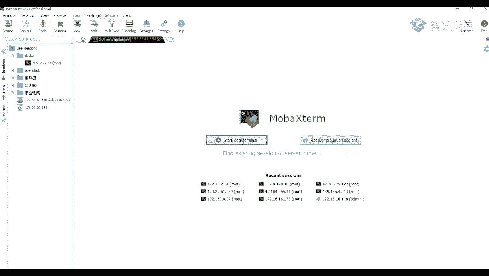

以下是几款主流的密码破解工具：
*   **Burp Suite Intruder模块**：我们在之前课程中介绍过的Web渗透测试工具，其Intruder模块专门用于自动化攻击和爆破。
*   **SNETCracker**：一款集成了多种协议爆破功能的工具，支持SSH、MySQL等。
*   **Metasploit框架**：包含多种爆破模块或插件。
*   各类自定义脚本：例如用于破解Wi-Fi、SSH、VNC、压缩包密码的脚本。

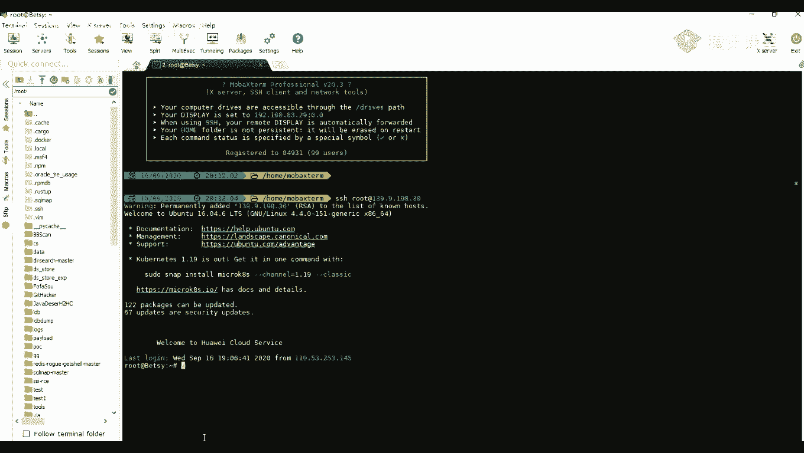

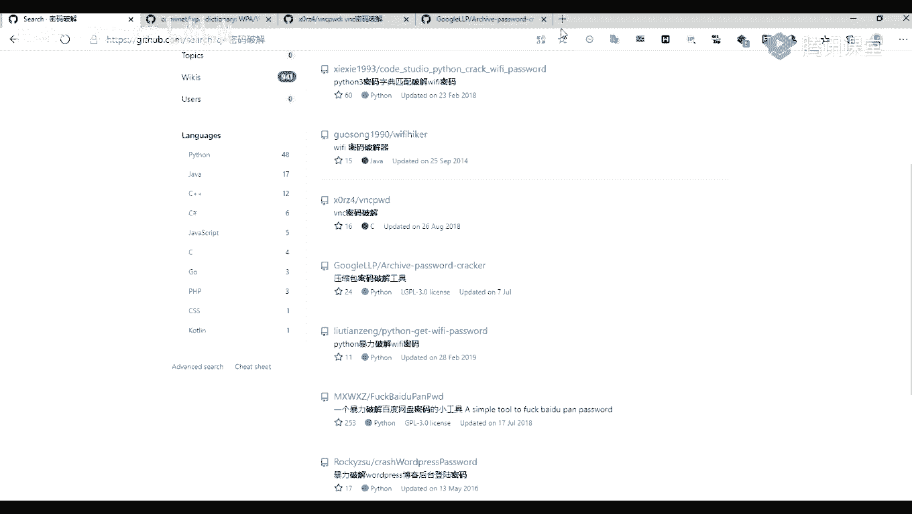

暴力破解的成功率很大程度上取决于字典的强度。如果字典中包含正确的密码，理论上就可以破解成功。

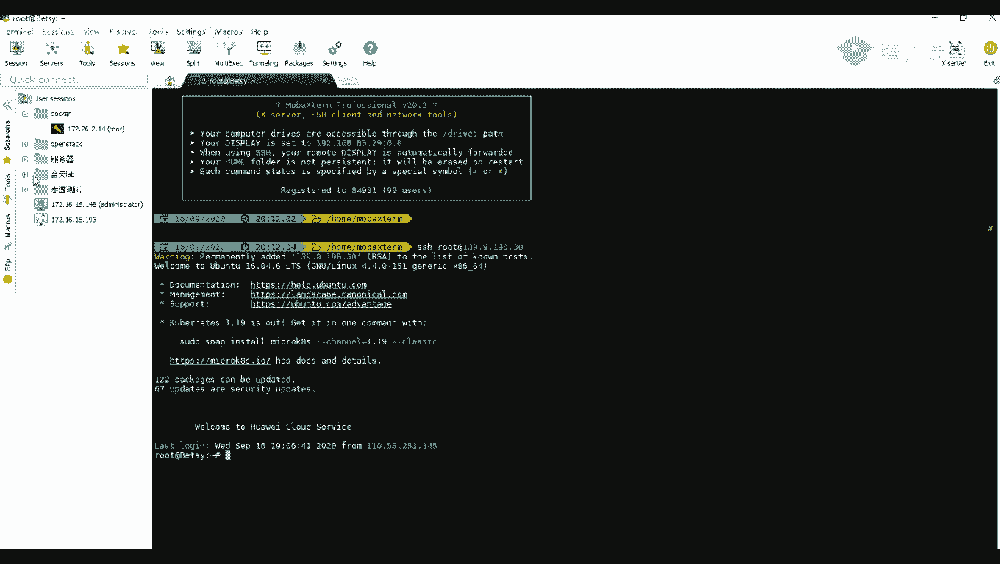

那么，暴力破解一般适用于哪些场景呢？

以下是暴力破解的典型应用场景：
1.  **爆破验证码**：当网站登录的验证码没有时间或次数限制时。
2.  **爆破无验证码的后台**：许多后台管理系统为了管理方便，可能不设置验证码。
3.  **爆破各种应用管理界面**：例如phpMyAdmin（数据库Web管理工具）、Tomcat（中间件）、MySQL数据库等。
4.  **爆破各种协议**：例如FTP、SSH（用于远程登录Linux服务器）、RDP（远程桌面协议）等。

## 使用Burp Suite破解Tomcat后台 🔧

上一节我们介绍了暴力破解的理论知识，本节中我们来看看如何将其应用于实践，破解一个Tomcat后台。

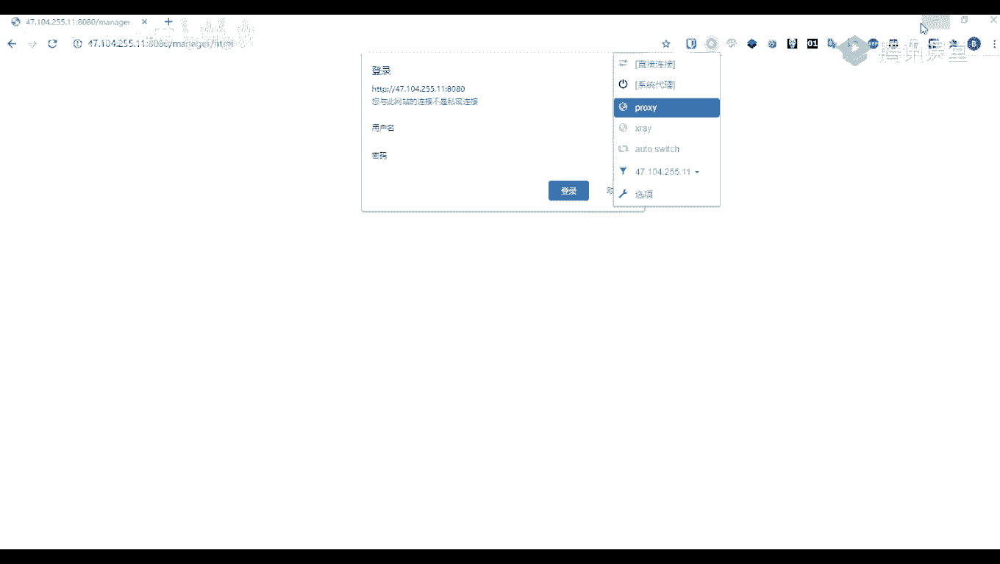

首先，我们访问一个搭建好的Tomcat环境。其默认管理后台路径通常为 `/manager/html`。访问该路径会弹出一个需要用户名和密码的HTTP基本认证对话框。

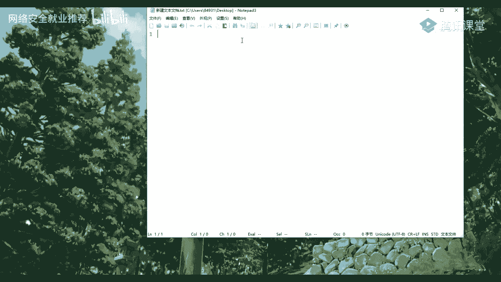

我们没有正确的账号密码，因此需要进行爆破。在爆破之前，需要分析其认证数据的构成。我们尝试输入错误的用户名（test）和密码（test）并抓包。

在Burp Suite中查看抓到的请求包，会发现请求头中包含一个 `Authorization` 字段，其值形如 `Basic dGVzdDp0ZXN0`。这一长串字符是经过Base64编码的。

我们将这串字符发送到Burp Suite的Decoder模块进行Base64解码。解码后的格式为 `username:password`，例如 `test:test`。由此可知，Tomcat的HTTP基本认证是将“用户名:密码”的字符串进行Base64编码后传输的。

了解了加密方式后，我们就可以开始构造攻击。首先，将抓到的登录请求包发送到Intruder模块。

在Intruder模块的Positions标签页，清除默认的标记，只在我们需要爆破的Base64编码字符串部分（即 `dGVzdDp0ZXN0`）添加标记 `§`。

接下来，进入Payloads标签页配置字典。由于密码格式是“用户名:密码”的Base64编码，我们需要使用“自定义迭代器”（Custom iterator）来组合用户名和密码。

以下是配置自定义迭代器的步骤：
1.  在Payload Sets中选择“Custom iterator”。
2.  在Payload Options中，Position 1设置用户名列表（如：admin, root, tomcat）。
3.  Position 2设置一个静态的冒号 `:`。
4.  Position 3设置密码列表（如：123456, password, tomcat）。
5.  进入Payload Processing，添加一个“Encode”规则，选择“Base64-encode”。同时，取消勾选“URL-encode these characters”，以防止冒号等特殊字符被额外编码。

配置完成后，点击“Start attack”开始爆破。爆破完成后，我们需要筛选结果。

通常，登录成功和失败的HTTP状态码或响应长度会不同。我们可以通过以下方式筛选：
*   **按状态码筛选**：成功登录可能返回200状态码，而认证失败通常返回401。
*   **按响应长度筛选**：成功登录后的页面内容与失败页面通常长度差异显著。

通过筛选，我们找到了一个状态码为200、长度与众不同的请求。查看其Payload，即Base64编码后的字符串。将其解码后，我们得到了正确的用户名和密码组合，例如 `tomcat:tomcat`。

**注意**：Tomcat 6及以上版本引入了防爆破锁定机制。如果短时间内失败尝试过多，无论密码是否正确，都可能无法登录，需要等待一段时间（如30分钟）才能解锁。因此，在实际测试中，可先手动尝试常见默认口令（如tomcat/tomcat, admin/admin）。

## 部署Webshell获取控制权 🚀

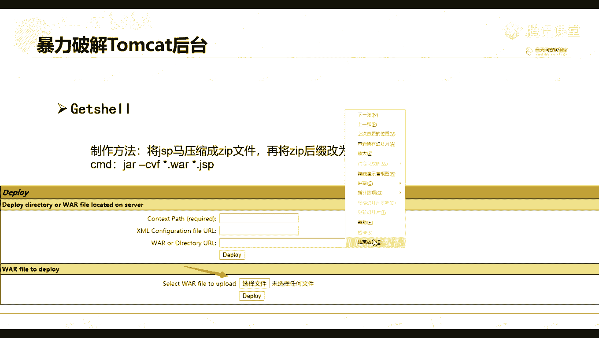

上一节我们成功破解了Tomcat后台的密码，本节中我们来看看如何利用这个权限部署Webshell，从而获取服务器控制权。

**Webshell** 是一个Web应用程序，它包含了网站的所有代码。当开发人员将网站打包成 `.war` 文件（Web Application Archive）并部署到Tomcat的 `webapps` 目录下时，Tomcat会自动解压并运行它。我们可以通过上传一个恶意的WAR包来部署Webshell。

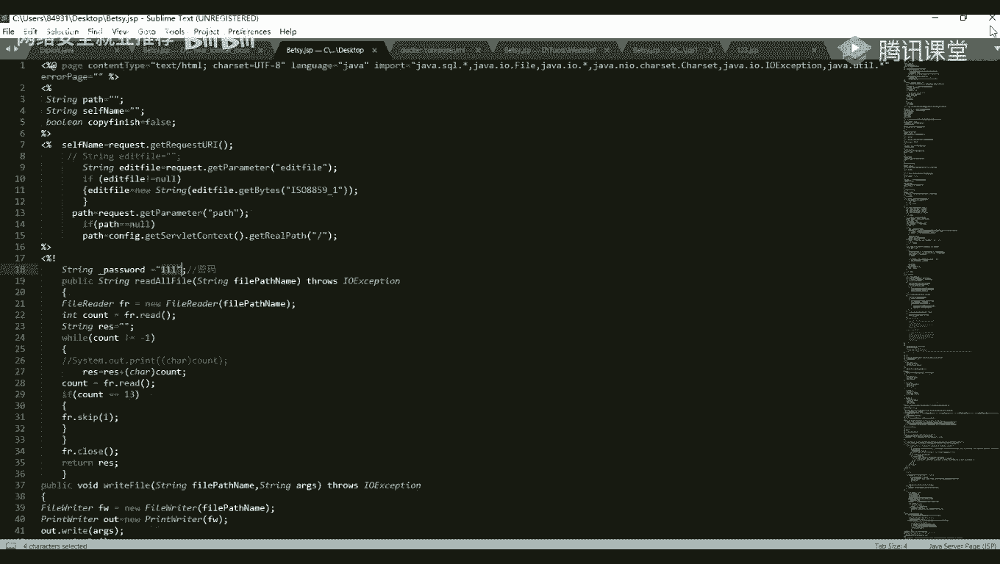

首先，我们需要一个JSP格式的Webshell文件（因为Tomcat是Java容器）。然后，使用jar命令将其打包成WAR文件。

打包命令格式为：
```bash
jar -cvf webshell.war webshell.jsp
```

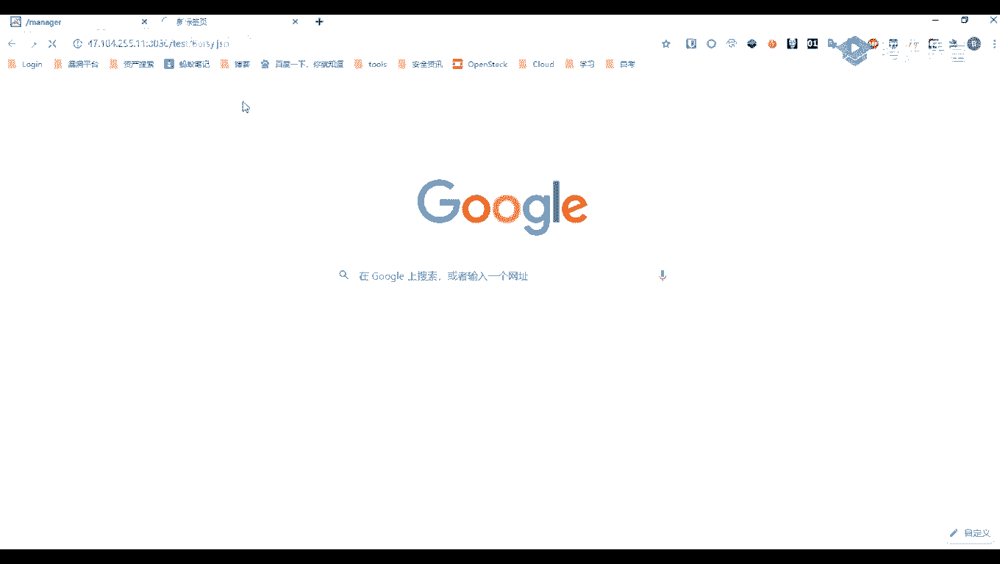

打包完成后，在Tomcat管理后台（`/manager/html`）找到“WAR file to deploy”区域，选择我们生成的WAR文件并部署。

部署成功后，我们的Webshell访问路径为：`http://target.com/webshell/webshell.jsp`。访问该URL，输入Webshell中预设的密码（例如111），即可进入管理界面。

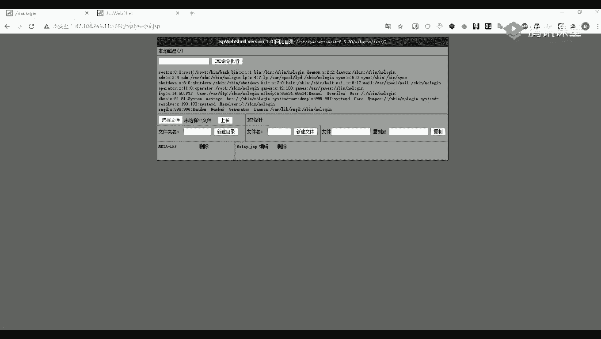

在Webshell中，我们可以执行系统命令、管理文件等。例如，可以执行 `ls` 命令列出目录文件，或执行 `cat /etc/passwd` 命令查看系统密码文件。

## 其他工具介绍：SNETCracker 🛠️

除了Burp Suite，我们再简单介绍另一款工具SNETCracker（超级弱口令检查工具）。这款工具图形化界面友好，内置大量字典，支持爆破多种协议和服务。

其使用方法非常简单：
1.  在“目标地址”输入IP。
2.  在“检测类型”选择要爆破的服务（如MySQL）。
3.  导入或使用内置的用户名和密码字典。
4.  点击“开始检测”即可。

工具会快速尝试并列出成功的用户名、密码及服务版本信息。

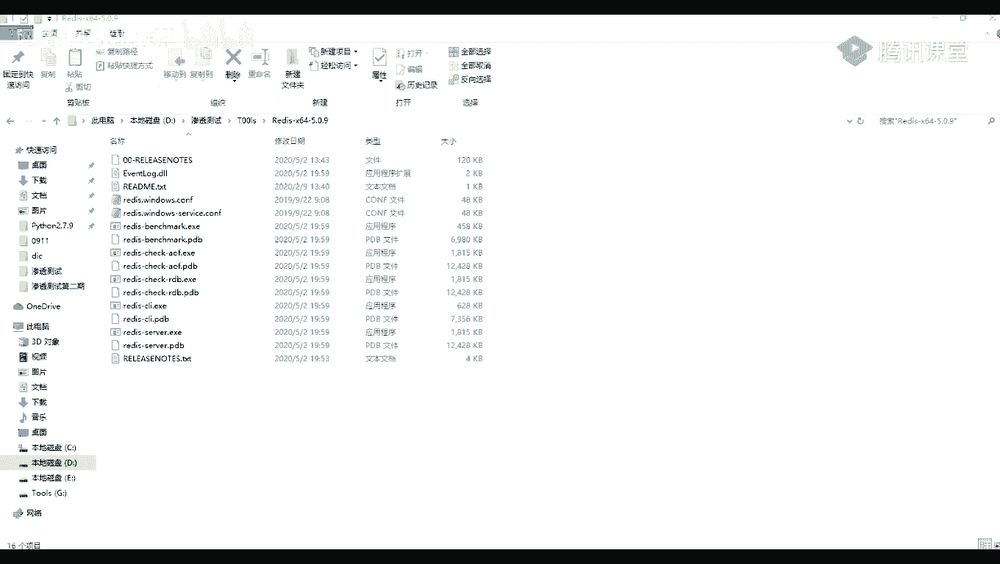

## 课程总结 📚

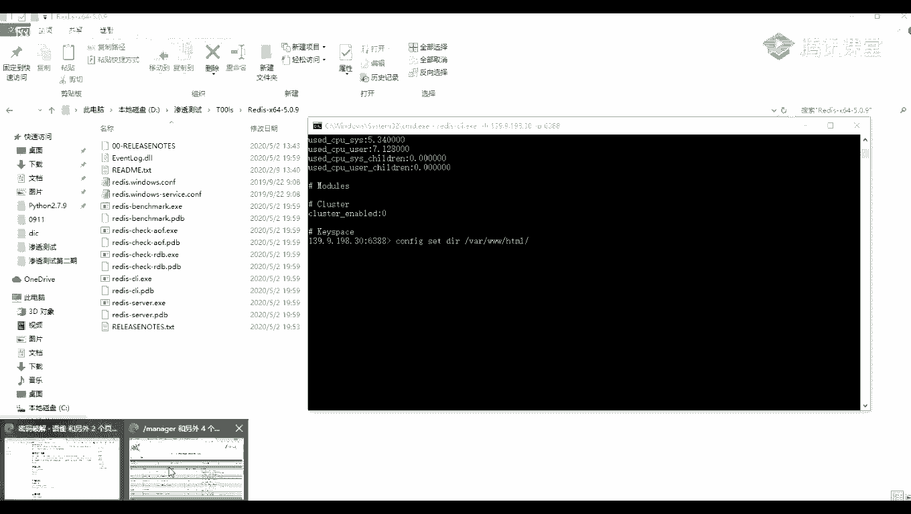

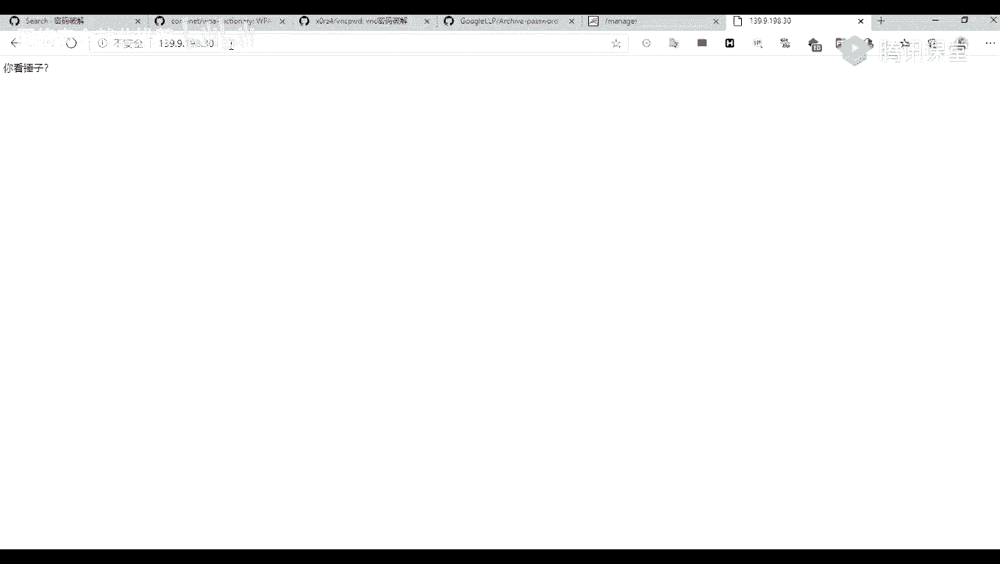

本节课中我们一起学习了网络安全中常见的攻击手法——暴力破解。
*   我们首先了解了暴力破解的原理、常用工具和应用场景。
*   接着，我们深入演示了如何使用Burp Suite对Tomcat后台进行密码穷举，详细讲解了从抓包分析、构造Payload到结果筛选的完整流程。
*   在获取后台权限后，我们学习了如何将JSP Webshell打包成WAR文件并部署，从而获得服务器的命令执行能力。
*   最后，我们简要介绍了另一款高效的弱口令检查工具SNETCracker。

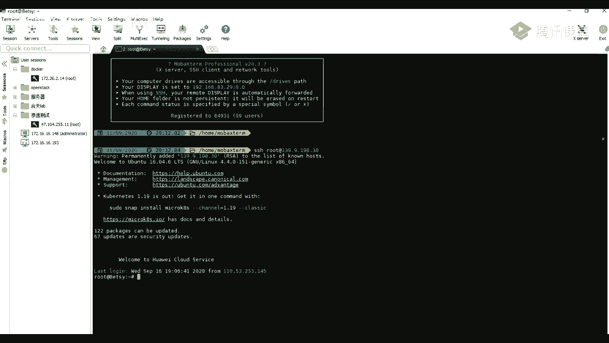

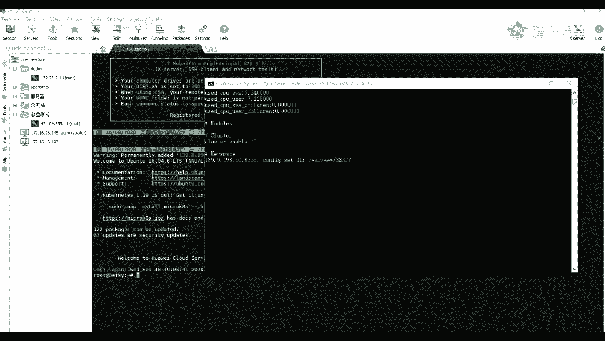

通过本课的学习，你应该能够理解暴力破解的运作机制，并掌握对类似认证系统进行安全测试的基本方法。请务必在合法授权的环境中使用这些技术。