# P5：第3天：网络安全基础 - 网络安全就业推荐 - BV1Zu411s79i

工作平，而在讲课之前的话，我看群里有人提这个问题啊，说bp呃激活不成功，这个的话我昨天晚上上课的时候，不是给大家演示过了吗，就是呃怎么去进行破解，然后的话如果还是不明白的话，大家去看一下回放吧。

然后我这里的话又发了一个新的一个版本，就是2。1。04的一个版本，当然的话不是最新的一个版本，然后大家啊在配置这一个bp环境的时候，主要的话就是注意两点，第一点的话就是一个环境变量。

你的那个java跟那个环境变量要配置好，配置完成之后的话。

你就可以直接在呃，直接在cmd里面能够直接java来去执行对吧。

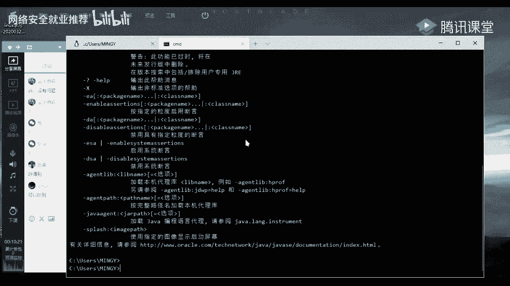

然后如果你配置好了之后之后的话，我们也可以在直接在它的一个直接执行，它的一个价环境，就是直接执行它们，直接双击就能够打开，可以看到对吧，那license的话，license的话这一个呃大家去看回放吧。

我有详细的一个操作过程，这里的话我就不做过多的一个说明了吧，然后我今天也有也有同学问我，这一个说破解就说打不开哦，那你这你如果你环境变量配置好了，然后的话java的一个版本大家要注意的话。

java的一个版本是要jdk的一个八的版本，如果高一高一点的版本的话，呃我记得是会有一个是会有问题的，也是会打不开哦，之前的话我有试过，就是升级到九版本的话，因为现在的话jdk的话。

八版的话是以前的一个版本吗，然后你升级到九版本的话，它会打开，bp的话好像是会打不开的，会有问题，比如说大家只只主要主要注意这两点的话，基本上是没有没有其他的一个问题的。

好了说明呢呃说了一下这个问题的话，我们正式开始我们今天的一个课程内容，我们今天的话主要讲的是一个http和http，s协议的一个介绍，呃本次课程的话主要有四个点，首先第一点的话是对htp协议的一个简介。

第二点的话是对htp s的一个协议简介，以及第三个是啊cookie cs选的一个简介，最后的话会有一个课程的一个考核，就是对我们这嗯这节课的一个课，程的一些知识点，有一个有一些题目的一个考核。

大家在周末的时间的话呃，可以去做一下题目的话是比较简单的，但是是跟我们本次课程的内容的话是相关的，首先的话我们先来看一下http协议的一个简介，什么是http hdp，其实我们呃我们现今的生活当中的话。

如果大家去浏览网站的话，是啊肯定会碰到这样子的一个协议的对吧，当然的话大家可能会用，但是不是很了解他是什么样子的一个东西，这样的话我们一起来看一下，htp的话也叫超文本传输协议。

它的一个缩写就是http，就我们成熟的一些一些网址的话，你标准的一个啊标准的一个网址，一个url的话，他是要带这样子的一个协议的，也就是h t t p，当然的话我们在浏览器里面输的话，其实也可以输。

比如说百度点com对吧，你直接输入百度点com的话，它会自动帮你补全，就是补它浏览器，它会帮你补成，如果说他使用的是一个htp是s的协议的话，它就会补成htp s，gdp的话。

它是一种基于一种用于分布式，协作式和超媒体信息系统的，一个应用层的一个行协议，它其实的话是一个基于请求与响应，而且是无状态的应用层的协议，这样的话大家就了解一下吧。

好在后面的话会对他做一个比较详细的一个介，绍，它是基于tcp ip的一个协议来传输数据的哦，这里我们设计这种设计这个htp的一个初衷，其实就是为了提供一种发布和接收，html页面的一个方法。

也就是我们时常去浏览网站，我们就使用到这样的一个htp协议，来发送我们的一个请求，以及接收服务器发回给我们的这种h t，h t m的一个页面，然后的话我们就能够查看到啊网页的一个内容。

那我们一起来了解一下htp，它的一个发展的一个历史，历史的话主要的话就看一下这张图，大家呃看一下吧，然后呃我这里标的一个红框的话，就是我们呃最常见的一个hb的一个版本，http一点一的一个版本。

当然的话现在的话有http 2的一个版本，而且是逐渐的覆盖市场了，这样的话大家了解一下就ok了，然后我们来了解一下gdp它的一个工作的流程，它是如何去进行一个工作的，呃大家跟我一起来看一下。

首先的话是我们的一个客户端，它会通过一个tcp的三次握手，与服务器进行一个连接，是我们首先需要客户端，也就是我们好在这里讲这个之前的话，我们先来了解一下有这样子的两种架构吧。

就是b s以及cs的一个架构，就cs的话就是client server，也就是客户机与服务器的一个结构，还有bs的一个监控结构的话，就是浏览器roba，还有server的一个结构，我其实呃。

我们常用的也是我们去访问一个网页对吧，我们经常经常使用的也是打开一个浏览器对吧，打开看打开一个浏览器，然后输入一个网址，或者说去导航站随意点开一个，而链接就能够去访问这样的一个页面。

就是这样子的话就是一个bs的一个结构，哦h tp，他首先他会通过tcp的三次握手，与服务器进行一个连接，然后建立连接之后的话，才能够去进行一个数据的一个传递，然后的话我们从客户端传递给服务器的一个。

htp的一个请求，到了一个服务器之后，它就会对我们的一个请求做一个解释响应，然后响应之后的话，它会向客户端同样的发送一个htp的一个响应，然后客户端接收到这样的一个响应之后。

也就是啊从服务端发送过来的一个内容，然后的话展示给我们，然后完成了这样子的一个过程之后的话，它会通客户端，也会通过tcp的一个四次断开，就是四次挥手与服务器断开tcp的一个连接啊。

这里关于tcp的三次握手，四次挥手，这个的话是网络相关的一个知识，我这里的话也就不做过多的一个叙述，就是啊网络的一个基础的协议的一个理解，大家如果不理解的话，去网上看找资料了解一下吧。

让我们看一下这这个图的话，就是一个tcp的三次握手，首先的话客户端，它会向服务端发送这样子的一个，s y n的一个啊请求，然后的话接收之后，然后给一个响应，服务端给响应，然后到了一个客户端之后的话。

他会再发送一个请求给服务端，这就是建立连接的一个过程，也就是三次握手，然后的话我们的这种数据传递完毕之后的话，就会有一个断开的一个过程，这就是tcp的四次挥手，有一个大概的一个过程。

然后这里的话呃我们一起来了解一下啊，htp的一个特性以及它的一个机制，就是说持续连接的一个机制，在htp的0。9以及一点版本中的话，它是tcp的这个连接，它是在每一次请求还有回应之后的话，它就会关闭。

也就是啊因为我们首先需要建立连接，连接之后的话就需要请就需要尽力请求对吧，呃连接之后的话建立连接呃，就是请求发送，然后响应之后，然后的话就会tcp的一个连接就会断开，然后的话在htp的1。1版本中的话。

就引入了这样子的一个持续连接，也就是保持连线的一个机制，这个机制的话可以重复，在多个请求回应之间使用，就呃就这样子的话，它的一个优点的话就是可以减少等待的时间，就省去了中间啊，因为你每次连接之后。

然后关闭关闭之后又继续连接对吧，这样子的话它中间会有一个等待的时间，对你需要这一个请求完成之后，然后再建立连接，再做下一个请求，这样子的话它会有等待的一个时间，然后这样子的一个机制的话就可以呃。

在发送第一个请求之后，不需要再重新进行一个tcp的一个握手，然后连接之后再发送请求，也就是呃如图，这里的话就是啊，就是只是哦我们一起来看一下这个图吧，这个图的话就是我们首先发送一个请求，对吧好吧。

首先tcp连接连接之后的话，我们比如说我们get请求，请求一个index联系html的页面，向服务器请求，然后请求之后服务器给我们一个响应，给我们一个响应之后的话，然后的话再去它会断开。

断开之后的话再去请求请求响应，请求响应，然后再这样子关闭，然后在嗯，htp一点一中的话，它就会有这样子的一个，这个持续连接的一个机制，我们这里请求之后响应响应之后，我们可以有多个请求可以同时的去进行。

就我们可以同时请求一个这个sept js，以及这个slider。cs的一个啊请求，据说在这样子的一个连接之内，然后的话可以同时和响应，这样子的话，我们可以明显看到它的一个呃，时间的话是大大的减少了。

好我们一起来看一下什么是统一资源定位符，也就是url，我们经常会提到的一个url，其实u i u i l就是我们常说的一个网址，它主要的话就是用于查找资源的一个信息，然后一个完整的药的话。

包括下面这几个部分啊，就比如说我们的我这里的话，访问我们合天网实验室对吧，我们的这里的话就是一个url，对吧，包括了这样的一个域名，就我们可以通过这样的一个url，来来访问到这样子的一个页面。

然后这样的一个ura的话，它包括了下面的这样的一些信息，有这有以下这一些部分组成，首先的话我们一起来看一下，首先第一个就是我们的一个协议方案名，这样的话是一个htp的一个协议呃，关于这个。

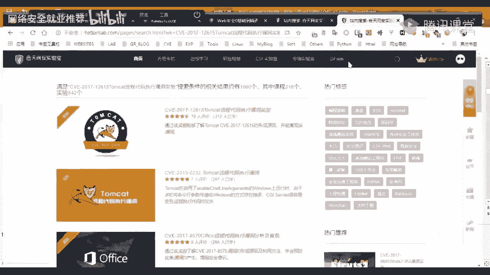

就是说我们在这里，就输了一个。

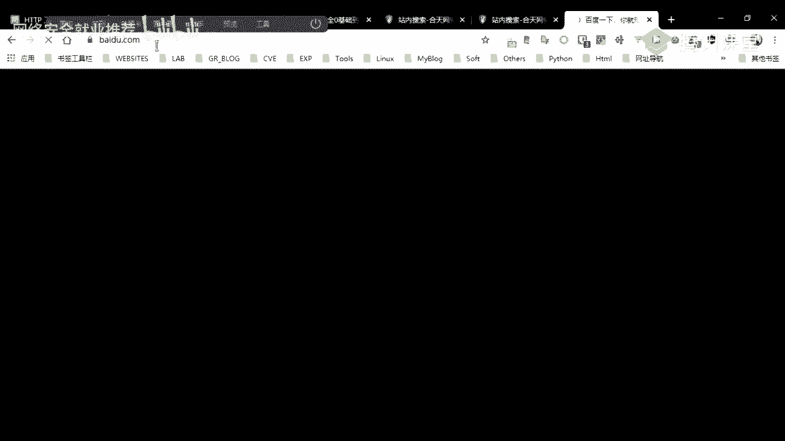

出了一个百度点com对吧，他就到了百度的一个省略，但是我们其实看的话，我们点开看，它其实是这样子的一个url，它是使用的一个htp的一个协议，以及这里的话是有一个3w点百度点com。

它是一个web服务器的一个，啊二级域名，然后第二个的话就是一个登录信息，一个认证的信息，这里的话是好在有一些网页的话，他需要认证的话，我们可以在这里，在htp后面接上我们的一个好登录的一个信息，来去啊。

验证这种需要登录的一个网页，来去进行一个访问，这样的话这个呃应该不是很常见，然后后面的话接的是我们的一个服务器地址，也就是我们的一个域名，然后域名之后的话，接我们的一个服务器的一个端口，端口的话。

应该说一下的话，就是web服务器的话，它默认的一个端口就是八零，这个如果是你使用的一个默认端口的话，这里可以省略，也就是我们这里，比如我们这里访问了一个百度，它其实默认的也是一个8年的那个端口。

我们可以在后面接一个八零反问说，完全的眼睛，可以看到我在这里后面接一个8年的话，他其实也是会跳转到这样子，跳转到我们的这样子的一个页面，然后的话如果是在其他的一个端口，有有相应的一个服务的话。

他做了一个端口的一个更改，我们在后面的话就需要接上我们的一个端口号，比如说常见的一个8080端口啊，然后后面端端口，后面的话接的就是我们的一个文件路径，也就是我们啊。

就比如说我们上节课拉进我们的一个dv w a，对吧，我们的dp w a的一个目录，而放置在我们的一个web服务器根目录下面，然后的话我们要去访问这个dv w a的话，我们需要在我们的一个i p。

或者是说你的一个域名，我在的话看一下我的p大的。

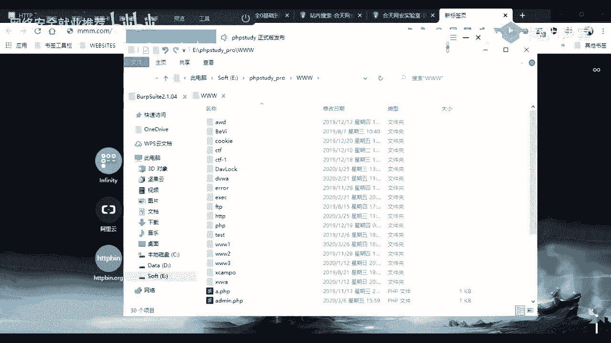

啊我不用这个了。

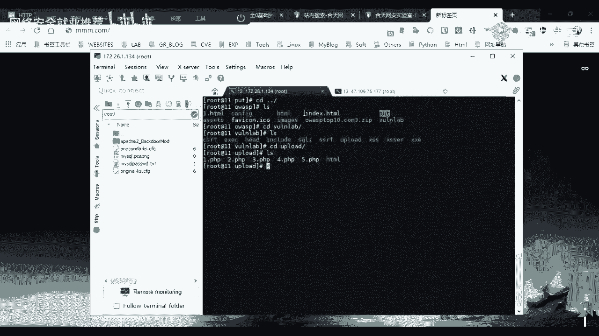

我用我的这个机器吧，好这样的话我以这一个ow s p做一个举例，就是我们现在的话，在我们的一个web服务器的一个根目录对吧，然后的话我们想要访问这样子的一个这个网站。

我们需要接我们服务器上面的一个这个目录。

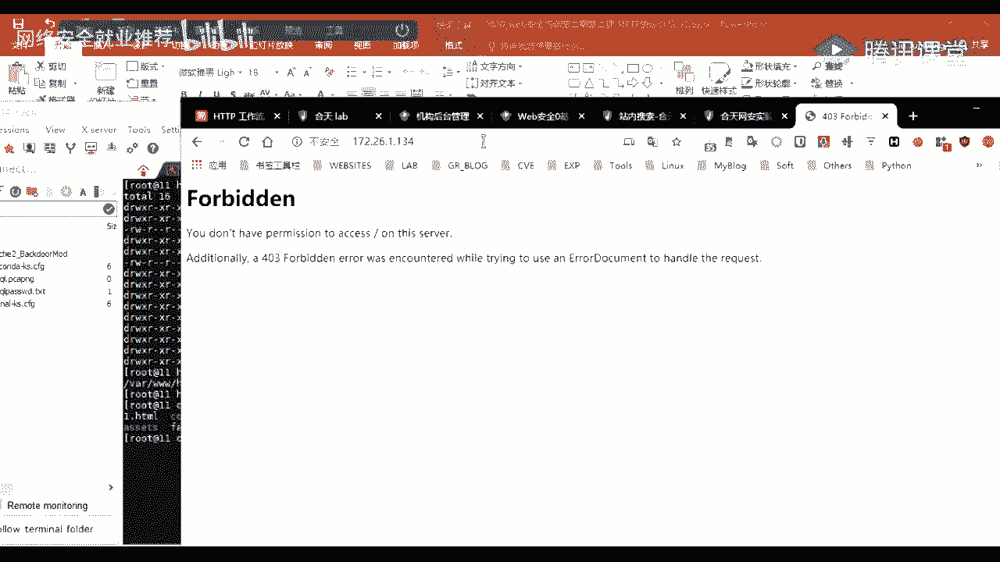

才能够去进行一个访问，也就是它的一个文件路径。

回收，然后的话我们就可以访问到这样子的一个界面，对吧，然后其他其实访问之后的话，它的一个文件其实这个index。htm的一个文件，但是的话我们可以在后面，因为它默认的话他会去查找当前这个目录下面。

它是否有这样子的一个index的一个默认页面，就是我们也可以在后面加上去访问的，也是同样的一个页面。

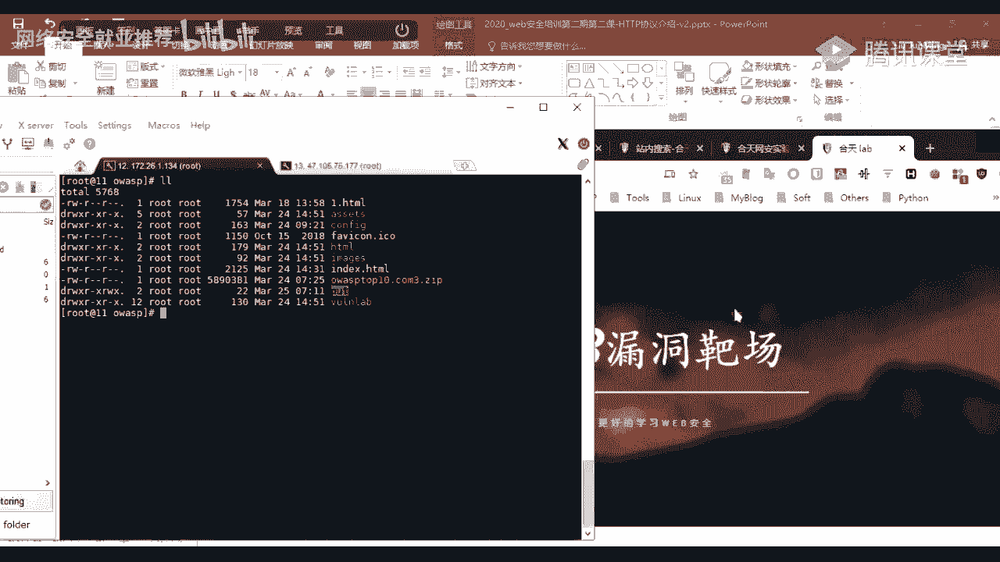

然后这里的这个部分的话，也就是我们的有层次的一个文件路径，然后在这个派城市的一个文件路径后面的话，我们可以以这种问号的一个形式，接我们的一个传递的一个参数，也就是我们所说的一个查询的一个字符串。

它的一个形式的话是，然后的话它是用等号去进行一个临界，就是我们的一个参参参数，然后接后面接我们的一个传递的一个值，然后后面的话是我们可以接一个井号，井号的话在，我们的一个前端里面的话可以叫做锚点。

也就是我们可以定位到当前页面下面的啊，某一个信息的一个片段，我们可以用这样子的一个这个后面接的话。

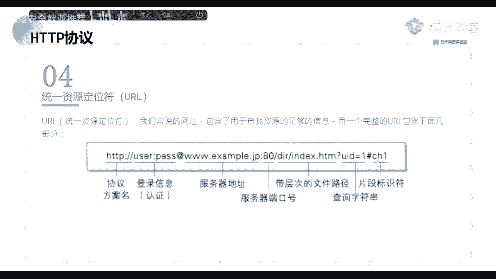

就是一个片段的一个标识符，我们可以啊，你，比如说。

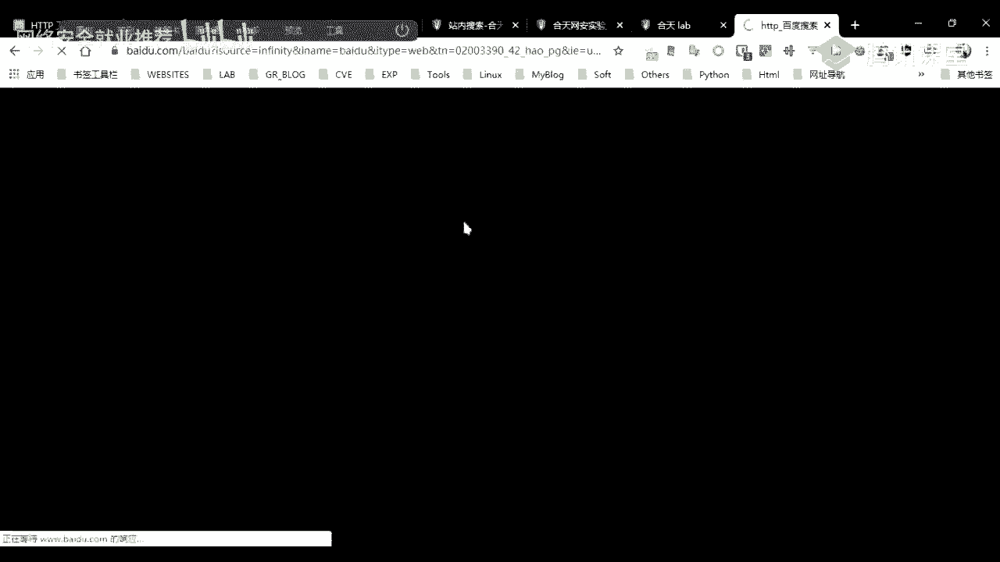

我搜索一个htp，然后我进百度百科，然后可以看到这里它的一个u r地址，就是好域名对吧，然后默认的话它是8080端口，然后后面接我们的一个路径，路径后面之之后的话有一个问号。

这个问号后面的话接的是传递的一个参数，然后我们这里的话，我们查询这样子的一个htp对吧，就是像我们的一个服务器传递这样的一个呃值，然后的话它会返回这样子的一个页面，结果。

然后我们想比如说我们想要去看这一个对吧，看这一个八，也就是版本号，就这一个版本号，这里的话就是在前端里面的话，会有这样子的一个锚点，然后我们可以在后面接一个杠八，然后访问到这样子的这个页面的这一个。

可以看到我这里的话输入一个七的话，它就跳转到了这个状态信息的这一个片片段，对吧，作为一个五五的话就到了这样的一个运作方式，这里，这就是它的一个定段的一个标识符，然后这句话。

而是一个我这里写的一个文字的一个描述，大家可以看一下，我前面讲的话是类似的，然后大家对这个有没有什么疑问呢，应该没有什么问题吧，这个的话其实都是大家呃比较常见的，可能大家就是说在呃也会去使用到。

但是没有去深入的去啊，研究它为什么会是，为什么他的这样的一个url链接，它是会这样子去构成的对吧，因为其实前面呃有给那些就是刚接触这一块的，呃同学做这样子的一个web安全培训的话，他啊。

我记得是有有有人问过我这样子的一个问题，就说我我怎么去访问一个页面，然后他后面为什么他会接这样子的一些东西啊，就是说我们我想要去访问一个指定的页面，他为什么要去接这一个，他他他可能会不会写域名。

然后直接就接这样子的一个啊字符对吧，但是这样子的话他是无法去访问到资源的，因为它不是一个url的一个格式，我看大家的话都没有什么问题啊啊那我们继续，啊了解完一个url之后的话。

我们来看看一下什么是u r i，ui的话叫做统一资源标志符，它是用来抽象，用来标识抽象化物理资源的一个紧凑字字符串，其实呃在这里的话，我们只需要了解到，就是u r i和ur or它的一个区别。

u i l的话它是一个ui的一个子集，也就是说ui就是包括了url，好大，这里的话还要注意一点的话，就是htp，它是使用这个ui来传输数据和建立连接的，我们可以来看一下啊，还有的话是hp。

它是一个客户端以及服务端的一个架构模型，我们来看一下这个图吧，这个图的话就呃，时光的表达了这样子的一个关系，就u i i就这一个大圈对吧，它里面包含了有u i l，还有ui以及还有其他的一些。

然后就是说我们看一下这一个url，就是说这样子的一个形式，五个点com，还有urn u r n的话，这个的话就大概提一下吧，就它是一个统一作为名称，就特定的一个命名空间的一个标识，一个。

呃呃下面我们一起来看一下下面的这一些，呃u y l或者是说ui或者是呃什么，我们来对它做一个分辨，就说下面这些哪些是url，我们一起来看一下，首先第一个啊，这个的话。

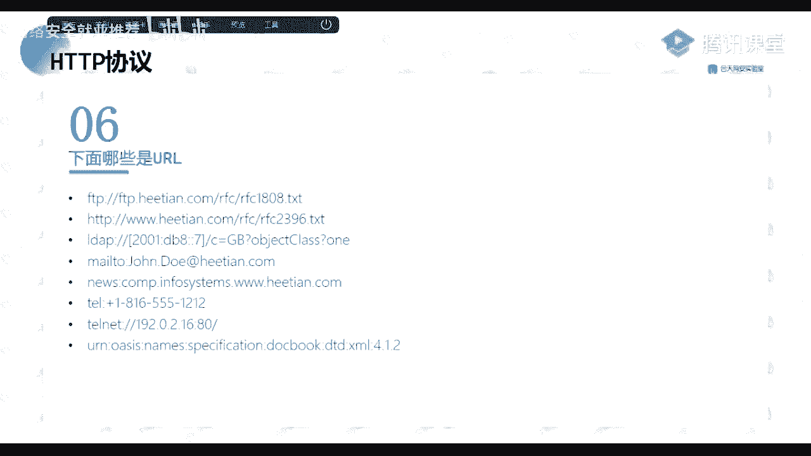

这里答案写出来了。

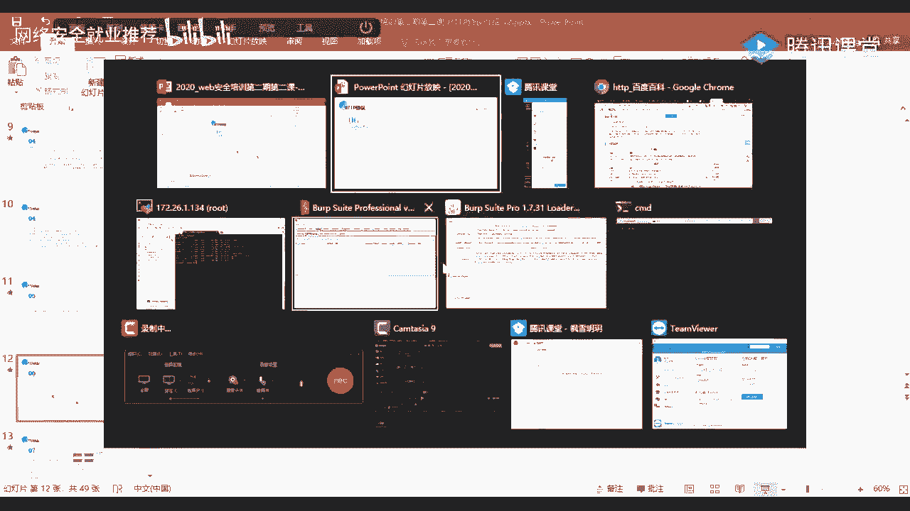

这样的话嗯就各位同学们了诶，来一起做一个互动好吧，就我们一起来看一下，首先我说第一个，就第一个的话，大家觉得它是一个url，还是还是说什么都不是，如果觉得他是一个诱饵的话，呃大家在公屏上打个一好吧。

我看全都是打在一二，对没错，他就是一个url，对啊，为什么它是一个url呢，我们一起来看一下，首先呃前面的话我们其实有哦，这里的话我忘记提了，就说协议的一个方案名的话啊。

我这样的话有列举了这样的一些hd p f t p，还有file协议，还有mail to，mail to tnt和d p等等这样的一些协议方案，就我们其实啊常常见的也是htp嘛。

就是file协议我们应该也是会常见到的对吧。

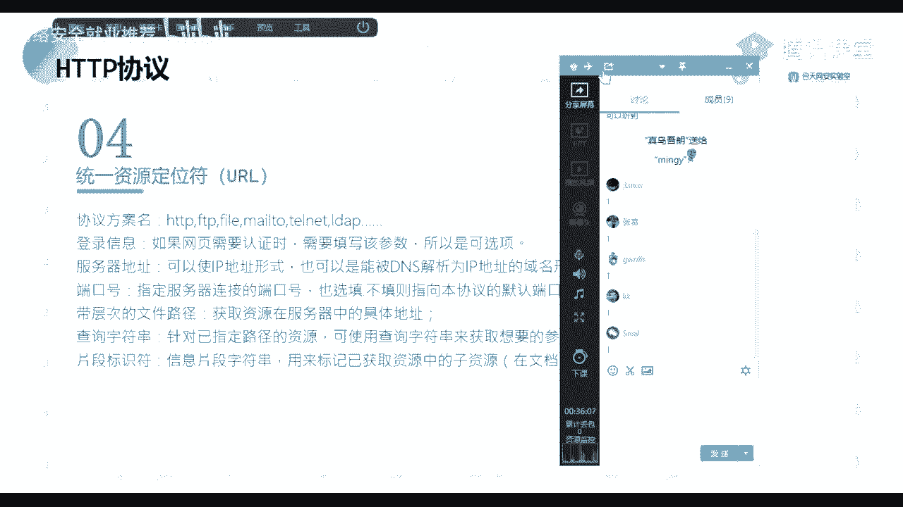

这样的话我举一个例子，好一个再p一点。

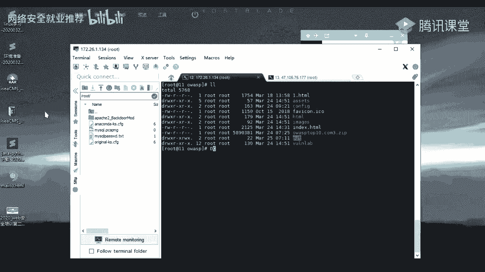

电话。

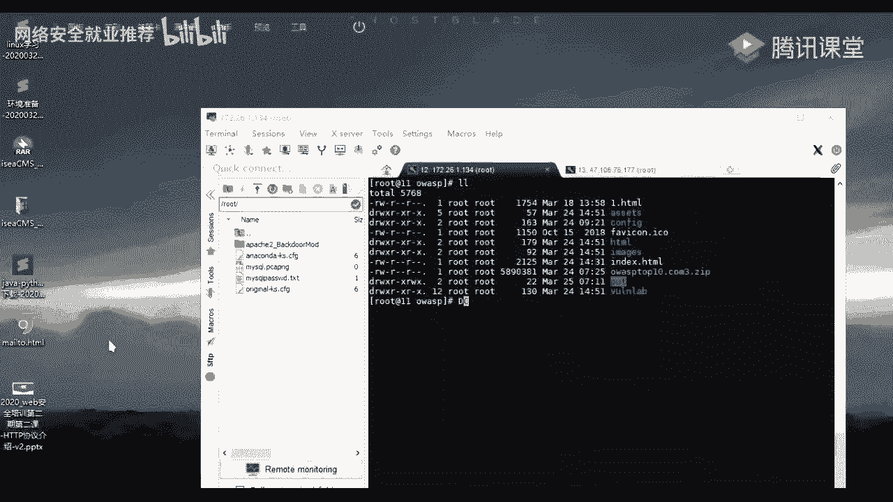

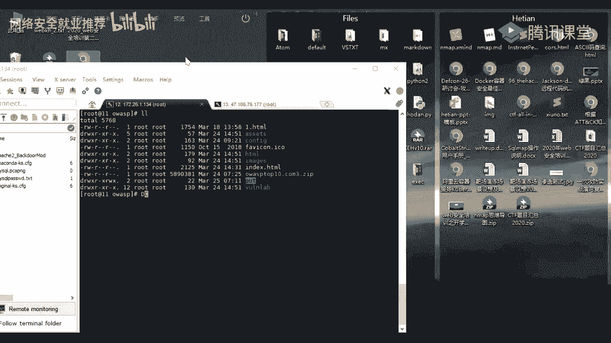

我就以这个文件做一个例子，比如说我这里打开打开之后的话啊，它会在浏览器里面展示给我们对吧，好的话，其实我们可以看到我们点一下，我们可以看到它的一个完整的一个路径，完整的一个路径的话是file协议。

就前面有一个file，然后后面的话是接我们的一个本地，文件的一个路径，以及我们的一个文件名对吧，就这个file协议其实就是用于啊，来找到我们本地的这样的一个资源。

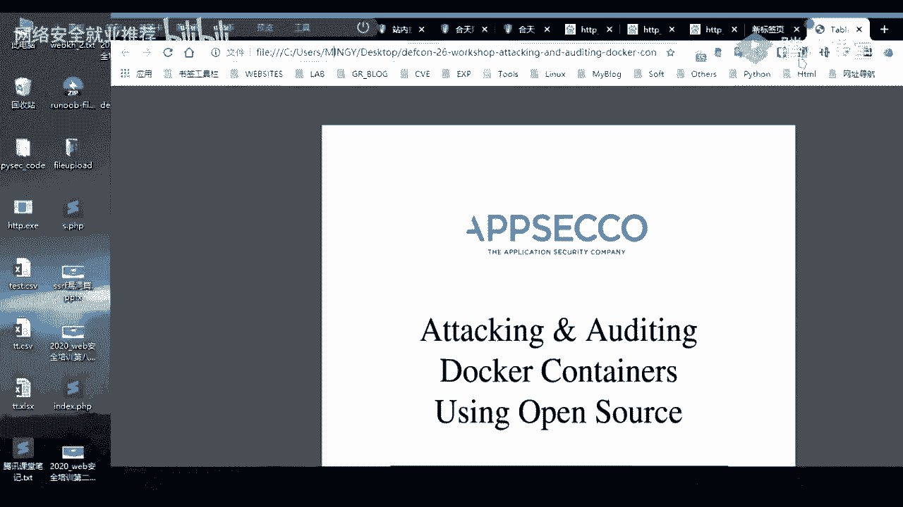

来打开我们本地的这个这种文件。

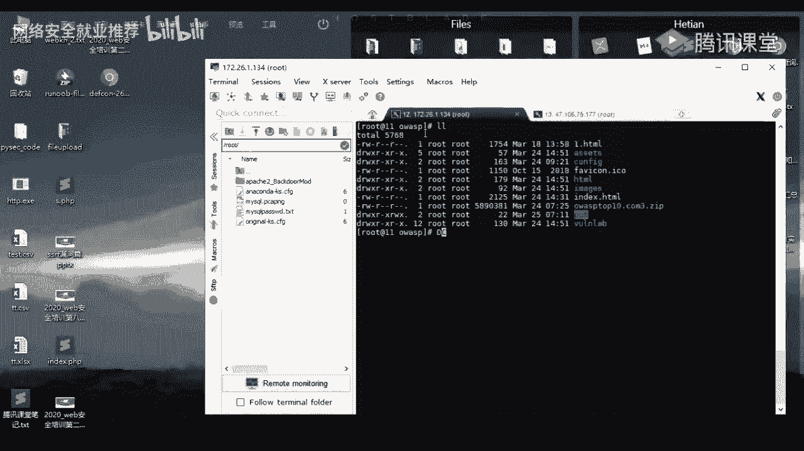

然后的话就是，啊不好意思啊，喉咙有点，稍微有点干。

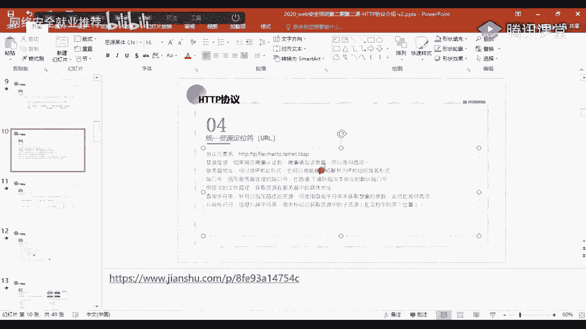

好的话就是呃比如说这一个male to，这个mail to的话其实就是我们的啊，我这里的话以这一个文件做一个演示吧，就它其实就是这样子的一个呃对嘛，这个代码的话其实就是一个呃链接。

然后他使用的话是一个这个ml to的一个协议。

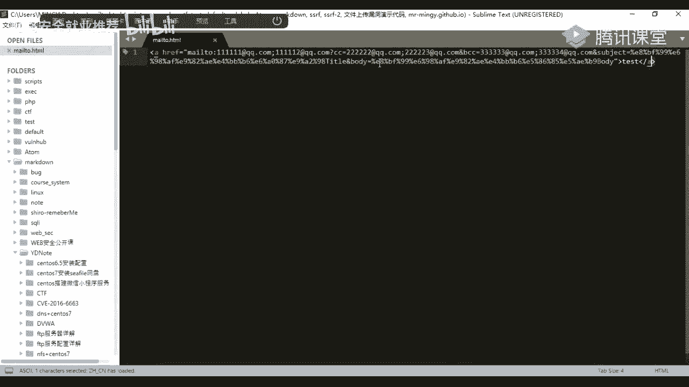

我们来看一下它的一个效果吧。

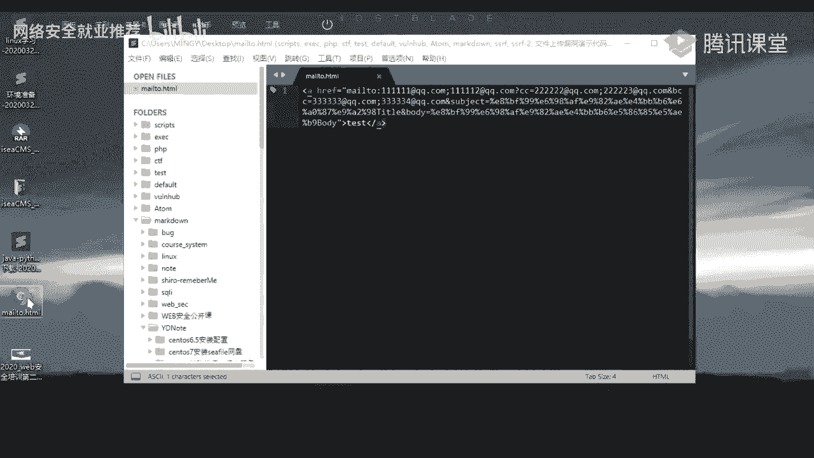

我们直接打开，打开字的话，它是这样子的一个页面对吧，我们点一下，点一下之后的话，它会跳转到我们的一个邮箱，可以看到这里的话他是，可以看到的话，它这里的话自动跳转到我本地的这样的一个呃。

这个fox mail这个接收邮件的一个软件，然后的话它自动的填充了，我们在那个代码里面所写入的一个，比如说啊邮箱对吧，收件人操纵人主题，还有内容等等这样的一个东西，这个的话其实就是用于啊。

我们去呃这样子去打开一个邮件，或者说呃打开给给某一个人发送邮件，然后的话回到我们刚刚的这几个题目，就第一个的话我们可以看到它，首先协议方案是一个ftp对吧，然后后面的话是我们的一个域名。

然后的话是接我们的一个呃文件路径对吧，它是完全符合我们的一个url的一个格式的，然后第二个呢，啊这个的话其实就是一个htm的一个代码嘛，然后就是大家看那个，就是别人的一些博客什么的对吧。

然后你点击那个邮箱地址对吧，它就会跳转到而邮箱，然后的话你就可以给他发发邮件对吧，其实也是类似的，而第二个的话它是一个大家做一个判断，它是不是一个url，好啊，看来大家都对这一个都比较了解了啊。

没错他就是一个要，然后下面的话嗯我就不一个一个的去问吧，啊比如说这个对吧，这个我们可以看到的话，就是我们刚刚演示的，就是在mato后面接我们的一个邮箱地址，这个的话它也符合我们的一个。

这样的话它是接了一个呃，这个是这个是ipv 6，然后后面的话接我们的一个一些参数，它同样的是符合我们的一个url的一个格式的，第四个也是，这样的话我就不一一的去讲了吧。

就是呃它的一个大家应该都能够有一个，基本的一个判断，然后这里获得这两个的话，可以看到他这里一个t t l，它是没有这样子的一个协议的，然后的话后面接一个一串数字的话，他不是一个url，还有这个un的话。

un的话就是前面我们说到的，它是一嗯，他是这个对吧，他不是属于一个url的，他虽然也是同样的，是属于啊u i i，然后呃介绍完ui i之后的话，我们一起来看一下好，这也是我们今天啊。

课程的一个主要的一个内容吧，首先前面的话我们有说到我们的一个呃，我们想要去浏览一个页面对吧，首先的话我们需要跟服务器建立这样的一个连，接，psp的一个三次握手是吧，经理连接之后的话。

我们在客户端再去向服务端发送，我们的一个请求对吧，发送请求的话，这里的话就涉及到一个客户端的一个请求消息，它是由哪些部分所构成，然后才能够被客被服务端所接受，然后的话被服务端做一个处理解释。

然后响响应回我们客户端想要的一个内容，这样的话，我们先来看一下客户端的一个请求消息，也就是一个htp的一个请求报文，首先的话我们先来看一下，它是由是一个由四个部分组成，主要的话包含有请求行，请求头。

空行，还有请求数据，就是我们从这个呃这张图里面的话，也能能够直观地看出来，它主要的话由这四部分构成，请求函头部，还有呃这里的话有一个空格的空行，然后后面的话接我们的一个请求数据，二，请求行的话。

它是由这样的一些部分组成，包括的话有请求方法，后面的话是接空行，然后再接我们的一个u r l，这里的话其实呃应该不是这样说，这里的话是接我们的一个呃文件路径，也就是一个ui，我们请求的一个ui。

后面的话接空格，然后接我们的一个协议版本，这个版本的话就是我们啊我们的一个htp请求，对吧，常用的一个版本就是htp干1。1，然后后面记住一是有一个回车换行符的，哦这样的话我就不一一的去说了。

后面的话会有详细的一个啊，分别对这一些部分做一个解答，我们看一下这样的一个请求的一个数据，我这里的话有做一个标注，比如说我这里去访问我们的一个，合天网安实验室对吧，访问房子的话，它会发送这样的一个请求。

这个请求的话，它是一个可以看到它所使用的一个请求，方法是post，然后后面的话接我们的一个文件，然后后面的话接我们的一个协议版本，注意最后的话是有一个回车换行符的，比如说我们有一个c啊。

c r l f这样子的一个换行符，然后后面的话底下这一部分的话，就是我们的一个请求头部的一个字段，就它的一个质量的话，就是由这样子的啊一些头部，然后后面的话接一些值所构成，就是这一部分。

然后在最后的话啊，就是在请求头部，跟我们的一个请求数据之间的话，是会有一个空行，这个空行空行的意思的话，就是表示我们的一个请求头部的一个数据，而是已经啊完毕了就已经结束了，然后的话在后面的话。

再去接我们的一个请求数据，也就是表示我们请求的数据啊开始，然后这一部分的话就是我们的一个请求数据，我这里的话是一个登录的一个界面，所以可以看到请求的一个数据化，就是啊用户名以及密码等等的一些呃。

这里密码的话是做了一个加密的一个处理，那我们再来分别来了解一下，请求行的一个构成吧，我们它的一个构成的话就是这样子，首先method method的话就是一个请求方法。

就比如说我们前面所说的一个post，然后后面的话注意是空行，后面接我们的一个啊request ui，然后后面的话接我们的一个协议版本，然后的话呃一个c r a f回车换行，那请求方法的话。

我们前面啊有了解到一种就是post对吧，post的话它是啊，像我们像我们前面的这个request uri所标示的，这个资源来附加新的数据，这个附加的话其实就是向他传送新的数据。

然后get的话就是请求我们的这个文件，这个ui所标识的一个资源，还有啊head boot delete等等这样的一些请求方法，这样的话呃大家看一下，下面的话会有实际的一个例子，给大家做一个演示。

有这样的一些请求的一个方法，然后在请求行之后的话，就是请求头部对吧，请求头部的话，它的一个构成其实就是header，header的一个字段，进入我们的一个head的值，然后回车换行，请求头部的话。

它其实就是它的一个意思，是允许客户端传递关于自身的一个信息，然后希望服务服务端向我们响应，什么样子的一个形式，想要什么样的一个数据，好在我们常用的一个1。1版本中的话。

请求头的话是就除了host cos的话，就是我们的这里这个这一个域名，就是我们的一个主机服务器的一个地址，还填lab。com，除了这个的话，其他都是可选的，比如说他而你它是可以不需要啊。

是在请求包中包含这样子的一些头部字段的，然后这里的话是呃，我列举了一些就是呃请求头部字段的一些，对它的一个解释以及例子嗯，这里我不做啊，我就不一个一个的去解释了吧，我这里的话写的比较详细。

而且的话还有一个例子，比如说呃host，host的话就是我们请求的服务器的一个域名，还有端口号，就像这样子的，然content length就是我们请求内容的一个长度。

就我们通过这个content类似的话来设置，我们比如说我前面这里的这个请求对吧，可以看到这里有个content length是316，这个316的话，就是表示我们这里的一个请求数据。

它的一个长度就是360，316个字节好吧，361个呃字符，呃还有常见的一些比如说rapper，rapper的话就是呃我们之前所访问的一个页面，然后的话访问之前访问的一个页面是啊，比如说是这样的一个页面。

然后我们在请求头部字段当中的话，带上这样的一个页面的话，就是告诉服务端，我是之前是在从这个页面过来的，就之前访问的是这样一个页面，然后在这个页面，然后访问到啊另外的一个页面。

然后还有的话就是orange，就是指明当前请求是来自于哪一个站点，以及啊一个cookie，就cookie的话就是把我们保存在这个域名下面的，这个cookie值会发送给我们的一个web服务器。

这里的话是我以呃，和天王实验室的一个cookie的一个类型，做的一个例子，在后面的话会给大家介绍一个cookie以及session，会有讲到，然后这里的话其实前面给大家也已经说过了，就控行的话。

它就它其实就是表示请求头的一个结束，然后标标志着请求正文的一个开始，也是我们的一个请求的一个数据，然后请求数据的话哦，我这里举了两个例子，请求数据的话有这样子的，我这里举了两个啊。

两种方法就是get方式的一个请求，以及post的方式的一个请求，用get方式的一个请求数据的话，他会把我们要我们的一个数据参数，它会作为一个url的一个一部分，就是它会放在文件路径后面。

在我们的一个就是请求的我们传递参数，在问号后面接我们的一个呃传递的一个参数，然后这一部分的话就称为查询字符串了，前面啊有说到要好的一个格式的时候，好，它是会有以这样子的一个啊参数名。

后面接我们的一个传递的一个数据，然后以and符号做一个分隔，就是多个参数之间的话，它会以and符号啊做一个风格，嗯好post的方法，发送了一个数据的话，它就是在我们的一个请求体当中。

就是在我们的控盘后面，然后接我们的一个呃发送的一个数据，比如说这样子的一个数据，然后前面的话我们介绍了一个客户端的一个，请求消息，以及它的一个组成部分啊，不知道大家有没有什么疑问，应该呃没有什么疑问吧。

我想大家应该都能听得懂吧，查four的four，擦破的for的话就是嗯他是啊，比如说我们的一个，我们经常我们去访问一个网页对吧，访问一个网页的话，它其实从客户端到服务端之间。

他不是说直接会有一个这样子的一个啊传递，它中间可能会有相应的一些代理对吧，在这个代理的话，它中间会经过一个这样的一个代理，我们可以通过这样的一个插four的，four这样的一个字段来告诉服务端。

我们的一个真实的一个嗯地址，然的话，服务端的话能够通过这个地址来了解到，你是从哪里过来的，而这里的话关于其他的一些呃头部的一个信息，我们可以看一下这个网址吧，啊这个是英文的，我们可以看一下这个网址。

这里的话有很好很详细的关于啊，htp的一些字段的一个解释，我这里p p的话只是列举了几个，关于这个差four的four，啊我们就是已知啊，英文的话大家自己想办法做一个翻译吧，翻译吧如果看不懂的话。

我们就以这样子的一个例子来看一下吧，就可以看到我这里的话一个插for的for对吧，这里后面所接的一个字段去，就是我们的一个client，我们的一个我们客户端的一个啊ip，我们的一个服务地址。

然后后面的话接我们的一个，如果是说经过了一层代理的话，他就会接我们的一个代理的一个啊地址，如果再经过一层代理的话，他后面再接上我们的一个代理地址，然后发送给服务端，服务端之的话就能够去啊。

能够知道它是从哪里发送过来的一个请求，这个应该理解吧，还有什么其他问题吗，其实就就是通过这一个能够找到我们客户端的，一个真实的一个ip地址，他从哪里发过来的一个请求，没有了是吧好，如果没有的话。

我们继续，我了解完我们的一个请求消息之后，我们来大概看一下它的一个响应的一个消息，同样的它是呃包含了四个部分，由这四个部分组成，就包括状态函以及我们的一个消息的一个响应，头部以及我们那个空盘。

然后的话是我们想要的一个正文，这话跟啊请求啊消息是类似的，我们可以看到，就前面我在我前面发送的一个这样的，一个数据包啊，就是跟我前面这里是对应的，就这一个，我这里的话向他发送了一个登录的一个请求，对吧。

但是我这里的话是写了一个假的一个呃，用户名以及密码，所以说他这里返回给我的一个消息，可以看到它返回的话是一个协议的，一个版本是1。1，然后的话后面接我们的一个状态码。

200的话就是表示我们那个请求是啊正确的，而且啊返回了一个响应的一个消息，就是我们的一个请求过程是没有问题的，就是我们的一个请求响应过程应该是说，然后后面的话是接一个。

ok就是我们的一个状态码的一个描述好，下面接的是我们的一个消息的一个爆头，就是啊发送给我们的一个，客户端的一些消息，然后我们可以看到啊，这句话主要说一下这一个呃。

server server的话就是说表示我的一个服务端对吧，我服务端的话是一个nginx的，10506的一个啊服务，然后的话呃我这里接一个content type的话，意思我这里发送给你的一个数据。

它是一个jason啊，jjason的一个数据，然后它的一个编码的话是一个呃ut f杠八的，到这里这里有一个set cookie，就set cookie的话就是呃在这方面我给大家讲一个cookie。

session的时候会有说到这样的话，我提一下，就是啊，我们客户端去访问我们那个服务端的时候，我们第一次去访问的时候，访问之后的话就是发送我们的一个请求之后。

服务端它会响应给我们这样子的一个set cookie，的一个字段啊，这一个set cookie就是服务端它生成了一个cookie，然后响应给客户端，客户端的话他会做一个啊存储，存储之后的话。

就便于我们下次的下一次的一个访问以及请求，然后后面的话是接控盘以及我们的响应正文，这里响应正文的话，它是我们的一个jason的一个格式，然后呃状态行，然后的话就是协议版本，状态码以及状态码的一些描述。

我们来了解一下状态码，这些的话大家看一下吧，就是大家了解一下就可以了，就大家再去，比如说用bp去进行一个抓包的时候对吧，我们看到这样子的一个状态码就能够知道啊，它的一个意思，就状态码的话。

它其实是有三位数字组成，主要的话就是看第一个数字，第一个数字的话，它就表示了我们响应的一个类别，就是它的一个类型，就比如说他第一个字，第一个数字化是一，就是一个指示信息，就是表示就是告诉客户端。

我们你的请求已经被服务器接收了，然后等待下一步的一个处理，就是说他的一个请求是还没啊还没有完成的嘛，然后二的话就是成功，就是表示啊你的这个请求已经被服务器接收，而且服务器啊已经处理完毕。

然后发送了一个响应给客户端，就是说我们的一个请求已经成功地完成了，然后三的话就是重定向，是的话就是客户端的一个错误，五就是表示服务端的一个错误，就比如说嗯常见的一个302的一个跳转。

就说我们访问一个这样的一个页面，它需要跳转到另一个页面，就它会响响应响应给你一个302，然后的话他会啊继续有下一步的一个请求，是跳转到指定的一个页面，还有嗯404，404的话。

就是说嗯就是说你这一个文件的话是没有找到，就说你客户端的一个请求，你是错误的，就有语法错误啊，还有的话就是五开头的话，就是说明你服务端的话，服务端在处理你客户端的一个请求的时候，是啊发生了一个错误。

然后这是一些常见的一个状态嘛，大家看一下了解一下，然后了解完请呃，就是响应消息的一个状态函之后，我们来了解一下它的一些头部字段，然后呢，这里的话其实啊这里的话大家啊看一下吧，我不一一的去讲解了。

啊关于这一个他不知道的话，呃，同样的就是大家去看一下，那个刚刚我发给大家的那个网址，就是有很详细的关于这一个呃，专业的关于头部字段的一些了解，因为他的一个头部自动化是啊比较多的，可以看到有这么多。

如果讲的话是，不是一一节两节课能够讲完的，这样的话啊，就是我这里列举了一些常见的一些头部字段，这里还有就是通行以及响应数据的话，跟前面的话是啊，前面也有说到了，也是类似的。

然后下面的话我们呃就前面的话都是一些，就是理论的一些基础吧，这样的话下面的话我就是用一些呃，实际的一些操作，来大大来带大家一起来理解一下，首先第一个的话就是一个get请求，就前面我们了解到get的话。

它就是获取查询我们想要的一个资源是吧，都获取啊指定的一个资源呃，访问一个指定的一个页面，它是不包含请求的一个主体主体的，也就是后面它是没有相应的一个请求数据的，所以的话呃。

大家跟我可以跟我一起来进行一个，相应的一个操作，首先的话就打开bp，打开bp的话，这里大概给大家说一下bp的一个使用方法，呃应该在刚开始上课的时候就给大家介绍一下，啊我这里的话用另外一个浏览器啊。

这样的话我用的这个edge浏览器啊，首先dp的话它是一个抓包，一个代理抓包的一个软件，就是我们可以通过这个软件来抓，抓取我们想我们访问的一些数据包，它的一个请求以及响应我们都能够查看得到，可以看到。

然后怎么去对它，怎么去使用它呢，首先的话我们需要在浏览器里面做一个代理，就设置我们的一个代理啊，我这里的话是使用的这个工具啊，这个switch army image这样子的一个工具哦。

当然的话这个工具的话是呃，在谷歌商店里面可以去进行一个安装的，说的话呃大家自己去呃想办法，如果想要去使用这个工具的话，这工具的话就是你切换的时候就比较方便，这样的话你没有也是可以去进行设置的。

我们的话打开我们的一个设置，呃然后的话是在，啊我不用这个吧，因为这个可能大家不是很常用这个浏览器，我就用谷歌吧，我这里的话打开这个设置对吧，设置的话呃，翻到最底下有一个高级高级，这样的话我先把它。

我先把它停用，就如果你啊装了那个插件的话，就会由另一个插件来控制，你的一个计算机的代理，如果你没有装的话，就是这样子，我们打开我们的一个计算机的一个代理，而这里的话它会跳转到呃，它会跳转到这里。

就是系统的一个设置，这里的话我们，打开这里就是使用代理服务器，然后输入我们的一个地址，就是我们本地，然后我们的代理的一个端口是8080，为什么要设置8080呢。

因为bp的话大家可以在这里有一个pro pro，这里的话有一个options这里一个选项，而默认的话它的一个代理的一个端口的话，是这个8080端口，就本地的办理办理窗口。

然后所以这里的话我们需要设置跟他一样的，然后保存啊，当然这里的话嗯，这样的话就是这个的话，如果说你你想要带你你本地的，比如说你local host，比如说你想要访问你的一个，你在本地的一个网站对吧。

如果说你使用的是这样子的一个啊，12700。1，就是说在页面上面你输入这样子的，或者说lock host，来去访问你本地的这个web服务器的话，然后你想要去用这个bp去进行抓包的话。

你就需要把这里的这一些这些参数，都把它给删除掉，因为这里的意思的话就是说如果是啊有这样的，有符合这样子的一些好ip的话，他就不会去走代理，比如说第一个的话就是locos嘛。

就如果说你是使用locos去访问你服务器的话，他是不会走代理的，那那你如果说你不想要嗯。

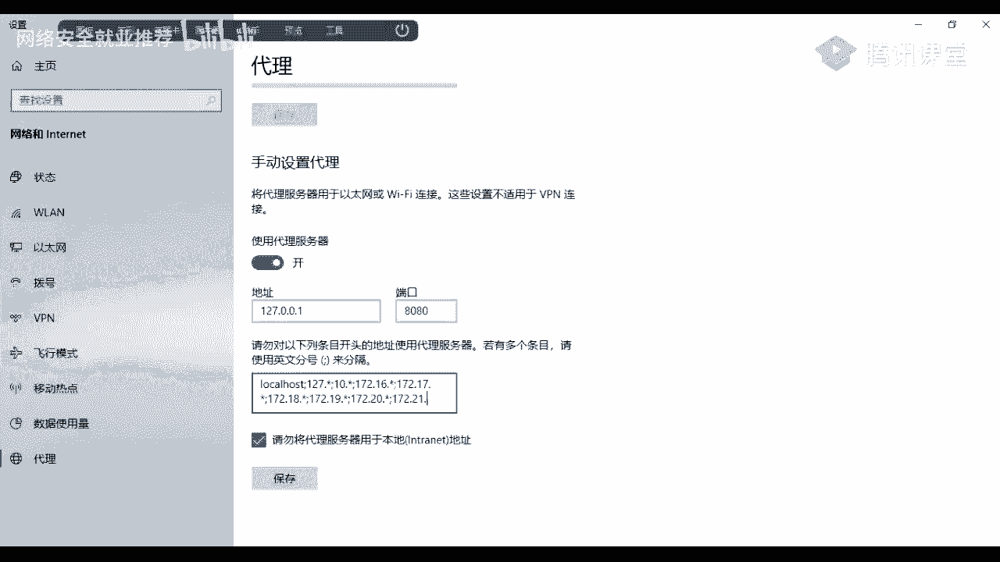

就不想把它去掉的话，要想访问本地的话，你就可以就是找到你自己的一个内网ip。

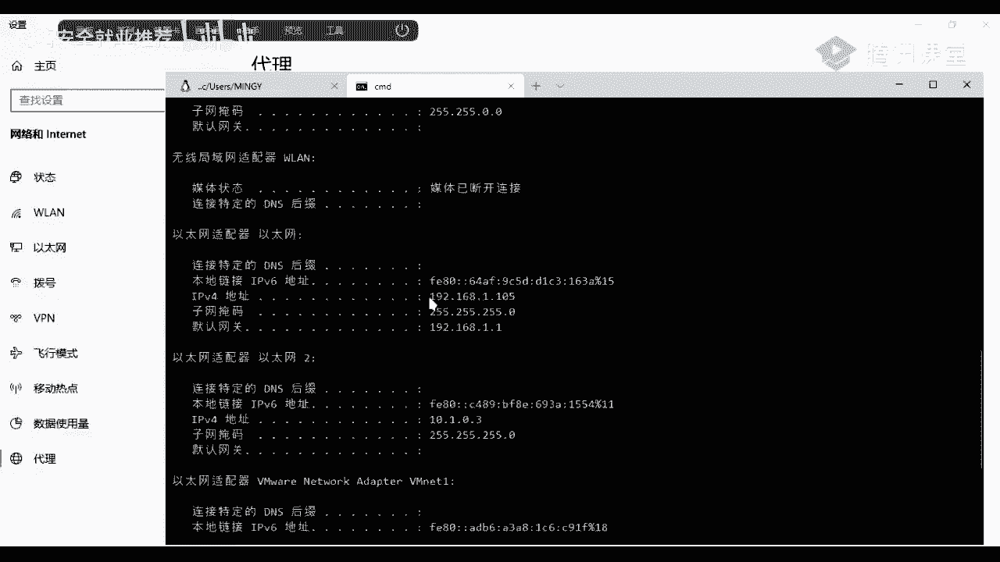

我们cmd里面查看ip configure，找到你本地的一个ip，然后的话可以使用你本地的一个ip，来去进行一个访问，就能够通过啊bp来进行一个抓包，这样的话呃设置完毕之后我们就能够去呃。

设置完毕之后的话，我们就需要在这里，这样的话有一个excel intercept，intercept的话就是呃进行一个拦截抓包，这里有一个选项，这里是一个off的话，就说明他是没有开启抓包的。

如果说点一下就它会信啊，它会变成黑色吧，就是is on就说明他已经可以做一个拦截了，就说我们这里访问的一个数据包都会经过啊，我们的这样的一个bp可以看到这里的话呃，有抓到一个包。

我们可以点这个forword来发送，发生的话他就是就是下一步的一个请求嘛，如果说你不想你不想要这个包的话，你就可以把他教辅丢掉，嗯这话呃我就不一一的一个一个的去那个了。

然后这里的话呃我还是习惯使用这一个，因为这样子的话就是好操作要更加方便一些，嗯这样的话我就不去使用这一个了，使用这个浏览器，当然的话火狐火狐的一个设置也是一样的，就是在设置里面有一个代理，设置好的话。

就用这一个选择bp，然后我想要去，我先去抓个包对吧，在抓到之前的话，我再介绍一下这个吧，这个的话有个htp的一个history，就这个history的话就是我们这里啊，我不开这一个对吧。

我因为我开这个的话，它就会拦截你当前你反请求的这样的一个包，如果不开这样的话，他比如说我这里我先把它清掉，然后的话我去访问啊，我们和天网实验室对吧，可以看到，那这样的话就会有这样的一些数据包。

从这一刻开始对吧，它首先的话是啊一个一个get请求请求了，我们的服务器的主机是这个对吧，那我们可以在这里能够看得到他的一个请求的，一个请求啊，消息请求报文就跟我们前面是啊类似的对吧。

就包括我们的一个请求行以及请求头，因为这里的话没有呃，其他的一个请求数没有用get方式去请求数据，而且各种方式的话，它是没有这样的一个请求体的，也就是在后面的话呢是没有啊一些数据的。

你就算用get方式去传递数据的话，也是在我们的这里，到我们的一个u r i url上面去进行一个添加，然后在这样的话能够查看到一些它的一些参数，好以及他的一些头部，这里的话是一些字段。

以及它的一些头部的一个值，这个的话是它的一个16进制哦，其实主要的话就是看这个request，还有response，也就是它的一个响应，响应的话可以看到我这里请求的是这个啊，htlab，然后它是一个呃。

就是干干的话就是直接是访问的他的一个网站，后面的话没有接其他的一个路径，然后他的一个响应的话就是这样子，同样是包括一个呃，状态函，然后包括一个请求头，可以看到这里的话，我们请求我们请求这个网站的话。

它就会反响应给你这样子的一个set cookie，里面的话就包含我们的一些我们的一个cookie值哦，这个cookie值的话，我们可以在第二个第二个请求当中，能够可以看到，可以看到在这里的话。

他就会带上了这样子的一个cookie值，也就是客户端，它在发送向服务端发送请求的时候，它会带上我们的一个啊cookie值，然后的话再发送请求，这样的话就是能够查看到啊，我这里去访问呃，实验室的一个页面。

然后的话它有哪哪样的一些请求，他们都会在列列，在这里，也是我们的一个htp请求的一个历史记录，这就是这一个模块，然后刚刚的话我们看到了一个get请求对吧，它是像这样子的一个形式。

我们如果说想要重新去发送这样的一个，get请求的话，我们可以把它发送到我们的一个，repeat的一个模块，发送到rep的模块的话，我们可以通过右键，然后这里send to repeat。

这个单号我是习惯性的话会使用快捷键，就是ctrl加哈，就是这个ctrl加好的话，它就会发送到我们的一个repeat模块，再把我们的一个get请求的一个好消息报文，他会念到这里，然后我们直接点这个发送。

发送之后的话，它就会向服务器发送我们的这样的一个请求，好以及，返回服务端的一个响应，这就是一个啊get请求，然后的话就是post，post的话就是像我们的一个指定的一个啊ui啊，附加新的一个资源。

也就是传递我们的一个数据，就一般的话post请求的话，它适用于我们的一个表单的一个提交，以及文件的一个上传，什么是表单的一个提交呢，就这里的话我以这个我们的一个登录对吧，登录的一个页面我先在这里嗯。

我先把它清掉，就方便查看，首先这里的话是一个登录的一个呃，这样子的一个界面对吧，这里的话就是啊如果懂前端的话，就是知道我们在这里进行登录的时候，它其实就是一个表单，好，我们把我们的一个数据填写到这里。

比如说我这里是12345，阿sir qq。com，密码的话随便输一个，然后的话我这里进行一个登录，登录之后的话，它就会有这样子的一个请求，好我们可以看到它的一个请求类型的话，就是一个post对吧。

然后pos了之后的话，它就会有这样的一个响应，这样的话主要是看这个这里我们post了之后的话，可以看到它post的一个路径，一个文件路径就是这个对吧，logan。action，也就是我们的这个这一部分。

然后的话是我们的一个host，我们请求的一个服务主机，以及我们的一些啊头部字段就告诉服务器，我啊我的一些信息，比如说我是从哪里过来的对吧，ron不是我上一个访问的页面，是这个loglabel。

can do对吧，就我的这个请求，他是从这个页面过来的，以及orange的话，就是我的一个啊，我是从这个和天lol。com这个网站，然后的话就是一个cookie值，这里主要的话就是看一下这里啊。

这里的话就是我们请求的一个数据，也就是我们所说的一个表单，它的一个构成的话就是这里我们的一个参数，后面的话接我们的一个值，比如说这个user name，就是后面接我们的一个用户名对吧，他是word。

后面接的话是我们的一个密密码，当然的话这里是一个加密的一个密码，好请求的一个参数的话，用多个参数之间的话，用and进行一个连接，这就是一个post的一个请求，然后因为这里的话是一个呃。

用户跟密码是错误的，所以它的一个响应的话，可以看到它返回的是一个节省的一个数据对吧，好返回一个json数据的话是这样子的一个数据，它的一个结果的话是fairly，也就是失败的是吧。

就是说你的一个请求是啊错误的，就是说请求是不成功的，比如可以看到这里的话，账号密码是不正确嘛，对吧啊，不是说请求成功，是你的这个账号密码是错误的，它会返回这样子的一个呃响应给客户端诶。

然后的话就不会有下面的一个请求，就比如说这个话是没有登录成功嘛对吧，它不会跳转到我们登录之后的一个界面，这就是一个post的请求啊，提交表单哦。

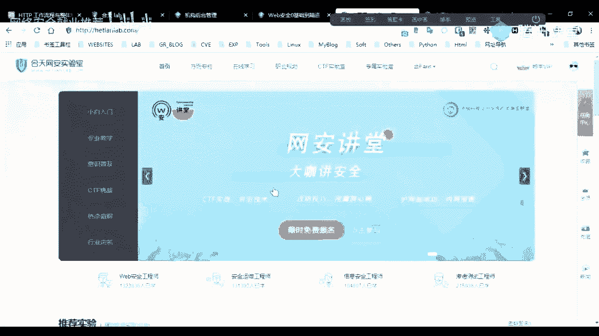

还有的话就是呃用于在进行一个文件上传对吧，文件上传的话，我以嗯，我这一个服务器的一个例子吧。

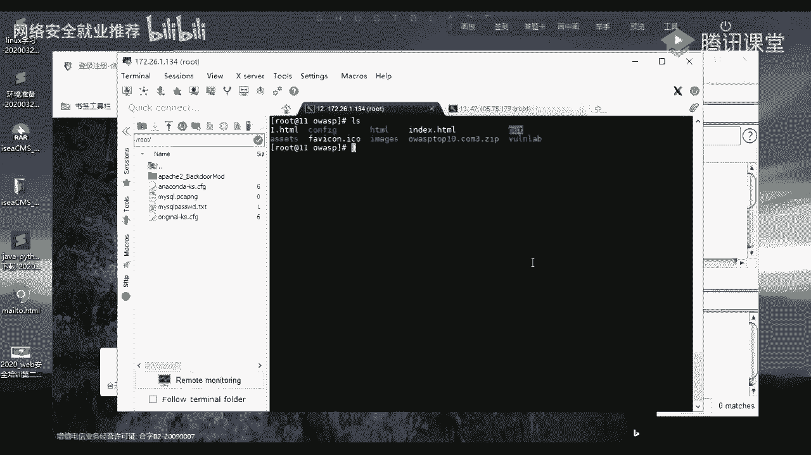

啊。

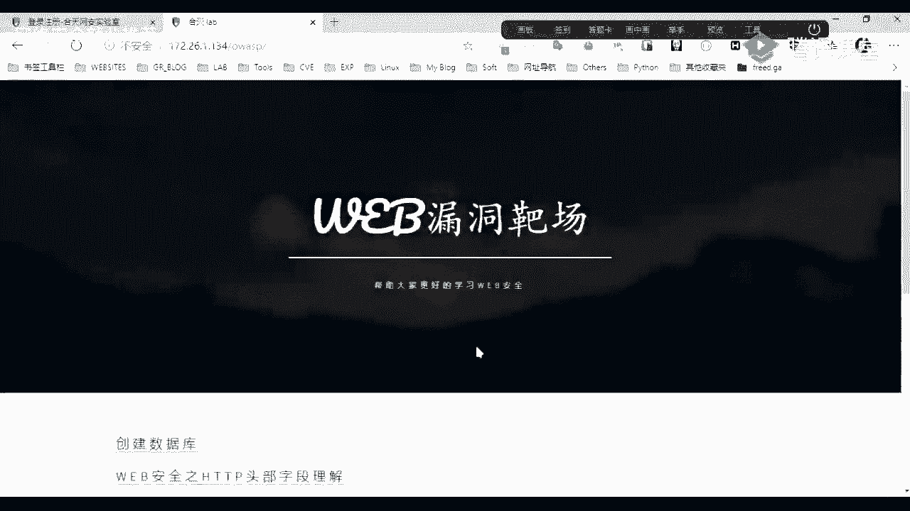

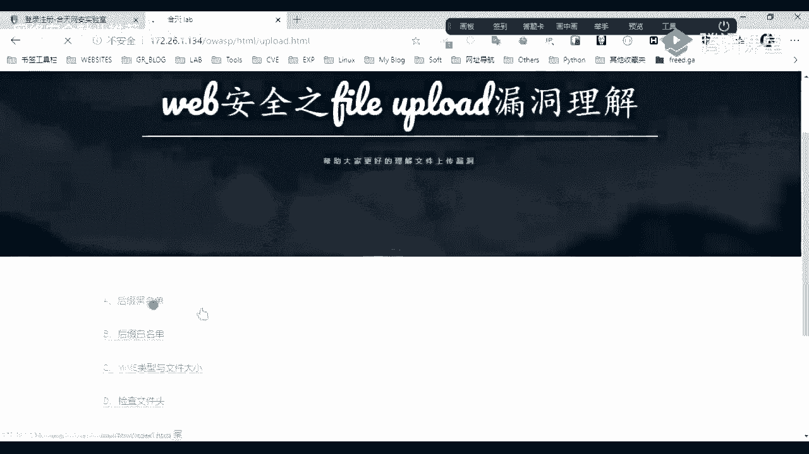

所以这个呃文件上传这个啊，我随便打开一个，这样的话是一个上传文件的一个页面对吧，嗯这样的话我随便找一个文件，首先的话我先选择一个文件，一个，我穿上传一个这个s。p h p打开。

然后这里的话我先对它做一个，抓包吧，然后我们点击summit，也就是提交办法好的话，可以看到它的一个请求的话，就是这样的界面，我先把它发到我们的一个repeat是吧，它的一个请求的一个报文是这样子的。

一个post的请求，请求的一个啊文件的路径的话，就是这个upload下面的一个一点p h p好，主要的话是看这里，下面这里的话一个请求的一个请求体，就我们的所传递的一个数据，它是这样子的一串数据。

这样的话给大家介绍一下，我们先看一下ppt，就给大家介绍一下p p他请求的方法的几种，content type，就说几种啊，类型，首先第一个的话就是这个application差w form。

就是这个的话是最常见的一个post的一个，提交数据的一个方式，就是我们的就在传递表单的时候，它是使用的这样的一个content type呃，其实，把我删掉了呀，好这个。

就这里刚刚的话就是我们用post来去提交，我们的一个进行一个登录对吧，一个form表单可以看到它的一个content type，就是这里他的content type的话就是这一串。

这个的话就是啊表示就是啊，我传递的一个数据的话，它是一个原生的，就是一个form表单的一个数据，嗯它是啊浏览器能够支持的，而第二种的话就是这个markepmt part from date。

就这种方式的话，它一般是用来上传文件，也就是我这里给大家说到的，这一个在你上传文件的时候，它的一个content type，它的一个呃加密的一个方式是在这样子，他的话要注意的话。

它这一个在上传文件的时候，他会首先会在这一个content type上面，会随机生成一个这样的一个binary的一个字段，它是一个随机的一个字符串，就这一个，然后的话生成这样的一个随机字符串之后。

他这一个是什么意思呢，就是嗯看一下这一段话了，它是啊这个binary它是用于分隔不同的一个字段，就是避免与正文的一个内容重复，然后这里的话是一个随机生成的一个字符串，然后因为它是比较长的，不好意思。

烤的有点干了，我看了一下时间哦，好像要加班了，然后这里的话我我我啊，这次课程的话，我先就把这个讲完吧好吧，把这个pose的一个理解理解讲完好，后面的话后面的一些内容的话，我下节课再给大家做一个介绍吧。

好吧，这里的话呃可能内容的话会稍微多一点好，下节课的话我是一个考核，考核之前的话呃，考核的话我会把这个就这个网址发给大家。

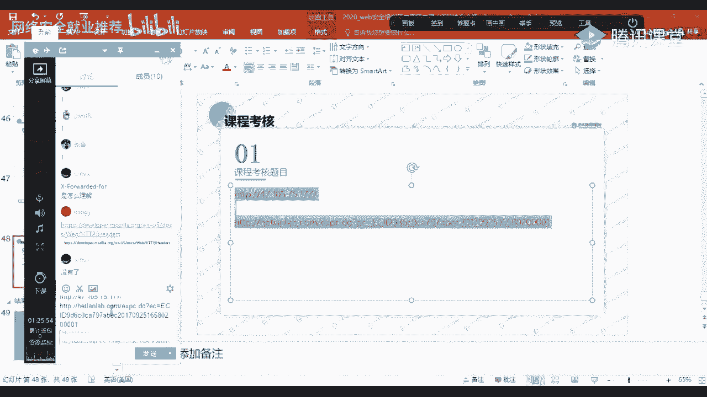

以及啊有一个实验。

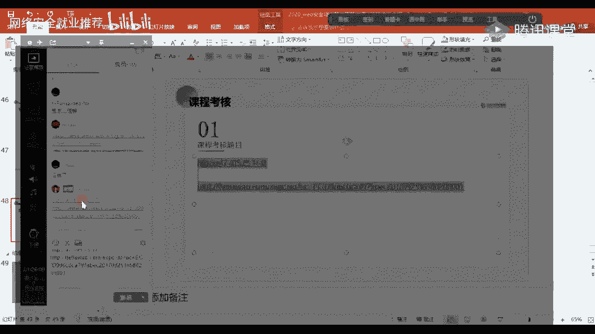

呃呃这一个房子，这样的话就是呃一个比较简单的一个靶场，这关于头部字段的一些理解的一个题目，大家可以呃就做一下，然后下一次课的时候，就是把这个考核做一个讲解，对题目的话是比较简单的。

就建议大家自己独立完成，然后的话还有这个实验，这个实验的话就是关于啊一个put方法的一个，漏洞的一个利用，就是这一个tomcat的一个远程代码执行漏洞，是它是呃关于一个put方法的一个利用呃。

因为本来我这节课也会有给大家讲一个，put方法的一个利用，但是因为时间关系的话啊，就下节课再给大家做一个讲解吧，那么还有一部分的一个内容，这样的话我先把这个post post的方法给大家呃，讲完。

就前面的话讲到，我们使用这样子的一个方式方式来，而这样的一个编码方式，就是这个content type来用来上传文件的时候，会去使用到，然后的话他会在这个content type里面的话。

它会生成这样子的一个随机的一个字字符串，它主要是为了分隔不同的一个字段，我们可以来看一下这一个，它是以这一个随机生成的一个字符串对吧，你啊发送的这个数据也就是我们的一个请求体，它是以这一个字串开头。

然后后面的话是接我们的一些，比如说我这里上传的是一个文件对吧，他这里接的话是我们的一个文件名对吧，fire name以及它的一个呃content type，它的一个数据类型，他这个呃不是数据类型。

是那个好文本的一个。

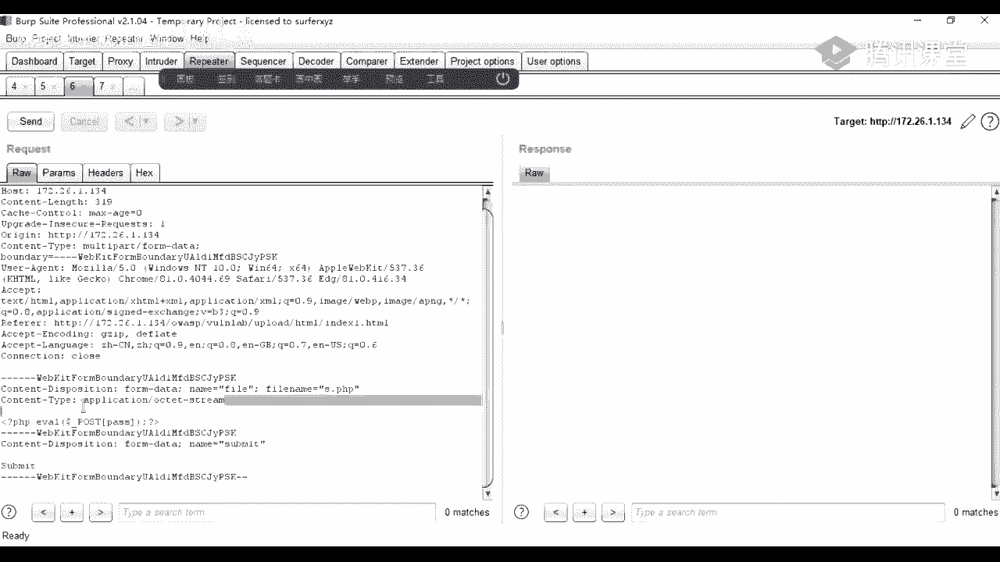

呃，这个是叫啥，虎狼漫的。

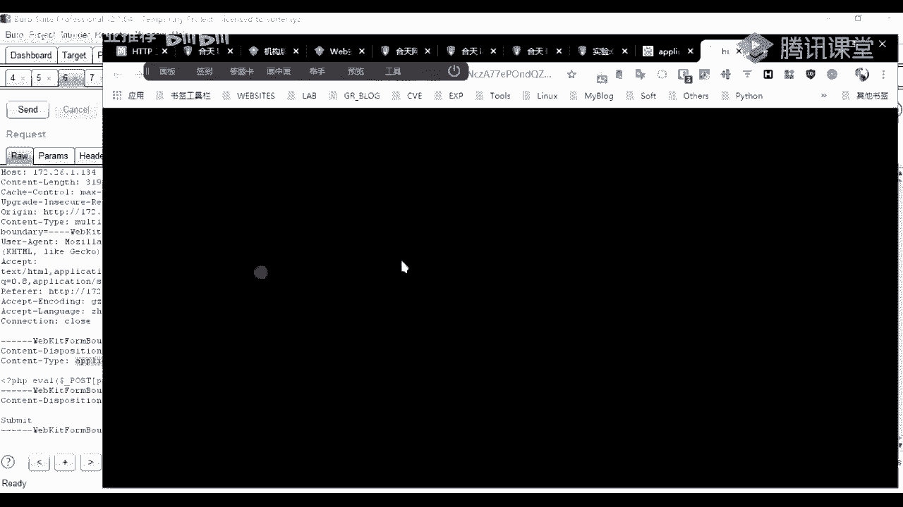

啊这个的话是，啊就叫做肯定tab，就是他的一个呃编码的一个，数据流的一个类型吧，然后我这里的话是这里的话是啊，传的这个s。ktp文件里面的一个内容，这个内容的话就是一个常见的一个一句话嘛，对吧。

然后后面的话同样的就是接我们的一个呃，这样的一个班队，来分隔我们的一个上面的一个内容，以及下面的内容，然后的话啊，最后的话再以这一个bundle字符串做一个结尾，这就是上传文件。

它的一个请求头的一个啊构成的一个部分，构成的一些部分的一个讲解，我们这里可以来看一下，就是我这里来发送这样的一个请求包，可以看到它这里是啊有这样的一个响应，就是啊。

它不支持上传我们的一个菲律宾的一个文件，这就是啊，使用post的方式来向服务端传递一个数据，在这里的话是呃传递我们的一个父母表单，然后这里的话是我们在上传文件的时候。

它的一个呃上传文件的一个请求体的一个格式，也就是我们上传文件的一些内容，以及它的一些啊数一些信息，好嗯，然后后面的一些相关的，还有一个head head的方法以及option啊。

还有啊put以及delete方法，这样的话啊，我们留在下一节课再给大家做一个讲解吧，因为现在的话我时间已经不早了，我也忘记看时间了，所以啊可能稍微又耽误了大家一点时间吧，哦大家呃应该没有什么问题吧。

如果有什么问题的话，呃大家在群里或者是说明天再问吧，因为现在也不早了啊，想大家应该也应该要早点休息了吧，如果有什么问题的话，下一节课或者是说呃在群里，然后的话再问我吧，好吧。

那我们今天的课程内容的话就到这里结束了，好有问题的话，我再私聊我吧，欢迎大家来进行一个提问吧，啊谢谢大家的一个啊观看，我们下节课再见。

perfect and professions to get your，背景音乐是不是声音14 百合适，to you，you're my end。

and my began even when i lose，i'm winning，cause i give you all，大点是吧，好搞小一点，好的话，我们按照画面呃。

八点钟正式开始我们的我们今天的课程内容，然后的话还有大概十分钟，我们先先找一下音乐，然后等待一下同学们的进入直播间好吧，cause i give you all，阿弥啊。

you look around and staring back you，another way of d，will it pull you，wonder，you wonder。

what is f overtaking，what if i never make it，what if no ones there，will you hear my p。

when you take that first step into the unkno，you know that he won't let you go。

so what are you waiting for，啊对了，就是在上课之前的话，我我想起来就是上节课的话啊，我有布置几个作业，就是这一个实验以及呃，这里的几个题目大家有没有去做，呃大家反馈一下。

我就是嗯大家有没有去做这些题目，以及这一个实验，然后本节课的话会给大家就是大概的讲解一下，这几个题目的一个呃解题过程，以及如果有必要的话，可以呃讲一下这个实验的一个过程。

就是说带大家一起来做一下这个实验，做了是吧啊，做了的话有啊，应该都做出来了吧，就是有没有写这种呃文档，就是你的一个解题过程，实验也做了啊，就有没啊，就这些题目以及实验需不需要做一个讲解呢，哥们啊。

都大家都会做了是吧，就不需要我去再做讲解吧，题没做，是不知道网址吗，就这几个题目题目的话就是其实课上的话也有，就它这里的话都有提示的对吧，然后的话就是呃它的一个一些题目，涉及到的内容的话。

就是我们上节课讲到的一些请求头，对它的一个基本的一个理解，就是上节课的话啊，几乎都有讲到，呃如果呃就是需要我去讲这些题目，以及这个实验的话，大家在啊在这里扣一个一吧好吧，就我了解一下大家的一个情况。

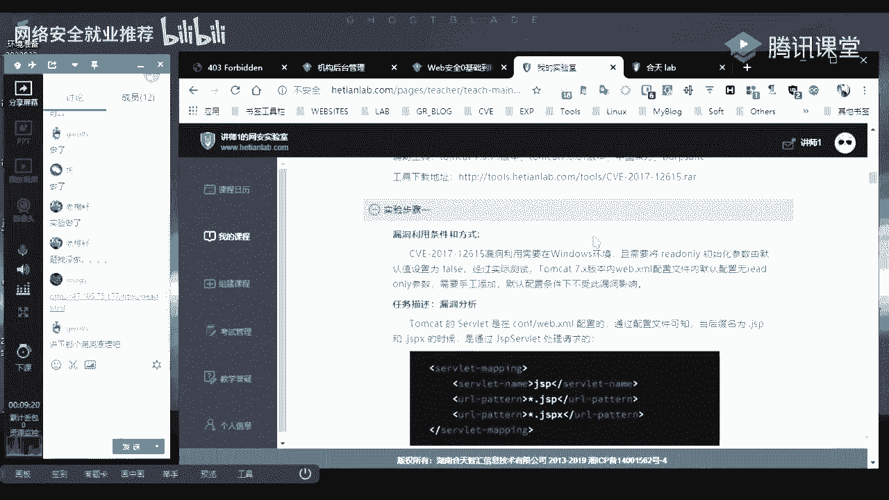

这个漏洞原理吗，漏洞原理的话，这里不是写了吗，他这里的话已经写得很清楚了呀，代码什么的也贴出来了，然后呃机器里面的话也有源码，就你跟着他去，如果说你看得懂这些代码的话。

你跟着他去跟着他的一个思路去理解就行了，如果说呃就是这些代码如果不理解的话，呃我这里讲讲也是呃没有什么意义的。

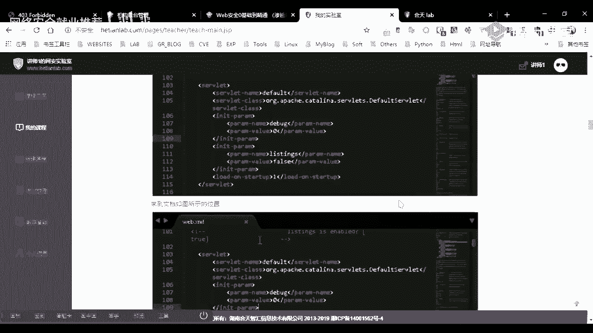

讲一下第三题，这个是吧，呃有人的话想啊，想要听讲题目，还有的话需要讲实验是吧，然后呃其他同学呢就就这三位同学需要讲解吗，具体会是什么样的表现，就是说我们可以通过它这个漏洞的话。

上传我们的一个web shell，上传我们的一个木马，然后的话我们能够直接去而进行一个连接，然后得到他服务器的一个web share，给我讲一下吗，好的那那就都讲一下吧，呜，好大家晚上好啊。

我们现在的话正式开始，我们本次课程的一个内容，然后因为上一节课的话，因为时间关系，就是说呃，还有一部分的一个内容没有给大家介绍完，然后的话呃我们这节课的话，把上节课啊没有讲完的一些内容的话。

再做一个补充，我先上节课的话，我们讲到了就是htp请求请求方法的接离，讲到了前面的两个，也也是我们常见的一个get方法，以及我们的一个pose的方法。

他的话对post的几种的几种content type，也就是我们传输的这种数据的一个类型，做了一个啊讲解，好，下面的话，我们一起来看一下这个header的一个请求方法，就是header。

他是请求获取由我们的这个ui所标识的资源，的一个响应消息的一个抱头首部，就它它是不会返回我们的一个报文主体的，它只返回我们的一个响应消息的这一个，包括状态行以及头部，而不会啊。

而不会返回我们的一个响应响响应的一个主体，按option的话就是查询资源所支持的一个方法，也就是通过这个options方法的话来查询服务器，它所支持的这样的一些请求方法。

比如说如果比如说我们可以通过这个option方法，来查看这个我这一个服务器它支持的这些方法，有这有我在这里红框所框的这些方法，有get a had a post。

delete chess等等的这样的一些方法，然后第三个的话就是这个put put it的话，就是请求服务器存储的一个资源，然后我们利用这个ui来作为它的一个标识，然后这里需要提到的一点的话。

就是服务器它会将请求主体的一个内容，会保存到我们url指定的一个资源位置，就是通过这个库的方法，可以帮可以把我们的一个请求体，请求主体中的一个内容保存到啊，服务器的指定的一个位置。

然后这里的话就会有两种两种情况，就是说第一种，第二我指定的一个资源，如果它不存在的话，服务器它会就会新建这样的一个文件，也就是以我们这里的一个u i i，作为它的一个标识，或者是说文件名的一个文件。

然后的话将我们请求主体里面的一个内容，保存到我们新建的这个文件里面，然后他返回那个响应状态码的话是201，而第二种情况的话，就是ui l它指定的资源存在的话，服务器就会重置这个文件里面的一个内容。

然后用我们发送的这个请求主体中的内容，来覆盖原文件的一个内容，然后响应的一个状态码是200或者204，对大家可以看一下我这里的一个例子，就说我通过这个put方法，因为我们前面的话已经知道了。

就是说它这里它是支持一个put方法的，一个使用的，然后的话我们可以通过这个铺的方法来上传，我们这里的啊，不是是来向我们的这一个服务器指定的这个呃，ui的一个资源，来写入我们这里一个请求体的一个呃内容。

就把我们这里请求题的内容写入到我们的这里，比如说这个boot目录下面的一个info点，菲律宾文件里面，然后这里写入的一个内容的话，就是一个菲律宾form，然后大家可以看到这里的话。

它返回的一个状态码的话是201，然后的话有一个状态的一个描述，描述字段是created，前面我们只啊介绍了，就是说这里如果是返回这个这这个201的话，就是说说明我们指定的资源。

就是我们的一个服务器上面的话，它是没有这样子的一个因或点菲律宾文件的，而我们通过put方法来新建了，这样子的一个文件，然后可以看到它在这里的话，有这样的一个一个英文的一个提示。

就说这里有一这里的一个我们的这个ui已经啊，就是说这个文件已经被创建了，delete方法的话是请求服务器删除我们的一个ui，所标识的一个资源，就前面的话，put的话，就是像我们那个服务器。

创建一个我们指定的这一个文件对吧，第二条的话，就是而删除我们指定的这样的一个文件，然后删除之后的话，它会返回这样的一个2。4的一个呃响应嘛，可以看到哦，这里的话是用删除删除成功了。

然后的话我们再去执行一下，这一个就是访问，就是通过get来去获取这个资源的话，可以看到它是啊找不到这样的一个文件，就说我们前面通过put方法上传的这个文件，是啊已经找不到了，就说明我们已经删除成功。

然后的话是一个chess，chess的话就是路径追踪，它的一个作用的话，就是请求服务器回送收到的一个请求信息，主要的话主要的一个作用是用来测试，还有诊断我们发送的这一个一个请求。

他是否在客户端与服务端之间做一个传送，的时候被啊网关啊，防火墙代理等等做了一个更改，我们通过这个确实方法来去验证，我们的这一个请求，请求消息里面的一个内容是否被做了一个更改，可以看到我们通过这个方法。

能够在我们的一个响应体中返回，我们的一个请求头的一个内容，然后可以通过这个内容的话，来跟我们的一个请求做一个比较，来进行一个判断是否被更改了，奥特曼，下面我们一起来啊，通过几个例子。

通过几个实际的例子来给大家就是解释一下，你对它做一个进一步进一步的一个理解，这样的话大家首先呃可以跟我一起来做，就是打开我们的一个bp，打开app搜的话呃。

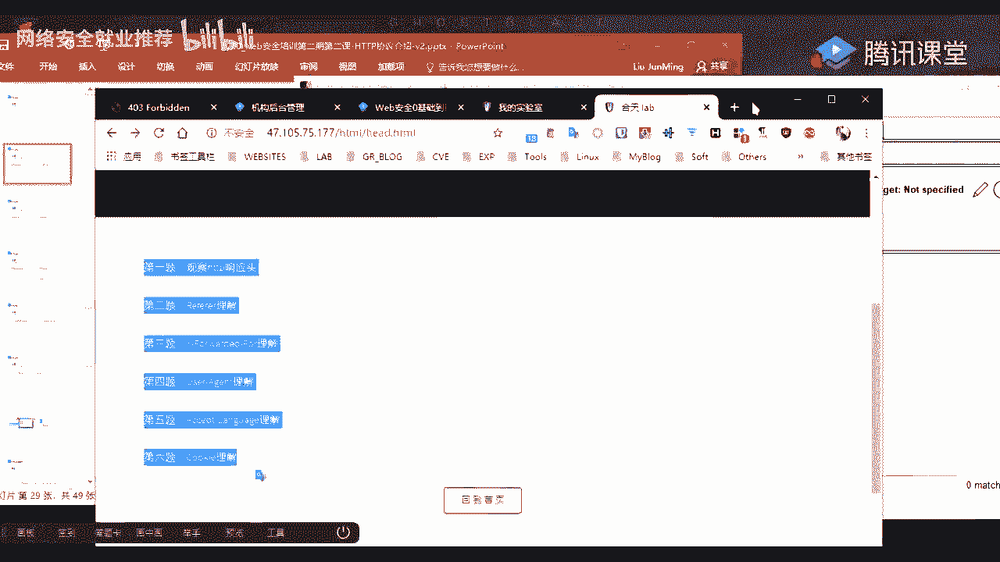

我这里的这一个服务器的话。

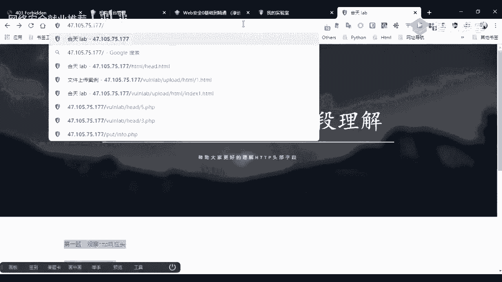

已经呃做了一个配置，大家可以直接来去用我的这个服务器，做一个测试，首先的话我先对它做做一个抓包，抓包的话上节课已经给大家讲过了，不行的话，我这里，访问一下这样的一个页面。

然后这里的话就会有呃这样的一些请求包，我们找到这个对吧，就通过get方法来请求我们的这个资源，让我们把这个包发到我们的这个重放模块，对我们可以通过这个模块的话来进行一个呃，发包改包，看到我这里的话。

get之后的话，它会返回来一个304，就这样的一个状态码，304的话就是呃，以上课的话就是有一个重定向的一个意思，out，不好意思啊，喉咙有点卡住了嗯，好我们看可以看到的话。

这里的话是一个get方法对吧，我们这里首先的话，我们先来看一下这个head head的方法，我们直接把这里的一个get方法改成，我把改为我们的一个head的方法，然后进行一个发送，发送之后的话可以呃。

这个包没有响应体，我重新换一个吧，我要这一个包，然后我们发算一下这个包的话，可以看到他这样的话返回了一个呃200，然后的话有它的一个响应，头部以及一个响应体，也就是说他响应的一个消息对吧。

然后我们这里改为get head的方法，然后进行一个发送，可以看到这里的话，原本有的一个响应消息的话是已经没有了，它只返回了一个响应的一个头部，以及我们的一个状态函，这就是head的方法的一个。

理解使用，啊第二个的话就是options，op时的话就是用来查询指定服务器的，能够资源的，一个能够支持的这种请求的一个方法，我们同样的把它的一个请求方法改成options。

然后可以看到就是说在这里有一个oa oi，这样子的一个响应的一个头部，然后它后面的话有接这样一串的一个东西，这一串的话就是我包含了我们前面有说到的，这样的一一些请求方法对吧。

option get head podcast等等，以及后面的这样的一些后面的这些的话是，是我们的一个web服务器，它里面的一个web j a v，它里面如果开启了这一个div的话。

它就会有它能够支持这样的一些方法，前面的话是我们的一些呃，hp里面的一个请求请求的一个方法，然后的话就是一个put方法，put方法的话嗯，其实我们我给大家布置的这个实验的话。

就是利用的这样的一个put的方法对吧，如果大家有去做这个实验的话，我们可以通过这个，如果服务器它支持这样的一个put方法的话，我们可以通过这个put来去向服务器传啊，上传我们的一个呃木马文件。

然后的话来进行一个get shell，这里我同样的以我这一个机器做一个测试，这里我使用一个put方法，然后的话我把这里的一个是想要上传文件的。

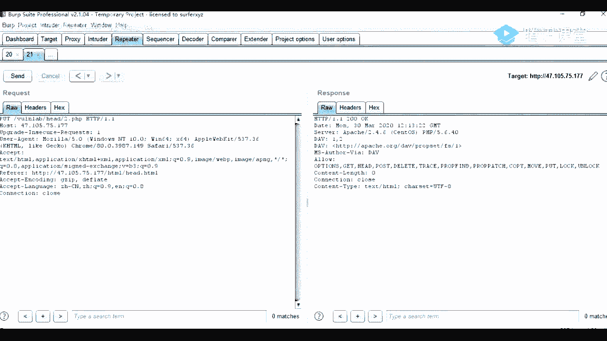

一个目录做一个更改，我这里的话是啊，就设置指定了一个目录，我这里的话是指定了这样的一个目录。

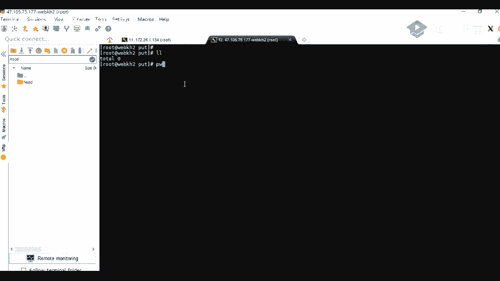

如果大家要去在尝试的时候的话，就上传到这个put目录下面，首先的话这里的话我需要更改一下，因为我是要上传到p的目录对吧，我们这里需要把它做一个更改，把它上传改到put目录，然后指定我们的一个。

想要把我们的一个请求内容，写入到哪个文件里面，比如说我这里写一个info。p hp，然后在我们的这里的一个请求体的这个部分，内容，大家要注意的话，就是要注意的话，就是前面我们有讲过对吧。

就是你的一个请求头部，跟你的一个请求主体之间的话，需要有一个空格，需要哦不不是空格，需需要一个空行，就是来做一个分隔，这样的话我呃写一个，hp info的一个代码，这样的话我直接进行一个发包。

就把我的通过put的方法，把我的这个内容啊写入到呃，他在这个位置，这个in forty菲律宾文件里面，然后s，打爆之后的话，我们可以看到这里它会有这样一个提示对吧，就说资源这一个info。pp。

这个文件的话已经被创建，就是说我们怎么去进行一个验证呢，我们可以直接来去进行一个访问，咱们的一个目录是啊，这个服务器boot目录下面的一个info。p hb对吧，访问执行者的话，可以看到他成功地执行了。

我们刚刚的一个菲律宾的一个代码，也就是显示我们的一个菲律宾info的一个信息。

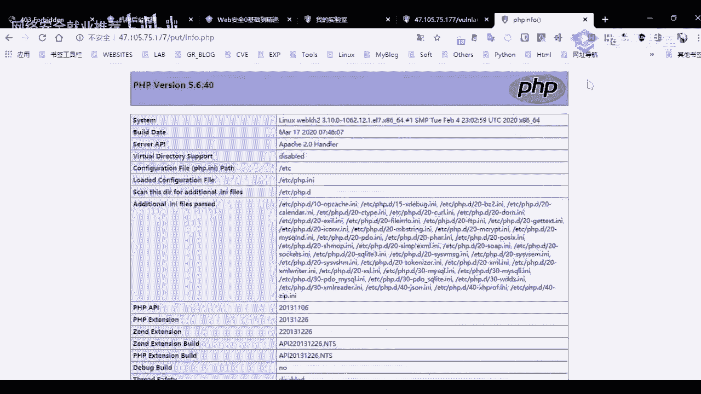

然后的话，这里我同样的可以写我们的一个一句话，然后的话来进行一个，get shell，我这里的话写了一个简单的一个一句话啊，如果大家就是不是很了解相关的这一个，这样的一些菲律宾一句话的话。

大家直接百度1下吧，百度1下的话就会有很多，就是这种啊十分简单的一个一句话，然后的话在后面嗯，在后面讲文件上传的时候会给大家有去啊，讲怎么去啊，去做一个使用，这样的话大概介绍一下吧。

呃我叫你直接发这里吧，然后这里的话就是呃一个简单的一个，菲律宾的一个呃执行命令的一个代码，就是使用的这个ever函数来执行命令，然后这里的话是呃一个啊使用一个post的方法。

来获取我们的这样的一个传递的一个参数，这个参数的话就是pass，就我们传递的用post的方式，像我们的这一个木马传递我们的一些命令，他的话我这里的话呃，写到p h p啊，这个info一吧。

一点p h p，然后发送到的话可以看到已经创建完成，然后我们做一个访问，访问之后的话呃，没有任何的一个东西，如果大家看到这样一个页面的话，就说明你的一个文件的话是已经上传成功了。

然后的话也是可以被解析的啊，我们上传了这样子的一个一句话木马的话，我们怎么去进行一个连接呢，连接的话呃，我们需要用到一个web share的一个管理工具，我这样的话就用这个cnc刀。

他是啊使用的一个java源所编写的，就其实啊就跟菜刀是一样的，那这样的话我们通过这样的一个web shell管理工具，来去连接我们这里的这个木马，连接木马的话，我们首先复制一下这个它的一个链接。

我们需要在这里填写我们的木马的一个地址，然后这里的话是填写我们的一个密码，密码是什么呢，密码的话就是我们的这里的一个post，就是获取，我们好像这个木马传递数据的这个参数。

这个pass也就是我们的一个密码啊，停停写在这里，然后这里的话因为我们是一个p h p对吧，我们选择这个p h p，然后进行一个添加，添加之后的话就是这个，然后我们直接双击，双击之后的话。

可以看到我们这里直接进入到了它的这个目录，这个目录的话，我们可以看到我们刚刚上传的这样的两个文件，我们双击看一下它的一个内容对吧，然后这个这个的话就是我们的这里连接的这个，一句话木马。

以及还有他的其他的一些文件，它的这样的一些目录，可以看到对吧，以及它的呃根目录，就是说整个文件系统，然后我们也可以通过它的一个模拟终端，来执行我们的一个命令，播户外卖。

可以看到当前的一个用户的话是阿帕奇，当前所在的目录的话是在这个目录，也就是我们上传的这个一句话木马的一个目录，就是一个呃通过这一个put方法来上传，我们的一个一句话木马。

然后的话再通过这个呃web share的一个连接工具，来获取我们的呃，就是服务器的这样的一个权限，当然的话现在获得了一个权限的话，只是一个大的一个web服务器的，一个阿帕奇的一个权限，这不是啊。

不是服务器的一个最高权限root。

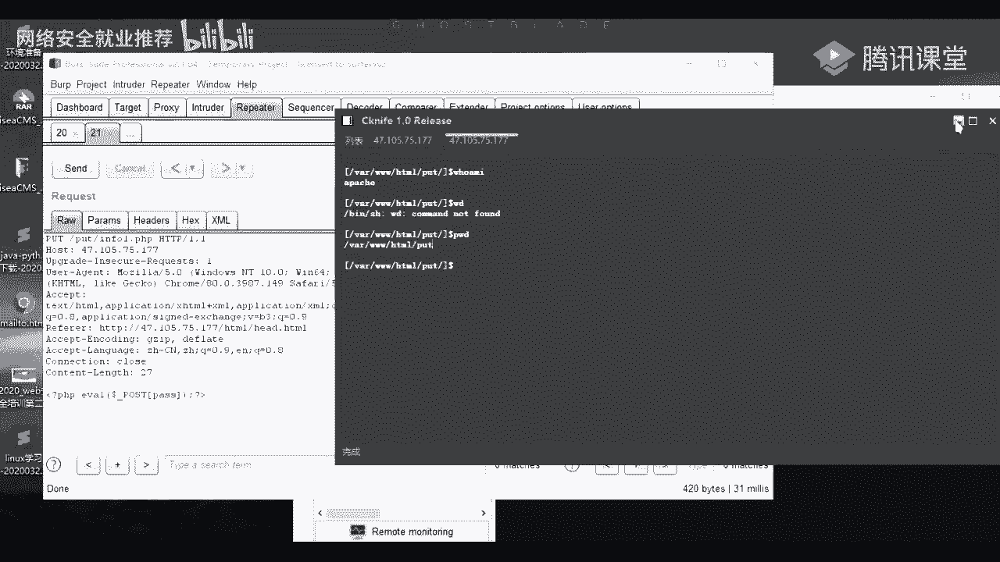

好大家呃，诶我刚刚看的话，有这样的话是有有人已经上传了是吧，大家可以做一个尝试，然后的话呃大家如果得到需要之后的话，不要把我这个服务器里面的东西删掉。

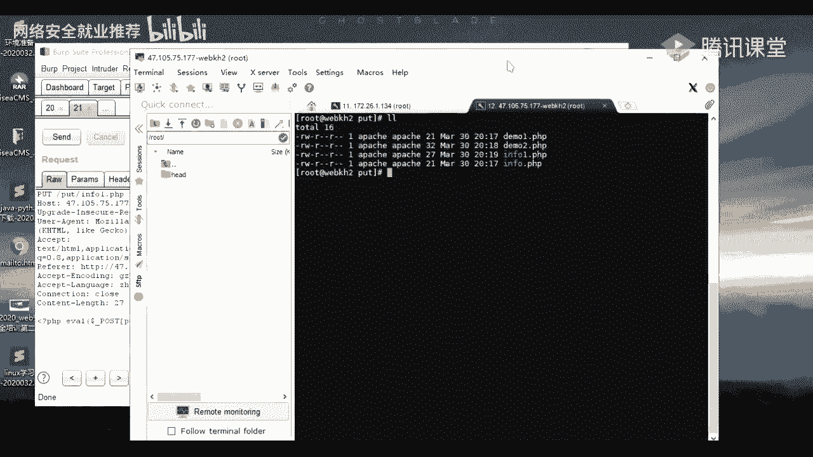

或者是说不要动我服务器里面的一个东西啊，好吧，就只是给大家做一个就是体验一下，然后做一个演示，然后的话这里的话就是一个put方法，然后我们一起来看一下一个delete delete方法。

前面put方法的话是来创建与文件，delete就是删除我们指定的这样的一个文件，按照我们使用呃，直接在把这里的一个put改为配置，改为一个delete方法，然后的话我们删除呃，这个infpp对吧。

直接发包包，上包之后的话可以，哦这里打错了d e l e t e直接发包，发包装的话呃返回的话是一个204对吧，这说明的话，我们这里已经啊这一个请求包的话，已经发送成功。

然后我们可以通过get方法来去获取一下，这一个文件的一个内容，你看到的话，它会提示就说这一个文件的话是已经找不到了。

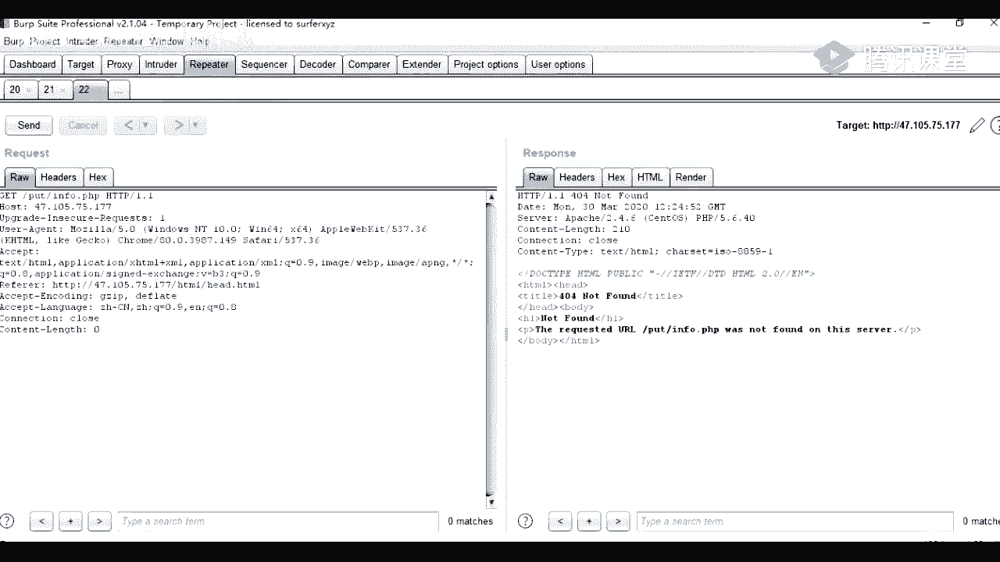

也就是我们文件已经被删除成功了，好吧，我们可以在这里来去查看一下。

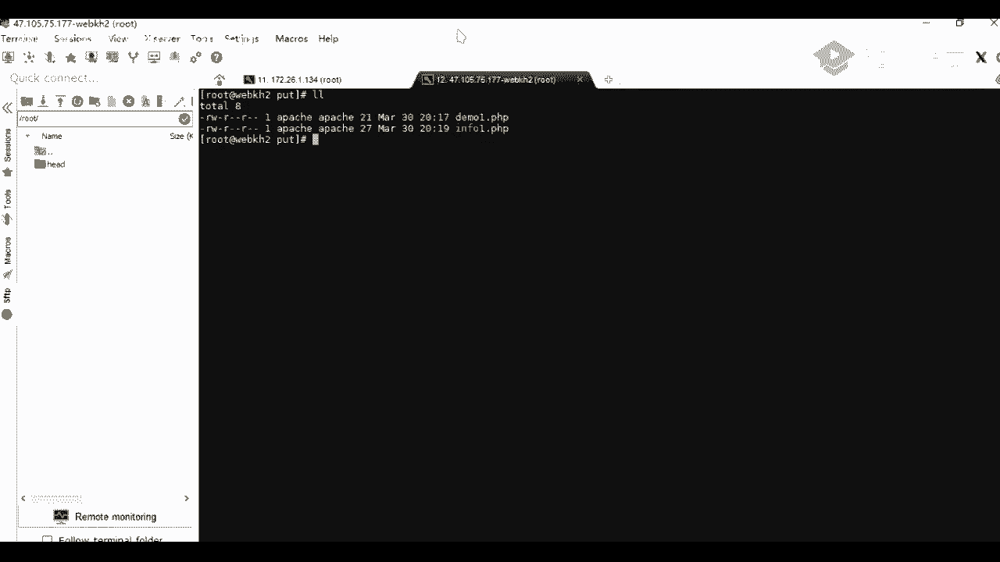

可以看到的话，已经啊那一个info。ph的话已经是被删除了的，这就是一个delete方法，然后的话是一个chess，chess的话，嗯这个的话就比较紧了，然后呢我们，改一下请求方法，啊s。

model support，支持，这话我重新抓个包吧，let's take ch，不支持吗，今天晚上还是，支持的呀，好可以啊，可以看到我这句话呃，把这里的一个请求方法更改为确实的话。

你可以看到它的一个响应体，就是响应消息的话，返回的话就是我们这里的一个请求包的一个内，容，请求消息的一个内容对吧，就呃没有没有什么大的一个差别，就是一个trans方法，主要的话就是用来检测判断。

我们的一个请求和请求方法，里面的一些内容是否有被更改，这就是上面的话就是呃这hp请求方法的一个，它的一个应用，以及它的一些呃对他的一个理解。

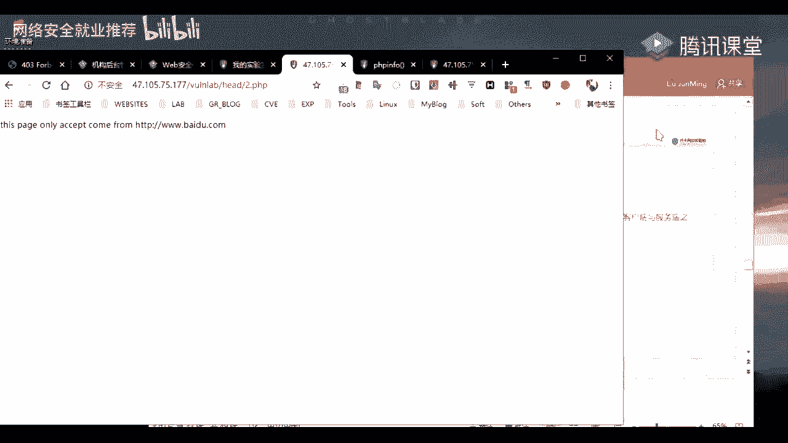

然后大家有没有跟着我一起做呢，我刚刚看的话，服务器是是已经呃这有人在做的吧对吧，就建议的话大家呃就是用我这一个服务器的话。

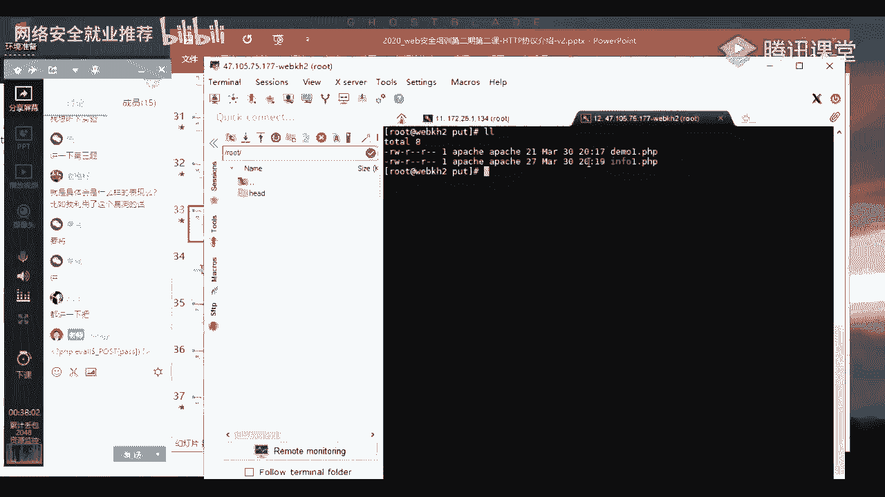

尝试一下吧，就啊你自己去操作一下的话，就是对他的一个理解的话会更深刻一点嘛，然后这里的话大家有没有什么疑问呢，应该没有什么问题吧，找个，你啊你你不要去更改这一个呀，就是说你你这里的话，你改的话你就改。

你这里不是有吗host吗，host的话就是主机嘛，然后pose的话就是端口吗，啊你这里的话你是说这个抓包是吗，抓包的话你直接在这里，这里的话不是有浏览器，你访问之后嘛。

访问之后的话不是会有这样的一些请求包嘛，对吧，get请求包，然后的话在这里的话，我们直接把这一个包，把它就是send send to repeat，repeat的话就是重放。

就是这个重放模块用来发包改包的，或者说你用快捷键，我是喜欢习惯用快捷键，就是ctrl加好，到这里吧，到这里的话，他这样的一些信息的话是已经配置好了的，就呃不需要不需要你去手动的去更改什么的，对吧。

然后这样的话你就可以在这里包，更改我们的这些请求头啊，以及我们的这样的一些内容，然后的话再把我们的这一个请求包，把它给发送出去，这边的话就是它的一个响应，就是响应的一些消息，现在还有问题吗。

呃你你应该你是呃，你应该是上节课没有听吧，没有问题了是吧，好的好的，大家没有问题的话，那我们继续我们下面的一个内容，下面的话就是嗯，cookie session的一个简介，就是呃带大家一起来了解一下。

这两个东西是什么哦，这里这里的话，主要的话就是一些基本的一个概念，大家就是跟我一起大概过一遍吧，就hd p r它是一个基于请求响应，无状态的一个应用层的协议的话啊。

就是着重理解一下这一个无状态它是什么意思，就不算大的话，他就是说服务器，他是不知道用户上一次做了什么，就这里的话，它会严重阻碍我们的这一个web应用程序，的一个交互，就意思的话就是说嗯。

比如说我们访问一个网站对吧，我我们访问一个这样的一个网站，通过这些hdp的一个请求给他发包，包包之后的话呃，我们访问的是这一个嗯，举一个例子就是大家购物对吧，大家在购物的时候。

我们想要去我们去挑选一个一个东西，选择一个商品，选择好了之后的话，我们在想要去进行一个结账的时候，就是说把我们的一个购物车对吧，把它给清空，想要结账的时候，这个时候你就会碰到一个问题，什么问题呢。

就是说hp他是不知道你上次的一些一个请求，也就是说不知道你挑选了哪一些物品的，你的这些物品的话，你想要去进行一个结账的话，他是啊不知道的，不知道去给你的哪一些物品做一个结账，而且呃服务器服务端的话。

他不知道，你不知道是你本人，还是说其他人再去进行这样的一个请求，这就是他的一个hp p的一个无状态的一个特性，然后这样子的话就说我是严重的，就是呃阻碍了我们去，比如说进行一个购物对吧。

然后cookie的话就是为了解决这样子的一个问题，它是网站为了辨别我们用户的一个身份，来存储在我们本地终端上的这样的一个数据，它是由服务端生成，然后的话发送给我们的一个客户端。

通常的话就是我们通常访问网站的话，就是通过浏览器嘛，然后呃cookie的话，他是可以按在客户端中的一个存储位置，划分为这样的两种的，就是内存cookie，还有硬盘的一个cookie，就是内存库存的话。

就是我们的这样的这样的一个cookie的话，它是存储在浏览器的一个内存，就存储在内存当中的，然后我们浏览器关闭之后的话，它的一个cookie就失效了，也是也就是我们的一个登录状态就失效了。

然后硬盘库里的话，就是保存在我们的一个硬盘里面，但上次的话它是有一个过期的一个时间，它需要我们去进行一个设置，然后的话到了这样的一个过期时间的话，就会呃自动的失效，然后cookie它的一个作用的话。

主要的话就是在客户端存储，用户访问网站的一些信息，主要的一些应用啊，就是用来记住密码，就是我们用于我们下次的一个自动登登录，就不用，不需要我们每次都去输入我们的一个账号密码，然后登录网站。

然后就是购物车的一个功能是吧，就我我通过这个cookie的话能够辨别我的一个身份，然后的话能够保存我购买的这样的一些物品，它的一些信息，然后第三的话就是记录用户的一些浏览数据啊。

就是啊可以记录你就是浏览的哪一些啊物品，然后的话进行商品广告的一些推荐等等，当然的话它同样都是有缺陷的，就cookie的话它会附加在我们的每一个htp请求中，然后第二个的话就是它的一个。

他在hp请求中的话，它是一个铭文传递的，所以的话它的安全性是存在问题的，这样的话，除非是使用我们等会会介绍的一个htp，然后cookie它的一个大小的话是也是存在一个限制。

就只能存储四kb左右的一个内容，然后这里的话就是呃cookie的一些工作原理，呃，这里的话大概大家大概看一下吧，等会我一个我以一个例子来做一个就是讲解吧。

首先的话他就是呃服务端它会创建一个cookie嘛，就是在我们用户去浏览网站的时候，它会生成这样的一个cookie id，然后的话它会呃就是将我们那个cooki的话，它会放到我们的一个响应头里面。

然后就是有一个set cookie的这样的一个响应头部，然后的话就存储在我们本地，存储在我们的浏览器当中，就是浏览器收到这样的一个报文之后，它会在浏览器当中生成相应的一个cookie。

cookie的一个内容的话，就是我们响应头里面，服务端生成了这样的一个cookie，然后的话我们之后的每一个对网站的一个请求，需要去辨别我们用户身份的一个请求的话，都会把我们的这样的一个cookie值。

就是啊放到我们的一个请求头当中，像啊发发送到我们的一个网站服务器里面，然后的话就是第四个话就是会读取cookie好，就是服务器它接收到用户，对用户存储在hp请求报文当中的一个cookie，之后的话。

就能够啊，从这一串cookie值里面找到它所需要的一些信息，这就是它的一个基本的一个工作原理，然后筛选的话跟cookie的话呃啊比较类似，有筛选的话，它是一种服务端的一个机制。

就是用来存储特定用户绘画的所需的一些信息，那同样的也是用来存储啊，我们的一些绘画信息的，然后筛选它由服务端生成，主要的是保存在服务端，而不是像cooky一样，是保存在我们的一个客户端。

然后筛选它的一个根本作用，就是在服务端存储用户和服务绘画的一些信息，就是存储我们的一个客户端，与服务端的这样的一个绘画的相关的一些信息，同样的是呃可以用于判断用户是否登录啊，还有啊购物车购物的一些功能。

工作原理的话哦，这里的话大家大概看一下吧，我就不不说了，就呃其实也是类似的，然后他的啊cookie和筛选的话它的一些区别，首先的话就是cookie它是存在客户端嘛，筛选的话它是存在服务端存取的一个方式。

就cookie的话呃，只能保管这样的一个阿斯卡的一些字符串，然后的话再选的话，它是能够存储任何的一些类型的一个数据，然后安全性的话，因为cookie的话它是存储在浏览器当中。

就是说对我们客户端它是可见的，然后客户端因为它是在本地嘛，就是客户端我们的一些程序的话，是可以能够获取到，获取到呃存储在浏览器当中的一个cookie的，也就是能够获取到我们登录网站的一个身份。

的一个凭证，而筛选的话，它是存储在服务器上的，就它是不存在一个敏感信息的，这样泄露的一个风险，哦不好意思啊，这个呃前面的话漏了一漏了一点，就是啊本来是应该先讲了h h p s的，这样的话就是爱芯片啊。

主要的话就是理解一下它的一个概念吧，就是htp s其实啊就是h t t p加一个s s l，或者说t i t l s的一个安全套接字层，因为它的一个全称的话就是这样子的一个全称，就是htp。

它就是一个htb的一个安全版，就是它相比于htp的话，就是它的一个安全性是更有保障的，因为它是，它是呃有利用这样子的一个s s l，来建立一个全新到，而且它是它的一个数据包的话是一个加密的。

就不像我们h tv里面的话，就是我们的一些传递的一些数据包，它都是呃铭文，铭文存储在我们在一个请求当中的，主要的话是用来保护我们啊数据的一个隐私，以及它的一个完整性，对面的话我大概了解一下吧。

就这些理论的东西的话，我就不花太多时间去讲解了，这样的话就是呃我们今天课程的就是啊，上节课没有讲完的一些内容吧，就是其实主要的话就是带大家，就是你啊了解一下htp请求方法，它的一些基本的一个利用。

然后后面的一个htp的话，就大家理解一下它的一个概念，然后cookie筛选的话呃，cookie筛选的话，我这里，以我们的一个管理网实验室做一个例子。

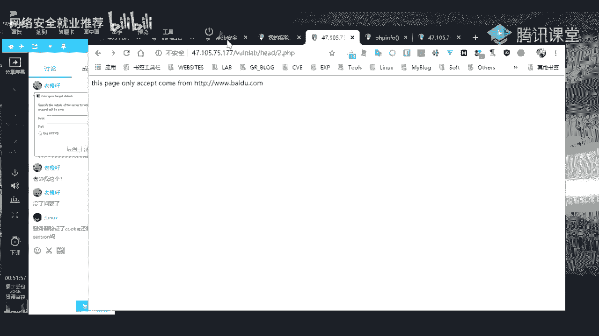

首先这里的话呃把bp打开，然后等你把这些请求给清掉啊，首先的话我，我这样的话访问一下我们的一个实验室，这样的话就有相应的一些呃请求包，啊这里是，我这里重新用个浏览器吧。

这样的话我访问一下我们的一个黑天网实验室，然后的话我们一起来看一下这里的一些请求包，首先的话是呃访问的这一个请求吧，就是这个对吧，首先它是通过一个get请求，来访问我们的一个呃实验室的一个网站。

然后访问之后的话，它的一个请求包就是这样子，这不是第一个，啊这个，然后他的一个首先第一次访问的话，他的一个请求包就是这样子对吧，然后它它的一个响应我们一起来看一下，它的一个响应的话。

主要的话是看这里的一个响应头部，那个响应头部这里的一个set cookie，这set cookie的话就是我们的一个服务端，它会生成这样子的一个啊j session的一个id。

然后这一部分的话就是它的一个cookie，就是服务端生成的一个cookie，然后到我们的一个第二次啊，下一个一个请求包的话里面，可以看到它会携带我们的这样的生成的，这样的一个cookie值，有这个。

然后的话再向我们的一个服务器发起请求，这就是我们前面说到的一个cookie，它的一个呃基本的一个工作原理，就让用户再去访问一个网站的时候，就是网站的一个服务器，它会生成这样的一个cookie。

生成cookie之后的话，它会在它会放在我们的一个响应头部里面，然后是放放在这样的一个set cookie的一个字段里面，然后的话他会呃呃就是客户端，它收到这样子的服务端的一个响应之后。

它就会存储我们的一个cookie，就把我们的一个cookie值存储到我们的客户端，就是啊具体点的话就是浏览器，然后浏览器接收到这个库里之后的话，存储之后的话，在下一次对网站发起请求之后。

它就会携带我们的这样的一个库体值，这就是cookie的一个基本的一个工作原理，然后呃我们本次课程的一个内容的话，大概就是这些，然后就是应大家的要求的话，就把上节课的一些题目做一个介绍。

而这题目的话就其实呃其实比较简单啊，我们首先的话先看第一个吧。

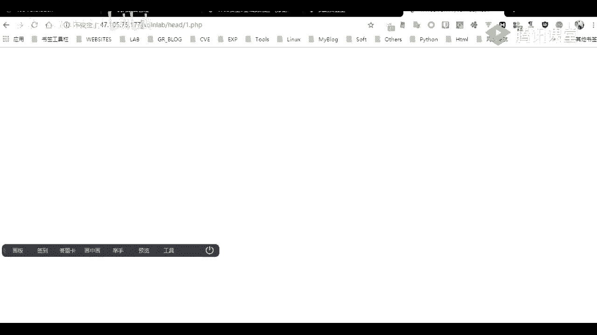

首先第一个的话就是呃，反正新。

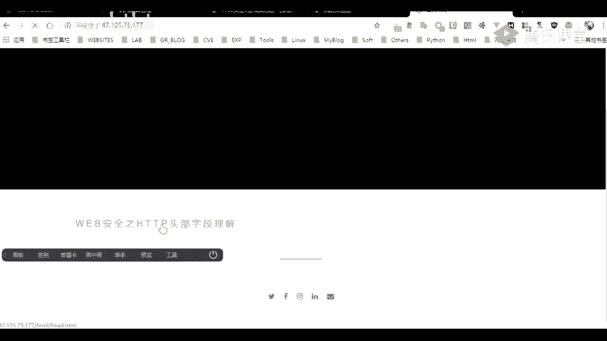

其实从题目意思，就看到这htp头部字段的一些理解吧，首先第一个就是呃观察htp响应头，就响应头是哪一个部分对吧，首先大家要有一个呃概念，什么是请求头啊，什么是响应头，然后我们这里的话直接就用谷歌。

它自带的这样的一个f 12，就是呃，然后这里的一个network，我们可以看到这我们请求的这一个文啊，资源就这一个对吧，一点配h p，然后这里的话有一个head。

这里head的话就包括了就是啊用户的一个强硬啊，请求头部以及啊它的一个响应的一个头部，可以看到呃这个request header的话就是请求头部，就是呃请求头部的话就是这样的一些内容。

然后这个responding respond的话就是响应，这里的话就是响应头部的一些内容，然这里的一个题目的考点的话就是这个嘛，就我们在这个响应头部里面，就观察它有什么特特殊的一些东西对吧。

然后可以看到有这样子的一串值一个key好，hello world，这个的话就是我们这个题目的一个答案，就通过这个题目来让大家分清楚，就是请求头部以及响应头部，那样的话，我们也可以利用bp，呃。

我们直接从这里就能够看得到对，这是他的一个请求，头部，这是他的一个响应，然后的话就是呃我们的一个答案就是这个，然后第二题，这头发就是一个rayon，然后我们点开看一下。

就呃大家结合上节课我们讲的一个内容，就rap，后端的一些请求啊，头部我们可以看一下这个rapper，这个rapper知道的话，它它的一个意思的话，就是呃新型网页的一个地址，然后当请请请求网页紧随其后。

也就是它的一个值的话，就是我们之前访问的一个呃网页的一个地址，然后的话我们的这一个请求，它就会呃有携带这样子的一个地址，这个river river，只是后面的话就是我们啊之前访问了一个地址。

然后后面的一个请求的话，就是我们现在的这样的一个请求，好我们可以看到的话，这里就是它有个提示，对这个基本的一些英文的话应该都能看得懂吧，就这个页面的话，只接收来自这一个网站的一个呃请求对吧。

所以说他只做这样的一个请求，我们可以啊，能够想到就是说服务端它是怎么去判断我们啊，去判断它它的一个请求，它是指来自这样的一个网址呢对吧，就是说通过rap嘛，因为rap的话它是记录的。

就是之前的你前面之前的一个请求，就说这个请求之前的一个请求，他是了，他是从哪一个网址发过来的对吧，那我们怎么去啊，找到我们的一个答案呢，就是通过更改我们的一个rap值。

然后把我们那个rap值设置为这个值，不就ok了吗，然后怎么去设置，同样的就是通过bp，我们找到我们的这个请求包，对吧，请求啊，他这个请求包的话，就是这个我们把它放到这个repeat，进行一个更改。

主要更改的一个值的话，就是这个reer，就大家可以看到我们这里的一个rap的话，就是这个页面，然后这个页面的话其实是呃，我们访问这个页面之前的一个页面，就是这个页面对吧，就是呃我们返回一下。

返回一下之前的这个页面，就是这个页面对吧，哦我们要改的话，就是把这里的一个rapper词，改成我们的这里它的一个提示的一个百度点com，然后我们再发送我们的一个请求包，发送之后的话。

就可以从从他的一个响应当中，得到我们的一个答案，you are right，然后第三题就是这个查fort for x ford，for的话是嗯呃就是上节课的话，有同学不是问我吗。

我还特意就是对他做了一个解释，这样的话我们点开这个题目，这是它的一个请求包对吧，它的一个提示，就是说这个页面只接受来自rog host，就直接上来了之后，logo的话我们从题目意思的话也能够知道。

就说要去使用到我们的差for four，然后我们可以通过就是它的一个提示来去啊，了解到服务端，还去对服务端，它是怎么去判断我们的这个请求，是否满满足他的要求呢，就他会去获取我们。

我们请求的一个ip地址对吧，然后的话，如果他的一个ip地址是符合他服务端的一个要，求，也就是来自这个locost的一个ip地址的话，他就能够呃，就是就我们就能够找到我们想要的一个答案，啊。

这样的话就是需要做一个更改它的一个请求包，改更改了一个内容的话，就是我们的一个查for word for，更改为我们的一个log host，然后我们进行一个，写错了吗，写错了呀。

是不是这个插for worded for，然后lokho好，我们send，啊搞错了，这样的话是应该是ip地址，这样的话是呃就是它是获取到获取就是记录，就是啊我们的一个真实的一个啊。

就是客户端它的一个真实的一个ip地址，然后的话如果说经历了就是经过了代理的话，就用逗号分割，然后的话接我们的一个代理的一个ip地址，或者然后的话如果多层带的话，就就是一层一层的往后面加它。

这里的话就是存储的，它的这样的一些就啊你的这个请求，它是从哪一个和ip或者说哪一个代理ip过来的，而我们只需要更改这个top for，他要求的这样的一个log host，就能够得到我们的一个p。

比如这一个，然后大家其实也可以使用这个hack bar，hack bar呃，直接在这里的话，也不用自己去输，就直接打关键词，他这里的话有有提示就差不for，然后就加在我们的一个请求头里面嘛。

他会加加我们的这样的一个指定的一个header，然后第四个的话就是user user agent要在a卷的话，可以看到它这里的话是啊，同样的就是提示，就这样的一个。

就是只允许来自iphone的这样的一个请求，来获得我们的这样的来进入，我们的这样的一个key page，对我们t存储的一个页面就好，服务端它是通它是通过什么去判断。

我们的一个请求是来自什么样的一个设备呢，就是通过我们的这样的一个user agent，我们可以看到就是这里的一个请求的话，是这样的一个这样的一个user agent对吧，嗯就是呃有mod一栏。

还有什么win 6664，还有啊，让大家看到这样子的一一些一个东西的话，就是一个user agent，然后还有其他的很多的一些user agent哦，这样的话我就不一一介绍了，就大家看到这个的话。

就是知道能够知道你当前的这个请求，它是从什么样的一个设备发过来的，就可以看到它是从一个com，也是一个谷歌浏览器访问过来的，然后这样的话他他的一个题目要求的话是，你们要求的是来自iphone对吧。

我这样的话，我直接把它改成为一个iphone，然后的话进行一个请求，然后可以看到他那个key就出来了，就是服务端它是通过这个user agent，通过就是呃用户的一个请求包中的一个user agent。

来去呃，判断用户的一个请求，它是从什么样的一个设备发送过来的，就这这个题目的话，就是对这一个user agent的一个理解，啊就是一个accept language，accept language。

它它的一个请求头的一个意思的话，就是呃告诉服务端我能够接受的，我能够去啊试用的一个啊语言代码，就是呃大家呃我以这个为例子对吧，这一个请求就大家可以看到它这里的这个请求。

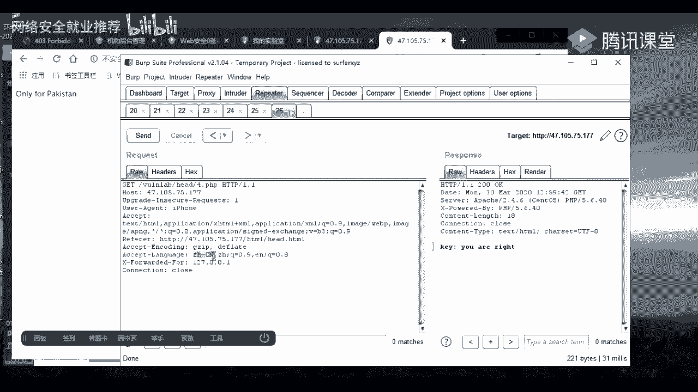

包装的一个accept language的话，就是c h c n，再去看cn。

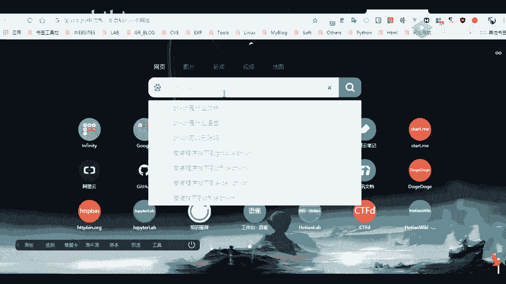

它这个源代码对应的就是我们的一个中文简体，这个学生就是它的一个语言的一个代码，就是和国家地区，这一个的话就是代表的话就是中文的一个简体。

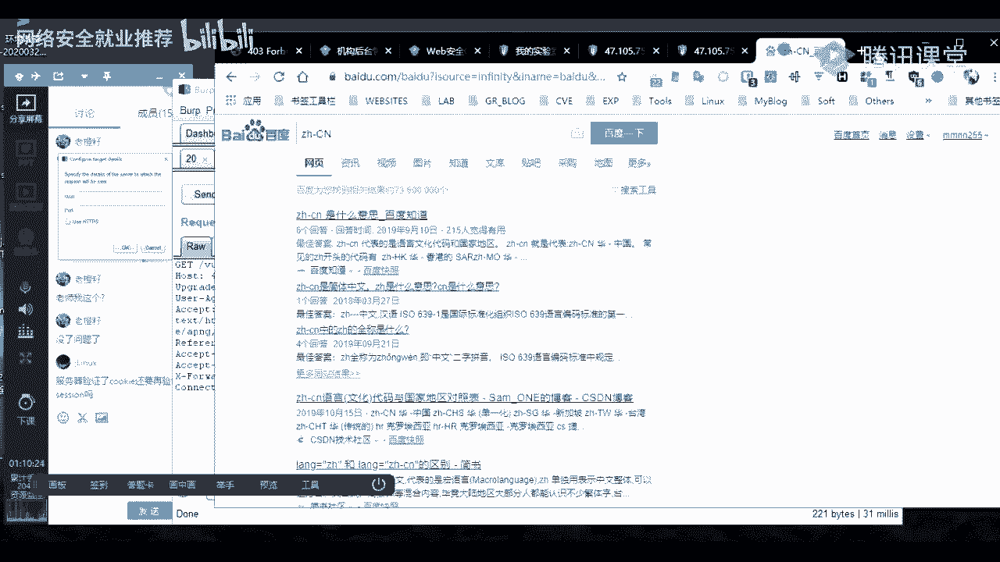

简体中文，呃这个的话可以看一下。

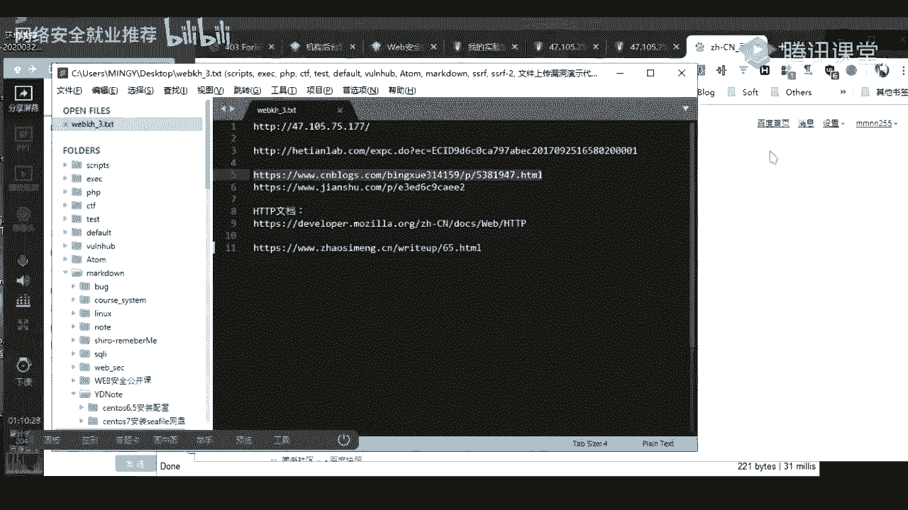

这个表吧，就这里的话它有列列了，就是呃这个语音代码跟国家名的一个表二，服务器验证了cookie，还要再验证session吗，嗯就是说哦对这个的话我没有提到，就这里的话就是说我们知道就是筛选的话。

它是用来保，用来就是保存我们啊，用户的一个客户端与服务端之间的一个，绘画的一些信息对吧，然的话筛选的话，它是通过我们的一个cookie来去进行，一个就是它的一个筛选值的话。

它是纯就是放在我们的一个啊cookie当中的，就前面我们的那个例子的话，有看到，呃，前面这个例子的话，我们可以看到，就是这里服务端它生成的话，是生成了这样的一个j session id对吧。

然后这里生成了这一个是选的话，它是存储在，它是通过这个ui来去进行一个传输的，而放在这个cookie的一个头部字段里面的，然后的话呃，服务端就是我们客户端携带这样子的，一个值的话。

然后的话把我们的一个请求发送到服务端，然后服务端的话就能够从它生成的，就从从它这里的一个cookie值里面，获取到他想要的一些信息，这些信息是什么呢，就是啊你用户的一个身份的一些信息对吧。

就比如说你的一个登录状态，然后这里的话就是它呃这里的一些语言代码，他这里的话比较多，然后从这个题目的话，这一个提示的话我们可以看到哦，哦对了，这里这里的话呃之前之前我放出来的话，这些题目的话是呃。

有几个是稍微有一点问题的就可啊，然后的话我因为我之前我也没没一个一个去做，那我今天话就稍微改了一下，就如果大家有做的话，就是可能第三个题目的话。

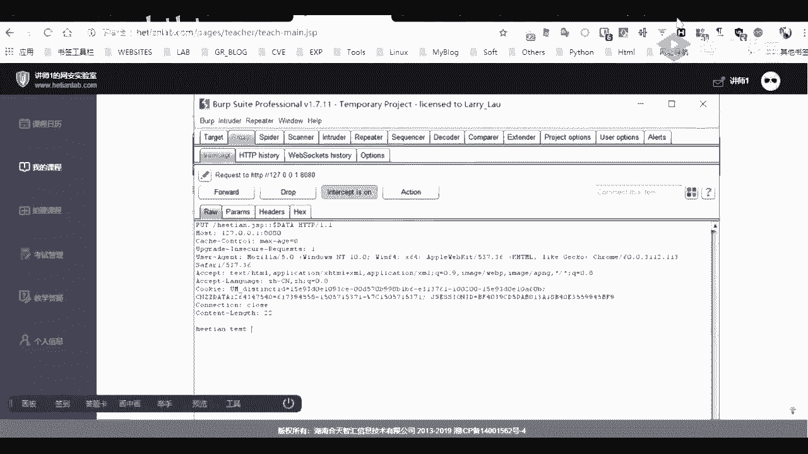

呃第三个题目的话可能就是你一访问的话，就会跳转到我们的一个呃核心玩实验室对吧，因为呃那个代码的话是有一个地方，没有没有注释掉，就是多写了一个代码。

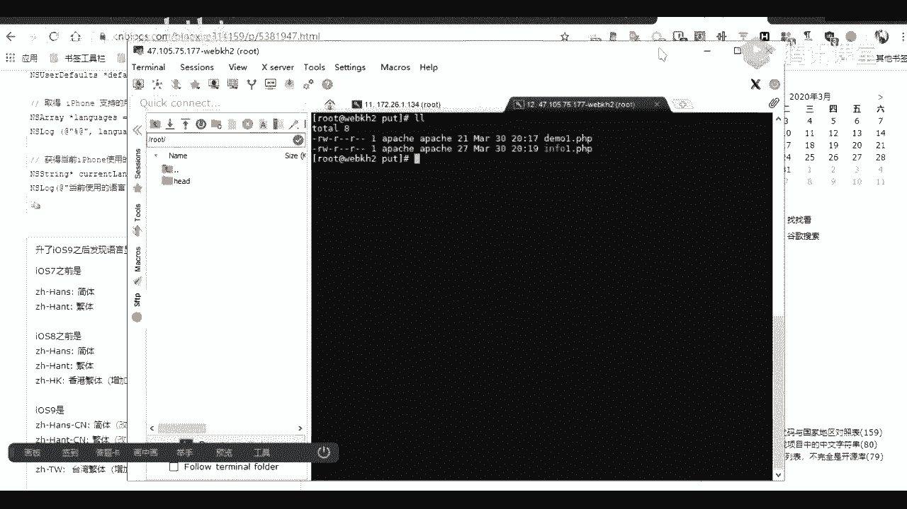

它有一个验证的话，就是直接跳转到我们那个核电网的实验室，然后的话就是稍微有一点问题吧，然后我今天的话做了一个修改。

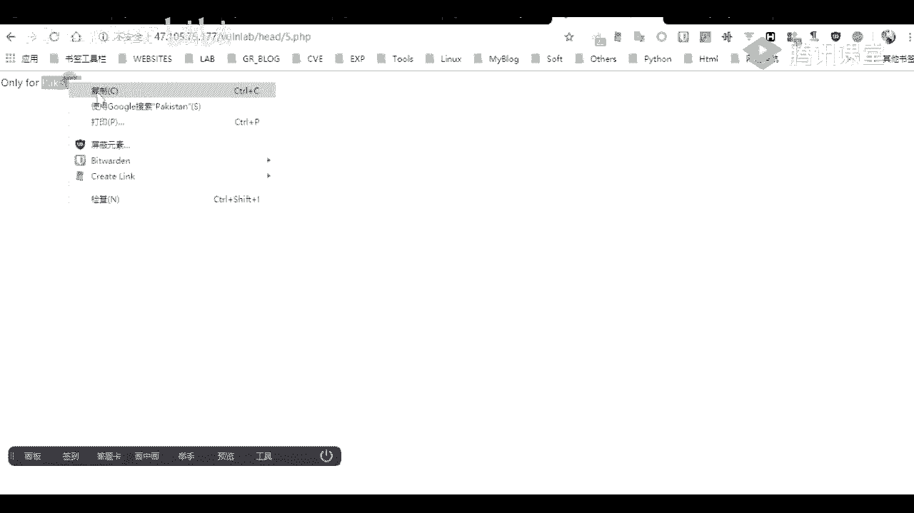

然后这里的话我们可以看到这里一个only f。

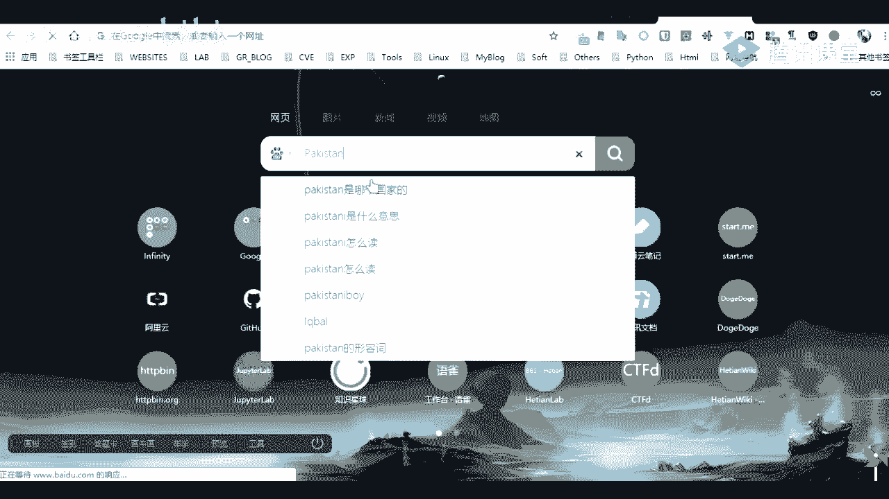

这个pocket的话就是我们可以搜一下嘛，就是，呃巴基斯坦对我们的巴铁对吧，就巴基斯坦的话，我们它的一个呃我们可以来搜一下，在这里来查找一下它的一个语音代码是什么，我们可以在这里看的话。

是一个ur干pk，然后这里的话我，这个题目所需要去啊，就是找到它的一个答案的话，就是我们需要去更改它的一个accept language，指定的这一个呃，这个。

更改它的一个accept language，在我这里的话，比如说这里的话是一个jh gcn对吧，它提示说只能来自巴基斯坦的，就直接收来自巴基斯坦的这样的一个啊援兵嘛，然后说所以我要在这里去进行一个更改。

更改它的一个语言是为，ur pk，然后以分号做一个分隔，而不是以诶哦是以分号做一个分割，然后的话我们就能够得到我们的key，然后这里的话就是涉及到一个accept language。

它的一个就是一个构成，在这里的话我们可以看到我这里之前没改，之前的话是一个z h杠cn开头对吧，然后一个逗号，然后z h z h话就是代表中国嘛，然后这里的话就是简体中文的一个意思。

然后后面的话就是一个q q等于0。9，然后逗号烟烟的话，我们可以在这里来搜一下，是代表美国，就是代表呃使用英语嘛，你看到这里的话，你烟的话都是以英语的，当然的话具体在于国家后面的话。

要接我们的一个接他的一个国家代码，然后这里的话就是这一个q等于0。9，大家可能不是会明白它的一个意思，这个这里的话就是它的一个权重就是零零，它的一个权重越大的话，就是他会去啊，他的一个请求的话。

他会倾向于就是使用这样子的一个啊原源代码，就比如说这里的话默认的话是一个呃，再去杠cn嘛，它它后面的话是没有这样的一个q群中的，就默认的话它是唯一也就是最大的，然后它这里默认的话就会使用一个。

简体中文的一个语言，就是我们向服务端发起请求的话，响应就响应的话，它会响应是为一个简体中文，然后后面的话就是呃可以是1n，然后他的一个权重的话是0。9嘛，还有后面的话，如果是还有后面的话，可以加其他的。

如果他允许的话，当然的话我们这里也可以改改为一个新，改为一个新的话，就说明它啊可以接受所有的一个语言，说的话就是对这一个accept language，的一个基本的一个理解，然后就是第六题。

第六题的话我们可以看到就是嗯，就其实前面题目的话也提示了，就cookie的一个理解嘛，对吧好，我们其实可以看到这里有个提示，就是please login with admin account。

他这个意思是什么呢，如果大家不懂不懂英文就翻译一下嘛，就请用管理员账户去去进行一个登录，管理员的话就是这个admin嘛，用admin的一个账户去进行一个登录，然后的话我们要去验证我们的，就是我们可以。

首先脑脑子里面要有这样的一个概念，就是服务端它是通过什么样什么样的一个信息，从哪里去印证，就从哪里的一个信息来验证，我们的一个身份呢对吧，就通过我们的一个cookie嘛，因为cookie里面的话。

它是保存着我们的一个用户的一个信息，然后的话这里他的要，我们可以通过呃请求包来对它做一个分析，我们看一下这个包，可以看到这里的一个请求包装的话，主要是这个cookie，cookie。

可以看到它的一个cookie的话是logan等于anonymous，anonymous是什么意思呢，就是匿名就匿名的，也就是他这里的话是呃，一个匿名的一个登录的状态。

当我们想要用admin用户去进行一个登录的话，我因为这里的话是匿名用户，登录的一个状态的话，那这里的话是显示需要用用admin的一个权限，用add命用户去进行一个登录对吧。

所以我们这里是否尝试一下把它更改哦，把它更改为一个的命，然后去发送我们的这个请求对吧，尝试一下，然后的话就可以看到，他这样的话是返回了我们的一个key，然后的话也就是得到了我们想要的一个答案。

这里的话就是对cookie的一个理解嘛，就是为什么就是我们在这里更改我们的一个admin，login，admin就能够是以admin用户去进行一个访问呢，因为cookie里面它存储的就是用户的一个信息。

用户的一个登录信息，然后的话我们可以从从这个请求bo当中，能够发现它是使用的一个anonym，就是一个匿名用户去访问的，去访问去登录的一个状态，我们可以想着去把他的一个用户去做一个更改。

更改为我们想要的一个用户，看他是否就是服务端，它是否对这个做了一个啊判断，或者说限制什么的好，我们可以看到的话，我们只需要更改这样子的一个cookie的一个请求值，就能够以肉以面的一个用户来访问。

服务器的一个内容，这就是啊这个boy的一个题目的一个理解，呃呃以上的话就是呃对这六个题目的一个啊，比较详细的一个讲解，然后大家对这个有没有什么疑问呢，就是啊觉得我这里啊就讲的这些内容，有哪里没有听懂吗。

如果没听懂的话，我可以再给你再介绍一下，呃大家都没有疑问吗是吧，都应该都听得懂吧，呃我我觉得我自己觉觉得的话，我这里的话应该是讲的应该很明白了吧，就包括这些字段它的一个意思对吧。

然后的话呃为什么要去用这样的一个字段，然后的话怎么用，为什么用这个字段能够得到它的一个p值，也就是得到他的一个答案，那其实其实这里的话就是呃一些比较简单的，一个头部字段的一个使用。

啊我看大家的话都没有什么疑问，那呃大家应该是都听懂了吧，刀天龙的话，那呃我们本节课的一个内容的话，大概就是这样子了哦，这个实验这个实验的话，我稍微加快一点速度给大家大概介绍一下吧，呃因为呃，时间关系。

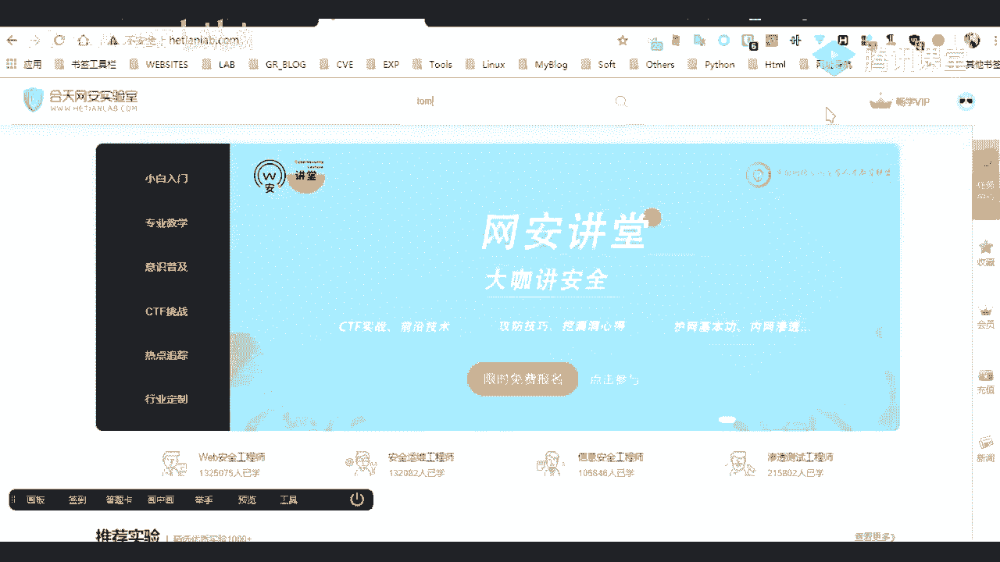

呃这里的话呃，大家应该有自己去做这样的一些实验吧，就是做我们黑天网实验室上面的一个实验呃，呃应该都知道怎么去进行一个操作吧，大家都知道吗，这个的话就是一个比较重大的一个，就是这个cv的一个漏洞。

一般上了这种cv的一个编号的话，它的一个漏洞的话都是比较大的，就这一个编号嘛，然后因为它是可以远程代码执行的，远程能够远程代码执行的话，意思意味着我们能够获得啊，指定的就是存在这个漏洞的一个服务器。

它的一个权，它的一个web权限，然后我们就能够利用它相应的一个权限队伍，他的一个服务器做一些操作，或者是说提高到一个最高的权限，直接接管，直接接管他的一个服务器，就是说能够执行命令的话。

它的一个危害的话就是已经是相当大了，就呃很直接的一个危害，然后呃这实验的话其实写得很详细了，讲的话也没有什么太多讲的，就和因为他这里写的这么详细，我讲的话也是就是跟着他。

他一步一步的去进行一个详细的一个介绍，我就大概讲一下啊，实验这实验的一个基本的一个高层吧，就大家怎么去呃，利用好这样子的一些资源吧，然后的话可能有些同学就是刚开始做一做，这些的话。

就不知道自己要去要要要去干嘛，要怎么去做，然后这里的话首先就有就大家看到实验的话，一般都会有一个指导书，就这个指导书的话就是这个实验，这个实验的一个详细的一个操作步骤。

以及相关以及与这个实验相关的一些基础知识，首先第一个的话就是它的一个预备知识，就是介绍了这一个漏洞，它的一个背景嘛，然后可以看到因为它的一个漏漏洞危害的话，它是被官方评级为高位。

就说说明它的一个影响是很大的，然后就是对这个tomcat服务器的一个介绍，就前面的话，因为前面的话是介绍了一个呃，阿帕奇跟ngx什么tomcat，它也是一个外围应用的一个服务器，而且它也是开源的。

然后这里的它的一个影响版本是七点点一到，七点点八一，然后我这里实验使用的一个版本的话，大家可以看到这边的话是两个版本，就是分别介绍了这两个版本，它的一个漏洞的一个利用，然后大家在做实验的时候。

一定要就是嗯先了解一下相关的一些知识，然后的话就是看一下这里，它的一个实验的一个环境哦，哦我这里先创建一个实验机，在创建的时候的话就看一下指导书啊，要注意的一点的话呃，就之前的话是有是有同学问嘛。

就说啊那个tom cat的一个环境，就不知道怎么去找不到对吧，这里的话可以看到，就你首先你做实验就去看一下这里实验环境，然后这里有个工具的一个下载地址，这个下载地址的话不是说不是说你在外网啊。

你在你直接在你自己的一个浏览器里面，输这个网址就能下载到的，而是说在这个时印机里面，实验机里面，然后下载这样的一个压缩包，里面就包含了这样的一些工具。

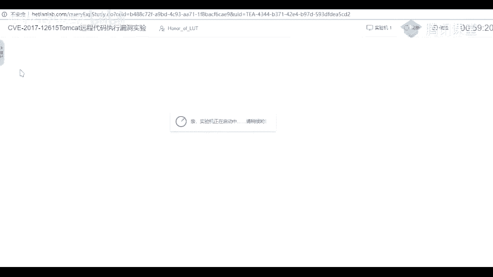

然后呃启动的话要稍微等一下，因为呃它是一些虚拟机器，还是需要去创建的，然后的话启动启动完毕的话，就是进入到了这样子的一个啊，windows的一个虚拟机器，然后这里的话可以从这里能够看到指导书。

以及我们的一个答题任务。

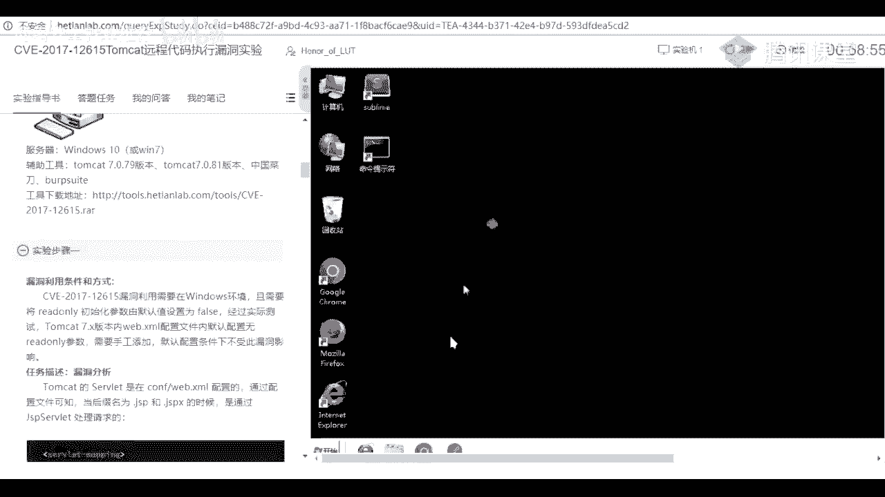

还有可以做笔记等等这些，然后这里的话，首先的话就是需要去下载我们的这一个工具嘛，下载工具的话呃，大家可能会就是呃之前也有同学就是跟我反映，说就是实验机不能够去复制粘贴，因为它是一个虚拟机，你这里只是啊。

它是呃没有不能够去复制粘贴的时间，然后的话需要大家去手打，而且其实这些的话打一个丸子什么的，也不是说很很很复杂吧，如果说有一些代码什么的话，呃如果说很长的话，一般实验机器里面都会给出来的，然后直接输啊。

直接输入一个完整的一个d啊，它的一个地址的话就能直接会下载完毕，下载完毕之的话就是在那个r r的一个压缩包，我们把它解压节奏的话就是这样的一个文件啊，其实可以看到大家看一下。

这里的话有几个test文件嘛，就这这里的话就是需要去更改代码的一些地方，然后这样的话他其实是已经给了一个text文件，就是避免就是把时间花在，敲这样的一些代码上面去了，对吧就给的很详细了。

然后这里的话这里的话就是哦，你们就是我们想要啊，我们要去呃大环境的这样的两个压缩包，我们首先的话就是把这个前提的话，就是一个tom cat的一个文件，这里的话我们想要去启动的话，就在这个b目录下面。

这里的话有一个启动脚本，就是这个start up，这个bat的一个批处理的一个文脚本，那这样的话已经写好了，直接双击运行就ok了，然后这里实验的话，大家就是跟着他一步一步做就行了吧。

然后他的一个漏洞原理的话就是呃，就是这个tomcat，它的这一个separate，就是，在这个配置文件的时候，就这个seven ate，它在处理我们的这个后缀名为这种顶js p。

还有顶js p x的时候，它是通过这个进行一个处理的，然后的话其他的这种静态文件的话，它是通过这个default service来去进行一个处理的，然后这里的话就会有一个问题。

就是我们只需要就是啊把我们的一个后缀名，就是不满足这样子的一个条件，就不是丙级sp，还有点击s p x结尾的话，它就会以一个default，这个以这个default server来去进行一个处理。

那你这个区间一个处理的话，后面的话它就有分析吗，就是他你这个去处理的时候，当去进行一个put请求的时候，它是怎样子的，它会调用子调用这样子的一个啊，这样子的一个函数去进行一个处理。

然后它的一个呃问题的话，就是他在处理这样子的一个，比如说这里一点jsp，然后的话一个空格结尾的这种文件，它它是会给这一个default去进行一个处理的，然后的话我们可以使用利用他的这个put请求。

来把我们的这样的一个呃，这样的一个后缀的一个文件名，把它上传到我们的一个服务器上面，然后上传上去之后的话，因为是在windows上，windows上面，windows机器的话它有一些特性。

就是它是不允许以空格，还有像斜杠啊啊一些特殊字符啊，作为一个文件名的，我们可以在这里新建一个文本文档对吧，然后这里的话比如说123，然后我们这里敲一个敲一个其他的一个字符，把斜杠啊。

然后他这里的话有提示是吧，不能使用这种这样的一些字符，当然也包括空格，就空格的话，我这里输入一个在他的一个后缀名后面输了，输入了一个空格对吧，看到然后我回车保存之后的话。

它会自动把后面的一个空格给去除掉，就啊这里的话就是利用了这样的一个特性，它我们可以通过用它包含漏洞，这样的一个put的请求，把我们的这样子的一个构造的后构，精心构造的一个后缀。

把它上传到我们那个服务器上面，然后的话windows环境下面的话，它又会把我们的上这种构造的这个，比如说空格这种多余的一个后缀字符，把它给去除掉，然后的话它就会在服务器上面建立这样子一个。

以顶js p为呃为后缀的一个文件，然后这个顶jsp文件里面的话，就是写的我们的一个呃不嘛，比如说可以去执行命令的一个文件，然后我们可以通过啊我们的一个菜刀，还有其他一些web需要的一个管理管理工具。

来进行一个连接，得到它的一个我不需要啊，下面的话就是它的一个呃，具体的一些步骤吧，就是呃针对了这两个版本，七九版本，还有八一版本的一个呃，利用就呃这样的话需要我们去搭建一个环，搭建环境呃。

首先的话就需要去更改它的一个配置文件，这个配置文件的话，这里就是需要在这个confei，然后这里有一个web隐藏谋，我们需要更改这里，这样的话需要加一个呃，加了一个内容的话，就是。

就是这一个一点text里面的文件文件的内容，这里的话就是呃设置它的一个server啊，不是啊，不是就设置它的，这里的这个server在处理的时候，就呃它的一个只读属性是为force。

也就是它把它设置为不是只读，而是可以去进行一个读写的一个呃，一个样子，那句话直接粘贴一下就可以，就把它设置为能够去允许读写文件，然后进行一个保存，保存之后的话嗯，我们启动这个tom cat。

直接双击之后的话，它会它是有这样子的一些启动的一些信息，这里的话我们把它就挂在这里，不要把它擦掉了，擦掉的话就是把它给关闭了，我们这的话直接缩小，缩小之后的话，我们就可以通过web浏览器去进行一个访问。

那这样的话我要提要提的一点的话，就是tom cat它默认的一个端口的话，就是8080端口，啊默认哪个端口是8080，然后呃比如说之前说到的一个htp d啊，还有ngx的话，它默认的一个端口是八零。

那我们这里的话就是呃一个tom cat的一个页面，它的一个初始页面，然后我下面的话就是对它的一个利用，就通过呃bp去进行一个抓包，然后的话改它的一个请求头嘛，就其实跟我们跟我之前讲到的。

用一个put方法来去进行一个上传，上传我们的一个web share是一样的，到这里的话要注意的话，就是要更改我们的一个抓包，这里的呃bp的一个选项要更改为一个8090，因为bp的话，可以。

我先bp的话是在这里，我们直接打开，因为bp的话我们可以看到在这里这一个prox，这里有一个options选项，它默认的一个呃，就是今天的一个端口是8080，就是它代理的一个端口是啊8080。

然后因为这里的一个阿帕奇，它默认的一个端口也是8080，然后的话就是说这个端口已经被占用了，如果这里如果还是8年的808080的话，他是无法去抓取这里的一个，好害怕这里的一个tomcat的一个请求包的。

所以我们需要更改为一个其他的一个端口八零，比如说8090，或者说其他的都是可以的啊，呃进行一个保存，保存之后的话，浏览器的一个代理设置，也是需要做一个同样的一个更改，就更改成这样子。

然后的话进行一个抓包，然后就是通过put方法对吧，就传递，然后这里要注意的嗯，要说的一个点的话，就是这个这个文件流，就是在window windows上面的一个特性，一个文件流的一个特性。

就这里有一个后面加一个加两个冒号，然后一个and d符号，然后的话我们直接put之后的话，put之后到我们的一个windows机器上面的话，它会把它就是把这一个文件名，把它里面的一个内容。

它其实读取到的一个文件，内容是这个唉核心点js p，然后保存到一个windows服务器上面的话，它就是一个啊还挺顶gsp这样子的一个文件，它后面这一串的话是没有的，因为我们需要构造这样子的一个呃文件名。

就是啊不要让他，不要让他经过这一个jsp的一个server，去进行一个处理，而是要使用它一个默认的一个default sette，去进行一个处理。

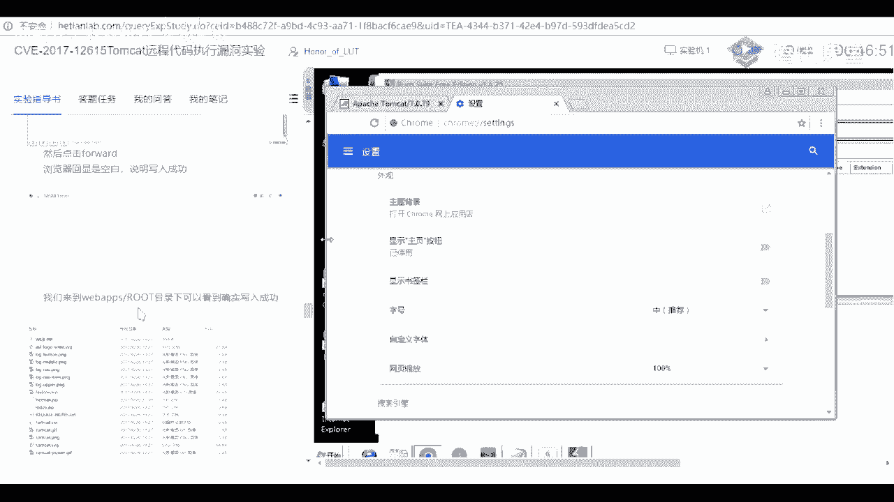

然后我发送完之后的话。

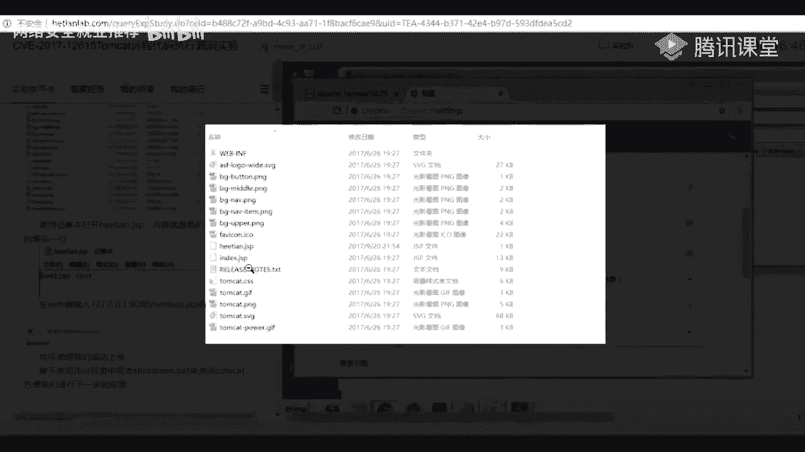

就是这样的一个空白页面，就说明啊就是请求是已经成功了，然后又能够呃可以看到，在这里的话就写入了一个jsp的一个文件，然后我们直接访问就能够得到内容，好的话，当然我们也可以就是，在我们的一个请求体当中。

就我们写入的一个内容，可以是一个jsp的一个木马，就是这个嘛啊不是是这个三点text，就是把你们把这里的这个请求体的这一个内容，把它给复制到我们的一个，把它复制到我们的bp的那个请求包里面。

然后的话进行一个上传，就能够得到这样子的一个核心点。

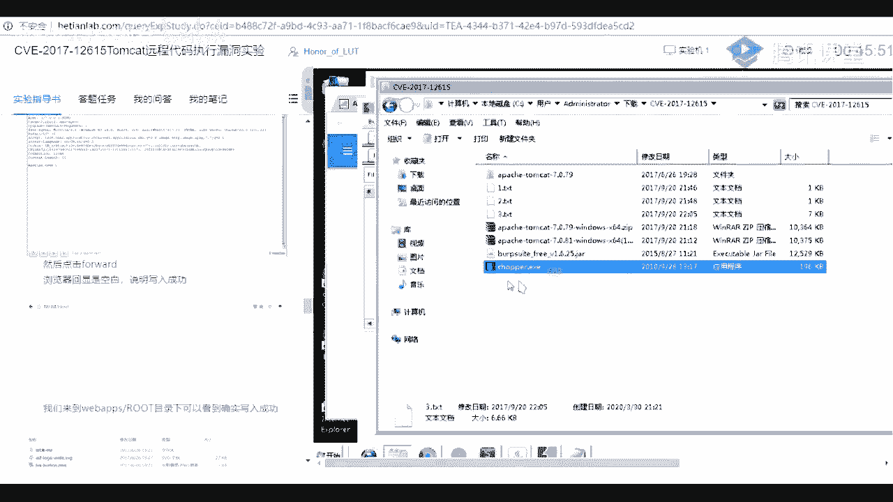

jsp的一个一句话木马文件就是一个web shell，然后的话我们可以通过菜刀去进行一个连接。

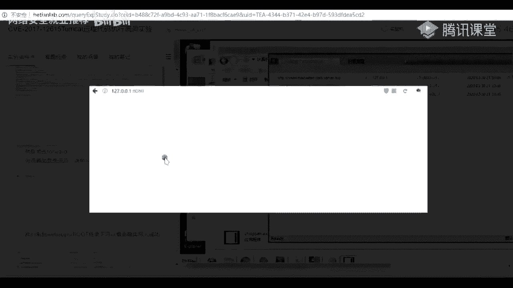

这里的话就是有一个菜刀去进行一个连接哦，这里的话因为呃，我就不去一的去进行一个操作了吧，因为时间关系，我今天的话讲的讲的比较讲的有点多了诶，嗯看大家的话还是就对这对那几个题目可以，这个实验有一些问题吧。

而具体的一些操作的话，我这样就不给大家操作了吧，大家如果在操作的时候有什么问题的话，呃，私聊我吧，好吧，然后大家有没有什么应该没有什么问题吧，实验操作时哦对，就是你的这一个有一个像播放按钮的话。

这个的话就是就是一个实验视频嘛，在你们自己的这里一个实验，就这一个嘛就有有实验视频的，大家可以跟着实验视频去进行一个操作，然后这里有一个教学知识，原因也是有相应的一个实验的一个视频的，呃才发现这个吗。

那可能大家是不太呃还是不太熟悉这一个呃，我们的这个实验室的一些操作吧，就如果，呃我今天的话应该也也算是给大家，就是大概讲解了一下怎么去进行啊，这些实验的一些操作吧，就是方便大家的一个啊实实实践嘛。

然后大家有就是在做实验的时候，有什么问题的话，也可以在群里说，就是比如说比如说这内容哪里有错对吧，然后或者说你使用机器有什么问题，都是可以提的，就欢迎大家来找茬吧，呃呃没有什么问题的话。

我们本节课本节课的一个内容的话就是这样的，然后今天的话讲的比较多，啊啊下节课的话是由另外由另呃，下面的后面有一两周的课画，是由另外的老师去给大家进去进行一个讲课。

好我们今天的一个课程的话就到这里结束了啊，感谢大家的一个观看。

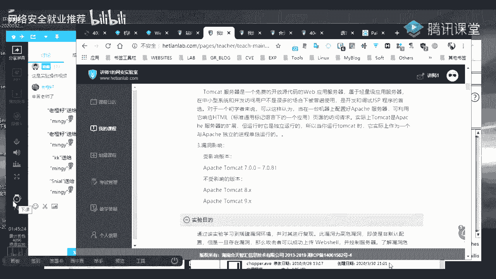

大家早点休息。