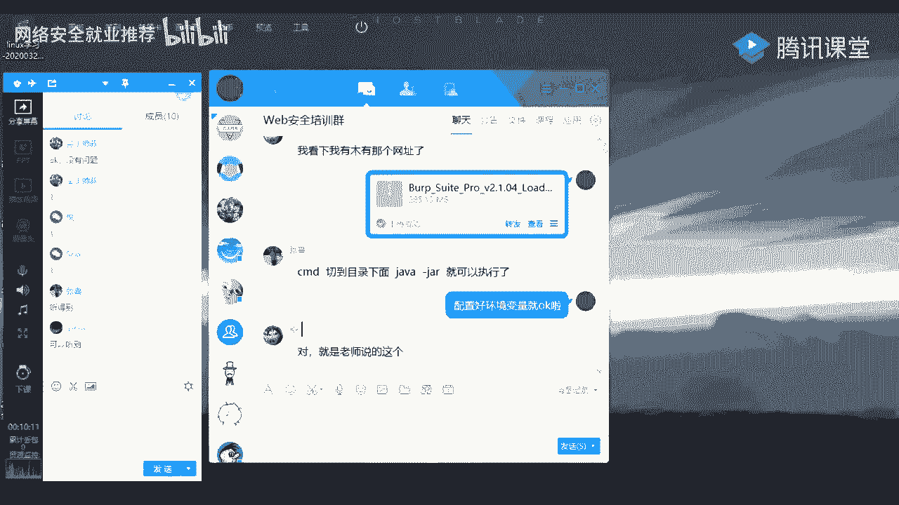

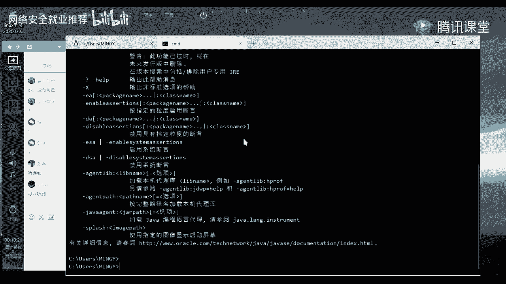

# 🛡️ 课程P5：第3天 - HTTP/HTTPS协议与Cookie/Session基础

在本节课中，我们将要学习网络安全的基础知识，核心内容包括HTTP/HTTPS协议的工作原理、Cookie与Session机制，以及如何通过Burp Suite等工具进行实践操作。课程内容力求简单直白，让初学者能够轻松理解。

---

## 📖 概述：HTTP协议简介

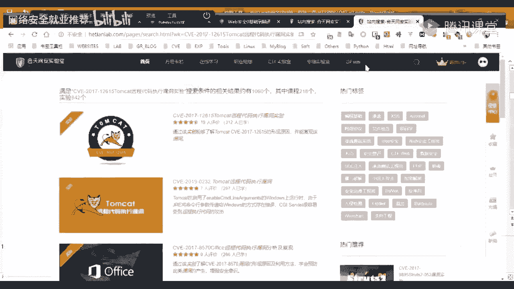

HTTP，全称超文本传输协议，是一种用于分布式、协作式和超媒体信息系统的应用层协议。它是一种基于请求与响应、无状态的协议，主要用于发布和接收HTML页面。我们日常浏览网页，就是通过HTTP协议发送请求并接收服务器返回的页面内容。

HTTP基于TCP/IP协议传输数据。其设计初衷是为了提供一种发布和接收HTML页面的方法。

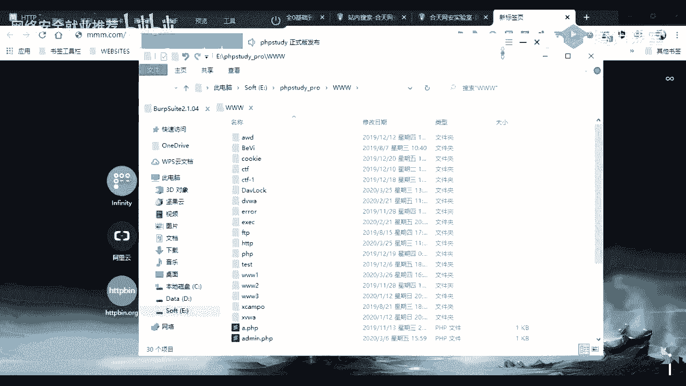

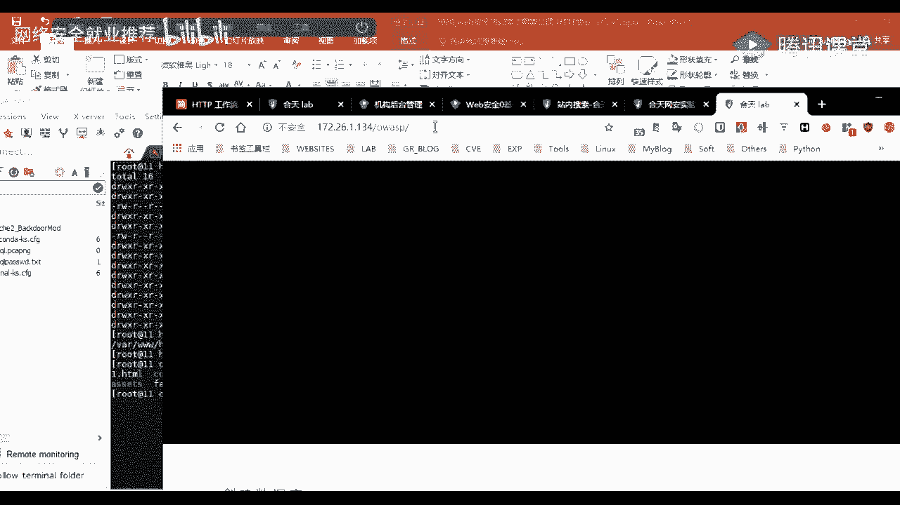

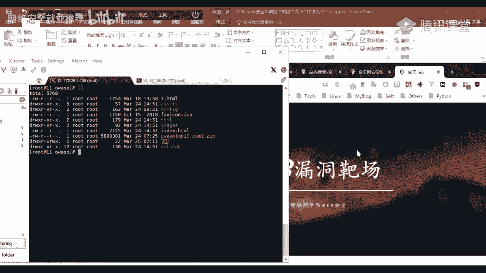

### HTTP发展历史

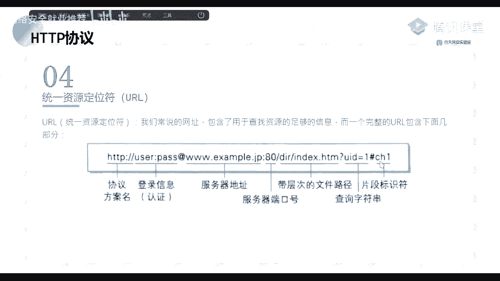

HTTP的发展经历了多个版本。目前最常见的是HTTP/1.1版本，而HTTP/2.0版本也逐渐普及。了解其历史有助于理解协议的演进。

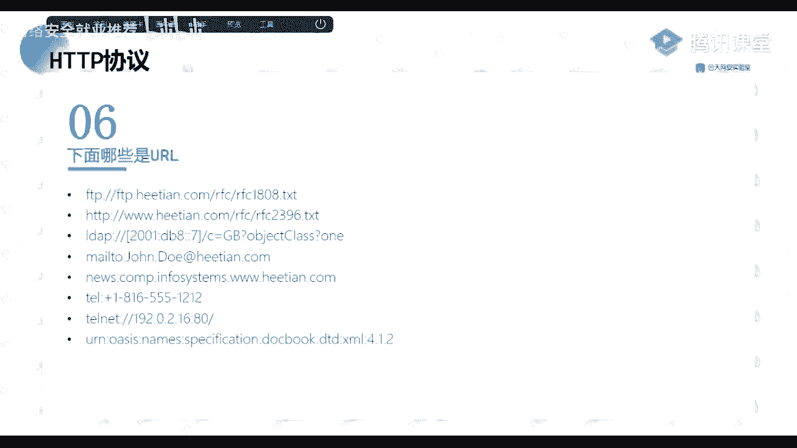

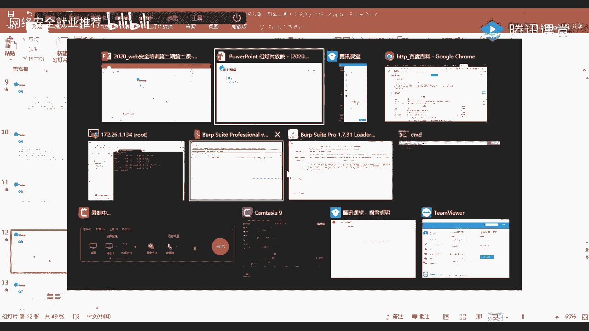

### HTTP工作流程

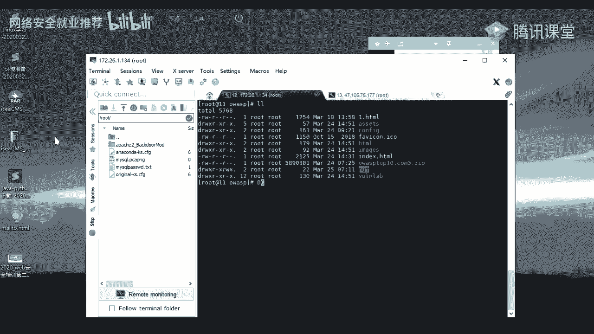

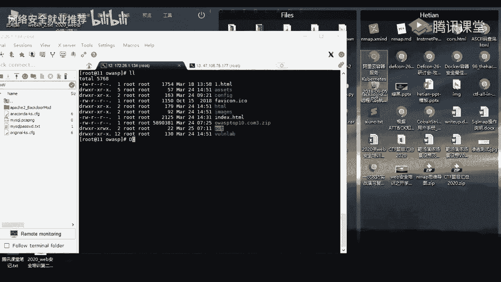

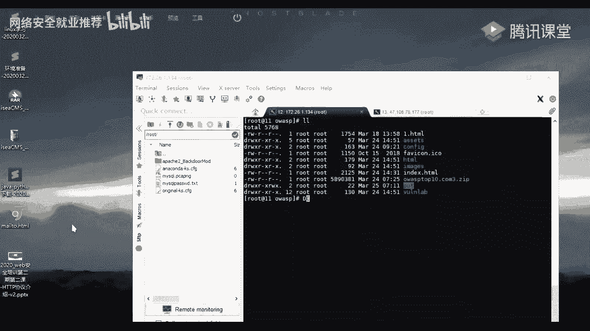

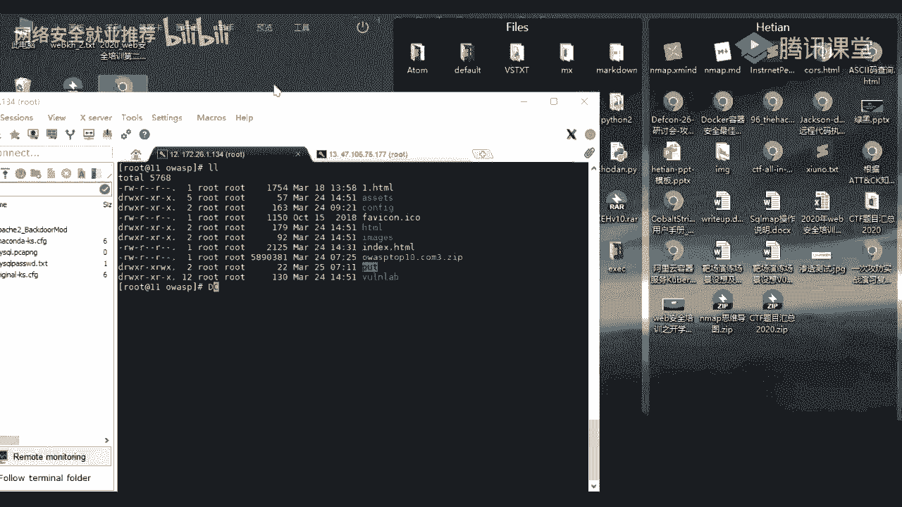

HTTP的工作流程可以概括为以下几个步骤：
1.  **建立连接**：客户端通过TCP三次握手与服务器建立连接。
2.  **发送请求**：客户端向服务器发送HTTP请求报文。
3.  **处理与响应**：服务器处理请求，并向客户端返回HTTP响应报文。
4.  **断开连接**：数据传输完毕后，客户端通过TCP四次挥手与服务器断开连接。

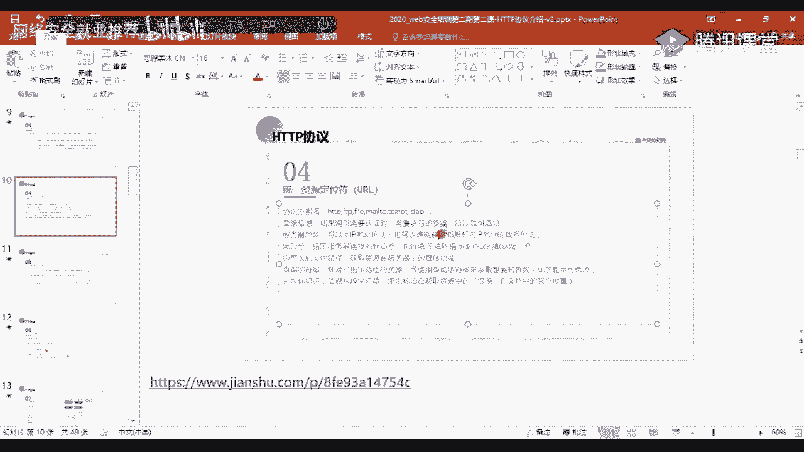

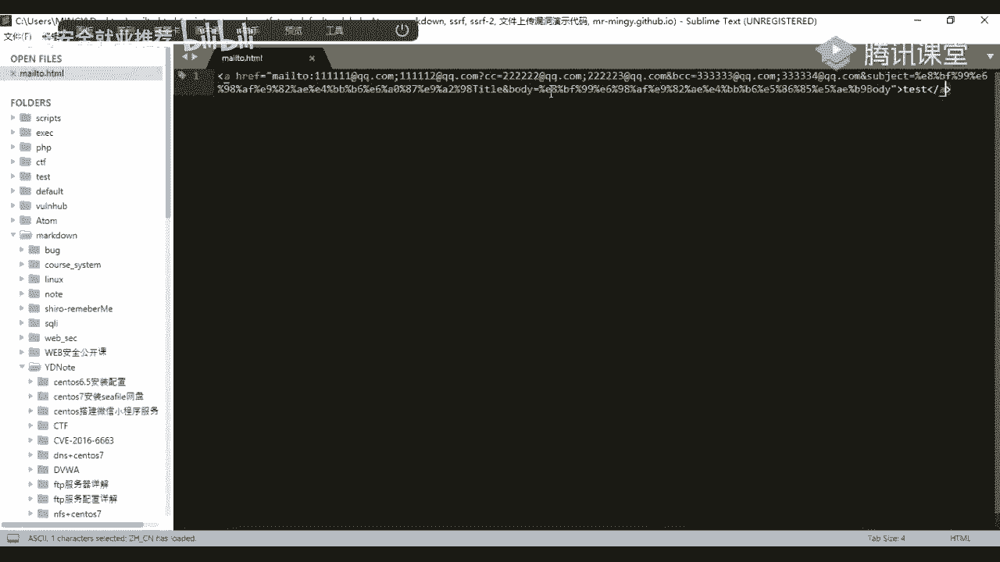

关于TCP三次握手和四次挥手的细节属于网络基础协议知识，本课程不做深入展开。

### HTTP特性：持续连接机制

在HTTP/0.9和1.0版本中，每次请求/响应后TCP连接就会关闭。HTTP/1.1引入了持续连接（Keep-Alive）机制，允许在同一个TCP连接上发送和接收多个HTTP请求/响应，从而减少了因重复建立连接而产生的等待时间，提升了效率。

---

## 🔗 统一资源定位符（URL）

URL，即我们常说的网址，用于定位互联网上的资源。一个完整的URL包含以下几个部分：

以下是URL的组成部分：
*   **协议方案名**：如 `http://`, `https://`, `ftp://`。
*   **登录信息（可选）**：认证信息，格式为 `username:password@`，不常见。
*   **服务器地址**：域名或IP地址，如 `www.example.com`。
*   **端口号（可选）**：Web服务默认端口是80（HTTP）或443（HTTPS），若使用默认端口可省略。
*   **文件路径**：服务器上资源的具体路径，如 `/path/to/file.html`。
*   **查询字符串（可选）**：以 `?` 开头，传递参数，格式为 `key1=value1&key2=value2`。
*   **片段标识符（可选）**：以 `#` 开头，用于定位页面内的特定片段。

**示例**：
`http://www.example.com:8080/path/index.html?name=value#section`

### URL vs URI

URI是统一资源标识符，是一个更广泛的概念。URL是URI的一个子集，URI还包括URN（统一资源名称）等其他形式。简单理解，我们常说的网址就是URL，而HTTP协议使用URI来传输数据和建立连接。

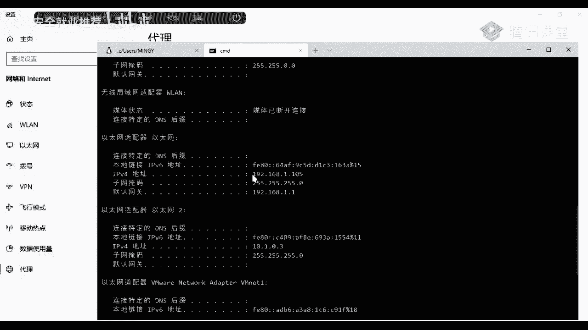

---

## 📨 HTTP请求报文详解

客户端向服务器发送的信息称为HTTP请求报文。它由四个部分组成：

以下是请求报文的构成：
1.  **请求行**：包含请求方法、请求的URI和HTTP协议版本。格式为：`METHOD Request-URI HTTP-Version`。
2.  **请求头部**：包含关于客户端环境和请求正文的有用信息，由多个 `Header: Value` 对组成。
3.  **空行**：表示请求头部结束，请求正文开始。
4.  **请求数据（正文）**：可选部分，例如在POST方法中提交的表单数据。

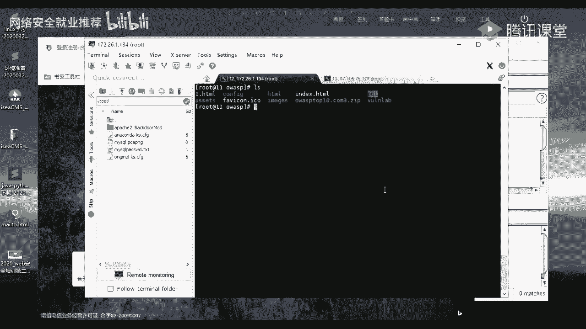

### 请求方法（Method）

常见的HTTP请求方法包括：
*   **GET**：请求指定的资源。
*   **POST**：向指定资源提交数据（例如提交表单或上传文件）。
*   **HEAD**：与GET类似，但只返回响应头部，不返回响应体。
*   **PUT**：将请求正文的内容存储到指定的URI下。
*   **DELETE**：请求服务器删除指定的资源。
*   **OPTIONS**：查询服务器支持的请求方法。
*   **TRACE**：回显服务器收到的请求，主要用于测试或诊断。

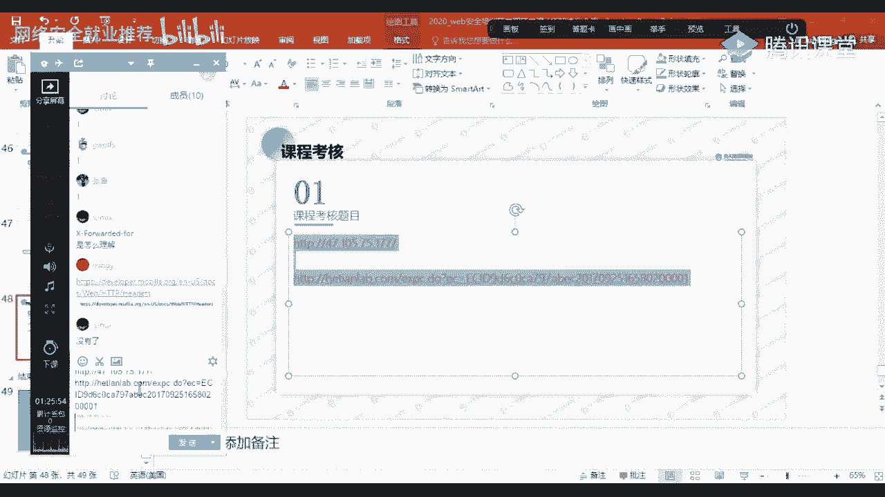

### 请求头部字段示例

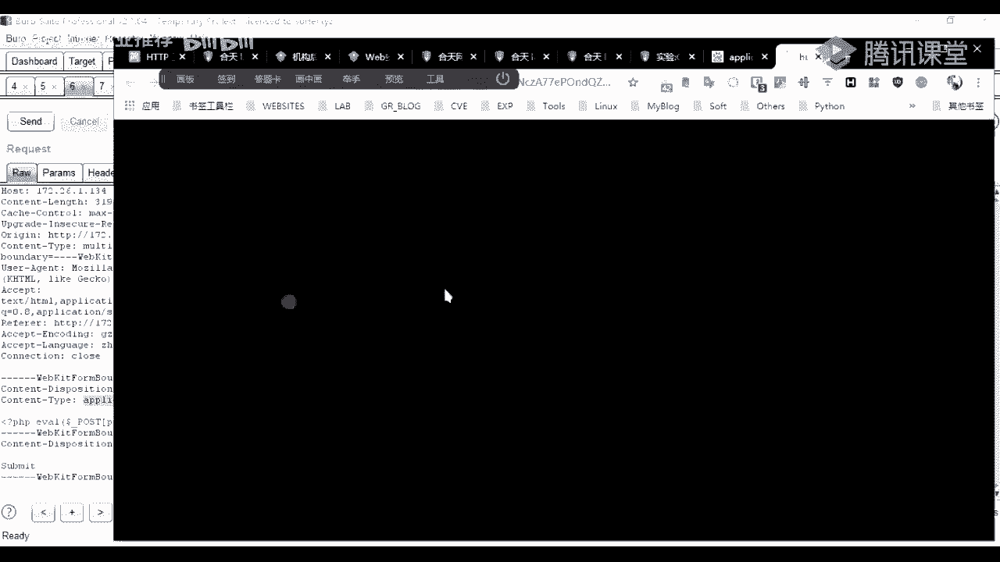

请求头部字段众多，以下是一些常见字段：
*   `Host`：指定请求的服务器的域名和端口号。
*   `User-Agent`：包含发出请求的用户代理（浏览器）信息。
*   `Content-Type`：指示请求正文的媒体类型（如 `application/x-www-form-urlencoded`）。
*   `Content-Length`：请求正文的长度（字节数）。
*   `Cookie`：将之前服务器发送的Cookie信息回传给服务器。
*   `Referer`：表示当前请求是从哪个页面链接过来的。

---

## 📤 HTTP响应报文详解

服务器返回给客户端的信息称为HTTP响应报文。其结构与请求报文类似：

以下是响应报文的构成：
1.  **状态行**：包含HTTP协议版本、状态码和状态描述。格式为：`HTTP-Version Status-Code Reason-Phrase`。
2.  **响应头部**：包含关于服务器的信息和对响应正文的描述。
3.  **空行**：表示响应头部结束。
4.  **响应数据（正文）**：服务器返回的实际内容，如HTML页面、图片等。

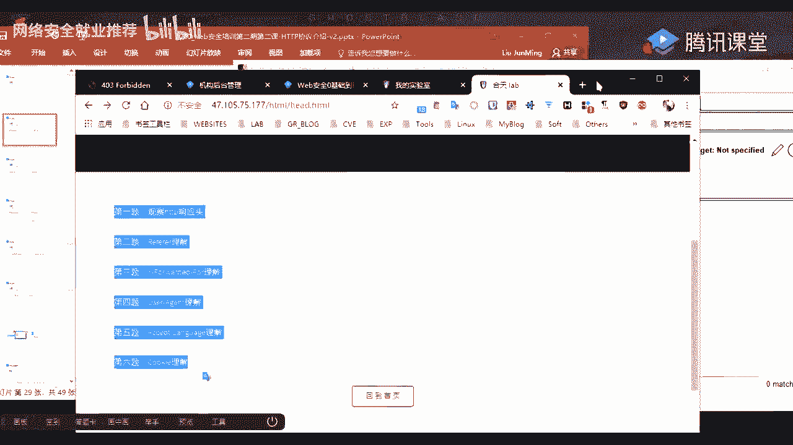

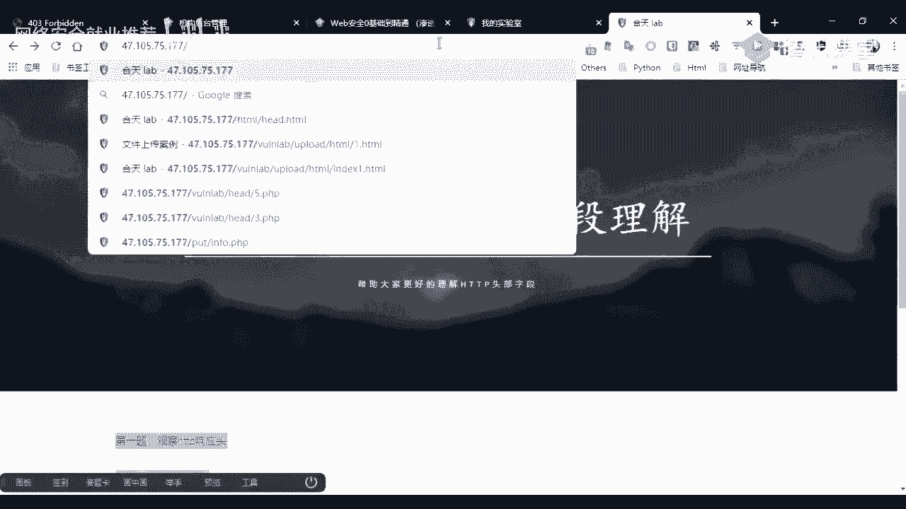

### 状态码（Status Code）

状态码由三位数字组成，第一位定义了响应的类别：
*   **1xx**：信息性状态码，表示请求已被接收，继续处理。
*   **2xx**：成功状态码，表示请求已成功被服务器接收、理解、并接受。例如：**200 OK**。
*   **3xx**：重定向状态码，表示需要客户端采取进一步的操作以完成请求。例如：**302 Found**（临时重定向）。
*   **4xx**：客户端错误状态码，表示请求包含语法错误或无法完成。例如：**404 Not Found**。
*   **5xx**：服务器错误状态码，表示服务器在处理请求的过程中发生了错误。例如：**500 Internal Server Error**。

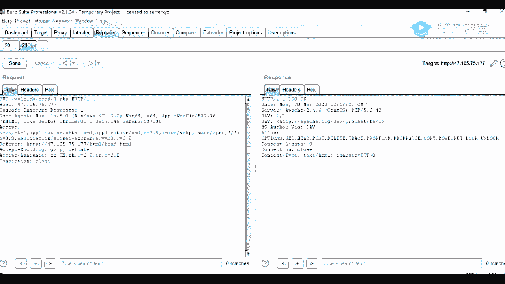

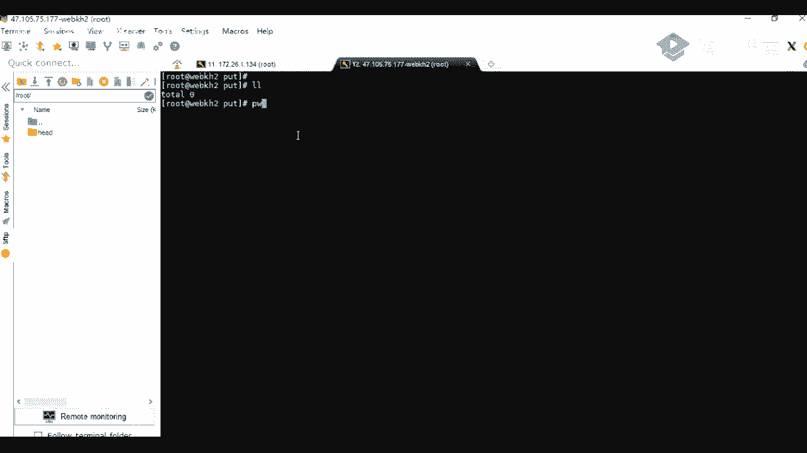

### 响应头部字段示例

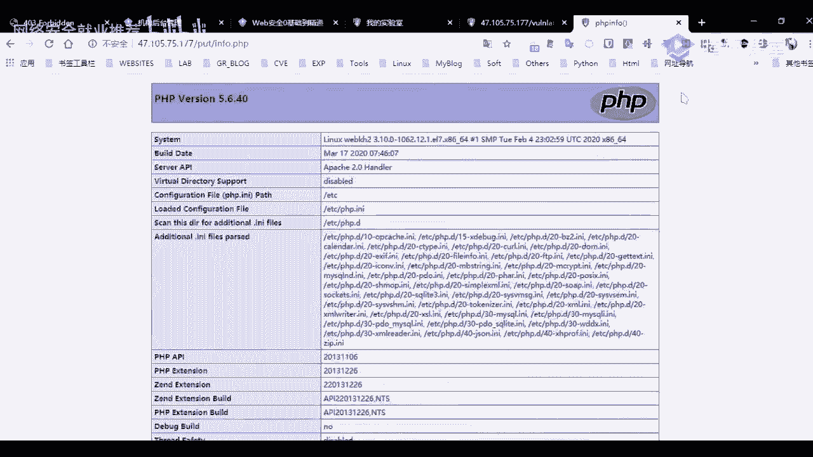

响应头部同样包含许多字段：
*   `Server`：服务器软件名称和版本。
*   `Content-Type`：响应正文的媒体类型（如 `text/html; charset=utf-8`）。
*   `Content-Length`：响应正文的长度。
*   `Set-Cookie`：服务器向客户端设置Cookie。

---

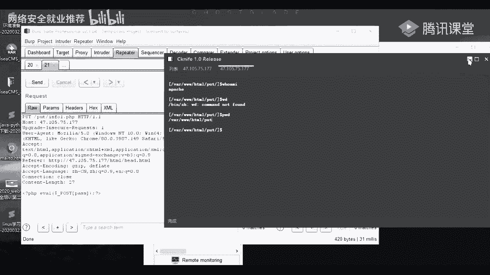

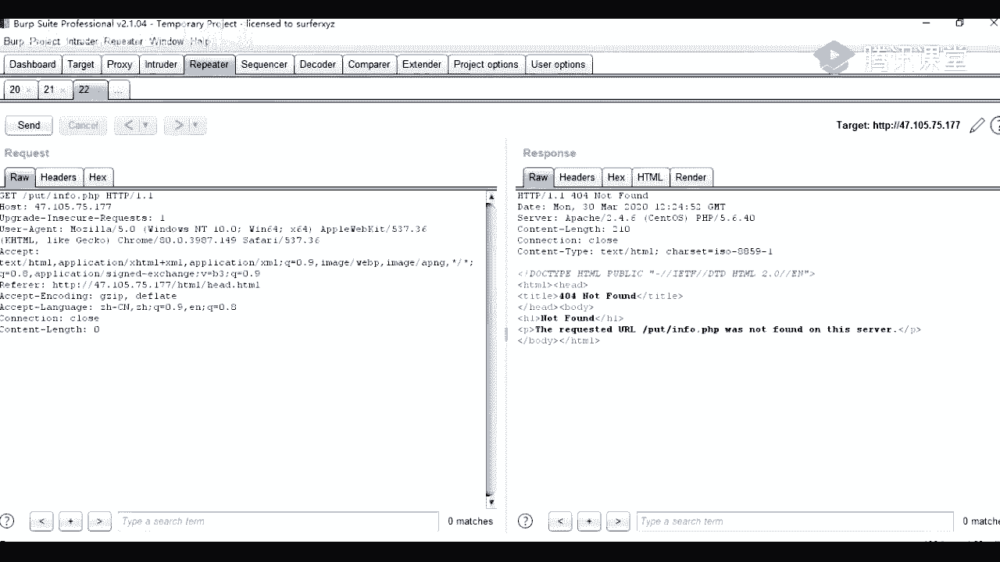

## 🔐 HTTPS协议简介

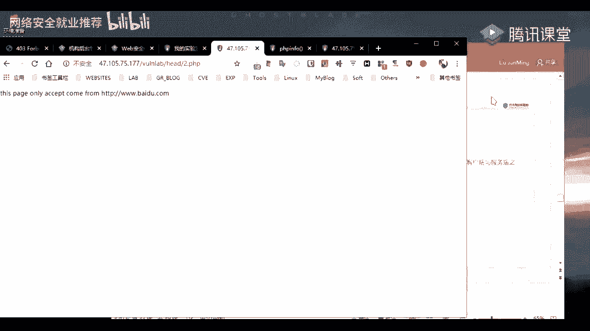

上一节我们介绍了HTTP协议，本节我们来看看它的安全版本——HTTPS。

HTTPS是HTTP的安全版，全称为HTTP over SSL/TLS。它在HTTP之下加入了SSL/TLS协议层，提供了数据加密、完整性校验和身份认证的功能，能有效保护数据传输的隐私和安全。

简单来说，HTTPS = HTTP + 加密 + 认证 + 完整性保护。它使用默认端口443。

---

## 🍪 Cookie与Session机制

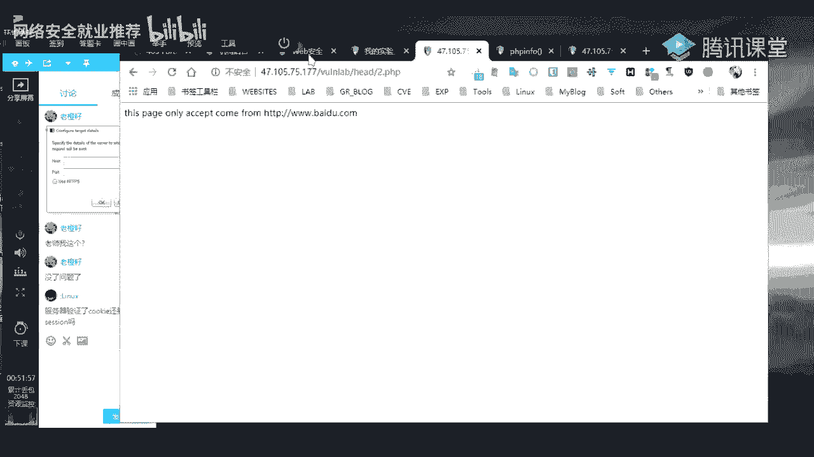

HTTP是无状态协议，这意味着服务器不会记住之前的请求。为了支持需要状态的功能（如用户登录、购物车），引入了Cookie和Session。

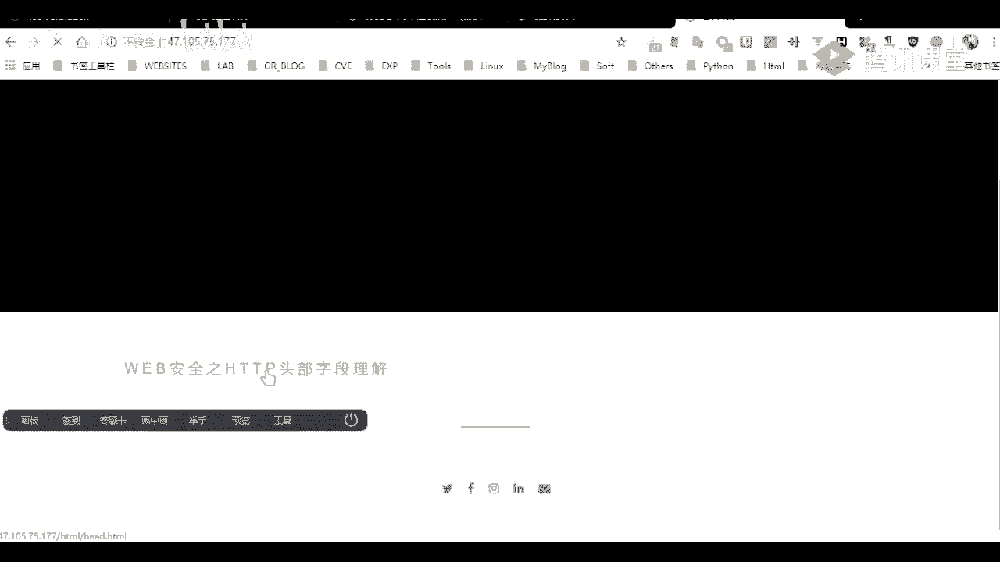

### Cookie

Cookie是服务器发送到用户浏览器并保存在本地的一小块数据。浏览器会存储它，并在后续向同一服务器发起的请求中携带该Cookie。

以下是Cookie的工作原理：
1.  客户端首次访问网站。
2.  服务器在响应中通过 `Set-Cookie` 头部字段发送Cookie信息。
3.  浏览器保存此Cookie。
4.  之后客户端向同一服务器发起请求时，会自动在请求头部通过 `Cookie` 字段将信息发送回服务器。
5.  服务器通过读取Cookie来识别用户状态。

Cookie可分为：
*   **会话Cookie**：存储在内存，浏览器关闭即失效。
*   **持久Cookie**：存储在硬盘，有设定的过期时间。

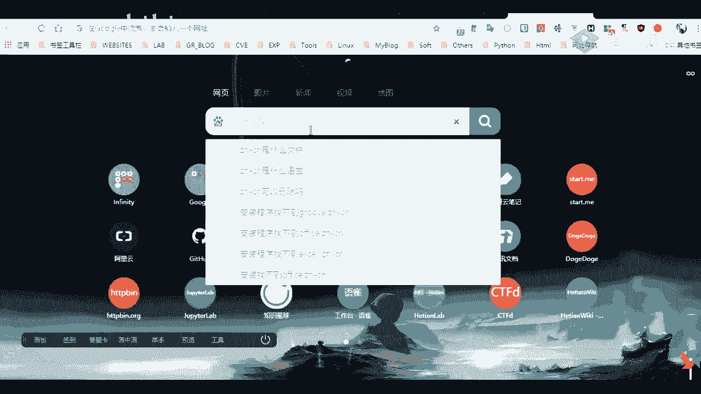

### Session

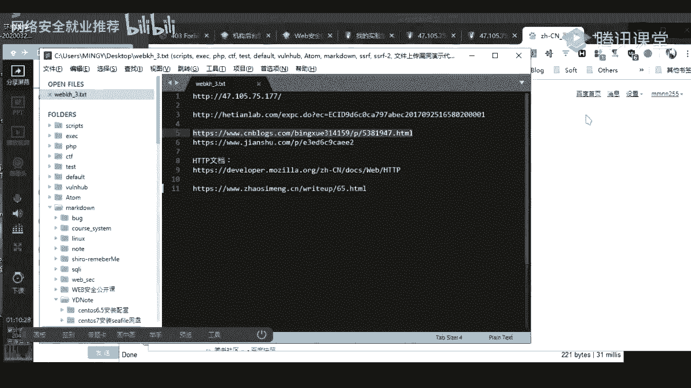

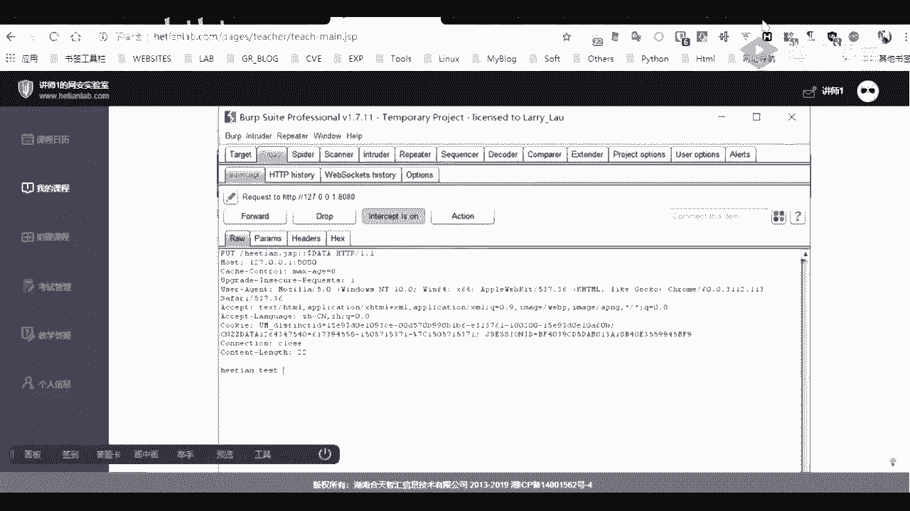

Session是另一种记录客户状态的机制，数据保存在服务器端。客户端访问时，服务器会为该客户端创建一个唯一的Session ID，并通过Cookie（或URL重写）将这个ID传递给客户端。客户端后续请求时带上这个ID，服务器就能找到对应的Session数据。

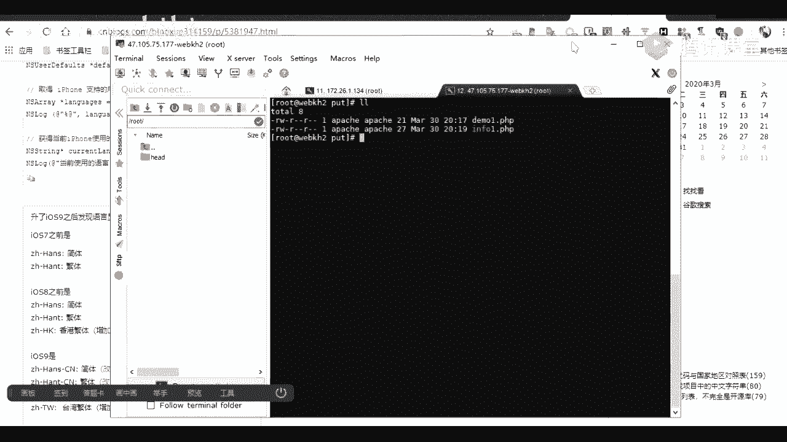

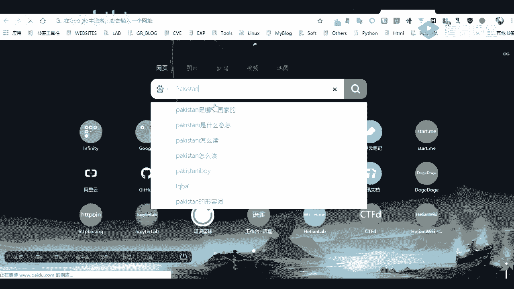

**Cookie与Session的主要区别**：
*   **存储位置**：Cookie数据存放在客户端，Session数据存放在服务器端。
*   **安全性**：Session相对更安全，因为敏感信息不存储在客户端。
*   **存储容量**：Cookie有大小限制（约4KB），Session理论上只受服务器内存限制。

---

## 🛠️ 实践：使用Burp Suite分析HTTP请求

理论需要结合实践。我们可以使用Burp Suite工具来抓取和分析HTTP请求/响应。

以下是使用Burp Suite的基本步骤：
1.  **配置代理**：在Burp Suite中设置代理（默认`127.0.0.1:8080`），并在浏览器中配置相同的代理设置。
2.  **拦截请求**：打开Burp Suite的拦截功能，在浏览器中访问网页，请求会被Burp截获。
3.  **查看与重放**：在 `Proxy -> HTTP history` 中查看历史请求。可以将请求发送到 `Repeater` 模块进行手动修改和重放测试。
4.  **分析不同方法**：尝试修改请求方法（如GET改为POST、PUT等），观察服务器的不同响应。

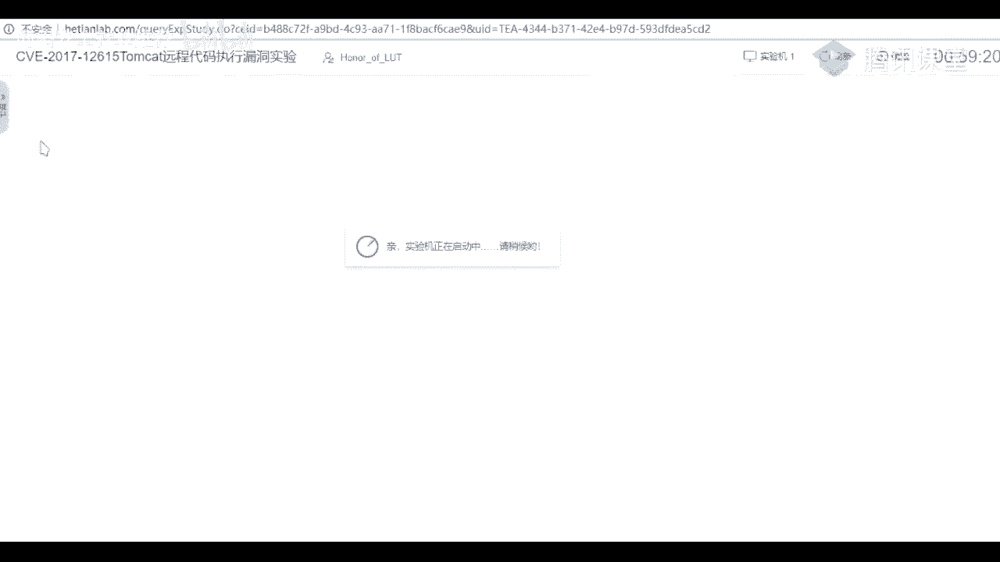

**示例：PUT方法上传Web Shell**
如果服务器配置不当（允许PUT方法且未对上传文件做严格过滤），攻击者可能利用PUT请求直接上传恶意文件（如Web Shell木马），从而控制服务器。

**防御建议**：在生产环境中，应严格限制或禁用不必要的HTTP方法（如PUT、DELETE），并对文件上传功能进行严格的安全检查。

---

## 📝 总结

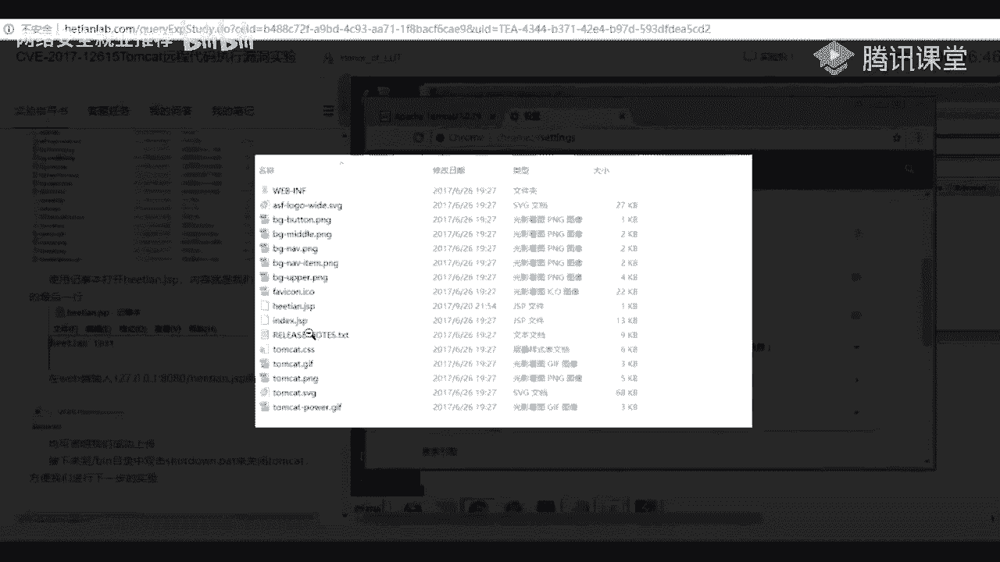

本节课中我们一起学习了网络安全的基础核心知识：
1.  **HTTP/HTTPS协议**：理解了HTTP的工作原理、请求/响应报文结构、状态码以及HTTPS提供的安全增强。
2.  **URL的构成**：学会了如何解读一个完整的网址。
3.  **Cookie与Session**：掌握了这两种用于维持HTTP状态的关键机制及其区别。
4.  **工具实践**：初步了解了如何使用Burp Suite工具进行HTTP流量分析和安全测试。

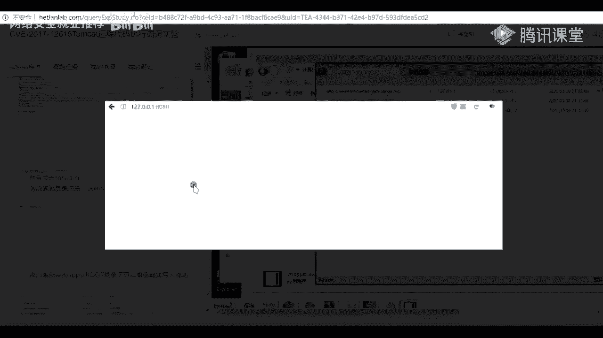

掌握这些基础知识是进一步学习Web安全、漏洞挖掘和渗透测试的必经之路。希望大家通过课后练习和实验巩固所学内容。