# P50：第14天：Metasploit渗透基础及实操 - 网络安全就业推荐 - BV1Zu411s79i

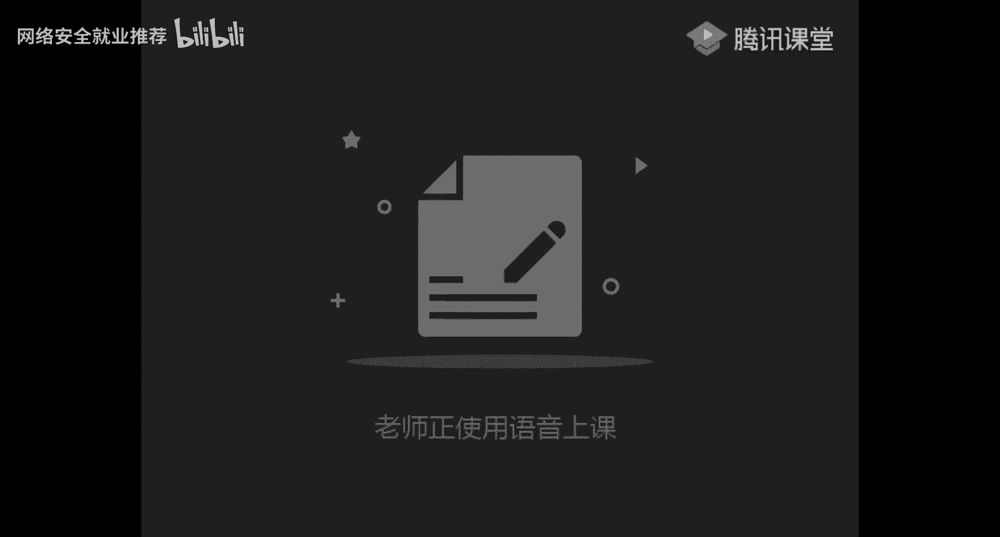

啊，ok大家可以听到声音吗，啊m s f是需要postgresql的，当然如果不连也行的啊，不连这个postgresql也行，也能用，嗯大家能听到麦克风吗，行那我们八点钟开始下。

我们以后都是以一天两个课时的进行讲解，因为这样也有助于大家消化，比如说我讲的这些东西，大家一定要去动手去做，因为你去听，去看博客和自己去动手操作是完全不一样的，你操作的过程有可能会遇到各种各样的问题。

那你可以百度解决，或者是问我们老师，那你就会从中学到很多东西，周末小课在等这个框架讲完，应该就会有，到时候会和那个有老师讲一些楼层的复线，或者是sr r c web挖掘，那边也有啊，周末小课是都有的。

在后面我们讲到课程的，基本上40%，差不多就周末就会有小课，好看安排吧，有可能是一起上或者是啊分开，但是那不是都在那个群里吗，都在那个小课群里，嗯我们八点钟准时开奖，再等一下呃，今天已经周五了。

大家周五的晚上啊，非常感谢大家抽出周末的时间来听听课，当然大家也要在周末去花一下时间，做一下课后的作业，在今天晚上我都会放到我们群文档里面，那行那我们现在开始讲，今天我们来讲呃。

况渗透测试框架的第一个meta split mehra，是一个啊排名第二的，我也不知道这个排名是哪里的，排名第二的一个安全工具，它能在我们渗透测试的过程中，帮我们自动化的进行攻击服务端口。

或者是生成后门木马，全线提升权限维持等一些复杂的事情，我们在攻击系统服务脚本，比如桑巴的永恒之蓝漏洞，我们不需要对这个漏洞有过深的研究，也不需要自己去写poc，也就是漏洞检测，利用脚本。

我们可以直接使用渗透测试框架matter slate，也帮我们自动的进行攻击，方便了我们这个渗透测试的入门，在大家提交的作业里面，我看到大家很多都会用math类的，这非常好，因为它说简单。

基础流程是非常简单，当然里面所拥有的东西是特别的复杂，即使是啊mea flat魔鬼测试训练营的作者，蓝莲花的创始人诸葛建伟啊，他也说自己是不能完全掌握这个mata类的，在我们看来确实如此。

因为它里面的内容是特别的多，那我们今天就来学习mahl，首先我们需要了解my hosplit的目录结构，就是里面放了一些什么东西，my slak就是msf是它的简称，是高度模块化。

这个框架呢由多个模块组成，是最受欢迎的渗透测试工具，对msf呢它是一款开源安全利用和测试工具，它集成了我们常见的系统服务漏洞，和流行的shell code，并且持续保持更新，现在的msf已经更新到了6。

6版本，那他split涵盖的渗透测试中全过程，你可以在这个框架下，利用现有的payload，或是游客的进行一系列的生存测试，我们就不需要关注漏洞的一个本质，就不需要再去调试了，真的不需要吗。

其实是需要的，我们如果去自己去调试m s17010 ，会发现啊，这个漏洞是怎么形成的，自己去调试也会学到学到很多东西，当然我们现阶段作为一个入门，那我们不需要去花这么多的功夫去做这件事。

mai split在咖啡里面是自带的，那它的一个安装路径呢，在19年的卡利新版，通常是第二个路径是user目录，shell目录下的meta split framework目录。

在这里面有我们框架的文件内容，来我们来看一下，那就在这个在这个目录里面。

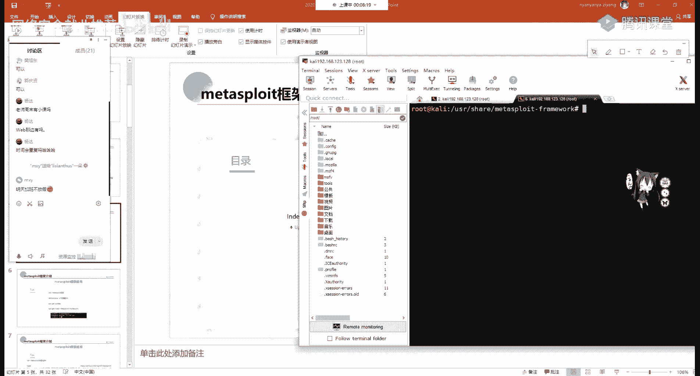

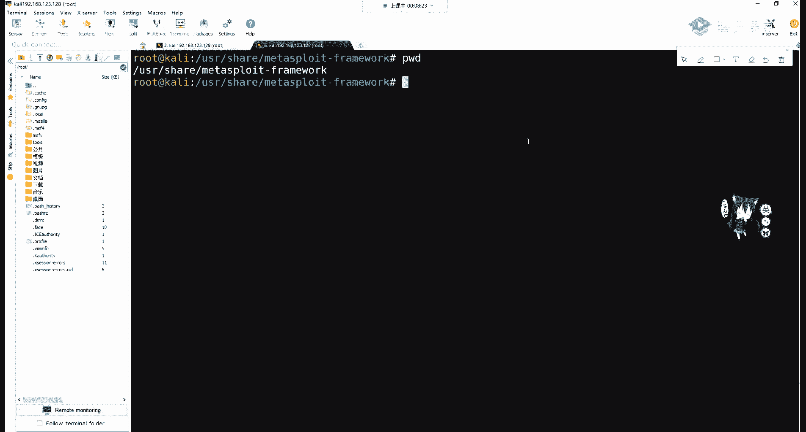

这是他的一些文件，那我们来快速的看一下这些文件是干什么，我们可以使用ms consol，这个是m s f的一个接口，我们是通过它来操作操作m s f杠v version，查看版本，如果更新它也非常简单。

首先更新我们的i p t get源，这个语言，大家如果是使用卡里自带的d版软的话，有可能在国内访问非常的缓慢，大家可以去百度自行搜索如何更换ip源，更换成清华源或阿里云源进行update。

就是更新语言之后简很简单，i p t get install，安装meta lt framework，即可对msf进行更新，在msf，如果大家不想去更新整个的框架，而是利用他现有的一个插件或者是漏洞。

利用脚本，大家可以到github上面，meta split的官方仓库进行寻找最近更新的内容，进行一个下载，然后移的移动到我们的models这个模块目录即可，这些大家都可以操作命令，不需要自己去记。

因为这些都可以找到，我们来看一下它的目录，也就l s看data数据，很显然它是包含了msf，用于存储某些漏洞的二进制文件和可编辑文件，那documentation这个就是包含了文档，那六个呢是库文件夹。

还有插件文件夹，squs，脚本文件夹，tooth工具文件夹，还有我们最重要的models，是包含了msf的所有的模块，那我们对渗透测试自动化利用，通常就是对models里面保存的模块文件进行调用。

那我们来看啊这个models目录里面有哪些东西呢。

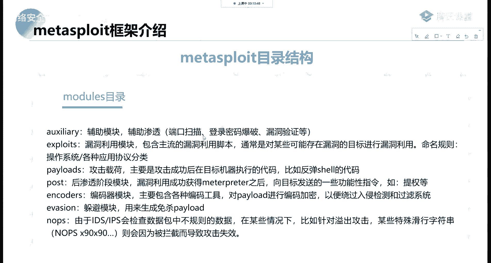

这些是我们需要掌握的cd的models进行ios，可以看到里面是有七个子目录。

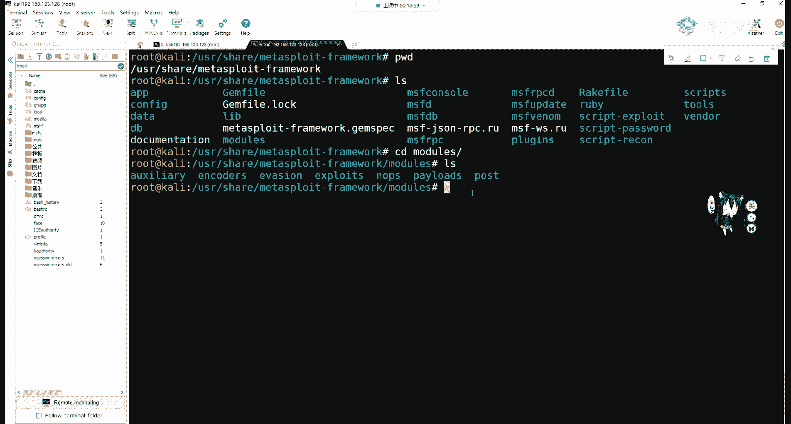

分别来看一下它们代表什么，首先辅助模块，很显然辅助模块就是辅助渗透，也就是对渗透测试进行前期信息收集，进行漏洞的扫描和探测，包括端口扫描，若密码爆破，漏洞验证等，explodes漏洞利用模块，很显然。

这就是e x p里面包含了主流漏洞的利用脚本，plos攻击载荷，plos主要是用于攻击成功后，在目标机器执行代码，反弹shell的代码，我们不论是渗透测试还是通过web进行公路。

最终是拿到shell权限，也就是get shell，sl是什么，就是我们可以输入命令的地方，就是我们linux操作系统的batch，还有windows操作系统的cmd post，后渗透阶段模块。

当我们进行攻击，拿到shell之后，我们会获得mad prator，这个东西，可以帮助我们向目标机器发送一些功能性指令，比如提权或者是进行内网的代理，路由的一个创建等等，includes编码器。

很显然这些都是字面意思，即对po的进行编码加密，编码和加密，能够绕过入侵检测系统或者是杀毒软件，躲避模块用来生成免杀的pilot no，loft是因为一些入侵检测系统，会检查数据包中不规则的数据。

我们这个notes呢大家如果学过汇编，应该清楚，在汇编二进制语言中，这个noon不是0000，而是九零十六进制的，九零代表汇编语言的note指令，他不会执行任何的这个指令。

那我们来看一下matsult体系结构，也就是核心的库文件，我们通过interface接口是m s consol，这个接口调用这个matt split的核心文件，这核心文件中基于msf的models。

这些进行一个调用，我们首先来看如何进入ms conso，首先我们需要对数据化数据库进行初始化。

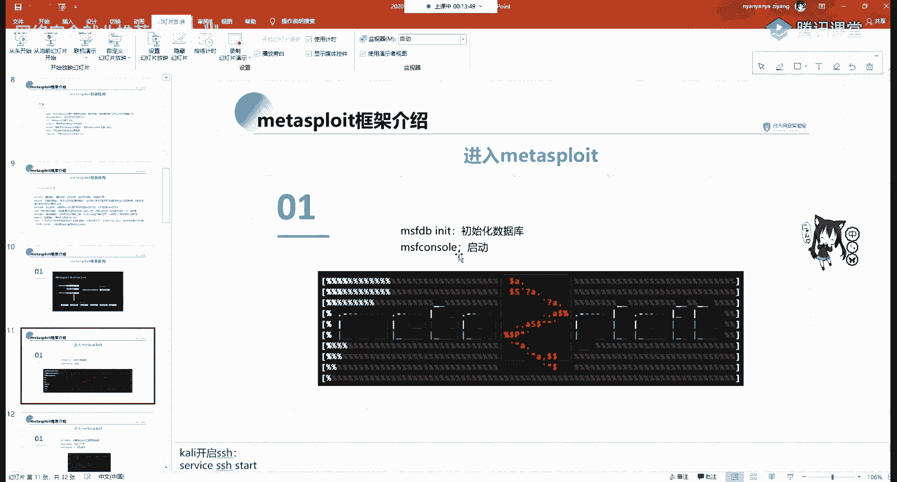

当然这里你如果不做是也没有问题的啊，我们有的时候不需要保存到数据库里，那这些也是没有问题的，数据初始化很简单，m s f d b in赢一手，这个就进行一个初始化。

然后在他这里面直接输入msf consol进行启动，那这我就不多讲了，就这一条命令在启动之后，我们会推出shell来到ms consul的一个命令行里面。

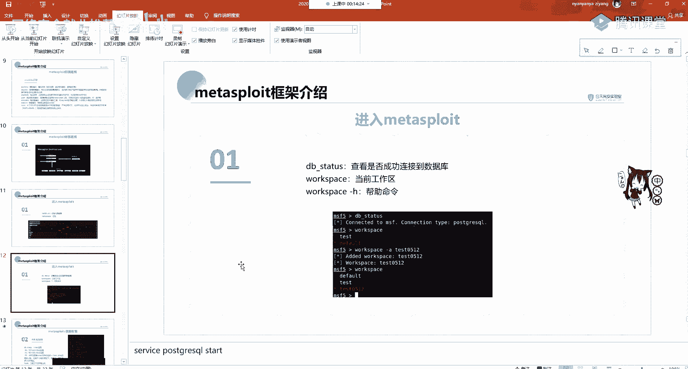

我们来试一下，这个大家如果嗯我去做过这个msf的，应该都非常清楚，这么我们会来到一个msf的一个命令行模式，让我们继续来看。

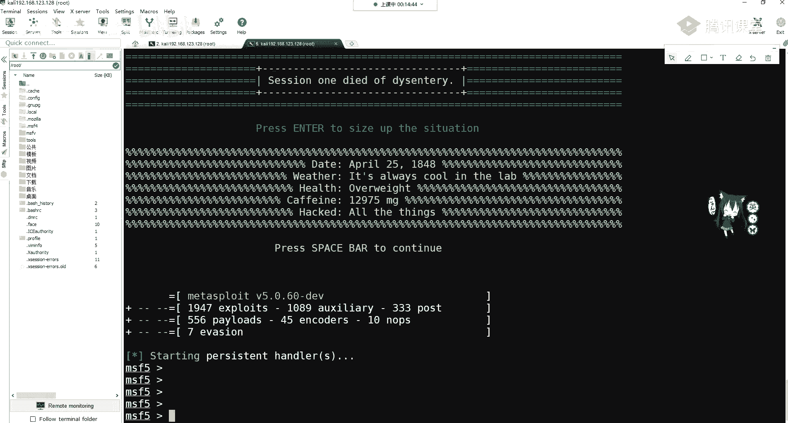

在这里面呢，我们可以输入db stu，去查看是否成功连接到数据库。

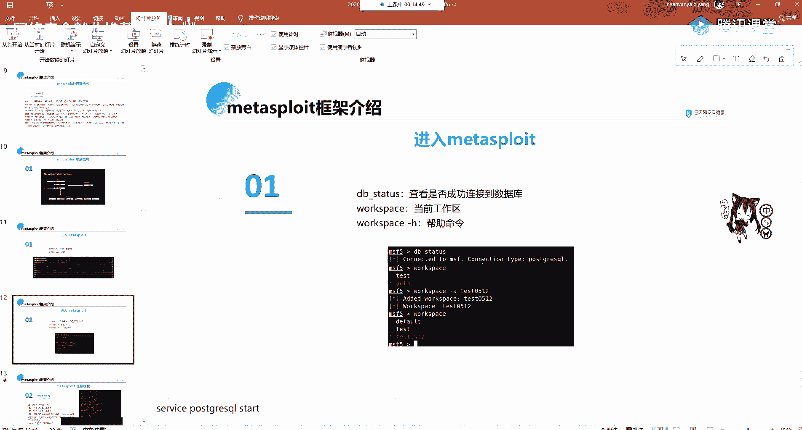

就是连接到我们的m s f使用的是postgresql，那我们使用db ttes，可以看到已经成功的连接到post grasql，当然这里不理连接也是可以的，workspace查看工作区。

我们是处于dep，也就是msf的默认工作区。

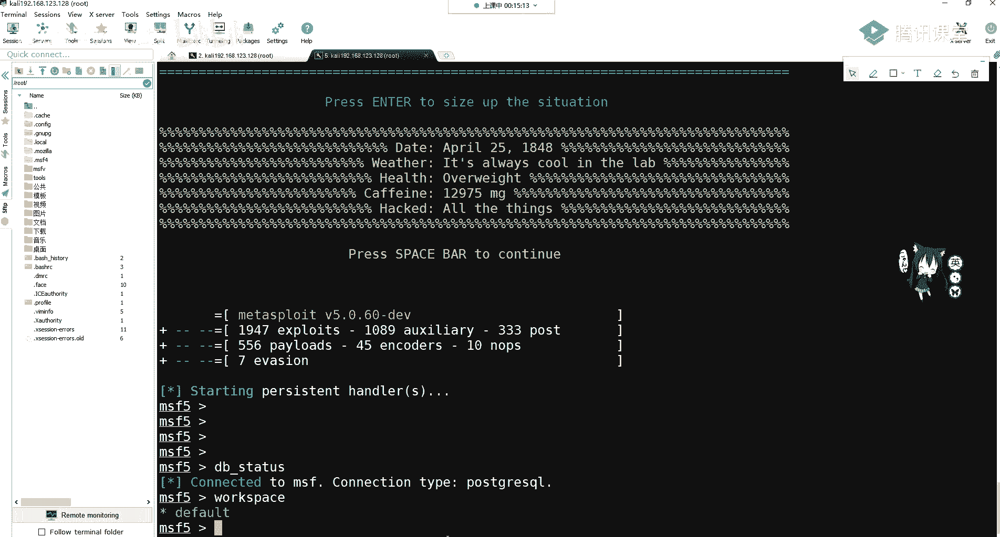

我们可以进行创建其他工具区，使用workspace杠a也就是爱的创建其他工作区，并且切换至其他工作区，这里大家都可以不做，因为对我们后续的渗透测试，及后渗透都没有任何的影响，内网主机发现。

那这里meta split，当然它能满足我们渗透测试的全过程，我们在第一阶段讲到渗透测试首先要做什么，面试官hr首先问你什么，就是问你如何进行进行收集，那m sf作为一个全能的信息渗透测试框架。

那信息收集肯定也缺不了，首先是信息收集的一个不老的神器，nmap netflit里面也是自带的，但是我们使用它需要加db杠，nmc，它的一个使用方法和我们在进行收集中讲的。

nmap的使用方法是完全一样的，只是它扫描之后会存储到我们的postgresql里面，那我们来简单的进行一个db i。

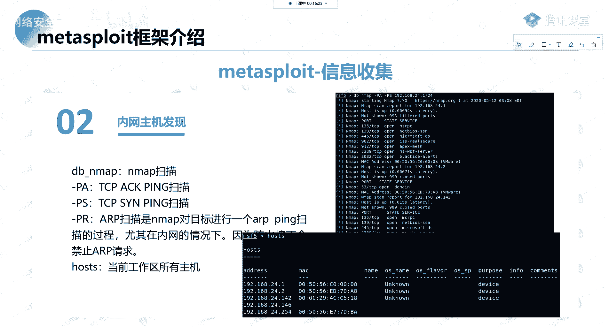

还可以看到它有一个usage，那个h看到这是我们和这个map是一模一样的。

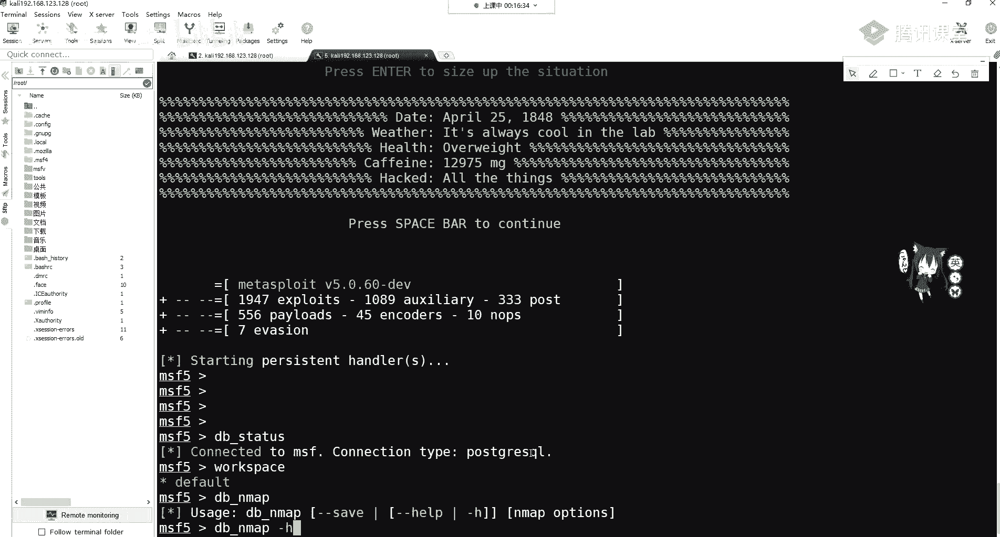

那这里我就不多讲了，因为跟我们n map这个已经讲过了，大家如果忘记了的话，可以去看一下，之前我发到群里的ppt，同时nmap的所有功能，它这里也都分别支持分别端口服务和版本探测。

包括s y n半开扫描，还有tcp扫描，同样也可以调用nmap的squid的参数，去检查是否有常见的服务漏洞，比如s m b445 端口的一些漏洞。

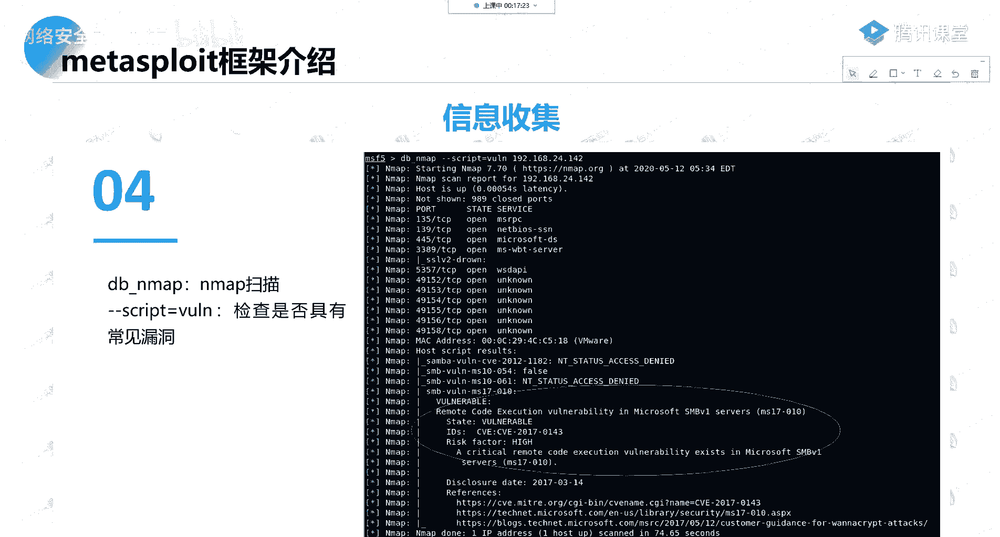

在我们信息收集里面可以不利用n m f，因为这个dp m f实际上还是调用了n map工具，进行一个扫描，那我们刚刚在介绍msf的时候就已经说过，m对msf的操作主要是依靠它下面的models。

models里面有辅助模块，辅助模块，我们一想肯定知道辅助模块里面有什么有漏洞，扫描入口跟扫描有端口扫描。

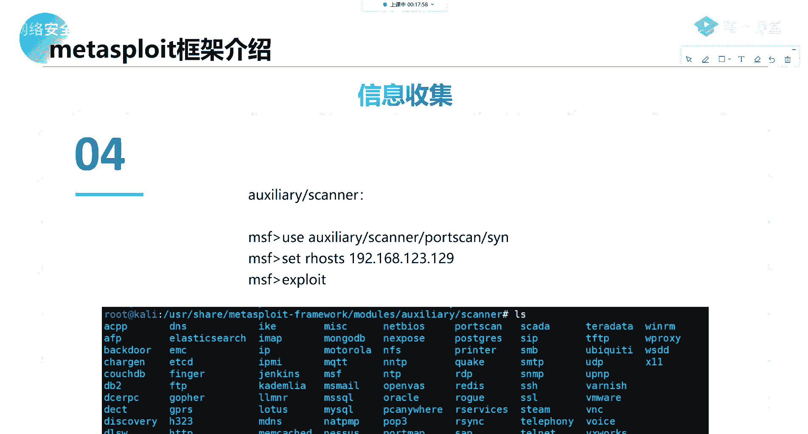

那我们是不是可以利用模块进行一个扫描。

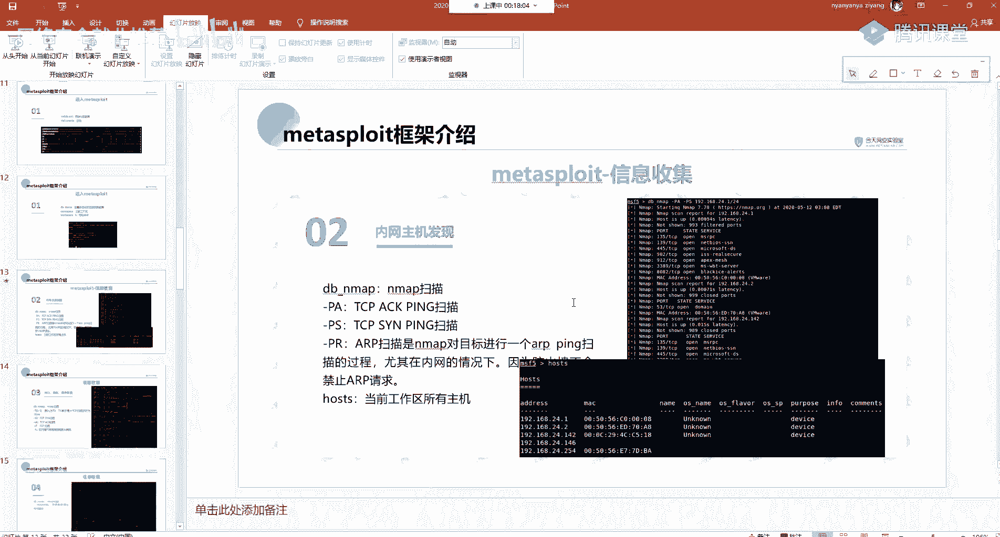

我们这里看一下如何去利用模块的使用use，我们想用什么，想用辅助模块，辅助模块下面的什么呢，是scanner，我们需要扫描扫描什么，扫描端口是吧，这些都是一些常见的一些英语，我们使用什么扫描。

你不知道的话，直接按tab按tab，他会告诉我告诉我们，我们可以使用半开扫描是什么，s y n对，他是不会在我们服务器上留下留下痕迹的，一个非p藏量，也就是只发tcp的第一次握手包，如果你不知道的话。

也非常简单，使用search search post can，也就是端口扫描，他会把这些可以用到的models都为我们列出来，那我们回到刚刚的use这个半开扫描，在来到半开扫描之后。

我们需要对指定ip也就是目标机进行扫描，那我们这个叫做设置，我们想看这个模块需要我们设置什么，就是查看设置，show options，shoptions，那这些。

那这些我们来看一下我们需要配置的pose，这指定的是1~10000a host，这个叫目标目标的地址，那我们需要设置目标的一个地址，后面线程延迟，ok这些，而且最大的一个端口数。

那这里我们去设置它的一个目标机器，它的一个ip地址，我比如说扫描这个win 7，我们来看一下它的一个ip地址，他要二九，那我们可以设置一下，它为129，然后进行run，它就会进行一个扫描。

那这里因为时间去过长，那么这里就不做扫描了，当然你也可以进行一个线程的一个设置，比如20线程，ok你再去看一下这个配置，也可以看到这里已经变成了20。

启动模块使用的是explode，攻击或者是run运行都可以进行扫描，它们两个是一样的，那我们作为端口进行扫描，同时是不是也要对目标机器的c段进行扫描，c段扫描可以用什么，可以自己写脚本。

ping可以利用c web can，可以利用nmap 4级带的这个参数，进行一个内网探测，那同时我们，m s f肯定也提供了这个探测一个收集模块，也就是discovery。

发现它同时同样也在我们的辅助模块下面的，scanner里面的一个内容，那我们这时候就可以进行一个搜索搜索。

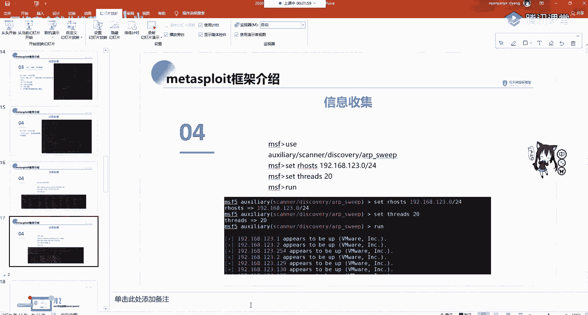

search discover啊，这里我就直接用，我可以返回到或者直接在这直接用，或者是返回到上一级use我们的辅助模块，scanner discovery，然后我们可以按tab键。

可以看到我们可以使用哪些东西，进行一个主体发现，可以使用udp或者是lp，那我们最快的最常用的肯定就是lp了，可以show options进行一个查看，这里也需要我们指定一个目标的机器延迟，包括线程。

然后run就可以对目标进行机器的一个c段，进行扫描。

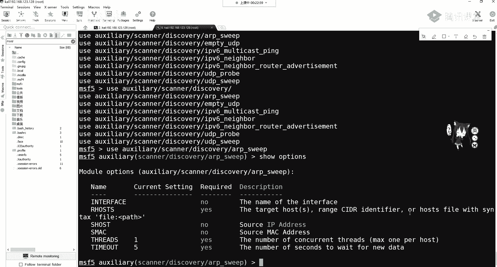

这里大家应该没有问题吧，好我们继续来讲，因为这个流程还是要过一遍的，大家如果听好之后，可以进行手动的一个操作，这些就是一个针头测试的一个流程，那么msf攻击的最终目的就是获取我们的matter。

大家要记住，我们不论渗透，需要使用msf对目标机器进行攻击，最后目的就是拿到mate create进行一个后渗透，那我们如何拿下对方的电脑呢，这里就是一个常用，也是一个非常简单的一个模块。

m s17010 有恒之蓝漏洞，那这里我们还是以它作为例子，因为它是一个十分经典的例子，包含了我们整个msf的一个攻击流程，那我们来看一下它吧，首先我们需要啊。

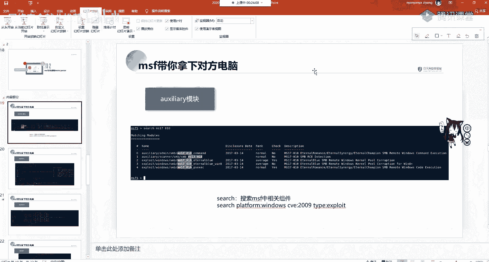

这里就拿这个机器，来进入我们的msf，进入之后，ok我们来search一下我们的ms 127010，可以看到两个辅助模块，一两个攻击模块，那辅助模块是用来干什么。

用来检测我们这个目标机器是否有s m p漏洞，这个永恒之蓝漏洞，那我们的攻击很显然就是攻击，那我们首先来检测检测使用什么，我们就拿这个scanner s m b s m b。

m s17010 进行一个配置的查看，配置查看这里，i put这个目标端口已经给我们指定了，是445，那我们需要指定什么指定目标机器的一个地址，指定线程，或者是如果你有usnp和password的话。

也可以进行一个指定，那我们这里就指定一下目标机器的一个地址，要什么set设置，设置什么，设置apo目标的一个地址设置为是什么，我们设置有这个机器，就这个啊这个xp了，大家就是看一遍这个流程，131啊。

设置好之后，是不是可以run或explode进行一个攻击，可以看到它会告诉你，主机似乎有i m s017020 漏洞，那这个时候他有这个漏洞，我们需要干什么，需要利用利用使用什么。

使用exploit模块，那这个模块我们在刚刚的search里面已经看到了，这个有p p s e s e c power shell命令执行，还有只是简单的永恒之蓝，那我们随便去利用一个，我们来去看。

windows操作系统s m b m s17010 ，我们可以按tab键进行选中，那选择powershell一个执行，那这里我们说operation 4下，可以看到他要我们指定的是什么，它有什么。

有一个叫做model options，叫做这个模块的一个设置。

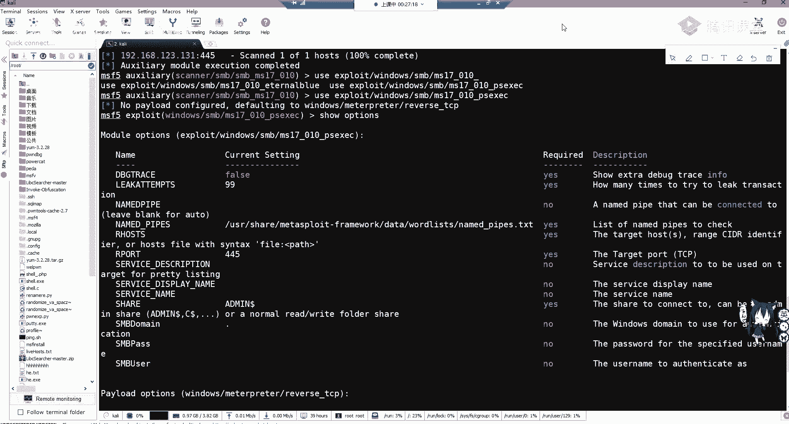

ok那我们继续模块的设置。

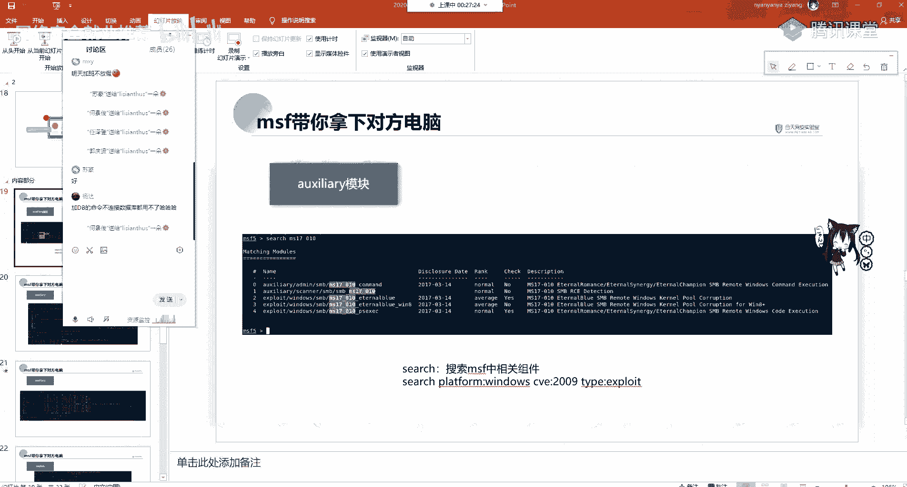

plot的设置，还有目标的一个目标，这里是设置为自动，那我们plot的options是包含了我们air horse，air horse叫local host，也就是指定我们本机的ip地址。

airport 4444，指定我们本机的一个端口，那这里用到了po的windows meditate reserve，tcp，也相当于在我们这个攻击机上面，开启了四四端口。

用来接收我们把机反弹回来的shell，那么打击里面的地址应该如何配置呢，肯定是在model options去配置r ho这个，那我们来配置一下set rho，配置我们这个131的一个地址，配置好之后。

那我们可以进行一个执行，他会帮我们自动打，可以看到131的1312端口，连到了我们的攻击机的四四端口，并且我们的这个命令输入已经来到了matt rate里面，那melebrate是一个后渗透模块。

那我们可以在这里输入问号去查看，metaphor能为我们做些什么，这些命令给大家来看一下，首先核心指令background等等，系统文件指令，文件系统指令也就是查看文件查看法及文件，移动文件，下载文件。

编辑文件，上传文件等等，networking comments，网络的一个命令可以是设置代理，查看ip查看开放的端口，配置路由等等，system commerce系统命令可以清除后台数据。

设置环境变量去查看或者是关闭进程，或者是关机，甚至重启机器，这里都是对靶机进行操作，用户接口命令，这里主要是对我们鼠标键盘进行一个监控，目标机器的实时监控，或者是屏幕的截图。

或者是关闭鼠标或键盘等i o设备，web cam，webcam，也就是我们的摄像头设备，我们可以打开摄像头的麦克风，打开摄像头的流输出，或者是控制摄像头拍照，甚至录一段视频。

那接下来也就是一些权限提升命令，get system和密码数据命令，harsh do，那我们来具体看一下。

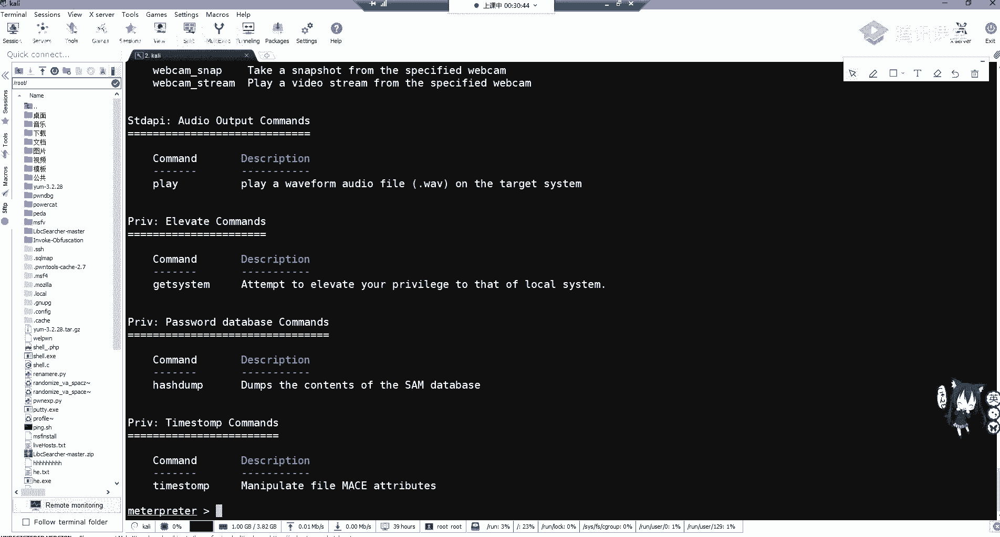

举个例子，ok那我们先过一遍这个ppt，首先我们可以在，m s f5 的里面全程search搜索mc 17010，这个进行相关的组件，然后使用辅助模块进行ms 17010漏洞。

一个扫描是设置我们目标机器，也就是our host的一个地址，设置线程，或者是不设置进行run或exploit进行攻击扫描，探测是否有ms 170206等，如果有的话，我们就可以使用使用什么使使用一个。

当然这里我们在探测的时候，在设置a host的时候可以设置网段，也就对全网段进行一个探测，这里我们设置网段目标为192。168。2，四点杠二四，这里的24是指组网掩码，255。255。255点。

也就是探测192。168。2，4。1~255，这里我们设置要设置线程要稍微高一点，不然的话它扫描非常慢，那我们通常是十至20，如果设置太高，有可能会误报，这时候我们就可以对全网段进行一个扫描。

在扫描之后我们发现拿到这个有漏洞的机器，那我们就可以调用攻击模块进行攻击，那有的同学说ms 17010这么简单，现在还有吗，是有的，大家如果在做渗透的时候，你外面啊，我们公网的机器是肯定没有这个漏洞的。

而且云服务器自带防御，你见过现在还有云服务器有这个漏洞吗，那没有了，即使自己是搭的搭搭建的话，也没有这个漏洞，因为如果有的话，早被别人制穿了，那它主要存在哪里，主要存在我们内网机器里面。

大家对内网机器都觉得有那个流控，都觉得有i d s就不做防护，那我们就可以利用这个模块进行攻击，特别是一些啊公司的机器，不是个人电脑，那些老型机器基本上如果没有修复，都有这个漏洞，那我们在进行探测之后。

需要调用explode进行设置，设置我们的目标机器进行攻击，攻击之后，他会拿到我们的materator，拿到matter create之后。

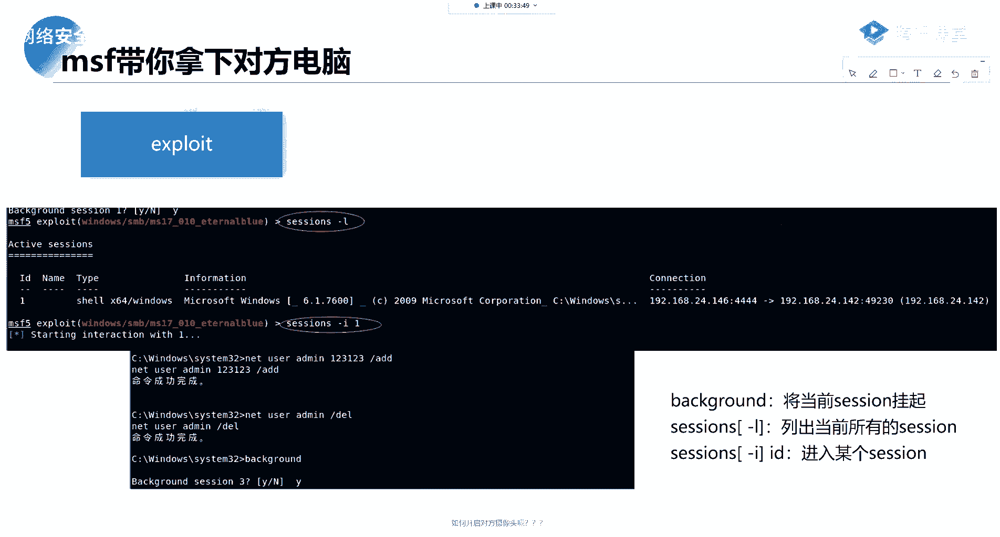

我们可以干什么呢，大家会觉会知道。

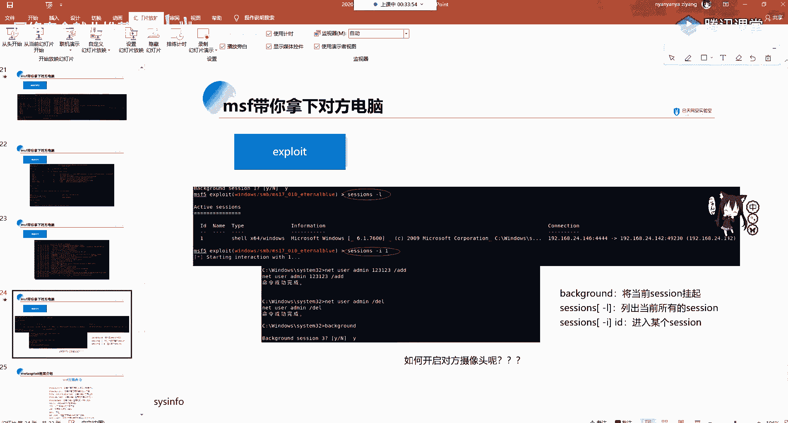

有的时候你拿到的并不是meditate，如果你直接调用永恒之蓝的话，你拿到的是啊，对win 7是有的，windows server 2012，windows server，2008xp都有。

如果你自己从m sdn上面自己去下，是有的这个漏洞你可以自己去看，你搭一个win 7的虚拟机，它里面就有这个漏洞，ok那我们这个。

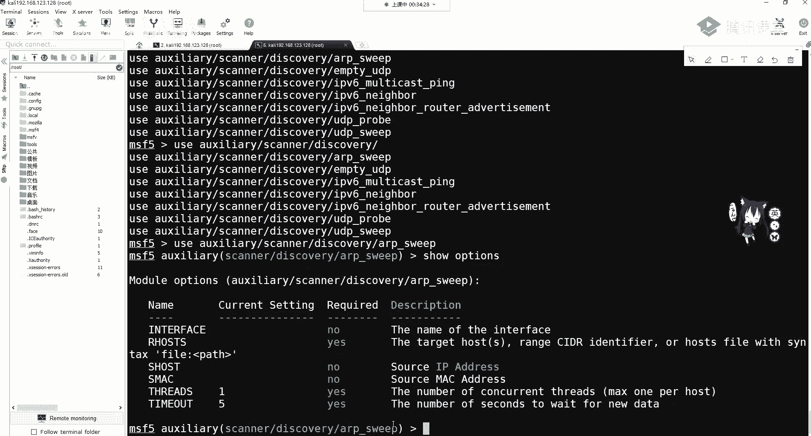

如果我们拿到的不是mad spirit，那我们可以进行什么，可以进行一个转换，把它转换成meta spirit。

那如何转换呢，我们现在啊，现在我还是来到这个已经攻击好这metaphor，我们可以把它切换到后台，也就是background，它会保存看backgrounding session 1。

那session一就保存了我们的这个metaphor，我们可以进行进行转换，如果它不是metadata话，我们可以使用sessions，可以查看我们现在已经活动中的session。

那我们如果想把它转换成moperate your sessions，杠u加上我们的进程，加上我们的sessions i d也就是一进行一个转换，当然我这里已经是materate了。

我们想进入session的话，直接session一进来还是能用metaphor，那这个metaphor我们就可以做很多的事情，比如输入shell可以执行我们的cmd指令。

这时候我们来到了是不是就那个靶机了，我们在d2 看一下，cm 32存放我们库的dl l文件，或者who m i进行指定的一个执行，当然这里因为编码的问题，你看到的肯定是一个乱码，但我们可以去更改标签页。

去改成ut f杠八，这样的话就可以自动显示了，那么这里可以进行退出，它会来到我们的matter creator进行background，返回到我们的msf 5的一个界面。

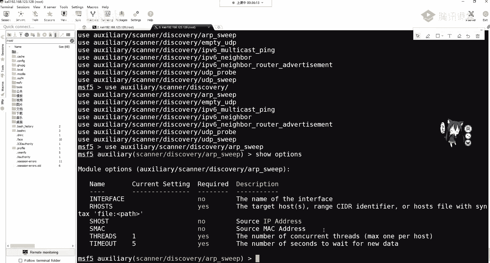

那我们这几个啊攻击的流程就讲到这里，那msf常用的命令呢，这里也给大家在过程中也都讲过了，可以show explose是查看瞬透攻击的程序代码，查看辅助模块，查看我们的模块可用选项和设置。

查看plos可以用的攻击载荷，查看target目标机器还可以进search m17010 ，进行模块的搜索，info显示模块的详细信息和用法，use，将我们的模块名是用我们的某个攻击，渗透攻击模块。

deck可以回退，那我们这里来看一下matt rate的用一个用法。

如果大家拿到的是一个shell或者是一个半成品，一个残废的matt rate可以使用sessions杠u加上sessions id，将这个session转换为完整的metaphor。

当然这个转换有可能会失败。

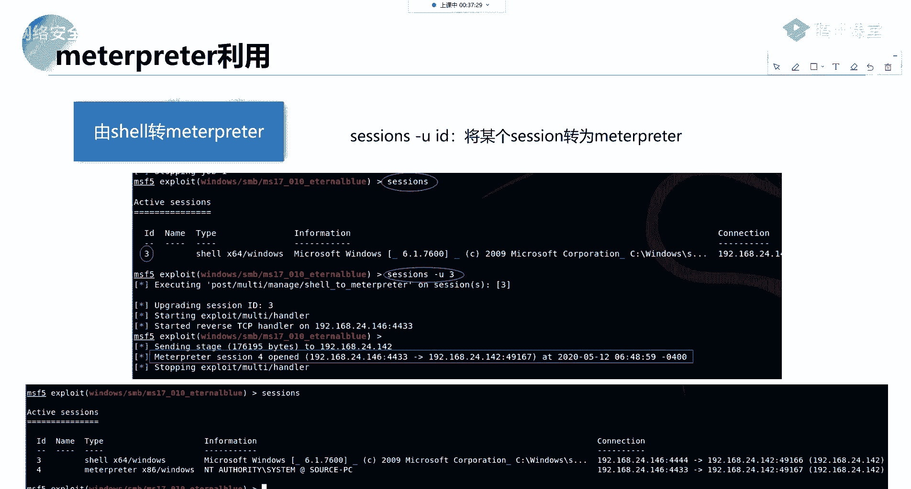

这个我们后面再讲。

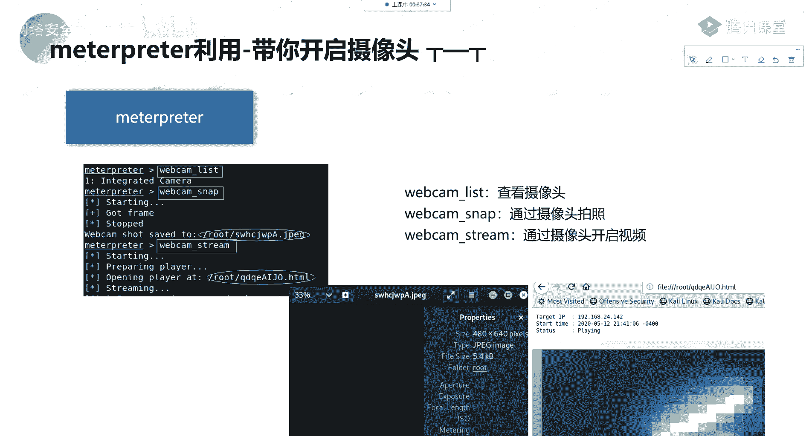

当我们进入matter creator之后，我们输入问号，那这些我们都可以做了。

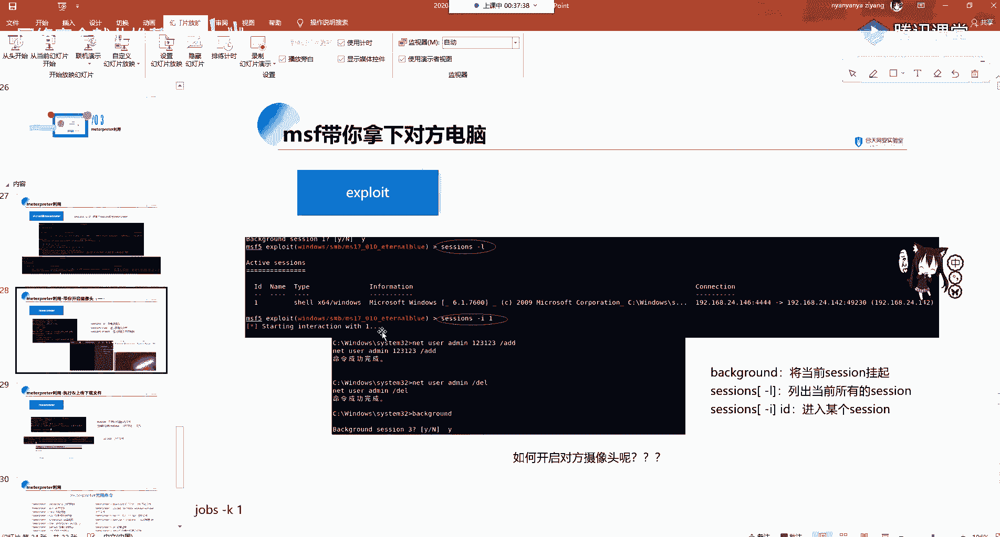

都可以做了啊，那你想想渗透就渗透，不想渗透也可以玩一些有趣的东西，比如说开启一个摄像头，session，四一我们输入问号，刚刚告诉大家摄像头是什么，web cam，那wei come。

这里我们可以进行一个list，就是看摄像头的设备，哎哎不看list，你这里是肯定找不到的，因为我们的虚拟机并没有进行连接，那是你连接的设备在哪呢。

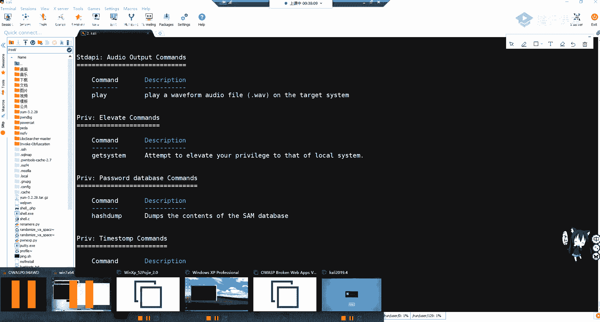

我们可以打开vr mod在下面啊，在这下面看下面这啊，这看不到，往左往上拖一点，ok在下面右下角这一排，大家可以看到哪些io设备进行了连接，首先我们的硬盘cd网络网卡啊，可以连接打印机。

可以连接声卡或者是这个外接设备，那我们可以这里进行一个连接，这是usb设备，我可以把摄像头进行连过来，看一下连摄像头可不可可以在这里添加iu设备，不会这个机器不能连摄像头吧。

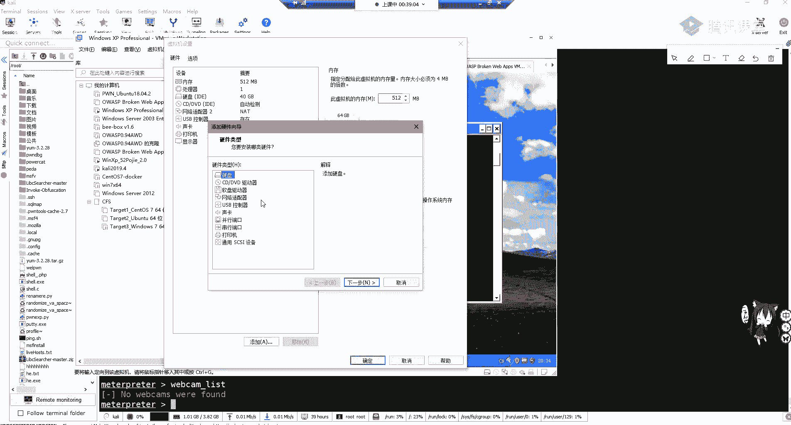

嗯看一下本集的这个能不能，ok这个你看这个有个network，这camera我们可以进行一个连接，就可以连接到这个主机，那我们除了这个连接主机之外，来看一下其他的一些用法，可以对屏幕的进行一个截屏。

quinshot啊截屏，那我们直接运行，他会把那个把机截个屏放在这个里面，放在这个里面，那我们刷新一下，看看在不在啊，是这个啊，可以看到是我们截的那一个八级的屏幕，然后我们可以实时监控它。

就使用我们的流，比如实时监控这个摄像头，就是web castring，如果实时监控我们的一个屏幕的话，screenshare看这是查看用户的这个屏幕实时查看，所以说大家的摄像头并不是安全的。

特别是公司里面具有17010漏洞的，如果它是外接的摄像头，那你可以打进去去调用别人的摄像头，那下面我们来看一下这个系统的一些命令，系统命令首先呢是ted uid。

也就是查看我们当前用户的一个ui d user id，可以看到我们是system用户，也就是啊管理员用户检测uid之后，我们可以ps看一下当前的一个进程。

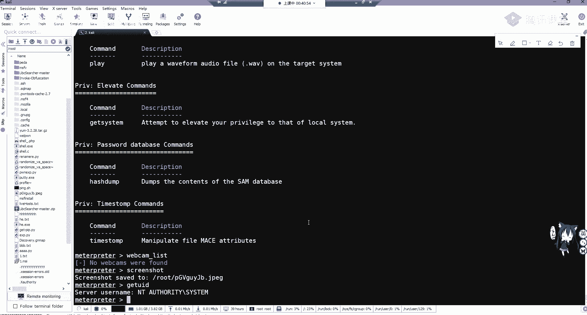

这是打击上面运行的进程，啊可以使用bbcam list查看摄像头拍照，或者是开启一个实时的视频，这视频是通过一个web接口进行开启的，你可以去访问，那就可以实时查看别人的摄像头了。

那么matter create一个重要功能就是打开我们的cmd，cmd可以使用一个系统命令execute，执行执行我们的cm b。e s一或执行shell，直接输入shell命令进行执行啊。

跟这个是同样的原理，在shell命令执行之后，我们就拿到了这个xp系统的c md，这个时候大家可以干什么，可以创建用户，可以啊做一些事情啊，删除文件等等。

在mate create里面有download下载或者是upload，我们可以将文件进行上传到我们目标靶机，分别是upload加我们本地的一个文件，上传到我们的打击的一个目标文件啊。

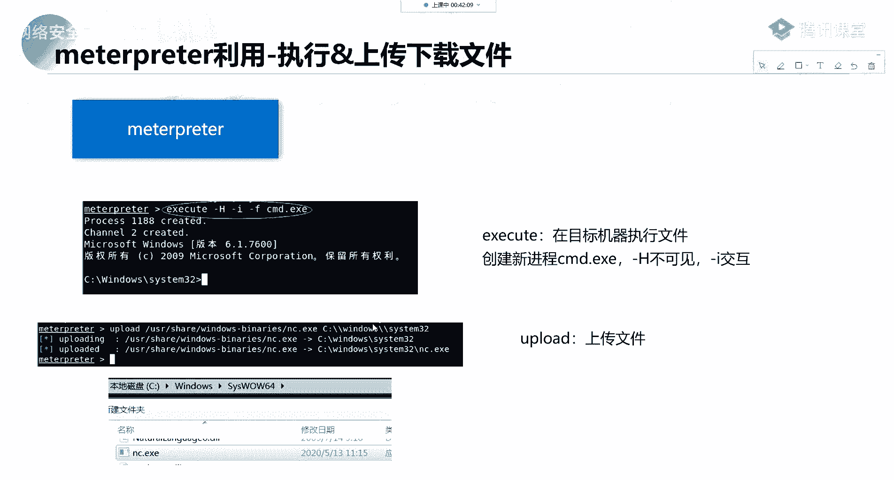

这里就非常简单了。

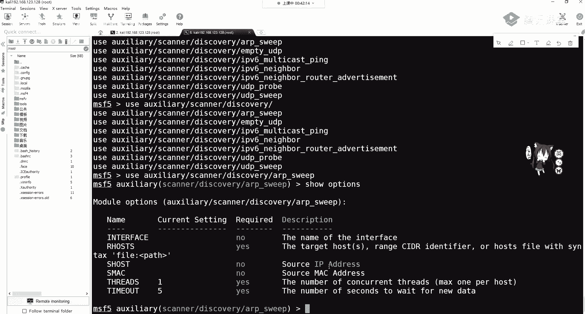

直接使用upload，upload，比如我们上传我们的就当前目录，当前目录什么都没有，就比如说e x p。py到我们目标的c盘，e x p。py好，他会把告诉你传过去了，传过去，我们来进行目标机。

我们来看一下c盘啊，ok这个就在这，哦这个啊抱歉，这个要进行一个转移，不然的话他会认为你这个是一个，因为它会把你的杠e拼成一起，那这里可以看到它把我们的这个hp，上传到我们的c盘的x p之后。

我们进法系来看一下啊，看看到这个就在这里面了，ok这就在里面了。

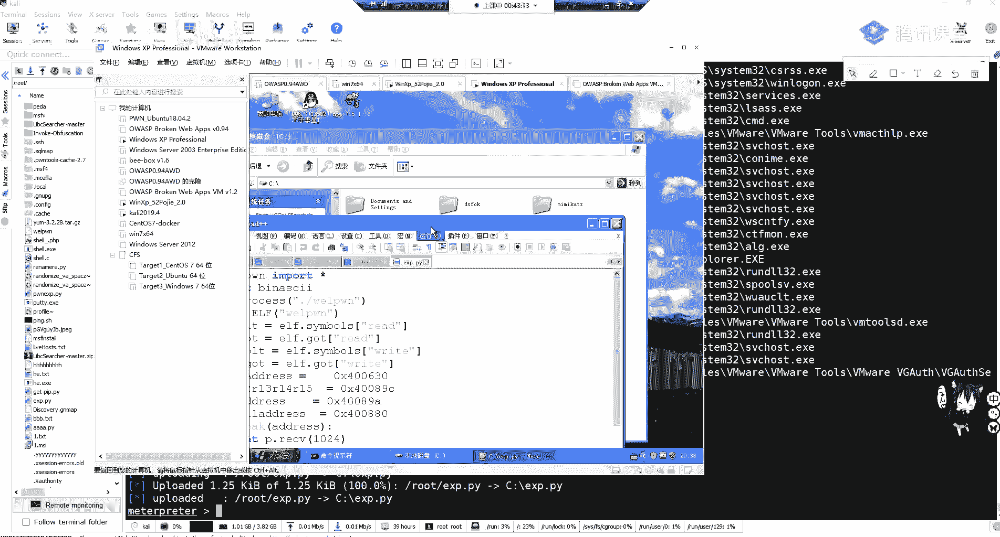

那你就可以上传一些木马或者是一些脚本，一些工具啊进行上传上去。

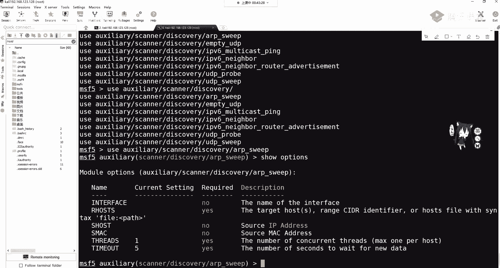

那matter green的常用命令我们再回顾一下，首先background down到后台，yes，关闭会话，help，帮助信息好，大家来看一下system input与系统的平台信息。

这些我都给大家讲过了，查看进程，还有关闭，查看当前的用户权限，那我们最常用的一些大家在做渗透的时候，最常用的肯定是background的，放后台，还有查看一个系统的信息，shell获取我们的c md。

还有ps查看进程upload进行一个文件的上传，get uid查看当前的用户权限，当然也可以进行一个端口转发和用户的创建，这里大家可以看到一个特殊的是，我们最想要的关闭杀毒软件ruki v。

这是装关闭插图软件，大家觉得会有用吗，这一条命令，其实现在的这些杀毒软件你都无法关闭，即使是windows defender，用这个run k v i v也不会关闭，可以说它基本没有什么用。

那我们meditate就讲到这里，大家有想看这个关于更多的metaphor的一个实验，可以去客厅网安实验室自己去搜索，matter spring matt lt控渗透入门，它是由这些实验，这个就不作。

我不作为我们的作业，因为我们后面可能还会讲渗透测试，就是一个信息收集，还有生长突破点后渗透一些内容，整个的流程我们都会再讲。

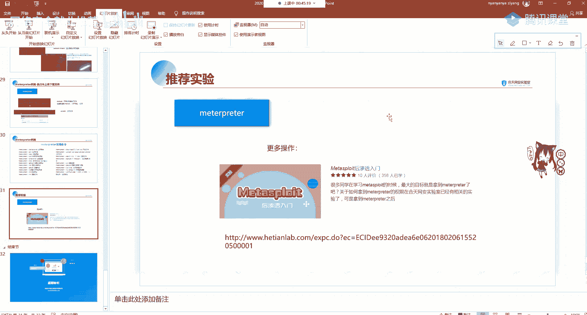

那msf的一个还有什么方法能拿到matt rt，那它的方法很多，我们可以寻找web的一些接口或其他服务的漏洞，一些c v一漏洞，比如说他比如说他们看的漏洞。

还有嗯这些weblogic这些漏洞进行一个攻击，或者是web之前在上映章中讲的那些web漏洞，都可以帮助我们拿到metaphor，那这里就是我们卡里的matt spirit。

that metal spirit，一个攻击流程，大家觉得如果是做过的，会发现非常的基础和简单，但是这个流程还是要熟悉，如果你觉得我们这两节课就能学会meta split，那是不可能的。

因为它里面的东西实在太多了，其实你是专门研究，也不可能学得非常透彻，这个只是对一个已知漏洞进行一个攻击，但是它里面还有其他很多东西，包括脚本字典都可以拿来去用，如果使用对，如果使用我们刚刚的这个。

如果你是使用这个，如果你是使用这个的话，你会发现他拿到的是一个c m d，c m d之后你拿了cmd怎么办，你可以background啊，可以background的一下background。

然后进行一个session杠u加session id，进行一个meta spirit的一个转换，它会发很多的包进行一个转换，这id是进行一个转换，那大家就是在听课之后一定要去操作。

可以自己去下载文献的镜像，进行一个攻击，或者是不如果不想下载，就是觉得这确实是没有什么，就是一个流程，那可以到和天网安实验室，大家都有会员，免费的自己大家自己去做一下就行，熟悉这个流程，自己做一遍。

那基本没什么问题，基本都没什么问题，我在看还有大家那个作业的时候，有的同学就是把信息收集总结成了博客，这个非常好，大家要养成一个总结的一个习惯，包括在学习其他内容，如果不去总结文档。

比如说做c t f也好，不去总结文档，你会发现很快就忘记了，有可能你清楚的记得，我这个mama拿到之后可以做什么后衬透，怎么做代理，但是也有可能啊，有段时间不做，后面就忘了，这时候就需要操作。

或者是你不想操作，去翻一下自己的文档即可。

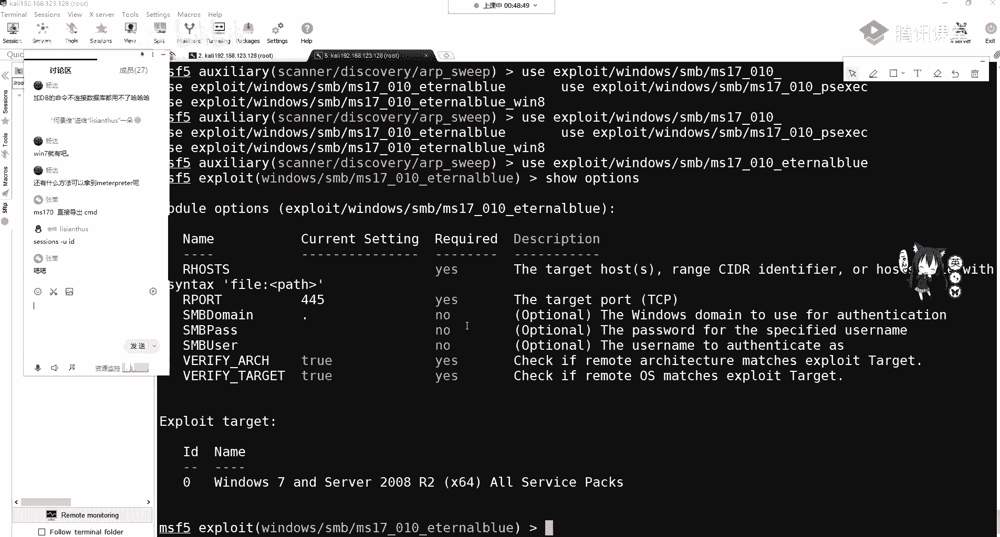

那这里大家对这个流程还有什么疑问吗。

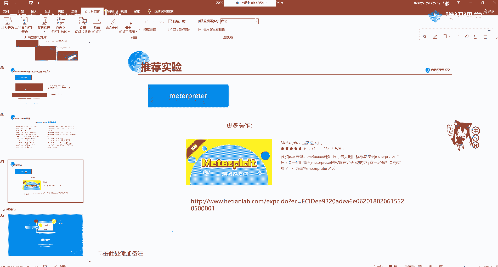

呃疑问的话，现在可以提出来。

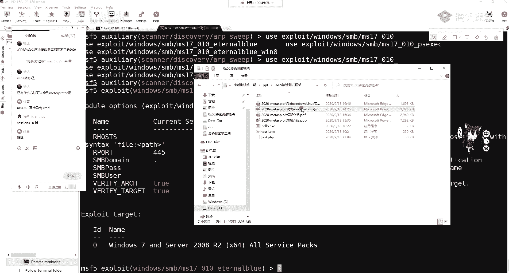

那没有什么问题的话，那我们先休息五分钟，大家可以去嗯休息一下嗯，那个我们50的时候开始下一节课，也就是meta split攻击windows和linux的实例，大家如果觉得哪里有问题的话。

可以在周末也行嗯平时也行，去在群里问或者是私聊问，我哪知道我在群里就是这个id，那我们这一节课先下课啊，先到这里，ok大家应该还都在吧，我这个切换到下一堂课了，因为这中间是两个课时，要做一个切换。

大家应该还都能看到屏幕吧，嗯那行。

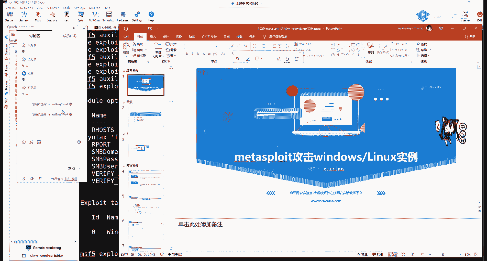