# P51：第15天：Metasploit攻击Windows_Linux实战 - 网络安全就业推荐 - BV1Zu411s79i

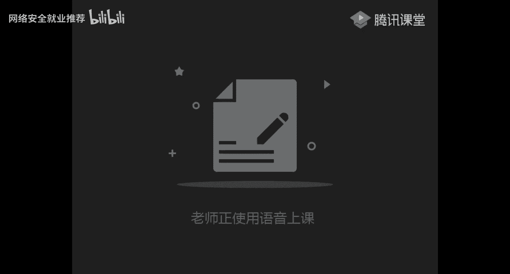

ok大家应该还都在吧，我这个切换到下一堂课了，因为这中间是两个课时，要做一个切换，大家应该还都能看到屏幕吧，嗯那行，那我们无时开始讲下一节，可以啊，这个麦克风应该还行吧，大家应该能听清楚吧，上节课。

嗯我是换了新的设备，应该比之前要好一点，那这里我们就继续讲，也就是meta split的windows和linux的实例，这里我讲的都是一个整个的流程啊，不可能是利用两节课，或者是利用一个月。

把这个mi spit给大家完整的讲一遍，这个是不现实的，因为它的东西实在太多，只是个流程，大家要清楚大同小异，我们不是做安全研究，不需要去深究这些漏洞，当然研究一下还是非常有意思的。

如果大家想有有兴趣的话，可以去网上搜索一下ms 08067，它如何调试它这个漏洞是如何形成的啊，这也有书籍，他领带流动，它会讲这个东西也是非常有趣的，好，我们继续来看攻击windows或者link。

操作系统的一个实例，maslate是支持全平台的，它不只能攻击这两个练习操作系统，也可以攻击我们mips架构的路由器，公共设备，安卓手机或者是一些mac os，这些类功率和操作系统都可以进行攻击。

对它十分的强大，首先我们要看一下m s f v noon，也就是嗯嗯毒病毒毒液的意思，它生成了一个后门，是ms pload和m m sf input的组合，这两个工具集成在一个框架式的一种。

那他们两个大家应该还记得是什么吧，一个是攻击载荷，一个是编码，编码和加密，也就是一个负责攻击，一个负责绕过杀毒软件或者是ibs，这两个工具集成在一个框架中，清除了ms windo。

也就是用来生成后面的软件，在目标机器上执行后门，在本地监听上线，可以理解为一个远控木马，ok它就是一个生成木马的软件，我们只需要来利用的思路，大家要清楚是什么，找到漏洞，漏洞点。

用mv noon生成木马，将木马想办法搞到，把它上传到我们的靶机上面，让他下载也好，你主动上传也好，上传到靶机上面，在靶机上面运行，在运行之前我们需要有攻击机去接收它，那它运行我们就可以控制它了。

也就拿到了我的matter pra，那这里我们首先来看一下，要如何生成我们的后门，它的基本参数，我自己在学习的时候是非常不喜欢看这个杠，help制定的，因为他把这些参参数丢给我，我也记不住。

记不住怎么办，没必要记，也没必要去看，你只需要多用两次，知道这些常用的，你知道常用的，你不知道什么意思，也没有问题，就多用，就是多做说的再多都是要经过实战，如果就是一直去到岗位上实战。

那你速这个能力是得到飞速的提升，那这里的参数还是给大家稍微的过一遍带一遍，首先杠p那m s windows是plode和encode的一个组合，那么它最重要的不就是encode和pload吗。

那我只看他们两个gt pload的指定pload，攻击载荷支持全平台啊，这不是几乎了就支持全平台，那l这个是几乎所有的这个命令都有的参数，list列，我们的encoder在哪。

杠一input的指定编码加密方式啊，我们常用的我们对不同的平台，它有不同的操作系统，有不同的系统架构，那么需要指定系统架构杠什么是系统架构，x86 系统架构，mips im是吧。

im你的安卓手机im架构，苹果要新发布的macbook pro im架构，那我们通常用的windows操作系统x86 架构，你用的乌班图用的卡利x86 架构，mips华三的设备啊，有的是用mips架构。

但有的是x86 啊，platform，很显然指定目标的操作平台也是nt操作系统，windows nt还是linux操作系统还是mac os，这都非常简单，那我们接下来就都不看了啊，都不看了。

大家还要有一个注意的，就是杠i设置编码的次数，编码次数越多越多，那他就是对这个po的进行了几次编码，如果你不编码，就是个木马文件，别人一看杀毒软件一下子就给杀掉了，你编码的次数越多。

他刷的软件越看不出来吗，并不是杀毒软件，它是根据一个特征码进行识别的，大家要知道每个文件都有md 5码，它病毒肯定有一个关键的算法，它有一个特征码，它是根据这个东西给杀掉的，你编码次数多不代表就是绕过。

理论上是绕过杀软的可能性更高，但实际并非如此，你们现在杀软也非常牛逼，比如火绒，他就挺好的是吧，挺好的，但是他不是所有的东西都能懒的，那我们就看这些参数，其他都不看了，用不到不知道自己去搜啊，自己去搜。

你说能记住是谁也记不住，那这里就举三个例子，分别是linux windows和mac os平台的po的，ms windows这个命令杠p指定我们的一个plo，pyl的指定指定什么linux啊。

linux x86 x86 架构，我们要干什么，要拿到matter creator，使用reverse tcp啊，反向tcp也就是反弹shell，反弹shell注意地方还指定其他两个参数。

那么反弹shell刚刚在做m s17010 的时候，我们使用的是什么，是windows meditate reserve tcp，我们需要指定什么，指定local host和local hot。

也就是我们目标要在哪一个目标机器上，开启监听呢，肯定是我们攻击机啊，也就是local啊，本地目标本地地址，那下面的logo pod，我们需要在哪一个端口上开启服务，开启监听呃，开启监听杠f fire啊。

你指定你输出的什么类型，e f f e f f是什么，ef是linux操作系统的可执行文件，包含了可重开重定向文件，动态链接库文件和普通可执行ef文件。

相当于我们windows操作系统的d l y l和ex 1，这两个在windows操作系统上，我们统称它为p文件，而linux操作系统操作称为e和f文件，称ef文件啊，这里没有问题吧。

使用大于号重静音重定向符，定向到我们的shell。ef这个文件，那么shield e f，其实就是linux操作系统的一个可执行文件，一个码在下面，linux第二个也非常简单的，就是不一样的。

就是半的dcp是主动连接正向正向shell，正向shell，ok这个我就不多讲了，那下面windows操作很简单啊，把linux改成windows就行了呀，一样的是mac，那很简单啊，改成mac os。

mac os是什么os x呀，如果你有macbook的话，肯定知道呀，就这样，ok它使用如果不是metaphor，是使用shell reverse gcp，你这里不记不住，search一下啊。

list一下或者是table一下都会出来，再不知道去百度看一下，它肯定都存在，那这里，攻击手机无线网络电脑这些不在公网的东西，那我们需要先找公网的东西啊，你不可能直接打到内网吧，就像我现在讲课。

你用你的电脑能打到我吗，不能打到我吧，我是内网ip，我的ip是内网的，你打不过我的，你打造过，你要穿透呀，你要找我们公司的公网，找到公司公网的漏洞，一层层能打进来，进行代理，进行逐步代理，进行内网穿透。

最终打到我，那这个过程是非常复杂的，但是我们渗透测试要做的就是这个事情，就是一个内网的渗透，在第一节课或者是开课的胖白老师，也有可能跟你跟你讲过那个web和渗透的区别，就是我们渗透需要做内网渗透啊。

就是这个区别，你加i加多少次都会被秒杀，这是嗯，不然那i d s那么贵，嗯买了都扛不住，那还卖什么，肯定都不买，还花那么多钱去买哈迪斯，教我什么用都没有是吧，那现在的棉纱你这样做，他的做i d的。

他就会把这些生成出来，是执行那个去确定它的一个特征码，进行一个查查，那这里我们简单举个例子，使用杠p指定我们的windows好，windows metaphor result cp指定logo。

holocal pop到x x是指定模板，现在我们想生成个木马，你这个木马什么功能都没有是吧，你的图标都没有，别人一看，你放在邮箱上面，别人敢下载吗，肯定不敢查的呀。

那我们可以杠x把一个把一个英正常用的，比如说系统更新，比如说p p study，你作为一个伪装啊，作为一个伪装，作为一个模板，也就是他一看，即使它伪装正常功能已经已经错掉了。

但是它的大小还有图标是一样的，那就可以进行一个呃设攻，对方相当于杠一杠已经说过了，编码x86 啊，这里编码我就不多讲了，我就不多讲了，因为它真的没有什么用，就像刚刚有同学说你刚i多少次都没有什么用。

当然你可以进行一个多次编码，或是一个循环或是编码之后，再利用其他的进行加壳呀，或者一些进行一个综合利用，还是有一定用处的，但这里我就不多讲了，因为它变化速度非常慢，我们这里虚拟机都是没有i d s的。

ok那我们这里简单进行一个生成一下。

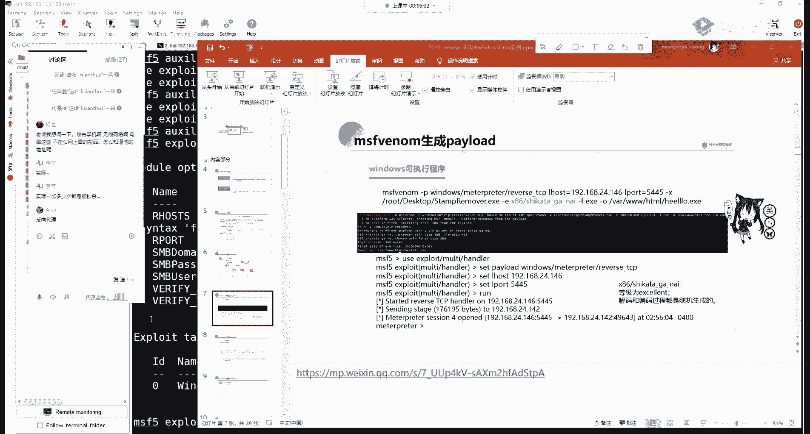

现在生成一下，msf v，好杠p指定有什么windows，result tcp指定什么，只供我们的local host，等于我们本地的地址，local part，这里等于我们就比如说五五啊。

你不要设八零什么的，有可能会冲突啊，有可能会冲突，然后进行一个什么，我们不编码编码，大家可以自己去查看，includes，我可以说除了那两个特别有用的，其他的基本现在嗯用处不是太大，除非综合编码。

你有可能用到用到的时候再去看，你不可能把那些编码都记住吧，我记不住，ok那我们记不住了就不看，那杠f输出输出什么，这里我们输出1s1 e x，你就直接写e s，重庆项有hello，点1s1 。

再叫它这个生存着吧，生存着生存着呢，这里我们要干什么，要开启监听，那今天听如何开启，这里给大家讲一个叫做，exploit里面的multi里面一个叫ha，它会等待我们就是一个监听，我们要使用这个模块。

使用这个模块去指定一个plo，那这里我们不指定它，其实就是一个等待的一个握手状态，那我们需要指定它的一个plot，那set的pload，我们这边的pload要和什么。

要和我们这个木马生成的这个po的是一样的啊，它已经生成好了，那这里肯定有一个hello。1s一啊，肯定是跟这个是一样的，那我们直接把它复制过来，知道吧，要开启监听，复制过来之后。

我们来看一下需要指定什么指定logo，hologo pot指定，为什么肯定跟我们ms windows这个是一样的，是一样的，那我们来set一下设置是什么，local host 192。168。123。

128logo，local po local part设置的是吗，是5555 五啊，我可以run一下，或者是e x p exploit exploit杠j放在后台，就是你不会在那一直等着。

你可以去操作其他东西，放在后台，他会告诉你sad reverse tcp handle有个tcp的监听，建立在五五端口，那这个监听他这个工作他是不工作，它放在哪，放在后台工作，jobs。

我们看后台输入jobs，可以看到它是一个等待连接的反向tcp端口，正在监听，那我们这时候把这个e s e。

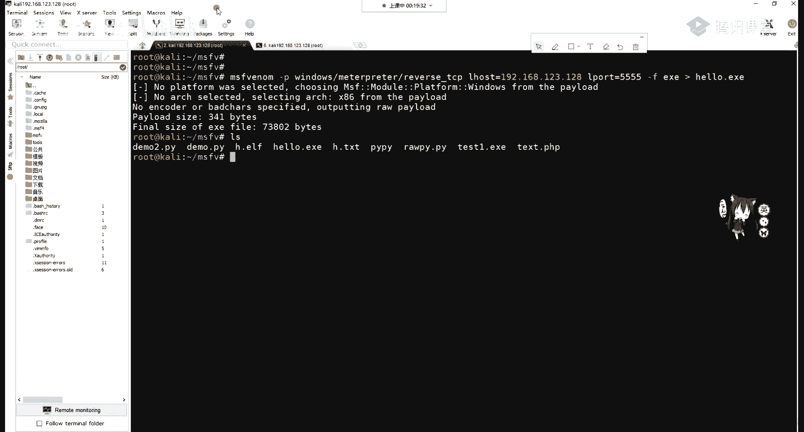

放在我们把机里面进行运行啊，放在我们把机里面进行运行，然后把它拖到靶机里面吧，我这里一会儿再给大家大家讲怎么如何攻击啊，把它给拖到八级里面进行个运行，hello，点e s1 ，我先脱下来啊。

这里我们已经拖好了，已经生成好了，我还拖到靶机里面，嗯这个8g可能有一点卡，是没拖进来呀，ok他过来了，我们双击它，啊他是64位的，是64位的呀，我搞错了，这里应该是x86 x86 架构。

你还是x86 的。

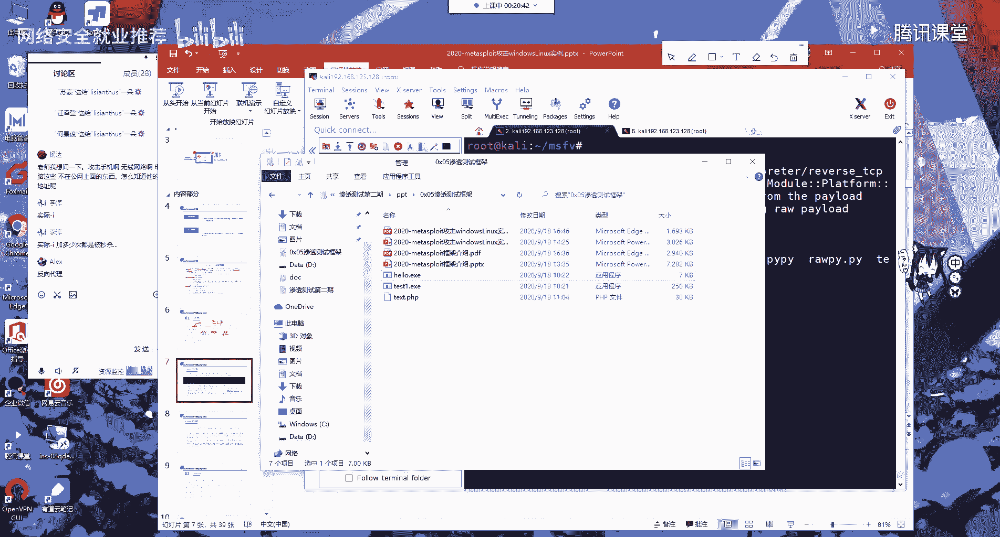

让我们看一下是哪一个，我可以搞搞混，那test 1，那我们生产的这个运行应该是他在搞测，ok那我们重新生成一个吧，重新生成一个，指定我们的x86 ，啊这里持续的开启监听啊，啊它是没有的。

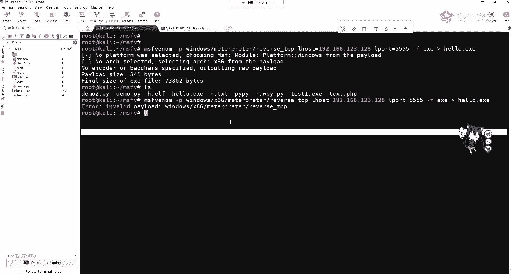

没有的呢，我们利用这个进行一个查看，可以使用杠l plots列出所有的plots，然后gr e p是加ip是什么，是我们的啊，一个正则查找，查找我们想需要的内容，然后使用awake这个字符的一个寻找。

print到了一可以搜索我们想需要的plot，那直接把它给复制过来。

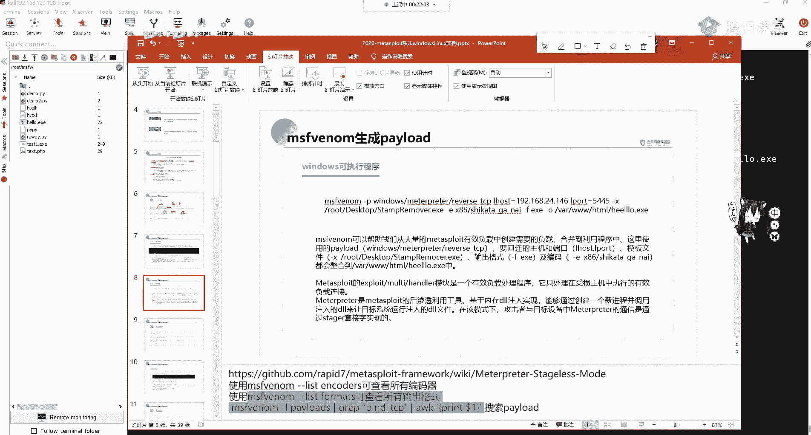

搜索我们的windows plot，ok这个因为它这个冒号都是有问题的，我们只需要把这个办的tcp给改一下，改成我们的windows，这个时候我们就能看到他，windows应该有哪些hp可以供我们用啊。

供我们用，这里有windows metaphor resolve，http reserve，这个这些大家可以看一下啊，这是给大家过六成，那我们要用这个机子，有这个机子上啊，用这个解决上，ok。

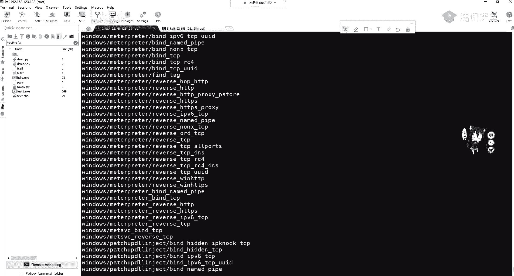

啊稍等一下，那我们先往下讲，先往下讲，那他做的这个是生成木马，我们就是要想办法，那这里刚好马上给大家后面讲，那个真正攻击的时候，刚好给大家补上，这个可能这个编码有问题，这个嗯给上传到我们的靶机。

上传到靶机之后，攻击机开启监听，开启监听，也就是等待我们的shell弹回来，这里设置的内容，po l pl port一定要和mv neon这参数是一样的，然后进去run进行等待连接，我们要上传到打击。

然后进行运行，上传到我们target，然后进行运行啊，这里大家应该都没有问题，相信，啊这里我们来解释一下这个就是m s v neon，可以帮我们从大量的这个有效载荷，也就是plod里面进行合并。

我们需要指定payload和鬼连主机的端口，主机名和端口文件模板文件，当然我们文文件可以不设置输出格式及编码，那我们最需要的是哪一个，一个输出格式，一个配置，还有plot的，这些是必须的。

那我们一开始use的这个explode，mi ha是一个负载处理程序，也就是等待负载链接，我们最后拿到的metaphor是matt matter split的，后渗透的一个工具，可以通过创建一个新进程。

并调用注入的dfl动态文件，动态装载库来让系统运行，注入的第二个文件，也就是运行我们刚刚的get ud ui d，或者是打开摄像头等等，啊这里可以生成web plot。

webplot及我们木马只要去运行它即可，也就是web share可以生成ph p s p jsp，还有mb应用，那这里分别使用pvp meditate reverse tcp。

还有我们的xp就是直接使用windows的一个matter create，那这里大家可以看到，我们p h p使用ri w进行输出，而asp使用sp x进行输出，这是为什么，i w的意思叫做未经处理。

大家如果使用相机进行拍照，拍摄拍出来的未经处理，保存明暗信息的就是r a w，它是独层化的，那菲律宾这里很显然就是生成菲律宾代码，那有没有p a p这个模板，这个输出模板没有的啊。

我们要以这个rw未经处理的模式进行输出，那这里我们可以生成一个shell点菲律宾。

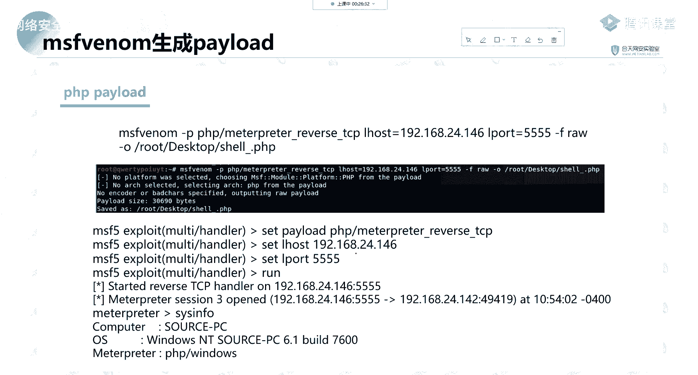

然后进行回点啊，这里给大家简单就做一下这个吧。

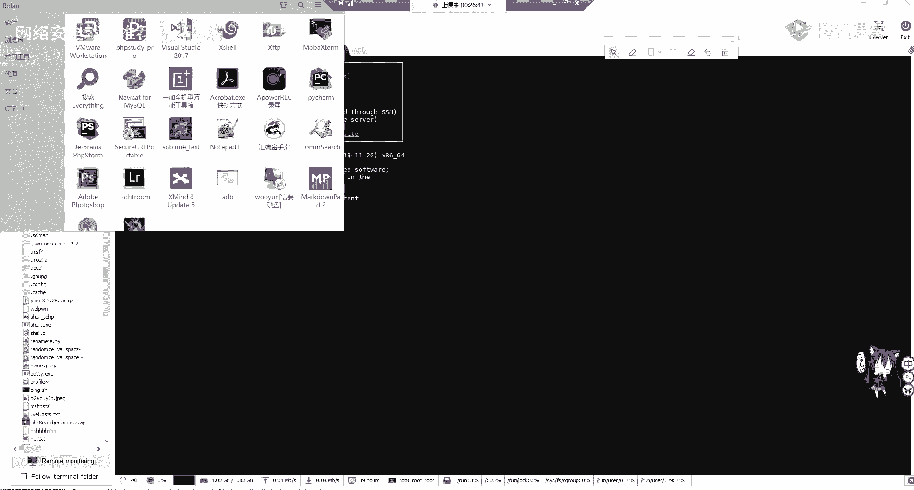

啊这这。

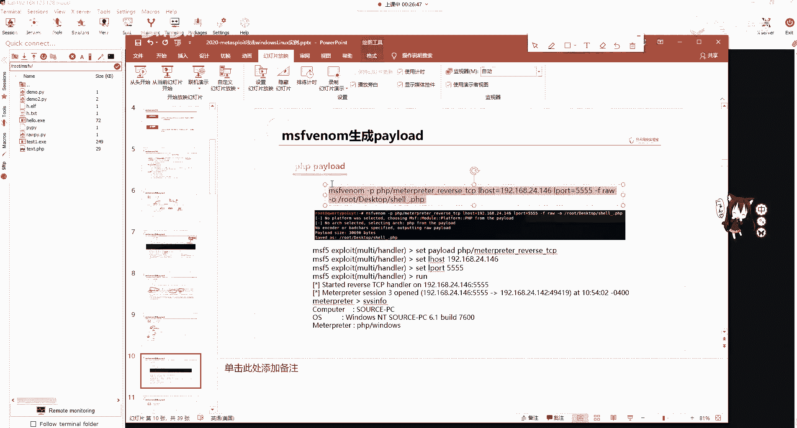

这个直接复制过来。

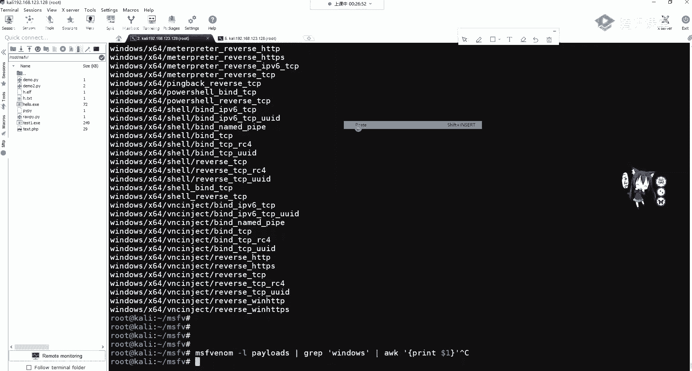

不能让它运行，因为我们这个是不对的，12855p h p生成的一个木马文件，就在就在这个地方生成吧，就a。p h p，然后我们将a。pp上传到靶机的htr，3w目录下进行运行。

它就可以拿到我们的shell，就可以拿到我们的metaph，嗯这里我们还是做一下吧，这个i d p app已经生成好了，我们把它先移到本地，a。ph，那你可以可以查看一下他。

ok他其实就是调整一个啊socks，socket进行一个连接，那我们这只是给大家讲上传到这个地方，然后我们进行一个访问，也就在本地访问，啊这个变得特别卡呀，二七点点0。1a。p h p进行访问之前。

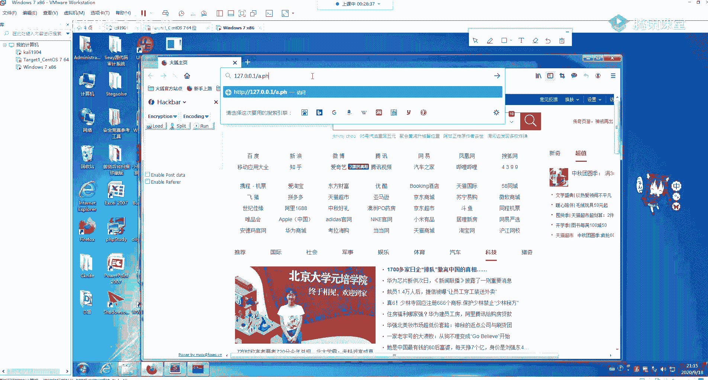

我们这边要干什么，这边要先一个啊，监听在线监听，这里我们还是使用这个moot handle，只是我们的pyload而发生了变化，我们使用我们的这个set plot，你粘贴过来。

然后我们show options，我的配置，我们的airpost，还有airport，这里是5555，没问题的，然后我们run一下，他会告诉你你已经使用了这个五五端口，那是哪个使用的呢。

肯定是我们刚刚那个搞的鬼啊，我们把它jobs杠k q q什么q0 ，把这个给停掉，ok这时候都没了都没了，那我们把这个run起来，ok现在他在监听五五端口，那么在这边啊。

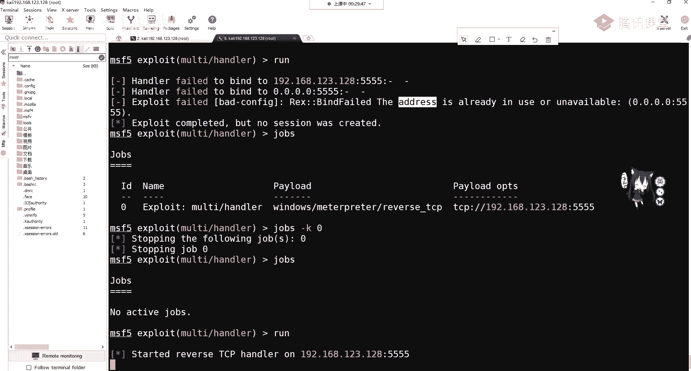

运行一下这个i点，菲律宾我们看这边一会儿稍等一下，因为他在打开这个袋子，what，ph 3的关掉了吗，没有关呀，天，嗯等一下我把这个服务给启动一下，这个容易被查杀呀，这并不并不比小马，小马也容易被查杀。

这些都容易被查杀，查杀查杀的，那我们来运行一下，还不行啊，这怎么总是加这个东西。

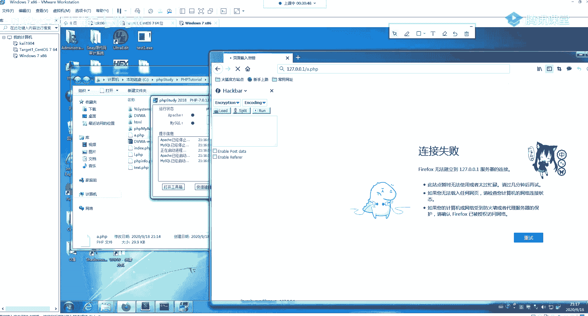

o哎看到这边还在转，但是我们这边是不是收到了session，来到了这个metaphor里面，ok来到metaphor里面，是不是来到这里面了，可以看一下。

admistreet被background把它放回去啊，session一已经是一个p a b和metaphor，已经拿到了。

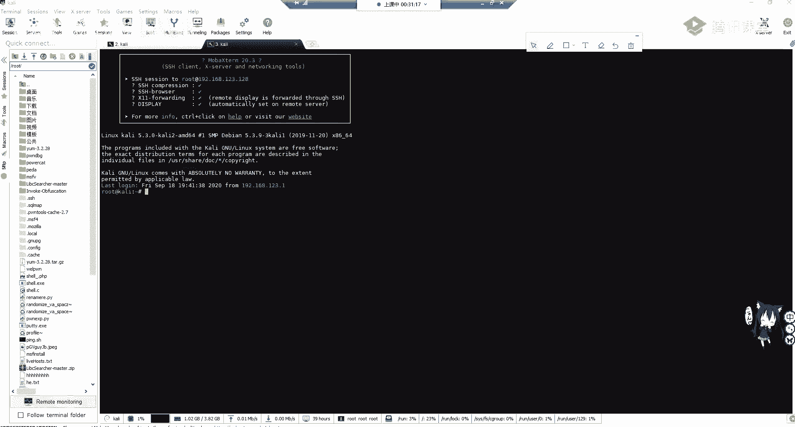

那这个就是作为一个攻击思路，你可以在那个靶机上面上传啊，利用文件上传，或者是啊文件写入，你去我文件包含进行把它执行，那我们就可以接收到这个metap，就可以接收到这个metaph。

这个大家应该都没问题吧，这个就是常用的思路，如reverse http就是在八零端口呀，有没有tcp是你自己开的一个端口呀，如果就是你的那个服务器，就是怕被查杀的话，你可以使用reverse htp。

它就是端口不同啊，一个是http协议，他八零端口，一个tcp，你自己指定tcp端口，可以指定五五，ok这些马上都会讲，呃这里拿到了我们的webpd，那同样可以使用脚本pad的python。

dash和p e r这个一些脚本的一些这些很简单，就是修改po的即可，修改成passing meditate universe tcp，然后还是指定我们的local host。

local po nh是c m d啊，这里you will space，这里刚f大家都知道是生成rw rw，如果你生成passing的话，你可以自己去看，生成passing的话。

它生成的是shell code，其实它并不是一个脚本，要记住这是r a w，大家可以自己去试，然后如果我们去设置这一个生成msf规律之后，我们在攻击机上开启监听，开启监听，set the plot。

plot是什么，set plot的时候是他set local house是他sec llocal port，是他一定要完全一样，然后我们进行run run之后，将它生成的这个python shell啊。

party share，我们可以复制到我们的靶机上面进行运行，就可以拿到我们python meditor啊，这是同样道理，那大家再去查找，包括刚刚那个同学说的这些有什么区别啊。

这些palloon有什么区别，在这里啊。

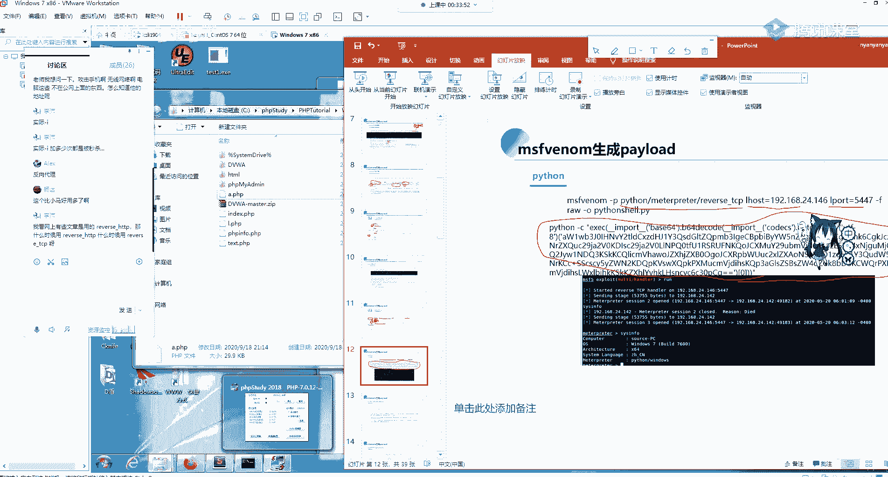

给大家讲东西，我们刚刚在设置的时候，这里大家应该都有哦这个问题啊，比如看到这个windows x64 moperate reserve tcp，大家要记住这个。

再看上面windows x654 metaphor real tcp，它跟下面有什么区别，是不是就少了中间一个杠，那这个杠是什么意思呢，就杠你觉得他们俩的英语是完全一样的。

其实他在msf里面是不一样的东西。

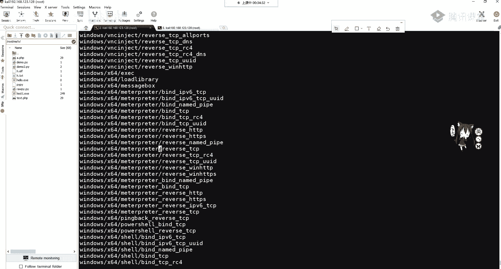

一个叫做分段pload，一个叫做不分段po的，那我们来看一下它们分别是什么，这也是给大家就是做渗透的时候一个呃讲解，因为这个如果你用错的话，你会发现你接出来的mad brate他经常断掉。

就是你正在配置路由，突然断掉了，那就很难受是吧，很难受，那就给大家讲一下，就合理的使用这个st stages和stage这个plot，那拍照的分为两种，一个叫做分段拍照，也就刚刚看到杠比较多。

一个叫部分呢，排到的连起来的才很好理解，那连起来的也就是windows metaphor，没有杠research tcp，它其实就是一个二进制文件，它包含了meter creator。

所有必需的部分和必要的扩展，全部都捆绑在一起，也就是一个完整的plot，而分段的呢它只是它的功能，只是建立一条与攻击攻击者之间的网络链接，其他的什么事情都没有。

然后我们获取到的metaphor是另外一个阶段，也就是它会传reserve，tcp 8 tcp等等，那如果你不能理解的话，那不不分段的和分段的，那就相当于不分段的，大码是什么。

你不用web shell管理工具，你一连上里面可以查看目录，可以执行问命令，可以上传文件，甚至可以提前等等，功能很强大，但它体积庞大，那不分段的呢就是小马小马是什么，一个ever，一个system。

一个assert，就一句话，这句话你连上之后有什么用吗，没有什么用，你是不是要给它传参数啊，是不是需要web shell工具使用，一键是冰协去连呀，就这个就这个区连。

那很显然它是它它这个嗯这个你看一下吧，这个分段和不分段，那很显然有什么区别，pg pg就拿p a p大马来说，他用人干什么是非常的大，我们上传文件也一般会做什么限制，是做一个大小的限制。

如果这是一般的文件上传都会先做限制的吧，如果你不做限制，你服务器只有20gb的硬盘，我一个人上传40gb的上去了，他也不是木马，那你这个就相当于ddos攻击了是吧，那他肯定要做一个限制。

那做限制呢大码就没用了，按照小马就派上用场了，但小马要用用用用，有一个缺点，你小马要干什么，你要用web shell管理工具，web share的一个原理，就是像传入，就是像ever函数。

像sexm函数传入参数，那你这个网络是不停的在连接，那你中间如果网络断了怎么办，所以就断掉了就不稳定，这是小马的一个缺点，那大马却大码的优点啊，你什么都有，一切东西都是在服务端进行运行。

你给你跟你的公积金没有关系，你这个网络不稳定的时候，你就考虑到了啊，这个也是一样的，网络不稳定就考虑不分段的网络稳定，分段的好小，而且不易被查杀，大码肯定很容易被查杀，ok那这里大家应该都没问题吧。

那这里这一些参数给大家，其他参数可以给大家简单讲一下，一个是保持着一个监听端口的存活，还有一个是防止进程被杀死，这些都不用记不用记，还有一个是放到后台的一个嗯session，这个ppt会发给大家。

到时候大家可以试一下，那我这里就讲一个例子，就是攻击windows这个实例，让大家看一下target attack的ip，我这里都写好了，那这里我们来看一下方法，方法一我们的突破口。

在上一章中讲的突破口，基本上都是web或中间件的突破口，也就是说我们可以通过web站点，web站点可以干什么，可以通过命令执行漏洞，无文件的方式进行攻击，或者是使用上传点进行上传。

web share进行攻击，上传web shell，这是上传什么，正传，是不是刚刚我们那个m v windows这个生成的这个码，第三可以攻击其他的端口。

4451m s1700 拿到mate parate，总的来说就这三三种，那我们首先看方法一，在发卡机之前，我们需要看什么，需要对端口进行收集，我们需要知道它哪开了哪些服务，哪些端口开了八零端口。

那这m p我就不跑了，s就跑时间很长，杠s v大家还记得吗，探测版本gt 4，第四速度探测，加上了目标地址或网段进行探测，探测之后，我们可以看到开到八零端口，开了445端口，开了3306买是不算口。

并且操作系统是windows操作系统，那这时候我们可以进行渗透，现在我们首先输出的突破口是哪里，八零为什么，因为八零端口是漏洞最多的端口，o w s p top 10都是八零端口漏洞，对啊。

都是外国漏洞，sql注入x44 s s f csf等等，所以它最好的用点，那我们首先访问站点，寻找可能点怎么寻找，dr search，预算上爆破目录，包括目录，我们可以看到一些啊可能利用的一个路径。

这里我就以dv w v i靶场，这里大家如果对外国有所了解的话，应该知道dv w h o w a s p的一个靶场，它里面有各种漏洞，你可以进行练习，可以设置一个难度进行练习。

那这里我就拿这个tv w i来看，它里面有个命令执行练习模块啊，命令命令执行漏洞，那我们来进行访问，好访问之后，访问之后我们需要干什么，需要把这个qte改成这个low啊low，hello。

那之后这个command in json，他叫你ping一个i p，那我就pin 127点点0。1，这个就p自己，我拼自己这个肯定是乱码，因为他这个那个编码不同，编码不同，那我们命令执行是要干什么。

进行一个命令的拼接，我们可以用and进行拼接，and什么我and比如and whom，就是执行完前面一条命令之后，继续执行下一条命，进行命令的拼接，那第一条命令执行什么指令，ping 127点点0。1。

第二条命令执行互相y submit提交一下，看一下，肯定两条命令都执行了，都执行了，是不是换my addanistrator，那这里问题来了，我们有命令执行权限了。

那这个时候我们就可以利用meta split，帮我们来进行攻击，我们来看如何进行攻击，这个我们利用执行漏洞，结合上一章知识，我们可以做什么了，是不是可以生成po的脚本。

po的pp po的python po的，这里我们就遇到一个web delivery，就是跟这个mart handle一个不同的一个model，一个模块，wedney是什么，就是当攻击。

当攻击者拥有部分受害者数据工具上，我们能不能进行执行，shell能执行，但是我们有没有拿到shell，没有，我们只能执行单个的命令，这就是来到了当我们拥有部分的控制权。

但还没有拿到一个完整的shell水，web delivery就是这种用那web的论证的目的，就是快速和受害者主机连成一条赛事，比如存在的命令注入命令执行的。

我们就可以用web delivery构建一个稳定的命令，建立连接，同时web devary他不会在打击上面写文件，它是将服务器代码加载到内存中执行，是有利于绕过检测的。

它支持ph python party等多种脚本，ok那我们现在来看一下，首先我向他dv wb是pb站，首先想到什么，用p h p没错。

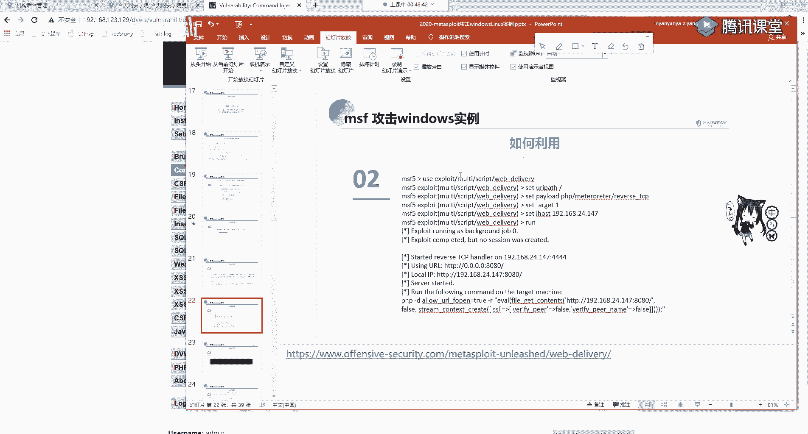

我们来用ph来试一下啊，这是节省时间，我直接都复制过来，直接直接use，这复制这么麻那么麻烦，啊多打了一个月三，然后这里我们需option是需要指定plog，我们这里默认是python。

我们p a p站用python利用及下载plot。

改成菲律宾的。

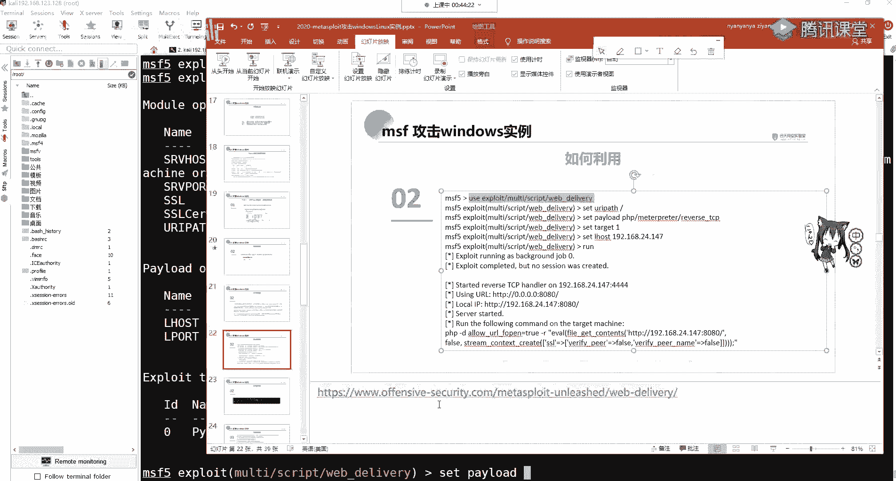

p a p的啊，p a p mate create reverse tcp啊，正向的一个dnshell，那show options指定什么，指定logo，post logo，pop就指定这两个东西。

那么set local host，set local park，那这里是5666，这个，然后shoptions啊都没事了，我run让一下啊，这个他告诉你不是一个不是一个po的，那我们把这个exp啊。

我们这个是搞错了，这个是target，这下面这个target，那么指定它的一个target，set target，我们指定它为p h p才行，那我们可以show tk查看一下，show tk。

我tk一是p h p，那我们就set target，一啊这就是我们的show options下，看到它变成p a p，这是我们run一下，ok它给我们生成一段代码。

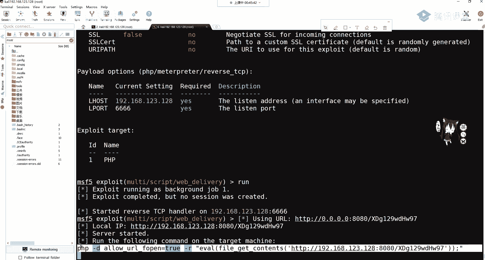

我们要把这段代码复制到这里运行，复制到我们这里运行，运行什么，通过我们的web端口进行运行，p127点点0。1，然后进行按按进行一个粘贴进行运行。

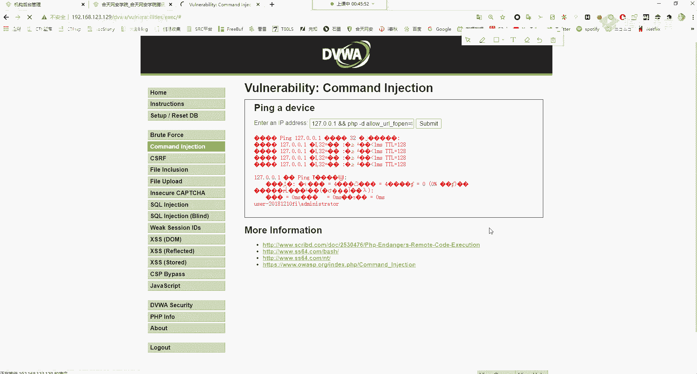

他这边会收到我们的啊一个指令吗，不会为什么不会在这里我就给大家讲一下。

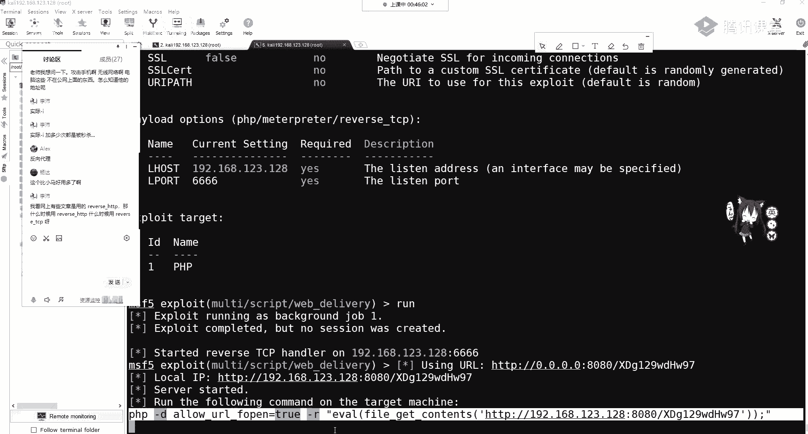

因为这条命令我们复制到打击里面，它能不能运行，我复制一下，我粘贴过来，不能任性，因为他告诉你，pap不是外部外部质量，也不是可运行的文件程序，为什么，因为我们这里是使用的集成化的p p study。

平时study他并没有将p a p写到环境变量里面，环境变量是什么，我们在装jdk的时候，大家应该还记得有个配置加法环境变量，那配置java环境变量，我们在cmd输入java，他怎么那么聪明。

就知道java是什么，那计算机没那么聪明，是我们自己去配置的，配置环境变量，我们告诉他java是什么东西，那pp没有进环境变量，那他肯定不知道ph什么东西啊，我们可以进行配置一下，你可以自己去试。

配置好环境变量之后，怎么配置，很简单，在我们的t h r d里面的这个pp，这里面不是pp吗，你随便选个版本啊，把这个路径复制到我们环境变量的path里面，跟我们java是一模一样的，你再去运行啊。

发现它还是不行，为什么，你，因为你并没有在全全部的用户进行一个配置啊，这里大家可以去尝试一下，如果不想这样搞，我们服务器上面有可能装有python。

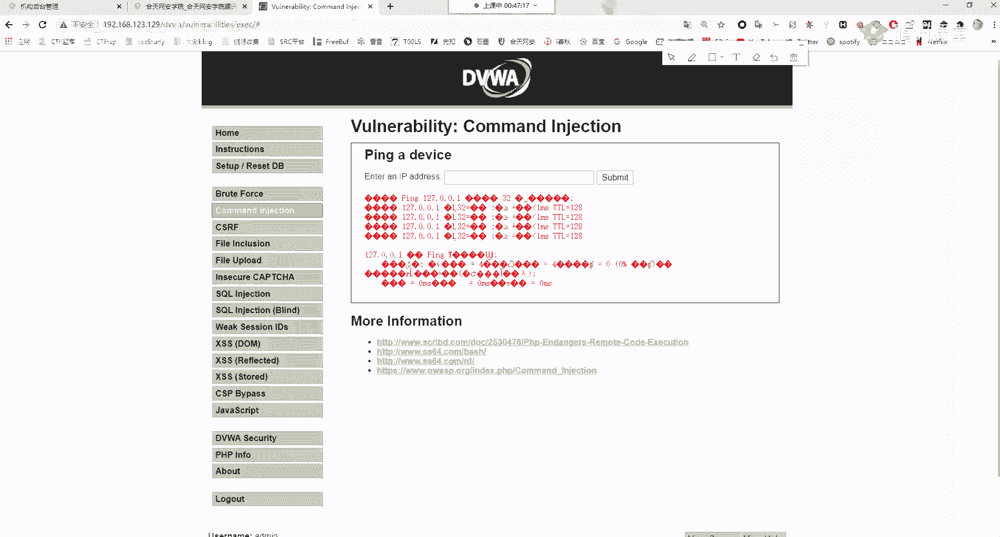

那好吧，我们把刚刚payload换成python来再看一下啊，这个就不要再搞了，我set of plo。

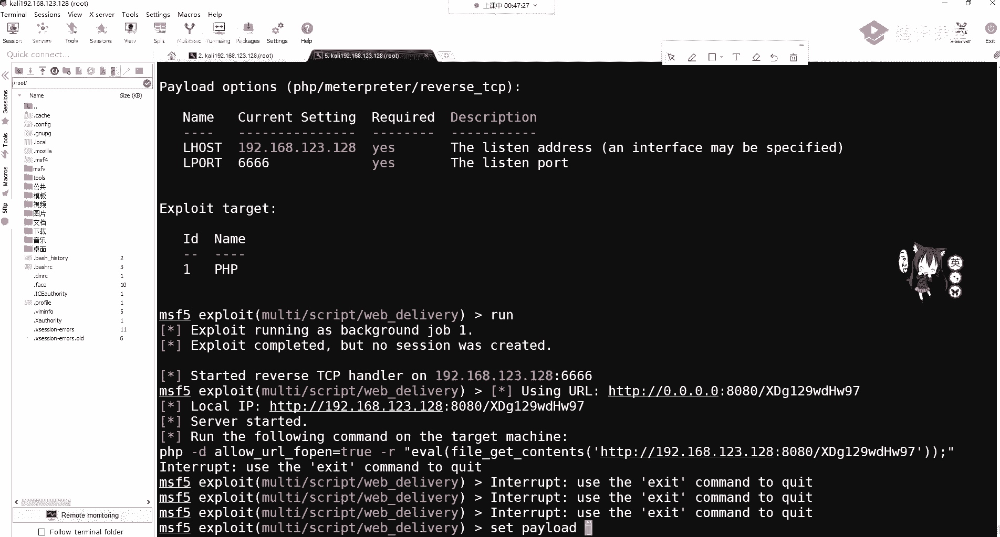

直接复制p p t啊，来看一下这个他告诉你p a p它识别不了，或者它是什么东西，然后下面我们对pyt进行一个切换，切换成我们一开始的python，ok这个可以尝试，如果他没有装python的话。

你这个python也是不行的啊。

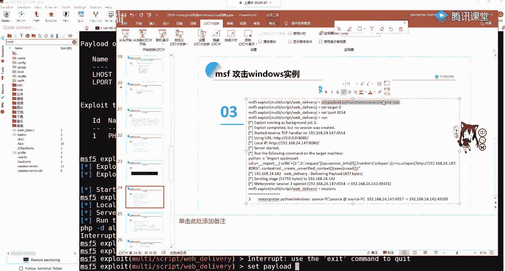

你肯定这都懂啊，都懂，因为它没有python，你执行pass代码执行到哪，这show absence，我们local house ropo没有变，因为我们他帮我们记住了，下面我要改什么，改target。

改目标，改什么，改成python，python是什么，show targets，python是零，那我们先tx 0，ok run啊，他告诉我们正在用，正在用把它砍干净，dbs杠k一啊，这就没了。

然后我们让run一下啊，生成这个python这个这个代码啊，把它复制出来。

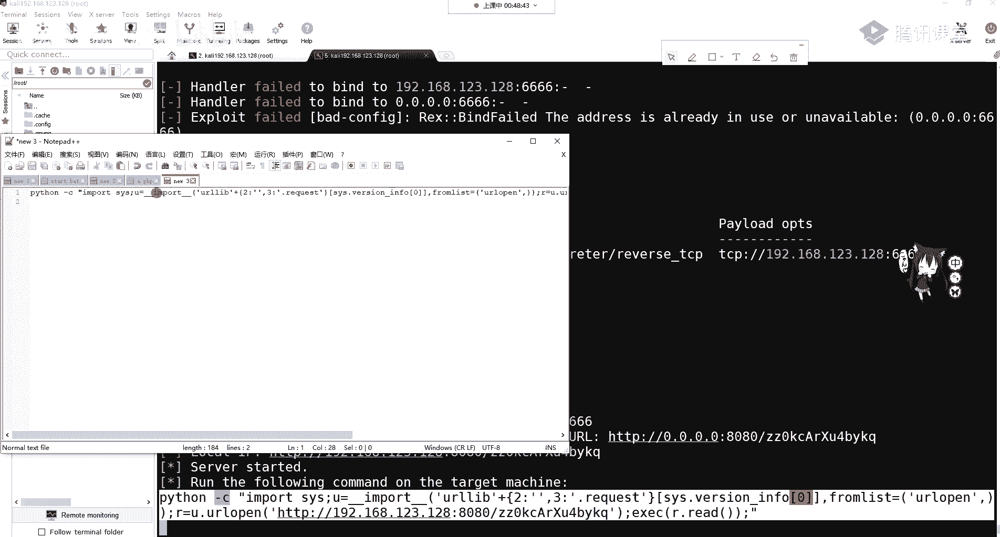

记住一定要一行啊，他如果不是一行的话，你要给他凑成一行，然后到这边我们进行一个运行，这边有没有run起来了，有run起来，那我们t127点点023的，三维密来看这边。

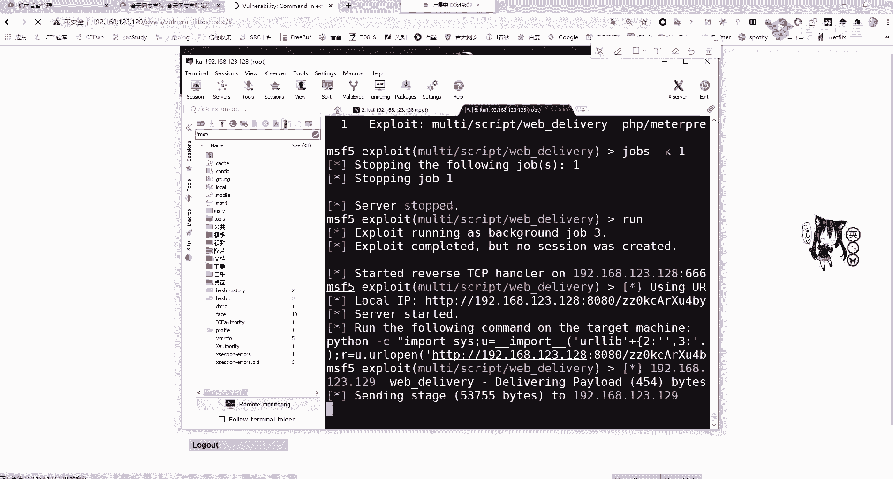

ok ok我们说到了，是不是收到一个matter presession 2 open，我们看sessions是不是再生二，在来到这里了，好来到这里了，是不是很很有趣啊，就是这样，你这样是是命令执行。

遇到命令执行漏洞，就这样搞，就这样搞这两个，那我们接下来再看我们这个目的达成。

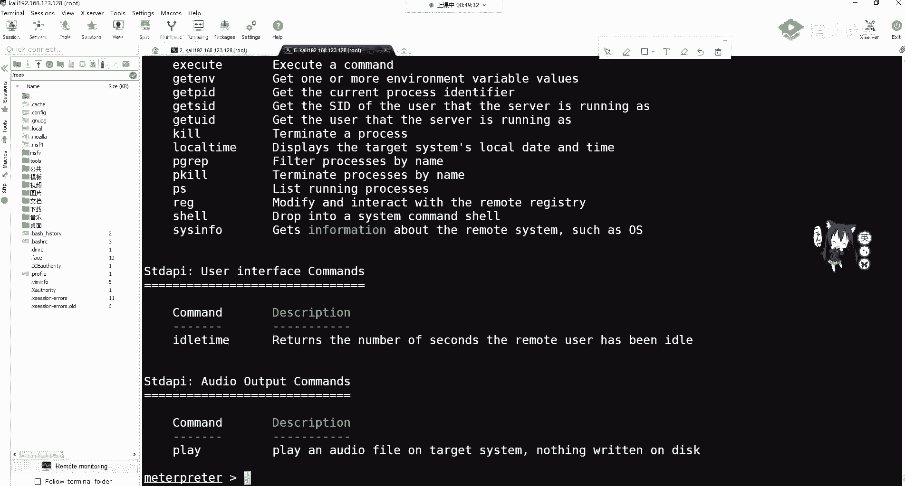

拿到了这个while metaphor和他的meditate，当然我们还可以使用power shell进行执行，那power shell也很简单，就是换一下你的target不就行了吗。

target我们看到的是什么。

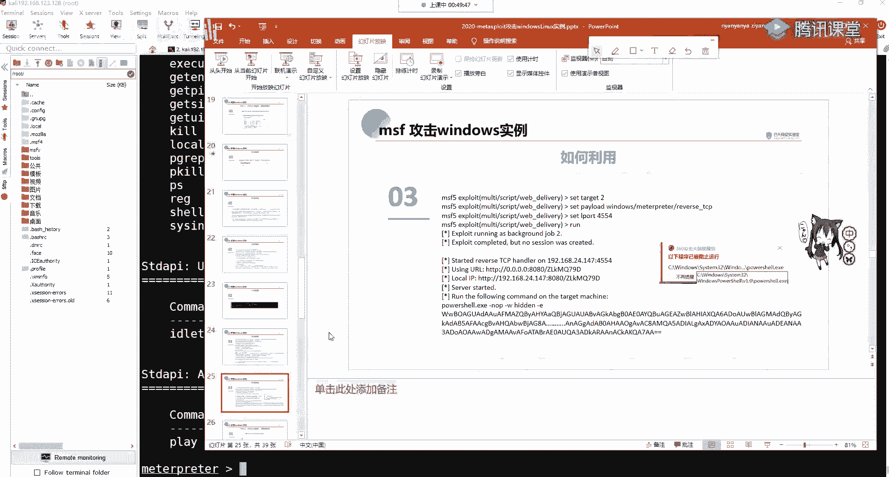

有p p u python，有python，这里我们background，那show tx是不是有p a p p s h是吗，还是power shell，power shell，还有一些其他的东西。

那我们只需要改一下这里就行了，但是powershell一定要注意。

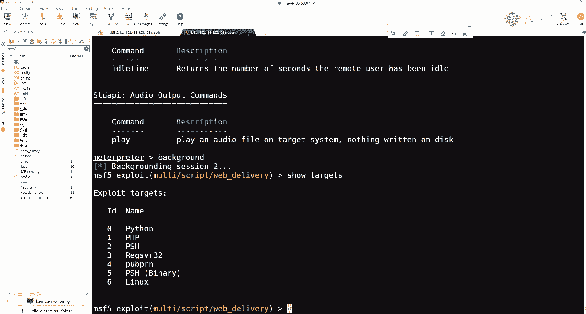

power shell是我们一个系统，windows 7以上系统自带的一个命令执行工具，所有的杀毒软件都会燃燃它，你不相信你可以去试，当远程执行power shell的时候，杀毒软件是肯定会烂的。

因为power shell可以说呃，调侃来说就是windows操作系统最大的一个自带后门，它功能很强大，我们可以利用它做很多事情，所以杀毒软件都会拦他，都觉得你拿它做事情肯定是不好的事情，就把它一刀切。

就感觉就十分安全了，是吧啊，这是杀毒软件的一个特征，因为power shell的你混淆很多，我们后面都会讲，混淆很多杀毒软件分不清怎么办，不如把power舍友一刀切安全，就像你把网线拔掉。

护网的时候把网线一拔安全，如何批量封ip，最最好的批量封ip的脚本，什么是电闸，就这样，那我们方法二上传我们的web shell，好上传web shell，如果你用dr search进行扫描的话。

你就扫描到和htr m o x目录，那我们可以去访问一下，好可以去访问一下，诶可以看到think ph这个5。1啊，它是肯定有漏洞的，那我们就随便给他找一个s啊，随便随便输一个。

可以看到它都告诉你模块不存在，往下拉，往下拉，5。1。29，5。1。29有什么远程命令执行，不知道百度搜哎，之前也应该讲过了吧，远程命令执行，那我们只记不住快乐的，没关系，百度ok。

那我们孙哥ph五点五点x版本，远程命令执行漏洞可以帮助我们cat shell，它可以执行命令，比如说我就拿第二个在两pload执行的，结果是一样的啊。

执行我们的system或m admin strator可以命令执行，那这个命令执行我们可以干什么，可以利用刚刚的一个python来进行一个攻击，当然了也可以利用上传web shell进行攻击。

那我们这里就来一个上传文件的，刚刚在你那刚刚那一种是不会上传文件，但不会上传文件，有个问题，你拿到metaphor其实功能很少，你发现你拿到的是python metaphor。

你还要进行一个破渗透提权或杠u进行发包，但发包的时候可能就被i d s单解了，那可以使用一个免杀马和不死马进行一个上传，那这里我们找到论文点之后，可以利用这个呃上传就上传我们的ph info进行。

这里呢我们上传什么，上传12点p p它的内容呢就ever post post，ok这是我们把它上传一下，这个大家应该都知道了，这个5。5。4的时候，远程命令执行sk p a b的这些漏洞，这些漏洞很多。

大家不一定要记，可以去复现一下，github上面有个限制的漏洞，代码有线程漏洞代码，ok百度1搜一堆啊，这个博客free buff一搜一堆，那我们把它执行一下，它没有报错。

那很显然我们pap i o post这一句话，木马应该都清楚吧，ever执行，当我们将我们传入的参数当作命令进行执行，那传入的是通过post min执行传入的c参数，把它当做一个命令执行，反方必须执行。

他传入了我们的catch，fire shell等kp，那它在哪，我们这里因为我是能看到我的靶机的啊，在真正的你看不到的这里，我就给大家看一下，看看有没有没有传过来啊，有没有传过来。

html public可以看到下一点，菲律宾在这盯着呢，来看一下，啊这个虚拟机莫名其妙的卡呀，ok是我们写的这个东西，是我们写这个东西，那我们写到里面之后了，我们可以干什么，可以连它，可以连它。

可以点它，它也告诉你们，我们他没有找到c参数，这里你可以加i进行屏蔽，报错，他又没有报错了啊，就没有报错了，那么这里使用web shell进行一个连接啊，进行一个连接，啊这个工具库都有啊，这用一键连吧。

哦可连过吗，连过了连过了，连过之后，那我们要干什么，要上传木马，是不是可以上传过刚刚的马，ok那这些下面大家的思路肯定都非常清晰了，你现在已经干什么了，已经拿到web share了。

但web shell的权限很低，你要干什么，要拿到mate por，外观摄像能看摄像头呢，不能matter creator可以看吗，可以，那你要看到拿到metaphor，那怎么办。

我现在拿到web shell了，如果是windows操作系统，我们是不是有上传权限，也不是是不是有上传权限，是不是有执行权限，如果是linux操作系统，我们是不是可以把木马上传到temp目录下。

然后进行执行，time模式下可读可写，可执行左右用户是吧，ok这是我们的思路，那现在我们上传什么东西，上传这个码是什么，我们刚刚是不是讲过了，m s f v im生成的这个马，它上场执行。

那到metaph这个思路非常的清晰，如何利用用shell进行连接，然后进行一个木马的生成，木马的生成嗯，哪生成，啊这里我已经生成了一个码，啊。

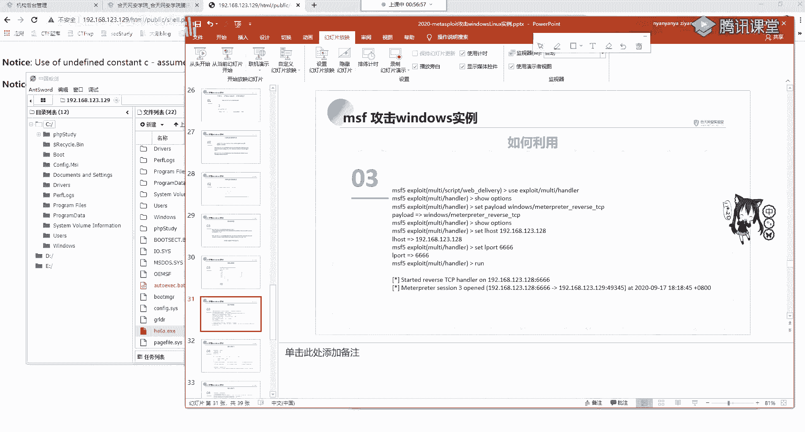

生成了一个码，嘿那大家这里就给大家做一个简单的练习，时间也不早了，嗯实验室有很多，这实验我们作业你可以自己搭环境，也可以去实验室看都可以，你不想自己搭，你就去实验室多了，这些实验都有的。

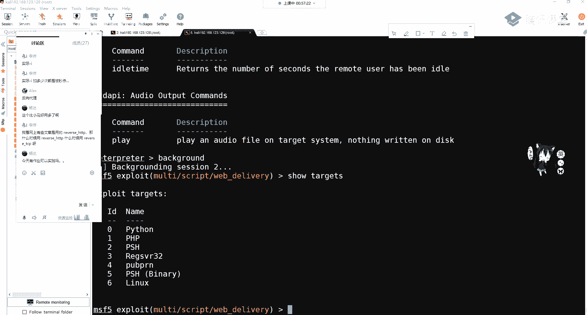

那我们这里就简单做一个演示吧。

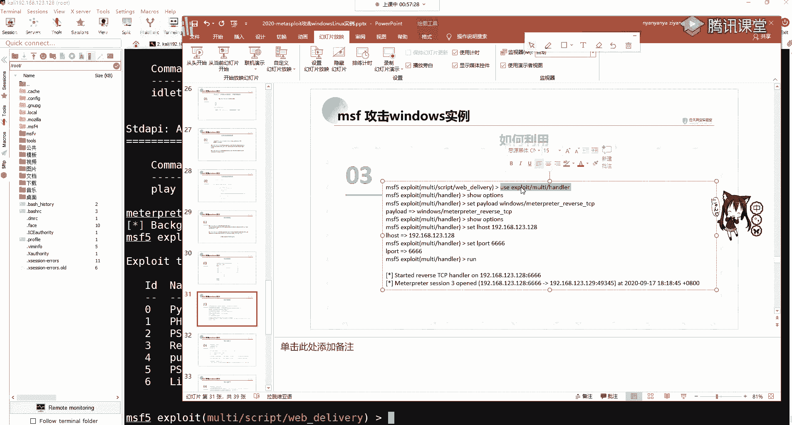

还是用我们的mt hmt h，啊要show options进行set pipo。

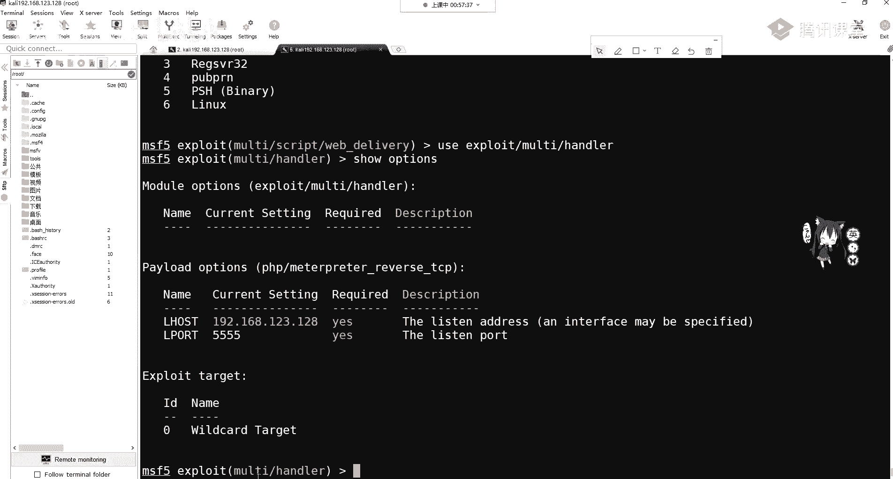

我们不能再用这个p2 p了，我们要什么。

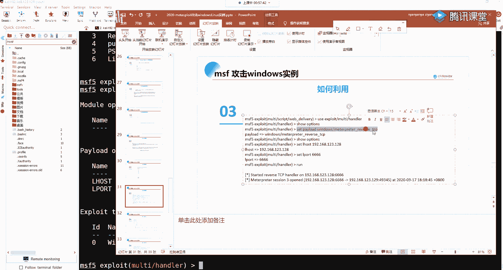

我们要set plot这个啊，这个东西，我们现在就用一个这一个大的这个东西了，再打这个东西就是不分段的plo，这时候我们show options看一下它里面有什么东西。

ok这个logo house logo po，我们把logo pot改一下吧，防止它又出什么猫腻啊，防止出小猫腻，我把set local part改成我们的88888啊，run一下，他现在在监听了。

监听了，我木马还没还没生产啊，别急，我把这个给copy下来。

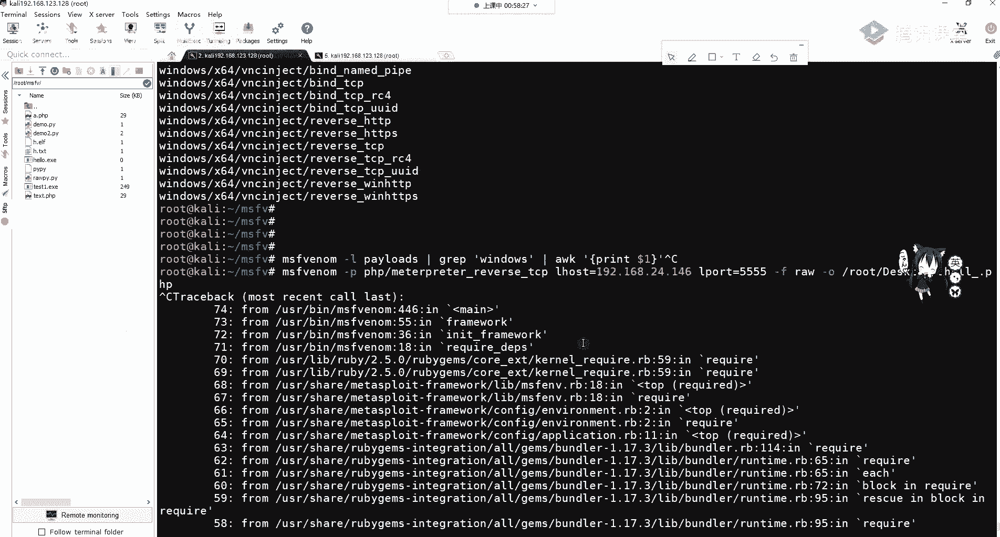

这边是不是可以修改一下，修改一下我们这个东西，那后面改一下啊，778888，输入什么输入1s一输出啊，比如说a b c d。1s1 ，你运行，那运行之后，我们来看这边会生成a b c d e s1 。

我们把它上传到现在，拖到本地再上传吧，啊拖到我们的嗯这个c盘里面吧，当然你拖进来他肯定会查杀的，肯定会查杀，我们来看它会不会给它插上，啊这个还还没动就查查了，还没动就查查了，我一到这个啊移到这里。

为什么啊，他这个会叉叉，很显然这是木马吗，你可以在隔离区里面进行回复，可以看到他场上的路径，并不是我们地盘的这个路径，是因为我们这个mobile这个软件，它在移动的时候。

会把这个文件先存储到我们的user listen，这个moba chart这一个文件夹里面，文件恢复添加到新园区，ok那我们再进行一个拖动，它也可以过来了，可以过来之后我们干什么。

你们来到我们的一键里面，点击c盘，然后你什么都不用做，直接上传人，直接点上传文件就行，选中我们的i d cd，等他上传，它上传成功之后，我们看一下它的权限，其实它就是可人生权限，那么在此处打开终端。

打开终端，知道吧，就是我们的web share on的web share，ok这里大家应该都知道啊，web share，那我们现在要干什么，要运行我们的啊，a b c d的start或者直接运行都行。

带了a b c d，啊i v cd运行起来，要等一下，我们看这边灭了，这边灭了，并不是并不是给关掉了，这个一键，大家如果用过，应该知道你这个命令执行三五秒没有回血的话，他会把你自动放到后台。

不信我们可以这个呃task key，task list看一下，可以看到我们那个ib c d在不在在不在。

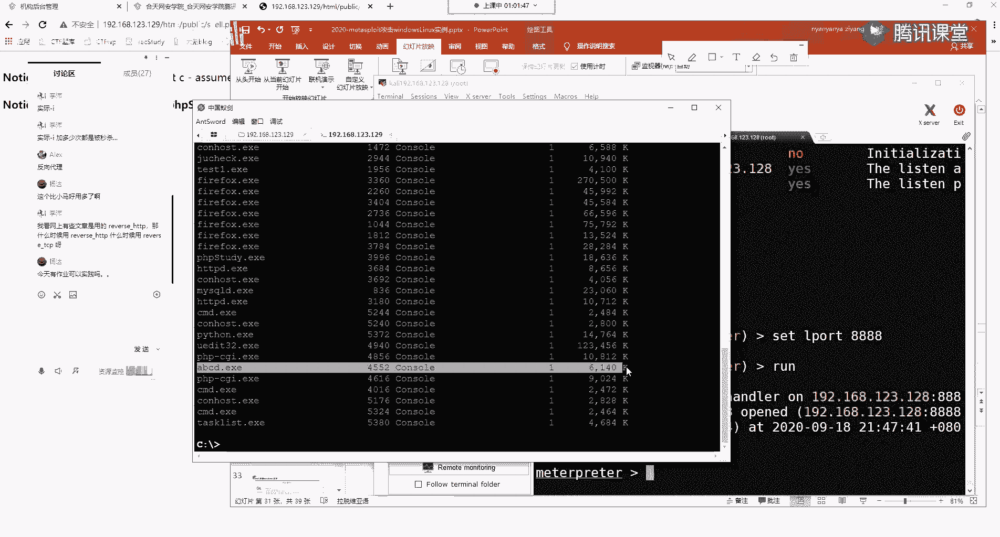

i b c d是不是在这在后台运行着呢，那在后台运行的，那我们这边很简单，已经收到了melebrate，收到很慢，因为我们生产的是大码，知道没有用分段的一个木马，收到的是大码，那代码之后。

那我们在这里ok可以做我们想要的事情了，是不是可以想要的事情，administrator，我想提前get a sum进行一个简单的题，全这个题全是利用我们的注册表进行一个管道，大家可以去查一下它的原理。

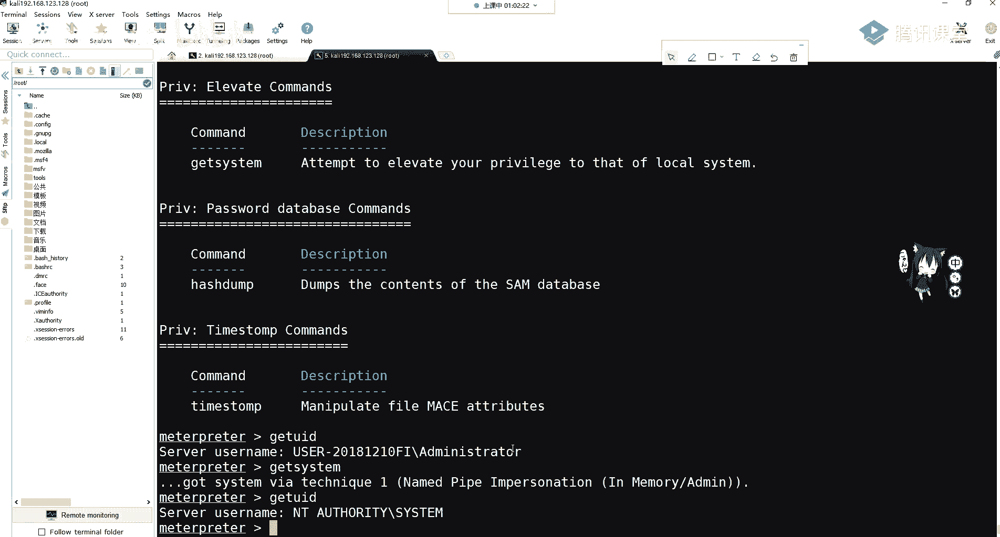

这时候我们就是最高权限sm了这c字母，但是大家要注意，如果你是网站管理员，现在我网站管理员，我又来到我的八级了，我发现我把机很卡，可能为别人中了病毒，觉得中病毒第一件事是什么感觉，是不是启动任务管理。

继续看到底有什么东西在运行吗，到底在什么运行呢，来看一下看一下哦，cmd正常发cos火狐浏览器呀，我在看a b c d a b c d是个什么鬼啊，a b c d是个什么东西啊，我把它给结束进程。

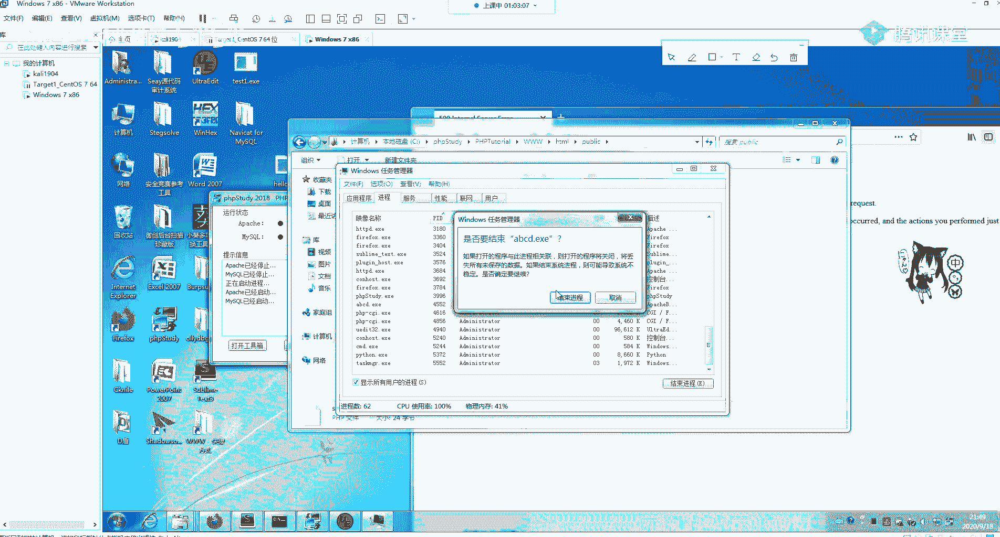

我把它给结束掉啊，结束点ok那你就凉了，你这个啊b c d被解除掉，你这边的metap就断了是吧，session 3 close断了。

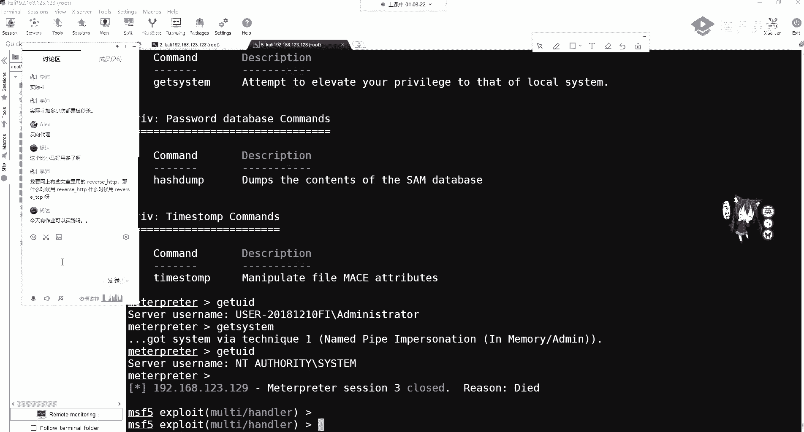

那这肯定不行吧，我们要做伪装，它如何进行伪装好，我们来看一下，我们拿到之后，我们可以get p i t去查看我们的这个进程id，然后进行一个进程的迁移，迁移到我们正常的程序中。

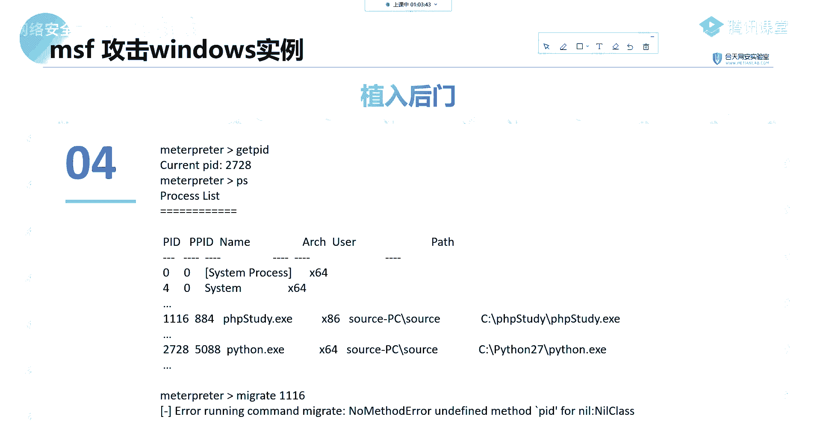

还伪装我们这个后台程序，那如何进行迁移，我们首先还是把这个给跑起来跑起来，把这个跑起来。

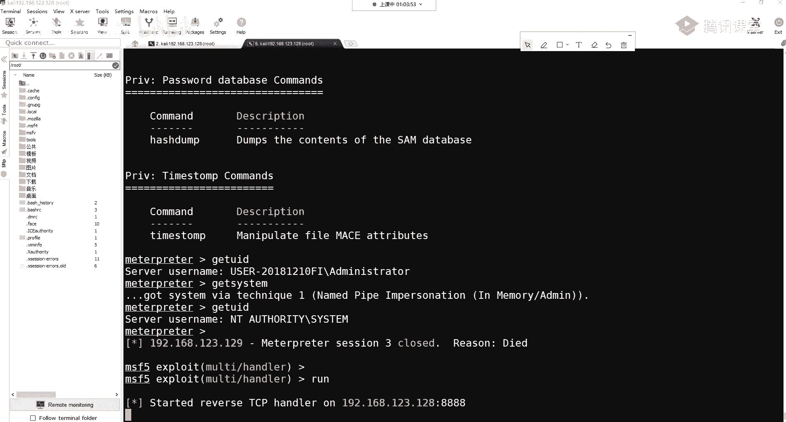

in the web shell，在这还start a b c d。e c，大家有什么问题吗，这个目前没有什么问题吧。

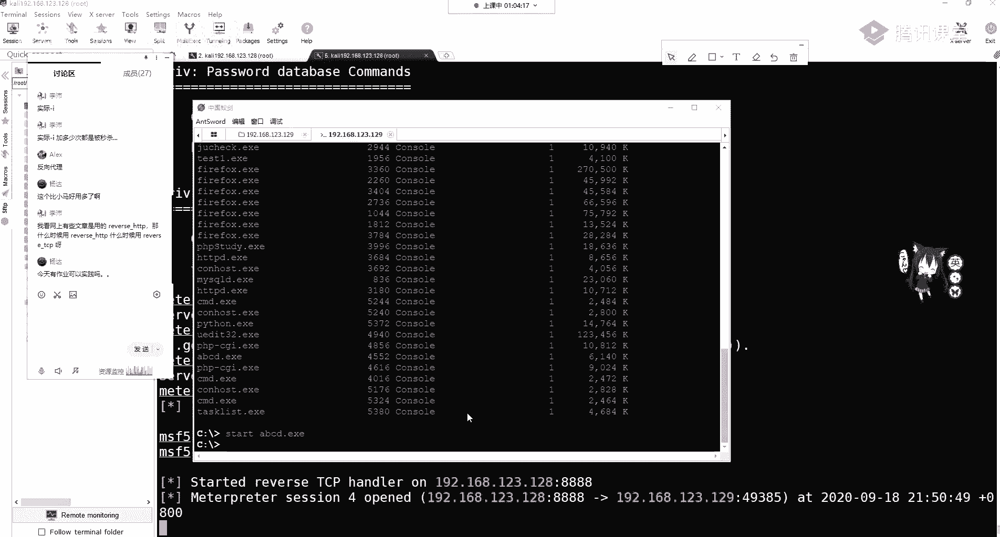

ok他已经收到了，收到之后啊，稍等一下，他这个会有包发过来。

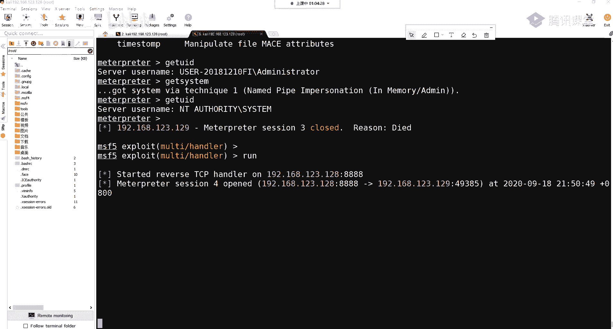

学了之后我们来看这边的一个进程啊，我的r b c d有没有再出来呀，啊又有又有了p i d4512 。

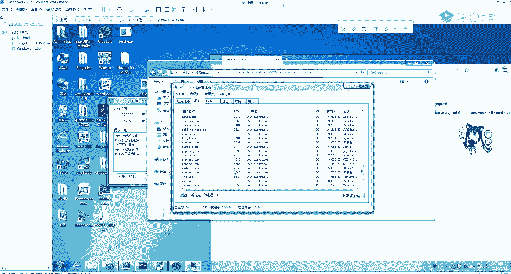

我现在是管理员，我就把它干掉，我把它干掉了。

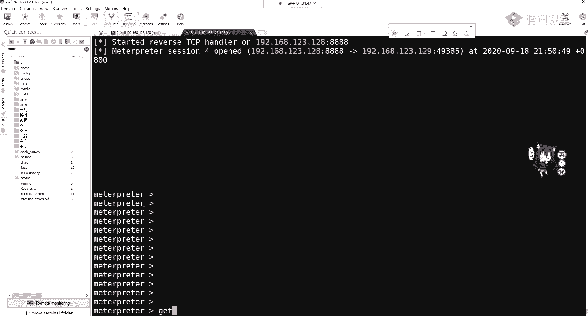

那么可以get啊，pad看一下，4512跟网站管理员在把题看看，是不是一样的，4512，那我们这样不行。

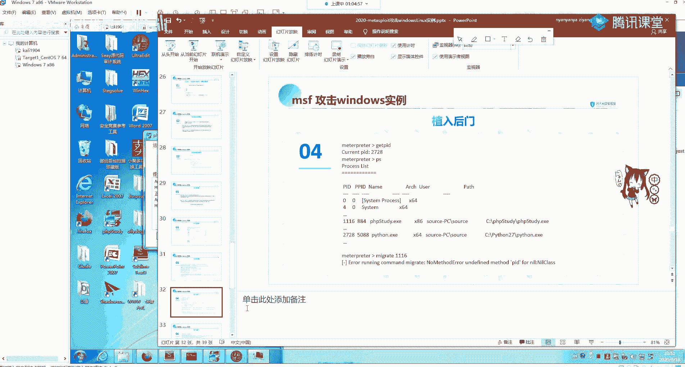

我们要做一个进程迁移进行迁移，那就是迁移我们迁移到哪了，可以ps看一下process，看一下我们有哪些进程正在运行，我们本身是什么，本身是a b c d是吧，本身i b c d，那我们要迁移到哪呢。

大家一定要记住啊，高的权限可以往低权限进行迁移，低权限不能往高权限进行迁移，那我们现在的权限是什么，可以get uid user id看一下administrator。

那么可以切换到system以及最高权限啊，我们再get uid看一下是不是sm了，那么这些都可以往下进行迁移，你想要迁移到哪，我现在现在知道这个服务器上运行的网站，运行着psp h p。

那我们想把它迁移到那，迁移到我们的阿帕奇服务或者是pip study，行不行，ok肯定行，那我找一下p p3 d在哪找一下ph，可以看到在这它有administrator进行运行的。

我们sm能不能迁移到administrator，肯定行啊，他的i d是多少，39963996，那我们migrate进行千亿，加上我们3996把4512迁移到3796，有的同学说啊。

一个进程id能运行两个人两个进程吗，我们分布式操作系统是可以的，可以复加的，大家可以去操作系统那边看一下它的原理，中式操作系统，这是一个有算法的进行一个迁移。

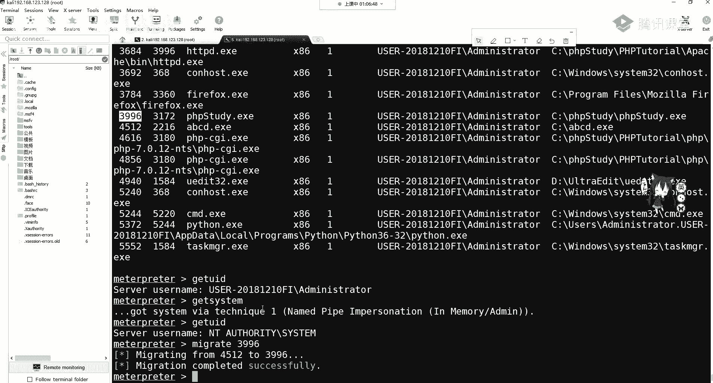

那这时候他告诉我，4512，a b c d e s一限定到333996，已经成功了，成功我们再get pad看一下啊，三六九6396，那我们这个ph 3的有没有断了没有断，它还在这呢，它也在这。

那这时候这个网站管理员再去看，再去看a b c d没了没了也没了，那他去查查木马，他会查什么，查查其他一些奇怪的或者是系统进程，他会去查，去关掉t a p study吗，他如果关掉网站就崩了。

他不会关是吧，那我们这个买的create就一直在这了，就一直在这，ok这是个进程迁移，大家又没有问题，这是进程迁移，当然matter create功能不仅仅只有这。

后面我们会在大家买到的客户一定要做练习，因为我们后面的课程几乎都会贯穿它，都会用到它，我们执行之后可以对后门进行一个植入啊，进行植入，可以植入我们的这个后门，植入后门一般是植物的注册表里。

大家要知道这种我们是有后门的，我们后门在哪，是不是shell的p a p我们上传的，如果管理员进行了重启机器，他是不是还要开启菲尔比斯利，那我们还是能连到他。

但是我们上一期上一个方法里所讲的web delivery，这个东西是没有文件的，它是在内存中运行的，那管理员把它关掉了，那不就没了吗，那再重启你这个木马就被杀掉了，那黑人显然不现实。

那跟显然方法二更现实一点啊，因为你有后门，你要是怕后门被查杀的话，你可以查一下注册表，其实注册表更容易被查杀，我不推荐这种这种这种方法，这种方法是我们在注册表里面写一个东西。

也就使用嗯read registry，然后写一个东西进行开机的运行，这我就不做演示了，因为它没有什么用，我觉得还没有web share好用，然后我们如果进行一个重启，它就会连上了，连上来。

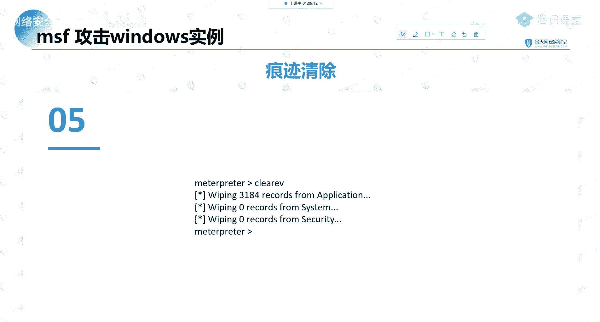

那我们最后呢连上之后我们要干什么，要对我们这个痕迹进行清除，clear啊，以为它会自动清除我们一些痕迹也很紧，啊这这这这是什么。

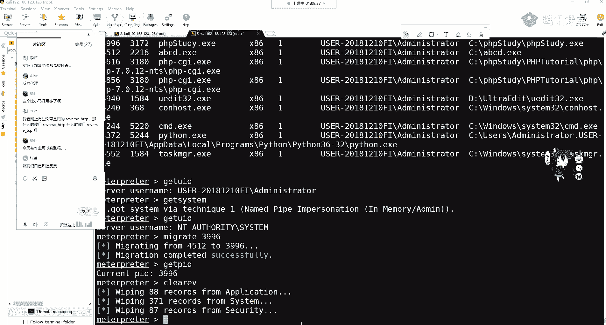

那我们后面再讲，如果利用msf进行渗透测试的时候，我们会将自己的木马发送给受害者，那由于我们的木马是临时临时性的，不能很好的保持持久在线，或导致渗透过去失败，或者是被管理员发现i p c d。

e s e被干掉，那我们通常要做的就是，将木马进程迁移到其他程序，正常程序一般你可以迁移到一些服务上面，http阿帕奇mysql上面，这样一来是防止受害者，也就是网站管理员可以发现。

可以进程关闭后门程序，二是可以有效的保持木马在线，那这里大家应该很清楚，刚刚已经演示过了，那今天的课程就到这里，课后作业呢大家可以自己去打靶机，并且做两个实验，也就是攻击的win 7啊。

这个我都放到放到我们的那个，嗯文档里面放到我的文档里面，大家有什么问题可以问啊，现在，啊我放进来了放进来，大家去把这个实验做一下，哈哈内网确实比外国好玩，我觉得是的，因为你内网有洞呀。

你外婆你打半天都没有动，你找不到呀，那兜不住，现在防的比谁都好啊是吧，那这个啊这个在大家在做这个实例的时候，因为啊这些作业，我这些是看着这个实验室进行傻瓜式的操作，我是其实不是很推荐的。

所以大家要通过做实验，或者是自己搭建靶机也好，做核电实验也好，一定要熟悉这个mask的利用过程，有可能你觉得很基础没什么呀，这就是个流程，即使在后面在实际工作中，你遇到什么要免杀呀。

无非就是这个整个的这个流程上面，再加一些编码，或者是棉纱，或者你，进程迁移会留下，会在系统留下这个记录的，如果程序i d s包括呃卡巴斯基杀毒软件，它是有这个内存的，一个内存的一个动态监控呢。

你这个时候就没办法迁移了，你迁移的话他会给你干掉了，他会发现你这个嗯，这个木马附加到某个正常进程上面，正常服务上面，但这个在内网中还是挺有用的，在内网中还是挺有用的，啊这个你说它好不好用。

这是比较玄学的事情是吧，他有的有的你比如说上了嗯，这个waf有的buff就很好，有的就绕不过去，有的你觉得这个buff很强，但最简单的收入你甚至编码一下就绕过了，那这就很玄学，所以要多次尝试帮你的编码。

你敢说哪一个编码就一定免杀呢，谁都不敢说，那有m s f有没有能力做到现在的i d s，还有杀软全部免杀是有能力的，但是大家都不说，如果说出来了。

如果大家在github或者是free buff或者看水上面，把这个东西对clever那个进行删除，或者后面我们会有一张专门来讲这个痕迹，清楚的，你可知道吧，是倒数第二章。

我专门讲如何把你的这个足迹给抹掉，那我们，无非就是再附加一些东西，这整个的流程是不变的，整个流程是不变的，那大家还是有没有什么疑问，你觉得都听懂了吗，就是这个msf有可能今天讲的内容比较多啊，比较快。

大家有听懂吗，有听懂的话，没听懂哈，扣一下号吧，这个免杀大家不会说出来啊，对操作有点多，大家要自己过一遍流程，过一遍流程一定要操作，要记住，不论你学什么操作是最重要的，你看跟你做完全是不一样的啊。

作为这个免杀技术是不可能透露的，你透露的第二天就不免杀了是吧，第二天就不免费了，他一看这些360的安全工程师，一看哇，免伤法出来了，干净的提取特征，加班提取特征，然后进行写入我们的360和火热。

然后你就不就不免杀了吗是吧，就是这个道理在很很好理解，如果你开发超多软件机，是不是在对网上的免杀教程都不行，基本上都不行，但是你说不行，是不可能的，可以多种综合吗。

后面会讲的会讲会讲power shell棉纱嗯，答案会讲，当然这个还是比较玄学，有的你你要说这个不可能有通用的，这个这个绕过的，呵呵这个没有通用的，绕过木马的，通用的，那第二天肯定就被杀了，你今天通用。

明天肯定就是全部都不通用，就是这样的，那有没有什么疑问啊，已经十点多了，嗯小课会讲，小课会讲一些最新的吗，我们这个课程里面会讲一些嗯，我们固定的这个渗透测试的流程啊，因为我们这个是面对大家入门。

或者是今天maslit就想到这了，但是绝对不要觉得mahlt到这就结束了，永远没有啊，内网后面都会讲，你到那个嗯腾讯课堂，那后面那不是有个大纲吗，后面也有我们的课程啊，那后面那个有靶机供大家练习。

就业方向，渗透测试，安全服务，这些做做护网都是get shell啊，get shell啊对吧，就是渗透测试，那大家还有没有问题，没有问题的话，我们就下课了，那我这就把p t，上海上海你可以撒网呀。

其实一线城市都挺好的，可以撒网，其实现在没有没有专门搞外包安全工程师的，都是做渗透，外国可以玩src啊，rs r c我们这个东西对sr c没有用，你s r c你不能拿他的metaphor。

你不能给他上马，你上马你被抓到了，点赞的核心东西，你不能给他上榜了，撒网撒网撒网就上海公司很多嘛，你可以在投简历，投很多公司吗，变成啥网，那大家还有什么问题吗，没有什么问题，我把这个打包发一下。

等我发一，甲方安全屋没有了解过，我这一直都是做乙方，你可以问一下我们班主任吗，我们班主任还有两个班主任呢，你可以问他们，他们资源多，专考就业，多跟她，多跟小姐姐交流一下。

ok那我这个ppt已经上传的群里了，大家有什么问题的话，可以在群里问我，嗯这节课就到这里了，大家早点休息啊，不要熬夜啊，头发重要。

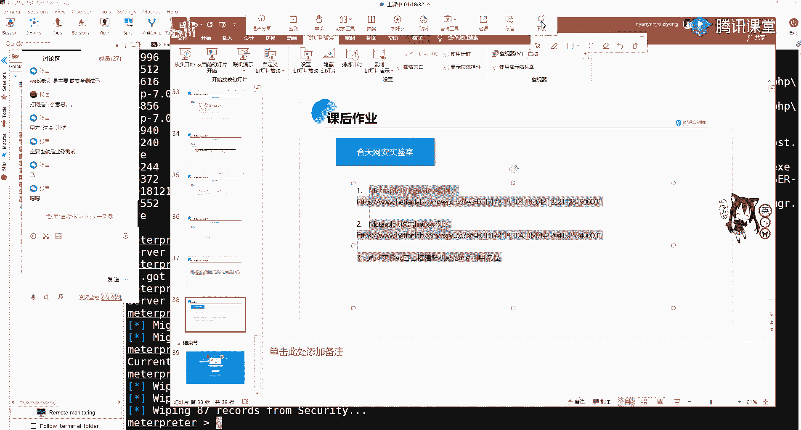