# P52：第16天：CobaltStrike渗透基础 - 网络安全就业推荐 - BV1Zu411s79i

好ok大家快听到声音吗，我今天打的时候就在这。

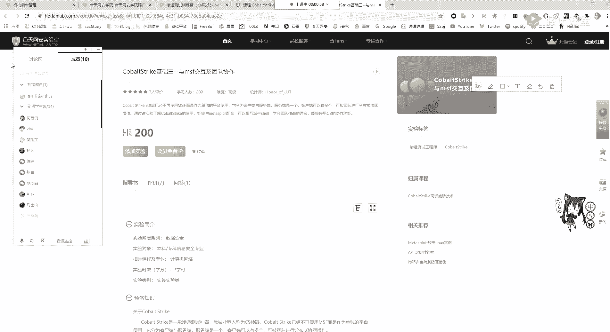

ok我们八点钟准时开奖，但是大家应该能够听到声音吧。

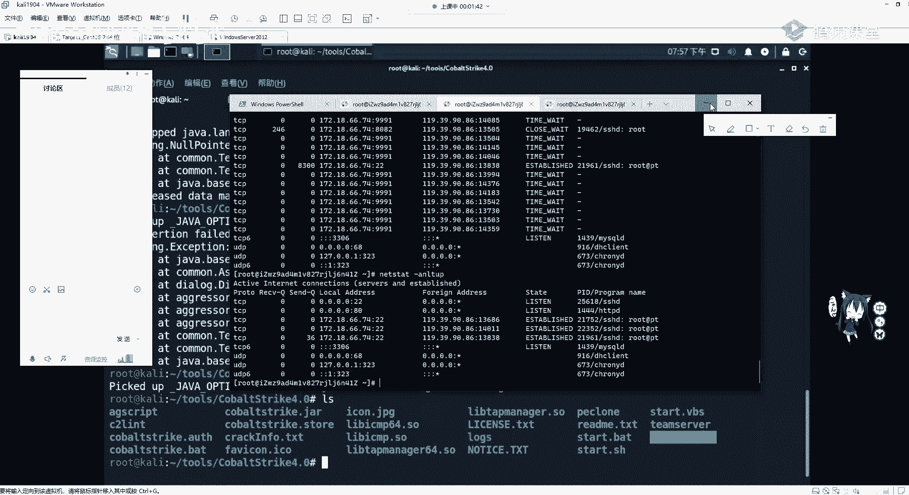

嗯行。

ok我们马上开始正式的讲课，在讲课之前我说两句，首先嗯大家msf的那个作业我都已经看了啊，有的同学都非常认真，把实验做好之后，还自己搭好了虚拟机进行一个复线。

当然我们meta split只是讲了一个多小时的时间，是不可能进行完全掌握的，但是我们是学会了matt split，在渗透测试过程中的一个基本流程，我们在利用其他模块，包括后生成模块的时候。

在接下来的课程都会贯穿msf，并且在工作的时候，有的地方你不会没有问题，用help帮助文档，或者是去百度去搜索，如何去攻击它的流程，一定是一样的，那今天呢我们是讲第二个渗透测试框架，cobrike嗯。

这个在和田小姐姐可以的，安装工具包里面是有的呀，工具库里面的渗透框架，可以看到cbrike四点就用这个来，当然大家在网上看教程啊，大部分都是嗯cs三点的一个教程，这个差别不大，当然也有很大的差别。

但是并不影响我们学习和使用，这里我们的教程都是以cs四点更为准啊，但是用惠四点，用三肯定没有问题，那我们现在来开始讲，首先我们来看一下什么是cover street。

第一节课我会给大家讲解cover street的简介，包括常用的功能，一些bacon，然后讲cover strike的实战演示，如何让靶机上线，首先我们来看什么是cs con strike。

简称cs是一款团队作战渗透测试神器，这个不是我们打的那个cs游戏，而是cubrike，是一个渗透测试神器，分为客户端及服务端，服务端可以对应多个客户端，而一个客户端呢又可以连接多个服务端。

cs集成了渗透测试中经常使用的端口转发扫描，包括多模式的端口监听，windows可执行程序生成windows动态链接库，生成java应用程序生成office宏代码生成等。

同时也能帮助我们克隆浏览器相关信息，克隆钓鱼网站等，那cole strike，他经常在使用中和meta late进行联动，因为他们两个都是非常好的渗透测试框架，如果能将两者进行联动进行渗透测试。

那效率将会翻倍，那cs和max在以前也是有关系的，m s f我们在周五的课程已经讲过，是一款开源的框架，mata split，我们通常用的接口即为他的一个命令行接口，msf consoon，msf。

它也是具有图形化的界面方式的，就是army tech，army tag，也就是cs的一个啊，相相当于是它的一个呃早期版本，那cs呢就是armitage的一个增强版，同时它也收费。

那cs二点还是在依托m s框架的armitage，但是在三点之后，这个cs已经单独出来，使用了单独的平台，那这里我们用的是三之后的版本是cs四点，首先我们还是像matt slide一样。

看一下它的目录结构，这个目录结构就是在工具包里面的cover striker，你可以看到它的一个目录结构，将它直接移到我们的v p s上，连接性vp就是公网上面的服务器，比如阿里云的轻量应用服务器。

ea服务器都行，或者是如果大家没有没有能力，去在公公网中拥有vp的话，可以将它拖中拖，拖到卡里面进行一个服务端任性，那我们首先看一下它的一个目录结构啊。

这ios就能看到，这里就直接用p p t来看了。

首先edg script是cs的拓展应用脚本，我们cs支持支持插件和脚本的一个拓展，是点cn结尾结尾的我们可以拓展一些模块，下面c to lend是用人检查profile错误异常。

team server服务端程序，cooper strike，点gi r包，这个是客户端程序，rocks是日志文件，update是用于更新cover strike。

third party是第三方工具的一个应用集，cover snake的服务服务端只能运行在linux操作系统，并且需要安装java环境，如果是使用卡利的话，java是已经安装好的。

如果是大家自己购买的vps服务器，java并没有安装，可以大家可以通过we get下载，下载之后进行编译安装，并且配置环境变量，这在第一节课环境的安装与准备已经讲过，如果大家的v p s是3s。

这里也推荐大家使用3s，因为3s的ym是十分的好用，那要么去安装jdk，只需要去输入要install杠y是指默认选择yes，因为在安装的过程中，会有很多选项需要我们选择，那我们去安装java 8。

新号会匹配java 8的一些包，你去选择相应的，比如64位的3s，可以选择amd 64版本进行安装，在用，要么安装好之后，环境变量就不需要我们再配置，因为样本源的包里面已经帮我们配置好了。

在服务器上运行及把加班装好之后，把co rike整个文件夹都移到公网的服务器上面，并且给team server这个文件的服务端，去设置可执行权限。

我们去查看team server实际是一个batch脚本，我们可以偷改修改cs的默认监听端口，它的默认端口是50050。

我们可以进行修改，那这里给大家看一下，ok在这个里面我已经装了这个cbrike。

我们l s一下，需要去给一个team server赋值可执行权限，可以使用c h m o d777 ，设置所有用户可读可写可执性，也可以使用加x给所有用户添加可执行权限。

加上team server里的相对路径，我们去vm查看tm server，会发现是一个冰袋子的脚本，在下面我们可以配置它的一个默认端口，这里退出，打开启动我们的服务端，非常简单。

只需要把team server运行加上我们公网的ip地址，如果你是在ky里面安装的cover striker，就加上卡里的网卡地址即可，那这里我添加公网的一个地址。

第二个参数是我们team server的密码，我们可以把它设置为任意，比如我这里就设置了password，这个时候服务端会运行在50050端口。

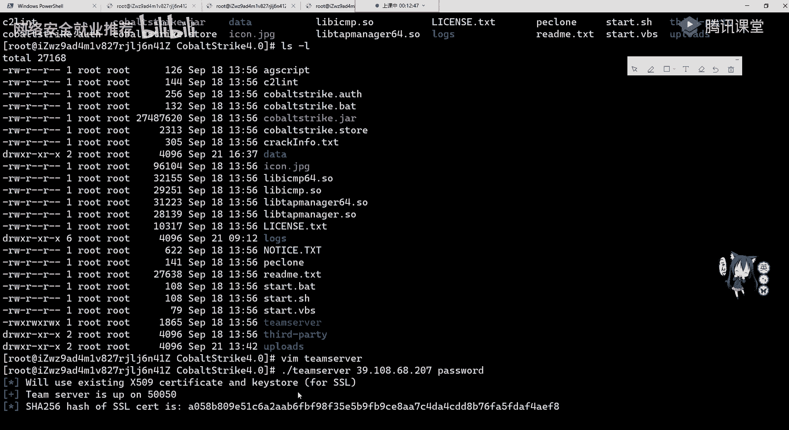

那客户端就非常简单了，客户端我们可以在本地直接的进行打开，coa strike四点文件夹里面已经配置好了，点bat文件和点s h脚本，分别对应我们windows操作系统的。

打开cobrike和linux操作系统的打开cbriker，那这里我就以windows操作系统为例啊，这里我已经创建了快捷方式，在桌面上或者是双击这个点bt都可以，再打开客户端之后。

这里会让我们输入host，也就是服务器的ip地址，加上服务器的端口，默认如果没有修改的话，是50050user用户名，这里是随意修改，因为它支持多个客户端去连接服务端。

password输入我们在服务端中设置的密码，即为password，点击connect连接。

这时候我们就会连接到服务器。

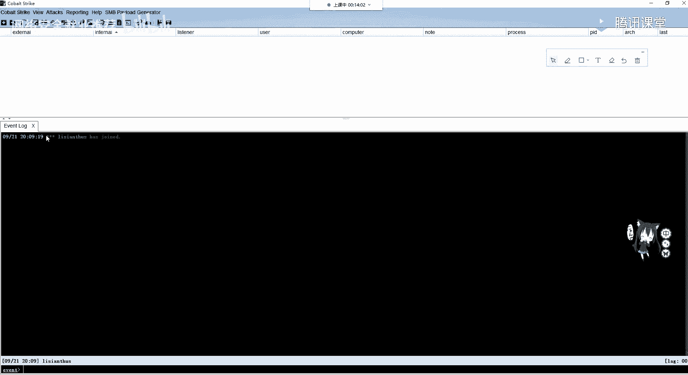

因为它只是多用户，我们在他力里面也可以把客户端给开启，是使用我们的start。s h，开启之后我们一样user自己设置进行连接。

在windows操作系统的一个显示。

可以看到两个用户都已经连接过来了。

这就是一个客户端去连接服务端，这里也已经讲过了，如果一个客户端想要连连接多个服务端的话。

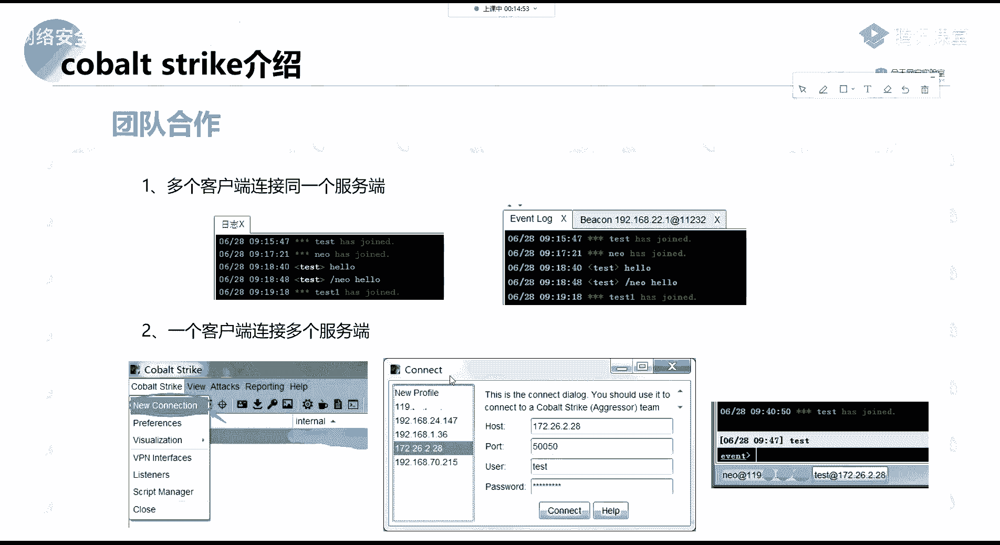

也非常简单，直接在上拉菜单下点cs，然后new connection就可以去连接其他的服务服务端。

那我们接下来来看cover stract的常用功能，首先去查看cs的快捷工具栏。

快捷工具栏，这分别是分为五大类，我们来看一下它们分别代表什么。

首先一和二代表连接到团队服务器，或者断开当前服务器的链接，三代表查看所有的监听器，我们需要创建监听器，才可以让靶机上线去连接我们公网服务端上去，开启的证监听端口，大家要知道我们做任何的操作。

都是通过服务器的ip地址去连接靶机，去和靶机进行文件stage的一个传输和交互，所以这里大家推荐是把cs放到公网上面，社会比较方便，让法器上线，4~6分别是cs的三个视图，分别是服务器节点视图。

绘画列表，目标列表，七和十分别是查看已获得的凭据信息，查看下载文件，查看键盘记录，查看屏幕截图，11是生成stage list的es一木马文件，大家还记得schedule list是什么意思吗。

plot的分为statute staged和steastages standard list，相当于p i p u的大码，它是拥有拥有所有的功能，包括matter prator，它的非常的大。

我们不需要其他的管理器，就可以对stages进行完全的交互，在环境在网络环境比较差的时候，可以考虑使用它非常大，并且容易查杀，并且容易被查杀，第12是设定加v4 签名的程序攻击，这个已经淘汰了。

我们这里不讲，13是生成恶意的office红攻击，在microsoft office里面可以设置宏，那这个宏实际上就是一个脚本代码，我们可以通过嵌入恶意哄攻击进行让靶机上线。

14建立web delivery，这个web delivery大家应该还都记得吧，是在嗯加载到内存中去执行恶意代码，是不会在服务器上进行留下文件的，第15是在web服务器上托管文件。

16是管理web服务器上托管的应用或者文件，17和18分别是帮助和关于，那么快捷工具栏就介绍到这里，大家不需要去死记，因为我们在用到的时候多点两下就ok了，所以渗透测试关键一定要动手操作。

这里我再给大家提一个醒，自己去听课和动手操作完全是两个事，有可能自己听得非常清楚，如果这一至于三个月的课程，你全部听下来，但是没有操作，你会觉得你都懂了，但是当你听完最后一节课，面试官就让你操作。

给你一个靶机，让你去测试的时候，你肯定一无所措，甚至team vivo不是这个team server都没有办法启动，ok那我们一定要操作，首先我们可以进行一个用户通信，用户通通信通信很简单。

直接在这可以输。

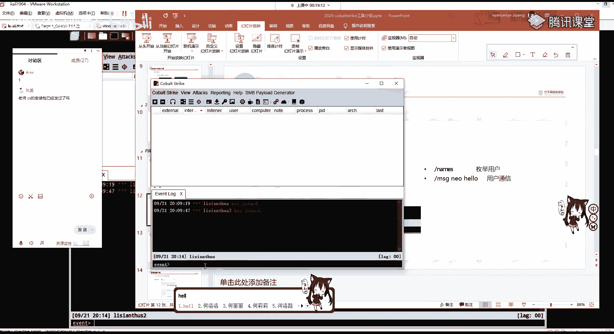

比如hello，ok，这两个客户端都会收到一个聊天，相当于聊天，当然也可以进行司法啊，比如m msg，然后指定我们要发的一个，然后给他私发个消息啊，专门发给自己的，ok他会收到这个发的消息。

那大家如果想连接我的这个呃服务端的话，也这个i p的是，大家如果想看这个靶机上线的过程，可以登到这个服务器上面，ok服务器的ip就是这个，然后密码是password，大家应该在讲课的时候都听到了。

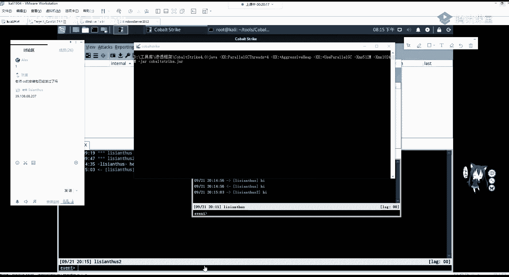

常用的功能，我们首先对cs的一切操作都要创建监听器，也就是listener，没有listen的，我们做不了任何事情，那这里大家看别的教程，这个listener三点和四点是不一样的。

那我们这里来四点来讲一下，在coco strike的下拉菜单里面可以点击listener，这会来到我们的这个窗口，当然这里我们没有进行创建，可以点击add进行创建listener，创建类似内容的时候。

它会让我们输入listener的一个名称，我们可以随便输，比如demo one，下面让我们选择pload，分别是bacon，bacon叫做洋葱，也就是自带的一个po的，还有外部ht，外部po的。

我们这里先讲back on don，dns是通过dns记录http，那这里我就不多讲了，是http协议ht v s s m b t c p，我们可以正常情况下可以创建http嗯，大概在三点的话。

就可能还会看到其他的大家都差不多，在选择相应的po之后，我们需要对plot的options，需要对plot的进行设置，首先设置http host就是它的一个地址，这里设置为我们服务器的一个地址。

http host host这个stagger这个和这个有什么区别，它是用来发送stagger，stagger是什么，是用于获取法其上限执行命令的一个啊传输，那这里我们是由服务端对任何靶机的操作。

这个流量都是通过服务端发送的，所以这里我们把它设置为服务端的一个ip地址，下面我们需要设定监听的端口，那这里不推荐大家使用八零，因为如果服务器开启了阿帕奇服务的话，你这样他会告诉你八零端口已经占用了。

那我们可以给它一个高一点的端口，比如8080可以在study listener，这个监听器已经开启，已经开启，那我们可以来到服务器上面，来到这个服务器上面去查看，8080有没有在监听。

求n e t s d i t i n l t u p啊，这个可以看到8080已经开启了监听，正在等待连接，那我们如何让法集上线呢，现在先不急，来看创建监听器，创建信息之后，想让靶机上线。

很显然就是攻击靶机和text，那attacks有哪些功能供我们使用了，tt在哪，在上面的这一个，packages web drive by，我们分别来看一下，腾讯云安全组。

在你如果是e s e cs那个服务器的话，在嗯它默认是出端口全全开的，你是入端口，你去配置吗，配置零点点零，然后嗯就是全部放出吗，就是不会配端口的话，就把端口全放模式，这样的，不用重启，不用重启。

不用重启的，啊，那我们继续去看这个attacks里面有什么东西，首先packages pages里面，大家有可能下载的这个cs是汉化版，汉化版，我觉得有可能还没有这个讲的清楚。

因为他汉化的有些语言特别的怪，那我们首先来看html application，很显然是html应用程序是生成一个点htf文件，在服务，在法器上执行，这个hti文件就会上线到我们的cs服务器。

还有ms office是生成恶意的红，放入office文件，po的生成器可以生成各种语言版本的po的，windows可执行文件，可以生成可执行文件，默认为32位。

x86 可以勾选64位的windows可执行文件，杠s在这，杠s和前面一个可执行文件有什么区别，那这个带大s的也就是生成sl，也就是生成全功能，被控端生成全功能的一个木马。

下面where will drive by web jifi，这里可以进行manage进行管理，可以管理当前服务器开启的所有web服务啊，这都是简单的一个翻译，下面克隆网站可以克隆网站，克隆钓鱼网站。

host file，可以在服务器的某一个端口提供web进行下载，下载某个文件，也就是我们可以利用这个东西，把文件传给我们的靶机，scream web delivery是可以为po的提供web服务。

便于下载和智讯，那这里就比较像msf里面的explode mu l t r，t r加上cript web delivery是一样的，这个这个模块，接下来的两个是字签名的，java日期环境都已经淘汰。

我们这里不讲，system profile是用来获取系统的信息，包括系统的版本，浏览器版本，flash版本等，最后一个是由叉掉一个键控呢，这里我们也不讲这些，大家可以作为一个拓展，去百度搜索来了解一下。

我们来看如何让法题上线，这里我只举一个例子来讲，因为是差不多的，attack package生成html应用程序，我们需要选择一个需要选择监听器，选择刚刚开启的8080端口监听器。

并且选择执行方法是生成可执行文件，还是power shell，还是vb的一个脚本语言，那这里我选择power tel是选择生成，它会让你选择一个路径保存html文件，这里我保存在桌面上，保存在桌面之后。

我们需要开启一个端口，供靶机下载这个文件，那如何开启呢，使用web drive by，点击host fire是开启端口，那这里选择我们的一个刚刚生成的hti文件。

然后这里local host已经帮我们设置好了，这里还是不推荐使用八零端口，因为很容易被占用，那我们这里使用9090点击生成，它会生成一个host fire。

然后把它复制过来，然后在靶机里面，这里的靶机是。

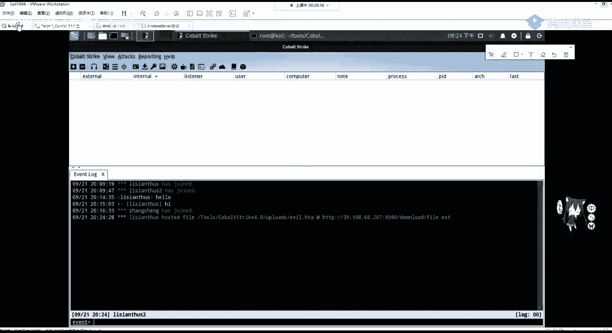

我使用的是win 7664位的操作系统，他的ip地址是192。168。12，3。1231，那这时候我们可以使用mhti这个文件去运行，去运行，我们复制过来的这个文件，也就是在9090端口去开放的。

那我们把它运行起来，把它运行起来。

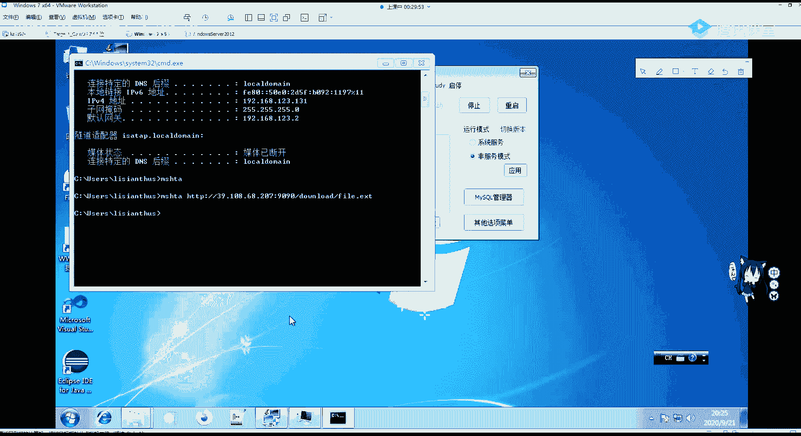

这时候我们等待一下，会发现法鸡上线了，因为我开启了一个内网的端口。

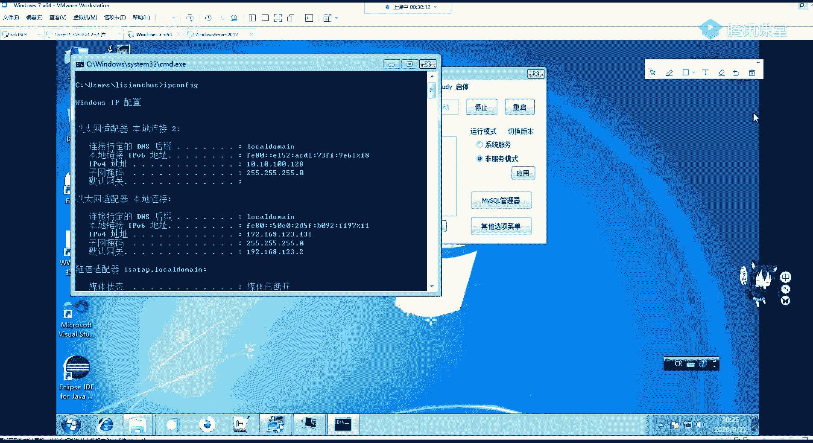

那他就上线了，大家如果连到了我的服务器，应该能看到他上线了啊。

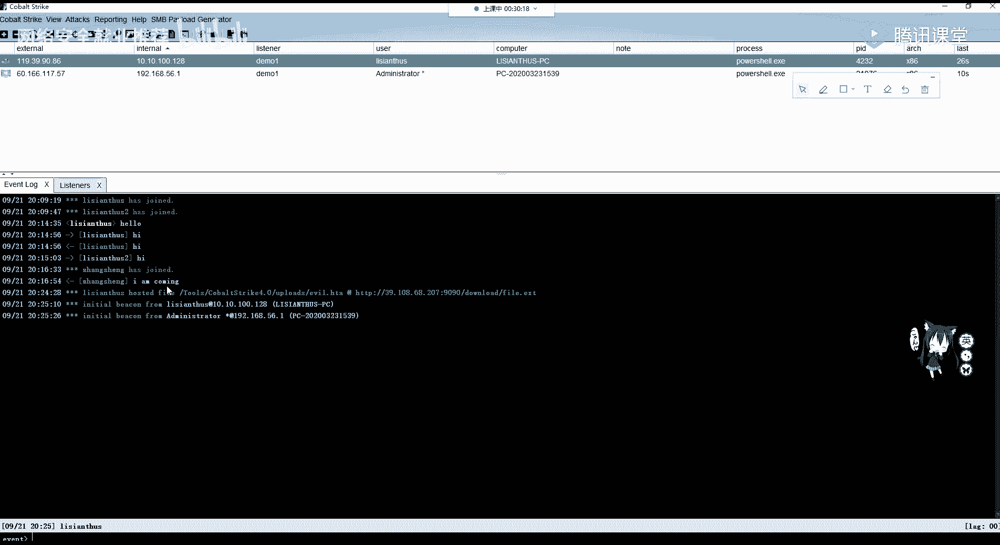

能看到他上线了，这怎么还上线一个呀，这是谁的机器啊，这个是，这这谁的继续上线了啊，ok那我不碰你的，那我们上线之后，我们可以做很多操作，interact开启交互access权限，还有一些设置。

包括啊转移和session的一个控制，会把它退出，那这个时候把机就上线了。

把机上线之后，我们可以点interact开启交互，开启交互。

这是交互，那这里我放。

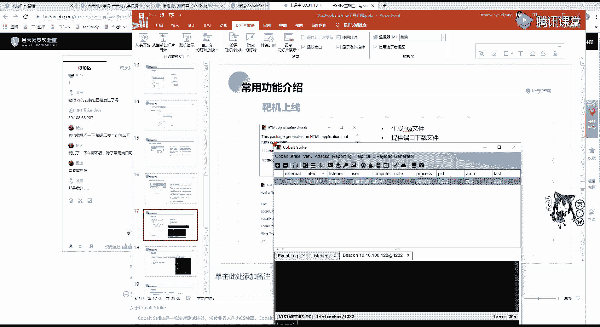

开始交互可以在这里输入，share，who am i，shell是指执行shell命令，后面加上我们的cmd命令即可，那这里因为他设置的心跳是60秒，也就是他为了避免流量的特征，设置60秒的间隔。

那我们可以修改它的一个间隔，可以在右键点击sessions sleep去设置，也可以使用命令啊，看这里是非常慢，它会写给我们的这个嗯用户名，那我们可以sleep把它设置为二。

你需要在后台里面把这个进程给关掉，就是你的power share，不然的话你在这里退出了，他还是在会上线的，还是会上线的，这里是比较慢的，那我们先继续讲。

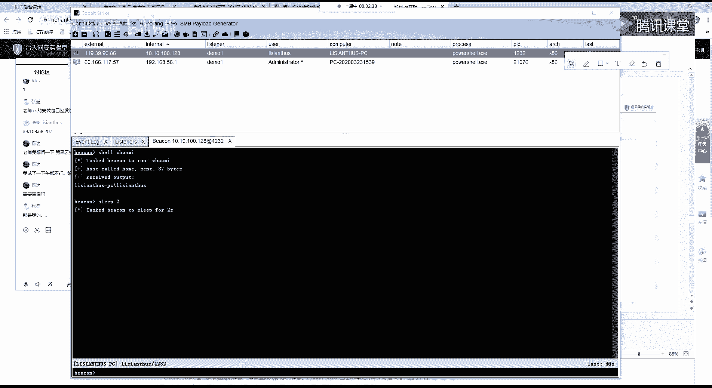

那当我们的靶机被出现了，被控端就会出现在暑期列列表，选中要操作的目标主机，右键interact可以进入交互命令界面，这个时候我们可以使用back in comments，对靶机进行各种操作。

我们一般拿到这个靶机上线的靶机之后，首先就是要对sleep进行修改，当然在慎重的测试过程中，你也可以不修改，因为sleep 2很容易被ids查杀，之后。

我们就可以输入shell加上cmd命令进行命令执行，那这个时候sleep两秒已经设置好了。

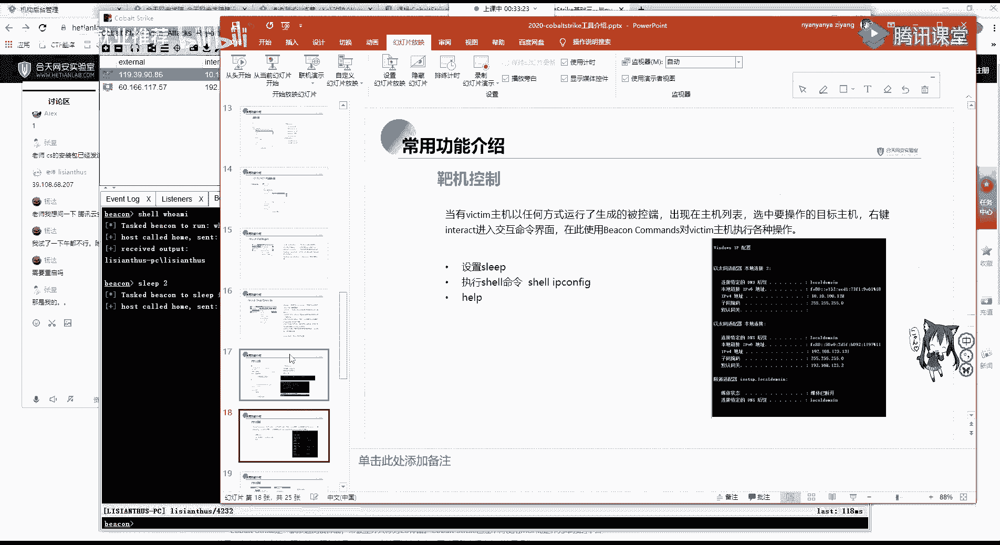

我们再去执行命令，比如ip cfg好，它就非常快，可以看到我们的网卡131和128。

当然还可以执行其他的命令。

可以输入help，可以查看我们可以执行的一些命令。

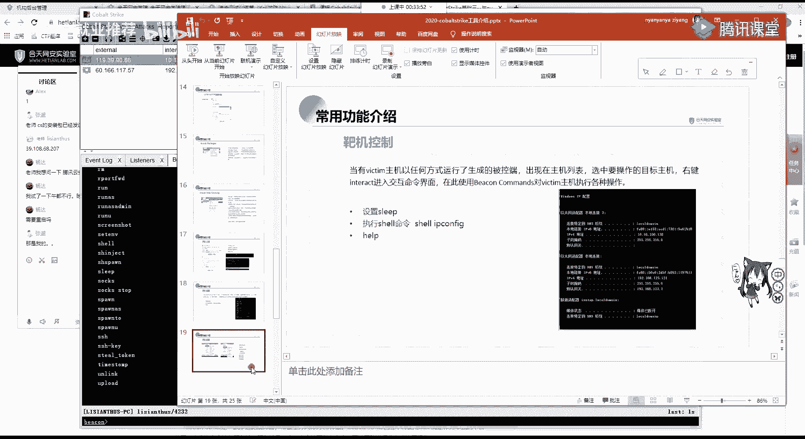

包括和upload，可以上传文件，可以开启代理，可以查看注册表，也可以进行截图。

我们分别来看一下，当我们拿到了一个靶机之后，我们可以看到它的题权和显示这个模块中，分别有几个重要的，分别是提前还有转移运行mini卡tt，这个是一个密码，从内存中获取密码的一个嗯脚本。

到时候后面都会讲开启vn c，也就是远程链接，当然这里vn c大家是不建议开启的，因为我们的用内网的机器去，把vn c3389 端口是映射到公网上面，你v p s服务器的带宽一般是非常小的。

除非你是土豪，大带宽特别大，那特别小的带宽去看v人生的一个转发，就特别的卡，那下面呢还有文件浏览器，包括端口扫描进程列表和屏幕截图啊，这里给大家稍微看一下吧。

可以对它进行一个嗯屏幕截图，在屏幕截图之后，我们可以在view视图界面去查看screenshots。

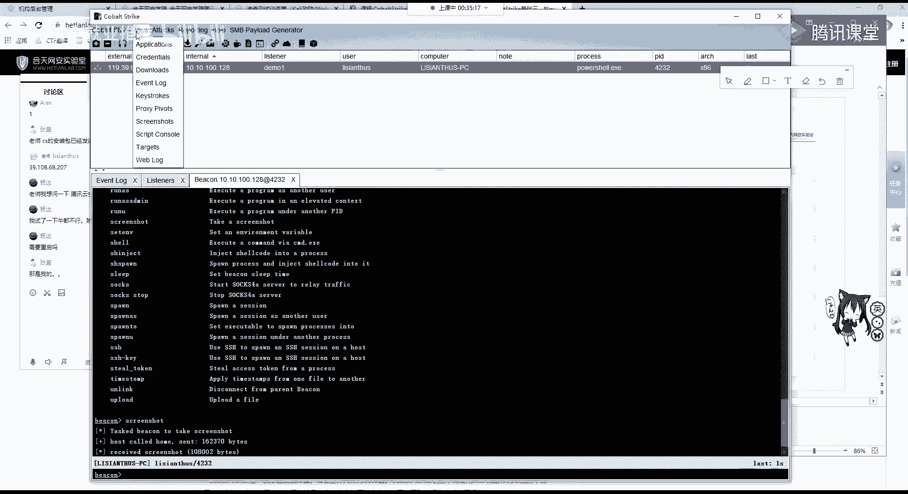

这个屏幕截图，ok我们点击，是不是把那个把这个桌面给截了一下，截了一下，那他也可以做诶，端口扫描，端口扫描也可以，就是查看进程，这是靶机上运行的进程，可以进行文件的管理啊，文件的管理。

这里就大家应该都清楚，那同样也可以进行一个端口扫描，再点击端口扫描之后，它会自动识别，我们把g的两个网卡所对应的ip的c段，可以看到我是有两个网卡，8。123网段的，那这个时候我们可以选择一个内网网段。

进行一个扫描，因为我们还想探测内网中时，是否有其他的一些机器可以进行一个扫描，那这里他因为特别慢，就不给大家去等待了，同样我们可以使用其他的监听器或者是attack，进行一个主题上线。

比如使用我们的cript web delivery，在这里同样也需要开启端口，因为9090我们已经占用了这里，我设置90911，它也需要去设置我们的pload，也就是监听器，我们所有的操作都是以监听器。

也就是cs服务端上面的一个端口进行操作，发送stage或其他的命令，下面同样也是选择beds，admin是windows操作系统自带的下载程序和power shell，python大家应该都很清楚吧。

那这里如果是power shell进行生成的话，它就会生成这个命令，那我们再把基的运行里面去运行这条命令，就会达到同样的效果，让靶机上线，那如何删除我们开启的这些东西呢，可以点击这个叫。

manage web server或者是attack web drive by manager，来到的都是同一个页面，这里就可以看到我们开启的9091端口。

那一个power shell web delivery的一个下载一个远程端口，hti html application的9090端口，那在这里下面我们可以点击copy u i l。

进行一个copy过来啊，这里可以copy过来啊，直接copy过来啊，这边如果你没在设置的时候没有copy，就点这里就可以copy过来了，然后我们如果想关掉它的话，直接点下面的q就把它给关掉了。

ok那这里我就讲到这里，那我们可以在下面看到，这一个端口已经扫描完成，在扫描完成之后，我们可以在view上面进行切换视图，或者直接使用我们三个这个命令。

分别是show sessions和show table，view和target well，首先我们可以看到这个一个逻辑视图，第二个是我们把其上限的目标，第三个是tx，可以看到他发现了啊。

这个是刚刚同学的这个机器啊，可以看到这个129，也就是我们上线的这个机器，它所在的ip地址还有129，它是一个在的内网地址，还有一个135。

那1235是哪一个机器呢，就是我搭建的这个windows server。

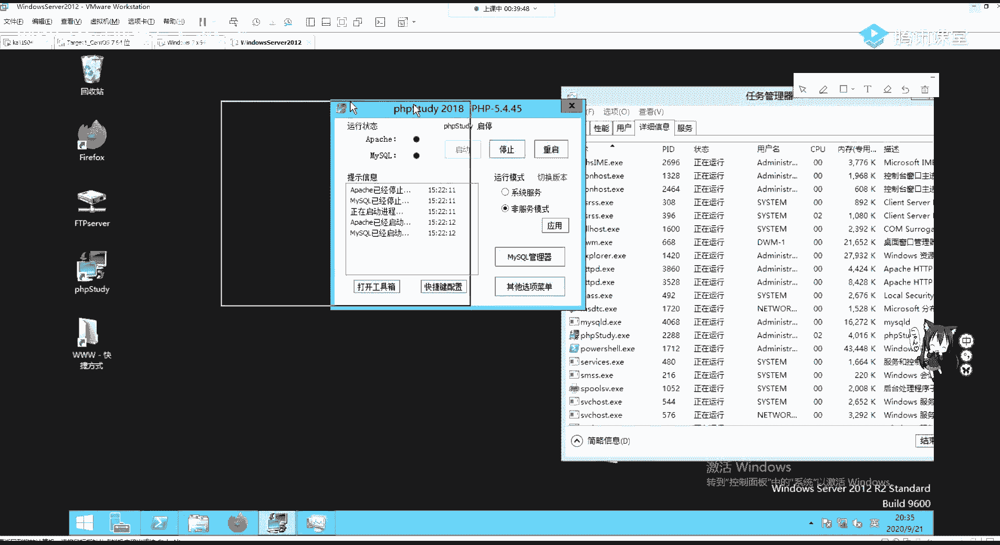

2012它是不通外网的，它是不通外网的。

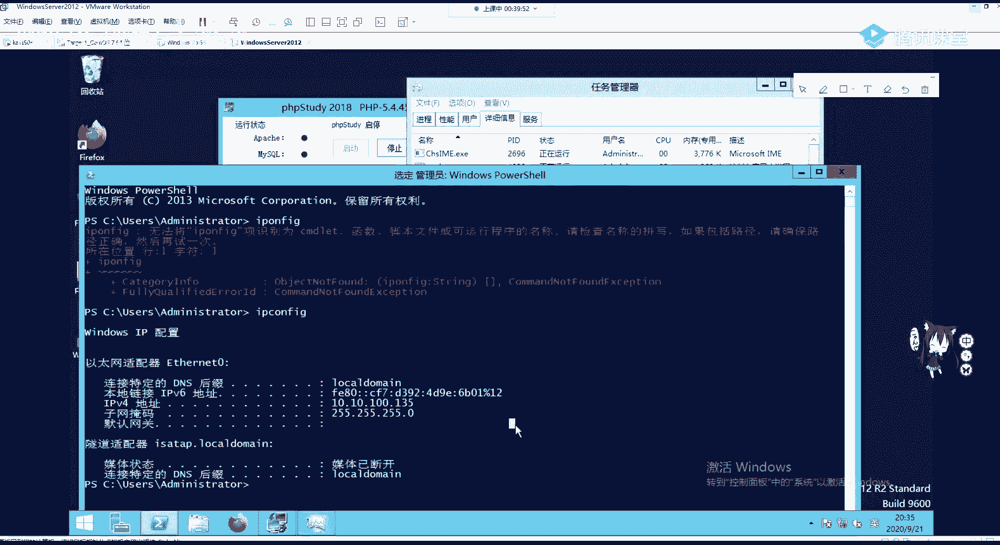

它是内网的一个服务器，那我们同时也可以把它扫出来，把它扫出来。

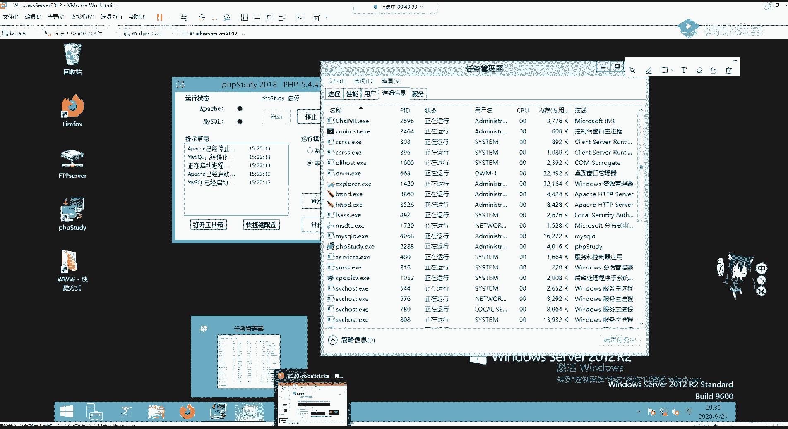

那我们可以在target的这个结果中去。

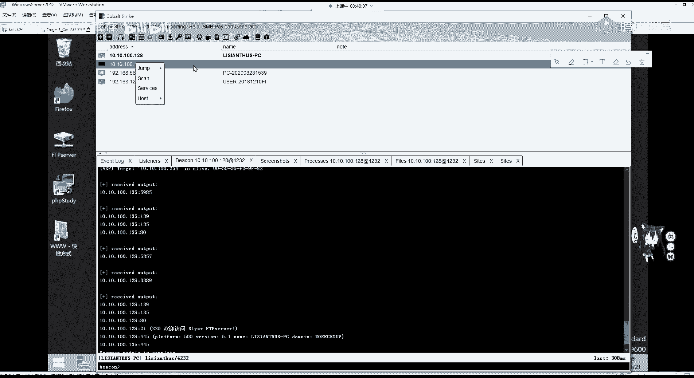

右键点击survive the vs查看服务，可以查看开启了801235445，我们可以考虑是否有嗯，ms 17010或是其他的漏洞，啊这里啊给大家就讲到这儿，那也没什么啊。

可以就是进行一个后渗透模块嘛，这里想给大家进行一个概括，完是嗯要花很长时间，就像一键和冰箱一样，还有很多功能，大家可以摸索着自己去玩，又不会把它玩坏，当然你不要拿真正的机器去去搞这个东西。

如果没有授权的话，千万不要动用metadata和coo strike，这两个渗透测试框架，因为它是渗透测试框架，它里面有很多集成的工具，会不停的发包和留后门，或者是改写注册表。

你对未授权的机器进行了修改，增删改查，这个有可能会违反网络安全法，这个你需要动用他们两个渗透测试框架，就是在工作的时候被授权渗透渗透测试再用，ok那我们可以使用监听器进行一个445网段。

或者是指定一个端口，或者是对一个网段进行扫描，在一开始就给大家讲，cs支持扩展端拓展关端口支持拓展这个脚本，那他的脚本大家可以去github上面进行一个搜索，好特别非常简单。

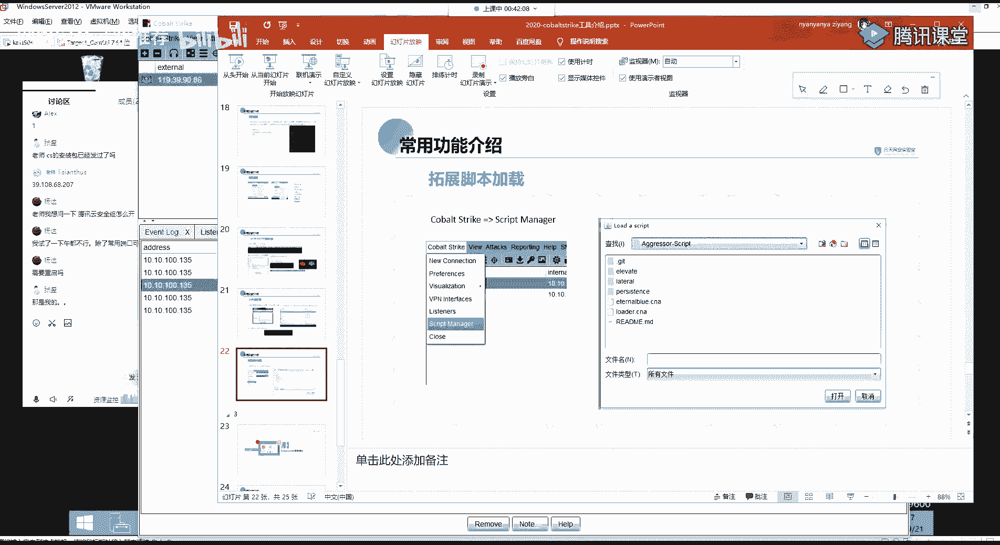

安装它，那就直接使用我们的coopa riker，然后cript脚本manager。

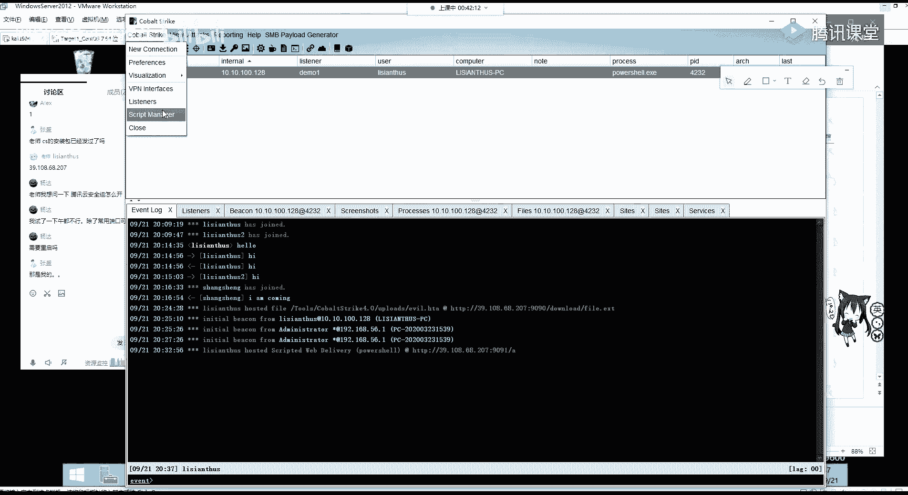

脚本管理，然后点击load加载，还有unload，取消加载，reload，重新加载load，然后选择我们的一个cni的一个路径啊，这里我会到时候会发给大家一个，大家如果没有的话。

可以去啊去把这个cn i进行导入进来，直接打开之后，他会告诉我们已经导入过后，如果导入成功，在ready这个来这个列会显示对号，这里给大家做一个简单的cs的一个实战演示。

那它攻击流程和mata split是一样的，因为我说过，在三点版本之前还是没有和msf进行分开的，那它的攻击流程也非常简单，首先就是创建我们的监听器listener，第二步呢去设置attack。

选择攻击的方式，使用html application也好，使用web delivery或者是office红都行，第三呢寻找靶机漏洞执行命令，因为我们不论是使用哪一种attack攻击方式。

都是生成一串python脚本，power shell脚本，shell code或者是其他应用程序，那我们需要在靶机上面执行这条命令，就是要寻找靶机的漏洞进行命令执行。

或者是在靶机上上传web shell，拿到靶机的web shell之后，在web web shell管理工具里面执行相应的漏洞，当我们执行命令之后，就会把靶机就会上线，当靶机上线之后。

我们一般获得的权限，就是执行命令的这一个权限，它一般是像windows操作系统，一般是已经登录的用户，linux操作系统，它的权限就比较低，我们需要对靶机进行提权，提权之后。

windows操作系统我们会拿到system权限，linux操作系统我们会拿到root权限，拿到权限之后，我们可以对内网进行后渗透，包括内网的信息收集，比如端口的扫描，c端的扫描，内网的一些代理配置。

然后就可以进行更一步的扩大战果，比如使用s m b bacon进行批量带出内网，机器是内网横向移动，在这后面我们都会进行讲，那我们现在就举一个例子啊，举个例子。

所以我还是这个机器，最简单的还是dv w a还是d v w啊，就给大家演示一遍，过一下流程吧，过一下流程，首先访问我们的机器131192。16，8。123点，131是131嗯，131对的。

然后去访问下面的dvw，我已经装好了，大家如果有疑问的话，包括这些同学有说对web漏洞不是太了解，可以去自己装一个ph study，然后装dv w p i，dv w。

上面就基本上概括了ow s p top 10的web漏洞，而且这里可以自己去设置一个啊难度，比如进行一个等级的切换，look mu high和impossible进行切换之后。

可以来到comment injection，叫做命令注入或者是爆破文件，包含文件上传，sql注入，sql盲注，还有三种类型的查丝丝，在这里我们还可以view source进行一个查看，查看它的后台代码。

可以查看所有的通常啊低级的事就是没有防护，而告中级的呢是黑名单，高级的呢是更强的黑名单，然后impossible一般是使用白名单防护啊，大家可以自己去看，那这里还是老规矩，我们可以使用一个127点点0。

1，去加上我们的who m i，它会执行后面的命令，那这里和之前讲的msf就是就是一样了，就一样了，那我们来看一下，在这边是生成我们的，生成我们的一个类似一个，这里我先给它关掉east。

然后把它给remove。

这里在监听器我们已经生成过了，就用它了，用它之后我们要干什么，要生成tt，这里就以web deliver为例，然后我们点击生成，选择我们的listen，然后开启一个端口。

这里还有909090909090，开启过了9091，开启我们的python或者是powershell，这就ppower shell为例，当我们把机上装有passing的话。

可以开启python的一个web delivery，这里是不会在服务器上留下文件的，所以它比较安全，那这里我们生成了这个东西，刚刚你的那个那个不会上线了，那重启就不会上线了，你想让它重启上线的话。

你需要植入后门，他后面应都会讲，就是如何去往注册表里面去，写一些开机启动的一些脚本。

你想让它关掉，很简单呀。

因为你这边实则就像我们刚刚看到的这个，我开启的啊，9091端口，我们copy ui，我看一下我发的这这里看到没，是执行了我们的power shell，那它在后台。

你在任务管理器肯定会看到一个power shell，点e passing的话，他也是执行去调用power shell啊，你可以把它给关掉，这个主机就下线了，那我们来看一下，我把这个url copy过来。

然后和这里进行一个命令执行，把它粘到这个whom i处，submit提交，还等待他这边把机会不会上线。

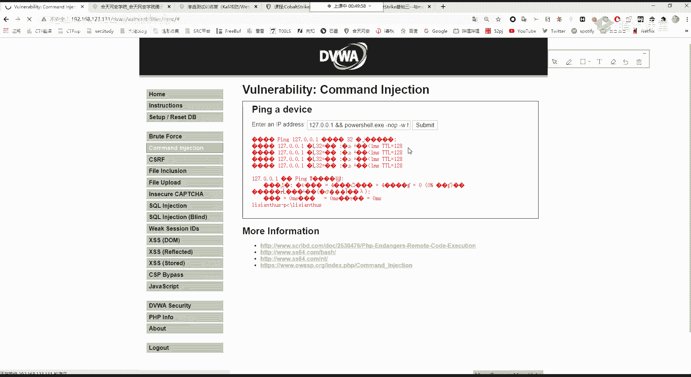

啊因为他去连公网去发送stage包，是需要一段时间的，ok我们可以看到靶机上线，那这里，我执行的是east退出对，因为退出是我们服务端把它退出了吗，list remove和服务端。

你如果直接remove的话，它是会再上线的，你需要先east先退出这个进程，然后再remove，他就不会再上线了，那这个时候这个靶机上线了，大家有没有问题，这个整个过程没有问题的话，那有问题也等一下吧。

我们先把这一堂节课下课，那我们开启下一节课，就是如何让cs和m s两个渗透测试神器，进行互相的连接和交互，那这一节课我们先到这里，大家可以去休息五分钟，我们50准时进入下一节课，hello。

大家能听到吗，麦克风声音是正常的，ok那我们大家休息几分钟，我们马上后面开始讲，继续讲，那个时候，对啊，之前是有电风扇的声音的，我换设备了，大家如果有问题的话，随时可以在讨论区提问啊，或者是课后的时候。

如果有问题，比如装不上哪个地方把机没有办法上线，可以在群里问，或者是私聊我进行问都行，当然也可以自行百度或谷歌解决。

这个打击上限的方法大家应该知道吧，一种是刚刚我测试的这个命令，执行或者是文件上传，上传web shell，然后在一键或者是拼写里面，或者是菜刀进行执行这个命令，想要这个命令得到了执行，并且有权限执行。

就是没有报错，那这个靶机是能够上线的，那大家一定要注意，如果是cs是在内网中的，你要确定cs一定要能够连到把垃圾啊。

