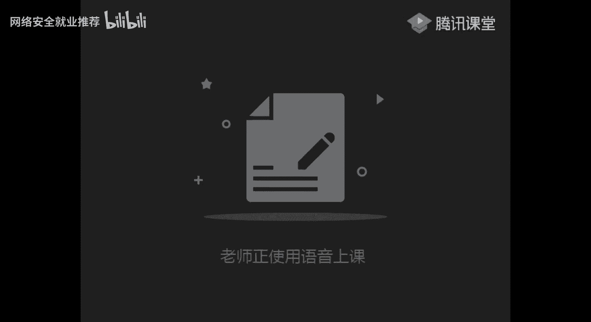


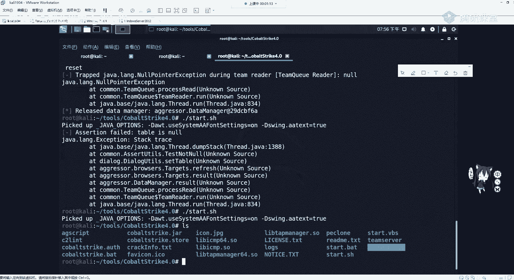


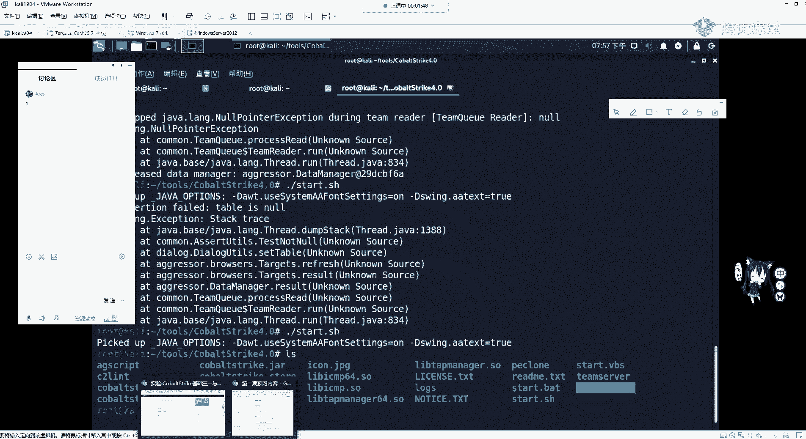

# 课程P52：第16天：CobaltStrike渗透基础 🛠️

在本节课中，我们将要学习CobaltStrike（简称CS）这一强大的渗透测试框架。我们将从CS的简介和基本概念开始，逐步学习其安装、配置、核心功能，并通过实战演示让靶机上线，掌握其基本工作流程。

## 什么是CobaltStrike？ 🤔

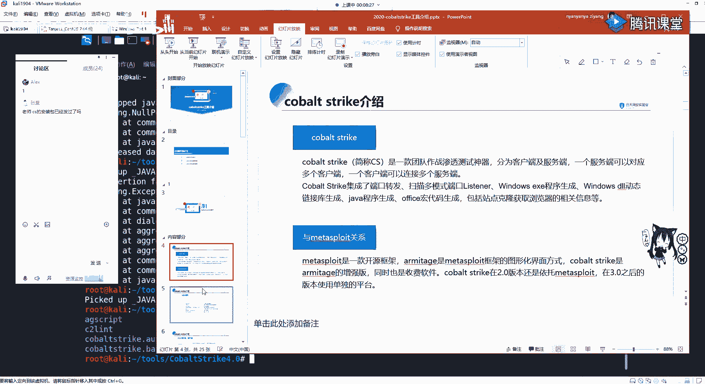

CobaltStrike（简称CS）是一款团队作战渗透测试神器。它分为客户端及服务端，服务端可以对应多个客户端，而一个客户端又可以连接多个服务端。CS集成了渗透测试中经常使用的功能，包括端口转发、扫描、多模式端口监听、生成各类可执行程序（如Windows可执行程序、动态链接库、Java应用程序、Office宏代码）等。同时，它也能帮助我们克隆浏览器相关信息、克隆钓鱼网站等。

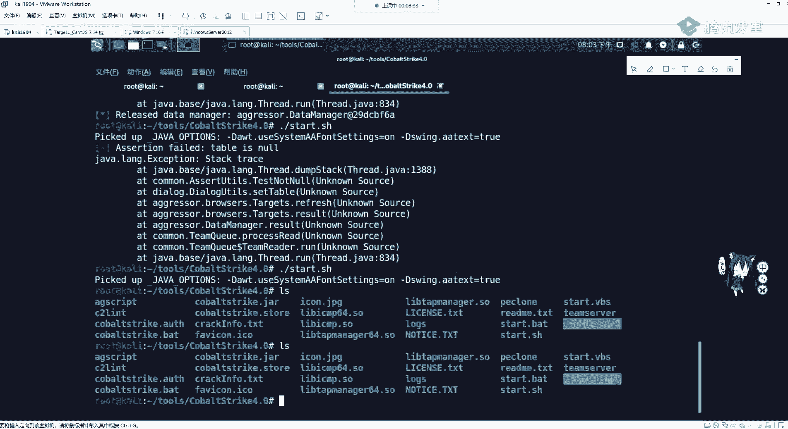

CobaltStrike经常与Metasploit进行联动，因为两者都是优秀的渗透测试框架，联动使用能大幅提升渗透测试效率。CS与MSF在历史上有关联：MSF是一款开源框架，其图形化界面Armitage可以看作是CS的早期版本。CS是Armitage的增强版，并且是商业收费软件。CS 2.x版本还依托于MSF框架的Armitage，但从3.x版本开始，CS已成为独立的平台。本教程以CS 4.x版本为准。

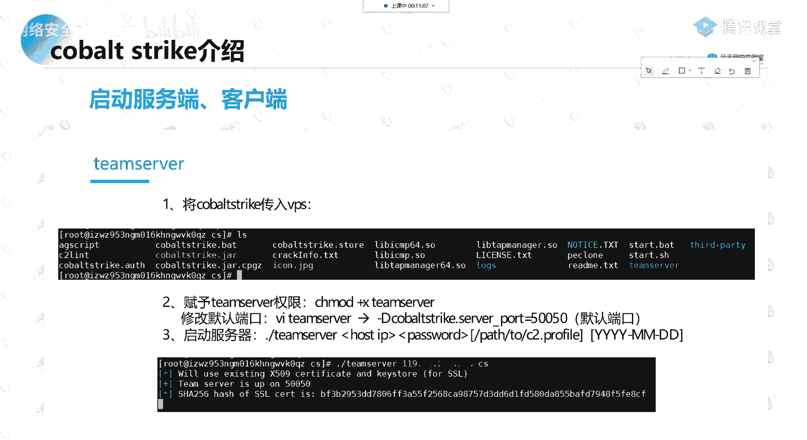

## 环境安装与配置 ⚙️

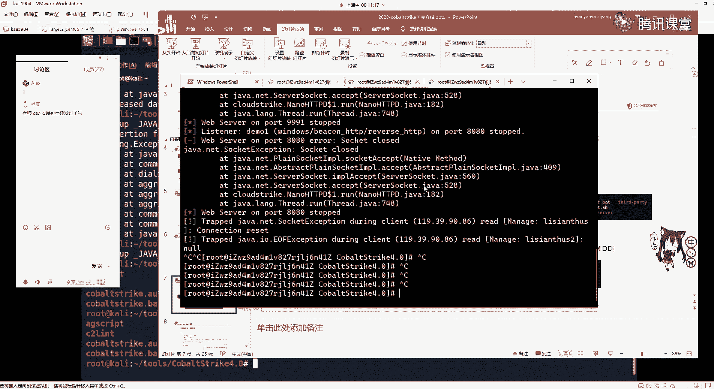


上一节我们介绍了CS的基本概念，本节中我们来看看如何安装和配置CS的运行环境。

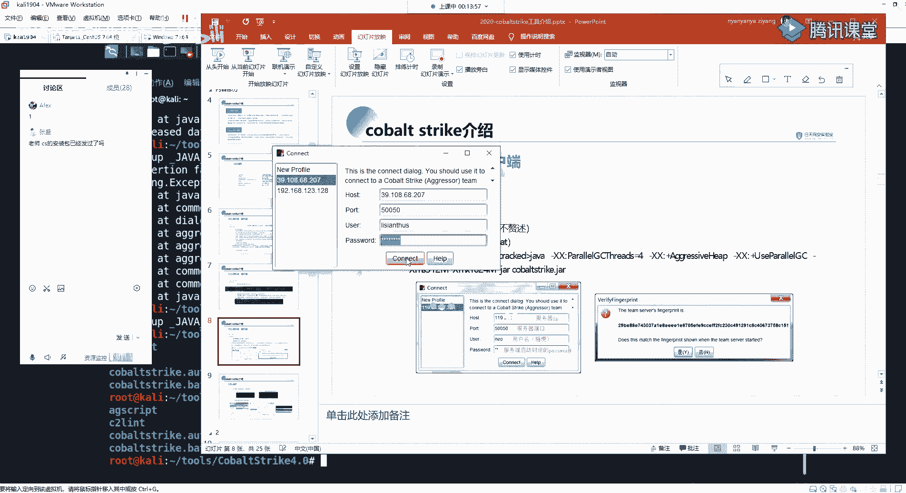


CS的服务端只能运行在Linux操作系统上，并且需要安装Java环境。如果使用Kali Linux，Java环境通常已预装。如果是自己购买的VPS服务器，可能需要手动安装Java。

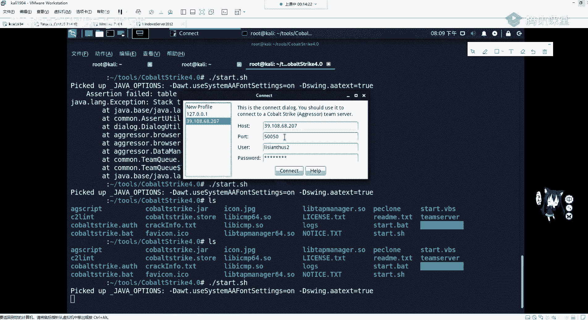

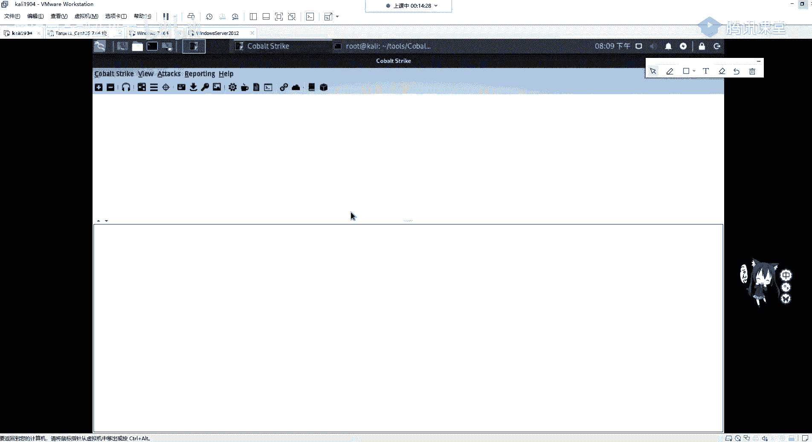

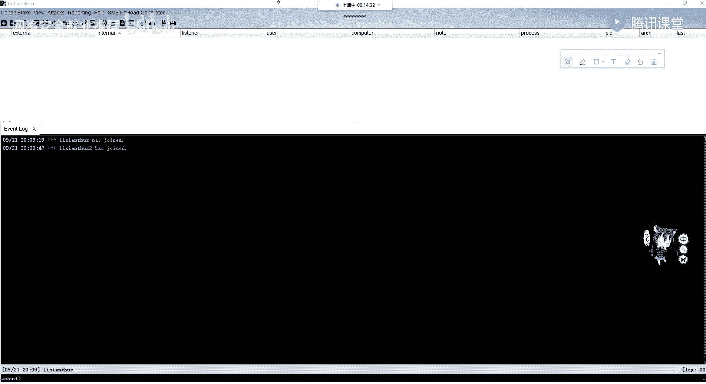

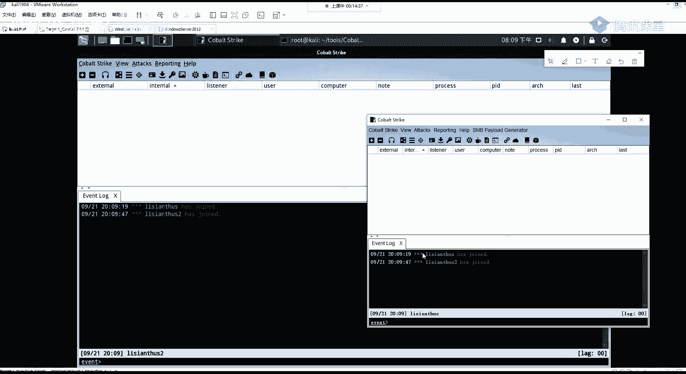


以下是安装Java环境的基本命令（以CentOS为例）：
```bash
yum install -y java-8*
```

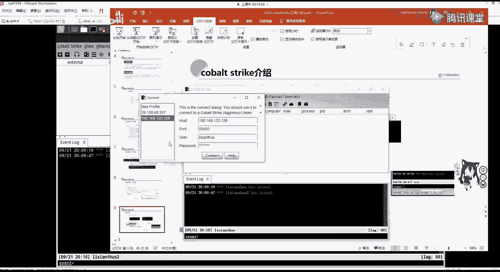

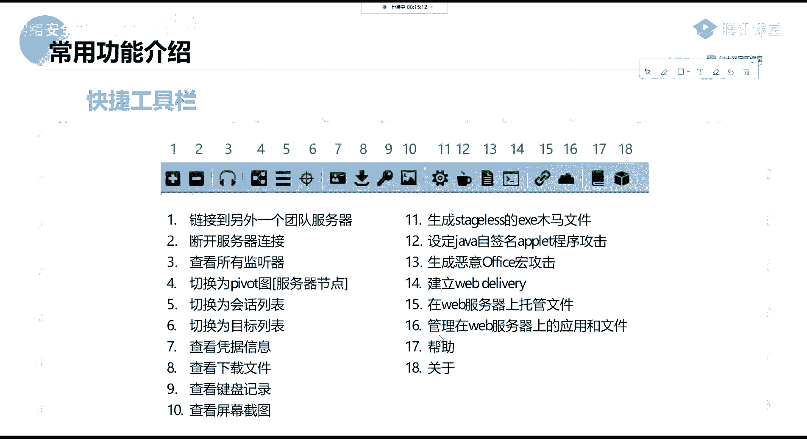

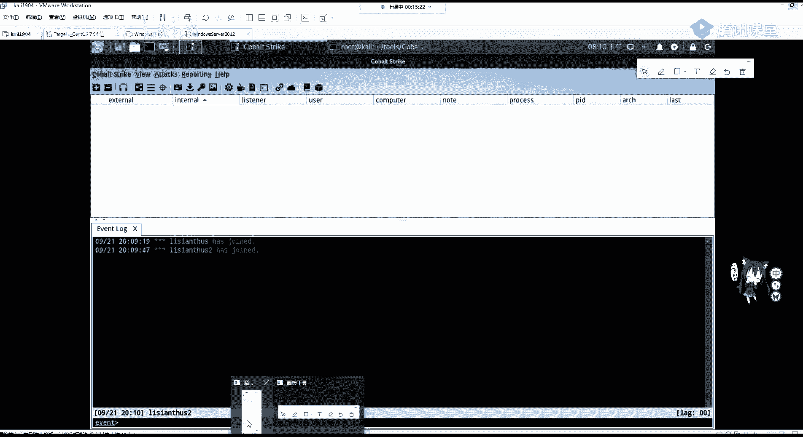

安装好Java后，需要将整个CobaltStrike文件夹上传到公网服务器上，并给服务端程序`teamserver`设置可执行权限。

以下是设置权限和查看脚本内容的命令：
```bash
chmod +x teamserver
cat teamserver
```


`teamserver`是一个bash脚本，我们可以修改其默认监听端口（默认为50050）。启动服务端的命令格式为：
```bash
./teamserver <服务器公网IP> <连接密码>
```


客户端程序则可以在本地运行。在CS 4.x文件夹中，有适用于Windows的`.bat`文件和适用于Linux的`.sh`脚本。运行客户端后，输入服务器IP、端口（默认50050）、任意用户名和在服务端设置的密码即可连接。

## CobaltStrike核心界面与功能 🖥️

成功连接服务端后，我们就进入了CS的客户端界面。本节我们来熟悉其核心界面和常用功能。

CS的快捷工具栏分为几大类，以下是其主要功能简介：
*   **连接/断开服务器**：对应图标1和2。
*   **监听器管理**：图标3，用于查看和创建监听器（Listener），这是所有操作的基础。
*   **视图切换**：图标4-6，分别对应服务器节点视图、会话列表视图和目标列表视图。
*   **信息查看**：图标7-10，用于查看已获得的凭据、下载的文件、键盘记录和屏幕截图。
*   **攻击模块**：图标11-18，用于生成各类Payload、进行Web投递、管理Web服务等。

**注意**：所有操作都始于创建监听器。没有监听器，我们无法接收靶机的回连。

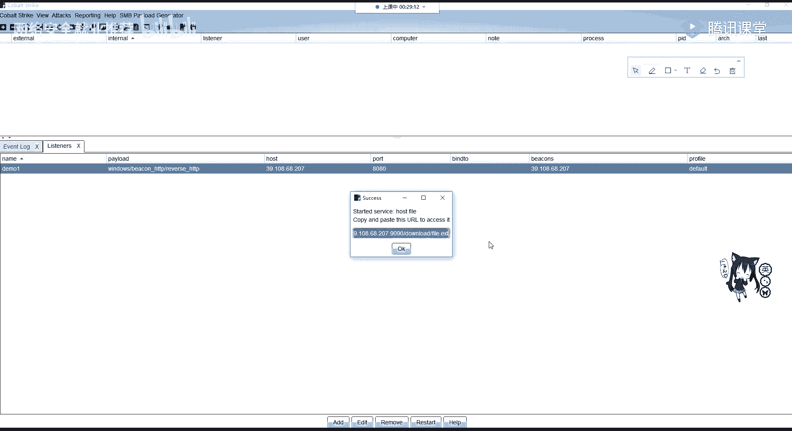

在团队协作时，可以通过界面中的聊天窗口进行通信，也可以使用`/msg`命令私聊。


## 实战：创建监听器与生成攻击载荷 🎯


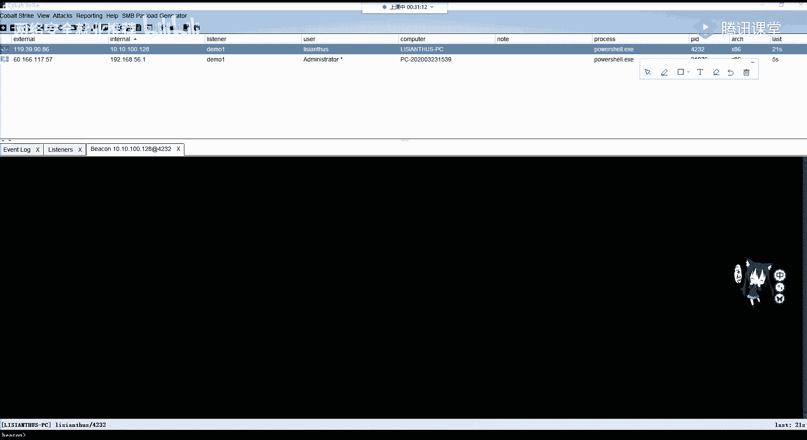


了解了核心功能后，本节我们开始实战操作，学习如何创建监听器并生成攻击载荷。


首先，我们需要创建一个监听器。点击 `Cobalt Strike` -> `Listeners`，然后点击 `Add`。
*   **Name**： 输入任意名称，例如 `demo1`。
*   **Payload**： 选择 `windows/beacon_http/reverse_http`（这是一个常用的HTTP反向连接Payload）。
*   **Payload Options**：
    *   `HTTP Host (Stager)`： 设置为你的公网服务器IP地址。这是用于传输初始Stager的地址。
    *   `HTTP Port`： 设置监听端口，例如 `8080`（避免使用80等常用端口）。
设置完成后点击 `Save`，监听器就创建并启动了。你可以在服务器上使用 `netstat -tulnp` 命令验证8080端口是否在监听。


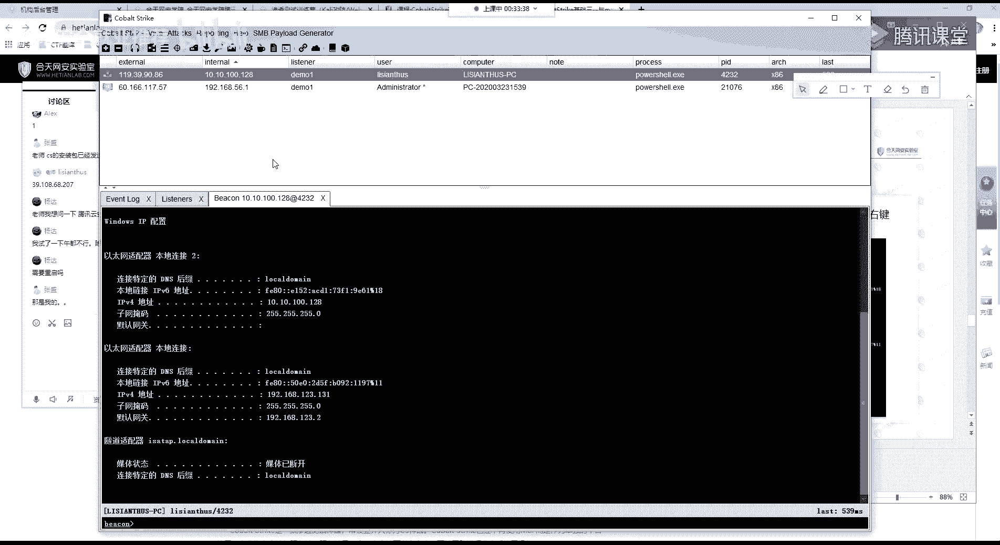

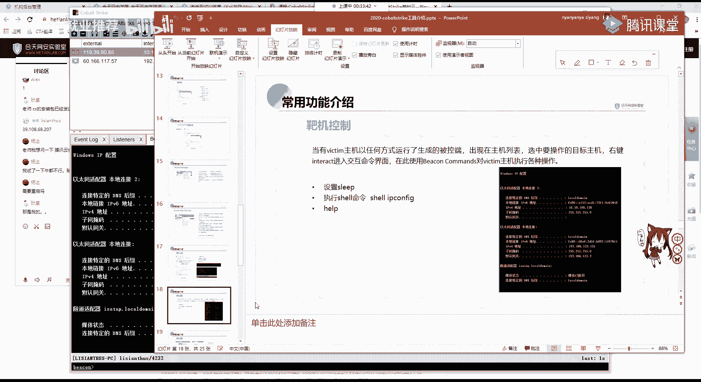

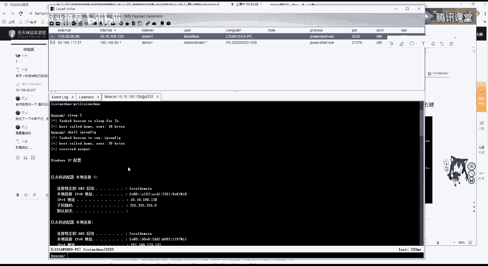


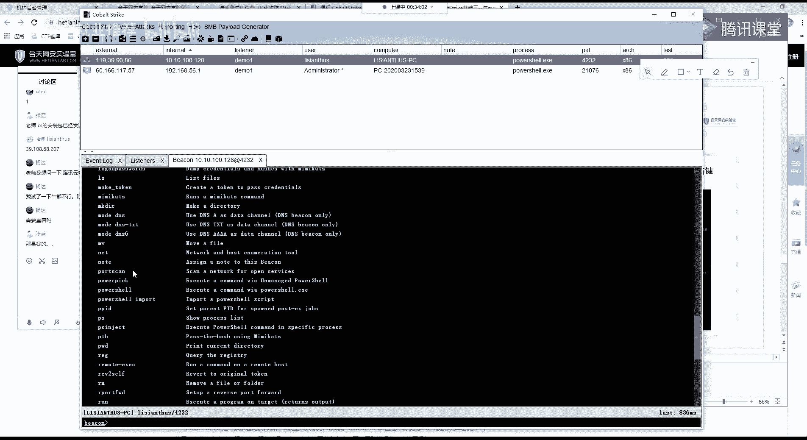

接下来，我们需要生成一个能让靶机执行并连接上来的攻击载荷。点击 `Attacks` -> `Packages` -> `HTML Application`。
*   选择刚才创建的监听器（如 `demo1`）。
*   选择执行方法，例如 `PowerShell`。
*   选择一个路径保存生成的 `.hta` 文件。

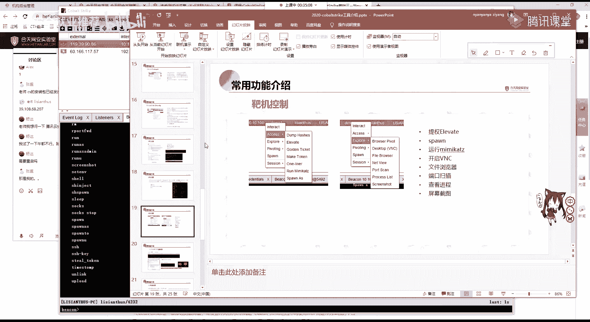


为了让靶机能下载到这个 `.hta` 文件，我们需要在服务器上托管它。点击 `Attacks` -> `Web Drive-by` -> `Host File`。
*   选择刚才生成的 `.hta` 文件。
*   `Local Port`： 设置一个端口用于提供下载，例如 `9090`。
点击 `Launch`，CS会生成一个URL，例如 `http://你的服务器IP:9090/xxx.hta`。这个URL就是提供给靶机访问的链接。

## 实战：让靶机上线与基本交互 🖱️

攻击载荷和下载服务都已就绪，本节我们来看看如何让靶机执行载荷并与之进行交互。

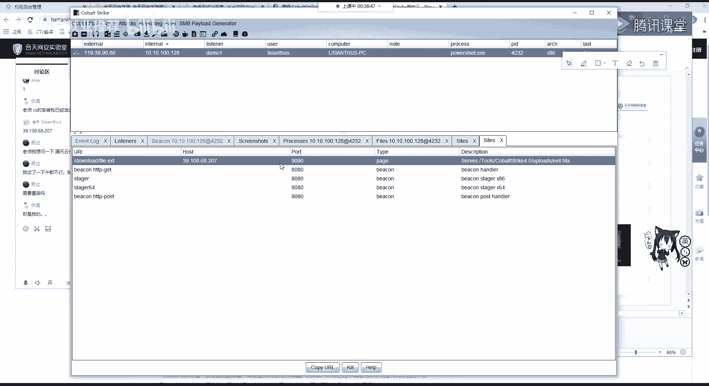

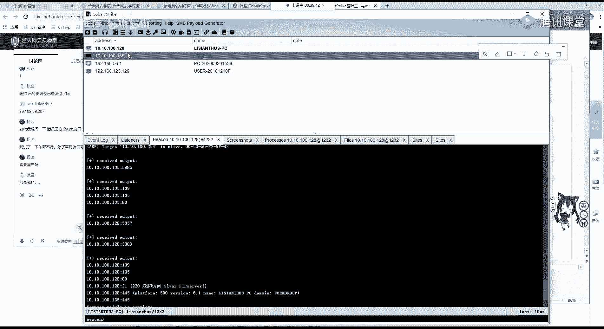

在靶机（例如一台Windows虚拟机）上，访问我们上一步生成的URL（`http://服务器IP:9090/xxx.hta`）。执行后，稍等片刻，在CS客户端的 `Sessions` 视图下，就能看到一个新的会话上线，这代表靶机已被成功控制。


右键点击上线的靶机，选择 `Interact`，即可打开交互式命令行界面。在这个界面中，我们可以输入各种Beacon命令来控制靶机。


以下是一些常用命令示例：
*   `shell whoami`： 执行系统命令，查看当前用户。
*   `sleep 2`： 将心跳间隔设置为2秒（默认60秒，设置更短可以加快响应，但可能增加被检测的风险）。
*   `help`： 查看所有可用的Beacon命令。

除了命令行，还可以通过右键菜单进行更多操作，例如：
*   `Access` -> `Dump Hashes`： 尝试提取密码哈希。
*   `Explore` -> `Process List`： 查看靶机进程列表。
*   `Explore` -> `Screenshot`： 对靶机进行屏幕截图。截图后可以在 `View` -> `Screenshots` 中查看。
*   `Explore` -> `Port Scan`： 对靶机所在内网进行端口扫描。

## 攻击流程总结与拓展 🧭

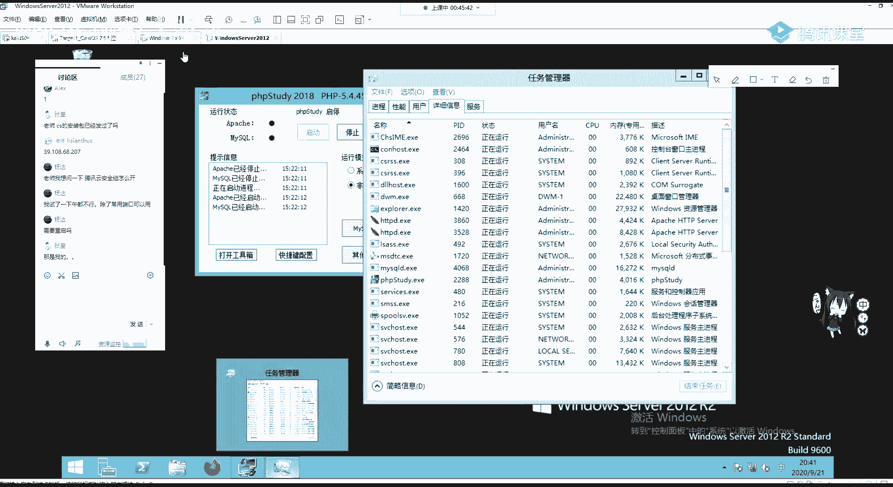

在本节课的最后，我们一起总结一下使用CobaltStrike进行渗透测试的基本流程，并了解一些拓展知识。

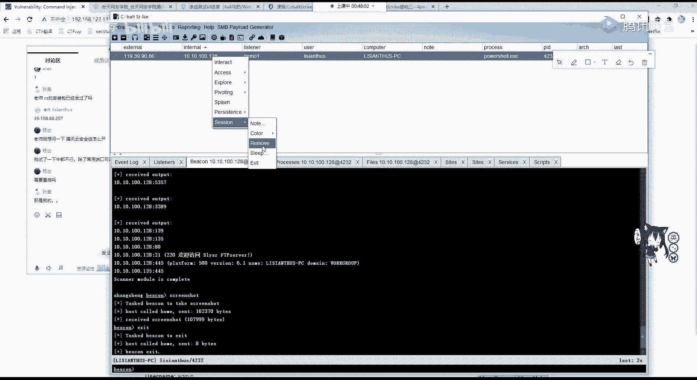

CS的攻击流程与Metasploit类似，可以概括为以下几步：
1.  **创建监听器（Listener）**： 在CS服务端开启一个端口，等待靶机连接。
2.  **生成并投递攻击载荷（Payload）**： 根据目标环境，选择 `HTML Application`、`Scripted Web Delivery`、`Office Macro` 等方式生成载荷，并通过漏洞利用、社会工程学等方法让靶机执行。
3.  **靶机上线**： 靶机执行载荷后，会主动连接我们的监听器，在CS中建立会话（Session）。
4.  **后渗透操作**： 进行信息收集、权限提升、横向移动、持久化控制等操作。

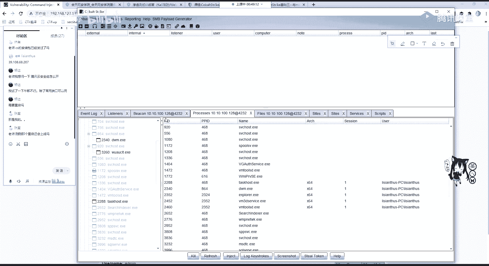

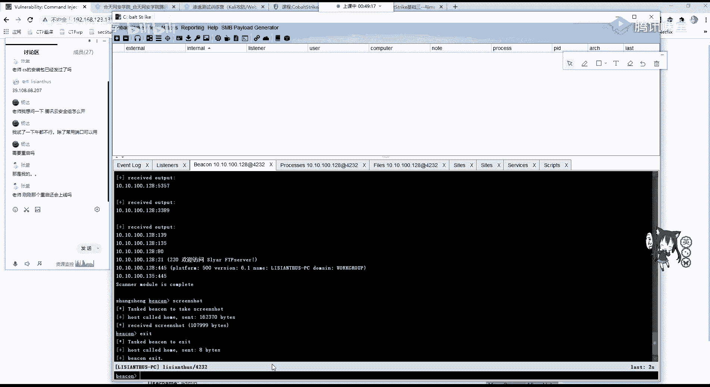

CS支持通过 `.cna` 脚本进行功能扩展。你可以从GitHub等平台下载丰富的第三方脚本，通过 `Cobalt Strike` -> `Script Manager` 加载，以增加扫描、漏洞利用、后渗透模块等功能。


**重要提醒**： CobaltStrike是专业的渗透测试工具，仅限在合法授权和安全的学习环境中使用。未经授权对他人系统进行测试或攻击是违法行为。

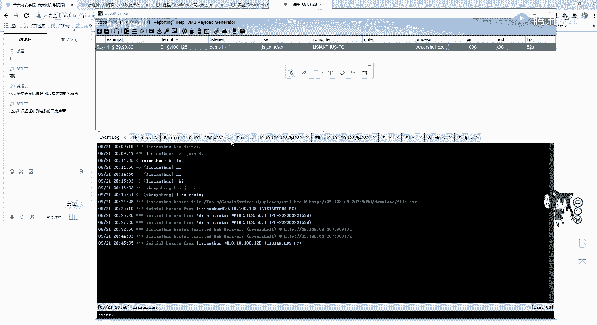

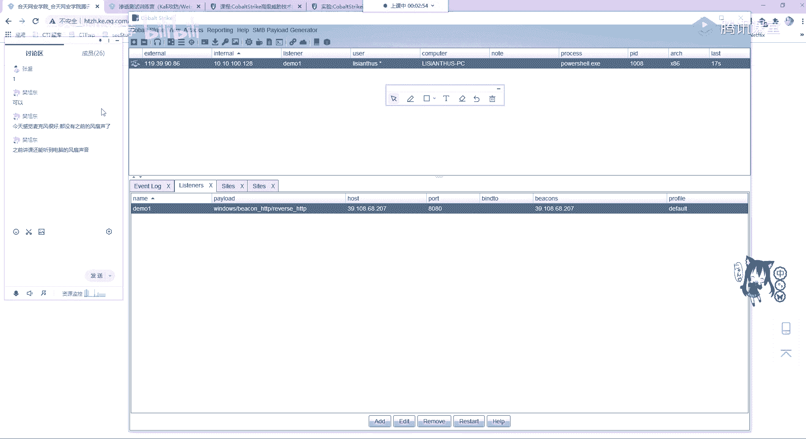

本节课中我们一起学习了CobaltStrike的基本介绍、环境搭建、核心功能、以及通过生成HTA载荷让靶机上线的完整流程。掌握这个基础框架，将为后续学习更复杂的渗透测试技术打下坚实的基础。