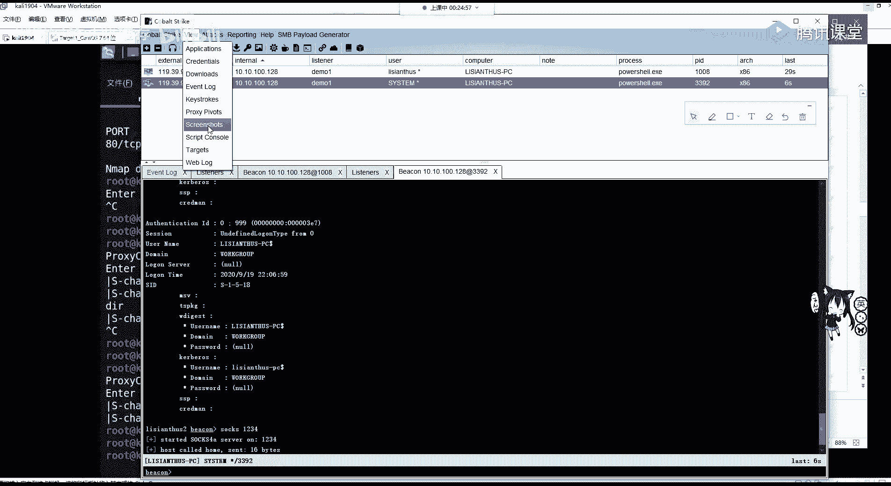
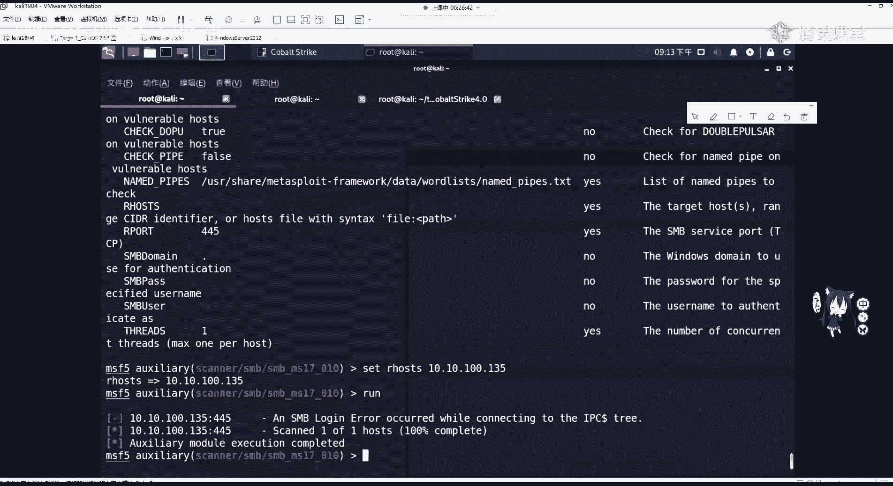
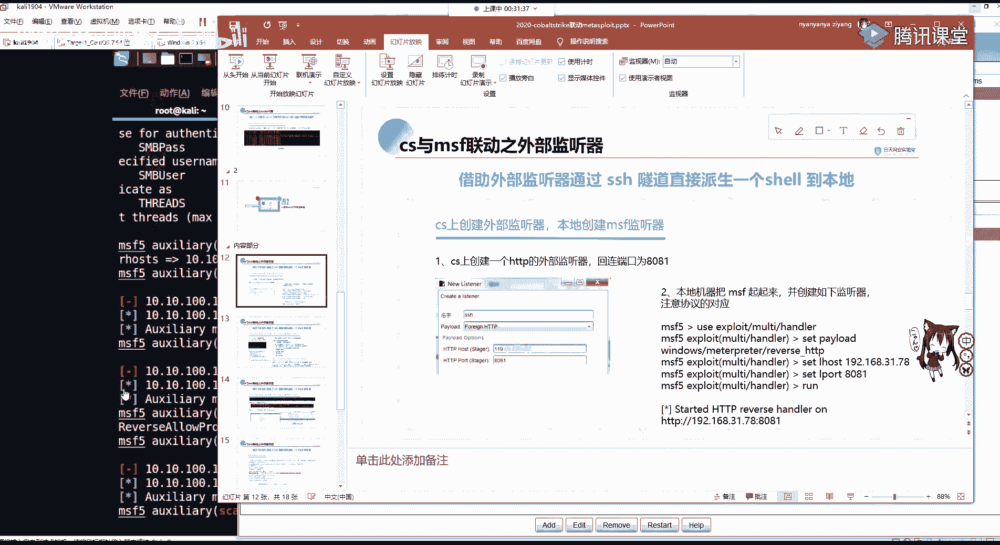
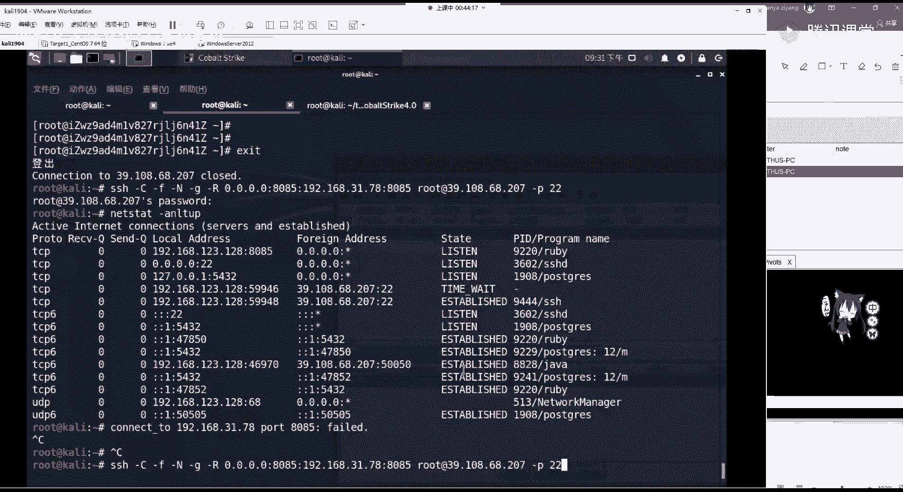

# P53：第17天：CobaltStrike联动Metasploit - 网络安全就业推荐 - BV1Zu411s79i

hello，大家能听到吗，麦克风声音是正常的，ok那我们大家休息几分钟，我们马上后面开始讲，继续讲，这怎么挂。

有时候。

对啊，之前是有电风扇的声音的，我换设备了，大家如果有问题的话，随时可以在讨论区提问啊，或者是课后的时候，如果有问题，比如装不上哪个地方把机没有办法上线，可以在群里问，或者是私聊我进行问都行。

当然也可以自行百度或谷歌解决。

这个靶机上线的方法大家应该知道吧，一种是刚刚我测试的这个命令，执行或者是文件上传，上传web shell，然后在一键或者是拼写里面，或者是菜刀进行执行这个命令，只要这个命令得到了执行，并且有权限执行。

就是没有报错，那这个靶机是能够上线的，那大家一定要注意，如果是cs是在内网中的，你要确定cs一定要能够连到把垃圾，而不是是靶机，一定能够连到cs才能够上线，那cs也一定要能够连到靶机。

因为它需要进行一个stage的发送，应该是应该是那，好像要同，再等一分钟嗯，大家有可能其实倒水还没回来，再等一分钟，我们继续来讲，ok那我们继续讲，当拿到靶机shell之后，是不是就是来到了第四步。

把鸡上线，白上线，我们拿到的是什么权限啊，这里也告诉我们了，你的user是一个普通用户。

我们可以进入每个交互进行看一下，首先嗯设置sleep 2，因为默认60是比较慢的好，这里上节课大家听懂了吗，如果没有听懂的话，没有听懂的话，你扣一下二啊，如果没有听懂，或者是是哪里没有听懂呢。

为它这边设置嗯，sleep，还有一段时间，你可以问一下你的问题，设置监听器啊，设置监听器就是在coo strike，怎么发言违规，仅老师可见这个监听器被违规的。

这个只有我能看到，那你这个listener在这个点击listener这里，没问题啊，没问题，那我们去点击add是添加edit编辑remove，移除restart，从一开始点击editor之后。

这就相当于什么bin，http相当于什么，我告诉我这样告诉你应该就知道了，那msf还记得吧，它就相当于我们的这个东西，windows matter preter。

r e v e r s e http就相当于他这个东西，那我们拿到它之后，是不是show options一下，说options我们可是需要设置什么，是需要设置我们l host和airport。

l host airport是不是在我们机器上开启监听的端口，那l host是哪里呢，就是我们的http host，那airport是哪里呢，就是http port，就是你在服务器上开启的监听。

这里能够理解了吧，能不能理解了吧，这windows我打错了手套，ok那这里端口你可以随便设置，这无所谓啊，无所谓，如果你在嗯老版本的这个老版本的这个里面，你会看到一个，会看到一个这样的一个tcp啊。

它也是一样的，因为我们在讲msf的话，经常用这个东西。

它是一样的，那我们拿到这个d d权限，我们可以进行一下，我直接输ip cfer是不行的哈，要用嗯，是你输的呀，啊是这个同学说的，你不能直接说ip防k旁configur，你去执行shell命令。

你要在前面加个shell shell lp configur啊，这里是不是就好了，那你可以试一下，反正你是能连接到这里了，你可以再试一下，这没问题的，你随便摆弄它，那我们拿到这个地方。

可以看到who m i进去看一下，它是一个低权限的用户，那我们如何进行一个提权呢，也就是access一个提权，一一连外，提前之后，我们还是要选择监听器，也就是listener。

还是选择我们刚刚创建的demo 1 choose，选择我们需要攻击的一个脚本，大家可以看到自己的有可能只有s v c和ui，c token，那这里就我装了一个拓展，那这个拓展我会发给大家。

这里我比如选择m s16135 进行rush，它会自动的把这个脚本攻击脚本给打出去，我们来看它记住，如果在这个啊，ok他已经他已经告诉我们success，并且上线了第二个机器。

第二个机器和我们第一个机器是ip是一样的，说明是同一个机器，它的区别就是user变成了system，我们可以interact设置它的sleep为二，记住啊是一个session。

一个把机设置一个sleep，设置之后啊，这个可以在这边看清楚地看到，是不是两个用户是不一样的啊，两个用户是不一样的，一个system的，一个普通的用户，那我们拿到它的一个最高权限之后。

就可以运行其他的一些命令，alexcess里面的，这里等我们把这个两秒给设置好，这个两秒设置好之后，我们再记住，一定要选择这个system，可以看里面有一个hash dump，dump hashes。

或使用命令hash dump，会从我们的nt这个服务器里面读取，读取用户的一个哈希值，也可以去把mini卡test这个软件去运行起来，也就是使用log log on passwords。

他会去我们内存中去读取，我们来看读取的结果，有没有把密码读取读取的，ok他已经读取到我们的一个任一个凭证，也就是这个用户他的密码是123456。

那确实我这个win 7的，它的密码就是123456，就是123456，那这里给大家看是不是开启了power share啊，有这个东西啊，因为这个power share开启的呢。

那我们把这个power show给干掉，那这边就断掉了，就断掉了，当然你可以把进程迁移。

进程千亿可以利用msf，那这里就给大家讲，当然它还有其他的一些操作，让大家都去自己去看一下就行，那这里就给大家继续讲第二节课嗯，如何和msf进行联动，如何进行联动。

发动态，在联动我分别讲两个，分别是在一开始讲的listener，有一个外部监听器，或者是使用cobe stract开启socks代理，socks是外国防火墙穿透代理。

像我们访问内网或者是无法访问的服务器，可以通过socks建立代理，然后就能访问到无法访问的机器了，同样啊这些都可以，首先我们来看这个socks代理，cs和m s f各有所长，cs更适合作为尾控平台。

m s适合用内网收集信息及漏洞利用，大家要知道matter brate的功能是十分强大的，大家应该有所体会，而且msf的模块非常的多，包括辅助模块，攻击模块，编码模块等等，而cs它就非常少了。

但是我们可以利用cs进行团队合作，进行一个主机的上限和sm d的横向横向移动，内网横向移动，所以cs更可更可以作为一个内网管控平台，那这里我给大家首先讲一下，我们接下来的课程所用到的一个环境。

这是我自己搭建的，因为告诉大家大家这些ip，防止大家在下面听课的时候搞混淆，首先cs客户端，cs客户端这里我有两个，分别是windows操作系统和卡里。

操作系统和cad操作系统，我两个分别是dcs一和this ends 2。

这两个用户进行一个登录，它的ip是192168123128，他去连接cover strike的服务器，这个服务器我是放在公网的v p s上面的，它的ip地址三九点别是lcs一和this ends 2。

这两个用户进行一个登录。

它的ip是192168123128，他去连接cover strike的服务器，这个服务器我是放在公网的v p s上面的，它的ip地址39。108点，刚刚我已经发到群里了。

然后在公司的服务器里面分别放着两台机器，也就是windows 7，windows 7我配置的net网卡ip地址是131，它可以连接到我们的互联网，在win 7的第二个网卡，还有一个内网机器。

它是不同外网的，也就是说我们的cs，我们的cs客户端是连接连接不到这里的，包括cs服务器也无法连接，因为它不同网，那这里的一个基本的一个攻击机，服务器和靶机的拓扑就讲到这里。

那下面呢我们这个如何开启代理呢。

如何开启代理，都以这个system这个为例啊，都以system为例开启代理，是直接socks加上我们需要开启代理的端口，需要开启代理的端口，比如socks开启代理，1234，1234开启代理之后。

我们可以在这边的manager啊。

不是是view，view显示里面的这个代理查看里面去，看到在1234开启了一个socks 4 a代理服务。

那我们可以来到服务器上面，这个服务器和s s h里的这个v p s，查看一下是不是1234已经开启代理服务了，ok这里可以看到1234已经开启监听，等待连接。

那我们如何去连接这个代理呢，它代理是开在哪个地方的，是开在我们客户端吗，不是是我们一切的操作都是对服务端而言，你客户端做的只是连接服务器，所有的攻击，所有的上限都是在v p s上面的，cs服务器来讲的。

ok大家一定要记住这一点，这一点。

那我们比如卡利里面去开启这个服务，去开启去打开这个链接。

有一个呃软件叫做properchance。

这个软件可以进行配置。

ip和socks服务端口进行连接，我们开启的代理，它的配置文件在etc配置目录下的process chance，点config，我们vm或vi也进入里面之后啊，可以看到在最下面它会告诉我们配置连接。

有一个例子可以配置socks 50代理，http代理和socks 4个代理，那这里我们服务器是socks代理，那我们就把这里给写，写到这里就行，socks 4空格，然后加上我们服务器。

开启代理服务器的一个地址，3910868207，加上开启socks代理的端口1234，然后进行代理运行，在我们需要运行的命令前加一个proceed chance，加上运行的命令，比如我发现通过端口扫描。

发现在内网中有什么有135这个机器，那我本身能不能连到它呀。

服务器不能开启代理之后，是不是就能连到他了，那我们是不是可以ping不可以啊，不可以ping，为什么不能拼呢，因为我们的subs代理是工作在tcp，ip协议的上一层的。

就工作在r e m i a m c p协议上层的，它并不能对ping进行一个代理转发，但是这里我们n map是不是可以进行no king扫描啊，ok那我们可以n map进行扫描，看看是否进行连接。

如果我们只是单独的使用nmap，是肯定无法连接到内网的，那这里要加一个pretense，加上我们的t4 啊，s t也就是lp加上我们的要加上内网的地址，ok可以看到这里它会有一个显示验证，八零是存在的。

当然这里是非常的慢，会非常的慢，会非常的慢，因为我们走这个代理，你想要是这个代理是怎么走的，是不是走到了我的一个虚拟机，虚拟机跑到我的物理网卡，物理网卡跑到了运营商的上级交换机。

然后经过啊这个交换机的一个路由，到达这个vps服务器，所以它非常的慢，包括nmap的这个流量也非常大，所以它转发起来是非速度非常的慢的，那这里说，我们可以剪几个最重要的端口进行扫描。

大家应该还记得nmap的参数，比如扫描二二端口，八零端口，135端扣，445段，扣4443端口，23306端口，还有3389端口进行一个扫描，那我们来看它这个扫描结果应该就不会那么慢。

ok这还是有点慢，这个没办法硬上。

这是，这里慢的话，我们就不等他了，可以已经看到了啊，ok这个已经帮我们扫到这个开启的一个端口了，分别是22801354434，220，关闭了八零，关闭了开始的135和3306，其实八零也是开的。

因为他的这个延迟，导致了它的一个呃检测出现错误了，那再来跑一遍。

因为这边我是开启了这个阿帕奇的。

ok看这个时候扫描的这个嗯就已经开启了。

and the pose pose chance。

在后面我们还会再继续讲，因为他是一个比较好用的代理，可以直接配置socks进行代理链接，那这里我们也可以对win e s e进行一个执行。

win e s e在卡里里面是自带的，可以在执行我们内网的一个命令啊。

内网的命令在这里，比如说改成我刚刚的一个内网机器，这直接是执行，你肯定是连不到它的，我输一下密码，那肯定是连不到它的，那这就不用试了，你需要加一个嗯，就是你想要哪一个有链要代理。

就直接在上面前面加一个process chance即刻，那这时候我们再去输入我们的密码，这就会来到什么，来到我们的这个。

诶稍等一下。

他没有过来吗。

其实是已经连接到了，因为这里都显示ok了啊，它已经连接到我们内网的一个机器了，那这里它比较慢。

我们就不等他了，大家可以自己去尝试，这个ppt我也会发给大家。

ok如果我们post chest的一个工具的缺点，就是需要依次代理，如果想方便一点，可以直接把msf去挂到内网中去。

如何去挂呢，就是在cover strike里面的view啊。

view里面这是谁的机器，又上线了，没人啊，那我们在view里面可以看到这个。

我们的process print，那我们可以在这里去，点击turn会来到这一个东西，那我们把它复制过来。

去，在我们的msf里面去执行，打开msf，当然这个地方，大家有可能会出现各种各样的错误，多尝试几次，注意细节，应该不会出错，然后把它直接粘粘贴过来粘贴过来，这个时候我们msf的一个代理。

就被整个msf就被代理到了这个1234端口，那这接下来我们是不是就可以进行一个嗯，辅助模块的扫描，比如scanner，然后s m b s m b，嗯m s17010 ，比如这样。

然后我们show options set，我们的什么，are ho，或者是点零杠二四，指定它整个网段在这里，因为它扫起来肯定比较慢，因为总代理，那我就设置为135进行run，ok这里是除错了呀。

这个代理。

那我们先看一下，在这个perchance在msf中实行代理中，一些配置可以使用set reverse allow process true，通过这个设置可以上socks反弹shell，但是不推荐这个。

大家可以看到我们使用代理，不论是pose chance，我们扫描端口的时候是不是误报，把八零把我们第一次给time out了，那同样你去用这种东西去反弹shell，那肯定速度更慢。

在一开始讲内网上线的时候，上线到coo strike就已经很慢了，你再用这个进行反弹shell，那基本上就time out了，然后下面呢我们可以对一个目标进行检测。

进行检测。

ok那我们这边可以简单试一下。

这边还是不行的。

ok这个是非常的慢的非常慢。

那接下来看一个就是cs如何联动msf，我们如果能把内网上线的机器去发送给mea，split变成metapor，是执行更高的一个操作，更拓展了操作，那就非常方便，现在要做的就是这一个。

讲listen的时候，我提到外部监听器，那我们将内网主机上线的session去发送给meta split，就是要创建一个新的listener监听器，这里监听器去设置po的为外部拍到的。

外部po的，这里一直不行啊。

不行就算了，这个代理也不常用，你不会这样去扫的，这扫没啥用，特别慢。

那这里我们来操作一下，首先创建一个新的listener。

比如s m s f选择po的为外国po的，如果你是使用cs三点版本，你会看到外部牌照的有很多，那这里四点可以减成了两个，当然也没有什么大影响，我们选择外部h t t s就会让我们设置两个。

一个host的一个part，也就相当于我们msf show options设置里面的logo，host和logo part开启端口监听，那这里我们的logo host也就是服务器的地址。

39120868207，它的端口这里给大家设大一点，就80858085。

设置好之后啊，在这边8085可经开启了，我还gr ap一下，很快加1p是正正正则查找808。

哦这里我们需要去连去转移它的时候，它才会开启啊，才会开启，那我们来看一下如何把这个system的这个session，是发给我们的metapor，在设置好我们的listener之后。

我们需要对msf进行配置，使用我们的exploit handle模块，并设置payload和我们监听器设置的payload为相同，设置logo house和local pot开启监听。

那这里我们use这个h，然后show options，它默认是不会选择pload，那我们可以set pload，set pada是什么windows，那这就用到我刚刚讲的那个matter。

reverse http为什么是http，不是tcp呢，因为我们listener这个地方已开启的是http啊。

ok那我们m s f就是http shoptions，shoptions，需要配置logo host本地地址，那大家啊，现在就问题来了，你这个logo host是配我们卡里的内网地址。

还是配我们服务器的ip地址，还是配我们服务器的ip地址啊，这里我就直接讲了，是配置我们的本地地址，一定要记住目标机器的地址是r ho lol house，是logo house，也就是本地地址。

不论你是发生在什么情况，这里一定要配我们卡利所在的地址，我们卡里所在地址是19192啊，你不知道的话，可以发一个拓扑图，看123。128，我们的logo pod开启监听的端口要和监听器相同。

80858085，然后把它装起来，run起来之后，我们在哈利这个msf所在的机器上面，开启了8085端口的监听，接下来我们需要将coco strike服务器这个。

也就是我这里还拿top图来讲，也就是将我们coo strike的这个，服务器的这个地方啊，这个服务器它上面存储的session给发送到cs客户端，也就是meta split所在的机器。

从39108~192168，123128，我现在请问它可以连接到这里吗，也就是cs服务器可以连接到这里吗，肯定不行，不信我们可以拼一下，因为哈利在内网里面呢。

在内网里面呢肯定是拼不通的啊，肯定是拼不通的，那我这ping内网地址，外网拼不通内网，这怎么回事，ok这个不通。

那怎么办，我们还是要做代理转发，但你转它可以使用其他的工具，当然有一个非常方便的，就是s s h隧道，通过编辑s s h d，s s h d是指s s h的服务端，开启ssh端口转发功能。

并且重启s h h服务，那服务器的ssh配置它在哪呢，在我们etc目录下的s s h目录s s h d configure。

那我们来进里面看一下，首先cd到etc ssh里面，可以看到有两个config，分别是客户端的config和服务端的config，这里我们需要对服务端进行配置，千万不要配置错。

在服务端进行配置，我们需要添加这两这三个东西，或者是将它的注释去掉，分别是password pass，密码认证，yes，也就是开启我们的密码登录，开启tcp转发，然后开启我们的getaway pots。

yes和tcp，keep alive yes，开启之后进行保存保存，然后使用system哦，这里我是以svs进行操作，restart s s h d一定要加上它的服务器，把这个执行。

因为我这里就不执行了，它我已经配置好了，它就会有隧道转发的这个功能，这个有有学生走了是听不懂啊，听不懂的话，你可以在嗯讨论区随时问啊，随时问，那这里s s h隧道的常用参数，给大家稍微讲一下。

不需要记忆，只需要复制粘贴，那一定要学会复制粘贴，那首先杠c是指压缩传输，杠f是指将s s h转入后台直线，杠n开启静默连接，杠g是远程主机连接本地用于转发端口，l呢是本地转发p指定ssh端口。

那我们将这一句直接复制过来，进行一个代理转发。

它是在我们的卡里里面进行运行，粘贴粘贴过来的，我们需要对它进行配置，首先我们是对公网的一个8085端口。

是808，如果忘记的话，你可以在这边去看8085端口。

这边的8085端口映射到我们本地的连接，8085端口，我们是将哪一个服务器映射呀，root用户的三九点108点多少，我看68207，杠p指定ssh端口默认是22，那这一这一句执行。

它就可以将8085端口通过ssh隧道给转发，那这里我再给大家看一下，那root at这个是什么意思呢，我们需要连接我们远程服务器，怎么连接，是不是s s h，加上我们的需要连成软件的主机名，用户名。

艾特我们的主机名，比如三，这里直接39。108，68。207，让我们输入密码，这里我们是不是延迟到了，我们的阿里云的服务器，ok那这里呢就是多了其他的参数，对它进行一个代理转发。

那同样我们在执行这条命令之后，它也会让我们输入39108，68207的root密码，不要输错，以int int之后，为什么没有进行一个交互，因为我们进行交互的隐藏。

并且将s s h传输数据放在了后台运行，通过参数我们可以使用nt s t i t，去查看，这个时候可以看到有一个s s h，是处于连接状态的，连接到了我们的3910868207。

它需要转发的是我们的8085端口，这个时候我们内网机器的8085，和公网v p s3910868207 ，8085端口就已经通了，就已经通了。

我讲这些ip地址，大家很有可能会混，我们再来看一下top图，192168123128，是卡利msf cover strike客户端所在的内网地址，39108点，这个点点什么是公网。

也就是阿里云的vps服务器，在上线cs服务器的靶机分别是win 7，它的公网也就是能联通互联网，ip为192168123。131，它的内网ip，也就是通向下一层，我们理清top图之后，那就非常清楚了。

我们公网的服务器是无法拼同内网的，cs客户端可以连接cs服务器能够变通，但是cf服务器ping不通cs客户端，那我们在cs服务器，开启了8085端口的监听器，listener。

我们需要将858085端口，和cs客户端所监听的8085端口，通过s s h进行隧道端口转发，使其两者互通互通之后，我们可以在cs服务器上面操作，已经拿到上已经上线的session进行span。

也就是转移来，我们来看一下。

这个时候我们这个meta split放小放在这，然后q把课放在这儿，来看一下它的上线过程，选中system这一个user的excession，有上限的主机，这个在这选择它上线的主机之后。

我们选择右键span进行转移转移，它也会让你选择listener监听器又来到这里了，我们对cs的一切操作，都是服务端的监听器所造的所做的操作，所以listener plot的就构成了我们cs的核心。

那么我们这里选择哪一个，是不是选择对应的msf po的，也就是外部的http 8085团购，我选择第一个选择选，选择这个msf啊，我也不知道怎么回事啊，truth，ok大家注意这边注意卡里这边。

这现在已经把包发出去了，我们来看这边有没有什么变化，他这个是很慢的，他这边那个代理这个这个掉了，代理掉了，那我们重新开一下这边的代理啊，重新看一下这边的代理，它没有连接到我们的8085。

没有连接到我们的8085，这里进行一个重新的连接。

首先看一下这个8085还在不在啊，8085是在的，我们可以将这个ssh给删掉，这个叫做q9485 和9444，q94 应该是网络环境的问题，它是能够弹过来的，是能够弹出的，我们先把这个给run起来。

装起来，然后做一个转发，转发之后将这个给胖回来，点击msf choose。

这边的ip应该没有错吧，看一下，是没有错的，你这人过不来呀，他过不来的话，我们就换一个监听器吧，换一个监听器，首先先把这边的给删掉，它没有进行一个正确的代理转发，将s h q9494 给它删掉。

删掉之后我们去创建一个新的监听器啊，还是嗯i d i i d d，这里大家给大家演示一遍，就比如说m4 f2 ，它的一个地址是我们公网地址，39。108。6，8。207。

设置我们的一个part 9999 s，只有9999会在上面进行运行，那我们将本地的9999端口，进行一个s s h4 道转发哦，这个地方我搞错了，我找到原因了，这个地址我没有改啊。

这个内网地址是不是要改成我们的123，点128，改成这个地址啊，前面的进行所有的端口进行转化，9999，后面跟我们的root 3910868207好，这边我们要开启一个监听。

就my slide这边输入密码，这开启转发之后看一下有没有正确，就就就就ok，那么现在啊这个8085给搞错了，这边也要改，set logo part等于9999是转起来之后。

我们将这个点击span选择msi f2 ，listen truth，ok这边因为它需要经过一个远程发送，大家是不是看到这边matter presession 1 open，哎等一下。

因为这个经过了代理是非常慢的，他需要s s h4 的转发，这里我们拿到metaphor，是不是可以get uid来看一下，都能正常的一个执行，正常执行之后，我们还可以进行一个进程的迁移。

或者是shell，是拿到它的一个shell，拿到这段乱码的话，可以c h c p65000 ，或者直接什么都不干，这时候我们是不是拿到了metapor，就是一个能做更多的事情了。

那这里大家有没有什么疑问，你需不需要啊，再演示一遍，大家听懂了吗。

这个过程就是将这个上限的这个session。

去发送给我们的meta，嗯对的，因为这些操作一般记不住的，没事自己记不住，没问题，自己从头到尾抄一遍，绝对就懂了，绝对就会了，你再不懂敲两遍肯定会就是迷茫，迷茫再迷茫就懂了。

这里我就可以在大家再再演示一遍吧，那要不要用不用再演示一遍，hello，大家还在吗，听懂了吗，这个将session去发表新，那我再给大家讲一遍。

那这个内网主机上限，这个就不需要了吧，这个就不需要了，因为通过命令执行attack进行生成，内网主机上线即可，那这里我给大家就从这个主题上线，这个地方来讲，主机上线进行提权之后。

我们会拿到一个session，也就是system user可以在这进行交互，这是交互，我们现在要干什么，想利用第二个神器，也就是meditate进行一个呃，利用拿到他的macpr。

但是这个cover striker所在的服务器在公网上面，而我们的msf去接收mate price，在内网中，我们公网是没有办法并通内网服务器的，所以我们需要利用ssh做最大转发。

这ssh隧道转发的命令大家不需要记忆，只需要粘贴和修改。

那这里我们对cover strike，这个都需要做一个啊内网的一个listen的创建，我们创建listener给大家演示，首先cover strike listeners add。

创建name msf 3，选择pdd为外部拍照的其中之一，可以选择外部http，会让我们设置host地址和port端口，这地址设置我们cs服务端所在地支，39。108。68。207端口自己去设置。

推荐设置一个比较偏僻的端口，比如7777，so这时候我们在listeners面列表，就会看到我们刚刚创建的msf 3，这个listener。

这个时候我们来到内网里面的msf，这里大家应该都都会进吧，我就给大家再进一遍msf concern，进到这个里面之后，我们需要创建一个handle等待监听，也就是u s e x p melted。

去set他的一个plo为和我们listener pload一样的。

我们listener pload是windows reverse http，那所对应的m和f的plot的reversity cp是http。

是哪一个呢，也就是windows啊，metaper，加上reverse，http要保持一样，然后我们对po的进行配置配置，air host local host为我们本地的地址，也就是卡里的这个地址。

我这个卡里的地址是192。16，8。12，3。128，那set local part和我们coca striker所开启的msf 3。

listener的part要相相等。

也就是7777，然后配置好之后，我们run把它运行起来，在它的上面开启7777端口监听，这个时候我们的777和cs服务器的7777，并没有互通，我们需要进行ssh端口转发。

如果大家ss中单和软怕出现错误，想把它关闭的话，可以使用n e t s t a t杠n l t u p，也就是查看list a n所有的包括tcp udp的建议，包括看他的pad，那这里我们先去看一下。

发现我刚刚上一部，上一次的时候，我们开启了一个s h服务端，他还在监听，我们可以把它关掉，他的p i d叫做9517，我们q杀死9517就可以把它关掉啊，它已经没了，它没了之后，我们需要干什么。

需要干做一个端口转发，零点点零点，如果配过i v p s安全组的时候，应该知道这叫所有地址，所有i t v4 地址，我们需要对哪一个端口进行转发，是不是7777端口转发到哪里。

转发到我们本地监听的777端口，使用哪一个s使用转发，root用户，加上我们的主机地址端口s h默认的是22，或者是你不加都一样，进行回撤，它会让我们输入root用户的ssh密码，大家通过自己实习。

这里这里我这个密码是没输掉，可以通过自己vp的密码输入上就行了，说好之后，这个时候你再去n e t s t i t去看一下，好，ok ok这个时候已经连到了这边，68207这边的一个i s s h隧道。

那这个连上隧道之后，我们这个777端口和这边的ccs服务器，端的777就已经连接完毕，连接完毕之后，我们想让这个session也就是拥有高权限system权限的session。

转换成我们卡里的matter preter，直接右键点击span，选择我们刚刚创建的listener msf 3，点击choose，稍作等待，这边收到metaper，稍作等待，因为它需要发送stage。

因为我们生成的是stage的，而不是stages palo的，它需要进行一个stage发送，等待之后我们拿到matt brt，这就可以利用周五讲的matt lt，进行一个后视通的利用。

包括代理的搭建等等，那这里大家应该嗯ok。

那这节课内容就算讲完了，但是cs的功能还有很多，包括我再给大家讲的那个，不是啊，这个被攻击的你可以不让他t选的，没有断没有断啊，没有断啊，你看它拦截的是什么东西，它拦截的是没有用的东西。

它拦截的是我们放在本地的一个缓存文件，没有问题的，你不提前也行，我可以把这个session，我可以把这个session就把这个也也放过来，但你你你放到这边。

你获取的metaqu是this is answers，这个用户的权限，你获取的不是最高权限，我们既然已经在这进行提权了，为什么不直接获取这个高选项的session，这两个session都可以过来的。

都可以过来的，都可以过来的，ok那我们拿到matter create之后，这个操作就很多了，就很丰富，当然cs还有刚才讲这个用处特别多啊，还有其他的一些东西，大家可以自己在后面自己去看一看。

或者是用到什么，不是啊，怎么怎么不不行，一键齐全了，它因为有这个漏洞吗，我这个是有脚本的呀，他不是让你选择这个漏洞吗，比如usa token啊，还有m s如果是一还有17020的脚本。

还有这个漏洞才能提全，那m17010 达到的就是这个最高权限呀，就是最高的权限，他从administrator切换到system是没有问题的呀，但是我们这个图从listen access。

不是自己创建这个用户去切换到csm，你只能是靠漏洞去打，打进去的最高权限，不能立立即先提成的这个一键齐全，还是要看约束性比较大，包括get system那个metaperate里面的命令。

这个约束都比较大，那我们作业的话就做两个实验吧，就做这个，和天龙网安实验室的完整生成测试之旅，当然这个是嗯三点啊，三点，因为那个群里面的文档没了呀，群里面的文档没了没了，我就直接发在这里了，这是作业啊。

作业，是一个完整的渗透测试之旅，大家可以去试一下三点怎么用吗，一样的，一样的，然后去做一下这个msf，还有就是如果大家有能力的话，可以去购买一个vp，如果是在校大学生或者是24岁以下。

是有学生机可以购买的，阿里云可以去购买一个vps，1年也非常便宜，如果你是在之前疫情期间的话，还可以半白白白嫖半年的一个vp服务器，大家都可以去尝试，或者是去嗯，不推荐去购买国外的，因为这个本身就很慢。

你国外的更是卡的一批，那这就做两个实验了，那大家可以自己在公网的v p s上面，去搭建一个嗯coa riker，进行一个尝试，进行一个尝试，那大家还有什么疑问吗，cs的宏病毒呀。

那红病毒就是你的这个比如ppt ppt在里面，这个插入，新版的是什么鬼，那新版的这个是什么鬼呀，o在视图里，aron版图也行的，都可以的，你只要安装了java这个cs登录启动，在这个宏里面，你新建宏。

然后把那一个它生成的一个脚本，你去运行就行了，怎么放进去，你这生成了不是可以运行吗，这个实验室好像有这个实验吗，你可以看一下，这个其实用的不多，你会被查杀的，看一下这个是，嗯我看一下看一下。

好像是有这个实验的吧，没有，是这个实验吗，ok你可以去看一下这个实验，他告诉是msf的，你这个这个杀软会拦截的，你现在的嗯office，你有的时候你打开从网上下载的文件，包括邮箱。

你是不是会看到一个叫做嗯在保护视图中运行，你是没有办法编辑的，office自己就会把他的毒杀掉，并且还有windows defender，包括其他的杀毒软件，对你这个发给别人是现在就是你这又啥软。

回了安姐的，那大家还有其他的什么问题吗，那如果有问题的话，可以在群里去问我们的每个老师都行，可以去或者是私聊我，那这九点多了，大家早点休息，明天还要上班上学，嗯确实东西有点多，还是要提醒大家一句。

一定要动手操作操作才能理解，才能不是说记住啊才能理解，如果你不操作，只听，那你最后肯定什么技术都没有，什么都不会做，也相应的不会进入渗透测试，这个岗位肯定会被淘汰掉，要多动手，那这节课就先到这里了。

