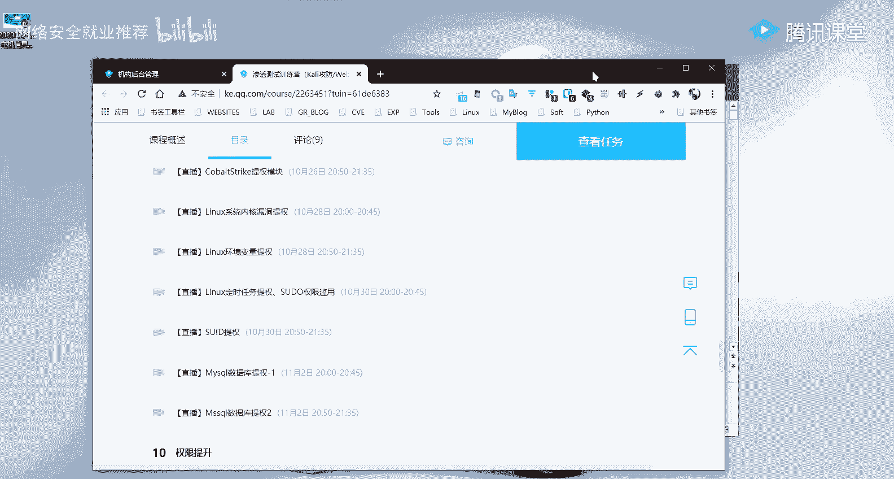
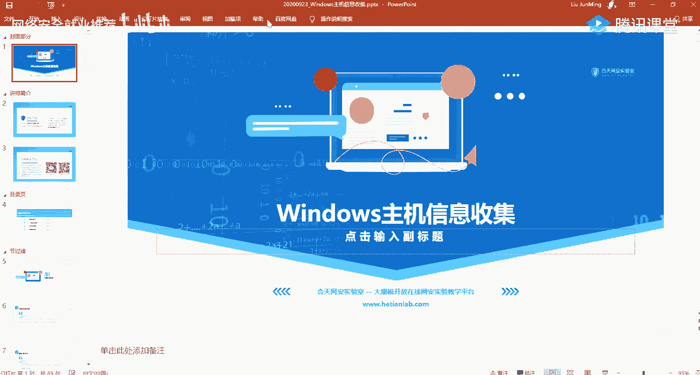
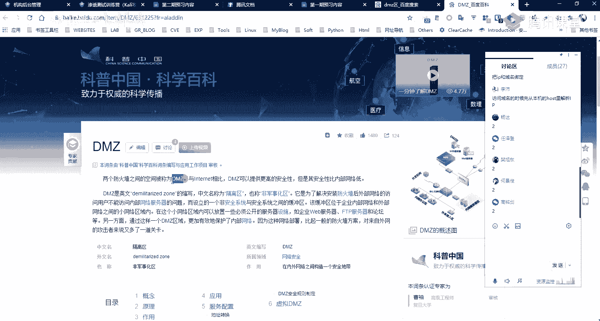
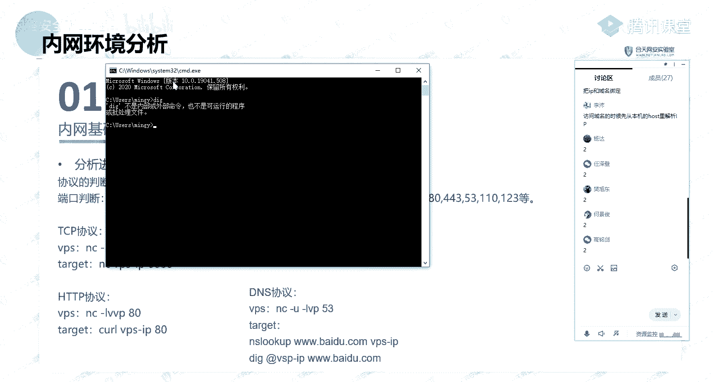
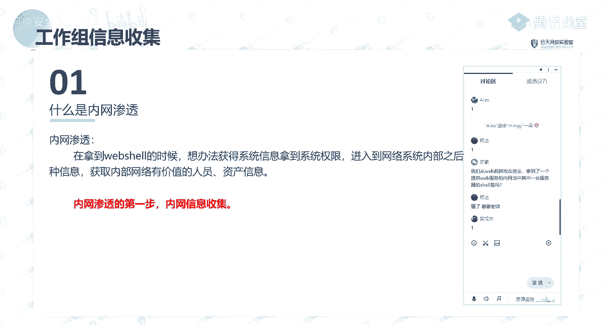
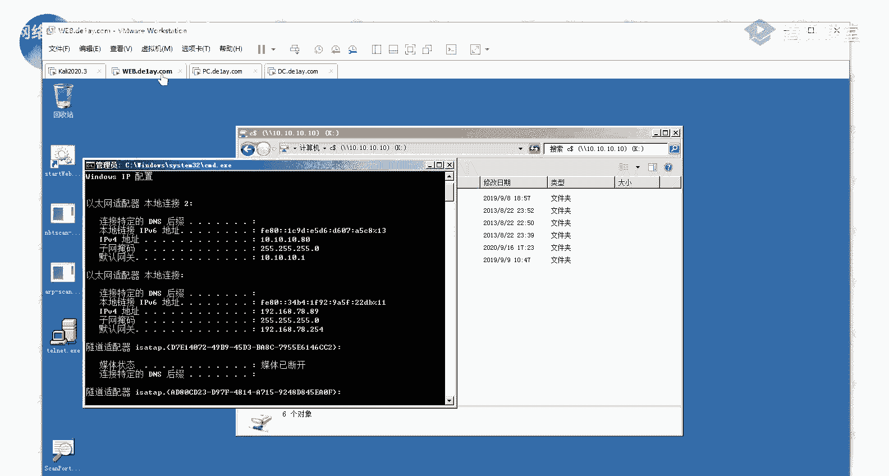
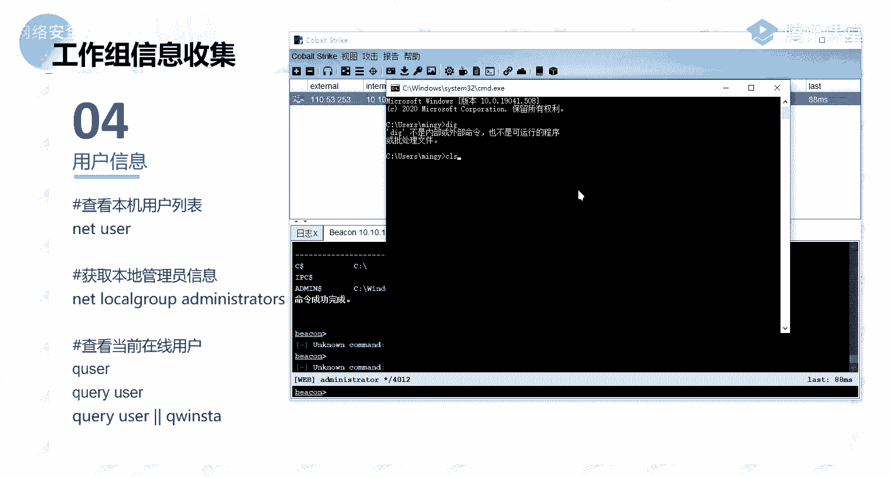
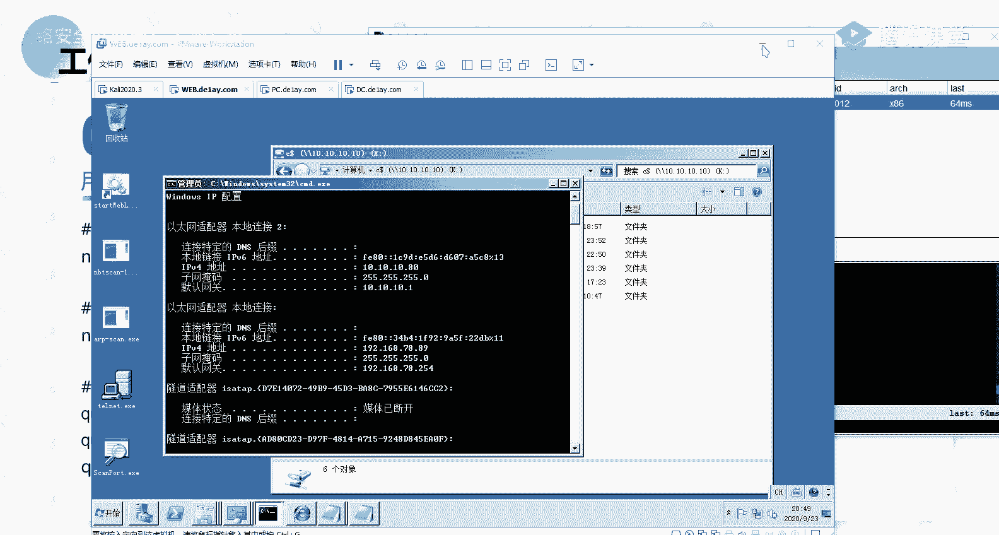

# P54：第18天：Windows基础信息收集、本机进程信息 - 网络安全就业推荐 - BV1Zu411s79i

正常的话，那么我正式开始我们今天的一个课程内容啊，好在正式课开始开始之前的话，我先大概说一下吧，这呃我们这边的话稍等一下，啊就是后面的一个课程的话啊，都是由我去给大家做一个讲解，后面的这些内容的话。

都是由我给大家去做一个介绍，所以的话呃在后面的话会有很长的一段时间，就是跟大家做相应的一些交流沟通什么的对吧，然后的话呃在这边的话，先就是大概给大家说一下，然后呃然后的话嗯，我们之后的一个课程内容的话。

因为前面的话是拼web方面的，就是好从我们的课表当中的话，其实也能够大概知道，前面的话就是一些呃web相关的一些东西对吧，然后呃以及就是我们常用的渗透，测试的一些框架。

然后后面的话就是着重于我们的一个内网的，一个渗透，以及我们的在去进行内网渗透当中，所需要去使用到的相关的一些技术，以及我们的一个预渗透等等的相应的一些技术，所以的话在后面的话课程内容的话。

它的一些点的话会相应的会增多，大家需要做一个做好一个心理准备好吧。

好呃，我在这边呃，我在课上讲课的话，大家如果有没有啊，如果碰到有什么问题对吧，有什么疑问的话，大家就欢迎大家踊跃的，在这个讨论区之间发出来好吧，就直接你直接在课上问就ok了。

当然的话如果你课上不好意思问你可以，课后的话私聊我也是可以的，那建议的话还是就是说呃，你直接在课上问嘛是吧，因为你可能你碰到的问题，也是其他同学正好呃不知道的一个问题，然后我在课上解答的话。

等于就是给所有同学都做了一个，相应的一个解答啊，就不需要说我在课后的话再给大家一一解答，这样的话我比较浪费时间，好啊，大家对我这些钉东西的话应该没有什么问题啊，啊应该能理解好，然后的话我没有什么问题啊。

我们开始我们进行一个正式内容啊，我们今天的话是给大家讲的是一个啊，windows的一个主机信息收集，稍等一下。

一个啊windows的一个主机信息收集，然后呃我们本节课的话主要分为这四块内容，就是我会带大家去了解分别的去了解这四块呃，当然的话呃因为我们今天晚上的话，一个晚上是两个课时对吧。

我这边的话是把它每个内容的话，都是放在了一个pp当中，有的话呃我的一个计划的话啊，正常情况下面的话就是前面的两部分是啊，第一个课时，后面两部分的话分为第二个课时，然后第一部分的话。

就是一个内网环境的一个分析，第二个的话就是工作组的一个信息收集，第三个是域内的一个信息收集，第四个是内网的一个存货探测，然后大家现在可能对这个没什么概念，没关系，我们后面后面会详细的给大家做一个介绍。

首先第一个就是内网的一个环境分析，在讲这个内网环境分析之前的话，我先大概的介绍一下，就是说什么是内网渗透啊，就是说可能大家刚接触这一块的话，对这个没什么概念对吧，就呃内网渗透跟渗透是有什么关系呢对吧。

就说我们前面在我们前面介绍的一些，web相关的一些漏洞对吧，那些呃其实从我们的一个课表，课表的一个标题，我们也能够去大概的指导是吧，我们前面的话就是说呃一个信息的一个收集，前期的这个信息收集的话。

是为我们后面去寻找突破口做的一个铺垫是吧，我们前期对相应的一些web站点，还有以及服务器以及服务相关的一些，而信息的一个收集，为我们后面去寻找相应的一个突破口，这个突破考试啊，什么意思呢。

就是说我们在这边介绍的相应的一些，web的一些漏洞，是为是为了我们后面要去做进一步的渗透，这个进进一步的一个渗透的话，就是涉及到我们的这边的一个，内网的一个渗透是吧，我们需要去通过这样子的一个突破口。

就说通过外网的这样子的一个，web形式的一个突破口来进入到内网，然后进入到内网之后的话，我们才能够去说去进行我们的这样子的一个，内网的一个渗透，而我们前面就说通过相应的一些web漏洞是吧。

在拿到web shell之后的话，我们需要去想办法得到系统的一个信息，然后的话拿到它的一个权限，以及进入到网络系统的一个内部，来去搜集它内部网络的各种信息，获取相应的一些价值的。

一些资产人员的一些信息对吧，然后在这边的话，我看我这边着重标红的就是重点的一个部分，就是内网渗透的第一步，就是内网的一个信息收集，也就是说我们要去进行一个内网渗透的话，我们第一步要去做的。

也就是一个内网的一个信息收集，也就是我们本节课要去给大家介绍的一个内容，我们先来了解一下内网的一个环境分析，这个环境分析是什么，有涉及到哪些内容呢，我们一起来看一下。

首先第一个内网的一个基础的一个环境判断，我这边的话有镍合这样子的一些点，首先我们呃大概的来看一下对吧，ip ip的话啊，我们都知道，我们的就是说我们的一个机器都会有，相应的一个i p对吧。

然后他在内网当中的话，我们需要去了解我们得到的，我们进入到的这样子的一个内网的这个机器，它的一个ip以及他ip相关的一些，网段的一些信息啊，这些ip的话也就是我们要去啊收集的。

以及我们需要去通过这些ip来去查，找到其他的一些突破口，然后还有就是网关dns等等的，这些话都是我们要去啊，就说去了解它的一个内部网络的一个基础的，一个就是它的一个大概的一个网络的一个结构。

以及还有的话就是能否去灵通外网，比如说我们得到的这样子的一个，而内部的内网的一个机器，它是否去能够去明外网，因为我们在内网的话，就是说内网跟外网之间的话，它是会有相应的一个啊就是阻隔的。

就大家应该有这样子的一个基本的，就基本的一个概念，就是说我们的一个外网以及内网之间的话，它是会有相应的一些设备，像比如说防火墙对吧，有这样子的一些设备做一个阻隔，就是为了防止我们就是说防止从外网能够去。

直接去访问到内网对吧，然后一般的话就是说你从外网的话，是无法去直接去访问到某一个网络的一个内网，然后的话在内网的话呃，一般就说一般的这种，你比如说你在一个内网，你在一个公司。

你在这个公司里的一个办公区域的话，一般的话它是能够去从内网去访问到外网对吧，当然的话有一些就是说一些特殊的，一些区域的话，它是不允许去访问外网，对哦，你能够去访问外网的话。

他会给攻击者就是留下一个可乘之机，能够去进行相应的就是说一个呃通过，就比如说如果打入到了它的一个内网的话，这一个内网，它的一个这个区域的话是很核心的一些业务，比如说是他的一个生产区是吧。

那么他能够去访问外网的话，那么我们如果打入进去的话，我们直接可以通过，就是说直接能够去利用，他能够去访问外网的一个特性，得到它这个区域的一个呃权限，也就是一个需要对吧。

然后的话还有就是网络的一个连接以及端口，就网络连接的话，就是我们需要去分析它的一些呃，开放的一些端口，以及它这个机器上面的话有哪一些ip，或者说有哪一些呃机器来连接到了，我的这个机器。

也能够去通过这样子的一个网络连接，来去了解到你的这个机器，它所开发的一些服务以及端口，然后就是本地host文件，这个本地host文件的话，其实呃大家应该也嗯，大家如果熟悉windows的话。

就是对这个应该不陌生对吧，就我们在windows机器上面的话，会有这样子的host文件，这个host的文件的话，其实就是做一个啊，ip跟域名之间的一个解析的一个转换啊。

大家对这一个host的文件里了解吗，就说啊有谁能说一下这个文件它的一个作用，就是说它的一个在我们的一个windows 7上面，它的一个作用是什么，呃有谁能回答一下吗，把ip和域名绑定啊。

我放在这边可能好，大家都能看得到，但是这边的话打掉了，放对面打，啊对啊，就是这位同学的话，他是第一期的，就我其实前面的话也有讲过多少，就是访问域名的时候的话，就说我们在本地机器，我们要去访问。

去去访问一个域名的话，你的一个windows机器它去解析这个域名的时候，它其实是会形成本机的一个host，在一个host文件里面去解析这个ip的，就如果说他在这个host的文件当中。

他找到了这个域名所对应的一个ip，那么它就会向这个ip去发起请求，如果说没有的话，他就会去找我们啊，就是旧建的一个服务商，去他那边去找到，就是说最近有本地的一个dns的一个服务器。

然后的话去进行一个解析，找到它对应的一个ip，啊呃还有的话就是机器的代理，机器的代理的话，在这边的话啊，就是其实大家呃就是有趣，这个怎么说呢，就是说在你的一个内网对吧，在一个内网，你公司的一个内网。

你想要去访问外网的话是吧，你可能你在本你在本机的话，它是无法去访问到外网是吧，那么我们想要去让这个区域去访，暂时的去访问到外网的话，那么我们可以通过这样子的一个代码，还去进行一个访问。

就比如说我们的一个就是v p s对吧，你不能够去直接去访问到外国的一些网站，那么我们通过这样子的一个代理的话，就能够去进行一个访问，然后在呃内网当中的话，也会有存在这样子的一些机器。

就这个机器的话它是有走相应的一个代言，就是说你的这个机器它不能够去直接通外网，但是的话如果说他有配，它有配置这样子的一个相应的一个代理的话，那么我们可以去查找到它，通过我相应的一个命令。

去查找到它的一个代理的一个，服务器的一个i p来，然后的话我们就能够去利用他的这样子的，一个代理来去进行一个初网，还有就是是否在域内，然后域名是什么，这个域的话在这边的话大家先了解一下，然后以及的话。

再就是说我们的一个预习资料的话，其实有给大家对吧，我这边的话稍等一下，我找一下。

这边呃预期内容的话，在这边，大家就前面的话，这边的话是呃第二个课时的一个内容好啊，我是这边呃，就是这一篇这一篇文章就大家去看一下，就这一个我觉得这篇文章的话，他讲的就是工作组和域它的一个区别。

就讲得很详细了，就大家去看一下这个文章的话，呃新对它有一个大概的印象，然后的话如果你还不是很理解的话，我们在课程当中的话，会一一的去带大家去了解，然而在这边的话就是在域内，如果说在域内的话。

那么就会去涉及到我们的域内的一个，信息的一个收集，然后在这边的话啊，第二个课时的话会给大家去介绍，以及它相应的一个域名，我们能够去查找到相应的一些信息，这是第一个，那第二个呢就是分析机器所处的一个位置。

的一个区域，这个的话从字面意思上面的话应该很好理解，对吧对啊，我这边的话也列举了一些像比如说dmz一区，办公区，生产区核心bb等等这样子的一些气啊，一些区域，当然他这个区域的话不是说绝对的。

它是一个就是相对的这样子的一个，概念的一个区域，它没有说有很明显的这种界限对吧，它是一个而相对的一个概念的一个区分区，然而在这边的话呃这个电影机区啊，有有同学知道这个电影机区它的意思吗。

啊其实啊我第一期的话呃，第一期的同学应该知道吧，而有同学就是能知道这个电机区是什么意思吗，就是它是一个什么样子的一个概念，啊知道的啊，知道的同学扣一，不知道的扣二，不知道的多一些是吧。

好呃大部分都不是很理解是吧，这边的话看一下，那我们就发，好，啊我这边的话直接，我这边它直接啊百度吧，百度1下，和我记得我有做一个比较好的一个笔记的，就是关于这个dmz的，然后找了一下发现没找到。

然后这边的话我们啊看这个百度百科吧，就这一个电影机的话，它是一个比较特殊的一个区域啊，就这个区域的话它是有防火墙之间的空间，称为一个电影机的一个区。

就在这个区域的话，一般的话我们得像这样子的一些面向外网的，这样子的一些web服务对吧，通常的话它会放到在放放在这个区域当中，就它也可以称作为一个隔离区，就在这个区域的话，它是我们内网的话。

它是能够去访问到这个区域的，然后的话在外网的话，也是能够去访问到这个区域的，然后的话在这个区域的话，我们可以通过相应的，就是说它有相应的一些配置的话，在这个区域的一个机器，它也是能够去访问到内网。

这样的话通常的话不会去这样做，就是说这个区域的这种机器的话，如果单的话也不是说也有一些例外，就说他的这个电影之一区域的啊，这些服务他需要去访，访问到内网的一个资源的话。

那么处于这个电5g区域的这些机器的话，它是也是能够去访问到内网的，所以的话呃这一个区域的话呃，就通常的话它是呃存放的，就是说放置的是一些面向外网的一些，然后大家只要去了解，就是说他这个区域的话。

在这个区域的一些机器的话，它是呃可能去就是能够去访问到内网，当然的话也可能就是说它只能够允许，就是说你从内网去访问到这个区，而不能够去访问到内网，以及还有相应的一个办公区以及生产区。

就在这里的话就应该不用多说，就都能够理解以及核心地域大，就是说你的一些外表的一些业务是吧，你的这些啊服务器，这些数据库的一些服务器的话，它是放在内网的，就是说它那些核心的一个数据的话。

它存放在你啊内网的这样子的一个，服务器当中啊，然后呃第三个的话就是分析机器的一个角色，机器角色的话我这边也列了相应的一些角色，就是说我们要去大概的去了解，我们得到的这个内网机器，它所扮演的一个角色。

就比如说他是一个，它只是一个普通的一个web服务器对吧，它就是一个面向外网的一个web服务，里面的话有相应的一个网站啊对吧，等等的这样子的一些服务，然后还有就是开发服务器，就是说我们的一个开发者。

我们的一个程序员，他的这样子的一些相应的一些呃，开发的一些代码对吧，等等呢，他会存放到这样子的一些服务器，以前还有文件服务器，就是用于存储我们的一些文件是吧，还有代理服务器。

就是我们通过啊这个服务器的话，它就是一个代理，就我们通过这样子的一个代理的话，能够去访问到其他的一些呃，呃网络还有d的一个服务器，就是做一个域名解析，还有数据存储服务器等等，在这边的话啊。

大概的了解一下，就介绍一下，然后我们了解这个角色的话，其实就是说我们去判断我们所得的这个机器，它是一个什么样子的一个啊服务对吧，然后的话这些服务的话，有存在什么样子的一些信息。

或者说他的这一些啊在这个服务器上面的话，我们能够去得到什么样的一些关键的信息，来去进行下一步的一个啊利用对吧，像比如说你的一个web普通的一个web服务，那么你web服务的话。

你的这个服务它是否有相应的，比如说你的一个数据库账号密码对吧，你web的一些管理员的一个登录的，一些密码信息等等，以及还有就是你的开发服务器是吧，那么这个服务器上面的话存放在相应的一些呃，站点。

你的一些呃所开发的项目的一些代码等等对吧，文件服务的话就是存储在相应的一些文件嘛，就可能的话就有一些敏感的一些文件等等，好啊，以及第四个的话就是分析进出口的一个流量，是否能灵通呃，这个的话。

这个的话就是其实就是我们前面提到的，就是说是否能够去联通外网，在这边的话，我们为什么要去分析是否能够去，就说我们的一个进出口的一个流量，是否能够去临床外网，就如果说我们得到了这样子的一个机器对吧。

然后的话这个机器的话它是呃在内网，在内网当中的话，它无法去连通外网的话，那么我们就无法的无法去得到这个啊，机器的一个shell是吧，我们不能够去反弹shell啊，当然可以去进行一个正向需要。

那么我们的这个机器，如果说他不能够去银行外网，然后的话我们我就是说，如果说我们要以这个机器做一个跳板机，来去攻击内网的一个其他的一些机器的话，那么我们去进行相应的一些操作的话，可能会啊就是不太方便。

好哦，以及我们要去判断，就是说我们什么样子的一些流量，就说什么样子的一些协议的这样子的一些呃，流量能够去出网啊，呃在这边的话，其实我们一般的去考虑的，就是说我们的在这个机上面能否去，就是说去出网对吧。

其实啊在这边的话就是啊重点的话就是去呃，关注能否去出玩嘛对吧，就是说再去进行针对这种进网的种的话，我们是对我们的话是意义不大的啊，好在这里的话协议的一个判断的话。

就常见的就像tcp i d s h t p，s m p等等的这样子的一些协议，就针对这些协议的话，我们能够去有相应的一个呃反弹shell啊，或者说能够去进行啊，进一步的一个呃利用。

然后还有的话第二个的话就是端口的一个判断，就端口判断的话，就是我们去测试这个内网机器，它常见的这种端口，就说能否去进行一个出网，就我们能否通过这样子的一个端口，像比如说八零的一个端口去进行一个出版。

也就是说在这个内网机器，它能否去访问到外部的一个8年的一个，像这种web服务对吧，然而我们那么我们如何去进行一个，相应的一个判断呢，在这边的话我就大概就列举了这样子的一些。

而方法就是针对这样子的一些协议啊，这个tcp的话和我们常用的话就是用的mc嘛是吧，我们要去测试它是否能够去进行，去进行这样子的一个tcp的一个协议的一个初网，那么我们可以通过就是说啊上传一个mc。

当然的话在这边上如果说是windows 7的话，我们是呃就是通过nc当的话呃，我们需要首先需要去上传这样子的一个nc，然后的话用nc来去啊，连接我们的一个公网的一个机，器的某一个ip地址对吧。

奥特曼如果能够去灵灵通的话，那么能够去大概的判断它是能够去啊，通过tcp的一个协议来去进行一个呃出网的，还有的话就是hdp的话，就是我们的一个web服务嘛对吧，就是一个8年的一个端口，也是同理是吧啊。

当然的话，还有的话就是sm p，也就是我们常用的一个ping有p命令，它就是一个snp的一个协议，那么我们通过这样子的一个ping，ping我们这边的一个ip地址。

然后在我们那个u p u p s上面的话，我们使用这样子的一个tcp dump，这个tcp dump的话就是一个抓包的一个工具，就我们可以通过tcp dump来去抓取我们的啊，这样子的一个流量。

然后我们去拼这样子一个ip的话，我们可以通过tcp duke来去抓取啊，来去拼我们这个机器的一个流量，这个的话其实呃tcp ip，那就相当于就是一个y shark一样子的一个抓包，的一个工具。

当的话肯定没有y shark那么强大了，就是说它是一个命令行的这样子的一个工具，然后还有就是电s的话，就是我们的一个域名解析，域名解析的话，我们常用的。

现在windows的话就是通过这个ns look up，这样子的一个方式来去进行一个啊测试，还有这个地，好当然的话，这个dig命令的话呃，看一下。

啊这个命令的话他不是一个啊，就是在windows层面的话，它不是一个内置的一个命令，就是说在linux上面的话，它是能够去使用这样子的一个d格的一个命令，就在windows上面的话。

我们就使用这个n s car，linux上面的话，我们可以使用这个dig，然后我在这边vp s上面的话，我们可以通过c去，今天我们这样子的一个53的一个端口，就这一个53的话。

就是我们d的一个啊协议的这样子的，一个默认的一个端口，呃关于以上这里的一个内网环境分析的话，大家能理解吗，有有没有什么疑问，应该能理解吧，这边的话就是一些啊稍微干一些的一些东西，带大家理解一下。

不是哦呃大家不回的话，应该是理解了呀，对啊，就是我我我在这边我问问问问问大家问题的话，大家还是回答一下，就是给个可能会，就如果你就是觉得没问题，你就扣个一嘛对吧，呃我们在这边的话需要拿到内网share。

你可能还是没有，就说我这边在这边有讲对吧，我在这边讲的话就是一个内网的一个渗透，然后的话你要去进行一个内网渗透的话，我刚刚不是讲了吗，就是说你要去进入到内网的话，你需要通过相应的一些啊。

需要有这样子的一个路径，就说能够去访问到你的一个内容，好我们要去访问到一个内容的话，我们就需要有相应的这样子的一个路口，这个路口的话就是相应的，比如说这样子的一个web shell。

这个web shell的话我们什么意思呢，就是说比如说你一个公司对吧，你一个公司，你想你有相应的这样子的一些，针对外网的一个服务，这些服务的话，比如说就是一个普通的一个网站的一个web服务，对吧。

然后这个web服务的话，你拿到了他的一个shell，也就是说你拿到了他的一个机器，这个服务器它的一个shell，然后这个shell的话正好他是能够去访问到内网的，我这边倒好起来。

他只要是能够去访问到内网，那么在这里的话，在这个时候你只有能够去访问到内网，你才能够去进行一个内网的一个渗透，然后的话你去去进行一个内网渗透的话，那么你才你的第一步，就是一个内网的一个信息收集。

也就是我们在这边所讲的，去对这个内容去定一个基础的一个环境分析，也就是说你前提的话，你就是需要有这样子的一个突破口，有一个路口能够去访问到内网，当然的话具体点说的话，就简单点说的话。

你也可以说就是拿到啊进入到内网的一个需要，而不是说拿到内网的一个需要，就这里的一个需要的话，四可以是一个外网的这样子的一个服务器对吧，这个机器的话它正好是能够去访问到内网的，动画规律呃。

这边的一个就是说我这边所刚刚所说的这个，web服务的一个机器对吧，这个机器的话，你可以把它理解成是一个跳板机是吧，就是我们通过这个跳板机的话，就能够去访问到这个内容对吧，能理解吗，啊啊啊。

不是说是内网的这样子的一个服务器啊，就说这个g的话，它其实是你在外网是能够去访问到的，能理解吗。

啊就比如说。

比如说我这边的这个机器对吧，我这个机器的话我就好了，运行了一个word服务对吧，然后我这边的这个机器的话，我假设这边它是一个外网，一个外网对吧，一个外网ip，然后的话我从外网去访问这个ip的话。

我就能够访问到运行在这个机器上面的，一个服务对吧，然后的话我通过这个服务，通过这个服务拿到了这个机器的一个需要，拿到这个机器修好之后的话，我们可以发，如果说恰好他有这样子的一个。

能够去访问到内部网络的这个，这个网卡就一般的话你去访问到，你要去访问到，就是说啊不同的网段的话，你需要有这样子的一个网卡对吧，就是说你需要有这样子的跟他同网段的，这样子的一个呃ip。

那么我这边得到了他一个需要，那么我就可以通过这个机器来去访问到。

对吧，能理解吧，好应该跟你讲，啊这边的话就是呃关于什么是内容生的话，刚刚给大家介绍了n map，能解释到端口是否开放呃，端口开放无法访问的话，哦有啊，就是说你的你，你不是说所有的端口都能够去给你。

直接去访问到的是吧，而他的这个机器的话，他有做这样子的，相应的就是说对这个端口有做这样子的一些啊，性质策略就不允许去访问的话，你是它它的这个端口虽然开放了，但是的话你是会就扫不到的。

就和前面讲linux的一个端口的一个扫描状态的话，应该给大家也介绍了，就是说它有呃五种五种状态吧，就是开放啊，关闭过滤，还有还有什么什么什么的，我有点忘了，大家可以去回顾一下，讲一下股的一个内容。

就应该是端口信息收集的时候也会给大家讲了，好了我们继续好，下面的话就是给大家跟大家一起来，了解这个工作组，什么是工作组，呃这边的话我这边列的内容的话有点多啊，在这边就是带大家大概的了解一下。

我这边列的一个内容的话，不是说啊，我这边就是直接在课上给大家读给大家听啊，就是说到时p p t k给大家，就是主要是给大家看的，我这句话就是大概的带大家就是了解理解一下，他好吧，有啊工作组的话。

它就是一个就是最简单的，最普通的一个资源管理模式，就是将不同的一个电脑，按功能分别列入到不同的一个组装，以方便管理，我这边还是摘的那个百度百科的，就呃我们怎么去理解呢，就我们的一个默认情况下。

所有的一个计算机，它都是处在一个名为workgroup的一个工作组中，就这个work group它其实就是工作组的一个意思，就我们啊我们的一个电脑，我们去连接一根网线对吧，连接这个网线之后的话。

你在公司你去连接连接网络之后的话，他就你的这个机器的话，它就会自动的去加入到这样子的一个啊，work group的一个工作组当中，就是在这边我们可以看到，就大家如果在电脑旁边，你可以去打开啊。

就啊右键此电脑，右键此电脑，然后就是属性嘛，属性在这边的话啊，属性这边的话，我们在这边不是有这样子的一个计算机领域，工作组嘛对吧，在这边有显示相应的一个信息，在这边就是这个是我的一个计算机名对吧。

然后呃这边的话就是我的一个工作组是吧，就默认的话他是在work group的一个工作组，我们在这边的话可以去更改它，可以去更改它，以及如果在后面会讲玉，就是说我们去把我的这个机器。

把这个机器加入到一个域中，这个的话后面会介绍好呃，第二段话就是他的这这样子的一个管理模式，就是适合网络当中计算机不多，然后的话对管理要求不严格的一个情况，就是说适合就我们普通的这种啊。

就是一般的这种小规模的一些公司对吧，你不需要去对啊，每一个接入到网络当中的这个计算机，去做一个管理，就默认的话，它就是使用了一个work group的一个工作组，还有其他的话这边的话我就不一的去说了呀。

然后在这边的话给大家介绍这个的话，其实就是呃为了与我们后面去讲的这个域，去做一个区分啊，以及还有这里有一点就是不同，就是相同组中的一个不不同，用户就可以通过对方主机的一个用户名和密码。

来去查看对方共享的一个文件夹，就默认共享的话它是一个优质识别登录，就是说我们在同一个这样的构图的一个，工作组当中的话，我们想我们可以通过啊，对方的一个主机的一个用户名，密码来去查看他共享的一个文件夹。

就是说在这边我们的，然后我们在这边的话会有这样子的一个网络，对吧，这里的一个网络的话，当话啊，如果你第一次那个的话，你点这边的话，网络它会在这边会有一个黄条啊，就是你需要去开启，就是啊发现这个网络共享。

就是，就这个你需要去启用他的一个网络，发现我才能够去啊，去发现在同一个组当中的这样子的一些啊机器，在，好好在这边的话，我们在这边网络的话，我这边呢是打开的，然后我们在这边的话。

我就能够去发现到我的这一个工作组当中，也就是work group，工作组当中有这样子的一些机器是吧，这些机器呢这边的话就是它的一个主机名嘛，啊然后的话我们就能够去啊去进行一个访问，当然的话我们访问的话。

你首先的一个前提就是说你需要去啊，知道他的这样子的一个呃用户名以及密码，然后的话你知道他一个用户名密码的话，你就能够去查看到它的一个呃，这个用户的一个标准目录，就说这个用户你这边登录的这个用户目录。

下面的一个文件夹就能够去访问了，然，后还有呃，下面的话就是，下面呢就是本期的一个信息收集呃，在这边的话，我这边的话念了这样子的一些，就是啊我们后面的话会一的去有介绍，就这边的话大家大概看一下。

我就不一的去啊，给大家解释了啊，主在这的话着重说一下，这个就是如果是域内的一个主机的话，那么操作系统还有应用软件补丁服务等等，刷完一般的话它是批量安装的，就是说我们的在一个玉。

就是说玉当中的这样子的一个机器的话，因为它的就说我们去使用这样子的一个预热，这样子的一个管理模式的话，就是说我们是面向员的一些，就是说啊你的一个主机数数目很多呃，想问一下什么是玉。

这个的话待待会儿会有介绍，这个的话先呃知道这个单个也有介绍好吧，然后的话就是说如果说我们要去管理到，管理很多的这样子的一些机器对吧，比如说啊这一个机器它存在存在这样子的一个，你想要去安装一个服务。

安装一个软件对吧，那么我们我们不可能说对整对所有的，比如说你的这个网络结构当中的，几百台的一个机器上面一的去进行一个登录，然后的话去安装对吧，这样子的话就是不太现实的。

就是说我们如果说是把这样这些主机的话，它是在域内，那么我们我们会有这样子在预料的话，它会有这样的一个角色预控，然后的话在呃，我们就能够去通过这个预控的这个主机，来去进行一个批量的去安装。

在啊是一个域当中的这样子的一些主机来去啊，安装它的这样子的一些软件，因为预控的这样子的一个预控的话，他能够去管理在这个域当中，他所有的这样子的一些主机，那么我们就能够去批量的去管理他的。

这样子的一些软件以及补丁啊等等，撒网的这样子的一些安装以及和管理，好，下面的话就是我们呃正式的一个工作组的一个，信息收集相啊，相应的一些内容，所以第一句话就是内网网段的一个信息收集啊，内网网段的话哦。

我们去收集它的一个内网网段，它的一个e的话，就是为我们去进行一个纵向渗透做一个准备，就是啊这句话也涉及到两个概念，就是纵向渗透以及横向渗透，就我们知道纵向的话就是等你呢。

这样就纵向的话就是这这样子嘛对吧，横向就是这样子对吧，那么我们横向性的话什么意思呢，就是说比如说我这边拿下一个主机对吧，拿下了一个主机，是10。10010的这样的一个网站，那么我们要去横向渗透的话。

就是说我们针对这样子的一个幺零这个网段，这个因为我们拿下这个主机的话，他能够去访问到的一个网段的话，就只有一零这个网站对吧，那么针对这个网站的一个机器的话，我们能够通过这个机器做一个跳板。

来去进行一个访问，那么我们就能够去进行一个横向的一个渗透，而去渗透这个幺零这个网段的一个机器对吧，那么纵向渗透的话，就是说针对不同的一个网站对吧，比如说我还发现有这样子的一个幺零点，10。

11的这样子一个网站对吧，那么我们的这样子的一个机器的话，它是无法去直接访问的是吧，但是的话我通过这样子的一个横向渗透，发现有有某一个机器，有有这样子的一个机器，它有两个网卡。

然后他有一个网卡的话是10。幺零点，11。20是吧，那么我通过这个机器这个机器的话，他有这样的一个幺幺的网卡，能够去访问到这个机器对吧，那么我就能够去你这一个机器做一个跳板。

还去好纵向的去渗透这个幺幺的一个网站，同理的话我们还可以去有其他的一些网站嘛，这个的话就是纵向的一个渗透吧是吧，就是纵向的，好啊，我们去找到不同的一个网段，我们才能够去进行一个正常探讨是吧。

因为我们需要去知道有哪一些呃，网段是能够去进行一个渗透的，然后呃网站建设计的话，我这边大概列了这三点，就第一个内网网站那个扫描是吧，就是啊你对这个内网网站去做一个扫描，去扫描它存活的这样子的一个网站。

然后第二个的话就是对这样子的一些文件共享，ftp的一些连接记录，还有你浏览器的访问记录，还有你啊你的一个远程桌面的这种连接记录，我们通过这样子的一些记录，来去发现不同的一个网站。

像比如说呃我们的一个浏览器访问记录对吧，你在练完的话，你在内网的一个机器上面的话，呃，他可能会有相应的就说一些服务对吧，你先要去去访问，访问到内网的一些啊网站的所开发的一些服务。

比如说是某一个网站它的一个web服务，那么你在浏览器当中的话，你去访问的话，他会有相应的一些记录对吧，还有就是ftp的一个连接记录以及啊，就比如说，我这边对吧，就我们在比如说我们通过资源管理器对吧。

ftp你去连接对吧，我这边输入ftp的话，我在这边就能够去发现，有这样子的一个ftp的一个连接记录对吧，还有的话像m s t s c的话呃，就是我们的一个，我们那个远程桌面的一个登录嘛对吧。

就哦你可以去发现有这样子的一些就啊，我这边通过这台机器去登录的，这样子的一些网站对吧，那么那么的话我们在这边的话，我们去啊，就说他有这样的一个记录的话，就意味着它的这个机器的话是有可能去访问到。

能有可能能去访问到这样子的一些ip的是吧，横向渗透是整个11段渗透的，就是说呃你横向的话，就是说其实这个横向的话不是说啊，指一个c段吧，就说你的你通过你的这个跳板机，能够去访问到的。

其他的就说这样子的一个机器，你都属于是一个啊横向震动嘛对吧，然后的话你通过横向渗透，拿下了这样子的一些机器，然后的话你还发现有其他的一些网站，就说你通过这样子的一个跳板机，明星的这边这个跳板机。

你无法去访问到这样的一个机器对吧，但是的话你通过横向渗透拿下了其他机器，能够去渗透这样子的一个原本这个机器，它无法访问的这个机器，那么这个就算属于是一个纵向的一个渗透啊，就横向生的话，你不要局限输。

比如说只是这个要连这个c吧是吧，你只要是你这个机器能够去访问到的，这样子的一个网站，你都属于你都能够去直接的去进行一个渗透的，这个的话呃，大家思路放开一点，就是不要太局限，还有就是路由器交换机等等啊。

这样子的啊，就是说在这些路由器交换机上面的话，有相应的一些就是啊网络的一些配置对吧，那么的话它会有机物的相应的一些呃，不同的一个呃网段，好哦，然后第四的话就是用户的一个信息呃，在这边的话。

好在这边我去演示的话。

我通过呃，我就是通过这一个cs。

就是我这边的话呃，再去进行一个演示的时候的话，我这边先说明一下，就我这边的话是已经拿到了一个机器，拿到了一个机器的一个需要是通过cs拿到的啊。

然后的话这个机器的一个需要的话嗯，我这边的话就是这个靶靶场，就我这边已经通过了一个他的一个web漏洞。

拿到这个机器的一个系，好的话，我在这边的话，我是啊，我后面的这样子，那些就是说这些信息收集的一些命令，我都通过这样子的一个方式来给大家演示，就呃如果大家没有这样子的话，你就说你直接。

其实直接就说你自己的一个cd是吧，作为一个你得到了一个shell来去进行一个操作。

就在这边的话其实就是一些命令的一个意思，就是说我们通常会去使用这样子的一些命令，去收集我们想要的这样的一个信息，好首先第一个就是这个net user，net user的话大家应该都是常见。

也是常用的对吧，嗯嗯那个。

啊是的，因为因为我这边的话是搭载内网呀，我这边的话肯定是一个内网的一个网段，内网用的一个内网的一个ip啊，但是的话如果说你这个机器，它是一个外网的一个机器的话，你会有这样子的一个就是外网的一个ip啊。

你才能够去访问到这个机器吗。

因为我这边的话是一个靶机啊，不是不是说一个真实的一个外网的一个机器啊，能理解吗，就你把它在这边，你理解为一个外网的一个ip嘛，然后这个话是一个内网的ip吗。

然后这个代替者的话呃，就是，是大家比较熟悉的一个命令对吧。

就是大家玩问的时候的话，应该都知道。