# 课程P54：第18天：Windows基础信息收集、本机进程信息 🖥️🔍

在本节课中，我们将要学习Windows主机的基础信息收集方法。这是进行内网渗透测试的第一步，也是至关重要的一步。我们将从内网环境分析开始，逐步深入到工作组和域环境的信息收集，最后学习如何探测内网中的存活主机。

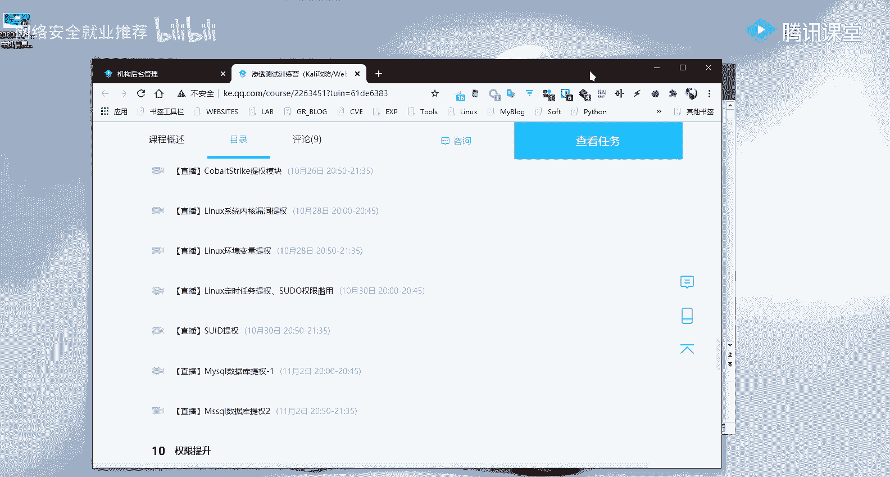

## 内网环境分析 🗺️

上一节我们概述了课程内容，本节中我们来看看什么是内网渗透以及如何进行内网环境分析。


内网渗透是指攻击者通过外网的突破口（例如Web漏洞）进入目标内部网络后，进一步搜集内部网络信息、获取权限和敏感数据的过程。其第一步就是内网信息收集。

内网环境分析主要涉及以下几个核心方面：

### 基础环境判断

以下是进行基础环境判断时需要收集的关键信息：

*   **IP地址与网段**：获取当前主机的IP地址、子网掩码、默认网关和DNS服务器地址，以了解网络拓扑结构。
*   **外网连通性**：判断当前主机能否访问互联网。这关系到攻击者能否建立反向Shell连接。
*   **网络连接与端口**：分析当前主机开放了哪些端口和服务，以及有哪些外部连接，以发现潜在的攻击面。
*   **本地Hosts文件**：检查 `C:\Windows\System32\drivers\etc\hosts` 文件，其中可能包含域名与IP的本地映射关系，可能指向内部重要资产。
*   **代理设置**：检查系统是否配置了代理服务器，代理服务器本身可能成为新的跳板。
*   **域成员身份**：判断主机是否加入了域（Domain），并获取域名信息。这决定了后续信息收集的方向（工作组或域）。

### 机器所处区域分析

分析目标主机在网络中所处的逻辑区域，有助于评估其价值。常见的区域概念包括：

*   **DMZ区（隔离区）**：放置对外提供服务的服务器（如Web服务器），通常位于防火墙之间，可能同时被内外网访问。
*   **办公区**：员工日常办公使用的计算机区域。
*   **生产区/核心区**：存放核心业务、数据库等重要服务器和数据的区域，价值最高。

### 机器角色分析

判断目标主机在网络中扮演的角色，可以推测其上可能存放的数据类型。常见的角色有：

*   **Web服务器**
*   **开发/测试服务器**
*   **文件服务器**
*   **代理服务器**
*   **DNS服务器**
*   **数据库服务器**

### 进出口流量分析

重点分析主机能否出网（访问外网）以及通过哪些协议出网，这关系到后续渗透手段的选择（如反弹Shell）。

以下是测试常见协议出网能力的方法：

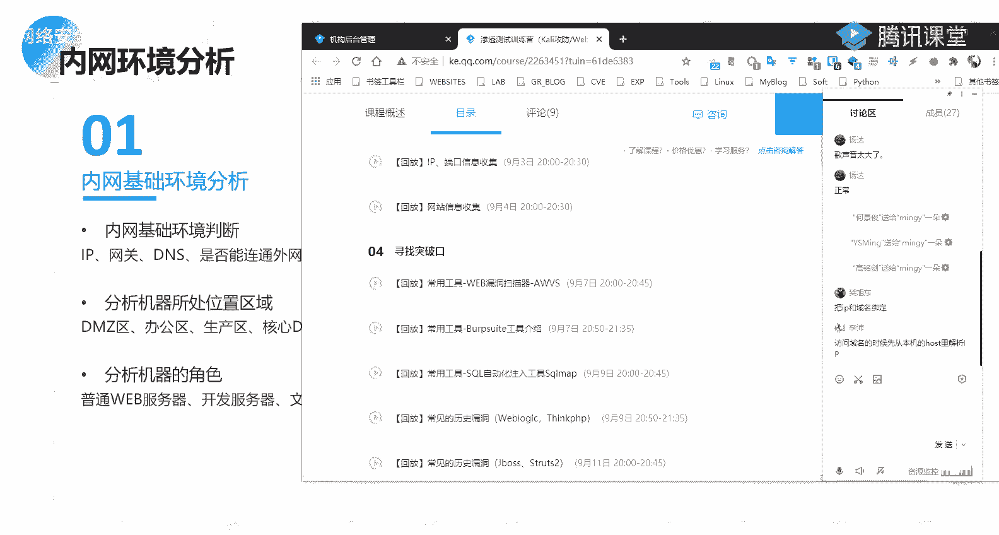

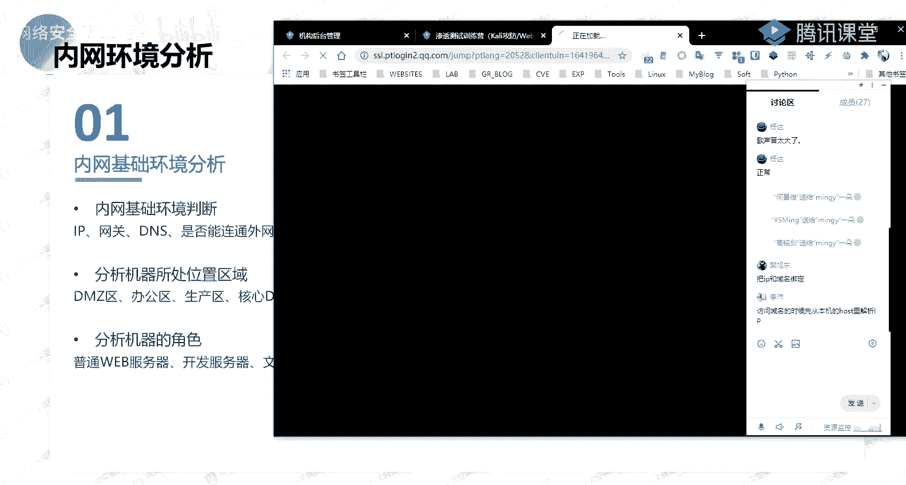

*   **TCP协议**：使用 `nc`（Netcat）尝试连接外网IP的指定端口。
    ```bash
    nc -zv <外网IP> <端口号>
    ```
*   **HTTP/HTTPS协议**：使用 `curl` 或浏览器访问外网网址，或在VPS上监听80/443端口。
*   **ICMP协议**：使用 `ping` 命令测试，并在VPS上用 `tcpdump` 抓包验证。
    ```bash
    # 在目标机执行
    ping <外网IP>
    # 在VPS执行
    tcpdump icmp
    ```
*   **DNS协议**：使用 `nslookup` 或 `dig` 查询外网域名，或在VPS上监听53端口。
    ```bash
    nslookup <外网域名>
    ```

## 工作组信息收集 👥

上一节我们介绍了如何分析内网环境，本节中我们来看看在相对简单的“工作组”模式下如何进行信息收集。

工作组（Workgroup）是一种简单的对等网络资源管理模式，默认工作组名为 **`WORKGROUP`**。它适合计算机数量不多、管理要求不严格的小型网络。

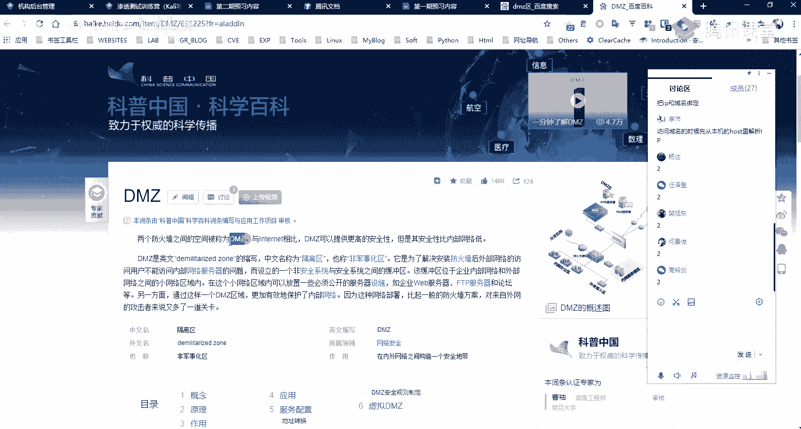

### 内网网段信息收集

发现更多内网网段是为“纵向渗透”（渗透不同网段）做准备。横向渗透指在同一网段内横向移动。

以下是发现新网段的一些思路：

*   **扫描内网网段**：使用工具扫描已知网段，发现存活主机和可能的新网段。
*   **检查历史记录**：
    *   文件共享、FTP连接记录。
    *   浏览器访问历史、收藏夹。
    *   远程桌面（mstsc）连接记录。
*   **检查网络设备**：如果可能，查看路由器、交换机的配置信息，其中可能包含多个网段的路由信息。

### 用户信息收集

了解系统用户信息是权限提升和横向移动的基础。

以下是收集用户信息的常用命令：

*   **查看所有用户**：`net user`
*   **查看指定用户详细信息**：`net user <用户名>`
*   **查看当前登录用户**：`whoami`
*   **查看本地组**：`net localgroup`
*   **查看管理员组用户**：`net localgroup administrators`

### 进程与服务信息收集

分析运行的进程和服务，可以发现安全软件、脆弱服务或高权限进程。

以下是相关命令：

*   **查看进程列表**：`tasklist`
*   **查看系统服务**：`net start`
*   **查看服务详细信息**：`sc query`
*   **查看计划任务**：`schtasks /query /fo LIST /v`

### 网络信息收集

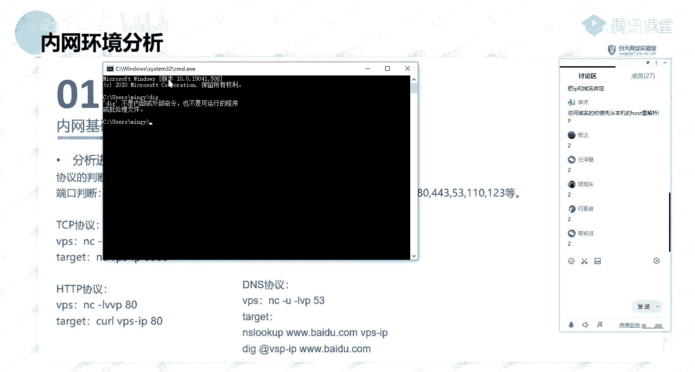

全面收集网络配置和连接状态。

以下是相关命令：

*   **查看IP配置**：`ipconfig /all`
*   **查看路由表**：`route print`
*   **查看ARP缓存**：`arp -a`
*   **查看活动网络连接**：`netstat -ano`

### 密码和凭据收集

寻找系统中保存的各类密码和凭据。

*   **查找敏感文件**：搜索包含“password”、“config”、“unattend.xml”等关键词的文件。
*   **读取保存的凭据**：使用 `cmdkey /list` 查看Windows保存的凭据，尝试用 `runas` 重用。
*   **提取浏览器密码**：使用相关工具（如LaZagne）提取浏览器保存的密码。


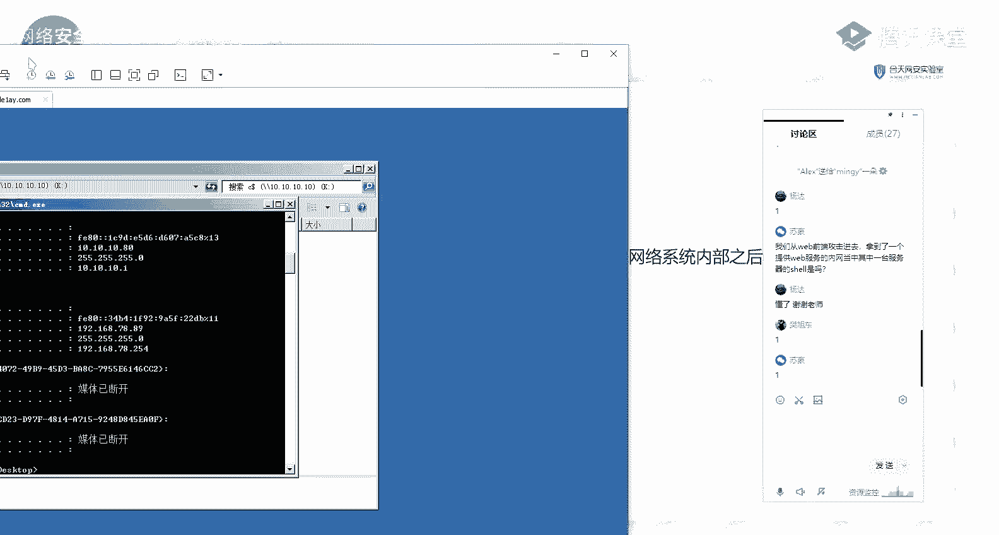

### 域内主机信息收集（如果加入域）

如果主机已加入域，则需要额外收集域相关信息。

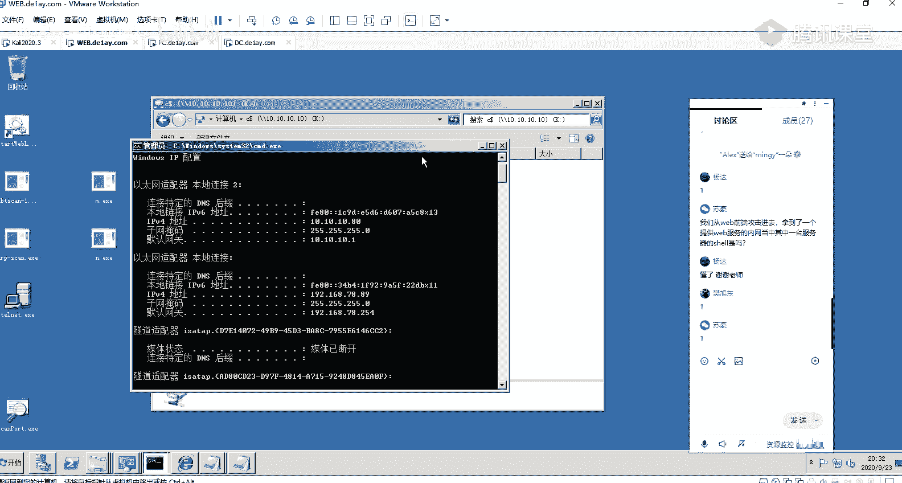

*   **查询域名**：`net config workstation`
*   **查询域内计算机**：`net view /domain`
*   **查询域用户**：`net user /domain`
*   **查询域管理员**：`net group “domain admins” /domain`

## 域内信息收集 🏰

上一节我们学习了工作组环境的信息收集，本节中我们聚焦于更复杂、更常见的“域”环境。

域（Domain）是一种集中式的网络资源管理模式，通过一台或多台“域控制器”（Domain Controller）来统一管理域内的所有计算机和用户账户。它适合中大型企业网络，便于进行批量策略部署和集中身份认证。

### 域环境基础信息收集

首先需要获取域的基础架构信息。

以下是核心命令：

*   **获取当前计算机名和域名**：
    ```bash
    net config workstation
    ```
*   **查询域控制器**：
    ```bash
    nltest /dclist:<域名>
    # 或
    nslookup -type=SRV _ldap._tcp.<域名>
    ```
*   **查询域内所有计算机**：
    ```bash
    net view /domain:<域名>
    ```
*   **查询域内所有用户组**：
    ```bash
    net group /domain
    ```
*   **查询域管理员**：
    ```bash
    net group “domain admins” /domain
    ```

### 利用CS等工具进行自动化收集

在渗透测试中，常使用Cobalt Strike（CS）、Empire等框架进行自动化、更隐蔽的信息收集。

*   在CS的Beacon中，可以使用 `net view`、`net computers`、`net dclist` 等命令。
*   使用 `powerview.ps1` 等PowerShell脚本可以获取更详细的域拓扑、用户关系（如谁是谁的经理）、ACL（访问控制列表）等信息。

## 内网存活探测 🎯

在收集了基础信息并确定了目标网段后，下一步就是探测这些网段内存活的主机，为后续的漏洞扫描和攻击做准备。

### 使用ICMP协议探测（Ping扫描）

最简单直接的存活探测方式。

*   **Windows命令**：
    ```bash
    for /l %i in (1,1,254) do @ping -n 1 -w 50 192.168.1.%i | findstr “TTL=”
    ```
*   **使用工具**：`fping`, `nmap` (`nmap -sn 192.168.1.0/24`)

### 使用ARP协议探测

在内网中，ARP探测比ICMP更可靠，因为设备可能禁用了ICMP回应。

*   **使用工具**：`arp-scan`, `nmap` (`nmap -PR 192.168.1.0/24`)

### 使用TCP/UDP端口扫描

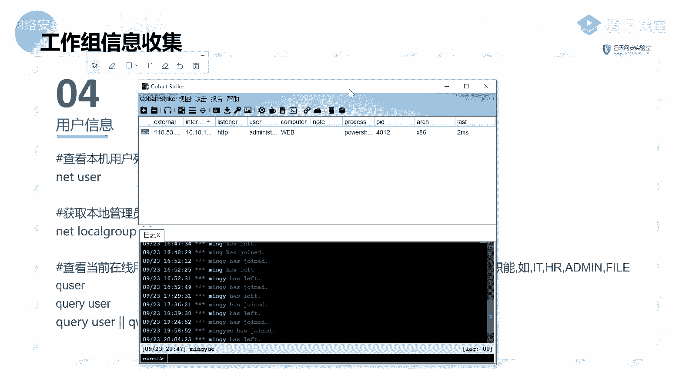

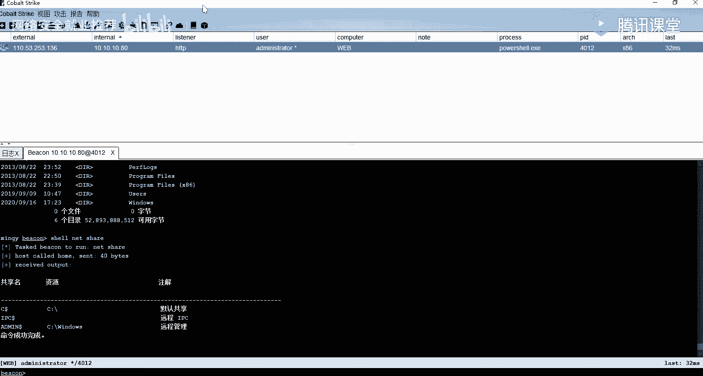

通过扫描常见端口（如135, 139, 445, 3389）来发现存活主机及其开放服务。

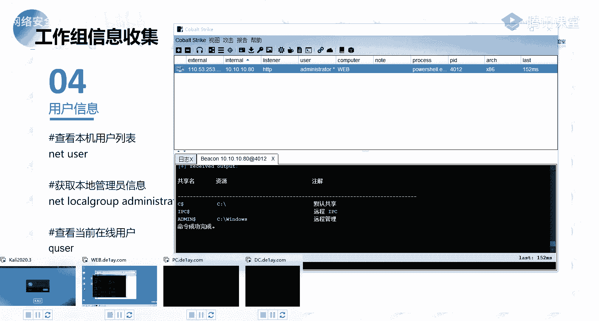

*   **使用工具**：`nmap` 是首选。
    ```bash
    nmap -sS -p 135,139,445,3389 192.168.1.0/24
    ```

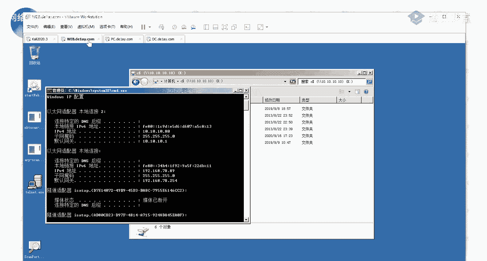

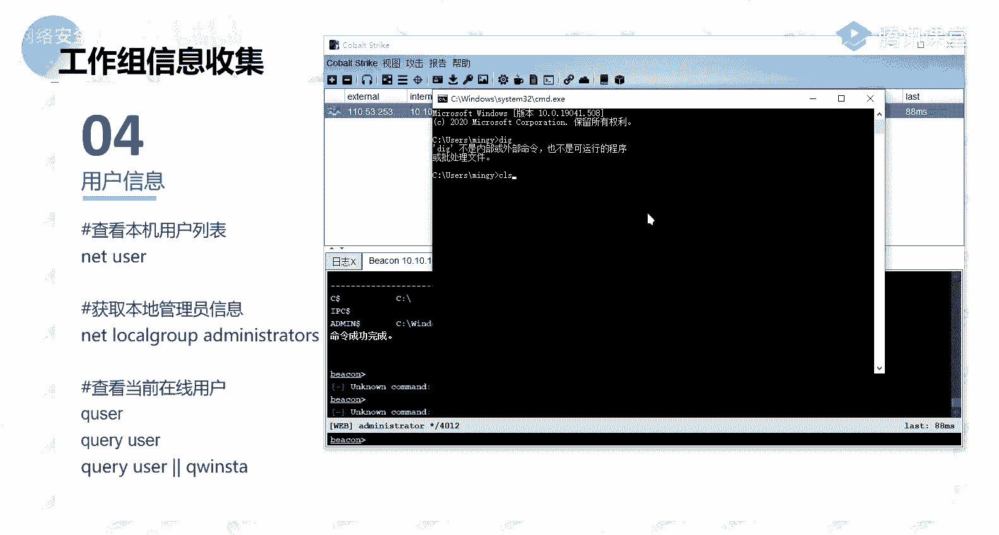

### 注意事项

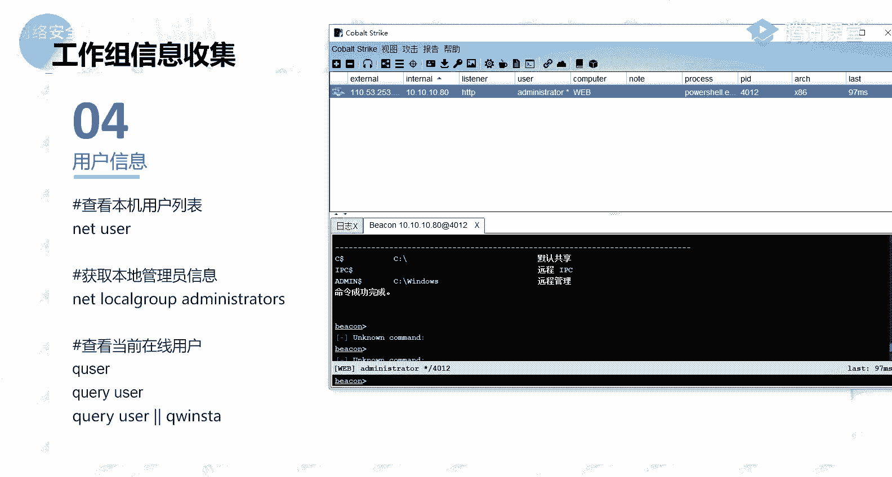

*   **隐蔽性**：在内网探测时需注意流量特征，避免触发安全设备的告警。可以降低扫描速度、使用随机IP顺序、选择非标准端口进行探测。
*   **利用已有跳板**：所有扫描操作都应通过已控制的跳板机进行，以隐藏真实攻击源。

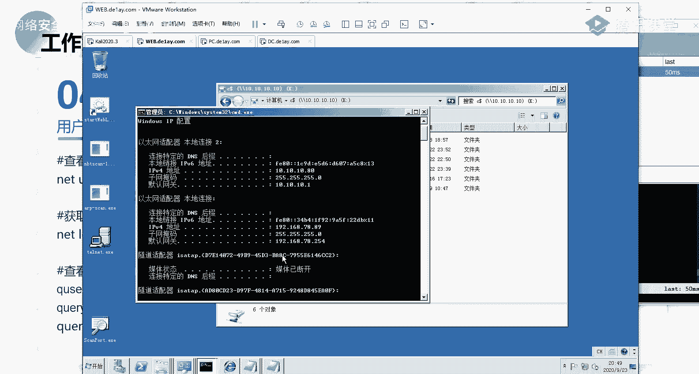

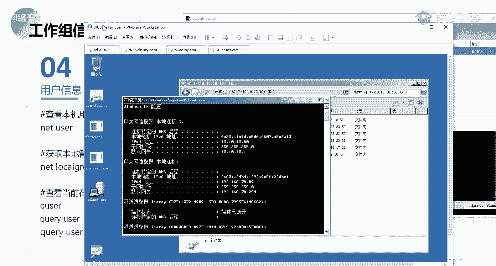

---

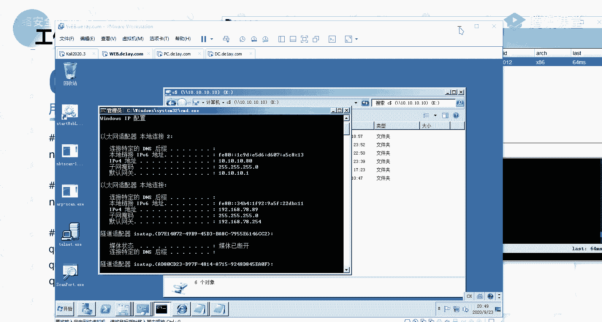

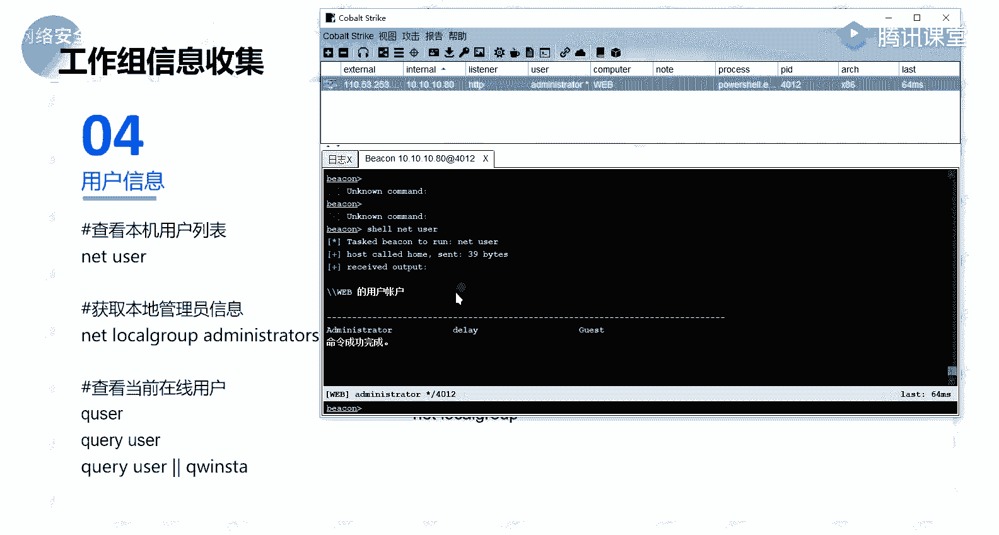

本节课中我们一起学习了Windows内网渗透测试中信息收集的完整流程。我们从理解内网渗透的概念开始，学习了如何分析内网环境、区分工作组与域，并掌握了在这两种环境下收集用户、网络、进程、密码等关键信息的各种命令和方法。最后，我们还探讨了如何探测内网存活主机。信息收集是渗透测试的基石，全面、细致的信息收集能为后续的攻击阶段提供清晰的地图和突破口。请务必熟练掌握这些基础命令和思路。