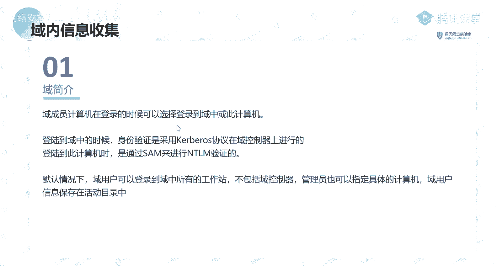

# P55：第19天：内网环境分析及工作组信息收集 - 网络安全就业推荐 - BV1Zu411s79i

啊就说他有这样的一个记录的话，就意味着它的这个机器的话是有可能去访问到，能有可能能去访问到这样子的一些ip了是吧，横向渗透是整个11段渗透的，就是说呃你横向的话，就是说其实这个横向的话不是说啊。

指一个c段吧，就说你的你通过你的这个跳板机，能够去访问到的，其他的就说这样子的一个机器，你都属于是一个啊横向震动嘛对吧，然后的话你通过横向渗透，拿下了这样子的一些机器，然后的话你还发现有其他的一些网站。

就说你通过这样子的一个跳板机，原先的这边这个跳板机，你无法去访问到这样的一个机器对吧，但是的话你通过横向渗透拿下的其他机器，能够去渗透这样子的一个原本这个机器，它无法访问的这个机器。

那么这个就算属于是一个纵向的一个渗透，就横向生的话，你不要局限输，比如说只是这个要连这个c段是吧，你只要是你这个机器能够去访问到的，这样子的一个网站里，都属于你都能够去直接的去进行一个渗透的。

这个的话呃，大家思路放开一点，就是不要太局限，还有就是路由器交换机等等啊，这样子的啊，就是说在这些路由器交换机上面的话，有相应的一些就是啊网络的一些配置对吧，那么的话它会有机物的相应的一些呃。

不同的一个呃网段，好哦，然后第四的话就是用户的一个信息呃，在这边的话，好在这边我去演示的话。

我通过呃，我就是通过这一个cs。

就是我这边的话呃，再去进行一个演示的时候的话，我这边先说明一下，就我这边的话是已经拿到了一个机器，拿到了一个机器的一个需要是通过cs拿到的啊，然后的话这个机器的一个需要的话嗯，我这边的话就是这个靶靶场。

就我这边已经通过了一个他的web漏洞，拿到这个机器的一个系。

好的话，我在这边的话，我是啊，我后面的这样子，那些就是说这些信息收集的一些命令，我都通过这样子的一个方式来给大家演示，就呃如果大家没有这样子的话，你就说你直接其实直接就说你自己的一个，sam b是吧。

作为一个你得到了一个需要来去进行一个操作，就在这边的话其实就是一些命令的一个意思，就是说我们通常会去使用这样子的一些命令，去收集我们想要的这样的一个信息，好首先第一个就是这个net user。

net user的话大家应该都是常见，也是常用的对吧，嗯嗯那个，啊是的，因为因为我这边的话是搭载内网呀，我这边的话肯定是一个内网的一个网段，内网用的一个内网的一个ip啊，但是的话如果说你这个机器。

它是一个外网的一个机器的话，你会有这样子的一个就是外网的一个ip啊，你才能够去访问到这个机器吗，因为我这边的话是一个靶机啊，不是不是说一个真实的一个外网的一个机器啊，能理解吗，就你把它在这边。

你理解为一个外网的一个ip嘛，然后这个的话是一个内网的一个ip吗，然后这个nt oder的话呃，就是，是大家比较熟悉的一个命令对吧，就是大家玩问的时候的话，应该都知道。

就是我们通过net user来去查看到，单体计算机上面有哪一些用户对吧，这句话我们能够去查看到他的一个用户，还有就是呃获取本地的一个管理员的一个信息，在这边的话哦，我们就是大家应该也去使用过。

就是说我们把我们自己的一个啊用户对吧，加入到我们的一个本地管理员组是吧，就这个local group这个组当中，那么我们要去查看到这一个本地管理原子当中，它有哪些用户。

也就是有哪些用户有一个管理员的权限对吧，那么我们可以通过这个命令，通过这个命令来去查看到这个admin组，就是管理员用户组当中的有哪一些用户，在这里的话有这样子的三个用户是吧。

那么我们就能够知道在这三个用户的话，它是有一个管理的权限的，还有就是呃查看当前的一个在线的一个用户，在这的话这三个命令都能够去查看，就好在这边的话，我们可以看到，就是当前的话有这样子的一个用户。

就是有一个面的一个用户，它是处于一个登录运行的一个状态，然后其实我们可以看一下，我当前的一个用户的话，其实就是一个多面的一个用户，然后我我这边的话呃，我这边的话也是一个面的内幕去登录的。

然后还有其他的一个呃，其他的几个命的话，它的一个结构的话都是一样的，我就唯一的去演示啊，哦对了，其实在讲这个之前的话，其实我还是要说一下，就问大家一下，就是大家对这些的话，对这些命令的话，大家啊知道吗。

就如果说大家知道的话，我这边的话就带大家只大概的过一遍，我就不我就不去啊，操作来来去让大家看一个效果了，是，大家对这样子的一些病的话，我能了解有了解吗，呃了解的扣一，不了解的扣二好吧，没有了解。

就是啊需要啊，我这边操作一下给大家看效果是吧，而其他同学呢，呃大家呃一是有了解对吧，知道几个简单的知道个别好哦，那我那我这边的话就是呃，就是我大概的操作一下吧，其实也是一些比较基础的一些面料。

我大概操作一下，然后的话可能就是windows不了解呃，你不用windows的吗，你是你日常的一个就是日常使用的一个系统，是linux对吗，windows的话应该就是呃大部分的同学的话。

应该用的使用的应该是windows，就是日常使用的话对吧，然后那么我这边的话，我就呃我就不会去不细讲了吧，然后的话我这边的话就是比较快的，给大家操作一下，演示一下，好吧对哦。

这个的话其实大家自己去课后的话去操作，演示的话也是一样的好吧，我这边的话就大概的过一下好，我查看当前用户在目标系统当中的一个，具体的一个权限，我点呃，我这边的话先呃大家先休息一下吧，好吧，先休息一下呃。

我这边的话因为现在的话改了，就是第就是一个课程的话45分钟是吧，现在的话已经54了，忘记了，我先大家先休息三休休息五分钟吧，好吧，就是九点钟的话，我们正式开始，我这个花心断掉了，怎么断，一。

哎你这个不好，这个0号这个号就，转身，该说的，别说了，你懂，哦大家哦能听到吗，应该都在吧，唉，可以哦，这边的话呃这边的话就不休息了吧，啊抓紧点时间，我后面的话还有比较多的一个内容。

就是啊这边这这些命令的话，我我这边要不不操作了吧好吧，大家自己课后去操作可以吗，就反正pp的话会发给大家，然后这边的一些命令的话，我也有相应的几次对，然后我就大概的给大家就是过一遍，我就不不一的去操作。

因为操作的话可能花的时间花的比较多啊，好啊，这边的话就是一个用户的一些信息，就用户信息的话，我们主要就是去啊查找，就当前的我们得到这个机器，是我们这边得到一个机器，它所拥有的这样的一些用户。

它有哪些用户以及它的这些用户，它是分别有什么样子的一个权限对吧，这个的话就是我们去收集它的一个，用户的一个信息，然后然后他就是一个系统的一个信息，系统性的话主要的话就是去收集你的这个系统。

它是什么样子的一个版本对吧，以及你的这个系统，它对相应的一些好运行的一个软件以及服务，以前，还有就是呃，这个呢其实应该算是前面的一个ip信息，就我们通过这个ip config过这个命的话。

也是我们常用的，就在后面的话也会有。

你会经常的去，也会有说到，就是说我们通过这个ip功fig，我们知道id工fig的话就是嗯。

能够去查看到当前的这个机器，它的一个ip的一个信息对吧，那么在这边我们查看到的话，其它其实是一个比较简便的一个信息啊，我们可以通过加一个干wor，来去查看到更详细的一个信息。

然后在这的话我们可以看到在这边就是有，比如说他的这个机器，它的一个主机名对吧，主机名的话是这个web就呃主机名是什么意思呢，就其实就是我刚刚给大家那个呃，就大家要分清一下，就是主机名。

就说这个这个的话它就是一个主机名嘛，然后以及你右键此电脑，然后属性这边，这个的话就是你的一个计算机的一个名，好正确的说他应该算是说计算机名啊，给你一个主机名在这边上。

主机名就是这个也就是说它的这个计算机名，主机名的话是web，然后dns后缀在这边的话哦，它是一个这样的一个dj。com，这个的话我就是呃我们在后面会讲，就讲玉的时候会介绍的，就是说在这边。

如果说我们发现有，比如说他的一个dx的这种后缀，以及在这边他的一个呃这个电的一个后缀，的一个这种搜索列表，像这种信息的话，它是这样子的一个像域名的一个形式对吧，那么我们能够去知道。

就是说当前的这个机器的话，它是处在这样子的一个dlding com的，这样的一个域当中的，也就是说这个机器呢是一个域内的一个主机，然后还有在这边的话，有能够去查看到他的一个就是啊。

网卡的一个ip的一些信息对吧，比较详细的一些信息，i p地址还有电，然后我在这边的话，电s服务器，在这个的话也是我们要去着重要去注意的，就说我们在域当中的话，我们通可以通过这样子的一个。

就是说如果我们知道当前的这个主机，它是在这样子的一个域当中，那么我们可以去通过这样子的一个，dns的一个服务器，它所对应的这样子的一个弟子，能够去判断这个地址的话，它是一个预控的一个i p。

也就是说我们当前的这个域，这个d d内点com这个域，它的一个预控的ip的话是10010010，这个ip，然后呃这边大家不理解的话，我们等会会说啊，就是说我们的一个预控的话，它的一个作用。

它其实就是我们的一个电服务器，因为我们在域当中的一个主机，要去找到其他的一个主机的话，他需要有这样子的一个电s的一个解析，就说他知道他知道我们的一个预控的ip地址。

然后的话他想要去访问到其他一个主机的话，我们需要通过这个预控啊，也就是在这个预控上面的话，它需要有这样一个d的一个服务器，我们的一个域内的一个主机，所有的一个电啊，就是它的一个电的一个啊。

就是一个而dns的一个ip的话，需要去指向我们预控的一个ip，以及还有其他的这样子的一些信息是吧，其他网卡的一个信息。

这里的话就是这个ip config，还有的话就是查看就是操作系统，还有软件信息等等，这对话像啊就是英文的话，就是像这样子的iosquation，其实就是通啊通过这个final drive。

这个final j的话就是啊一个就是查找匹配，就是在windows上面的一个查找匹配字符字符，还有就是啊，相应的一个，你就可以把它理解成为是一个查找命令嘛。

就呃可能用就大家一般的话就是在linux里面会用，用的比较多的话的话，就是你在linux里面你去查找呃，去检索一个文件，指定的一个文件名的话，你会去使用这个方案能力对吧，然后在windows里面的话。

它我们通常的话会使用这个方式，转而去匹配你这边指定的这样子的一个啊字符，然后在这边他其实就是通过从season in for，这样的信息当中去查找你的这个20的名称，还有20的一个版本。

你怎么连看都是心动了吧，好啊，还有就是查看当前的一个系统版本，在这边的话我们使用这个w m i c好，关于这个命令的话，呃我在我这边的话，我就不会我不去多讲了，就哦详细的一个使用的话。

大家可以去直接去百度，然后的话呃也可以就是说啊就在这一期的话呃，诶，稍等一下，以及啊就是大家可以在全群文件当中去查找到，就是我们第一期的一个ppt，就是诶你找到了。

就是啊在那个这个ppt就是生产测试需要命令，这个ppt好在这一期的话啊，就是没有去着重的对这个命令去做一个，详细的一个介绍，你可以去啊，如果你对，就是说对windows以及linux下面相关的。

这样子的一些需要命令，你不熟的话，你可以去看一下这个ppt。

然后的话大家去敲一下，就是问我在这边的话有列呢，就是在windows下面，还有linux下面的这样子的一些命令，的一个详细的使用方法，然后因为呃这个命令这个东西，这种命令这种东西的话。

其实对我们来说就是没有很大的学习价值，就这个呃就是我们要去学习的，就是最有价值的一个东西，是就是说呃相应的一些思路以及知识点，就像这种命令，还有工具这种东西的话，其实价值不大啊对吧。

就大家自己去百度啊什么的，都能够去学会的是吧，所以的话呃这个的话就在本期的话，就把这些东西都省略掉，当然的话这些就说这些命令的话，是需要大家去了解的，因为我们经常会去使用到，而且这个面的话。

它的一个功能的话也是很强大的，就我们以这个命令，我们可以通过这个命令来去查找到，当前系统下面的这样子的一些系统版本啊，还有它的一个就是它的一个啊位数对吧，它的一个版本以及它的一个系统的一个类型。

我这边的话是它是一个windows server，2008r2 的这样子的一个机器，然后还有就是系统的一个体系结构，这个话其实就是我们的一个系统架构，就我们可以通过这这样子一个来去查看。

它可以看到这些话就是一个x86 的一个价格，还有就是本机的一个服务，本地服务的话就是service，就我们通过就是比如说你这个文件啊，就是我们的这一些服务对吧，我们通过这个命令的话。

就是查询到的就是这边的这些服务的一个信息，就通过这个命的话能够去列出当前的一个系统，下面当前这个主机下面有哪些服务，它是开放的，以及它的一个好相应的一些信息，都说他的个p i d啊什么的等等的。

这样子的一些信息是吧，可以看到在这边的话是他的一个服务名对吧，然后的话他这个pad，以及它的一个运行的一个状态，在这样的话我们都能够去查看到，就这些服务的话，我们能够去知道这个系统当中。

它运行的哪一些服务是吧，以及它服务的一个运行的一个状态，还有就是安装了一个软件版本路径等等，就是啊去分析去收集我们的一个系统当中，它所安全安装的一个软件的一些信息对吧，好在这边的话大概就是介绍一下。

大家可能会有疑问对吧，就说我收集这些东西干嘛呢，有什么用对吧，那比如说我们的一个系统的操作系统，软件等等这些信息对吧，那么我们收集这些信息的话，为我们后面的话，就是我们后面会有相应的一些内容。

就是会去使用到这一些信息嗯，运行一下这个命令，你说的这个命令的话是哪一个，刚刚的话我没有看到，查询系统及软件信息的一个命令，这一个是吧，那我这边的话是一个专门的系统的话，我就用这一个。

就是效果的话就是像这样子就是20名称，就其实在这的话它是用这个findj，然后的话呃就杠c的话就是去匹配去匹配呃，这边输出了一个信息当中，他的有没有这个os的一个名称，如果有的话，他就输出这一行了。

然后的话还有os版本对吧，呃其实你可以自己试一下嘛对吧，就这个的话也可以，就是就类似于grape吧，类似于group，然后我回到刚刚的，就是说我们收集的一些操作系统，还有软件。

就是说这个操作系统的一个版本对吧，我知道了他的一个系统版本，那么针对这样子的一个系统版本，像比如说我们后面讲题权的时候，就提前的话，就需要去知道你的这样子的一个，系统的一个信息。

以及啊你这个系统当中它所运行的一些服务，还有你安装的一个软件就安装了软件的话，就是有还有一些软件，或者说有挺多的一个软件的话，它可能会存在相应的一个漏洞对吧，我们可以利用这样子的一些软件或者说服务。

的一个漏洞来进行一个提取，以及能够去啊进行一些啊权限的一个维持，还有就是进程信息，进程信息的话，我们常用的一个命令就是test list，就我们能够去，能够去查看到当前的一个计算机当中。

它运行的哪些进程，以及其实在我们cs当中的话，我们可以直接就是说右键在这边，目标有一进程列表。

就我们在这的话也能够去查看到这个组件当中，他的所有的一个进程的一个信息，以及在电话他有相应的一些功能哈，就像比如说啊p2 ，也就是把这个进程停止掉，还有可以去呃偷取就偷取进程的一个token啊。

这个托管的话在对话大家先了解一下，后面的话会给大家讲，然后以及还可以通过这个w mc来去查看，以及还有查看启动启动程序的一个信息，这边的一个启动程序的话，其实就是我们的一个自启动。

就是在这边就我们通过这个命的话，就是查看查询到的一个信息化，其实就是在这边的一个启动，这边启动项的一个信息啊，然后就是查看计划任务，这个查看计划任务的话，就是我们的这个机器好杠b而这边的话。

你可以通过就是你直接在windows上面，你执行这个方卷杠，斜杠，斜杠问号来去查看这个命令，它的一个详细的一个使用，好吧，我这边的话，我我就就不会说，就是一个一个的给大家去讲它的一个选项。

像这种这种命令的话，呃，你直接在命令行当中去查看他那个帮助信息，你就知道了好吧，如果实在不知道的话，你再来问我，或者说其实百度就百度的话，就能够去解决你大部分的一个问题，就如果就其实有句话还是说得好。

就是你百度的话就能解决大部分的问题了，如果你百百度都解决不了的话，我我这边可能也解决不了，然后的话当然的话有一些东西的话，有一些东西的话，百度上面也不一定有，就呃就学会大家自己学会去百度的话。

百度谷歌就是很多的这些问题，他都其实不是问题，就你碰到这些问题，你不知道怎么去解决的话，你的一个问题的话，不是问题的话，其实不是说你不会，而是说你不会去查找，去查找这样子的一些问题的一个解决方法。

就呃其实建议大家的话在碰到问题的时候，其实不要说第一时间就去问别人是吧，就你你的第一时间的话，你的一个想法应该是说我碰到这个问题对吧，我要去怎么去解决是吧，然后解决的有哪些方法是。

首先的话肯定实在不知道的话，就是你经验有限，那么你就直接去百度嘛，去百度查找看是否有没有是吧，如果实在就是说你百度也解决不了的话，你可以去问别人，啊这边的话就是呃查看计划任务，就是和at这个面的话。

它是在就是像我们那个windows server进行三，还有2008的，这些比较老的一些机器上面的话，就是使用的这个app能量，然后我们在新新的一些系统上面的话，像win 10还有1008啊。

2200 012server的这些机器上面，他都是使用这个sc test单子的命令，就是计划任务好，我在这边的话，我有这个，我这边执行这个命的话，它就会列出所有的这样子的一些计划任务。

就这个计划任务它是什么意思呢，就是说你的这个系统当中的话，它会有这样子的一些定时的一个任务，这些任务的话他会在啊，就是说相当于是一个就是闹钟一样对吧，打个比喻就是闹钟对吧，你闹钟的话，你定个时间。

你定的这个时间，你闹的时间你闹钟就会响，就定计划任务的话也是同理啊，就是说一设置了这样的一个计划任务对吧，那么你到了这个时间，或者说到了在这个时间范围之内对吧，那么他就会去运行相应的一个任务。

去执行相应相应的一个任务，比如说去执行这样的一个程序对吧，这个的话就是计划任务。

然后呃就是说大家再去进行这样子的一个计划，任务的一个执行命令的时候，可能会碰到这样子的一个问题啊，像比如说是，像比如说我在我这边，我在这个机器上面，我执行的话，他会有报这样子的错。

就说错误无法加载列之源，对这个at也是可以用的，at也是可以用的，就是啊在这边的话，这个命令也是可以用的，然后呃我这边的话就是就就新版新的比较新，类似系统的话都是使用这个，我在这边的话。

之前这个号他会有这样的一个错误，在这边的话它是就是，我们需要就是说你要让上执行，正常的话，你需要去更改一下它的一个编码，就更改编码的话，就是c h c p在这个地方需要去把它更改成，就是每一版的一个啊。

437的一个编码，像这样子，然后的话你再去执行的话，他就没有这样子的一个问题啊，就是能够去输出它的一个正常的一个结果。

这边的话呢给大家提一下，还有我相应的一些其他的一些系统信息，好我这里的话就着重的介绍一下，就是查看端口列表，以及本机开发的一个端口所对应的一个服务，还有应用程序，就这个net set。

这个面的话也是就是常用的一个密码，就我们常用的这个next star的杠，a n o这样子一个命令，这个命令的话它会列出来，就是说单纯的一个计数项，它会列出当前机器上面啊。

他的一些啊本地的一个端口的一个信息，比如说它开放了一个端口的一个信息，以及它的一个状态。

在这边的话我们可以看一下，就是像在这边我们可以看到，有这样子的本地地址，还有外部地址对吧，然后我们本地地址是在这边的话，有这样子的一些呃端口的一个开放对吧，现在445135等等，以及它的一个状态。

是一个处于一个今天的一个状态，然后还有的话就在这边的话，我们可以看到有这样子的一些，外部的一个地址对吧，在外部的地址的话，就是说与我们的这样一个端口，有相应的一个连接，它是处于一个连接的一个状态。

以前还有就是呃这个干tn l p，9p，给老子抽了。

好这边的话命令错了呀，这边的话没有这个l，就是我们常用的话就是这个n n o o，就反正我是采用的话。

就是这个ano就是呃我们要去，我们要去查查找，比如说我当前的这个机器，它开放了哪个端口对吧，就是查找一下它这个机器啊，我这边指定的这个端口它是否开放，比如说45的一个端口对吧。

那我们就可以通过这个next star guo啊，加这个管道符，管道符的话大家能理解吧，就是说我们前面的一个结果的话作为一个输入，然后的话啊啊就是前面结果的一个输出，作为后面的一个命令的输入。

也就是说我们这边之前的一个结果的话，而它会通过这个final string命令，来去查找这边的一个结果，执行结果当中，它是否有包含45的这样子的一个字符，然后这句话我们就能够去查找到它的这个机器。

它开放了这样的一个45的一个端口对吧，以及还有其他这些窗口，我们都可以通过这样子一个命令来去查看。

还有这个呃semd key。

这边的话呃，这个cvt的话，就是它是用来查找我当前计算机上面的。

这样子的一个就是所保存的一个平局啊，这里的一个平局的话，哎呦我去我这边泄露了我的信息，就这边的话，这个平均的话其实就是啊，我们去访问某一个资源的时候，它会在本地，它会有存储这样子的一个啊登录的一个信息。

好像比如说我这边我去登录这个机器对吧，我是用的是这个用户进行一个登录的，以及我这边登录用这个账号去进行一个登录，还有登录的这样子的一些机器，我们在这里的话都能够去查看保，然后呃还有下，啊在这边的话啊。

我这边的话其实我自己加的添加了一个，就实际的话这个板子它上面的话是没有，就我们在这边，就是说我们可以通过这样的一个命令来去查看，目标机器上面它是否有这样子的一个啊，就是存储的这个平局好。

存储的这个频率的话，我们就能够去知道这个主机，它啊，就是呃，就是能够避免一些机器来去进行一个访问，就用什么样子的一个用户来去访问，就这边的一个频率，它存储之后的话，就是说其他的一个目标机器。

比如说这个哈根target这个机器来去访问，这一个机器的话，用这个用户来去访问的话，它是可以不需要去进行一个密码，就可以直接去进行一个免疫的一个访问，这个能理解唉，就还有就是查看补丁列表好。

查看补丁列表的话嗯，就这个system info就其实还是同样的。

就可以通过这个命令，能够比较直观的去查卡查找，就是说当前的一个主机上面他打了哪些补丁。

查找这些补丁的一个作用的话，就是为我们后面就是说相应的一些像提前啊，对吧，我们提前的话就像这种windows系统的话，它相应的一些提前的一些漏洞，如果说他打了一个补丁的话，那么我们无法进行一个使用对吧。

如果说他没有打不打这个补丁的话，那么我们就知道可以去使用哪些而漏洞，哪些攻击手法去进行一个利用，然后还有查看补丁的名称描述，还有查看杀网呃，这边的话我们可以通过这个命令来去查找。

来去查看到当前的这个主机上面，看安装了哪些杀毒软件，就在这边的话，我们可以哦，我这边的话是装了一个火龙，还有就是windows系统它自带的一个windows defend。

大家的话我们可以通过这样这样子的一条命令，能够去紧锁到我这边的一个呃。

杀毒软件的一个情况，然后这边的话应该是没什么的，看一下啊，这边的话是没有上网，就这一个机器没装，然后还有其他的像呃，查看house的文件，就战舰下面的话是这样子的一个host的文件。

而windows下面的话是这个路径，就我们可以直接，嗯嗯这里，然后呃我这边执行之后的话，我就能够去查看到他的这样子的一个主机上面，它的cos的一个文件里面的一个内容是吧，当然在这边的话它是没有内容的。

还有哦其他的看一下，我这边的话跟前面重复了，三路了看这个，啊这这边的话就是前面已经讲了呀，就是还有这个n o o b，就是刚才已经执行了呀对吧。

就是我们在这边的话能够去查看到，就是说它的一个端口，以及它的一个运行的一个程序的一个名字，我们这个运动能够去看到，以及它他的呃一个协议的，它是一个tcp还是一个udp的一个端口。

在这边我们都能够去查看到。

呃看一下还有，还有这个就是呃查看本机的一个共享列表，还有可访问的一个这种预共享列表，就我们通过这个net shell，这个的话也是呃我们在后面也会有去介绍到的，也是大家需要大家去理解的。

这样子的去了解的这样子一个东西，就我们之前这个net需要的话，我们能够去查看到当前这个机器它的一些共享，就这边的一个共享的话，其实啊这些的话都是默认的一个共享，就是说你可以在你自己的一个机器上面。

去执行这样的一个命令，not shell，然的话你会发现有这样子的一些共享，就c d e我们可以看到，其实就是你的一个磁盘吧，就是c盘，d盘，e盘它都是一些默认共享，还有i p c的一个远程啊。

远程共享，还有这个add me，然后这一些共享名它所对应的一个资源的话，他能够去访问到那个资源，它是不一样的，就像cd这种话，都是一盘d盘e盘对吧等等，都这样子一些，然后呃，然后呃磁盘映射。

磁盘映射的话，在这的话就是说如果说我们知道了某一个机器。

就某一个机器它的一个用户名以及密码。

那么我们就能够可以通过这个matt shell，把next yds来去进行一个进行一个连接，就我这边的话，我可以通过net柚子来去，连接到我这边指定的这个机器上面来呃，它的一个共享名为c。

也就是去连接到这个目标机器上面的，一个c盘的一个目，好啊，我这边的话，因为我这边直接去，那这样子的话他会去进行连接，然后的话其实嗯，我们可以把就说目标机器的一个c盘，把它给就是映射到我们本地了。

像比如说我在这边的话，映射到我的一个嗯一盘，我这的话是啊，直接预控，哎呦我去。

我这边的话是，没有输需要，然后这边执行的话，你会发现可以就已经面临成功了，就这边的命令成功的话，就是说其实实际的话呃，就如果说你是一个普通的用户，你去进行一个连接的话，你是需要就是账号密码。

然后因为在这边的话，我这边的话它只是一个，它其实是一个御用款，就说它能够去啊它的一个权限，它是一个运用户的权限，也就是说它能够去名利的，就是说你他当前的权限的话，是能够去直接去登录预控的。

所以的话我这边的话就是没有输入密码，而但实际的话就是说你没有这个权限的话，你去就说，呃你当前的一个用户是没有权限去直接去连接，去访问这样子的一个共享的，所以的话你需要去输入他那个账号密码。

来进行一个登录好，我这边我把他net柚子共享到了我的一个e盘，那么我可以直接找到电压，我直接可以电压查看我的一个当前的一个e盘，那么我就能够去查看到啊，远程远程机器上面就是远程的这个100。

幺零这个区上面的一个c盘的目录，好好，其实呃我这边的话。

我们可以在这个我这边主机上面看一下，就是啊这个我们可以看到这个的话，就是我们刚刚经历的这个零件这边的一个呃，内容的话，其实就是我们那个10010的一个这个，远程数据主机上面的一个啊目录啊。

这是一个neta的一个共享，而在后面的话会去使用到，就是说用这样子的一个共享呃，就我知道了目标机器的这样子的一个账号密码，对吧，我就可以通过这样子的一个共享，来去进行一个呃来去进行一个横向移动来去啊。

执行相应的一个命令以来去呃，反弹系，唉就是好关闭防火墙，这里的话呃，我这边的话我就不讲了，就大家课后的话去看一下，因为命令的话还是比较多的，这些命令，好好第八个的话就是代理信息。

就其实前面的话有给大家有讲对吧，有提到就是说我们在内网，在内网的一个机器上面的话，它的这些机器上面的话，它可能会有这样子的一些代理的一个，服务器对吧，然后的话我们在内网的这些机器。

要去访问到其他的一些网站，或者说出网的话，他可能呃，它会有配置相应的一些代理的一个信息，那么这些代理的一些信息的话，也就是这些代理的一些ip，代理的一个i p的一个地址，以及它的一个方法的话。

我们怎么去查看呢，所以我们可以通过这样子的一个命令，来去查看啊，这边的话它是呃它其实就是它的一个信息化，它会存储在这样子的一个注册表象当中，然后的话我们可以通过ig query。

这样子的一个命令来去查看这个注册表当中的。

这样子的一个代理的一个信息。

还可以开，我这边的话开个代码。

呃呃在这边的话我们可以看到在这边哦，我通过这里的这样子的一个命令来查看到的，有啊这样子的一个值，这个值的话我们可以看到，在这边它是一个这样子的一个啊，链接的一个形式。

就这边的话就是一个p a c的一个方式，那大家如果好，这边看不到你们，我这边的话是开了这样子的一个，还有一个这样的一个s si，它的一个代理有，而且我死死啊，选择他是一个pac的一个模式。

然后他如果说你是用的这样子一个pc，那个方式的话，它是会显示的这样子的一个呃样子，然后呃我上面这边没有查到的话。

就是说呃他不是使用的这样的一个。

pc的一个文件代理的一个情况好吧，i，就其实我们在这的话能够只看到，就是他在这边有一个脚本的一个地址，也就是我那边的一个pc的一个脚本地址，我这边把它给关掉，然后我这边手动，这是08年吧。

如果说我不使用一个pc的一个方式，那么我去执行这个的话。

我们可以看到，在这边能够去查看到它当前的一个主机的话，它使用的一个代理的一个ip以及地址，ip以及端口，就是他在本地，它是使用的这样子的一个代理的一个服务器。

这谁映射到了谁上面啊。

这个的话是啊，就是把远程主机，因为我这边的话是一个100，1001008年的一个机器对吧啊，到我这边把鸡的话。

其实就是我这边是好这个这个机器，然后这边呢这个机器的话就是那个10。1。

0。10的那个机器。

然后呃我们映射的话，在这边是我这边执行了对吧，执行的这个命令是这样子的，好那个shift柚子一，然后远程ip，然后共享名的话是c也就是啊映射到好吧，这个主机的一个c盘，把它给映射到我们本地的一个e盘。

然后要注意的话，这边的一个这边的一个磁盘的话，是需要你就说没有被占用了，这个能理解就是说你的一个磁盘的话对吧。

你有c盘，d盘对吧，这两个驱动器的话，它其实已经被占用了对吧，那么你就是可以你需要去把它映射到。

就是没有被占用的，像比如说e f g等等，这些都可以啊，就是把远程主机的一个c盘，把那个映射到我们本地的一个e盘。

这个应该能理解吧，好有关，这个的话就是一个代理信息的一个查看，然后还有就是呃wifi密码，像呃这边的话，这个的话也是大家大家应该比较常用的对吧，就是如果说你这个电脑上面也得一个wifi密码。

你连接之后的话，你忘了你忘记了他的一个wifi密码，我们可以通过这样的方法去进行一个查找，就是呃通过这个nshell ren super file这一个面的话，它就是啊在这边我们看看一下，就查看当前的。

就是说，你如果说你连接了这个连接的这个wifi的话，它它这个这个啊wifi这个名字的话，那就会在这边有g5 是吧，就你连接成功了之后的话，好的话，我们在这边的话可以通过这样子的一个命令。

就指定我们这边连接这个wifi的名字，然后加一个key and clear，那么我们就能够去查看到这个连接wifi的，它的名字，那个密码，所以的话应该大家应该也比较熟啊，大家可以自己去试一下，然后呃。

第十的话就是回收站内容的一个获取啊，这边的话就是一个比较就是一个技巧吧，就可能的话你可能的话就是能用得到，也可能用不到，就说呃在这边的话我们回收站是吧，大家都知道就是回收站啊，我这边它是空的，我这边。

我这边的话啊。

啊我这边就是删复制了这样一个文件。

我把它给删除掉对吧，删除之后的话，如果说你们有群，就是啊就是没有啊，我一般的话就是习惯用shift加delete，就是他删除之后的话，它不会放在回收站回收站当中，如果说你像一般的像你右键删除对吧。

你右键删除以及你直接按delete的话，删除的话，它会放到回收站呃，它会放到回收站当中对吧，然后放到回收站，它的一个好处的话就是你删除了之后，我们可以回复原嘛对吧，就是你可能你误删了。

你可以就是把它给啊重新啊，复原到我们的一个主机主机当中，然后在这边的话，其实我们可以通过这样子的一个方法来去获取，回收站当中的一个内容，就是说如果说啊你的这个机器，它啊有这样的一些敏感文件是吧。

这个敏感文件里面的话，它存放着一些比较敏感的信息，一些信息，然后的话管理员把这个删了，删了之后的话，在回收站当中，我们直接在桌面的话是看不到是吧，那么我们就可以通过这样子一个方法来去。

获取到这个回收站当中的一个内容，而且就是说我们一般的话，都是通过命令行的一个方式直接去操作嘛，当然的话如果说你啊能够去直接得到它，那个就是像你能够直接远程登录上它的主机，去手动的去翻找的话。

那么你可以就你直接带回车站当中，就能够去找到嘛，是吧好，我在这边，如果我们想要去找到这样的一个内容的话，我们需要通过这样的一个方法，这边的话就是一个脚本，这个脚本的意思呢就是它其实就是一个for循环。

然后的话通过这个bmx c这样子，一个这边的这个面的话，它其实就是去查找，我们当前这个主机上面有哪一些用户的一个sd，就这个sid的话，就是呃每一个用户他都有这样子的一个，唯一的一个s i d的一个值。

就是我们在这边的这个就这里，我当前这个系统上面的话，有这样子的四个si地址，然后每一个sd的话，它对应的一个用户，然后每一个用户下面的话，它就是我们都知道，每个用户都有一个文件夹对吧。

那么我当前的这样子的一个回收站的话，它其实也对应的有，就是我在我当前的一个用户下面的话，它会有一个文件夹，它是存放着回收站的一个内容，也就是这个啊默认的话它是这样子的一个目录，然后我们在这边的话。

我们通过这样子这个脚本的话，我们能够去紧锁，就说去紧锁这样子的一个啊路径就这一个啊，c盘的这个路径下面，他每一个用户的话，他的有这样一个s i d值下面的一个目录，就是说如果你有多个用户对吧。

你多个用户。

他你有都有删除的这样子的一个文件，放到回收站当中。

那么它每一个用户它对应的一个s b目录，下面的话，就是说回收站中单当中的一个内容的话，他会啊放到对应的一个用户，sid的一个目录下面，这个应该能理解，然后在这边的话，我们可以看到我们查找到有在这个呃。

这个用户，就其实我们在对面能够知道，我当前的一个用户是m i g y，还有像admix的一个用户啊，对还有构思的用户是吧，还有这样子的一个用户，它下面的话它都是没有这样一个文件的。

但是我这边的这个文件它可以看到是有的，那么那么我们就可以去进入到这样子的一个。

文件目录下面，来去查找到它的一个文件。

我们可以通过dr杠a来去查看到，这样子的一个文件夹，这边的话是这个，我可以cd进去，然后电压能够去查看到对吧，有这样子的两个文件，然后我可以直接通过type来去查看，这两个文件的一个内容，然后可以看到。

首先这一个多了i开头的这样子的一个文件，它的一个文件的一个内容的话，它是存放着我们的这个文件，它的一个路径，这边的这个路径的话，其实就是我们在删除之前，这个文件所处的一个路径。

就因为我们这一个回收站当中的话，我们需要去，如果说我们需要把这个文件复原对吧，就把它给还原的话，我们需要知道原来的，它的一个存放路径是哪对吧，也就是说你的一个回还原操作的话。

它会读取这个文件当中的一个存放的路径，然后的话他会把这个文件，把它给重新放到这样子的一个文件路径下面，好那么自然的我们下面的这个文件的话，就是我们的这个删除文件的一个内容对吧，也就是啊这样子的一些内容。

这边的话是一个呃，他选了一个脚本，当然的话我这边的话有中文的话是乱码的。

就就比较正常，然后这边的话是一个回收站的一个内容获取，然后还有就是呃谷歌的一个历史记录，还有cookie的一个获取啊，就我们知道我们的一个就是我们这个主机，我们通常的话都会去使用浏览器。

去进行一个访问对吧，像我们去浏览网页，以及浏览相应的一些服务对吧，我们会去使用这样子的一个浏览器，有矿啊，谷歌浏览器的话应该都是大家常用的是吧，反正我是常有，最常用的话就是谷歌浏览器啊。

然后的话呃谷歌浏览器的话，在这边我们可以通过相应的一些操作，来去获取到它啊，浏览器当中所存放的这样的一个历史记录，还有我们访问的一个网站，它的一个一些cookie的一个信息，哦哦在这边的话要了解一下。

就是呃这样子的两个路径，它分别的话是存放的，就是说我们的一个我们的一个cookie的一个信息，以及我们的一个啊访问的这样子的一个，历史的一个记录，存放在这两个路径下面，好。

我们要去读取它的这两个文件的一个内容的话，我们好可以使用这样的一个mini cut，就mini cut的一个使用的话，下节课会给大家讲，好在这边的话我们先就是看一下效果吧，好吧，嗯卡。

然后在这边的话，我可以通过mini cars他的这样子的一个呃，调用它的一个api的一个接口，调用它的api来去啊，这边太多了，就是这样子的一个命令，就是啊有这样子的一个dp dp a p i com。

这样子的一个啊这样子的一个模块，我们能够去读取这样子的，就这一个路径下面的一个信息，然后这边的一个信息的话，其实我们可以看到就是我们的一个访问的一个，呃网站的一些和信息对吧。

我们在这话能够知道我这边的访问了，哪些ip对吧，以及哪些域名对吧，都能够查看到，这边的话仔细看都是我的眼神。

然后的话还有就是，cookie的一个信息，就是我们访问了一些网站啊。

对吧啊，反正这些网站的话，它会有存存储在存储的一些cookie值对吧，像比如说在这边访问这个网站对吧，然后它的存储了一个cookie值，以及还有相应的这样子的一些，这边的话大家自己去尝试吧，好吧对吧。

我这边的话就不细看了。

大家可以去看一下自己的，好啊，还有的话就是通过power share，我们在这里的话就是通过power shell的这样子的一个，脚本的这个getting formation的这个脚本，他这个脚本的话。

他能够去获取到我这边写的这样子的，一些信息啊，就ftp i共享链接，还有啊驱动应用程序，host文件内容进程，还有无线网络的一个记录，其实在这边的话好把前面的相相关的，有一些有一部分的一个内容。

才把它会汇总到了这样子的一个脚本当中，然后通过这个脚本的话就能够去啊，直接去批量的获取到啊，目标机器上面的这样的一个信息，那还有的话就是通过msf，就msf的话呃，也是大家常用的对吧，就我这边的话。

我我不演示了，大家可以就是自己得到这样的一个，msf的一个shell是吧，然后我们可以neo msf当中的话，它自带的这样子的一个模块，我这边的话介绍两个两个信息收集的一个模块。

就是这个screaper，还有这个啊温yun yum这样子的两个模块，这两个模块的话它呃他收集了一些信息，我们从这个截图当中我们能够去查看啊，就是说它其实它是相当于也是一个脚本对吧，然后这个脚本的话。

他会去执行这样子的一些命令，就我们在这边可以看到，像比如说a i p杠a，就是查看我们的a i p的一些记录，i p i p configure，干货对吧，他会去一的把这些信息去进行一个紧锁收集。

然后还有啊温变量m的话，同样的他也诶，好这边这边截图搞错了，啊这边这边的这个scraper这个截图搞错了，这边截的话是这个win e m这个截图啊，就是说这个win win n u m的。

它的功能的话就直接这样子一个变量呃，这个的话我有点忘了，就我这边截图搞错了，我去系统信息好，大家自己去啊，在自己用msf去执行一下就知道了，好吧，我这边的话我就不多说了，我这边的话呃，截图搞错了。

这边也放错了，啊啊，以上的话就是呃工作组的一些信息，收集的一些方法以及思路啊，这边的话，讲的有点多了，常用二级和二级和常用二级二级也行，现在二级浏览器的话还可以搜索软件，搜索软件加your tools。

呃抛弃脚本的话，呃杀软会难，但是我们可以有相应的一个方法可以绕过，就可以绕过绕过三网的，在后面的话可能会给大家一个有介绍，然后其实大家可以去看一下前面的，就看第一期的一个内容，里面也有相应的一个那个。

关于前面的这个内容的话，大家有没有什么疑问，前面那个，前面的这样子的一个工作组的一个信息，收集的一个内容，啊没有1万，没有意外的话，那么我们继续啊，我们抓紧时间把后面的一个呃内容给过一下吧。

好好下面的话我们一起来看一下，就是域内的一个信息收集，就其实前面的话我们讲的是一个工作组是吧，工作组的话其实我们常常见的就是工作组对，在域内的话啊，可能大家呃接触的应该比较少是吧，好哦。

前面其实有同学问就是什么是玉是吧，就这个玉到底是什么，然后与我们前面的一个工作组他有什么区别，然后我就详细的关于这个工作组和域的一个，区别的话，就大家去看一下这篇文章吧，我这边的话我就不细说了呀。

就他这篇文章的话，他就是用他自己的一个语言是吧，就是就可能大家更好理解一点啊，就是啊他用他自己的一个就是比较好理解的，一个语言来去介绍了，就是工作组还有预他的区别，也是它的一些特点。

我这句话就大概的给大家就是介绍一下，就是玉就玉的话，它是一个有安全边界的一个计算机集合，就其实就是啊跟我们前面那个工作，其实也是比较类似的，就它是啊多个计算机的一个集合，就集合起来组成了一个域。

然后这个安全边界怎么理解呢，就是说在两个域中，一个域中的用户无法访问，另一个域中的一个资源，就说这是有一个边界，就是说你在一个月中的一个主机，就在同一个域中的一个用户的话，它是可以去互相访问的。

如果说你不在同一个域的话，那么他就无法去访问，无法去直接访问，这样的话我们也啊，我们可以去配置相应的一个预期的那个关系，来去实现这样子的一个呃跨域的，一个就不同域的，这这样子的一个访问资源的一个访问。

然后呃玉的话就说它是将网络中多台计算机，逻辑上组织到了一起来去进行一个集中管理，就其实前面也说了，就是说他相比于工工作组的话，他那个优点的话，就是它是呃它是能够去批量的去管理啊，更多的一个主机对吧。

如果而在我们工作组当中的话，它是呃它的这样子的一个管理模式的话，它是呃无法去批量的去管理所有的一个主机的，所以的话工作组它只适合这种小规模的一个，计算机的一个集合，就把在啊就是小规模的去啊。

再把一些计算机按不同的一个功能来去进行，一个分组是吧好啊，在玉当中的话，它是能够去批量的去访问，去管理，去控制，就是说在这一个域当中的所有的一个机器，然后在这个预告中的话。

它会至少有这样子的一个预控预控制器，这个域控制器的话，它保存着整个域的一个用户账号，还有安全数据库，就是说在预控机器上面的话，它保存着所有用户的一个账号的一个信息，有账号密码的一个信息。

然后的话我们的在域内的一个主机，要去访问其他一个主机的话，他都会去啊，在域控制器当中去查找，去查找到目标机器上面的这样子的一个呃，用户账号的一个访问权限，然后的话才能够去访问到其他的一个机器啊。

而这边的话呃，在后面会就是说在讲他的一个cap，cos的一个协议，就是说在域当中的话，它的这样子一个密码验证的一个协议的，这时候的话会给大家去介绍，在这边的话，我提一下，然而与他有相应的一些。

就是需要大家去了解的一些点，就是呃玉成云计算机在登录的时候，可以选择登录到域种或者此计算机。

就是说呃我这边的话。

你这个机器为例，比如说我这边这个机器对吧，我当前的话是登录这个delay，mysql这样子的一个用户对吧，然后的话其实呃，啊我要我要去登录域的话，我需要首先的话输入一个域名。

就是登录域的话有这样子的方法，有两种登录域的一个方法，我这边的话就先说一下，第一个delay，就是我这边当前的一个登录，需要去登录的一个域名，然后的话输入我的一个用户名，这个。

我用admin的一个用户去登录这一个啊，预然后的话密码是，可以看到在这的话已经成功的登录进去了啊，这边的话就是我以add in的一个用户而登录到了，就是以育种就登录到了这样子的一个。

delay的这个域当中了，这边的话，再切换一下用户就好，首先刚开始时是不是用的这个mysql的，这样子的一个用户去登录的，然后就注意的话，在这边我都是登录的这个delay域对吧。

那么我可以选择就是我不登录，就只登录到就是这个机器这个主机的话，我们可以看到它会显示在一个登录到pc，这个pc的话，其实就是这个机器的一个主机名，就是我们的那个计算机名，然后和密码应该是，密码是不是。

呃我这边忘记了他这个密码了，这是什么呃，这个的话，因为我这边的话是就是用的那个，别人的一个靶机啊，就是我这边就推荐大家去下载的这几个把件，我是用的这个就vistyle 3，因为因为其实搭建域环境比较麻。

比较麻烦，所以的话呃我推荐大家，我建议大家也去下载这样子的，就是别人已经搭建好的这样子的一个玉环酱，然后的话他在这个预环境的话，它里面也有有相应的一个呃就是漏洞啊，可以去直接去利用。

就方便大家去进行一个练手，然后我这边的话是用的他的这个，venustc 3的这个绑架啊，诶啊考虑到大家，其实我自己也不不是很喜欢搭这种环境，就搭环境浪费时间用，而且就比较麻烦。

就我建议大家的话就是刚开始学这个的话呃，还是就是不要把时间花在大环境上面，就是大家可以，先就是先知道这个东西是什么对吧，然后的话怎么去进行一个使用啊，什么之后的话。

如果说你想要对这样子的一个域环境的一个，搭建更更了解的话，你可以自己去动手搭，然后的话其实网上也有这种待遇的一个教程嘛，呃我这边的话，这边的话，实际的话是可以去登录到我这边的一个机器的。

就是登录到本地的一个啊，你本地的一个用户，然后的话呃登录到域中的时候，就是身份验证，在这边的话就是前面有提到就是身份验证，它是采用到这样的cbs的一个协议，还是在预控制器上面去进行的。

就是说它登录到域中与登录到本地计算机，它的一个身份验证的一个方式它是不一样的，然后登录到本地的一个计算机，也就是我们平常的我们平常和对面，打的什么，就我我平常我这边我去登录，我的这边的一个用户对吧。

我登录这个用户的话，就登录到本地计算机，它的一个身份验证，就是，首先我们需要去输入我们的一个账号密码对吧，输入我们的一个账号密码，然后输入账号密码之后的话，它会通过这样子的一个印证。

就印证你的一个账号密码是否正确是吧，然后他的一个印证的话，它会是通过这样子的一个就是sam，就这个sam文化，它是存储在我们计算机本地的一个文件，这个文件当中的话，就存储在我们当前计算机上面啊。

所所有的这样子的一个用户的一个啊啊，用户的一个信息就包括你的一个账户，账号名以及密码信息，然后他的一个密码的话，它是通过一个n t n t l m的一个呃印证，就它是一个通过n t m的一个呃加密算法。

来去进行一个加密的，而关于这一个的话呃，下节课会给大家具体的讲一下，就是这个nt m就是我们在下一节课讲，我们那个密码哈希获取的时候，可以介绍到这样子的一个。

就是说windows上面的一个哈希的一个内容，这边的话大家先了解一下，然后登录到域中的话，它是采用的这个copy的一个协议呃，这个的话后面也会讲啊，大家先不要急，先了解一下，好哦，默认情况下的话。

运用户可以登录到域中的所有的一个工作上，也就是说呃你是一个，如果说你得到了一个御用户的一个账号密码，那么你就可以去登录域中的其他的一个主机，当然的话它是不包括预控制器的，就预控制器的话，有控制器的话。

你需要遇到一个管理员的一个账号，才能够去登录，然后呃在讲义的话就需要给，就大家需要去了解这几个概念，就几个呃，就几个专有的一个名词吧，首先第一个号就是预控，就预控的话，其实前面我们提了很多了对吧。

就在玉当中的话，必须至少有一个这样子的一个角色，就是这个预控，也就是dc，就是这个dmon contract，就是啊预控制器嘛，嗯然后的话在就预价格预架构当中的话，预控它是用来管理所有的一个客户端的。

一个服务器，比如说我们如果说我们登录了这样子的，一个域控制器，那么我们可以在这个域控制器当中去管理，单琴域当中的所有的一个机器，所以说我们再去进行一个渗透的时候，就去进行这样的一个预渗透的时候。

我们最终的一个目的，其实就是去拿到这样子的一个预控的一个权限，如果我们拿到了预控的一个权限的话，那么当前的这个域下面的所有的一个主机，都是我们可以随便的去进行一个登录去修改。

我们我们能够去对这个域当中的这些主机，有一个完全控制的一个权限，然后的话呃预控的话呢，是我们预架构的一个核心啊，然后在预控制器上面的话，它包含有这样的一个ad活动目录的一个数据库。

这个活动目录数据库的话，他这个数据库当中的话，它就是啊存储着我们的所有的一个运用户好吧，所以就是我们当前域下面的所有的一个主机，它的一个啊账号密码的信息，他都存储在这样子的一个活动目录，数据库当中的。

大家要注意的话，就是说在域当中，与我们本机的这样子的一个登录，通过这个sam文件，它的一个区别就是在域域当中的话，你的一个身份验证的时候，你是需要去好通过这一个域的，就是你首先需要去访问域控制器。

然后的话在预控制器上面，他会去审核你的这样子的一个账号密码，它是否正确，他去审核你的账号密码的话，它会通过这样子的科普时的一个协议，它在中间的话它会有一系列的一个过程。

然后他会去在这个数据库当中去去查找，你的这样一个登录的账号密码，它是否正确，如果正确的话，它就会允许你去访问到其他的一个机器，然后的话呃就在一个月中的话，可能就至少有两个预控。

就一个作为一个就是dc就是主域控啊，也不是主域控，就是一个正常使用的一个dc预控，一个的话一个备份的一个dc就是说被分离出来，就是当我们的一个dc控制器它就是崩溃了对吧，或者是说呃损坏了坏了。

那么我们的一个备份机器的话就起到了作用，因为我们如果说你dc你的一个预控制器啊，你崩溃了，你崩掉了，那么域内的所有主机，它都是不能够去互相访问到的是吧，因为你要去访问到其他机器。

其他机器的话你都需要去首先去访问预控，再，然后的话由预控制区去进行一个这样子的一个，呃印证审核，然后呃活动目录，也就是前面我们讲的这个ad的一个活动目录，数据库，就呃它是预环境当中提供的一个。

目录服务的一个组件啊，它它的一个主要的一个作用的话，就是我们所有的一个网络对象信息，它都是以一种结构化的一个数据，来存储在这样子的一个活动目录当中的，就是这个active directory。

然后网络对象有哪一些呢，像比如说我们的一个用户，还有主计算机共享资源，打印机，联系人等等这样子的一些网络对象的一个信息，它都存储在这个目录当中，比如说我们所有的一个用户。

它的一个信息以及组的一些信息啊等等，这些信息都存储在这个ad活动目录当中，然后的话呃ad活动目录的话，它的一个服务器就是我们的一个预控dc，也就是它的一个ad活动目录的服务器，它是在预控预控制器上面的。

呃以及活动目录，它的一个主要功能的话，这边的话大家自己课后去看吧，我这边我就不一一的去介绍了，好好还有就是这边的几个就是容器，这边的一个容器的话，就是呃如果大家有去有去。

用这样子的一个玉的话。

用这样一个域的话，你进入到他一个域控制器之后的话，他会有这样，就是在这样有一个d的一个用户计算机的，这样子的一个东西啊，在这边的话有这样子的一些选项，也就是这样子的一些容器啊，还有组织单位等等。

然后在这边的话我们来大概了解一下。

就是说这样子的一些容器它的作用吗，就我们知道这样子的就是ad，ad的一个活动物的话，它是存放着一些啊，我们的网络对象的一些信息对吧，包括用户的一些信息啊等等的对。

然后的话在这个a b的一个控制器当中吧好吧，a d的这样子的一个活动目录当中的话，有这样子的一些容器，像这个b2 级零容器，它是ad默认创建的第一个容器，就主要用于保存玉中的一个本地安全组。

然后我们可以在这边就是选择这个bt里来查看，到，在这边的话它存储了这样子的一些安全组，就本地域的一个安全组，然后在这边他有这么多的一些安全组，然后呃这边的话也有相应的，对这个组的一个描述。

像比如说这个user要优质的话，呃优质的话就是我们的一个用户组了，我们本地的一个用户组啊，还有adminutes，主要就是我们的一个管理员组，就是它可以对计算机还有玉的话。

有不慎不受限制的一个完全访问权，就是说有这样子的，如果说我们那个用户它是在这个好主当中的话，那么我们那么它的这个用户呢，就是一个管理员的一个用户，就是关于这个标题容器，它是存放保存域中的一个本地安全组。

然后comes啊，computer computers，这一个容器的话，就是呃用于存放我们的一个就是windows服务器的，这个不是windows server的708呀，先用来存放。

应该是windows server域啊，就是说用来存放我们当前的这个好域当中的，所有成员计算机的一个计算机的一个账号，就是说我们可以在这边来看一下computer，这边的话有两个计算机对吧。

然后这两个计算机的话，他的一个就是说他我们就是这两个计算机，就是这个web还有pc的这两个计算机。

然后的话因为他是在域当中对吧。

在域当中的话他加入到了域当中，我们如果说web这个机器要去访问这个机器，要去访问这个机器的一个资源的话，那么它中间会有这样的一个过程，就是他首先这个握管机器它会去访问预控。

然后的话在预控当中，他会在这个a进入当中去查找，去印证你的给出的，这样子的去就去访问这个资源，他需要他的这个用户名及密码对吧，那么他就会去在这一个目录当中去查找，去找到对应的这样子的一个计算机。

它存储的一个呃啊用户名密码的一个信息对吧，然后的话你这边给过来的去定个匹匹配，如果匹配正确了，那么他就能够去访问到这个机器的一个资源，所以他在这边的话，他在这里的话就是存储的啊。

域当中的所有这种用户的一个账号的一个信息，啊啊这个domindomctrl就是预控板，在这边话就是我们可以在这边能够看到，在这边它是存储的育空的一个信息啊，就其实就是我当前的这个机器它的一个信息啊。

然后还有就是啊user是容器标准，是容器的话就是用来保存，就是在安装预控，安装这个a d a d的时候，它系统自动创建了一个用户，还要登录到当前预控制器的，所有用户的一个账号，我们来看一下。

就是啊，在这边像比如说我们这边有一个delete，这样的一个用户对吧，这一个用户的话就是我们能够去进行一个啊，它是一个运用户，还有这个mysql set my s cycle是吧。

还有这个administer的这样一个用户，这这三个用户的话，还有这个ghost 4个用户的话，它就是一个预用户，就是等于在这的话它是有四个用户，也就是说我们这四个用户的话，我们都可以去。

我们可以用这四个用户来去登录，好在遇在这个域当中的这样子的，一些玉的一个主机，像比如说在这边啊，我们可以去登录这样子的一些主机，呃dc崩溃了呃对，但是的话我们有，所以的话。

我们需要有这样的一个备份的一个dc嘛对吧，就你你的这个dc你崩了的话，我们有一个备份dc的话，你那个dc你崩了，我们这个备份的dc我们可以直接就提起来了，就不会去影响他的这样子的一个影响。

他的一个预环境嘛，影响啊，各个主机之间的这种访问，还有一个呃，还有一个东西的话，就是这个dns的域名服务器，就其实前面也有提这dns域名服务器的话，大家要注意的话就是好，我们那个预控服务器。

它是要求电服务器按名称来去查找计算机，成为服务器和网络服务的，也就是说我们的一个预控器遥控，就是说在域内的一个机器，我们是需要按照这样子的一个计算机名，还有像这种网，按照这种名称来去查找。

对应的一个计算机的对吧，所以的话我们需要有这样的一个dns的服务器，来进行一个解析，然后它的一个作用的话，就是通过他这个记录将域名解析成ip地址，那么我们就说在预控，就是说在预控制服务器当中的话。

它有这样的一个dns服务器，能够去把来自啊域内的一个主机，他去请求的这样子的一个计算机名，来去把它解析成对应的一个ip地址，来进行一个访问，然后电池域名服务器的话，我们可以用来去定位。

我们的一个好活动目录服务，就是说我们知道就是说电服务器的话，它是在预控上面的，那么我们就能够知道呃，这个电服务器它的一个ip，就是我们的一个预控的一个ip，那么我们也能够去知道。

就是说我们的一个活动目录的话，因为我们活动目的话，它是在预控上面嘛对吧，呃呃通过电来去定位预控，在后面的话也会有介绍的讲到，然后下面的话就是在域内的一些，信息收集的一个命令啊，在这边的话我就不细讲了呀。

好吧，这些命令的话我这边的话有很详细的一个介绍，就其实这些命令的话也是比较常用的，而且就你，就大概讲一下吧，讲一下比较常用的，像比如说这个啊nba doma，这个的话是我们就经常用到的。

这样子的一个命令，我们可以通过就net view的话，我们可以通过这个命令来查看到当前的这个dm，就查询当前这个主机它是存在哪一个域当中，然后在这边的话，我们就能够去知道它的域名。

是这个第1d e a y这样子的一个域，我们能够通过这样一个命令，来去判断当前的一个主题，它是否在预当中，以及它的一个域名是什么，就是说我们在前面再去进行分析，我们的一个内网环境的时候对吧。

有提到这样子的一个呃东西，然后还有就是我们查询域内的所有的一个主机，所有的一个计算机对吧，我们可以通过命令来查看，就好我们可以通过这样的一个命令，就是在这边的话，我们通过net view。

然后加这样子的干多门，这边的话干多门的话呃，我们在后面会经常会碰到这样子的一个，就是命令参数的一个格式。

就大家在windows机器上面的话，就是我们能够能够知道我们很多的一些命令，对吧，就如果大家如果经常玩linux的话，会经常使用到这样子的一个干，就然后在windows下面的话。

它是一个斜杠来去表示这样子的一个参数的，下面，比如说我们的一个iphone fig对吧，不是这样子的横杠不对吧，而是斜杠或对吧，然后同理在这边的话，我们这边的一个杠多么，它其实就是指定的这样子。

一个多门的一个参数对吧，然后其实就是指定我们的一个域名嘛，然后我们在这边查询到的域名是d e y对吧，然后这边的一个命令的意思的话，就是查询在域当中，在这个delay这个域当中有哪一些计算机。

我们可以看到这边有三个计算机是吧。

这三个的话，这三个计算机大家注意，这边显示的都是计算机名啊是吧，就和之后的话也会大家会经常会碰到，就去看到这样子的一些形式，这样子的一个形式，呃以及查看预控制器，特别是我们先尝尝去用到的。

就是说我们需要知道，就是说我当我当前的这个域当中的话，它的一个域控制器是哪一个对吧，我们在这边的话，我们可以通过这样一个命令有预判，这些话就是dm control，它是在这样子的一个组当中的。

然后的话我们可以找到有这样子的一个成员，dc，也就是我们能够去知道在这边的这个主机，名为dc的这一个呃，这个机械的话就是我们的一个预控。

当然的话这边的话它是命名的话，是以dc命名的吧对吧，就我们通过命名的话也能够知道，当的话，如果说它不是按照这样子一个命名的话，那么我们需要通过这样子的一个方式来去判断，你的这样子的一个主力。

他哪一个是预控，还有可以查看域内的所有账号，就是你的一个在当前这个域当中，它有哪些用户，就我们可以看到在这边的话，有这样子的一些用户，这里的话除了这个cp cbot，就是kb t t t这一个用户的话。

这个用户的话呃在后面会给大家讲，这个用户的话是比较特殊的，它这个用户的话，它是就是说呃，嗯他是一个不能够去登录的一个用户，但是他的这个用户的话，就我们再去进行一个cp协议的一个认证的时候，会去用到。

就是说啊域内的一个主机去向我们的一个预控，去进行一个印证审核的时候，去进行一个资源访问的时候，会去用到这样子的一个cabin和，kr b t t t的这个用户，它的一个哈希值，好我在这边的话。

我们可以看到在这边有这样子的四个用户，这四个用户的话其实都是我们的一个运用户，就在域内的这样子的一个用户是吧，其实就是对应的。

我们这边的这里的四个用户对吧。

然后还有其他的这样子的一些方法，我这边的话我不一一说了，还有就是通过这个discrap dsquera这个工具，然后要注意的话，这个工具一般是在预判上才有用这个电discera。

我们可以通过这个命令来去查看，就域中的账号名啊，还有啊主名啊等等这些功能，然后我们去通过net这个自带的也能够去实现，这个的话就是介绍有这样的一些方法，能够去进行域内的一个信息的一个收集。

还有其他的一些，像比如说查看域内的一个信任关系，以及查看预控制器的一个机器名，就通过这个nl test这个命令，还有我们可以通过ns s look up来去，就是看域内的一个就是邮件服务器啊。

还有这种d的一个服务器啊，大家注意，这边的话，这边的话是我的一个域名，就呃不是我这边的一个机器，是我另外的一个环境，有的话呃，我另外一个房间看，是这样的一个mg y。com的这样的一个预。

还有就是呃第五个就是定位预扣，就定位域控的话就啊有这样子的几个方法，就边念，就其实通过前面的话，通过前面再去介绍这些命令的时候，其实已经大概给大大概给大家介绍的差不多了。

就是这个像比如说第一个ip on fig，就我们直接ip on feed干货的话，能够查看到他的一些信息对吧，像d s的一些信息，就d的一个服务器的ip地址，以及dns的一个这种勤奋是吧。

我们就能够去嗯大概的判断，能够去大概的啊获取到当前的这一个啊域名，对啊，也就他呃他的就是预控的一个i p地址对吧，这样子的一些信息，就主要的就是这里的一个电源的一个服务器啊，然后其实我们也可以通过。

就我们知道了这样子的一个好，我们想要去知道他的一个预购的ip对吧，我们可以通过，那直接看对吧，我们直接去解析这样子的一个预预控名，然后我们就能够去解析到他的这样子的一个，预控的一个ip。

就是这个，用啊直接通过s n s look up来去去啊，解析我们这边的一个域名，然后的话我们就能够去得到我们预控的一个ip，然后以及还有通过前面的就是去定位预控对吧，啊。

去查找就是预控的一个主机名是吧，来去定位，还要通过dns记录，通过这样子的一个方式来确定一个定位，还有呃这个sp那个扫描sp n扫描的话呃，这边我在后面后面的话有相应的一个内容会讲。

应该这边的话大家大概先了解一下，就是我在这边的话哦，我们可以通过这样的方法，通过sp那个扫描来去查看到，像比如说在这边的话有这样子的几个好东西，就是cn就是呃dc，就表明我们当前的这一个它是一个。

而他的一个计算机名是一个dc o o的话，就是它的一个dmd control，也就是它是一个域控制器，以及我们dc的一个，你这边少了吧，然后还有的话就是呃通过net group，就是我们刚刚说到的对吧。

来去查找到啊，这个在这个din control这个组当中的一个主机名，它的一个成员，他的名字是哪一个，然后的话我们就能够定位到它的一个主机，还有就是端口识别，就端口识的话。

其实就是呃这两个端口就是389，389的话就是我们的一个l d a p，这个l d e p的话它是一个目录访问协议，就是它是我们可以通过就就在夜空当中的话，它会开放这样子的一个目录访问的一个协议。

的一个端口，就是这个389的一个端口，它是起了这样的l d a p的一个服务，以前还有53的话，就是我们那个电的一个服务端口嘛，默认的是吧，因为我们的一个预控上面的话，它是有一个这样的d服务器。

那么我们可以去啊通过扫描啊，通过发现呃，主机的这样子的两个端口来去判断这个主机，它是否是一个预控，是能够有一个基本的判断，呃后面的这一个内网存活探测的话，呃，我这边的话就不讲了吧，因为呃讲的有点多了呀。

现在又超超时了，不好意思，又忘记看大家的一个问题了，今天讲了好多呃，有点多啊，后面的内容其实都挺多的，就是所以的话其实我让大家做好心理准备吧，就是好，剩下的话下节课再讲，我下节课还有其他的内容啊。

就和大家先，大家先，我等会把ppt发给大家好吧，然后的话大家先可以先自己先看一下，了解一下，然后的话好好的消化一下我前面讲的一个内容，然后后面的内容的话，如果大家觉得有必要去讲的话。

我抽个时间给大家讲是吧，然后我可能下节课的话还是讲一下节课的内容，因为我有下节课的一个安排，重修两三次，没必要，没必要，其实呃这东西的话呃也不是说很难，就其实也不是说很很深奥的一些东西啊。

就可能大家刚接触的话，可能还是一时半会儿啊，有点接受不了，但是没关系，你呃你沉下心，你跟跟着我这边学的话，然后你有有问题，你直接问，还是可以掌握的，大和就这一期的话，因为加了就是有加了预渗透的。

相关的一些内容可以了，就所以的话会呃可能大家一时半会比较难理解，就有些东西的话，因为有些东西的话，可能我这边只是单纯的给大家说介绍，可能大家不是有很深的印象，所以的话建议大家一定要在课后。

自己去进行一个操作，那我们现在的一个课程的安排的话，是中间有一天的时间对吧，就两节课的话，这一天的时间的话，大家就留给大家自己去操作的，然后呃所以的话就是大家自己去在本地，建议大家自己去本地。

就是呃可以跟我一样，去下载一下这样子的一个靶机，这是有这样子的三个机器，这三个机器它是一个玉环境，就不用大家自己再去搭了嘛对吧，你自己去搭的话，你还要去安装这种系统啊对吧，然后的话还要去配置。

虽然配置的话其实也不是很难了，但是能节省自己很多时间嘛，当然当然的话就是下载的话需要时间，然后你再加一个卡点的话，你就能够去啊，就组成了你的一个就是学习的一个环境，好吧呃解压呃应呃应该是的啊，是的。

就是你解压之后的话，你当然的话你还是需要去配置的，就你需要去进行一个相应的一个网络配置，然后你网络配置你不知道，你可以问我好吧，你直接在群里问，只要在群里问就可以了，就是你需要配置网络吗。

比如说我这边呢是桥接，还有就是自定义的这样子的一个，remnet，大家有什么问题吗，应该没有什么问题啊，好就是我这样子给大家讲课的话，大家能接受吗，好或者是说呃就是大家有有什么就是建议对吧。

如果我觉得你的建议可以的话，我可以采纳的，就是主要的话，最终目的是要让大家能够去，就是理解我讲的一个内容啊，呃呃现在大家不好说的话，大家可以就是私聊我好吧，就如果觉得我这样子就是讲课的一个方式。

或者说内容太多了对吧，内容太多了，这个其实也是一个问题，以及我讲课的一个节奏命令，不要讲太多呃，好可以，就是呃前面的话，那前面是呃，不是有同学，就是说就是这些病的话不是很了解嘛。

好呃应该没有其他的后面的这一部分内容的话，p p t发给大家，大家自己去看一下吧，其实我这边的话已经写的相当详细了对啊，包括命令以及呃我这边的一个使用的一个截图，结果是吧，其实就是一个内网的一个纯花汤。

这就是通过在这边的一个net bus协议，然后的话以及还有像sm p还有udp的一些协议，ip，还有一个端口扫描和sb协议对吧，等等等这样的一些协议，来去进行一个内网的一个主机的一个存货探测。

以及在去利用这些协议的时候的话，我们经常会用到的这样子的一些工具，像比如说imac对吧，我们可以通过map的这样一个nb t state，这样这样子的一个自带的一个脚本。

还去进行一个net bus的一个协议，利用这个net bus协议来去探测啊，这个网站它的一个存活主机不，还有用msf啊对吧，还有这样子的一个np t n p d can这样子的工具。

这个工具的话是常用的一个工具，就是很它的一个速度很快，而且就是呃它的一个这种回血的话，我们很很好理解，还有sm p的话，就是其实就是我们的king是吧，就我们可以通过这样子的一些命令行，的一个方式。

以及通过map，还有pasha，pasha的这样子的一些脚本，好吧，这边的话我就不一一的说了，就是一些，常用的一些方法给大家已经汇总好了，大家只需要了解就可以了，啊对啊，其实就是一个玉环境吧。

因为呃因为在后面的话在讲玉的时候的话，也会呃ppt备注吗，备注的话我应该没有什么备注吧，呃如果有的话，我，那一组有的话我呃我另外发个文档吧好吧，就把备注内容我发文档。

或者我直接发在这边的一个在线文档上面好吧，我直接贴到贴到这边，啊，还有其他同学有问题吗，没有问题的话，我们就下课了，今天的话我，没问题的扣一，有问题的扣二，ok ok都没问题啊，好的好的那呃。

那我们下课吧，呃呃大家呃早点休息，今天的话又讲的比较多了，时间长了啊，大家早点休息啊。

